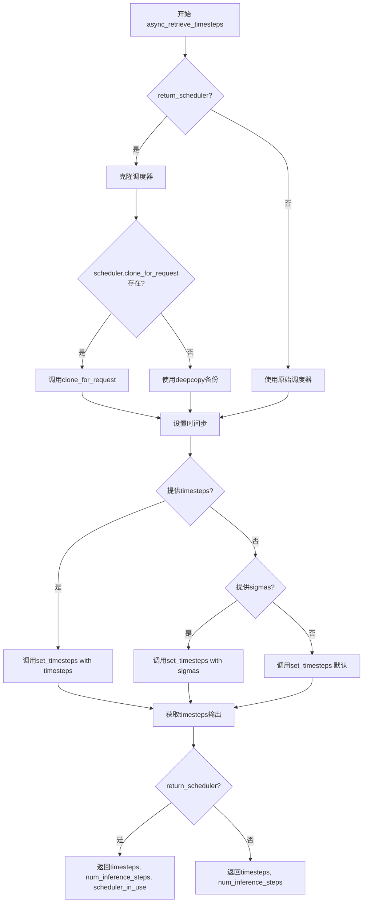
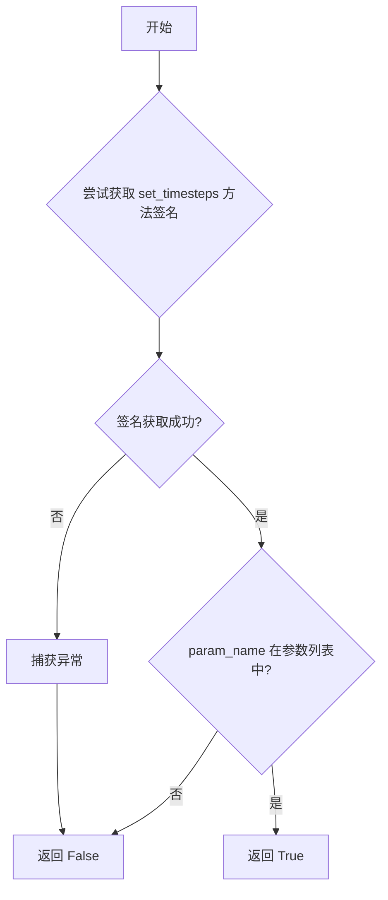
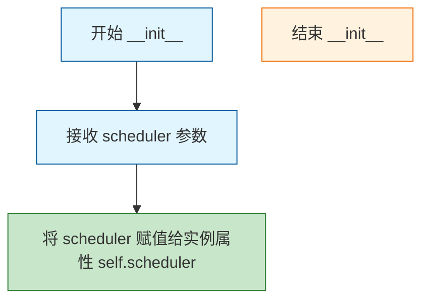
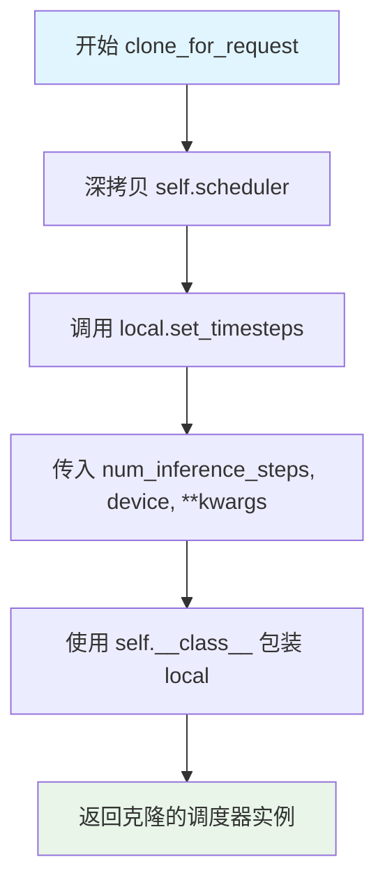

# `diffusers\examples\server-async\utils\scheduler.py` 详细设计文档

该代码实现了一个异步调度器包装类BaseAsyncScheduler，用于委托和克隆底层调度器，并提供了一个辅助函数async_retrieve_timesteps用于获取扩散模型推理过程中的时间步，支持自定义时间步和sigma值，同时保持向后兼容性。

## 整体流程



## 类结构

```
BaseAsyncScheduler (调度器包装类)
└── 委托底层scheduler属性和方法
```

## 全局变量及字段


### `copy`
    
Python标准库模块，用于深拷贝对象

类型：`module`
    


### `inspect`
    
Python标准库模块，用于检查活动对象和获取对象信息

类型：`module`
    


### `torch`
    
PyTorch深度学习库，提供张量运算和神经网络功能

类型：`module`
    


### `Any`
    
类型提示，表示任意类型

类型：`type hint`
    


### `List`
    
类型提示，表示列表类型

类型：`type hint`
    


### `Optional`
    
类型提示，表示可选类型

类型：`type hint`
    


### `Union`
    
类型提示，表示联合类型

类型：`type hint`
    


### `scheduler_in_use`
    
在async_retrieve_timesteps函数中使用的工作调度器实例，可能是原始调度器的克隆

类型：`Any`
    


### `BaseAsyncScheduler.scheduler`
    
被包装的底层调度器实例

类型：`Any`
    
    

## 全局函数及方法


### `async_retrieve_timesteps`

该函数是一个全局工具函数，用于调用调度器（Scheduler）的 `set_timesteps` 方法并从调度器中检索生成的时间步（timesteps）。它支持自定义时间步和sigma值，并通过可选的 `return_scheduler` 参数决定是否返回已设置时间步的调度器副本，以避免污染原始调度器状态。

参数：

- `scheduler`：`Any`，调度器对象（SchedulerMixin），用于获取时间步的来源。
- `num_inference_steps`：`Optional[int]`，生成样本时使用的扩散步数。如果使用此参数，`timesteps` 必须为 `None`。
- `device`：`Optional[Union[str, torch.device]]`，时间步要移动到的设备。如果为 `None`，则不移动时间步。
- `timesteps`：`Optional[List[int]]`，用于覆盖调度器时间步间隔策略的自定义时间步。如果传入此参数，`num_inference_steps` 和 `sigmas` 必须为 `None`。
- `sigmas`：`Optional[List[float]]`，用于覆盖调度器时间步间隔策略的自定义sigma值。如果传入此参数，`num_inference_steps` 和 `timesteps` 必须为 `None`。
- `**kwargs`：任意关键字参数，将传递给 `scheduler.set_timesteps` 方法。

返回值：`Tuple[Union[torch.Tensor, Any], int]` 或 `Tuple[Union[torch.Tensor, Any], int, Any]`，默认返回 (timesteps_tensor, num_inference_steps)；如果 `return_scheduler=True`，则返回 (timesteps_tensor, num_inference_steps, scheduler_in_use)。

#### 流程图

```mermaid
flowchart TD
    A[开始: async_retrieve_timesteps] --> B{提取 return_scheduler 参数}
    B --> C{检查 timesteps 和 sigmas 是否同时存在}
    C -->|是| D[抛出 ValueError: 只能指定一个]
    C -->|否| E{return_scheduler == True?}
    E -->|是| F{scheduler 是否有 clone_for_request 方法?}
    F -->|是| G[尝试调用 clone_for_request]
    G --> H{clone_for_request 成功?}
    H -->|是| I[使用克隆的调度器]
    H -->|否| J[使用 deepcopy 备用]
    F -->|否| J
    E -->|否| K[使用原始 scheduler]
    I --> L[调用 _accepts 检查 set_timesteps 支持的参数]
    J --> L
    K --> L
    L --> M{是否有自定义 timesteps?}
    M -->|是| N{set_timesteps 支持 timesteps?}
    N -->|否| O[抛出 ValueError: 不支持自定义时间步]
    N -->|是| P[调用 set_timesteps 并获取结果]
    M -->|否| Q{是否有自定义 sigmas?}
    Q -->|是| R{set_timesteps 支持 sigmas?}
    R -->|否| S[抛出 ValueError: 不支持自定义 sigma]
    R -->|是| P
    Q -->|否| T[调用默认 set_timesteps]
    P --> U[从调度器获取 timesteps]
    T --> U
    U --> V{return_scheduler == True?}
    V -->|是| W[返回 (timesteps, num_inference_steps, scheduler_in_use)]
    V -->|否| X[返回 (timesteps, num_inference_steps)]
    W --> Y[结束]
    X --> Y
```

#### 带注释源码

```python
def async_retrieve_timesteps(
    scheduler,
    num_inference_steps: Optional[int] = None,
    device: Optional[Union[str, torch.device]] = None,
    timesteps: Optional[List[int]] = None,
    sigmas: Optional[List[float]] = None,
    **kwargs,
):
    r"""
    Calls the scheduler's `set_timesteps` method and retrieves timesteps from the scheduler after the call.
    Handles custom timesteps. Any kwargs will be supplied to `scheduler.set_timesteps`.

    Backwards compatible: by default the function behaves exactly as before and returns
        (timesteps_tensor, num_inference_steps)

    If the caller passes `return_scheduler=True` in kwargs, the function will **not** mutate the passed
    scheduler. Instead it will use a cloned scheduler if available (via `scheduler.clone_for_request`)
    or a deepcopy fallback, call `set_timesteps` on that cloned scheduler, and return:
        (timesteps_tensor, num_inference_steps, scheduler_in_use)

    Args:
        scheduler (`SchedulerMixin`):
            The scheduler to get timesteps from.
        num_inference_steps (`int`):
            The number of diffusion steps used when generating samples with a pre-trained model. If used, `timesteps`
            must be `None`.
        device (`str` or `torch.device`, *optional*):
            The device to which the timesteps should be moved to. If `None`, the timesteps are not moved.
        timesteps (`List[int]`, *optional*):
            Custom timesteps used to override the timestep spacing strategy of the scheduler. If `timesteps` is passed,
            `num_inference_steps` and `sigmas` must be `None`.
        sigmas (`List[float]`, *optional*):
            Custom sigmas used to override the timestep spacing strategy of the scheduler. If `sigmas` is passed,
            `num_inference_steps` and `timesteps` must be `None`.

    Optional kwargs:
        return_scheduler (bool, default False): if True, return (timesteps, num_inference_steps, scheduler_in_use)
            where `scheduler_in_use` is a scheduler instance that already has timesteps set.
            This mode will prefer `scheduler.clone_for_request(...)` if available, to avoid mutating the original scheduler.

    Returns:
        `(timesteps_tensor, num_inference_steps)` by default (backwards compatible), or
        `(timesteps_tensor, num_inference_steps, scheduler_in_use)` if `return_scheduler=True`.
    """
    # pop our optional control kwarg (keeps compatibility)
    return_scheduler = bool(kwargs.pop("return_scheduler", False))

    # 验证参数互斥：timesteps 和 sigmas 不能同时指定
    if timesteps is not None and sigmas is not None:
        raise ValueError("Only one of `timesteps` or `sigmas` can be passed. Please choose one to set custom values")

    # choose scheduler to call set_timesteps on
    scheduler_in_use = scheduler
    # 如果需要返回调度器实例，则避免修改原始调度器
    if return_scheduler:
        # Do not mutate the provided scheduler: prefer to clone if possible
        # 优先使用 clone_for_request 方法克隆调度器（更高效）
        if hasattr(scheduler, "clone_for_request"):
            try:
                # clone_for_request may accept num_inference_steps or other kwargs; be permissive
                scheduler_in_use = scheduler.clone_for_request(
                    num_inference_steps=num_inference_steps or 0, device=device
                )
            except Exception:
                # 如果克隆失败，回退到 deepcopy
                scheduler_in_use = copy.deepcopy(scheduler)
        else:
            # fallback deepcopy (scheduler tends to be smallish - acceptable)
            scheduler_in_use = copy.deepcopy(scheduler)

    # helper to test if set_timesteps supports a particular kwarg
    # 通过 inspect 检查调度器的 set_timesteps 方法是否支持特定参数
    def _accepts(param_name: str) -> bool:
        try:
            return param_name in set(inspect.signature(scheduler_in_use.set_timesteps).parameters.keys())
        except (ValueError, TypeError):
            # if signature introspection fails, be permissive and attempt the call later
            return False

    # now call set_timesteps on the chosen scheduler_in_use (may be original or clone)
    # 根据传入的参数类型选择调用 set_timesteps 的方式
    if timesteps is not None:
        accepts_timesteps = _accepts("timesteps")
        if not accepts_timesteps:
            raise ValueError(
                f"The current scheduler class {scheduler_in_use.__class__}'s `set_timesteps` does not support custom"
                f" timestep schedules. Please check whether you are using the correct scheduler."
            )
        scheduler_in_use.set_timesteps(timesteps=timesteps, device=device, **kwargs)
        timesteps_out = scheduler_in_use.timesteps
        num_inference_steps = len(timesteps_out)
    elif sigmas is not None:
        accept_sigmas = _accepts("sigmas")
        if not accept_sigmas:
            raise ValueError(
                f"The current scheduler class {scheduler_in_use.__class__}'s `set_timesteps` does not support custom"
                f" sigmas schedules. Please check whether you are using the correct scheduler."
            )
        scheduler_in_use.set_timesteps(sigmas=sigmas, device=device, **kwargs)
        timesteps_out = scheduler_in_use.timesteps
        num_inference_steps = len(timesteps_out)
    else:
        # default path
        scheduler_in_use.set_timesteps(num_inference_steps, device=device, **kwargs)
        timesteps_out = scheduler_in_use.timesteps

    # 根据 return_scheduler 决定返回值格式（保持向后兼容）
    if return_scheduler:
        return timesteps_out, num_inference_steps, scheduler_in_use
    return timesteps_out, num_inference_steps
```


### `_accepts`

这是一个内部辅助函数，用于检查调度器的 `set_timesteps` 方法是否接受指定的参数名。它通过 introspect 模块检查方法的签名参数列表，如果签名检查失败则返回 False 以保持兼容性。

参数：

- `param_name`：`str`，需要检查的参数名称（例如 "timesteps" 或 "sigmas"）

返回值：`bool`，如果调度器的 `set_timesteps` 方法接受该参数返回 `True`，否则返回 `False`

#### 流程图



#### 带注释源码

```python
def _accepts(param_name: str) -> bool:
    r"""
    检查调度器的 set_timesteps 方法是否接受指定的参数名。
    
    Args:
        param_name (str): 需要检查的参数名称
        
    Returns:
        bool: 如果方法接受该参数返回 True，否则返回 False
    """
    try:
        # 使用 inspect.signature 获取 set_timesteps 方法的签名
        # 然后检查参数名是否在签名的参数列表中
        return param_name in set(inspect.signature(scheduler_in_use.set_timesteps).parameters.keys())
    except (ValueError, TypeError):
        # 如果签名内省失败（例如方法没有标准签名），返回 False
        # 这种宽容的处理方式允许后续直接尝试调用方法
        return False
```


### `BaseAsyncScheduler.__init__`

该方法是 `BaseAsyncScheduler` 类的构造函数，用于初始化异步调度器包装器，将传入的调度器对象存储为实例属性。

参数：

- `scheduler`：`Any`，要包装的调度器对象，可以是任何调度器实例

返回值：`None`，无返回值（构造函数）

#### 流程图



#### 带注释源码

```python
def __init__(self, scheduler: Any):
    """
    初始化 BaseAsyncScheduler 实例。
    
    参数:
        scheduler: 任意类型的调度器对象，将被包装以支持异步操作
    """
    self.scheduler = scheduler  # 将传入的调度器存储为实例属性
```

#### 类详细信息

**类名**: `BaseAsyncScheduler`

**类字段**:

- `scheduler`：`Any`，存储被包装的调度器实例

**类方法**:

- `__init__`：构造函数，初始化调度器包装器
- `__getattr__`：属性访问代理，将属性请求转发给被包装的调度器
- `__setattr__`：属性设置代理，支持直接设置调度器的属性
- `clone_for_request`：创建调度器的深拷贝并设置推理步数
- `__repr__`：返回类的字符串表示
- `__str__`：返回类的描述字符串

#### 关键组件信息

| 组件名称 | 一句话描述 |
|---------|-----------|
| scheduler | 被包装的原始调度器对象，通过代理模式暴露其属性和方法 |
| 代理模式 | 通过 `__getattr__` 和 `__setattr__` 实现对调度器属性和方法的透明访问 |

#### 潜在技术债务或优化空间

1. **类型提示不够精确**：`scheduler: Any` 可以改为更具体的类型，如 `SchedulerMixin`，以提供更好的类型检查和 IDE 支持
2. **缺少验证逻辑**：构造函数没有验证 `scheduler` 参数是否为有效对象，可能导致后续调用时出现隐藏的错误
3. **文档不完整**：类的整体文档字符串缺失，难以理解其设计目的和使用场景

#### 其它项目

**设计目标与约束**：
- 该类作为调度器的异步包装器，通过代理模式透明地暴露底层调度器的所有属性和方法
- 支持在不影响原始调度器的情况下创建带有所需推理步数的调度器副本

**错误处理与异常设计**：
- `__getattr__` 方法在调度器没有对应属性时抛出 `AttributeError`
- `__setattr__` 方法在尝试设置不存在的属性时会调用父类方法，可能导致后续访问时的混淆

**数据流与状态机**：
- 该类本身不维护状态机，其行为完全依赖于被包装的调度器
- 状态变更通过转发到底层调度器来实现

**外部依赖与接口契约**：
- 依赖 `copy` 模块进行深拷贝操作
- 假设底层调度器具有 `set_timesteps` 方法和 `timesteps` 属性
- 可选的 `clone_for_request` 方法用于创建非mutation的调度器副本


### `BaseAsyncScheduler.__getattr__`

该方法是一个属性访问拦截器（Python 魔术方法），用于实现代理模式。当访问 `BaseAsyncScheduler` 实例上不存在的属性时，会自动转发到内部持有的 `scheduler` 对象上。如果 `scheduler` 也没有该属性，则抛出 `AttributeError` 异常。

参数：

- `name`：`str`，被访问的属性名称

返回值：`Any`，如果 `scheduler` 对象存在该属性，则返回该属性的值；否则抛出 `AttributeError` 异常。

#### 流程图

```mermaid
flowchart TD
    A[Start __getattr__] --> B{hasattr<br/>self.scheduler<br/>name?}
    B -->|Yes| C[return getattr<br/>self.scheduler<br/>name]
    B -->|No| D[raise AttributeError<br/>f"'{self.__class__.__name__}'<br/>object has no attribute<br/>'{name}'"]
    C --> E[End]
    D --> E
```

#### 带注释源码

```python
def __getattr__(self, name: str):
    """
    属性访问拦截器，实现代理转发机制。
    
    当访问 BaseAsyncScheduler 实例上不存在的属性时，
    自动转发到内部的 scheduler 对象上。
    
    参数:
        name: str - 被访问的属性名称
        
    返回:
        Any - scheduler 对象的对应属性值
        
    异常:
        AttributeError - 当 scheduler 对象也不存在该属性时抛出
    """
    # 第一步：检查内部持有的 scheduler 对象是否具有该属性
    if hasattr(self.scheduler, name):
        # 如果 scheduler 有该属性，则通过 getattr 获取并返回
        # 这里实现了属性代理转发功能
        return getattr(self.scheduler, name)
    
    # 第二步：如果 scheduler 也没有该属性，则抛出 AttributeError
    # 提供清晰的错误信息，包含类名和属性名，便于调试
    raise AttributeError(f"'{self.__class__.__name__}' object has no attribute '{name}'")
```


### BaseAsyncScheduler.__setattr__

这是一个属性设置的特殊方法（Python 魔术方法），实现了属性委托机制。当设置非 `scheduler` 属性时，它会优先将属性设置到底层的 `scheduler` 对象上，如果 `scheduler` 不存在该属性，则设置到当前对象本身。

参数：

- `self`：`BaseAsyncScheduler`，调用该方法的实例对象
- `name`：`str`，要设置的属性名称
- `value`：任意类型，要设置的值

返回值：`None`，该方法无返回值（Python 的 `__setattr__` 方法应返回 None）

#### 流程图

```mermaid
flowchart TD
    A[开始 __setattr__] --> B{name == 'scheduler'?}
    B -->|是| C[调用 super().__setattr__ 设置属性]
    C --> D[结束]
    B -->|否| E{self 是否有 scheduler 属性?}
    E -->|否| F[调用 super().__setattr__ 设置属性]
    F --> D
    E -->|是| G{self.scheduler 是否有 name 属性?}
    G -->|是| H[setattr self.scheduler name value]
    G -->|否| F
    H --> D
```

#### 带注释源码

```python
def __setattr__(self, name: str, value):
    """
    自定义属性设置方法，实现属性委托机制。
    
    当设置 'scheduler' 属性时，直接设置到当前对象；
    当设置其他属性时，优先委托给底层的 scheduler 对象。
    
    参数:
        name: str, 要设置的属性名称
        value: 任意类型, 要设置的属性值
        
    返回:
        None
    """
    # 判断是否在设置 scheduler 特殊属性
    if name == "scheduler":
        # scheduler 属性需要直接设置在当前对象上，调用父类方法
        super().__setattr__(name, value)
    else:
        # 非 scheduler 属性的设置逻辑
        # 首先检查当前对象是否已有 scheduler 属性
        if hasattr(self, "scheduler") and hasattr(self.scheduler, name):
            # 如果 scheduler 对象拥有该属性，委托给 scheduler 对象设置
            setattr(self.scheduler, name, value)
        else:
            # 否则，设置到当前 BaseAsyncScheduler 对象本身
            super().__setattr__(name, value)
```


### `BaseAsyncScheduler.clone_for_request`

该方法实现了一个调度器克隆功能，通过深拷贝当前调度器并针对特定推理请求重新配置时间步，生成一个独立的调度器实例，避免对原始调度器状态的修改。

参数：

- `self`：隐式参数，`BaseAsyncScheduler` 实例，当前调度器对象的引用
- `num_inference_steps`：`int`，推理过程中使用的扩散步数，用于配置调度器的时间步
- `device`：`Union[str, torch.device, None]`，计算设备标识，指定时间步张量存放的设备，可选参数，默认为 `None`
- `**kwargs`：可变关键字参数，其他传递给 `set_timesteps` 的额外参数

返回值：`BaseAsyncScheduler`（具体类型为 `self.__class__`），返回一个新的调度器实例，该实例已针对指定的推理步数和设备进行了配置

#### 流程图



#### 带注释源码

```python
def clone_for_request(self, num_inference_steps: int, device: Union[str, torch.device, None] = None, **kwargs):
    """
    为当前推理请求克隆一个配置好的调度器实例
    
    该方法实现了非侵入式的调度器配置，避免直接修改原始调度器对象。
    通过深拷贝创建独立副本，确保多线程或多请求场景下的线程安全性。
    
    参数:
        num_inference_steps: 推理阶段的扩散步数，决定时间序列的密度
        device: 计算设备，用于放置时间步张量，支持 CPU/CUDA
        **kwargs: 其他传递给 set_timesteps 的配置参数
    
    返回:
        新的调度器实例，已完成时间步配置，可直接用于推理
    """
    # Step 1: 深拷贝原始调度器，确保状态隔离
    local = copy.deepcopy(self.scheduler)
    
    # Step 2: 在副本上配置时间步，传入推理参数
    # 这里会修改 local 的内部状态（如 timesteps、sigma 等）
    local.set_timesteps(num_inference_steps=num_inference_steps, device=device, **kwargs)
    
    # Step 3: 使用相同的类构造器创建新的包装器实例
    # self.__class__ 支持子类继承时的多态行为
    cloned = self.__class__(local)
    
    # Step 4: 返回配置完成的克隆调度器
    return cloned
```


### `BaseAsyncScheduler.__repr__`

该方法是一个魔术方法，用于返回 `BaseAsyncScheduler` 实例的官方字符串表示形式。它通过调用底层 `scheduler` 对象的 `repr` 来构造一个包含类名和被包装调度器信息的字符串，以便于调试和日志输出。

参数： 无显式参数（`self` 为隐式参数，表示实例本身）

返回值：`str`，返回该对象的官方字符串表示形式，格式为 `BaseAsyncScheduler(...)`，其中 `...` 是被包装调度器的 repr 表示。

#### 流程图

```mermaid
flowchart TD
    A[开始 __repr__] --> B{执行 repr}
    B --> C[获取 self.scheduler 的 repr]
    C --> D[格式化字符串: BaseAsyncScheduler(...)]
    D --> E[返回字符串]
```

#### 带注释源码

```python
def __repr__(self):
    """
    返回对象的官方字符串表示形式。
    
    该方法被 Python 内置函数 repr() 调用，用于生成一个可读性良好的
    字符串描述，便于调试、日志输出和交互式环境查看对象信息。
    
    Returns:
        str: 格式为 'BaseAsyncScheduler(...)' 的字符串，其中 ... 
             是被包装的 scheduler 对象的 repr 表示。
    """
    return f"BaseAsyncScheduler({repr(self.scheduler)})"
```


### BaseAsyncScheduler.__str__

该方法是Python的特殊方法（双下划线方法），用于返回BaseAsyncScheduler对象的可读字符串表示，便于调试和日志输出。

参数：

- `self`：`BaseAsyncScheduler` 实例，调用该方法的对象本身

返回值：`str`，返回对象的字符串描述，格式为"BaseAsyncScheduler wrapping: {scheduler的字符串表示}"

#### 流程图

```mermaid
flowchart TD
    A[开始 __str__] --> B[获取 self.scheduler 的字符串表示]
    B --> C[拼接字符串: 'BaseAsyncScheduler wrapping: ' + str(self.scheduler)]
    C --> D[返回拼接后的字符串]
    D --> E[结束]
```

#### 带注释源码

```python
def __str__(self):
    """
    返回BaseAsyncScheduler对象的字符串表示形式。
    
    该方法是Python的特殊方法（dunder method），当使用str()函数
    或print()函数打印对象时自动调用。
    
    Returns:
        str: 格式为 'BaseAsyncScheduler wrapping: {scheduler的字符串表示}' 的字符串
    """
    # 使用f-string格式化字符串
    # 1. self.scheduler 获取被包装的scheduler对象
    # 2. str(self.scheduler) 调用scheduler的__str__方法获取其字符串表示
    # 3. 拼接前缀 "BaseAsyncScheduler wrapping: " 和scheduler的表示
    return f"BaseAsyncScheduler wrapping: {str(self.scheduler)}"
```

## 关键组件


### BaseAsyncScheduler

代理调度器基类，通过装饰器模式透明转发对底层调度器的属性访问和方法调用，支持调度器克隆以实现无状态请求处理。

### async_retrieve_timesteps

全局函数，负责调用调度器的set_timesteps方法并检索时间步，支持自定义时间步和sigmas，提供可选的调度器克隆返回模式以避免突变原始调度器。

### 代理模式实现

通过__getattr__和__setattr__方法实现属性透明转发，当访问的属性不存在于当前对象时，自动代理到scheduler属性，支持链式调用和接口透传。

### 调度器克隆机制

clone_for_request方法使用深拷贝创建调度器副本，调用set_timesteps后返回新实例，实现无状态的推理步骤配置，避免多请求间的状态污染。

### 时间步/自定义支持

支持通过timesteps或sigmas参数自定义调度器的时间步计划，内置参数检查_accepts确保调度器set_timesteps方法支持所请求的参数类型。

### 返回调度器模式

通过return_scheduler=True参数启用，优先使用clone_for_request方法创建调度器副本，在返回时间步的同时返回已配置好的调度器实例，便于调用方直接使用。

### 参数兼容性检查

使用inspect.signature进行运行时参数检查，判断调度器的set_timesteps方法是否接受timesteps或sigmas参数，确保不同调度器实现的兼容性。

### 错误处理设计

对缺失属性抛出AttributeError，对不支持的自定义参数抛出ValueError，对签名内省失败时采取宽容策略允许后续调用尝试。


## 问题及建议


### 已知问题

-   **`__setattr__` 逻辑存在潜在缺陷**：在 `__setattr__` 中使用 `hasattr(self, "scheduler")` 检查时，如果 `scheduler` 属性尚未设置（仅在 `super().__setattr__` 调用前），检查会返回 False，导致属性被错误地设置到自身而非委托给内部 scheduler
-   **异常捕获过于宽泛**：`clone_for_request` 方法中使用 `except Exception` 捕获所有异常，这可能隐藏真正的编程错误（如 `clone_for_request` 方法签名错误），且 fallback 到 deepcopy 的行为没有日志记录
-   **类型注解不完整**：`async_retrieve_timesteps` 函数的 `scheduler` 参数缺少类型注解，返回值类型也未明确标注，降低了代码的可维护性和 IDE 支持
-   **`inspect.signature` 可能失效**：`_accepts` 辅助函数使用 `inspect.signature` 检查参数，当调度器的 `set_timesteps` 方法是动态生成或使用 `*args/**kwargs` 时，签名检查可能不准确
-   **深拷贝的潜在性能问题**：在 `return_scheduler=True` 时会执行 `copy.deepcopy(scheduler)`，对于复杂的调度器对象可能产生显著的性能开销，且没有缓存机制
-   **默认值选择可能不当**：`clone_for_request` 调用时使用 `num_inference_steps or 0`，当用户明确传入 0 时会被误判，且传递 `num_inference_steps=0` 可能导致调度器行为异常

### 优化建议

-   **改进属性委托机制**：使用 `__getattr__` 和 `__setattr__` 时添加更完善的逻辑，或考虑使用 `composition over inheritance` 模式，明确代理接口而非动态委托
-   **细化异常处理**：为 `clone_for_request` 中的异常捕获添加日志记录，并考虑区分不同类型的异常（如 TypeError vs 其他），对可预期的异常进行特定处理
-   **完善类型注解**：为 `scheduler` 参数添加 `SchedulerMixin` 或更具体的类型，为返回值添加 Tuple 类型注解，提升代码可读性和静态检查能力
-   **优化深拷贝策略**：可考虑实现调度器的缓存池或使用浅拷贝 + 状态重置的策略，避免每次调用都进行深拷贝
-   **改进参数传递**：在调用 `clone_for_request` 前检查其签名，或使用 `**kwargs` 传递所有额外参数，提高函数的灵活性
-   **添加文档和日志**：在关键分支（如 fallback deepcopy）添加日志记录，便于生产环境调试和问题追踪

## 其它


### 设计目标与约束

本模块的设计目标是提供一个异步调度器封装类以及时间步检索功能，用于支持扩散模型的推理过程。主要约束包括：1) 保持与现有调度器的向后兼容性；2) 支持自定义时间步和sigmas；3) 提供非 mutate 模式以支持并发请求；4) 最小化对原调度器对象的修改。

### 错误处理与异常设计

代码中的错误处理主要包括：1) `__getattr__` 方法在属性不存在时抛出 `AttributeError`；2) `async_retrieve_timesteps` 函数在同时传入 `timesteps` 和 `sigmas` 时抛出 `ValueError`；3) 当调度器的 `set_timesteps` 不支持自定义参数时抛出 `ValueError` 并提供明确的错误信息；4) `clone_for_request` 调用失败时使用 deepcopy 作为回退方案。建议增加更细粒度的异常类型定义，以及对无效设备类型的校验。

### 数据流与状态机

数据流如下：调用方传入调度器、推理步数、时间步或sigmas参数 → `async_retrieve_timesteps` 函数根据 `return_scheduler` 参数决定是否克隆调度器 → 调用 `set_timesteps` 配置时间步 → 返回时间步张量、推理步数和可选的调度器实例。状态转换包括：原始调度器 → 克隆调度器（可选）→ 配置完成的调度器。

### 外部依赖与接口契约

主要外部依赖包括：1) `torch` - 用于设备管理和张量操作；2) `inspect` - 用于方法签名 introspection；3) `copy` - 用于深拷贝；4) 被封装的调度器对象（需实现 `set_timesteps` 方法和 `timesteps` 属性）。接口契约要求调度器必须实现 `set_timesteps` 方法，可选实现 `clone_for_request` 方法以支持更高效的克隆。

### 性能考虑

性能关键点包括：1) 深拷贝操作可能带来性能开销，尤其是在高频调用场景下；2) `inspect.signature` 在每次调用都会执行，建议缓存签名结果；3) `return_scheduler=True` 模式通过避免原调度器 mutation 来支持并发，但会增加内存占用。建议对克隆策略进行性能测试，并根据实际场景选择合适的模式。

### 安全性考虑

当前代码安全性较好，主要依赖点包括：1) `__setattr__` 方法通过检查 `scheduler` 属性存在性来防止未授权的属性设置；2) 设备参数传递遵循 PyTorch 安全实践。建议增加对恶意调度器对象的校验，防止通过调度器执行代码注入攻击。

### 测试策略建议

建议添加以下测试用例：1) 基本功能测试 - 验证时间步检索的正确性；2) 兼容性测试 - 测试不同调度器实现；3) 并发测试 - 验证 `return_scheduler=True` 模式下的线程安全性；4) 异常测试 - 验证各类错误场景；5) 性能基准测试 - 评估深拷贝性能影响。

### 配置与扩展性

模块设计支持多种调度器类型，通过 duck typing 实现兼容性。扩展建议：1) 可添加调度器注册机制以支持更多调度器类型；2) 可增加缓存机制以存储常用配置；3) 可添加钩子函数以支持自定义预处理/后处理逻辑。


    