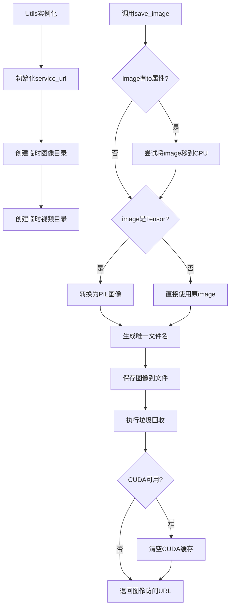
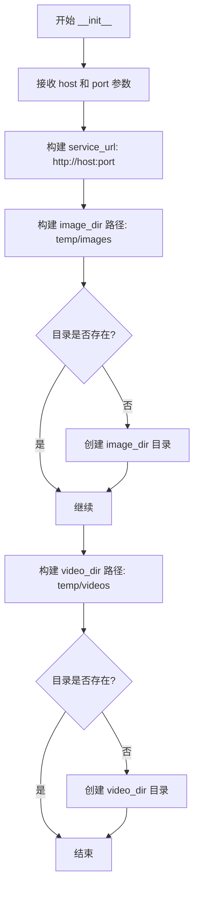
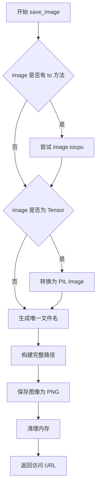
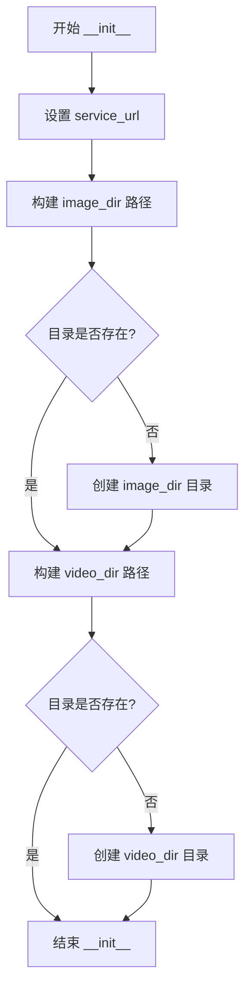

# `diffusers\examples\server-async\utils\utils.py` 详细设计文档

该代码实现了一个工具类Utils，用于管理图像和视频的临时存储服务，提供图像保存功能，支持将PyTorch张量转换为PIL图像并保存到临时目录，同时自动清理内存资源。

## 整体流程



## 类结构

```
Utils (工具类)
    ├── __init__ (初始化方法)
    └── save_image (图像保存方法)
```

## 全局变量及字段


### `logger`
    
模块级日志记录器

类型：`logging.Logger`
    


### `gc`
    
Python垃圾回收模块

类型：`module`
    


### `logging`
    
Python日志模块

类型：`module`
    


### `os`
    
Python操作系统接口模块

类型：`module`
    


### `tempfile`
    
Python临时文件模块

类型：`module`
    


### `uuid`
    
Python UUID生成模块

类型：`module`
    


### `torch`
    
PyTorch深度学习框架模块

类型：`module`
    


### `Utils.service_url`
    
服务访问基础URL

类型：`str`
    


### `Utils.image_dir`
    
临时图像存储目录路径

类型：`str`
    


### `Utils.video_dir`
    
临时视频存储目录路径

类型：`str`
    
    

## 全局函数及方法


### `Utils.__init__`

该方法是 `Utils` 类的构造函数，用于初始化服务 URL（由主机地址和端口组成）以及用于存放图像和视频的临时目录。如果指定的目录不存在，则会自动创建相应的目录结构。

参数：

- `host`：`str`，可选参数，默认为 "0.0.0.0"，指定服务绑定的 IP 地址或主机名
- `port`：`int`，可选参数，默认为 8500，指定服务监听的端口号

返回值：`None`，构造函数不返回任何值，仅初始化实例属性

#### 流程图



#### 带注释源码

```python
def __init__(self, host: str = "0.0.0.0", port: int = 8500):
    # 根据传入的 host 和 port 构造完整的服务 URL
    # 格式: http://{host}:{port}
    self.service_url = f"http://{host}:{port}"
    
    # 构建图像存储目录路径，默认为系统临时目录下的 'images' 子目录
    self.image_dir = os.path.join(tempfile.gettempdir(), "images")
    # 检查图像目录是否存在，如不存在则创建（包含父目录）
    if not os.path.exists(self.image_dir):
        os.makedirs(self.image_dir)

    # 构建视频存储目录路径，默认为系统临时目录下的 'videos' 子目录
    self.video_dir = os.path.join(tempfile.gettempdir(), "videos")
    # 检查视频目录是否存在，如不存在则创建（包含父目录）
    if not os.path.exists(self.video_dir):
        os.makedirs(self.video_dir)
```


### `Utils.save_image`

将图像保存到临时目录并返回可访问的URL，支持 torch.Tensor 和 PIL Image 两种输入格式，自动处理设备转换和内存清理。

参数：

- `image`：`Union[torch.Tensor, Image.Image, Any]`，待保存的图像数据，支持 torch.Tensor（自动转换为 PIL Image）、PIL Image 或具有 `.to()` 方法的对象

返回值：`str`，图像的访问 URL，格式为 `http://{host}:{port}/images/{filename}`

#### 流程图



#### 带注释源码

```python
def save_image(self, image):
    """
    将图像保存到临时目录并返回访问URL
    
    参数:
        image: 支持 torch.Tensor、PIL Image 或具有 .to() 方法的对象
    
    返回:
        str: 图像的访问URL
    """
    # Step 1: 处理具有 .to() 方法的对象（可能是 PyTorch 模型或张量）
    if hasattr(image, "to"):
        try:
            # 尝试将数据转移到 CPU，避免 GPU 内存占用
            image = image.to("cpu")
        except Exception:
            # 忽略转换失败的情况
            pass

    # Step 2: 判断是否为 PyTorch 张量若是则转换为 PIL Image
    if isinstance(image, torch.Tensor):
        # 延迟导入 torchvision 转换工具
        from torchvision import transforms

        # 创建 ToPILImage 转换器
        to_pil = transforms.ToPILImage()
        # squeeze(0) 移除批次维度，clamp(0,1) 确保像素值在有效范围内
        image = to_pil(image.squeeze(0).clamp(0, 1))

    # Step 3: 生成唯一文件名
    # 使用 UUID 短格式确保文件名唯一
    filename = "img" + str(uuid.uuid4()).split("-")[0] + ".png"
    
    # 拼接完整保存路径
    image_path = os.path.join(self.image_dir, filename)
    logger.info(f"Saving image to {image_path}")

    # Step 4: 保存图像为 PNG 格式
    image.save(image_path, format="PNG", optimize=True)

    # Step 5: 内存清理
    del image           # 删除图像对象引用
    gc.collect()        # 强制垃圾回收
    
    # 如果使用 CUDA，清空 GPU 缓存
    if torch.cuda.is_available():
        torch.cuda.empty_cache()

    # Step 6: 返回可访问的 URL
    return os.path.join(self.service_url, "images", filename)
```


### `Utils.__init__`

初始化 Utils 类的实例，设置服务 URL 并创建用于保存图像和视频的临时目录。

参数：

- `host`：`str`，服务主机地址，默认为 "0.0.0.0"
- `port`：`int`，服务端口号，默认为 8500

返回值：`None`，无返回值（`__init__` 方法用于初始化实例状态）

#### 流程图



#### 带注释源码

```python
def __init__(self, host: str = "0.0.0.0", port: int = 8500):
    # 初始化服务 URL，格式为 http://host:port
    self.service_url = f"http://{host}:{port}"
    
    # 构建临时图像目录路径：系统临时目录/images
    self.image_dir = os.path.join(tempfile.gettempdir(), "images")
    # 如果图像目录不存在，则创建该目录
    if not os.path.exists(self.image_dir):
        os.makedirs(self.image_dir)

    # 构建临时视频目录路径：系统临时目录/videos
    self.video_dir = os.path.join(tempfile.gettempdir(), "videos")
    # 如果视频目录不存在，则创建该目录
    if not os.path.exists(self.video_dir):
        os.makedirs(self.video_dir)
```


### `Utils.save_image`

该方法负责将图像保存到服务器的临时目录中，支持 torch.Tensor 和 PIL Image 两种输入格式，自动处理设备转换和内存清理，最终返回可访问的图像 URL。

参数：

- `image`：`torch.Tensor` 或 `PIL.Image.Image` 或具有 `to` 方法的对象，要保存的图像数据

返回值：`str`，保存后的图像访问 URL，格式为 `http://{host}:{port}/images/{filename}.png`

#### 流程图

```mermaid
flowchart TD
    A[开始 save_image] --> B{image 是否有 to 属性}
    B -->|是| C[尝试调用 image.to CPU]
    B -->|否| D{image 是否为 torch.Tensor}
    C --> D
    D -->|是| E[导入 transforms]
    E --> F[ToPILImage 转为 PIL Image]
    F --> G[Tensor squeeze 和 clamp 处理]
    D -->|否| H[直接使用原始 image]
    G --> H
    H --> I[生成唯一文件名 img{uuid}.png]
    I --> J[构建完整保存路径]
    J --> K[image.save PNG 格式]
    K --> L[del image 释放对象]
    L --> M[gc.collect 垃圾回收]
    M --> N{cuda.is_available?}
    N -->|是| O[torch.cuda.empty_cache]
    N -->|否| P[返回 service_url/images/filename]
    O --> P
```

#### 带注释源码

```python
def save_image(self, image):
    """
    保存图像到临时目录并返回可访问的 URL 路径
    
    参数:
        image: 支持 torch.Tensor、PIL.Image 或具有 to 方法的对象
    """
    # 步骤1: 处理具有 to 方法的对象（如 torch.Tensor），尝试移至 CPU
    if hasattr(image, "to"):
        try:
            image = image.to("cpu")
        except Exception:
            pass  # 转换失败时保留原对象

    # 步骤2: 如果是 torch.Tensor，转换为 PIL Image
    if isinstance(image, torch.Tensor):
        from torchvision import transforms
        # 获取转换函数
        to_pil = transforms.ToPILImage()
        # Tensor 形状处理: squeeze(0) 移除批次维度, clamp(0,1) 限制值域
        image = to_pil(image.squeeze(0).clamp(0, 1))

    # 步骤3: 生成唯一文件名，使用 UUID 前8位
    filename = "img" + str(uuid.uuid4()).split("-")[0] + ".png"
    
    # 步骤4: 拼接完整保存路径
    image_path = os.path.join(self.image_dir, filename)
    logger.info(f"Saving image to {image_path}")

    # 步骤5: 保存图像为 PNG 格式并优化
    image.save(image_path, format="PNG", optimize=True)

    # 步骤6: 手动释放图像对象内存
    del image
    gc.collect()
    
    # 步骤7: 如果使用 CUDA，清空缓存
    if torch.cuda.is_available():
        torch.cuda.empty_cache()

    # 步骤8: 返回图像的服务访问 URL
    return os.path.join(self.service_url, "images", filename)
```

## 关键组件


### 张量索引操作

使用 `image.squeeze(0)` 对张量进行索引操作，移除批次维度以便转换为PIL图像。squeeze操作将形状为[1, H, W]的张量转换为[H, W]，这是图像处理中常见的维度压缩操作。

### 惰性加载与即时转换

通过 `hasattr(image, "to")` 检测输入是否为张量，实现惰性加载判断。转换逻辑在需要时才执行，避免不必要的类型检查开销。

### 反量化与数值范围约束

使用 `clamp(0, 1)` 对张量数值进行约束，确保像素值在[0, 1]范围内。这相当于反量化操作，将可能超出范围的浮点数值裁剪到合法区间，防止图像显示异常。

### 图像格式转换管道

集成torchvision的ToPILImage转换器，实现Tensor到PIL Image的自动转换。该管道处理了张量维度重组、数值范围归一化等多个预处理步骤。

### 临时文件目录管理

通过tempfile.gettempdir()获取系统临时目录，分别创建images和videos子目录。采用os.makedirs确保目录存在，提供了隔离的存储空间。

### GPU内存管理机制

在图像保存后调用gc.collect()和torch.cuda.empty_cache()释放GPU内存。条件判断`torch.cuda.is_available()`确保只在CUDA可用时执行内存清理，避免环境兼容问题。

### 日志记录与调试支持

使用logging模块记录图像保存路径，提供可追溯的操作历史。日志级别为INFO，便于生产环境监控和问题排查。

### 图像保存优化

使用PIL的optimize=True参数启用PNG格式优化，可减少输出文件大小。同时通过uuid生成唯一文件名，避免文件名冲突。


## 问题及建议


### 已知问题

-   **未使用的实例变量**：`video_dir` 在 `__init__` 中被创建但从未被使用，造成资源浪费和代码冗余
-   **异常处理过于宽泛**：`save_image` 方法中使用 `except Exception: pass` 会隐藏真正的错误，导致调试困难
-   **类型提示缺失**：`save_image` 方法的参数和返回值都缺少类型注解，影响代码可读性和 IDE 辅助功能
-   **资源清理逻辑不严谨**：显式调用 `gc.collect()` 和 `torch.cuda.empty_cache()` 的策略缺乏针对性，每次保存图像都执行清理可能影响性能
-   **路径安全风险**：直接使用 `os.path.join` 拼接路径，未对 `image` 参数进行安全校验，可能存在路径遍历风险
-   **重复目录检查**：`image_dir` 和 `video_dir` 的创建逻辑重复，可提取为私有方法

### 优化建议

-   移除未使用的 `video_dir` 属性，或在类文档中明确说明其为预留功能
-   为 `save_image` 方法添加类型提示：`save_image(self, image: torch.Tensor) -> str`，并在参数文档中说明接受的图像格式
-   改进异常处理，针对具体异常类型进行捕获（如 `RuntimeError`, `IOError`），并记录详细的错误日志而非静默忽略
-   仅在必要时执行 GPU 缓存清理，可通过参数控制是否执行清理操作，避免不必要的性能开销
-   添加输入验证逻辑，检查图像类型和尺寸，确保传入的 `image` 是有效的 PyTorch Tensor
-   将目录创建逻辑抽取为私有方法 `_ensure_directory(path: str)`，提高代码复用性和可维护性
-   考虑使用 `pathlib.Path` 替代 `os.path` 提供更现代化的路径操作 API


## 其它


### 设计目标与约束

**设计目标**：
1. 提供统一的图像保存接口，支持PyTorch张量和PIL Image两种输入格式
2. 自动处理设备转换（GPU到CPU）和数据类型转换（Tensor到PIL Image）
3. 生成唯一文件名避免冲突，通过HTTP URL返回访问路径
4. 妥善管理内存和GPU缓存资源

**设计约束**：
1. 图像必须保存到系统临时目录（tempfile.gettempdir()）
2. 仅支持PNG格式保存
3. 仅支持图像保存，不支持视频（video_dir已创建但未使用）
4. 依赖PyTorch和torchvision库

### 错误处理与异常设计

**异常处理策略**：
1. **图像设备转换异常**：在`image.to("cpu")`调用时使用try-except捕获异常，异常时静默忽略继续处理
2. **目录创建异常**：使用`os.makedirs`创建目录时未显式处理异常，可能在并发场景下出现竞态条件
3. **图像保存异常**：调用`image.save()`时未捕获异常，保存失败将直接抛出

**当前缺陷**：
- `save_image`方法缺少对输入参数的类型校验
- 未处理图像尺寸不符合要求的情况
- 未处理磁盘空间不足的场景
- 未处理图像模式不支持的情况（如二值图像、RGBA图像）

### 数据流与状态机

**数据输入流**：
```
输入图像（Tensor或PIL Image）
    ↓
设备转换（GPU→CPU）←有异常捕获
    ↓
类型转换（Tensor→PIL Image）←仅当Tensor时执行
    ↓
生成唯一文件名（UUID）
    ↓
保存到磁盘（PNG格式）
    ↓
资源清理（gc、cuda.empty_cache）
    ↓
返回HTTP URL
```

**状态说明**：
1. 初始化状态：创建临时目录，设置服务URL
2. 就绪状态：对象已准备好接受图像保存请求
3. 处理状态：正在执行图像转换和保存
4. 完成状态：图像已保存，资源已清理，返回URL或抛出异常

### 外部依赖与接口契约

**核心依赖**：
| 依赖包 | 版本要求 | 用途 |
|--------|----------|------|
| torch | 任意版本 | 张量处理、GPU检测 |
| torchvision | 任意版本 | 图像转换 transforms.ToPILImage |
| Python标准库 | 3.x | os, tempfile, uuid, logging, gc |

**接口契约**：
| 接口 | 输入 | 输出 | 异常 |
|------|------|------|------|
| `__init__(host, port)` | host: str, port: int | None | 无 |
| `save_image(image)` | image: Tensor或PIL Image | str (HTTP URL) | 可能在save时抛出 |

### 性能考量与资源管理

**内存管理**：
1. 显式调用`del image`释放图像对象引用
2. 调用`gc.collect()`强制垃圾回收
3. 当CUDA可用时调用`torch.cuda.empty_cache()`释放GPU缓存

**性能瓶颈**：
1. 每次保存都创建新的UUID，可能影响高频调用性能
2. 未使用连接池或批量处理机制
3. 图像压缩使用`optimize=True`会增加处理时间

### 安全性考虑

1. **路径遍历风险**：文件名使用UUID生成，相对安全
2. **信息泄露**：日志中记录完整路径，可能泄露服务器目录结构
3. **临时文件清理**：未实现自动清理机制，临时目录会持续膨胀

### 测试建议

1. **单元测试**：测试Tensor输入、PIL Image输入、异常输入
2. **边界测试**：测试空图像、超大图像、无效格式
3. **并发测试**：测试多线程同时保存
4. **资源测试**：测试磁盘满、权限不足等场景
5. **性能测试**：测试高频调用下的吞吐量和延迟

### 部署与运维建议

1. **配置管理**：host和port应支持环境变量或配置文件注入
2. **日志级别**：建议在生产环境调整日志级别为WARNING
3. **监控指标**：建议添加图像保存成功率、耗时、临时目录使用量等指标
4. **容量规划**：评估每日图像生成量，合理设置临时目录清理策略


    