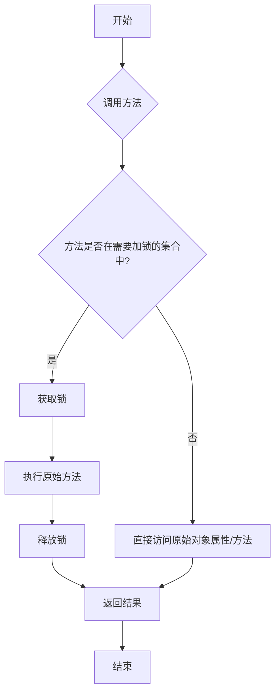
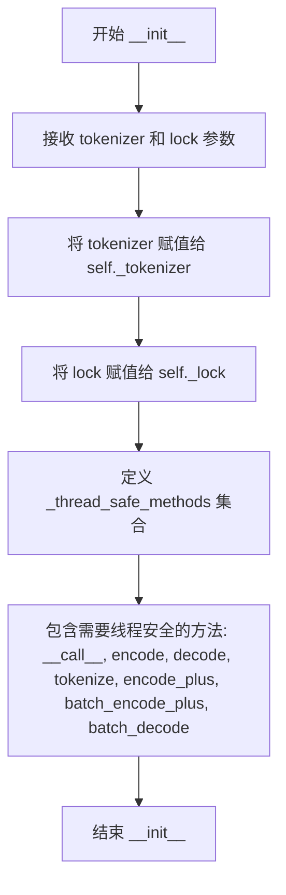
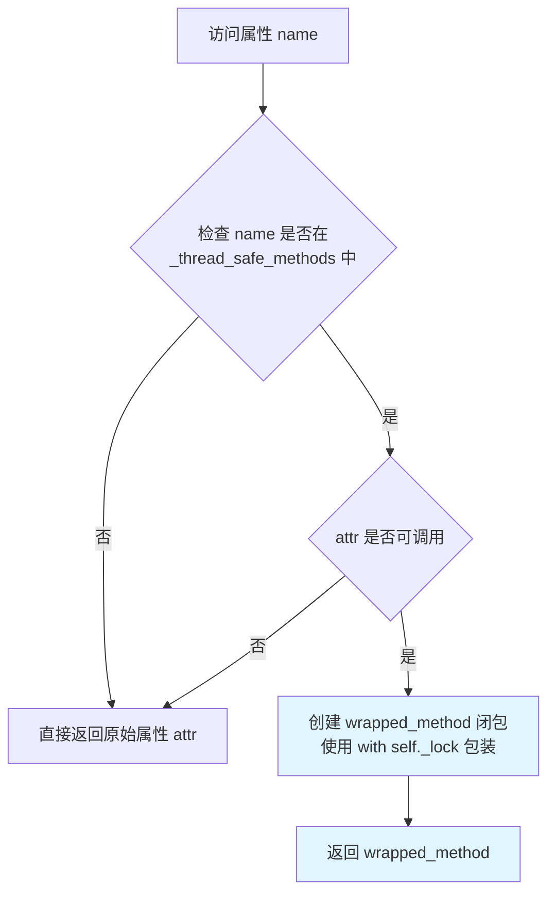
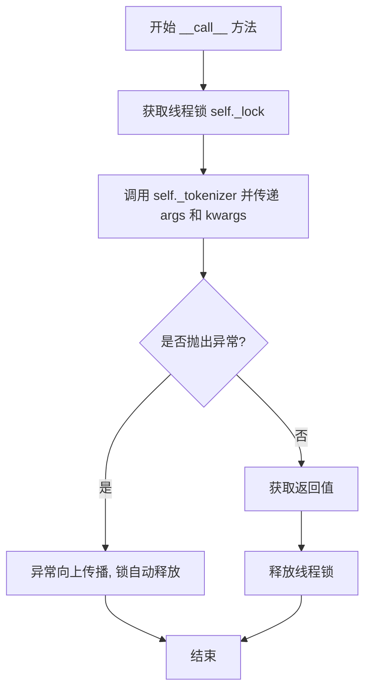
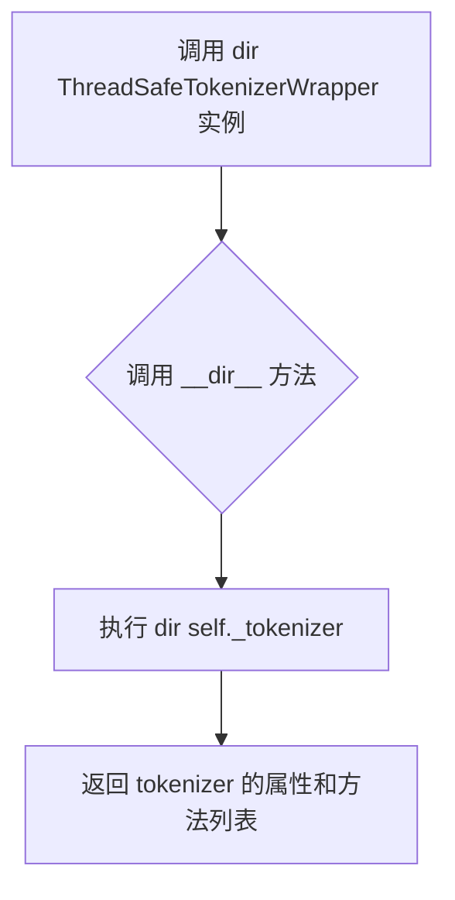
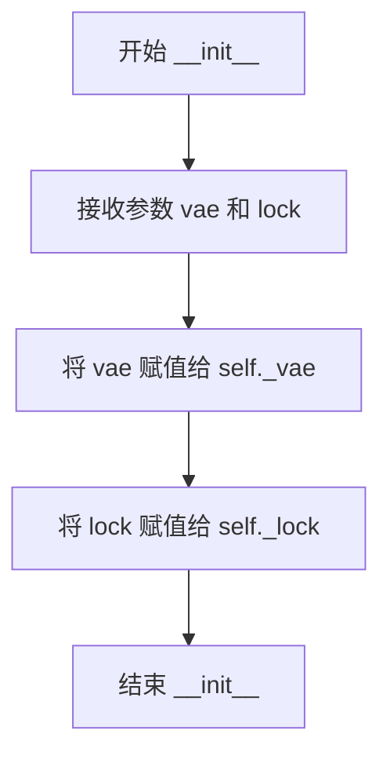
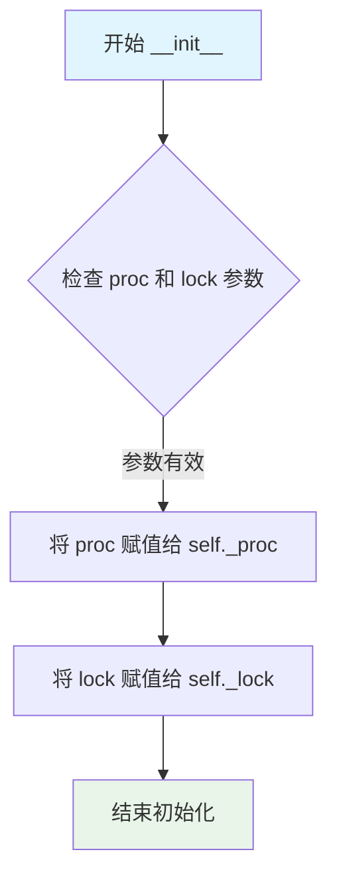

# `diffusers\examples\server-async\utils\wrappers.py` 详细设计文档

本代码实现了三个线程安全的包装器类，分别用于包装tokenizer、VAE模型和图像处理器，通过动态代理模式在多线程环境下保护特定方法的并发访问，确保深度学习模型在推理时的线程安全性。

## 整体流程



## 类结构

```
ThreadSafeWrapper (基类模式)
├── ThreadSafeTokenizerWrapper (tokenizer包装器)
├── ThreadSafeVAEWrapper (VAE模型包装器)
└── ThreadSafeImageProcessorWrapper (图像处理器包装器)
```

## 全局变量及字段


### `ThreadSafeTokenizerWrapper._tokenizer`
    
被包装的分词器对象

类型：`Tokenizer`
    


### `ThreadSafeTokenizerWrapper._lock`
    
用于确保线程安全的锁对象

类型：`threading.Lock`
    


### `ThreadSafeTokenizerWrapper._thread_safe_methods`
    
需要线程安全的方法名称集合

类型：`Set[str]`
    


### `ThreadSafeVAEWrapper._vae`
    
被包装的VAE模型对象

类型：`nn.Module`
    


### `ThreadSafeVAEWrapper._lock`
    
用于确保线程安全的锁对象

类型：`threading.Lock`
    


### `ThreadSafeImageProcessorWrapper._proc`
    
被包装的图像处理器对象

类型：`ImageProcessor`
    


### `ThreadSafeImageProcessorWrapper._lock`
    
用于确保线程安全的锁对象

类型：`threading.Lock`
    
    

## 全局函数及方法


### `ThreadSafeTokenizerWrapper.__init__`

初始化线程安全的Tokenizer包装器，接受tokenizer实例和锁对象，并配置需要线程安全保护的方法集合。

参数：

- `self`：`ThreadSafeTokenizerWrapper`，隐式参数，表示当前创建的实例对象
- `tokenizer`：任意Tokenizer类型，需要被包装的tokenizer实例，提供文本编码和解码功能
- `lock`：threading.Lock 或类似锁对象，用于保证多线程环境下的线程安全访问

返回值：`None`，初始化方法不返回值，仅完成实例属性的设置

#### 流程图



#### 带注释源码

```python
def __init__(self, tokenizer, lock):
    """
    初始化 ThreadSafeTokenizerWrapper 实例
    
    参数:
        tokenizer: 任意Tokenizer对象，需要被包装以实现线程安全的tokenizer
        lock: threading.Lock实例，用于同步多线程对tokenizer的访问
    """
    # 保存tokenizer实例的引用，用于后续的方法调用和属性访问
    self._tokenizer = tokenizer
    
    # 保存锁对象，用于在多线程环境下保证tokenizer访问的线程安全性
    self._lock = lock

    # 定义需要线程安全保护的方法集合
    # 这些方法在多线程环境下调用时会被锁保护，避免竞争条件
    self._thread_safe_methods = {
        "__call__",        # 使包装器可调用
        "encode",          # 文本编码为token id
        "decode",          # token id解码为文本
        "tokenize",        # 分词操作
        "encode_plus",     # 增强版编码
        "batch_encode_plus", # 批量增强版编码
        "batch_decode",    # 批量解码
    }
```


### `ThreadSafeTokenizerWrapper.__getattr__`

该方法是 `ThreadSafeTokenizerWrapper` 类的属性访问拦截器，用于实现线程安全的动态方法代理。当访问属性时，它会检查该属性是否属于预定义的线程安全方法列表（`__call__`, `encode`, `decode`, `tokenize`, `encode_plus`, `batch_encode_plus`, `batch_decode`），如果是可调用的方法，则返回一个带锁的包装方法；否则直接返回原始属性，从而实现对 tokenizer 的线程安全封装。

参数：

- `name`：`str`，要访问的属性名称

返回值：`Callable | Any`，如果属性是线程安全方法且可调用，返回带锁的包装方法；否则返回原始属性对象

#### 流程图



#### 带注释源码

```python
def __getattr__(self, name):
    """
    属性访问拦截器，实现动态方法代理和线程安全包装
    
    参数:
        name: str - 要访问的属性名称
    
    返回:
        如果是线程安全方法且可调用，返回带锁的包装方法
        否则返回原始属性对象
    """
    # 1. 从底层 tokenizer 获取属性
    attr = getattr(self._tokenizer, name)

    # 2. 检查属性是否是预定义的线程安全方法列表中的方法
    if name in self._thread_safe_methods and callable(attr):
        
        # 3. 创建一个闭包函数，用于包装原始方法
        def wrapped_method(*args, **kwargs):
            # 使用锁确保线程安全，在锁内执行原方法
            with self._lock:
                return attr(*args, **kwargs)

        # 4. 返回包装后的方法
        return wrapped_method

    # 5. 如果不是线程安全方法，直接返回原始属性
    return attr
```


### `ThreadSafeTokenizerWrapper.__call__`

该方法是 `ThreadSafeTokenizerWrapper` 类的核心调用接口，通过获取线程锁来确保对底层 tokenizer 的并发调用是线程安全的。当外部代码以函数形式调用该包装对象时，会自动触发此方法，将所有参数传递给底层 tokenizer 并返回其执行结果。

参数：

- `*args`：`任意类型`，可变位置参数列表，用于传递给底层 tokenizer 的位置参数
- `**kwargs`：`任意类型`，可变关键字参数字典，用于传递给底层 tokenizer 的关键字参数

返回值：`任意类型`，返回底层 tokenizer 调用后的结果，具体类型取决于 tokenizer 本身 `__call__` 方法的定义

#### 流程图



#### 带注释源码

```
def __call__(self, *args, **kwargs):
    """
    线程安全的 tokenizer 调用接口。
    
    当以函数方式调用 ThreadSafeTokenizerWrapper 实例时触发此方法。
    使用锁机制确保多线程环境下对底层 tokenizer 的调用是串行的，
    避免因并发访问导致的竞争条件或不确定行为。
    
    参数:
        *args: 任意位置参数,直接传递给底层 tokenizer 的 __call__ 方法
        **kwargs: 任意关键字参数,直接传递给底层 tokenizer 的 __call__ 方法
    
    返回:
        任意类型: 底层 tokenizer __call__ 方法的返回值,类型取决于 tokenizer 的具体实现
    """
    # 使用 with 语句确保锁在方法执行完毕后一定被释放
    # 即使在执行过程中发生异常,with 语句也能保证锁的正确释放
    with self._lock:
        # 调用底层 tokenizer 的 __call__ 方法,透传所有参数
        # 这里会执行实际的 tokenization 逻辑
        return self._tokenizer(*args, **kwargs)
```


### `ThreadSafeTokenizerWrapper.__setattr__`

该方法是 Python 的特殊方法，用于处理对象的属性赋值操作。当设置实例属性时，如果属性名以 `_` 开头，则将属性存储在当前包装对象自身；否则，将属性透传到内部的 tokenizer 对象，实现对底层 tokenizer 属性的间接设置。

参数：

- `self`：`ThreadSafeTokenizerWrapper`，当前 ThreadSafeTokenizerWrapper 实例
- `name`：`str`，要设置的属性名称
- `value`：`any`，要设置的属性值

返回值：`None`，该方法不返回值（Python 的 `__setattr__` 方法应返回 None）

#### 流程图

```mermaid
flowchart TD
    A[开始 __setattr__] --> B{name.startswith('_'}
    B -->|Yes| C[调用 super().__setattr__(name, value)]
    B -->|No| D[调用 setattr(self._tokenizer, name, value)]
    C --> E[结束]
    D --> E
```

#### 带注释源码

```python
def __setattr__(self, name, value):
    """
    设置实例属性的特殊方法。
    
    参数:
        name: str, 要设置的属性名称
        value: any, 要设置的属性值
    
    返回:
        None, 不返回值
    """
    # 判断属性名是否以私有前缀 "_" 开头
    if name.startswith("_"):
        # 如果是私有属性，使用父类方法设置到当前包装对象自身
        # 这样可以保护内部的 _tokenizer 和 _lock 等管理属性
        super().__setattr__(name, value)
    else:
        # 对于非私有属性，透传到内部的 tokenizer 对象
        # 这样外部对该包装对象的属性设置会直接影响底层的 tokenizer
        setattr(self._tokenizer, name, value)
```


### `ThreadSafeTokenizerWrapper.__dir__`

该方法是一个特殊方法（dunder method），用于重写 `dir()` 函数的行为。当对 `ThreadSafeTokenizerWrapper` 实例调用 `dir()` 时，会返回底层 `tokenizer` 对象的所有属性和方法列表，从而保持对原始对象的属性访问透明性。

参数：

- 无额外参数（仅隐式包含 `self` 实例本身）

返回值：`list`，返回底层 tokenizer 对象的所有属性和方法名称列表

#### 流程图



#### 带注释源码

```python
def __dir__(self):
    """
    重写 dir() 行为，返回底层 tokenizer 的所有属性和方法
    
    该方法使 dir(wrapper) 等价于 dir(tokenizer)，
    保证了对包装对象的属性探索与原始对象保持一致
    """
    return dir(self._tokenizer)  # 调用底层 tokenizer 的 dir 方法并返回结果
```


### `ThreadSafeVAEWrapper.__init__`

该方法用于初始化线程安全的VAE包装器，接收VAE模型实例和锁对象，将它们存储为实例属性，以便在后续的方法调用中通过锁来保证线程安全。

参数：

- `self`：`ThreadSafeVAEWrapper`，隐式的当前实例参数
- `vae`：任意支持 `decode`、`encode`、`forward` 方法的对象（通常为变分自编码器实例），需要包装为线程安全的对象
- `lock`：线程锁对象（通常为 `threading.Lock` 或 `threading.RLock`），用于确保并发访问时的线程安全

返回值：`None`，`__init__` 方法不返回任何值

#### 流程图



#### 带注释源码

```python
def __init__(self, vae, lock):
    """
    初始化 ThreadSafeVAEWrapper。
    
    参数:
        vae: 要包装的 VAE（变分自编码器）对象，需要支持 decode/encode/forward 方法
        lock: 线程锁对象，用于保证并发调用时的线程安全性
    """
    # 将传入的 VAE 模型存储为实例变量 _vae
    # 使用 _ 前缀表示这是内部属性，不直接暴露给外部
    self._vae = vae
    
    # 将传入的锁对象存储为实例变量 _lock
    # 该锁将用于在调用 VAE 的方法时保证线程安全
    self._lock = lock
```


### ThreadSafeVAEWrapper.__getattr__

该方法通过动态属性访问机制，为指定的 VAE 方法（decode、encode、forward）提供线程安全的包装，确保在多线程环境下调用这些方法时能够正确同步。

参数：

- `self`：实例本身，表示 ThreadSafeVAEWrapper 的对象。
- `name`：`str`，被访问的属性名称，用于从底层 VAE 对象中检索相应属性。

返回值：`any`，根据属性类型返回原始属性（对于非线程安全方法）或包装后的线程安全方法（对于 decode、encode、forward 方法）。

#### 流程图

```mermaid
flowchart TD
    A[开始 __getattr__] --> B[获取属性: attr = getattr(self._vae, name)]
    B --> C{检查条件: name in {'decode','encode','forward'} and callable(attr)}
    C -->|是| D[创建包装方法 wrapped]
    D --> E[返回 wrapped 方法]
    C -->|否| F[返回原始属性 attr]
    E --> G[结束]
    F --> G
```

#### 带注释源码

```python
def __getattr__(self, name):
    """
    动态获取属性，并为线程安全方法提供包装。
    
    参数:
        name (str): 要访问的属性名称。
    
    返回:
        any: 如果属性是线程安全方法（decode/encode/forward），返回包装后的方法；
             否则返回原始属性。
    """
    # 从底层 VAE 对象获取指定名称的属性
    attr = getattr(self._vae, name)
    
    # 判断该属性是否是需要线程安全的方法，并且可调用
    if name in {"decode", "encode", "forward"} and callable(attr):
        # 定义内部包装函数，在锁保护下执行原方法
        def wrapped(*args, **kwargs):
            with self._lock:
                return attr(*args, **kwargs)
        
        # 返回包装后的方法，确保线程安全
        return wrapped
    
    # 对于非线程安全方法，直接返回原始属性
    return attr
```


### `ThreadSafeVAEWrapper.__setattr__`

设置 VAE 包装器实例的属性，当属性名以 `_` 开头时直接设置在包装器自身上，否则代理到底层的 VAE 对象。

参数：

- `self`：`ThreadSafeVAEWrapper`，包装器类实例
- `name`：`str`，要设置的属性名称
- `value`：`任意类型`，要设置的属性值

返回值：`None`，无返回值（Python `__setattr__` 协议要求）

#### 流程图

```mermaid
flowchart TD
    A[开始 __setattr__] --> B{name.startswith&#40;'_'&#41;}
    B -->|True| C[super().__setattr__&#40;name, value&#41;]
    B -->|False| D[setattr&#40;self._vae, name, value&#41;]
    C --> E[结束]
    D --> E
```

#### 带注释源码

```
def __setattr__(self, name, value):
    """
    设置实例属性。
    
    对于以双下划线开头的私有属性，直接在包装器本身上设置；
    对于其他属性，代理到底层的 VAE 对象。
    
    参数:
        name: 属性名称
        value: 属性值
    """
    # 检查属性名是否以 '_' 开头（私有属性）
    if name.startswith("_"):
        # 对于私有属性，调用父类的 __setattr__ 方法
        # 直接存储在包装器实例自身
        super().__setattr__(name, value)
    else:
        # 对于公共属性，代理到底层的 VAE 对象
        # 使用 setattr 将属性设置到 self._vae
        setattr(self._vae, name, value)
```


### `ThreadSafeImageProcessorWrapper.__init__`

初始化线程安全的图像处理器包装器，将传入的图像处理器和锁对象存储为实例变量，以便后续在多线程环境中安全地调用受保护的方法。

参数：

- `self`：`ThreadSafeImageProcessorWrapper`，类的实例对象（隐式参数）
- `proc`：任意可调用对象，需要被包装的图像处理器实例
- `lock`：threading.Lock 或类似锁对象，用于保证线程安全

返回值：`None`，构造函数不返回任何值

#### 流程图



#### 带注释源码

```python
def __init__(self, proc, lock):
    """
    初始化 ThreadSafeImageProcessorWrapper 实例。
    
    参数:
        proc: 需要包装的图像处理器对象（如 CLIPImageProcessor 等）
        lock: 用于保证线程安全的锁对象（如 threading.Lock）
    """
    # 将传入的图像处理器存储为实例变量
    self._proc = proc
    
    # 将锁对象存储为实例变量，供后续方法使用
    self._lock = lock
```


### `ThreadSafeImageProcessorWrapper.__getattr__`

这是一个动态属性访问方法，用于在访问不存在属性时自动调用。它为特定的图像处理方法（`postprocess` 和 `preprocess`）提供线程安全包装，确保在多线程环境下安全执行。

参数：

- `self`：`ThreadSafeImageProcessorWrapper`，封装了图像处理器和锁的包装器实例
- `name`：`str`，要访问的属性或方法名称

返回值：`Any`，根据访问的属性类型返回：
- 如果 `name` 在 `{"postprocess", "preprocess"}` 中且可调用，返回带锁的包装方法
- 否则返回原始的属性或方法对象

#### 流程图

```mermaid
flowchart TD
    A[开始: __getattr__(name)] --> B[获取属性: attr = getattr(self._proc, name)]
    B --> C{检查条件: name in {'postprocess', 'preprocess'} 且 callable(attr)?}
    C -->|是| D[创建包装方法: wrapped(*args, **kwargs)]
    D --> E[返回包装方法: with self._lock return attr(*args, **kwargs)]
    C -->|否| F[返回原始属性: return attr]
    E --> G[结束]
    F --> G
```

#### 带注释源码

```python
def __getattr__(self, name):
    """
    动态属性访问方法，为特定方法提供线程安全包装
    
    参数:
        name: str, 要访问的属性名称
        
    返回:
        如果是特定方法，返回包装后的线程安全方法；否则返回原始属性
    """
    # 1. 从底层图像处理器获取属性
    attr = getattr(self._proc, name)
    
    # 2. 检查是否是需线程安全的方法且可调用
    if name in {"postprocess", "preprocess"} and callable(attr):
        
        # 3. 创建包装方法，在锁保护下执行
        def wrapped(*args, **kwargs):
            with self._lock:  # 获取锁，保证线程安全
                return attr(*args, **kwargs)  # 执行原方法
        
        return wrapped  # 返回包装后的方法
    
    # 4. 非特定方法，直接返回原始属性
    return attr
```


### `ThreadSafeImageProcessorWrapper.__setattr__`

该方法用于安全地设置包装对象的属性，通过区分私有属性（以 `_` 开头）和公共属性，将公共属性的设置操作委托给底层的图像处理器对象，从而保持线程安全的属性访问语义。

参数：

- `name`：`str`，要设置的属性名称
- `value`：`任意类型`，要赋予该属性的值

返回值：`None`，该方法不返回任何值（Python 中 `setattr` 表达式返回 `None`）

#### 流程图

```mermaid
flowchart TD
    A[开始 __setattr__] --> B{name 是否以 '_' 开头?}
    B -->|是| C[调用 super().__setattr__<br/>存储到当前实例]
    B -->|否| D[调用 setattr<br/>设置底层 _proc 的属性]
    C --> E[结束]
    D --> E
```

#### 带注释源码

```python
def __setattr__(self, name, value):
    """
    设置属性值的特殊方法，支持线程安全的属性代理。
    
    参数:
        name: str, 要设置的属性名
        value: 任意类型, 要设置的属性值
    
    返回:
        None
    """
    # 检查属性名是否以 '_' 开头（私有属性）
    if name.startswith("_"):
        # 私有属性存储在当前包装器对象自身
        # 例如：self._proc, self._lock 等实例变量
        super().__setattr__(name, value)
    else:
        # 公共属性委托给底层的图像处理器对象 self._proc
        # 这样外部访问包装器时就等同于直接访问底层处理器
        setattr(self._proc, name, value)
```

## 关键组件


### 一段话描述
该代码实现了三个线程安全包装器类（ThreadSafeTokenizerWrapper、ThreadSafeVAEWrapper 和 ThreadSafeImageProcessorWrapper），用于在多线程环境中安全地调用底层的 tokenizer、VAE 模型和图像处理器，通过锁机制和动态方法拦截确保并发访问的安全性。

### 文件的整体运行流程
代码定义了三个包装器类，每个类在初始化时接收一个底层对象（tokenizer、vae 或 image processor）和一个锁对象。当调用包装器的方法时，通过 `__getattr__` 动态拦截方法访问，对于指定需要线程安全的方法，使用锁包装后调用底层方法；对于属性设置，通过 `__setattr__` 委托给底层对象；从而在多线程环境下提供安全的并发访问。

### 类的详细信息

#### ThreadSafeTokenizerWrapper 类
- **类字段**：
  - `_tokenizer`: 对象，底层 tokenizer 实例
  - `_lock`: 对象，线程锁，用于同步访问
  - `_thread_safe_methods`: 集合，需要线程安全的方法名称集合，包含 "__call__", "encode", "decode", "tokenize", "encode_plus", "batch_encode_plus", "batch_decode"
- **类方法**：
  - `__init__(self, tokenizer, lock)`：
    - 参数：`tokenizer`（对象，tokenizer 实例），`lock`（对象，线程锁）
    - 返回值：无
    - 描述：初始化包装器，设置底层 tokenizer 和锁。
  - `__getattr__(self, name)`：
    - 参数：`name`（字符串，属性或方法名称）
    - 返回值：属性或包装后的方法
    - 描述：动态获取属性或方法，如果方法在 `_thread_safe_methods` 中且可调用，则返回加锁包装的方法，否则返回原属性。
  - `__call__(self, *args, **kwargs)`：
    - 参数：`*args`（可变位置参数），`**kwargs`（可变关键字参数）
    - 返回值：底层 tokenizer 的调用结果
    - 描述：使包装器可调用，直接调用底层 tokenizer 并加锁。
  - `__setattr__(self, name, value)`：
    - 参数：`name`（字符串，属性名称），`value`（任意，属性值）
    - 返回值：无
    - 描述：设置属性，如果属性名以 "_" 开头，在包装器中设置，否则委托给底层 tokenizer。
  - `__dir__(self)`：
    - 参数：无
    - 返回值：列表
    - 返回值描述：返回底层 tokenizer 的属性列表。
    - 描述：返回底层 tokenizer 的目录，以便支持内省。

#### ThreadSafeVAEWrapper 类
- **类字段**：
  - `_vae`: 对象，底层 VAE 模型实例
  - `_lock`: 对象，线程锁
- **类方法**：
  - `__init__(self, vae, lock)`：
    - 参数：`vae`（对象，VAE 实例），`lock`（对象，线程锁）
    - 返回值：无
    - 描述：初始化包装器，设置底层 VAE 和锁。
  - `__getattr__(self, name)`：
    - 参数：`name`（字符串，属性或方法名称）
    - 返回值：属性或包装后的方法
    - 描述：动态获取属性或方法，如果方法在 {"decode", "encode", "forward"} 中且可调用，则返回加锁包装的方法。
  - `__setattr__(self, name, value)`：
    - 参数：`name`（字符串，属性名称），`value`（任意，属性值）
    - 返回值：无
    - 描述：设置属性，私有属性在包装器中设置，其他委托给底层 VAE。

#### ThreadSafeImageProcessorWrapper 类
- **类字段**：
  - `_proc`: 对象，底层图像处理器实例
  - `_lock`: 对象，线程锁
- **类方法**：
  - `__init__(self, proc, lock)`：
    - 参数：`proc`（对象，图像处理器实例），`lock`（对象，线程锁）
    - 返回值：无
    - 描述：初始化包装器，设置底层图像处理器和锁。
  - `__getattr__(self, name)`：
    - 参数：`name`（字符串，属性或方法名称）
    - 返回值：属性或包装后的方法
    - 描述：动态获取属性或方法，如果方法在 {"postprocess", "preprocess"} 中且可调用，则返回加锁包装的方法。
  - `__setattr__(self, name, value)`：
    - 参数：`name`（字符串，属性名称），`value`（任意，属性值）
    - 返回值：无
    - 描述：设置属性，私有属性在包装器中设置，其他委托给底层图像处理器。

### 关键组件信息

#### 线程安全锁机制
通过传入的锁对象（lock）确保同一时间只有一个线程执行关键方法，防止并发冲突。

#### 动态方法拦截与包装
利用 Python 的 `__getattr__` 魔法方法，在运行时动态拦截方法调用，并根据方法名决定是否添加线程安全包装。

#### 属性委托管理
通过 `__setattr__` 实现属性管理，私有属性（以 "_" 开头）保留在包装器中，其他属性委托给底层对象。

#### 方法集合定义
每个包装器定义了需要线程安全的方法集合（如 tokenizer 的 "_thread_safe_methods"），明确哪些方法需要加锁。

### 潜在的技术债务或优化空间
1. **锁粒度**：当前所有指定方法都使用同一个锁，可能导致性能瓶颈，可以考虑更细粒度的锁。
2. **异常处理**：代码中缺乏异常处理机制，在锁内部发生异常时可能导致锁未释放。
3. **超时机制**：没有提供锁超时设置，可能导致死锁。
4. **方法覆盖**：对于底层对象的属性修改（如动态添加方法），可能无法及时反映到包装器中。

### 其它项目

#### 设计目标与约束
- **目标**：为 tokenizer、VAE 和图像处理器提供线程安全的包装，确保多线程环境下的安全并发访问。
- **约束**：依赖外部传入的锁对象，不主动管理锁的生命周期；底层对象必须支持相应的方法调用。

#### 错误处理与异常设计
- 当前代码未实现异常处理，在多线程环境下，如果底层方法抛出异常，可能导致锁未释放，建议使用 try-finally 块确保锁释放。
- 可以考虑添加日志记录异常信息。

#### 数据流与状态机
- 数据流：调用方通过包装器调用方法 -> 拦截到 __getattr__ -> 检查方法是否需要锁 -> 加锁调用底层方法 -> 释放锁 -> 返回结果。
- 状态机：包装器本身无状态，状态由底层对象管理。

#### 外部依赖与接口契约
- 依赖：threading.Lock 或类似的锁对象；底层对象（tokenizer、VAE、image processor）。
- 接口契约：底层对象必须实现指定的方法（如 tokenizer 的 encode、decode 等），否则调用会失败。


## 问题及建议


### 已知问题

-   **代码重复严重**：三个Wrapper类（ThreadSafeTokenizerWrapper、ThreadSafeVAEWrapper、ThreadSafeImageProcessorWrapper）存在大量重复模式，`__getattr__`和`__setattr__`的实现几乎相同，违反DRY原则，可通过抽象基类或混入类解决
-   **属性初始化时可能触发错误逻辑**：在`__init__`中直接赋值`self._tokenizer = tokenizer`时，会先调用`__setattr__`，由于`_tokenizer`以下划线开头会走`super().__setattr__`路径，但`_thread_safe_methods`（非下划线开头）可能被错误地设置到`self._tokenizer`对象上
-   **线程安全方法列表硬编码**：`_thread_safe_methods`集合和方法名判断（如`{"decode", "encode", "forward"}`）硬编码在类中，扩展性差，新增线程安全方法需修改类代码
-   **缺少类型提示**：所有方法参数和返回值均无类型注解，不利于静态分析工具和IDE支持，降低代码可维护性
-   **`__getattr__`潜在递归风险**：当访问`_tokenizer`、`_vae`、`_proc`等内部属性时，`__getattr__`会通过`getattr(self._tokenizer, name)`尝试获取，若内部对象没有该属性可能导致无限递归
-   **`__dir__`实现不完整**：仅返回tokenizer的dir，遗漏了wrapper自身的属性（如`_tokenizer`、`_lock`、`_thread_safe_methods`），影响`dir()`和`tab`补全
-   **锁粒度过粗**：所有方法共用同一把锁，高并发场景下可能导致不必要的线程等待，未区分读操作（可并发）和写操作（需互斥）
-   **异常处理缺失**：锁获取和被包装方法的执行均无异常捕获，若被包装方法抛出异常，锁可能无法正确释放（虽然with语句可保证但缺乏显式保障）
-   **API一致性不足**：ThreadSafeTokenizerWrapper实现了`__call__`方法，其他两个Wrapper未实现；若tokenizer不可调用，调用`__call__`会失败

### 优化建议

-   **抽取公共基类**：创建抽象基类`ThreadSafeWrapper`，将`__getattr__`、`__setattr__`的公共逻辑和锁管理逻辑抽象，子类只需提供目标对象和需要线程安全的方法列表
-   **修复属性初始化**：在`__init__`中使用`super().__setattr__()`显式初始化关键属性，或重构`__setattr__`逻辑避免误判
-   **支持配置化方法列表**：通过构造函数参数或属性方法动态传入线程安全方法列表，提升灵活性
-   **添加类型注解**：使用Python typing模块为所有方法添加参数和返回值类型，利于静态检查和文档生成
-   **分离读写锁**：对读操作（如encode、decode）和写操作使用不同的锁，提高并发性能
-   **添加异常处理**：在wrapped方法中添加try-except确保锁的释放和异常传播
-   **完善`__dir__`**：合并wrapper自身属性和内部对象的属性，提供完整的命名空间视图


## 其它


### 设计目标与约束

**设计目标**：为Tokenizer、VAE和ImageProcessor提供线程安全的包装器，确保在多线程环境下对这些对象的访问是线程安全的，避免竞态条件和数据不一致问题。

**约束条件**：
- 依赖于Python的threading.Lock机制
- 包装对象必须支持基本的属性访问和方法调用
- 仅对指定的方法进行线程安全包装，其他方法保持原样

### 错误处理与异常设计

- **锁获取失败**：如果锁不可用，线程将阻塞等待锁释放
- **属性不存在**：通过__getattr__转发到底层对象，如果底层对象也不存在属性，将抛出AttributeError
- **方法调用异常**：底层对象方法抛出的异常会直接传播到调用者
- **参数验证**：参数验证由底层对象负责，本包装器不进行额外验证

### 数据流与状态机

**数据流**：
1. 用户调用包装器的方法或属性
2. __getattr__被触发，获取底层对象的属性
3. 如果是指定的线程安全方法，方法被包装在锁保护的函数中
4. 执行方法，获取结果，返回给用户

**状态转换**：
- 包装器本身无状态机，其行为完全由底层对象和锁的状态决定
- 锁的状态：未锁定 -> 已锁定（方法执行中） -> 已解锁

### 外部依赖与接口契约

**依赖项**：
- threading.Lock：用于线程同步
- 底层对象（tokenizer/vae/processor）：被包装的对象

**接口契约**：
- 构造函数：接受被包装对象和锁对象
- 属性访问：透明转发到底层对象
- 线程安全方法：encode, decode, tokenize, encode_plus, batch_encode_plus, batch_decode, __call__ (Tokenizer)；decode, encode, forward (VAE)；postprocess, preprocess (ImageProcessor)
- 非线程安全方法：直接返回底层对象的对应属性

### 性能考虑

- **锁竞争**：在高并发场景下，所有线程安全方法会竞争同一把锁，可能成为性能瓶颈
- **每次调用开销**：每次调用线程安全方法都需获取和释放锁，存在一定开销
- **建议**：仅对确实需要线程安全的方法加锁，避免过度同步

### 使用示例与限制

**使用示例**：
```python
import threading
from transformers import AutoTokenizer

tokenizer = AutoTokenizer.from_pretrained("bert-base-uncased")
lock = threading.Lock()
safe_tokenizer = ThreadSafeTokenizerWrapper(tokenizer, lock)
# 多线程调用
results = [safe_tokenizer.encode(text) for text in texts]
```

**限制与注意事项**：
- 包装器不改变底层对象的线程安全性，只是添加了一层同步
- 底层对象必须是线程安全的或不会产生竞态条件
- 锁的粒度是对象级别，不是方法级别
- 不支持异步操作，异步场景需使用asyncio.Lock

### 扩展性设计

- 可通过修改_thread_safe_methods集合添加更多线程安全方法
- 可继承基类或抽象类以实现通用的线程安全包装逻辑
- 可考虑支持上下文管理器以实现更细粒度的锁控制

    