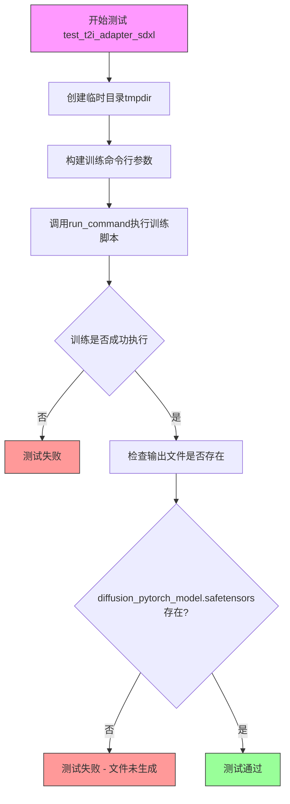
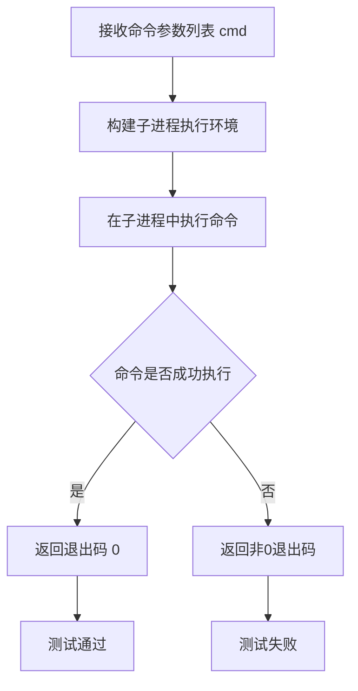
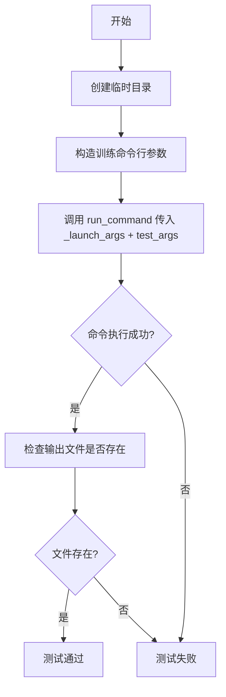
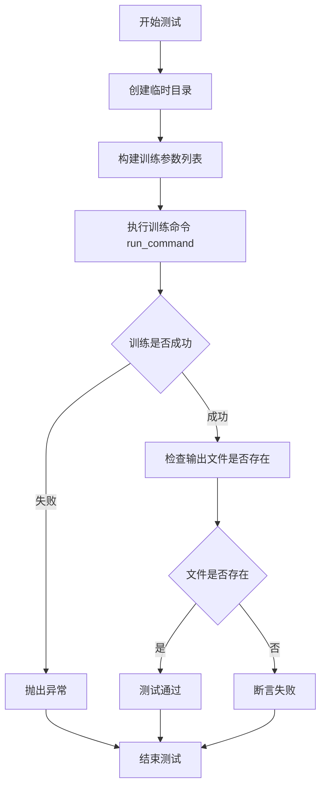

# `diffusers\examples\t2i_adapter\test_t2i_adapter.py` 详细设计文档

这是一个用于测试T2I Adapter在Stable Diffusion XL上训练流程的单元测试类，通过临时目录执行训练脚本并验证生成的适配器模型文件是否正确输出。

## 整体流程



## 类结构

```
ExamplesTestsAccelerate (基类 - 外部导入)
└── T2IAdapter (测试类)
```

## 全局变量及字段


### `logger`
    
全局日志记录器，用于记录程序运行时的调试信息和状态

类型：`logging.Logger`
    


### `stream_handler`
    
全局日志流处理器，用于将日志信息输出到标准输出流（stdout）

类型：`logging.StreamHandler`
    


    

## 全局函数及方法


### `run_command`

外部导入的执行命令函数，用于在测试环境中执行命令行指令。该函数接受一个命令参数列表（通常包含加速器启动参数和训练脚本参数），并在子进程中执行它们，捕获输出和返回码。

参数：

- `cmd`：列表（List[str]），命令行参数列表，包含要执行的命令及其参数。在当前代码中传入的是 `self._launch_args + test_args`，即加速器启动参数与训练脚本参数的合并。

返回值：`整数`（int），返回命令执行的退出码，通常0表示成功，非0表示失败。

#### 流程图



#### 带注释源码

```python
# run_command 是从 test_examples_utils 模块导入的外部函数
# 下面是基于代码使用方式的推断实现

def run_command(cmd: List[str], 
                env: Optional[Dict[str, str]] = None,
                timeout: Optional[int] = None,
                capture_output: bool = True) -> int:
    """
    执行命令行命令并返回退出码
    
    参数:
        cmd: 命令和参数列表，如 ['python', 'script.py', '--arg1', 'value1']
        env: 可选的环境变量字典
        timeout: 可选的命令超时时间（秒）
        capture_output: 是否捕获标准输出和错误
    
    返回:
        命令的退出码
    """
    # 使用 subprocess 模块执行命令
    # 常见实现会返回子进程的返回码
    pass

# 在测试中的实际调用方式：
# run_command(self._launch_args + test_args)
# 其中 self._launch_args 是 ExamplesTestsAccelerate 类的属性
# test_args 是通过 f-string 构建的训练脚本参数列表
```

#### 使用示例

```python
# 代码中的实际调用
run_command(self._launch_args + test_args)

# 其中 test_args 的内容：
test_args = [
    "examples/t2i_adapter/train_t2i_adapter_sdxl.py",
    "--pretrained_model_name_or_path=hf-internal-testing/tiny-stable-diffusion-xl-pipe",
    "--adapter_model_name_or_path=hf-internal-testing/tiny-adapter",
    "--dataset_name=hf-internal-testing/fill10",
    "--output_dir=/tmp/xxx",
    "--resolution=64",
    "--train_batch_size=1",
    "--gradient_accumulation_steps=1",
    "--max_train_steps=9",
    "--checkpointing_steps=2"
]
```


## 1. 一段话描述

该代码定义了一个测试类 `T2IAdapter`，继承自外部导入的基类 `ExamplesTestsAccelerate`，用于测试 T2I Adapter 在 Stable Diffusion XL 模型上的训练流程，通过执行命令行脚本并验证输出文件是否生成来判断测试是否通过。

## 2. 文件的整体运行流程

1. 导入必要的模块（logging, os, sys, tempfile）和测试工具类
2. 配置日志系统为 DEBUG 级别
3. 定义 `T2IAdapter` 测试类，继承 `ExamplesTestsAccelerate`
4. 在 `test_t2i_adapter_sdxl` 方法中：
   - 创建临时目录
   - 构造训练脚本命令行参数
   - 使用 `run_command` 执行训练命令（传入基类的 `_launch_args`）
   - 验证输出文件是否生成

## 3. 类的详细信息

### 3.1 类 `T2IAdapter`

| 类型 | 名称 | 描述 |
|------|------|------|
| 类 | T2IAdapter | 继承自 ExamplesTestsAccelerate 的测试类，用于验证 T2I Adapter SDXL 训练流程 |
| 实例变量 | _launch_args | 继承自父类，包含 accelerate 启动参数列表 |

### 3.2 类方法

#### T2IAdapter.test_t2i_adapter_sdxl

| 名称 | 参数 | 参数类型 | 参数描述 |
|------|------|----------|----------|
| test_t2i_adapter_sdxl | self | T2IAdapter | 测试方法本身，无额外参数 |

| 返回值类型 | 返回值描述 |
|------------|------------|
| None | 测试方法无返回值，通过 assert 验证结果 |

#### 全局函数 run_command

| 名称 | 参数 | 参数类型 | 参数描述 |
|------|------|----------|----------|
| run_command | command | List[str] | 要执行的命令列表 |

| 返回值类型 | 返回值描述 |
|------------|------------|
| None 或 int | 执行命令后的返回码（通常无返回值） |

## 4. 关键组件信息

| 组件名称 | 一句话描述 |
|----------|------------|
| ExamplesTestsAccelerate | 外部导入的基类，提供 `_launch_args` 属性和测试框架支持 |
| run_command | 外部导入的工具函数，用于执行 shell 命令 |
| _launch_args | 基类的属性，包含 accelerate 框架的启动参数列表 |
| tempfile.TemporaryDirectory | Python 标准库，用于创建临时测试目录 |

## 5. 潜在的技术债务或优化空间

1. **硬编码的测试参数**：模型路径、数据集名称等直接硬编码，缺乏配置管理
2. **缺少错误处理**：如果训练脚本执行失败，测试只会简单断言文件是否存在，缺乏详细的错误诊断
3. **测试隔离性**：使用 `tempfile.TemporaryDirectory` 是好的实践，但缺少清理验证和日志保存机制
4. **断言信息不足**：仅检查文件存在性，未验证文件内容完整性或模型参数有效性

## 6. 其它项目

### 设计目标与约束
- 目标：验证 T2I Adapter 在 SDXL 模型上的训练流程端到端可正常运行
- 约束：使用 HuggingFace 官方测试基础设施和 accelerate 框架

### 错误处理与异常设计
- 使用 `tempfile.TemporaryDirectory` 自动管理临时资源
- 命令执行失败时通过 `assert` 抛出 AssertionError

### 外部依赖与接口契约
- 依赖 `test_examples_utils` 模块中的 `ExamplesTestsAccelerate` 基类和 `run_command` 函数
- 依赖 `examples/t2i_adapter/train_t2i_adapter_sdxl.py` 训练脚本
- 依赖预训练模型 `hf-internal-testing/tiny-stable-diffusion-xl-pipe`

---

### `ExamplesTestsAccelerate` (基类属性)

由于 `ExamplesTestsAccelerate` 是从外部模块 `test_examples_utils` 导入的基类，代码中仅展示了其 `_launch_args` 属性的使用方式，未直接定义该类。根据代码推断：

**描述**

`ExamplesTestsAccelerate` 是 HuggingFace 提供的测试基类，专门用于加速（accelerate）框架下的示例测试。该基类包含 `_launch_args` 属性，用于存储 accelerate 命令的启动参数列表。

参数：

- 无直接参数（类属性访问）

返回值：`_launch_args`：`List[str]`，包含 accelerate 框架的启动参数列表

#### 流程图



#### 带注释源码

```python
# 导入必要的标准库
import logging
import os
import sys
import tempfile

# 将上级目录添加到 Python 路径，以便导入测试工具模块
sys.path.append("..")

# 从 test_examples_utils 模块导入测试基类和命令执行工具
# ExamplesTestsAccelerate: 提供测试框架和 _launch_args 属性
# run_command: 执行命令行命令的工具函数
from test_examples_utils import ExamplesTestsAccelerate, run_command  # noqa: E402

# 配置日志系统，设置为 DEBUG 级别以便输出详细调试信息
logging.basicConfig(level=logging.DEBUG)

# 获取根日志记录器
logger = logging.getLogger()
# 创建标准输出流处理器
stream_handler = logging.StreamHandler(sys.stdout)
# 将处理器添加到日志记录器
logger.addHandler(stream_handler)


# 定义 T2IAdapter 测试类，继承自 ExamplesTestsAccelerate
# 该测试类用于验证 T2I Adapter 在 Stable Diffusion XL 上的训练功能
class T2IAdapter(ExamplesTestsAccelerate):
    
    # 测试方法：验证 T2I Adapter SDXL 训练流程
    def test_t2i_adapter_sdxl(self):
        # 使用临时目录作为测试输出目录，测试结束后自动清理
        with tempfile.TemporaryDirectory() as tmpdir:
            # 定义训练脚本的命令行参数
            # 包括：预训练模型路径、适配器模型路径、数据集名称、输出目录、分辨率等
            test_args = f"""
            examples/t2i_adapter/train_t2i_adapter_sdxl.py
            --pretrained_model_name_or_path=hf-internal-testing/tiny-stable-diffusion-xl-pipe
            --adapter_model_name_or_path=hf-internal-testing/tiny-adapter
            --dataset_name=hf-internal-testing/fill10
            --output_dir={tmpdir}
            --resolution=64
            --train_batch_size=1
            --gradient_accumulation_steps=1
            --max_train_steps=9
            --checkpointing_steps=2
            """.split()

            # 执行训练命令
            # self._launch_args 来自父类 ExamplesTestsAccelerate
            # 包含 accelerate 框架的启动参数（如 --num_processes 等）
            run_command(self._launch_args + test_args)

            # 断言验证：检查扩散模型权重文件是否成功生成
            # 使用 safetensors 格式保存
            self.assertTrue(os.path.isfile(os.path.join(tmpdir, "diffusion_pytorch_model.safetensors")))
```


### `T2IAdapter.test_t2i_adapter_sdxl`

这是一个单元测试方法，用于验证T2IAdapter模型在Stable Diffusion XL (SDXL)上的训练流程是否正常工作。测试通过运行训练脚本并检查输出的模型文件是否生成来确认功能的正确性。

参数：

- `self`：`T2IAdapter` 类型，当前测试类的实例本身

返回值：`None`，测试方法无返回值，通过assert断言进行验证

#### 流程图



#### 带注释源码

```python
class T2IAdapter(ExamplesTestsAccelerate):
    """
    T2IAdapter测试类，继承自ExamplesTestsAccelerate
    用于测试T2IAdapter相关的训练示例
    """
    
    def test_t2i_adapter_sdxl(self):
        """
        测试T2IAdapter在Stable Diffusion XL上的训练流程
        
        测试步骤：
        1. 创建临时目录用于存放输出
        2. 配置训练参数包括模型路径、数据集等
        3. 执行训练脚本
        4. 验证生成的模型文件是否存在
        """
        # 使用上下文管理器创建临时目录，测试结束后自动清理
        with tempfile.TemporaryDirectory() as tmpdir:
            # 构建训练脚本的命令行参数
            # 包括：预训练模型路径、adapter模型路径、数据集、输出目录、分辨率等配置
            test_args = f"""
            examples/t2i_adapter/train_t2i_adapter_sdxl.py
            --pretrained_model_name_or_path=hf-internal-testing/tiny-stable-diffusion-xl-pipe
            --adapter_model_name_or_path=hf-internal-testing/tiny-adapter
            --dataset_name=hf-internal-testing/fill10
            --output_dir={tmpdir}
            --resolution=64
            --train_batch_size=1
            --gradient_accumulation_steps=1
            --max_train_steps=9
            --checkpointing_steps=2
            """.split()  # 将字符串分割成参数列表

            # 执行训练命令，将launch参数与测试参数合并后运行
            # _launch_args包含accelerate启动所需的配置（如GPU数量、分布式设置等）
            run_command(self._launch_args + test_args)

            # 断言验证：检查训练是否成功生成了模型文件
            # diffusion_pytorch_model.safetensors是SDXL训练输出的模型权重文件
            self.assertTrue(os.path.isfile(os.path.join(tmpdir, "diffusion_pytorch_model.safetensors")))
```


## 关键组件


### T2IAdapter 测试类

继承自ExamplesTestsAccelerate的测试类，用于验证T2I Adapter在Stable Diffusion XL模型上的训练流程。

### test_t2i_adapter_sdxl 测试方法

执行T2I Adapter SDXL训练的集成测试方法，包含模型加载、数据集配置、训练参数设置和输出文件验证。

### 临时目录管理

使用tempfile.TemporaryDirectory()创建临时输出目录，确保测试结束后自动清理资源。

### 命令执行模块

通过run_command函数执行训练脚本，传入Accelerate启动参数和训练参数。

### 日志配置

配置DEBUG级别的logging，将日志输出到stdout用于监控训练过程。

### 文件验证组件

验证diffusion_pytorch_model.safetensors文件是否成功生成，确保模型权重正确保存。


## 问题及建议


### 已知问题

- **魔法数字和硬编码参数**：训练参数（如 max_train_steps=9、checkpointing_steps=2、resolution=64）使用硬编码值，缺乏注释说明其选择依据，可维护性差
- **日志配置不当**：使用 `logging.basicConfig(level=logging.DEBUG)` 全局设置 DEBUG 级别，在生产环境或大型测试套件中可能导致日志泛滥，影响性能和问题排查效率
- **缺少参数验证**：测试参数（如模型路径、数据集名称）未进行有效性校验，测试失败时难以快速定位是参数问题还是代码问题
- **外部依赖无降级策略**：依赖 `hf-internal-testing/tiny-stable-diffusion-xl-pipe` 等外部托管模型测试，若网络异常或模型不可用会导致测试直接失败
- **资源清理无显式验证**：虽然使用 `tempfile.TemporaryDirectory()` 自动清理，但未显式验证临时资源是否正确释放
- **命令行参数构建方式冗余**：使用 `.split()` 将多行字符串分割为列表，代码可读性差，且易因空格问题引入隐藏 bug

### 优化建议

- 将关键训练参数提取为类常量或配置对象，并添加注释说明每个参数的测试意图
- 日志级别应可通过环境变量或配置控制，避免硬编码 DEBUG 级别
- 在测试开始前增加参数校验逻辑，验证模型路径、数据集有效性
- 为外部依赖添加超时控制和重试机制，或提供本地 mock/fallback 方案
- 在测试结束后增加资源清理状态验证日志
- 使用 `argparse` 或列表字面量构建命令参数，提升可读性和可靠性


## 其它


### 设计目标与约束

本测试文件的设计目标为验证T2I Adapter模型在Stable Diffusion XL上的训练流程是否正常工作，确保训练脚本能够正确执行并生成模型权重文件。约束条件包括：1) 必须使用HuggingFace官方指定的测试模型和数据集；2) 训练步骤限制为9步，仅用于功能验证而非性能测试；3) 必须使用临时目录进行测试，测试结束后自动清理。

### 错误处理与异常设计

测试中的错误处理主要依赖于pytest框架和run_command函数的返回值检查。当训练脚本执行失败时，run_command会抛出异常，测试用例自动失败。文件存在性检查使用assertTrue断言确保输出文件生成。此外，tempfile.TemporaryDirectory()作为上下文管理器会自动处理临时目录的清理，即使发生异常也能确保资源释放。日志系统通过logging模块配置为DEBUG级别，便于调试失败场景。

### 外部依赖与接口契约

本测试文件依赖以下外部组件：1) test_examples_utils模块中的ExamplesTestsAccelerate基类和run_command工具函数；2) HuggingFace的transformers库用于模型加载；3) diffusers库用于Stable Diffusion XL模型；4) accelerate框架用于分布式训练配置。接口契约方面：run_command接受命令参数列表并返回执行状态；_launch_args属性由基类提供，包含accelerate启动参数；测试模型需遵循HuggingFace模型卡格式规范。

### 性能基准与测试覆盖

当前测试未包含性能基准测试，仅验证功能正确性。测试覆盖范围包括：模型加载、适配器加载、数据集处理、训练循环执行、权重保存。分辨率设置为64x64为最小测试尺寸，训练批次为1，梯度累积为1步，这些简化配置旨在加快测试执行速度。9步训练和2步检查点保存用于验证检查点机制正常工作。

### 配置管理与环境要求

测试配置通过命令行参数内联定义，包括预训练模型路径、适配器模型路径、数据集名称、输出目录、分辨率、批次大小等。环境要求包括：Python 3.8+、CUDA可用（用于GPU训练）、足够的临时存储空间。测试使用hf-internal-testing组织下的微型模型以降低资源需求。

### 安全性与合规性

代码使用Apache License 2.0开源许可。测试中使用的模型权重通过safetensors格式保存，提供更好的安全性。测试数据使用fill10数据集（微型测试集），不涉及真实用户数据。日志输出到stdout而非文件，避免敏感信息持久化。

### 部署与集成考量

该测试文件作为持续集成流程的一部分，通常与GitHub Actions或其他CI系统集成。测试执行时间应控制在合理范围内以满足CI要求。测试失败时会立即终止并返回非零退出码，便于CI系统捕获。测试之间相互独立，可并行执行。

### 可维护性与扩展性

当前测试硬编码了所有参数，扩展性受限。潜在的改进方向包括：1) 将测试参数提取为类属性或配置文件；2) 添加参数化测试支持多个模型/数据集组合；3) 增加训练结果验证（如loss曲线检查）；4) 添加性能对比测试。代码结构清晰，遵循pytest约定，易于维护。


    