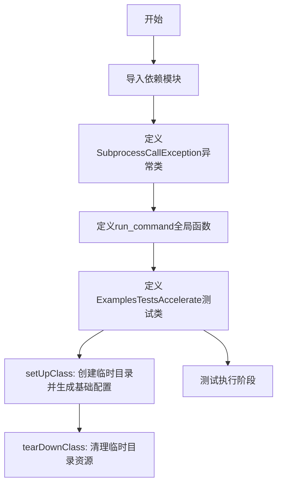
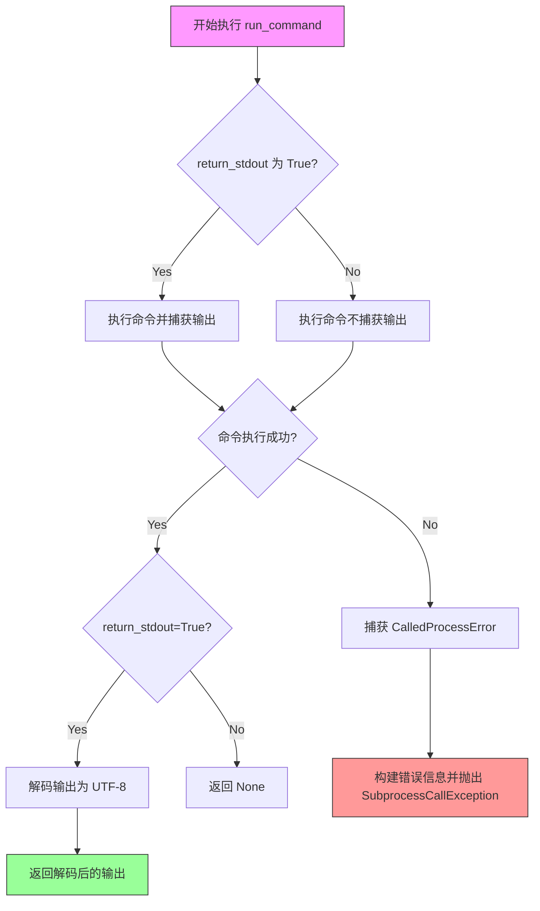
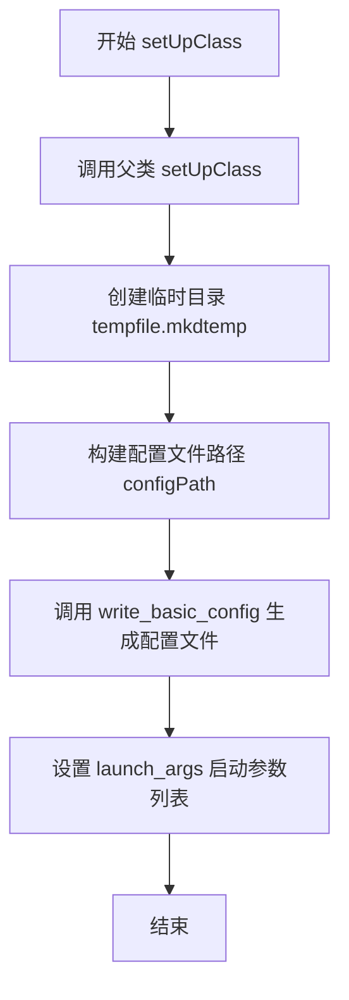
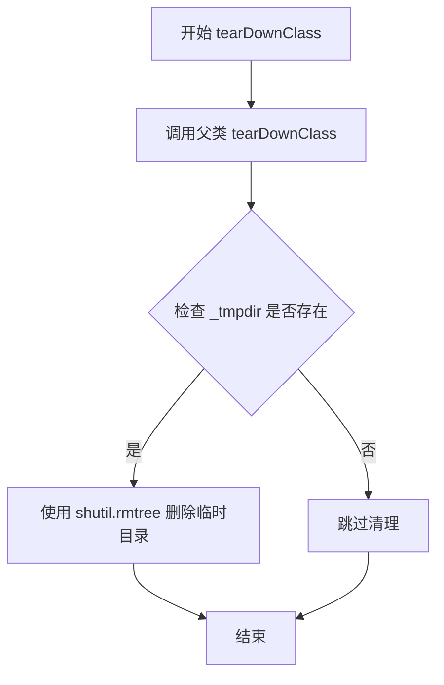

# `diffusers\examples\test_examples_utils.py` 详细设计文档

该文件是HuggingFace Accelerate库的测试工具模块，提供子进程命令执行工具类和单元测试基类，用于测试Accelerate的示例程序，包含子进程调用异常处理、基础配置生成和测试环境搭建功能。

## 整体流程



## 类结构

```
SubprocessCallException (自定义异常)
run_command (全局工具函数)
ExamplesTestsAccelerate (unittest.TestCase测试类)
├── _tmpdir (类字段: 临时目录路径)
├── configPath (类字段: 配置文件路径)
├── _launch_args (类字段: 启动参数列表)
├── setUpClass (类方法: 测试环境初始化)
└── tearDownClass (类方法: 测试环境清理)
```

## 全局变量及字段


### `SubprocessCallException`
    
自定义异常类，用于在运行脚本时捕获错误消息

类型：`Exception`
    


### `ExamplesTestsAccelerate.cls._tmpdir`
    
临时目录的路径，由 tempfile.mkdtemp() 生成，用于存放测试配置文件

类型：`str`
    


### `ExamplesTestsAccelerate.cls.configPath`
    
配置文件路径，指向临时目录中的 default_config.yml 文件

类型：`str`
    


### `ExamplesTestsAccelerate.cls._launch_args`
    
启动 accelerate 的命令行参数列表，包含 launch 命令和配置文件路径

类型：`List[str]`
    
    

## 全局函数及方法


### `run_command`

该函数用于执行外部命令，通过 `subprocess.check_output` 运行传入的命令列表，并支持可选地返回命令的标准输出。若命令执行失败，则捕获 `CalledProcessError` 异常并抛出自定义的 `SubprocessCallException` 异常。

参数：

- `command`：`List[str]`，要执行的命令列表，每个元素为命令的一个参数
- `return_stdout`：`bool`，可选参数，默认为 `False`。若设为 `True`，则返回命令的标准输出内容

返回值：`Optional[str]`，当 `return_stdout=True` 时返回命令的解码后的标准输出（UTF-8 格式），否则返回 `None`

#### 流程图



#### 带注释源码

```python
def run_command(command: List[str], return_stdout=False):
    """
    Runs `command` with `subprocess.check_output` and will potentially return the `stdout`. Will also properly capture
    if an error occurred while running `command`
    """
    try:
        # 使用 subprocess.check_output 执行命令
        # stderr=subprocess.STDOUT 将标准错误重定向到标准输出
        output = subprocess.check_output(command, stderr=subprocess.STDOUT)
        
        # 如果调用者请求返回标准输出
        if return_stdout:
            # 检查输出是否有 decode 方法（bytes 对象）
            if hasattr(output, "decode"):
                # 将 bytes 解码为 UTF-8 字符串
                output = output.decode("utf-8")
            # 返回解码后的输出
            return output
    except subprocess.CalledProcessError as e:
        # 当命令返回非零退出码时捕获异常
        # 构建包含命令和错误输出的详细异常信息
        raise SubprocessCallException(
            f"Command `{' '.join(command)}` failed with the following error:\n\n{e.output.decode()}"
        ) from e
    # 如果 return_stdout=False，函数正常结束返回 None
```


### `ExamplesTestsAccelerate.setUpClass`

该方法为测试类的类级别初始化方法，在测试类开始运行前创建临时目录、生成基础配置文件，并设置用于启动 accelerate 的命令行参数。

参数：

- `cls`：类方法的标准参数，指向测试类本身，无需显式传递

返回值：`None`，该方法为初始化方法，不返回任何值

#### 流程图



#### 带注释源码

```python
@classmethod
def setUpClass(cls):
    """
    类级别初始化方法，在所有测试方法运行前执行一次
    用于准备测试所需的临时目录和配置文件
    """
    # 调用父类的 setUpClass，确保父类初始化逻辑正常执行
    super().setUpClass()
    
    # 创建临时目录用于存放测试配置文件
    # tempfile.mkdtemp() 会创建一个唯一的临时目录并返回其路径
    cls._tmpdir = tempfile.mkdtemp()
    
    # 拼接生成配置文件路径，文件名为 default_config.yml
    cls.configPath = os.path.join(cls._tmpdir, "default_config.yml")

    # 调用 accelerate 工具函数生成基础配置文件
    # write_basic_config 是 accelerate.utils 模块提供的工具函数
    # 用于生成包含默认配置的 YAML 文件
    write_basic_config(save_location=cls.configPath)
    
    # 设置启动命令参数列表，用于后续启动 accelerate 任务
    # 格式: ["accelerate", "launch", "--config_file", <配置文件路径>]
    cls._launch_args = ["accelerate", "launch", "--config_file", cls.configPath]
```


### `ExamplesTestsAccelerate.tearDownClass`

该方法是测试类的类级别清理方法，在所有测试用例执行完毕后被调用，用于清理测试过程中创建的临时目录和资源。

参数：

- `cls`：`class`，类方法的隐式参数，指向 `ExamplesTestsAccelerate` 类本身

返回值：`None`，该方法不返回任何值，仅执行清理操作

#### 流程图

```mermaid
flowchart TD
    A[开始 tearDownClass] --> B[调用 super().tearDownClass]
    B --> C{检查 cls._tmpdir 是否存在}
    C -->|存在| D[使用 shutil.rmtree 删除临时目录]
    C -->|不存在| E[跳过删除]
    D --> F[结束]
    E --> F
```

#### 带注释源码

```python
@classmethod
def tearDownClass(cls):
    """
    类级别清理方法，在所有测试用例执行完毕后调用
    """
    # 调用父类的 tearDownClass，确保父类资源也被正确清理
    super().tearDownClass()
    
    # 删除测试类在 setUpClass 中创建的临时目录
    # cls._tmpdir 是在 setUpClass 中通过 tempfile.mkdtemp() 创建的
    shutil.rmtree(cls._tmpdir)
```


### `ExamplesTestsAccelerate.setUpClass`

该方法是 `unittest.TestCase` 的类级别初始化方法，在测试类开始前创建临时目录、生成基础配置文件并准备加速启动参数，为后续测试用例的执行提供必要的环境配置。

参数：

- `cls`：`class`，代表 `ExamplesTestsAccelerate` 类本身，用于访问类属性和类方法

返回值：`None`，无显式返回值，继承自 `unittest.TestCase` 的类方法

#### 流程图

```mermaid
flowchart TD
    A[开始 setUpClass] --> B[调用 super().setUpClass]
    B --> C[创建临时目录 tempfile.mkdtemp]
    C --> D[构建配置文件路径 configPath]
    D --> E[调用 write_basic_config 生成配置文件]
    E --> F[设置启动参数 _launch_args]
    F --> G[结束 setUpClass]
```

#### 带注释源码

```python
@classmethod
def setUpClass(cls):
    """
    类级别的测试初始化方法，在测试类所有测试方法运行前执行一次。
    用于准备测试所需的临时目录和配置文件。
    """
    # 调用父类的 setUpClass 方法，确保 TestCase 的初始化逻辑正常执行
    super().setUpClass()
    
    # 创建临时目录并存储路径，用于存放测试期间的配置文件
    # tempfile.mkdtemp() 会创建一个安全的临时目录并返回其绝对路径
    cls._tmpdir = tempfile.mkdtemp()
    
    # 构造配置文件的完整路径：临时目录路径 + 文件名
    # 格式：/tmp/xxx/default_config.yml
    cls.configPath = os.path.join(cls._tmpdir, "default_config.yml")

    # 调用 accelerate 工具函数生成基础配置文件
    # 该函数会根据默认配置模板创建 YAML 配置文件
    write_basic_config(save_location=cls.configPath)
    
    # 准备 accelerate launch 命令的启动参数列表
    # 包含命令 'accelerate launch' 和配置文件路径
    # 后续测试用例可通过这些参数启动分布式训练进程
    cls._launch_args = ["accelerate", "launch", "--config_file", cls.configPath]
```


### `ExamplesTestsAccelerate.tearDownClass`

这是一个类方法，用于在测试类完成所有测试后清理类级别的临时目录资源。

参数：

- `cls`：`class`，类方法的隐式参数，指向测试类本身

返回值：`None`，无返回值，仅执行清理操作

#### 流程图



#### 带注释源码

```python
@classmethod
def tearDownClass(cls):
    """
    类级别的清理方法，在所有测试用例执行完毕后调用
    """
    # 调用父类的 tearDownClass，确保父类的清理逻辑也被执行
    super().tearDownClass()
    
    # 删除整个临时目录树（包括目录中的所有文件和子目录）
    # 这里清理的是 setUpClass 中创建的临时目录
    shutil.rmtree(cls._tmpdir)
```

## 关键组件


### 临时目录管理

用于在测试setup阶段创建临时目录，teardown阶段清理临时目录，确保测试环境的隔离性

### 基础配置生成

调用accelerate的write_basic_config生成默认配置文件，用于后续launch加速器测试

### 子进程命令执行

封装subprocess.check_output，提供统一的命令执行和错误处理机制，支持返回stdout

### 自定义异常类

用于包装子进程命令执行失败的情况，提供详细的错误信息

### 测试类生命周期管理

通过setUpClass和tearDownClass管理测试所需的资源和清理工作


## 问题及建议


### 已知问题

- `run_command` 函数定义了但在整个代码中未被使用，`SubprocessCallException` 异常类同样未被调用，造成代码冗余
- `_launch_args` 在 `setUpClass` 中初始化，但在类中没有任何测试方法使用这些参数，代码不完整
- 缺少异常处理机制：如果 `setUpClass` 中 `write_basic_config` 或 `tempfile.mkdtemp` 失败，`tearDownClass` 仍会尝试执行 `shutil.rmtree`，可能导致异常
- `run_command` 函数中 `return_stdout` 为 `False` 时函数没有返回值（返回 `None`），调用方可能误解其行为
- `cls.configPath` 使用 PascalCase 命名风格，与 Python 命名约定（snake_case）不一致

### 优化建议

- 移除未使用的 `run_command` 函数和 `SubprocessCallException` 类，或补充使用它们的测试逻辑
- 添加具体的测试方法来验证 `accelerate launch` 功能，或移除 `_launch_args` 的初始化代码
- 在 `setUpClass` 和 `tearDownClass` 中添加 try-except 保护，确保临时目录的正确创建和清理
- 统一命名风格：将 `cls.configPath` 改为 `cls.config_path`，将 `cls._tmpdir` 改为 `cls._tmp_dir`
- 明确 `run_command` 函数的返回值文档，或移除该函数以提高代码清晰度

## 其它


### 设计目标与约束

本测试模块的核心目标是验证Accelerate库在执行子进程时的错误处理机制，确保脚本运行失败时能够返回准确的错误信息。设计约束包括：依赖unittest框架进行测试管理，使用临时文件系统存储配置，避免污染主项目环境，以及通过subprocess模块与系统命令交互。

### 错误处理与异常设计

异常设计采用自定义异常类SubprocessCallException继承自Exception，用于封装子进程调用失败的具体信息。run_command函数通过try-except结构捕获subprocess.CalledProcessError，将错误输出解码后连同命令信息一并抛出，提供完整的故障诊断上下文。测试类通过setUpClass和tearDownClass管理资源，确保测试环境的一致性和清理。

### 外部依赖与接口契约

主要外部依赖包括：标准库os、shutil、subprocess、tempfile用于文件和进程管理；unittest提供测试框架；accelerate.utils.write_basic_config用于生成配置文件。接口契约方面，run_command接受字符串列表作为command参数和可选的return_stdout布尔标志，返回stdout字符串或None；ExamplesTestsAccelerate类提供类级别的tmpdir和configPath属性供测试方法访问。

### 资源管理与生命周期

资源管理采用类级别的setUpClass和tearDownClass生命周期钩子。临时目录在类初始化时创建，在所有测试完成后销毁，确保资源及时释放。配置文件路径通过os.path.join动态构建，支持跨平台兼容性。write_basic_config生成的默认配置采用YAML格式。

### 并发与线程安全性

当前实现为单线程顺序执行，不涉及并发场景。临时目录使用tempfile.mkdtemp生成唯一路径，避免多进程并发时的路径冲突。若需支持并行测试，需要引入锁机制或使用pytest-xdist等分布式测试框架。

### 配置与环境要求

测试依赖 Accelerate 库已正确安装，且系统PATH中存在accelerate命令行工具。配置生成使用write_basic_config的默认参数，创建基础的多卡分布式配置。测试环境需要具备写入临时目录的权限。

### 可扩展性与未来考虑

当前仅包含基础的错误消息验证测试，可扩展方向包括：添加更多错误场景的测试用例、支持不同类型的accelerate launch参数组合、集成性能基准测试、添加跨平台兼容性验证。此外，可考虑将run_command抽取为独立的测试工具类，提供更丰富的命令执行选项。

    