# `diffusers\examples\text_to_image\test_text_to_image.py` 详细设计文档

这是一个测试套件，用于验证HuggingFace Diffusers库中文本到图像训练脚本的功能，包括SD和SDXL模型的基础训练、检查点保存与恢复、EMA支持以及检查点数量限制等核心特性。

## 整体流程

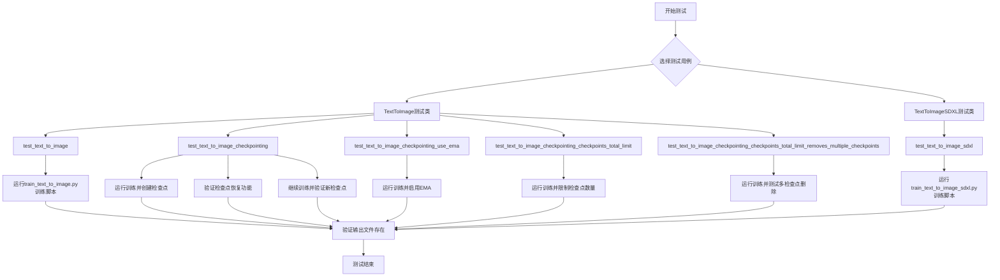

## 类结构

```
ExamplesTestsAccelerate (基类)
├── TextToImage (文本到图像SD测试类)
│   ├── test_text_to_image
│   ├── test_text_to_image_checkpointing
│   ├── test_text_to_image_checkpointing_use_ema
│   ├── test_text_to_image_checkpointing_checkpoints_total_limit
│   └── test_text_to_image_checkpointing_checkpoints_total_limit_removes_multiple_checkpoints
└── TextToImageSDXL (文本到图像SDXL测试类)
    └── test_text_to_image_sdxl
```

## 全局变量及字段


### `logger`
    
全局日志记录器，用于输出DEBUG级别的调试信息

类型：`logging.Logger`
    


### `stream_handler`
    
日志流处理器，将日志输出定向到标准输出(sys.stdout)

类型：`logging.StreamHandler`
    


### `tmpdir`
    
临时目录上下文管理器，用于存放训练输出和检查点，测试结束后自动清理

类型：`tempfile.TemporaryDirectory`
    


### `test_args`
    
文本到图像训练的命令行参数列表，包含模型路径、数据集、分辨率和训练超参数

类型：`List[str]`
    


### `initial_run_args`
    
初始训练的完整命令行参数列表，包含检查点配置和随机种子设置

类型：`List[str]`
    


### `resume_run_args`
    
从检查点恢复训练的完整命令行参数列表，包含resume_from_checkpoint配置

类型：`List[str]`
    


### `pretrained_model_name_or_path`
    
预训练模型的名称或本地路径，用于加载Stable Diffusion模型

类型：`str`
    


### `prompt`
    
用于图像生成的文本提示词，在推理测试中验证模型输出

类型：`str`
    


### `TextToImage._launch_args`
    
继承自ExamplesTestsAccelerate的加速测试启动参数列表，用于配置分布式训练环境

类型：`List[str]`
    


### `TextToImageSDXL._launch_args`
    
继承自ExamplesTestsAccelerate的加速测试启动参数列表，用于配置SDXL模型分布式训练环境

类型：`List[str]`
    
    

## 全局函数及方法


### `logging.basicConfig`

配置根日志记录器的默认处理程序、格式化器和级别。这是Python标准库logging模块中的函数，用于一次性配置日志系统。

参数：

- `level`：`int`，日志级别，用于设置根记录器的阈值。代码中传入`logging.DEBUG`（值为10），表示DEBUG级别及以上的日志都会被记录。

返回值：`None`，该函数不返回任何值，仅进行日志配置。

#### 流程图

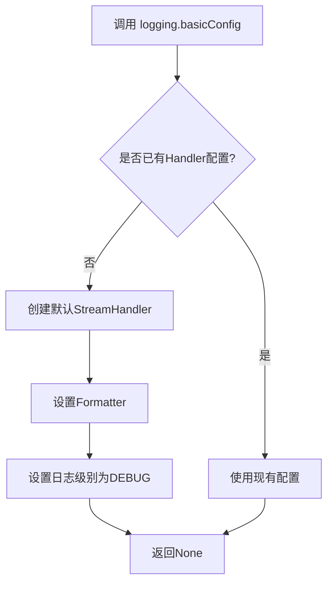

#### 带注释源码

```python
# 导入logging模块
import logging
import sys

# 配置根日志记录器
# level=logging.DEBUG 设置日志级别为DEBUG
# 这意味着DEBUG、INFO、WARNING、ERROR、CRITICAL级别的日志都会被输出
logging.basicConfig(level=logging.DEBUG)

# 获取根logger实例
logger = logging.getLogger()

# 创建标准输出流处理器
stream_handler = logging.StreamHandler(sys.stdout)

# 将处理器添加到logger
logger.addHandler(stream_handler)
```

#### 额外说明

| 属性 | 值 |
|------|-----|
| 函数所属模块 | `logging` (Python标准库) |
| 函数位置 | `logging/__init__.py` |
| 官方文档 | https://docs.python.org/3/library/logging.html#logging.basicConfig |

#### 技术债务与优化建议

1. **硬编码日志级别**：日志级别直接写死为`DEBUG`，在生产环境中可能导致过多日志输出，建议改为从环境变量或配置文件读取。
2. **缺少格式配置**：没有为handler设置formatter，导致日志输出格式为默认格式，可考虑自定义格式以提高可读性。
3. **重复handler风险**：多次调用`logging.basicConfig()`可能添加多个handler，建议添加`force=True`参数或在使用前检查handler是否已存在。


### `logging.getLogger`

获取或创建一个logger实例，用于记录应用程序的日志信息。

参数：

- `name`：`str`，可选，要获取的logger的名称。如果为空字符串或省略，则返回根logger。默认值为空字符串。

返回值：`logging.Logger`，返回一个Logger对象，可用于记录日志消息。

#### 流程图

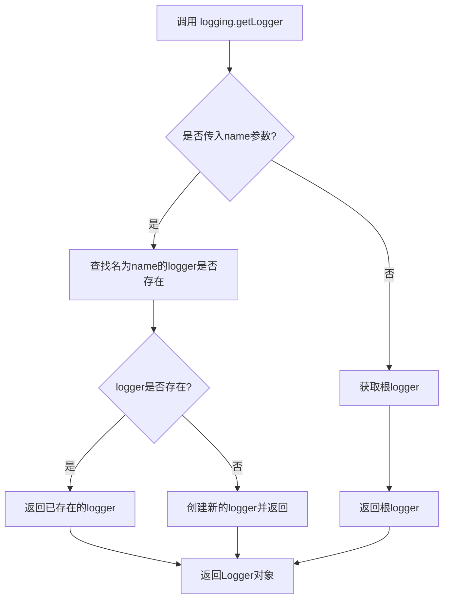

#### 带注释源码

```python
# 获取logger实例
# 如果不传入name参数，则返回根logger（root logger）
logger = logging.getLogger()

# 创建一个流处理器，将日志输出到标准输出（stdout）
stream_handler = logging.StreamHandler(sys.stdout)

# 为logger添加流处理器
logger.addHandler(stream_handler)

# 配置日志级别为DEBUG
logging.basicConfig(level=logging.DEBUG)
```

#### 补充说明

在代码中，`logging.getLogger()` 被用于获取根logger（root logger），然后通过添加 `StreamHandler` 将日志输出到标准输出。这是一种简单的日志配置方式，用于调试目的。Logger对象可以调用 `debug()`, `info()`, `warning()`, `error()`, `critical()` 等方法来记录不同级别的日志。


### `logging.StreamHandler`

`logging.StreamHandler` 是 Python 标准库 `logging` 模块中的一个类，用于创建日志处理器，将日志记录输出到指定的流（默认为 `sys.stderr`，在代码中指定为 `sys.stdout`）。

#### 参数

- `stream`：`typing.TextIO`，可选参数，默认值为 `sys.stderr`。指定日志输出目标流，代码中传入 `sys.stdout` 以将日志输出到标准输出。

#### 返回值

- `类型`：`logging.StreamHandler`
- `描述`：返回一个新的 StreamHandler 实例，用于将日志记录输出到指定的流。

#### 流程图

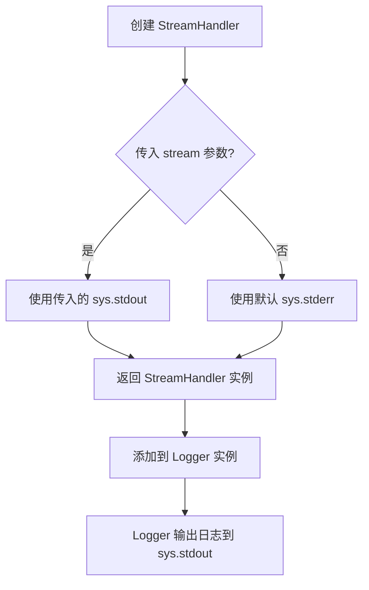

#### 带注释源码

```python
# 创建 StreamHandler 实例，指定输出流为 sys.stdout（标准输出）
# StreamHandler 是 logging 模块的内置类，用于处理日志输出到流
stream_handler = logging.StreamHandler(sys.stdout)

# 将创建的 StreamHandler 添加到根 Logger 实例
# 这样所有通过 logger 记录的日志都会通过 stream_handler 输出到 sys.stdout
logger.addHandler(stream_handler)
```

#### 关键组件信息

| 组件名称 | 一句话描述 |
|---------|-----------|
| `logging.StreamHandler` | Python 标准库日志处理器类，用于将日志输出到流（文件、控制台等） |
| `sys.stdout` | Python 标准输出流，用于日志输出到控制台 |

#### 技术债务与优化空间

1. **日志配置硬编码**：日志配置（`basicConfig` 和 `StreamHandler`）直接写在模块顶层，建议封装为独立的日志配置函数或类。
2. **缺乏日志格式化**：未设置 `logging.Formatter`，日志输出可能缺少时间戳、日志级别等关键信息。
3. **全局 logger 使用**：使用 `logging.getLogger()` 获取默认根 logger，建议使用具名 logger（`logging.getLogger(__name__)`）以支持更细粒度的日志控制。

#### 其他项目

- **错误处理**：StreamHandler 构造函数在传入无效流时可能抛出异常，但 Python 内置流通常不会出错。
- **外部依赖**：仅依赖 Python 标准库 `logging` 和 `sys` 模块。
- **设计约束**：日志级别设置为 `DEBUG`，在生产环境可能需要调整为 `INFO` 或 `WARNING`。


### `tempfile.TemporaryDirectory`

`tempfile.TemporaryDirectory` 是 Python 标准库中的一个类，用于创建一个唯一的临时目录，并在上下文管理器（`with` 语句）结束时自动清理该目录及其所有内容，确保临时资源得到正确释放。

参数：

- `suffix`：`str`，可选，后缀，用于临时目录名称（默认为空字符串）
- `prefix`：`str`，可选，前缀，用于临时目录名称（默认为 `'tmp'`）
- `dir`：`str`，可选，指定临时目录创建的父目录（默认为系统默认临时目录）

返回值：`str`，返回临时目录的路径字符串（在 `with` 语句中作为 `as` 的目标值）

#### 流程图

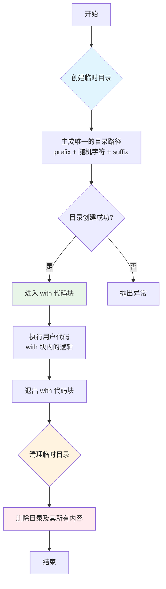

#### 带注释源码

```python
import tempfile
import shutil
import os

class TemporaryDirectory:
    """
    用于创建临时目录的上下文管理器。
    
    在创建时生成唯一的目录路径，在退出上下文时自动清理。
    """
    
    def __init__(self, suffix="", prefix="tmp", dir=None):
        """
        初始化临时目录管理器。
        
        Args:
            suffix: 目录名的后缀
            prefix: 目录名的前缀
            dir: 指定父目录，None 则使用系统默认临时目录
        """
        self.suffix = suffix
        self.prefix = prefix
        self.dir = dir
        self.name = None  # 存储生成的临时目录路径
    
    def __enter__(self):
        """
        进入上下文管理器，创建临时目录。
        
        Returns:
            str: 临时目录的绝对路径
        """
        # 使用 tempfile.mkdtemp 创建实际目录
        self.name = tempfile.mkdtemp(suffix=self.suffix, 
                                     prefix=self.prefix, 
                                     dir=self.dir)
        return self.name  # 返回目录路径供用户使用
    
    def __exit__(self, exc_type, exc_val, exc_tb):
        """
        退出上下文管理器，清理临时目录。
        
        Args:
            exc_type: 异常类型（如果有）
            exc_val: 异常值（如果有）
            exc_tb: 异常回溯（如果有）
        """
        # 检查目录是否存在，如果存在则删除
        if self.name is not None and os.path.exists(self.name):
            # 递归删除目录及其所有内容
            shutil.rmtree(self.name)
        return False  # 不抑制异常
    
    def cleanup(self):
        """
        手动清理临时目录的方法。
        """
        if self.name is not None and os.path.exists(self.name):
            shutil.rmtree(self.name)


# 使用示例
with tempfile.TemporaryDirectory() as tmpdir:
    # tmpdir 是临时目录的路径
    # 在这里执行需要临时目录的操作
    print(f"临时目录: {tmpdir}")
    # 可以创建文件、写入数据等
    pass
# 退出 with 块后，tmpdir 及其内容会被自动删除
```


### `run_command`

`run_command` 是一个全局函数，用于在子进程中执行命令行指令，并返回命令的退出状态码或输出结果。该函数通常与 `ExamplesTestsAccelerate` 类配合使用，用于在测试环境中运行训练脚本（如 `train_text_to_image.py`）。

参数：

- `cmd`：`List[str]`，表示要执行的命令列表，包含命令行程序及其参数。调用时通常会将 `self._launch_args`（加速器启动参数）与具体的测试参数（如训练脚本路径、模型名称、数据集参数等）进行拼接。

返回值：`int` 或 `None`，通常返回命令执行的退出码（0 表示成功），也可能直接返回命令的输出内容。

#### 流程图

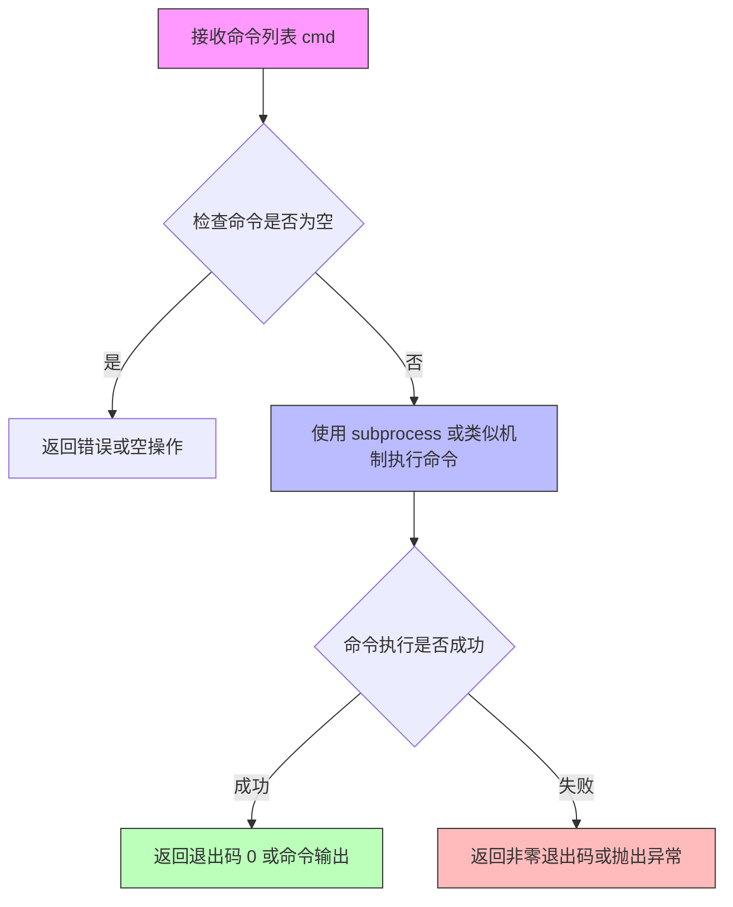

#### 带注释源码

```python
# 该函数定义在 test_examples_utils 模块中（代码中未直接给出实现）
# 以下为基于调用方式的推断性注释

def run_command(cmd: List[str]) -> int:
    """
    执行给定的命令行命令。
    
    参数:
        cmd: 命令列表，例如 ['python', 'script.py', '--arg1', 'value1']
    
    返回值:
        命令的退出码，0 表示成功，非 0 表示失败
    """
    # 实际实现可能使用 subprocess.run() 或 subprocess.Popen()
    # 示例：
    # result = subprocess.run(cmd, capture_output=True, text=True)
    # return result.returncode
    pass
```

---

**注意**：由于 `run_command` 函数的具体实现未在当前代码文件中给出（它是从 `test_examples_utils` 模块导入的），上述参数和返回值信息是基于其在代码中的使用方式推断得出的。


### `DiffusionPipeline.from_pretrained`

该方法用于从预训练模型路径或 HuggingFace Hub 模型 ID 加载 Diffusers 管道，支持自定义组件（如 unet、safety_checker 等）覆盖，并自动处理设备分配和模型配置。

参数：

- `pretrained_model_name_or_path`：`Union[str, Path]`：预训练模型的路径或 HuggingFace Hub 上的模型 ID，可以是本地目录或远程仓库
- `torch_dtype`：`Optional[Union[torch.dtype, str]]`，可选：指定模型加载的浮点数据类型（如 `torch.float16`）
- `config`：`Optional[Union[str, Dict]]`，可选：管道配置，可以是路径或字典
- `cache_dir`：`Optional[str]`，可选：模型缓存目录路径
- `resume_download`：`bool`，可选：是否恢复中断的下载，默认为 `True`
- `force_download`：`bool`，可选：是否强制重新下载模型，默认为 `False`
- `proxies`：`Optional[Dict[str, str]]`，可选：代理服务器配置字典
- `local_files_only`：`bool`，可选：是否仅使用本地文件，默认为 `False`
- `use_auth_token`：`Optional[str]`，可选：访问私有模型所需的认证 token
- `revision`：`str`，可选：模型版本分支或提交 ID，默认为 `"main"`
- `variant`：`Optional[str]`，可选：模型变体（如 `"fp16"`）
- `use_safetensors`：`Optional[bool]`，可选：是否使用 `.safetensors` 格式权重文件
- `device_map`：`Optional[Union[str, Dict[str, Union[int, str]]]]`，可选：设备映射策略，用于模型在多 GPU 间的分配
- `max_memory`：`Optional[Dict[Union[str, int], int]]`，可选：每个设备的最大内存限制
- `offload_folder`：`Optional[str]`，可选：CPU 卸载文件夹路径
- `offload_state_dict`：`bool`，可选：是否将 state dict 卸载到 CPU
- `low_cpu_mem_usage`：`bool`，可选：是否优化 CPU 内存使用
- `patch_attention_processor`：`bool`，可选：是否应用自定义注意力处理器
- `use_flash_attention_2`：`Optional[bool]`，可选：是否启用 Flash Attention 2
- `*args`：`Any`，可选：位置参数，用于传递额外组件
- `**kwargs`：`Any`，可选：关键字参数，用于传递额外组件（如 `unet`、`safety_checker`、`scheduler` 等）

返回值：`DiffusionPipeline`：加载并配置好的扩散管道对象，可直接用于推理

#### 流程图

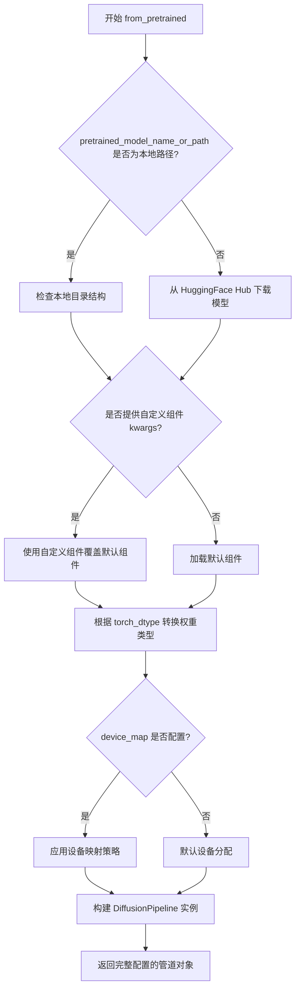

#### 带注释源码

```python
# 代码中的实际调用示例（来自测试文件）

# 场景1：从训练输出目录加载完整的管道（包括所有组件）
pipe = DiffusionPipeline.from_pretrained(tmpdir, safety_checker=None)
# 参数说明：
#   tmpdir: str - 训练脚本输出的目录路径，包含 unet、scheduler 等子文件夹
#   safety_checker: None - 显式设置为 None 以禁用安全检查器组件

# 场景2：从预训练模型加载，并使用自定义的 unet 组件覆盖
unet = UNet2DConditionModel.from_pretrained(tmpdir, subfolder="checkpoint-2/unet")
pipe = DiffusionPipeline.from_pretrained(pretrained_model_name_or_path, unet=unet, safety_checker=None)
# 参数说明：
#   pretrained_model_name_or_path: str - HuggingFace Hub 上的预训练模型名称
#   unet: UNet2DConditionModel - 从检查点加载的自定义 UNet 模型
#   safety_checker: None - 禁用安全检查器
```


### `UNet2DConditionModel.from_pretrained`

该方法是 HuggingFace diffusers 库中 `UNet2DConditionModel` 类继承自 `PretrainedMixin` 的类方法，用于从预训练模型目录或 HuggingFace Hub 模型 ID 加载 UNet2DConditionModel 实例，支持从子文件夹（如训练检查点）加载特定权重。

参数：

- `pretrained_model_name_or_path`：`Union[str, Path]`，模型目录路径或 HuggingFace Hub 上的模型 ID
- `subfolder`：`Optional[str]`，可选参数，指定从哪个子文件夹加载模型权重（如检查点目录）
- `torch_dtype`：`Optional[torch.dtype]`，可选参数，指定加载模型的张量数据类型
- `use_safetensors`：`Optional[bool]`，可选参数，是否使用 safetensors 格式加载模型
- `variant`：`Optional[str]`，可选参数，指定模型变体（如 "fp16"）
- `cache_dir`：`Optional[str]`，可选参数，模型缓存目录

返回值：`UNet2DConditionModel`，加载后的 UNet2DConditionModel 模型实例

#### 流程图

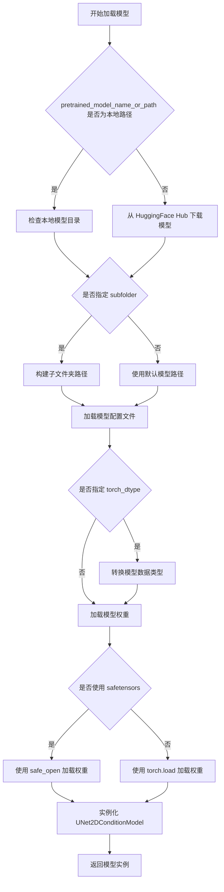

#### 带注释源码

```python
# 代码中的实际调用示例
# 第一次调用：从检查点加载 UNet 模型
unet = UNet2DConditionModel.from_pretrained(
    tmpdir,                    # 预训练模型路径（本地训练输出目录）
    subfolder="checkpoint-2/unet"  # 子文件夹路径（检查点中的 UNet 目录）
)

# 第二次调用：同样从另一个检查点加载
unet = UNet2DConditionModel.from_pretrained(
    tmpdir,                    # 预训练模型路径
    subfolder="checkpoint-2/unet"  # 子文件夹路径
)

# 该方法继承自 diffusers.models.modeling_utils.PretrainedMixin
# 实际实现位于 transformers 库的 PretrainedMixin 类中
# 核心逻辑：
# 1. 解析模型路径或 Hub ID
# 2. 加载配置文件 (config.json)
# 3. 确定权重文件 (diffusion_pytorch_model.safetensors 或 .bin)
# 4. 实例化模型对象
# 5. 加载权重到模型
# 6. 返回模型实例
```


### `os.path.isfile`

该函数是 Python 标准库 `os.path` 模块中的方法，用于检查给定路径是否指向一个存在的普通文件（非目录、符号链接或其他文件类型）。

参数：

- `path`：`str` 或 `PathLike`，需要检查的文件路径

返回值：`bool`，如果路径指向一个存在的普通文件则返回 `True`，否则返回 `False`

#### 流程图

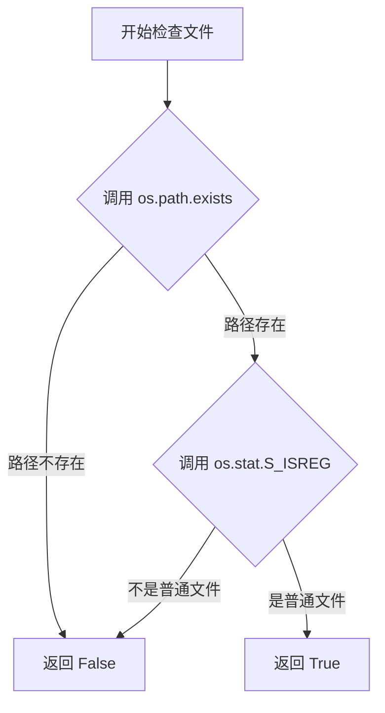

#### 带注释源码

```python
# os.path.isfile 的实现源码（来自 CPython 标准库）

def isfile(path):
    """
    检查路径是否是普通文件
    
    参数:
        path: 文件路径 (str 或 PathLike)
    
    返回:
        bool: 如果是普通文件返回 True，否则返回 False
    """
    try:
        # os.stat 获取文件状态信息
        st = os.stat(path)
        # stat.S_ISREG(mode) 检查是否为普通文件
        # 普通文件: regular file (不是目录、符号链接、套接字等)
        return stat.S_ISREG(st.st_mode)
    except (OSError, ValueError):
        # 如果路径不存在或无法访问，返回 False
        return False
```

#### 在项目代码中的使用示例

```python
# 在 test_text_to_image 方法中验证训练输出文件是否生成
self.assertTrue(os.path.isfile(os.path.join(tmpdir, "unet", "diffusion_pytorch_model.safetensors")))
self.assertTrue(os.path.isfile(os.path.join(tmpdir, "scheduler", "scheduler_config.json")))
```

#### 关键信息总结

| 项目 | 详情 |
|------|------|
| 所属模块 | `os.path` |
| 函数类型 | 标准库函数 |
| 异常处理 | 捕获 `OSError` 和 `ValueError` 异常 |
| 底层实现 | 调用 `os.stat()` 并通过 `stat.S_ISREG()` 判断文件类型 |
| 使用场景 | 在测试代码中验证训练脚本输出文件是否正确生成 |


### `os.path.join`

`os.path.join` 是 Python 标准库 `os` 模块中的一个函数，用于将多个路径组件智能地拼接成一个完整的路径字符串，自动处理不同操作系统（Windows/Linux/macOS）下的路径分隔符差异，确保生成的路径符合当前操作系统的规范。

参数：

- `*paths`：可变数量的路径组件（`str`），需要拼接的路径部分，可以是目录名、文件名或子路径

返回值：`str`，拼接后的完整路径字符串

#### 流程图

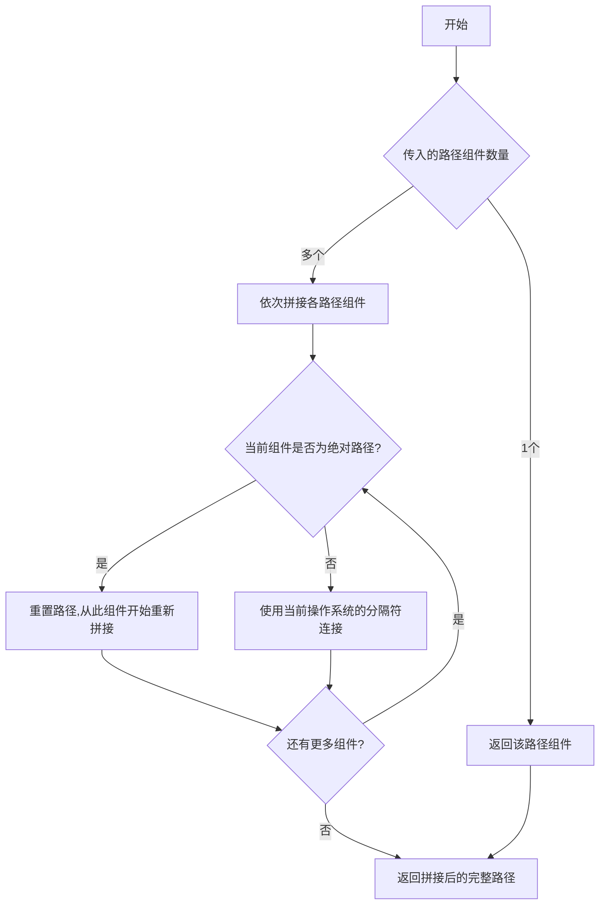

#### 带注释源码

```python
# os.path.join 是 Python 标准库函数，这里展示在代码中的典型用法：

# 用法1：拼接目录和文件名，检查模型文件是否存在
self.assertTrue(os.path.isfile(os.path.join(tmpdir, "unet", "diffusion_pytorch_model.safetensors")))

# 用法2：拼接目录和配置文件路径
self.assertTrue(os.path.isfile(os.path.join(tmpdir, "scheduler", "scheduler_config.json")))

# 用法3：拼接目录和检查点目录路径，用于删除检查点
shutil.rmtree(os.path.join(tmpdir, "checkpoint-2"))

# 用法4：在 from_pretrained 中指定子文件夹路径（subfolder参数内部使用 os.path.join 逻辑）
unet = UNet2DConditionModel.from_pretrained(tmpdir, subfolder="checkpoint-2/unet")
```


### `os.listdir`

`os.listdir` 是 Python 标准库 `os` 模块中的一个函数，用于返回指定目录中所有文件和子目录的名称列表。在本代码中，该函数被用于测试训练脚本生成检查点目录后，验证检查点是否正确创建。

参数：

- `path`：`str`，可选参数，要列出内容的目录路径。如果未提供或为 `None`，则默认为当前工作目录。在本代码中，传入的是 `tmpdir`（临时目录路径）。

返回值：`list[str]`，返回一个列表，其中包含指定目录中的所有文件和子目录的名称（不含路径）。在代码中，该返回值被用于通过集合推导式筛选出包含 "checkpoint" 关键字的目录名称，以便进行测试断言。

#### 流程图

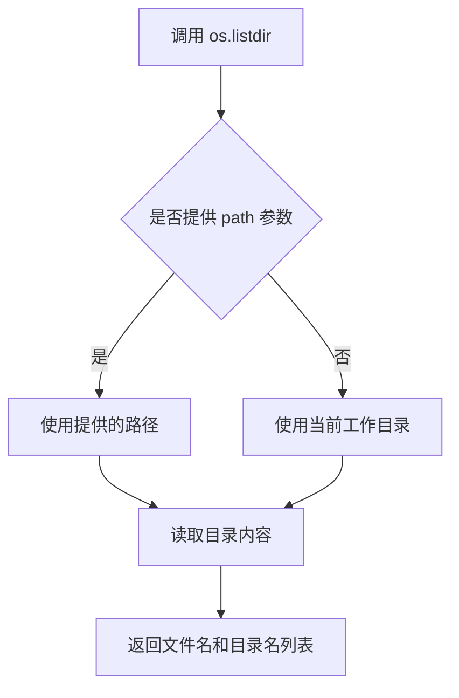

#### 带注释源码

```python
# os.listdir 函数签名
# os.listdir(path=None)
# 
# 在本代码中的实际使用示例：

# 1. 在 test_text_to_image_checkpointing 方法中
# 获取临时目录中的所有条目，并通过集合推导式筛选出包含 'checkpoint' 的目录
{x for x in os.listdir(tmpdir) if "checkpoint" in x}

# 完整上下文：
self.assertEqual(
    {x for x in os.listdir(tmpdir) if "checkpoint" in x},
    {"checkpoint-2", "checkpoint-4"},
)

# 2. 在 test_text_to_image_checkpointing_use_ema 方法中
self.assertEqual(
    {x for x in os.listdir(tmpdir) if "checkpoint" in x},
    {"checkpoint-2", "checkpoint-4"},
)

# 3. 在 test_text_to_image_checkpointing_checkpoints_total_limit 方法中
# 注意：这里只期望两个检查点，因为 checkpoint-2 应该被删除
self.assertEqual({x for x in os.listdir(tmpdir) if "checkpoint" in x}, {"checkpoint-4", "checkpoint-6"})

# 4. 在 test_text_to_image_checkpointing_checkpoints_total_limit_removes_multiple_checkpoints 方法中
self.assertEqual(
    {x for x in os.listdir(tmpdir) if "checkpoint" in x},
    {"checkpoint-2", "checkpoint-4"},
)

# 以及后续的断言
self.assertEqual(
    {x for x in os.listdir(tmpdir) if "checkpoint" in x},
    {"checkpoint-6", "checkpoint-8"},
)
```


### `shutil.rmtree`

该函数是Python标准库shutil模块提供的目录树删除功能，用于递归删除指定的目录及其所有内容。在代码中用于删除训练过程中不再需要的检查点目录。

参数：

- `path`：str 或 os.PathLike，要删除的目录路径
- `ignore_errors`：bool，可选参数，如果设为True，则忽略删除过程中的错误
- `onerror`：callable，可选参数，一个可调用对象（函数），用于处理删除过程中发生的错误

返回值：`None`，该函数不返回任何值

#### 流程图

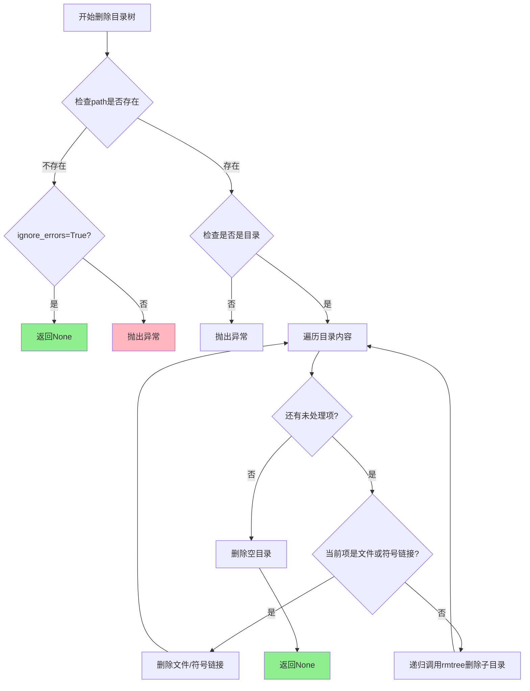

#### 带注释源码

```python
# shutil.rmtree 实现原理（简化版注释）

def rmtree(path, ignore_errors=False, onerror=None):
    """
    递归删除目录树。
    
    参数:
        path: 要删除的目录路径
        ignore_errors: 如果为True，忽略所有错误
        onerror: 自定义错误处理函数
    """
    
    # 1. 将路径转换为绝对路径
    path = os.fspath(path)
    
    # 2. 如果忽略错误，设置默认的空错误处理函数
    if ignore_errors:
        def onerror(*args):
            pass
    # 3. 如果没有提供错误处理函数且不忽略错误，则使用默认处理
    elif onerror is None:
        def onerror(*args):
            raise
    
    # 4. 尝试遍历并删除目录内容
    try:
        # 获取目录下的所有条目（文件、子目录、符号链接等）
        with os.scandir(path) as scandir_it:
            entries = list(scandir_it)
    except OSError:
        # 如果扫描失败，调用错误处理函数
        onerror(os.scandir, path, sys.exc_info())
        return
    
    # 5. 递归删除所有条目
    for entry in entries:
        full_path = entry.path
        
        # 6. 检查条目类型并相应处理
        if entry.is_symlink():
            # 符号链接：直接删除链接，不跟踪
            os.unlink(full_path)
        elif entry.is_dir():
            # 子目录：递归调用rmtree
            rmtree(full_path, ignore_errors, onerror)
        else:
            # 普通文件：删除文件
            os.unlink(full_path)
    
    # 7. 最后删除空目录本身
    try:
        os.rmdir(path)
    except OSError:
        onerror(os.rmdir, path, sys.exc_info())
```


### `TextToImage.test_text_to_image`

该方法是一个集成测试用例，用于验证文本到图像（Text-to-Image）训练流程是否正确工作。它通过运行 `train_text_to_image.py` 脚本执行一个最小化的训练任务（仅2步），然后检查输出目录中是否生成了必要的模型文件（UNet权重和调度器配置），以确保训练管道和模型保存功能正常工作。

参数：

- `self`：继承自 `ExamplesTestsAccelerate` 的实例对象，包含测试框架所需的上下文和 `_launch_args` 属性

返回值：`None`，该方法无返回值，通过 `assertTrue` 断言验证训练输出

#### 流程图

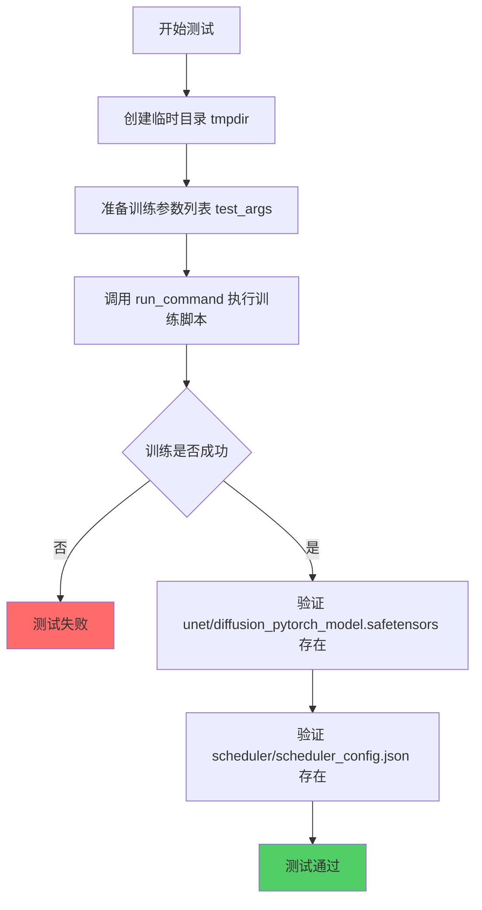

#### 带注释源码

```python
def test_text_to_image(self):
    """
    测试文本到图像训练流程的集成测试方法。
    验证训练脚本能够正常运行并保存模型检查点。
    """
    # 使用 tempfile 创建临时目录作为输出目录，测试结束后自动清理
    with tempfile.TemporaryDirectory() as tmpdir:
        # 定义训练脚本的命令行参数
        # 使用预训练的小型Stable Diffusion模型进行快速测试
        test_args = f"""
            examples/text_to_image/train_text_to_image.py
            --pretrained_model_name_or_path hf-internal-testing/tiny-stable-diffusion-pipe
            --dataset_name hf-internal-testing/dummy_image_text_data
            --resolution 64                    # 使用低分辨率64加快测试速度
            --center_crop                       # 启用中心裁剪
            --random_flip                       # 启用随机水平翻转
            --train_batch_size 1                # 批次大小为1
            --gradient_accumulation_steps 1     # 梯度累积步数为1
            --max_train_steps 2                 # 仅训练2步用于快速验证
            --learning_rate 5.0e-04             # 学习率
            --scale_lr                          # 自动缩放学习率
            --lr_scheduler constant             # 使用恒定学习率调度器
            --lr_warmup_steps 0                 # 无预热步数
            --output_dir {tmpdir}               # 输出到临时目录
            """.split()

        # 运行训练命令，合并加速启动参数和训练参数
        # run_command 会执行完整的训练流程
        run_command(self._launch_args + test_args)
        
        # ====== 验证输出文件 ======
        # smoke test: 确保 save_pretrained 正确保存了模型
        
        # 验证 UNet 模型权重文件存在
        self.assertTrue(os.path.isfile(os.path.join(tmpdir, "unet", "diffusion_pytorch_model.safetensors")))
        
        # 验证调度器配置文件存在
        self.assertTrue(os.path.isfile(os.path.join(tmpdir, "scheduler", "scheduler_config.json")))
```


### `TextToImage.test_text_to_image_checkpointing`

该测试方法验证了文本到图像模型训练过程中的检查点（checkpoint）保存与恢复功能。测试涵盖三个核心场景：初始训练时按设定步数定期保存检查点、从中间检查点恢复推理、以及从检查点恢复继续训练并生成新的检查点。

参数：
- 无显式参数（方法内部使用 `self._launch_args` 继承自父类 `ExamplesTestsAccelerate`）
- 内部变量：
  - `pretrained_model_name_or_path`：`str`，预训练模型路径（"hf-internal-testing/tiny-stable-diffusion-pipe"）
  - `prompt`：`str`，用于推理测试的提示词（"a prompt"）

返回值：`None`，无返回值（测试方法）

#### 流程图

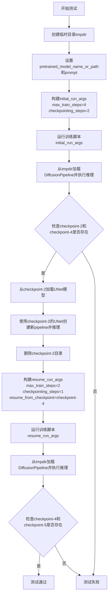

#### 带注释源码

```python
def test_text_to_image_checkpointing(self):
    """
    测试文本到图像模型的检查点保存与恢复功能
    
    测试场景：
    1. 初始训练：max_train_steps=4, checkpointing_steps=2，应创建checkpoint-2和checkpoint-4
    2. 从checkpoint-2加载模型进行推理验证
    3. 删除checkpoint-2后，从checkpoint-4恢复训练
    4. 继续训练：max_train_steps=2, checkpointing_steps=1，应创建checkpoint-5
    """
    # 定义预训练模型路径和测试用提示词
    pretrained_model_name_or_path = "hf-internal-testing/tiny-stable-diffusion-pipe"
    prompt = "a prompt"

    # 使用临时目录作为输出目录，测试完成后自动清理
    with tempfile.TemporaryDirectory() as tmpdir:
        # =====================================================
        # 第一阶段：初始训练，创建检查点
        # =====================================================
        # 配置参数：
        # - max_train_steps=4: 最多训练4步
        # - checkpointing_steps=2: 每2步保存一个检查点
        # - seed=0: 固定随机种子以确保可复现性
        initial_run_args = f"""
            examples/text_to_image/train_text_to_image.py
            --pretrained_model_name_or_path {pretrained_model_name_or_path}
            --dataset_name hf-internal-testing/dummy_image_text_data
            --resolution 64
            --center_crop
            --random_flip
            --train_batch_size 1
            --gradient_accumulation_steps 1
            --max_train_steps 4
            --learning_rate 5.0e-04
            --scale_lr
            --lr_scheduler constant
            --lr_warmup_steps 0
            --output_dir {tmpdir}
            --checkpointing_steps=2
            --seed=0
            """.split()

        # 执行初始训练命令
        run_command(self._launch_args + initial_run_args)

        # 加载训练好的pipeline并执行一次推理（冒烟测试）
        pipe = DiffusionPipeline.from_pretrained(tmpdir, safety_checker=None)
        pipe(prompt, num_inference_steps=1)

        # =====================================================
        # 验证第一阶段结果
        # =====================================================
        # 断言：检查点目录应为checkpoint-2和checkpoint-4
        self.assertEqual(
            {x for x in os.listdir(tmpdir) if "checkpoint" in x},
            {"checkpoint-2", "checkpoint-4"},
        )

        # =====================================================
        # 第二阶段：从中间检查点加载并推理
        # =====================================================
        # 从checkpoint-2加载UNet模型权重
        unet = UNet2DConditionModel.from_pretrained(tmpdir, subfolder="checkpoint-2/unet")
        # 使用预训练模型的其他组件（如VAE、scheduler等），仅替换UNet
        pipe = DiffusionPipeline.from_pretrained(pretrained_model_name_or_path, unet=unet, safety_checker=None)
        pipe(prompt, num_inference_steps=1)

        # =====================================================
        # 准备第三阶段：删除旧检查点
        # =====================================================
        # 删除checkpoint-2，模拟只保留后续检查点的场景
        shutil.rmtree(os.path.join(tmpdir, "checkpoint-2"))

        # =====================================================
        # 第三阶段：从检查点恢复继续训练
        # =====================================================
        # 配置参数：
        # - max_train_steps=2: 继续训练2步（从step 4继续，总计达到step 6）
        # - checkpointing_steps=1: 每1步保存一个检查点
        # - resume_from_checkpoint=checkpoint-4: 从第4步的检查点恢复
        resume_run_args = f"""
            examples/text_to_image/train_text_to_image.py
            --pretrained_model_name_or_path {pretrained_model_name_or_path}
            --dataset_name hf-internal-testing/dummy_image_text_data
            --resolution 64
            --center_crop
            --random_flip
            --train_batch_size 1
            --gradient_accumulation_steps 1
            --max_train_steps 2
            --learning_rate 5.0e-04
            --scale_lr
            --lr_scheduler constant
            --lr_warmup_steps 0
            --output_dir {tmpdir}
            --checkpointing_steps=1
            --resume_from_checkpoint=checkpoint-4
            --seed=0
            """.split()

        # 执行恢复训练命令
        run_command(self._launch_args + resume_run_args)

        # =====================================================
        # 验证最终结果
        # =====================================================
        # 加载完整训练好的pipeline并执行推理
        pipe = DiffusionPipeline.from_pretrained(tmpdir, safety_checker=None)
        pipe(prompt, num_inference_steps=1)

        # 断言：
        # - checkpoint-2已被删除（旧检查点不存在）
        # - checkpoint-4仍然保留（恢复点）
        # - checkpoint-5为新创建的检查点
        self.assertEqual(
            {x for x in os.listdir(tmpdir) if "checkpoint" in x},
            {"checkpoint-4", "checkpoint-5"},
        )
```


### `TextToImage.test_text_to_image_checkpointing_use_ema`

该测试方法用于验证在使用指数移动平均（EMA）的情况下，文本到图像模型的检查点保存与恢复功能是否正常工作。测试流程包括：运行训练脚本创建检查点、验证中间检查点可被加载、删除早期检查点后恢复训练、验证新检查点正确生成。

参数：
- 无显式参数（方法隐式接收 `self` 作为实例引用）

返回值：`None`，无返回值（测试方法，执行一系列断言验证）

#### 流程图

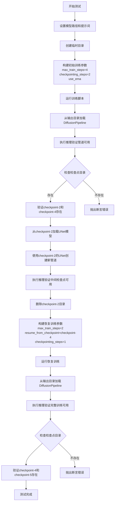

#### 带注释源码

```python
def test_text_to_image_checkpointing_use_ema(self):
    """
    测试使用 EMA (指数移动平均) 时的检查点保存与恢复功能
    
    测试场景：
    1. 初始训练：max_train_steps=4, checkpointing_steps=2, 启用EMA
       - 预期创建 checkpoint-2 和 checkpoint-4
    2. 恢复训练：从 checkpoint-4 恢复，max_train_steps=2, checkpointing_steps=1
       - 预期创建 checkpoint-5，保留 checkpoint-4
    """
    # 定义预训练模型路径和测试用的提示词
    pretrained_model_name_or_path = "hf-internal-testing/tiny-stable-diffusion-pipe"
    prompt = "a prompt"

    # 创建临时目录用于存放训练输出和检查点
    with tempfile.TemporaryDirectory() as tmpdir:
        # ========================================
        # 第一阶段：初始训练（创建检查点）
        # ========================================
        
        # 构建初始训练命令行参数
        # --max_train_steps=4: 总训练步数为4步
        # --checkpointing_steps=2: 每2步保存一个检查点
        # --use_ema: 启用指数移动平均
        # --seed=0: 设置随机种子确保可复现性
        initial_run_args = f"""
            examples/text_to_image/train_text_to_image.py
            --pretrained_model_name_or_path {pretrained_model_name_or_path}
            --dataset_name hf-internal-testing/dummy_image_text_data
            --resolution 64
            --center_crop
            --random_flip
            --train_batch_size 1
            --gradient_accumulation_steps 1
            --max_train_steps 4
            --learning_rate 5.0e-04
            --scale_lr
            --lr_scheduler constant
            --lr_warmup_steps 0
            --output_dir {tmpdir}
            --checkpointing_steps=2
            --use_ema
            --seed=0
            """.split()

        # 执行训练脚本
        run_command(self._launch_args + initial_run_args)

        # 从输出目录加载完整的DiffusionPipeline进行验证
        pipe = DiffusionPipeline.from_pretrained(tmpdir, safety_checker=None)
        # 执行一次推理验证管道功能正常
        pipe(prompt, num_inference_steps=2)

        # 验证检查点目录是否按预期创建
        # 预期存在：checkpoint-2 和 checkpoint-4
        self.assertEqual(
            {x for x in os.listdir(tmpdir) if "checkpoint" in x},
            {"checkpoint-2", "checkpoint-4"},
        )

        # ========================================
        # 第二阶段：验证中间检查点可用性
        # ========================================
        
        # 从checkpoint-2加载UNet模型权重
        unet = UNet2DConditionModel.from_pretrained(tmpdir, subfolder="checkpoint-2/unet")
        # 使用加载的UNet创建新的DiffusionPipeline
        pipe = DiffusionPipeline.from_pretrained(pretrained_model_name_or_path, unet=unet, safety_checker=None)
        # 执行推理验证中间检查点可以正常加载使用
        pipe(prompt, num_inference_steps=1)

        # ========================================
        # 第三阶段：删除早期检查点，准备恢复训练
        # ========================================
        
        # 手动删除checkpoint-2目录，模拟只保留后续检查点的场景
        shutil.rmtree(os.path.join(tmpdir, "checkpoint-2"))

        # ========================================
        # 第四阶段：从检查点恢复训练
        # ========================================
        
        # 构建恢复训练参数
        # --resume_from_checkpoint=checkpoint-4: 从第4步的检查点恢复
        # --checkpointing_steps=1: 改为每1步保存一个检查点
        # --max_train_steps=2: 继续训练2步（从step 4到step 5，再保存step 5）
        resume_run_args = f"""
            examples/text_to_image/train_text_to_image.py
            --pretrained_model_name_or_path {pretrained_model_name_or_path}
            --dataset_name hf-internal-testing/dummy_image_text_data
            --resolution 64
            --center_crop
            --random_flip
            --train_batch_size 1
            --gradient_accumulation_steps 1
            --max_train_steps 2
            --learning_rate 5.0e-04
            --scale_lr
            --lr_scheduler constant
            --lr_warmup_steps 0
            --output_dir {tmpdir}
            --checkpointing_steps=1
            --resume_from_checkpoint=checkpoint-4
            --use_ema
            --seed=0
            """.split()

        # 执行恢复训练
        run_command(self._launch_args + resume_run_args)

        # 验证恢复训练后的管道功能
        pipe = DiffusionPipeline.from_pretrained(tmpdir, safety_checker=None)
        pipe(prompt, num_inference_steps=1)

        # ========================================
        # 第五阶段：验证最终检查点状态
        # ========================================
        
        # 验证检查点状态：
        # - checkpoint-2 已被手动删除，不应存在
        # - checkpoint-4 保留（恢复起点）
        # - checkpoint-5 新创建（恢复后训练2步，checkpointing_steps=1）
        self.assertEqual(
            {x for x in os.listdir(tmpdir) if "checkpoint" in x},
            {"checkpoint-4", "checkpoint-5"},
        )
```


### `TextToImage.test_text_to_image_checkpointing_checkpoints_total_limit`

这是一个测试方法，用于验证文本到图像训练脚本中的检查点总数限制（checkpoints_total_limit）功能。该测试运行训练脚本，配置 `max_train_steps=6`、`checkpointing_steps=2`、`checkpoints_total_limit=2`，预期在步骤 2、4、6 创建检查点，但最早创建的检查点（step-2）会被自动删除以保持总数量不超过限制。

参数：无（仅包含 `self` 隐式参数）

返回值：`None`，无返回值（测试方法）

#### 流程图

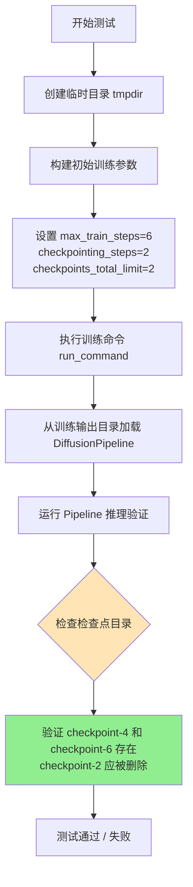

#### 带注释源码

```python
def test_text_to_image_checkpointing_checkpoints_total_limit(self):
    """
    测试检查点总数限制功能
    验证当设置 checkpoints_total_limit=2 时，
    训练过程中会自动删除最早的检查点以保持总数不超过限制
    """
    # 预训练模型名称或路径
    pretrained_model_name_or_path = "hf-internal-testing/tiny-stable-diffusion-pipe"
    # 测试用的提示词
    prompt = "a prompt"

    # 创建临时目录用于存放训练输出和检查点
    with tempfile.TemporaryDirectory() as tmpdir:
        # 构建初始训练参数
        # 配置说明：
        # - max_train_steps=6: 总训练步数为 6
        # - checkpointing_steps=2: 每 2 步保存一个检查点
        # - checkpoints_total_limit=2: 最多保留 2 个检查点
        # 预期行为：创建检查点 at step 2, 4, 6，但 step 2 会被删除
        initial_run_args = f"""
            examples/text_to_image/train_text_to_image.py
            --pretrained_model_name_or_path {pretrained_model_name_or_path}
            --dataset_name hf-internal-testing/dummy_image_text_data
            --resolution 64
            --center_crop
            --random_flip
            --train_batch_size 1
            --gradient_accumulation_steps 1
            --max_train_steps 6
            --learning_rate 5.0e-04
            --scale_lr
            --lr_scheduler constant
            --lr_warmup_steps 0
            --output_dir {tmpdir}
            --checkpointing_steps=2
            --checkpoints_total_limit=2
            --seed=0
            """.split()

        # 执行训练命令，使用加速器启动参数
        run_command(self._launch_args + initial_run_args)

        # 从训练输出目录加载 DiffusionPipeline
        pipe = DiffusionPipeline.from_pretrained(tmpdir, safety_checker=None)
        # 运行推理验证模型可用性
        pipe(prompt, num_inference_steps=1)

        # 检查检查点目录是否存在
        # 预期：checkpoint-2 已被删除（因为总数限制为 2）
        # 只保留 checkpoint-4 和 checkpoint-6
        self.assertEqual(
            {x for x in os.listdir(tmpdir) if "checkpoint" in x},
            {"checkpoint-4", "checkpoint-6"},
        )
```


### `TextToImage.test_text_to_image_checkpointing_checkpoints_total_limit_removes_multiple_checkpoints`

该测试方法验证了当设置 `checkpoints_total_limit=2` 时，训练脚本能够正确删除多个旧的 checkpoint，以确保只保留指定数量的最新 checkpoint。

参数：

- `self`：实例方法隐式参数，类型为 `TextToImage` 类实例，无需显式描述

返回值：`None`，该测试方法通过断言验证 checkpoint 的正确性，不返回任何值

#### 流程图

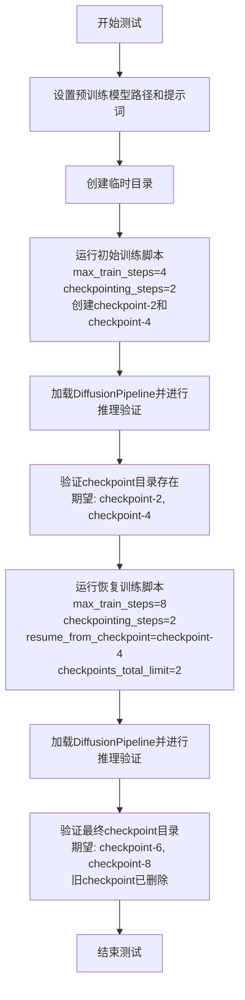

#### 带注释源码

```python
def test_text_to_image_checkpointing_checkpoints_total_limit_removes_multiple_checkpoints(self):
    """
    测试当设置 checkpoints_total_limit=2 时，
    训练脚本能够正确删除多个旧 checkpoint，
    确保只保留最近的两个 checkpoint。
    """
    # 定义预训练模型名称和提示词
    pretrained_model_name_or_path = "hf-internal-testing/tiny-stable-diffusion-pipe"
    prompt = "a prompt"

    # 创建临时目录用于存放训练输出和 checkpoint
    with tempfile.TemporaryDirectory() as tmpdir:
        # ========== 第一阶段：初始训练 ==========
        # 运行训练脚本，max_train_steps=4, checkpointing_steps=2
        # 预期在步骤 2 和 4 创建 checkpoint
        
        initial_run_args = f"""
            examples/text_to_image/train_text_to_image.py
            --pretrained_model_name_or_path {pretrained_model_name_or_path}
            --dataset_name hf-internal-testing/dummy_image_text_data
            --resolution 64
            --center_crop
            --random_flip
            --train_batch_size 1
            --gradient_accumulation_steps 1
            --max_train_steps 4
            --learning_rate 5.0e-04
            --scale_lr
            --lr_scheduler constant
            --lr_warmup_steps 0
            --output_dir {tmpdir}
            --checkpointing_steps=2
            --seed=0
            """.split()

        # 执行初始训练命令
        run_command(self._launch_args + initial_run_args)

        # 加载训练好的 pipeline 并进行推理验证
        pipe = DiffusionPipeline.from_pretrained(tmpdir, safety_checker=None)
        pipe(prompt, num_inference_steps=1)

        # 验证初始 checkpoint 目录存在
        # 预期: checkpoint-2, checkpoint-4
        self.assertEqual(
            {x for x in os.listdir(tmpdir) if "checkpoint" in x},
            {"checkpoint-2", "checkpoint-4"},
        )

        # ========== 第二阶段：恢复训练 ==========
        # 继续训练至 max_train_steps=8，从 checkpoint-4 恢复
        # 设置 checkpoints_total_limit=2，预期删除 checkpoint-2 和 checkpoint-4
        # 因为需要保留 checkpoint-6 和 checkpoint-8 (最近的两个)
        
        resume_run_args = f"""
            examples/text_to_image/train_text_to_image.py
            --pretrained_model_name_or_path {pretrained_model_name_or_path}
            --dataset_name hf-internal-testing/dummy_image_text_data
            --resolution 64
            --center_crop
            --random_flip
            --train_batch_size 1
            --gradient_accumulation_steps 1
            --max_train_steps 8
            --learning_rate 5.0e-04
            --scale_lr
            --lr_scheduler constant
            --lr_warmup_steps 0
            --output_dir {tmpdir}
            --checkpointing_steps=2
            --resume_from_checkpoint=checkpoint-4
            --checkpoints_total_limit=2
            --seed=0
            """.split()

        # 执行恢复训练命令
        run_command(self._launch_args + resume_run_args)

        # 加载恢复训练后的 pipeline 并进行推理验证
        pipe = DiffusionPipeline.from_pretrained(tmpdir, safety_checker=None)
        pipe(prompt, num_inference_steps=1)

        # 验证最终 checkpoint 目录
        # 预期: checkpoint-6, checkpoint-8 (旧 checkpoint 已删除)
        self.assertEqual(
            {x for x in os.listdir(tmpdir) if "checkpoint" in x},
            {"checkpoint-6", "checkpoint-8"},
        )
```


### `TextToImageSDXL.test_text_to_image_sdxl`

这是一个单元测试方法，用于验证使用 Stable Diffusion XL (SDXL) 模型进行文本到图像训练的基本功能。测试方法会运行 SDXL 训练脚本，传入指定的超参数和配置，然后验证训练输出目录中是否生成了必要的模型文件（UNet 权重和调度器配置）。

参数：

- `self`：隐式参数，`TextToImageSDXL` 类的实例，类型为 `TextToImageSDXL`（继承自 `ExamplesTestsAccelerate`），表示测试用例本身

返回值：`None`，无返回值，因为这是一个测试方法，通过 `assertTrue` 断言来验证结果

#### 流程图

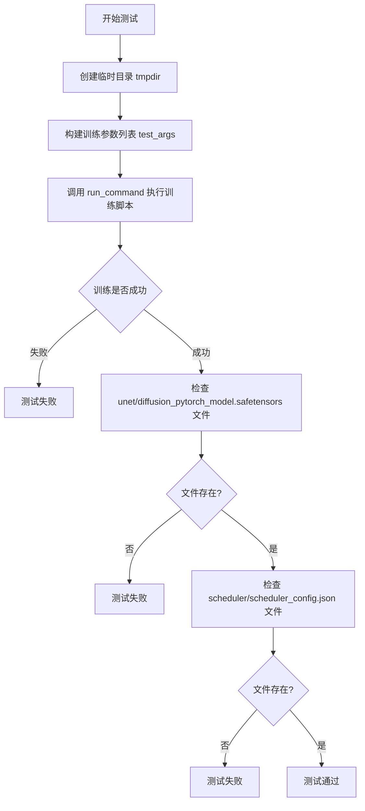

#### 带注释源码

```python
def test_text_to_image_sdxl(self):
    """
    测试 SDXL 文本到图像训练的基本功能。
    
    该测试方法执行以下步骤：
    1. 创建一个临时目录用于存放训练输出
    2. 构建训练脚本的命令行参数
    3. 运行训练脚本
    4. 验证训练生成的模型文件是否存在
    """
    # 使用 tempfile 模块创建临时目录，测试结束后自动清理
    with tempfile.TemporaryDirectory() as tmpdir:
        # 构建训练脚本的命令行参数列表
        # 使用 f-string 格式化字符串，包含所有必要的训练超参数
        test_args = f"""
            examples/text_to_image/train_text_to_image_sdxl.py
            --pretrained_model_name_or_path hf-internal-testing/tiny-stable-diffusion-xl-pipe
            --dataset_name hf-internal-testing/dummy_image_text_data
            --resolution 64
            --center_crop
            --random_flip
            --train_batch_size 1
            --gradient_accumulation_steps 1
            --max_train_steps 2
            --learning_rate 5.0e-04
            --scale_lr
            --lr_scheduler constant
            --lr_warmup_steps 0
            --output_dir {tmpdir}
            """.split()  # 将字符串按空白字符分割成列表

        # 调用 run_command 执行训练脚本
        # self._launch_args 包含启动参数（如加速器配置）
        run_command(self._launch_args + test_args)
        
        # save_pretrained smoke test: 验证 UNet 模型权重文件是否生成
        self.assertTrue(os.path.isfile(os.path.join(tmpdir, "unet", "diffusion_pytorch_model.safetensors")))
        
        # 验证调度器配置文件是否生成
        self.assertTrue(os.path.isfile(os.path.join(tmpdir, "scheduler", "scheduler_config.json")))
```

## 关键组件


### TextToImage 类

用于测试文本到图像（Stable Diffusion）训练流程的测试类，包含多个测试方法验证训练、checkpoint保存与恢复功能。

### TextToImageSDXL 类

用于测试SDXL（Stable Diffusion XL）文本到图像训练流程的测试类，验证SDXL模型的训练和模型保存功能。

### test_text_to_image 方法

验证基本训练流程的测试方法，包含完整参数配置（模型路径、数据集、分辨率、批大小、学习率、调度器等），并检查保存的模型文件是否存在。

### test_text_to_image_checkpointing 方法

验证训练checkpoint创建与恢复功能，测试从checkpoint-2和checkpoint-4恢复训练，并检查中间checkpoint可正确加载用于推理。

### test_text_to_image_checkpointing_use_ema 方法

在checkpointing基础上增加EMA（指数移动平均）支持验证，确保EMA权重能正确保存到checkpoint并可用于恢复训练。

### test_text_to_image_checkpointing_checkpoints_total_limit 方法

验证checkpoint总数限制功能，设置checkpoints_total_limit=2，确保旧checkpoint（如checkpoint-2）被自动删除，只保留最近的checkpoint。

### test_text_to_image_checkpointing_checkpoints_total_limit_removes_multiple_checkpoints 方法

验证当需要创建新checkpoint但总数超限时，删除多个旧checkpoint的逻辑，确保在限制为2个checkpoint的情况下，正确保留最新的checkpoint。

### run_command 全局函数

用于执行训练脚本命令的辅助函数，接收命令参数列表并执行，集成在ExamplesTestsAccelerate基类中。

### 训练脚本命令行参数

关键训练参数包括：pretrained_model_name_or_path（预训练模型）、dataset_name（数据集）、resolution（图像分辨率）、train_batch_size（批大小）、max_train_steps（最大训练步数）、learning_rate（学习率）、lr_scheduler（学习率调度器）、checkpointing_steps（checkpoint保存步数）、resume_from_checkpoint（恢复checkpoint路径）、use_ema（启用EMA）、checkpoints_total_limit（checkpoint总数限制）、seed（随机种子）。


## 问题及建议


### 已知问题

- **代码重复**：多个测试方法中包含大量重复的命令行参数构建逻辑（如 `--resolution 64`、`--train_batch_size 1`、`--learning_rate 5.0e-04` 等），违反 DRY 原则，增加维护成本
- **硬编码字符串**：模型名称（如 `"hf-internal-testing/tiny-stable-diffusion-pipe"`）和数据源（`"hf-internal-testing/dummy_image_text_data"`）在多处硬编码，一旦上游测试资源变更会导致大规模修改
- **缺乏错误处理**：对 `run_command` 的执行结果没有检查，对文件操作（如 `os.path.isfile`）失败的场景未做异常捕获
- **测试粒度过粗**：每个测试方法同时覆盖训练、推理、checkpoint 验证等多个阶段，测试失败时难以快速定位根因
- **魔法数字和字符串**：checkpoint 目录命名（如 `"checkpoint-2"`）、子文件夹路径（如 `"checkpoint-2/unet"`）等硬编码，假设特定状态存在，缺乏健壮性验证
- **日志配置不灵活**：直接使用 `logging.basicConfig(level=logging.DEBUG)` 硬编码日志级别，无法根据环境动态调整
- **缺少类型注解**：整个文件没有任何类型提示（Type Hints），降低代码可读性和 IDE 支持
- **外部依赖无降级**：测试依赖远程 Hugging Face Hub 模型（`hf-internal-testing/*`），网络不可用时测试直接失败，无本地 fallback
- **资源清理隐患**：虽然使用 `tempfile.TemporaryDirectory()`，但若程序异常退出（如 `shutil.rmtree` 失败），临时目录可能残留
- **参数无校验**：命令行参数（如 `--checkpointing_steps`、`--checkpoints_total_limit`）未做合法性校验，传入负数或非数字可能导致隐式错误

### 优化建议

- **提取公共配置**：创建 pytest fixture 或基类方法，将通用参数（如模型路径、分辨率、学习率）统一管理，消除重复代码
- **常量外部化**：定义模块级常量或配置文件，集中管理模型名称、数据集名称、默认参数值
- **增强错误处理**：对 `run_command` 返回值进行检查，添加 try-except 捕获文件操作异常，提供有意义的错误信息
- **拆分子测试**：将训练、推理、checkpoint 验证拆分为独立的测试函数或 helper 方法，提高测试可维护性和定位效率
- **参数校验**：在测试开始前校验关键参数（如正整数检查），或使用 argparse 风格的校验逻辑
- **添加类型注解**：为方法参数、返回值、全局变量添加类型提示，提升代码清晰度
- **日志配置优化**：通过环境变量或配置文件控制日志级别，避免硬编码
- **本地 fallback**：考虑添加本地模型缓存或 mock 机制，降低对外部网络的强依赖
- **资源清理强化**：使用 `finally` 块确保临时目录清理，或使用上下文管理器包装关键操作
- **引入 pytest 参数化**：对相似测试使用 `@pytest.mark.parametrize` 减少代码冗余

## 其它


### 设计目标与约束

本测试套件的设计目标是验证文本到图像训练脚本的核心功能，包括基础训练流程、检查点管理、训练恢复、EMA支持以及检查点数量限制等关键特性。测试约束包括：使用小型预训练模型（hf-internal-testing/tiny-stable-diffusion-pipe和hf-internal-testing/tiny-stable-diffusion-xl-pipe）进行快速测试，训练步数设置为较小的值（2-8步），图像分辨率固定为64x64，以确保测试执行效率。

### 错误处理与异常设计

测试代码使用tempfile.TemporaryDirectory()创建临时目录，确保测试结束后自动清理资源。所有命令执行通过run_command函数进行，测试用例使用assert语句进行结果验证。测试过程中可能出现的异常包括：文件不存在异常（os.path.isfile检查）、目录操作异常（shutil.rmtree）、模型加载异常（DiffusionPipeline.from_pretrained）等，这些异常会导致测试失败并输出相关错误信息。

### 数据流与状态机

测试数据流主要分为两类场景：首次训练场景和检查点恢复训练场景。首次训练场景的状态转换包括：初始化临时目录→构建训练参数→执行训练命令→验证输出文件→验证检查点目录。恢复训练场景的状态转换包括：加载已有检查点→修改训练参数→执行恢复训练→验证新检查点生成→验证旧检查点清理。每个测试方法都在独立的临时目录中运行，避免状态污染。

### 外部依赖与接口契约

本测试文件依赖以下外部组件：diffusers库提供DiffusionPipeline和UNet2DConditionModel；test_examples_utils模块提供ExamplesTestsAccelerate基类和run_command辅助函数；hf-internal-testing/tiny-stable-diffusion-pipe和hf-internal-testing/dummy_image_text_data提供测试用预训练模型和数据集。接口契约要求训练脚本支持特定的命令行参数（--pretrained_model_name_or_path、--dataset_name、--output_dir、--checkpointing_steps、--resume_from_checkpoint、--use_ema、--checkpoints_total_limit等），输出目录应包含unet、scheduler子目录以及可选的checkpoint-*子目录。

### 测试覆盖范围分析

本测试套件覆盖了以下功能点：基础训练流程（test_text_to_image、test_text_to_image_sdxl）；检查点保存功能（test_text_to_image_checkpointing验证checkpoint-2和checkpoint-4的生成）；检查点恢复功能（test_text_to_image_checkpointing验证从checkpoint-4恢复训练）；EMA模型支持（test_text_to_image_checkpointing_use_ema验证--use_ema参数）；检查点数量限制（test_text_to_image_checkpointing_checkpoints_total_limit验证checkpoints_total_limit参数）；多检查点删除逻辑（test_text_to_image_checkpointing_checkpoints_total_limit_removes_multiple_checkpoints验证超过限制时删除多个旧检查点）。

### 性能考量与测试效率

测试使用极小的模型（tiny-stable-diffusion-pipe）和极少的训练步数（2-8步）来确保快速执行。测试使用临时目录隔离，每次测试运行后自动清理。测试中的推理步骤也设置为最小值（num_inference_steps=1或2），以减少测试执行时间。测试未包含性能基准测试或内存使用监控功能。

### 安全与合规性检查

测试代码包含safety_checker=None参数，显式禁用安全检查器以避免测试过程中的内容过滤干扰。测试使用Apache License 2.0许可协议，符合开源合规要求。测试代码本身不涉及用户数据处理，所有操作均在临时目录中进行。

### 配置管理与环境依赖

测试依赖Python标准库（logging、os、shutil、sys、tempfile）和第三方库（diffusers）。测试假设当前工作目录下存在..目录（通过sys.path.append("..")添加父目录到路径）。测试依赖ExamplesTestsAccelerate类，该类可能来自父目录的test_examples_utils模块，需要确保该模块存在且可导入。

### 潜在改进建议

当前测试套件存在以下改进空间：缺少对训练过程中日志输出的验证；缺少对不同学习率调度器的测试；缺少对梯度累积功能的验证；缺少对分布式训练（多GPU）的测试；缺少对训练中断后恢复训练的完整性验证；可以添加性能基准测试来监控训练时间；可以添加模型质量验证（生成图像的质量评估）；可以添加更全面的错误场景测试（如无效的检查点路径、无效的数据集等）。

### 架构分层与模块职责

本测试文件位于测试层级，属于集成测试范畴。TextToImage类和TextToImageSDXL类负责具体的测试用例执行，继承自ExamplesTestsAccelerate基类。run_command函数负责执行外部训练脚本并捕获输出。测试通过命令行参数传递的方式与训练脚本进行交互，使用文件系统验证输出结果。这种设计遵循了测试金字塔原则，作为高层集成测试验证完整的训练流程。

### 版本兼容性考虑

测试使用的diffusers库API（DiffusionPipeline.from_pretrained、UNet2DConditionModel.from_pretrained）需要与指定版本兼容。测试依赖的预训练模型（hf-internal-testing/tiny-stable-diffusion-pipe）可能随时间更新，建议在CI环境中锁定模型版本或使用本地副本。测试脚本路径（examples/text_to_image/train_text_to_image.py）假设项目结构固定，如果项目结构变更需要相应调整。


    