# `diffusers\examples\text_to_image\test_text_to_image_lora.py` 详细设计文档

这是一个用于测试Diffusion模型LoRA（Low-Rank Adaptation）训练功能的自动化测试文件，主要验证SDXL和Stable Diffusion模型的文本到图像LoRA训练流程，包括checkpoint保存、checkpoint数量限制、权重加载等核心功能的正确性。

## 整体流程

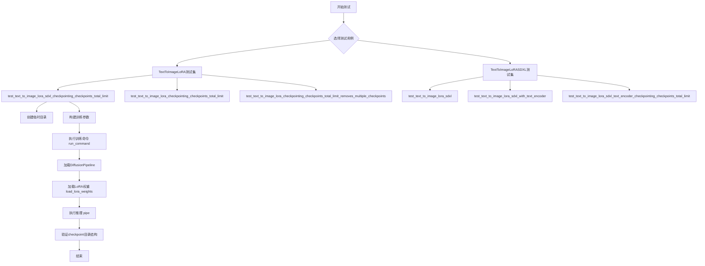

## 类结构

```
ExamplesTestsAccelerate (基类)
├── TextToImageLoRA
│   ├── test_text_to_image_lora_sdxl_checkpointing_checkpoints_total_limit
│   ├── test_text_to_image_lora_checkpointing_checkpoints_total_limit
│   └── test_text_to_image_lora_checkpointing_checkpoints_total_limit_removes_multiple_checkpoints
└── TextToImageLoRASDXL
    ├── test_text_to_image_lora_sdxl
    ├── test_text_to_image_lora_sdxl_with_text_encoder
    └── test_text_to_image_lora_sdxl_text_encoder_checkpointing_checkpoints_total_limit
```

## 全局变量及字段


### `logger`
    
全局日志记录器，用于输出调试信息

类型：`logging.Logger`
    


### `stream_handler`
    
日志处理器，将日志输出到标准输出流stdout

类型：`logging.StreamHandler`
    


    

## 全局函数及方法


### `logging.basicConfig`

配置 Python 日志系统的基础设置，用于设置根日志记录器的默认配置。

参数：

- `level`：`int`（具体为 `logging.DEBUG`），指定日志记录的级别，此处设置为 DEBUG 级别以捕获所有日志消息
- `**kwargs`：其他可选关键字参数，如 `format`、`filename`、`filemode` 等，用于进一步配置日志输出格式和目标

返回值：`None`，该函数不返回任何值，仅执行配置操作

#### 流程图

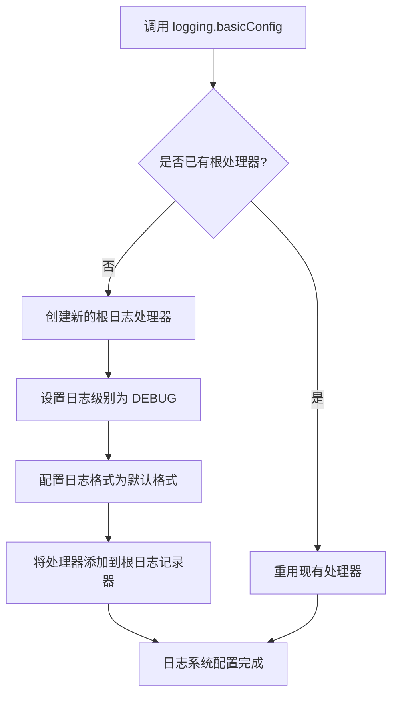

#### 带注释源码

```python
# 导入 logging 模块以使用日志功能
import logging
import sys
import os
import tempfile

# 导入 safetensors 用于安全地加载张量文件
import safetensors

# 从 diffusers 导入 DiffusionPipeline
from diffusers import DiffusionPipeline  # noqa: E402

# 将上级目录添加到 sys.path 以便导入测试工具模块
sys.path.append("..")
from test_examples_utils import ExamplesTestsAccelerate, run_command  # noqa: E402

# 配置根日志记录器的级别为 DEBUG
# 这将启用所有级别的日志消息输出，便于调试训练过程中的详细信息
# basicConfig 是 Python 标准库 logging 模块的函数，用于快速配置日志系统
logging.basicConfig(level=logging.DEBUG)

# 获取根日志记录器实例
logger = logging.getLogger()

# 创建流处理器，将日志输出到标准输出（sys.stdout）
stream_handler = logging.StreamHandler(sys.stdout)

# 将流处理器添加到根日志记录器
# 这样所有通过 logger 记录的日志都会输出到控制台
logger.addHandler(stream_handler)
```

### 关键组件信息

| 组件名称 | 一句话描述 |
|---------|-----------|
| `logging` | Python 标准库日志模块，提供灵活的日志记录功能 |
| `logging.basicConfig` | 用于配置根日志记录器的基础设置函数 |
| `logging.DEBUG` | 日志级别常量，表示最详细的日志信息 |
| `logging.StreamHandler` | 日志处理器，将日志输出到流（如 stdout） |

### 潜在的技术债务或优化空间

1. **日志配置硬编码**：日志级别和处理器配置直接写在代码中，缺乏灵活性。建议通过命令行参数或配置文件来管理日志级别。
2. **重复创建处理器**：每次运行测试都会添加新的 `StreamHandler`，可能导致重复的日志输出。建议在添加前检查是否已存在同名处理器。
3. **缺少日志格式化配置**：`basicConfig` 未指定 `format` 参数，使用默认格式，可能不够详细。建议自定义格式以包含时间戳、模块名等信息。

### 其它项目

- **设计目标**：为测试脚本提供详细的调试日志输出，便于追踪训练过程中的问题
- **错误处理**：未对日志配置失败做任何错误处理，假设 `basicConfig` 调用总是成功
- **外部依赖**：依赖 Python 标准库 `logging` 模块，无额外外部依赖


### `logging.getLogger`

获取或创建一个logger实例，用于记录应用程序的日志信息。

参数：

- `name`：`Optional[str]`，Logger的名称。如果未提供或为空字符串，则返回根logger。默认为`None`。

返回值：`logging.Logger`，返回一个Logger对象，可用于记录日志。

#### 流程图

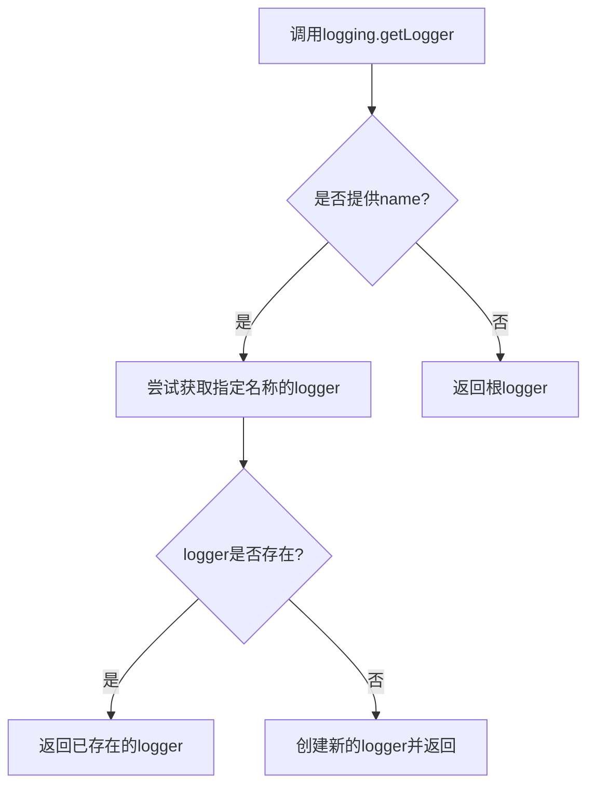

#### 带注释源码

```python
# 获取根logger实例（无名称）
# 在本代码中用于设置全局日志配置
logger = logging.getLogger()

# 可选：指定logger名称的常见用法
# logger = logging.getLogger(__name__)  # 使用当前模块名作为logger名称
# logger = logging.getLogger("my_app")  # 使用自定义名称

# 获取logger后可添加handler、设置级别等
stream_handler = logging.StreamHandler(sys.stdout)
logger.addHandler(stream_handler)
```


### `logging.StreamHandler`

该函数是 Python 标准库 `logging` 模块中的一个类，用于创建日志处理器，可将日志输出到指定的流（默认为 sys.stderr）。在代码中通过传入 `sys.stdout` 参数，使其将日志输出到标准输出流。

参数：

- `stream`：`typing.TextIO`，可选参数，默认为 `None`（此时使用 `sys.stderr`）。在代码中传入 `sys.stdout`，指定日志输出到标准输出流。

返回值：`logging.StreamHandler`，返回一个新创建的流处理器实例。

#### 流程图

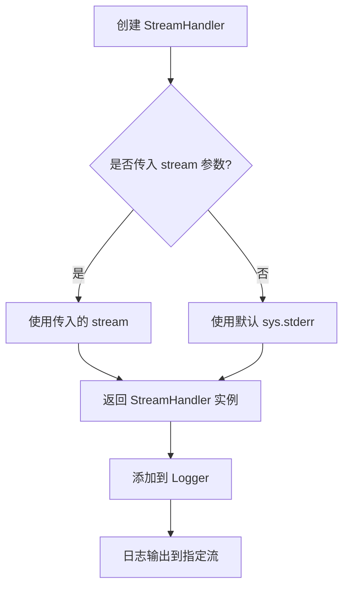

#### 带注释源码

```python
import logging
import sys

# 配置根日志记录器，级别为 DEBUG
logging.basicConfig(level=logging.DEBUG)

# 获取根 logger 实例
logger = logging.getLogger()

# 创建 StreamHandler，指定输出流为 sys.stdout（标准输出）
# StreamHandler 构造函数签名: StreamHandler(stream=None)
# stream: 文件类对象，None 则使用 sys.stderr
stream_handler = logging.StreamHandler(sys.stdout)

# 将创建的 handler 添加到 logger
# 这样 logger 输出的日志会通过该 handler 写入到 sys.stdout
logger.addHandler(stream_handler)
```

> **备注**：这是 Python 标准库 `logging` 模块中的类，非用户自定义代码。该处理器在测试代码中用于将日志输出重定向到标准输出，以便于观察测试执行过程。


### `logger.addHandler`

为 Logger 对象添加一个日志处理器（Handler），用于处理日志记录的输出目标。该方法是 Python 标准库 `logging.Logger` 类的方法，用于将自定义的日志处理器注册到日志器中，以便控制日志的输出行为。

参数：

- `handler`：`logging.Handler`，要添加的日志处理器对象，负责实际输出日志信息到指定目标（如控制台、文件等）

返回值：`None`，该方法没有返回值，仅执行副作用（修改 logger 的处理器列表）

#### 流程图

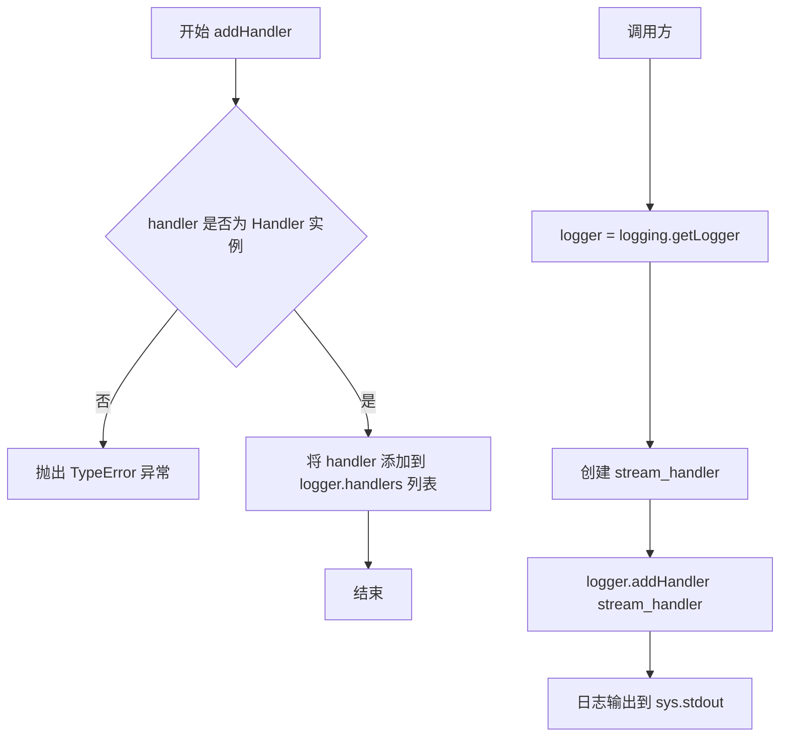

#### 带注释源码

```python
# 获取根Logger实例
logger = logging.getLogger()

# 创建一个StreamHandler，用于将日志输出到标准输出（stdout）
stream_handler = logging.StreamHandler(sys.stdout)

# 为logger添加stream_handler处理器
# 这样logger输出的日志会通过stream_handler写入到sys.stdout
logger.addHandler(stream_handler)
```


### `run_command`

执行外部命令（通常是训练脚本）的函数，用于在测试中运行 diffusers 的文本到图像 LoRA 训练脚本。该函数通过子进程执行命令行指令，支持使用 accelerate 启动分布式训练。

参数：

- `cmd`：列表（`List[str]`），命令参数列表，包含要执行的脚本路径及其参数。在代码中通过 `self._launch_args + initial_run_args` 组合而成，其中 `self._launch_args` 是 accelerate 启动参数，`initial_run_args` 是训练脚本的具体参数。

返回值：`任意`，函数返回值在代码中未被显式使用，但通常返回命令的退出码或执行结果。

#### 流程图

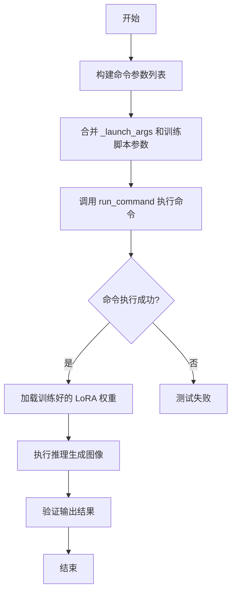

#### 带注释源码

```python
# run_command 是从 test_examples_utils 模块导入的外部函数
# 其实现不在当前代码文件中

# 在代码中的典型调用方式：
run_command(self._launch_args + initial_run_args)

# 示例：initial_run_args 的构造
initial_run_args = f"""
    examples/text_to_image/train_text_to_image_lora_sdxl.py
    --pretrained_model_name_or_path {pipeline_path}
    --dataset_name hf-internal-testing/dummy_image_text_data
    --resolution 64
    --train_batch_size 1
    --gradient_accumulation_steps 1
    --max_train_steps 6
    --learning_rate 5.0e-04
    --scale_lr
    --lr_scheduler constant
    --lr_warmup_steps 0
    --output_dir {tmpdir}
    --checkpointing_steps=2
    --checkpoints_total_limit=2
    """.split()

# 完整的调用示例
run_command(self._launch_args + initial_run_args)
```

---

### 补充说明

#### 设计目标与约束

- **目标**：通过 `run_command` 执行外部训练脚本，验证 diffusers 库的 LoRA 训练功能是否正常工作
- **约束**：依赖 `test_examples_utils` 模块中的实现，需要确保该模块可用

#### 外部依赖

- `test_examples_utils. ExamplesTestsAccelerate`：提供 `_launch_args` 属性（accelerate 启动参数）
- `run_command` 函数：来自 `test_examples_utils` 模块，用于执行子进程命令

#### 潜在技术债务

1. **隐藏的实现细节**：`run_command` 的具体实现未知，难以调试和维护
2. **紧耦合**：测试代码直接依赖外部函数，无法在测试环境中完全隔离


### `tempfile.TemporaryDirectory`

`tempfile.TemporaryDirectory` 是 Python 标准库 `tempfile` 模块中的一个类，它是一个上下文管理器，用于创建临时目录，并在退出上下文时自动清理该目录。

参数：

- `suffix`：`str`，可选，临时目录名的后缀，默认为 `None`
- `prefix`：`str`，可选，临时目录名的前缀，默认为 `'tmp'`
- `dir`：`str`，可选，指定创建临时目录的父目录，默认为 `None`

返回值：`str`，返回临时目录的路径字符串

#### 流程图

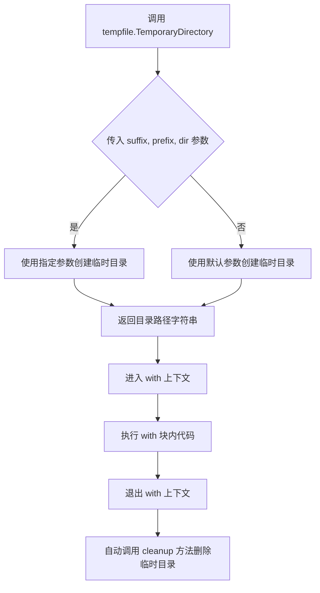

#### 带注释源码

```python
# tempfile.TemporaryDirectory 是 Python 标准库中的类
# 用作上下文管理器，创建临时目录并在退出时自动清理

# 在代码中的典型用法：
with tempfile.TemporaryDirectory() as tmpdir:
    # tmpdir 是自动生成的临时目录路径字符串
    # 例如：'/tmp/xxxxxx'
    
    # 在此块内可以使用 tmpdir 变量
    # 例如：保存文件到 tmpdir
    run_command(self._launch_args + initial_run_args)
    
# 退出 with 块后，临时目录及其内容会被自动删除
# 无需手动清理
```

> **注意**：该函数/类来自 Python 标准库 `tempfile` 模块，源码位于 Python 解释器内部。此处展示的是在测试代码中的使用方式。


### `DiffusionPipeline.from_pretrained`

从预训练模型路径或Hub模型ID加载DiffusionPipeline实例，支持本地和远程模型加载，可配置组件、精度、设备等参数。

参数：

- `pretrained_model_name_or_path`：`str`，预训练模型的路径或HuggingFace Hub上的模型ID（如"hf-internal-testing/tiny-stable-diffusion-pipe"）
- `config`：`Union[str, os.PathLike, Dict, None]`，可选，Pipeline的配置信息
- `cache_dir`：`Union[str, os.PathLike, None]`，可选，模型缓存目录
- `torch_dtype`：`torch.dtype`，可选，模型权重的精度类型（如torch.float16）
- `custom_pipeline`：`Union[str, os.PathLike, None]`，可选，自定义Pipeline实现
- `device_map`：`Union[str, Dict[str, Union[int, str, torch.device]], None]`，可选，设备映射策略（如"auto"）
- `max_memory`：`Dict[Union[int, str], Union[int, str]]`，可选，最大内存配置
- `offload_folder`：`Union[str, os.PathLike, None]`，可选，权重卸载目录
- `offload_state_dict`：`bool`，可选，是否卸载state dict
- `low_cpu_mem_usage`：`bool`，可选，是否降低CPU内存占用
- `use_safetensors`：`bool`，可选，是否使用safetensors格式加载权重
- `safety_checker`：`Union[None, str, PreTrainedModel]`，可选，安全检查器配置（None表示禁用）
- `feature_extractor`：`Union[None, PreTrainedFeatureExtractor]`，可选，特征提取器
- `requires_safety_checker`：`bool`，可选，是否需要安全检查器
- `force_download`：`bool`，可选，是否强制重新下载模型
- `resume_download`：`bool`，可选，是否从中断处继续下载
- `proxy`：`Union[None, str, Dict[str, str]]`，可选，代理服务器配置
- `local_files_only`：`bool`，可选，是否仅使用本地文件
- `revision`：`str`，可选，Hub模型版本号
- `custom_revision`：`str`，可选，本地自定义模型的版本
- `variant`：`Union[str, None]`，可选，模型变体（如"fp16"）
- `use_auth_token`：`Union[str, bool, None]`，可选，认证令牌
- `image_processor`：`Union[BaseImageProcessor, str, None]`，可选，图像处理器
- `safety_checker_kwargs`：`Dict[str, Any]`，可选，传递给安全检查器的额外参数
- `feature_extractor_kwargs`：`Dict[str, Any]`，可选，传递给特征提取器的额外参数
- `caption_generator`：`Union[PreTrainedModel, str, None]`，可选， caption生成器
- `caption_generator_kwargs`：`Dict[str, Any]`，可选，传递给caption生成器的额外参数

返回值：`DiffusionPipeline`，加载好的Pipeline实例

#### 流程图

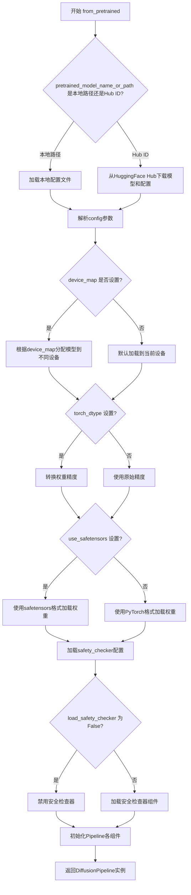

#### 带注释源码

```python
# 这是调用 DiffusionPipeline.from_pretrained 的示例代码
# 实际实现位于 diffusers 库中，此处为调用示例

# 示例1: 基础加载（使用默认配置）
pipe = DiffusionPipeline.from_pretrained(
    "hf-internal-testing/tiny-stable-diffusion-xl-pipe"  # Hub模型ID
)

# 示例2: 加载并禁用安全检查器，指定精度
pipe = DiffusionPipeline.from_pretrained(
    "hf-internal-testing/tiny-stable-diffusion-pipe",  # Hub模型ID
    safety_checker=None,  # 禁用安全检查器
    torch_dtype=torch.float16  # 使用半精度
)

# 示例3: 自动设备映射
pipe = DiffusionPipeline.from_pretrained(
    "runwayml/stable-diffusion-v1-5",
    device_map="auto",  # 自动分配到可用设备
    torch_dtype=torch.float16,
    use_safetensors=True  # 使用safetensors格式
)

# 底层逻辑概述（来自diffusers库）:
# 1. from_pretrained 是一个类方法 (@classmethod)
# 2. 首先下载或加载模型配置 (config.json)
# 3. 根据 config 推断 Pipeline 类名
# 4. 加载各个组件的预训练权重
# 5. 初始化 Pipeline 对象并返回
```


### `DiffusionPipeline.load_lora_weights`

从指定目录加载训练好的 LoRA（Low-Rank Adaptation）权重到 DiffusionPipeline 实例中，使模型能够使用 LoRA 技术进行推理。

参数：

- `pretrained_model_name_or_path`：`str`，保存 LoRA 权重文件的目录路径，通常包含 `pytorch_lora_weights.safetensors` 或 `pytorch_lora_weights.bin` 文件

返回值：`DiffusionPipeline`，返回加载了 LoRA 权重后的 pipeline 实例本身，支持链式调用

#### 流程图

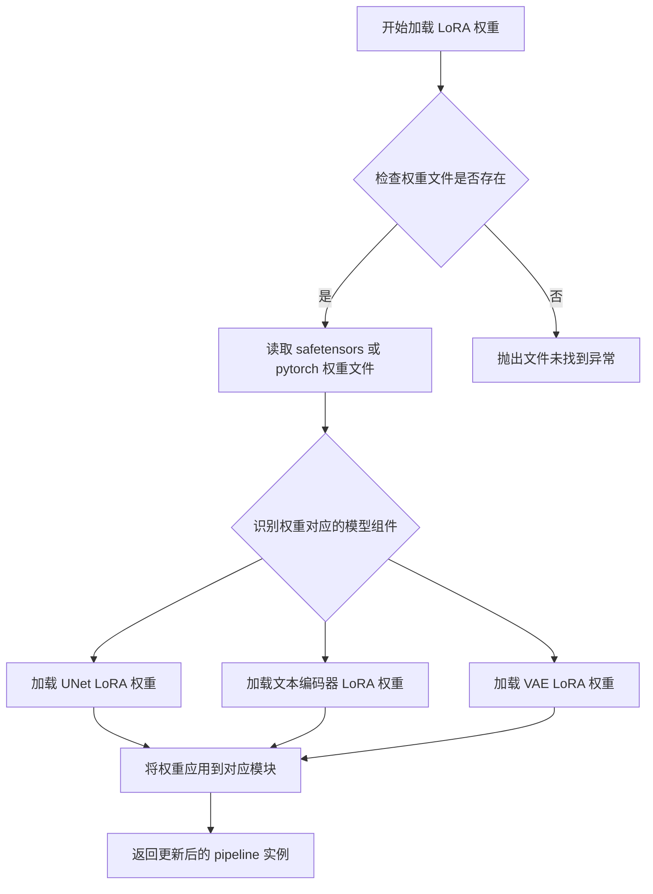

#### 带注释源码

```python
# 注意：此方法来源于 diffusers 库的 DiffusionPipeline 类
# 代码文件中仅展示其调用方式，未包含实际实现
# 以下为调用示例：

# 1. 从预训练模型创建 pipeline
pipe = DiffusionPipeline.from_pretrained(pipeline_path)

# 2. 加载 LoRA 权重到 pipeline
# tmpdir: 包含训练好的 LoRA 权重文件的目录路径
pipe.load_lora_weights(tmpdir)

# 3. 使用加载了 LoRA 的 pipeline 进行推理
pipe(prompt, num_inference_steps=1)
```

> **说明**：该方法的具体实现位于 `diffusers` 库的 `src/diffusers/loaders.py` 文件中，属于 `DiffusionPipeline` 类的实例方法。方法会自行检测目录中的权重文件格式（safetensors 或 pytorch），并根据权重键名（如 `unet`、`text_encoder` 等）将权重加载到对应的模型组件中。


### `DiffusionPipeline.__call__`

这是 `diffusers` 库中 `DiffusionPipeline` 类的核心推理方法，用于根据文本提示生成图像。

参数：

- `prompt`：`str` 或 `List[str]`，要生成图像的文本描述（prompt）
- `negative_prompt`：`str` 或 `List[str]]`，可选，用于指定不希望模型生成的内容
- `num_inference_steps`：`int`，可选，推理时的采样步数，默认为 50
- `guidance_scale`：`float`，可选， classifier-free guidance 的权重，默认为 7.5
- `num_images_per_prompt`：`int`，可选，每个 prompt 生成的图像数量，默认为 1
- `height`：`int`，可选，生成图像的高度
- `width`：`int`，可选，生成图像的宽度
- `prompt_embeds`：`torch.Tensor`，可选，预计算的 prompt embeddings
- `negative_prompt_embeds`：`torch.Tensor`，可选，预计算的负向 prompt embeddings
- `latents`：`torch.Tensor`，可选，用于覆盖推理起始噪声的潜在变量
- `output_type`：`str`，可选，输出类型，可选 "pil"、"np" 或 "pt"，默认为 "pil"
- `return_dict`：`bool`，可选，是否返回 `DiffusionPipelineOutput`，默认为 True

返回值：`PIL.Image.Image` 或 `np.ndarray` 或 `torch.Tensor` 或 `DiffusionPipelineOutput`，生成的图像或包含图像及元信息的对象

#### 流程图

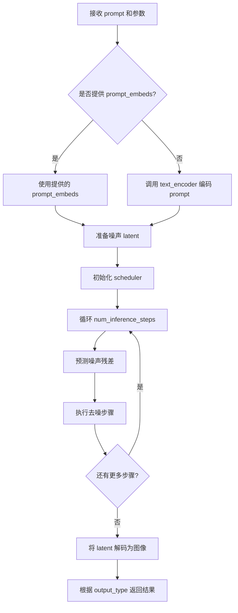

#### 带注释源码

```python
def __call__(
    self,
    prompt: Union[str, List[str]] = None,
    negative_prompt: Union[str, List[str]] = None,
    num_inference_steps: int = 50,
    guidance_scale: float = 7.5,
    num_images_per_prompt: int = 1,
    height: int = 512,
    width: int = 512,
    prompt_embeds: Optional[torch.Tensor] = None,
    negative_prompt_embeds: Optional[torch.Tensor] = None,
    latents: Optional[torch.Tensor] = None,
    output_type: Optional[str] = "pil",
    return_dict: bool = True,
    **kwargs,
):
    # 1. 处理文本 prompt
    # 如果没有提供 prompt_embeds，则使用 text_encoder 对 prompt 进行编码
    if prompt_embeds is None:
        if isinstance(prompt, str):
            prompt = [prompt]
        # 调用 text_encoder 获取 embeddings
        prompt_embeds = self.text_encoder.encode(prompt)
    
    # 2. 处理 negative prompt（用于 classifier-free guidance）
    if negative_prompt_embeds is None and negative_prompt is not None:
        if isinstance(negative_prompt, str):
            negative_prompt = [negative_prompt]
        negative_prompt_embeds = self.text_encoder.encode(negative_prompt)
    
    # 3. 准备潜在空间变量（latents）
    # 如果没有提供 latents，则随机生成噪声
    if latents is None:
        latents = torch.randn(
            (num_images_per_prompt, self.unet.in_channels, height // 8, width // 8),
            device=self.device,
        )
    
    # 4. 设置 scheduler（噪声调度器）
    self.scheduler.set_timesteps(num_inference_steps)
    
    # 5. 迭代去噪过程
    for i, t in enumerate(self.scheduler.timesteps):
        # 预测噪声残差
        noise_pred = self.unet(latents, t, encoder_hidden_states=prompt_embeds).sample
        
        # 执行 classifier-free guidance
        if guidance_scale > 1:
            # 分别预测带条件和不带条件的噪声
            noise_pred_uncond = self.unet(latents, t, encoder_hidden_states=negative_prompt_embeds).sample
            noise_pred = noise_pred_uncond + guidance_scale * (noise_pred - noise_pred_uncond)
        
        # 更新 latents
        latents = self.scheduler.step(noise_pred, t, latents).prev_sample
    
    # 6. 将 latent 解码为图像
    # 使用 vae 解码 latents
    image = self.vae.decode(latents / 0.18215).sample
    
    # 7. 后处理图像
    if output_type == "pil":
        image = self.numpy_to_pil(image.cpu().numpy())
    
    # 8. 返回结果
    if return_dict:
        return DiffusionPipelineOutput(images=image)
    return image
```


### `os.listdir`

该函数是Python标准库os模块中的一个方法，用于返回指定目录中所有文件和目录的名称列表。在本代码中主要用于测试验证环节，检查训练过程中生成的checkpoint目录是否按预期创建和删除。

参数：

- `path`：`str`，可选参数，目标目录的路径。默认为当前工作目录（`None`）。在本代码中传入的是`tmpdir`（临时目录的路径）

返回值：`list[str]`，返回包含目标目录中所有条目名称（不含路径）的列表。列表中的元素顺序是任意的，不保证排序。

#### 流程图

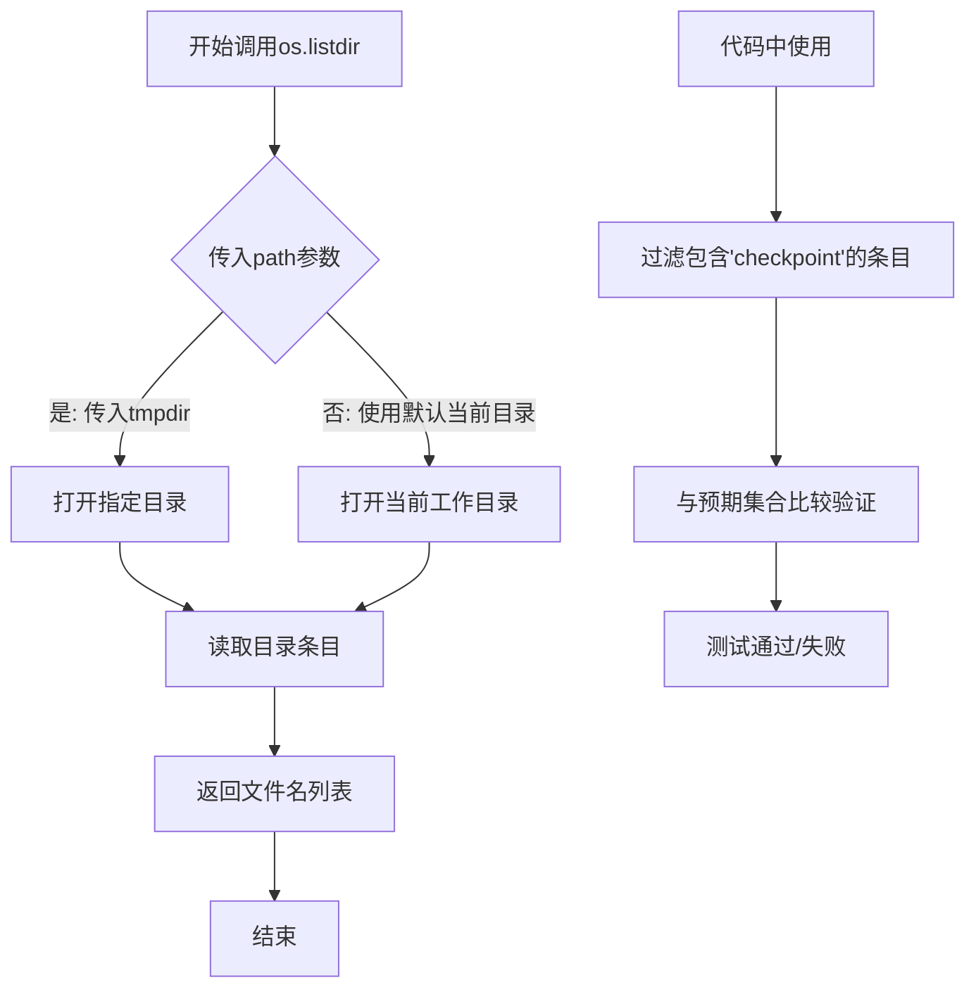

#### 带注释源码

```python
# os.listdir函数使用示例（来自代码中的实际调用）

# 调用os.listdir获取临时目录中的所有条目
# 参数: tmpdir - 临时目录路径，由tempfile.TemporaryDirectory()生成
# 返回: 目录中所有文件和子目录的名称列表
all_entries = os.listdir(tmpdir)

# 使用集合推导式过滤出包含'checkpoint'的目录名
# 这用于验证训练脚本是否正确创建和删除了检查点
checkpoint_dirs = {x for x in os.listdir(tmpdir) if "checkpoint" in x}

# 测试用例1: 验证max_train_steps=6, checkpointing_steps=2, checkpoints_total_limit=2
# 期望结果: 保留checkpoint-4和checkpoint-6，checkpoint-2应被删除
self.assertEqual(
    {x for x in os.listdir(tmpdir) if "checkpoint" in x}, 
    {"checkpoint-4", "checkpoint-6"}
)

# 测试用例2: 验证max_train_steps=4, checkpointing_steps=2
# 期望结果: 创建checkpoint-2和checkpoint-4
self.assertEqual(
    {x for x in os.listdir(tmpdir) if "checkpoint" in x},
    {"checkpoint-2", "checkpoint-4"},
)

# 测试用例3: 验证resume后max_train_steps=8, checkpoints_total_limit=2
# 期望结果: 保留checkpoint-6和checkpoint-8，旧检查点被删除
self.assertEqual(
    {x for x in os.listdir(tmpdir) if "checkpoint" in x},
    {"checkpoint-6", "checkpoint-8"},
)
```

#### 附加说明

在代码中的实际作用：

1. **测试验证功能**：通过`os.listdir`获取输出目录中的所有条目，然后过滤出包含"checkpoint"字符串的目录，用于验证训练脚本的检查点管理功能是否正常工作。

2. **检查点数量控制**：配合`checkpoints_total_limit`参数使用时，验证旧的检查点是否被正确删除，确保磁盘空间的有效利用。

3. **恢复训练验证**：在测试resume功能时，验证从特定检查点恢复训练后，新的检查点是否正确生成且旧检查点是否按策略清理。


### `os.path.isfile`

该函数是 Python 标准库 `os.path` 模块中的方法，用于检查指定路径是否是一个已存在的常规文件。

参数：

- `path`：`str` 或 `os.PathLike`，需要检查的文件路径，可以是字符串或 Path 对象

返回值：`bool`，如果路径存在且是一个常规文件（非目录、链接等）则返回 `True`，否则返回 `False`

#### 流程图

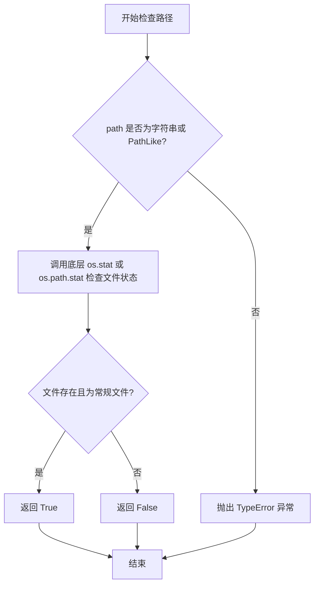

#### 带注释源码

```python
# os.path.isfile 是 os.path 模块中的一个函数
# 源码位于 Python 标准库的 posixpath.py 或 ntpath.py 中（根据操作系统）
# 以下是简化版本的核心逻辑：

def isfile(path):
    """
    检查指定路径是否为文件
    
    参数:
        path: 文件路径（字符串或 PathLike 对象）
    
    返回:
        bool: 如果路径是文件则返回 True，否则返回 False
    """
    try:
        # 尝试获取文件状态信息
        st = os.stat(path)
    except (OSError, ValueError):
        # 如果文件不存在或路径无效，返回 False
        # OSError: 文件不存在等错误
        # ValueError: 路径为空或无效格式
        return False
    
    # stat_result 的 st_mode 属性包含文件类型信息
    # stat.S_ISREG(mode) 检查是否为常规文件
    return stat.S_ISREG(st.st_mode)


# 在实际代码中的使用示例（来自任务代码）：
# self.assertTrue(os.path.isfile(os.path.join(tmpdir, "pytorch_lora_weights.safetensors")))
# 这行代码检查临时目录中是否存在 pytorch_lora_weights.safetensors 文件
```

---

### 代码中 `os.path.isfile` 的使用场景

在提供的测试代码中，`os.path.isfile` 被用于以下场景：

| 使用位置 | 目的 |
|---------|------|
| `TextToImageLoRASDXL.test_text_to_image_lora_sdxl` | 验证训练脚本是否成功生成了 LoRA 权重文件 `pytorch_lora_weights.safetensors` |
| `TextToImageLoRASDXL.test_text_to_image_lora_sdxl_with_text_encoder` | 验证带文本编码器训练时是否成功生成了 LoRA 权重文件 |

这两个测试都使用了相同的断言：
```python
self.assertTrue(os.path.isfile(os.path.join(tmpdir, "pytorch_lora_weights.safetensors")))
```

这确保了训练过程完成后，输出目录中存在预期的模型权重文件。


### `os.path.join`

`os.path.join` 是 Python 标准库 `os.path` 模块中的一个函数，用于智能地拼接一个或多个路径组件。与简单的字符串拼接不同，它能正确处理路径中的斜杠和跨平台兼容性，确保在不同操作系统上生成正确的路径分隔符。

参数：

-  `*paths`：`str`，可变数量的路径组件（字符串），这些组件将被智能地拼接在一起形成一个完整的路径

返回值：`str`，返回拼接后的完整路径字符串

#### 流程图

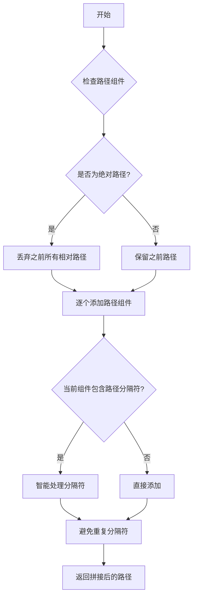

#### 带注释源码

```python
# os.path.join 是 Python 标准库 os.path 模块中的函数
# 以下是代码中的实际调用示例：

# 示例1：在 test_text_to_image_lora_sdxl 方法中
# 检查 safetensors 文件是否存在
self.assertTrue(os.path.isfile(os.path.join(tmpdir, "pytorch_lora_weights.safetensors")))

# 示例2：加载 safetensors 格式的 LoRA 权重
lora_state_dict = safetensors.torch.load_file(
    os.path.join(tmpdir, "pytorch_lora_weights.safetensors")
)

# 示例3：在 test_text_to_image_lora_sdxl_with_text_encoder 方法中
# 检查 safetensors 文件是否存在
self.assertTrue(os.path.isfile(os.path.join(tmpdir, "pytorch_lora_weights.safetensors")))

# 示例4：加载 safetensors 格式的 LoRA 权重
lora_state_dict = safetensors.torch.load_file(
    os.path.join(tmpdir, "pytorch_lora_weights.safetensors")
)

# os.path.join 函数的工作原理：
# 1. 如果任何一个组件是绝对路径，则丢弃之前的所有组件
# 2. 最后一个组件的尾部如果有路径分隔符，会被移除
# 3. 在非 Windows 系统上，使用 '/' 作为分隔符
# 4. 在 Windows 系统上，使用 '\\' 作为分隔符
# 5. 避免在路径中产生重复的分隔符

# 例如：
# os.path.join('/home', 'user', 'docs') -> '/home/user/docs'
# os.path.join('/home', '/user', 'docs') -> '/user/docs'
# os.path.join('/home/', 'user/') -> '/home/user'
```


### `safetensors.torch.load_file`

该函数是 safetensors 库提供的核心函数之一，用于从磁盘加载 safetensors 格式保存的 PyTorch 模型权重文件，并将权重数据以字典形式返回。

参数：

-  `filename`：`str`，要加载的 safetensors 文件的路径（示例中为 `os.path.join(tmpdir, "pytorch_lora_weights.safetensors")`）

返回值：`dict`，返回一个字典，其中键为权重张量的名称，值为对应的 PyTorch 张量对象

#### 流程图

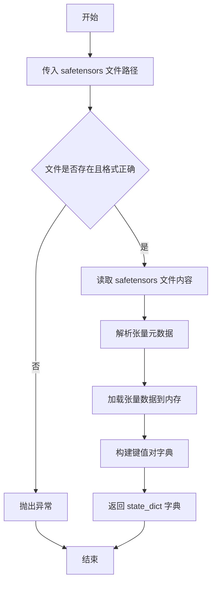

#### 带注释源码

```python
# 在测试代码中的实际调用示例
# 用于加载训练得到的 LoRA 权重文件

# 参数：safetensors 文件的完整路径
safetensors_file_path = os.path.join(tmpdir, "pytorch_lora_weights.safetensors")

# 调用 safetensors.torch.load_file 加载权重
# 返回值是一个字典，键为权重名称，值为 PyTorch 张量
lora_state_dict = safetensors.torch.load_file(safetensors_file_path)

# 验证加载的权重是否包含 LoRA 参数
# 通过检查所有键名中是否都包含 "lora" 字符串
is_lora = all("lora" in k for k in lora_state_dict.keys())
self.assertTrue(is_lora)
```

---

**备注**：由于 `safetensors.torch.load_file` 是外部库（safetensors）的函数，上述信息基于代码中的实际使用方式推断。该函数的具体实现位于 safetensors 库内部，典型的实现逻辑如下：

```python
# safetensors.torch.load_file 的典型签名（推测）
def load_file(filename: str, device: str = "cpu") -> Dict[str, torch.Tensor]:
    """
    从 safetensors 文件加载张量
    
    参数:
        filename: safetensors 文件路径
        device: 张量加载到的设备 ("cpu" 或 "cuda")
    
    返回:
        包含所有张量的字典
    """
    # ... 内部实现
```


### `TextToImageLoRA.test_text_to_image_lora_sdxl_checkpointing_checkpoints_total_limit`

这是一个测试方法，用于验证SDXL模型的文本到图像LoRA训练中检查点总数限制功能是否正常工作。训练6步，每2步保存检查点，但限制最多保留2个检查点，因此保留最后的两个检查点（step-4和step-6），并删除早期的检查点（step-2）。

参数：

- `self`：继承自`ExamplesTestsAccelerate`的实例对象，包含`_launch_args`等测试运行配置
- 局部变量`prompt`：`str`类型，值为"a prompt"，用于推理生成的文本提示
- 局部变量`pipeline_path`：`str`类型，值为"hf-internal-testing/tiny-stable-diffusion-xl-pipe"，指定预训练的SDXL模型路径
- 隐式参数`self._launch_args`：来自父类`ExamplesTestsAccelerate`，包含启动训练脚本的Accelerate配置参数

返回值：`None`，因为这是一个测试方法，不返回任何值

#### 流程图

```mermaid
graph TD
    A[开始测试] --> B[创建临时目录tmpdir]
    B --> C[设置训练参数: max_train_steps=6, checkpointing_steps=2, checkpoints_total_limit=2]
    C --> D[构建训练命令: train_text_to_image_lora_sdxl.py + 参数]
    D --> E[调用run_command执行训练脚本]
    E --> F[从预训练模型加载DiffusionPipeline]
    F --> G[加载训练输出的LoRA权重]
    G --> H[执行推理: pipe(prompt, num_inference_steps=1)]
    H --> I[列出tmpdir中的检查点目录]
    I --> J{检查点是否为checkpoint-4和checkpoint-6?}
    J -->|是| K[测试通过]
    J -->|否| L[测试失败]
```

#### 带注释源码

```python
def test_text_to_image_lora_sdxl_checkpointing_checkpoints_total_limit(self):
    """
    测试SDXL LoRA训练中检查点总数限制功能。
    
    测试目标：
    1. 运行训练脚本，配置max_train_steps=6, checkpointing_steps=2, checkpoints_total_limit=2
    2. 预期在step 2, 4, 6创建检查点
    3. 由于checkpoints_total_limit=2限制，早期检查点(step-2)应被删除
    4. 最终只保留checkpoint-4和checkpoint-6
    
    验证方式：
    通过os.listdir检查输出目录中的检查点文件夹名称
    """
    # 定义推理时使用的文本提示
    prompt = "a prompt"
    # 指定预训练的SDXL模型路径（测试用小型模型）
    pipeline_path = "hf-internal-testing/tiny-stable-diffusion-xl-pipe"

    # 使用临时目录存储训练输出和检查点，测试结束后自动清理
    with tempfile.TemporaryDirectory() as tmpdir:
        # 构建训练脚本的命令行参数
        # 训练配置：
        # - max_train_steps=6: 总训练步数
        # - checkpointing_steps=2: 每2步保存一个检查点
        # - checkpoints_total_limit=2: 最多保留2个检查点
        # 预期行为：创建checkpoint-2, checkpoint-4, checkpoint-6，然后删除checkpoint-2
        initial_run_args = f"""
            examples/text_to_image/train_text_to_image_lora_sdxl.py
            --pretrained_model_name_or_path {pipeline_path}
            --dataset_name hf-internal-testing/dummy_image_text_data
            --resolution 64
            --train_batch_size 1
            --gradient_accumulation_steps 1
            --max_train_steps 6
            --learning_rate 5.0e-04
            --scale_lr
            --lr_scheduler constant
            --lr_warmup_steps 0
            --output_dir {tmpdir}
            --checkpointing_steps=2
            --checkpoints_total_limit=2
            """.split()

        # 运行训练脚本，使用父类提供的_launch_args（如Accelerate配置）
        # 该命令会在tmpdir目录下生成检查点文件
        run_command(self._launch_args + initial_run_args)

        # 从预训练模型加载DiffusionPipeline（SDXL模型）
        pipe = DiffusionPipeline.from_pretrained(pipeline_path)
        # 加载训练得到的LoRA权重（从tmpdir目录）
        pipe.load_lora_weights(tmpdir)
        # 执行推理，生成图像（验证LoRA权重可用性）
        pipe(prompt, num_inference_steps=1)

        # 检查检查点目录是否存在
        # 预期：checkpoint-2应该被删除，只保留checkpoint-4和checkpoint-6
        # 使用集合比较确保结果匹配
        self.assertEqual({x for x in os.listdir(tmpdir) if "checkpoint" in x}, {"checkpoint-4", "checkpoint-6"})
```


### `TextToImageLoRA.test_text_to_image_lora_checkpointing_checkpoints_total_limit`

该方法是一个集成测试，用于验证文本到图像LoRA训练过程中的检查点保存与自动清理功能。测试运行训练脚本，配置为每2步保存一个检查点，但同时设置`checkpoints_total_limit=2`来限制最多保留2个检查点，从而验证最旧的检查点（step-2）会被自动删除，只保留最新的checkpoint-4和checkpoint-6。

参数：

- `self`：`TextToImageLoRA`类型，表示测试类实例本身

返回值：`None`（无返回值），该测试方法通过断言验证检查点行为是否符合预期

#### 流程图

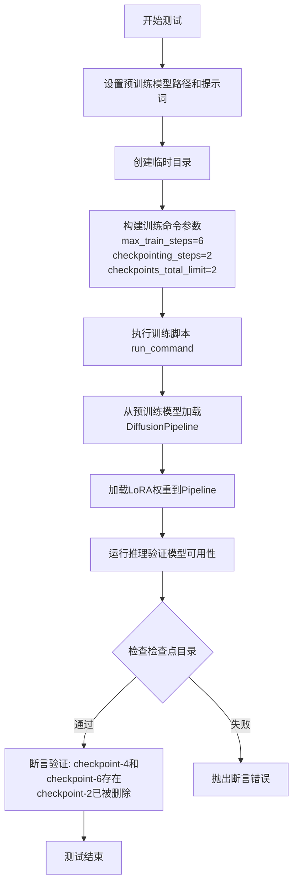

#### 带注释源码

```python
def test_text_to_image_lora_checkpointing_checkpoints_total_limit(self):
    """
    测试文本到图像LoRA训练中的检查点总数限制功能。
    
    该测试验证当设置checkpoints_total_limit=2时，
    训练过程会自动删除旧的检查点，只保留最新的2个检查点。
    """
    # 定义预训练模型路径（使用HuggingFace测试用的小型扩散模型）
    pretrained_model_name_or_path = "hf-internal-testing/tiny-stable-diffusion-pipe"
    # 定义测试用的提示词
    prompt = "a prompt"

    # 使用临时目录存放训练输出和检查点
    with tempfile.TemporaryDirectory() as tmpdir:
        # =====================================================
        # 运行训练脚本并配置检查点功能
        # 配置说明:
        # - max_train_steps=6: 最多训练6步
        # - checkpointing_steps=2: 每2步保存一个检查点
        # - checkpoints_total_limit=2: 最多保留2个检查点
        # 预期行为:
        # - step 2: 创建checkpoint-2
        # - step 4: 创建checkpoint-4，同时删除最早的checkpoint-2
        # - step 6: 创建checkpoint-6，同时删除最早的checkpoint-4
        # 最终应保留: checkpoint-4, checkpoint-6
        # =====================================================
        
        initial_run_args = f"""
            examples/text_to_image/train_text_to_image_lora.py
            --pretrained_model_name_or_path {pretrained_model_name_or_path}
            --dataset_name hf-internal-testing/dummy_image_text_data
            --resolution 64
            --center_crop
            --random_flip
            --train_batch_size 1
            --gradient_accumulation_steps 1
            --max_train_steps 6
            --learning_rate 5.0e-04
            --scale_lr
            --lr_scheduler constant
            --lr_warmup_steps 0
            --output_dir {tmpdir}
            --checkpointing_steps=2
            --checkpoints_total_limit=2
            --seed=0
            --num_validation_images=0
            """.split()

        # 执行训练命令（使用accelerate多GPU加速）
        run_command(self._launch_args + initial_run_args)

        # =====================================================
        # 验证阶段：加载模型并测试检查点是否正确保存和清理
        # =====================================================
        
        # 从预训练模型加载扩散Pipeline
        pipe = DiffusionPipeline.from_pretrained(
            "hf-internal-testing/tiny-stable-diffusion-pipe", safety_checker=None
        )
        # 加载训练保存的LoRA权重
        pipe.load_lora_weights(tmpdir)
        # 执行一次推理，验证模型可以正常工作
        pipe(prompt, num_inference_steps=1)

        # =====================================================
        # 核心断言：验证检查点目录是否符合预期
        # 预期结果: checkpoint-2应该已被删除
        #           只保留checkpoint-4和checkpoint-6
        # =====================================================
        # 检查检查点目录存在情况
        # checkpoint-2 should have been deleted
        self.assertEqual({x for x in os.listdir(tmpdir) if "checkpoint" in x}, {"checkpoint-4", "checkpoint-6"})
```


### `TextToImageLoRA.test_text_to_image_lora_checkpointing_checkpoints_total_limit_removes_multiple_checkpoints`

该测试方法用于验证当恢复训练并设置 `checkpoints_total_limit` 时，系统能否正确删除多个旧的检查点以维持限制。测试首先运行初始训练创建检查点-2和检查点-4，然后恢复训练并尝试创建检查点-6和检查点-8，验证旧检查点（checkpoint-2和checkpoint-4）被正确删除，仅保留最新的两个检查点。

参数：

- `self`：无显式参数（测试类方法），隐式传入的类实例

返回值：`None`，该方法为测试方法，无返回值，通过断言验证检查点行为

#### 流程图

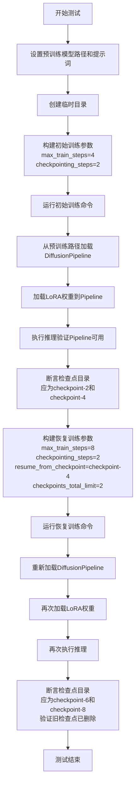

#### 带注释源码

```python
def test_text_to_image_lora_checkpointing_checkpoints_total_limit_removes_multiple_checkpoints(self):
    """
    测试当恢复训练且设置了checkpoints_total_limit时，
    能否正确删除多个（旧）检查点而非仅删除一个
    """
    # 定义预训练模型名称和提示词
    pretrained_model_name_or_path = "hf-internal-testing/tiny-stable-diffusion-pipe"
    prompt = "a prompt"

    # 创建临时目录用于存放训练输出和检查点
    with tempfile.TemporaryDirectory() as tmpdir:
        # ==================== 第一次训练 ====================
        # 运行训练脚本进行初始训练
        # max_train_steps == 4, checkpointing_steps == 2
        # 预期创建检查点：step-2, step-4
        
        # 构建初始训练参数列表
        initial_run_args = f"""
            examples/text_to_image/train_text_to_image_lora.py
            --pretrained_model_name_or_path {pretrained_model_name_or_path}
            --dataset_name hf-internal-testing/dummy_image_text_data
            --resolution 64
            --center_crop
            --random_flip
            --train_batch_size 1
            --gradient_accumulation_steps 1
            --max_train_steps 4           # 训练4步
            --learning_rate 5.0e-04
            --scale_lr
            --lr_scheduler constant
            --lr_warmup_steps 0
            --output_dir {tmpdir}
            --checkpointing_steps=2       # 每2步保存一次检查点
            --seed=0
            --num_validation_images=0
            """.split()

        # 执行初始训练命令
        run_command(self._launch_args + initial_run_args)

        # 从预训练模型加载DiffusionPipeline（禁用安全检查器）
        pipe = DiffusionPipeline.from_pretrained(
            "hf-internal-testing/tiny-stable-diffusion-pipe", safety_checker=None
        )
        # 加载训练得到的LoRA权重
        pipe.load_lora_weights(tmpdir)
        # 执行一次推理验证Pipeline功能正常
        pipe(prompt, num_inference_steps=1)

        # 验证检查点目录存在
        # 此时应该存在checkpoint-2和checkpoint-4
        self.assertEqual(
            {x for x in os.listdir(tmpdir) if "checkpoint" in x},
            {"checkpoint-2", "checkpoint-4"},
        )

        # ==================== 恢复训练 ====================
        # 恢复训练并继续到step-8，checkpoints_total_limit=2
        # 此时需要删除checkpoint-2和checkpoint-4两个旧检查点
        # 只保留最新的checkpoint-6和checkpoint-8
        
        # 构建恢复训练参数列表
        resume_run_args = f"""
            examples/text_to_image/train_text_to_image_lora.py
            --pretrained_model_name_or_path {pretrained_model_name_or_path}
            --dataset_name hf-internal-testing/dummy_image_text_data
            --resolution 64
            --center_crop
            --random_flip
            --train_batch_size 1
            --gradient_accumulation_steps 1
            --max_train_steps 8           # 继续训练到第8步
            --learning_rate 5.0e-04
            --scale_lr
            --lr_scheduler constant
            --lr_warmup_steps 0
            --output_dir {tmpdir}
            --checkpointing_steps=2
            --resume_from_checkpoint=checkpoint-4  # 从checkpoint-4恢复
            --checkpoints_total_limit=2   # 限制最多保留2个检查点
            --seed=0
            --num_validation_images=0
            """.split()

        # 执行恢复训练命令
        run_command(self._launch_args + resume_run_args)

        # 重新加载DiffusionPipeline和LoRA权重
        pipe = DiffusionPipeline.from_pretrained(
            "hf-internal-testing/tiny-stable-diffusion-pipe", safety_checker=None
        )
        pipe.load_lora_weights(tmpdir)
        pipe(prompt, num_inference_steps=1)

        # 验证最终检查点目录
        # checkpoint-2和checkpoint-4应该已被删除
        # 保留checkpoint-6和checkpoint-8
        self.assertEqual(
            {x for x in os.listdir(tmpdir) if "checkpoint" in x},
            {"checkpoint-6", "checkpoint-8"},
        )
```


### `TextToImageLoRASDXL.test_text_to_image_lora_sdxl`

该方法是一个集成测试用例，用于验证使用 `train_text_to_image_lora_sdxl.py` 脚本训练 Stable Diffusion XL (SDXL) LoRA 模型的功能是否正常。测试流程包括：创建临时输出目录、构造训练参数并执行训练命令、验证生成的 LoRA 权重文件存在性、以及检查权重状态字典中的键名是否正确包含 "lora" 标识。

参数：

- `self`：隐含参数，类型为 `TextToImageLoRASDXe`（继承自 `ExamplesTestsAccelerate`），表示测试类实例本身

返回值：无返回值（`None`），该方法为测试用例，通过 `assert` 语句进行断言验证

#### 流程图

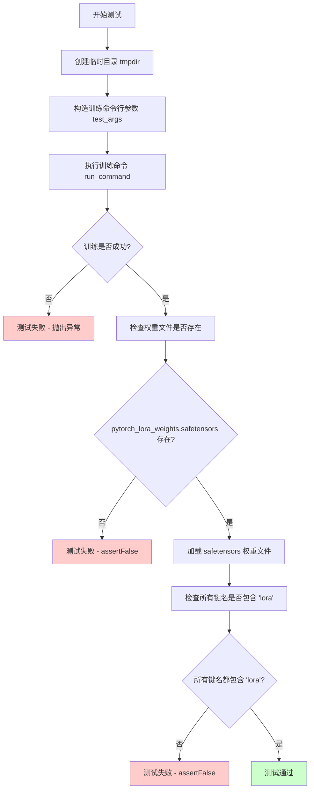

#### 带注释源码

```python
def test_text_to_image_lora_sdxl(self):
    """
    测试 SDXL LoRA 训练流程的集成测试用例。
    
    该测试执行以下步骤：
    1. 创建临时目录用于存放训练输出
    2. 构造并执行训练脚本命令
    3. 验证生成的 LoRA 权重文件存在
    4. 验证权重状态字典中的键名正确包含 'lora' 标识
    """
    # 使用 tempfile 创建临时输出目录，测试结束后自动清理
    with tempfile.TemporaryDirectory() as tmpdir:
        # 构造训练脚本的命令行参数
        # 使用 f-string 构建多行命令字符串，然后使用 .split() 分割成列表
        test_args = f"""
            examples/text_to_image/train_text_to_image_lora_sdxl.py
            # 指定预训练模型路径（使用 HuggingFace Hub 上的微型测试模型）
            --pretrained_model_name_or_path hf-internal-testing/tiny-stable-diffusion-xl-pipe
            # 指定数据集名称（使用 HuggingFace Hub 上的虚拟图像文本数据）
            --dataset_name hf-internal-testing/dummy_image_text_data
            # 设置图像分辨率为 64x64（降低分辨率以加快测试速度）
            --resolution 64
            # 设置训练批次大小为 1
            --train_batch_size 1
            # 设置梯度累积步数为 1（无实际累积）
            --gradient_accumulation_steps 1
            # 设置最大训练步数为 2（最小化训练时间）
            --max_train_steps 2
            # 设置学习率为 5.0e-04
            --learning_rate 5.0e-04
            # 启用学习率自动缩放功能
            --scale_lr
            # 使用常数学习率调度器
            --lr_scheduler constant
            # 设置学习率预热步数为 0（无预热）
            --lr_warmup_steps 0
            # 设置输出目录为临时目录
            --output_dir {tmpdir}
            """.split()

        # 执行训练命令：将类属性 _launch_args（accelerate 启动参数）与训练参数合并后执行
        # _launch_args 通常包含如 '--num_processes', '2' 等分布式训练参数
        run_command(self._launch_args + test_args)
        
        # ==== 验证阶段 ====
        
        # smoke test: 验证 save_pretrained 功能正常，权重文件已生成
        self.assertTrue(os.path.isfile(os.path.join(tmpdir, "pytorch_lora_weights.safetensors")))

        # 加载生成的 LoRA 权重文件（safetensors 格式）
        lora_state_dict = safetensors.torch.load_file(os.path.join(tmpdir, "pytorch_lora_weights.safetensors"))
        
        # 验证所有权重键名都包含 'lora' 标识，确保 LoRA 权重正确提取
        # LoRA 权重通常在键名中包含 'lora_' 或 '.lora' 等标记
        is_lora = all("lora" in k for k in lora_state_dict.keys())
        self.assertTrue(is_lora)
```


### `TextToImageLoRASDXL.test_text_to_image_lora_sdxl_with_text_encoder`

这是一个用于测试 SDXL LoRA 训练的测试方法，验证在启用 text encoder 训练选项时，训练脚本能够正确生成 LoRA 权重，并且状态字典中的所有参数键名都符合预期的命名规范（以 "unet"、"text_encoder" 或 "text_encoder_2" 开头）。

参数：

- `self`：继承自 `ExamplesTestsAccelerate` 的类实例，包含测试框架所需的配置和辅助方法（如 `_launch_args`）

返回值：`None`，该方法为测试方法，通过 `assert` 语句进行断言验证，不返回具体数值

#### 流程图

```mermaid
flowchart TD
    A[开始测试] --> B[创建临时目录 tmpdir]
    B --> C[构建训练参数<br/>--train_text_encoder 启用text encoder训练]
    C --> D[执行训练命令<br/>run_command]
    D --> E{检查输出文件是否存在}
    E -->|是| F[加载 LoRA 权重文件]
    E -->|否| G[测试失败]
    F --> H[验证权重键名<br/>所有键包含 'lora']
    H --> I{验证结果}
    I -->|通过| J[验证参数前缀<br/>以 unet/text_encoder/text_encoder_2 开头}
    I -->|失败| G
    J --> K{前缀验证结果}
    K -->|通过| L[测试通过]
    K -->|失败| G
```

#### 带注释源码

```python
def test_text_to_image_lora_sdxl_with_text_encoder(self):
    """
    测试函数：验证 SDXL LoRA 训练在启用 text encoder 时的正确性
    
    测试步骤：
    1. 创建临时目录用于存放训练输出
    2. 构建包含 --train_text_encoder 参数的训练命令
    3. 执行训练脚本
    4. 验证生成的 LoRA 权重文件
    5. 验证状态字典中的键名符合规范
    """
    # 使用 tempfile 创建临时目录，测试结束后自动清理
    with tempfile.TemporaryDirectory() as tmpdir:
        # 构建训练参数命令
        # 关键参数：
        # --train_text_encoder: 启用 text encoder 的 LoRA 训练
        # --max_train_steps 2: 仅运行 2 步用于快速测试
        # --output_dir tmpdir: 指定输出目录
        test_args = f"""
            examples/text_to_image/train_text_to_image_lora_sdxl.py
            --pretrained_model_name_or_path hf-internal-testing/tiny-stable-diffusion-xl-pipe
            --dataset_name hf-internal-testing/dummy_image_text_data
            --resolution 64
            --train_batch_size 1
            --gradient_accumulation_steps 1
            --max_train_steps 2
            --learning_rate 5.0e-04
            --scale_lr
            --lr_scheduler constant
            --lr_warmup_steps 0
            --output_dir {tmpdir}
            --train_text_encoder
            """.split()

        # 执行训练命令，使用类中定义的 _launch_args（包含 accelerate 相关参数）
        run_command(self._launch_args + test_args)
        
        # 验证点1：检查 LoRA 权重文件是否成功生成
        # save_pretrained smoke test - 冒烟测试确保文件存在
        self.assertTrue(os.path.isfile(os.path.join(tmpdir, "pytorch_lora_weights.safetensors")))

        # 验证点2：检查状态字典中的键名是否包含 'lora' 标记
        # 确保生成的权重确实是 LoRA 权重而非普通模型权重
        lora_state_dict = safetensors.torch.load_file(os.path.join(tmpdir, "pytorch_lora_weights.safetensors"))
        is_lora = all("lora" in k for k in lora_state_dict.keys())
        self.assertTrue(is_lora)

        # 验证点3：检查所有参数键名是否符合 SDXL LoRA 规范
        # 当训练 text encoder 时，参数应来自：
        # - unet: UNet2DConditionModel
        # - text_encoder: CLIPTextModel (第一个文本编码器)
        # - text_encoder_2: CLIPTextModelWithProjection (第二个文本编码器，SDXL 特有)
        keys = lora_state_dict.keys()
        starts_with_unet = all(
            k.startswith("unet") or k.startswith("text_encoder") or k.startswith("text_encoder_2") for k in keys
        )
        self.assertTrue(starts_with_unet)
```


### `TextToImageLoRASDXL.test_text_to_image_lora_sdxl_text_encoder_checkpointing_checkpoints_total_limit`

该方法是一个集成测试，用于验证在使用SDXL（Stable Diffusion XL）模型进行LoRA训练时，检查点保存功能能够正确限制保留的检查点总数（`checkpoints_total_limit`），并在训练文本编码器（`train_text_encoder`）的场景下，确保旧的检查点（如checkpoint-2）被正确删除，只保留最新的检查点（checkpoint-4和checkpoint-6）。

参数：

- `self`：实例方法隐含参数，类型为`TextToImageLoRASDXl`（继承自`ExamplesTestsAccelerate`），代表测试类实例本身

返回值：`None`，无返回值（测试方法，断言验证测试结果）

#### 流程图

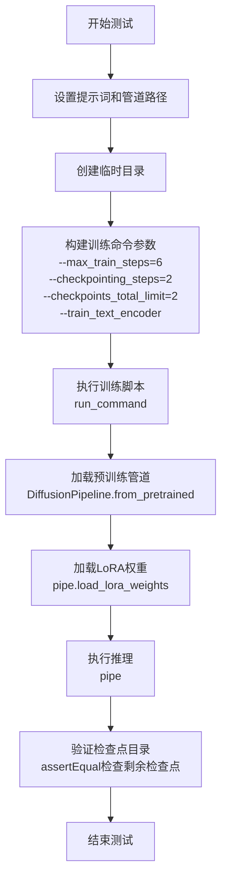

#### 带注释源码

```python
def test_text_to_image_lora_sdxl_text_encoder_checkpointing_checkpoints_total_limit(self):
    """
    测试SDXL LoRA训练中，检查点限制功能在训练text encoder场景下是否正常工作
    
    测试场景：
    - 最大训练步数：6步
    - 检查点保存间隔：每2步保存一次
    - 检查点总数限制：最多保留2个
    - 启用text encoder训练
    
    预期结果：
    - 会在step 2, 4, 6时创建检查点
    - checkpoint-2应该被删除（因为超过总数限制）
    - 最终只保留checkpoint-4和checkpoint-6
    """
    
    # 定义测试用的提示词
    prompt = "a prompt"
    # 定义预训练SDXL管道路径（测试用小型管道）
    pipeline_path = "hf-internal-testing/tiny-stable-diffusion-xl-pipe"

    # 创建临时目录用于存放训练输出和检查点
    with tempfile.TemporaryDirectory() as tmpdir:
        # 构建训练脚本的命令行参数
        # 使用f-string构建多行命令字符串，然后split()分割成列表
        initial_run_args = f"""
            examples/text_to_image/train_text_to_image_lora_sdxl.py
            --pretrained_model_name_or_path {pipeline_path}
            --dataset_name hf-internal-testing/dummy_image_text_data
            --resolution 64
            --train_batch_size 1
            --gradient_accumulation_steps 1
            --max_train_steps 6  # 训练6步
            --learning_rate 5.0e-04
            --scale_lr
            --lr_scheduler constant
            --train_text_encoder  # 启用text encoder训练
            --lr_warmup_steps 0
            --output_dir {tmpdir}
            --checkpointing_steps=2  # 每2步保存检查点
            --checkpoints_total_limit=2  # 最多保留2个检查点
            """.split()

        # 执行训练命令（合并launch_args和训练参数）
        run_command(self._launch_args + initial_run_args)

        # 从预训练模型加载扩散管道
        pipe = DiffusionPipeline.from_pretrained(pipeline_path)
        # 从临时目录加载训练好的LoRA权重
        pipe.load_lora_weights(tmpdir)
        # 执行推理（验证LoRA权重可用）
        pipe(prompt, num_inference_steps=1)

        # 验证检查点目录是否符合预期
        # checkpoint-2应该已被删除
        # 预期保留：checkpoint-4, checkpoint-6
        self.assertEqual(
            {x for x in os.listdir(tmpdir) if "checkpoint" in x}, 
            {"checkpoint-4", "checkpoint-6"}
        )
```

## 关键组件


### TextToImageLoRA 类

用于测试 Stable Diffusion 模型的 LoRA 训练与检查点限制功能的测试类，包含多个测试方法验证检查点总数限制的行为。

### TextToImageLoRASDXL 类

用于测试 Stable Diffusion XL 模型的 LoRA 训练功能的测试类，包含训练文本编码器的测试和检查点限制验证。

### 检查点总数限制机制 (checkpoints_total_limit)

通过 `--checkpoints_total_limit` 参数控制训练过程中保留的检查点总数，当超过限制时自动删除最旧的检查点，确保磁盘空间合理使用。

### LoRA 权重加载与推理

使用 `DiffusionPipeline.from_pretrained()` 加载预训练模型，通过 `pipe.load_lora_weights()` 加载训练好的 LoRA 权重进行推理验证。

### 训练脚本执行器 (run_command)

封装了命令行训练脚本的调用逻辑，支持传入加速参数 `_launch_args` 和训练参数，执行 `train_text_to_image_lora.py` 或 `train_text_to_image_lora_sdxl.py` 脚本。

### 检查点恢复功能 (resume_from_checkpoint)

支持从指定检查点恢复训练，继续训练过程并应用检查点总数限制策略，实现增量训练与检查点管理。

### 文本编码器训练选项 (train_text_encoder)

通过 `--train_text_encoder` 参数启用文本编码器的 LoRA 训练，使模型能够同时学习图像和文本编码器的低秩适配权重。


## 问题及建议


### 已知问题

-   **大量代码重复**：多个测试方法中存在相同的命令行参数构建、目录创建、pipeline加载和推理逻辑，导致维护成本高
-   **硬编码配置**：模型路径、数据集名称、分辨率、训练参数等均硬编码在测试方法中，缺乏统一的配置管理
-   **缺少错误处理**：对`run_command`的返回状态未进行检查，文件操作（`os.listdir`、`os.path.isfile`）缺乏异常捕获
-   **外部依赖脆弱性**：测试依赖远程模型（hf-internal-testing/...）和数据集，网络问题或模型变更会导致测试失败
-   **sys.path修改**：使用`sys.path.append("..")`导入模块是不推荐的，可能导致导入冲突
-   **测试验证不足**：仅检查文件存在和checkpoint目录，未验证训练过程是否真正成功或权重是否正确
-   **资源清理不完整**：测试失败时临时目录可能未完全清理

### 优化建议

-   **提取公共逻辑**：创建基类或工具函数封装重复的命令构建、pipeline加载和推理逻辑
-   **配置外部化**：使用配置文件或pytest fixture管理模型路径和训练参数
-   **添加错误处理**：检查`run_command`返回码，对文件操作添加try-except保护
-   **mock外部依赖**：使用unittest.mock或本地模型缓存减少对网络的依赖
-   **改进导入方式**：使用绝对导入或proper的包结构替代sys.path hack
-   **增强测试断言**：添加训练输出验证、权重内容检查和更详细的失败消息
-   **使用pytest fixtures**：利用fixture管理临时目录的生命周期和清理

## 其它


### 设计目标与约束

本代码的设计目标是验证LoRA训练脚本的checkpointing功能是否正确工作，特别是checkpoints_total_limit参数能否在训练过程中自动删除旧的checkpoint以限制保存的checkpoint数量。约束条件包括：测试仅验证特定步数（2/4/6/8步）的checkpoint创建和删除逻辑，使用临时目录进行测试，依赖Accelerate框架执行训练命令。

### 错误处理与异常设计

代码主要依赖pytest框架进行错误捕获，使用assertEqual进行结果验证。临时目录使用tempfile.TemporaryDirectory()确保测试结束后自动清理。训练命令执行使用run_command函数，若命令失败会抛出异常导致测试失败。文件存在性检查使用os.path.isfile和os.listdir进行断言验证。

### 数据流与状态机

测试数据流为：构建训练参数args → 调用run_command执行训练脚本 → 使用DiffusionPipeline加载模型和LoRA权重 → 执行推理pipe(prompt) → 验证checkpoint目录状态。状态机转换：初始状态无checkpoint → 创建checkpoint-2 → 创建checkpoint-4时删除checkpoint-2 → 创建checkpoint-6时删除checkpoint-4。

### 外部依赖与接口契约

主要依赖包括：diffusers库的DiffusionPipeline用于加载和运行模型，safetensors库用于加载LoRA权重，tempfile模块用于临时目录管理，os和sys模块用于文件系统操作。外部脚本接口：train_text_to_image_lora.py和train_text_to_image_lora_sdxl.py接受标准命令行参数包括--pretrained_model_name_or_path、--dataset_name、--max_train_steps、--checkpointing_steps、--checkpoints_total_limit等。

### 性能考虑

测试使用极小模型（hf-internal-testing/tiny-stable-diffusion-pipe）和小分辨率（64）以加快测试速度。训练步数设置很小（2-8步）以缩短执行时间。使用TemporaryDirectory自动管理临时文件避免资源泄漏。

### 安全性考虑

代码无用户输入处理，使用硬编码的模型路径和数据集。临时目录在with语句中自动管理。测试脚本来自官方examples目录，视为可信代码。

### 可维护性分析

代码结构清晰，每个测试方法独立验证一个功能点。重复的逻辑（如加载pipeline）可提取为辅助方法。测试参数通过字符串格式化构建，可考虑使用argparse.Namespace或字典提高可读性。

### 测试覆盖率分析

覆盖场景包括：SDXL模型checkpoint限制、标准SD模型checkpoint限制、多checkpoint删除逻辑、LoRA权重保存验证、text encoder训练验证。缺失场景：训练中断恢复测试、内存溢出边界测试、多GPU分布式训练测试。

    