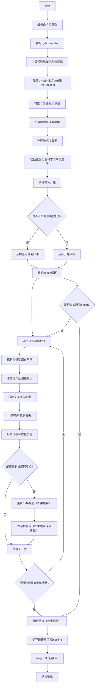
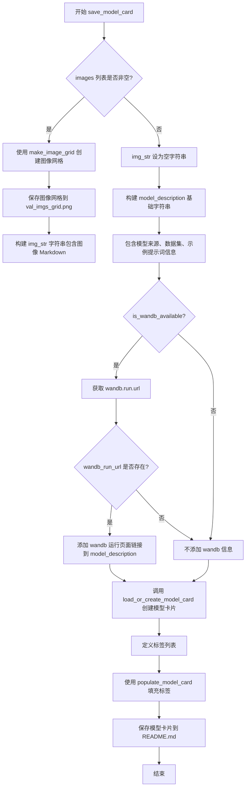
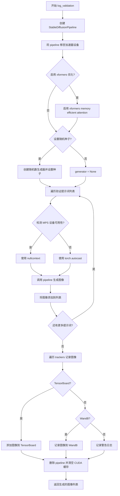
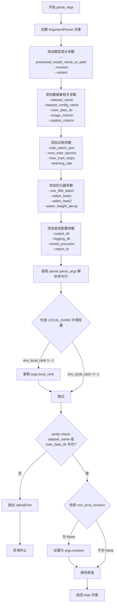

```mermaid
flowchart TD
    A[开始 main] --> B[parse_args 解析命令行参数]
    B --> C[配置 Accelerator 加速器]
    C --> D[设置日志级别]
    D --> E[set_seed 设置随机种子]
    E --> F[创建输出目录并处理 Hub 推送]
    F --> G[加载噪声调度器和分词器]
    G --> H[加载预训练模型: text_encoder, vae, unet]
    H --> I[冻结 vae 和 text_encoder, unet 设为训练模式]
    I --> J{args.use_ema?}
    J -->|Yes| K[创建 EMA 模型]
    J -->|No| L[跳过 EMA 创建]
    K --> L
    L --> M[启用 xformers 内存优化]
    M --> N[注册模型保存/加载钩子]
    N --> O[启用梯度检查点]
    O --> P[启用 TF32 加速]
    P --> Q[计算学习率 scale_lr]
    Q --> R[初始化优化器 AdamW]
    R --> S[加载数据集]
    S --> T[预处理数据集和创建数据加载器]
    T --> U[计算训练步数和创建学习率调度器]
    U --> V[accelerator.prepare 准备所有组件]
    V --> W[初始化 trackers 记录器]
    W --> X{检查点恢复?}
    X -->|Yes| Y[加载检查点并恢复训练状态]
    X -->|No| Z[从头开始训练]
    Y --> Z
    Z --> AA[进入训练循环: for epoch]
    AA --> AB[进入批次循环: for step, batch]
    AB --> AC[vae.encode 将图像编码为潜在表示]
    AC --> AD[采样噪声并添加偏移]
    AD --> AE[采样随机时间步 timesteps]
    AE --> AF[noise_scheduler.add_noise 执行前向扩散]
    AF --> AG[text_encoder 获取文本嵌入]
    AG --> AH[根据预测类型确定目标]
    AH --> AI{dream_training?}
    AI -->|Yes| AJ[compute_dream_and_update_latents]
    AI -->|No| AK
    AJ --> AK
    AK --> AL[unet 预测噪声残差]
    AL --> AM[计算 MSE 损失或 SNR 加权损失]
    AM --> AN[accelerator.backward 反向传播]
    AN --> AO[梯度裁剪和优化器更新]
    AO --> AP[accelerator.sync_gradients?]
    AP -->|Yes| AQ[EMA 更新]
    AQ --> AR[progress_bar 更新和日志记录]
    AR --> AS{checkpointing?}
    AS -->|Yes| AT[保存检查点]
    AS -->|No| AU
    AT --> AU
    AU --> AV{达到最大训练步数?}
    AV -->|No| AB
    AV -->|Yes| AW[训练循环结束]
    AW --> AX{validation_prompts?}
    AX -->|Yes| AY[log_validation 执行验证]
    AX -->|No| AZ
    AY --> AZ
    AZ --> BA[等待所有进程完成]
    BA --> BB[unwrap_model 展开模型]
    BB --> BC[EMA 参数复制到主模型]
    BC --> BD[创建 StableDiffusionPipeline]
    BD --> BE[pipeline.save_pretrained 保存模型]
    BE --> BF{validation_prompts?}
    BF -->|Yes| BG[运行推理生成示例图像]
    BF -->|No| BH
    BG --> BH
    BH --> BI{push_to_hub?}
    BI -->|Yes| BJ[保存模型卡片并推送到 Hub]
    BI -->|No| BK[结束训练 accelerator.end_training]
    BK --> BL[结束]
```

# `diffusers\examples\text_to_image\train_text_to_image.py` 详细设计文档

这是一个用于在自定义数据集上微调Stable Diffusion文本到图像模型的训练脚本，支持分布式训练、EMA、梯度累积、混合精度、xformers优化等功能，并包含验证和模型推送至Hub的完整流程。

## 整体流程



## 类结构

```
无自定义类 (纯脚本文件)
└── 全局函数
    ├── save_model_card (保存模型卡片)
    ├── log_validation (验证函数)
    ├── parse_args (参数解析)
    └── main (主训练函数)
```

## 全局变量及字段


### `logger`
    
用于记录训练脚本运行过程中的日志信息，记录级别为INFO

类型：`logging.Logger`
    


### `DATASET_NAME_MAPPING`
    
数据集名称到图像列名和文本列名的映射字典，用于指定特定数据集的列名

类型：`Dict[str, Tuple[str, str]]`
    


    

## 全局函数及方法


### `save_model_card`

该函数负责生成并保存模型的 README.md 卡片文件，包含模型描述、训练信息、示例图像，并将其推送到 HuggingFace Hub。

参数：

- `args`：对象，包含所有训练参数（如 pretrained_model_name_or_path、dataset_name、validation_prompts、num_train_epochs、learning_rate 等）
- `repo_id`：str，HuggingFace Hub 上的模型仓库 ID
- `images`：list，可选，验证阶段生成的图像列表，用于展示模型效果
- `repo_folder`：str，可选，本地仓库文件夹路径，用于保存 README.md 和验证图像网格

返回值：无（返回 None），该函数直接将模型卡片保存到文件系统

#### 流程图



#### 带注释源码

```python
def save_model_card(
    args,
    repo_id: str,
    images: list = None,
    repo_folder: str = None,
):
    """
    保存模型卡片信息到 README.md 文件
    
    参数:
        args: 训练配置参数对象
        repo_id: HuggingFace Hub 仓库 ID
        images: 验证时生成的图像列表
        repo_folder: 本地仓库文件夹路径
    """
    
    # 初始化图像字符串为空
    img_str = ""
    
    # 如果有验证图像，创建图像网格并保存
    if len(images) > 0:
        # 使用 make_image_grid 将多张图像拼接成网格
        image_grid = make_image_grid(images, 1, len(args.validation_prompts))
        # 保存图像网格到指定目录
        image_grid.save(os.path.join(repo_folder, "val_imgs_grid.png"))
        # 构建 Markdown 格式的图像引用字符串
        img_str += "\n"

    # 构建模型描述信息，包含训练关键参数
    model_description = f"""
# Text-to-image finetuning - {repo_id}

This pipeline was finetuned from **{args.pretrained_model_name_or_path}** on the **{args.dataset_name}** dataset. Below are some example images generated with the finetuned pipeline using the following prompts: {args.validation_prompts}: \n
{img_str}

## Pipeline usage

You can use the pipeline like so:

```python
from diffusers import DiffusionPipeline
import torch

pipeline = DiffusionPipeline.from_pretrained("{repo_id}", torch_dtype=torch.float16)
prompt = "{args.validation_prompts[0]}"
image = pipeline(prompt).images[0]
image.save("my_image.png")
```

## Training info

These are the key hyperparameters used during training:

* Epochs: {args.num_train_epochs}
* Learning rate: {args.learning_rate}
* Batch size: {args.train_batch_size}
* Gradient accumulation steps: {args.gradient_accumulation_steps}
* Image resolution: {args.resolution}
* Mixed-precision: {args.mixed_precision}

"""
    
    # 初始化 wandb 信息字符串
    wandb_info = ""
    
    # 检查 wandb 是否可用
    if is_wandb_available():
        # 尝试获取当前 wandb 运行的 URL
        wandb_run_url = None
        if wandb.run is not None:
            wandb_run_url = wandb.run.url

        # 如果存在 wandb 运行 URL，添加链接信息
        if wandb_run_url is not None:
            wandb_info = f"""
More information on all the CLI arguments and the environment are available on your [`wandb` run page]({wandb_run_url}).
"""

    # 将 wandb 信息追加到模型描述
    model_description += wandb_info

    # 加载或创建模型卡片对象
    # from_training=True 表示这是训练过程中生成的卡片
    model_card = load_or_create_model_card(
        repo_id_or_path=repo_id,
        from_training=True,
        license="creativeml-openrail-m",
        base_model=args.pretrained_model_name_or_path,
        model_description=model_description,
        inference=True,
    )

    # 定义模型标签，用于 Hub 上的分类
    tags = ["stable-diffusion", "stable-diffusion-diffusers", "text-to-image", "diffusers", "diffusers-training"]
    
    # 填充模型卡片的标签信息
    model_card = populate_model_card(model_card, tags=tags)

    # 将模型卡片保存为 README.md 文件
    model_card.save(os.path.join(repo_folder, "README.md"))
```


### `log_validation`

该函数用于在验证阶段运行 Stable Diffusion 模型，根据预设的验证提示词生成图像，并将生成的图像记录到日志追踪器（如 TensorBoard 或 WandB）中，同时返回生成的图像列表以便后续使用。

参数：

- `vae`：`AutoencoderKL`，变分自编码器模型，用于将图像编码到潜在空间
- `text_encoder`：文本编码器模型，用于将文本提示转换为嵌入向量
- `tokenizer`：CLIPTokenizer，文本分词器，用于对输入文本进行分词
- `unet`：UNet2DConditionModel，UNet 模型，用于根据噪声和条件生成图像
- `args`：Namespace，包含所有训练参数的配置对象（如模型路径、是否启用 xformers、随机种子等）
- `accelerator`：Accelerator，Accelerate 库提供的分布式训练加速器，用于设备管理和模型包装
- `weight_dtype`：torch.dtype，权重数据类型（float32、float16 或 bfloat16），用于控制推理精度
- `epoch`：int，当前验证所在的训练轮次编号，用于日志记录

返回值：`list`，返回生成的图像对象列表，每个元素为 PIL.Image 类型

#### 流程图



#### 带注释源码

```python
def log_validation(vae, text_encoder, tokenizer, unet, args, accelerator, weight_dtype, epoch):
    """
    运行验证并记录生成的图像
    
    参数:
        vae: 变分自编码器模型
        text_encoder: 文本编码器模型
        tokenizer: 文本分词器
        unet: UNet2DConditionModel
        args: 命令行参数对象
        accelerator: Accelerate 加速器
        weight_dtype: 权重数据类型
        epoch: 当前训练轮次
    """
    logger.info("Running validation... ")

    # 从预训练模型创建 StableDiffusionPipeline
    # 使用 accelerator.unwrap_model 获取原始模型（未包装）
    # 设置 safety_checker=None 禁用安全检查器以提高推理速度
    pipeline = StableDiffusionPipeline.from_pretrained(
        args.pretrained_model_name_or_path,
        vae=accelerator.unwrap_model(vae),
        text_encoder=accelerator.unwrap_model(text_encoder),
        tokenizer=tokenizer,
        unet=accelerator.unwrap_model(unet),
        safety_checker=None,  # 禁用安全检查器
        revision=args.revision,
        variant=args.variant,
        torch_dtype=weight_dtype,
    )
    
    # 将 pipeline 移至加速器设备（GPU/CPU）
    pipeline = pipeline.to(accelerator.device)
    
    # 禁用进度条以减少日志输出
    pipeline.set_progress_bar_config(disable=True)

    # 如果启用 xformers，启用内存高效注意力机制
    if args.enable_xformers_memory_efficient_attention:
        pipeline.enable_xformers_memory_efficient_attention()

    # 设置随机数生成器以确保可重复性
    if args.seed is None:
        generator = None
    else:
        # 创建指定设备的生成器并设置种子
        generator = torch.Generator(device=accelerator.device).manual_seed(args.seed)

    images = []
    # 遍历所有验证提示词生成图像
    for i in range(len(args.validation_prompts)):
        # 检测 MPS (Apple Silicon) 设备可用性
        if torch.backends.mps.is_available():
            autocast_ctx = nullcontext()  # MPS 设备不使用 autocast
        else:
            # 其他设备使用自动混合精度
            autocast_ctx = torch.autocast(accelerator.device.type)

        # 使用 autocast 上下文进行推理
        with autocast_ctx:
            # 调用 pipeline 生成图像，使用 20 步推理
            image = pipeline(args.validation_prompts[i], num_inference_steps=20, generator=generator).images[0]

        images.append(image)

    # 遍历所有 tracker 记录图像
    for tracker in accelerator.trackers:
        if tracker.name == "tensorboard":
            # 将图像转换为 numpy 数组格式并添加到 TensorBoard
            np_images = np.stack([np.asarray(img) for img in images])
            tracker.writer.add_images("validation", np_images, epoch, dataformats="NHWC")
        elif tracker.name == "wandb":
            # 将图像记录到 WandB，包含提示词作为标题
            tracker.log(
                {
                    "validation": [
                        wandb.Image(image, caption=f"{i}: {args.validation_prompts[i]}")
                        for i, image in enumerate(images)
                    ]
                }
            )
        else:
            # 对不支持的 tracker 记录警告
            logger.warning(f"image logging not implemented for {tracker.name}")

    # 清理资源：删除 pipeline 释放显存
    del pipeline
    torch.cuda.empty_cache()

    # 返回生成的图像列表
    return images
```


### `parse_args`

该函数是Stable Diffusion训练脚本的命令行参数解析器，通过argparse库定义并收集所有训练所需的超参数和配置选项，包括模型路径、数据集配置、训练参数、优化器设置等，并返回包含所有参数的Namespace对象。

参数：

- 该函数无显式参数，但内部通过`parser.parse_args()`隐式接收命令行传入的参数

返回值：`argparse.Namespace`，返回包含所有解析后命令行参数的对象，可通过`args.属性名`访问各参数值

#### 流程图



#### 带注释源码

```python
def parse_args():
    """
    解析命令行参数并返回包含所有训练配置的对象
    
    该函数使用argparse库定义了一系列命令行参数，涵盖模型配置、数据集配置、
    训练参数、优化器设置、日志记录等各个方面。解析完成后进行基本的合理性检查。
    
    返回:
        argparse.Namespace: 包含所有解析后命令行参数的对象
    """
    # 步骤1: 创建ArgumentParser实例，描述脚本用途
    parser = argparse.ArgumentParser(description="Simple example of a training script.")
    
    # ============ 模型相关参数 ============
    # 输入扰动参数，用于增强训练鲁棒性
    parser.add_argument(
        "--input_perturbation", type=float, default=0, help="The scale of input perturbation. Recommended 0.1."
    )
    # 预训练模型路径或HuggingFace模型标识符（必填）
    parser.add_argument(
        "--pretrained_model_name_or_path",
        type=str,
        default=None,
        required=True,
        help="Path to pretrained model or model identifier from huggingface.co/models.",
    )
    # 预训练模型的修订版本
    parser.add_argument(
        "--revision",
        type=str,
        default=None,
        required=False,
        help="Revision of pretrained model identifier from huggingface.co/models.",
    )
    # 模型文件变体（如fp16）
    parser.add_argument(
        "--variant",
        type=str,
        default=None,
        help="Variant of the model files of the pretrained model identifier from huggingface.co/models, 'e.g.' fp16",
    )
    
    # ============ 数据集相关参数 ============
    # 数据集名称（可来自HuggingFace Hub或本地路径）
    parser.add_argument(
        "--dataset_name",
        type=str,
        default=None,
        help=(
            "The name of the Dataset (from the HuggingFace hub) to train on (could be your own, possibly private,"
            " dataset). It can also be a path pointing to a local copy of a dataset in your filesystem,"
            " or to a folder containing files that 🤗 Datasets can understand."
        ),
    )
    # 数据集配置名称
    parser.add_argument(
        "--dataset_config_name",
        type=str,
        default=None,
        help="The config of the Dataset, leave as None if there's only one config.",
    )
    # 本地训练数据目录
    parser.add_argument(
        "--train_data_dir",
        type=str,
        default=None,
        help=(
            "A folder containing the training data. Folder contents must follow the structure described in"
            " https://huggingface.co/docs/datasets/image_dataset#imagefolder. In particular, a `metadata.jsonl` file"
            " must exist to provide the captions for the images. Ignored if `dataset_name` is specified."
        ),
    )
    # 数据集中图像列名
    parser.add_argument(
        "--image_column", type=str, default="image", help="The column of the dataset containing an image."
    )
    # 数据集中文本/标题列名
    parser.add_argument(
        "--caption_column",
        type=str,
        default="text",
        help="The column of the dataset containing a caption or a list of captions.",
    )
    # 调试用途：限制训练样本数量
    parser.add_argument(
        "--max_train_samples",
        type=int,
        default=None,
        help=(
            "For debugging purposes or quicker training, truncate the number of training examples to this "
            "value if set."
        ),
    )
    # 验证提示词列表
    parser.add_argument(
        "--validation_prompts",
        type=str,
        default=None,
        nargs="+",
        help=("A set of prompts evaluated every `--validation_epochs` and logged to `--report_to`."),
    )
    
    # ============ 输出和存储相关参数 ============
    # 输出目录
    parser.add_argument(
        "--output_dir",
        type=str,
        default="sd-model-finetuned",
        help="The output directory where the model predictions and checkpoints will be written.",
    )
    # 缓存目录
    parser.add_argument(
        "--cache_dir",
        type=str,
        default=None,
        help="The directory where the downloaded models and datasets will be stored.",
    )
    # 随机种子
    parser.add_argument("--seed", type=int, default=None, help="A seed for reproducible training.")
    
    # ============ 图像预处理参数 ============
    # 图像分辨率
    parser.add_argument(
        "--resolution",
        type=int,
        default=512,
        help=(
            "The resolution for input images, all the images in the train/validation dataset will be resized to this"
            " resolution"
        ),
    )
    # 是否中心裁剪
    parser.add_argument(
        "--center_crop",
        default=False,
        action="store_true",
        help=(
            "Whether to center crop the input images to the resolution. If not set, the images will be randomly"
            " cropped. The images will be resized to the resolution first before cropping."
        ),
    )
    # 是否随机水平翻转
    parser.add_argument(
        "--random_flip",
        action="store_true",
        help="whether to randomly flip images horizontally",
    )
    # 图像插值方法
    parser.add_argument(
        "--image_interpolation_mode",
        type=str,
        default="lanczos",
        choices=[
            f.lower() for f in dir(transforms.InterpolationMode) if not f.startswith("__") and not f.endswith("__")
        ],
        help="The image interpolation method to use for resizing images.",
    )
    
    # ============ 训练过程参数 ============
    # 训练批次大小
    parser.add_argument(
        "--train_batch_size", type=int, default=16, help="Batch size (per device) for the training dataloader."
    )
    # 训练轮数
    parser.add_argument("--num_train_epochs", type=int, default=100)
    # 最大训练步数（如果设置，会覆盖num_train_epochs）
    parser.add_argument(
        "--max_train_steps",
        type=int,
        default=None,
        help="Total number of training steps to perform.  If provided, overrides num_train_epochs.",
    )
    # 梯度累积步数
    parser.add_argument(
        "--gradient_accumulation_steps",
        type=int,
        default=1,
        help="Number of updates steps to accumulate before performing a backward/update pass.",
    )
    # 梯度检查点（节省显存）
    parser.add_argument(
        "--gradient_checkpointing",
        action="store_true",
        help="Whether or not to use gradient checkpointing to save memory at the expense of slower backward pass.",
    )
    # 学习率
    parser.add_argument(
        "--learning_rate",
        type=float,
        default=1e-4,
        help="Initial learning rate (after the potential warmup period) to use.",
    )
    # 是否根据GPU数量、累积步数和批次大小缩放学习率
    parser.add_argument(
        "--scale_lr",
        action="store_true",
        default=False,
        help="Scale the learning rate by the number of GPUs, gradient accumulation steps, and batch size.",
    )
    # 学习率调度器类型
    parser.add_argument(
        "--lr_scheduler",
        type=str,
        default="constant",
        help=(
            'The scheduler type to use. Choose between ["linear", "cosine", "cosine_with_restarts", "polynomial",'
            ' "constant", "constant_with_warmup"]'
        ),
    )
    # 学习率预热步数
    parser.add_argument(
        "--lr_warmup_steps", type=int, default=500, help="Number of steps for the warmup in the lr scheduler."
    )
    # SNR加权gamma参数
    parser.add_argument(
        "--snr_gamma",
        type=float,
        default=None,
        help="SNR weighting gamma to be used if rebalancing the loss. Recommended value is 5.0. "
        "More details here: https://huggingface.co/papers/2303.09556.",
    )
    # DREAM训练方法开关
    parser.add_argument(
        "--dream_training",
        action="store_true",
        help=(
            "Use the DREAM training method, which makes training more efficient and accurate at the "
            "expense of doing an extra forward pass. See: https://huggingface.co/papers/2312.00210"
        ),
    )
    # DREAM细节保存因子
    parser.add_argument(
        "--dream_detail_preservation",
        type=float,
        default=1.0,
        help="Dream detail preservation factor p (should be greater than 0; default=1.0, as suggested in the paper)",
    )
    # 噪声偏移量
    parser.add_argument("--noise_offset", type=float, default=0, help="The scale of noise offset.")
    
    # ============ 优化器参数 ============
    # 是否使用8位Adam优化器
    parser.add_argument(
        "--use_8bit_adam", action="store_true", help="Whether or not to use 8-bit Adam from bitsandbytes."
    )
    # 是否允许TF32（加速训练）
    parser.add_argument(
        "--allow_tf32",
        action="store_true",
        help=(
            "Whether or not to allow TF32 on Ampere GPUs. Can be used to speed up training. For more information, see"
            " https://pytorch.org/docs/stable/notes/cuda.html#tensorfloat-32-tf32-on-ampere-devices"
        ),
    )
    # Adam优化器beta1参数
    parser.add_argument("--adam_beta1", type=float, default=0.9, help="The beta1 parameter for the Adam optimizer.")
    # Adam优化器beta2参数
    parser.add_argument("--adam_beta2", type=float, default=0.999, help="The beta2 parameter for the Adam optimizer.")
    # 权重衰减
    parser.add_argument("--adam_weight_decay", type=float, default=1e-2, help="Weight decay to use.")
    # Adam优化器epsilon值
    parser.add_argument("--adam_epsilon", type=float, default=1e-08, help="Epsilon value for the Adam optimizer")
    # 最大梯度范数
    parser.add_argument("--max_grad_norm", default=1.0, type=float, help="Max gradient norm.")
    
    # ============ EMA相关参数 ============
    # 是否使用EMA模型
    parser.add_argument("--use_ema", action="store_true", help="Whether to use EMA model.")
    # 是否将EMA卸载到CPU
    parser.add_argument("--offload_ema", action="store_true", help="Offload EMA model to CPU during training step.")
    # 是否使用foreach实现EMA
    parser.add_argument("--foreach_ema", action="store_true", help="Use faster foreach implementation of EMAModel.")
    # 非EMA模型的修订版本
    parser.add_argument(
        "--non_ema_revision",
        type=str,
        default=None,
        required=False,
        help=(
            "Revision of pretrained non-ema model identifier. Must be a branch, tag or git identifier of the local or"
            " remote repository specified with --pretrained_model_name_or_path."
        ),
    )
    
    # ============ 数据加载器参数 ============
    # DataLoader工作进程数
    parser.add_argument(
        "--dataloader_num_workers",
        type=int,
        default=0,
        help=(
            "Number of subprocesses to use for data loading. 0 means that the data will be loaded in the main process."
        ),
    )
    
    # ============ Hub相关参数 ============
    # 是否推送到Hub
    parser.add_argument("--push_to_hub", action="store_true", help="Whether or not to push the model to the Hub.")
    # Hub token
    parser.add_argument("--hub_token", type=str, default=None, help="The token to use to push to the Model Hub.")
    # Hub模型ID
    parser.add_argument(
        "--hub_model_id",
        type=str,
        default=None,
        help="The name of the repository to keep in sync with the local `output_dir`.",
    )
    
    # ============ 预测类型和日志 ============
    # 预测类型（epsilon或v_prediction）
    parser.add_argument(
        "--prediction_type",
        type=str,
        default=None,
        help="The prediction_type that shall be used for training. Choose between 'epsilon' or 'v_prediction' or leave `None`. If left to `None` the default prediction type of the scheduler: `noise_scheduler.config.prediction_type` is chosen.",
    )
    # 日志目录
    parser.add_argument(
        "--logging_dir",
        type=str,
        default="logs",
        help=(
            "[TensorBoard](https://www.tensorflow.org/tensorboard) log directory. Will default to"
            " *output_dir/runs/**CURRENT_DATETIME_HOSTNAME***."
        ),
    )
    # 混合精度类型
    parser.add_argument(
        "--mixed_precision",
        type=str,
        default=None,
        choices=["no", "fp16", "bf16"],
        help=(
            "Whether to use mixed precision. Choose between fp16 and bf16 (bfloat16). Bf16 requires PyTorch >="
            " 1.10.and an Nvidia Ampere GPU.  Default to the value of accelerate config of the current system or the"
            " flag passed with the `accelerate.launch` command. Use this argument to override the accelerate config."
        ),
    )
    # 报告目标（tensorboard, wandb等）
    parser.add_argument(
        "--report_to",
        type=str,
        default="tensorboard",
        help=(
            'The integration to report the results and logs to. Supported platforms are `"tensorboard"`'
            ' (default), `"wandb"` and `"comet_ml"`. Use `"all"` to report to all integrations.'
        ),
    )
    # 本地排名（分布式训练用）
    parser.add_argument("--local_rank", type=int, default=-1, help="For distributed training: local_rank")
    
    # ============ 检查点相关参数 ============
    # 检查点保存步数间隔
    parser.add_argument(
        "--checkpointing_steps",
        type=int,
        default=500,
        help=(
            "Save a checkpoint of the training state every X updates. These checkpoints are only suitable for resuming"
            " training using `--resume_from_checkpoint`."
        ),
    )
    # 最大保存检查点数量
    parser.add_argument(
        "--checkpoints_total_limit",
        type=int,
        default=None,
        help=("Max number of checkpoints to store."),
    )
    # 从检查点恢复训练
    parser.add_argument(
        "--resume_from_checkpoint",
        type=str,
        default=None,
        help=(
            "Whether training should be resumed from a previous checkpoint. Use a path saved by"
            ' `--checkpointing_steps`, or `"latest"` to automatically select the last available checkpoint.'
        ),
    )
    
    # ============ 其他高级参数 ============
    # 是否启用xformers高效注意力
    parser.add_argument(
        "--enable_xformers_memory_efficient_attention", action="store_true", help="Whether or not to use xformers."
    )
    # 验证轮数间隔
    parser.add_argument(
        "--validation_epochs",
        type=int,
        default=5,
        help="Run validation every X epochs.",
    )
    # Tracker项目名称
    parser.add_argument(
        "--tracker_project_name",
        type=str,
        default="text2image-fine-tune",
        help=(
            "The `project_name` argument passed to Accelerator.init_trackers for"
            " more information see https://huggingface.co/docs/accelerate/v0.17.0/en/package_reference/accelerator#accelerate.Accelerator"
        ),
    )

    # ============ 解析命令行参数 ============
    # 调用parse_args()实际解析sys.argv中的命令行参数
    args = parser.parse_args()
    
    # ============ 处理分布式训练环境变量 ============
    # 检查LOCAL_RANK环境变量，如果存在且与args.local_rank不一致，则更新args.local_rank
    env_local_rank = int(os.environ.get("LOCAL_RANK", -1))
    if env_local_rank != -1 and env_local_rank != args.local_rank:
        args.local_rank = env_local_rank

    # ============ 合理性检查（Sanity Checks） ============
    # 检查1: 必须提供数据集名称或训练数据目录
    if args.dataset_name is None and args.train_data_dir is None:
        raise ValueError("Need either a dataset name or a training folder.")

    # 检查2: 如果未指定non_ema_revision，默认使用与主模型相同的revision
    if args.non_ema_revision is None:
        args.non_ema_revision = args.revision

    # 返回解析后的参数对象
    return args
```


### `main`

主训练函数，负责完整的Stable Diffusion模型微调流程，包括参数解析、模型加载与冻结、EMA设置、数据集处理、训练循环（含前向传播、损失计算、反向传播、梯度裁剪、优化器更新）、检查点保存、验证推理以及最终模型保存。

参数：该函数无直接参数，参数通过内部调用 `parse_args()` 从命令行获取，主要包括：
- `args.pretrained_model_name_or_path`：预训练模型路径
- `args.dataset_name`：数据集名称
- `args.output_dir`：输出目录
- `args.train_batch_size`：训练批次大小
- `args.num_train_epochs`：训练轮数
- `args.learning_rate`：学习率
- `args.gradient_accumulation_steps`：梯度累积步数
- `args.use_ema`：是否使用EMA
- `args.validation_prompts`：验证提示词
- 等其他训练相关参数

返回值：`None`，函数执行完成后直接退出

#### 流程图



#### 带注释源码

```python
def main():
    """
    主训练函数，执行 Stable Diffusion 模型的完整微调流程
    """
    # 1. 解析命令行参数
    args = parse_args()

    # 2. 安全检查：不允许同时使用 wandb 和 hub_token
    if args.report_to == "wandb" and args.hub_token is not None:
        raise ValueError(
            "You cannot use both --report_to=wandb and --hub_token due to a security risk of exposing your token."
            " Please use `hf auth login` to authenticate with the Hub."
        )

    # 3. 废弃警告处理
    if args.non_ema_revision is not None:
        deprecate(
            "non_ema_revision!=None",
            "0.15.0",
            message=(
                "Downloading 'non_ema' weights from revision branches of the Hub is deprecated. Please make sure to"
                " use `--variant=non_ema` instead."
            ),
        )
    
    # 4. 设置日志目录
    logging_dir = os.path.join(args.output_dir, args.logging_dir)

    # 5. 配置 Accelerator 项目
    accelerator_project_config = ProjectConfiguration(project_dir=args.output_dir, logging_dir=logging_dir)

    # 6. 初始化 Accelerator 加速器（处理分布式训练、混合精度等）
    accelerator = Accelerator(
        gradient_accumulation_steps=args.gradient_accumulation_steps,
        mixed_precision=args.mixed_precision,
        log_with=args.report_to,
        project_config=accelerator_project_config,
    )

    # 7. MPS 设备特殊处理：禁用 AMP
    if torch.backends.mps.is_available():
        accelerator.native_amp = False

    # 8. 配置日志格式
    logging.basicConfig(
        format="%(asctime)s - %(levelname)s - %(name)s - %(message)s",
        datefmt="%m/%d/%Y %H:%M:%S",
        level=logging.INFO,
    )
    logger.info(accelerator.state, main_process_only=False)
    
    # 9. 根据进程类型设置日志级别
    if accelerator.is_local_main_process:
        datasets.utils.logging.set_verbosity_warning()
        transformers.utils.logging.set_verbosity_warning()
        diffusers.utils.logging.set_verbosity_info()
    else:
        datasets.utils.logging.set_verbosity_error()
        transformers.utils.logging.set_verbosity_error()
        diffusers.utils.logging.set_verbosity_error()

    # 10. 设置随机种子（用于可重复训练）
    if args.seed is not None:
        set_seed(args.seed)

    # 11. 处理仓库创建（如果是主进程且需要推送到 Hub）
    if accelerator.is_main_process:
        if args.output_dir is not None:
            os.makedirs(args.output_dir, exist_ok=True)

        if args.push_to_hub:
            repo_id = create_repo(
                repo_id=args.hub_model_id or Path(args.output_dir).name, exist_ok=True, token=args.hub_token
            ).repo_id

    # 12. 加载噪声调度器和分词器
    noise_scheduler = DDPMScheduler.from_pretrained(args.pretrained_model_name_or_path, subfolder="scheduler")
    tokenizer = CLIPTokenizer.from_pretrained(
        args.pretrained_model_name_or_path, subfolder="tokenizer", revision=args.revision
    )

    # 13. DeepSpeed ZeRO-3 上下文管理器（处理多模型加载）
    def deepspeed_zero_init_disabled_context_manager():
        deepspeed_plugin = AcceleratorState().deepspeed_plugin if accelerate.state.is_initialized() else None
        if deepspeed_plugin is None:
            return []
        return [deepspeed_plugin.zero3_init_context_manager(enable=False)]

    # 14. 加载预训练模型（使用 ContextManagers 禁用 ZeRO-3 初始化）
    with ContextManagers(deepspeed_zero_init_disabled_context_manager()):
        text_encoder = CLIPTextModel.from_pretrained(
            args.pretrained_model_name_or_path, subfolder="text_encoder", revision=args.revision, variant=args.variant
        )
        vae = AutoencoderKL.from_pretrained(
            args.pretrained_model_name_or_path, subfolder="vae", revision=args.revision, variant=args.variant
        )

    unet = UNet2DConditionModel.from_pretrained(
        args.pretrained_model_name_or_path, subfolder="unet", revision=args.non_ema_revision
    )

    # 15. 冻结 vae 和 text_encoder，只训练 unet
    vae.requires_grad_(False)
    text_encoder.requires_grad_(False)
    unet.train()

    # 16. 创建 EMA（指数移动平均）模型
    if args.use_ema:
        ema_unet = UNet2DConditionModel.from_pretrained(
            args.pretrained_model_name_or_path, subfolder="unet", revision=args.revision, variant=args.variant
        )
        ema_unet = EMAModel(
            ema_unet.parameters(),
            model_cls=UNet2DConditionModel,
            model_config=ema_unet.config,
            foreach=args.foreach_ema,
        )

    # 17. 启用 xformers 内存高效注意力
    if args.enable_xformers_memory_efficient_attention:
        if is_xformers_available():
            import xformers
            xformers_version = version.parse(xformers.__version__)
            if xformers_version == version.parse("0.0.16"):
                logger.warning(
                    "xFormers 0.0.16 cannot be used for training in some GPUs..."
                )
            unet.enable_xformers_memory_efficient_attention()
        else:
            raise ValueError("xformers is not available...")

    # 18. 注册自定义模型保存/加载钩子（accelerate 0.16.0+）
    if version.parse(accelerate.__version__) >= version.parse("0.16.0"):
        def save_model_hook(models, weights, output_dir):
            if accelerator.is_main_process:
                if args.use_ema:
                    ema_unet.save_pretrained(os.path.join(output_dir, "unet_ema"))
                for i, model in enumerate(models):
                    model.save_pretrained(os.path.join(output_dir, "unet"))
                    weights.pop()

        def load_model_hook(models, input_dir):
            if args.use_ema:
                load_model = EMAModel.from_pretrained(
                    os.path.join(input_dir, "unet_ema"), UNet2DConditionModel, foreach=args.foreach_ema
                )
                ema_unet.load_state_dict(load_model.state_dict())
                if args.offload_ema:
                    ema_unet.pin_memory()
                else:
                    ema_unet.to(accelerator.device)
                del load_model

            for _ in range(len(models)):
                model = models.pop()
                load_model = UNet2DConditionModel.from_pretrained(input_dir, subfolder="unet")
                model.register_to_config(**load_model.config)
                model.load_state_dict(load_model.state_dict())
                del load_model

        accelerator.register_save_state_pre_hook(save_model_hook)
        accelerator.register_load_state_pre_hook(load_model_hook)

    # 19. 启用梯度检查点（节省显存）
    if args.gradient_checkpointing:
        unet.enable_gradient_checkpointing()

    # 20. 启用 TF32 加速（Ampere GPU）
    if args.allow_tf32:
        torch.backends.cuda.matmul.allow_tf32 = True

    # 21. 计算学习率（如果启用 scale_lr）
    if args.scale_lr:
        args.learning_rate = (
            args.learning_rate * args.gradient_accumulation_steps * args.train_batch_size * accelerator.num_processes
        )

    # 22. 初始化优化器
    if args.use_8bit_adam:
        try:
            import bitsandbytes as bnb
        except ImportError:
            raise ImportError("Please install bitsandbytes...")
        optimizer_cls = bnb.optim.AdamW8bit
    else:
        optimizer_cls = torch.optim.AdamW

    optimizer = optimizer_cls(
        unet.parameters(),
        lr=args.learning_rate,
        betas=(args.adam_beta1, args.adam_beta2),
        weight_decay=args.adam_weight_decay,
        eps=args.adam_epsilon,
    )

    # 23. 加载数据集
    if args.dataset_name is not None:
        dataset = load_dataset(
            args.dataset_name,
            args.dataset_config_name,
            cache_dir=args.cache_dir,
            data_dir=args.train_data_dir,
        )
    else:
        data_files = {}
        if args.train_data_dir is not None:
            data_files["train"] = os.path.join(args.train_data_dir, "**")
        dataset = load_dataset(
            "imagefolder",
            data_files=data_files,
            cache_dir=args.cache_dir,
        )

    # 24. 预处理数据集
    column_names = dataset["train"].column_names
    dataset_columns = DATASET_NAME_MAPPING.get(args.dataset_name, None)
    
    # 确定图像和 caption 列名
    if args.image_column is None:
        image_column = dataset_columns[0] if dataset_columns is not None else column_names[0]
    else:
        image_column = args.image_column
        
    if args.caption_column is None:
        caption_column = dataset_columns[1] if dataset_columns is not None else column_names[1]
    else:
        caption_column = args.caption_column

    # 25. 定义 tokenize_captions 函数
    def tokenize_captions(examples, is_train=True):
        captions = []
        for caption in examples[caption_column]:
            if isinstance(caption, str):
                captions.append(caption)
            elif isinstance(caption, (list, np.ndarray)):
                captions.append(random.choice(caption) if is_train else caption[0])
            else:
                raise ValueError(f"Caption column `{caption_column}` should contain either strings or lists of strings.")
        inputs = tokenizer(
            captions, max_length=tokenizer.model_max_length, padding="max_length", truncation=True, return_tensors="pt"
        )
        return inputs.input_ids

    # 26. 定义图像预处理 transforms
    interpolation = getattr(transforms.InterpolationMode, args.image_interpolation_mode.upper(), None)
    if interpolation is None:
        raise ValueError(f"Unsupported interpolation mode {args.image_interpolation_mode}.")

    train_transforms = transforms.Compose([
        transforms.Resize(args.resolution, interpolation=interpolation),
        transforms.CenterCrop(args.resolution) if args.center_crop else transforms.RandomCrop(args.resolution),
        transforms.RandomHorizontalFlip() if args.random_flip else transforms.Lambda(lambda x: x),
        transforms.ToTensor(),
        transforms.Normalize([0.5], [0.5]),
    ])

    # 27. 定义 preprocess_train 函数
    def preprocess_train(examples):
        images = [image.convert("RGB") for image in examples[image_column]]
        examples["pixel_values"] = [train_transforms(image) for image in images]
        examples["input_ids"] = tokenize_captions(examples)
        return examples

    # 28. 应用数据预处理
    with accelerator.main_process_first():
        if args.max_train_samples is not None:
            dataset["train"] = dataset["train"].shuffle(seed=args.seed).select(range(args.max_train_samples))
        train_dataset = dataset["train"].with_transform(preprocess_train)

    # 29. 定义 collate_fn
    def collate_fn(examples):
        pixel_values = torch.stack([example["pixel_values"] for example in examples])
        pixel_values = pixel_values.to(memory_format=torch.contiguous_format).float()
        input_ids = torch.stack([example["input_ids"] for example in examples])
        return {"pixel_values": pixel_values, "input_ids": input_ids}

    # 30. 创建 DataLoader
    train_dataloader = torch.utils.data.DataLoader(
        train_dataset,
        shuffle=True,
        collate_fn=collate_fn,
        batch_size=args.train_batch_size,
        num_workers=args.dataloader_num_workers,
    )

    # 31. 计算训练步数和创建学习率调度器
    num_warmup_steps_for_scheduler = args.lr_warmup_steps * accelerator.num_processes
    if args.max_train_steps is None:
        len_train_dataloader_after_sharding = math.ceil(len(train_dataloader) / accelerator.num_processes)
        num_update_steps_per_epoch = math.ceil(len_train_dataloader_after_sharding / args.gradient_accumulation_steps)
        num_training_steps_for_scheduler = (
            args.num_train_epochs * num_update_steps_per_epoch * accelerator.num_processes
        )
    else:
        num_training_steps_for_scheduler = args.max_train_steps * accelerator.num_processes

    lr_scheduler = get_scheduler(
        args.lr_scheduler,
        optimizer=optimizer,
        num_warmup_steps=num_warmup_steps_for_scheduler,
        num_training_steps=num_training_steps_for_scheduler,
    )

    # 32. 使用 accelerator 准备所有组件
    unet, optimizer, train_dataloader, lr_scheduler = accelerator.prepare(
        unet, optimizer, train_dataloader, lr_scheduler
    )

    # 33. 处理 EMA 模型设备
    if args.use_ema:
        if args.offload_ema:
            ema_unet.pin_memory()
        else:
            ema_unet.to(accelerator.device)

    # 34. 设置权重数据类型（混合精度）
    weight_dtype = torch.float32
    if accelerator.mixed_precision == "fp16":
        weight_dtype = torch.float16
    elif accelerator.mixed_precision == "bf16":
        weight_dtype = torch.bfloat16

    # 35. 移动 text_encoder 和 vae 到设备并转换类型
    text_encoder.to(accelerator.device, dtype=weight_dtype)
    vae.to(accelerator.device, dtype=weight_dtype)

    # 36. 重新计算训练步数
    num_update_steps_per_epoch = math.ceil(len(train_dataloader) / args.gradient_accumulation_steps)
    if args.max_train_steps is None:
        args.max_train_steps = args.num_train_epochs * num_update_steps_per_epoch
    args.num_train_epochs = math.ceil(args.max_train_steps / num_update_steps_per_epoch)

    # 37. 初始化 trackers
    if accelerator.is_main_process:
        tracker_config = dict(vars(args))
        tracker_config.pop("validation_prompts")
        accelerator.init_trackers(args.tracker_project_name, tracker_config)

    # 38. 定义 unwrap_model 函数
    def unwrap_model(model):
        model = accelerator.unwrap_model(model)
        model = model._orig_mod if is_compiled_module(model) else model
        return model

    # 39. 打印训练信息
    total_batch_size = args.train_batch_size * accelerator.num_processes * args.gradient_accumulation_steps
    logger.info("***** Running training *****")
    logger.info(f"  Num examples = {len(train_dataset)}")
    logger.info(f"  Num Epochs = {args.num_train_epochs}")
    logger.info(f"  Instantaneous batch size per device = {args.train_batch_size}")
    logger.info(f"  Total train batch size = {total_batch_size}")
    logger.info(f"  Gradient Accumulation steps = {args.gradient_accumulation_steps}")
    logger.info(f"  Total optimization steps = {args.max_train_steps}")

    global_step = 0
    first_epoch = 0
    initial_global_step = 0

    # 40. 检查点恢复
    if args.resume_from_checkpoint:
        if args.resume_from_checkpoint != "latest":
            path = os.path.basename(args.resume_from_checkpoint)
        else:
            dirs = os.listdir(args.output_dir)
            dirs = [d for d in dirs if d.startswith("checkpoint")]
            dirs = sorted(dirs, key=lambda x: int(x.split("-")[1]))
            path = dirs[-1] if len(dirs) > 0 else None

        if path is None:
            accelerator.print(f"Checkpoint '{args.resume_from_checkpoint}' does not exist. Starting a new training run.")
            args.resume_from_checkpoint = None
            initial_global_step = 0
        else:
            accelerator.print(f"Resuming from checkpoint {path}")
            accelerator.load_state(os.path.join(args.output_dir, path))
            global_step = int(path.split("-")[1])
            initial_global_step = global_step
            first_epoch = global_step // num_update_steps_per_epoch

    # 41. 创建进度条
    progress_bar = tqdm(
        range(0, args.max_train_steps),
        initial=initial_global_step,
        desc="Steps",
        disable=not accelerator.is_local_main_process,
    )

    # 42. ====== 训练循环 ======
    for epoch in range(first_epoch, args.num_train_epochs):
        train_loss = 0.0
        for step, batch in enumerate(train_dataloader):
            with accelerator.accumulate(unet):
                # ----- 前向传播 -----
                # 将图像编码为潜在空间
                latents = vae.encode(batch["pixel_values"].to(weight_dtype)).latent_dist.sample()
                latents = latents * vae.config.scaling_factor

                # 采样噪声
                noise = torch.randn_like(latents)
                if args.noise_offset:
                    noise += args.noise_offset * torch.randn(
                        (latents.shape[0], latents.shape[1], 1, 1), device=latents.device
                    )
                if args.input_perturbation:
                    new_noise = noise + args.input_perturbation * torch.randn_like(noise)
                
                bsz = latents.shape[0]
                # 随机采样时间步
                timesteps = torch.randint(0, noise_scheduler.config.num_train_timesteps, (bsz,), device=latents.device)
                timesteps = timesteps.long()

                # 添加噪声（前向扩散过程）
                if args.input_perturbation:
                    noisy_latents = noise_scheduler.add_noise(latents, new_noise, timesteps)
                else:
                    noisy_latents = noise_scheduler.add_noise(latents, noise, timesteps)

                # 获取文本嵌入
                encoder_hidden_states = text_encoder(batch["input_ids"], return_dict=False)[0]

                # 确定损失目标
                if args.prediction_type is not None:
                    noise_scheduler.register_to_config(prediction_type=args.prediction_type)

                if noise_scheduler.config.prediction_type == "epsilon":
                    target = noise
                elif noise_scheduler.config.prediction_type == "v_prediction":
                    target = noise_scheduler.get_velocity(latents, noise, timesteps)
                else:
                    raise ValueError(f"Unknown prediction type {noise_scheduler.config.prediction_type}")

                # DREAM 训练（可选）
                if args.dream_training:
                    noisy_latents, target = compute_dream_and_update_latents(
                        unet,
                        noise_scheduler,
                        timesteps,
                        noise,
                        noisy_latents,
                        target,
                        encoder_hidden_states,
                        args.dream_detail_preservation,
                    )

                # 预测噪声残差
                model_pred = unet(noisy_latents, timesteps, encoder_hidden_states, return_dict=False)[0]

                # ----- 损失计算 -----
                if args.snr_gamma is None:
                    loss = F.mse_loss(model_pred.float(), target.float(), reduction="mean")
                else:
                    # SNR 加权损失
                    snr = compute_snr(noise_scheduler, timesteps)
                    mse_loss_weights = torch.stack([snr, args.snr_gamma * torch.ones_like(timesteps)], dim=1).min(dim=1)[0]
                    if noise_scheduler.config.prediction_type == "epsilon":
                        mse_loss_weights = mse_loss_weights / snr
                    elif noise_scheduler.config.prediction_type == "v_prediction":
                        mse_loss_weights = mse_loss_weights / (snr + 1)

                    loss = F.mse_loss(model_pred.float(), target.float(), reduction="none")
                    loss = loss.mean(dim=list(range(1, len(loss.shape)))) * mse_loss_weights
                    loss = loss.mean()

                # ----- 反向传播 -----
                avg_loss = accelerator.gather(loss.repeat(args.train_batch_size)).mean()
                train_loss += avg_loss.item() / args.gradient_accumulation_steps

                accelerator.backward(loss)
                
                if accelerator.sync_gradients:
                    accelerator.clip_grad_norm_(unet.parameters(), args.max_grad_norm)
                
                optimizer.step()
                lr_scheduler.step()
                optimizer.zero_grad()

            # ----- 同步步骤 -----
            if accelerator.sync_gradients:
                # EMA 更新
                if args.use_ema:
                    if args.offload_ema:
                        ema_unet.to(device="cuda", non_blocking=True)
                    ema_unet.step(unet.parameters())
                    if args.offload_ema:
                        ema_unet.to(device="cpu", non_blocking=True)
                
                progress_bar.update(1)
                global_step += 1
                accelerator.log({"train_loss": train_loss}, step=global_step)
                train_loss = 0.0

                # 检查点保存
                if global_step % args.checkpointing_steps == 0:
                    if accelerator.is_main_process:
                        # 限制检查点数量
                        if args.checkpoints_total_limit is not None:
                            checkpoints = os.listdir(args.output_dir)
                            checkpoints = [d for d in checkpoints if d.startswith("checkpoint")]
                            checkpoints = sorted(checkpoints, key=lambda x: int(x.split("-")[1]))
                            if len(checkpoints) >= args.checkpoints_total_limit:
                                num_to_remove = len(checkpoints) - args.checkpoints_total_limit + 1
                                removing_checkpoints = checkpoints[0:num_to_remove]
                                for removing_checkpoint in removing_checkpoints:
                                    shutil.rmtree(os.path.join(args.output_dir, removing_checkpoint))

                        save_path = os.path.join(args.output_dir, f"checkpoint-{global_step}")
                        accelerator.save_state(save_path)
                        logger.info(f"Saved state to {save_path}")

            # 记录步骤日志
            logs = {"step_loss": loss.detach().item(), "lr": lr_scheduler.get_last_lr()[0]}
            progress_bar.set_postfix(**logs)

            if global_step >= args.max_train_steps:
                break

        # ----- 验证 -----
        if accelerator.is_main_process:
            if args.validation_prompts is not None and epoch % args.validation_epochs == 0:
                if args.use_ema:
                    ema_unet.store(unet.parameters())
                    ema_unet.copy_to(unet.parameters())
                
                log_validation(
                    vae, text_encoder, tokenizer, unet, args, accelerator, weight_dtype, global_step
                )
                
                if args.use_ema:
                    ema_unet.restore(unet.parameters())

    # 43. ====== 保存模型 ======
    accelerator.wait_for_everyone()
    if accelerator.is_main_process:
        unet = unwrap_model(unet)
        if args.use_ema:
            ema_unet.copy_to(unet.parameters())

        # 创建并保存 pipeline
        pipeline = StableDiffusionPipeline.from_pretrained(
            args.pretrained_model_name_or_path,
            text_encoder=text_encoder,
            vae=vae,
            unet=unet,
            revision=args.revision,
            variant=args.variant,
        )
        pipeline.save_pretrained(args.output_dir)

        # 最终推理
        images = []
        if args.validation_prompts is not None:
            logger.info("Running inference for collecting generated images...")
            pipeline = pipeline.to(accelerator.device)
            pipeline.torch_dtype = weight_dtype
            pipeline.set_progress_bar_config(disable=True)

            if args.enable_xformers_memory_efficient_attention:
                pipeline.enable_xformers_memory_efficient_attention()

            if args.seed is None:
                generator = None
            else:
                generator = torch.Generator(device=accelerator.device).manual_seed(args.seed)

            for i in range(len(args.validation_prompts)):
                with torch.autocast("cuda"):
                    image = pipeline(args.validation_prompts[i], num_inference_steps=20, generator=generator).images[0]
                images.append(image)

        # 推送到 Hub
        if args.push_to_hub:
            save_model_card(args, repo_id, images, repo_folder=args.output_dir)
            upload_folder(
                repo_id=repo_id,
                folder_path=args.output_dir,
                commit_message="End of training",
                ignore_patterns=["step_*", "epoch_*"],
            )

    # 44. 结束训练
    accelerator.end_training()
```

## 关键组件


### 张量索引与惰性加载

训练脚本通过Accelerator的prepare机制实现数据加载的优化，使用collate_fn自定义批次组装，并通过with accelerator.accumulate(unet)实现梯度累积的惰性执行，减少显存占用的同时保持训练效率。

### 反量化支持

代码在混合精度训练中实现了weight_dtype的动态转换，将VAE和Text Encoder从float32转换为fp16或bf16进行推理，同时保持UNet为float32进行训练，实现反量化以平衡精度与性能。

### 量化策略

脚本支持多种量化策略：通过--use_8bit_adam启用8位Adam优化器减少显存占用；通过--mixed_precision选择fp16或bf16进行混合精度训练；通过args.allow_tf32启用TensorFloat-32加速矩阵运算。

### EMA模型

使用EMAModel对UNet进行指数移动平均，通过ema_unet.step(unet.parameters())在每个优化步骤后更新EMA参数，支持--offload_ema将EMA模型卸载到CPU以节省显存，支持--foreach_ema使用更快的foreach实现。

### 梯度检查点

通过unet.enable_gradient_checkpointing()启用梯度检查点，以计算时间换显存，适用于大模型训练场景。

### 数据预处理管道

训练数据通过transforms.Compose构建的管道进行处理：Resize动态插值、CenterCrop或RandomCrop、RandomHorizontalFlip、ToTensor、Normalize，实现图像的统一预处理。

### 噪声调度与训练

使用DDPMScheduler进行噪声调度，支持epsilon和v_prediction两种预测类型，支持SNR加权损失计算，支持DREAM训练方法以提高训练效率和准确性。

### 模型保存与恢复

通过accelerator.register_save_state_pre_hook和register_load_state_pre_hook实现自定义的模型保存加载钩子，支持断点续训、EMA状态保存、checkpoints_total_limit自动清理旧检查点。

### 验证与推理

log_validation函数在训练过程中定期运行验证，生成图像并通过TensorBoard或WandB记录，支持使用EMA模型进行推理以获得更高质量的验证结果。

### 分布式训练支持

脚本完整支持分布式训练，包括DeepSpeed ZeRO stage 3的部分兼容性、多进程数据加载、梯度同步、分布式日志记录等。


## 问题及建议


### 已知问题

- **硬编码的推理步骤数**: `log_validation`函数中使用了硬编码的`num_inference_steps=20`，没有使用可配置的参数
- **EMA模型设备处理不一致**: 当启用`offload_ema`时，在训练步骤中反复将EMA模型在CUDA和CPU之间移动(`ema_unet.to(device="cuda")`和`ema_unet.to(device="cpu")`)，这会导致性能开销且代码复杂
- **验证时模型切换不优雅**: 使用`ema_unet.store()`和`ema_unet.copy_to()`临时替换UNet参数进行验证，之后再恢复，这种方式容易出错且缺乏错误处理
- **MPS后端支持有限**: 代码对Apple MPS后端的支持不完整，仅禁用了AMP，但许多其他功能（如xformers）在MPS上可能不工作
- **缺少数据加载错误处理**: `preprocess_train`函数和`tokenize_captions`函数没有错误处理，如果数据格式不符合预期会直接崩溃
- **学习率调度器长度不匹配警告不充分**: 代码只发出警告但不修正，可能导致学习率调度器行为不符合预期
- **分布式训练checkpoint清理存在竞争条件**: checkpoint的清理逻辑只在主进程执行，但在保存新checkpoint时可能存在多进程竞争问题

### 优化建议

- **将推理步骤数参数化**: 添加`--num_inference_steps`命令行参数或在`log_validation`函数中使用配置值
- **重构EMA设备管理**: 使用`accelerator`的设备管理功能，或考虑使用`torch.cuda.stream()`优化CPU-GPU数据传输
- **改进验证逻辑**: 使用`accelerator.unwrap_model`获取模型副本进行验证，避免修改原始模型参数
- **增强MPS兼容性检查**: 在初始化阶段检查MPS兼容性，对不支持的功能给出清晰警告或自动禁用
- **添加数据预处理错误处理**: 在`preprocess_train`和`tokenize_captions`中添加try-except块，处理异常数据
- **修复学习率调度器长度**: 当检测到不匹配时，重新初始化学习率调度器或在`accelerator.prepare`之前计算正确的步数
- **改进checkpoint管理**: 使用分布式锁或`accelerator.save_state`的原子操作来避免竞争条件

## 其它


### 设计目标与约束

该代码的设计目标是实现Stable Diffusion文本到图像模型的微调训练管道。核心约束包括：支持分布式训练（Accelerator）、支持混合精度训练（fp16/bf16）、支持梯度累积以适应小显存GPU、支持EMA模型提升训练稳定性、支持xformers内存高效注意力机制、支持检查点保存与恢复、支持模型推送至HuggingFace Hub。训练数据需遵循指定格式（图像+文本描述），模型输入分辨率默认为512x512，支持通过参数自定义。

### 错误处理与异常设计

代码中的错误处理主要通过以下机制实现：使用`check_min_version`检查diffusers最小版本要求；使用`try-except`捕获8bit Adam的ImportError并提示安装bitsandbytes；参数校验（如dataset_name和train_data_dir至少提供一个）；使用`deprecate`函数警告废弃的API使用；异常情况包括xformers版本兼容性检查（0.0.16版本警告）、MPS设备上禁用AMP、TF32支持检测。模型加载失败、权重初始化失败等情况需要进一步增强错误捕获。

### 数据流与状态机

训练数据流为：数据集加载（load_dataset或imagefolder）→ 预处理（图像转换+tokenize）→ DataLoader→ 训练循环。训练循环内部状态机：初始化（setup）→ epoch迭代 → step迭代（accumulate/unet前向/损失计算/backward/优化器更新/checkpoint检测）→ 验证 → 保存模型。关键状态转换包括：resume_from_checkpoint时加载检查点、EMA模型在每个sync_gradients时刻更新、验证时临时切换EMA/非EMA模型。

### 外部依赖与接口契约

核心依赖包括：diffusers（模型与调度器）、transformers（CLIPTokenizer与CLIPTextModel）、accelerate（分布式训练）、torch、numpy、datasets、huggingface_hub、bitsandbytes（可选，8bit Adam）、xformers（可选，高效注意力）、wandb/tensorboard（可选，日志）。接口契约：预训练模型需符合HuggingFace标准结构（包含scheduler/tokenizer/vae/text_encoder/unet子文件夹）、数据集需包含image和text列（或通过参数指定）、输出目录结构包含checkpoints和logs子目录。

### 性能优化策略

代码包含多项性能优化：梯度checkpointing降低显存占用；xformers Memory Efficient Attention；混合精度训练（fp16/bf16）；TF32加速；梯度累积；DeepSpeed ZeRO支持（部分）；EMA foreach实现加速；模型编译支持（torch.compile）。关键性能参数包括：train_batch_size、gradient_accumulation_steps、mixed_precision、enable_xformers_memory_efficient_attention、allow_tf32、gradient_checkpointing。

### 安全性考虑

代码涉及的安全性：hub_token使用警告（report_to=wandb时不能使用hub_token）；MPS设备安全检查；分布式训练环境变量LOCAL_RANK处理；模型下载的版本与完整性检查。敏感信息处理：建议使用hf auth login替代直接传递hub_token；训练过程中权重数据类型转换需谨慎处理。

### 可扩展性设计

代码的可扩展性体现在：支持自定义数据集（通过dataset_name或本地train_data_dir）；支持自定义训练参数（超参数丰富）；支持自定义数据预处理（train_transforms可扩展）；支持DeepSpeed ZeRO Stage 3（通过ContextManagers处理）；支持自定义验证流程（log_validation函数可扩展）；支持多种日志后端（tensorboard/wandb/comet_ml）；模型保存与加载采用标准HuggingFace格式便于二次开发。

### 配置管理与环境要求

环境要求：Python版本需支持所有依赖库；CUDA版本建议11.8+以支持TF32和bf16；GPU显存建议16GB+（可通过梯度累积和混合精度优化）；需要网络访问HuggingFace Hub以下载预训练模型和数据集。配置管理：所有训练参数通过argparse传入；支持环境变量覆盖（LOCAL_RANK）；支持从配置文件加载（通过Accelerator的ProjectConfiguration）；支持检查点恢复训练。

### 测试策略与验证

代码本身的验证机制：训练过程中定期验证（validation_epochs参数控制）；支持自定义验证提示词（validation_prompts）；生成验证图像并记录到tensorboard/wandb；训练完成后执行最终推理验证。测试覆盖建议：单元测试验证各模块（数据预处理、模型加载、训练步骤）；集成测试验证完整训练流程（小规模数据）；性能测试验证不同硬件配置下的训练效率。

### 潜在技术债务与优化空间

当前代码的技术债务包括：大量硬编码参数（如默认resolution=512、num_inference_steps=20）；错误处理可以更加细致（如网络超时处理、磁盘空间检查）；缺少单元测试覆盖；DeepSpeed ZeRO-3支持不完整（注释说明CLIPTextModel和AutoencoderKL不支持）；EMA offload机制可以优化。优化空间包括：支持LoRA微调（当前全参数微调）；支持DreamBooth训练；增加分布式验证；支持更多调度器；增加早停机制；增加训练曲线自动分析。
    