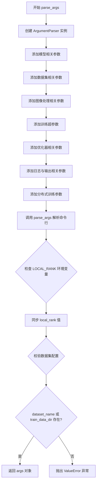
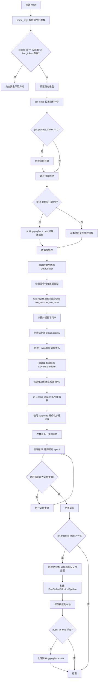
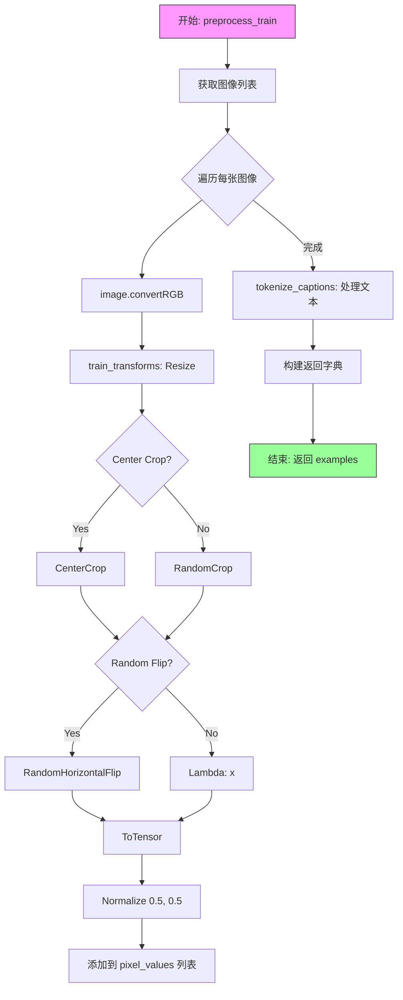
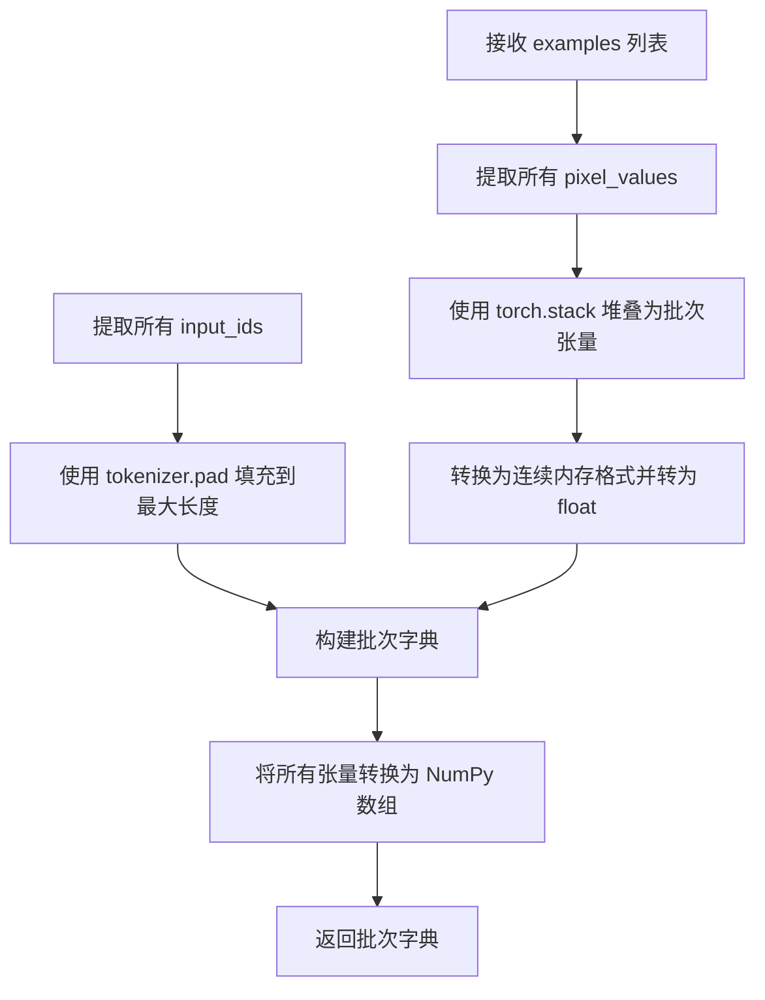
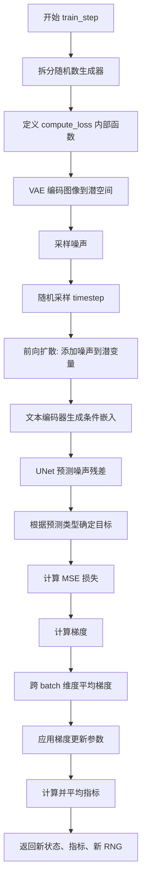
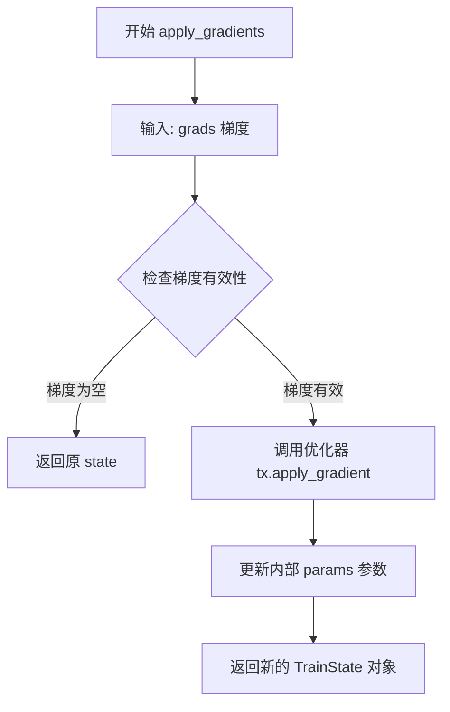
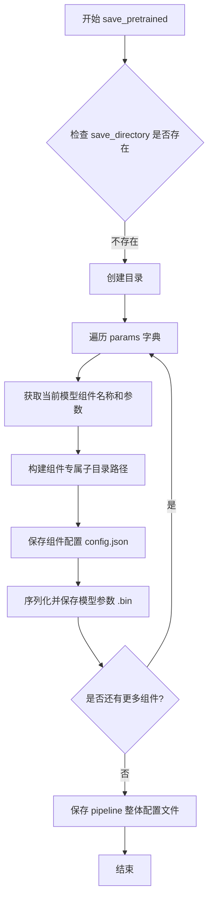

# `diffusers\examples\text_to_image\train_text_to_image_flax.py` 详细设计文档

这是一个基于 Flax (JAX) 框架的 Stable Diffusion 模型微调训练脚本。它实现了文本到图像的生成模型训练流程，包括数据集加载与预处理、VAE/UNet/TextEncoder 的加载与转换、分布式训练的构建、噪声调度器的应用，以及最终训练模型的保存与上传。

## 整体流程

```mermaid
graph TD
    A[Start: parse_args] --> B[Main: Setup Environment]
    B --> C[Load Dataset & Preprocess]
    C --> D[Instantiate Models (VAE, UNet, TextEncoder, Tokenizer)]
    D --> E[Initialize Optimizer (Optax) & Scheduler]
    F[Training Loop] --> G[Train Step: Encode Images -> Add Noise -> Predict -> Loss]
    F --> H[Save Pipeline & Upload to Hub]
    G --> F
    H --> I[End]
```

## 类结构

```
Script Root
├── Global Functions
│   ├── parse_args()
│   ├── get_params_to_save()
│   └── main()
└── Nested Functions (within main)
    ├── tokenize_captions()
    ├── preprocess_train()
    ├── collate_fn()
    └── train_step()
```

## 全局变量及字段


### `logger`
    
模块级日志记录器，用于输出训练过程中的日志信息

类型：`logging.Logger`
    


### `dataset_name_mapping`
    
数据集列名映射字典，用于指定特定数据集的图像和文本列名

类型：`dict`
    


### `weight_dtype`
    
权重数据类型，根据混合精度设置选择float32/float16/bfloat16

类型：`jnp.dtype`
    


### `total_train_batch_size`
    
总训练批大小，等于单设备批大小乘以本地设备数量

类型：`int`
    


### `global_step`
    
全局训练步数计数器，记录已执行的训练迭代总数

类型：`int`
    


### `args.pretrained_model_name_or_path`
    
预训练模型的名称或本地路径，用于加载模型权重

类型：`str`
    


### `args.output_dir`
    
模型预测和检查点的输出目录路径

类型：`str`
    


### `args.train_batch_size`
    
每个设备的训练批大小

类型：`int`
    


### `args.learning_rate`
    
初始学习率，经过预热期后使用

类型：`float`
    


### `args.max_train_steps`
    
要执行的总训练步数，若提供则会覆盖num_train_epochs设置

类型：`int`
    


### `args.mixed_precision`
    
混合精度训练模式，可选no/fp16/bf16

类型：`str`
    


### `args.push_to_hub`
    
标志位，是否在训练完成后将模型推送到HuggingFace Hub

类型：`bool`
    


### `train_state.TrainState.params`
    
模型的参数字典，包含可训练的网络权重

类型：`FrozenDict`
    


### `train_state.TrainState.apply_fn`
    
模型的前向传播函数，用于执行推理

类型：`Callable`
    


### `train_state.TrainState.tx`
    
Optax优化器实例，用于参数更新

类型：`optax.GradientTransformation`
    


### `FlaxStableDiffusionPipeline.text_encoder`
    
CLIP文本编码器模型，用于将文本提示编码为嵌入向量

类型：`FlaxCLIPTextModel`
    


### `FlaxStableDiffusionPipeline.vae`
    
变分自编码器模型，用于图像与潜在空间之间的转换

类型：`FlaxAutoencoderKL`
    


### `FlaxStableDiffusionPipeline.unet`
    
UNet条件模型，用于预测噪声残差

类型：`FlaxUNet2DConditionModel`
    


### `FlaxStableDiffusionPipeline.tokenizer`
    
CLIP分词器，用于将文本转换为token ID序列

类型：`CLIPTokenizer`
    


### `FlaxStableDiffusionPipeline.scheduler`
    
PNDM调度器，用于控制扩散过程的采样步骤

类型：`FlaxPNDMScheduler`
    
    

## 全局函数及方法


### `parse_args`

该函数是Stable Diffusion微调训练脚本的命令行参数解析器，通过argparse库定义并解析所有训练相关的配置选项，包括模型路径、数据集配置、训练超参数、分布式训练设置等，并进行基本的合法性校验。

参数：该函数无显式参数，通过`argparse`自动从`sys.argv`获取命令行输入

返回值：`argparse.Namespace`，返回一个包含所有解析后命令行参数的对象，可通过`args.属性名`访问各参数值

#### 流程图



#### 带注释源码

```python
def parse_args():
    """
    解析命令行参数，返回包含所有训练配置的对象
    
    Returns:
        argparse.Namespace: 包含所有命令行参数的对象
    """
    # 创建 ArgumentParser 实例，description 用于帮助信息
    parser = argparse.ArgumentParser(description="Simple example of a training script.")
    
    # ========== 模型相关参数 ==========
    parser.add_argument(
        "--pretrained_model_name_or_path",
        type=str,
        default=None,
        required=True,  # 必须指定预训练模型路径
        help="Path to pretrained model or model identifier from huggingface.co/models.",
    )
    parser.add_argument(
        "--revision",
        type=str,
        default=None,
        required=False,
        help="Revision of pretrained model identifier from huggingface.co/models.",
    )
    parser.add_argument(
        "--variant",
        type=str,
        default=None,
        help="Variant of the model files of the pretrained model identifier from huggingface.co/models, 'e.g.' fp16",
    )
    
    # ========== 数据集相关参数 ==========
    parser.add_argument(
        "--dataset_name",
        type=str,
        default=None,
        help=(
            "The name of the Dataset (from the HuggingFace hub) to train on (could be your own, possibly private,"
            " dataset). It can also be a path pointing to a local copy of a dataset in your filesystem,"
            " or to a folder containing files that 🤗 Datasets can understand."
        ),
    )
    parser.add_argument(
        "--dataset_config_name",
        type=str,
        default=None,
        help="The config of the Dataset, leave as None if there's only one config.",
    )
    parser.add_argument(
        "--train_data_dir",
        type=str,
        default=None,
        help=(
            "A folder containing the training data. Folder contents must follow the structure described in"
            " https://huggingface.co/docs/datasets/image_dataset#imagefolder. In particular, a `metadata.jsonl` file"
            " must exist to provide the captions for the images. Ignored if `dataset_name` is specified."
        ),
    )
    parser.add_argument(
        "--image_column", 
        type=str, 
        default="image", 
        help="The column of the dataset containing an image."
    )
    parser.add_argument(
        "--caption_column",
        type=str,
        default="text",
        help="The column of the dataset containing a caption or a list of captions.",
    )
    parser.add_argument(
        "--max_train_samples",
        type=int,
        default=None,
        help=(
            "For debugging purposes or quicker training, truncate the number of training examples to this "
            "value if set."
        ),
    )
    
    # ========== 输出与缓存目录 ==========
    parser.add_argument(
        "--output_dir",
        type=str,
        default="sd-model-finetuned",
        help="The output directory where the model predictions and checkpoints will be written.",
    )
    parser.add_argument(
        "--cache_dir",
        type=str,
        default=None,
        help="The directory where the downloaded models and datasets will be stored.",
    )
    
    # ========== 随机种子与图像分辨率 ==========
    parser.add_argument("--seed", type=int, default=0, help="A seed for reproducible training.")
    parser.add_argument(
        "--resolution",
        type=int,
        default=512,
        help=(
            "The resolution for input images, all the images in the train/validation dataset will be resized to this"
            " resolution"
        ),
    )
    parser.add_argument(
        "--center_crop",
        default=False,
        action="store_true",
        help=(
            "Whether to center crop the input images to the resolution. If not set, the images will be randomly"
            " cropped. The images will be resized to the resolution first before cropping."
        ),
    )
    parser.add_argument(
        "--random_flip",
        action="store_true",
        help="whether to randomly flip images horizontally",
    )
    
    # ========== 训练批处理与轮次 ==========
    parser.add_argument(
        "--train_batch_size", 
        type=int, 
        default=16, 
        help="Batch size (per device) for the training dataloader."
    )
    parser.add_argument("--num_train_epochs", type=int, default=100)
    parser.add_argument(
        "--max_train_steps",
        type=int,
        default=None,
        help="Total number of training steps to perform.  If provided, overrides num_train_epochs.",
    )
    
    # ========== 学习率与调度器 ==========
    parser.add_argument(
        "--learning_rate",
        type=float,
        default=1e-4,
        help="Initial learning rate (after the potential warmup period) to use.",
    )
    parser.add_argument(
        "--scale_lr",
        action="store_true",
        default=False,
        help="Scale the learning rate by the number of GPUs, gradient accumulation steps, and batch size.",
    )
    parser.add_argument(
        "--lr_scheduler",
        type=str,
        default="constant",
        help=(
            'The scheduler type to use. Choose between ["linear", "cosine", "cosine_with_restarts", "polynomial",'
            ' "constant", "constant_with_warmup"]'
        ),
    )
    
    # ========== Adam 优化器参数 ==========
    parser.add_argument("--adam_beta1", type=float, default=0.9, help="The beta1 parameter for the Adam optimizer.")
    parser.add_argument("--adam_beta2", type=float, default=0.999, help="The beta2 parameter for the Adam optimizer.")
    parser.add_argument("--adam_weight_decay", type=float, default=1e-2, help="Weight decay to use.")
    parser.add_argument("--adam_epsilon", type=float, default=1e-08, help="Epsilon value for the Adam optimizer")
    parser.add_argument("--max_grad_norm", default=1.0, type=float, help="Max gradient norm.")
    
    # ========== HuggingFace Hub 相关 ==========
    parser.add_argument("--push_to_hub", action="store_true", help="Whether or not to push the model to the Hub.")
    parser.add_argument("--hub_token", type=str, default=None, help="The token to use to push to the Model Hub.")
    parser.add_argument(
        "--hub_model_id",
        type=str,
        default=None,
        help="The name of the repository to keep in sync with the local `output_dir`.",
    )
    
    # ========== 日志与报告 ==========
    parser.add_argument(
        "--logging_dir",
        type=str,
        default="logs",
        help=(
            "[TensorBoard](https://www.tensorflow.org/tensorboard) log directory. Will default to"
            " *output_dir/runs/**CURRENT_DATETIME_HOSTNAME***."
        ),
    )
    parser.add_argument(
        "--report_to",
        type=str,
        default="tensorboard",
        help=(
            'The integration to report the results and logs to. Supported platforms are `"tensorboard"`'
            ' (default), `"wandb"` and `"comet_ml"`. Use `"all"` to report to all integrations.'
        ),
    )
    
    # ========== 混合精度与分布式训练 ==========
    parser.add_argument(
        "--mixed_precision",
        type=str,
        default="no",
        choices=["no", "fp16", "bf16"],
        help=(
            "Whether to use mixed precision. Choose"
            "between fp16 and bf16 (bfloat16). Bf16 requires PyTorch >= 1.10."
            "and an Nvidia Ampere GPU."
        ),
    )
    parser.add_argument("--local_rank", type=int, default=-1, help="For distributed training: local_rank")
    parser.add_argument(
        "--from_pt",
        action="store_true",
        default=False,
        help="Flag to indicate whether to convert models from PyTorch.",
    )

    # 解析命令行参数
    args = parser.parse_args()
    
    # 处理分布式训练中的 LOCAL_RANK 环境变量
    # 如果环境变量存在且与命令行参数不同，以环境变量为准
    env_local_rank = int(os.environ.get("LOCAL_RANK", -1))
    if env_local_rank != -1 and env_local_rank != args.local_rank:
        args.local_rank = env_local_rank

    # ========== 合法性校验 ==========
    # 必须提供数据集名称或训练数据目录之一
    if args.dataset_name is None and args.train_data_dir is None:
        raise ValueError("Need either a dataset name or a training folder.")

    return args
```


### `get_params_to_save`

该函数用于从分布式训练（PMAP）中提取模型参数，由于JAX的分布式训练会将参数分散在不同设备上，该函数通过取每个参数数组的第一个元素来获取主设备上的参数，以便进行模型保存操作。

参数：

- `params`：`PyTree`，JAX pmap后的模型参数树，通常包含嵌套的字典结构，每个叶子节点是一个设备数组

返回值：`PyTree`，处理后的模型参数树，其中每个叶子节点都是单个设备上的参数（而非设备数组）

#### 流程图

```mermaid
graph TD
    A[开始: 输入params] --> B{检查params结构}
    B -->|params是PyTree| C[使用jax.tree_util.tree_map映射]
    C --> D[lambda函数: x -> x[0]]
    D --> E[取每个设备数组的第一个元素]
    E --> F[使用jax.device_get将结果从设备取回]
    G[结束: 返回处理后的params]
```

#### 带注释源码

```python
def get_params_to_save(params):
    """
    从pmap后的参数中提取主设备的参数，用于模型保存。
    
    在JAX分布式训练中，使用pmap会将参数复制到每个设备上，
    参数从PyTree结构变为每个叶子节点都是DeviceArray的形式。
    为了保存模型，我们需要提取单个设备上的参数。
    
    参数:
        params: PyTree - JAX pmap后的模型参数
        
    返回:
        PyTree - 提取后的模型参数，可用于保存
    """
    # jax.tree_util.tree_map: 对PyTree的每个叶子节点应用函数
    # lambda x: x[0]: 取设备数组的第一个元素（即主设备的参数）
    # jax.device_get: 将数据从GPU/TPU设备取回到CPU内存
    return jax.device_get(jax.tree_util.tree_map(lambda x: x[0], params))
```

#### 关键组件信息

- **jax.device_get**: JAX提供的函数，用于将延迟执行的设备数组取回到CPU内存
- **jax.tree_util.tree_map**: JAX工具函数，用于遍历和转换PyTree结构
- **PyTree**: JAX中的树形数据结构，用于表示模型参数

#### 潜在的技术债务或优化空间

1. **硬编码的索引选择**: 使用`x[0]`假设总是取第一个设备，可能不适用于所有分布式训练场景
2. **缺乏错误处理**: 如果params不是pmap后的结构（如已经是普通数组），可能导致意外行为
3. **文档缺失**: 函数缺少详细的文档说明，特别是关于输入参数的具体结构

#### 其它项目

- **设计目标**: 解决JAX分布式训练后参数无法直接保存的问题
- **约束**: 假设输入是pmap后的参数结构
- **使用场景**: 仅在保存模型检查点时调用（如`pipeline.save_pretrained`时）


### `main`

这是 Stable Diffusion 模型微调训练的主入口函数，负责协调整个训练流程，包括参数解析、数据集加载与预处理、模型初始化、训练循环执行以及训练完成后的模型保存。

参数：

- 无直接参数（通过内部调用 `parse_args()` 获取命令行参数）

返回值：`None`，主函数无返回值

#### 流程图



#### 带注释源码

```python
def main():
    """
    Stable Diffusion 模型微调训练的主入口函数。
    负责协调整个训练流程：参数解析、数据加载、模型初始化、训练执行和模型保存。
    """
    # 步骤1: 解析命令行参数
    args = parse_args()

    # 步骤2: 安全检查 - 避免同时使用 wandb 和 hub_token 导致 token 泄露风险
    if args.report_to == "wandb" and args.hub_token is not None:
        raise ValueError(
            "You cannot use both --report_to=wandb and --hub_token due to a security risk of exposing your token."
            " Please use `hf auth login` to authenticate with the Hub."
        )

    # 步骤3: 配置日志格式和级别
    logging.basicConfig(
        format="%(asctime)s - %(levelname)s - %(name)s - %(message)s",
        datefmt="%m/%d/%Y %H:%M:%S",
        level=logging.INFO,
    )
    # 仅在主进程上输出日志
    logger.setLevel(logging.INFO if jax.process_index() == 0 else logging.ERROR)
    if jax.process_index() == 0:
        transformers.utils.logging.set_verbosity_info()
    else:
        transformers.utils.logging.set_verbosity_error()

    # 步骤4: 设置随机种子以确保可复现性
    if args.seed is not None:
        set_seed(args.seed)

    # 步骤5: 处理输出目录和 Hub 仓库创建
    if jax.process_index() == 0:
        if args.output_dir is not None:
            os.makedirs(args.output_dir, exist_ok=True)

        # 如果需要推送到 Hub，则创建远程仓库
        if args.push_to_hub:
            repo_id = create_repo(
                repo_id=args.hub_model_id or Path(args.output_dir).name, exist_ok=True, token=args.hub_token
            ).repo_id

    # 步骤6: 加载数据集 - 支持从 HuggingFace Hub 或本地目录加载
    if args.dataset_name is not None:
        # 从 Hub 下载并加载数据集
        dataset = load_dataset(
            args.dataset_name, args.dataset_config_name, cache_dir=args.cache_dir, data_dir=args.train_data_dir
        )
    else:
        # 从本地目录加载图像数据集
        data_files = {}
        if args.train_data_dir is not None:
            data_files["train"] = os.path.join(args.train_data_dir, "**")
        dataset = load_dataset(
            "imagefolder",
            data_files=data_files,
            cache_dir=args.cache_dir,
        )

    # 步骤7: 获取数据集的列名并验证图像和 caption 列
    column_names = dataset["train"].column_names
    dataset_columns = dataset_name_mapping.get(args.dataset_name, None)
    
    # 确定图像列名
    if args.image_column is None:
        image_column = dataset_columns[0] if dataset_columns is not None else column_names[0]
    else:
        image_column = args.image_column
        if image_column not in column_names:
            raise ValueError(f"--image_column' value '{args.image_column}' needs to be one of: {', '.join(column_names)}")
    
    # 确定 caption 列名
    if args.caption_column is None:
        caption_column = dataset_columns[1] if dataset_columns is not None else column_names[1]
    else:
        caption_column = args.caption_column
        if caption_column not in column_names:
            raise ValueError(f"--caption_column' value '{args.caption_column}' needs to be one of: {', '.join(column_names)}")

    # 步骤8: 定义 tokenize_captions 函数 - 将文本 caption 转换为 token IDs
    def tokenize_captions(examples, is_train=True):
        captions = []
        for caption in examples[caption_column]:
            if isinstance(caption, str):
                captions.append(caption)
            elif isinstance(caption, (list, np.ndarray)):
                # 训练时随机选择一个 caption，验证时选择第一个
                captions.append(random.choice(caption) if is_train else caption[0])
            else:
                raise ValueError(f"Caption column `{caption_column}` should contain either strings or lists of strings.")
        inputs = tokenizer(captions, max_length=tokenizer.model_max_length, padding="do_not_pad", truncation=True)
        input_ids = inputs.input_ids
        return input_ids

    # 步骤9: 定义图像预处理 transform 组合
    train_transforms = transforms.Compose(
        [
            transforms.Resize(args.resolution, interpolation=transforms.InterpolationMode.BILINEAR),
            transforms.CenterCrop(args.resolution) if args.center_crop else transforms.RandomCrop(args.resolution),
            transforms.RandomHorizontalFlip() if args.random_flip else transforms.Lambda(lambda x: x),
            transforms.ToTensor(),
            transforms.Normalize([0.5], [0.5]),  # 归一化到 [-1, 1]
        ]
    )

    # 步骤10: 定义 preprocess_train 函数 - 转换图像和 tokenize captions
    def preprocess_train(examples):
        images = [image.convert("RGB") for image in examples[image_column]]
        examples["pixel_values"] = [train_transforms(image) for image in images]
        examples["input_ids"] = tokenize_captions(examples)
        return examples

    # 步骤11: 可选地限制训练样本数量用于调试
    if args.max_train_samples is not None:
        dataset["train"] = dataset["train"].shuffle(seed=args.seed).select(range(args.max_train_samples))
    
    # 应用预处理 transform
    train_dataset = dataset["train"].with_transform(preprocess_train)

    # 步骤12: 定义 collate_fn - 整理 batch 数据
    def collate_fn(examples):
        pixel_values = torch.stack([example["pixel_values"] for example in examples])
        pixel_values = pixel_values.to(memory_format=torch.contiguous_format).float()
        input_ids = [example["input_ids"] for example in examples]

        padded_tokens = tokenizer.pad(
            {"input_ids": input_ids}, padding="max_length", max_length=tokenizer.model_max_length, return_tensors="pt"
        )
        batch = {
            "pixel_values": pixel_values,
            "input_ids": padded_tokens.input_ids,
        }
        batch = {k: v.numpy() for k, v in batch.items()}  # 转换为 numpy 数组供 JAX 使用
        return batch

    # 步骤13: 创建 DataLoader - 计算总 batch size（考虑多 GPU 和分布式）
    total_train_batch_size = args.train_batch_size * jax.local_device_count()
    train_dataloader = torch.utils.data.DataLoader(
        train_dataset, shuffle=True, collate_fn=collate_fn, batch_size=total_train_batch_size, drop_last=True
    )

    # 步骤14: 设置混合精度数据类型
    weight_dtype = jnp.float32
    if args.mixed_precision == "fp16":
        weight_dtype = jnp.float16
    elif args.mixed_precision == "bf16":
        weight_dtype = jnp.bfloat16

    # 步骤15: 加载预训练模型和 tokenizer
    tokenizer = CLIPTokenizer.from_pretrained(
        args.pretrained_model_name_or_path,
        from_pt=args.from_pt,
        revision=args.revision,
        subfolder="tokenizer",
    )
    text_encoder = FlaxCLIPTextModel.from_pretrained(
        args.pretrained_model_name_or_path,
        from_pt=args.from_pt,
        revision=args.revision,
        subfolder="text_encoder",
        dtype=weight_dtype,
    )
    vae, vae_params = FlaxAutoencoderKL.from_pretrained(
        args.pretrained_model_name_or_path,
        from_pt=args.from_pt,
        revision=args.revision,
        subfolder="vae",
        dtype=weight_dtype,
    )
    unet, unet_params = FlaxUNet2DConditionModel.from_pretrained(
        args.pretrained_model_name_or_path,
        from_pt=args.from_pt,
        revision=args.revision,
        subfolder="unet",
        dtype=weight_dtype,
    )

    # 步骤16: 可选地缩放学习率
    if args.scale_lr:
        args.learning_rate = args.learning_rate * total_train_batch_size

    # 步骤17: 创建学习率调度器和优化器
    constant_scheduler = optax.constant_schedule(args.learning_rate)

    adamw = optax.adamw(
        learning_rate=constant_scheduler,
        b1=args.adam_beta1,
        b2=args.adam_beta2,
        eps=args.adam_epsilon,
        weight_decay=args.adam_weight_decay,
    )

    optimizer = optax.chain(
        optax.clip_by_global_norm(args.max_grad_norm),  # 梯度裁剪
        adamw,
    )

    # 步骤18: 创建 Flax 训练状态
    state = train_state.TrainState.create(apply_fn=unet.__call__, params=unet_params, tx=optimizer)

    # 步骤19: 创建噪声调度器（用于 DDPM 训练）
    noise_scheduler = FlaxDDPMScheduler(
        beta_start=0.00085, beta_end=0.012, beta_schedule="scaled_linear", num_train_timesteps=1000
    )
    noise_scheduler_state = noise_scheduler.create_state()

    # 步骤20: 初始化随机数生成器用于训练
    rng = jax.random.PRNGKey(args.seed)
    train_rngs = jax.random.split(rng, jax.local_device_count())

    # 步骤21: 定义单步训练函数 train_step
    def train_step(state, text_encoder_params, vae_params, batch, train_rng):
        """执行单步训练：前向传播、计算损失、反向传播和参数更新"""
        dropout_rng, sample_rng, new_train_rng = jax.random.split(train_rng, 3)

        def compute_loss(params):
            # 步骤21.1: 将图像编码到潜在空间
            vae_outputs = vae.apply(
                {"params": vae_params}, batch["pixel_values"], deterministic=True, method=vae.encode
            )
            latents = vae_outputs.latent_dist.sample(sample_rng)
            # (NHWC) -> (NCHW) 转换维度顺序
            latents = jnp.transpose(latents, (0, 3, 1, 2))
            latents = latents * vae.config.scaling_factor  # 应用 VAE 缩放因子

            # 步骤21.2: 采样噪声并随机选择时间步
            noise_rng, timestep_rng = jax.random.split(sample_rng)
            noise = jax.random.normal(noise_rng, latents.shape)
            bsz = latents.shape[0]
            timesteps = jax.random.randint(
                timestep_rng,
                (bsz,),
                0,
                noise_scheduler.config.num_train_timesteps,
            )

            # 步骤21.3: 前向扩散过程 - 向潜在表示添加噪声
            noisy_latents = noise_scheduler.add_noise(noise_scheduler_state, latents, noise, timesteps)

            # 步骤21.4: 获取文本嵌入作为条件
            encoder_hidden_states = text_encoder(
                batch["input_ids"],
                params=text_encoder_params,
                train=False,
            )[0]

            # 步骤21.5: UNet 预测噪声残差
            model_pred = unet.apply(
                {"params": params}, noisy_latents, timesteps, encoder_hidden_states, train=True
            ).sample

            # 步骤21.6: 根据预测类型确定目标（epsilon 或 v_prediction）
            if noise_scheduler.config.prediction_type == "epsilon":
                target = noise
            elif noise_scheduler.config.prediction_type == "v_prediction":
                target = noise_scheduler.get_velocity(noise_scheduler_state, latents, noise, timesteps)
            else:
                raise ValueError(f"Unknown prediction type {noise_scheduler.config.prediction_type}")

            # 步骤21.7: 计算 MSE 损失
            loss = (target - model_pred) ** 2
            loss = loss.mean()

            return loss

        # 步骤21.8: 计算梯度
        grad_fn = jax.value_and_grad(compute_loss)
        loss, grad = grad_fn(state.params)
        grad = jax.lax.pmean(grad, "batch")  # 跨 batch 维度同步梯度

        # 步骤21.9: 应用梯度更新
        new_state = state.apply_gradients(grads=grad)

        # 步骤21.10: 计算并聚合指标
        metrics = {"loss": loss}
        metrics = jax.lax.pmean(metrics, axis_name="batch")

        return new_state, metrics, new_train_rng

    # 步骤22: 使用 jax.pmap 并行化训练步骤（跨设备）
    p_train_step = jax.pmap(train_step, "batch", donate_argnums=(0,))

    # 步骤23: 在每个设备上复制模型状态和参数
    state = jax_utils.replicate(state)
    text_encoder_params = jax_utils.replicate(text_encoder.params)
    vae_params = jax_utils.replicate(vae_params)

    # 步骤24: 计算训练参数
    num_update_steps_per_epoch = math.ceil(len(train_dataloader))

    if args.max_train_steps is None:
        args.max_train_steps = args.num_train_epochs * num_update_steps_per_epoch

    args.num_train_epochs = math.ceil(args.max_train_steps / num_update_steps_per_epoch)

    # 打印训练信息
    logger.info("***** Running training *****")
    logger.info(f"  Num examples = {len(train_dataset)}")
    logger.info(f"  Num Epochs = {args.num_train_epochs}")
    logger.info(f"  Instantaneous batch size per device = {args.train_batch_size}")
    logger.info(f"  Total train batch size (w. parallel & distributed) = {total_train_batch_size}")
    logger.info(f"  Total optimization steps = {args.max_train_steps}")

    # 步骤25: 训练循环
    global_step = 0

    epochs = tqdm(range(args.num_train_epochs), desc="Epoch ... ", position=0)
    for epoch in epochs:
        train_metrics = []

        steps_per_epoch = len(train_dataset) // total_train_batch_size
        train_step_progress_bar = tqdm(total=steps_per_epoch, desc="Training...", position=1, leave=False)
        
        # 遍历每个 batch
        for batch in train_dataloader:
            batch = shard(batch)  # 分片数据到各设备
            state, train_metric, train_rngs = p_train_step(state, text_encoder_params, vae_params, batch, train_rngs)
            train_metrics.append(train_metric)

            train_step_progress_bar.update(1)

            global_step += 1
            if global_step >= args.max_train_steps:
                break

        train_metric = jax_utils.unreplicate(train_metric)

        train_step_progress_bar.close()
        epochs.write(f"Epoch... ({epoch + 1}/{args.num_train_epochs} | Loss: {train_metric['loss']})")

    # 步骤26: 训练完成后保存模型（仅在主进程执行）
    if jax.process_index() == 0:
        # 创建推理用的调度器
        scheduler = FlaxPNDMScheduler(
            beta_start=0.00085, beta_end=0.012, beta_schedule="scaled_linear", skip_prk_steps=True
        )
        # 加载安全检查器
        safety_checker = FlaxStableDiffusionSafetyChecker.from_pretrained(
            "CompVis/stable-diffusion-safety-checker", from_pt=True
        )
        
        # 创建完整的 pipeline
        pipeline = FlaxStableDiffusionPipeline(
            text_encoder=text_encoder,
            vae=vae,
            unet=unet,
            tokenizer=tokenizer,
            scheduler=scheduler,
            safety_checker=safety_checker,
            feature_extractor=CLIPImageProcessor.from_pretrained("openai/clip-vit-base-patch32"),
        )

        # 保存 pipeline 到本地
        pipeline.save_pretrained(
            args.output_dir,
            params={
                "text_encoder": get_params_to_save(text_encoder_params),
                "vae": get_params_to_save(vae_params),
                "unet": get_params_to_save(state.params),
                "safety_checker": safety_checker.params,
            },
        )

        # 如果需要，推送到 HuggingFace Hub
        if args.push_to_hub:
            upload_folder(
                repo_id=repo_id,
                folder_path=args.output_dir,
                commit_message="End of training",
                ignore_patterns=["step_*", "epoch_*"],
            )


if __name__ == "__main__":
    main()
```


### `tokenize_captions`

该函数是Stable Diffusion模型微调脚本中的内部函数，用于对数据集中的文本描述（caption）进行分词处理，将原始文本转换为模型可用的token ID序列。在训练模式下，如果存在多个caption描述，会随机选择一个；在验证模式下则始终选择第一个caption。

参数：

- `examples`：`dict`，数据集批次样本，包含caption_column指定的列，值为字符串或字符串列表
- `is_train`：`bool`，指示当前是否处于训练模式，训练模式下随机选择多个caption中的一个，验证模式下选择第一个

返回值：`list`，分词后的input_ids列表，每个元素为整数列表

#### 流程图

```mermaid
flowchart TD
    A[开始 tokenize_captions] --> B{遍历 examples[caption_column] 中的每个 caption}
    B --> C{caption 类型判断}
    C -->|str| D[直接添加到 captions 列表]
    C -->|list 或 np.ndarray| E{is_train 判断}
    E -->|True| F[random.choice 随机选择]
    E -->|False| G[选择第一个 caption[0]]
    F --> D
    G --> D
    D --> H{检查下一个 caption}
    H -->|还有| B
    H -->|遍历完成| I[调用 tokenizer 进行分词]
    I --> J[设置 max_length, padding='do_not_pad', truncation=True]
    J --> K[返回 inputs.input_ids]
    K --> L[结束]
    
    C -->|其他类型| M[抛出 ValueError 异常]
    M --> L
```

#### 带注释源码

```python
def tokenize_captions(examples, is_train=True):
    """
    对数据集中的caption进行分词处理
    
    参数:
        examples: 数据批次，包含caption列
        is_train: 是否处于训练模式，训练模式随机选择caption
    """
    captions = []
    # 遍历批次中的所有caption
    for caption in examples[caption_column]:
        # 如果caption是字符串，直接添加
        if isinstance(caption, str):
            captions.append(caption)
        # 如果caption是列表或数组（可能有多个描述）
        elif isinstance(caption, (list, np.ndarray)):
            # 训练模式：随机选择一个caption
            # 验证模式：选择第一个caption
            captions.append(random.choice(caption) if is_train else caption[0])
        else:
            # caption类型不合法，抛出异常
            raise ValueError(
                f"Caption column `{caption_column}` should contain either strings or lists of strings."
            )
    
    # 使用tokenizer对captions进行分词
    # max_length: 最大长度限制
    # padding: 不进行padding（'do_not_pad'）
    # truncation: 超过最大长度进行截断
    inputs = tokenizer(captions, max_length=tokenizer.model_max_length, padding="do_not_pad", truncation=True)
    
    # 提取分词后的input_ids并返回
    input_ids = inputs.input_ids
    return input_ids
```


### `preprocess_train`

该函数是 Stable Diffusion 微调训练流程中的数据预处理函数，负责将原始图像和文本caption转换为模型可接受的格式：对图像进行 RGB 转换、resize、中心裁剪/随机裁剪、水平翻转、归一化等操作，对 caption 进行 tokenize，最终返回包含像素值和 token ID 的字典。

参数：

- `examples`：`dict`，原始数据集样本字典，包含 `image_column` 指定的图像列和 `caption_column` 指定的文本列

返回值：`dict`，处理后的样本字典，包含 `pixel_values`（处理后的图像张量）和 `input_ids`（tokenized 的文本 ID）

#### 流程图



#### 带注释源码

```python
def preprocess_train(examples):
    """
    对训练数据进行预处理：图像变换和文本tokenization
    
    参数:
        examples: 包含原始图像和文本caption的数据集样本字典
    
    返回:
        包含处理后pixel_values和input_ids的字典
    """
    # 步骤1: 将所有图像转换为RGB格式（确保通道一致性）
    images = [image.convert("RGB") for image in examples[image_column]]
    
    # 步骤2: 对每张图像应用训练变换（Resize -> Crop -> Flip -> ToTensor -> Normalize）
    # train_transforms 包含: Resize(512) -> CenterCrop/RandomCrop(512) -> RandomHorizontalFlip -> ToTensor -> Normalize([0.5], [0.5])
    examples["pixel_values"] = [train_transforms(image) for image in images]
    
    # 步骤3: 对caption进行tokenization，转换为模型输入ID
    examples["input_ids"] = tokenize_captions(examples)
    
    # 步骤4: 返回处理后的样本字典
    return examples
```


### `collate_fn`

该函数是 PyTorch DataLoader 的自定义批次整理函数，负责将数据集中多个样本（examples）整理成一个批次（batch），包括将图像像素值堆叠为张量、对文本输入ID进行填充处理，并最终转换为 NumPy 数组以适配 Flax/JAX 训练流程。

参数：

- `examples`：`List[Dict]`，从数据集获取的样本列表，每个样本包含 `pixel_values`（图像张量）和 `input_ids`（文本token列表）

返回值：`Dict[str, np.ndarray]`，包含批次的 `pixel_values`（图像张量）和 `input_ids`（填充后的文本ID）的字典，均为 NumPy 数组格式

#### 流程图



#### 带注释源码

```python
def collate_fn(examples):
    """
    自定义 DataLoader 批次整理函数
    将多个样本整理为一个训练批次
    
    参数:
        examples: 样本列表，每个样本包含 'pixel_values' 和 'input_ids'
    
    返回:
        batch: 包含批次数据的字典
    """
    
    # 从所有样本中提取 pixel_values（图像数据）
    # pixel_values 来自 preprocess_train 函数返回的 Tensor
    pixel_values = torch.stack([example["pixel_values"] for example in examples])
    
    # 确保内存连续并转换为 float32 类型
    # memory_format=torch.contiguous_format 确保张量在内存中是连续的
    pixel_values = pixel_values.to(memory_format=torch.contiguous_format).float()
    
    # 从所有样本中提取 input_ids（文本 token 列表）
    input_ids = [example["input_ids"] for example in examples]
    
    # 使用 tokenizer 对 input_ids 进行填充
    # padding="max_length": 填充到模型最大长度
    # max_length: tokenizer.model_max_length（通常为77或128）
    # return_tensors="pt": 返回 PyTorch 张量
    padded_tokens = tokenizer.pad(
        {"input_ids": input_ids}, 
        padding="max_length", 
        max_length=tokenizer.model_max_length, 
        return_tensors="pt"
    )
    
    # 构建批次字典，包含像素值和填充后的 token IDs
    batch = {
        "pixel_values": pixel_values,
        "input_ids": padded_tokens.input_ids,
    }
    
    # 将 PyTorch 张量转换为 NumPy 数组
    # 因为后续训练使用 Flax/JAX，需要 NumPy 格式
    batch = {k: v.numpy() for k, v in batch.items()}
    
    return batch
```


### `train_step`

定义单步训练逻辑，执行前向传播、损失计算和反向传播，完成模型参数的单次更新。

参数：

- `state`：`train_state.TrainState`，Flax训练状态对象，包含模型参数和优化器状态
- `text_encoder_params`：`Any`，文本编码器的参数（已复制到各设备）
- `vae_params`：`Any`，VAE编码器的参数（已复制到各设备）
- `batch`：`Dict`，训练批次数据，包含`pixel_values`（图像像素值）和`input_ids`（文本token IDs）
- `train_rng`：`jax.random.PRNGKey`，JAX随机数生成器，用于采样噪声和dropout

返回值：`Tuple[TrainState, Dict, Any]`，返回更新后的训练状态、训练指标字典（含loss）、以及新的随机数生成器

#### 流程图



#### 带注释源码

```python
def train_step(state, text_encoder_params, vae_params, batch, train_rng):
    """
    执行单步训练：前向传播 -> 损失计算 -> 反向传播 -> 参数更新
    
    参数:
        state: Flax训练状态，包含UNet参数和优化器状态
        text_encoder_params: 文本编码器参数（已复制到各设备）
        vae_params: VAE编码器参数（已复制到各设备）
        batch: 训练批次，dict包含'pixel_values'和'input_ids'
        train_rng: JAX随机数生成器
    
    返回:
        new_state: 更新后的训练状态
        metrics: 包含loss的指标字典
        new_train_rng: 新的随机数生成器
    """
    # 将随机数生成器拆分为dropout、采样和新RNG三部分
    dropout_rng, sample_rng, new_train_rng = jax.random.split(train_rng, 3)

    def compute_loss(params):
        """内部损失计算函数"""
        
        # 1. 将图像转换为潜空间表示
        # 使用VAE编码器将像素值编码为潜变量
        vae_outputs = vae.apply(
            {"params": vae_params}, batch["pixel_values"], 
            deterministic=True, method=vae.encode
        )
        # 从VAE的潜在分布中采样
        latents = vae_outputs.latent_dist.sample(sample_rng)
        # 调整维度顺序: (NHWC) -> (NCHW)
        latents = jnp.transpose(latents, (0, 3, 1, 2))
        # 缩放潜变量（VAE缩放因子）
        latents = latents * vae.config.scaling_factor

        # 2. 采样噪声以添加到潜变量
        noise_rng, timestep_rng = jax.random.split(sample_rng)
        noise = jax.random.normal(noise_rng, latents.shape)
        
        # 3. 为每个图像随机采样一个timestep
        bsz = latents.shape[0]
        timesteps = jax.random.randint(
            timestep_rng,
            (bsz,),
            0,
            noise_scheduler.config.num_train_timesteps,
        )

        # 4. 前向扩散过程：按timestep添加噪声
        noisy_latents = noise_scheduler.add_noise(
            noise_scheduler_state, latents, noise, timesteps
        )

        # 5. 获取文本条件嵌入
        encoder_hidden_states = text_encoder(
            batch["input_ids"],
            params=text_encoder_params,
            train=False,
        )[0]

        # 6. UNet预测噪声残差
        model_pred = unet.apply(
            {"params": params}, noisy_latents, timesteps, 
            encoder_hidden_states, train=True
        ).sample

        # 7. 根据预测类型确定目标
        if noise_scheduler.config.prediction_type == "epsilon":
            # 预测原始噪声
            target = noise
        elif noise_scheduler.config.prediction_type == "v_prediction":
            # 预测噪声速度
            target = noise_scheduler.get_velocity(
                noise_scheduler_state, latents, noise, timesteps
            )
        else:
            raise ValueError(
                f"Unknown prediction type {noise_scheduler.config.prediction_type}"
            )

        # 8. 计算MSE损失
        loss = (target - model_pred) ** 2
        loss = loss.mean()

        return loss

    # 9. 计算损失和梯度
    grad_fn = jax.value_and_grad(compute_loss)
    loss, grad = grad_fn(state.params)
    
    # 10. 跨batch维度进行梯度平均（分布式训练）
    grad = jax.lax.pmean(grad, "batch")

    # 11. 应用梯度更新参数
    new_state = state.apply_gradients(grads=grad)

    # 12. 构建并平均指标
    metrics = {"loss": loss}
    metrics = jax.lax.pmean(metrics, axis_name="batch")

    # 13: 返回更新后的状态、指标和新的随机数生成器
    return new_state, metrics, new_train_rng
```


### `TrainState.apply_gradients`

该方法是 Flax 框架中 `TrainState` 类的核心方法，用于根据计算得到的梯度更新模型参数。在训练循环中，通过 `jax.value_and_grad` 计算损失函数的梯度，然后调用此方法将梯度应用到参数上，实现模型参数的迭代更新。

参数：

- `grads`：`pytrees.PyTree`，由 JAX 自动微分计算得到的梯度，与模型参数结构相同，用于更新内部参数

返回值：`TrainState`，返回一个新的 `TrainState` 实例，其中包含更新后的参数（`params` 字段已根据梯度进行更新），其他属性（`apply_fn`、`tx` 等）保持不变

#### 流程图



#### 带注释源码

```python
# 在训练步骤中调用 apply_gradients 的方式：
# grad_fn = jax.value_and_grad(compute_loss)
# loss, grad = grad_fn(state.params)
# grad = jax.lax.pmean(grad, "batch")  # 对多设备梯度求平均
# new_state = state.apply_gradients(grads=grad)

# 源码调用示例：
new_state = state.apply_gradients(grads=grad)
```

> **注意**：由于 `TrainState` 类是 Flax 框架内置类，其完整源码属于 Flax 库实现。上面的代码展示了在用户训练脚本中实际调用该方法的情况。该方法接收 `grads` 参数（通过 JAX 自动微分计算的梯度），内部调用优化器（`tx`）的 `apply_gradient` 方法来更新存储在 `state.params` 中的模型参数，并返回一个新的 `TrainState` 对象（参数已更新）。


### `FlaxStableDiffusionPipeline.save_pretrained`

将 Stable Diffusion pipeline 的所有模型组件（text_encoder、vae、unet、safety_checker 等）及其参数保存到指定目录，以便后续加载推理使用。

参数：

- `save_directory`：`str`，保存模型的目录路径
- `params`：`dict`，包含各模型组件参数的字典，键为 "text_encoder"、"vae"、"unet"、"safety_checker" 等，值为对应的 JAX 参数对象

返回值：`None`，无返回值，直接将模型写入磁盘

#### 流程图



#### 带注释源码

```python
# 调用示例（来自训练脚本）
pipeline.save_pretrained(
    args.output_dir,                      # 保存目录，如 "./sd-model-finetuned"
    params={
        # 将分片参数聚合并转换为 numpy 数组后保存
        "text_encoder": get_params_to_save(text_encoder_params),
        "vae": get_params_to_save(vae_params),
        "unet": get_params_to_save(state.params),
        # safety_checker 直接使用原始参数（已 Replication）
        "safety_checker": safety_checker.params,
    },
)

# 辅助函数：将分片参数聚合并转换为可序列化格式
def get_params_to_save(params):
    # jax.device_get 将分片参数从设备取回
    # jax.tree_util.tree_map 遍历树结构，取每个分片的第一个元素（主副本）
    # 因为训练时参数被复制到多个设备（sharded），保存时只需一份
    return jax.device_get(jax.tree_util.tree_map(lambda x: x[0], params))
```

## 关键组件


### 文本编码与Tokenization

负责将文本描述转换为模型可处理的token ID序列，支持字符串和列表形式的输入，并处理最大长度截断。

### 图像预处理管道

由 torchvision transforms 组成的图像处理流程，包括尺寸调整、中心裁剪或随机裁剪、水平翻转、 tensor 转换和数值归一化。

### 批处理整理函数

将多个样本整理为统一的批次格式，对像素值进行堆叠并转换为连续内存格式，对文本token进行padding处理。

### VAE 潜在空间编码

将输入图像编码为潜在表示，采样潜在分布并进行维度变换和缩放因子调整。

### 噪声调度器

使用 DDPMScheduler 实现前向扩散过程，根据时间步将噪声添加到潜在表示，支持 epsilon 和 v_prediction 两种预测类型。

### UNet 噪声预测

接收有噪声的潜在表示、时间步和文本条件嵌入，预测噪声残差并计算MSE损失。

### 参数复制与并行化

使用 jax_utils.replicate 将参数在多个设备间复制，pmap 实现数据并行训练，支持梯度聚合。

### 混合精度训练

根据命令行参数选择 fp16、bf16 或 float32 精度，用于加速训练和减少显存占用。

### 训练状态管理

使用 Flax 的 TrainState 管理模型参数和优化器状态，支持梯度应用和参数更新。

### 检查点保存与模型导出

训练完成后构建完整的 Stable Diffusion pipeline，并将文本编码器、VAE、UNet 和安全检查器的参数保存到指定目录。

## 问题及建议


### 已知问题

- **单文件架构缺乏模块化**：整个训练脚本超过500行代码，所有函数和类都堆积在一个文件中，缺乏必要的模块分解，导致代码难以维护和测试
- **全局变量泄露状态**：`tokenizer`在`tokenize_captions`和`collate_fn`中被直接引用而非作为参数传递，形成了隐式全局状态依赖
- **数据类型转换效率低下**：使用PyTorch的DataLoader配合JAX进行训练，需要在torch.Tensor和jax.numpy之间频繁进行numpy转换（`batch = {k: v.numpy() for k, v in batch.items()}`），引入额外开销
- **缺少检查点保存机制**：训练过程中没有保存中间检查点，一旦训练中断或失败，所有训练进度将丢失
- **参数保存逻辑存在缺陷**：`get_params_to_save`函数使用`lambda x: x[0]`获取参数，仅保存第一个设备的参数，对于复杂模型结构可能无法正确处理
- **训练指标统计错误**：`train_metric = jax_utils.unreplicate(train_metric)`在循环外执行，但`train_metric`是每次迭代指标的列表，应对平均值进行unreplicate而非对列表操作
- **学习率调度器实现不完整**：虽然提供了`lr_scheduler`参数选项，但实际代码中只使用了`constant_scheduler`，其他调度器选项（如cosine、linear等）未实现
- **混合精度训练不完整**：仅设置了权重数据类型为fp16/bf16，但未配置JAX的mixed precision训练策略， backward pass仍使用全精度计算
- **硬编码的模型路径**：`safety_checker`从硬编码的"CompVis/stable-diffusion-safety-checker"加载，未使用命令行参数配置
- **缺少类型注解和文档字符串**：整个代码库没有任何函数参数类型注解、返回值类型注解或docstring，影响代码可读性和可维护性

### 优化建议

- **模块化重构**：将代码拆分为独立模块——数据处理模块（data.py）、模型加载模块（models.py）、训练逻辑模块（trainer.py）、工具函数模块（utils.py）
- **参数化依赖注入**：将`tokenizer`等全局变量通过函数参数传递，采用依赖注入模式提高代码可测试性
- **实现中间检查点保存**：在每个epoch结束后保存模型检查点，支持从中断处恢复训练
- **完善学习率调度器**：实现命令行参数支持的所有lr_scheduler类型（cosine、linear、polynomial等）
- **优化数据加载**：使用`flax.data`或自定义JAX数据加载器替代PyTorch DataLoader，消除框架间转换开销
- **修复参数保存逻辑**：使用`jax.device_get`配合`jax.tree_util.tree_map`正确处理所有设备上的参数
- **添加类型注解和文档**：为所有公共函数添加完整的类型注解和docstring
- **支持训练恢复**：添加`--resume_from_checkpoint`参数支持从指定检查点恢复训练

## 其它


### 设计目标与约束

本代码旨在实现Stable Diffusion模型的微调训练，使用JAX/Flax框架进行分布式训练。核心目标包括：1）支持从预训练模型进行文本到图像生成任务的微调；2）支持多GPU分布式训练；3）支持混合精度训练（fp16/bf16）；4）支持模型发布到HuggingFace Hub。约束条件包括：需要PyTorch和JAX同时安装、需要NVIDIA Ampere GPU才能使用bf16、训练数据需符合指定格式（包含image和text列的metadata.jsonl文件）。

### 错误处理与异常设计

代码采用多层错误处理机制：1）命令行参数解析阶段进行必填参数校验（如dataset_name或train_data_dir必须指定一个）；2）数据集列名验证（image_column和caption_column必须存在于数据集列中）；3）Caption类型检查（仅支持字符串或字符串列表）；4）安全检查（不允许同时使用wandb和hub_token以防止token泄露）；5）进程索引检查（仅主进程执行日志输出和文件操作）。异常类型主要包括ValueError和运行时错误，通过try-except或参数校验提前终止。

### 数据流与状态机

训练数据流：1）数据集加载（load_dataset支持Hub数据集或本地imagefolder格式）；2）数据预处理（图像转换+caption tokenization）；3）DataLoader批处理；4）VAE编码到latent空间；5）噪声调度器添加噪声（forward diffusion）；6）Text Encoder编码文本条件；7）UNet预测噪声残差；8）计算MSE损失；9）反向传播更新参数。状态机包括：TrainState（包含params和optimizer状态）、noise_scheduler_state（噪声调度器状态）、训练循环状态（epoch、step、global_step）。

### 外部依赖与接口契约

主要依赖包括：1）diffusers库（版本>=0.37.0.dev0）提供Stable Diffusion各组件；2）flax框架提供JAX训练状态管理；3）optax提供优化器；4）transformers提供CLIP tokenizer和text encoder；5）datasets库加载数据；6）jax/jaxlib进行数值计算；7）torch用于数据处理；8）tqdm提供进度条。接口契约：模型通过from_pretrained加载，保存通过save_pretrained，训练参数通过TrainState封装，推送到Hub使用upload_folder。

### 性能优化与资源管理

性能优化策略：1）混合精度训练（fp16/bf16）减少显存占用；2）JAX pmap实现数据并行（donate_argnums优化内存）；3）torch.utils.checkpoint可进一步优化显存；4）weight_dtype统一设置模型参数精度；5）jax_utils.replicate实现参数在多设备间复制；6）shard实现batch数据分片。资源管理：1）local_rank环境变量自动检测；2）仅主进程执行IO操作；3）gradient clipping防止梯度爆炸；4）drop_last=True避免不完整batch。

### 安全与隐私考虑

安全风险点：1）hub_token明文传入存在泄露风险，代码已做安全提示；2）--report_to=wandb与hub_token不能同时使用；3）分布式训练时需确保各节点认证凭证安全。隐私保护：1）本地训练数据不自动上传；2）仅在push_to_hub时主动上传模型；3）可使用ignore_patterns排除临时文件。

### 配置与超参数

关键超参数配置：1）学习率默认1e-4，可通过scale_lr自动调整；2）优化器使用AdamW（beta1=0.9, beta2=0.999, epsilon=1e-8, weight_decay=0.01）；3）梯度裁剪阈值max_grad_norm=1.0；4）噪声调度器采用DDPMScheduler（beta_start=0.00085, beta_end=0.012, num_train_timesteps=1000）；5）默认分辨率512x512；6）默认训练batch_size=16（per device）。

### 版本兼容性与依赖要求

版本要求：1）diffusers>=0.37.0.dev0（通过check_min_version检查）；2）PyTorch>=1.10（使用bf16需要）；3）JAX需配合对应版本的jaxlib；4）NVIDIA Ampere GPU（使用bf16必需）。兼容性处理：1）通过--variant参数支持不同模型变体；2）通过--from_pt标志支持PyTorch模型转换；3）通过revision参数指定模型版本。

### 测试与验证策略

虽然代码中未包含显式测试模块，但设计了若干验证机制：1）max_train_samples参数用于快速验证训练流程；2）Sanity checks在初始化阶段验证数据集配置；3）训练过程中实时输出loss监控；4）日志记录详细的训练参数和进度信息。

### 部署与发布流程

模型部署：1）训练完成后自动创建FlaxStableDiffusionPipeline；2）保存所有组件（text_encoder, vae, unet, safety_checker）到指定目录；3）支持通过push_to_hub自动推送到HuggingFace Hub。发布配置：1）可指定hub_model_id自定义仓库名；2）支持commit_message自定义提交信息；3）通过ignore_patterns排除中间checkpoint文件。

    