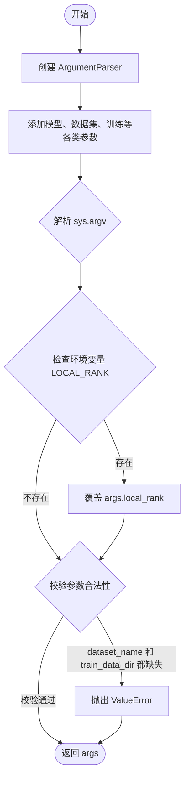
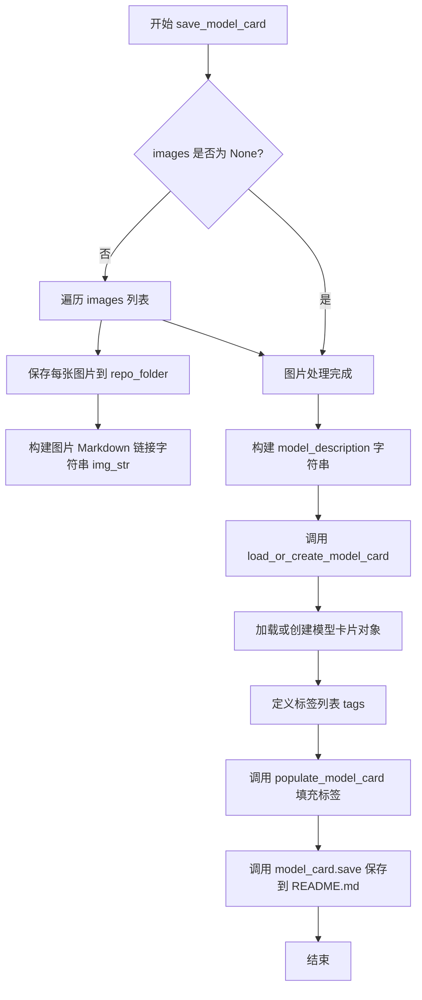
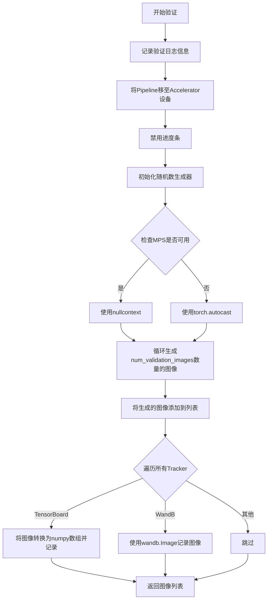

```mermaid
flowchart TD
    A[开始 main 函数] --> B[调用 parse_args 获取命令行参数]
    B --> C[检查 wandb 与 hub_token 安全性]
    C --> D[创建 logging_dir 和 ProjectConfiguration]
    D --> E[初始化 Accelerator]
    E --> F{检查 MPS 后端}
    F -->|是| G[禁用 native_amp]
    F -->|否| H[继续]
    G --> H
    H --> I[配置日志级别]
    I --> J[设置随机种子]
    J --> K{是否是主进程}
    K -->|是| L[创建输出目录]
    K -->|否| M[跳过]
    L --> M
    M --> N[加载预训练模型: noise_scheduler, tokenizer, text_encoder, vae, unet]
    N --> O[冻结 vae, text_encoder, unet 参数]
    O --> P[设置 weight_dtype]
    P --> Q[配置 LoRA: LoraConfig]
    Q --> R[移动模型到设备并转换类型]
    R --> S[添加 LoRA adapter 到 unet]
    S --> T{启用 xformers?}
    T -->|是| U[启用高效注意力]
    T -->|否| V[继续]
    U --> V
    V --> W[获取可训练参数 lora_layers]
    W --> X{启用 gradient_checkpointing?}
    X -->|是| Y[启用梯度检查点]
    X -->|否| Z[继续]
    Y --> Z
    Z --> AA[启用 TF32]
    AA --> AB[计算学习率]
    AB --> AC[创建优化器 AdamW]
    AC --> AD[加载数据集]
    AD --> AE[预处理数据集和 tokenize captions]
    AE --> AF[创建数据增强 transforms]
    AF --> AG[创建 DataLoader]
    AH --> AI[创建学习率调度器]
    AI --> AJ[使用 accelerator 准备模型和数据]
    AJ --> AK[注册模型保存/加载 hooks]
    AK --> AL[计算总训练步数]
    AL --> AM[初始化 trackers]
    AM --> AN[进入训练循环: 遍历 epoch]
    AN --> AO[遍历 train_dataloader]
    AO --> AP[执行训练步骤]
    AP --> AQ{执行优化?}
    AQ -->|是| AR[更新参数和学习率]
    AQ -->|否| AS[跳过]
    AR --> AT{达到 checkpointing_steps?}
    AT -->|是| AU[保存检查点]
    AT -->|否| AV[继续]
    AU --> AV
    AV --> AW{验证条件满足?}
    AW -->|是| AX[运行验证]
    AW -->|否| AY[继续]
    AX --> AY
    AY --> AZ{未达到最大训练步数?}
    AZ -->|是| AO
    AZ -->|否| BA[训练结束]
    BA --> BB[保存 LoRA 权重]
    BB --> BC[执行最终推理验证]
    BC --> BD{push_to_hub?}
    BD -->|是| BE[保存 model card 并上传]
    BD -->|否| BF[结束]
    BE --> BF
```

# `diffusers\examples\text_to_image\train_text_to_image_lora.py` 详细设计文档

A comprehensive fine-tuning script for Stable Diffusion using LoRA, supporting text-to-image generation with distributed training, mixed precision, and validation logging.

## 整体流程

```mermaid
graph TD
    Start([Start]) --> ParseArgs[parse_args]
    ParseArgs --> InitAccel[Initialize Accelerator]
    InitAccel --> LoadModels[Load Pre-trained Models (VAE, TextEncoder, UNet)]
    LoadModels --> SetupLora[Configure LoRA & Add Adapters]
    SetupLora --> LoadData[Load Dataset & Preprocess]
    LoadData --> InitOpt[Initialize Optimizer & LR Scheduler]
    InitOpt --> TrainLoop[Training Loop: for epoch in range(num_epochs)]
    TrainLoop --> Batch[Get Batch]
    Batch --> Encode[Encode Images & Text]
    Encode --> Noise[Add Noise to Latents]
    Noise --> Forward[UNet Forward Pass]
    Forward --> Loss[Calculate Loss (MSE)]
    Loss --> Backward[Backward Pass & Optimizer Step]
    Backward --> Check{Checkpointing/Validation?}
    Check -->|Yes| Save[Save Checkpoint / Log Images]
    Check -->|No| Next
    Save --> Next
    Next --> LoopEnd{More Steps?}
    LoopEnd -->|Yes| TrainLoop
    LoopEnd -->|No| Finish[End Training]
    Finish --> SaveLora[Save LoRA Weights]
    SaveLora --> Push[Push to Hub (Optional)]
```

## 类结构

```
train_text_to_image_lora.py (Procedural Script)
├── Global Variables
│   ├── logger (Logger instance)
│   └── DATASET_NAME_MAPPING (Dict: Dataset mapping)
└── Global Functions
    ├── parse_args (Parses command-line arguments)
    ├── save_model_card (Generates and saves model card)
    ├── log_validation (Runs inference for validation)
    └── main (Main training pipeline)
```

## 全局变量及字段


### `logger`
    
用于记录训练过程中日志信息的日志记录器对象，通过accelerate库的get_logger函数初始化

类型：`logging.Logger`
    


### `DATASET_NAME_MAPPING`
    
数据集名称到图像列和文本列名称的映射字典，用于指定预定义数据集的列对应关系

类型：`Dict[str, Tuple[str, str]]`
    


    

## 全局函数及方法


### `parse_args`

此函数作为命令行配置的入口点，负责初始化 `argparse` 解析器，定义并添加模型路径、数据集配置、训练超参数、优化器设置及分布式训练相关参数。它解析命令行输入，处理分布式训练的环境变量覆盖，进行必要的数据集路径校验，最终返回一个包含所有配置参数的 `Namespace` 对象，供主训练流程使用。

参数：
- 无（该函数不接受任何显式参数，仅解析 `sys.argv` 和环境变量）

返回值：
- `args`：`argparse.Namespace`，包含所有命令行参数及其值的对象。

#### 流程图



#### 带注释源码

```python
def parse_args():
    """
    解析命令行参数并返回配置对象。
    """
    # 1. 初始化 ArgumentParser
    parser = argparse.ArgumentParser(description="Simple example of a training script.")

    # 2. 添加模型相关的命令行参数
    parser.add_argument(
        "--pretrained_model_name_or_path",
        type=str,
        default=None,
        required=True,
        help="Path to pretrained model or model identifier from huggingface.co/models.",
    )
    parser.add_argument(
        "--revision",
        type=str,
        default=None,
        required=False,
        help="Revision of pretrained model identifier from huggingface.co/models.",
    )
    parser.add_argument(
        "--variant",
        type=str,
        default=None,
        help="Variant of the model files of the pretrained model identifier from huggingface.co/models, 'e.g.' fp16",
    )
    # ... (此处省略约100行参数定义，包括 dataset_name, train_data_dir, learning_rate, gradient_accumulation_steps 等)

    # 3. 解析命令行参数
    args = parser.parse_args()

    # 4. 处理分布式训练环境变量
    # 如果环境变量中设置了 LOCAL_RANK，则优先使用环境变量的值
    env_local_rank = int(os.environ.get("LOCAL_RANK", -1))
    if env_local_rank != -1 and env_local_rank != args.local_rank:
        args.local_rank = env_local_rank

    # 5. 基础校验 (Sanity Checks)
    # 确保提供了数据集名称或本地训练文件夹路径
    if args.dataset_name is None and args.train_data_dir is None:
        raise ValueError("Need either a dataset name or a training folder.")

    # 6. 返回解析后的参数对象
    return args
```


### `save_model_card`

该函数用于在模型训练完成后生成并保存HuggingFace模型卡片（Model Card），包括将示例图片保存到指定目录、生成模型描述信息、填充模型元数据（如标签），并最终将模型卡片保存为README.md文件。

参数：

- `repo_id`：`str`，HuggingFace Hub上的仓库标识符，用于加载或创建模型卡片
- `images`：`list`，可选，要保存的示例图片列表，这些图片将被保存到repo_folder中并在模型卡片中展示
- `base_model`：`str`，可选，用于微调的基础模型名称或路径
- `dataset_name`：`str`，可选，用于微训练的数据集名称
- `repo_folder`：`str`，可选，仓库文件夹路径，用于保存图片和README.md文件

返回值：`None`，该函数不返回任何值，直接将模型卡片写入文件系统

#### 流程图



#### 带注释源码

```python
def save_model_card(
    repo_id: str,              # HuggingFace Hub 仓库 ID
    images: list = None,      # 示例图片列表（可选）
    base_model: str = None,   # 基础模型名称（可选）
    dataset_name: str = None, # 数据集名称（可选）
    repo_folder: str = None,  # 仓库文件夹路径（可选）
):
    """
    生成并保存 HuggingFace 模型卡片。
    
    该函数执行以下操作：
    1. 将示例图片保存到指定目录
    2. 生成包含模型描述的 Markdown 文本
    3. 加载或创建模型卡片并填充元数据
    4. 将模型卡片保存为 README.md
    """
    
    # 初始化图片字符串，用于构建 Markdown 图片链接
    img_str = ""
    
    # 如果提供了图片列表，则保存每张图片并生成对应的 Markdown 链接
    if images is not None:
        for i, image in enumerate(images):
            # 将图片保存到 repo_folder，文件名格式为 image_0.png, image_1.png 等
            image.save(os.path.join(repo_folder, f"image_{i}.png"))
            # 构建 Markdown 格式的图片链接字符串
            img_str += f"\n"

    # 构建模型描述信息，包含基础模型和数据集信息
    model_description = f"""
# LoRA text2image fine-tuning - {repo_id}
These are LoRA adaption weights for {base_model}. The weights were fine-tuned on the {dataset_name} dataset. You can find some example images in the following. \n
{img_str}
"""

    # 加载或创建模型卡片
    # from_training=True 表示从训练过程创建，license 设置为 creativeml-openrail-m
    model_card = load_or_create_model_card(
        repo_id_or_path=repo_id,
        from_training=True,
        license="creativeml-openrail-m",
        base_model=base_model,
        model_description=model_description,
        inference=True,
    )

    # 定义模型标签，用于分类和搜索
    tags = [
        "stable-diffusion",
        "stable-diffusion-diffusers",
        "text-to-image",
        "diffusers",
        "diffusers-training",
        "lora",
    ]
    
    # 填充模型卡片的标签字段
    model_card = populate_model_card(model_card, tags=tags)

    # 将模型卡片保存为 README.md 文件
    model_card.save(os.path.join(repo_folder, "README.md"))
```


### `log_validation`

该函数用于在训练过程中运行验证，生成指定数量的图像并通过TensorBoard或WandB记录，便于监控模型在验证集上的生成效果。

参数：

- `pipeline`：`DiffusionPipeline`，用于文本到图像生成的Diffusion Pipeline对象
- `args`：`Namespace`，包含训练参数的配置对象，如`num_validation_images`、`validation_prompt`、`seed`等
- `accelerator`：`Accelerator`，分布式训练加速器，用于设备管理和日志记录
- `epoch`：`int`，当前训练的轮次编号
- `is_final_validation`：`bool`，标识是否为最终验证阶段（默认为False）

返回值：`List[PIL.Image]`，生成的验证图像列表

#### 流程图



#### 带注释源码

```python
def log_validation(
    pipeline,          # DiffusionPipeline对象，用于生成图像
    args,              # 命令行参数对象，包含验证配置
    accelerator,      # Accelerator对象，用于设备管理和跟踪
    epoch,             # 当前训练轮次
    is_final_validation=False,  # 标记是否为最终验证
):
    # 记录验证开始信息，包括生成图像数量和验证提示词
    logger.info(
        f"Running validation... \n Generating {args.num_validation_images} images with prompt:"
        f" {args.validation_prompt}."
    )
    
    # 将Pipeline移至Accelerator所在设备
    pipeline = pipeline.to(accelerator.device)
    
    # 禁用进度条显示
    pipeline.set_progress_bar_config(disable=True)
    
    # 初始化随机数生成器，用于确保可重复性
    generator = torch.Generator(device=accelerator.device)
    if args.seed is not None:
        generator = generator.manual_seed(args.seed)
    
    # 初始化图像列表
    images = []
    
    # 根据设备类型选择自动混合精度上下文
    # MPS设备使用nullcontext，避免AMP兼容性问题
    if torch.backends.mps.is_available():
        autocast_ctx = nullcontext()
    else:
        autocast_ctx = torch.autocast(accelerator.device.type)

    # 在自动混合精度上下文中生成验证图像
    with autocast_ctx:
        for _ in range(args.num_validation_images):
            # 调用Pipeline生成图像，使用固定30步推理
            images.append(pipeline(args.validation_prompt, num_inference_steps=30, generator=generator).images[0])

    # 遍历所有注册的Tracker记录图像
    for tracker in accelerator.trackers:
        # 确定阶段名称：测试或验证
        phase_name = "test" if is_final_validation else "validation"
        
        # TensorBoard记录：将图像堆叠为numpy数组
        if tracker.name == "tensorboard":
            np_images = np.stack([np.asarray(img) for img in images])
            tracker.writer.add_images(phase_name, np_images, epoch, dataformats="NHWC")
        
        # WandB记录：使用wandb.Image包装图像
        if tracker.name == "wandb":
            tracker.log(
                {
                    phase_name: [
                        wandb.Image(image, caption=f"{i}: {args.validation_prompt}") for i, image in enumerate(images)
                    ]
                }
            )
    
    # 返回生成的图像列表
    return images
```


### `main`

这是Stable Diffusion LoRA微调训练脚本的主入口函数，负责整个训练流程的 orchestration，包括参数解析、模型加载与配置、数据集准备、训练循环执行以及模型保存。

参数：

- 无（该函数不接受任何形参，参数通过内部的`parse_args()`函数获取）

返回值：`None`，该函数不返回任何值，仅执行训练流程并保存模型

#### 流程图



#### 带注释源码

```python
def main():
    """主训练函数，协调整个 Stable Diffusion LoRA 微调流程"""
    
    # 1. 解析命令行参数
    args = parse_args()
    
    # 2. 安全检查：不能同时使用 wandb 和 hub_token
    if args.report_to == "wandb" and args.hub_token is not None:
        raise ValueError(
            "You cannot use both --report_to=wandb and --hub_token due to a security risk of exposing your token."
            " Please use `hf auth login` to authenticate with the Hub."
        )

    # 3. 设置日志目录
    logging_dir = Path(args.output_dir, args.logging_dir)

    # 4. 创建 Accelerator 项目配置
    accelerator_project_config = ProjectConfiguration(project_dir=args.output_dir, logging_dir=logging_dir)

    # 5. 初始化 Accelerator（处理分布式训练、混合精度等）
    accelerator = Accelerator(
        gradient_accumulation_steps=args.gradient_accumulation_steps,
        mixed_precision=args.mixed_precision,
        log_with=args.report_to,
        project_config=accelerator_project_config,
    )

    # 6. MPS 后端禁用 AMP
    if torch.backends.mps.is_available():
        accelerator.native_amp = False

    # 7. 配置日志格式
    logging.basicConfig(
        format="%(asctime)s - %(levelname)s - %(name)s - %(message)s",
        datefmt="%m/%d/%Y %H:%M:%S",
        level=logging.INFO,
    )
    logger.info(accelerator.state, main_process_only=False)
    
    # 8. 根据进程类型设置日志级别
    if accelerator.is_local_main_process:
        datasets.utils.logging.set_verbosity_warning()
        transformers.utils.logging.set_verbosity_warning()
        diffusers.utils.logging.set_verbosity_info()
    else:
        datasets.utils.logging.set_verbosity_error()
        transformers.utils.logging.set_verbosity_error()
        diffusers.utils.logging.set_verbosity_error()

    # 9. 设置随机种子以确保可重复性
    if args.seed is not None:
        set_seed(args.seed)

    # 10. 处理仓库创建（如果需要 push_to_hub）
    if accelerator.is_main_process:
        if args.output_dir is not None:
            os.makedirs(args.output_dir, exist_ok=True)

        if args.push_to_hub:
            repo_id = create_repo(
                repo_id=args.hub_model_id or Path(args.output_dir).name, exist_ok=True, token=args.hub_token
            ).repo_id

    # 11. 加载预训练模型和组件
    noise_scheduler = DDPMScheduler.from_pretrained(args.pretrained_model_name_or_path, subfolder="scheduler")
    tokenizer = CLIPTokenizer.from_pretrained(
        args.pretrained_model_name_or_path, subfolder="tokenizer", revision=args.revision
    )
    text_encoder = CLIPTextModel.from_pretrained(
        args.pretrained_model_name_or_path, subfolder="text_encoder", revision=args.revision
    )
    vae = AutoencoderKL.from_pretrained(
        args.pretrained_model_name_or_path, subfolder="vae", revision=args.revision, variant=args.variant
    )
    unet = UNet2DConditionModel.from_pretrained(
        args.pretrained_model_name_or_path, subfolder="unet", revision=args.revision, variant=args.variant
    )

    # 12. 冻结模型参数以节省显存
    unet.requires_grad_(False)
    vae.requires_grad_(False)
    text_encoder.requires_grad_(False)

    # 13. 设置权重数据类型（混合精度）
    weight_dtype = torch.float32
    if accelerator.mixed_precision == "fp16":
        weight_dtype = torch.float16
    elif accelerator.mixed_precision == "bf16":
        weight_dtype = torch.bfloat16

    # 14. 配置 LoRA
    unet_lora_config = LoraConfig(
        r=args.rank,
        lora_alpha=args.rank,
        init_lora_weights="gaussian",
        target_modules=["to_k", "to_q", "to_v", "to_out.0"],
    )

    # 15. 将模型移动到设备并转换数据类型
    unet.to(accelerator.device, dtype=weight_dtype)
    vae.to(accelerator.device, dtype=weight_dtype)
    text_encoder.to(accelerator.device, dtype=weight_dtype)

    # 16. 添加 LoRA adapter 并确保可训练参数为 float32
    unet.add_adapter(unet_lora_config)
    if args.mixed_precision == "fp16":
        # 只将可训练参数（LoRA）转换为 fp32
        cast_training_params(unet, dtype=torch.float32)

    # 17. 启用 xformers 高效注意力（如需要）
    if args.enable_xformers_memory_efficient_attention:
        if is_xformers_available():
            import xformers
            xformers_version = version.parse(xformers.__version__)
            if xformers_version == version.parse("0.0.16"):
                logger.warning(
                    "xFormers 0.0.16 cannot be used for training in some GPUs..."
                )
            unet.enable_xformers_memory_efficient_attention()
        else:
            raise ValueError("xformers is not available.")

    # 18. 获取可训练的 LoRA 参数
    lora_layers = filter(lambda p: p.requires_grad, unet.parameters())

    # 19. 启用梯度检查点（如需要）
    if args.gradient_checkpointing:
        unet.enable_gradient_checkpointing()

    # 20. 启用 TF32 加速（如需要）
    if args.allow_tf32:
        torch.backends.cuda.matmul.allow_tf32 = True

    # 21. 缩放学习率（如需要）
    if args.scale_lr:
        args.learning_rate = (
            args.learning_rate * args.gradient_accumulation_steps * args.train_batch_size * accelerator.num_processes
        )

    # 22. 初始化优化器
    if args.use_8bit_adam:
        try:
            import bitsandbytes as bnb
        except ImportError:
            raise ImportError("Please install bitsandbytes...")
        optimizer_cls = bnb.optim.AdamW8bit
    else:
        optimizer_cls = torch.optim.AdamW

    optimizer = optimizer_cls(
        lora_layers,
        lr=args.learning_rate,
        betas=(args.adam_beta1, args.adam_beta2),
        weight_decay=args.adam_weight_decay,
        eps=args.adam_epsilon,
    )

    # 23. 加载数据集
    if args.dataset_name is not None:
        dataset = load_dataset(
            args.dataset_name,
            args.dataset_config_name,
            cache_dir=args.cache_dir,
            data_dir=args.train_data_dir,
        )
    else:
        data_files = {}
        if args.train_data_dir is not None:
            data_files["train"] = os.path.join(args.train_data_dir, "**")
        dataset = load_dataset(
            "imagefolder",
            data_files=data_files,
            cache_dir=args.cache_dir,
        )

    # 24. 预处理数据集
    column_names = dataset["train"].column_names
    dataset_columns = DATASET_NAME_MAPPING.get(args.dataset_name, None)
    
    # 确定 image 和 caption 列名
    if args.image_column is None:
        image_column = dataset_columns[0] if dataset_columns is not None else column_names[0]
    else:
        image_column = args.image_column
    if args.caption_column is None:
        caption_column = dataset_columns[1] if dataset_columns is not None else column_names[1]
    else:
        caption_column = args.caption_column

    # 25. 定义 tokenize_captions 函数
    def tokenize_captions(examples, is_train=True):
        captions = []
        for caption in examples[caption_column]:
            if isinstance(caption, str):
                captions.append(caption)
            elif isinstance(caption, (list, np.ndarray)):
                captions.append(random.choice(caption) if is_train else caption[0])
            else:
                raise ValueError(f"Caption column `{caption_column}` should contain either strings or lists of strings.")
        inputs = tokenizer(
            captions, max_length=tokenizer.model_max_length, padding="max_length", truncation=True, return_tensors="pt"
        )
        return inputs.input_ids

    # 26. 获取插值方法
    interpolation = getattr(transforms.InterpolationMode, args.image_interpolation_mode.upper(), None)
    if interpolation is None:
        raise ValueError(f"Unsupported interpolation mode {args.image_interpolation_mode}.")

    # 27. 定义数据增强 transforms
    train_transforms = transforms.Compose(
        [
            transforms.Resize(args.resolution, interpolation=interpolation),
            transforms.CenterCrop(args.resolution) if args.center_crop else transforms.RandomCrop(args.resolution),
            transforms.RandomHorizontalFlip() if args.random_flip else transforms.Lambda(lambda x: x),
            transforms.ToTensor(),
            transforms.Normalize([0.5], [0.5]),
        ]
    )

    # 28. 定义 unwrap_model 和 preprocess_train 函数
    def unwrap_model(model):
        model = accelerator.unwrap_model(model)
        model = model._orig_mod if is_compiled_module(model) else model
        return model

    def preprocess_train(examples):
        images = [image.convert("RGB") for image in examples[image_column]]
        examples["pixel_values"] = [train_transforms(image) for image in images]
        examples["input_ids"] = tokenize_captions(examples)
        return examples

    # 29. 应用数据预处理
    with accelerator.main_process_first():
        if args.max_train_samples is not None:
            dataset["train"] = dataset["train"].shuffle(seed=args.seed).select(range(args.max_train_samples))
        train_dataset = dataset["train"].with_transform(preprocess_train)

    # 30. 定义 collate_fn
    def collate_fn(examples):
        pixel_values = torch.stack([example["pixel_values"] for example in examples])
        pixel_values = pixel_values.to(memory_format=torch.contiguous_format).float()
        input_ids = torch.stack([example["input_ids"] for example in examples])
        return {"pixel_values": pixel_values, "input_ids": input_ids}

    # 31. 创建 DataLoader
    train_dataloader = torch.utils.data.DataLoader(
        train_dataset,
        shuffle=True,
        collate_fn=collate_fn,
        batch_size=args.train_batch_size,
        num_workers=args.dataloader_num_workers,
    )

    # 32. 定义模型保存和加载 hooks
    def save_model_hook(models, weights, output_dir):
        if accelerator.is_main_process:
            unet_lora_layers_to_save = None
            for model in models:
                if isinstance(model, type(unwrap_model(unet))):
                    unet_lora_layers_to_save = get_peft_model_state_dict(model)
                else:
                    raise ValueError(f"Unexpected save model: {model.__class__}")
                weights.pop()
            StableDiffusionPipeline.save_lora_weights(
                save_directory=output_dir,
                unet_lora_layers=unet_lora_layers_to_save,
                safe_serialization=True,
            )

    def load_model_hook(models, input_dir):
        unet_ = None
        while len(models) > 0:
            model = models.pop()
            if isinstance(model, type(unwrap_model(unet))):
                unet_ = model
            else:
                raise ValueError(f"unexpected save model: {model.__class__}")
        lora_state_dict, network_alphas = StableDiffusionPipeline.lora_state_dict(input_dir)
        unet_state_dict = {f"{k.replace('unet.', '')}": v for k, v in lora_state_dict.items() if k.startswith("unet.")}
        unet_state_dict = convert_unet_state_dict_to_peft(unet_state_dict)
        incompatible_keys = set_peft_model_state_dict(unet_, unet_state_dict, adapter_name="default")
        if incompatible_keys is not None:
            unexpected_keys = getattr(incompatible_keys, "unexpected_keys", None)
            if unexpected_keys:
                logger.warning(f"Loading adapter weights led to unexpected keys: {unexpected_keys}.")
        if args.mixed_precision in ["fp16"]:
            cast_training_params([unet_], dtype=torch.float32)

    # 33. 计算学习率调度器参数
    num_warmup_steps_for_scheduler = args.lr_warmup_steps * accelerator.num_processes
    if args.max_train_steps is None:
        len_train_dataloader_after_sharding = math.ceil(len(train_dataloader) / accelerator.num_processes)
        num_update_steps_per_epoch = math.ceil(len_train_dataloader_after_sharding / args.gradient_accumulation_steps)
        num_training_steps_for_scheduler = (
            args.num_train_epochs * num_update_steps_per_epoch * accelerator.num_processes
        )
    else:
        num_training_steps_for_scheduler = args.max_train_steps * accelerator.num_processes

    # 34. 创建学习率调度器
    lr_scheduler = get_scheduler(
        args.lr_scheduler,
        optimizer=optimizer,
        num_warmup_steps=num_warmup_steps_for_scheduler,
        num_training_steps=num_training_steps_for_scheduler,
    )

    # 35. 使用 accelerator 准备所有组件
    unet, optimizer, train_dataloader, lr_scheduler = accelerator.prepare(
        unet, optimizer, train_dataloader, lr_scheduler
    )

    # 36. 注册保存/加载 hooks
    accelerator.register_save_state_pre_hook(save_model_hook)
    accelerator.register_load_state_pre_hook(load_model_hook)

    # 37. 重新计算总训练步数
    num_update_steps_per_epoch = math.ceil(len(train_dataloader) / args.gradient_accumulation_steps)
    if args.max_train_steps is None:
        args.max_train_steps = args.num_train_epochs * num_update_steps_per_epoch
        if num_training_steps_for_scheduler != args.max_train_steps * accelerator.num_processes:
            logger.warning(f"The length of the 'train_dataloader' after 'accelerator.prepare' does not match...")
    args.num_train_epochs = math.ceil(args.max_train_steps / num_update_steps_per_epoch)

    # 38. 初始化 trackers
    if accelerator.is_main_process:
        accelerator.init_trackers("text2image-fine-tune", config=vars(args))

    # 39. 训练循环
    total_batch_size = args.train_batch_size * accelerator.num_processes * args.gradient_accumulation_steps
    logger.info("***** Running training *****")
    logger.info(f"  Num examples = {len(train_dataset)}")
    logger.info(f"  Num Epochs = {args.num_train_epochs}")
    logger.info(f"  Instantaneous batch size per device = {args.train_batch_size}")
    logger.info(f"  Total train batch size = {total_batch_size}")
    logger.info(f"  Gradient Accumulation steps = {args.gradient_accumulation_steps}")
    logger.info(f"  Total optimization steps = {args.max_train_steps}")

    global_step = 0
    first_epoch = 0

    # 40. 从检查点恢复训练（如有）
    if args.resume_from_checkpoint:
        if args.resume_from_checkpoint != "latest":
            path = os.path.basename(args.resume_from_checkpoint)
        else:
            dirs = os.listdir(args.output_dir)
            dirs = [d for d in dirs if d.startswith("checkpoint")]
            dirs = sorted(dirs, key=lambda x: int(x.split("-")[1]))
            path = dirs[-1] if len(dirs) > 0 else None

        if path is None:
            accelerator.print(f"Checkpoint '{args.resume_from_checkpoint}' does not exist. Starting a new training run.")
            args.resume_from_checkpoint = None
            initial_global_step = 0
        else:
            accelerator.print(f"Resuming from checkpoint {path}")
            accelerator.load_state(os.path.join(args.output_dir, path))
            global_step = int(path.split("-")[1])
            initial_global_step = global_step
            first_epoch = global_step // num_update_steps_per_epoch
    else:
        initial_global_step = 0

    # 41. 创建进度条
    progress_bar = tqdm(
        range(0, args.max_train_steps),
        initial=initial_global_step,
        desc="Steps",
        disable=not accelerator.is_local_main_process,
    )

    # 42. 遍历每个 epoch
    for epoch in range(first_epoch, args.num_train_epochs):
        unet.train()
        train_loss = 0.0
        
        # 43. 遍历每个 batch
        for step, batch in enumerate(train_dataloader):
            with accelerator.accumulate(unet):
                # 将图像编码到 latent 空间
                latents = vae.encode(batch["pixel_values"].to(dtype=weight_dtype)).latent_dist.sample()
                latents = latents * vae.config.scaling_factor

                # 采样噪声
                noise = torch.randn_like(latents)
                if args.noise_offset:
                    noise += args.noise_offset * torch.randn(
                        (latents.shape[0], latents.shape[1], 1, 1), device=latents.device
                    )

                bsz = latents.shape[0]
                # 随机采样 timestep
                timesteps = torch.randint(0, noise_scheduler.config.num_train_timesteps, (bsz,), device=latents.device)
                timesteps = timesteps.long()

                # 前向扩散过程
                noisy_latents = noise_scheduler.add_noise(latents, noise, timesteps)

                # 获取文本嵌入
                encoder_hidden_states = text_encoder(batch["input_ids"], return_dict=False)[0]

                # 确定预测目标
                if args.prediction_type is not None:
                    noise_scheduler.register_to_config(prediction_type=args.prediction_type)

                if noise_scheduler.config.prediction_type == "epsilon":
                    target = noise
                elif noise_scheduler.config.prediction_type == "v_prediction":
                    target = noise_scheduler.get_velocity(latents, noise, timesteps)
                else:
                    raise ValueError(f"Unknown prediction type {noise_scheduler.config.prediction_type}")

                # 预测噪声残差并计算损失
                model_pred = unet(noisy_latents, timesteps, encoder_hidden_states, return_dict=False)[0]

                if args.snr_gamma is None:
                    loss = F.mse_loss(model_pred.float(), target.float(), reduction="mean")
                else:
                    # 使用 SNR 加权
                    snr = compute_snr(noise_scheduler, timesteps)
                    mse_loss_weights = torch.stack([snr, args.snr_gamma * torch.ones_like(timesteps)], dim=1).min(dim=1)[0]
                    if noise_scheduler.config.prediction_type == "epsilon":
                        mse_loss_weights = mse_loss_weights / snr
                    elif noise_scheduler.config.prediction_type == "v_prediction":
                        mse_loss_weights = mse_loss_weights / (snr + 1)
                    loss = F.mse_loss(model_pred.float(), target.float(), reduction="none")
                    loss = loss.mean(dim=list(range(1, len(loss.shape)))) * mse_loss_weights
                    loss = loss.mean()

                # 收集损失用于日志
                avg_loss = accelerator.gather(loss.repeat(args.train_batch_size)).mean()
                train_loss += avg_loss.item() / args.gradient_accumulation_steps

                # 反向传播
                accelerator.backward(loss)
                if accelerator.sync_gradients:
                    params_to_clip = lora_layers
                    accelerator.clip_grad_norm_(params_to_clip, args.max_grad_norm)
                optimizer.step()
                lr_scheduler.step()
                optimizer.zero_grad()

            # 检查是否执行了优化步骤
            if accelerator.sync_gradients:
                progress_bar.update(1)
                global_step += 1
                accelerator.log({"train_loss": train_loss}, step=global_step)
                train_loss = 0.0

                # 保存检查点
                if global_step % args.checkpointing_steps == 0:
                    if accelerator.is_main_process:
                        if args.checkpoints_total_limit is not None:
                            checkpoints = os.listdir(args.output_dir)
                            checkpoints = [d for d in checkpoints if d.startswith("checkpoint")]
                            checkpoints = sorted(checkpoints, key=lambda x: int(x.split("-")[1]))
                            if len(checkpoints) >= args.checkpoints_total_limit:
                                num_to_remove = len(checkpoints) - args.checkpoints_total_limit + 1
                                removing_checkpoints = checkpoints[0:num_to_remove]
                                for removing_checkpoint in removing_checkpoints:
                                    shutil.rmtree(os.path.join(args.output_dir, removing_checkpoint))
                        save_path = os.path.join(args.output_dir, f"checkpoint-{global_step}")
                        accelerator.save_state(save_path)
                        logger.info(f"Saved state to {save_path}")

            # 更新进度条
            logs = {"step_loss": loss.detach().item(), "lr": lr_scheduler.get_last_lr()[0]}
            progress_bar.set_postfix(**logs)

            if global_step >= args.max_train_steps:
                break

        # 验证
        if accelerator.is_main_process:
            if args.validation_prompt is not None and epoch % args.validation_epochs == 0:
                pipeline = DiffusionPipeline.from_pretrained(
                    args.pretrained_model_name_or_path,
                    unet=unwrap_model(unet),
                    revision=args.revision,
                    variant=args.variant,
                    torch_dtype=weight_dtype,
                )
                images = log_validation(pipeline, args, accelerator, epoch)
                del pipeline
                torch.cuda.empty_cache()

    # 44. 保存最终 LoRA 权重
    accelerator.wait_for_everyone()
    if accelerator.is_main_process:
        unet = unet.to(torch.float32)
        unwrapped_unet = unwrap_model(unet)
        unet_lora_state_dict = convert_state_dict_to_diffusers(get_peft_model_state_dict(unwrapped_unet))
        StableDiffusionPipeline.save_lora_weights(
            save_directory=args.output_dir,
            unet_lora_layers=unet_lora_state_dict,
            safe_serialization=True,
        )

        # 最终推理验证
        if args.validation_prompt is not None:
            pipeline = DiffusionPipeline.from_pretrained(
                args.pretrained_model_name_or_path,
                revision=args.revision,
                variant=args.variant,
                torch_dtype=weight_dtype,
            )
            pipeline.load_lora_weights(args.output_dir)
            images = log_validation(pipeline, args, accelerator, epoch, is_final_validation=True)

        # 上传到 Hub
        if args.push_to_hub:
            save_model_card(
                repo_id,
                images=images,
                base_model=args.pretrained_model_name_or_path,
                dataset_name=args.dataset_name,
                repo_folder=args.output_dir,
            )
            upload_folder(
                repo_id=repo_id,
                folder_path=args.output_dir,
                commit_message="End of training",
                ignore_patterns=["step_*", "epoch_*"],
            )

    accelerator.end_training()
```

## 关键组件


### LoRA配置与适配器

管理LoRA微调的配置参数，包括秩(rank)、alpha值、初始化方式及目标模块，专注于UNet的注意力机制层进行低秩适配。

### 混合精度训练控制器

根据加速器配置动态选择权重数据类型(fp16/bf16/fp32)，在推理时保持非训练权重为半精度以节省显存，同时确保LoRA训练参数为fp32以保证训练稳定性。

### 8位Adam优化器

可选的量化优化器支持，通过bitsandbytes库实现8位量化，显著降低显存占用同时保持与标准AdamW相近的优化效果。

### 梯度检查点工具

通过`enable_gradient_checkpointing`在反向传播时节省显存，以计算时间换取显存空间，适合大模型训练场景。

### 数据预处理管道

包含图像Resize、中心裁剪/随机裁剪、随机翻转、ToTensor及Normalize等 transforms 组合，支持可插拔的插值模式(Lanczos/Bilinear/Bicubic等)。

### 噪声调度器

实现DDPM扩散过程，支持epsilon和v_prediction两种预测类型，可通过SNR加权策略调整训练损失，并支持噪声偏移(noise_offset)增强。

### 文本编码器

冻结的CLIPTextModel用于将文本提示编码为条件嵌入，在训练时保持固定，仅用于推理过程中的条件生成。

### VAE潜在空间转换器

冻结的AutoencoderKL将图像像素转换为潜在表示，使用scaling_factor进行尺度缩放，在训练循环中执行编码操作。

### UNet2D条件模型

冻结的骨干网络，通过LoRA适配器注入可训练参数，接收噪声潜在表示、时间步和文本条件进行噪声残差预测。

### 学习率调度器

支持linear、cosine、constant等多种调度策略，配合warmup步数和总训练步数进行学习率动态调整。

### 加速器封装

统一管理分布式训练、混合精度、梯度累积、模型同步等底层复杂性，提供gradient_checkpointing和xformers memory efficient attention的启用接口。

### 检查点管理钩子

通过register_save_state_pre_hook和register_load_state_pre_hook自定义LoRA权重的保存与加载逻辑，支持安全序列化(safe_serialization)和检查点数量限制。

### 推理验证模块

在验证阶段使用DiffusionPipeline生成样本图像，支持多Tracker(TensorBoard/WandB)记录，可配置生成数量和推理步数。

### 模版卡生成器

训练完成后自动生成HuggingFace Hub所需的模型卡片，包含LoRA权重描述、示例图像和标签元数据。

## 问题及建议


### 已知问题

- **LoRA target_modules 硬编码**: `target_modules=["to_k", "to_q", "to_v", "to_out.0"]` 是硬编码的，限制了模型适配的灵活性，不适用于所有 UNet 架构变体
- **数据集映射表不完整**: `DATASET_NAME_MAPPING` 仅包含一个数据集映射，缺乏扩展性，用户自定义数据集无法受益于预定义的列名映射
- **混合精度处理不一致**: `cast_training_params` 仅在 `fp16` 时执行 float32 转换，未考虑 `bf16` 场景，可能导致训练数值不稳定
- **MPS 后端优化不足**: `log_validation` 中对 MPS 使用 `nullcontext()` 而非优化的 autocast，可能导致生成速度较慢
- **验证推理未使用 no_grad**: 验证阶段生成图像时未使用 `torch.no_grad()`，会增加显存占用和不必要的计算开销
- **梯度累积期间 loss 计算不够精确**: `accelerator.gather(loss.repeat(args.train_batch_size))` 在梯度累积期间可能导致 loss 统计不准确
- **checkpoint 清理逻辑存在竞态条件**: 多进程环境下 `checkpoints_total_limit` 的检查和删除操作未加锁，可能导致不一致
- **训练日志指标单一**: 仅记录 `train_loss`，缺少学习率、梯度范数、GPU 内存使用等关键监控指标
- **模型保存未处理异常**: `save_model_card` 和 `upload_folder` 操作失败时缺乏完善的错误处理和重试机制
- **权重转换精度问题**: 训练结束时 `unet = unet.to(torch.float32)` 可能导致 LoRA 权重精度损失，应在保存前进行转换
- **xformers 兼容性处理不优雅**: 当 xformers 版本不兼容时直接抛出异常，中断了训练流程，应提供降级方案
- **数据转换缺乏错误处理**: `preprocess_train` 中 `image.convert("RGB")` 若遇到损坏图像会导致整个训练中断

### 优化建议

- 将 `target_modules`、数据集映射等配置抽离为独立配置文件或命令行参数，提升脚本通用性
- 在 `log_validation` 中为 MPS 添加优化的 autocast 上下文，或检测并警告用户使用 CPU/CUDA 进行验证
- 验证推理代码外包裹 `with torch.no_grad():` 上下文，减少显存占用
- 完善 `resume_from_checkpoint` 的边界情况处理，如 checkpoint 目录损坏、权重不匹配等
- 添加更多训练监控指标（学习率、梯度范数、内存使用、训练速度等），便于调试和优化
- 在关键 I/O 操作（模型保存、上传）添加 try-except 异常处理和重试机制
- 实施分布式环境下的 checkpoint 清理锁机制，确保多进程一致性
- 将 `DATASET_NAME_MAPPING` 改为从外部配置文件加载，或支持自动检测数据集列名
- 考虑添加损坏图像的跳过或替换机制，提升训练鲁棒性
- 优化 LoRA 权重转换流程，确保从训练精度到保存精度的无损转换
</think>

## 其它


### 设计目标与约束

**设计目标**：实现基于LoRA（Low-Rank Adaptation）技术的Stable Diffusion文本到图像模型微调训练脚本，支持分布式训练、混合精度训练、梯度检查点、xFormers内存优化注意力机制等功能，旨在让用户能够将预训练的Stable Diffusion模型适配到特定数据集。

**约束条件**：
- 依赖HuggingFace Diffusers >= 0.37.0.dev0版本
- 需要PyTorch支持，推荐使用Ampere架构GPU以启用TF32加速
- 模型权重受Apache License 2.0约束
- LoRA rank维度默认为4，目标模块为to_k、to_q、to_v、to_out.0

### 错误处理与异常设计

- **参数校验**：dataset_name和train_data_dir必须至少提供一个，否则抛出ValueError
- **图像列校验**：image_column和caption_column必须存在于数据集列中，否则抛出ValueError
- **插值方法校验**：image_interpolation_mode必须为有效的torchvision InterpolationMode，否则抛出ValueError
- **xFormers可用性**：如果启用xFormers但未安装或版本不兼容，会抛出ValueError或警告
- **8-bit Adam依赖**：使用8-bit Adam时如果bitsandbytes未安装，抛出ImportError并提示安装方法
- **Checkpoint恢复**：如果指定的resume_from_checkpoint不存在，会警告并开始新训练
- **模型保存兼容性**：加载LoRA权重时如果有unexpected keys会记录警告但继续执行

### 数据流与状态机

```
┌─────────────────────────────────────────────────────────────────────────────┐
│                              训练流程状态机                                   │
├─────────────────────────────────────────────────────────────────────────────┤
│                                                                             │
│  ┌──────────┐    ┌──────────────┐    ┌──────────────┐    ┌──────────────┐   │
│  │ 参数解析  │───>│  初始化加速器  │───>│  加载模型与   │───>│  准备数据集   │   │
│  │ parse_args│   │  Accelerator  │   │  权重_dtype  │   │  DataLoader  │   │
│  └──────────┘    └──────────────┘    └──────────────┘    └──────────────┘   │
│                                                                     │        │
│                                                                     v        │
│  ┌──────────┐    ┌──────────────┐    ┌──────────────┐    ┌──────────────┐   │
│  │ 保存模型  │<───│   训练循环   │<───│  注册Hook   │<───│ 准备优化器与  │   │
│  │ save_model│   │ training loop│   │  (save/load) │   │  学习率调度   │   │
│  └──────────┘    └──────────────┘    └──────────────┘    └──────────────┘   │
│                                                                     │        │
│                                                                     v        │
│                                                            ┌────────────────┐ │
│                                                            │  主训练循环步骤  │ │
│                                                            │ 1.encode latents│ │
│                                                            │ 2.add noise     │ │
│                                                            │ 3.encode text   │ │
│                                                            │ 4.predict noise │ │
│                                                            │ 5.compute loss  │ │
│                                                            │ 6.backward      │ │
│                                                            │ 7.optimizer step│ │
│                                                            └────────────────┘ │
└─────────────────────────────────────────────────────────────────────────────┘

数据流方向：
1. 输入数据：原始图像 + 文本描述 → DataLoader
2. 图像处理：train_transforms (Resize → Crop → Flip → Normalize)
3. 文本处理：tokenize_captions → CLIPTokenizer → input_ids
4. 潜在空间：VAE.encode(pixel_values) → latents
5. 噪声添加：noise_scheduler.add_noise(latents, noise, timesteps)
6. 条件编码：text_encoder(input_ids) → encoder_hidden_states
7. 噪声预测：unet(noisy_latents, timesteps, encoder_hidden_states) → model_pred
8. 损失计算：F.mse_loss(model_pred, target)
9. 反向传播与权重更新
```

### 外部依赖与接口契约

**核心依赖包**：
- `torch` (PyTorch深度学习框架)
- `transformers` (CLIPTextModel, CLIPTokenizer)
- `diffusers` (AutoencoderKL, DDPMScheduler, StableDiffusionPipeline, UNet2DConditionModel)
- `peft` (LoraConfig, get_peft_model_state_dict, set_peft_model_state_dict)
- `accelerate` (分布式训练与混合精度)
- `datasets` (数据集加载)
- `huggingface_hub` (模型上传)
- `packaging` (版本解析)
- `torchvision` (图像变换)
- `numpy` (数值计算)
- `tqdm` (进度条)
- `bitsandbytes` (可选，8-bit Adam优化器)
- `xformers` (可选，内存高效注意力)
- `wandb` (可选，日志记录)

**模型接口契约**：
- 预训练模型路径必须包含scheduler、tokenizer、text_encoder、vae、unet子文件夹
- LoRA保存使用StableDiffusionPipeline.save_lora_weights，格式为SafeTensor
- Checkpoint保存使用accelerator.save_state，恢复使用accelerator.load_state

### 性能优化策略

- **混合精度训练**：支持fp16和bf16，自动选择权重精度
- **梯度累积**：gradient_accumulation_steps支持大 batch size模拟
- **梯度检查点**：gradient_checkpointing以计算换内存
- **xFormers注意力**：enable_xformers_memory_efficient_attention降低显存
- **TF32加速**：allow_tf32启用Ampere GPU张量核心加速
- **8-bit Adam**：use_8bit_adam减少优化器状态内存占用
- **LoRA冻结**：仅训练LoRA参数，冻结UNet、VAE、Text Encoder主体

### 安全性与合规性

- **Token安全**：检测到同时使用--report_to=wandb和--hub_token时抛出安全警告
- **模型许可证**：生成的模型卡使用creativeml-openrail-m许可证
- **权重安全序列化**：save_lora_weights使用safe_serialization=True防止恶意权重文件
    