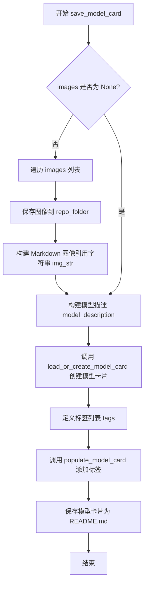
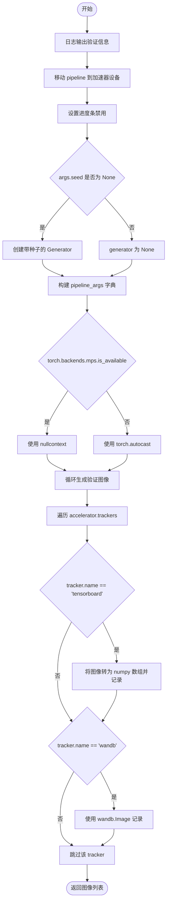
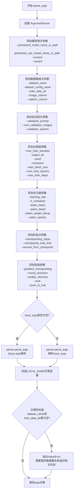
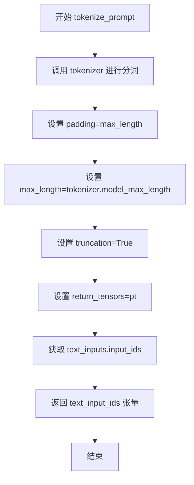

```mermaid
flowchart TD
    A[开始 main 函数] --> B[验证 wandb 和 hub_token 冲突]
    B --> C[创建 logging_dir 路径]
    C --> D{检查 MPS + bf16 兼容性}
    D -->|是| E[抛出 ValueError]
    D -->|否| F[创建 Accelerator 实例]
    F --> G[配置日志级别]
    G --> H{seed 是否设置}
    H -->|是| I[set_seed 设置随机种子]
    H -->|否| J[跳过]
    I --> K{accelerator.is_main_process}
    K -->|是| L[创建 output_dir 目录]
    K -->|否| M[跳过]
    L --> N{push_to_hub 启用}
    N -->|是| O[create_repo 创建远程仓库]
    N -->|否| P[加载 tokenizers]
    O --> P
    P --> Q[加载 text_encoder_cls_one 和 cls_two]
    Q --> R[加载 DDPMScheduler]
    R --> S[加载 text_encoder_one 和 two]
    S --> T[加载 VAE]
    T --> U[加载 UNet2DConditionModel]
    U --> V[设置模型 requires_grad False]
    V --> W[确定 weight_dtype]
    W --> X[移动模型到设备并转换 dtype]
    X --> Y{启用 npu_flash_attention}
    Y -->|是| Z[enable_npu_flash_attention]
    Y -->|否| AA{启用 xformers}
    AA -->|是| AB[enable_xformers_memory_efficient_attention]
    AA -->|否| AC[创建 LoraConfig for UNet]
    Z --> AC
    AB --> AC
    AC --> AD[unet.add_adapter]
    AD --> AE{训练 text_encoder}
    AE -->|是| AF[创建 LoraConfig 并添加 adapter]
    AE --> |否| AG[注册 save/load hooks]
    AG --> AH{启用 gradient_checkpointing}
    AH -->|是| AI[enable_gradient_checkpointing]
    AH -->|否| AJ[启用 TF32]
    AI --> AJ
    AJ --> AK[scale_lr 计算学习率]
    AK --> AL[cast_training_params 转 float32]
    AL --> AM[创建 AdamW 优化器]
    AM --> AN[加载数据集]
    AN --> AO[预处理数据集]
    AO --> AP[创建 DataLoader]
    AP --> AQ[创建 lr_scheduler]
    AQ --> AR[accelerator.prepare 准备模型]
    AR --> AS[初始化 trackers]
    AT[训练循环] --> AU[计算总 batch_size]
    AU --> AV[打印训练信息]
    AV --> AW[resume_from_checkpoint 检查点恢复]
    AW --> AX[创建 tqdm 进度条]
    AX --> AY[遍历 epochs]
    AY --> AZ[model.train 设置训练模式]
    AZ --> BA[遍历 train_dataloader]
    BA --> BB[accumulate 上下文]
    BB --> BC[VAE encode 获取 latent]
    BC --> BD[采样 noise]
    BD --> BE[采样 timesteps]
    BE --> BF[noise_scheduler add_noise]
    BF --> BG[compute_time_ids 计算时间ID]
    BG --> BH[encode_prompt 编码文本]
    BH --> BI[UNet 预测噪声]
    BI --> BJ[计算目标噪声]
    BJ --> BK{启用 SNR gamma}
    BK -->|是| BL[计算 SNR 权重损失]
    BK -->|否| BM[MSE 损失]
    BL --> BN[backward 反向传播]
    BM --> BN
    BN --> BO[clip_grad_norm 梯度裁剪]
    BO --> BP[optimizer.step 更新参数]
    BP --> BQ[lr_scheduler.step 更新学习率]
    BQ --> BR[optimizer.zero_grad]
    BR --> BS{sync_gradients}
    BS -->|是| BT[更新进度条和 global_step]
    BT --> BU{达到 checkpointing_steps}
    BU -->|是| BV[保存检查点]
    BU -->|否| BW{达到 max_train_steps}
    BS -->|否| BW
    BV --> BW
    BW -->|是| BX[跳出训练循环]
    BW -->|否| BA
    BX --> BY{validation_prompt 存在}
    BY -->|是| BZ[创建 pipeline]
    BZ --> CA[log_validation 验证]
    CA --> CB[del pipeline 释放内存]
    CB --> CC[训练完成]
    BY -->|否| CC
    CC --> CD[accelerator.wait_for_everyone]
    CD --> CE{is_main_process}
    CE -->|是| CF[unwrap_model 提取模型]
    CF --> CG[获取 LoRA state_dict]
    CG --> CH[save_lora_weights 保存权重]
    CH --> CI[删除模型释放内存]
    CI --> CJ[torch.cuda.empty_cache]
    CJ --> CK{需要最终推理}
    CK -->|是| CL[创建 pipeline]
    CL --> CM[load_lora_weights 加载权重]
    CM --> CN[log_validation 最终验证]
    CN --> CO{push_to_hub}
    CK -->|否| CO
    CO -->|是| CP[save_model_card 保存卡片]
    CP --> CQ[upload_folder 上传]
    CO -->|否| CR[结束]
    CE -->|否| CR
```

# `diffusers\examples\text_to_image\train_text_to_image_lora_sdxl.py` 详细设计文档

这是一个用于 Stable Diffusion XL (SDXL) 的微调脚本，主要功能是利用 LoRA (Low-Rank Adaptation) 技术对文本到图像模型进行高效微调。脚本支持分布式训练、混合精度计算、自定义数据集加载、图像预处理、训练循环（含噪声预测与反向传播）、验证推理以及模型权重的保存与上传。

## 整体流程

```mermaid
graph TD
    Start[启动] --> ParseArgs[解析命令行参数 parse_args]
    ParseArgs --> InitAcc[初始化 Accelerator (分布式/混合精度)]
    InitAcc --> LoadModels[加载模型: Tokenizer, TextEncoder, VAE, UNet]
    LoadModels --> SetupLora[配置 LoRA (PEFT) 并冻结原模型权重]
    SetupLora --> LoadData[加载数据集 load_dataset]
    LoadData --> Preprocess[数据预处理: 图像 Resize/Crop, 文本 Tokenize]
    Preprocess --> TrainingLoop[进入训练循环]
    TrainingLoop --> Batch[获取批次数据 Batch]
    Batch --> EncodeImg[VAE 编码图像到潜空间]
    EncodeImg --> AddNoise[加噪 (DDPMScheduler)]
    AddNoise --> EncodeText[TextEncoder 编码文本 Embeddings]
    EncodeText --> Predict[UNet 预测噪声]
    Predict --> ComputeLoss[计算 MSE Loss]
    ComputeLoss --> Backward[反向传播 & 优化器更新]
    Backward --> Checkpointing{检查点保存?}
    Checkpointing -- 是 --> SaveCheckp[保存状态 accelerator.save_state]
    Checkpointing -- 否 --> Validation{验证?}
    Validation -- 是 --> Inference[运行推理 log_validation]
    Validation -- 否 --> NextStep[下一批次]
    SaveCheckp --> NextStep
    NextStep --> EndLoop{训练结束?}
    EndLoop -- 否 --> Batch
    EndLoop -- 是 --> SaveModel[保存 LoRA 权重到本地]
    SaveModel --> PushHub[可选: 推送到 Hub]
    PushHub --> End[结束]
```

## 类结构

```
Script (Procedural, No Custom Classes Defined)
├── Global Variables
│   ├── logger
│   └── DATASET_NAME_MAPPING
└── Functions
    ├── parse_args
    ├── save_model_card
    ├── log_validation
    ├── import_model_class_from_model_name_or_path
    ├── tokenize_prompt
    ├── encode_prompt
    └── main (主训练逻辑)
```

## 全局变量及字段


### `logger`
    
用于记录训练过程中的日志信息的日志记录器对象

类型：`logging.Logger`
    


### `DATASET_NAME_MAPPING`
    
数据集名称到图像和文本列名的映射字典，用于指定特定数据集的列名配置

类型：`Dict[str, Tuple[str, str]]`
    


    

## 全局函数及方法


### `save_model_card`

该函数用于在模型训练完成后，将训练好的 LoRA 权重信息保存到 HuggingFace Hub 的模型卡片（Model Card）中，包括模型描述、示例图像、训练配置等信息，并生成标准的 README.md 文件。

参数：

- `repo_id`：`str`，HuggingFace Hub 上的仓库 ID（模型仓库标识符）
- `images`：`list`，可选，训练过程中生成的示例图像列表，用于展示训练效果
- `base_model`：`str`，可选，基础预训练模型的名称或路径
- `dataset_name`：`str`，可选，用于微调训练的数据集名称
- `train_text_encoder`：`bool`，可选，标识是否训练了文本编码器的 LoRA 权重，默认为 False
- `repo_folder`：`str`，可选，本地仓库文件夹路径，用于保存图像和 README.md 文件
- `vae_path`：`str`，可选，训练时使用的 VAE 模型路径

返回值：无（`None`），函数不返回任何值，仅执行文件保存操作

#### 流程图



#### 带注释源码

```python
def save_model_card(
    repo_id: str,
    images: list = None,
    base_model: str = None,
    dataset_name: str = None,
    train_text_encoder: bool = False,
    repo_folder: str = None,
    vae_path: str = None,
):
    """
    保存模型卡片到 HuggingFace Hub 仓库
    
    参数:
        repo_id: HuggingFace Hub 仓库 ID
        images: 生成的示例图像列表
        base_model: 基础预训练模型
        dataset_name: 训练数据集名称
        train_text_encoder: 是否训练了文本编码器
        repo_folder: 本地仓库文件夹
        vae_path: VAE 模型路径
    """
    # 初始化图像描述字符串
    img_str = ""
    
    # 如果存在示例图像，则保存并生成 Markdown 引用
    if images is not None:
        for i, image in enumerate(images):
            # 将每张图像保存到仓库文件夹中
            image.save(os.path.join(repo_folder, f"image_{i}.png"))
            # 构建 Markdown 格式的图像引用字符串
            img_str += f"\n"

    # 构建模型描述信息，包含基础模型、数据集、图像等信息
    model_description = f"""
# LoRA text2image fine-tuning - {repo_id}

These are LoRA adaption weights for {base_model}. The weights were fine-tuned on the {dataset_name} dataset. You can find some example images in the following. \n
{img_str}

LoRA for the text encoder was enabled: {train_text_encoder}.

Special VAE used for training: {vae_path}.
"""
    
    # 加载或创建模型卡片，设置训练模式和相关元信息
    model_card = load_or_create_model_card(
        repo_id_or_path=repo_id,
        from_training=True,
        license="creativeml-openrail-m",
        base_model=base_model,
        model_description=model_description,
        inference=True,
    )

    # 定义模型标签，用于分类和搜索
    tags = [
        "stable-diffusion-xl",
        "stable-diffusion-xl-diffusers",
        "text-to-image",
        "diffusers",
        "diffusers-training",
        "lora",
    ]
    
    # 将标签填充到模型卡片中
    model_card = populate_model_card(model_card, tags=tags)

    # 将模型卡片保存为 README.md 文件
    model_card.save(os.path.join(repo_folder, "README.md"))
```


### log_validation

运行推理验证，该函数用于在训练过程中执行推理验证，生成指定数量的验证图像并将其记录到 TensorBoard 或 WandB 等跟踪器中。

参数：

- `pipeline`：`StableDiffusionXLPipeline`，推理管道，用于生成图像的 Stable Diffusion XL 模型
- `args`：命令行参数对象，包含 `num_validation_images`（验证图像数量）、`validation_prompt`（验证提示词）、`seed`（随机种子）等配置
- `accelerator`：`Accelerator`，训练加速器，用于设备管理和访问跟踪器
- `epoch`：`int`，当前训练轮次，用于记录日志
- `is_final_validation`：`bool`，是否为最终验证，默认为 False，决定日志阶段名称

返回值：`List[PIL.Image]`，生成的验证图像列表

#### 流程图



#### 带注释源码

```python
def log_validation(
    pipeline,
    args,
    accelerator,
    epoch,
    is_final_validation=False,
):
    """
    运行推理验证

    参数:
        pipeline: Stable Diffusion XL 推理管道
        args: 包含验证配置的命名空间对象
        accelerator: Accelerate 库的加速器实例
        epoch: 当前训练轮次
        is_final_validation: 是否为最终验证阶段

    返回:
        生成的 PIL Image 列表
    """
    # 打印验证信息日志
    logger.info(
        f"Running validation... \n Generating {args.num_validation_images} images with prompt:"
        f" {args.validation_prompt}."
    )
    # 将管道移至加速器设备
    pipeline = pipeline.to(accelerator.device)
    # 禁用管道的进度条以减少日志输出
    pipeline.set_progress_bar_config(disable=True)

    # 创建随机数生成器用于可重复生成（如果指定了 seed）
    generator = torch.Generator(device=accelerator.device).manual_seed(args.seed) if args.seed is not None else None
    # 构建管道调用参数
    pipeline_args = {"prompt": args.validation_prompt}
    # 根据设备类型选择自动混合精度上下文
    # MPS 设备不支持 autocast，使用 nullcontext 替代
    if torch.backends.mps.is_available():
        autocast_ctx = nullcontext()
    else:
        autocast_ctx = torch.autocast(accelerator.device.type)

    # 在指定上下文中执行推理
    with autocast_ctx:
        # 循环生成指定数量的验证图像
        images = [pipeline(**pipeline_args, generator=generator).images[0] for _ in range(args.num_validation_images)]

    # 遍历所有注册的跟踪器并记录图像
    for tracker in accelerator.trackers:
        # 确定日志阶段名称：最终验证为 "test"，常规验证为 "validation"
        phase_name = "test" if is_final_validation else "validation"
        if tracker.name == "tensorboard":
            # 将 PIL Image 转换为 numpy 数组并添加到 TensorBoard
            np_images = np.stack([np.asarray(img) for img in images])
            tracker.writer.add_images(phase_name, np_images, epoch, dataformats="NHWC")
        if tracker.name == "wandb":
            # 将图像记录到 WandB 并添加提示词作为 caption
            tracker.log(
                {
                    phase_name: [
                        wandb.Image(image, caption=f"{i}: {args.validation_prompt}") for i, image in enumerate(images)
                    ]
                }
            )
    # 返回生成的图像列表供后续使用（如保存到 Hub）
    return images
```


### `import_model_class_from_model_name_or_path`

该函数通过读取预训练模型的配置文件，动态获取TextEncoder的架构类型，并根据架构类型从transformers库中导入相应的TextEncoder类（CLIPTextModel或CLIPTextModelWithProjection），用于后续模型加载。

参数：

- `pretrained_model_name_or_path`：`str`，预训练模型的名称或路径，用于从HuggingFace Hub或本地加载模型配置
- `revision`：`str`，要加载的模型版本/提交ID
- `subfolder`：`str`，模型文件在仓库中的子文件夹路径，默认为"text_encoder"

返回值：`type`，返回对应的TextEncoder类（CLIPTextModel或CLIPTextModelWithProjection）

#### 流程图

```mermaid
flowchart TD
    A[开始: import_model_class_from_model_name_or_path] --> B[调用 PretrainedConfig.from_pretrained 加载配置文件]
    B --> C[从配置中获取 architectures[0]]
    C --> D{判断 model_class 类型}
    D -->|CLIPTextModel| E[从 transformers 导入 CLIPTextModel]
    D -->|CLIPTextModelWithProjection| F[从 transformers 导入 CLIPTextModelWithProjection]
    D -->|其他类型| G[抛出 ValueError 异常]
    E --> H[返回 CLIPTextModel 类]
    F --> I[返回 CLIPTextModelWithProjection 类]
    G --> J[结束: 抛出未支持的模型类型异常]
    H --> J
    I --> J
```

#### 带注释源码

```python
def import_model_class_from_model_name_or_path(
    pretrained_model_name_or_path: str,  # 预训练模型的名称或路径
    revision: str,                        # 模型版本/提交ID
    subfolder: str = "text_encoder"       # 子文件夹路径，默认为text_encoder
):
    """
    根据预训练模型的配置文件，动态导入对应的TextEncoder类。
    
    参数:
        pretrained_model_name_or_path: 预训练模型标识符或本地路径
        revision: HuggingFace Hub上的模型版本
        subfolder: 模型子文件夹路径
    
    返回:
        对应的TextEncoder类(CLIPTextModel或CLIPTextModelWithProjection)
    """
    # 从预训练模型加载TextEncoder配置文件
    text_encoder_config = PretrainedConfig.from_pretrained(
        pretrained_model_name_or_path,  # 模型路径或名称
        subfolder=subfolder,             # 指定子文件夹
        revision=revision                # 指定版本
    )
    
    # 获取配置中定义的模型架构类名
    model_class = text_encoder_config.architectures[0]
    
    # 根据架构类型动态导入并返回对应的类
    if model_class == "CLIPTextModel":
        # 标准的CLIP Text Encoder
        from transformers import CLIPTextModel
        
        return CLIPTextModel
    elif model_class == "CLIPTextModelWithProjection":
        # 带投影层的CLIP Text Encoder (用于Stable Diffusion XL)
        from transformers import CLIPTextModelWithProjection
        
        return CLIPTextModelWithProjection
    else:
        # 不支持的模型架构类型
        raise ValueError(f"{model_class} is not supported.")
```


### `parse_args`

该函数是Stable Diffusion XL LoRA微调脚本的参数解析器，负责定义并解析所有训练相关的命令行参数，包括模型路径、数据集配置、训练超参数、优化器设置、分布式训练参数等，最终返回一个包含所有用户指定配置的Namespace对象。

**参数：**

- `input_args`：`List[str] | None`，可选参数，用于测试目的的输入参数列表。如果为`None`，则从`sys.argv`解析参数。

**返回值：**

- `args`：`argparse.Namespace`，解析后的命令行参数对象，包含所有定义的参数属性。

#### 流程图



#### 带注释源码

```python
def parse_args(input_args=None):
    """
    解析命令行参数，构建训练配置。
    
    参数:
        input_args: 可选的参数列表，用于测试。如果为None，则从sys.argv解析。
    
    返回:
        args: 包含所有命令行参数的Namespace对象
    """
    # 创建ArgumentParser实例，设置程序描述
    parser = argparse.ArgumentParser(description="Simple example of a training script.")
    
    # ==================== 模型相关参数 ====================
    # 预训练模型路径或模型标识符（必填）
    parser.add_argument(
        "--pretrained_model_name_or_path",
        type=str,
        default=None,
        required=True,
        help="Path to pretrained model or model identifier from huggingface.co/models.",
    )
    # 预训练VAE模型路径（可选，用于更好的数值稳定性）
    parser.add_argument(
        "--pretrained_vae_model_name_or_path",
        type=str,
        default=None,
        help="Path to pretrained VAE model with better numerical stability.",
    )
    # 预训练模型版本号
    parser.add_argument(
        "--revision",
        type=str,
        default=None,
        required=False,
        help="Revision of pretrained model identifier from huggingface.co/models.",
    )
    # 模型文件变体（如fp16）
    parser.add_argument(
        "--variant",
        type=str,
        default=None,
        help="Variant of the model files of the pretrained model identifier.",
    )
    
    # ==================== 数据集相关参数 ====================
    # 数据集名称（可从HuggingFace Hub或本地加载）
    parser.add_argument(
        "--dataset_name",
        type=str,
        default=None,
        help="The name of the Dataset to train on.",
    )
    # 数据集配置名称
    parser.add_argument(
        "--dataset_config_name",
        type=str,
        default=None,
        help="The config of the Dataset, leave as None if there's only one config.",
    )
    # 训练数据目录（本地数据集）
    parser.add_argument(
        "--train_data_dir",
        type=str,
        default=None,
        help="A folder containing the training data.",
    )
    # 数据集中图像列名
    parser.add_argument(
        "--image_column", type=str, default="image", help="The column of the dataset containing an image."
    )
    # 数据集中文本/标题列名
    parser.add_argument(
        "--caption_column",
        type=str,
        default="text",
        help="The column of the dataset containing a caption or a list of captions.",
    )
    
    # ==================== 验证相关参数 ====================
    # 验证时使用的提示词
    parser.add_argument(
        "--validation_prompt",
        type=str,
        default=None,
        help="A prompt that is used during validation to verify that the model is learning.",
    )
    # 验证时生成的图像数量
    parser.add_argument(
        "--num_validation_images",
        type=int,
        default=4,
        help="Number of images that should be generated during validation.",
    )
    # 验证频率（每X个epoch）
    parser.add_argument(
        "--validation_epochs",
        type=int,
        default=1,
        help="Run fine-tuning validation every X epochs.",
    )
    
    # ==================== 训练过程参数 ====================
    # 调试用：限制训练样本数
    parser.add_argument(
        "--max_train_samples",
        type=int,
        default=None,
        help="For debugging purposes or quicker training, truncate the number of training examples.",
    )
    # 输出目录
    parser.add_argument(
        "--output_dir",
        type=str,
        default="sd-model-finetuned-lora",
        help="The output directory where the model predictions and checkpoints will be written.",
    )
    # 缓存目录
    parser.add_argument(
        "--cache_dir",
        type=str,
        default=None,
        help="The directory where the downloaded models and datasets will be stored.",
    )
    # 随机种子（用于可重复训练）
    parser.add_argument("--seed", type=int, default=None, help="A seed for reproducible training.")
    # 输入图像分辨率
    parser.add_argument(
        "--resolution",
        type=int,
        default=1024,
        help="The resolution for input images, all the images will be resized to this resolution.",
    )
    # 是否中心裁剪
    parser.add_argument(
        "--center_crop",
        default=False,
        action="store_true",
        help="Whether to center crop the input images to the resolution.",
    )
    # 是否随机水平翻转
    parser.add_argument(
        "--random_flip",
        action="store_true",
        help="whether to randomly flip images horizontally",
    )
    # 是否训练文本编码器
    parser.add_argument(
        "--train_text_encoder",
        action="store_true",
        help="Whether to train the text encoder. If set, the text encoder should be float32 precision.",
    )
    # 训练批次大小（每个设备）
    parser.add_argument(
        "--train_batch_size", type=int, default=16, help="Batch size (per device) for the training dataloader."
    )
    # 训练轮数
    parser.add_argument("--num_train_epochs", type=int, default=100)
    # 最大训练步数（如果提供，会覆盖num_train_epochs）
    parser.add_argument(
        "--max_train_steps",
        type=int,
        default=None,
        help="Total number of training steps to perform.",
    )
    
    # ==================== 检查点参数 ====================
    # 保存检查点的频率（步数）
    parser.add_argument(
        "--checkpointing_steps",
        type=int,
        default=500,
        help="Save a checkpoint of the training state every X updates.",
    )
    # 最多保存的检查点数量
    parser.add_argument(
        "--checkpoints_total_limit",
        type=int,
        default=None,
        help="Max number of checkpoints to store.",
    )
    # 从哪个检查点恢复训练
    parser.add_argument(
        "--resume_from_checkpoint",
        type=str,
        default=None,
        help="Whether training should be resumed from a previous checkpoint.",
    )
    # 梯度累积步数
    parser.add_argument(
        "--gradient_accumulation_steps",
        type=int,
        default=1,
        help="Number of updates steps to accumulate before performing a backward/update pass.",
    )
    # 是否使用梯度检查点（节省显存）
    parser.add_argument(
        "--gradient_checkpointing",
        action="store_true",
        help="Whether or not to use gradient checkpointing to save memory.",
    )
    
    # ==================== 学习率参数 ====================
    # 初始学习率
    parser.add_argument(
        "--learning_rate",
        type=float,
        default=1e-4,
        help="Initial learning rate (after the potential warmup period) to use.",
    )
    # 是否根据GPU数量、梯度累积和批次大小缩放学习率
    parser.add_argument(
        "--scale_lr",
        action="store_true",
        default=False,
        help="Scale the learning rate by the number of GPUs, gradient accumulation steps, and batch size.",
    )
    # 学习率调度器类型
    parser.add_argument(
        "--lr_scheduler",
        type=str,
        default="constant",
        help='The scheduler type to use. Choose between ["linear", "cosine", "cosine_with_restarts", "polynomial", "constant", "constant_with_warmup"]',
    )
    # 学习率预热步数
    parser.add_argument(
        "--lr_warmup_steps", type=int, default=500, help="Number of steps for the warmup in the lr scheduler."
    )
    # SNR gamma参数（用于损失重加权）
    parser.add_argument(
        "--snr_gamma",
        type=float,
        default=None,
        help="SNR weighting gamma to be used if rebalancing the loss.",
    )
    # 是否允许TF32
    parser.add_argument(
        "--allow_tf32",
        action="store_true",
        help="Whether or not to allow TF32 on Ampere GPUs.",
    )
    
    # ==================== 数据加载参数 ====================
    # 数据加载的工作进程数
    parser.add_argument(
        "--dataloader_num_workers",
        type=int,
        default=0,
        help="Number of subprocesses to use for data loading.",
    )
    
    # ==================== 优化器参数 ====================
    # 是否使用8位Adam
    parser.add_argument(
        "--use_8bit_adam", action="store_true", help="Whether or not to use 8-bit Adam from bitsandbytes."
    )
    # Adam优化器的beta1参数
    parser.add_argument("--adam_beta1", type=float, default=0.9, help="The beta1 parameter for the Adam optimizer.")
    # Adam优化器的beta2参数
    parser.add_argument("--adam_beta2", type=float, default=0.999, help="The beta2 parameter for the Adam optimizer.")
    # Adam优化器的权重衰减
    parser.add_argument("--adam_weight_decay", type=float, default=1e-2, help="Weight decay to use.")
    # Adam优化器的epsilon值
    parser.add_argument("--adam_epsilon", type=float, default=1e-08, help="Epsilon value for the Adam optimizer")
    # 梯度裁剪的最大范数
    parser.add_argument("--max_grad_norm", default=1.0, type=float, help="Max gradient norm.")
    
    # ==================== Hub推送参数 ====================
    # 是否推送到Hub
    parser.add_argument("--push_to_hub", action="store_true", help="Whether or not to push the model to the Hub.")
    # Hub令牌
    parser.add_argument("--hub_token", type=str, default=None, help="The token to use to push to the Model Hub.")
    # Hub模型ID
    parser.add_argument(
        "--hub_model_id",
        type=str,
        default=None,
        help="The name of the repository to keep in sync with the local `output_dir`.",
    )
    
    # ==================== 预测类型和日志参数 ====================
    # 预测类型
    parser.add_argument(
        "--prediction_type",
        type=str,
        default=None,
        help="The prediction_type that shall be used for training.",
    )
    # 日志目录
    parser.add_argument(
        "--logging_dir",
        type=str,
        default="logs",
        help="TensorBoard log directory.",
    )
    # 报告目标（tensorboard/wandb/comet_ml）
    parser.add_argument(
        "--report_to",
        type=str,
        default="tensorboard",
        help='The integration to report the results and logs to.',
    )
    # 混合精度类型
    parser.add_argument(
        "--mixed_precision",
        type=str,
        default=None,
        choices=["no", "fp16", "bf16"],
        help="Whether to use mixed precision.",
    )
    # 分布式训练本地排名
    parser.add_argument("--local_rank", type=int, default=-1, help="For distributed training: local_rank")
    
    # ==================== 注意力优化参数 ====================
    # 是否启用xformers高效注意力
    parser.add_argument(
        "--enable_xformers_memory_efficient_attention", action="store_true", help="Whether or not to use xformers."
    )
    # 是否启用NPU Flash Attention
    parser.add_argument(
        "--enable_npu_flash_attention", action="store_true", help="Whether or not to use npu flash attention."
    )
    
    # ==================== 噪声和LoRA参数 ====================
    # 噪声偏移量
    parser.add_argument("--noise_offset", type=float, default=0, help="The scale of noise offset.")
    # LoRA秩（维度）
    parser.add_argument(
        "--rank",
        type=int,
        default=4,
        help="The dimension of the LoRA update matrices.",
    )
    # 调试损失标志
    parser.add_argument(
        "--debug_loss",
        action="store_true",
        help="debug loss for each image, if filenames are available in the dataset",
    )
    # 图像插值模式
    parser.add_argument(
        "--image_interpolation_mode",
        type=str,
        default="lanczos",
        choices=[
            f.lower() for f in dir(transforms.InterpolationMode) if not f.startswith("__") and not f.endswith("__")
        ],
        help="The image interpolation method to use for resizing images.",
    )

    # ==================== 参数解析 ====================
    # 根据input_args是否为空决定解析来源
    if input_args is not None:
        args = parser.parse_args(input_args)  # 测试用
    else:
        args = parser.parse_args()  # 从命令行解析
    
    # ==================== 环境变量处理 ====================
    # 检查LOCAL_RANK环境变量，用于分布式训练
    env_local_rank = int(os.environ.get("LOCAL_RANK", -1))
    if env_local_rank != -1 and env_local_rank != args.local_rank:
        args.local_rank = env_local_rank

    # ==================== 合理性检查 ====================
    # 确保提供了数据集名称或训练数据目录
    if args.dataset_name is None and args.train_data_dir is None:
        raise ValueError("Need either a dataset name or a training folder.")

    return args
```


### `tokenize_prompt`

该函数用于将文本提示词（prompt）转换为模型可处理的 token ID 序列，通过 tokenizer 对提示词进行分词、填充、截断，并返回包含 input_ids 的张量。

参数：

- `tokenizer`：`transformers.AutoTokenizer`，Hugging Face Transformers 库中的分词器对象，用于将文本转换为 token ID
- `prompt`：`str` 或 `List[str]`，需要 tokenize 的文本提示词，可以是单个字符串或字符串列表

返回值：`torch.Tensor`，形状为 `(batch_size, seq_len)` 的 token ID 张量，其中 `seq_len` 等于 `tokenizer.model_max_length`

#### 流程图



#### 带注释源码

```python
def tokenize_prompt(tokenizer, prompt):
    """
    将文本提示词转换为 token ID 序列
    
    Args:
        tokenizer: HuggingFace 分词器对象
        prompt: 要进行 tokenize 的文本提示词
    
    Returns:
        torch.Tensor: 包含 token ID 的张量
    """
    # 使用分词器对 prompt 进行处理
    # padding="max_length": 将序列填充到最大长度
    # max_length=tokenizer.model_max_length: 使用模型的最大上下文长度
    # truncation=True: 如果序列超过最大长度则截断
    # return_tensors="pt": 返回 PyTorch 张量
    text_inputs = tokenizer(
        prompt,
        padding="max_length",
        max_length=tokenizer.model_max_length,
        truncation=True,
        return_tensors="pt",
    )
    
    # 提取 input_ids（token ID 序列）
    text_input_ids = text_inputs.input_ids
    
    # 返回 token ID 张量
    return text_input_ids
```


### `encode_prompt`

该函数用于将文本提示（prompt）编码为Stable Diffusion XL所需的嵌入向量（Embeddings），支持双文本编码器架构，返回合并后的提示嵌入和池化嵌入。

参数：

- `text_encoders`：`List[CLIPTextModel]`，文本编码器列表，通常包含CLIPTextModel和CLIPTextModelWithProjection两个编码器
- `tokenizers`：`List[PreTrainedTokenizer]`，分词器列表，与文本编码器对应，可为None
- `prompt`：`str`，要编码的文本提示，当tokenizers不为None时使用
- `text_input_ids_list`：`List[Tensor]`，预先分词好的文本ID列表，当tokenizers为None时使用

返回值：`Tuple[Tensor, Tensor]`，返回一个元组，包含`prompt_embeds`（合并后的提示嵌入，形状为[batch, seq_len, hidden_dim]）和`pooled_prompt_embeds`（池化后的提示嵌入，形状为[batch, hidden_dim]）

#### 流程图

```mermaid
flowchart TD
    A[开始 encode_prompt] --> B[初始化空列表 prompt_embeds_list]
    B --> C{遍历 text_encoders}
    C -->|第i个编码器| D{tokenizers 是否为 None}
    D -->|否| E[使用 tokenizers[i] 对 prompt 分词]
    D -->|是| F[使用预先提供的 text_input_ids_list[i]]
    E --> G[调用 tokenize_prompt 函数]
    F --> G
    G --> H[将文本ID移到编码器设备]
    H --> I[调用 text_encoder 获取隐藏状态]
    I --> J[提取池化嵌入 pooled_prompt_embeds]
    J --> K[提取倒数第二层隐藏状态作为 prompt_embeds]
    K --> L[重塑 prompt_embeds 形状]
    L --> M[添加到 prompt_embeds_list]
    M --> C
    C -->|遍历完成| N[沿最后一维拼接所有 prompt_embeds]
    N --> O[重塑 pooled_prompt_embeds]
    O --> P[返回 prompt_embeds 和 pooled_prompt_embeds]
```

#### 带注释源码

```python
# Adapted from pipelines.StableDiffusionXLPipeline.encode_prompt
def encode_prompt(text_encoders, tokenizers, prompt, text_input_ids_list=None):
    """
    将文本提示编码为嵌入向量，用于Stable Diffusion XL模型。
    
    参数:
        text_encoders: 文本编码器列表，通常包含两个编码器（CLIPTextModel和CLIPTextModelWithProjection）
        tokenizers: 分词器列表，与文本编码器对应
        prompt: 要编码的文本提示
        text_input_ids_list: 预先分词好的文本ID列表，当tokenizers为None时使用
    
    返回:
        prompt_embeds: 合并后的提示嵌入
        pooled_prompt_embeds: 池化后的提示嵌入
    """
    prompt_embeds_list = []

    # 遍历所有文本编码器（SDXL使用两个文本编码器）
    for i, text_encoder in enumerate(text_encoders):
        if tokenizers is not None:
            # 使用提供的分词器对prompt进行分词
            tokenizer = tokenizers[i]
            text_input_ids = tokenize_prompt(tokenizer, prompt)
        else:
            # 使用预先分词好的文本ID
            assert text_input_ids_list is not None
            text_input_ids = text_input_ids_list[i]

        # 调用文本编码器获取嵌入，output_hidden_states=True返回所有隐藏层
        prompt_embeds = text_encoder(
            text_input_ids.to(text_encoder.device), output_hidden_states=True, return_dict=False
        )

        # 我们总是只关心最后一个文本编码器的池化输出
        # prompt_embeds[0] 是池化输出
        pooled_prompt_embeds = prompt_embeds[0]
        # prompt_embeds[-1] 是最后一层的所有隐藏状态，[-2]是倒数第二层（通常用于SDXL）
        prompt_embeds = prompt_embeds[-1][-2]
        bs_embed, seq_len, _ = prompt_embeds.shape
        # 确保嵌入维度连续
        prompt_embeds = prompt_embeds.view(bs_embed, seq_len, -1)
        prompt_embeds_list.append(prompt_embeds)

    # 沿最后一维（hidden_dim）拼接所有编码器的输出
    prompt_embeds = torch.concat(prompt_embeds_list, dim=-1)
    pooled_prompt_embeds = pooled_prompt_embeds.view(bs_embed, -1)
    
    return prompt_embeds, pooled_prompt_embeds
```


### `main`

主函数，是整个LoRA微调训练脚本的核心入口，包含完整的训练循环、模型保存、验证和推理逻辑。

参数：

- `args`：命名空间（argparse.Namespace），通过`parse_args()`解析的命令行参数，包含模型路径、数据集配置、训练超参数等所有配置

返回值：`None`，该函数无返回值，通过副作用（如保存模型文件、输出日志）完成训练流程

#### 流程图



#### 带注释源码

```python
def main(args):
    """
    主训练函数，包含完整的 LoRA 微调训练流程：
    1. 环境配置和参数验证
    2. 模型加载（tokenizer, text encoder, VAE, UNet）
    3. LoRA adapter 注入
    4. 数据集加载和预处理
    5. 训练循环（前向、损失计算、反向传播）
    6. 检查点保存
    7. 模型导出和验证
    """
    
    # ===== 1. 参数验证 =====
    # 检查 wandb 和 hub_token 不能同时使用（安全风险）
    if args.report_to == "wandb" and args.hub_token is not None:
        raise ValueError(
            "You cannot use both --report_to=wandb and --hub_token due to a security risk of exposing your token."
            " Please use `hf auth login` to authenticate with the Hub."
        )

    # 构建日志目录路径
    logging_dir = Path(args.output_dir, args.logging_dir)

    # ===== 2. 兼容性检查 =====
    # MPS (Apple Silicon) 不支持 bf16 混合精度
    if torch.backends.mps.is_available() and args.mixed_precision == "bf16":
        raise ValueError(
            "Mixed precision training with bfloat16 is not supported on MPS. Please use fp16 (recommended) or fp32 instead."
        )

    # ===== 3. 初始化 Accelerator =====
    # Accelerator 是 Hugging Face Accelerate 库的核心，自动处理分布式训练、混合精度等
    accelerator_project_config = ProjectConfiguration(project_dir=args.output_dir, logging_dir=logging_dir)
    # find_unused_parameters=True 用于处理模型中可能有未使用的参数（如某些分支）
    kwargs = DistributedDataParallelKwargs(find_unused_parameters=True)
    accelerator = Accelerator(
        gradient_accumulation_steps=args.gradient_accumulation_steps,
        mixed_precision=args.mixed_precision,
        log_with=args.report_to,
        project_config=accelerator_project_config,
        kwargs_handlers=[kwargs],
    )

    # ===== 4. 配置日志 =====
    # 在每个进程上创建日志，用于调试
    logging.basicConfig(
        format="%(asctime)s - %(levelname)s - %(name)s - %(message)s",
        datefmt="%m/%d/%Y %H:%M:%S",
        level=logging.INFO,
    )
    logger.info(accelerator.state, main_process_only=False)
    
    # 主进程设置详细日志，子进程设置错误日志（减少输出）
    if accelerator.is_local_main_process:
        datasets.utils.logging.set_verbosity_warning()
        transformers.utils.logging.set_verbosity_warning()
        diffusers.utils.logging.set_verbosity_info()
    else:
        datasets.utils.logging.set_verbosity_error()
        transformers.utils.logging.set_verbosity_error()
        diffusers.utils.logging.set_verbosity_error()

    # ===== 5. 设置随机种子 =====
    if args.seed is not None:
        set_seed(args.seed)

    # ===== 6. 创建输出目录和远程仓库 =====
    if accelerator.is_main_process:
        if args.output_dir is not None:
            os.makedirs(args.output_dir, exist_ok=True)

        # 如果启用 push_to_hub，创建远程仓库
        if args.push_to_hub:
            repo_id = create_repo(
                repo_id=args.hub_model_id or Path(args.output_dir).name, exist_ok=True, token=args.hub_token
            ).repo_id

    # ===== 7. 加载 Tokenizers =====
    # Stable Diffusion XL 使用两个 tokenizer（CLIP-ViT-L/14 和 CLIP-ViT-L/14@336）
    tokenizer_one = AutoTokenizer.from_pretrained(
        args.pretrained_model_name_or_path,
        subfolder="tokenizer",
        revision=args.revision,
        use_fast=False,  # 使用慢速 tokenizer 以支持更长的文本
    )
    tokenizer_two = AutoTokenizer.from_pretrained(
        args.pretrained_model_name_or_path,
        subfolder="tokenizer_2",
        revision=args.revision,
        use_fast=False,
    )

    # ===== 8. 导入并加载 Text Encoders =====
    # 根据预训练模型名称动态导入正确的 text encoder 类
    text_encoder_cls_one = import_model_class_from_model_name_or_path(
        args.pretrained_model_name_or_path, args.revision
    )
    text_encoder_cls_two = import_model_class_from_model_name_or_path(
        args.pretrained_model_name_or_path, args.revision, subfolder="text_encoder_2"
    )

    # ===== 9. 加载噪声调度器、文本编码器和VAE =====
    # DDPMScheduler: Denoising Diffusion Probabilistic Models 调度器
    noise_scheduler = DDPMScheduler.from_pretrained(args.pretrained_model_name_or_path, subfolder="scheduler")
    
    # 加载文本编码器（可选：使用 variant 加载不同精度版本）
    text_encoder_one = text_encoder_cls_one.from_pretrained(
        args.pretrained_model_name_or_path, subfolder="text_encoder", revision=args.revision, variant=args.variant
    )
    text_encoder_two = text_encoder_cls_two.from_pretrained(
        args.pretrained_model_name_or_path, subfolder="text_encoder_2", revision=args.revision, variant=args.variant
    )
    
    # VAE: Variational Autoencoder，用于将图像编码到 latent 空间
    vae_path = (
        args.pretrained_model_name_or_path
        if args.pretrained_vae_model_name_or_path is None
        else args.pretrained_vae_model_name_or_path
    )
    vae = AutoencoderKL.from_pretrained(
        vae_path,
        subfolder="vae" if args.pretrained_vae_model_name_or_path is None else None,
        revision=args.revision,
        variant=args.variant,
    )
    
    # ===== 10. 加载 UNet2DConditionModel =====
    # UNet 是扩散模型的核心，负责预测噪声
    unet = UNet2DConditionModel.from_pretrained(
        args.pretrained_model_name_or_path, subfolder="unet", revision=args.revision, variant=args.variant
    )

    # ===== 11. 冻结基础模型参数 =====
    # LoRA 只训练附加的 adapter 层，基础模型参数保持冻结
    vae.requires_grad_(False)
    text_encoder_one.requires_grad_(False)
    text_encoder_two.requires_grad_(False)
    unet.requires_grad_(False)

    # ===== 12. 设置混合精度数据类型 =====
    weight_dtype = torch.float32
    if accelerator.mixed_precision == "fp16":
        weight_dtype = torch.float16
    elif accelerator.mixed_precision == "bf16":
        weight_dtype = torch.bfloat16

    # ===== 13. 移动模型到设备并转换数据类型 =====
    # VAE 使用 float32 避免 NaN 损失
    unet.to(accelerator.device, dtype=weight_dtype)

    if args.pretrained_vae_model_name_or_path is None:
        vae.to(accelerator.device, dtype=torch.float32)
    else:
        vae.to(accelerator.device, dtype=weight_dtype)
    text_encoder_one.to(accelerator.device, dtype=weight_dtype)
    text_encoder_two.to(accelerator.device, dtype=weight_dtype)

    # ===== 14. 启用高效注意力机制 =====
    # NPU Flash Attention (华为昇腾)
    if args.enable_npu_flash_attention:
        if is_torch_npu_available():
            logger.info("npu flash attention enabled.")
            unet.enable_npu_flash_attention()
        else:
            raise ValueError("npu flash attention requires torch_npu extensions and is supported only on npu devices.")

    # xFormers Memory Efficient Attention (Meta)
    if args.enable_xformers_memory_efficient_attention:
        if is_xformers_available():
            import xformers

            xformers_version = version.parse(xformers.__version__)
            if xformers_version == version.parse("0.0.16"):
                logger.warning(
                    "xFormers 0.0.16 cannot be used for training in some GPUs. If you observe problems during training, please update xFormers to at least 0.0.17. See https://huggingface.co/docs/diffusers/main/en/optimization/xformers for more details."
                )
            unet.enable_xformers_memory_efficient_attention()
        else:
            raise ValueError("xformers is not available. Make sure it is installed correctly")

    # ===== 15. 配置 LoRA =====
    # 为 UNet 添加 LoRA adapter
    unet_lora_config = LoraConfig(
        r=args.rank,  # LoRA rank dimension
        lora_alpha=args.rank,
        init_lora_weights="gaussian",
        target_modules=["to_k", "to_q", "to_v", "to_out.0"],  # 注意力层模块
    )
    unet.add_adapter(unet_lora_config)

    # 可选：也为 Text Encoder 添加 LoRA
    if args.train_text_encoder:
        # 确保 text encoder 使用 float32
        text_lora_config = LoraConfig(
            r=args.rank,
            lora_alpha=args.rank,
            init_lora_weights="gaussian",
            target_modules=["q_proj", "k_proj", "v_proj", "out_proj"],
        )
        text_encoder_one.add_adapter(text_lora_config)
        text_encoder_two.add_adapter(text_lora_config)

    # ===== 16. 定义模型解包辅助函数 =====
    def unwrap_model(model):
        """解除 Accelerator 包装，获取原始模型"""
        model = accelerator.unwrap_model(model)
        model = model._orig_mod if is_compiled_module(model) else model
        return model

    # ===== 17. 注册模型保存/加载 Hook =====
    # 使用 Hook 机制自定义模型保存和加载逻辑
    def save_model_hook(models, weights, output_dir):
        """保存时提取 LoRA 权重并转换为 Diffusers 格式"""
        if accelerator.is_main_process:
            unet_lora_layers_to_save = None
            text_encoder_one_lora_layers_to_save = None
            text_encoder_two_lora_layers_to_save = None

            for model in models:
                if isinstance(unwrap_model(model), type(unwrap_model(unet))):
                    unet_lora_layers_to_save = convert_state_dict_to_diffusers(get_peft_model_state_dict(model))
                elif isinstance(unwrap_model(model), type(unwrap_model(text_encoder_one))):
                    text_encoder_one_lora_layers_to_save = convert_state_dict_to_diffusers(
                        get_peft_model_state_dict(model)
                    )
                elif isinstance(unwrap_model(model), type(unwrap_model(text_encoder_two))):
                    text_encoder_two_lora_layers_to_save = convert_state_dict_to_diffusers(
                        get_peft_model_state_dict(model)
                    )
                else:
                    raise ValueError(f"unexpected save model: {model.__class__}")

                if weights:
                    weights.pop()

            StableDiffusionXLPipeline.save_lora_weights(
                output_dir,
                unet_lora_layers=unet_lora_layers_to_save,
                text_encoder_lora_layers=text_encoder_one_lora_layers_to_save,
                text_encoder_2_lora_layers=text_encoder_two_lora_layers_to_save,
            )

    def load_model_hook(models, input_dir):
        """加载时将 LoRA 权重恢复到模型"""
        unet_ = None
        text_encoder_one_ = None
        text_encoder_two_ = None

        while len(models) > 0:
            model = models.pop()

            if isinstance(model, type(unwrap_model(unet))):
                unet_ = model
            elif isinstance(model, type(unwrap_model(text_encoder_one))):
                text_encoder_one_ = model
            elif isinstance(model, type(unwrap_model(text_encoder_two))):
                text_encoder_two_ = model
            else:
                raise ValueError(f"unexpected save model: {model.__class__}")

        lora_state_dict, _ = StableDiffusionLoraLoaderMixin.lora_state_dict(input_dir)
        unet_state_dict = {f"{k.replace('unet.', '')}": v for k, v in lora_state_dict.items() if k.startswith("unet.")}
        unet_state_dict = convert_unet_state_dict_to_peft(unet_state_dict)
        incompatible_keys = set_peft_model_state_dict(unet_, unet_state_dict, adapter_name="default")
        if incompatible_keys is not None:
            unexpected_keys = getattr(incompatible_keys, "unexpected_keys", None)
            if unexpected_keys:
                logger.warning(
                    f"Loading adapter weights from state_dict led to unexpected keys not found in the model: "
                    f" {unexpected_keys}. "
                )

        if args.train_text_encoder:
            _set_state_dict_into_text_encoder(lora_state_dict, prefix="text_encoder.", text_encoder=text_encoder_one_)
            _set_state_dict_into_text_encoder(
                lora_state_dict, prefix="text_encoder_2.", text_encoder=text_encoder_two_
            )

        # 确保可训练参数是 float32
        if args.mixed_precision == "fp16":
            models = [unet_]
            if args.train_text_encoder:
                models.extend([text_encoder_one_, text_encoder_two_])
            cast_training_params(models, dtype=torch.float32)

    accelerator.register_save_state_pre_hook(save_model_hook)
    accelerator.register_load_state_pre_hook(load_model_hook)

    # ===== 18. 启用梯度检查点（节省显存）=====
    if args.gradient_checkpointing:
        unet.enable_gradient_checkpointing()
        if args.train_text_encoder:
            text_encoder_one.gradient_checkpointing_enable()
            text_encoder_two.gradient_checkpointing_enable()

    # ===== 19. 启用 TF32 加速 =====
    if args.allow_tf32:
        torch.backends.cuda.matmul.allow_tf32 = True

    # ===== 20. 学习率缩放 =====
    if args.scale_lr:
        args.learning_rate = (
            args.learning_rate * args.gradient_accumulation_steps * args.train_batch_size * accelerator.num_processes
        )

    # ===== 21. 确保可训练参数为 float32 =====
    if args.mixed_precision == "fp16":
        models = [unet]
        if args.train_text_encoder:
            models.extend([text_encoder_one, text_encoder_two])
        cast_training_params(models, dtype=torch.float32)

    # ===== 22. 选择优化器 =====
    # 8-bit Adam 减少显存占用
    if args.use_8bit_adam:
        try:
            import bitsandbytes as bnb
        except ImportError:
            raise ImportError(
                "To use 8-bit Adam, please install the bitsandbytes library: `pip install bitsandbytes`."
            )

        optimizer_class = bnb.optim.AdamW8bit
    else:
        optimizer_class = torch.optim.AdamW

    # ===== 23. 收集可训练参数 =====
    params_to_optimize = list(filter(lambda p: p.requires_grad, unet.parameters()))
    if args.train_text_encoder:
        params_to_optimize = (
            params_to_optimize
            + list(filter(lambda p: p.requires_grad, text_encoder_one.parameters()))
            + list(filter(lambda p: p.requires_grad, text_encoder_two.parameters()))
        )
    
    # 创建优化器
    optimizer = optimizer_class(
        params_to_optimize,
        lr=args.learning_rate,
        betas=(args.adam_beta1, args.adam_beta2),
        weight_decay=args.adam_weight_decay,
        eps=args.adam_epsilon,
    )

    # ===== 24. 加载数据集 =====
    # 支持从 HuggingFace Hub 或本地目录加载
    if args.dataset_name is not None:
        dataset = load_dataset(
            args.dataset_name, args.dataset_config_name, cache_dir=args.cache_dir, data_dir=args.train_data_dir
        )
    else:
        data_files = {}
        if args.train_data_dir is not None:
            data_files["train"] = os.path.join(args.train_data_dir, "**")
        dataset = load_dataset(
            "imagefolder",
            data_files=data_files,
            cache_dir=args.cache_dir,
        )

    # ===== 25. 数据预处理配置 =====
    # 获取数据集列名
    column_names = dataset["train"].column_names
    dataset_columns = DATASET_NAME_MAPPING.get(args.dataset_name, None)
    
    # 确定图像和文本列
    if args.image_column is None:
        image_column = dataset_columns[0] if dataset_columns is not None else column_names[0]
    else:
        image_column = args.image_column
        if image_column not in column_names:
            raise ValueError(f"--image_column' value '{args.image_column}' needs to be one of: {', '.join(column_names)}")
    
    if args.caption_column is None:
        caption_column = dataset_columns[1] if dataset_columns is not None else column_names[1]
    else:
        caption_column = args.caption_column
        if caption_column not in column_names:
            raise ValueError(f"--caption_column' value '{args.caption_column}' needs to be one of: {', '.join(column_names)}")

    # ===== 26. 定义数据预处理函数 =====
    def tokenize_captions(examples, is_train=True):
        """将文本caption tokenize为token ids"""
        captions = []
        for caption in examples[caption_column]:
            if isinstance(caption, str):
                captions.append(caption)
            elif isinstance(caption, (list, np.ndarray)):
                # 训练时随机选择，验证时选择第一个
                captions.append(random.choice(caption) if is_train else caption[0])
            else:
                raise ValueError(f"Caption column `{caption_column}` should contain either strings or lists of strings.")
        tokens_one = tokenize_prompt(tokenizer_one, captions)
        tokens_two = tokenize_prompt(tokenizer_two, captions)
        return tokens_one, tokens_two

    # 获取插值方法
    interpolation = getattr(transforms.InterpolationMode, args.image_interpolation_mode.upper(), None)
    if interpolation is None:
        raise ValueError(f"Unsupported interpolation mode {args.image_interpolation_mode}.")

    # 图像变换
    train_resize = transforms.Resize(args.resolution, interpolation=interpolation)
    train_crop = transforms.CenterCrop(args.resolution) if args.center_crop else transforms.RandomCrop(args.resolution)
    train_flip = transforms.RandomHorizontalFlip(p=1.0)
    train_transforms = transforms.Compose([
        transforms.ToTensor(),
        transforms.Normalize([0.5], [0.5]),  # 归一化到 [-1, 1]
    ])

    def preprocess_train(examples):
        """训练数据预处理：图像增强、tokenize、保存原始尺寸信息"""
        images = [image.convert("RGB") for image in examples[image_column]]
        original_sizes = []
        all_images = []
        crop_top_lefts = []
        
        for image in images:
            original_sizes.append((image.height, image.width))
            image = train_resize(image)
            
            # 随机水平翻转
            if args.random_flip and random.random() < 0.5:
                image = train_flip(image)
            
            # 中心裁剪或随机裁剪
            if args.center_crop:
                y1 = max(0, int(round((image.height - args.resolution) / 2.0)))
                x1 = max(0, int(round((image.width - args.resolution) / 2.0)))
                image = train_crop(image)
            else:
                y1, x1, h, w = train_crop.get_params(image, (args.resolution, args.resolution))
                image = crop(image, y1, x1, h, w)
            
            crop_top_left = (y1, x1)
            crop_top_lefts.append(crop_top_left)
            image = train_transforms(image)
            all_images.append(image)

        examples["original_sizes"] = original_sizes
        examples["crop_top_lefts"] = crop_top_lefts
        examples["pixel_values"] = all_images
        tokens_one, tokens_two = tokenize_captions(examples)
        examples["input_ids_one"] = tokens_one
        examples["input_ids_two"] = tokens_two
        
        # 调试模式：保存文件名
        if args.debug_loss:
            fnames = [os.path.basename(image.filename) for image in examples[image_column] if image.filename]
            if fnames:
                examples["filenames"] = fnames
        return examples

    # 应用预处理
    with accelerator.main_process_first():
        if args.max_train_samples is not None:
            dataset["train"] = dataset["train"].shuffle(seed=args.seed).select(range(args.max_train_samples))
        train_dataset = dataset["train"].with_transform(preprocess_train, output_all_columns=True)

    # ===== 27. 定义批处理整理函数 =====
    def collate_fn(examples):
        """将样本整理为批次"""
        pixel_values = torch.stack([example["pixel_values"] for example in examples])
        pixel_values = pixel_values.to(memory_format=torch.contiguous_format).float()
        original_sizes = [example["original_sizes"] for example in examples]
        crop_top_lefts = [example["crop_top_lefts"] for example in examples]
        input_ids_one = torch.stack([example["input_ids_one"] for example in examples])
        input_ids_two = torch.stack([example["input_ids_two"] for example in examples])
        
        result = {
            "pixel_values": pixel_values,
            "input_ids_one": input_ids_one,
            "input_ids_two": input_ids_two,
            "original_sizes": original_sizes,
            "crop_top_lefts": crop_top_top_lefts,
        }

        filenames = [example["filenames"] for example in examples if "filenames" in example]
        if filenames:
            result["filenames"] = filenames
        return result

    # ===== 28. 创建 DataLoader =====
    train_dataloader = torch.utils.data.DataLoader(
        train_dataset,
        shuffle=True,
        collate_fn=collate_fn,
        batch_size=args.train_batch_size,
        num_workers=args.dataloader_num_workers,
    )

    # ===== 29. 配置学习率调度器 =====
    overrode_max_train_steps = False
    num_update_steps_per_epoch = math.ceil(len(train_dataloader) / args.gradient_accumulation_steps)
    if args.max_train_steps is None:
        args.max_train_steps = args.num_train_epochs * num_update_steps_per_epoch
        overrode_max_train_steps = True

    lr_scheduler = get_scheduler(
        args.lr_scheduler,
        optimizer=optimizer,
        num_warmup_steps=args.lr_warmup_steps * args.gradient_accumulation_steps,
        num_training_steps=args.max_train_steps * args.gradient_accumulation_steps,
    )

    # ===== 30. 使用 Accelerator 准备模型和数据 =====
    if args.train_text_encoder:
        unet, text_encoder_one, text_encoder_two, optimizer, train_dataloader, lr_scheduler = accelerator.prepare(
            unet, text_encoder_one, text_encoder_two, optimizer, train_dataloader, lr_scheduler
        )
    else:
        unet, optimizer, train_dataloader, lr_scheduler = accelerator.prepare(
            unet, optimizer, train_dataloader, lr_scheduler
        )

    # 重新计算训练步数（DataLoader大小可能改变）
    num_update_steps_per_epoch = math.ceil(len(train_dataloader) / args.gradient_accumulation_steps)
    if overrode_max_train_steps:
        args.max_train_steps = args.num_train_epochs * num_update_steps_per_epoch
    args.num_train_epochs = math.ceil(args.max_train_steps / num_update_steps_per_epoch)

    # ===== 31. 初始化 Trackers =====
    if accelerator.is_main_process:
        accelerator.init_trackers("text2image-fine-tune", config=vars(args))

    # ===== 32. 训练信息日志 =====
    total_batch_size = args.train_batch_size * accelerator.num_processes * args.gradient_accumulation_steps

    logger.info("***** Running training *****")
    logger.info(f"  Num examples = {len(train_dataset)}")
    logger.info(f"  Num Epochs = {args.num_train_epochs}")
    logger.info(f"  Instantaneous batch size per device = {args.train_batch_size}")
    logger.info(f"  Total train batch size (w. parallel, distributed & accumulation) = {total_batch_size}")
    logger.info(f"  Gradient Accumulation steps = {args.gradient_accumulation_steps}")
    logger.info(f"  Total optimization steps = {args.max_train_steps}")
    
    global_step = 0
    first_epoch = 0

    # ===== 33. 检查点恢复 =====
    if args.resume_from_checkpoint:
        if args.resume_from_checkpoint != "latest":
            path = os.path.basename(args.resume_from_checkpoint)
        else:
            dirs = os.listdir(args.output_dir)
            dirs = [d for d in dirs if d.startswith("checkpoint")]
            dirs = sorted(dirs, key=lambda x: int(x.split("-")[1]))
            path = dirs[-1] if len(dirs) > 0 else None

        if path is None:
            accelerator.print(f"Checkpoint '{args.resume_from_checkpoint}' does not exist. Starting a new training run.")
            args.resume_from_checkpoint = None
            initial_global_step = 0
        else:
            accelerator.print(f"Resuming from checkpoint {path}")
            accelerator.load_state(os.path.join(args.output_dir, path))
            global_step = int(path.split("-")[1])
            initial_global_step = global_step
            first_epoch = global_step // num_update_steps_per_epoch
    else:
        initial_global_step = 0

    # ===== 34. 创建进度条 =====
    progress_bar = tqdm(
        range(0, args.max_train_steps),
        initial=initial_global_step,
        desc="Steps",
        disable=not accelerator.is_local_main_process,
    )

    # ===== 35. 训练循环 =====
    for epoch in range(first_epoch, args.num_train_epochs):
        unet.train()
        if args.train_text_encoder:
            text_encoder_one.train()
            text_encoder_two.train()
        
        train_loss = 0.0
        
        for step, batch in enumerate(train_dataloader):
            with accelerator.accumulate(unet):
                # ===== 35.1 图像编码到 Latent 空间 =====
                if args.pretrained_vae_model_name_or_path is not None:
                    pixel_values = batch["pixel_values"].to(dtype=weight_dtype)
                else:
                    pixel_values = batch["pixel_values"]

                model_input = vae.encode(pixel_values).latent_dist.sample()
                model_input = model_input * vae.config.scaling_factor
                if args.pretrained_vae_model_name_or_path is None:
                    model_input = model_input.to(weight_dtype)

                # ===== 35.2 采样噪声 =====
                noise = torch.randn_like(model_input)
                if args.noise_offset:
                    # 噪声偏移技术：有助于学习更亮的图像
                    noise += args.noise_offset * torch.randn(
                        (model_input.shape[0], model_input.shape[1], 1, 1), device=model_input.device
                    )

                bsz = model_input.shape[0]
                # 随机采样时间步
                timesteps = torch.randint(
                    0, noise_scheduler.config.num_train_timesteps, (bsz,), device=model_input.device
                )
                timesteps = timesteps.long()

                # ===== 35.3 前向扩散过程 =====
                noisy_model_input = noise_scheduler.add_noise(model_input, noise, timesteps)

                # ===== 35.4 计算时间ID =====
                def compute_time_ids(original_size, crops_coords_top_left):
                    """SDXL 需要原始尺寸、裁剪坐标和目标尺寸"""
                    target_size = (args.resolution, args.resolution)
                    add_time_ids = list(original_size + crops_coords_top_left + target_size)
                    add_time_ids = torch.tensor([add_time_ids])
                    add_time_ids = add_time_ids.to(accelerator.device, dtype=weight_dtype)
                    return add_time_ids

                add_time_ids = torch.cat(
                    [compute_time_ids(s, c) for s, c in zip(batch["original_sizes"], batch["crop_top_lefts"])]
                )

                # ===== 35.5 编码文本提示 =====
                unet_added_conditions = {"time_ids": add_time_ids}
                prompt_embeds, pooled_prompt_embeds = encode_prompt(
                    text_encoders=[text_encoder_one, text_encoder_two],
                    tokenizers=None,
                    prompt=None,
                    text_input_ids_list=[batch["input_ids_one"], batch["input_ids_two"]],
                )
                unet_added_conditions.update({"text_embeds": pooled_prompt_embeds})

                # ===== 35.6 UNet 预测噪声 =====
                model_pred = unet(
                    noisy_model_input,
                    timesteps,
                    prompt_embeds,
                    added_cond_kwargs=unet_added_conditions,
                    return_dict=False,
                )[0]

                # ===== 35.7 确定目标噪声 =====
                if args.prediction_type is not None:
                    noise_scheduler.register_to_config(prediction_type=args.prediction_type)

                if noise_scheduler.config.prediction_type == "epsilon":
                    target = noise
                elif noise_scheduler.config.prediction_type == "v_prediction":
                    target = noise_scheduler.get_velocity(model_input, noise, timesteps)
                else:
                    raise ValueError(f"Unknown prediction type {noise_scheduler.config.prediction_type}")

                # ===== 35.8 计算损失 =====
                if args.snr_gamma is None:
                    # 标准 MSE 损失
                    loss = F.mse_loss(model_pred.float(), target.float(), reduction="mean")
                else:
                    # SNR 加权损失（论文：https://huggingface.co/papers/2303.09556）
                    snr = compute_snr(noise_scheduler, timesteps)
                    mse_loss_weights = torch.stack([snr, args.snr_gamma * torch.ones_like(timesteps)], dim=1).min(
                        dim=1
                    )[0]
                    if noise_scheduler.config.prediction_type == "epsilon":
                        mse_loss_weights = mse_loss_weights / snr
                    elif noise_scheduler.config.prediction_type == "v_prediction":
                        mse_loss_weights = mse_loss_weights / (snr + 1)

                    loss = F.mse_loss(model_pred.float(), target.float(), reduction="none")
                    loss = loss.mean(dim=list(range(1, len(loss.shape)))) * mse_loss_weights
                    loss = loss.mean()

                # 调试：记录每个图像的损失
                if args.debug_loss and "filenames" in batch:
                    for fname in batch["filenames"]:
                        accelerator.log({"loss_for_" + fname: loss}, step=global_step)

                # ===== 35.9 反向传播 =====
                avg_loss = accelerator.gather(loss.repeat(args.train_batch_size)).mean()
                train_loss += avg_loss.item() / args.gradient_accumulation_steps

                accelerator.backward(loss)
                
                # 梯度裁剪
                if accelerator.sync_gradients:
                    accelerator.clip_grad_norm_(params_to_optimize, args.max_grad_norm)
                
                optimizer.step()
                lr_scheduler.step()
                optimizer.zero_grad()

            # ===== 35.10 检查同步并保存检查点 =====
            if accelerator.sync_gradients:
                progress_bar.update(1)
                global_step += 1
                accelerator.log({"train_loss": train_loss}, step=global_step)
                train_loss = 0.0

                # 保存检查点
                if accelerator.distributed_type == DistributedType.DEEPSPEED or accelerator.is_main_process:
                    if global_step % args.checkpointing_steps == 0:
                        # 限制检查点数量
                        if args.checkpoints_total_limit is not None:
                            checkpoints = os.listdir(args.output_dir)
                            checkpoints = [d for d in checkpoints if d.startswith("checkpoint")]
                            checkpoints = sorted(checkpoints, key=lambda x: int(x.split("-")[1]))

                            if len(checkpoints) >= args.checkpoints_total_limit:
                                num_to_remove = len(checkpoints) - args.checkpoints_total_limit + 1
                                removing_checkpoints = checkpoints[0:num_to_remove]

                                logger.info(f"{len(checkpoints)} checkpoints already exist, removing {len(removing_checkpoints)} checkpoints")
                                logger.info(f"removing checkpoints: {', '.join(removing_checkpoints)}")

                                for removing_checkpoint in removing_checkpoints:
                                    removing_checkpoint = os.path.join(args.output_dir, removing_checkpoint)
                                    shutil.rmtree(removing_checkpoint)

                        save_path = os.path.join(args.output_dir, f"checkpoint-{global_step}")
                        accelerator.save_state(save_path)
                        logger.info(f"Saved state to {save_path}")

            # 记录日志
            logs = {"step_loss": loss.detach().item(), "lr": lr_scheduler.get_last_lr()[0]}
            progress_bar.set_postfix(**logs)

            if global_step >= args.max_train_steps:
                break

        # ===== 36. 验证循环 =====
        if accelerator.is_main_process:
            if args.validation_prompt is not None and epoch % args.validation_epochs == 0:
                # 创建 pipeline 进行验证
                pipeline = StableDiffusionXLPipeline.from_pretrained(
                    args.pretrained_model_name_or_path,
                    vae=vae,
                    text_encoder=unwrap_model(text_encoder_one),
                    text_encoder_2=unwrap_model(text_encoder_two),
                    unet=unwrap_model(unet),
                    revision=args.revision,
                    variant=args.variant,
                    torch_dtype=weight_dtype,
                )

                images = log_validation(pipeline, args, accelerator, epoch)

                del pipeline
                torch.cuda.empty_cache()

    # ===== 37. 保存最终模型 =====
    accelerator.wait_for_everyone()
    if accelerator.is_main_process:
        unet = unwrap_model(unet)
        unet_lora_state_dict = convert_state_dict_to_diffusers(get_peft_model_state_dict(unet))

        if args.train_text_encoder:
            text_encoder_one = unwrap_model(text_encoder_one)
            text_encoder_two = unwrap_model(text_encoder_two)

            text_encoder_lora_layers = convert_state_dict_to_diffusers(get_peft_model_state_dict(text_encoder_one))
            text_encoder_2_lora_layers = convert_state_dict_to_diffusers(get_peft_model_state_dict(text_encoder_two))
        else:
            text_encoder_lora_layers = None
            text_encoder_2_lora_layers = None

        # 保存 LoRA 权重
        StableDiffusionXLPipeline.save_lora_weights(
            save_directory=args.output_dir,
            unet_lora_layers=unet_lora_state_dict,
            text_encoder_lora_layers=text_encoder_lora_layers,
            text_encoder_2_lora_layers=text_encoder_2_lora_layers,
        )

        # 清理内存
        del unet
        del text_encoder_one
        del text_encoder_two
        del text_encoder_lora_layers
        del text_encoder_2_lora_layers
        torch.cuda.empty_cache()

        # ===== 38. 最终推理验证 =====
        if args.mixed_precision == "fp16":
            vae.to(weight_dtype)
        
        pipeline = StableDiffusionXLPipeline.from_pretrained(
            args.pretrained_model_name_or_path,
            vae=vae,
            revision=args.revision,
            variant=args.variant,
            torch_dtype=weight_dtype,
        )

        pipeline.load_lora_weights(args.output_dir)

        if args.validation_prompt and args.num_validation_images > 0:
            images = log_validation(pipeline, args, accelerator, epoch, is_final_validation=True)

        # ===== 39. 推送到 Hub =====
        if args.push_to_hub:
            save_model_card(
                repo_id,
                images=images,
                base_model=args.pretrained_model_name_or_path,
                dataset_name=args.dataset_name,
                train_text_encoder=args.train_text_encoder,
                repo_folder=args.output_dir,
                vae_path=args.pretrained_vae_model_name_or_path,
            )
            upload_folder(
                repo_id=repo_id,
                folder_path=args.output_dir,
                commit_message="End of training",
                ignore_patterns=["step_*", "epoch_*"],
            )

    accelerator.end_training()
```

## 关键组件


### LoRA 适配器配置与注入

通过 LoraConfig 配置 LoRA 参数（rank、alpha、目标模块），使用 add_adapter 方法向 UNet 和 Text Encoder 注入可训练的低秩矩阵，实现参数高效微调。

### 量化策略与混合精度训练

支持 FP16/BF16 混合精度训练，通过 weight_dtype 控制权重精度；支持 8-bit Adam 优化器（bitsandbytes）降低显存占用；VAE 在 FP32 模式下运行以避免 NaN 损失。

### 张量索引与惰性加载

使用 Accelerator 分布式训练框架，模型按需加载到设备；数据集通过 load_dataset 惰性加载；支持梯度检查点（gradient_checkpointing）减少显存占用。

### VAE 潜在空间编码

将像素值通过 VAE.encode() 编码到潜在空间，乘以 scaling_factor 进行缩放，推理时通过 decode() 重建图像。

### 噪声调度与扩散过程

使用 DDPMScheduler 实现前向扩散（add_noise）和反向去噪过程，支持 epsilon 和 v_prediction 两种预测类型，可配置 SNR 加权损失。

### 双文本编码器架构

SDXL 使用两个文本编码器（CLIPTextModel 和 CLIPTextModelWithProjection），分别提取序列嵌入和池化嵌入，通过 encode_prompt 函数合并为最终的提示嵌入。

### 数据预处理管道

实现图像 Resize、CenterCrop/RandomCrop、RandomHorizontalFlip 变换，ToTensor 转换归一化至 [-1,1]，以及 Caption tokenization。

### 检查点保存与恢复

通过 accelerator.register_save/load_state_pre_hook 自定义保存/加载逻辑，分离 LoRA 权重与基础模型权重，支持断点续训和检查点数量限制。

### 验证与推理流程

log_validation 函数在训练过程中定期运行推理，生成验证图像并记录至 TensorBoard/WandB，支持随机种子复现。


## 问题及建议


### 已知问题

- **硬编码的数据集映射**：`DATASET_NAME_MAPPING` 字典仅包含一个固定的数据集映射，缺乏灵活性，无法动态适配用户自定义数据集。
- **不当的异常处理**：在 `encode_prompt` 函数中使用 `assert` 进行条件检查，而非抛出明确的异常；`tokenize_captions` 中对 caption 类型的错误提示不够详细。
- **xformers 版本比较逻辑错误**：使用 `==` 比较版本号而非 `>=`，且硬编码检查 `0.0.16` 版本，无法正确处理不同版本的兼容性判断。
- **验证流程不完整**：`log_validation` 中构建 `pipeline_args` 时未包含 `negative_prompt` 参数，无法支持负面提示词功能。
- **数据预处理代码重复**：在 `preprocess_train` 函数内部定义了 `compute_time_ids`，但该函数在每个 batch 中重复定义，造成不必要的开销。
- **缺少对训练参数的完整验证**：未检查 `learning_rate` 是否为正数、`rank` 是否大于 0、`train_batch_size` 是否合理等关键参数。
- **分布式训练异常处理缺失**：在 `load_model_hook` 中恢复检查点时，若模型类型不匹配或权重形状不兼容，代码未提供友好的错误提示。
- **checkpoint 清理逻辑存在竞态条件**：在多进程环境下删除旧 checkpoint 时，可能因进程间不同步导致资源泄漏或删除错误。
- **未充分利用 accelerate 的特性**：在训练循环中手动管理梯度累积和优化器步骤，未完全利用 accelerate 提供的封装方法。

### 优化建议

- 将 `DATASET_NAME_MAPPING` 改为运行时动态生成或接受命令行参数配置，提高脚本通用性。
- 将 `assert` 语句替换为 `raise ValueError`，并为 `tokenize_captions` 添加更详细的类型检查和错误信息。
- 修正 xformers 版本比较逻辑，使用 `version.parse(xformers_version) >= version.parse("0.0.17")` 进行判断。
- 在 `pipeline_args` 中添加 `negative_prompt` 参数支持，提升验证流程的灵活性。
- 将 `compute_time_ids` 函数提取到模块级别，避免在训练循环中重复定义。
- 在 `parse_args` 函数中添加参数范围检查，确保关键超参数的有效性。
- 为 checkpoint 恢复添加模型兼容性检查，包括权重形状验证和模型结构匹配检测。
- 使用 `accelerator.save_state` 和 `accelerator.load_state` 时添加进程同步机制，确保多进程环境下的稳定性。
- 考虑使用 accelerate 的 `autocast` 上下文管理器替代手动类型转换，简化混合精度训练代码。

## 其它


### 设计目标与约束

本脚本的核心设计目标是实现对Stable Diffusion XL（SDXL）模型进行LoRA（Low-Rank Adaptation）微调，以支持文本到图像的生成任务。主要设计约束包括：1）仅训练LoRA适配器层，保持预训练模型权重不变；2）支持分布式训练（通过Accelerate）；3）支持可选的文本编码器训练；4）兼容多种硬件平台（GPU、Apple Silicon MPS、NPU）；5）支持混合精度训练（fp16/bf16）以提升训练效率并降低显存占用。

### 错误处理与异常设计

脚本在多个关键位置实现了错误处理机制：1）参数校验阶段检查dataset_name和train_data_dir至少提供一个；2）MPS设备不支持bf16混合精度，会抛出ValueError；3）可选依赖（如bitsandbytes、xformers、torch_npu）缺失时会抛出ImportError或ValueError并提供安装指引；4）xformers版本兼容性检查（0.0.16版本存在已知问题）；5）LoRA权重加载时的incompatible_keys检查，警告意外键；6）验证checkpoint路径存在性，不存在时提示并从头开始训练；7）图像插值模式无效时的错误处理。

### 数据流与状态机

整体数据流如下：1）初始化阶段：解析参数→创建Accelerator→加载tokenizer、text_encoder、vae、unet→配置LoRA；2）数据准备阶段：加载数据集→图像预处理（resize、crop、flip、normalize）→tokenization；3）训练循环阶段：采样噪声→前向扩散→UNet预测噪声残差→计算MSE Loss（含可选SNR加权）→反向传播→梯度裁剪→优化器更新→学习率调度；4）验证阶段：定期运行validation_prompt生成样本并记录到tracker；5）保存阶段：保存LoRA权重→生成最终推理结果→可选推送到HuggingFace Hub。状态转换通过checkpoint机制支持中断恢复。

### 外部依赖与接口契约

核心依赖包括：diffusers（≥0.37.0.dev0）提供UNet2DConditionModel、StableDiffusionXLPipeline、DDPMScheduler等；transformers提供CLIPTextModel/CLIPTextModelWithProjection；accelerate提供分布式训练抽象；peft提供LoraConfig和LoRA模型管理；datasets提供数据加载。可选依赖：wandb（日志记录）、bitsandbytes（8-bit Adam优化器）、xformers（高效注意力）、torch_npu（NPU加速）。所有模型通过HuggingFace Hub或本地路径加载，输出遵循diffusers的state_dict格式规范。

### 性能优化策略

脚本实现了多种性能优化：1）梯度累积支持大有效batch size；2）梯度checkpointing以显存换计算；3）xformers_memory_efficient_attention降低注意力内存开销；4）NPU flash attention支持；5）TF32矩阵运算加速（ Ampere GPU）；6）8-bit Adam减少优化器状态显存；7）mixed precision（fp16/bf16）训练；8）模型权重按需转换为目标dtype。关键性能参数包括rank（LoRA维度，默认4）、gradient_accumulation_steps、train_batch_size等可通过命令行调优。

### 配置与超参数说明

关键超参数说明：learning_rate默认1e-4；rank默认4决定LoRA更新矩阵维度；resolution默认1024为输入图像分辨率；snr_gamma默认None用于loss加权（推荐5.0）；noise_offset用于改善暗光图像训练；lr_scheduler支持constant/cosine/linear等策略；checkpointing_steps默认500控制保存频率；checkpoints_total_limit限制保留checkpoint数量。这些参数共同决定了训练稳定性、收敛速度和最终模型质量。

### 潜在技术债务与优化空间

当前实现存在以下优化空间：1）验证阶段每次重新构建pipeline效率较低，可缓存；2）checkpoint清理逻辑可以更高效；3）缺少对LoRA rank/alpha的自动调优机制；4）文本编码器训练时显存占用较高，可考虑gradient checkpointing；5）缺少对训练异常的自动恢复机制（如OOM后的内存清理）；6）数据增强策略相对简单，可考虑加入更多augmentation；7）分布式训练中DeepSpeed的集成可以更深入；8）缺少对训练进度的可视化监控界面。这些均为后续迭代的潜在改进方向。
    