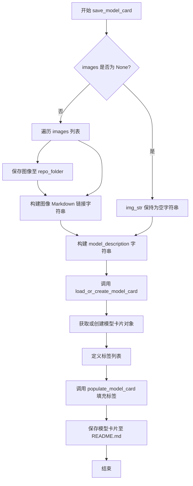
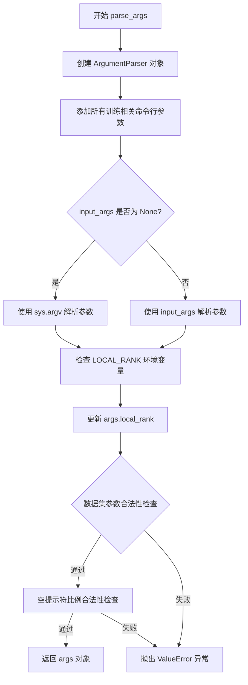

# `diffusers\examples\text_to_image\train_text_to_image_sdxl.py` 详细设计文档

这是一个用于在自定义数据集上微调 Stable Diffusion XL (SDXL) 文本到图像模型的训练脚本。它集成了 HuggingFace Diffusers 库，支持分布式训练、EMA、梯度检查点、混合精度以及基于时间步加权的采样策略。

## 整体流程

```mermaid
graph TD
    Start([开始]) --> ParseArgs[解析命令行参数 parse_args]
    ParseArgs --> Main[进入主函数 main]
    Main --> InitAccel[初始化 Accelerator, 设置日志和种子]
    InitAccel --> LoadModels[加载预训练模型: Tokenizer, TextEncoder, VAE, UNet, NoiseScheduler]
    LoadModels --> LoadDataset[加载数据集: 根据 dataset_name 或 train_data_dir]
    LoadDataset --> Preprocess[数据预处理: 图像变换、tokenization、VAE编码预计算]
    Preprocess --> CreateDataLoader[创建训练数据加载器 DataLoader]
    CreateDataLoader --> TrainLoop[开始训练循环 for epoch in range(...)]
    TrainLoop --> Step[单个步训练: 采样噪声 -> 加噪 -> 前向传播 -> 损失计算 -> 反向传播]
    Step --> Checkpoint{检查点保存?}
    Checkpoint -- 是 --> SaveCkpt[保存模型状态 accelerator.save_state]
    Checkpoint -- 否 --> Validation{是否验证?}
    Validation -- 是 --> RunVal[运行验证: 生成图像并记录]
    Validation -- 否 --> TrainLoop
    RunVal --> TrainLoop
    SaveCkpt --> TrainLoop
    TrainLoop --> Finish[训练结束]
    Finish --> SavePipeline[保存模型到本地: Pipeline.from_pretrained]
    SavePipeline --> PushHub[可选: 推送至 HuggingFace Hub]
    PushHub --> End([结束])
```

## 类结构

```
TrainingScript (主入口脚本)
├── 配置模块 (Configuration)
│   └── parse_args (参数解析器)
├── 工具函数 (Utils)
│   ├── import_model_class_from_model_name_or_path (模型类导入)
│   ├── encode_prompt (文本嵌入编码)
│   ├── compute_vae_encodings (图像VAE编码)
│   ├── generate_timestep_weights (时间步加权生成)
│   └── save_model_card (模型卡片生成)
└── 核心逻辑 (Core)
    └── main (训练主流程)
```

## 全局变量及字段


### `logger`
    
从accelerate库获取的日志记录器，用于记录训练过程中的调试和信息日志

类型：`logging.Logger`
    


### `DATASET_NAME_MAPPING`
    
数据集名称到列名的映射字典，定义特定数据集的图像列和文本列名称

类型：`dict`
    


### `is_torch_npu_available`
    
用于检查当前环境是否支持华为昇腾NPU设备的函数，返回布尔值

类型：`Callable[[], bool]`
    


    

## 全局函数及方法


### `save_model_card`

该函数用于在模型训练完成后生成并保存HuggingFace Hub的模型卡片（Model Card），包括示例图像、训练元数据描述以及标准化的标签信息，以便于模型发布和共享。

参数：

- `repo_id`：`str`，HuggingFace Hub上的模型仓库ID
- `images`：`list`，训练过程中生成的示例图像列表（可选）
- `validation_prompt`：`str`，用于生成示例图像的验证提示词（可选）
- `base_model`：`str`，微调所基于的预训练基础模型名称或路径（可选）
- `dataset_name`：`str`，用于微调训练的数据集名称（可选）
- `repo_folder`：`str`，本地仓库文件夹路径，用于保存模型卡片和图像文件（可选）
- `vae_path`：`str`，训练所使用的VAE模型路径（可选）

返回值：`None`，该函数无返回值，直接将模型卡片保存至文件系统

#### 流程图



#### 带注释源码

```python
def save_model_card(
    repo_id: str,
    images: list = None,
    validation_prompt: str = None,
    base_model: str = None,
    dataset_name: str = None,
    repo_folder: str = None,
    vae_path: str = None,
):
    """
    生成并保存 HuggingFace Hub 模型卡片
    
    该函数在模型训练完成后被调用，用于创建包含训练元数据、
    示例图像和标准化标签的模型卡片文档，并保存为 README.md
    """
    img_str = ""  # 初始化图像链接字符串
    if images is not None:
        # 遍历所有示例图像并保存到本地文件夹
        for i, image in enumerate(images):
            # 使用 PIL.Image.save 方法保存图像文件
            image.save(os.path.join(repo_folder, f"image_{i}.png"))
            # 构建 Markdown 格式的图像链接
            img_str += f"\n"

    # 构建模型描述文本，包含基础模型、数据集和示例图像信息
    model_description = f"""
# Text-to-image finetuning - {repo_id}

This pipeline was finetuned from **{base_model}** on the **{dataset_name}** dataset. Below are some example images generated with the finetuned pipeline using the following prompt: {validation_prompt}: \n
{img_str}

Special VAE used for training: {vae_path}.
"""

    # 从 diffusers.utils.hub_utils 导入的函数
    # 加载现有模型卡片或创建新卡片（from_training=True 表示从训练流程创建）
    model_card = load_or_create_model_card(
        repo_id_or_path=repo_id,
        from_training=True,
        license="creativeml-openrail-m",  # 指定许可证
        base_model=base_model,
        model_description=model_description,
        inference=True,  # 标记该模型支持推理
    )

    # 定义标准化的标签集合，用于模型分类和搜索
    tags = [
        "stable-diffusion-xl",
        "stable-diffusion-xl-diffusers",
        "text-to-image",
        "diffusers-training",
        "diffusers",
    ]
    # 填充模型卡片的标签字段
    model_card = populate_model_card(model_card, tags=tags)

    # 将模型卡片保存为 README.md 文件
    model_card.save(os.path.join(repo_folder, "README.md"))
```


### `import_model_class_from_model_name_or_path`

该函数用于根据预训练模型的配置文件动态导入对应的文本编码器类（CLIPTextModel 或 CLIPTextModelWithProjection），以支持 Stable Diffusion XL 模型的微调训练。

参数：

- `pretrained_model_name_or_path`：`str`，预训练模型的名称或路径，用于从 HuggingFace Hub 或本地加载模型配置
- `revision`：`str`，模型版本号，用于指定要加载的模型具体版本
- `subfolder`：`str`，默认为 "text_encoder"，配置文件所在的子文件夹路径（如 "text_encoder" 或 "text_encoder_2"）

返回值：`type`，返回对应的文本编码器类（`CLIPTextModel` 或 `CLIPTextModelWithProjection` 类型）

#### 流程图

```mermaid
flowchart TD
    A[开始: import_model_class_from_model_name_or_path] --> B[从预训练模型加载PretrainedConfig]
    B --> C[获取model_class = text_encoder_config.architectures[0]]
    C --> D{model_class == 'CLIPTextModel'?}
    D -->|是| E[导入CLIPTextModel类]
    D -->|否| F{model_class == 'CLIPTextModelWithProjection'?}
    F -->|是| G[导入CLIPTextModelWithProjection类]
    F -->|否| H[抛出ValueError异常]
    E --> I[返回CLIPTextModel类]
    G --> J[返回CLIPTextModelWithProjection类]
    I --> K[结束]
    J --> K
    H --> K
```

#### 带注释源码

```python
def import_model_class_from_model_name_or_path(
    pretrained_model_name_or_path: str, revision: str, subfolder: str = "text_encoder"
):
    """
    根据预训练模型的配置动态导入对应的文本编码器类。
    
    该函数首先从预训练模型路径加载配置文件，然后根据配置文件中
    指定的架构名称，返回对应的文本编码器类（CLIPTextModel 或 CLIPTextModelWithProjection）。
    
    参数:
        pretrained_model_name_or_path: 预训练模型的名称（如 "stabilityai/stable-diffusion-xl-base-1.0"）
                                      或本地模型路径
        revision: 模型版本号（如 "main" 或具体 commit hash）
        subfolder: 配置文件的子文件夹，默认值为 "text_encoder"，
                   对于双文本编码器模型，第二个编码器使用 "text_encoder_2"
    
    返回:
        对应的文本编码器类（CLIPTextModel 或 CLIPTextModelWithProjection）
    
    异常:
        ValueError: 当 model_class 不为支持的类型时抛出
    """
    # 步骤1: 从预训练模型路径加载文本编码器的预训练配置
    # PretrainedConfig 是 HuggingFace Transformers 库中的配置类
    # 用于加载模型的配置文件（如 config.json）
    text_encoder_config = PretrainedConfig.from_pretrained(
        pretrained_model_name_or_path,  # 模型名称或路径
        subfolder=subfolder,             # 指定子文件夹（如 text_encoder 或 text_encoder_2）
        revision=revision                # 版本/提交哈希
    )
    
    # 步骤2: 从配置中获取模型架构名称
    # architectures 是一个列表，通常包含一个元素，指示模型的具体架构类型
    model_class = text_encoder_config.architectures[0]
    
    # 步骤3: 根据架构名称动态导入并返回对应的模型类
    # Stable Diffusion XL 使用两种文本编码器：
    # - CLIPTextModel: 标准的 CLIP 文本编码器
    # - CLIPTextModelWithProjection: 带投影层的 CLIP 文本编码器（用于更精细的嵌入控制）
    
    if model_class == "CLIPTextModel":
        # 动态导入 transformers 库中的 CLIPTextModel 类
        from transformers import CLIPTextModel
        
        # 返回类对象而非实例，供后续使用 from_pretrained 加载模型权重
        return CLIPTextModel
    
    elif model_class == "CLIPTextModelWithProjection":
        # 动态导入 transformers 库中的 CLIPTextModelWithProjection 类
        from transformers import CLIPTextModelWithProjection
        
        return CLIPTextModelWithProjection
    
    else:
        # 如果遇到不支持的架构类型，抛出明确的错误信息
        raise ValueError(f"{model_class} is not supported.")
```


### parse_args

该函数是Stable Diffusion XL模型训练脚本的命令行参数解析器，负责定义和解析所有训练相关的配置参数，包括模型路径、数据集配置、训练超参数、优化器设置、验证选项等，并通过环境变量和合法性检查确保参数的合理性。

参数：

- `input_args`：`List[str]`，可选参数，用于测试目的的输入参数列表。如果为`None`，则从命令行（`sys.argv`）解析参数。

返回值：`Namespace`，返回一个包含所有解析后命令行参数的命名空间对象，用于后续训练流程的配置。

#### 流程图



#### 带注释源码

```python
def parse_args(input_args=None):
    """
    解析命令行参数，用于配置 Stable Diffusion XL 模型的微调训练。
    
    参数:
        input_args: 可选的参数列表，用于测试目的。如果为 None，则从命令行解析。
    
    返回:
        包含所有训练配置参数的命名空间对象。
    """
    # 创建 ArgumentParser 实例，设置脚本描述
    parser = argparse.ArgumentParser(description="Simple example of a training script.")
    
    # ========== 模型相关参数 ==========
    # 添加预训练模型名称或路径参数（必需）
    parser.add_argument(
        "--pretrained_model_name_or_path",
        type=str,
        default=None,
        required=True,
        help="Path to pretrained model or model identifier from huggingface.co/models.",
    )
    # 添加预训练 VAE 模型路径参数（可选，用于更好的数值稳定性）
    parser.add_argument(
        "--pretrained_vae_model_name_or_path",
        type=str,
        default=None,
        help="Path to pretrained VAE model with better numerical stability. More details: https://github.com/huggingface/diffusers/pull/4038.",
    )
    # 添加模型版本修订参数
    parser.add_argument(
        "--revision",
        type=str,
        default=None,
        required=False,
        help="Revision of pretrained model identifier from huggingface.co/models.",
    )
    # 添加模型变体参数（如 fp16）
    parser.add_argument(
        "--variant",
        type=str,
        default=None,
        help="Variant of the model files of the pretrained model identifier from huggingface.co/models, 'e.g.' fp16",
    )
    
    # ========== 数据集相关参数 ==========
    # 添加数据集名称参数（支持 HuggingFace Hub 或本地路径）
    parser.add_argument(
        "--dataset_name",
        type=str,
        default=None,
        help=(
            "The name of the Dataset (from the HuggingFace hub) to train on (could be your own, possibly private,"
            " dataset). It can also be a path pointing to a local copy of a dataset in your filesystem,"
            " or to a folder containing files that 🤗 Datasets can understand."
        ),
    )
    # 添加数据集配置名称参数
    parser.add_argument(
        "--dataset_config_name",
        type=str,
        default=None,
        help="The config of the Dataset, leave as None if there's only one config.",
    )
    # 添加训练数据目录参数（本地数据集）
    parser.add_argument(
        "--train_data_dir",
        type=str,
        default=None,
        help=(
            "A folder containing the training data. Folder contents must follow the structure described in"
            " https://huggingface.co/docs/datasets/image_dataset#imagefolder. In particular, a `metadata.jsonl` file"
            " must exist to provide the captions for the images. Ignored if `dataset_name` is specified."
        ),
    )
    # 添加图像列名参数
    parser.add_argument(
        "--image_column", type=str, default="image", help="The column of the dataset containing an image."
    )
    # 添加 caption 列名参数
    parser.add_argument(
        "--caption_column",
        type=str,
        default="text",
        help="The column of the dataset containing a caption or a list of captions.",
    )
    
    # ========== 验证相关参数 ==========
    # 添加验证提示词参数
    parser.add_argument(
        "--validation_prompt",
        type=str,
        default=None,
        help="A prompt that is used during validation to verify that the model is learning.",
    )
    # 添加验证图像数量参数
    parser.add_argument(
        "--num_validation_images",
        type=int,
        default=4,
        help="Number of images that should be generated during validation with `validation_prompt`.",
    )
    # 添加验证周期参数
    parser.add_argument(
        "--validation_epochs",
        type=int,
        default=1,
        help=(
            "Run fine-tuning validation every X epochs. The validation process consists of running the prompt"
            " `args.validation_prompt` multiple times: `args.num_validation_images`."
        ),
    )
    
    # ========== 训练样本限制参数 ==========
    # 添加最大训练样本数参数（用于调试或加速训练）
    parser.add_argument(
        "--max_train_samples",
        type=int,
        default=None,
        help=(
            "For debugging purposes or quicker training, truncate the number of training examples to this "
            "value if set."
        ),
    )
    # 添加空提示符比例参数（用于无分类器自由引导的微调）
    parser.add_argument(
        "--proportion_empty_prompts",
        type=float,
        default=0,
        help="Proportion of image prompts to be replaced with empty strings. Defaults to 0 (no prompt replacement).",
    )
    
    # ========== 输出和存储相关参数 ==========
    # 添加输出目录参数
    parser.add_argument(
        "--output_dir",
        type=str,
        default="sdxl-model-finetuned",
        help="The output directory where the model predictions and checkpoints will be written.",
    )
    # 添加缓存目录参数
    parser.add_argument(
        "--cache_dir",
        type=str,
        default=None,
        help="The directory where the downloaded models and datasets will be stored.",
    )
    # 添加随机种子参数
    parser.add_argument("--seed", type=int, default=None, help="A seed for reproducible training.")
    
    # ========== 图像处理参数 ==========
    # 添加分辨率参数
    parser.add_argument(
        "--resolution",
        type=int,
        default=1024,
        help=(
            "The resolution for input images, all the images in the train/validation dataset will be resized to this"
            " resolution"
        ),
    )
    # 添加中心裁剪参数
    parser.add_argument(
        "--center_crop",
        default=False,
        action="store_true",
        help=(
            "Whether to center crop the input images to the resolution. If not set, the images will be randomly"
            " cropped. The images will be resized to the resolution first before cropping."
        ),
    )
    # 添加随机翻转参数
    parser.add_argument(
        "--random_flip",
        action="store_true",
        help="whether to randomly flip images horizontally",
    )
    # 添加图像插值模式参数
    parser.add_argument(
        "--image_interpolation_mode",
        type=str,
        default="lanczos",
        choices=[
            f.lower() for f in dir(transforms.InterpolationMode) if not f.startswith("__") and not f.endswith("__")
        ],
        help="The image interpolation method to use for resizing images.",
    )
    
    # ========== 训练超参数 ==========
    # 添加训练批次大小参数
    parser.add_argument(
        "--train_batch_size", type=int, default=16, help="Batch size (per device) for the training dataloader."
    )
    # 添加训练轮数参数
    parser.add_argument("--num_train_epochs", type=int, default=100)
    # 添加最大训练步数参数（可覆盖轮数设置）
    parser.add_argument(
        "--max_train_steps",
        type=int,
        default=None,
        help="Total number of training steps to perform.  If provided, overrides num_train_epochs.",
    )
    # 添加梯度累积步数参数
    parser.add_argument(
        "--gradient_accumulation_steps",
        type=int,
        default=1,
        help="Number of updates steps to accumulate before performing a backward/update pass.",
    )
    # 添加梯度检查点参数（节省显存）
    parser.add_argument(
        "--gradient_checkpointing",
        action="store_true",
        help="Whether or not to use gradient checkpointing to save memory at the expense of slower backward pass.",
    )
    
    # ========== 学习率相关参数 ==========
    # 添加学习率参数
    parser.add_argument(
        "--learning_rate",
        type=float,
        default=1e-4,
        help="Initial learning rate (after the potential warmup period) to use.",
    )
    # 添加学习率缩放参数
    parser.add_argument(
        "--scale_lr",
        action="store_true",
        default=False,
        help="Scale the learning rate by the number of GPUs, gradient accumulation steps, and batch size.",
    )
    # 添加学习率调度器类型参数
    parser.add_argument(
        "--lr_scheduler",
        type=str,
        default="constant",
        help=(
            'The scheduler type to use. Choose between ["linear", "cosine", "cosine_with_restarts", "polynomial",'
            ' "constant", "constant_with_warmup"]'
        ),
    )
    # 添加学习率预热步数参数
    parser.add_argument(
        "--lr_warmup_steps", type=int, default=500, help="Number of steps for the warmup in the lr scheduler."
    )
    
    # ========== 时间步偏置参数（用于控制噪声调度）==========
    # 添加时间步偏置策略参数
    parser.add_argument(
        "--timestep_bias_strategy",
        type=str,
        default="none",
        choices=["earlier", "later", "range", "none"],
        help=(
            "The timestep bias strategy, which may help direct the model toward learning low or high frequency details."
            " Choices: ['earlier', 'later', 'range', 'none']."
            " The default is 'none', which means no bias is applied, and training proceeds normally."
            " The value of 'later' will increase the frequency of the model's final training timesteps."
        ),
    )
    # 添加时间步偏置乘数参数
    parser.add_argument(
        "--timestep_bias_multiplier",
        type=float,
        default=1.0,
        help=(
            "The multiplier for the bias. Defaults to 1.0, which means no bias is applied."
            " A value of 2.0 will double the weight of the bias, and a value of 0.5 will halve it."
        ),
    )
    # 添加时间步偏置起始点参数
    parser.add_argument(
        "--timestep_bias_begin",
        type=int,
        default=0,
        help=(
            "When using `--timestep_bias_strategy=range`, the beginning (inclusive) timestep to bias."
            " Defaults to zero, which equates to having no specific bias."
        ),
    )
    # 添加时间步偏置结束点参数
    parser.add_argument(
        "--timestep_bias_end",
        type=int,
        default=1000,
        help=(
            "When using `--timestep_bias_strategy=range`, the final timestep (inclusive) to bias."
            " Defaults to 1000, which is the number of timesteps that Stable Diffusion is trained on."
        ),
    )
    # 添加时间步偏置比例参数
    parser.add_argument(
        "--timestep_bias_portion",
        type=float,
        default=0.25,
        help=(
            "The portion of timesteps to bias. Defaults to 0.25, which 25% of timesteps will be biased."
            " A value of 0.5 will bias one half of the timesteps. The value provided for `--timestep_bias_strategy` determines"
            " whether the biased portions are in the earlier or later timesteps."
        ),
    )
    
    # ========== SNR 加权参数 ==========
    # 添加 SNR Gamma 参数
    parser.add_argument(
        "--snr_gamma",
        type=float,
        default=None,
        help="SNR weighting gamma to be used if rebalancing the loss. Recommended value is 5.0. "
        "More details here: https://huggingface.co/papers/2303.09556.",
    )
    
    # ========== EMA 和性能优化参数 ==========
    # 添加 EMA 使用参数
    parser.add_argument("--use_ema", action="store_true", help="Whether to use EMA model.")
    # 添加 TF32 允许参数
    parser.add_argument(
        "--allow_tf32",
        action="store_true",
        help=(
            "Whether or not to allow TF32 on Ampere GPUs. Can be used to speed up training. For more information, see"
            " https://pytorch.org/docs/stable/notes/cuda.html#tensorfloat-32-tf32-on-ampere-devices"
        ),
    )
    # 添加数据加载器工作进程数参数
    parser.add_argument(
        "--dataloader_num_workers",
        type=int,
        default=0,
        help=(
            "Number of subprocesses to use for data loading. 0 means that the data will be loaded in the main process."
        ),
    )
    # 添加 NPU Flash Attention 启用参数
    parser.add_argument(
        "--enable_npu_flash_attention", action="store_true", help="Whether or not to use npu flash attention."
    )
    # 添加 xformers 内存高效注意力启用参数
    parser.add_argument(
        "--enable_xformers_memory_efficient_attention", action="store_true", help="Whether or not to use xformers."
    )
    # 添加噪声偏移参数
    parser.add_argument("--noise_offset", type=float, default=0, help="The scale of noise offset.")
    
    # ========== Adam 优化器参数 ==========
    # 添加 8-bit Adam 使用参数
    parser.add_argument(
        "--use_8bit_adam", action="store_true", help="Whether or not to use 8-bit Adam from bitsandbytes."
    )
    # 添加 Adam beta1 参数
    parser.add_argument("--adam_beta1", type=float, default=0.9, help="The beta1 parameter for the Adam optimizer.")
    # 添加 Adam beta2 参数
    parser.add_argument("--adam_beta2", type=float, default=0.999, help="The beta2 parameter for the Adam optimizer.")
    # 添加 Adam 权重衰减参数
    parser.add_argument("--adam_weight_decay", type=float, default=1e-2, help="Weight decay to use.")
    # 添加 Adam epsilon 参数
    parser.add_argument("--adam_epsilon", type=float, default=1e-08, help="Epsilon value for the Adam optimizer")
    # 添加最大梯度范数参数
    parser.add_argument("--max_grad_norm", default=1.0, type=float, help="Max gradient norm.")
    
    # ========== Hub 相关参数 ==========
    # 添加推送到 Hub 参数
    parser.add_argument("--push_to_hub", action="store_true", help="Whether or not to push the model to the Hub.")
    # 添加 Hub token 参数
    parser.add_argument("--hub_token", type=str, default=None, help="The token to use to push to the Model Hub.")
    # 添加 Hub 模型 ID 参数
    parser.add_argument(
        "--hub_model_id",
        type=str,
        default=None,
        help="The name of the repository to keep in sync with the local `output_dir`.",
    )
    
    # ========== 日志和监控参数 ==========
    # 添加日志目录参数
    parser.add_argument(
        "--logging_dir",
        type=str,
        default="logs",
        help=(
            "[TensorBoard](https://www.tensorflow.org/tensorboard) log directory. Will default to"
            " *output_dir/runs/**CURRENT_DATETIME_HOSTNAME***."
        ),
    )
    # 添加报告目标参数
    parser.add_argument(
        "--report_to",
        type=str,
        default="tensorboard",
        help=(
            'The integration to report the results and logs to. Supported platforms are `"tensorboard"`'
            ' (default), `"wandb"` and `"comet_ml"`. Use `"all"` to report to all integrations.'
        ),
    )
    
    # ========== 混合精度训练参数 ==========
    # 添加混合精度参数
    parser.add_argument(
        "--mixed_precision",
        type=str,
        default=None,
        choices=["no", "fp16", "bf16"],
        help=(
            "Whether to use mixed precision. Choose between fp16 and bf16 (bfloat16). Bf16 requires PyTorch >="
            " 1.10.and an Nvidia Ampere GPU.  Default to the value of accelerate config of the current system or the"
            " flag passed with the `accelerate.launch` command. Use this argument to override the accelerate config."
        ),
    )
    # 添加本地排名参数（分布式训练）
    parser.add_argument("--local_rank", type=int, default=-1, help="For distributed training: local_rank")
    
    # ========== 检查点相关参数 ==========
    # 添加检查点保存步数参数
    parser.add_argument(
        "--checkpointing_steps",
        type=int,
        default=500,
        help=(
            "Save a checkpoint of the training state every X updates. These checkpoints can be used both as final"
            " checkpoints in case they are better than the last checkpoint, and are also suitable for resuming"
            " training using `--resume_from_checkpoint`."
        ),
    )
    # 添加检查点总数限制参数
    parser.add_argument(
        "--checkpoints_total_limit",
        type=int,
        default=None,
        help=("Max number of checkpoints to store."),
    )
    # 添加从检查点恢复参数
    parser.add_argument(
        "--resume_from_checkpoint",
        type=str,
        default=None,
        help=(
            "Whether training should be resumed from a previous checkpoint. Use a path saved by"
            ' `--checkpointing_steps`, or `"latest"` to automatically select the last available checkpoint.'
        ),
    )
    
    # ========== 预测类型参数 ==========
    # 添加预测类型参数
    parser.add_argument(
        "--prediction_type",
        type=str,
        default=None,
        help="The prediction_type that shall be used for training. Choose between 'epsilon' or 'v_prediction' or leave `None`. If left to `None` the default prediction type of the scheduler: `noise_scheduler.config.prediction_type` is chosen.",
    )
    
    # ========== 解析参数 ==========
    # 根据 input_args 是否为空选择解析方式
    if input_args is not None:
        args = parser.parse_args(input_args)  # 用于测试：解析指定参数列表
    else:
        args = parser.parse_args()  # 生产环境：从 sys.argv 解析
    
    # ========== 环境变量覆盖 ==========
    # 检查 LOCAL_RANK 环境变量，如果存在则覆盖命令行参数
    env_local_rank = int(os.environ.get("LOCAL_RANK", -1))
    if env_local_rank != -1 and env_local_rank != args.local_rank:
        args.local_rank = env_local_rank
    
    # ========== 合法性检查（Sanity Checks）==========
    # 检查数据集参数：必须提供数据集名称或训练目录之一
    if args.dataset_name is None and args.train_data_dir is None:
        raise ValueError("Need either a dataset name or a training folder.")
    
    # 检查空提示符比例：必须在 [0, 1] 范围内
    if args.proportion_empty_prompts < 0 or args.proportion_empty_prompts > 1:
        raise ValueError("`--proportion_empty_prompts` must be in the range [0, 1].")
    
    # 返回解析后的参数对象
    return args
```


### `encode_prompt`

该函数用于将文本提示（caption）转换为文本嵌入向量（prompt embeddings），支持双文本编码器（Stable Diffusion XL 的 text_encoder 和 text_encoder_2），同时处理空提示替换和多提示选择逻辑。

参数：

- `batch`：`Dict`，包含批次数据的字典，必须包含 `caption_column` 指定的键
- `text_encoders`：`List[CLIPTextModel]`，文本编码器列表，通常包含两个编码器（CLIPTextModel 和 CLIPTextModelWithProjection）
- `tokenizers`：`List[AutoTokenizer]`，分词器列表，与文本编码器一一对应
- `proportion_empty_prompts`：`float`，用于替换为空字符串的提示比例，范围 [0, 1]
- `caption_column`：`str`，批次中包含提示文本的列名
- `is_train`：`bool`，训练模式标志，为 True 时从多个提示中随机选择，否则选择第一个

返回值：`Dict`，包含以下键的字典：
- `prompt_embeds`：`torch.Tensor`，形状为 `(batch_size, seq_len, hidden_dim)` 的文本嵌入
- `pooled_prompt_embeds`：`torch.Tensor`，形状为 `(batch_size, hidden_dim)` 的池化文本嵌入

#### 流程图

```mermaid
flowchart TD
    A[开始 encode_prompt] --> B[从 batch 中提取 caption_column 数据]
    B --> C{遍历每个 caption}
    C --> D{random.random < proportion_empty_prompts}
    D -->|是| E[添加空字符串]
    D -->|否| F{isinstance caption, str}
    F -->|是| G[直接添加 caption]
    F -->|否| H{isinstance caption, list 或 ndarray}
    H -->|是| I{random.choice caption if is_train else caption[0]}
    I --> G
    H -->|否| J[跳过或添加空字符串]
    C --> K[所有 captions 处理完成]
    K --> L[遍历 tokenizers 和 text_encoders]
    L --> M[tokenizer 分词: padding=max_length, truncation=True, return_tensors=pt]
    M --> N[提取 input_ids 并移动到设备]
    N --> O[text_encoder 前向传播: output_hidden_states=True]
    O --> P[提取 pooled_prompt_embeds = outputs[0]]
    P --> Q[提取 prompt_embeds = outputs[-1][-2]]
    Q --> R[reshape prompt_embeds]
    R --> S[添加到 prompt_embeds_list]
    L --> T{是否还有更多编码器}
    T -->|是| L
    T -->|否| U[torch.concat prompt_embeds_list]
    U --> V[reshape pooled_prompt_embeds]
    V --> W[移动到 CPU]
    W --> X[返回 Dict prompt_embeds, pooled_prompt_embeds]
```

#### 带注释源码

```python
# Adapted from pipelines.StableDiffusionXLPipeline.encode_prompt
def encode_prompt(batch, text_encoders, tokenizers, proportion_empty_prompts, caption_column, is_train=True):
    """
    将文本提示编码为文本嵌入向量
    
    参数:
        batch: 包含图像数据的批次字典
        text_encoders: 文本编码器列表（通常为两个：text_encoder 和 text_encoder_2）
        tokenizers: 分词器列表，与编码器一一对应
        proportion_empty_prompts: 空提示替换比例
        caption_column: 提示文本所在的列名
        is_train: 是否训练模式（训练模式随机选择多提示）
    """
    prompt_embeds_list = []  # 存储每个编码器输出的嵌入
    prompt_batch = batch[caption_column]  # 获取提示文本批次

    captions = []
    for caption in prompt_batch:
        # 根据 proportion_empty_prompts 概率将提示替换为空字符串
        if random.random() < proportion_empty_prompts:
            captions.append("")
        elif isinstance(caption, str):
            # 直接使用字符串提示
            captions.append(caption)
        elif isinstance(caption, (list, np.ndarray)):
            # 如果是列表/数组，训练时随机选择一个，验证时选择第一个
            captions.append(random.choice(caption) if is_train else caption[0])

    # 禁用梯度计算以加速推理
    with torch.no_grad():
        # 遍历每个文本编码器（SDXL 有两个文本编码器）
        for tokenizer, text_encoder in zip(tokenizers, text_encoders):
            # 使用分词器将文本转换为 token IDs
            text_inputs = tokenizer(
                captions,
                padding="max_length",  # 填充到最大长度
                max_length=tokenizer.model_max_length,  # 使用模型最大长度
                truncation=True,  # 截断过长文本
                return_tensors="pt",  # 返回 PyTorch 张量
            )
            text_input_ids = text_inputs.input_ids
            
            # 通过文本编码器获取嵌入
            # output_hidden_states=True 要求返回所有隐藏状态
            prompt_embeds = text_encoder(
                text_input_ids.to(text_encoder.device),
                output_hidden_states=True,
                return_dict=False,
            )

            # 我们只关心最后一个文本编码器的池化输出
            # prompt_embeds[0] 是池化后的输出 (batch_size, hidden_dim)
            pooled_prompt_embeds = prompt_embeds[0]
            
            # prompt_embeds[-1] 是最后一层隐藏状态列表
            # [-2] 是倒数第二层（SDXL 使用倒数第二层作为条件嵌入）
            # 形状: (batch_size, seq_len, hidden_dim)
            prompt_embeds = prompt_embeds[-1][-2]
            bs_embed, seq_len, _ = prompt_embeds.shape
            # 重新整形为 (batch_size, seq_len, hidden_dim)
            prompt_embeds = prompt_embeds.view(bs_embed, seq_len, -1)
            prompt_embeds_list.append(prompt_embeds)

    # 沿最后一个维度拼接两个编码器的嵌入
    # 最终形状: (batch_size, seq_len, hidden_dim1 + hidden_dim2)
    prompt_embeds = torch.concat(prompt_embeds_list, dim=-1)
    
    # 池化嵌入重塑为 (batch_size, hidden_dim)
    pooled_prompt_embeds = pooled_prompt_embeds.view(bs_embed, -1)
    
    # 返回嵌入字典，移至 CPU 以释放 GPU 内存
    return {"prompt_embeds": prompt_embeds.cpu(), "pooled_prompt_embeds": pooled_prompt_embeds.cpu()}
```


### `compute_vae_encodings`

该函数用于将图像批次的像素值通过VAE编码器转换为潜在空间的表示（latent representations），以便后续用于Stable Diffusion XL模型的训练。

参数：

- `batch`：`Dict`，包含像素值的批次数据字典，其中"pixel_values"键对应图像数据
- `vae`：`AutoencoderKL`，预训练的VAE模型实例，用于对图像进行编码

返回值：`Dict`，返回一个包含"model_input"键的字典，其值为经过VAE编码并缩放后的潜在表示（tensor），已移至CPU

#### 流程图

```mermaid
flowchart TD
    A[输入: batch, vae] --> B[从batch中提取pixel_values]
    B --> C[将图像堆叠为tensor]
    C --> D[转换为连续内存格式并转为float类型]
    D --> E[将数据移动到VAE设备并转换dtype]
    E --> F[使用VAE.encode编码像素值]
    F --> G[从latent_dist中采样]
    G --> H[乘以VAE scaling_factor进行缩放]
    H --> I[将结果移至CPU]
    I --> J[返回: {model_input: tensor}]
```

#### 带注释源码

```python
def compute_vae_encodings(batch, vae):
    """
    将图像批次的像素值编码为VAE潜在表示
    
    参数:
        batch: 包含'pixel_values'键的字典,存储图像数据
        vae: 预训练的AutoencoderKL模型
    
    返回:
        包含模型输入的字典,值为编码后的潜在表示
    """
    # 从batch中弹出pixel_values键,获取图像数据
    images = batch.pop("pixel_values")
    
    # 将图像列表堆叠为一个批次tensor
    pixel_values = torch.stack(list(images))
    
    # 确保tensor内存连续并转换为float32类型
    pixel_values = pixel_values.to(memory_format=torch.contiguous_format).float()
    
    # 将数据移动到VAE所在设备,并转换为VAE的数据类型
    pixel_values = pixel_values.to(vae.device, dtype=vae.dtype)

    # 禁用梯度计算,仅进行推理
    with torch.no_grad():
        # 使用VAE编码器将像素值编码到潜在空间
        # 返回latent_dist对象,包含潜在变量的分布参数
        model_input = vae.encode(pixel_values).latent_dist.sample()
    
    # 根据VAE配置中的scaling_factor对潜在表示进行缩放
    # 这是Stable Diffusion VAE的标准处理方式
    model_input = model_input * vae.config.scaling_factor

    # 将潜在表示移回CPU,以便与其他数据集合并存储
    # 注意: 注释中提到使用accelerator.gather可能有轻微性能提升
    return {"model_input": model_input.cpu()}
```


### `generate_timestep_weights`

该函数用于在扩散模型训练过程中生成时间步（timesteps）的采样权重。通过调整不同的偏差策略（如聚焦于早期或晚期的去噪阶段），可以引导模型优先学习某些频率的特征。

参数：

-  `args`：`argparse.Namespace`，包含时间步偏差配置的对象。主要字段包括 `timestep_bias_strategy`（策略：'earlier', 'later', 'range', 'none'）、`timestep_bias_multiplier`（权重乘数）、`timestep_bias_portion`（偏差比例）和 `timestep_bias_begin`/`timestep_bias_end`（范围策略的起止值）。
-  `num_timesteps`：`int`，扩散模型训练的总时间步数（通常为 1000）。

返回值：`torch.Tensor`，返回一个新的 1 维张量，包含了每个时间步的归一化权重（概率分布），总和为 1.0。

#### 流程图

```mermaid
graph TD
    A([开始: 输入 args, num_timesteps]) --> B[初始化 weights = torch.ones(num_timesteps)]
    B --> C[计算需偏差的数量: num_to_bias = portion * num_timesteps]
    C --> D{判断策略: timestep_bias_strategy}
    
    D -->|none| E[直接返回 weights]
    D -->|later| F[设置 bias_indices = slice(-num_to_bias, None)]
    D -->|earlier| G[设置 bias_indices = slice(0, num_to_bias)]
    D -->|range| H[校验范围 begin/end; 设置 bias_indices = slice(begin, end)]
    
    F --> I{检查 multiplier > 0?}
    G --> I
    H --> I
    
    I -->|否| J[抛出或返回错误 (原始代码存在返回ValueError对象的潜在BUG)]
    I -->|是| K[weights[bias_indices] *= multiplier]
    K --> L[归一化 weights: weights /= weights.sum()]
    L --> M([返回 weights])
    
    E --> M
```

#### 带注释源码

```python
def generate_timestep_weights(args, num_timesteps):
    """
    根据配置生成时间步采样权重，用于有偏采样。
    """
    # 1. 初始化均匀权重 (所有时间步权重为1)
    weights = torch.ones(num_timesteps)

    # 2. 计算需要施加偏差的时间步数量
    # 例如：1000步 * 0.25 = 250步需要被偏向
    num_to_bias = int(args.timestep_bias_portion * num_timesteps)

    # 3. 根据策略确定需要修改权重的时间步索引
    if args.timestep_bias_strategy == "later":
        # 偏向后期 (高噪声/大 timestep)
        bias_indices = slice(-num_to_bias, None)
    elif args.timestep_bias_strategy == "earlier":
        # 偏向前期 (低噪声/小 timestep)
        bias_indices = slice(0, num_to_bias)
    elif args.timestep_bias_strategy == "range":
        # 偏向指定范围 [begin, end]
        range_begin = args.timestep_bias_begin
        range_end = args.timestep_bias_end
        
        # 参数校验
        if range_begin < 0:
            raise ValueError("Range strategy requires begin >= 0.")
        if range_end > num_timesteps:
            raise ValueError("Range strategy requires end < num_timesteps.")
            
        bias_indices = slice(range_begin, range_end)
    else: 
        # 策略为 'none' 或其他不支持的字符串，直接返回均匀分布
        return weights

    # 4. 校验乘数 (必须大于0，否则失去训练意义)
    if args.timestep_bias_multiplier <= 0:
        # 注意：原代码此处逻辑有误，使用了 return ValueError(...) 
        # 正确做法应为 raise ValueError(...)
        return ValueError(
            "The parameter --timestep_bias_multiplier is not intended to be used to disable the training of specific timesteps."
            " If it was intended to disable timestep bias, use `--timestep_bias_strategy none` instead."
            " A timestep bias multiplier less than or equal to 0 is not allowed."
        )

    # 5. 应用偏差乘数到选定的时间步
    weights[bias_indices] *= args.timestep_bias_multiplier

    # 6. 归一化权重，使其符合概率分布 (sum to 1)
    # 这样 torch.multinomial 就能根据权重采样
    weights /= weights.sum()

    return weights
```


### `main`

该函数是 Stable Diffusion XL 微调脚本的核心入口，负责整个文本到图像模型的训练流程，包括环境初始化、模型加载、数据集预处理、预计算嵌入、训练循环、验证推理和模型保存。

参数：

- `args`：`argparse.Namespace`，包含所有训练配置参数，如模型路径 (`pretrained_model_name_or_path`)、输出目录 (`output_dir`)、训练批次大小 (`train_batch_size`)、学习率 (`learning_rate`)、 epoch 数 (`num_train_epochs`) 等。

返回值：`None`，该函数无返回值，执行完成后直接退出。

#### 流程图

```mermaid
flowchart TD
    A[开始 main 函数] --> B{验证 args.report_to 和 hub_token}
    B -->|冲突| C[抛出 ValueError]
    B -->|正常| D[创建 logging_dir 和 ProjectConfiguration]
    E[初始化 Accelerator] --> F{检查 MPS + bf16}
    F -->|不支持| G[抛出 ValueError]
    F -->|支持| H[创建 Accelerator 实例]
    H --> I[配置日志级别]
    I --> J{args.seed 是否设置}
    J -->|是| K[调用 set_seed 设置随机种子]
    J -->|否| L[跳过]
    K --> M{accelerator.is_main_process}
    M -->|是| N[创建输出目录]
    M -->|否| O[跳过]
    N --> P{push_to_hub}
    P -->|是| Q[创建 Hub 仓库]
    P -->|否| R[继续]
    Q --> R
    R --> S[加载 tokenizers 和 text_encoders]
    S --> T[加载 noise_scheduler, vae, unet]
    T --> U[冻结 vae 和 text_encoders, unet 设置为可训练]
    U --> V[设置 weight_dtype]
    V --> W[移动模型到设备]
    W --> X{use_ema}
    X -->|是| Y[创建 EMA 模型]
    X -->|否| Z[跳过]
    Y --> AA[启用 NPU Flash Attention 或 xformers]
    AA --> AB[注册 save/load model hooks]
    AB --> AC[启用 gradient_checkpointing]
    AC --> AD[启用 TF32]
    AD --> AE[缩放学习率]
    AE --> AF[创建 optimizer]
    AF --> AG[加载数据集]
    AG --> AH[预处理数据集]
    AH --> AI[预计算 text embeddings 和 VAE encodings]
    AI --> AJ[删除 text_encoders, vae 释放内存]
    AJ --> AK[创建 DataLoader]
    AK --> AL[创建 lr_scheduler]
    AL --> AM[使用 accelerator.prepare 准备模型]
    AM --> AN{use_ema}
    AN -->|是| AO[移动 EMA 到设备]
    AN -->|否| AP[跳过]
    AO --> AQ[初始化 trackers]
    AP --> AQ
    AQ --> AR{resume_from_checkpoint}
    AR -->|是| AS[加载 checkpoint 状态]
    AR -->|否| AT[初始化 global_step=0, first_epoch=0]
    AS --> AU[进入训练循环]
    AT --> AU
    AU --> AV[遍历 epochs]
    AV --> AW{epoch < num_train_epochs}
    AW -->|是| AX[遍历 train_dataloader]
    AW -->|否| AY[训练结束]
    AX --> AZ[accumulate unet]
    AZ --> BA[采样噪声]
    BB[添加 noise_offset] --> BC[采样 timesteps]
    BC --> BD[前向扩散: noisy_model_input]
    BD --> BE[计算 time_ids]
    BE --> BF[UNet 预测噪声残差]
    BF --> BG[计算目标值]
    BG --> BH{计算 loss]
    BH --> BI[计算 MSE loss 或 SNR weighted loss]
    BI --> BJ[反向传播]
    BJ --> BK[clip gradients]
    BK --> BL[optimizer step]
    BL --> BM[lr_scheduler step]
    BM --> BN[optimizer zero_grad]
    BN --> BO{同步梯度]
    BO -->|是| BP[更新 EMA]
    BO -->|否| BQ[跳过]
    BP --> BR[更新 progress_bar]
    BR --> BS{checkpointing]
    BS -->|是| BT[保存状态]
    BS -->|否| BU[跳过]
    BT --> BV{达到 max_train_steps}
    BV -->|是| BW[break]
    BV -->|否| BX[继续训练]
    BX --> AX
    BW --> BY{validation_prompt}
    BY -->|是| BZ[执行验证生成图像]
    BY -->|否| CA[跳过]
    BZ --> CB[记录验证结果]
    CB --> CC{is_main_process}
    CC -->|是| CD[保存最终模型]
    CC -->|否| CE[跳过]
    CD --> CF{push_to_hub}
    CF -->|是| CG[保存 model card 并上传]
    CF -->|否| CH[结束]
    CG --> CH
    AY --> CC
    CE --> CC
```

#### 带注释源码

```python
def main(args):
    """
    Stable Diffusion XL 微调训练的主函数。
    
    该函数执行完整的训练流程：
    1. 初始化分布式训练环境 (Accelerator)
    2. 加载预训练模型 (tokenizers, text encoders, VAE, UNet)
    3. 准备数据集并预计算 embeddings
    4. 执行训练循环
    5. 进行验证推理 (可选)
    6. 保存微调后的模型
    
    参数:
        args: argparse.Namespace, 包含所有训练配置参数
    """
    
    # ---------------------------------------------------------------------
    # 第一部分：参数验证与环境初始化
    # ---------------------------------------------------------------------
    
    # 检查 wandb 和 hub_token 的安全风险，不能同时使用
    if args.report_to == "wandb" and args.hub_token is not None:
        raise ValueError(
            "You cannot use both --report_to=wandb and --hub_token due to a security risk of exposing your token."
            " Please use `hf auth login` to authenticate with the Hub."
        )

    # 构建日志输出目录，格式为 output_dir/logs
    logging_dir = Path(args.output_dir, args.logging_dir)

    # 创建 Accelerator 项目配置
    accelerator_project_config = ProjectConfiguration(project_dir=args.output_dir, logging_dir=logging_dir)

    # MPS (Apple Silicon) 不支持 bfloat16 混合精度
    if torch.backends.mps.is_available() and args.mixed_precision == "bf16":
        raise ValueError(
            "Mixed precision training with bfloat16 is not supported on MPS. Please use fp16 (recommended) or fp32 instead."
        )

    # 初始化 Accelerator：处理分布式训练、混合精度、梯度累积等
    accelerator = Accelerator(
        gradient_accumulation_steps=args.gradient_accumulation_steps,
        mixed_precision=args.mixed_precision,
        log_with=args.report_to,
        project_config=accelerator_project_config,
    )

    # MPS 上禁用 AMP (Automatic Mixed Precision)
    if torch.backends.mps.is_available():
        accelerator.native_amp = False

    # 导入 wandb 用于日志记录
    if args.report_to == "wandb":
        if not is_wandb_available():
            raise ImportError("Make sure to install wandb if you want to use it for logging during training.")
        import wandb

    # 配置日志格式：时间 - 级别 - 进程名 - 消息息
    logging.basicConfig(
        format="%(asctime)s - %(levelname)s - %(name)s - %(message)s",
        datefmt="%m/%d/%Y %H:%M:%S",
        level=logging.INFO,
    )
    # 输出 Accelerator 状态
    logger.info(accelerator.state, main_process_only=False)
    
    # 主进程设置日志级别为更详细
    if accelerator.is_local_main_process:
        datasets.utils.logging.set_verbosity_warning()
        transformers.utils.logging.set_verbosity_warning()
        diffusers.utils.logging.set_verbosity_info()
    else:
        datasets.utils.logging.set_verbosity_error()
        transformers.utils.logging.set_verbosity_error()
        diffusers.utils.logging.set_verbosity_error()

    # 设置随机种子以确保可重复训练
    if args.seed is not None:
        set_seed(args.seed)

    # ---------------------------------------------------------------------
    # 第二部分：创建输出目录和 Hub 仓库
    # ---------------------------------------------------------------------
    
    # 仅在主进程创建输出目录
    if accelerator.is_main_process:
        if args.output_dir is not None:
            os.makedirs(args.output_dir, exist_ok=True)

        # 如果需要推送到 HuggingFace Hub，创建远程仓库
        if args.push_to_hub:
            repo_id = create_repo(
                repo_id=args.hub_model_id or Path(args.output_dir).name, exist_ok=True, token=args.hub_token
            ).repo_id

    # ---------------------------------------------------------------------
    # 第三部分：加载模型和分词器
    # ---------------------------------------------------------------------
    
    # 加载两个分词器 (SDXL 使用两个文本编码器)
    tokenizer_one = AutoTokenizer.from_pretrained(
        args.pretrained_model_name_or_path,
        subfolder="tokenizer",
        revision=args.revision,
        use_fast=False,
    )
    tokenizer_two = AutoTokenizer.from_pretrained(
        args.pretrained_model_name_or_path,
        subfolder="tokenizer_2",
        revision=args.revision,
        use_fast=False,
    )

    # 导入正确的文本编码器类 (CLIPTextModel 或 CLIPTextModelWithProjection)
    text_encoder_cls_one = import_model_class_from_model_name_or_path(
        args.pretrained_model_name_or_path, args.revision
    )
    text_encoder_cls_two = import_model_class_from_model_name_or_path(
        args.pretrained_model_name_or_path, args.revision, subfolder="text_encoder_2"
    )

    # 加载噪声调度器 (DDPMScheduler)
    noise_scheduler = DDPMScheduler.from_pretrained(args.pretrained_model_name_or_path, subfolder="scheduler")
    
    # 加载文本编码器
    text_encoder_one = text_encoder_cls_one.from_pretrained(
        args.pretrained_model_name_or_path, subfolder="text_encoder", revision=args.revision, variant=args.variant
    )
    text_encoder_two = text_encoder_cls_two.from_pretrained(
        args.pretrained_model_name_or_path, subfolder="text_encoder_2", revision=args.revision, variant=args.variant
    )
    
    # 确定 VAE 路径
    vae_path = (
        args.pretrained_model_name_or_path
        if args.pretrained_vae_model_name_or_path is None
        else args.pretrained_vae_model_name_or_path
    )
    
    # 加载 VAE
    vae = AutoencoderKL.from_pretrained(
        vae_path,
        subfolder="vae" if args.pretrained_vae_model_name_or_path is None else None,
        revision=args.revision,
        variant=args.variant,
    )
    
    # 加载 UNet
    unet = UNet2DConditionModel.from_pretrained(
        args.pretrained_model_name_or_path, subfolder="unet", revision=args.revision, variant=args.variant
    )

    # 冻结 VAE 和文本编码器 (这些参数不参与训练)
    vae.requires_grad_(False)
    text_encoder_one.requires_grad_(False)
    text_encoder_two.requires_grad_(False)
    # UNet 设置为可训练
    unet.train()

    # 设置权重数据类型 (用于混合精度训练)
    weight_dtype = torch.float32
    if accelerator.mixed_precision == "fp16":
        weight_dtype = torch.float16
    elif accelerator.mixed_precision == "bf16":
        weight_dtype = torch.bfloat16

    # 将模型移动到设备并转换数据类型
    # VAE 保持 float32 以避免 NaN 损失
    vae.to(accelerator.device, dtype=torch.float32)
    text_encoder_one.to(accelerator.device, dtype=weight_dtype)
    text_encoder_two.to(accelerator.device, dtype=weight_dtype)

    # ---------------------------------------------------------------------
    # 第四部分：EMA (指数移动平均) 和高效注意力
    # ---------------------------------------------------------------------
    
    # 创建 EMA 版本的 UNet
    if args.use_ema:
        ema_unet = UNet2DConditionModel.from_pretrained(
            args.pretrained_model_name_or_path, subfolder="unet", revision=args.revision, variant=args.variant
        )
        ema_unet = EMAModel(ema_unet.parameters(), model_cls=UNet2DConditionModel, model_config=ema_unet.config)
    
    # 启用 NPU Flash Attention
    if args.enable_npu_flash_attention:
        if is_torch_npu_available():
            logger.info("npu flash attention enabled.")
            unet.enable_npu_flash_attention()
        else:
            raise ValueError("npu flash attention requires torch_npu extensions and is supported only on npu devices.")
    
    # 启用 xformers 高效注意力
    if args.enable_xformers_memory_efficient_attention:
        if is_xformers_available():
            import xformers
            xformers_version = version.parse(xformers.__version__)
            if xformers_version == version.parse("0.0.16"):
                logger.warning(
                    "xFormers 0.0.16 cannot be used for training in some GPUs. If you observe problems during training, please update xFormers to at least 0.0.17."
                )
            unet.enable_xformers_memory_efficient_attention()
        else:
            raise ValueError("xformers is not available. Make sure it is installed correctly")

    # ---------------------------------------------------------------------
    # 第五部分：注册自定义模型保存/加载钩子
    # ---------------------------------------------------------------------
    
    # 为 accelerate 注册自定义保存和加载钩子
    if version.parse(accelerate.__version__) >= version.parse("0.16.0"):
        
        def save_model_hook(models, weights, output_dir):
            """保存模型的自定义钩子"""
            if accelerator.is_main_process:
                if args.use_ema:
                    ema_unet.save_pretrained(os.path.join(output_dir, "unet_ema"))

                for i, model in enumerate(models):
                    model.save_pretrained(os.path.join(output_dir, "unet"))
                    # 弹出权重以避免重复保存
                    if weights:
                        weights.pop()

        def load_model_hook(models, input_dir):
            """加载模型的自定义钩子"""
            if args.use_ema:
                load_model = EMAModel.from_pretrained(os.path.join(input_dir, "unet_ema"), UNet2DConditionModel)
                ema_unet.load_state_dict(load_model.state_dict())
                ema_unet.to(accelerator.device)
                del load_model

            for _ in range(len(models)):
                model = models.pop()
                # 以 diffusers 风格加载模型
                load_model = UNet2DConditionModel.from_pretrained(input_dir, subfolder="unet")
                model.register_to_config(**load_model.config)
                model.load_state_dict(load_model.state_dict())
                del load_model

        accelerator.register_save_state_pre_hook(save_model_hook)
        accelerator.register_load_state_pre_hook(load_model_hook)

    # 启用梯度检查点以节省内存
    if args.gradient_checkpointing:
        unet.enable_gradient_checkpointing()

    # 启用 TF32 以加速 Ampere GPU 训练
    if args.allow_tf32:
        torch.backends.cuda.matmul.allow_tf32 = True

    # 缩放学习率 (根据 GPU 数量、梯度累积步数和批次大小)
    if args.scale_lr:
        args.learning_rate = (
            args.learning_rate * args.gradient_accumulation_steps * args.train_batch_size * accelerator.num_processes
        )

    # ---------------------------------------------------------------------
    # 第六部分：创建优化器
    # ---------------------------------------------------------------------
    
    # 使用 8-bit Adam 以节省显存
    if args.use_8bit_adam:
        try:
            import bitsandbytes as bnb
        except ImportError:
            raise ImportError(
                "To use 8-bit Adam, please install the bitsandbytes library: `pip install bitsandbytes`."
            )
        optimizer_class = bnb.optim.AdamW8bit
    else:
        optimizer_class = torch.optim.AdamW

    # 创建优化器
    params_to_optimize = unet.parameters()
    optimizer = optimizer_class(
        params_to_optimize,
        lr=args.learning_rate,
        betas=(args.adam_beta1, args.adam_beta2),
        weight_decay=args.adam_weight_decay,
        eps=args.adam_epsilon,
    )

    # ---------------------------------------------------------------------
    # 第七部分：加载和预处理数据集
    # ---------------------------------------------------------------------
    
    # 从 Hub 加载数据集或本地文件夹
    if args.dataset_name is not None:
        dataset = load_dataset(
            args.dataset_name, args.dataset_config_name, cache_dir=args.cache_dir, data_dir=args.train_data_dir
        )
    else:
        data_files = {}
        if args.train_data_dir is not None:
            data_files["train"] = os.path.join(args.train_data_dir, "**")
        dataset = load_dataset(
            "imagefolder",
            data_files=data_files,
            cache_dir=args.cache_dir,
        )

    # 获取数据集列名
    column_names = dataset["train"].column_names

    # 确定图像和 caption 列名
    dataset_columns = DATASET_NAME_MAPPING.get(args.dataset_name, None)
    if args.image_column is None:
        image_column = dataset_columns[0] if dataset_columns is not None else column_names[0]
    else:
        image_column = args.image_column
        if image_column not in column_names:
            raise ValueError(f"--image_column' value '{args.image_column}' needs to be one of: {', '.join(column_names)}")
    
    if args.caption_column is None:
        caption_column = dataset_columns[1] if dataset_columns is not None else column_names[1]
    else:
        caption_column = args.caption_column
        if caption_column not in column_names:
            raise ValueError(f"--caption_column' value '{args.caption_column}' needs to be one of: {', '.join(column_names)}")

    # 创建图像预处理转换
    interpolation = getattr(transforms.InterpolationMode, args.image_interpolation_mode.upper(), None)
    if interpolation is None:
        raise ValueError(f"Unsupported interpolation mode {interpolation=}.")
    train_resize = transforms.Resize(args.resolution, interpolation=interpolation)
    train_crop = transforms.CenterCrop(args.resolution) if args.center_crop else transforms.RandomCrop(args.resolution)
    train_flip = transforms.RandomHorizontalFlip(p=1.0)
    train_transforms = transforms.Compose([transforms.ToTensor(), transforms.Normalize([0.5], [0.5])])

    # 定义训练数据预处理函数
    def preprocess_train(examples):
        """预处理训练数据：图像增强、裁剪、归一化"""
        images = [image.convert("RGB") for image in examples[image_column]]
        original_sizes = []
        all_images = []
        crop_top_lefts = []
        for image in images:
            original_sizes.append((image.height, image.width))
            image = train_resize(image)
            if args.random_flip and random.random() < 0.5:
                image = train_flip(image)
            if args.center_crop:
                y1 = max(0, int(round((image.height - args.resolution) / 2.0)))
                x1 = max(0, int(round((image.width - args.resolution) / 2.0)))
                image = train_crop(image)
            else:
                y1, x1, h, w = train_crop.get_params(image, (args.resolution, args.resolution))
                image = crop(image, y1, x1, h, w)
            crop_top_left = (y1, x1)
            crop_top_lefts.append(crop_top_left)
            image = train_transforms(image)
            all_images.append(image)

        examples["original_sizes"] = original_sizes
        examples["crop_top_lefts"] = crop_top_lefts
        examples["pixel_values"] = all_images
        return examples

    # 应用预处理转换
    with accelerator.main_process_first():
        if args.max_train_samples is not None:
            dataset["train"] = dataset["train"].shuffle(seed=args.seed).select(range(args.max_train_samples))
        train_dataset = dataset["train"].with_transform(preprocess_train)

    # ---------------------------------------------------------------------
    # 第八部分：预计算文本嵌入和 VAE 编码
    # ---------------------------------------------------------------------
    
    # 保存文本编码器和分词器引用
    text_encoders = [text_encoder_one, text_encoder_two]
    tokenizers = [tokenizer_one, tokenizer_two]
    
    # 创建部分应用函数用于批量处理
    compute_embeddings_fn = functools.partial(
        encode_prompt,
        text_encoders=text_encoders,
        tokenizers=tokenizers,
        proportion_empty_prompts=args.proportion_empty_prompts,
        caption_column=args.caption_column,
    )
    compute_vae_encodings_fn = functools.partial(compute_vae_encodings, vae=vae)
    
    # 预计算 embeddings 和 VAE 编码
    with accelerator.main_process_first():
        from datasets.fingerprint import Hasher

        new_fingerprint = Hasher.hash(args)
        new_fingerprint_for_vae = Hasher.hash((vae_path, args))
        
        # 预计算文本嵌入
        train_dataset_with_embeddings = train_dataset.map(
            compute_embeddings_fn, batched=True, new_fingerprint=new_fingerprint
        )
        # 预计算 VAE 编码
        train_dataset_with_vae = train_dataset.map(
            compute_vae_encodings_fn,
            batched=True,
            batch_size=args.train_batch_size,
            new_fingerprint=new_fingerprint_for_vae,
        )
        
        # 合并数据集
        precomputed_dataset = concatenate_datasets(
            [train_dataset_with_embeddings, train_dataset_with_vae.remove_columns(["image", "text"])], axis=1
        )
        precomputed_dataset = precomputed_dataset.with_transform(preprocess_train)

    # 删除文本编码器和 VAE 以释放显存
    del compute_vae_encodings_fn, compute_embeddings_fn, text_encoder_one, text_encoder_two
    del text_encoders, tokenizers, vae
    gc.collect()
    if is_torch_npu_available():
        torch_npu.npu.empty_cache()
    elif torch.cuda.is_available():
        torch.cuda.empty_cache()

    # 定义批处理整理函数
    def collate_fn(examples):
        """整理批次数据"""
        model_input = torch.stack([torch.tensor(example["model_input"]) for example in examples])
        original_sizes = [example["original_sizes"] for example in examples]
        crop_top_lefts = [example["crop_top_lefts"] for example in examples]
        prompt_embeds = torch.stack([torch.tensor(example["prompt_embeds"]) for example in examples])
        pooled_prompt_embeds = torch.stack([torch.tensor(example["pooled_prompt_embeds"]) for example in examples])

        return {
            "model_input": model_input,
            "prompt_embeds": prompt_embeds,
            "pooled_prompt_embeds": pooled_prompt_embeds,
            "original_sizes": original_sizes,
            "crop_top_lefts": crop_top_lefts,
        }

    # 创建 DataLoader
    train_dataloader = torch.utils.data.DataLoader(
        precomputed_dataset,
        shuffle=True,
        collate_fn=collate_fn,
        batch_size=args.train_batch_size,
        num_workers=args.dataloader_num_workers,
    )

    # ---------------------------------------------------------------------
    # 第九部分：学习率调度器和准备训练
    # ---------------------------------------------------------------------
    
    # 计算每 epoch 的更新步数
    overrode_max_train_steps = False
    num_update_steps_per_epoch = math.ceil(len(train_dataloader) / args.gradient_accumulation_steps)
    if args.max_train_steps is None:
        args.max_train_steps = args.num_train_epochs * num_update_steps_per_epoch
        overrode_max_train_steps = True

    # 创建学习率调度器
    lr_scheduler = get_scheduler(
        args.lr_scheduler,
        optimizer=optimizer,
        num_warmup_steps=args.lr_warmup_steps * args.gradient_accumulation_steps,
        num_training_steps=args.max_train_steps * args.gradient_accumulation_steps,
    )

    # 使用 accelerator 准备所有组件
    unet, optimizer, train_dataloader, lr_scheduler = accelerator.prepare(
        unet, optimizer, train_dataloader, lr_scheduler
    )

    # 如果使用 EMA，将 EMA 模型也移动到设备
    if args.use_ema:
        ema_unet.to(accelerator.device)

    # 重新计算训练步数 (因为 dataloader 大小可能改变)
    num_update_steps_per_epoch = math.ceil(len(train_dataloader) / args.gradient_accumulation_steps)
    if overrode_max_train_steps:
        args.max_train_steps = args.num_train_epochs * num_update_steps_per_epoch
    args.num_train_epochs = math.ceil(args.max_train_steps / num_update_steps_per_epoch)

    # 初始化 trackers (如 TensorBoard, WandB)
    if accelerator.is_main_process:
        accelerator.init_trackers("text2image-fine-tune-sdxl", config=vars(args))

    # .unwrap_model 辅助函数
    def unwrap_model(model):
        """解包模型，处理 torch.compile() 的情况"""
        model = accelerator.unwrap_model(model)
        model = model._orig_mod if is_compiled_module(model) else model
        return model

    # 根据设备类型设置 autocast 上下文
    if torch.backends.mps.is_available() or "playground" in args.pretrained_model_name_or_path:
        autocast_ctx = nullcontext()
    else:
        autocast_ctx = torch.autocast(accelerator.device.type)

    # ---------------------------------------------------------------------
    # 第十部分：训练循环
    # ---------------------------------------------------------------------
    
    total_batch_size = args.train_batch_size * accelerator.num_processes * args.gradient_accumulation_steps

    logger.info("***** Running training *****")
    logger.info(f"  Num examples = {len(precomputed_dataset)}")
    logger.info(f"  Num Epochs = {args.num_train_epochs}")
    logger.info(f"  Instantaneous batch size per device = {args.train_batch_size}")
    logger.info(f"  Total train batch size (w. parallel, distributed & accumulation) = {total_batch_size}")
    logger.info(f"  Gradient Accumulation steps = {args.gradient_accumulation_steps}")
    logger.info(f"  Total optimization steps = {args.max_train_steps}")
    
    global_step = 0
    first_epoch = 0

    # 从 checkpoint 恢复训练 (如果指定)
    if args.resume_from_checkpoint:
        if args.resume_from_checkpoint != "latest":
            path = os.path.basename(args.resume_from_checkpoint)
        else:
            dirs = os.listdir(args.output_dir)
            dirs = [d for d in dirs if d.startswith("checkpoint")]
            dirs = sorted(dirs, key=lambda x: int(x.split("-")[1]))
            path = dirs[-1] if len(dirs) > 0 else None

        if path is None:
            accelerator.print(f"Checkpoint '{args.resume_from_checkpoint}' does not exist. Starting a new training run.")
            args.resume_from_checkpoint = None
            initial_global_step = 0
        else:
            accelerator.print(f"Resuming from checkpoint {path}")
            accelerator.load_state(os.path.join(args.output_dir, path))
            global_step = int(path.split("-")[1])
            initial_global_step = global_step
            first_epoch = global_step // num_update_steps_per_epoch
    else:
        initial_global_step = 0

    # 创建进度条
    progress_bar = tqdm(
        range(0, args.max_train_steps),
        initial=initial_global_step,
        desc="Steps",
        disable=not accelerator.is_local_main_process,
    )

    # 主训练循环
    for epoch in range(first_epoch, args.num_train_epochs):
        train_loss = 0.0
        for step, batch in enumerate(train_dataloader):
            with accelerator.accumulate(unet):
                # 1. 采样噪声
                model_input = batch["model_input"].to(accelerator.device)
                noise = torch.randn_like(model_input)
                if args.noise_offset:
                    noise += args.noise_offset * torch.randn(
                        (model_input.shape[0], model_input.shape[1], 1, 1), device=model_input.device
                    )

                # 2. 采样 timesteps
                bsz = model_input.shape[0]
                if args.timestep_bias_strategy == "none":
                    timesteps = torch.randint(
                        0, noise_scheduler.config.num_train_timesteps, (bsz,), device=model_input.device
                    )
                else:
                    weights = generate_timestep_weights(args, noise_scheduler.config.num_train_timesteps).to(
                        model_input.device
                    )
                    timesteps = torch.multinomial(weights, bsz, replacement=True).long()

                # 3. 前向扩散过程
                noisy_model_input = noise_scheduler.add_noise(model_input, noise, timesteps).to(dtype=weight_dtype)

                # 4. 计算 time_ids
                def compute_time_ids(original_size, crops_coords_top_left):
                    target_size = (args.resolution, args.resolution)
                    add_time_ids = list(original_size + crops_coords_top_left + target_size)
                    add_time_ids = torch.tensor([add_time_ids], device=accelerator.device, dtype=weight_dtype)
                    return add_time_ids

                add_time_ids = torch.cat(
                    [compute_time_ids(s, c) for s, c in zip(batch["original_sizes"], batch["crop_top_lefts"])]
                )

                # 5. UNet 预测噪声残差
                unet_added_conditions = {"time_ids": add_time_ids}
                prompt_embeds = batch["prompt_embeds"].to(accelerator.device, dtype=weight_dtype)
                pooled_prompt_embeds = batch["pooled_prompt_embeds"].to(accelerator.device)
                unet_added_conditions.update({"text_embeds": pooled_prompt_embeds})
                model_pred = unet(
                    noisy_model_input,
                    timesteps,
                    prompt_embeds,
                    added_cond_kwargs=unet_added_conditions,
                    return_dict=False,
                )[0]

                # 6. 确定目标值
                if args.prediction_type is not None:
                    noise_scheduler.register_to_config(prediction_type=args.prediction_type)

                if noise_scheduler.config.prediction_type == "epsilon":
                    target = noise
                elif noise_scheduler.config.prediction_type == "v_prediction":
                    target = noise_scheduler.get_velocity(model_input, noise, timesteps)
                elif noise_scheduler.config.prediction_type == "sample":
                    target = model_input
                    model_pred = model_pred - noise
                else:
                    raise ValueError(f"Unknown prediction type {noise_scheduler.config.prediction_type}")

                # 7. 计算损失
                if args.snr_gamma is None:
                    loss = F.mse_loss(model_pred.float(), target.float(), reduction="mean")
                else:
                    snr = compute_snr(noise_scheduler, timesteps)
                    mse_loss_weights = torch.stack([snr, args.snr_gamma * torch.ones_like(timesteps)], dim=1).min(
                        dim=1
                    )[0]
                    if noise_scheduler.config.prediction_type == "epsilon":
                        mse_loss_weights = mse_loss_weights / snr
                    elif noise_scheduler.config.prediction_type == "v_prediction":
                        mse_loss_weights = mse_loss_weights / (snr + 1)

                    loss = F.mse_loss(model_pred.float(), target.float(), reduction="none")
                    loss = loss.mean(dim=list(range(1, len(loss.shape)))) * mse_loss_weights
                    loss = loss.mean()

                # 8. 反向传播
                avg_loss = accelerator.gather(loss.repeat(args.train_batch_size)).mean()
                train_loss += avg_loss.item() / args.gradient_accumulation_steps

                accelerator.backward(loss)
                if accelerator.sync_gradients:
                    params_to_clip = unet.parameters()
                    accelerator.clip_grad_norm_(params_to_clip, args.max_grad_norm)
                optimizer.step()
                lr_scheduler.step()
                optimizer.zero_grad()

            # 9. 检查优化步骤并保存 checkpoint
            if accelerator.sync_gradients:
                if args.use_ema:
                    ema_unet.step(unet.parameters())
                progress_bar.update(1)
                global_step += 1
                accelerator.log({"train_loss": train_loss}, step=global_step)
                train_loss = 0.0

                # 保存检查点
                if accelerator.distributed_type == DistributedType.DEEPSPEED or accelerator.is_main_process:
                    if global_step % args.checkpointing_steps == 0:
                        # 限制保存的 checkpoint 数量
                        if args.checkpoints_total_limit is not None:
                            checkpoints = os.listdir(args.output_dir)
                            checkpoints = [d for d in checkpoints if d.startswith("checkpoint")]
                            checkpoints = sorted(checkpoints, key=lambda x: int(x.split("-")[1]))

                            if len(checkpoints) >= args.checkpoints_total_limit:
                                num_to_remove = len(checkpoints) - args.checkpoints_total_limit + 1
                                removing_checkpoints = checkpoints[0:num_to_remove]
                                for removing_checkpoint in removing_checkpoints:
                                    removing_checkpoint = os.path.join(args.output_dir, removing_checkpoint)
                                    shutil.rmtree(removing_checkpoint)

                        save_path = os.path.join(args.output_dir, f"checkpoint-{global_step}")
                        accelerator.save_state(save_path)
                        logger.info(f"Saved state to {save_path}")

            # 更新进度条
            logs = {"step_loss": loss.detach().item(), "lr": lr_scheduler.get_last_lr()[0]}
            progress_bar.set_postfix(**logs)

            if global_step >= args.max_train_steps:
                break

        # ---------------------------------------------------------------------
        # 第十一部分：验证循环 (可选)
        # ---------------------------------------------------------------------
        
        if accelerator.is_main_process:
            if args.validation_prompt is not None and epoch % args.validation_epochs == 0:
                logger.info(
                    f"Running validation... \n Generating {args.num_validation_images} images with prompt:"
                    f" {args.validation_prompt}."
                )
                
                # 使用 EMA 模型进行验证
                if args.use_ema:
                    ema_unet.store(unet.parameters())
                    ema_unet.copy_to(unet.parameters())

                # 创建 pipeline
                vae = AutoencoderKL.from_pretrained(
                    vae_path,
                    subfolder="vae" if args.pretrained_vae_model_name_or_path is None else None,
                    revision=args.revision,
                    variant=args.variant,
                )
                pipeline = StableDiffusionXLPipeline.from_pretrained(
                    args.pretrained_model_name_or_path,
                    vae=vae,
                    unet=accelerator.unwrap_model(unet),
                    revision=args.revision,
                    variant=args.variant,
                    torch_dtype=weight_dtype,
                )
                if args.prediction_type is not None:
                    scheduler_args = {"prediction_type": args.prediction_type}
                    pipeline.scheduler = pipeline.scheduler.from_config(pipeline.scheduler.config, **scheduler_args)

                pipeline = pipeline.to(accelerator.device)
                pipeline.set_progress_bar_config(disable=True)

                # 运行推理
                generator = (
                    torch.Generator(device=accelerator.device).manual_seed(args.seed)
                    if args.seed is not None
                    else None
                )
                pipeline_args = {"prompt": args.validation_prompt}

                with autocast_ctx:
                    images = [
                        pipeline(**pipeline_args, generator=generator, num_inference_steps=25).images[0]
                        for _ in range(args.num_validation_images)
                    ]

                # 记录验证结果
                for tracker in accelerator.trackers:
                    if tracker.name == "tensorboard":
                        np_images = np.stack([np.asarray(img) for img in images])
                        tracker.writer.add_images("validation", np_images, epoch, dataformats="NHWC")
                    if tracker.name == "wandb":
                        tracker.log(
                            {
                                "validation": [
                                    wandb.Image(image, caption=f"{i}: {args.validation_prompt}")
                                    for i, image in enumerate(images)
                                ]
                            }
                        )

                del pipeline
                if is_torch_npu_available():
                    torch_npu.npu.empty_cache()
                elif torch.cuda.is_available():
                    torch.cuda.empty_cache()

                # 恢复原始 UNet 参数
                if args.use_ema:
                    ema_unet.restore(unet.parameters())

    # ---------------------------------------------------------------------
    # 第十二部分：保存最终模型
    # ---------------------------------------------------------------------
    
    accelerator.wait_for_everyone()
    if accelerator.is_main_process:
        unet = unwrap_model(unet)
        if args.use_ema:
            ema_unet.copy_to(unet.parameters())

        # 序列化 pipeline
        vae = AutoencoderKL.from_pretrained(
            vae_path,
            subfolder="vae" if args.pretrained_vae_model_name_or_path is None else None,
            revision=args.revision,
            variant=args.variant,
            torch_dtype=weight_dtype,
        )
        pipeline = StableDiffusionXLPipeline.from_pretrained(
            args.pretrained_model_name_or_path,
            unet=unet,
            vae=vae,
            revision=args.revision,
            variant=args.variant,
            torch_dtype=weight_dtype,
        )
        if args.prediction_type is not None:
            scheduler_args = {"prediction_type": args.prediction_type}
            pipeline.scheduler = pipeline.scheduler.from_config(pipeline.scheduler.config, **scheduler_args)
        pipeline.save_pretrained(args.output_dir)

        # 运行推理生成样本图像
        images = []
        if args.validation_prompt and args.num_validation_images > 0:
            pipeline = pipeline.to(accelerator.device)
            generator = (
                torch.Generator(device=accelerator.device).manual_seed(args.seed) if args.seed is not None else None
            )

            with autocast_ctx:
                images = [
                    pipeline(args.validation_prompt, num_inference_steps=25, generator=generator).images[0]
                    for _ in range(args.num_validation_images)
                ]

            for tracker in accelerator.trackers:
                if tracker.name == "tensorboard":
                    np_images = np.stack([np.asarray(img) for img in images])
                    tracker.writer.add_images("test", np_images, epoch, dataformats="NHWC")
                if tracker.name == "wandb":
                    tracker.log(
                        {
                            "test": [
                                wandb.Image(image, caption=f"{i}: {args.validation_prompt}")
                                for i, image in enumerate(images)
                            ]
                        }
                    )

        # 推送到 Hub
        if args.push_to_hub:
            save_model_card(
                repo_id=repo_id,
                images=images,
                validation_prompt=args.validation_prompt,
                base_model=args.pretrained_model_name_or_path,
                dataset_name=args.dataset_name,
                repo_folder=args.output_dir,
                vae_path=args.pretrained_vae_model_name_or_path,
            )
            upload_folder(
                repo_id=repo_id,
                folder_path=args.output_dir,
                commit_message="End of training",
                ignore_patterns=["step_*", "epoch_*"],
            )

    accelerator.end_training()
```

## 关键组件


### 张量索引与惰性加载

代码实现了预计算嵌入和VAE编码的惰性加载机制，通过`datasets.map`函数预先计算文本嵌入和图像潜在表示，并使用指纹缓存机制避免重复计算。训练时通过自定义collate函数将预计算的tensor重新堆叠使用，实现内存高效的数据加载。

### 反量化支持

代码支持多种混合精度训练模式，包括fp16和bf16 (bfloat16)。通过`weight_dtype`变量动态选择精度，VAE保持float32以避免NaN损失，而UNet和文本编码器根据配置转换为对应精度。同时支持TF32加速以提升Ampere GPU上的训练速度。

### 量化策略

使用8-bit Adam优化器(`bitsandbytes`)实现量化训练，通过`AdamW8bit`类减少显存占用。权重根据训练阶段动态选择精度：推理组件保持高精度，训练组件使用混合精度，实现显存与精度的平衡。

### EMA (指数移动平均)

使用`diffusers.training_utils.EMAModel`维护UNet参数的指数移动平均，通过`ema_unet.step()`在每个优化步骤更新，通过`store/copy_to/restore`机制在验证时切换EMA参数与原始参数。

### 噪声调度与时间步偏置

实现多种timestep bias策略，包括"earlier"、"later"、"range"和"none"，通过`generate_timestep_weights`函数计算加权采样概率，支持自定义偏置起始点、结束点和强度，允许多数时间步用于特定训练阶段。

### 分布式训练与加速

基于Accelerator实现多GPU分布式训练，支持DeepSpeed加速。通过`gradient_checkpointing`节省显存、`enable_xformers_memory_efficient_attention`使用高效注意力机制、启用NPU Flash Attention等优化技术。

### 检查点与恢复机制

实现定期检查点保存和基于`checkpoints_total_limit`的自动清理，支持从指定路径或最新检查点恢复训练，通过`resume_from_checkpoint`参数控制。

### 数据预处理管道

完整的图像预处理流程包括：Resize到指定分辨率、随机或中心裁剪、随机水平翻转、转换为tensor并归一化到[-1,1]。同时记录原始尺寸和裁剪坐标用于推理时的时间ID计算。


## 问题及建议


### 已知问题

-   **`generate_timestep_weights` 函数存在语法错误**：第 289 行返回 `ValueError(...)` 而不是 `raise ValueError(...)`，导致函数在某些条件下返回异常对象而非抛出异常，训练会继续执行但产生错误结果。
-   **VAE 重复加载**：VAE 模型在训练初始化、验证推理和最终保存时被重复加载了三次（第 592、952、1004 行），浪费内存和加载时间。
-   **collate_fn 效率低下**：使用 `torch.tensor()` 从 Python 列表创建张量，而非直接在 GPU 上堆叠预计算的张量，导致不必要的数据类型转换和复制。
-   **SNR 计算存在潜在除零风险**：第 879 行当 `snr` 为 0 时可能导致除零错误。
-   **硬编码的推理步数**：推理步骤数硬编码为 25（第 975 行），无法通过命令行参数调整。
-   **缺失的参数校验**：未对 `--checkpoints_total_limit`、`--max_train_steps` 等关键参数进行有效范围校验。

### 优化建议

-   **修复 `generate_timestep_weights` 错误**：将第 289 行的 `return ValueError(...)` 改为 `raise ValueError(...)`。
-   **提取 VAE 加载为独立函数**：创建 `load_vae()` 辅助函数，避免在代码中多次重复相同加载逻辑。
-   **优化 collate_fn**：使用 `torch.stack([example["model_input"] for example in examples])` 直接从张量列表创建，避免 `torch.tensor()` 包装。
-   **添加 SNR 校验**：在 SNR 计算前添加检查，确保 `snr` 值大于 0，或使用 `torch.where` 处理边界情况。
-   **参数化推理步数**：添加 `--num_inference_steps` 命令行参数，允许用户自定义验证时的推理步数。
-   **增强参数校验**：在 `parse_args` 函数中添加对 `--checkpoints_total_limit > 0`、`--max_train_steps > 0` 等的参数范围校验。
-   **优化验证循环**：抽取验证管线创建逻辑为独立函数，减少代码重复并提升可维护性。
-   **启用梯度检查点验证**：在训练开始前校验 `gradient_checkpointing` 与 `mixed_precision` 的兼容性组合。
-   **使用 `accelerator.gather` 优化 VAE 编码**：在 `compute_vae_encodings` 中使用 `accelerator.gather` 替代 `.cpu()`，可提升分布式训练下的性能。

## 其它


### 设计目标与约束

本脚本的设计目标是为Stable Diffusion XL模型提供完整的文本到图像微调训练流程，支持单GPU和多GPU分布式训练。核心约束包括：1) 必须使用PyTorch 2.0+和diffusers 0.37.0.dev0及以上版本；2) 支持FP16和BF16混合精度训练，但BF16不支持MPS设备；3) 训练数据需包含图像和对应的文本描述列；4) 模型权重保存格式遵循diffusers库规范；5) 梯度累积步数、训练批次大小和学习率需根据GPU显存进行适配。

### 错误处理与异常设计

代码在多个关键位置实现了错误处理机制。在参数解析阶段，parse_args函数对数据集参数、空提示比例范围进行校验，缺失必要参数时抛出ValueError。在模型加载阶段，import_model_class_from_model_name_or_path对不支持的文本编码器类型抛出ValueError。分布式训练环境检测通过os.environ.get("LOCAL_RANK")实现，确保local_rank参数与环境变量一致。xFormers版本检查在启用内存高效注意力时进行，对0.0.16版本发出警告。NPU和CUDA缓存清理使用条件判断避免在非对应设备上调用。训练过程中的异常主要通过accelerator的自动重试和检查点恢复机制处理。

### 数据流与状态机

训练数据流经过以下阶段：1) 数据集加载阶段通过load_dataset获取原始数据；2) 预处理阶段执行图像resize、center_crop/random_crop、horizontal_flip和数据类型转换；3) 嵌入预计算阶段使用text_encoder生成prompt_embeds和pooled_prompt_embeds，使用vae.encode生成latent表示；4) 训练阶段每个batch从dataloader取出，经过噪声添加、timestep采样、时间ID计算、UNet前向推理、损失计算和反向传播；5) 验证阶段在指定epoch使用训练好的UNet生成样本图像；6) 保存阶段将模型权重和配置保存到output_dir。状态机主要体现在训练循环的epoch-step结构、检查点保存/加载逻辑、以及EMA模型参数的切换使用。

### 外部依赖与接口契约

主要外部依赖包括：1) diffusers库提供StableDiffusionXLPipeline、UNet2DConditionModel、AutoencoderKL、DDPMScheduler、EMAModel等核心组件；2) transformers库提供AutoTokenizer、CLIPTextModel、CLIPTextModelWithProjection；3) accelerate库提供分布式训练、混合精度、模型保存/加载钩子；4) datasets库提供数据集加载和预处理；5) bitsandbytes库用于8位Adam优化器（可选）；6) xformers库用于内存高效注意力机制（可选）；7) torch_npu库用于华为NPU支持（可选）。接口契约遵循HuggingFace Hub模型上传规范，模型保存采用diffusers标准的文件夹结构（包含model_index.json、scheduler、unet、vae、text_encoder等子文件夹）。

### 性能优化策略

代码实现了多项性能优化：1) 预计算文本嵌入和VAE编码，将文本编码器和VAE从训练循环中移除以节省显存；2) 梯度检查点技术在内存和计算时间间权衡；3) xFormers和NPU Flash Attention提供更高效的注意力计算；4) 混合精度训练（FP16/BF16）减少显存占用和加速计算；5) 8位Adam优化器降低优化器状态显存占用；6) 梯度累积实现大有效批次训练；7) EMA模型提供更稳定的训练过程。SNR加权损失和时间步偏置策略可帮助模型聚焦特定频率特征学习。

### 版本兼容性说明

代码最低依赖版本要求：diffusers>=0.37.0.dev0、PyTorch>=2.0、transformers、accelerate>=0.16.0（用于自定义保存/加载钩子）。对accelerate 0.16.0+版本使用了register_save_state_pre_hook和register_load_state_pre_hook接口。xFormers 0.0.16版本存在已知训练问题，建议使用0.0.17及以上版本。TF32加速仅在Ampere架构GPU上支持。BF16混合精度在Apple MPS设备上不支持。

    