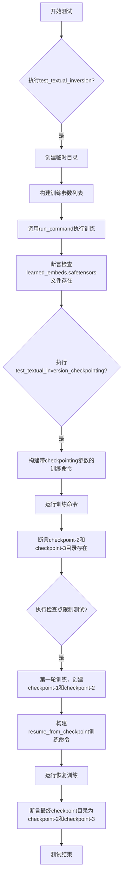
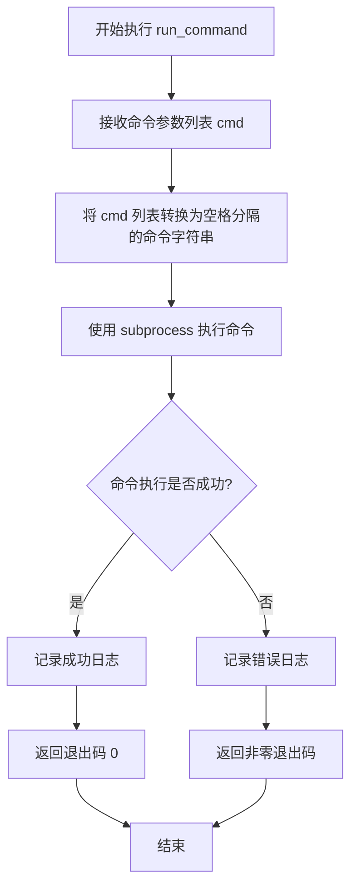
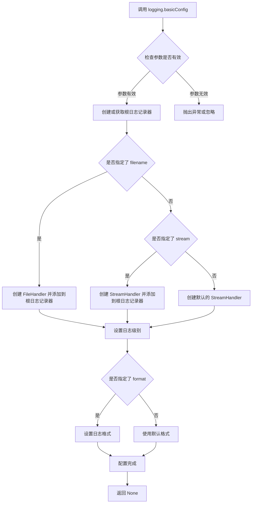
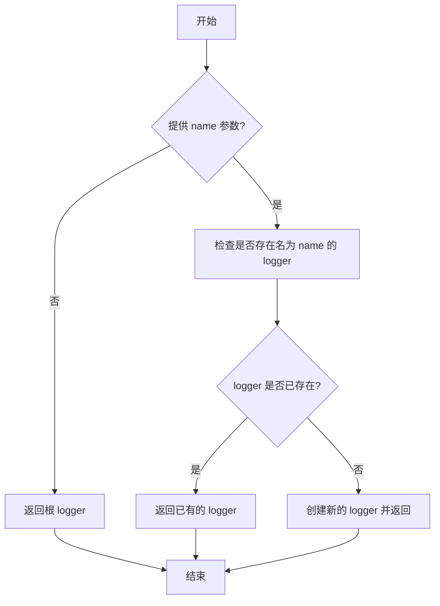
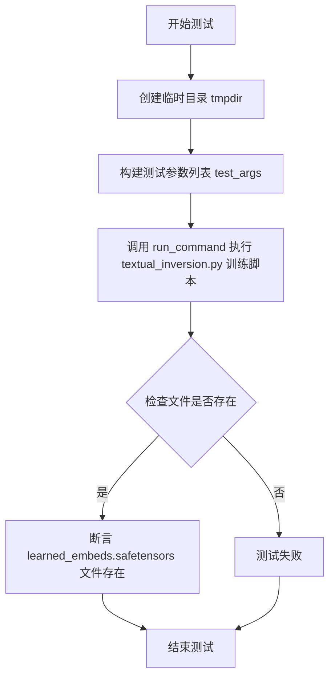
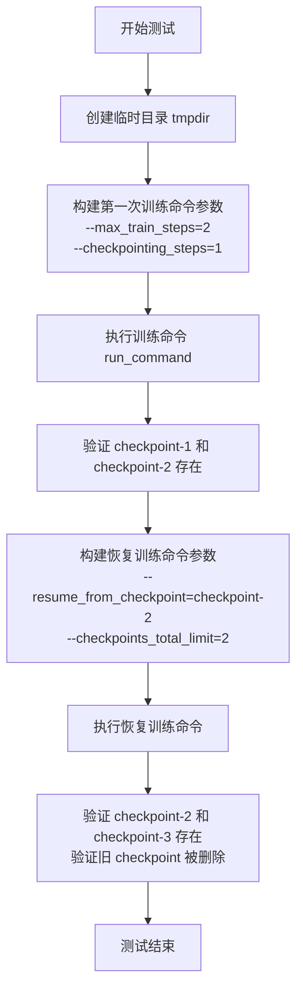

# `diffusers\examples\textual_inversion\test_textual_inversion.py` 详细设计文档

该文件是HuggingFace Diffusers库中TextualInversion（文本倒置）训练功能的集成测试文件，通过使用 Accelerate 框架测试文本倒置训练流程，包括基础训练、检查点保存、检查点恢复和检查点数量限制等功能。

## 整体流程



## 类结构

```
ExamplesTestsAccelerate (基类)
└── TextualInversion (测试类)
    ├── test_textual_inversion (基础功能测试)
    ├── test_textual_inversion_checkpointing (检查点保存测试)
    └── test_textual_inversion_checkpointing_checkpoints_total_limit_removes_multiple_checkpoints (检查点限制测试)
```

## 全局变量及字段


### `logger`
    
全局日志记录器，用于输出调试信息

类型：`logging.Logger`
    


### `stream_handler`
    
全局日志流处理器，将日志输出到标准输出

类型：`logging.StreamHandler`
    


    

## 全局函数及方法


### `run_command`

该函数是 `test_examples_utils` 模块中定义的全局函数，用于执行命令行指令。它接收一个命令列表，将其转换为命令行字符串并通过子进程执行，同时捕获输出日志。在 `TextualInversion` 测试类中，该函数被用于运行文本倒置训练脚本的各种测试场景。

参数：

- `cmd`：列表（List[str]），命令参数列表，通常由 launch 参数和测试脚本参数组成

返回值：`int`，返回命令执行的退出码（0 表示成功）

#### 流程图



#### 带注释源码

```python
# 该函数定义在 test_examples_utils 模块中
# 以下是基于使用方式推断的函数签名和逻辑

def run_command(cmd):
    """
    执行命令行指令的函数
    
    参数:
        cmd: List[str], 命令参数列表，例如：
            ['accelerate', 'launch', 'examples/textual_inversion/textual_inversion.py', '--pretrained_model_name_or_path', '...']
    
    返回:
        int: 命令执行的退出码
    """
    # 将列表转换为字符串
    command_str = ' '.join(cmd)
    
    # 使用 subprocess 执行命令
    # 假设函数内部会:
    # 1. 记录日志 (logging)
    # 2. 使用 subprocess.run() 或类似方法执行命令
    # 3. 返回执行结果
    
    # 示例调用方式:
    # run_command(self._launch_args + test_args)
    # 其中 self._launch_args 来自 ExamplesTestsAccelerate 类
    # test_args 是通过 .split() 生成的参数字符串列表
    
    return process.returncode  # 返回执行状态码
```

> **注意**：由于 `run_command` 函数的完整源代码定义在 `test_examples_utils` 模块中（该模块在当前代码片段中以 `import` 方式引用），上述源码是基于函数调用方式和典型实现模式推断的。要获取准确的函数实现细节，需要查看 `test_examples_utils.py` 模块的源代码。


### `logging.basicConfig`

该函数是 Python 标准库 `logging` 模块提供的配置函数，用于以简单方式配置根日志记录器。在本代码中，它被用于设置根日志记录器的日志级别为 DEBUG，以便在运行时输出详细的调试信息，帮助开发者追踪测试执行过程。

参数：

-  `level`：`int`，日志级别，指定日志记录器的最低级别。代码中传入 `logging.DEBUG`（值为 10），表示记录 DEBUG 及以上级别的所有日志。
-  `*`（其他可选参数，代码中未使用）：
  - `format`：`str`，日志输出格式字符串。
  - `datefmt`：`str`，日期时间格式。
  - `filename`：`str`，日志输出文件名。
  - `filemode`：`str`，文件打开模式。
  - `stream`：`io.IOBase`，日志输出流。
  - `handlers`：`list`，处理器列表。
  - `force`：`bool`，是否强制重新配置根日志记录器。
  - `encoding`：`str`，文件编码格式。

返回值：`None`，该函数不返回任何值，仅修改日志系统的全局配置状态。

#### 流程图



#### 带注释源码

```python
# 配置根日志记录器，设置为 DEBUG 级别
# 这将允许日志系统记录所有 DEBUG 级别及以上的消息
# 包括调试信息、信息、警告、错误和严重错误
logging.basicConfig(level=logging.DEBUG)
```

#### 补充说明

**设计目标与约束：**
- 目标：启用调试日志输出，便于排查测试执行过程中的问题。
- 约束：`basicConfig` 只能配置根日志记录器，对于子记录器的配置需要单独设置。

**错误处理与异常设计：**
- 如果传入无效的日志级别（如非整数或非 Level 类型），可能抛出 `TypeError` 或 `ValueError`。
- `basicConfig` 多次调用时，除非设置 `force=True`，否则后续调用不会生效（Python 3.8+）。

**数据流与状态机：**
- 该函数修改全局日志系统的状态，影响整个进程中的日志输出行为。
- 后续的 `logging.getLogger()` 调用将继承根日志记录器的配置。

**外部依赖与接口契约：**
- 依赖 Python 标准库 `logging` 模块。
- 符合 Python logging 模块的标准接口约定。

**潜在的技术债务或优化空间：**
- 当前仅设置了日志级别，未指定格式、输出目标等，建议根据项目需求统一日志格式。
- 建议添加 `force=True` 参数以确保配置生效，避免因其他代码提前配置导致设置失效。
- 可考虑将日志配置提取为独立函数或配置文件，便于在不同环境中灵活调整。


### `logging.getLogger`

获取或创建一个 logger 实例，用于记录日志。如果未指定名称，则返回根 logger。

参数：

- `name`：`str`，logger 的名称。如果为 `None` 或空字符串，则返回根 logger。默认为 `None`。

返回值：`logging.Logger`，返回对应的 Logger 对象。

#### 流程图



#### 带注释源码

由于 `logging.getLogger` 是 Python 标准库的一部分，以下是基于其常见实现的简化注释版本：

```python
# logging.getLogger 的简化实现
def getLogger(name=None):
    """
    获取或创建一个 logger。

    参数:
        name (str, optional): logger 的名称。如果为 None，则返回根 logger。

    返回:
        logging.Logger: Logger 实例。
    """
    # 如果没有提供名称，返回根 logger
    if not name:
        return Logger.root
    
    # 检查是否已经存在同名的 logger
    if name in Logger.manager.loggerDict:
        return Logger.manager.loggerDict[name]
    
    # 如果不存在，创建新的 logger
    logger = Logger(name)
    Logger.manager.loggerDict[name] = logger
    return logger
```

注意：实际的标准库实现更加复杂，包含更多细节，如日志级别、处理器等。上述代码仅用于说明基本逻辑。


### `TextualInversion.test_textual_inversion`

这是一个单元测试方法，用于验证 Textual Inversion（文本反转）训练脚本能够正确执行，并通过断言检查生成的嵌入文件是否符合预期。

参数：

- `self`：隐式参数，TextualInversion 类的实例本身

返回值：`None`，无返回值（测试方法）

#### 流程图



#### 带注释源码

```python
def test_textual_inversion(self):
    """
    测试 Textual Inversion 训练脚本的基本功能。
    验证脚本能够成功运行并生成 learned_embeds.safetensors 文件。
    """
    # 使用 tempfile 模块创建临时目录，测试结束后自动清理
    with tempfile.TemporaryDirectory() as tmpdir:
        # 构建命令行参数列表，配置训练所需的各种参数
        test_args = f"""
            examples/textual_inversion/textual_inversion.py    # 训练脚本路径
            --pretrained_model_name_or_path hf-internal-testing/tiny-stable-diffusion-pipe  # 预训练模型
            --train_data_dir docs/source/en/imgs              # 训练数据目录
            --learnable_property object                       # 可学习属性类型
            --placeholder_token <cat-toy>                      # 占位符 token
            --initializer_token a                              # 初始化 token
            --save_steps 1                                     # 保存间隔步数
            --num_vectors 2                                    # 向量数量
            --resolution 64                                    # 图像分辨率
            --train_batch_size 1                               # 训练批次大小
            --gradient_accumulation_steps 1                    # 梯度累积步数
            --max_train_steps 2                                # 最大训练步数
            --learning_rate 5.0e-04                            # 学习率
            --scale_lr                                         # 是否缩放学习率
            --lr_scheduler constant                            # 学习率调度器
            --lr_warmup_steps 0                                # 预热步数
            --output_dir {tmpdir}                              # 输出目录
            """.split()  # 将字符串分割成参数列表

        # 执行训练命令，结合加速启动参数
        run_command(self._launch_args + test_args)
        
        # smoke test: 验证 save_pretrained 功能是否正常工作
        # 检查生成的 learned_embeds.safetensors 文件是否存在
        self.assertTrue(
            os.path.isfile(os.path.join(tmpdir, "learned_embeds.safetensors"))
        )
```

#### 关键信息补充

| 项目 | 说明 |
|------|------|
| **所属类** | `TextualInversion` |
| **父类** | `ExamplesTestsAccelerate` |
| **依赖模块** | `tempfile`, `os`, `sys`, `logging`, `run_command` (外部函数) |
| **测试目标** | 验证 Textual Inversion 训练流程端到端功能 |
| **断言逻辑** | 检查输出目录中是否存在 `learned_embeds.safetensors` 文件 |

#### 潜在优化建议

1. **测试数据依赖**：测试依赖于 `docs/source/en/imgs` 目录，建议添加数据存在性检查或使用 mock 数据
2. **断言信息不足**：可添加更详细的错误信息，例如打印实际输出路径内容
3. **参数化测试**：可考虑将重复参数提取为类级别的 fixture，提高代码复用性


### `TextualInversion.test_textual_inversion_checkpointing`

该方法是一个测试函数，用于验证文本反转（Textual Inversion）训练过程中的检查点保存功能是否正常工作，特别是验证 `--checkpointing_steps` 和 `--checkpoints_total_limit` 参数能否正确控制检查点的保存频率和总数限制。

参数：

- `self`：`TextualInversion`（继承自 `ExamplesTestsAccelerate`），表示测试类实例本身，用于访问父类方法和属性

返回值：`None`，该方法为测试方法，通过断言验证功能，不返回任何值

#### 流程图

```mermaid
flowchart TD
    A[开始测试] --> B[创建临时目录 tmpdir]
    B --> C[构建训练参数列表]
    C --> D[包含检查点相关参数:<br/>--checkpointing_steps=1<br/>--checkpoints_total_limit=2]
    D --> E[执行训练命令 run_command]
    E --> F{检查点创建成功?}
    F -->|是| G[获取临时目录内容]
    F -->|否| H[测试失败]
    G --> I[筛选包含'checkpoint'的目录]
    I --> J{验证检查点集合}
    J -->|等于<br/>{checkpoint-2, checkpoint-3}| K[测试通过]
    J -->|不等于| L[断言失败]
    K --> M[结束]
    H --> M
    L --> M
```

#### 带注释源码

```python
def test_textual_inversion_checkpointing(self):
    """
    测试文本反转训练过程中的检查点保存功能。
    验证使用 --checkpointing_steps=1 --checkpoints_total_limit=2 参数时，
    训练脚本能够正确保存检查点，并且正确限制检查点总数。
    """
    # 创建临时目录用于存放训练输出和检查点
    with tempfile.TemporaryDirectory() as tmpdir:
        # 构建测试参数列表，包括模型路径、数据路径、训练超参数等
        test_args = f"""
            examples/textual_inversion/textual_inversion.py
            --pretrained_model_name_or_path hf-internal-testing/tiny-stable-diffusion-pipe
            --train_data_dir docs/source/en/imgs
            --learnable_property object
            --placeholder_token <cat-toy>
            --initializer_token a
            --save_steps 1
            --num_vectors 2
            --resolution 64
            --train_batch_size 1
            --gradient_accumulation_steps 1
            --max_train_steps 3  # 训练3步
            --learning_rate 5.0e-04
            --scale_lr
            --lr_scheduler constant
            --lr_warmup_steps 0
            --output_dir {tmpdir}
            --checkpointing_steps=1  # 每1步保存一个检查点
            --checkpoints_total_limit=2  # 最多保留2个检查点
            """.split()

        # 执行训练命令，将参数与启动参数合并后运行
        run_command(self._launch_args + test_args)

        # 验证检查点目录是否正确创建
        # 预期保留 checkpoint-2 和 checkpoint-3（因为总数限制为2，
        # 训练3步会创建3个检查点，但只保留最后2个）
        self.assertEqual(
            {x for x in os.listdir(tmpdir) if "checkpoint" in x},
            {"checkpoint-2", "checkpoint-3"},
        )
```


### `TextualInversion.test_textual_inversion_checkpointing_checkpoints_total_limit_removes_multiple_checkpoints`

该测试方法用于验证 Textual Inversion 训练过程中的 checkpoint 数量限制功能。具体来说，它首先运行两次训练生成初始 checkpoint，然后在恢复训练时设置 `checkpoints_total_limit=2`，以验证系统能够正确删除多余的旧 checkpoint 并仅保留最新的 checkpoint。

参数：

- `self`：`TextualInversion` 类型，测试类实例本身

返回值：`None`，该方法为测试方法，不返回任何值

#### 流程图



#### 带注释源码

```python
def test_textual_inversion_checkpointing_checkpoints_total_limit_removes_multiple_checkpoints(self):
    """
    测试 Textual Inversion 的 checkpoint 数量限制功能
    验证当设置 checkpoints_total_limit 时，系统能够正确删除多余的旧 checkpoint
    """
    # 创建一个临时目录用于存放训练输出和 checkpoint
    with tempfile.TemporaryDirectory() as tmpdir:
        # 第一次训练：运行 2 步训练，每步保存一个 checkpoint
        test_args = f"""
            examples/textual_inversion/textual_inversion.py
            --pretrained_model_name_or_path hf-internal-testing/tiny-stable-diffusion-pipe
            --train_data_dir docs/source/en/imgs
            --learnable_property object
            --placeholder_token <cat-toy>
            --initializer_token a
            --save_steps 1
            --num_vectors 2
            --resolution 64
            --train_batch_size 1
            --gradient_accumulation_steps 1
            --max_train_steps 2
            --learning_rate 5.0e-04
            --scale_lr
            --lr_scheduler constant
            --lr_warmup_steps 0
            --output_dir {tmpdir}
            --checkpointing_steps=1
            """.split()

        # 执行训练命令
        run_command(self._launch_args + test_args)

        # 验证 checkpoint 目录存在
        # 预期生成 checkpoint-1 和 checkpoint-2
        self.assertEqual(
            {x for x in os.listdir(tmpdir) if "checkpoint" in x},
            {"checkpoint-1", "checkpoint-2"},
        )

        # 第二次训练：从 checkpoint-2 恢复，设置 checkpoint 数量限制为 2
        resume_run_args = f"""
            examples/textual_inversion/textual_inversion.py
            --pretrained_model_name_or_path hf-internal-testing/tiny-stable-diffusion-pipe
            --train_data_dir docs/source/en/imgs
            --learnable_property object
            --placeholder_token <cat-toy>
            --initializer_token a
            --save_steps 1
            --num_vectors 2
            --resolution 64
            --train_batch_size 1
            --gradient_accumulation_steps 1
            --max_train_steps 2
            --learning_rate 5.0e-04
            --scale_lr
            --lr_scheduler constant
            --lr_warmup_steps 0
            --output_dir {tmpdir}
            --checkpointing_steps=1
            --resume_from_checkpoint=checkpoint-2
            --checkpoints_total_limit=2
            """.split()

        # 执行恢复训练命令
        run_command(self._launch_args + resume_run_args)

        # 验证 checkpoint 目录存在
        # 由于设置了 checkpoints_total_limit=2，旧 checkpoint 应被删除
        # 预期保留 checkpoint-2 和新生成的 checkpoint-3
        self.assertEqual(
            {x for x in os.listdir(tmpdir) if "checkpoint" in x},
            {"checkpoint-2", "checkpoint-3"},
        )
```

## 关键组件


### TextualInversion

继承自`ExamplesTestsAccelerate`的测试类，用于验证Textual Inversion（文本反转）训练流程的正确性，包括模型保存、检查点创建与恢复等功能。

### test_textual_inversion

基本的Textual Inversion训练测试方法，验证从预训练模型开始训练并保存学习到的嵌入向量（learned_embeds.safetensors）的完整流程。

### test_textual_inversion_checkpointing

检查点保存功能测试方法，验证训练过程中定期保存检查点，并检查检查点目录是否正确创建（checkpoint-2、checkpoint-3）。

### test_textual_inversion_checkpointing_checkpoints_total_limit_removes_multiple_checkpoints

检查点总数限制测试方法，验证`--checkpoints_total_limit`参数能够正确限制保存的检查点数量，并在恢复训练后自动清理旧检查点。

### 关键参数组件

- **--pretrained_model_name_or_path**: 指定预训练模型路径
- **--placeholder_token**: 文本反转中使用的占位符令牌（如`<cat-toy>`）
- **--initializer_token**: 占位符的初始化令牌
- **--num_vectors**: 学习向量数量，控制文本嵌入的维度
- **--checkpointing_steps**: 检查点保存间隔步数
- **--checkpoints_total_limit**: 允许保存的最大检查点数量
- **--resume_from_checkpoint**: 从指定检查点恢复训练

### 测试框架组件

- **ExamplesTestsAccelerate**: 基础测试类，提供加速训练测试能力
- **run_command**: 执行命令行训练脚本的辅助函数
- **tempfile.TemporaryDirectory**: 用于创建临时测试目录


## 问题及建议


### 已知问题

-   **大量重复代码**：三个测试方法中存在大量重复的命令行参数定义（如 `pretrained_model_name_or_path`、`train_data_dir`、`learnable_property`、`placeholder_token` 等），违反了 DRY 原则，维护成本高
-   **Magic Strings 硬编码**：测试参数（如 `<cat-toy>`、`object`、`a`、`constant`）直接写在代码中，缺乏常量定义，可读性和可维护性差
-   **缺少错误处理**：`run_command` 调用后没有检查返回码或捕获异常，如果训练脚本执行失败，测试可能无法正确报告错误原因
-   **断言信息不够详细**：使用 `self.assertTrue(os.path.isfile(...))` 和简单的 `self.assertEqual` 进行断言，失败时缺乏有意义的上下文信息
-   **测试执行效率低**：每个测试方法都独立运行完整的训练流程（`max_train_steps=2/3`），执行时间较长，且 `test_textual_inversion_checkpointing_checkpoints_total_limit_removes_multiple_checkpoints` 运行了两次完整训练
-   **日志配置不够灵活**：`logging.basicConfig(level=logging.DEBUG)` 设置为 DEBUG 级别可能在 CI 环境中产生过多输出
-   **测试顺序依赖风险**：最后一个测试方法依赖于前一个测试的执行结果（检查点文件），如果单独运行可能失败

### 优化建议

-   **提取公共参数为类常量或配置字典**：将重复的命令行参数提取到类级别的字典或 fixtures 中，通过参数合并方式构建测试参数，减少重复代码
-   **定义常量类**：创建专门的常量类或枚举来管理 `learnable_property`、`lr_scheduler` 等可取值参数，提高代码可读性
-   **增加异常处理**：在 `run_command` 调用后检查执行结果，或使用 pytest 的 `pytest.raises` 预期可能的失败情况
-   **改进断言信息**：使用带有自定义错误消息的断言，如 `self.assertTrue(..., "learned_embeds.safetensors 文件未生成")`
-   **使用 pytest fixture 共享训练结果**：对于需要前序训练结果的测试，使用 pytest fixture 缓存训练好的检查点，避免重复训练
-   **分离日志配置**：将日志配置移到单独的 fixture 或 conftest.py 中，允许根据测试环境灵活调整日志级别
-   **增加独立性**：确保每个测试方法可以独立运行，不依赖于其他测试的执行顺序或中间状态

## 其它


### 设计目标与约束

该测试文件旨在验证Textual Inversion（文本倒置）训练脚本的功能正确性，包括基础训练、模型保存和检查点管理。测试约束包括：使用微型稳定扩散模型进行快速测试（hf-internal-testing/tiny-stable-diffusion-pipe），限制训练步数为2-3步，分辨率为64x64，训练批次大小为1，确保测试在合理时间内完成。

### 错误处理与异常设计

测试使用tempfile.TemporaryDirectory()确保临时目录在测试完成后自动清理。run_command()执行外部命令时可能抛出异常，由测试框架捕获。每个测试包含断言验证输出文件存在性和检查点目录是否符合预期，包括检查learned_embeds.safetensors文件生成、checkpoint目录命名及数量控制。

### 数据流与状态机

测试数据流为：构造命令行参数 → 通过run_command执行textual_inversion.py脚本 → 脚本训练模型并保存到临时目录 → 测试验证输出文件/目录。状态转换包括：无检查点 → 生成checkpoint-1/checkpoint-2 → 重新训练后保留最新的2个检查点（checkpoint-2/checkpoint-3）。

### 外部依赖与接口契约

主要外部依赖包括：test_examples_utils.ExamplesTestsAccelerate基类提供_launch_args用于启动Accelerate环境；run_command()函数负责执行命令行脚本；os/sys/tempfile标准库用于文件操作。接口契约要求textual_inversion.py支持特定命令行参数（--pretrained_model_name_or_path、--train_data_dir、--placeholder_token、--save_steps、--checkpointing_steps、--resume_from_checkpoint、--checkpoints_total_limit等），并生成learned_embeds.safetensors文件。

### 配置文件与参数说明

测试使用命令行参数配置，主要参数包括：--pretrained_model_name_or_path指定预训练模型；--train_data_dir指定训练数据目录；--learnable_property设置学习属性（object）；--placeholder_token定义占位符<cat-toy>；--initializer_token设置初始化token为"a"；--num_vectors指定向量数量为2；--resolution设置图像分辨率64；--learning_rate设置学习率5.0e-04；--lr_scheduler选择constant调度器；--output_dir指定输出目录。

### 性能考量

采用tiny-stable-diffusion-pipe微型模型而非大型模型以缩短测试时间；限制max_train_steps为2-3步；使用train_batch_size=1和gradient_accumulation_steps=1最小化内存占用；分辨率限制为64x64以加快图像处理速度。

### 测试覆盖

覆盖场景包括：基础Textual Inversion训练与模型保存；检查点保存功能验证；检查点总数限制功能（checkpoints_total_limit=2）；从指定检查点恢复训练功能；恢复后检查点清理逻辑。测试验证文件包括learned_embeds.safetensors和checkpoint-*目录。

### 安全性考虑

测试在临时目录中执行，不会污染真实文件系统。使用HfArgumentParser进行参数解析，避免直接命令注入风险。测试使用huggingface-internal测试模型，不依赖外部未知来源的模型。

### 潜在改进空间

测试可增加对训练过程中日志输出的验证；可添加对不同学习率调度器的测试覆盖；可增加对异常输入（如无效模型路径、缺失数据目录）的错误处理测试；可添加性能基准测试以监控训练效率变化；检查点测试可增加对中间检查点的内容验证而不仅限于目录存在性。

    