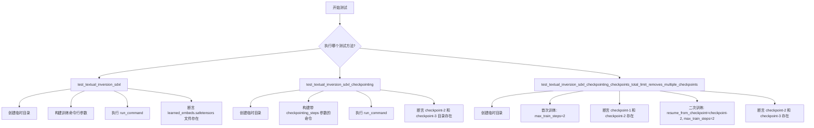
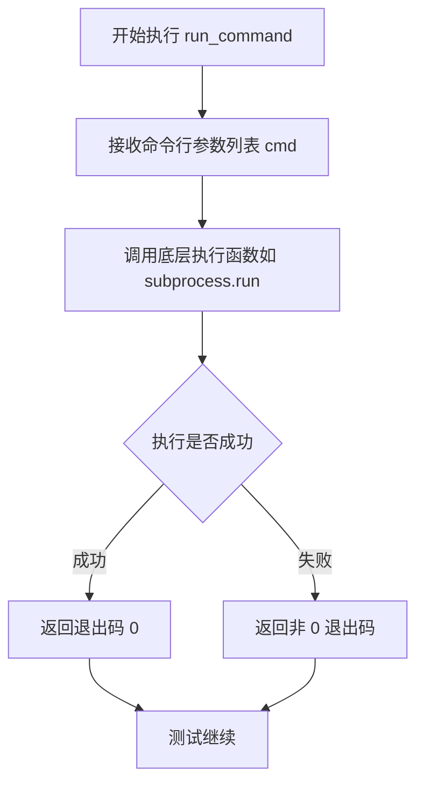
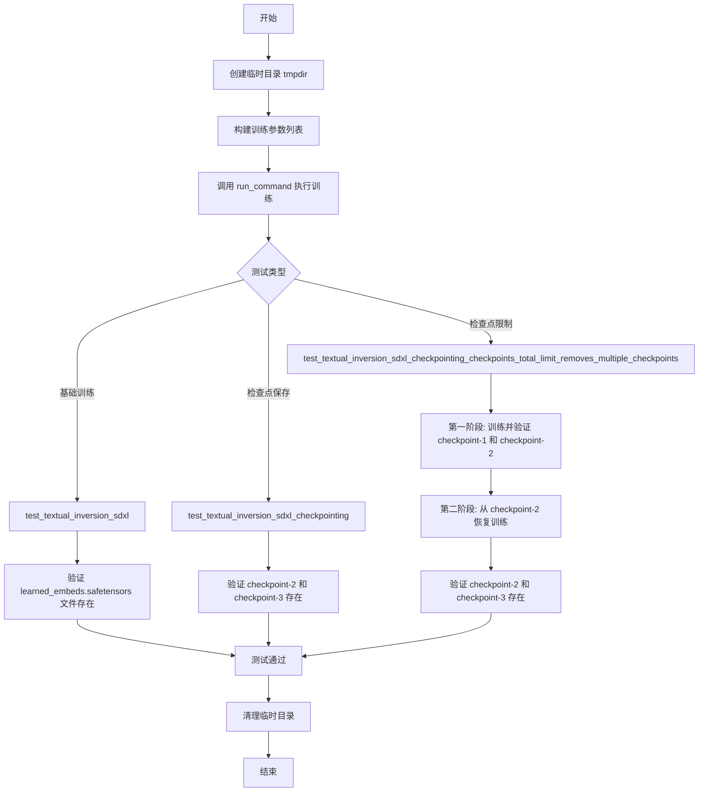
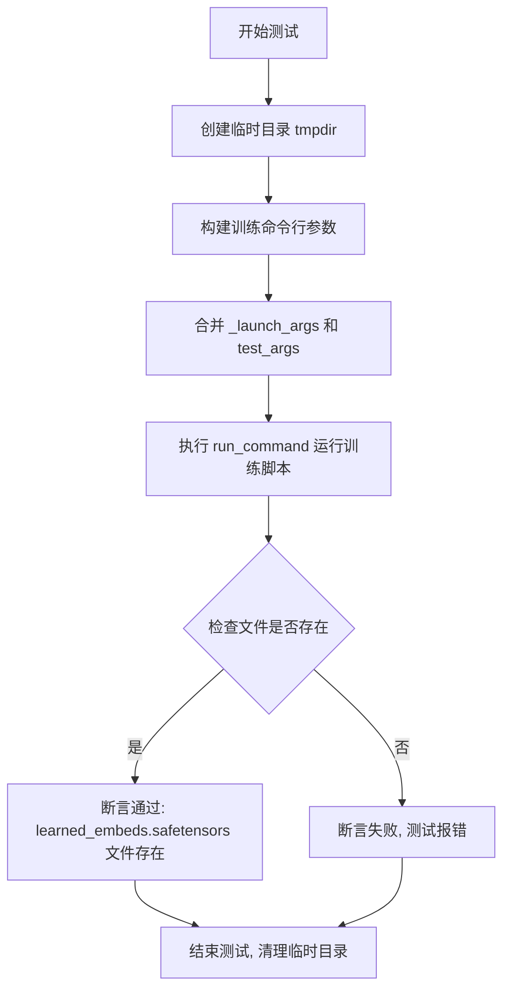
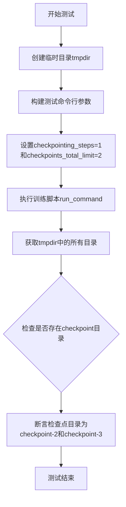

# `diffusers\examples\textual_inversion\test_textual_inversion_sdxl.py` 详细设计文档

这是一个用于测试 SDXL 模型的 Textual Inversion 训练的单元测试类，包含三个测试用例：基础训练功能测试、检查点保存测试以及检查点数量限制测试，继承自 ExamplesTestsAccelerate 基类并使用 Accelerate 框架执行训练命令。

## 整体流程



## 类结构

```
ExamplesTestsAccelerate (基类)
└── TextualInversionSdxl (测试类)
```

## 全局变量及字段


### `logger`
    
全局日志记录器实例，用于记录程序运行过程中的调试和信息日志

类型：`logging.Logger`
    


### `stream_handler`
    
全局日志处理器，将日志输出到标准输出流(sys.stdout)

类型：`logging.StreamHandler`
    


    

## 全局函数及方法


### `run_command`

该函数为测试工具函数，从 `test_examples_utils` 模块导入，用于在测试环境中执行命令行程序（如训练脚本），接收命令参数列表并运行，返回命令执行的返回码。

参数：

-  `cmd`：`List[str]`，命令行参数列表，例如 `self._launch_args + test_args`，包含要执行的脚本路径及所有命令行参数

返回值：`int`，命令执行的返回码（exit code），通常 0 表示成功，非 0 表示错误

#### 流程图



#### 带注释源码

```python
# 该函数定义位于 test_examples_utils 模块中，当前代码仅导入并使用
# 根据调用方式推断的函数签名和行为：

def run_command(cmd: List[str]) -> int:
    """
    执行给定的命令行参数列表。
    
    参数:
        cmd: 包含执行命令及其参数的列表
        
    返回值:
        命令执行的退出码，0 表示成功
    """
    # 此为推断实现，实际定义在 test_examples_utils.py 中
    # 内部可能使用 subprocess.Popen 或 subprocess.run 执行命令
    # 并返回 process.returncode
    pass

# 在测试类中的实际调用示例：
run_command(self._launch_args + test_args)
# _launch_args: 包含 accelerate 启动参数（如 --num_processes 等）
# test_args: 包含具体训练脚本路径及训练超参数
```

---

**注意**：当前提供的代码片段中仅包含 `run_command` 的调用，未包含其实际定义。该函数的完整实现在 `test_examples_utils` 模块中，建议查看该模块源码以获取完整的参数说明和实现细节。


### `TextualInversionSdxl`

该类是一个集成测试类，继承自 `ExamplesTestsAccelerate`，用于测试 Textual Inversion Sdxl 模型的训练功能，包括基础训练、检查点保存以及检查点数量限制等功能。

#### 带注释源码

```python
class TextualInversionSdxl(ExamplesTestsAccelerate):
    """
    Textual Inversion Sdxl 模型的集成测试类
    继承自 ExamplesTestsAccelerate 基类，提供文本倒置训练的基础测试能力
    """
    
    def test_textual_inversion_sdxl(self):
        """
        测试 Textual Inversion Sdxl 模型的基础训练功能
        验证模型能够成功训练并保存 learned_embeds.safetensors 文件
        """
        with tempfile.TemporaryDirectory() as tmpdir:
            # 构建测试参数：使用 tiny-sdxl-pipe 模型进行快速测试
            test_args = f"""
                examples/textual_inversion/textual_inversion_sdxl.py
                --pretrained_model_name_or_path hf-internal-testing/tiny-sdxl-pipe
                --train_data_dir docs/source/en/imgs
                --learnable_property object
                --placeholder_token <cat-toy>
                --initializer_token a
                --save_steps 1
                --num_vectors 2
                --resolution 64
                --train_batch_size 1
                --gradient_accumulation_steps 1
                --max_train_steps 2
                --learning_rate 5.0e-04
                --scale_lr
                --lr_scheduler constant
                --lr_warmup_steps 0
                --output_dir {tmpdir}
                """.split()

            # 执行训练命令
            run_command(self._launch_args + test_args)
            
            # 验证保存的模型文件存在（smoke test）
            self.assertTrue(os.path.isfile(os.path.join(tmpdir, "learned_embeds.safetensors")))

    def test_textual_inversion_sdxl_checkpointing(self):
        """
        测试 Textual Inversion Sdxl 模型的检查点保存功能
        验证模型能够按设定步数保存检查点，并正确限制检查点总数
        """
        with tempfile.TemporaryDirectory() as tmpdir:
            test_args = f"""
                examples/textual_inversion/textual_inversion_sdxl.py
                --pretrained_model_name_or_path hf-internal-testing/tiny-sdxl-pipe
                --train_data_dir docs/source/en/imgs
                --learnable_property object
                --placeholder_token <cat-toy>
                --initializer_token a
                --save_steps 1
                --num_vectors 2
                --resolution 64
                --train_batch_size 1
                --gradient_accumulation_steps 1
                --max_train_steps 3
                --learning_rate 5.0e-04
                --scale_lr
                --lr_scheduler constant
                --lr_warmup_steps 0
                --output_dir {tmpdir}
                --checkpointing_steps=1
                --checkpoints_total_limit=2
                """.split()

            # 执行训练命令
            run_command(self._launch_args + test_args)

            # 验证检查点目录存在（checkpoint-2 和 checkpoint-3）
            self.assertEqual(
                {x for x in os.listdir(tmpdir) if "checkpoint" in x},
                {"checkpoint-2", "checkpoint-3"},
            )

    def test_textual_inversion_sdxl_checkpointing_checkpoints_total_limit_removes_multiple_checkpoints(self):
        """
        测试检查点总数限制功能，验证旧检查点被正确删除
        包括两个阶段：初始训练和从检查点恢复训练
        """
        with tempfile.TemporaryDirectory() as tmpdir:
            # 阶段1：初始训练
            test_args = f"""
                examples/textual_inversion/textual_inversion_sdxl.py
                --pretrained_model_name_or_path hf-internal-testing/tiny-sdxl-pipe
                --train_data_dir docs/source/en/imgs
                --learnable_property object
                --placeholder_token <cat-toy>
                --initializer_token a
                --save_steps 1
                --num_vectors 2
                --resolution 64
                --train_batch_size 1
                --gradient_accumulation_steps 1
                --max_train_steps 2
                --learning_rate 5.0e-04
                --scale_lr
                --lr_scheduler constant
                --lr_warmup_steps 0
                --output_dir {tmpdir}
                --checkpointing_steps=1
                """.split()

            run_command(self._launch_args + test_args)

            # 验证初始检查点目录（checkpoint-1 和 checkpoint-2）
            self.assertEqual(
                {x for x in os.listdir(tmpdir) if "checkpoint" in x},
                {"checkpoint-1", "checkpoint-2"},
            )

            # 阶段2：从 checkpoint-2 恢复训练，设置检查点总数限制为2
            resume_run_args = f"""
                examples/textual_inversion/textual_inversion_sdxl.py
                --pretrained_model_name_or_path hf-internal-testing/tiny-sdxl-pipe
                --train_data_dir docs/source/en/imgs
                --learnable_property object
                --placeholder_token <cat-toy>
                --initializer_token a
                --save_steps 1
                --num_vectors 2
                --resolution 64
                --train_batch_size 1
                --gradient_accumulation_steps 1
                --max_train_steps 2
                --learning_rate 5.0e-04
                --scale_lr
                --lr_scheduler constant
                --lr_warmup_steps 0
                --output_dir {tmpdir}
                --checkpointing_steps=1
                --resume_from_checkpoint=checkpoint-2
                --checkpoints_total_limit=2
                """.split()

            run_command(self._launch_args + resume_run_args)

            # 验证恢复训练后检查点目录（checkpoint-2 和 checkpoint-3，旧检查点被删除）
            self.assertEqual(
                {x for x in os.listdir(tmpdir) if "checkpoint" in x},
                {"checkpoint-2", "checkpoint-3"},
            )
```

#### 流程图



#### 类字段信息

| 字段名称 | 类型 | 描述 |
|---------|------|------|
| 继承自 ExamplesTestsAccelerate 的 `_launch_args` | list | 启动参数列表，包含分布式训练配置 |

#### 类方法信息

| 方法名称 | 参数 | 返回值 | 描述 |
|---------|------|--------|------|
| `test_textual_inversion_sdxl` | 无 | None | 测试 Textual Inversion Sdxl 模型的基础训练功能 |
| `test_textual_inversion_sdxl_checkpointing` | 无 | None | 测试模型的检查点保存功能 |
| `test_textual_inversion_sdxl_checkpointing_checkpoints_total_limit_removes_multiple_checkpoints` | 无 | None | 测试检查点总数限制，旧检查点自动删除 |

#### 关键组件信息

| 组件名称 | 一句话描述 |
|---------|-----------|
| `ExamplesTestsAccelerate` | 集成测试基类，提供测试框架和 run_command 辅助方法 |
| `run_command` | 执行命令行训练脚本的辅助函数 |
| `tempfile.TemporaryDirectory` | Python 标准库，用于创建临时测试目录并自动清理 |

#### 潜在技术债务或优化空间

1. **测试数据硬编码**：训练数据目录和模型名称硬编码，建议抽取为配置参数
2. **重复代码**：多个测试方法中有大量重复的参数构建逻辑，可提取为辅助方法
3. **断言信息不够详细**：失败时仅验证目录名称，建议增加更详细的日志输出
4. **缺少超时机制**：训练命令执行时间较长，建议添加超时控制避免测试挂起

#### 其它项目

- **设计目标**：验证 Textual Inversion Sdxl 模型的端到端训练流程、检查点保存与恢复功能
- **约束条件**：使用 `hf-internal-testing/tiny-sdxl-pipe` 轻量模型以加快测试速度，`max_train_steps` 限制为 2-3 步
- **错误处理**：依赖 pytest 框架的异常捕获，使用 `assertTrue` 和 `assertEqual` 进行验证
- **外部依赖**：依赖 `test_examples_utils` 模块中的 `ExamplesTestsAccelerate` 基类和 `run_command` 函数


### `TextualInversionSdxl.test_textual_inversion_sdxl`

这是一个单元测试方法，用于验证 SDXL 模型的 Textual Inversion（文本反转）训练流程是否正常工作。测试会使用小型 SDXL 管道模型进行短暂训练，并验证生成的嵌入文件是否正确保存。

参数：

- `self`：`TextualInversionSdxl`，测试类实例本身，包含 `_launch_args` 等测试配置属性

返回值：`None`，无返回值（测试方法通过 `assert` 语句进行验证）

#### 流程图



#### 带注释源码

```python
def test_textual_inversion_sdxl(self):
    """
    测试 SDXL 模型的 Textual Inversion 训练功能
    
    测试流程:
    1. 创建临时目录用于存放输出
    2. 构建训练参数,包括模型路径、数据目录、占位符token等
    3. 运行 textual_inversion_sdxl.py 训练脚本
    4. 验证生成的 learned_embeds.safetensors 文件是否存在
    """
    # 使用上下文管理器创建临时目录,测试结束后自动清理
    with tempfile.TemporaryDirectory() as tmpdir:
        # 构建测试命令行参数
        # 包括: 预训练模型路径、训练数据目录、可学习属性、占位符token、初始化token等
        test_args = f"""
            examples/textual_inversion/textual_inversion_sdxl.py
            --pretrained_model_name_or_path hf-internal-testing/tiny-sdxl-pipe
            --train_data_dir docs/source/en/imgs
            --learnable_property object
            --placeholder_token <cat-toy>
            --initializer_token a
            --save_steps 1
            --num_vectors 2
            --resolution 64
            --train_batch_size 1
            --gradient_accumulation_steps 1
            --max_train_steps 2
            --learning_rate 5.0e-04
            --scale_lr
            --lr_scheduler constant
            --lr_warmup_steps 0
            --output_dir {tmpdir}
            """.split()

        # 运行训练命令: 合并加速器启动参数和测试参数
        # _launch_args 来自父类 ExamplesTestsAccelerate,包含分布式训练配置
        run_command(self._launch_args + test_args)
        
        # save_pretrained smoke test: 冒烟测试,验证模型保存功能正常
        # 检查 learned_embeds.safetensors 文件是否生成
        self.assertTrue(os.path.isfile(os.path.join(tmpdir, "learned_embeds.safetensors")))
```


### `TextualInversionSdxl.test_textual_inversion_sdxl_checkpointing`

该函数是一个测试方法，用于验证SDXL文本倒置训练脚本的检查点（checkpoint）功能是否正常工作，包括检查点保存步数设置和检查点总数限制的逻辑。

参数：

- `self`：`TextualInversionSdxl`（继承自`ExamplesTestsAccelerate`），表示测试类实例本身

返回值：`None`，该方法为测试函数，通过断言验证检查点目录是否符合预期，不返回任何值

#### 流程图



#### 带注释源码

```python
def test_textual_inversion_sdxl_checkpointing(self):
    """
    测试SDXL文本倒置的检查点功能
    验证checkpointing_steps和checkpoints_total_limit参数是否正常工作
    """
    # 创建临时目录用于存放训练输出
    with tempfile.TemporaryDirectory() as tmpdir:
        # 构建测试参数列表
        test_args = f"""
            examples/textual_inversion/textual_inversion_sdxl.py
            --pretrained_model_name_or_path hf-internal-testing/tiny-sdxl-pipe
            --train_data_dir docs/source/en/imgs
            --learnable_property object
            --placeholder_token <cat-toy>
            --initializer_token a
            --save_steps 1
            --num_vectors 2
            --resolution 64
            --train_batch_size 1
            --gradient_accumulation_steps 1
            --max_train_steps 3
            --learning_rate 5.0e-04
            --scale_lr
            --lr_scheduler constant
            --lr_warmup_steps 0
            --output_dir {tmpdir}
            --checkpointing_steps=1
            --checkpoints_total_limit=2
            """.split()

        # 运行训练脚本，传入加速启动参数和测试参数
        run_command(self._launch_args + test_args)

        # 验证检查点目录是否存在
        # 预期生成checkpoint-2和checkpoint-3（因为max_train_steps=3,
        # checkpointing_steps=1, checkpoints_total_limit=2）
        self.assertEqual(
            {x for x in os.listdir(tmpdir) if "checkpoint" in x},
            {"checkpoint-2", "checkpoint-3"},
        )
```


### `TextualInversionSdxl.test_textual_inversion_sdxl_checkpointing_checkpoints_total_limit_removes_multiple_checkpoints`

这是一个测试方法，用于验证在使用checkpointing和`checkpoints_total_limit`参数时，重新恢复训练后旧checkpoint是否被正确删除。测试首先运行训练生成checkpoint-1和checkpoint-2，然后在恢复训练时设置`--checkpoints_total_limit=2`，期望旧checkpoint被删除，最终只保留checkpoint-2和checkpoint-3。

参数：

- `self`：实例本身，继承自`ExamplesTestsAccelerate`类

返回值：`None`，测试方法无返回值，通过`assert`语句验证结果

#### 流程图

```mermaid
flowchart TD
    A[开始测试] --> B[创建临时目录tmpdir]
    B --> C[构建初始训练参数<br/>--max_train_steps=2<br/>--checkpointing_steps=1<br/>无checkpoints_total_limit]
    C --> D[运行训练命令<br/>生成checkpoint-1和checkpoint-2]
    D --> E[断言checkpoint目录<br/>{'checkpoint-1', 'checkpoint-2'}]
    E --> F[构建恢复训练参数<br/>--resume_from_checkpoint=checkpoint-2<br/>--checkpoints_total_limit=2]
    F --> G[运行恢复训练命令<br/>生成checkpoint-3]
    G --> H[断言checkpoint目录<br/>{'checkpoint-2', 'checkpoint-3'}]
    H --> I[测试结束]
    
    style A fill:#f9f,stroke:#333
    style I fill:#9f9,stroke:#333
```

#### 带注释源码

```python
def test_textual_inversion_sdxl_checkpointing_checkpoints_total_limit_removes_multiple_checkpoints(self):
    """
    测试在使用checkpointing和checkpoints_total_limit参数时，
    重新恢复训练后旧checkpoint是否被正确删除。
    """
    
    # 创建临时目录用于存放训练输出
    with tempfile.TemporaryDirectory() as tmpdir:
        
        # ===== 第一次训练运行 =====
        # 构建训练参数：训练2步，每步保存checkpoint
        test_args = f"""
            examples/textual_inversion/textual_inversion_sdxl.py
            --pretrained_model_name_or_path hf-internal-testing/tiny-sdxl-pipe
            --train_data_dir docs/source/en/imgs
            --learnable_property object
            --placeholder_token <cat-toy>
            --initializer_token a
            --save_steps 1
            --num_vectors 2
            --resolution 64
            --train_batch_size 1
            --gradient_accumulation_steps 1
            --max_train_steps 2
            --learning_rate 5.0e-04
            --scale_lr
            --lr_scheduler constant
            --lr_warmup_steps 0
            --output_dir {tmpdir}
            --checkpointing_steps=1
            """.split()

        # 执行训练命令
        run_command(self._launch_args + test_args)

        # 验证初始训练后生成了checkpoint-1和checkpoint-2
        # 注意：没有设置checkpoints_total_limit，所以不会自动清理旧checkpoint
        self.assertEqual(
            {x for x in os.listdir(tmpdir) if "checkpoint" in x},
            {"checkpoint-1", "checkpoint-2"},
        )

        # ===== 恢复训练运行 =====
        # 构建恢复训练参数：从checkpoint-2恢复，限制最多保留2个checkpoint
        resume_run_args = f"""
            examples/textual_inversion/textual_inversion_sdxl.py
            --pretrained_model_name_or_path hf-internal-testing/tiny-sdxl-pipe
            --train_data_dir docs/source/en/imgs
            --learnable_property object
            --placeholder_token <cat-toy>
            --initializer_token a
            --save_steps 1
            --num_vectors 2
            --resolution 64
            --train_batch_size 1
            --gradient_accumulation_steps 1
            --max_train_steps 2
            --learning_rate 5.0e-04
            --scale_lr
            --lr_scheduler constant
            --lr_warmup_steps 0
            --output_dir {tmpdir}
            --checkpointing_steps=1
            --resume_from_checkpoint=checkpoint-2
            --checkpoints_total_limit=2
            """.split()

        # 执行恢复训练命令
        run_command(self._launch_args + resume_run_args)

        # 验证恢复训练后，旧checkpoint被正确删除
        # 期望：保留checkpoint-2和checkpoint-3，删除checkpoint-1
        self.assertEqual(
            {x for x in os.listdir(tmpdir) if "checkpoint" in x},
            {"checkpoint-2", "checkpoint-3"},
        )
```

## 关键组件


### TextualInversionSdxl 测试类

用于测试 SDXL 模型上 Textual Inversion 训练功能的测试类，继承自 ExamplesTestsAccelerate，提供训练、checkpoint 保存与断点续训的集成测试。

### test_textual_inversion_sdxl 方法

基本 Textual Inversion 训练流程测试，验证训练脚本能否正常执行并生成 learned_embeds.safetensors 文件。

### test_textual_inversion_sdxl_checkpointing 方法

检查点保存功能测试，验证 --checkpointing_steps 参数能否按步数保存检查点，并检查 checkpoint-2 和 checkpoint-3 目录是否存在。

### test_textual_inversion_sdxl_checkpointing_checkpoints_total_limit_removes_multiple_checkpoints 方法

检查点数量限制测试，验证 --checkpoints_total_limit 参数能否限制保存的检查点数量，并在断点续训时正确管理检查点目录。

### 检查点管理机制

通过 --checkpointing_steps、--checkpoints_total_limit 和 --resume_from_checkpoint 参数实现训练过程中的检查点保存、数量限制和断点续训功能。

### 训练参数配置

使用 --pretrained_model_name_or_path 指定模型，--train_data_dir 指定训练数据，--placeholder_token 定义可学习 token，--num_vectors 设置向量数量，--resolution 设置图像分辨率。

### 依赖模块

通过 test_examples_utils 模块导入 ExamplesTestsAccelerate 和 run_command，实现测试框架和命令执行功能。


## 问题及建议


### 已知问题

- **重复代码**：多个测试方法中存在大量重复的命令行参数定义（如`--pretrained_model_name_or_path`、`--train_data_dir`、`--learnable_property`、`--placeholder_token`、`--initializer_token`等），违反了DRY原则，维护成本高。
- **魔法数字**：代码中存在硬编码的数值（如`max_train_steps=2`、`max_train_steps=3`、`checkpoints_total_limit=2`等），缺乏常量定义，语义不明确。
- **路径处理不规范**：使用`sys.path.append("..")`进行路径添加，这种方式脆弱且不可靠，应使用绝对导入或正确的包结构。
- **日志配置过于简单**：`logging.basicConfig(level=logging.DEBUG)`直接配置全局日志，级别可能不适合生产环境，且缺少格式配置。
- **测试参数未参数化**：所有训练参数直接硬编码在测试方法中，无法灵活配置不同场景的测试参数。
- **缺少资源清理验证**：虽然使用`tempfile.TemporaryDirectory()`，但未验证测试后资源是否完全释放。

### 优化建议

- **提取公共配置**：创建共享的测试配置字典或fixture，将重复的命令行参数集中管理，通过参数合并方式构建完整命令。
- **定义常量类**：将魔法数字提取为有意义的常量类，如定义`TrainSteps`、`CheckpointLimits`等枚举或配置类。
- **使用标准导入**：移除`sys.path.append("..")`，通过正确的包结构或PYTHONPATH配置进行导入。
- **优化日志配置**：使用结构化日志，可配置不同模块的日志级别，避免DEBUG级别输出过多信息。
- **参数化测试**：使用`pytest.mark.parametrize`或fixture进行测试参数化，提高测试的可维护性和覆盖率。
- **添加资源验证**：在测试结束后增加断言或清理验证，确保临时文件和模型权重正确处理。

## 其它


### 设计目标与约束

该代码的测试目标是验证Textual Inversion在SDXL模型上的训练功能，包括基础训练、检查点保存和恢复、以及检查点数量限制等功能。约束条件包括使用特定的预训练模型（hf-internal-testing/tiny-sdxl-pipe）、固定的分辨率（64）、有限的训练步数（2-3步）和批量大小（1）。

### 错误处理与异常设计

测试代码主要通过assert语句进行断言验证，包括检查输出文件是否生成（learned_embeds.safetensors）、检查点目录是否存在（checkpoint-1、checkpoint-2等）。当测试失败时，run_command函数会抛出异常，测试框架会自动捕获并报告错误。

### 数据流与状态机

测试数据流为：准备命令行参数（test_args）→ 调用run_command执行训练脚本 → 验证输出结果（文件或目录）。状态机涉及临时目录的创建和使用、训练进程的执行状态、以及检查点目录的创建和验证状态。

### 外部依赖与接口契约

主要外部依赖包括：test_examples_utils模块中的ExamplesTestsAccelerate类和run_command函数；临时目录tempfile模块；文件系统操作os模块。接口契约方面，测试通过命令行参数与训练脚本textual_inversion_sdxl.py交互，传递模型路径、数据目录、训练参数等。

### 性能考虑与优化建议

由于使用tiny-sdxl-pipe和极小的训练步数（2-3步），当前测试主要关注功能验证而非性能。如需性能测试，可考虑增加max_train_steps、使用更大的batch_size、添加性能指标监控（如训练时间、内存占用、GPU利用率）。

### 兼容性考虑

该测试针对SDXL模型设计，不兼容其他模型架构。测试假设训练脚本位于examples/textual_inversion/textual_inversion_sdxl.py路径，且依赖HuggingFace的accelerate框架和diffusers库。

### 测试策略

采用端到端功能测试策略，通过实际运行训练脚本验证功能完整性。测试覆盖场景包括：基础训练功能、检查点保存功能、检查点恢复功能、检查点数量限制功能。

### 部署和运维相关

测试代码本身不涉及生产环境部署，但测试的训练脚本在生产环境中的部署需考虑：模型导出路径配置、训练检查点管理策略、训练日志配置等运维事项。

### 配置管理

训练参数通过命令行参数传入，包括模型路径、数据目录、学习率、批量大小、步数、占位符token等。测试代码中硬编码了这些参数，实际使用中可考虑外部化配置。

### 版本控制和迁移策略

当前测试针对特定版本的依赖库（transformers、diffusers、accelerate）。未来迁移时需注意：API变更可能影响命令行参数、检查点格式兼容性、模型架构变化。

    