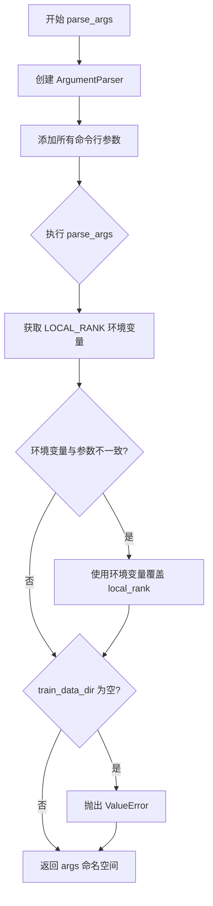
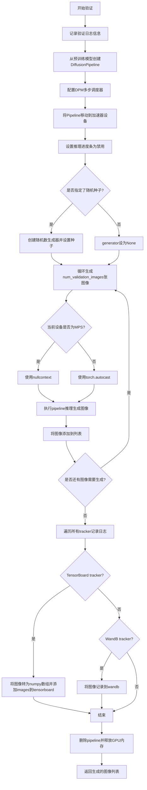
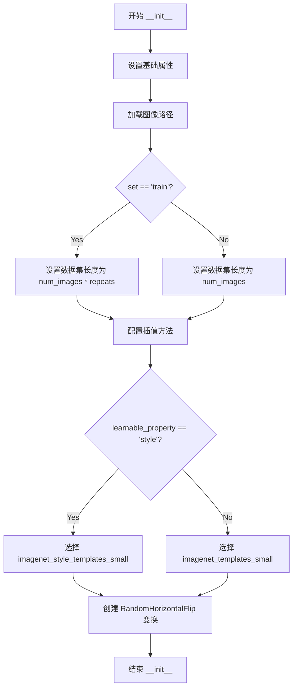
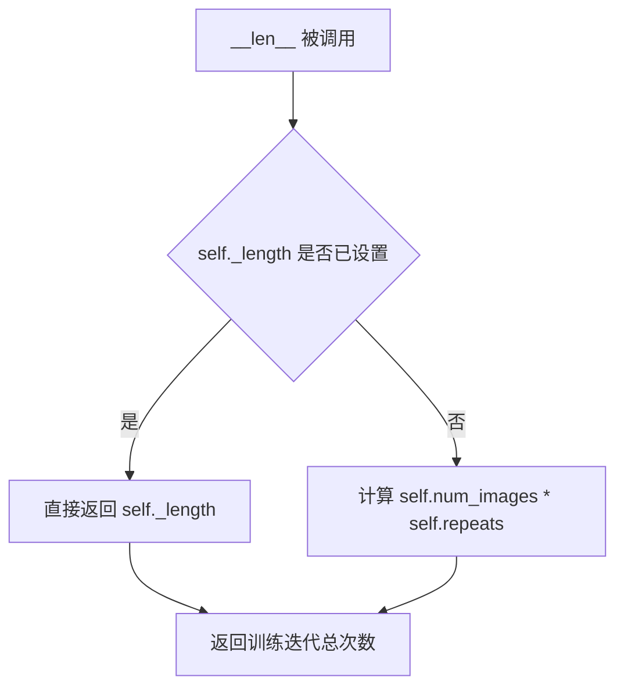

```mermaid
flowchart TD
    A[开始 main] --> B[parse_args - 解析命令行参数]
    B --> C[验证 wandb 和 hub_token 安全性]
    C --> D[创建 Accelerator 分布式训练环境]
    D --> E[配置日志系统]
    E --> F[set_seed - 设置随机种子]
    F --> G{accelerator.is_main_process}
    G -->|是| H[创建输出目录和 Hub 仓库]
    G -->|否| I[跳过创建]
    H --> I
    I --> J[加载 Tokenizer]
    J --> K[加载噪声调度器、Text Encoder、VAE、UNet]
    K --> L[添加占位符令牌到 Tokenizer]
    L --> M[调整 Text Encoder 的词嵌入层大小]
    M --> N[初始化占位符令牌嵌入]
    N --> O[冻结 VAE、UNet 和 Text Encoder 部分参数]
    O --> P{启用梯度检查点?}
    P -->|是| Q[启用梯度检查点优化]
    P -->|否| R[跳过]
    Q --> R
    R --> S{启用 xformers?}
    S -->|是| T[启用高效注意力机制]
    S -->|否| U[跳过]
    T --> U
    U --> V[启用 TF32 加速]
    V --> W[计算学习率]
    W --> X[创建 AdamW 优化器]
    X --> Y[创建训练数据集和 DataLoader]
    Y --> Z[配置学习率调度器]
    Z --> AA[使用 Accelerator 准备所有组件]
    AA --> AB[设置权重数据类型]
    AB --> AC[移动 VAE 和 UNet 到设备]
    AC --> AD[初始化训练 trackers]
    AD --> AE[初始化训练状态变量]
    AE --> AG{检查是否需要恢复检查点}
    AG -->|是| AH[加载检查点状态]
    AG -->|否| AI[跳过]
    AH --> AJ[开始训练循环]
    AJ --> AK[外循环: 遍历每个 epoch]
    AK --> AL[内循环: 遍历训练数据]
    AL --> AM[VAE 编码图像到潜在空间]
    AM --> AN[采样噪声并添加到潜在变量]
    AN --> AO[编码文本输入]
    AO --> AP[UNet 预测噪声残差]
    AP --> AQ[计算 MSE 损失]
    AQ --> AR[反向传播并更新参数]
    AR --> AS[保护原始嵌入不被修改]
    AS --> AT{同步梯度?}
    AT -->|是| AU[更新进度条]
    AU --> AV{保存检查点?}
    AV -->|是| AW[保存训练进度]
    AV -->|否| AX[跳过保存]
    AW --> AY{是主进程?}
    AY -->|是| AZ{执行验证?}
    AZ -->|是| BA[运行验证并生成图像]
    AZ -->|否| BB[跳过验证]
    BA --> BB
    BB --> BC[记录日志]
    BC --> BD{达到最大训练步数?}
    BD -->|否| AL
    BD -->|是| BE[训练完成]
    AX --> BC
    AT -->|否| AL
    AY -->|否| BC
    BE --> BF[等待所有进程完成]
    BF --> BG{保存完整 pipeline?}
    BG -->|是| BH[创建并保存 StableDiffusionPipeline]
    BG -->|否| BI[只保存学习到的嵌入]
    BH --> BI
    BI --> BJ[保存训练好的嵌入]
    BJ --> BK{推送到 Hub?}
    BK -->|是| BL[保存模型卡片]
    BK -->|否| BM[结束]
    BL --> BN[上传文件夹到 Hub]
    BN --> BM[结束]
```

# `diffusers\examples\textual_inversion\textual_inversion.py` 详细设计文档

这是一个基于 Hugging Face Diffusers 库实现的 Textual Inversion（文本倒置）训练脚本。核心功能是通过冻结 Stable Diffusion 的 UNet 和 VAE 组件，仅微调 CLIP 文本编码器（Text Encoder）的 Embedding 层，将用户自定义的概念（物体或艺术风格）学习为特定的 Placeholder Token，并在训练结束后支持生成该概念的新图像。

## 整体流程

```mermaid
graph TD
    Start[脚本启动] --> ParseArgs[解析命令行参数]
    ParseArgs --> InitAcc[初始化 Accelerator]
    InitAcc --> LoadModels[加载预训练模型: UNet, VAE, TextEncoder, Tokenizer]
    LoadModels --> AddToken[向 Tokenizer 添加 Placeholder Token]
    AddToken --> ResizeEmbeddings[调整 Text Encoder 的 Embedding 矩阵]
    ResizeEmbeddings --> InitData[初始化 TextualInversionDataset]
    InitData --> Freeze[冻结 UNet 和 VAE 参数]
    Freeze --> TrainLoop[进入训练循环]
    TrainLoop --> Batch[获取 batch (images, input_ids)]
    Batch --> EncodeImg[VAE 编码图像到 Latent Space]
    EncodeImg --> AddNoise[DDPM Scheduler 添加噪声]
    AddNoise --> EncodeText[Text Encoder 编码 input_ids]
    EncodeText --> Predict[UNet 预测噪声残差]
    Predict --> Loss[计算 MSE Loss]
    Loss --> Backward[Accelerator 反向传播]
    Backward --> Update[更新 Text Encoder Embeddings]
    Update --> Checkpointing{是否到达保存步数?}
    Checkpointing -- 是 --> SaveEmbed[保存 Learned Embeddings]
    Checkpointing -- 否 --> ValidationCheck{是否到达验证步数?}
    ValidationCheck -- 是 --> Validate[调用 log_validation 生成图像]
    ValidationCheck -- 否 --> MaxSteps{是否达到最大训练步数?}
    Validate --> MaxSteps
    MaxSteps -- 否 --> TrainLoop
    MaxSteps -- 是 --> SaveFinal[保存最终模型与 Embeddings]
    SaveFinal --> End[训练结束]
```

## 类结构

```
Script (训练入口)
├── Class: TextualInversionDataset (数据处理类)
│   ├── __init__ (初始化数据集配置)
│   ├── __len__ (返回数据集长度)
│   └── __getitem__ (获取单条数据：图像处理与文本构造)
├── Function: main (主训练逻辑)
│   ├── 包含模型加载、训练循环、验证、保存逻辑
│   └── 调用 parse_args, log_validation, save_progress
├── Function: parse_args (参数解析)
├── Function: log_validation (验证与图像生成)
├── Function: save_progress (保存 Embeddings)
└── Function: save_model_card (保存 HuggingFace Model Card)
```

## 全局变量及字段


### `logger`
    
Accelerate 提供的日志记录器

类型：`Logger`
    


### `PIL_INTERPOLATION`
    
根据 PIL 版本兼容的图像重采样枚举映射

类型：`dict`
    


### `imagenet_templates_small`
    
物体类概念的文本生成模板列表

类型：`List[str]`
    


### `imagenet_style_templates_small`
    
风格类概念的文本生成模板列表

类型：`List[str]`
    


### `TextualInversionDataset.TextualInversionDataset.data_root`
    
训练图片目录路径

类型：`str`
    


### `TextualInversionDataset.TextualInversionDataset.tokenizer`
    
分词器实例

类型：`CLIPTokenizer`
    


### `TextualInversionDataset.TextualInversionDataset.learnable_property`
    
学习类型 ('object' 或 'style')

类型：`str`
    


### `TextualInversionDataset.TextualInversionDataset.size`
    
图像目标分辨率 (默认 512)

类型：`int`
    


### `TextualInversionDataset.TextualInversionDataset.placeholder_token`
    
用于表示概念的占位符

类型：`str`
    


### `TextualInversionDataset.TextualInversionDataset.center_crop`
    
是否启用中心裁剪

类型：`bool`
    


### `TextualInversionDataset.TextualInversionDataset.flip_p`
    
随机水平翻转的概率

类型：`float`
    


### `TextualInversionDataset.TextualInversionDataset.image_paths`
    
数据集中所有图片的路径列表

类型：`List[str]`
    


### `TextualInversionDataset.TextualInversionDataset.num_images`
    
原始图片数量

类型：`int`
    


### `TextualInversionDataset.TextualInversionDataset._length`
    
经过 repeats 处理后的数据集总长度

类型：`int`
    


### `TextualInversionDataset.TextualInversionDataset.interpolation`
    
PIL 图像重采样方法

类型：`Resampling`
    


### `TextualInversionDataset.TextualInversionDataset.templates`
    
用于构造训练文本的模板列表

类型：`List[str]`
    


### `TextualInversionDataset.TextualInversionDataset.flip_transform`
    
图像翻转转换

类型：`transforms.RandomHorizontalFlip`
    
    

## 全局函数及方法


### `parse_args`

使用 argparse 解析所有训练超参数（如 learning_rate, train_batch_size, placeholder_token 等），返回包含所有命令行参数的命名空间对象。

参数：此函数不接受任何函数参数，通过 `argparse.ArgumentParser` 动态定义所有参数。

返回值：`argparse.Namespace`，包含所有解析后的命令行参数及其值。

#### 流程图



#### 带注释源码

```
def parse_args():
    # 创建参数解析器，设置脚本描述
    parser = argparse.ArgumentParser(description="Simple example of a training script.")
    
    # 添加保存相关参数
    parser.add_argument(
        "--save_steps",
        type=int,
        default=500,
        help="Save learned_embeds.bin every X updates steps.",
    )
    parser.add_argument(
        "--save_as_full_pipeline",
        action="store_true",
        help="Save the complete stable diffusion pipeline.",
    )
    parser.add_argument(
        "--num_vectors",
        type=int,
        default=1,
        help="How many textual inversion vectors shall be used to learn the concept.",
    )
    
    # 添加模型路径相关参数
    parser.add_argument(
        "--pretrained_model_name_or_path",
        type=str,
        default=None,
        required=True,
        help="Path to pretrained model or model identifier from huggingface.co/models.",
    )
    parser.add_argument(
        "--revision",
        type=str,
        default=None,
        required=False,
        help="Revision of pretrained model identifier from huggingface.co/models.",
    )
    parser.add_argument(
        "--variant",
        type=str,
        default=None,
        help="Variant of the model files of the pretrained model identifier from huggingface.co/models, 'e.g.' fp16",
    )
    parser.add_argument(
        "--tokenizer_name",
        type=str,
        default=None,
        help="Pretrained tokenizer name or path if not the same as model_name",
    )
    
    # 添加训练数据相关参数
    parser.add_argument(
        "--train_data_dir", type=str, default=None, required=True, help="A folder containing the training data."
    )
    parser.add_argument(
        "--placeholder_token",
        type=str,
        default=None,
        required=True,
        help="A token to use as a placeholder for the concept.",
    )
    parser.add_argument(
        "--initializer_token", type=str, default=None, required=True, help="A token to use as initializer word."
    )
    parser.add_argument("--learnable_property", type=str, default="object", help="Choose between 'object' and 'style'")
    parser.add_argument("--repeats", type=int, default=100, help="How many times to repeat the training data.")
    
    # 添加输出目录和随机种子参数
    parser.add_argument(
        "--output_dir",
        type=str,
        default="text-inversion-model",
        help="The output directory where the model predictions and checkpoints will be written.",
    )
    parser.add_argument("--seed", type=int, default=None, help="A seed for reproducible training.")
    
    # 添加图像处理参数
    parser.add_argument(
        "--resolution",
        type=int,
        default=512,
        help=(
            "The resolution for input images, all the images in the train/validation dataset will be resized to this"
            " resolution"
        ),
    )
    parser.add_argument(
        "--center_crop", action="store_true", help="Whether to center crop images before resizing to resolution."
    )
    
    # 添加训练批次和轮数参数
    parser.add_argument(
        "--train_batch_size", type=int, default=16, help="Batch size (per device) for the training dataloader."
    )
    parser.add_argument("--num_train_epochs", type=int, default=100)
    parser.add_argument(
        "--max_train_steps",
        type=int,
        default=5000,
        help="Total number of training steps to perform.  If provided, overrides num_train_epochs.",
    )
    
    # 添加梯度累积和检查点参数
    parser.add_argument(
        "--gradient_accumulation_steps",
        type=int,
        default=1,
        help="Number of updates steps to accumulate before performing a backward/update pass.",
    )
    parser.add_argument(
        "--gradient_checkpointing",
        action="store_true",
        help="Whether or not to use gradient checkpointing to save memory at the expense of slower backward pass.",
    )
    
    # 添加学习率参数
    parser.add_argument(
        "--learning_rate",
        type=float,
        default=1e-4,
        help="Initial learning rate (after the potential warmup period) to use.",
    )
    parser.add_argument(
        "--scale_lr",
        action="store_true",
        default=False,
        help="Scale the learning rate by the number of GPUs, gradient accumulation steps, and batch size.",
    )
    parser.add_argument(
        "--lr_scheduler",
        type=str,
        default="constant",
        help=(
            'The scheduler type to use. Choose between ["linear", "cosine", "cosine_with_restarts", "polynomial",'
            ' "constant", "constant_with_warmup"]'
        ),
    )
    parser.add_argument(
        "--lr_warmup_steps", type=int, default=500, help="Number of steps for the warmup in the lr scheduler."
    )
    parser.add_argument(
        "--lr_num_cycles",
        type=int,
        default=1,
        help="Number of hard resets of the lr in cosine_with_restarts scheduler.",
    )
    parser.add_argument(
        "--dataloader_num_workers",
        type=int,
        default=0,
        help=(
            "Number of subprocesses to use for data loading. 0 means that the data will be loaded in the main process."
        ),
    )
    
    # 添加 Adam 优化器参数
    parser.add_argument("--adam_beta1", type=float, default=0.9, help="The beta1 parameter for the Adam optimizer.")
    parser.add_argument("--adam_beta2", type=float, default=0.999, help="The beta2 parameter for the Adam optimizer.")
    parser.add_argument("--adam_weight_decay", type=float, default=1e-2, help="Weight decay to use.")
    parser.add_argument("--adam_epsilon", type=float, default=1e-08, help="Epsilon value for the Adam optimizer")
    
    # 添加 HuggingFace Hub 相关参数
    parser.add_argument("--push_to_hub", action="store_true", help="Whether or not to push the model to the Hub.")
    parser.add_argument("--hub_token", type=str, default=None, help="The token to use to push to the Model Hub.")
    parser.add_argument(
        "--hub_model_id",
        type=str,
        default=None,
        help="The name of the repository to keep in sync with the local `output_dir`.",
    )
    parser.add_argument(
        "--logging_dir",
        type=str,
        default="logs",
        help=(
            "[TensorBoard](https://www.tensorflow.org/tensorboard) log directory. Will default to"
            " *output_dir/runs/**CURRENT_DATETIME_HOSTNAME***."
        ),
    )
    
    # 添加混合精度和 TF32 参数
    parser.add_argument(
        "--mixed_precision",
        type=str,
        default="no",
        choices=["no", "fp16", "bf16"],
        help=(
            "Whether to use mixed precision. Choose"
            "between fp16 and bf16 (bfloat16). Bf16 requires PyTorch >= 1.10."
            "and Nvidia Ampere GPU or Intel Gen 4 Xeon (and later) ."
        ),
    )
    parser.add_argument(
        "--allow_tf32",
        action="store_true",
        help=(
            "Whether or not to allow TF32 on Ampere GPUs. Can be used to speed up training. For more information, see"
            " https://pytorch.org/docs/stable/notes/cuda.html#tensorfloat-32-tf32-on-ampere-devices"
        ),
    )
    
    # 添加日志和验证参数
    parser.add_argument(
        "--report_to",
        type=str,
        default="tensorboard",
        help=(
            'The integration to report the results and logs to. Supported platforms are `"tensorboard"`'
            ' (default), `"wandb"` and `"comet_ml"`. Use `"all"` to report to all integrations.'
        ),
    )
    parser.add_argument(
        "--validation_prompt",
        type=str,
        default=None,
        help="A prompt that is used during validation to verify that the model is learning.",
    )
    parser.add_argument(
        "--num_validation_images",
        type=int,
        default=4,
        help="Number of images that should be generated during validation with `validation_prompt`.",
    )
    parser.add_argument(
        "--validation_steps",
        type=int,
        default=100,
        help=(
            "Run validation every X steps. Validation consists of running the prompt"
            " `args.validation_prompt` multiple times: `args.num_validation_images`"
            " and logging the images."
        ),
    )
    parser.add_argument(
        "--validation_epochs",
        type=int,
        default=None,
        help=(
            "Deprecated in favor of validation_steps. Run validation every X epochs. Validation consists of running the prompt"
            " `args.validation_prompt` multiple times: `args.num_validation_images`"
            " and logging the images."
        ),
    )
    
    # 添加分布式训练参数
    parser.add_argument("--local_rank", type=int, default=-1, help="For distributed training: local_rank")
    
    # 添加检查点相关参数
    parser.add_argument(
        "--checkpointing_steps",
        type=int,
        default=500,
        help=(
            "Save a checkpoint of the training state every X updates. These checkpoints are only suitable for resuming"
            " training using `--resume_from_checkpoint`."
        ),
    )
    parser.add_argument(
        "--checkpoints_total_limit",
        type=int,
        default=None,
        help=("Max number of checkpoints to store."),
    )
    parser.add_argument(
        "--resume_from_checkpoint",
        type=str,
        default=None,
        help=(
            "Whether training should be resumed from a previous checkpoint. Use a path saved by"
            ' `--checkpointing_steps`, or `"latest"` to automatically select the last available checkpoint.'
        ),
    )
    
    # 添加 xformers 和序列化参数
    parser.add_argument(
        "--enable_xformers_memory_efficient_attention", action="store_true", help="Whether or not to use xformers."
    )
    parser.add_argument(
        "--no_safe_serialization",
        action="store_true",
        help="If specified save the checkpoint not in `safetensors` format, but in original PyTorch format instead.",
    )

    # 解析命令行参数
    args = parser.parse_args()
    
    # 处理分布式训练的环境变量覆盖
    env_local_rank = int(os.environ.get("LOCAL_RANK", -1))
    if env_local_rank != -1 and env_local_rank != args.local_rank:
        args.local_rank = env_local_rank

    # 验证必需参数
    if args.train_data_dir is None:
        raise ValueError("You must specify a train data directory.")

    return args
```


### `main()`

该函数是Textual Inversion训练脚本的核心入口函数，负责环境初始化、模型加载、分布式训练配置构建、训练循环执行、模型保存与上传。它实现了Stable Diffusion模型的文本反演微调，能够学习新的文本概念并将其嵌入到文本编码器中。

参数：None（通过内部调用 `parse_args()` 获取参数）

返回值：`None`，无返回值，执行完成后直接退出

#### 流程图



#### 带注释源码

```python
def main():
    """
    核心入口函数，负责文本反演训练的完整流程
    """
    # 1. 解析命令行参数
    args = parse_args()
    
    # 2. 检查 wandb 和 hub_token 的安全性冲突
    if args.report_to == "wandb" and args.hub_token is not None:
        raise ValueError(
            "You cannot use both --report_to=wandb and --hub_token due to a security risk of exposing your token."
            " Please use `hf auth login` to authenticate with the Hub."
        )

    # 3. 配置日志目录和 Accelerator 项目配置
    logging_dir = os.path.join(args.output_dir, args.logging_dir)
    accelerator_project_config = ProjectConfiguration(project_dir=args.output_dir, logging_dir=logging_dir)
    
    # 4. 初始化 Accelerator，支持分布式训练、混合精度、分布式日志等
    accelerator = Accelerator(
        gradient_accumulation_steps=args.gradient_accumulation_steps,
        mixed_precision=args.mixed_precision,
        log_with=args.report_to,
        project_config=accelerator_project_config,
    )

    # 5. MPS 设备禁用 AMP
    if torch.backends.mps.is_available():
        accelerator.native_amp = False

    # 6. 检查 wandb 是否安装
    if args.report_to == "wandb":
        if not is_wandb_available():
            raise ImportError("Make sure to install wandb if you want to use it for logging during training.")

    # 7. 配置日志格式
    logging.basicConfig(
        format="%(asctime)s - %(levelname)s - %(name)s - %(message)s",
        datefmt="%m/%d/%Y %H:%M:%S",
        level=logging.INFO,
    )
    logger.info(accelerator.state, main_process_only=False)
    
    # 8. 根据进程类型设置日志级别
    if accelerator.is_local_main_process:
        transformers.utils.logging.set_verbosity_warning()
        diffusers.utils.logging.set_verbosity_info()
    else:
        transformers.utils.logging.set_verbosity_error()
        diffusers.utils.logging.set_verbosity_error()

    # 9. 设置随机种子确保可重复性
    if args.seed is not None:
        set_seed(args.seed)

    # 10. 主进程创建输出目录和 Hub 仓库
    if accelerator.is_main_process:
        if args.output_dir is not None:
            os.makedirs(args.output_dir, exist_ok=True)

        if args.push_to_hub:
            repo_id = create_repo(
                repo_id=args.hub_model_id or Path(args.output_dir).name, exist_ok=True, token=args.hub_token
            ).repo_id

    # 11. 加载 Tokenizer
    if args.tokenizer_name:
        tokenizer = CLIPTokenizer.from_pretrained(args.tokenizer_name)
    elif args.pretrained_model_name_or_path:
        tokenizer = CLIPTokenizer.from_pretrained(args.pretrained_model_name_or_path, subfolder="tokenizer")

    # 12. 加载噪声调度器和预训练模型
    noise_scheduler = DDPMScheduler.from_pretrained(args.pretrained_model_name_or_path, subfolder="scheduler")
    text_encoder = CLIPTextModel.from_pretrained(
        args.pretrained_model_name_or_path, subfolder="text_encoder", revision=args.revision
    )
    vae = AutoencoderKL.from_pretrained(
        args.pretrained_model_name_or_path, subfolder="vae", revision=args.revision, variant=args.variant
    )
    unet = UNet2DConditionModel.from_pretrained(
        args.pretrained_model_name_or_path, subfolder="unet", revision=args.revision, variant=args.variant
    )

    # 13. 添加占位符令牌到 Tokenizer
    placeholder_tokens = [args.placeholder_token]

    if args.num_vectors < 1:
        raise ValueError(f"--num_vectors has to be larger or equal to 1, but is {args.num_vectors}")

    # 为多向量情况添加虚拟令牌
    additional_tokens = []
    for i in range(1, args.num_vectors):
        additional_tokens.append(f"{args.placeholder_token}_{i}")
    placeholder_tokens += additional_tokens

    # 将占位符令牌添加到 tokenizer
    num_added_tokens = tokenizer.add_tokens(placeholder_tokens)
    if num_added_tokens != args.num_vectors:
        raise ValueError(
            f"The tokenizer already contains the token {args.placeholder_token}. Please pass a different"
            " `placeholder_token` that is not already in the tokenizer."
        )

    # 14. 将 initializer_token 和 placeholder_token 转换为 ids
    token_ids = tokenizer.encode(args.initializer_token, add_special_tokens=False)
    if len(token_ids) > 1:
        raise ValueError("The initializer token must be a single token.")

    initializer_token_id = token_ids[0]
    placeholder_token_ids = tokenizer.convert_tokens_to_ids(placeholder_tokens)

    # 15. 调整词嵌入层大小以容纳新令牌
    text_encoder.resize_token_embeddings(len(tokenizer))

    # 16. 使用初始化令牌的嵌入初始化新添加的占位符令牌
    token_embeds = text_encoder.get_input_embeddings().weight.data
    with torch.no_grad():
        for token_id in placeholder_token_ids:
            token_embeds[token_id] = token_embeds[initializer_token_id].clone()

    # 17. 冻结 VAE 和 UNet
    vae.requires_grad_(False)
    unet.requires_grad_(False)
    # 冻结 Text Encoder 中除嵌入外的所有参数
    text_encoder.text_model.encoder.requires_grad_(False)
    text_encoder.text_model.final_layer_norm.requires_grad_(False)
    text_encoder.text_model.embeddings.position_embedding.requires_grad_(False)

    # 18. 配置梯度检查点以节省内存
    if args.gradient_checkpointing:
        unet.train()
        text_encoder.gradient_checkpointing_enable()
        unet.enable_gradient_checkpointing()

    # 19. 启用 xformers 高效注意力
    if args.enable_xformers_memory_efficient_attention:
        if is_xformers_available():
            import xformers
            xformers_version = version.parse(xformers.__version__)
            if xformers_version == version.parse("0.0.16"):
                logger.warning(
                    "xFormers 0.0.16 cannot be used for training in some GPUs..."
                )
            unet.enable_xformers_memory_efficient_attention()
        else:
            raise ValueError("xformers is not available...")

    # 20. 启用 TF32 加速
    if args.allow_tf32:
        torch.backends.cuda.matmul.allow_tf32 = True

    # 21. 根据配置缩放学习率
    if args.scale_lr:
        args.learning_rate = (
            args.learning_rate * args.gradient_accumulation_steps * args.train_batch_size * accelerator.num_processes
        )

    # 22. 初始化 AdamW 优化器，只优化文本嵌入
    optimizer = torch.optim.AdamW(
        text_encoder.get_input_embeddings().parameters(),
        lr=args.learning_rate,
        betas=(args.adam_beta1, args.adam_beta2),
        weight_decay=args.adam_weight_decay,
        eps=args.adam_epsilon,
    )

    # 23. 创建训练数据集和 DataLoader
    train_dataset = TextualInversionDataset(
        data_root=args.train_data_dir,
        tokenizer=tokenizer,
        size=args.resolution,
        placeholder_token=(" ".join(tokenizer.convert_ids_to_tokens(placeholder_token_ids))),
        repeats=args.repeats,
        learnable_property=args.learnable_property,
        center_crop=args.center_crop,
        set="train",
    )
    train_dataloader = torch.utils.data.DataLoader(
        train_dataset, batch_size=args.train_batch_size, shuffle=True, num_workers=args.dataloader_num_workers
    )

    # 24. 处理已弃用的 validation_epochs 参数
    if args.validation_epochs is not None:
        warnings.warn(...)
        args.validation_steps = args.validation_epochs * len(train_dataset)

    # 25. 计算训练步数
    overrode_max_train_steps = False
    num_update_steps_per_epoch = math.ceil(len(train_dataloader) / args.gradient_accumulation_steps)
    if args.max_train_steps is None:
        args.max_train_steps = args.num_train_epochs * num_update_steps_per_epoch
        overrode_max_train_steps = True

    # 26. 创建学习率调度器
    lr_scheduler = get_scheduler(
        args.lr_scheduler,
        optimizer=optimizer,
        num_warmup_steps=args.lr_warmup_steps * accelerator.num_processes,
        num_training_steps=args.max_train_steps * accelerator.num_processes,
        num_cycles=args.lr_num_cycles,
    )

    text_encoder.train()
    
    # 27. 使用 Accelerator 准备所有组件
    text_encoder, optimizer, train_dataloader, lr_scheduler = accelerator.prepare(
        text_encoder, optimizer, train_dataloader, lr_scheduler
    )

    # 28. 设置混合精度权重类型
    weight_dtype = torch.float32
    if accelerator.mixed_precision == "fp16":
        weight_dtype = torch.float16
    elif accelerator.mixed_precision == "bf16":
        weight_dtype = torch.bfloat16

    # 29. 移动 VAE 和 UNet 到设备并转换类型
    unet.to(accelerator.device, dtype=weight_dtype)
    vae.to(accelerator.device, dtype=weight_dtype)

    # 30. 重新计算训练步数（可能因 Dataloader 大小变化）
    num_update_steps_per_epoch = math.ceil(len(train_dataloader) / args.gradient_accumulation_steps)
    if overrode_max_train_steps:
        args.max_train_steps = args.num_train_epochs * num_update_steps_per_epoch
    args.num_train_epochs = math.ceil(args.max_train_steps / num_update_steps_per_epoch)

    # 31. 初始化 trackers
    if accelerator.is_main_process:
        accelerator.init_trackers("textual_inversion", config=vars(args))

    # 32. 打印训练信息
    total_batch_size = args.train_batch_size * accelerator.num_processes * args.gradient_accumulation_steps

    logger.info("***** Running training *****")
    logger.info(f"  Num examples = {len(train_dataset)}")
    logger.info(f"  Num Epochs = {args.num_train_epochs}")
    logger.info(f"  Instantaneous batch size per device = {args.train_batch_size}")
    logger.info(f"  Total train batch size = {total_batch_size}")
    logger.info(f"  Gradient Accumulation steps = {args.gradient_accumulation_steps}")
    logger.info(f"  Total optimization steps = {args.max_train_steps}")

    # 33. 初始化训练状态变量
    global_step = 0
    first_epoch = 0

    # 34. 检查并恢复检查点
    if args.resume_from_checkpoint:
        if args.resume_from_checkpoint != "latest":
            path = os.path.basename(args.resume_from_checkpoint)
        else:
            dirs = os.listdir(args.output_dir)
            dirs = [d for d in dirs if d.startswith("checkpoint")]
            dirs = sorted(dirs, key=lambda x: int(x.split("-")[1]))
            path = dirs[-1] if len(dirs) > 0 else None

        if path is None:
            accelerator.print(f"Checkpoint '{args.resume_from_checkpoint}' does not exist...")
            args.resume_from_checkpoint = None
            initial_global_step = 0
        else:
            accelerator.print(f"Resuming from checkpoint {path}")
            accelerator.load_state(os.path.join(args.output_dir, path))
            global_step = int(path.split("-")[1])
            initial_global_step = global_step
            first_epoch = global_step // num_update_steps_per_epoch
    else:
        initial_global_step = 0

    # 35. 创建进度条
    progress_bar = tqdm(
        range(0, args.max_train_steps),
        initial=initial_global_step,
        desc="Steps",
        disable=not accelerator.is_local_main_process,
    )

    # 36. 保存原始嵌入作为参考
    orig_embeds_params = accelerator.unwrap_model(text_encoder).get_input_embeddings().weight.data.clone()

    # 37. 训练循环
    for epoch in range(first_epoch, args.num_train_epochs):
        text_encoder.train()
        for step, batch in enumerate(train_dataloader):
            with accelerator.accumulate(text_encoder):
                # 将图像编码到潜在空间
                latents = vae.encode(batch["pixel_values"].to(dtype=weight_dtype)).latent_dist.sample().detach()
                latents = latents * vae.config.scaling_factor

                # 采样噪声
                noise = torch.randn_like(latents)
                bsz = latents.shape[0]
                timesteps = torch.randint(0, noise_scheduler.config.num_train_timesteps, (bsz,), device=latents.device)
                timesteps = timesteps.long()

                # 前向扩散过程：添加噪声
                noisy_latents = noise_scheduler.add_noise(latents, noise, timesteps)

                # 获取文本嵌入
                encoder_hidden_states = text_encoder(batch["input_ids"])[0].to(dtype=weight_dtype)

                # 预测噪声残差
                model_pred = unet(noisy_latents, timesteps, encoder_hidden_states).sample

                # 获取损失目标
                if noise_scheduler.config.prediction_type == "epsilon":
                    target = noise
                elif noise_scheduler.config.prediction_type == "v_prediction":
                    target = noise_scheduler.get_velocity(latents, noise, timesteps)
                else:
                    raise ValueError(f"Unknown prediction type {noise_scheduler.config.prediction_type}")

                # 计算损失
                loss = F.mse_loss(model_pred.float(), target.float(), reduction="mean")

                # 反向传播
                accelerator.backward(loss)

                # 更新参数
                optimizer.step()
                lr_scheduler.step()
                optimizer.zero_grad()

                # 保护原始嵌入不被修改
                index_no_updates = torch.ones((len(tokenizer),), dtype=torch.bool)
                index_no_updates[min(placeholder_token_ids) : max(placeholder_token_ids) + 1] = False

                with torch.no_grad():
                    accelerator.unwrap_model(text_encoder).get_input_embeddings().weight[index_no_updates] = (
                        orig_embeds_params[index_no_updates]
                    )

            # 检查是否执行了优化步骤
            if accelerator.sync_gradients:
                images = []
                progress_bar.update(1)
                global_step += 1
                
                # 保存训练进度
                if global_step % args.save_steps == 0:
                    weight_name = (
                        f"learned_embeds-steps-{global_step}.bin"
                        if args.no_safe_serialization
                        else f"learned_embeds-steps-{global_step}.safetensors"
                    )
                    save_path = os.path.join(args.output_dir, weight_name)
                    save_progress(
                        text_encoder,
                        placeholder_token_ids,
                        accelerator,
                        args,
                        save_path,
                        safe_serialization=not args.no_safe_serialization,
                    )

                # 主进程保存检查点
                if accelerator.is_main_process:
                    if global_step % args.checkpointing_steps == 0:
                        # 检查并限制检查点数量
                        if args.checkpoints_total_limit is not None:
                            checkpoints = os.listdir(args.output_dir)
                            checkpoints = [d for d in checkpoints if d.startswith("checkpoint")]
                            checkpoints = sorted(checkpoints, key=lambda x: int(x.split("-")[1]))

                            if len(checkpoints) >= args.checkpoints_total_limit:
                                num_to_remove = len(checkpoints) - args.checkpoints_total_limit + 1
                                removing_checkpoints = checkpoints[0:num_to_remove]

                                for removing_checkpoint in removing_checkpoints:
                                    shutil.rmtree(os.path.join(args.output_dir, removing_checkpoint))

                        save_path = os.path.join(args.output_dir, f"checkpoint-{global_step}")
                        accelerator.save_state(save_path)
                        logger.info(f"Saved state to {save_path}")

                    # 运行验证
                    if args.validation_prompt is not None and global_step % args.validation_steps == 0:
                        images = log_validation(
                            text_encoder, tokenizer, unet, vae, args, accelerator, weight_dtype, epoch
                        )

                # 记录日志
                logs = {"loss": loss.detach().item(), "lr": lr_scheduler.get_last_lr()[0]}
                progress_bar.set_postfix(**logs)
                accelerator.log(logs, step=global_step)

                if global_step >= args.max_train_steps:
                    break

    # 38. 训练完成，保存模型
    accelerator.wait_for_everyone()
    if accelerator.is_main_process:
        if args.push_to_hub and not args.save_as_full_pipeline:
            logger.warning("Enabling full model saving because --push_to_hub=True was specified.")
            save_full_model = True
        else:
            save_full_model = args.save_as_full_pipeline
        
        if save_full_model:
            pipeline = StableDiffusionPipeline.from_pretrained(
                args.pretrained_model_name_or_path,
                text_encoder=accelerator.unwrap_model(text_encoder),
                vae=vae,
                unet=unet,
                tokenizer=tokenizer,
            )
            pipeline.save_pretrained(args.output_dir)
        
        # 保存学习到的嵌入
        weight_name = "learned_embeds.bin" if args.no_safe_serialization else "learned_embeds.safetensors"
        save_path = os.path.join(args.output_dir, weight_name)
        save_progress(
            text_encoder,
            placeholder_token_ids,
            accelerator,
            args,
            save_path,
            safe_serialization=not args.no_safe_serialization,
        )

        # 推送到 Hub
        if args.push_to_hub:
            save_model_card(
                repo_id,
                images=images,
                base_model=args.pretrained_model_name_or_path,
                repo_folder=args.output_dir,
            )
            upload_folder(
                repo_id=repo_id,
                folder_path=args.output_dir,
                commit_message="End of training",
                ignore_patterns=["step_*", "epoch_*"],
            )

    accelerator.end_training()
```


### `log_validation`

该函数是文本倒置训练脚本中的验证函数，用于在使用训练好的模型根据验证 prompt 生成图像，并将结果记录到 TensorBoard 或 WandB 日志中，以监控模型在训练过程中的性能表现。

参数：

- `text_encoder`：`CLIPTextModel`，用于将文本 prompt 编码为嵌入向量的文本编码器模型
- `tokenizer`：`CLIPTokenizer`，用于将文本分割为 token 的分词器
- `unet`：`UNet2DConditionModel`，用于根据文本嵌入和噪声执行去噪操作的 UNet 模型
- `vae`：`AutoencoderKL`，用于将图像编码为潜在空间表示的变分自编码器
- `args`：命名空间对象，包含模型路径、验证 prompt、生成图像数量等配置参数
- `accelerator`：`Accelerator`，分布式训练加速器，用于模型分发和设备管理
- `weight_dtype`：`torch.dtype`，模型权重的精度类型（如 float16、bfloat16）
- `epoch`：`int`，当前训练的轮次编号，用于日志记录

返回值：`List[PIL.Image]`，生成的验证图像列表

#### 流程图



#### 带注释源码

```python
def log_validation(text_encoder, tokenizer, unet, vae, args, accelerator, weight_dtype, epoch):
    """
    使用训练好的模型运行验证推理，将生成的图像记录到日志系统
    
    参数:
        text_encoder: 训练好的CLIP文本编码器
        tokenizer: 分词器
        unet: UNet2DConditionModel
        vae: AutoencoderKL
        args: 包含验证配置的参数对象
        accelerator: 分布式训练加速器
        weight_dtype: 模型权重数据类型
        epoch: 当前训练轮次
    
    返回:
        images: 生成的PIL图像列表
    """
    # 记录验证开始的日志信息，包含要生成的图像数量和验证prompt
    logger.info(
        f"Running validation... \n Generating {args.num_validation_images} images with prompt:"
        f" {args.validation_prompt}."
    )
    
    # 从预训练模型创建DiffusionPipeline
    # 注意：unet和vae会重新加载为float32精度
    pipeline = DiffusionPipeline.from_pretrained(
        args.pretrained_model_name_or_path,  # 预训练模型名称或路径
        text_encoder=accelerator.unwrap_model(text_encoder),  # 解包并获取文本编码器
        tokenizer=tokenizer,  # 分词器
        unet=unet,  # UNet模型
        vae=vae,  # VAE模型
        safety_checker=None,  # 禁用安全检查器以避免过滤
        revision=args.revision,  # 模型版本
        variant=args.variant,  # 模型变体
        torch_dtype=weight_dtype,  # 权重数据类型
    )
    
    # 使用DPM多步调度器替换默认调度器以获得更好的生成质量
    pipeline.scheduler = DPMSolverMultistepScheduler.from_config(pipeline.scheduler.config)
    
    # 将pipeline移动到加速器设备上
    pipeline = pipeline.to(accelerator.device)
    
    # 禁用推理过程中的进度条显示
    pipeline.set_progress_bar_config(disable=True)

    # 创建随机数生成器（如果指定了种子）
    # 这样可以确保验证结果的可重现性
    generator = None if args.seed is None else torch.Generator(device=accelerator.device).manual_seed(args.seed)
    
    # 初始化图像列表用于存储生成的图像
    images = []
    
    # 循环生成指定数量的验证图像
    for _ in range(args.num_validation_images):
        # MPS设备特殊处理：MPS不支持autocast，使用nullcontext
        if torch.backends.mps.is_available():
            autocast_ctx = nullcontext()
        else:
            # 对于其他设备（cuda/cpu），使用自动混合精度
            autocast_ctx = torch.autocast(accelerator.device.type)

        # 使用自动混合精度上下文执行推理
        with autocast_ctx:
            # 调用pipeline生成图像，使用25步推理
            image = pipeline(args.validation_prompt, num_inference_steps=25, generator=generator).images[0]
        images.append(image)

    # 遍历所有注册的tracker（TensorBoard或WandB）记录验证结果
    for tracker in accelerator.trackers:
        # TensorBoard日志处理
        if tracker.name == "tensorboard":
            # 将PIL图像转换为numpy数组并堆叠
            np_images = np.stack([np.asarray(img) for img in images])
            # 使用add_images记录图像，支持NHWC格式
            tracker.writer.add_images("validation", np_images, epoch, dataformats="NHWC")
        
        # WandB日志处理
        if tracker.name == "wandb":
            tracker.log(
                {
                    "validation": [
                        # 为每张图像添加标题说明
                        wandb.Image(image, caption=f"{i}: {args.validation_prompt}") 
                        for i, image in enumerate(images)
                    ]
                }
            )

    # 清理：删除pipeline对象释放GPU内存
    del pipeline
    torch.cuda.empty_cache()
    
    # 返回生成的图像列表供后续使用（如保存到Hub）
    return images
```


### `save_progress`

该函数用于将训练过程中学习到的 token embedding 权重保存为 `.bin`（PyTorch 格式）或 `.safetensors` 文件，以便后续加载和使用。

参数：

-  `text_encoder`：`CLIPTextModel`，文本编码器模型，其中包含学习到的 token embedding 权重
-  `placeholder_token_ids`：`List[int]`，占位符 token 的 ID 列表，用于指定需要保存的 embedding 范围
-  `accelerator`：`Accelerator`，HuggingFace Accelerate 库提供的分布式训练加速器，用于 unwrap 模型
-  `args`：`Namespace`，命令行参数对象，必须包含 `placeholder_token` 属性
-  `save_path`：`str` 或 `Path`，保存文件的目标路径
-  `safe_serialization`：`bool`（默认值为 `True`），是否使用 safetensors 格式保存；若为 `False`，则使用 PyTorch 原生 `.bin` 格式

返回值：`None`，该函数无返回值，仅执行文件写入操作

#### 流程图

```mermaid
flowchart TD
    A[开始 save_progress] --> B[记录日志 'Saving embeddings']
    B --> C[通过 accelerator.unwrap_model 获取 text_encoder 原始模型]
    C --> D[获取输入 embedding 层权重]
    D --> E[根据 placeholder_token_ids 范围切片提取学习到的 embeddings]
    E --> F[创建字典: {args.placeholder_token: learned_embeds.detach().cpu}]
    F --> G{检查 safe_serialization?}
    G -->|True| H[使用 safetensors.torch.save_file 保存, metadata={'format': 'pt'}]
    G -->|False| I[使用 torch.save 保存]
    H --> J[结束]
    I --> J
```

#### 带注释源码

```python
def save_progress(text_encoder, placeholder_token_ids, accelerator, args, save_path, safe_serialization=True):
    """
    将学习到的 token embedding 权重保存为文件
    
    参数:
        text_encoder: CLIPTextModel, 文本编码器模型
        placeholder_token_ids: List[int], 占位符 token 的 ID 列表
        accelerator: Accelerator, HuggingFace Accelerate 加速器
        args: Namespace, 包含 placeholder_token 的命令行参数
        save_path: str, 保存路径
        safe_serialization: bool, 是否使用 safetensors 格式
    
    返回:
        None
    """
    # 记录日志信息
    logger.info("Saving embeddings")
    
    # 使用 accelerator.unwrap_model 获取原始模型（去除分布式包装）
    # 然后获取输入嵌入层的权重矩阵
    learned_embeds = (
        accelerator.unwrap_model(text_encoder)
        .get_input_embeddings()
        .weight[min(placeholder_token_ids) : max(placeholder_token_ids) + 1]
    )
    
    # 构建字典，键为占位符 token 字符串，值为.detach().cpu()后的张量
    # .detach() 用于切断梯度追踪，.cpu() 用于将张量移至 CPU
    learned_embeds_dict = {args.placeholder_token: learned_embeds.detach().cpu()}

    # 根据 safe_serialization 参数选择保存格式
    if safe_serialization:
        # 使用 safetensors 格式保存（推荐，更安全）
        safetensors.torch.save_file(learned_embeds_dict, save_path, metadata={"format": "pt"})
    else:
        # 使用 PyTorch 原生 .save 方法保存为 .bin 文件
        torch.save(learned_embeds_dict, save_path)
```


### `save_model_card`

该函数用于生成并上传 HuggingFace Model Card，包含模型描述和示例图像。它将图像保存到指定文件夹，并使用 HuggingFace Hub 工具创建包含训练元数据的 README.md 文件。

参数：

- `repo_id`：`str`，HuggingFace Hub 上的仓库 ID
- `images`：`list`，可选，要保存并包含在模型卡片中的图像列表
- `base_model`：`str`，用于微调的基础模型名称或路径
- `repo_folder`：`str`，保存模型卡片和图像的本地文件夹路径

返回值：`None`，该函数不返回值，仅执行文件保存操作

#### 流程图

```mermaid
flowchart TD
    A[开始 save_model_card] --> B{images 是否为 None}
    B -->|否| C[遍历 images 列表]
    C --> D[保存当前图像到 repo_folder/image_{i}.png]
    E[构建 img_str 字符串: ]
    D --> E
    E --> C
    C --> F{是否还有更多图像}
    F -->|是| C
    F -->|否| G[构建 model_description 字符串]
    B -->|是| G
    G --> H[调用 load_or_create_model_card 创建模型卡片]
    H --> I[定义标签列表 tags]
    I --> J[调用 populate_model_card 填充标签]
    J --> K[保存模型卡片为 README.md]
    K --> L[结束]
```

#### 带注释源码

```python
def save_model_card(repo_id: str, images: list = None, base_model: str = None, repo_folder: str = None):
    """
    生成并上传 HuggingFace Model Card
    
    参数:
        repo_id: HuggingFace Hub 仓库 ID
        images: 要包含在模型卡片中的图像列表
        base_model: 基础模型名称
        repo_folder: 本地存储文件夹路径
    """
    # 初始化图像描述字符串
    img_str = ""
    
    # 如果提供了图像列表，则保存每张图像并生成 Markdown 图像链接
    if images is not None:
        for i, image in enumerate(images):
            # 将图像保存到指定文件夹，文件名为 image_0.png, image_1.png 等
            image.save(os.path.join(repo_folder, f"image_{i}.png"))
            # 构建 Markdown 格式的图像引用字符串
            img_str += f"\n"
    
    # 构建模型描述内容，包含仓库ID、基础模型和示例图像
    model_description = f"""
# Textual inversion text2image fine-tuning - {repo_id}
These are textual inversion adaption weights for {base_model}. You can find some example images in the following. \n
{img_str}
"""
    
    # 使用 diffusers 工具加载或创建模型卡片
    # 参数包括：仓库ID、是否为训练模式、许可证、基础模型、模型描述、推理标志
    model_card = load_or_create_model_card(
        repo_id_or_path=repo_id,
        from_training=True,
        license="creativeml-openrail-m",
        base_model=base_model,
        model_description=model_description,
        inference=True,
    )

    # 定义模型标签，用于分类和搜索
    tags = [
        "stable-diffusion",
        "stable-diffusion-diffusers",
        "text-to-image",
        "diffusers",
        "textual_inversion",
        "diffusers-training",
    ]
    
    # 填充模型卡片的标签信息
    model_card = populate_model_card(model_card, tags=tags)

    # 将模型卡片保存为 README.md 文件
    model_card.save(os.path.join(repo_folder, "README.md"))
```

#### 关键组件信息

| 组件名称 | 描述 |
|---------|------|
| `load_or_create_model_card` | HuggingFace diffusers 工具函数，用于加载现有模型卡片或创建新卡片 |
| `populate_model_card` | HuggingFace diffusers 工具函数，用于填充模型卡片的元数据标签 |
| `model_description` | Markdown 格式的字符串，包含模型描述和示例图像链接 |

#### 潜在技术债务或优化空间

1. **错误处理不足**：函数未检查 `repo_folder` 是否存在或可写，可能导致文件保存失败
2. **图像格式硬编码**：图像始终保存为 PNG 格式，缺乏灵活性
3. **模型描述模板固定**：描述模板较为简单，可考虑添加更多训练细节（如训练参数、数据集信息等）
4. **缺少异常捕获**：文件 I/O 操作和 HuggingFace API 调用缺乏异常处理机制

#### 其它说明

- **设计目标**：自动生成符合 HuggingFace Hub 规范的模型卡片，便于模型发布和分享
- **外部依赖**：依赖 `diffusers.utils.hub_utils` 模块中的 `load_or_create_model_card` 和 `populate_model_card` 函数
- **使用场景**：在文本反转（Textual Inversion）训练脚本结束时调用，用于保存训练好的模型并生成分享所需的文档


### `TextualInversionDataset.__init__`

该方法是 `TextualInversionDataset` 类的构造函数，用于初始化文本倒置（Textual Inversion）训练数据集。它负责设置数据根路径、分词器、图像处理参数（如尺寸、插值方式、翻转概率），并根据学习属性（对象或风格）选择对应的文本模板，同时处理图像路径的加载和数据集长度的计算。

参数：

- `data_root`：`str`，数据集的根目录路径，包含用于训练的图片文件
- `tokenizer`：`CLIPTokenizer`，用于对文本提示进行分词的分词器对象
- `learnable_property`：`str`，可选值为 "object" 或 "style"，指定学习的是对象概念还是艺术风格，默认为 "object"
- `size`：`int`，图像的目标尺寸，默认为 512，用于将图像 resize 到指定大小
- `repeats`：`int`，训练集重复次数，默认为 100，用于增加数据多样性
- `interpolation`：`str`，图像插值方式，可选 "linear", "bilinear", "bicubic", "lanczos"，默认为 "bicubic"
- `flip_p`：`float`，随机水平翻转的概率，默认为 0.5
- `set`：`str`，数据集类型标识，"train" 或其他，默认为 "train"
- `placeholder_token`：`str`，占位符 token，用于在文本模板中替换待学习的概念，默认为 "*"
- `center_crop`：`bool`，是否进行中心裁剪，默认为 False

返回值：无（`None`），构造函数不返回任何值，仅初始化实例属性

#### 流程图



#### 带注释源码

```python
def __init__(
    self,
    data_root,
    tokenizer,
    learnable_property="object",  # [object, style]
    size=512,
    repeats=100,
    interpolation="bicubic",
    flip_p=0.5,
    set="train",
    placeholder_token="*",
    center_crop=False,
):
    # 1. 存储数据根目录路径
    self.data_root = data_root
    
    # 2. 存储分词器对象，用于后续文本编码
    self.tokenizer = tokenizer
    
    # 3. 存储学习属性（对象或风格）
    self.learnable_property = learnable_property
    
    # 4. 存储目标图像尺寸
    self.size = size
    
    # 5. 存储占位符 token
    self.placeholder_token = placeholder_token
    
    # 6. 存储是否中心裁剪的标志
    self.center_crop = center_crop
    
    # 7. 存储随机翻转概率
    self.flip_p = flip_p

    # 8. 获取数据目录中的所有图片文件路径
    self.image_paths = [os.path.join(self.data_root, file_path) for file_path in os.listdir(self.data_root)]

    # 9. 计算图片总数
    self.num_images = len(self.image_paths)
    
    # 10. 初始化数据集长度
    self._length = self.num_images

    # 11. 如果是训练集，根据 repeats 参数扩展数据集长度
    if set == "train":
        self._length = self.num_images * repeats

    # 12. 根据插值参数选择对应的 PIL 插值方法
    self.interpolation = {
        "linear": PIL_INTERPOLATION["linear"],
        "bilinear": PIL_INTERPOLATION["bilinear"],
        "bicubic": PIL_INTERPOLATION["bicubic"],
        "lanczos": PIL_INTERPOLATION["lanczos"],
    }[interpolation]

    # 13. 根据学习属性选择文本模板（风格模板或对象模板）
    self.templates = imagenet_style_templates_small if learnable_property == "style" else imagenet_templates_small
    
    # 14. 创建随机水平翻转变换对象
    self.flip_transform = transforms.RandomHorizontalFlip(p=self.flip_p)
```


### `TextualInversionDataset.__len__`

该方法返回训练循环的总迭代次数，根据数据集中的图像数量和重复次数计算得到，用于 PyTorch DataLoader 确定训练 epoch 的步数。

参数：

- `self`：`TextualInversionDataset` 实例本身，无需显式传递

返回值：`int`，返回数据集的长度，即训练过程中一个 epoch 包含的样本总数

#### 流程图



#### 带注释源码

```python
def __len__(self):
    """
    返回数据集的长度，用于确定训练循环的总迭代次数。
    
    在 __init__ 方法中：
    - self.num_images = len(self.image_paths)  # 原始图像数量
    - 如果 set == 'train': self._length = self.num_images * repeats
    - 否则: self._length = self.num_images
    
    这个方法被 PyTorch DataLoader 调用，用于：
    1. 确定每个 epoch 的步数
    2. 计算总训练步骤数
    3. 验证数据加载完整性
    """
    return self._length
```


### TextualInversionDataset.__getitem__

该方法是 TextualInversionDataset 类的核心实例方法，负责根据索引加载单个训练样本。它读取图片并将其转换为模型所需的像素值，同时从预定义的文本模板中随机选取一个，将占位符令牌（placeholder_token）填入模板后进行分词（tokenize），最终返回一个包含分词后的输入ID（input_ids）和处理后的像素值（pixel_values）的字典，供扩散模型训练使用。

参数：

- `self`：`TextualInversionDataset` 类实例，隐含参数，包含数据集的所有配置和状态
- `i`：`int`，训练样本的索引，用于从图片路径列表中获取对应的图片

返回值：`Dict[str, torch.Tensor]`，返回一个字典，包含两个键值对：
  - `input_ids`：`torch.Tensor`，形状为 `(tokenizer.model_max_length,)` 的分词后输入ID序列
  - `pixel_values`：`torch.Tensor`，形状为 `(C, H, W)` 的图片像素值 tensor（通道-first）

#### 流程图

```mermaid
flowchart TD
    A[__getitem__ 入口] --> B[计算图片索引: idx = i % self.num_images]
    B --> C[打开图片: Image.open]
    C --> D{图片模式是否为RGB?}
    D -->|否| E[转换为RGB模式]
    D -->|是| F
    E --> F
    F[随机选择文本模板] --> G[格式化模板: placeholder_string 替换 {}]
    G --> H[Tokenizer 处理文本]
    H --> I[提取 input_ids]
    I --> J[转换为 numpy 数组 uint8]
    J --> K{是否需要中心裁剪?}
    K -->|是| L[计算裁剪尺寸并执行裁剪]
    K -->|否| M
    L --> M
    M[Resize 到目标尺寸] --> N[应用随机水平翻转]
    N --> O[归一化到 [-1, 1]]
    O --> P[转换为 PyTorch Tensor]
    P --> Q[维度变换: HWC → CHW]
    Q --> R[构建返回字典]
    R --> S[返回 example 字典]
```

#### 带注释源码

```python
def __getitem__(self, i):
    """
    根据索引获取单个训练样本。
    
    参数:
        i: 样本索引
        
    返回:
        包含 'input_ids' 和 'pixel_values' 的字典
    """
    # 初始化返回字典
    example = {}
    
    # 使用取模运算实现数据循环：超过图片数量时循环使用
    image = Image.open(self.image_paths[i % self.num_images])
    
    # 确保图片为 RGB 模式（PNG 可能包含 Alpha 通道）
    if not image.mode == "RGB":
        image = image.convert("RGB")
    
    # 获取占位符令牌
    placeholder_string = self.placeholder_token
    
    # 从预定义模板列表中随机选择一个，并填入占位符
    # 例如: "a photo of a {}" -> "a photo of a *"
    text = random.choice(self.templates).format(placeholder_string)
    
    # 使用分词器将文本转换为 token ID 序列
    # padding="max_length" 统一到 tokenizer 最大长度
    # truncation=True 截断超长文本
    # return_tensors="pt" 返回 PyTorch Tensor
    example["input_ids"] = self.tokenizer(
        text,
        padding="max_length",
        truncation=True,
        max_length=self.tokenizer.model_max_length,
        return_tensors="pt",
    ).input_ids[0]  # 提取第一个样本（batch 维度）
    
    # 默认使用 score-sde 预处理方式
    # 将 PIL Image 转换为 numpy 数组
    img = np.array(image).astype(np.uint8)
    
    # 可选：中心裁剪图片
    if self.center_crop:
        # 取长宽中较小值作为裁剪边长
        crop = min(img.shape[0], img.shape[1])
        h, w = img.shape[0], img.shape[1]
        # 计算中心区域并裁剪
        img = img[(h - crop) // 2 : (h + crop) // 2, (w - crop) // 2 : (w + crop) // 2]
    
    # 将裁剪后的 numpy 数组转回 PIL Image 进行 resize
    image = Image.fromarray(img)
    # 使用双三次插值 resize 到目标尺寸（如 512x512）
    image = image.resize((self.size, self.size), resample=self.interpolation)
    
    # 应用随机水平翻转（数据增强）
    image = self.flip_transform(image)
    
    # 再次转换为 numpy 数组
    image = np.array(image).astype(np.uint8)
    
    # 归一化处理：
    # 原始像素值范围 [0, 255] -> 归一化到 [-1, 1]
    # (image / 127.5) 将 [0,255] 映射到 [0,2]
    # -1.0 后映射到 [-1, 1]
    image = (image / 127.5 - 1.0).astype(np.float32)
    
    # 转换为 PyTorch Tensor 并调整维度顺序
    # numpy 数组 shape: (H, W, C) -> Tensor shape: (C, H, W)
    example["pixel_values"] = torch.from_numpy(image).permute(2, 0, 1)
    
    return example
```

## 关键组件


### TextualInversionDataset

数据集类，负责加载和处理训练图像。包含图像路径读取、图像预处理（大小调整、中心裁剪、翻转）、文本模板填充、tokenize处理等功能。

### parse_args()

命令行参数解析函数，定义了所有训练相关的超参数，包括模型路径、训练数据目录、输出目录、学习率、批量大小、验证参数等。

### save_model_card()

保存模型卡片信息的函数，用于生成Hub上的模型描述文档，包含示例图像和元数据。

### log_validation()

验证函数，在训练过程中生成验证图像，使用训练好的模型进行推理，并将结果记录到TensorBoard或WandB。

### save_progress()

保存学习到的文本嵌入向量，将Textual Inversion学到的token嵌入保存为safetensors或pytorch格式。

### main()

主训练函数，负责完整的训练流程：初始化accelerator、加载预训练模型和tokenizer、添加占位符token、配置优化器、训练循环（含梯度累积、混合精度、xformers优化）、定期保存checkpoint和验证。

### VAE编码器

将输入图像编码为潜在空间的表示，用于训练过程中的前向扩散过程。

### UNet2DConditionModel

条件UNet模型，预测噪声残差，是Stable Diffusion的核心组件。

### CLIPTextModel

文本编码器，将token序列编码为文本嵌入向量，为UNet提供条件信息。

### DDPMScheduler

噪声调度器，實現前向扩散和反向去噪过程的时间步调度。

### 文本嵌入管理

在训练过程中动态添加占位符token到tokenizer，并使用initializer_token的嵌入进行初始化，同时冻结除新token外的所有嵌入参数。

### 混合精度训练

支持fp16和bf16混合精度训练，通过weight_dtype控制模型权重精度以加速训练。

### 梯度检查点

通过gradient_checkpointing选项在内存和计算之间进行权衡，适用于大模型训练。

### xformers优化

集成xformers的Memory Efficient Attention，显著减少注意力机制的记忆开销。

### 学习率调度

支持多种调度器（linear、cosine、constant等），配合warmup和梯度累积使用。

### 分布式训练支持

通过Accelerator实现多GPU分布式训练和混合精度训练。


## 问题及建议


### 已知问题

-   **变量未定义错误**：`save_model_card` 函数在 `main()` 末尾被调用时使用了未定义的 `repo_id` 变量，应使用前面通过 `create_repo` 获取的 `repo_id`，这会导致代码在 `--push_to_hub=True` 时崩溃
-   **图像数据加载无验证**：`TextualInversionDataset` 的 `__init__` 中直接使用 `os.listdir()` 列出文件，没有验证文件是否为有效图像，可能导致运行时错误
-   **图像文件未缓存**：`__getitem__` 方法每次都从磁盘读取并打开图像，没有实现任何缓存机制，重复访问同一图像时效率低下
-   **硬编码的推理步数**：`log_validation` 函数中 `num_inference_steps=25` 被硬编码，应作为参数可配置
-   **类型注解缺失**：整个代码中几乎没有任何类型提示（type hints），降低了代码的可维护性和可读性
-   **文档字符串缺失**：核心函数如 `main()`、`TextualInversionDataset` 等均无文档字符串（docstring）

### 优化建议

-   **拆分代码模块**：将单文件脚本拆分为多个模块（数据处理、模型加载、训练逻辑、工具函数），提高代码组织性和可测试性
-   **添加图像缓存机制**：在 `TextualInversionDataset` 中实现内存缓存或使用 `DiskCache` 缓存已加载的图像，避免重复 I/O
-   **参数化配置**：将硬编码的值（如推理步数、默认分辨率512）提取为命令行参数或配置文件
-   **添加输入验证**：在数据集初始化时验证图像文件的有效性，使用 `PIL.Image.verify()` 或异常捕获处理损坏的图像文件
-   **完善类型注解**：为所有函数和方法添加完整的类型注解，提升代码质量
-   **添加单元测试**：为 `TextualInversionDataset`、`parse_args()` 等核心组件编写单元测试
-   **优化验证流程**：缓存验证pipeline而不是每次都重新创建，减少验证阶段的内存开销和时间消耗
-   **添加梯度裁剪**：在训练循环中添加 `torch.nn.utils.clip_grad_norm_` 防止梯度爆炸
-   **修复变量引用**：在 `main()` 函数末尾将 `save_model_card(repo_id, ...)` 修正为使用正确的作用域变量

## 其它


### 设计目标与约束

本代码实现Textual Inversion（文本倒置）微调技术，用于将自定义概念（如特定物体或艺术风格）嵌入到Stable Diffusion模型的文本编码器中。核心约束包括：1）仅微调文本编码器的embedding层，保持UNet和VAE冻结以减少计算开销；2）支持单GPU和多GPU分布式训练；3）支持混合精度训练（fp16/bf16）以加速训练；4）必须遵守Apache 2.0许可证。

### 错误处理与异常设计

代码包含多重错误检查机制：1）参数校验（如`--num_vectors`必须>=1，`--train_data_dir`必须指定）；2）初始化token必须是单个token而非序列；3）placeholder_token不能与现有tokenizer词汇冲突；4）wandb和hub_token不能同时使用（安全风险）；5）xformers可用性检查；6）版本兼容性检查（PIL版本）；7）MPS后端自动禁用AMP；8）checkpoint不存在时自动创建新训练。异常处理主要通过`raise ValueError`、`raise ImportError`和`warnings.warn`实现。

### 数据流与状态机

训练数据流：训练图像 → Image.open() → RGB转换 → 可选中心裁剪 → resize到指定分辨率 → 随机水平翻转 → 归一化到[-1,1] → tokenize文本模板 → 打包为batch。推理数据流：VAE编码图像到latent空间 → 加噪（前向扩散）→ 文本编码器生成conditioning → UNet预测噪声残差 → 计算MSE损失 → 反向传播更新embedding。状态机包含：训练前（模型加载、token添加）、训练中（epoch/step循环）、训练后（模型保存、hub推送）。

### 外部依赖与接口契约

核心依赖：1）diffusers库（StableDiffusionPipeline、UNet2DConditionModel、AutoencoderKL、DDPMScheduler等）；2）transformers库（CLIPTextModel、CLIPTokenizer）；3）accelerate库（分布式训练、混合精度）；4）torch生态（torch.nn.functional、torch.optim）；5）huggingface_hub（模型上传）；6）PIL/Pillow（图像处理）；7）numpy（数组操作）；8）safetensors（安全模型序列化）。外部模型接口：通过`--pretrained_model_name_or_path`指定，需包含tokenizer、text_encoder、vae、unet、scheduler子文件夹。

### 配置管理

所有超参数通过`parse_args()`的argparse解析，支持：1）模型路径配置（pretrained_model_name_or_path、tokenizer_name、variant、revision）；2）训练参数（learning_rate、max_train_steps、num_train_epochs、gradient_accumulation_steps）；3）优化器参数（adam_beta1/2、adam_weight_decay、adam_epsilon）；4）调度器参数（lr_scheduler、lr_warmup_steps、lr_num_cycles）；5）数据参数（train_data_dir、resolution、center_crop、repeats）；6）保存策略（save_steps、checkpointing_steps、checkpoints_total_limit）；7）验证配置（validation_prompt、validation_steps、num_validation_images）。

### 性能优化策略

代码实现多项性能优化：1）梯度检查点（gradient_checkpointing）以显存换计算；2）xformers内存高效注意力机制；3）混合精度训练（fp16/bf16）；4）TF32加速（Ampere GPU）；5）MPS后端自动禁用AMP；6）梯度累积支持大批量；7）仅训练embedding层参数；8）推理时使用float32精度。通过`accelerator.accumulate()`实现梯度累积，通过`set_seed()`确保可复现性。

### 并行化和分布式训练支持

使用Accelerator实现：1）多GPU数据并行（DDP）；2）自动混合精度管理；3）分布式训练状态同步；4）主进程判断（is_main_process、is_local_main_process）；5）梯度同步检查（sync_gradients）；6）跨进程日志聚合；7）分布式checkpoint保存/加载；8）wait_for_everyone()确保同步。Local rank通过环境变量`LOCAL_RANK`自动检测。

### 模型保存和加载策略

保存策略包含：1）定期保存embedding（learned_embeds-steps-{step}.safetensors/bin）；2）完整训练状态checkpoint（checkpoint-{step}目录，包含optimizer、scheduler、随机状态）；3）最终完整pipeline（StableDiffusionPipeline）；4）仅保存训练好的embeddings；5）支持safetensors和PyTorch两种格式。加载策略：1）从latest或指定checkpoint恢复训练；2）resume时解析global_step和epoch；3）checkpoint数量限制管理（checkpoints_total_limit）。

### 监控和日志

支持多平台监控：1）TensorBoard（默认）：通过`tracker.writer.add_images()`记录验证图像；2）WandB：通过`wandb.Image`记录验证图像和caption；3）标准Python logging：分级记录训练信息；4）tqdm进度条：显示当前step和loss。日志内容包括：训练样本数、epoch数、batch size、梯度累积步数、优化步数、loss值、学习率。

### 资源管理

资源管理策略：1）VAE和UNet在推理时-cast到weight_dtype，训练时保持在GPU；2）定期调用`torch.cuda.empty_cache()`清理显存；3）验证完成后删除pipeline释放资源；4）仅保存必要文件（ignore_patterns=["step_*", "epoch_*"]）；5）checkpoint清理机制（超过限制时删除旧checkpoint）；6）使用`nullcontext()`处理MPS后端的autocast差异。

### 安全考虑

安全相关设计：1）警告用户不能同时使用wandb和hub_token（避免token泄露）；2）placeholder_token冲突检测；3）initializer_token必须是单个token；4）safetensors格式优先（更安全）；5）模型卡片生成包含license信息（creativeml-openrail-m）；6）revision参数控制加载特定版本模型。

### 许可证和合规性

代码头部声明Apache License 2.0，模型训练产出的embedding使用creativeml-openrail-m许可证。依赖库的许可证：diffusers（Apache 2.0）、transformers（Apache 2.0）、accelerate（Apache 2.0）、safetensors（Apache 2.0）。使用`check_min_version("0.37.0.dev0")`确保最小版本兼容。

### 验证和测试

验证机制：1）定期生成验证图像（validation_steps间隔）；2）使用固定seed确保可复现；3）多张图像生成（num_validation_images）；4）25步推理采样；5）记录到TensorBoard或WandB；6）验证prompt可自定义。测试覆盖：单元测试级别需测试TextualInversionDataset的`__len__`和`__getitem__`，集成测试需验证完整训练流程。

### 已知限制和边界情况

1）MPS后端不完全支持AMP；2）xformers 0.0.16版本在某些GPU上训练有问题；3）validation_epochs已废弃需使用validation_steps；4）多vector学习时需确保num_vectors与tokenizer兼容；5）大规模训练时checkpoint可能占用大量磁盘空间；6）push_to_hub时需认证。


    