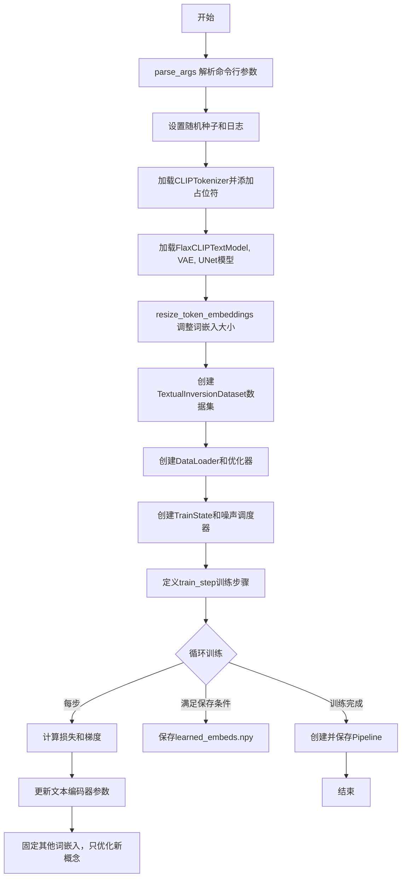
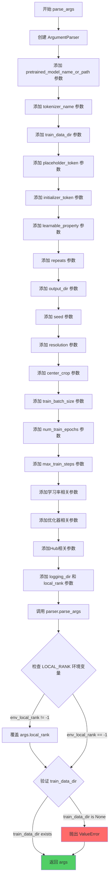
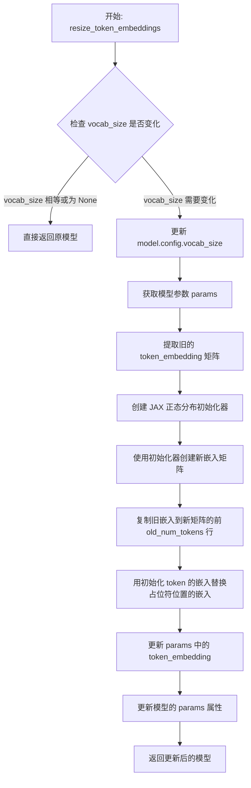
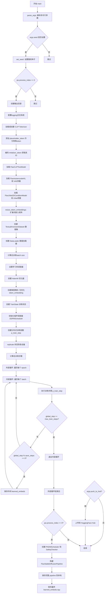
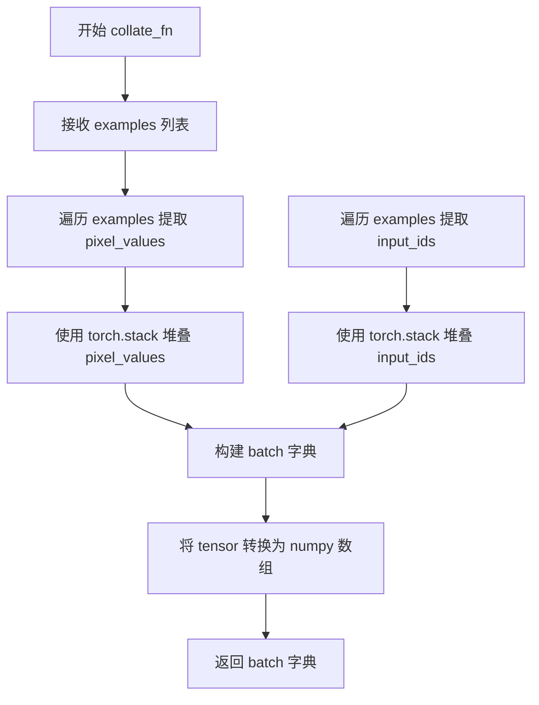
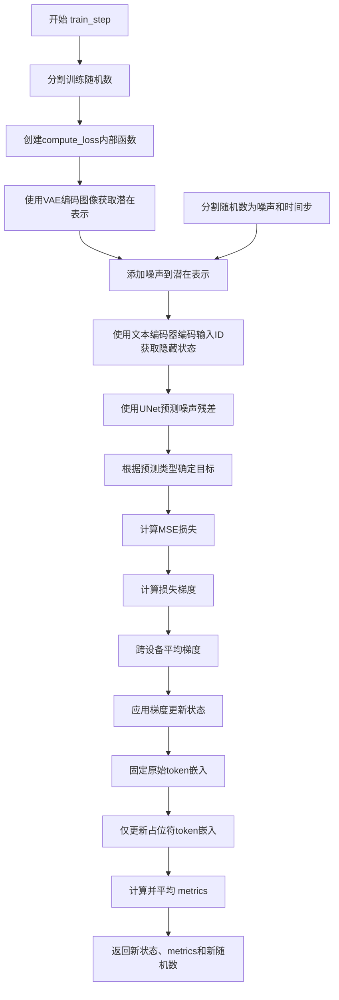
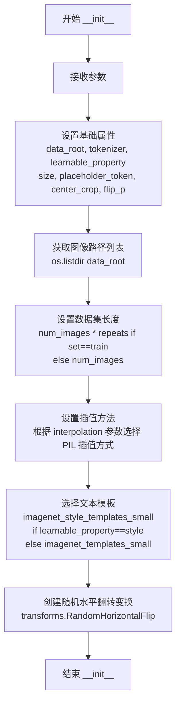
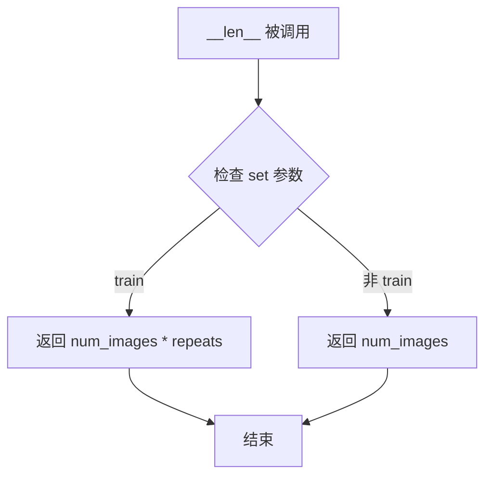

# `diffusers\examples\textual_inversion\textual_inversion_flax.py` 详细设计文档

这是一个基于Flax/JAX实现的Stable Diffusion文本反转(Textual Inversion)训练脚本，用于通过少量图像学习新概念（对象或风格）的词嵌入向量，实现个性化图像生成。

## 整体流程



## 类结构

```
无显式类继承结构
TextualInversionDataset (数据处理类)
    ├── __init__
    ├── __len__
    └── __getitem__
```

## 全局变量及字段


### `imagenet_templates_small`
    
A list of text templates used for object-based textual inversion training, containing 26 prompt templates for describing objects.

类型：`list[str]`
    


### `imagenet_style_templates_small`
    
A list of text templates used for style-based textual inversion training, containing 18 prompt templates for artistic styles.

类型：`list[str]`
    


### `PIL_INTERPOLATION`
    
A dictionary mapping interpolation method names to PIL Image resampling modes, supporting linear, bilinear, bicubic, lanczos, and nearest neighbors.

类型：`dict[str, Any]`
    


### `logger`
    
A module-level logger instance for logging training information and debug messages.

类型：`logging.Logger`
    


### `TextualInversionDataset.data_root`
    
The root directory path containing the training images for textual inversion.

类型：`str`
    


### `TextualInversionDataset.tokenizer`
    
The CLIP tokenizer instance used for encoding text prompts into token IDs.

类型：`CLIPTokenizer`
    


### `TextualInversionDataset.learnable_property`
    
A string indicating what type of concept to learn: either 'object' or 'style'.

类型：`str`
    


### `TextualInversionDataset.size`
    
The target resolution size for resizing input images (default 512 pixels).

类型：`int`
    


### `TextualInversionDataset.placeholder_token`
    
The special token used as a placeholder for the concept being learned in text prompts.

类型：`str`
    


### `TextualInversionDataset.center_crop`
    
A boolean flag indicating whether to center crop images before resizing to the target size.

类型：`bool`
    


### `TextualInversionDataset.flip_p`
    
The probability of applying horizontal flip augmentation to training images.

类型：`float`
    


### `TextualInversionDataset.image_paths`
    
A list of absolute file paths to all training images in the data_root directory.

类型：`list[str]`
    


### `TextualInversionDataset.num_images`
    
The count of unique images in the dataset before applying repetition.

类型：`int`
    


### `TextualInversionDataset._length`
    
The total length of the dataset after applying the repeats multiplier.

类型：`int`
    


### `TextualInversionDataset.interpolation`
    
The PIL resampling mode used for image interpolation when resizing images.

类型：`int`
    


### `TextualInversionDataset.templates`
    
The list of text templates selected based on learnable_property (style or object).

类型：`list[str]`
    


### `TextualInversionDataset.flip_transform`
    
A torchvision transform for randomly applying horizontal flip with probability flip_p.

类型：`transforms.RandomHorizontalFlip`
    
    

## 全局函数及方法


### `parse_args`

该函数是Stable Diffusion文本倒演训练脚本的命令行参数解析器，通过argparse定义并验证所有训练相关配置（如模型路径、数据目录、学习率、优化器参数等），同时处理分布式训练的环境变量覆盖，最终返回包含所有配置参数的Namespace对象。

参数：
- 该函数无显式输入参数（依赖命令行传入）

返回值：`argparse.Namespace`，包含所有解析后的命令行参数对象

#### 流程图



#### 带注释源码

```python
def parse_args():
    """
    解析命令行参数，返回包含所有训练配置的配置对象
    
    Returns:
        argparse.Namespace: 包含所有命令行参数的对象
    """
    # 创建参数解析器，设置脚本描述
    parser = argparse.ArgumentParser(description="Simple example of a training script.")
    
    # ==================== 模型相关参数 ====================
    # 预训练模型名称或路径（必需）
    parser.add_argument(
        "--pretrained_model_name_or_path",
        type=str,
        default=None,
        required=True,
        help="Path to pretrained model or model identifier from huggingface.co/models.",
    )
    # 分词器名称（可选，默认与模型相同）
    parser.add_argument(
        "--tokenizer_name",
        type=str,
        default=None,
        help="Pretrained tokenizer name or path if not the same as model_name",
    )
    
    # ==================== 数据相关参数 ====================
    # 训练数据目录（必需）
    parser.add_argument(
        "--train_data_dir", type=str, default=None, required=True, help="A folder containing the training data."
    )
    # 占位符token（必需，用于替代目标概念）
    parser.add_argument(
        "--placeholder_token",
        type=str,
        default=None,
        required=True,
        help="A token to use as a placeholder for the concept.",
    )
    # 初始化token（必需）
    parser.add_argument(
        "--initializer_token", type=str, default=None, required=True, help="A token to use as initializer word."
    )
    # 可学习的属性类型：object 或 style
    parser.add_argument("--learnable_property", type=str, default="object", help="Choose between 'object' and 'style'")
    # 数据重复次数
    parser.add_argument("--repeats", type=int, default=100, help="How many times to repeat the training data.")
    
    # ==================== 输出相关参数 ====================
    # 输出目录
    parser.add_argument(
        "--output_dir",
        type=str,
        default="text-inversion-model",
        help="The output directory where the model predictions and checkpoints will be written.",
    )
    # 日志目录
    parser.add_argument(
        "--logging_dir",
        type=str,
        default="logs",
        help=(
            "[TensorBoard](https://www.tensorflow.org/tensorboard) log directory. Will default to"
            " *output_dir/runs/**CURRENT_DATETIME_HOSTNAME***."
        ),
    )
    
    # ==================== 随机性和分辨率参数 ====================
    # 随机种子
    parser.add_argument("--seed", type=int, default=42, help="A seed for reproducible training.")
    # 输入图像分辨率
    parser.add_argument(
        "--resolution",
        type=int,
        default=512,
        help=(
            "The resolution for input images, all the images in the train/validation dataset will be resized to this"
            " resolution"
        ),
    )
    # 是否中心裁剪
    parser.add_argument(
        "--center_crop", action="store_true", help="Whether to center crop images before resizing to resolution."
    )
    
    # ==================== 训练参数 ====================
    # 训练批次大小
    parser.add_argument(
        "--train_batch_size", type=int, default=16, help="Batch size (per device) for the training dataloader."
    )
    # 训练轮数
    parser.add_argument("--num_train_epochs", type=int, default=100)
    # 最大训练步数（如果提供，则覆盖 num_train_epochs）
    parser.add_argument(
        "--max_train_steps",
        type=int,
        default=5000,
        help="Total number of training steps to perform.  If provided, overrides num_train_epochs.",
    )
    # 保存间隔步数
    parser.add_argument(
        "--save_steps",
        type=int,
        default=500,
        help="Save learned_embeds.bin every X updates steps.",
    )
    
    # ==================== 学习率参数 ====================
    # 初始学习率
    parser.add_argument(
        "--learning_rate",
        type=float,
        default=1e-4,
        help="Initial learning rate (after the potential warmup period) to use.",
    )
    # 是否按GPU数量、梯度累积和批次大小缩放学习率
    parser.add_argument(
        "--scale_lr",
        action="store_true",
        default=True,
        help="Scale the learning rate by the number of GPUs, gradient accumulation steps, and batch size.",
    )
    # 学习率预热步数
    parser.add_argument(
        "--lr_warmup_steps", type=int, default=500, help="Number of steps for the warmup in the lr scheduler."
    )
    # 学习率调度器类型
    parser.add_argument(
        "--lr_scheduler",
        type=str,
        default="constant",
        help=(
            'The scheduler type to use. Choose between ["linear", "cosine", "cosine_with_restarts", "polynomial",'
            ' "constant", "constant_with_warmup"]'
        ),
    )
    
    # ==================== 优化器参数 ====================
    # Adam优化器 beta1 参数
    parser.add_argument("--adam_beta1", type=float, default=0.9, help="The beta1 parameter for the Adam optimizer.")
    # Adam优化器 beta2 参数
    parser.add_argument("--adam_beta2", type=float, default=0.999, help="The beta2 parameter for the Adam optimizer.")
    # Adam优化器权重衰减
    parser.add_argument("--adam_weight_decay", type=float, default=1e-2, help="Weight decay to use.")
    # Adam优化器 epsilon 值
    parser.add_argument("--adam_epsilon", type=float, default=1e-08, help="Epsilon value for the Adam optimizer")
    
    # ==================== 模型Hub相关参数 ====================
    # 是否推送到Hub
    parser.add_argument("--push_to_hub", action="store_true", help="Whether or not to push the model to the Hub.")
    # 是否使用认证token
    parser.add_argument(
        "--use_auth_token",
        action="store_true",
        help=(
            "Will use the token generated when running `hf auth login` (necessary to use this script with"
            " private models)."
        ),
    )
    # Hub token
    parser.add_argument("--hub_token", type=str, default=None, help="The token to use to push to the Model Hub.")
    # Hub模型ID
    parser.add_argument(
        "--hub_model_id",
        type=str,
        default=None,
        help="The name of the repository to keep in sync with the local `output_dir`.",
    )
    # 模型版本修订号
    parser.add_argument(
        "--revision",
        type=str,
        default=None,
        required=False,
        help="Revision of pretrained model identifier from huggingface.co/models.",
    )
    
    # ==================== 分布式训练参数 ====================
    # 本地排名（用于分布式训练）
    parser.add_argument("--local_rank", type=int, default=-1, help="For distributed training: local_rank")
    
    # 解析命令行参数
    args = parser.parse_args()
    
    # 检查环境变量 LOCAL_RANK，用于分布式训练场景
    # 如果环境变量设置且与命令行参数不同，则使用环境变量的值
    env_local_rank = int(os.environ.get("LOCAL_RANK", -1))
    if env_local_rank != -1 and env_local_rank != args.local_rank:
        args.local_rank = env_local_rank
    
    # 验证必需参数
    if args.train_data_dir is None:
        raise ValueError("You must specify a train data directory.")
    
    return args
```


### `resize_token_embeddings`

该函数用于在文本反演（Textual Inversion）训练过程中调整预训练文本编码器（FlaxCLIPTextModel）的词嵌入矩阵大小，以便添加新的占位符 token 来学习目标概念（对象或风格）。

参数：

- `model`：`FlaxCLIPTextModel`，需要调整词嵌入大小的文本编码器模型
- `new_num_tokens`：`int`，新的词汇表大小，即添加占位符 token 后的总 token 数量
- `initializer_token_id`：`int`，初始化 token 的 ID，用于初始化占位符 token 的嵌入向量
- `placeholder_token_id`：`int`，占位符 token 的 ID，是在 tokenizer 中新添加的特殊 token
- `rng`：`jax.random.PRNGKey`，JAX 随机数生成器密钥，用于初始化新的嵌入向量

返回值：`FlaxCLIPTextModel`，更新词嵌入后的模型对象

#### 流程图



#### 带注释源码

```python
def resize_token_embeddings(model, new_num_tokens, initializer_token_id, placeholder_token_id, rng):
    """
    调整文本编码器的词嵌入矩阵大小
    
    参数:
        model: FlaxCLIPTextModel 实例
        new_num_tokens: 新的词汇表大小
        initializer_token_id: 用于初始化占位符的 token ID
        placeholder_token_id: 新添加的占位符 token ID
        rng: JAX 随机数密钥
    
    返回:
        更新后的模型
    """
    # 如果词汇表大小不变或 new_num_tokens 为 None，则直接返回
    if model.config.vocab_size == new_num_tokens or new_num_tokens is None:
        return
    
    # 更新模型配置中的词汇表大小
    model.config.vocab_size = new_num_tokens

    # 获取模型的当前参数
    params = model.params
    
    # 从参数中提取旧的 token embeddings
    # 结构: params["text_model"]["embeddings"]["token_embedding"]["embedding"]
    old_embeddings = params["text_model"]["embeddings"]["token_embedding"]["embedding"]
    
    # 获取旧嵌入的形状: (token数量, 嵌入维度)
    old_num_tokens, emb_dim = old_embeddings.shape

    # 创建 JAX 正态分布初始化器
    initializer = jax.nn.initializers.normal()

    # 使用初始化器创建新的嵌入矩阵，形状为 (new_num_tokens, emb_dim)
    new_embeddings = initializer(rng, (new_num_tokens, emb_dim))
    
    # 将旧嵌入复制到新嵌入矩阵的前 old_num_tokens 行
    new_embeddings = new_embeddings.at[:old_num_tokens].set(old_embeddings)
    
    # 使用初始化 token 的嵌入来初始化占位符 token 的嵌入
    # 这是文本反演技术的关键：让占位符从已知概念开始学习
    new_embeddings = new_embeddings.at[placeholder_token_id].set(new_embeddings[initializer_token_id])
    
    # 更新参数中的 token_embedding
    params["text_model"]["embeddings"]["token_embedding"]["embedding"] = new_embeddings

    # 将更新后的参数重新赋值给模型
    model.params = params
    
    # 返回更新后的模型
    return model
```


### `get_params_to_save`

该函数用于将分布式训练中复制的多设备参数（pytree）提取为单设备参数。在JAX分布式训练中，参数通常会被复制到多个设备上，此函数通过取每个设备参数的第一个元素来还原单设备参数结构。

参数：

- `params`：`pytree`，JAX模型参数，通常是经过`jax_utils.replicate`处理的复参数结构，包含多个设备的参数副本

返回值：`pytree`，与输入结构相同的参数树，但每个叶子节点仅包含第一个设备的参数值（从ShardedDeviceArray转换为普通numpy数组）

#### 流程图

```mermaid
flowchart TD
    A[输入: params<br/>复制的多设备参数pytree] --> B{jax.tree_util.tree_map}
    B --> C[对每个叶子节点<br/>应用lambda x: x[0]]
    C --> D[取第一个设备<br/>的参数值]
    D --> E{jax.device_get}
    E --> F[将设备数组<br/>转为numpy数组]
    F --> G[输出: 单设备参数pytree]
    
    style A fill:#e1f5fe
    style G fill:#e8f5e8
    style B fill:#fff3e0
    style E fill:#fff3e0
```

#### 带注释源码

```python
def get_params_to_save(params):
    """
    从分布式训练中提取单设备参数用于保存
    
    在JAX分布式训练中，参数通过jax_utils.replicate会被复制到多个设备，
    形成ShardedDeviceArray结构。此函数将多设备参数还原为可在CPU上
    序列化的普通numpy数组格式。
    
    参数:
        params: 经过jax_utils.replicate处理的参数字典（pytree）
        
    返回:
        与输入结构相同的pytree，但每个叶子节点为单设备的numpy数组
    """
    # 使用jax.tree_util.tree_map遍历整个参数树结构
    # lambda x: x[0] 表示取每个设备参数副本的第一个元素（即第一个设备的参数）
    # jax.device_get 将结果从GPU/TPU设备转回CPU上的numpy数组
    return jax.device_get(jax.tree_util.tree_map(lambda x: x[0], params))
```


### `main`

该函数是文本倒置（Textual Inversion）训练脚本的核心入口，负责加载预训练的Stable Diffusion模型（文本编码器、VAE、UNet），添加并训练新的概念嵌入（placeholder token），通过多轮训练学习文本概念表示，最终保存训练好的嵌入向量和完整推理管道。

参数：此函数无显式参数，通过内部调用`parse_args()`获取命令行参数。

返回值：`None`，执行完成后直接退出。

#### 流程图



#### 带注释源码

```python
def main():
    """
    文本倒置训练主函数。
    负责加载预训练模型、数据集创建、训练循环执行和模型保存。
    """
    # 步骤1: 解析命令行参数
    args = parse_args()

    # 步骤2: 设置随机种子以确保可重复性
    if args.seed is not None:
        set_seed(args.seed)

    # 步骤3: 主进程(0号进程)创建输出目录
    if jax.process_index() == 0:
        if args.output_dir is not None:
            os.makedirs(args.output_dir, exist_ok=True)

        # 如果需要推送到Hub，先创建仓库
        if args.push_to_hub:
            repo_id = create_repo(
                repo_id=args.hub_model_id or Path(args.output_dir).name, 
                exist_ok=True, 
                token=args.hub_token
            ).repo_id

    # 步骤4: 配置日志系统
    # 设置日志格式，仅在主进程输出详细日志
    logging.basicConfig(
        format="%(asctime)s - %(levelname)s - %(name)s -   %(message)s",
        datefmt="%m/%d/%Y %H:%M:%S",
        level=logging.INFO,
    )
    logger.setLevel(logging.INFO if jax.process_index() == 0 else logging.ERROR)
    if jax.process_index() == 0:
        transformers.utils.logging.set_verbosity_info()
    else:
        transformers.utils.logging.set_verbosity_error()

    # 步骤5: 加载Tokenizer并添加占位符token
    if args.tokenizer_name:
        tokenizer = CLIPTokenizer.from_pretrained(args.tokenizer_name)
    elif args.pretrained_model_name_or_path:
        tokenizer = CLIPTokenizer.from_pretrained(args.pretrained_model_name_or_path, subfolder="tokenizer")

    # 将占位符token添加到tokenizer作为新的特殊token
    num_added_tokens = tokenizer.add_tokens(args.placeholder_token)
    if num_added_tokens == 0:
        raise ValueError(
            f"The tokenizer already contains the token {args.placeholder_token}. Please pass a different"
            " `placeholder_token` that is not already in the tokenizer."
        )

    # 步骤6: 将initializer_token转换为ID并验证
    token_ids = tokenizer.encode(args.initializer_token, add_special_tokens=False)
    if len(token_ids) > 1:
        raise ValueError("The initializer token must be a single token.")

    initializer_token_id = token_ids[0]
    placeholder_token_id = tokenizer.convert_tokens_to_ids(args.placeholder_token)

    # 步骤7: 加载预训练的Stable Diffusion模型组件
    text_encoder = FlaxCLIPTextModel.from_pretrained(
        args.pretrained_model_name_or_path, subfolder="text_encoder", revision=args.revision
    )
    vae, vae_params = FlaxAutoencoderKL.from_pretrained(
        args.pretrained_model_name_or_path, subfolder="vae", revision=args.revision
    )
    unet, unet_params = FlaxUNet2DConditionModel.from_pretrained(
        args.pretrained_model_name_or_path, subfolder="unet", revision=args.revision
    )

    # 步骤8: 创建随机数生成器并调整token embeddings维度
    rng = jax.random.PRNGKey(args.seed)
    rng, _ = jax.random.split(rng)
    # 扩展词嵌入矩阵以容纳新添加的token
    text_encoder = resize_token_embeddings(
        text_encoder, len(tokenizer), initializer_token_id, placeholder_token_id, rng
    )
    # 保存原始embeddings用于后续恢复
    original_token_embeds = text_encoder.params["text_model"]["embeddings"]["token_embedding"]["embedding"]

    # 步骤9: 创建训练数据集
    train_dataset = TextualInversionDataset(
        data_root=args.train_data_dir,
        tokenizer=tokenizer,
        size=args.resolution,
        placeholder_token=args.placeholder_token,
        repeats=args.repeats,
        learnable_property=args.learnable_property,
        center_crop=args.center_crop,
        set="train",
    )

    # 步骤10: 定义批处理整理函数
    def collate_fn(examples):
        """将多个样本整理为一个batch"""
        pixel_values = torch.stack([example["pixel_values"] for example in examples])
        input_ids = torch.stack([example["input_ids"] for example in examples])

        batch = {"pixel_values": pixel_values, "input_ids": input_ids}
        # 转换为numpy数组以适配JAX
        batch = {k: v.numpy() for k, v in batch.items()}

        return batch

    # 步骤11: 创建数据加载器
    total_train_batch_size = args.train_batch_size * jax.local_device_count()
    train_dataloader = torch.utils.data.DataLoader(
        train_dataset, 
        batch_size=total_train_batch_size, 
        shuffle=True, 
        drop_last=True, 
        collate_fn=collate_fn
    )

    # 步骤12: 学习率缩放和优化器配置
    if args.scale_lr:
        args.learning_rate = args.learning_rate * total_train_batch_size

    constant_scheduler = optax.constant_schedule(args.learning_rate)

    optimizer = optax.adamw(
        learning_rate=constant_scheduler,
        b1=args.adam_beta1,
        b2=args.adam_beta2,
        eps=args.adam_epsilon,
        weight_decay=args.adam_weight_decay,
    )

    # 步骤13: 创建梯度掩码 - 仅更新token_embedding层
    def create_mask(params, label_fn):
        """创建梯度掩码，对不同层应用不同的优化策略"""
        def _map(params, mask, label_fn):
            for k in params:
                if label_fn(k):
                    mask[k] = "token_embedding"
                else:
                    if isinstance(params[k], dict):
                        mask[k] = {}
                        _map(params[k], mask[k], label_fn)
                    else:
                        mask[k] = "zero"

        mask = {}
        _map(params, mask, label_fn)
        return mask

    def zero_grads():
        """创建零梯度更新函数"""
        # 用于冻结非token_embedding层
        def init_fn(_):
            return ()

        def update_fn(updates, state, params=None):
            return jax.tree_util.tree_map(jnp.zeros_like, updates), ()

        return optax.GradientTransformation(init_fn, update_fn)

    # 组合优化器: token_embedding使用正常优化，其他层梯度置零
    tx = optax.multi_transform(
        {"token_embedding": optimizer, "zero": zero_grads()},
        create_mask(text_encoder.params, lambda s: s == "token_embedding"),
    )

    # 步骤14: 创建训练状态
    state = train_state.TrainState.create(
        apply_fn=text_encoder.__call__, 
        params=text_encoder.params, 
        tx=tx
    )

    # 步骤15: 初始化噪声调度器
    noise_scheduler = FlaxDDPMScheduler(
        beta_start=0.00085, 
        beta_end=0.012, 
        beta_schedule="scaled_linear", 
        num_train_timesteps=1000
    )
    noise_scheduler_state = noise_scheduler.create_state()

    # 步骤16: 准备分布式训练
    train_rngs = jax.random.split(rng, jax.local_device_count())

    # 步骤17: 定义单步训练函数
    def train_step(state, vae_params, unet_params, batch, train_rng):
        """
        执行一次前向传播、损失计算和梯度更新
        """
        dropout_rng, sample_rng, new_train_rng = jax.random.split(train_rng, 3)

        def compute_loss(params):
            """计算噪声预测损失"""
            # VAE编码图像到潜在空间
            vae_outputs = vae.apply(
                {"params": vae_params}, batch["pixel_values"], deterministic=True, method=vae.encode
            )
            latents = vae_outputs.latent_dist.sample(sample_rng)
            # (NHWC) -> (NCHW)
            latents = jnp.transpose(latents, (0, 3, 1, 2))
            latents = latents * vae.config.scaling_factor

            # 生成随机噪声和时间步
            noise_rng, timestep_rng = jax.random.split(sample_rng)
            noise = jax.random.normal(noise_rng, latents.shape)
            bsz = latents.shape[0]
            timesteps = jax.random.randint(
                timestep_rng,
                (bsz,),
                0,
                noise_scheduler.config.num_train_timesteps,
            )
            # 向潜在表示添加噪声
            noisy_latents = noise_scheduler.add_noise(noise_scheduler_state, latents, noise, timesteps)
            
            # 文本编码器获取文本嵌入
            encoder_hidden_states = state.apply_fn(
                batch["input_ids"], params=params, dropout_rng=dropout_rng, train=True
            )[0]
            
            # UNet预测噪声残差
            model_pred = unet.apply(
                {"params": unet_params}, noisy_latents, timesteps, encoder_hidden_states, train=False
            ).sample

            # 根据预测类型确定目标
            if noise_scheduler.config.prediction_type == "epsilon":
                target = noise
            elif noise_scheduler.config.prediction_type == "v_prediction":
                target = noise_scheduler.get_velocity(noise_scheduler_state, latents, noise, timesteps)
            else:
                raise ValueError(f"Unknown prediction type {noise_scheduler.config.prediction_type}")

            # 计算MSE损失
            loss = (target - model_pred) ** 2
            loss = loss.mean()

            return loss

        # 计算损失和梯度
        grad_fn = jax.value_and_grad(compute_loss)
        loss, grad = grad_fn(state.params)
        # 跨设备平均梯度
        grad = jax.lax.pmean(grad, "batch")
        new_state = state.apply_gradients(grads=grad)

        # 保持原始token embeddings不变，仅更新新添加的placeholder token embeddings
        token_embeds = original_token_embeds.at[placeholder_token_id].set(
            new_state.params["text_model"]["embeddings"]["token_embedding"]["embedding"][placeholder_token_id]
        )
        new_state.params["text_model"]["embeddings"]["token_embedding"]["embedding"] = token_embeds

        metrics = {"loss": loss}
        metrics = jax.lax.pmean(metrics, axis_name="batch")
        return new_state, metrics, new_train_rng

    # 步骤18: 创建并行训练函数
    p_train_step = jax.pmap(train_step, "batch", donate_argnums=(0,))

    # 步骤19: 将状态复制到所有设备
    state = jax_utils.replicate(state)
    vae_params = jax_utils.replicate(vae_params)
    unet_params = jax_utils.replicate(unet_params)

    # 步骤20: 计算训练参数
    num_update_steps_per_epoch = math.ceil(len(train_dataloader))

    if args.max_train_steps is None:
        args.max_train_steps = args.num_train_epochs * num_update_steps_per_epoch

    args.num_train_epochs = math.ceil(args.max_train_steps / num_update_steps_per_epoch)

    # 打印训练信息
    logger.info("***** Running training *****")
    logger.info(f"  Num examples = {len(train_dataset)}")
    logger.info(f"  Num Epochs = {args.num_train_epochs}")
    logger.info(f"  Instantaneous batch size per device = {args.train_batch_size}")
    logger.info(f"  Total train batch size (w. parallel & distributed) = {total_train_batch_size}")
    logger.info(f"  Total optimization steps = {args.max_train_steps}")

    global_step = 0

    # 步骤21: 训练主循环
    epochs = tqdm(range(args.num_train_epochs), desc=f"Epoch ... (1/{args.num_train_epochs})", position=0)
    for epoch in epochs:
        train_metrics = []

        steps_per_epoch = len(train_dataset) // total_train_batch_size
        train_step_progress_bar = tqdm(total=steps_per_epoch, desc="Training...", position=1, leave=False)
        
        # 遍历每个batch
        for batch in train_dataloader:
            # 分片batch到各设备
            batch = shard(batch)
            # 执行训练步骤
            state, train_metric, train_rngs = p_train_step(state, vae_params, unet_params, batch, train_rngs)
            train_metrics.append(train_metric)

            train_step_progress_bar.update(1)
            global_step += 1

            # 检查是否达到最大训练步数
            if global_step >= args.max_train_steps:
                break
            
            # 定期保存中间结果
            if global_step % args.save_steps == 0:
                learned_embeds = get_params_to_save(state.params)["text_model"]["embeddings"]["token_embedding"][
                    "embedding"
                ][placeholder_token_id]
                learned_embeds_dict = {args.placeholder_token: learned_embeds}
                jnp.save(
                    os.path.join(args.output_dir, "learned_embeds-" + str(global_step) + ".npy"), 
                    learned_embeds_dict
                )

        # 收集并打印训练指标
        train_metric = jax_utils.unreplicate(train_metric)

        train_step_progress_bar.close()
        epochs.write(f"Epoch... ({epoch + 1}/{args.num_train_epochs} | Loss: {train_metric['loss']})")

    # 步骤22: 保存最终模型
    if jax.process_index() == 0:
        # 创建推理用调度器
        scheduler = FlaxPNDMScheduler(
            beta_start=0.00085, 
            beta_end=0.012, 
            beta_schedule="scaled_linear", 
            skip_prk_steps=True
        )
        # 加载安全检查器
        safety_checker = FlaxStableDiffusionSafetyChecker.from_pretrained(
            "CompVis/stable-diffusion-safety-checker", 
            from_pt=True
        )
        
        # 构建完整推理pipeline
        pipeline = FlaxStableDiffusionPipeline(
            text_encoder=text_encoder,
            vae=vae,
            unet=unet,
            tokenizer=tokenizer,
            scheduler=scheduler,
            safety_checker=safety_checker,
            feature_extractor=CLIPImageProcessor.from_pretrained("openai/clip-vit-base-patch32"),
        )

        # 保存完整pipeline
        pipeline.save_pretrained(
            args.output_dir,
            params={
                "text_encoder": get_params_to_save(state.params),
                "vae": get_params_to_save(vae_params),
                "unet": get_params_to_save(unet_params),
                "safety_checker": safety_checker.params,
            },
        )

        # 保存训练好的embeddings
        learned_embeds = get_params_to_save(state.params)["text_model"]["embeddings"]["token_embedding"][
            "embedding"
        ][placeholder_token_id]
        learned_embeds_dict = {args.placeholder_token: learned_embeds}
        jnp.save(os.path.join(args.output_dir, "learned_embeds.npy"), learned_embeds_dict)

        # 如果需要，推送到HuggingFace Hub
        if args.push_to_hub:
            upload_folder(
                repo_id=repo_id,
                folder_path=args.output_dir,
                commit_message="End of training",
                ignore_patterns=["step_*", "epoch_*"],
            )
```


### `collate_fn`

该函数是PyTorch DataLoader的回调函数，用于将数据集中的多个样本批次整理成模型训练所需的批量数据。它从样本列表中提取像素值和输入ID，堆叠成批，并转换为NumPy数组格式以适配Flax/JAX模型。

参数：

- `examples`：`list`，从`TextualInversionDataset`数据集返回的样本列表，每个样本是一个包含`pixel_values`和`input_ids`键的字典

返回值：`dict`，包含批量数据的字典，具有以下键值对：
- `pixel_values`：`numpy.ndarray`，图像像素值，形状为`(batch_size, height, width, channels)`或`(batch_size, channels, height, width)`
- `input_ids`：`numpy.ndarray`，文本输入ID，形状为`(batch_size, sequence_length)`

#### 流程图



#### 带注释源码

```python
def collate_fn(examples):
    """
    DataLoader的回调函数，用于将多个样本整理成批量数据
    
    参数:
        examples: 从数据集返回的样本列表，每个样本是包含
                 'pixel_values' 和 'input_ids' 的字典
    
    返回:
        batch: 包含批量数据的字典，已转换为NumPy数组格式
    """
    # 从所有样本中提取pixel_values并堆叠成张量
    # pixel_values: torch.Tensor, 形状为 (batch_size, C, H, W)
    pixel_values = torch.stack([example["pixel_values"] for example in examples])
    
    # 从所有样本中提取input_ids并堆叠成张量
    # input_ids: torch.Tensor, 形状为 (batch_size, seq_len)
    input_ids = torch.stack([example["input_ids"] for example in examples])
    
    # 构建包含pixel_values和input_ids的批次字典
    batch = {"pixel_values": pixel_values, "input_ids": input_ids}
    
    # 将PyTorch张量转换为NumPy数组，以适配Flax/JAX模型
    # 这一步是必要的，因为该训练脚本使用Flax (JAX) 进行模型前向传播
    batch = {k: v.numpy() for k, v in batch.items()}
    
    return batch
```


### `create_mask`

该函数用于根据给定的标签函数递归地为模型参数创建一个梯度掩码（mask），以便在训练过程中只对特定参数（如 token_embedding 层）进行梯度更新，而将其他参数的梯度置零。

参数：

- `params`：`dict`，模型的参数字典，通常是 `text_encoder.params`，包含了文本编码器的所有参数层级结构。
- `label_fn`：`Callable[[str], bool]`，一个标签函数，接收参数键（字符串）作为输入，返回布尔值。当返回 `True` 时，表示该参数需要被训练（即设置 mask 为 "token_embedding"）。

返回值：`dict`，返回一个与 `params` 结构相同的掩码字典，其中需要训练的参数对应值为 `"token_embedding"`，其他参数对应值为 `"zero"`。

#### 流程图

```mermaid
flowchart TD
    A[开始 create_mask] --> B[初始化空 mask 字典]
    B --> C[调用内部函数 _map]
    C --> D{遍历 params 的键值对}
    D --> E{label_fn 判断}
    E -->|True| F[设置 mask[k] = 'token_embedding']
    E -->|False| G{params[k] 是否为字典}
    G -->|是| H[初始化 mask[k] 为空字典]
    H --> I[递归调用 _map 处理子字典]
    I --> D
    G -->|否| J[设置 mask[k] = 'zero']
    J --> D
    F --> K[返回最终 mask]
    J --> K
    I --> K
```

#### 带注释源码

```python
def create_mask(params, label_fn):
    """
    创建一个梯度掩码，用于选择性更新模型参数。

    Args:
        params: 模型参数字典，键为参数名称，值可以是嵌套字典或实际参数张量
        label_fn: 标签函数，用于判断参数键是否需要训练

    Returns:
        mask: 与 params 结构相同的掩码字典，标记需要训练的参数
    """
    
    def _map(params, mask, label_fn):
        """
        内部递归函数，遍历参数字典并生成对应的掩码。
        
        Args:
            params: 当前层级的参数字典
            mask: 当前层级的掩码字典
            label_fn: 标签函数
        """
        # 遍历参数字典的所有键
        for k in params:
            # 如果 label_fn 返回 True，表示该参数需要训练
            if label_fn(k):
                # 将 mask 中对应键设置为 'token_embedding'
                mask[k] = "token_embedding"
            else:
                # 如果参数值是字典（嵌套结构），需要递归处理
                if isinstance(params[k], dict):
                    mask[k] = {}  # 初始化子掩码字典
                    _map(params[k], mask[k], label_fn)  # 递归调用处理子字典
                else:
                    # 非叶子节点，设置为 'zero'，表示该参数梯度被置零
                    mask[k] = "zero"

    # 初始化空的掩码字典
    mask = {}
    # 调用内部函数开始递归处理
    _map(params, mask, label_fn)
    # 返回生成的掩码
    return mask
```


### `zero_grads`

该函数是一个用于创建梯度归零优化器的工厂函数，返回一个 `optax.GradientTransformation` 对象。其内部定义的 `update_fn` 会将输入的梯度更新（updates）全部置零，常与 `optax.multi_transform` 配合使用，用于冻结模型特定层（如非 token embedding 层）的梯度，实现只对新增 token embedding 进行训练的目的。

参数： 无

返回值：`optax.GradientTransformation`，返回 optax 的梯度变换对象，其 `init_fn` 初始化为空状态，`update_fn` 执行将所有梯度置零的操作。

#### 流程图

```mermaid
flowchart TD
    A[调用 zero_grads] --> B[定义 init_fn]
    A --> C[定义 update_fn]
    
    B --> D[返回空元组 ()]
    
    C --> E[接收 updates, state, params]
    E --> F[使用 jax.tree_util.tree_map]
    F --> G[jnp.zeros_like 将 updates 中所有叶子节点置零]
    G --> H[返回置零后的 updates 和空状态 ()]
    
    D --> I[返回 optax.GradientTransformation 实例]
    H --> I
    
    I --> J[与 optimizer 组合成 multi_transform]
    J --> K[用于冻结非 token_embedding 层的梯度]
```

#### 带注释源码

```python
def zero_grads():
    # 定义初始化函数，用于创建优化器的初始状态
    # optax.GradientTransformation 要求 init_fn 接收参数并返回初始状态
    def init_fn(_):
        return ()

    # 定义更新函数，用于对梯度进行变换处理
    # 参数:
    #   updates: 当前计算的梯度
    #   state: 优化器状态（此处为空元组）
    #   params: 模型参数（可选，此处未使用）
    def update_fn(updates, state, params=None):
        # 使用 jax.tree_util.tree_map 递归遍历整个梯度树
        # 对每个叶子节点（每个参数的梯度）应用 jnp.zeros_like
        # 即创建一个与原梯度形状和类型相同的全零数组，实现梯度置零
        return jax.tree_util.tree_map(jnp.zeros_like, updates), ()

    # 返回一个 optax.GradientTransformation 对象
    # 该对象封装了 init_fn 和 update_fn，可用于 optax 的优化流程
    return optax.GradientTransformation(init_fn, update_fn)
```


### `train_step`

该函数是文本倒置训练的核心单步训练函数，负责在每个训练步骤中计算损失、梯度并更新文本编码器的token嵌入参数。该函数通过VAE编码图像获取潜在表示，添加噪声后使用UNet预测噪声残差，最后仅更新新添加的占位符token嵌入。

参数：

- `state`：`train_state.TrainState`，Flax训练状态，包含文本编码器的参数和优化器状态
- `vae_params`：字典，VAE（变分自编码器）模型的参数，用于编码图像到潜在空间
- `unet_params`：字典，UNet模型的参数，用于预测噪声残差
- `batch`：字典，训练批次数据，包含`pixel_values`（图像像素值）和`input_ids`（文本输入ID）
- `train_rng`：JAX随机数生成器，用于训练过程中的随机操作（如dropout和噪声生成）

返回值：`(new_state, metrics, new_train_rng)` 元组
- `new_state`：`train_state.TrainState`，更新后的训练状态，包含更新后的文本编码器参数
- `metrics`：字典，包含`loss`键，值为计算得到的损失值（跨设备平均）
- `new_train_rng`：JAX随机数生成器，更新后的随机数生成器状态

#### 流程图



#### 带注释源码

```python
def train_step(state, vae_params, unet_params, batch, train_rng):
    """
    执行单步训练：计算损失、梯度并更新文本编码器参数
    
    参数:
        state: Flax训练状态对象
        vae_params: VAE模型参数
        unet_params: UNet模型参数  
        batch: 训练批次字典，包含pixel_values和input_ids
        train_rng: JAX随机数生成器
    
    返回:
        (new_state, metrics, new_train_rng): 更新后的状态、指标和新随机数
    """
    # 将训练随机数分割为dropout、采样和新的训练随机数
    dropout_rng, sample_rng, new_train_rng = jax.random.split(train_rng, 3)

    def compute_loss(params):
        """
        内部损失计算函数
        
        参数:
            params: 文本编码器的参数
            
        返回:
            loss: 计算得到的MSE损失
        """
        # 使用VAE编码图像像素值得到潜在分布
        vae_outputs = vae.apply(
            {"params": vae_params}, batch["pixel_values"], deterministic=True, method=vae.encode
        )
        # 从潜在分布中采样
        latents = vae_outputs.latent_dist.sample(sample_rng)
        # 调整维度顺序: (NHWC) -> (NCHW)
        latents = jnp.transpose(latents, (0, 3, 1, 2))
        # 缩放潜在表示
        latents = latents * vae.config.scaling_factor

        # 分割随机数用于噪声和时间步采样
        noise_rng, timestep_rng = jax.random.split(sample_rng)
        # 生成与潜在表示形状相同的随机噪声
        noise = jax.random.normal(noise_rng, latents.shape)
        # 获取批次大小
        bsz = latents.shape[0]
        # 随机采样时间步
        timesteps = jax.random.randint(
            timestep_rng,
            (bsz,),
            0,
            noise_scheduler.config.num_train_timesteps,
        )
        # 根据时间步向潜在表示添加噪声
        noisy_latents = noise_scheduler.add_noise(noise_scheduler_state, latents, noise, timesteps)
        # 使用文本编码器编码输入ID获取条件隐藏状态
        encoder_hidden_states = state.apply_fn(
            batch["input_ids"], params=params, dropout_rng=dropout_rng, train=True
        )[0]
        
        # 使用UNet预测噪声残差
        model_pred = unet.apply(
            {"params": unet_params}, noisy_latents, timesteps, encoder_hidden_states, train=False
        ).sample

        # 根据预测类型确定损失目标
        if noise_scheduler.config.prediction_type == "epsilon":
            target = noise  # 噪声预测
        elif noise_scheduler.config.prediction_type == "v_prediction":
            target = noise_scheduler.get_velocity(noise_scheduler_state, latents, noise, timesteps)
        else:
            raise ValueError(f"Unknown prediction type {noise_scheduler_config.prediction_type}")

        # 计算均方误差损失
        loss = (target - model_pred) ** 2
        loss = loss.mean()

        return loss

    # 创建梯度计算函数
    grad_fn = jax.value_and_grad(compute_loss)
    # 计算损失和梯度
    loss, grad = grad_fn(state.params)
    # 跨设备维度平均梯度（用于分布式训练）
    grad = jax.lax.pmean(grad, "batch")
    # 应用梯度更新状态
    new_state = state.apply_gradients(grads=grad)

    # 保持原始token嵌入不变，只更新新添加的占位符token嵌入
    # 这样可以保留原始CLIP模型的表达能力
    token_embeds = original_token_embeds.at[placeholder_token_id].set(
        new_state.params["text_model"]["embeddings"]["token_embedding"]["embedding"][placeholder_token_id]
    )
    new_state.params["text_model"]["embeddings"]["token_embedding"]["embedding"] = token_embeds

    # 构建指标字典
    metrics = {"loss": loss}
    # 跨设备平均指标
    metrics = jax.lax.pmean(metrics, axis_name="batch")
    
    return new_state, metrics, new_train_rng
```


### `TextualInversionDataset.__init__`

该方法是 `TextualInversionDataset` 类的构造函数，用于初始化文本反转（Textual Inversion）训练数据集。它负责设置数据集的基本参数、图像路径、文本模板和图像变换等核心组件，为后续的模型训练提供数据准备。

参数：

- `data_root`：`str`，数据集根目录路径，包含用于训练的图像文件
- `tokenizer`：`CLIPTokenizer`，用于将文本转换为 token ID 的分词器
- `learnable_property`：`str`，可选值为 `"object"` 或 `"style"`，表示学习的概念类型，默认为 `"object"`
- `size`：`int`，图像的目标分辨率，默认为 512 像素
- `repeats`：`int`，数据集重复次数，用于增加训练数据量，默认为 100
- `interpolation`：`str`，图像插值方法，可选 `"linear"`, `"bilinear"`, `"bicubic"`, `"lanczos"`，默认为 `"bicubic"`
- `flip_p`：`float`，随机水平翻转的概率，默认为 0.5
- `set`：`str`，数据集类型标识，默认为 `"train"`
- `placeholder_token`：`str`，占位符 token，用于在文本模板中表示要学习的概念，默认为 `"*"`
- `center_crop`：`bool`，是否执行中心裁剪，默认为 `False`

返回值：`None`，构造函数不返回值，仅初始化对象属性

#### 流程图



#### 带注释源码

```python
def __init__(
    self,
    data_root,              # str: 训练图像所在的根目录路径
    tokenizer,              # CLIPTokenizer: 用于编码文本的 tokenizer 实例
    learnable_property="object",  # str: 要学习的概念类型，"object" 或 "style"
    size=512,               # int: 图像的目标尺寸（宽度和高度）
    repeats=100,            # int: 训练集重复次数，用于数据增强
    interpolation="bicubic", # str: 图像缩放时使用的插值方法
    flip_p=0.5,             # float: 随机水平翻转的概率
    set="train",            # str: 数据集标识，"train" 或其他
    placeholder_token="*",  # str: 占位符 token，代表要学习的概念
    center_crop=False,      # bool: 是否在调整大小前进行中心裁剪
):
    # 1. 保存基础配置参数
    self.data_root = data_root
    self.tokenizer = tokenizer
    self.learnable_property = learnable_property
    self.size = size
    self.placeholder_token = placeholder_token
    self.center_crop = center_crop
    self.flip_p = flip_p

    # 2. 获取数据目录中的所有图像文件路径
    # 使用 os.listdir 列出目录中的所有文件，并与根目录拼接成完整路径
    self.image_paths = [os.path.join(self.data_root, file_path) for file_path in os.listdir(self.data_root)]

    # 3. 设置数据集长度
    self.num_images = len(self.image_paths)  # 原始图像数量
    self._length = self.num_images

    # 如果是训练集，根据 repeats 参数扩展数据集长度
    # 这样可以让每个图像在单个 epoch 中被使用多次
    if set == "train":
        self._length = self.num_images * repeats

    # 4. 设置图像插值方法
    # 根据传入的插值类型字符串，从预定义的 PIL_INTERPOLATION 字典中获取对应的插值枚举值
    self.interpolation = {
        "linear": PIL_INTERPOLATION["linear"],
        "bilinear": PIL_INTERPOLATION["bilinear"],
        "bicubic": PIL_INTERPOLATION["bicubic"],
        "lanczos": PIL_INTERPOLATION["lanczos"],
    }[interpolation]

    # 5. 选择文本模板
    # 根据 learnable_property 选择不同的提示词模板
    # style 类型使用艺术风格模板，object 类型使用普通物体模板
    self.templates = imagenet_style_templates_small if learnable_property == "style" else imagenet_templates_small

    # 6. 创建随机水平翻转变换
    # 用于数据增强，以指定的概率 flip_p 随机翻转图像
    self.flip_transform = transforms.RandomHorizontalFlip(p=self.flip_p)
```


### `TextualInversionDataset.__len__`

该方法实现了 PyTorch Dataset 类的标准接口，返回数据集中可用的样本总数。对于训练集，样本数量等于原始图像数量乘以重复次数（repeats），用于增加训练轮次；对于验证集，则直接返回原始图像数量。

参数： 无（继承自 Python 特殊方法 `__len__`）

返回值： `int`，返回数据集中可用的样本总数。如果 `set` 参数为 "train"，返回 `num_images * repeats`；否则返回 `num_images`。

#### 流程图



#### 带注释源码

```python
def __len__(self):
    """
    返回数据集中样本的总数。
    
    该方法是 PyTorch Dataset 类的标准接口方法，使得 DataLoader 
    能够确定数据集的大小并正确分批。
    
    Returns:
        int: 如果数据集用于训练（set="train"），返回原始图像数量乘以重复次数；
             否则返回原始图像数量。
    """
    return self._length
```

#### 相关上下文（类属性说明）

| 属性名称 | 类型 | 描述 |
|---------|------|------|
| `self._length` | int | 数据集长度，根据 `set` 参数和 `repeats` 计算得出 |
| `self.num_images` | int | 原始图像文件数量，从数据目录中扫描得到 |
| `self.repeats` | int | 训练时重复次数，在 `__init__` 中设置（默认为 100） |
| `self.set` | str | 数据集用途标识，"train" 或其他值 |


### `TextualInversionDataset.__getitem__`

该方法是 `TextualInversionDataset` 类的核心实例方法，用于从数据集中加载并预处理单个样本。它根据传入的索引加载对应的图像，应用中心裁剪、缩放、随机水平翻转等预处理操作，并使用模板生成带有占位符的文本描述，最后将图像像素值和文本token IDs封装到字典中返回，供模型训练使用。

参数：

- `i`：`int`，数据集中样本的索引，用于从图像路径列表中定位对应的图像文件

返回值：`Dict[str, Any]`，返回一个包含预处理后图像像素值和文本token IDs的字典，键为 "pixel_values" 和 "input_ids"

#### 流程图

```mermaid
flowchart TD
    A[开始: __getitem__] --> B[创建空字典 example]
    B --> C[使用索引 i 获取图像路径<br/>image_paths[i % num_images]]
    C --> D[使用PIL打开图像]
    D --> E{图像模式是否为RGB?}
    E -->|否| F[将图像转换为RGB模式]
    E -->|是| G[跳过转换]
    F --> G
    G --> H[从模板列表中随机选择一个模板]
    H --> I[使用placeholder_token格式化模板生成文本]
    I --> J[使用tokenizer对文本进行tokenize<br/>padding=max_length, truncation=True]
    J --> K[将图像转换为numpy数组uint8]
    L{是否center_crop?}
    L -->|是| M[计算裁剪尺寸<br/>crop = min(h, w)]
    L -->|否| N[跳过裁剪]
    M --> O[执行中心裁剪<br/>img[(h-crop)//2:(h+crop)//2, (w-crop)//2:(w+crop)//2]]
    O --> N
    N --> P[将numpy数组转回PIL Image]
    P --> Q[调整图像大小到指定尺寸<br/>size x size]
    Q --> R[应用随机水平翻转<br/>flip_transform]
    R --> S[将图像转换为numpy数组uint8]
    S --> T[归一化像素值到[-1, 1]<br/>(image / 127.5 - 1.0)]
    T --> U[转换为torch tensor并调整维度<br/>HWC -> CHW]
    U --> V[将pixel_values存入example字典]
    V --> W[返回example字典]
```

#### 带注释源码

```python
def __getitem__(self, i):
    # 创建一个空字典用于存储样本数据
    example = {}
    
    # 根据索引i从图像路径列表中获取对应图像的路径
    # 使用模运算实现循环遍历：当索引超过图像数量时循环使用图像
    image = Image.open(self.image_paths[i % self.num_images])

    # 检查图像模式，如果不是RGB则转换为RGB模式
    # 这是因为某些图像可能是灰度图或带透明度通道的PNG
    if not image.mode == "RGB":
        image = image.convert("RGB")

    # 获取占位符token（用于表示要学习的概念）
    placeholder_string = self.placeholder_token
    
    # 从预定义的模板列表中随机选择一个模板，并用占位符格式化
    # 例如: "a photo of a {placeholder_token}" -> "a photo of a *"
    text = random.choice(self.templates).format(placeholder_string)

    # 使用tokenizer对文本进行编码
    # padding="max_length": 将序列填充到最大长度
    # truncation=True: 截断超过最大长度的序列
    # max_length: 使用tokenizer的最大长度限制
    # return_tensors="pt": 返回PyTorch张量
    example["input_ids"] = self.tokenizer(
        text,
        padding="max_length",
        truncation=True,
        max_length=self.tokenizer.model_max_length,
        return_tensors="pt",
    ).input_ids[0]

    # 将PIL图像转换为numpy数组，转换为uint8类型
    # 这是默认的score-sde预处理方式
    img = np.array(image).astype(np.uint8)

    # 如果启用了中心裁剪，则对图像进行中心裁剪
    # 裁剪成正方形，边长为图像宽高中较小的那个
    if self.center_crop:
        # 计算裁剪边长（取宽高的较小值）
        crop = min(img.shape[0], img.shape[1])
        # 获取图像的高和宽
        (
            h,
            w,
        ) = (
            img.shape[0],
            img.shape[1],
        )
        # 执行中心裁剪，从图像中心裁剪出正方形区域
        img = img[(h - crop) // 2 : (h + crop) // 2, (w - crop) // 2 : (w + crop) // 2]

    # 将裁剪后的numpy数组转换回PIL Image对象
    image = Image.fromarray(img)
    
    # 调整图像大小到指定的尺寸（默认512x512）
    # 使用预设的插值方法（双三次插值等）
    image = image.resize((self.size, self.size), resample=self.interpolation)

    # 应用随机水平翻转变换（概率为flip_p，默认0.5）
    image = self.flip_transform(image)
    
    # 再次转换为numpy数组uint8类型
    image = np.array(image).astype(np.uint8)
    
    # 归一化像素值到[-1, 1]范围
    # 原始像素值范围是[0, 255]，通过(img/127.5 - 1.0)转换到[-1, 1]
    # 这是Stable Diffusion模型期望的输入格式
    image = (image / 127.5 - 1.0).astype(np.float32)

    # 将numpy数组转换为PyTorch张量，并调整维度顺序
    # 从HWC (高度, 宽度, 通道) 转换为CHW (通道, 高度, 宽度)
    # 这是PyTorch和深度学习模型期望的张量格式
    example["pixel_values"] = torch.from_numpy(image).permute(2, 0, 1)
    
    # 返回包含input_ids和pixel_values的字典
    return example
```

## 关键组件


### Textual Inversion 数据集组件

负责加载、处理训练图像，并使用预定义模板生成文本描述，支持对象和风格两种学习模式。

### 嵌入调整组件

扩展CLIP文本编码器的token嵌入矩阵，初始化新添加的placeholder token嵌入，保留原始token嵌入不变。

### 训练步骤组件

执行单步训练：编码图像到潜在空间、添加噪声、使用UNet预测噪声残差、计算MSE损失并更新token嵌入。

### 梯度掩码机制

通过create_mask和zero_grads组合，仅对新增的token embedding计算和应用梯度，冻结模型其他参数。

### 图像预处理管道

处理输入图像：转换为RGB、中心裁剪、调整大小、双线性插值、随机水平翻转、归一化到[-1,1]范围。

### 噪声调度器

使用DDPMScheduler实现噪声调度，生成带噪声的潜在表示，支持epsilon和v_prediction两种预测类型。

### 参数解析组件

定义所有命令行参数：模型路径、数据目录、学习率、训练步数、批量大小等配置选项。

### 分布式训练组件

利用JAX的pmap实现跨多设备的并行训练，通过shard函数分片批次数据，使用pmean同步梯度。


## 问题及建议


### 已知问题

-   **冗余导入与未使用导入**：`math`、`random`模块被导入但未使用；`PIL`和`Image`重复导入；导入顺序未遵循标准库、第三方库、本地库的规范
-   **TODO技术债务**：代码中存在TODO注释标记关于diffusers.utils的导入问题，需要在版本发布后清理
-   **硬编码魔数/字符串**：`"token_embedding"`字符串在多处重复使用，缺乏常量定义；训练过程中的embedding保存逻辑与主训练循环耦合
- **副作用函数**：`resize_token_embeddings`函数直接修改`model.params`，违反函数式编程原则
- **内存效率问题**：保存`original_token_embeds`副本造成额外内存占用；每`save_steps`步都保存一个完整的embedding文件，无增量保存或定期清理策略
- **混合精度训练缺失**：未启用FP16/BF16混合精度训练，可显著提升训练速度并降低显存占用
- **梯度检查点未使用**：`torch.utils.checkpoint`被导入但从未使用，可用于减少显存占用以支持更大batch size
- **JAX与PyTorch混用**：使用PyTorch的DataLoader配合JAX的shard函数，非最优解；应使用`flax.jax_utils.prefetch_to_device`或自定义JAX数据加载器
- **过时的API依赖**：使用`flax.training.train_state.TrainState`，该API在较新版本Flax中已被标记为deprecated
- **错误处理不足**：模型加载无try-except包装；无OOM（内存不足）处理机制；训练中断后无法恢复；缺少对损坏图像文件的异常处理
- **超参数调度单一**：仅支持constant_scheduler，无法实现学习率预热（warmup）与衰减策略的组合使用
- **分布式训练限制**：仅支持单进程多设备（`jax.local_device_count()`），不支持多节点分布式训练
- **函数职责过于集中**：`main()`函数超过300行，包含配置解析、数据加载、模型初始化、训练循环、保存逻辑等，应拆分为独立模块函数

### 优化建议

-   **导入优化**：清理未使用的导入，统一PIL导入方式，按标准排序导入语句
-   **常量提取**：将`"token_embedding"`等字符串提取为模块级常量
- **函数式重构**：重写`resize_token_embeddings`为纯函数，返回新的模型副本而非修改原对象
- **内存优化**：启用混合精度训练；使用`jax.checkpoint`替代PyTorch的checkpoint；实现增量checkpoint保存；训练完成后清理中间embedding文件
- **数据加载优化**：使用Flax的`prefetch_to_device`或实现纯JAX数据管道，消除PyTorch依赖
- **错误处理增强**：为模型加载添加异常捕获；实现训练中断后的checkpoint恢复机制；添加图像加载异常处理和跳过逻辑
- **调度器升级**：支持学习率预热（warmup）+衰减的组合调度器
- **代码重构**：将`main()`拆分为`setup_models()`、`create_dataloader()`、`train()`、`save_pipeline()`等独立函数，提升可维护性和可测试性

## 其它


### 设计目标与约束

本代码旨在实现文本反转(Textual Inversion)训练功能，用于向预训练的Stable Diffusion模型添加新的概念词符。设计目标包括：(1) 支持通过少量图像学习新概念或新风格；(2) 利用JAX/Flax实现高效的分布式训练；(3) 支持将训练好的词符推送到Hugging Face Hub。约束条件包括：需要至少一块支持JAX的GPU，训练数据需放在指定目录，模型需兼容Flax版本等。

### 错误处理与异常设计

主要错误处理场景包括：(1) 参数校验错误 - 如`train_data_dir`为空时抛出`ValueError`；(2) Tokenizer冲突检测 - 当`placeholder_token`已存在时抛出`ValueError`并提示更换；(3) 初始化Token验证 - 要求`initializer_token`必须是单个Token；(4) 版本兼容性检查 - 通过`check_min_version`确保diffusers版本满足最低要求；(5) 文件系统错误 - 输出目录创建失败时的异常处理。

### 数据流与状态机

数据流主要分为以下几个阶段：(1) 参数解析阶段 - 通过`parse_args`获取命令行参数；(2) 模型加载阶段 - 加载tokenizer、text_encoder、VAE、UNet模型；(3) 数据集构建阶段 - 创建`TextualInversionDataset`并封装为DataLoader；(4) 训练阶段 - 循环执行`train_step`，包含前向传播、噪声添加、损失计算、梯度更新；(5) 保存阶段 - 保存learned embeddings和完整pipeline。状态机主要体现在训练循环中的epoch/step推进、early stopping条件检查以及定期保存检查点。

### 外部依赖与接口契约

核心外部依赖包括：(1) `diffusers` - 提供Stable Diffusion相关模型和调度器；(2) `transformers` - 提供CLIP tokenizer和text encoder；(3) `flax` - JAX深度学习框架；(4) `optax` - JAX优化器；(5) `jax` - JAX数值计算；(6) `huggingface_hub` - 模型上传功能。接口契约方面：输入图像需转换为RGB模式并resize到指定分辨率，tokenizer的model_max_length需保持一致，模型参数保存格式为numpy数组。

### 配置管理

配置通过命令行参数传入，主要配置项包括：(1) 模型配置 - `pretrained_model_name_or_path`、`tokenizer_name`；(2) 训练数据配置 - `train_data_dir`、`placeholder_token`、`initializer_token`、`learnable_property`；(3) 训练参数 - `train_batch_size`、`num_train_epochs`、`max_train_steps`、`learning_rate`、`adam_*`参数；(4) 输出配置 - `output_dir`、`save_steps`、`push_to_hub`、`hub_model_id`；(5) 图像处理配置 - `resolution`、`center_crop`、`interpolation`。

### 性能优化策略

代码采用了多项性能优化：(1) 分布式训练 - 使用`jax.pmap`实现多GPU并行，通过`shard`函数对batch进行分片；(2) 梯度掩码 - 通过`create_mask`和`zero_grads`只更新token embedding层，减少计算量；(3) 梯度Checkpointing - 导入`torch.utils.checkpoint`（虽然本代码未直接使用）；(4) 混合精度 - 可通过JAX配置启用；(5) 定期保存 - 每隔`save_steps`保存中间结果，避免训练中断导致完全丢失。

### 资源管理

资源管理方面：(1) GPU内存 - 通过JAX的分布式机制自动管理；(2) 磁盘空间 - 中间检查点保存在`output_dir`，可通过`ignore_patterns`控制上传内容；(3) 临时文件 - 使用`os.path.join`构建路径，训练结束后保留最终模型；(4) Hub上传 - 使用`upload_folder`时指定忽略`step_*`和`epoch_*`临时文件。

### 日志与监控

日志配置通过`logging.basicConfig`设置格式，通过`logger.setLevel`控制不同进程的日志级别（仅主进程输出INFO级别）。训练过程中使用`tqdm`显示epoch和step进度，每个epoch结束后输出平均loss。关键指标包括：`loss`（训练损失）。未集成TensorBoard，但预留了`logging_dir`参数接口。

### 安全考虑

安全相关设计：(1) 认证Token - 支持`use_auth_token`和`hub_token`访问私有模型；(2) 图像安全检查 - 加载`FlaxStableDiffusionSafetyChecker`过滤不当内容；(3) 输入验证 - 对文件路径进行校验，防止路径遍历攻击；(4) 模型上传确认 - 使用`exist_ok=True`避免意外覆盖已有仓库。

### 部署相关

部署场景说明：(1) 环境要求 - Python 3.8+，JAX支持的GPU/CPU，足够的磁盘空间存储模型；(2) 启动方式 - 通过命令行运行`python script_name.py --pretrained_model_name_or_path ...`；(3) 分布式启动 - 可通过`LOCAL_RANK`环境变量或`--local_rank`参数指定设备；(4) 容器化 - 可基于NVIDIA CUDA镜像打包；(5) 推理使用 - 训练完成后通过`FlaxStableDiffusionPipeline`加载进行推理。

### 测试策略

测试建议覆盖：(1) 参数解析测试 - 验证各参数组合的有效性；(2) 数据集测试 - 验证图像加载、预处理、数据增强；(3) 模型加载测试 - 验证各模型组件能否正确加载；(4) 训练单步测试 - 验证前向传播、梯度计算、参数更新；(5) 保存加载测试 - 验证模型保存和恢复；(6) 分布式测试 - 验证多GPU训练正确性。

### 潜在改进空间

代码可改进的方向包括：(1) 支持LoRA等参数高效微调方法；(2) 添加更丰富的评估指标和验证集评估；(3) 支持更大batch size的梯度累积；(4) 增加Learning Rate Scheduler选择（当前仅支持constant）；(5) 添加MLflow或WandB等实验跟踪工具集成；(6) 支持DreamBooth等更先进的个性化训练方法；(7) 增加训练中断恢复功能；(8) 优化内存使用以支持更大分辨率图像。

    