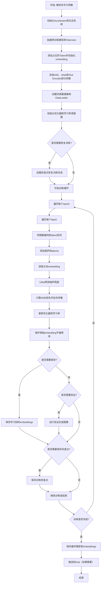
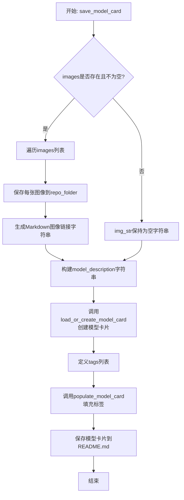
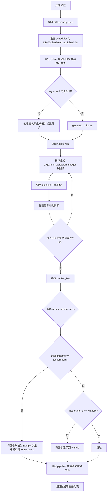
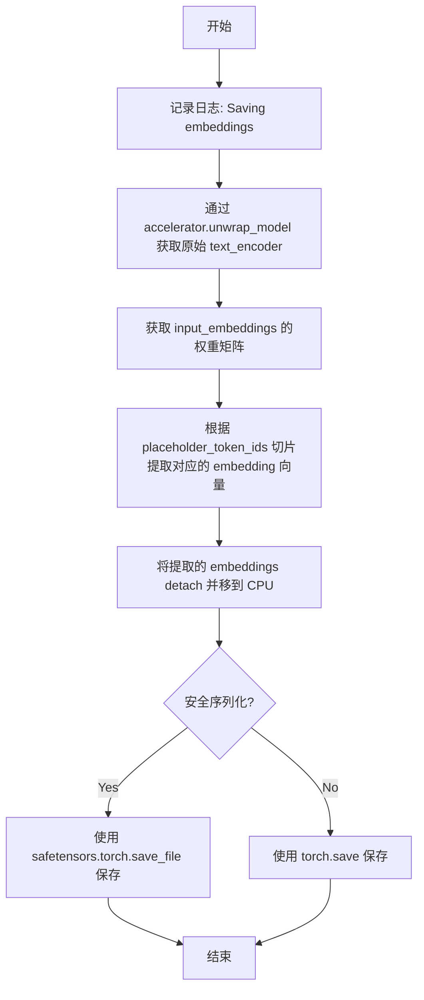
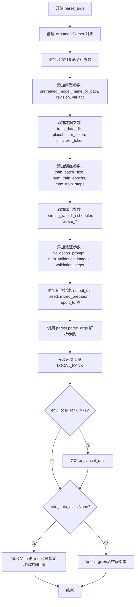
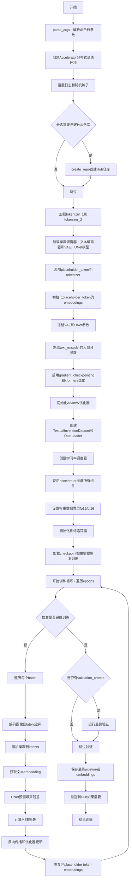
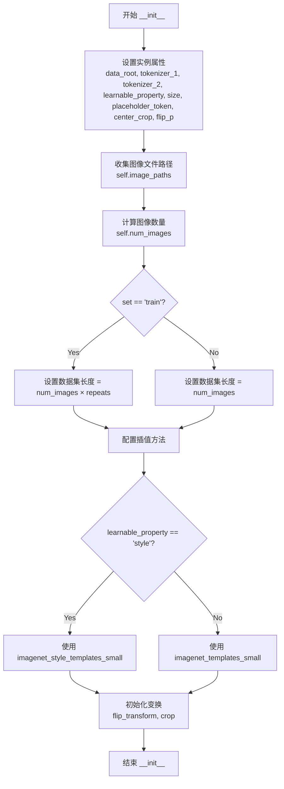
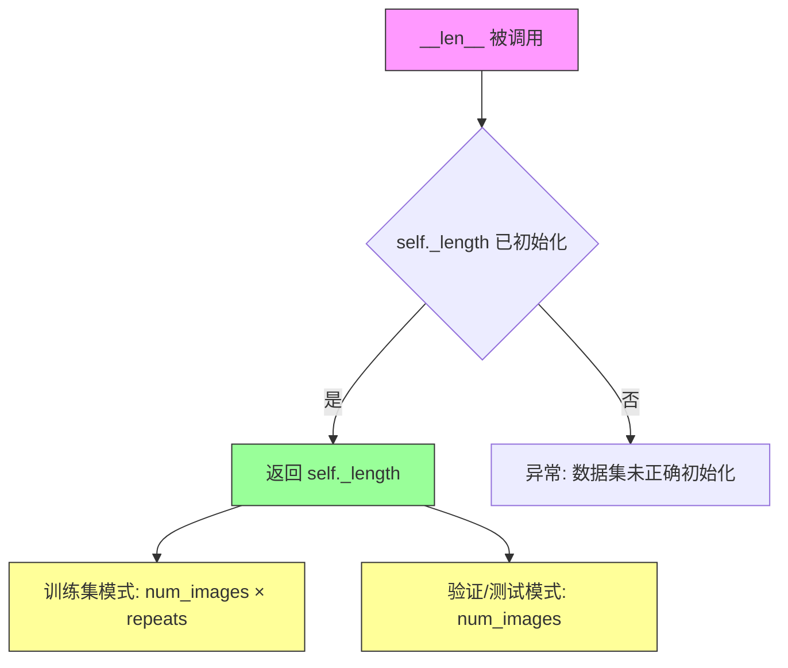

# `diffusers\examples\textual_inversion\textual_inversion_sdxl.py` 详细设计文档

这是一个用于Stable Diffusion XL的Textual Inversion训练脚本，通过学习一个特殊的占位符token embedding来让模型理解新的概念（如特定物体或风格），支持单GPU和多GPU分布式训练、梯度检查点、混合精度训练以及xformers优化。

## 整体流程



## 类结构

```
TextualInversionDataset (数据加载类)
├── __init__ (构造函数)
├── __len__ (返回数据集长度)
└── __getitem__ (获取单个样本)
```

## 全局变量及字段


### `PIL_INTERPOLATION`
    
PIL图像插值方法映射字典，根据PIL版本包含线性、双线性、双三次、Lanczos和最近邻插值方式

类型：`dict`
    


### `logger`
    
日志记录器实例，用于输出训练过程中的调试和信息日志

类型：`logging.Logger`
    


### `imagenet_templates_small`
    
物体描述模板列表，包含26个用于文本倒置的图像描述模板

类型：`list`
    


### `imagenet_style_templates_small`
    
风格描述模板列表，包含18个用于学习艺术风格的图像描述模板

类型：`list`
    


### `placeholder_token_ids`
    
第一个tokenizer中占位符token的ID列表，用于文本倒置学习

类型：`list[int]`
    


### `placeholder_token_ids_2`
    
第二个tokenizer中占位符token的ID列表，用于双文本编码器场景

类型：`list[int]`
    


### `initializer_token_id`
    
第一个tokenizer中初始化token的ID，用于初始化占位符embedding

类型：`int`
    


### `initializer_token_id_2`
    
第二个tokenizer中初始化token的ID，用于初始化占位符embedding

类型：`int`
    


### `placeholder_tokens`
    
占位符token字符串列表，包含主token和可选的多个向量token

类型：`list[str]`
    


### `num_added_tokens`
    
实际添加到tokenizer中的token数量，用于验证是否成功添加

类型：`int`
    


### `token_ids`
    
第一个tokenizer对initializer_token编码后的ID列表

类型：`list[int]`
    


### `token_ids_2`
    
第二个tokenizer对initializer_token编码后的ID列表

类型：`list[int]`
    


### `token_embeds`
    
第一个文本编码器的embedding权重矩阵，用于访问和修改token嵌入

类型：`torch.Tensor`
    


### `token_embeds_2`
    
第二个文本编码器的embedding权重矩阵，用于访问和修改token嵌入

类型：`torch.Tensor`
    


### `orig_embeds_params`
    
第一个文本编码器的原始embedding参数副本，用于保持非占位符embedding不变

类型：`torch.Tensor`
    


### `orig_embeds_params_2`
    
第二个文本编码器的原始embedding参数副本，用于保持非占位符embedding不变

类型：`torch.Tensor`
    


### `weight_dtype`
    
训练权重数据类型，根据混合精度配置为float32/float16/bfloat16

类型：`torch.dtype`
    


### `global_step`
    
全局训练步数计数器，用于跟踪已执行的优化步骤

类型：`int`
    


### `first_epoch`
    
起始epoch编号，用于从检查点恢复训练

类型：`int`
    


### `initial_global_step`
    
初始全局步数，用于正确计算进度条起始位置

类型：`int`
    


### `total_batch_size`
    
总批次大小，考虑了并行GPU数量和梯度累积步数

类型：`int`
    


### `num_warmup_steps_for_scheduler`
    
学习率调度器预热步数，考虑了多进程环境

类型：`int`
    


### `num_update_steps_per_epoch`
    
每个epoch中参数更新的步数，考虑了梯度累积

类型：`int`
    


### `num_training_steps_for_scheduler`
    
学习率调度器配置的总训练步数，考虑了多进程环境

类型：`int`
    


### `TextualInversionDataset.data_root`
    
训练数据根目录路径，包含用于文本倒置的图像文件

类型：`str`
    


### `TextualInversionDataset.tokenizer_1`
    
第一个CLIP文本编码器的tokenizer，用于编码文本提示

类型：`CLIPTokenizer`
    


### `TextualInversionDataset.tokenizer_2`
    
第二个CLIP文本编码器的tokenizer，用于SDXL双文本编码器

类型：`CLIPTokenizer`
    


### `TextualInversionDataset.learnable_property`
    
学习对象类型标识，可选'object'或'style'用于区分学习物体还是风格

类型：`str`
    


### `TextualInversionDataset.size`
    
目标图像分辨率尺寸，训练图像将Resize到此大小

类型：`int`
    


### `TextualInversionDataset.placeholder_token`
    
占位符token字符串，用于在文本中标识要学习的概念

类型：`str`
    


### `TextualInversionDataset.center_crop`
    
是否启用中心裁剪，True使用CenterCrop，False使用RandomCrop

类型：`bool`
    


### `TextualInversionDataset.flip_p`
    
随机水平翻转的概率值，用于数据增强

类型：`float`
    


### `TextualInversionDataset.image_paths`
    
训练数据目录中所有图像文件的完整路径列表

类型：`list`
    


### `TextualInversionDataset.num_images`
    
原始图像数量，不考虑重复次数repeats

类型：`int`
    


### `TextualInversionDataset._length`
    
数据集总长度，考虑了重复次数repeats后的样本总数

类型：`int`
    


### `TextualInversionDataset.interpolation`
    
图像Resize时使用的PIL插值方法对象

类型：`Any`
    


### `TextualInversionDataset.templates`
    
根据learnable_property选择的文本描述模板列表

类型：`list`
    


### `TextualInversionDataset.flip_transform`
    
torchvision随机水平翻转变换对象

类型：`RandomHorizontalFlip`
    


### `TextualInversionDataset.crop`
    
torchvision图像裁剪变换对象，根据center_crop参数选择类型

类型：`CenterCrop/RandomCrop`
    
    

## 全局函数及方法


### `save_model_card`

该函数用于在文本反转（Textual Inversion）微调训练完成后，将模型卡片（Model Card）保存到HuggingFace Hub。它首先将验证过程中生成的示例图像保存到指定文件夹，然后创建包含模型描述、标签和示例图像链接的Markdown模型卡片文件。

参数：

- `repo_id`：`str`，HuggingFace Hub上的仓库ID，用于标识模型仓库
- `images`：`Optional[List[PIL.Image]]`，训练过程中生成的示例图像列表，用于展示模型效果
- `base_model`：`str`，基础预训练模型的名称或路径，用于描述模型是基于哪个模型微调而来
- `repo_folder`：`Optional[str]`（原代码中为`str`，但实际使用可为None），本地文件夹路径，用于保存模型卡片和示例图像

返回值：`None`，该函数无返回值，主要操作是直接将模型卡片写入文件系统

#### 流程图



#### 带注释源码

```python
def save_model_card(repo_id: str, images=None, base_model=str, repo_folder=None):
    """
    保存模型卡片到HuggingFace Hub仓库
    
    参数:
        repo_id: HuggingFace Hub仓库ID
        images: 训练过程中生成的示例图像列表
        base_model: 基础预训练模型路径
        repo_folder: 本地文件夹路径
    """
    # 初始化图像链接字符串
    img_str = ""
    
    # 遍历所有示例图像并保存到本地文件夹
    for i, image in enumerate(images):
        # 将每张图像保存为PNG格式，文件名格式为image_{i}.png
        image.save(os.path.join(repo_folder, f"image_{i}.png"))
        # 生成Markdown格式的图像链接
        img_str += f"\n"

    # 构建模型描述文本，包含仓库ID、基础模型信息和示例图像
    model_description = f"""
# Textual inversion text2image fine-tuning - {repo_id}
These are textual inversion adaption weights for {base_model}. You can find some example images in the following. \n
{img_str}
"""
    
    # 加载或创建模型卡片，包含训练信息、许可证、基础模型等
    model_card = load_or_create_model_card(
        repo_id_or_path=repo_id,
        from_training=True,
        license="creativeml-openrail-m",
        base_model=base_model,
        model_description=model_description,
        inference=True,
    )

    # 定义模型标签，用于HuggingFace Hub上的分类和搜索
    tags = [
        "stable-diffusion-xl",
        "stable-diffusion-xl-diffusers",
        "text-to-image",
        "diffusers",
        "diffusers-training",
        "textual_inversion",
    ]

    # 使用定义的标签更新模型卡片
    model_card = populate_model_card(model_card, tags=tags)

    # 将模型卡片保存为README.md文件
    model_card.save(os.path.join(repo_folder, "README.md"))
```


### `log_validation`

运行验证，生成图像并使用 TensorBoard 或 wandb 记录生成的验证图像，用于评估模型在训练过程中的性能。

参数：

- `text_encoder_1`：`CLIPTextModel`，第一个文本编码器模型，用于编码文本提示
- `text_encoder_2`：`CLIPTextModelWithProjection`，第二个文本编码器模型（带投影），用于 SDXL
- `tokenizer_1`：`CLIPTokenizer`，第一个分词器，用于将文本转换为 token IDs
- `tokenizer_2`：`CLIPTokenizer`，第二个分词器，用于 SDXL
- `unet`：`UNet2DConditionModel`，UNet2D 条件模型，用于去噪过程
- `vae`：`AutoencoderKL`，变分自编码器，用于将图像编码到潜在空间
- `args`：`Namespace`，命令行参数对象，包含验证提示、验证图像数量等配置
- `accelerator`：`Accelerator`，分布式训练加速器，用于模型管理和设备分配
- `weight_dtype`：`torch.dtype`，模型权重的数据类型（fp16/bf16/fp32）
- `epoch`：`int`，当前训练的轮次
- `is_final_validation`：`bool`，是否为最终验证，默认为 False

返回值：`List[PIL.Image]`，生成的验证图像列表

#### 流程图



#### 带注释源码

```python
def log_validation(
    text_encoder_1,
    text_encoder_2,
    tokenizer_1,
    tokenizer_2,
    unet,
    vae,
    args,
    accelerator,
    weight_dtype,
    epoch,
    is_final_validation=False,
):
    """
    运行验证，生成图像并记录到日志记录器。
    
    该函数用于在训练过程中定期生成验证图像，以评估模型性能。
    支持 TensorBoard 和 wandb 两种日志记录方式。
    
    参数:
        text_encoder_1: 第一个 CLIP 文本编码器
        text_encoder_2: 第二个 CLIP 文本编码器（带投影）
        tokenizer_1: 第一个分词器
        tokenizer_2: 第二个分词器
        unet: UNet2D 条件模型
        vae: VAE 模型
        args: 命令行参数对象
        accelerator: 分布式训练加速器
        weight_dtype: 模型权重的数据类型
        epoch: 当前训练轮次
        is_final_validation: 是否为最终验证
    """
    # 记录验证开始信息，包括要生成的图像数量和验证提示
    logger.info(
        f"Running validation... \n Generating {args.num_validation_images} images with prompt:"
        f" {args.validation_prompt}."
    )
    
    # 从预训练模型创建 DiffusionPipeline
    # 使用 accelerator.unwrap_model 获取原始模型
    # safety_checker 设置为 None 以避免不必要的计算
    pipeline = DiffusionPipeline.from_pretrained(
        args.pretrained_model_name_or_path,
        text_encoder=accelerator.unwrap_model(text_encoder_1),
        text_encoder_2=accelerator.unwrap_model(text_encoder_2),
        tokenizer=tokenizer_1,
        tokenizer_2=tokenizer_2,
        unet=unet,
        vae=vae,
        safety_checker=None,
        revision=args.revision,
        variant=args.variant,
        torch_dtype=weight_dtype,
    )
    
    # 将 scheduler 替换为 DPMSolverMultistepScheduler
    # 这是一种高效的采样调度器
    pipeline.scheduler = DPMSolverMultistepScheduler.from_config(pipeline.scheduler.config)
    
    # 将 pipeline 移动到加速器设备上
    pipeline = pipeline.to(accelerator.device)
    
    # 禁用进度条以减少日志输出
    pipeline.set_progress_bar_config(disable=True)

    # 如果设置了种子，创建随机数生成器以确保可重复性
    # 否则设置为 None，使用随机噪声
    generator = None if args.seed is None else torch.Generator(device=accelerator.device).manual_seed(args.seed)
    
    # 初始化图像列表
    images = []
    
    # 循环生成指定数量的验证图像
    for _ in range(args.num_validation_images):
        # 调用 pipeline 生成图像
        # num_inference_steps=25 是常用的推理步数
        image = pipeline(args.validation_prompt, num_inference_steps=25, generator=generator).images[0]
        images.append(image)

    # 确定 tracker 的键名
    # 最终验证使用 "test"，中间验证使用 "validation"
    tracker_key = "test" if is_final_validation else "validation"
    
    # 遍历所有注册的 tracker 并记录图像
    for tracker in accelerator.trackers:
        # TensorBoard 处理：将图像转换为 numpy 数组并记录
        if tracker.name == "tensorboard":
            np_images = np.stack([np.asarray(img) for img in images])
            tracker.writer.add_images(tracker_key, np_images, epoch, dataformats="NHWC")
        
        # wandb 处理：将图像包装为 wandb.Image 并记录
        if tracker.name == "wandb":
            tracker.log(
                {
                    tracker_key: [
                        wandb.Image(image, caption=f"{i}: {args.validation_prompt}") for i, image in enumerate(images)
                    ]
                }
            )

    # 清理资源
    del pipeline
    torch.cuda.empty_cache()
    
    # 返回生成的图像列表，供后续保存使用
    return images
```


### `save_progress`

保存训练学习到的文本编码器 embeddings 到指定路径，用于后续加载或分享训练结果。

参数：

- `text_encoder`：`CLIPTextModel` 或 `CLIPTextModelWithProjection`，需要保存的文本编码器模型
- `placeholder_token_ids`：`List[int]`，占位符 token 在词表中的 ID 列表，用于定位需要保存的 embedding 向量
- `accelerator`：`Accelerator`，HuggingFace Accelerate 库的加速器对象，用于 unwrap 模型获取原始模型
- `args`：`Namespace`，命令行参数对象，包含 `placeholder_token` 等配置信息
- `save_path`：`str`，保存文件的目标路径（包括文件名）
- `safe_serialization`：`bool`，是否使用安全序列化（默认为 `True`），`True` 使用 safetensors 格式，`False` 使用 torch  pickle 格式

返回值：`None`，无返回值

#### 流程图



#### 带注释源码

```python
def save_progress(text_encoder, placeholder_token_ids, accelerator, args, save_path, safe_serialization=True):
    """
    保存训练学习到的 embeddings 到指定路径
    
    参数:
        text_encoder: CLIPTextModel 或 CLIPTextModelWithProjection，需要保存的文本编码器
        placeholder_token_ids: List[int]，占位符 token 的 ID 列表
        accelerator: Accelerator，加速器对象，用于 unwrap 模型
        args: Namespace，命令行参数，包含 placeholder_token 等
        save_path: str，保存路径
        safe_serialization: bool，是否使用安全序列化（默认 True）
    """
    # 记录日志信息
    logger.info("Saving embeddings")
    
    # 使用 accelerator.unwrap_model 获取原始模型（非分布式包装后的模型）
    # 然后获取输入嵌入层的权重矩阵，并根据 placeholder_token_ids 切片提取对应的 embedding 向量
    # 使用 min 和 max 是因为可能学习多个连续的 token 向量
    learned_embeds = (
        accelerator.unwrap_model(text_encoder)
        .get_input_embeddings()
        .weight[min(placeholder_token_ids) : max(placeholder_token_ids) + 1]
    )
    
    # 构建字典，以 placeholder_token 为键，embedding 向量为值
    # .detach() 断开计算图，.cpu() 将数据从 GPU 移到 CPU
    learned_embeds_dict = {args.placeholder_token: learned_embeds.detach().cpu()}

    # 根据 safe_serialization 参数选择保存格式
    if safe_serialization:
        # 使用 safetensors 格式保存，更安全且加载更快
        safetensors.torch.save_file(learned_embeds_dict, save_path, metadata={"format": "pt"})
    else:
        # 使用传统的 torch.save 保存为 pickle 格式
        torch.save(learned_embeds_dict, save_path)
```


### `parse_args`

该函数是训练脚本的命令行参数解析器，使用 Python 的 `argparse` 模块定义并解析所有训练相关的配置参数，包括模型路径、数据目录、学习率、训练步数、验证设置等，最终返回一个包含所有解析参数的 `Namespace` 对象。

参数：

- 该函数无直接输入参数（不接受任何函数参数）

返回值：`args`（`argparse.Namespace` 类型），返回一个命名空间对象，包含所有解析后的命令行参数及其值

#### 流程图



#### 带注释源码

```python
def parse_args():
    """
    解析命令行参数并返回包含所有训练配置的对象
    
    返回:
        argparse.Namespace: 包含所有命令行参数值的命名空间对象
    """
    # 创建 ArgumentParser 实例，描述脚本用途
    parser = argparse.ArgumentParser(description="Simple example of a training script.")
    
    # ==================== 模型相关参数 ====================
    parser.add_argument(
        "--save_steps",
        type=int,
        default=500,
        help="Save learned_embeds.bin every X updates steps.",
    )
    parser.add_argument(
        "--save_as_full_pipeline",
        action="store_true",
        help="Save the complete stable diffusion pipeline.",
    )
    parser.add_argument(
        "--num_vectors",
        type=int,
        default=1,
        help="How many textual inversion vectors shall be used to learn the concept.",
    )
    parser.add_argument(
        "--pretrained_model_name_or_path",
        type=str,
        default=None,
        required=True,
        help="Path to pretrained model or model identifier from huggingface.co/models.",
    )
    parser.add_argument(
        "--revision",
        type=str,
        default=None,
        required=False,
        help="Revision of pretrained model identifier from huggingface.co/models.",
    )
    parser.add_argument(
        "--variant",
        type=str,
        default=None,
        help="Variant of the model files of the pretrained model identifier from huggingface.co/models, 'e.g.' fp16",
    )
    
    # ==================== 数据相关参数 ====================
    parser.add_argument(
        "--train_data_dir", type=str, default=None, required=True, help="A folder containing the training data."
    )
    parser.add_argument(
        "--placeholder_token",
        type=str,
        default=None,
        required=True,
        help="A token to use as a placeholder for the concept.",
    )
    parser.add_argument(
        "--initializer_token", type=str, default=None, required=True, help="A token to use as initializer word."
    )
    parser.add_argument("--learnable_property", type=str, default="object", help="Choose between 'object' and 'style'")
    parser.add_argument("--repeats", type=int, default=100, help="How many times to repeat the training data.")
    
    # ==================== 输出相关参数 ====================
    parser.add_argument(
        "--output_dir",
        type=str,
        default="text-inversion-model",
        help="The output directory where the model predictions and checkpoints will be written.",
    )
    parser.add_argument("--seed", type=int, default=None, help="A seed for reproducible training.")
    parser.add_argument(
        "--logging_dir",
        type=str,
        default="logs",
        help="[TensorBoard](https://www.tensorflow.org/tensorboard) log directory...",
    )
    
    # ==================== 图像处理参数 ====================
    parser.add_argument(
        "--resolution",
        type=int,
        default=512,
        help="The resolution for input images, all the images in the train/validation dataset will be resized to this resolution",
    )
    parser.add_argument(
        "--center_crop", action="store_true", help="Whether to center crop images before resizing to resolution."
    )
    
    # ==================== 训练超参数 ====================
    parser.add_argument(
        "--train_batch_size", type=int, default=16, help="Batch size (per device) for the training dataloader."
    )
    parser.add_argument("--num_train_epochs", type=int, default=100)
    parser.add_argument(
        "--max_train_steps",
        type=int,
        default=5000,
        help="Total number of training steps to perform. If provided, overrides num_train_epochs.",
    )
    parser.add_argument(
        "--gradient_accumulation_steps",
        type=int,
        default=1,
        help="Number of updates steps to accumulate before performing a backward/update pass.",
    )
    parser.add_argument(
        "--gradient_checkpointing",
        action="store_true",
        help="Whether or not to use gradient checkpointing to save memory at the expense of slower backward pass.",
    )
    parser.add_argument(
        "--learning_rate",
        type=float,
        default=1e-4,
        help="Initial learning rate (after the potential warmup period) to use.",
    )
    parser.add_argument(
        "--scale_lr",
        action="store_true",
        default=False,
        help="Scale the learning rate by the number of GPUs, gradient accumulation steps, and batch size.",
    )
    
    # ==================== 学习率调度器参数 ====================
    parser.add_argument(
        "--lr_scheduler",
        type=str,
        default="constant",
        help='The scheduler type to use. Choose between ["linear", "cosine", "cosine_with_restarts", "polynomial", "constant", "constant_with_warmup"]',
    )
    parser.add_argument(
        "--lr_warmup_steps", type=int, default=500, help="Number of steps for the warmup in the lr scheduler."
    )
    parser.add_argument(
        "--lr_num_cycles",
        type=int,
        default=1,
        help="Number of hard resets of the lr in cosine_with_restarts scheduler.",
    )
    parser.add_argument(
        "--dataloader_num_workers",
        type=int,
        default=0,
        help="Number of subprocesses to use for data loading.",
    )
    
    # ==================== 优化器参数 ====================
    parser.add_argument(
        "--use_8bit_adam", action="store_true", help="Whether or not to use 8-bit Adam from bitsandbytes."
    )
    parser.add_argument("--adam_beta1", type=float, default=0.9, help="The beta1 parameter for the Adam optimizer.")
    parser.add_argument("--adam_beta2", type=float, default=0.999, help="The beta2 parameter for the Adam optimizer.")
    parser.add_argument("--adam_weight_decay", type=float, default=1e-2, help="Weight decay to use.")
    parser.add_argument("--adam_epsilon", type=float, default=1e-08, help="Epsilon value for the Adam optimizer")
    
    # ==================== Hub 相关参数 ====================
    parser.add_argument("--push_to_hub", action="store_true", help="Whether or not to push the model to the Hub.")
    parser.add_argument("--hub_token", type=str, default=None, help="The token to use to push to the Model Hub.")
    parser.add_argument(
        "--hub_model_id",
        type=str,
        default=None,
        help="The name of the repository to keep in sync with the local `output_dir`.",
    )
    
    # ==================== 混合精度与硬件参数 ====================
    parser.add_argument(
        "--mixed_precision",
        type=str,
        default="no",
        choices=["no", "fp16", "bf16"],
        help="Whether to use mixed precision. Choose between fp16 and bf16 (bfloat16).",
    )
    parser.add_argument(
        "--allow_tf32",
        action="store_true",
        help="Whether or not to allow TF32 on Ampere GPUs. Can be used to speed up training.",
    )
    parser.add_argument(
        "--enable_xformers_memory_efficient_attention", action="store_true", help="Whether or not to use xformers."
    )
    
    # ==================== 日志与验证参数 ====================
    parser.add_argument(
        "--report_to",
        type=str,
        default="tensorboard",
        help='The integration to report the results and logs to. Supported platforms are "tensorboard", "wandb" and "comet_ml".',
    )
    parser.add_argument(
        "--validation_prompt",
        type=str,
        default=None,
        help="A prompt that is used during validation to verify that the model is learning.",
    )
    parser.add_argument(
        "--num_validation_images",
        type=int,
        default=4,
        help="Number of images that should be generated during validation with `validation_prompt`.",
    )
    parser.add_argument(
        "--validation_steps",
        type=int,
        default=100,
        help="Run validation every X steps.",
    )
    
    # ==================== 分布式训练与检查点参数 ====================
    parser.add_argument("--local_rank", type=int, default=-1, help="For distributed training: local_rank")
    parser.add_argument(
        "--checkpointing_steps",
        type=int,
        default=500,
        help="Save a checkpoint of the training state every X updates.",
    )
    parser.add_argument(
        "--checkpoints_total_limit",
        type=int,
        default=None,
        help="Max number of checkpoints to store.",
    )
    parser.add_argument(
        "--resume_from_checkpoint",
        type=str,
        default=None,
        help="Whether training should be resumed from a previous checkpoint.",
    )
    
    # ==================== 解析参数 ====================
    # 解析命令行传入的参数
    args = parser.parse_args()
    
    # ==================== 环境变量处理 ====================
    # 检查环境变量 LOCAL_RANK，用于分布式训练
    env_local_rank = int(os.environ.get("LOCAL_RANK", -1))
    if env_local_rank != -1 and env_local_rank != args.local_rank:
        args.local_rank = env_local_rank
    
    # ==================== 参数验证 ====================
    # 确保训练数据目录已指定
    if args.train_data_dir is None:
        raise ValueError("You must specify a train data directory.")
    
    # 返回解析后的参数对象
    return args
```


### `main`

主训练函数，用于对 Stable Diffusion XL (SDXL) 模型进行 Textual Inversion（文本反转）微调训练，使模型能够学习新的概念或风格。

参数：该函数无显式参数，通过 `parse_args()` 函数从命令行获取所有训练配置参数。

返回值：`None`，函数执行完成后直接退出。

#### 流程图



#### 带注释源码

```python
def main():
    """
    主训练函数，执行Textual Inversion微调训练
    """
    # 步骤1: 解析命令行参数
    args = parse_args()
    
    # 安全检查：不能同时使用wandb和hub_token
    if args.report_to == "wandb" and args.hub_token is not None:
        raise ValueError(
            "You cannot use both --report_to=wandb and --hub_token due to a security risk of exposing your token."
            " Please use `hf auth login` to authenticate with the Hub."
        )

    # 步骤2: 配置日志目录并创建Accelerator
    # Accelerator是HuggingFace用于简化分布式训练的抽象
    logging_dir = os.path.join(args.output_dir, args.logging_dir)
    accelerator_project_config = ProjectConfiguration(project_dir=args.output_dir, logging_dir=logging_dir)
    accelerator = Accelerator(
        gradient_accumulation_steps=args.gradient_accumulation_steps,
        mixed_precision=args.mixed_precision,
        log_with=args.report_to,
        project_config=accelerator_project_config,
    )

    # MPS设备不支持AMP，需要禁用
    if torch.backends.mps.is_available():
        accelerator.native_amp = False

    # 检查wandb是否安装
    if args.report_to == "wandb":
        if not is_wandb_available():
            raise ImportError("Make sure to install wandb if you want to use it for logging during training.")

    # 步骤3: 配置日志格式
    logging.basicConfig(
        format="%(asctime)s - %(levelname)s - %(name)s - %(message)s",
        datefmt="%m/%d/%Y %H:%M:%S",
        level=logging.INFO,
    )
    logger.info(accelerator.state, main_process_only=False)
    
    # 只在主进程设置详细日志
    if accelerator.is_local_main_process:
        transformers.utils.logging.set_verbosity_warning()
        diffusers.utils.logging.set_verbosity_info()
    else:
        transformers.utils.logging.set_verbosity_error()
        diffusers.utils.logging.set_verbosity_error()

    # 步骤4: 设置随机种子以确保可复现性
    if args.seed is not None:
        set_seed(args.seed)

    # 步骤5: 处理仓库创建（如果需要推送到Hub）
    if accelerator.is_main_process:
        if args.output_dir is not None:
            os.makedirs(args.output_dir, exist_ok=True)

        if args.push_to_hub:
            repo_id = create_repo(
                repo_id=args.hub_model_id or Path(args.output_dir).name, exist_ok=True, token=args.hub_token
            ).repo_id

    # 步骤6: 加载tokenizer (SDXL有两个tokenizer)
    tokenizer_1 = CLIPTokenizer.from_pretrained(args.pretrained_model_name_or_path, subfolder="tokenizer")
    tokenizer_2 = CLIPTokenizer.from_pretrained(args.pretrained_model_name_or_path, subfolder="tokenizer_2")

    # 步骤7: 加载调度器和模型
    noise_scheduler = DDPMScheduler.from_pretrained(args.pretrained_model_name_or_path, subfolder="scheduler")
    text_encoder_1 = CLIPTextModel.from_pretrained(
        args.pretrained_model_name_or_path, subfolder="text_encoder", revision=args.revision
    )
    text_encoder_2 = CLIPTextModelWithProjection.from_pretrained(
        args.pretrained_model_name_or_path, subfolder="text_encoder_2", revision=args.revision
    )
    vae = AutoencoderKL.from_pretrained(
        args.pretrained_model_name_or_path, subfolder="vae", revision=args.revision, variant=args.variant
    )
    unet = UNet2DConditionModel.from_pretrained(
        args.pretrained_model_name_or_path, subfolder="unet", revision=args.revision, variant=args.variant
    )

    # 步骤8: 添加placeholder token到tokenizer
    placeholder_tokens = [args.placeholder_token]

    if args.num_vectors < 1:
        raise ValueError(f"--num_vectors has to be larger or equal to 1, but is {args.num_vectors}")

    # 为多向量情况添加虚拟token
    additional_tokens = []
    for i in range(1, args.num_vectors):
        additional_tokens.append(f"{args.placeholder_token}_{i}")
    placeholder_tokens += additional_tokens

    # 将placeholder tokens添加到两个tokenizer
    num_added_tokens = tokenizer_1.add_tokens(placeholder_tokens)
    if num_added_tokens != args.num_vectors:
        raise ValueError(
            f"The tokenizer already contains the token {args.placeholder_token}. Please pass a different"
            " `placeholder_token` that is not already in the tokenizer."
        )
    num_added_tokens = tokenizer_2.add_tokens(placeholder_tokens)
    if num_added_tokens != args.num_vectors:
        raise ValueError(
            f"The 2nd tokenizer already contains the token {args.placeholder_token}. Please pass a different"
            " `placeholder_token` that is not already in the tokenizer."
        )

    # 步骤9: 将initializer_token和placeholder_token转换为ids
    token_ids = tokenizer_1.encode(args.initializer_token, add_special_tokens=False)
    token_ids_2 = tokenizer_2.encode(args.initializer_token, add_special_tokens=False)

    # 检查initializer_token是否是单个token
    if len(token_ids) > 1 or len(token_ids_2) > 1:
        raise ValueError("The initializer token must be a single token.")

    initializer_token_id = token_ids[0]
    placeholder_token_ids = tokenizer_1.convert_tokens_to_ids(placeholder_tokens)
    initializer_token_id_2 = token_ids_2[0]
    placeholder_token_ids_2 = tokenizer_2.convert_tokens_to_ids(placeholder_tokens)

    # 步骤10: 调整token embeddings维度以适应新增的special tokens
    text_encoder_1.resize_token_embeddings(len(tokenizer_1))
    text_encoder_2.resize_token_embeddings(len(tokenizer_2))

    # 步骤11: 使用initializer_token的embeddings初始化新增的placeholder token
    token_embeds = text_encoder_1.get_input_embeddings().weight.data
    token_embeds_2 = text_encoder_2.get_input_embeddings().weight.data
    with torch.no_grad():
        for token_id in placeholder_token_ids:
            token_embeds[token_id] = token_embeds[initializer_token_id].clone()
        for token_id in placeholder_token_ids_2:
            token_embeds_2[token_id] = token_embeds_2[initializer_token_id_2].clone()

    # 步骤12: 冻结VAE和UNet (只训练text encoder的embeddings)
    vae.requires_grad_(False)
    unet.requires_grad_(False)

    # 冻结text_encoder的大部分参数，只保留token embeddings可训练
    text_encoder_1.text_model.encoder.requires_grad_(False)
    text_encoder_1.text_model.final_layer_norm.requires_grad_(False)
    text_encoder_1.text_model.embeddings.position_embedding.requires_grad_(False)
    text_encoder_2.text_model.encoder.requires_grad_(False)
    text_encoder_2.text_model.final_layer_norm.requires_grad_(False)
    text_encoder_2.text_model.embeddings.position_embedding.requires_grad_(False)

    # 可选：启用gradient checkpointing以节省显存
    if args.gradient_checkpointing:
        text_encoder_1.gradient_checkpointing_enable()
        text_encoder_2.gradient_checkpointing_enable()

    # 可选：启用xformers优化
    if args.enable_xformers_memory_efficient_attention:
        if is_xformers_available():
            import xformers
            xformers_version = version.parse(xformers.__version__)
            if xformers_version == version.parse("0.0.16"):
                logger.warning(
                    "xFormers 0.0.16 cannot be used for training in some GPUs. If you observe problems during training, please update xFormers to at least 0.0.17."
                )
            unet.enable_xformers_memory_efficient_attention()
        else:
            raise ValueError("xformers is not available. Make sure it is installed correctly")

    # 启用TF32以加速Ampere GPU训练
    if args.allow_tf32:
        torch.backends.cuda.matmul.allow_tf32 = True

    # 步骤13: 根据配置调整学习率
    if args.scale_lr:
        args.learning_rate = (
            args.learning_rate * args.gradient_accumulation_steps * args.train_batch_size * accelerator.num_processes
        )

    # 步骤14: 初始化优化器 (只优化embeddings)
    if args.use_8bit_adam:
        try:
            import bitsandbytes as bnb
        except ImportError:
            raise ImportError("To use 8-bit Adam, please install the bitsandbytes library.")
        optimizer_class = bnb.optim.AdamW8bit
    else:
        optimizer_class = torch.optim.AdamW

    optimizer = optimizer_class(
        # 只优化token embeddings权重
        [
            text_encoder_1.text_model.embeddings.token_embedding.weight,
            text_encoder_2.text_model.embeddings.token_embedding.weight,
        ],
        lr=args.learning_rate,
        betas=(args.adam_beta1, args.adam_beta2),
        weight_decay=args.adam_weight_decay,
        eps=args.adam_epsilon,
    )

    # 步骤15: 创建数据集和数据加载器
    train_dataset = TextualInversionDataset(
        data_root=args.train_data_dir,
        tokenizer_1=tokenizer_1,
        tokenizer_2=tokenizer_2,
        size=args.resolution,
        placeholder_token=placeholder_token,
        repeats=args.repeats,
        learnable_property=args.learnable_property,
        center_crop=args.center_crop,
        set="train",
    )
    train_dataloader = torch.utils.data.DataLoader(
        train_dataset, batch_size=args.train_batch_size, shuffle=True, num_workers=args.dataloader_num_workers
    )

    # 步骤16: 创建学习率调度器
    num_warmup_steps_for_scheduler = args.lr_warmup_steps * accelerator.num_processes
    if args.max_train_steps is None:
        len_train_dataloader_after_sharding = math.ceil(len(train_dataloader) / accelerator.num_processes)
        num_update_steps_per_epoch = math.ceil(len_train_dataloader_after_sharding / args.gradient_accumulation_steps)
        num_training_steps_for_scheduler = (
            args.num_train_epochs * num_update_steps_per_epoch * accelerator.num_processes
        )
    else:
        num_training_steps_for_scheduler = args.max_train_steps * accelerator.num_processes

    lr_scheduler = get_scheduler(
        args.lr_scheduler,
        optimizer=optimizer,
        num_warmup_steps=num_warmup_steps_for_scheduler,
        num_training_steps=num_training_steps_for_scheduler,
        num_cycles=args.lr_num_cycles,
    )

    # 步骤17: 设置模型为训练模式并用accelerator准备
    text_encoder_1.train()
    text_encoder_2.train()
    text_encoder_1, text_encoder_2, optimizer, train_dataloader, lr_scheduler = accelerator.prepare(
        text_encoder_1, text_encoder_2, optimizer, train_dataloader, lr_scheduler
    )

    # 步骤18: 设置混合精度权重类型
    weight_dtype = torch.float32
    if accelerator.mixed_precision == "fp16":
        weight_dtype = torch.float16
    elif accelerator.mixed_precision == "bf16":
        weight_dtype = torch.bfloat16

    # 将VAE、UNet和text_encoder_2移到设备并转换类型
    unet.to(accelerator.device, dtype=weight_dtype)
    vae.to(accelerator.device, dtype=weight_dtype)
    text_encoder_2.to(accelerator.device, dtype=weight_dtype)

    # 重新计算训练步骤数
    num_update_steps_per_epoch = math.ceil(len(train_dataloader) / args.gradient_accumulation_steps)
    if args.max_train_steps is None:
        args.max_train_steps = args.num_train_epochs * num_update_steps_per_epoch
        if num_training_steps_for_scheduler != args.max_train_steps * accelerator.num_processes:
            logger.warning(
                f"The length of the 'train_dataloader' after 'accelerator.prepare' does not match "
                f"the expected length when the learning rate scheduler was created."
            )
    args.num_train_epochs = math.ceil(args.max_train_steps / num_update_steps_per_epoch)

    # 步骤19: 初始化训练追踪器
    if accelerator.is_main_process:
        accelerator.init_trackers("textual_inversion", config=vars(args))

    # 步骤20: 训练前准备
    total_batch_size = args.train_batch_size * accelerator.num_processes * args.gradient_accumulation_steps
    logger.info("***** Running training *****")
    logger.info(f"  Num examples = {len(train_dataset)}")
    logger.info(f"  Num Epochs = {args.num_train_epochs}")
    logger.info(f"  Instantaneous batch size per device = {args.train_batch_size}")
    logger.info(f"  Total train batch size (w. parallel, distributed & accumulation) = {total_batch_size}")
    logger.info(f"  Gradient Accumulation steps = {args.gradient_accumulation_steps}")
    logger.info(f"  Total optimization steps = {args.max_train_steps}")

    global_step = 0
    first_epoch = 0
    
    # 检查是否需要从checkpoint恢复
    if args.resume_from_checkpoint:
        if args.resume_from_checkpoint != "latest":
            path = os.path.basename(args.resume_from_checkpoint)
        else:
            dirs = os.listdir(args.output_dir)
            dirs = [d for d in dirs if d.startswith("checkpoint")]
            dirs = sorted(dirs, key=lambda x: int(x.split("-")[1]))
            path = dirs[-1] if len(dirs) > 0 else None

        if path is None:
            accelerator.print(f"Checkpoint '{args.resume_from_checkpoint}' does not exist. Starting a new training run.")
            args.resume_from_checkpoint = None
            initial_global_step = 0
        else:
            accelerator.print(f"Resuming from checkpoint {path}")
            accelerator.load_state(os.path.join(args.output_dir, path))
            global_step = int(path.split("-")[1])
            initial_global_step = global_step
            first_epoch = global_step // num_update_steps_per_epoch
    else:
        initial_global_step = 0

    # 创建进度条
    progress_bar = tqdm(
        range(0, args.max_train_steps),
        initial=initial_global_step,
        desc="Steps",
        disable=not accelerator.is_local_main_process,
    )

    # 保存原始embeddings作为参考，用于恢复非训练的embeddings
    orig_embeds_params = accelerator.unwrap_model(text_encoder_1).get_input_embeddings().weight.data.clone()
    orig_embeds_params_2 = accelerator.unwrap_model(text_encoder_2).get_input_embeddings().weight.data.clone()

    # 步骤21: 训练循环
    for epoch in range(first_epoch, args.num_train_epochs):
        text_encoder_1.train()
        text_encoder_2.train()
        
        for step, batch in enumerate(train_dataloader):
            with accelerator.accumulate([text_encoder_1, text_encoder_2]):
                # 将图像编码到latent空间
                latents = vae.encode(batch["pixel_values"].to(dtype=weight_dtype)).latent_dist.sample().detach()
                latents = latents * vae.config.scaling_factor

                # 采样噪声
                noise = torch.randn_like(latents)
                bsz = latents.shape[0]
                # 为每个图像随机采样timestep
                timesteps = torch.randint(0, noise_scheduler.config.num_train_timesteps, (bsz,), device=latents.device)
                timesteps = timesteps.long()

                # 前向扩散过程：添加噪声到latents
                noisy_latents = noise_scheduler.add_noise(latents, noise, timesteps)

                # 获取文本embedding用于条件
                encoder_hidden_states_1 = (
                    text_encoder_1(batch["input_ids_1"], output_hidden_states=True)
                    .hidden_states[-2]
                    .to(dtype=weight_dtype)
                )
                encoder_output_2 = text_encoder_2(batch["input_ids_2"], output_hidden_states=True)
                encoder_hidden_states_2 = encoder_output_2.hidden_states[-2].to(dtype=weight_dtype)
                
                # 构建额外条件：original_size, crop_top_left, target_size
                original_size = [
                    (batch["original_size"][0][i].item(), batch["original_size"][1][i].item())
                    for i in range(args.train_batch_size)
                ]
                crop_top_left = [
                    (batch["crop_top_left"][0][i].item(), batch["crop_top_left"][1][i].item())
                    for i in range(args.train_batch_size)
                ]
                target_size = (args.resolution, args.resolution)
                add_time_ids = torch.cat(
                    [torch.tensor(original_size[i] + crop_top_left[i] + target_size) for i in range(args.train_batch_size)]
                ).to(accelerator.device, dtype=weight_dtype)
                
                added_cond_kwargs = {"text_embeds": encoder_output_2[0], "time_ids": add_time_ids}
                encoder_hidden_states = torch.cat([encoder_hidden_states_1, encoder_hidden_states_2], dim=-1)

                # UNet预测噪声残差
                model_pred = unet(
                    noisy_latents, timesteps, encoder_hidden_states, added_cond_kwargs=added_cond_kwargs
                ).sample

                # 根据预测类型确定目标
                if noise_scheduler.config.prediction_type == "epsilon":
                    target = noise
                elif noise_scheduler.config.prediction_type == "v_prediction":
                    target = noise_scheduler.get_velocity(latents, noise, timesteps)
                else:
                    raise ValueError(f"Unknown prediction type {noise_scheduler.config.prediction_type}")

                # 计算损失
                loss = F.mse_loss(model_pred.float(), target.float(), reduction="mean")

                # 反向传播
                accelerator.backward(loss)

                # 优化器更新
                optimizer.step()
                lr_scheduler.step()
                optimizer.zero_grad()

                # 确保只更新新添加的token embeddings
                index_no_updates = torch.ones((len(tokenizer_1),), dtype=torch.bool)
                index_no_updates[min(placeholder_token_ids) : max(placeholder_token_ids) + 1] = False
                index_no_updates_2 = torch.ones((len(tokenizer_2),), dtype=torch.bool)
                index_no_updates_2[min(placeholder_token_ids_2) : max(placeholder_token_ids_2) + 1] = False

                with torch.no_grad():
                    accelerator.unwrap_model(text_encoder_1).get_input_embeddings().weight[index_no_updates] = (
                        orig_embeds_params[index_no_updates]
                    )
                    accelerator.unwrap_model(text_encoder_2).get_input_embeddings().weight[index_no_updates_2] = (
                        orig_embeds_params_2[index_no_updates_2]
                    )

            # 检查是否执行了优化步骤
            if accelerator.sync_gradients:
                progress_bar.update(1)
                global_step += 1

                # 定期保存learned embeddings
                if global_step % args.save_steps == 0:
                    weight_name = f"learned_embeds-steps-{global_step}.safetensors"
                    save_path = os.path.join(args.output_dir, weight_name)
                    save_progress(
                        text_encoder_1, placeholder_token_ids, accelerator, args, save_path, safe_serialization=True
                    )
                    weight_name = f"learned_embeds_2-steps-{global_step}.safetensors"
                    save_path = os.path.join(args.output_dir, weight_name)
                    save_progress(
                        text_encoder_2, placeholder_token_ids_2, accelerator, args, save_path, safe_serialization=True
                    )

                # 主进程执行checkpoint保存
                if accelerator.is_main_process:
                    # 定期保存checkpoint
                    if global_step % args.checkpointing_steps == 0:
                        # 检查checkpoint数量限制
                        if args.checkpoints_total_limit is not None:
                            checkpoints = os.listdir(args.output_dir)
                            checkpoints = [d for d in checkpoints if d.startswith("checkpoint")]
                            checkpoints = sorted(checkpoints, key=lambda x: int(x.split("-")[1]))

                            if len(checkpoints) >= args.checkpoints_total_limit:
                                num_to_remove = len(checkpoints) - args.checkpoints_total_limit + 1
                                removing_checkpoints = checkpoints[0:num_to_remove]

                                for removing_checkpoint in removing_checkpoints:
                                    shutil.rmtree(os.path.join(args.output_dir, removing_checkpoint))

                        save_path = os.path.join(args.output_dir, f"checkpoint-{global_step}")
                        accelerator.save_state(save_path)
                        logger.info(f"Saved state to {save_path}")

                    # 定期运行验证
                    if args.validation_prompt is not None and global_step % args.validation_steps == 0:
                        images = log_validation(
                            text_encoder_1, text_encoder_2, tokenizer_1, tokenizer_2,
                            unet, vae, args, accelerator, weight_dtype, epoch
                        )

                # 记录日志
                logs = {"loss": loss.detach().item(), "lr": lr_scheduler.get_last_lr()[0]}
                progress_bar.set_postfix(**logs)
                accelerator.log(logs, step=global_step)

                if global_step >= args.max_train_steps:
                    break

    # 步骤22: 训练完成后的保存
    accelerator.wait_for_everyone()
    if accelerator.is_main_process:
        # 最终验证
        if args.validation_prompt:
            images = log_validation(
                text_encoder_1, text_encoder_2, tokenizer_1, tokenizer_2,
                unet, vae, args, accelerator, weight_dtype, epoch, is_final_validation=True
            )

        # 决定是否保存完整pipeline
        if args.push_to_hub and not args.save_as_full_pipeline:
            logger.warning("Enabling full model saving because --push_to_hub=True was specified.")
            save_full_model = True
        else:
            save_full_model = args.save_as_full_pipeline

        # 保存完整pipeline
        if save_full_model:
            pipeline = DiffusionPipeline.from_pretrained(
                args.pretrained_model_name_or_path,
                text_encoder=accelerator.unwrap_model(text_encoder_1),
                text_encoder_2=accelerator.unwrap_model(text_encoder_2),
                vae=vae,
                unet=unet,
                tokenizer=tokenizer_1,
                tokenizer_2=tokenizer_2,
            )
            pipeline.save_pretrained(args.output_dir)

        # 保存训练好的embeddings
        weight_name = "learned_embeds.safetensors"
        save_path = os.path.join(args.output_dir, weight_name)
        save_progress(text_encoder_1, placeholder_token_ids, accelerator, args, save_path, safe_serialization=True)
        
        weight_name = "learned_embeds_2.safetensors"
        save_path = os.path.join(args.output_dir, weight_name)
        save_progress(text_encoder_2, placeholder_token_ids_2, accelerator, args, save_path, safe_serialization=True)

        # 推送到Hub
        if args.push_to_hub:
            save_model_card(repo_id, images=images, base_model=args.pretrained_model_name_or_path, repo_folder=args.output_dir)
            upload_folder(
                repo_id=repo_id, folder_path=args.output_dir, commit_message="End of training", ignore_patterns=["step_*", "epoch_*"]
            )

    accelerator.end_training()
```


### TextualInversionDataset.__init__

该方法是 `TextualInversionDataset` 类的初始化方法，用于构建Textual Inversion训练数据集。它负责加载图像文件路径、配置图像预处理变换（调整大小、裁剪、翻转）、设置文本模板以及准备tokenizer所需的占位符。

参数：

- `data_root`：`str`，训练数据目录的根路径
- `tokenizer_1`：`CLIPTokenizer`，第一个CLIP tokenizer（用于主要文本编码）
- `tokenizer_2`：`CLIPTokenizer`，第二个CLIP tokenizer（用于SDXL的第二文本编码器）
- `learnable_property`：`str`，可学习属性的类型，"object"或"style"，默认为"object"
- `size`：`int`，图像的目标尺寸，默认为512
- `repeats`：`int`，训练集重复次数，默认为100
- `interpolation`：`str`，图像插值方法，默认为"bicubic"
- `flip_p`：`float`，随机水平翻转的概率，默认为0.5
- `set`：`str`，数据集类型标识，"train"或其他，默认为"train"
- `placeholder_token`：`str`，用于表示新概念的占位符token，默认为"*"
- `center_crop`：`bool`，是否使用中心裁剪，默认为False

返回值：`None`，该方法为初始化方法，不返回任何值

#### 流程图



#### 带注释源码

```python
def __init__(
    self,
    data_root,
    tokenizer_1,
    tokenizer_2,
    learnable_property="object",  # [object, style]
    size=512,
    repeats=100,
    interpolation="bicubic",
    flip_p=0.5,
    set="train",
    placeholder_token="*",
    center_crop=False,
):
    # 存储数据根目录路径
    self.data_root = data_root
    # 存储两个tokenizer实例（SDXL使用两个tokenizer）
    self.tokenizer_1 = tokenizer_1
    self.tokenizer_2 = tokenizer_2
    # 存储学习属性类型：'object' 或 'style'
    self.learnable_property = learnable_property
    # 存储目标图像尺寸
    self.size = size
    # 存储占位符token（用于替换新概念）
    self.placeholder_token = placeholder_token
    # 存储是否中心裁剪的标志
    self.center_crop = center_crop
    # 存储水平翻转概率
    self.flip_p = flip_p

    # 收集数据目录中的所有图像文件路径
    self.image_paths = [os.path.join(self.data_root, file_path) for file_path in os.listdir(self.data_root)]

    # 计算图像总数
    self.num_images = len(self.image_paths)
    # 初始化数据集长度
    self._length = self.num_images

    # 如果是训练集，根据repeats参数扩展数据集长度
    # 这允许模型在每个epoch中多次看到同一图像
    if set == "train":
        self._length = self.num_images * repeats

    # 根据interpolation参数选择PIL插值方法
    # 支持 linear, bilinear, bicubic, lanczos
    self.interpolation = {
        "linear": PIL_INTERPOLATION["linear"],
        "bilinear": PIL_INTERPOLATION["bilinear"],
        "bicubic": PIL_INTERPOLATION["bicubic"],
        "lanczos": PIL_INTERPOLATION["lanczos"],
    }[interpolation]

    # 根据learnable_property选择文本模板
    # style使用风格模板，object使用对象模板
    self.templates = imagenet_style_templates_small if learnable_property == "style" else imagenet_templates_small
    
    # 初始化随机水平翻转变换
    self.flip_transform = transforms.RandomHorizontalFlip(p=self.flip_p)
    
    # 初始化裁剪变换：中心裁剪或随机裁剪
    self.crop = transforms.CenterCrop(size) if center_crop else transforms.RandomCrop(size)
```


### `TextualInversionDataset.__len__`

该方法为 PyTorch Dataset 类的标准接口，用于返回数据集的总样本数量。在 TextualInversionDataset 中，数据集长度根据原始图像数量和训练时的重复次数（repeats）动态计算，以支持数据增强。

参数：此方法为隐式实例方法，Python 自动传递 `self` 参数，无需显式声明。

返回值：`int`，返回数据集的总长度，即训练时可供迭代的样本总数。

#### 流程图



#### 带注释源码

```python
def __len__(self):
    """
    返回数据集的样本总数。
    
    该方法实现了 PyTorch Dataset 类的标准接口，使 DataLoader 
    能够确定需要迭代的批次数。在训练模式下（set="train"），
    数据集长度等于原始图像数量乘以重复次数（repeats），
    以实现数据增强效果；在验证/测试模式下，长度仅为原始图像数量。
    
    Returns:
        int: 数据集的总样本数，等于 self._length
    """
    return self._length
```

---

#### 上下文补充说明

**`self._length` 的初始化逻辑**（位于 `__init__` 方法中）：

```python
# 获取数据目录中所有图像文件的完整路径列表
self.image_paths = [os.path.join(self.data_root, file_path) 
                    for file_path in os.listdir(self.data_root)]

# 统计原始图像数量
self.num_images = len(self.image_paths)
# 初始化数据集长度为基础图像数
self._length = self.num_images

# 若为训练模式，根据重复次数扩展数据集长度
if set == "train":
    self._length = self.num_images * repeats
```

**设计意图**：通过重复采样同一批图像，可以在不增加显存占用的情况下增加训练轮次的多样性，这是 Textual Inversion 训练中的常见策略。


### `TextualInversionDataset.__getitem__`

该方法是 `TextualInversionDataset` 类的核心实例方法，用于根据给定的索引 `i` 从数据集中获取单个训练样本。它负责加载图像、应用图像预处理（如调整大小、裁剪、翻转）、生成文本嵌入，并将所有处理后的数据打包成字典返回，供模型训练使用。

参数：

-  `i`：`int`，数据集的索引，用于从图像路径列表中获取对应的图像。

返回值：`Dict[str, Any]`，返回一个包含以下键的字典：
  - `original_size`：原始图像的尺寸 (height, width)
  - `crop_top_left`：裁剪左上角的坐标 (y, x)
  - `input_ids_1`：第一个分词器生成的文本输入 ID
  - `input_ids_2`：第二个分词器生成的文本输入 ID
  - `pixel_values`：预处理后的图像像素值张量

#### 流程图

```mermaid
flowchart TD
    A[开始: __getitem__] --> B[创建空字典 example]
    B --> C[根据索引 i % num_images 打开对应图像]
    C --> D{图像模式是否为 RGB?}
    D -- 否 --> E[将图像转换为 RGB 模式]
    D -- 是 --> F
    E --> F
    F --> G[随机选择一个文本模板并填充占位符]
    G --> H[记录原始图像尺寸到 example]
    H --> I[将图像 resize 到指定大小]
    I --> J{是否中心裁剪?}
    J -- 是 --> K[计算中心裁剪坐标]
    J -- 否 --> L[随机获取裁剪参数]
    K --> M[执行裁剪]
    L --> M
    M --> N[记录裁剪左上角坐标]
    N --> O[使用 tokenizer_1 生成 input_ids_1]
    O --> P[使用 tokenizer_2 生成 input_ids_2]
    P --> Q[将图像转为 numpy 数组]
    Q --> R[从 numpy 数组转回 PIL Image]
    R --> S[应用随机水平翻转]
    S --> T[再次转为 numpy 数组]
    T --> U[归一化图像到 [-1, 1] 范围]
    U --> V[转为 PyTorch 张量并调整维度顺序]
    V --> W[将像素值存入 example]
    W --> X[返回 example 字典]
```

#### 带注释源码

```python
def __getitem__(self, i):
    """
    获取指定索引位置的训练样本。
    
    参数:
        i (int): 数据集中样本的索引
        
    返回:
        dict: 包含图像和文本信息的字典，用于模型训练
    """
    # 1. 初始化用于返回的字典
    example = {}
    
    # 2. 使用模运算实现数据集循环：当索引超过图像数量时循环使用图像
    image = Image.open(self.image_paths[i % self.num_images])

    # 3. 确保图像为 RGB 模式（统一格式，处理灰度或RGBA图像）
    if not image.mode == "RGB":
        image = image.convert("RGB")

    # 4. 构建文本提示：随机选择一个模板并替换占位符
    placeholder_string = self.placeholder_token
    text = random.choice(self.templates).format(placeholder_string)

    # 5. 记录原始图像尺寸，用于后续图像处理（如 UNet 条件）
    example["original_size"] = (image.height, image.width)

    # 6. 将图像 resize 到目标分辨率
    image = image.resize((self.size, self.size), resample=self.interpolation)

    # 7. 执行裁剪（中心裁剪或随机裁剪）
    if self.center_crop:
        # 计算中心裁剪的左上角坐标
        y1 = max(0, int(round((image.height - self.size) / 2.0)))
        x1 = max(0, int(round((image.width - self.size) / 2.0)))
        image = self.crop(image)
    else:
        # 随机裁剪：获取随机裁剪的参数
        y1, x1, h, w = self.crop.get_params(image, (self.size, self.size))
        # 执行裁剪
        image = transforms.functional.crop(image, y1, x1, h, w)

    # 8. 记录裁剪左上角坐标，用于 UNet 条件
    example["crop_top_left"] = (y1, x1)

    # 9. 使用第一个 tokenizer 对文本进行编码
    example["input_ids_1"] = self.tokenizer_1(
        text,
        padding="max_length",           # 填充到最大长度
        truncation=True,                # 截断过长文本
        max_length=self.tokenizer_1.model_max_length,  # 使用模型最大长度
        return_tensors="pt",            # 返回 PyTorch 张量
    ).input_ids[0]                      # 提取第一个（批）元素

    # 10. 使用第二个 tokenizer 对文本进行编码（用于双文本编码器模型）
    example["input_ids_2"] = self.tokenizer_2(
        text,
        padding="max_length",
        truncation=True,
        max_length=self.tokenizer_2.model_max_length,
        return_tensors="pt",
    ).input_ids[0]

    # 11. 默认的 score-sde 预处理流程
    # 将 PIL Image 转换为 numpy 数组
    img = np.array(image).astype(np.uint8)

    # 转回 PIL Image（确保数据一致性）
    image = Image.fromarray(img)

    # 12. 应用随机水平翻转（数据增强）
    image = self.flip_transform(image)
    
    # 13. 再次转换为 numpy 数组
    image = np.array(image).astype(np.uint8)
    
    # 14. 归一化：将像素值从 [0, 255] 映射到 [-1, 1]
    # 这是因为 Stable Diffusion 使用的预处理方式
    image = (image / 127.5 - 1.0).astype(np.float32)

    # 15. 转换为 PyTorch 张量并调整维度顺序：HWC -> CHW
    example["pixel_values"] = torch.from_numpy(image).permute(2, 0, 1)
    
    # 16. 返回包含所有数据的字典
    return example
```

## 关键组件


### 张量索引与惰性加载

在训练过程中，使用张量索引来实现只更新特定token嵌入的同时保持其他嵌入不变。通过创建布尔掩码`index_no_updates`来标识不需要更新的token位置，然后使用`index_no_updates[min(placeholder_token_ids) : max(placeholder_token_ids) + 1] = False`精确设置需要更新的范围。原始嵌入被克隆存储在`orig_embeds_params`中用于参考恢复，实现惰性加载机制避免重复计算。

### 反量化支持

代码实现了完整的混合精度训练支持，通过`weight_dtype`变量动态设置训练精度。当`accelerator.mixed_precision`为"fp16"时使用`torch.float16`，为"bf16"时使用`torch.bfloat16`。在推理时将VAE、UNet和text_encoder_2移动到设备并转换为目标精度，而训练时则保持嵌入参数的完整精度以确保梯度质量。

### 量化策略

支持多种量化策略以优化训练效率和内存使用：1) 8位Adam优化器通过`bnb.optim.AdamW8bit`实现量化训练；2) xformers内存高效注意力机制通过`enable_xformers_memory_efficient_attention()`显著降低注意力计算的内存开销；3) 梯度检查点技术通过`gradient_checkpointing_enable()`以计算换内存。

### 双文本编码器架构

SDXL使用两个文本编码器(CLIPTextModel和CLIPTextModelWithProjection)分别处理不同长度的文本。代码分别为两个编码器创建tokenizer，并通过`tokenizer_1.add_tokens()`和`tokenizer_2.add_tokens()`添加占位符token。训练时同时优化两个编码器的token嵌入，并通过`encoder_hidden_states = torch.cat([encoder_hidden_states_1, encoder_hidden_states_2], dim=-1)`融合两个编码器的输出。

### 数据集与图像处理

TextualInversionDataset类实现了灵活的数据加载管道，支持多种图像预处理操作：图像大小调整、中心裁剪或随机裁剪、随机水平翻转、归一化到[-1,1]范围。支持不同插值方法(bicubic, bilinear等)和模板替换机制，根据`learnable_property`选择目标模板或风格模板。

### 训练流程管理

使用Accelerator实现分布式训练抽象，提供统一的训练循环管理。包括：梯度累积`gradient_accumulation_steps`、学习率调度器配置、检查点保存与恢复、验证流程集成、混合精度训练支持。训练过程中通过`accelerator.accumulate()`实现梯度累积，通过`accelerator.sync_gradients()`同步各进程梯度。


## 问题及建议


### 已知问题

- **训练数据验证不足**：未检查训练数据目录是否为空、文件是否可读或是否为有效图像，可能导致训练失败时难以定位问题
- **main()函数职责过重**：main()函数包含超过500行代码，混合了参数解析、模型加载、训练循环、保存逻辑等多种职责，降低了代码可维护性和可测试性
- **缺少类型注解**：整个代码库中几乎没有使用Python类型提示，降低了代码的可读性和IDE支持
- **硬编码配置值**：如`num_inference_steps=25`在log_validation函数中硬编码，缺乏灵活性
- **梯度裁剪缺失**：训练循环中未设置梯度裁剪（gradient clipping），可能导致梯度爆炸
- **内存管理不完善**：del pipeline后仅调用torch.cuda.empty_cache()，对于大型模型可能存在内存泄漏风险
- **验证逻辑性能问题**：validation步骤会在每个进程上都运行，可能导致训练速度显著下降
- **错误处理不足**：模型加载、tokenizer添加token等操作缺乏充分的错误处理和异常捕获
- **分布式训练状态恢复不完整**：resume_from_checkpoint仅恢复了optimizer、lr_scheduler和global_step状态，但text_encoder_2可能未完全同步

### 优化建议

- **拆分main()函数**：将main()拆分为独立函数，如setup_tokenizers()、load_models()、create_dataset()、training_loop()、save_model()等，每个函数职责单一
- **添加数据验证**：在TextualInversionDataset的__init__中添加数据验证逻辑，检查图像文件是否可读、目录是否为空
- **添加类型注解**：为所有函数参数和返回值添加类型提示，提高代码可维护性
- **提取硬编码配置**：将log_validation中的num_inference_steps等参数提取为命令行参数或配置文件
- **添加梯度裁剪**：在optimizer.step()后添加torch.nn.utils.clip_grad_norm_()
- **优化内存管理**：考虑使用torch.cuda.empty_cache()配合gc.collect()，并在循环中添加定期内存清理
- **改进验证逻辑**：使用accelerator.is_main_process条件判断，仅在主进程执行验证，或使用distributed eval
- **增强错误处理**：为所有IO操作和模型加载添加try-except块和具体错误信息
- **完善checkpoint恢复**：确保resume_from_checkpoint时正确恢复所有组件状态，包括text_encoder_2
- **添加配置文件支持**：考虑使用YAML配置文件来管理超参数，而不是完全依赖命令行参数


## 其它


### 设计目标与约束

**设计目标**：
1. 实现SDXL模型的Textual Inversion微调，使模型能够通过少量图像学习新概念（对象或风格）
2. 支持分布式训练，利用多GPU加速训练过程
3. 提供灵活的验证机制，确保模型学习效果
4. 支持模型导出到HuggingFace Hub

**设计约束**：
1. 仅支持Stable Diffusion XL架构（SDXL）
2. 需要至少16GB显存的GPU（使用fp16）
3. 训练数据必须为图像文件（支持RGB格式）
4. 必须提供placeholder_token和initializer_token
5. 仅微调text encoder的embedding层，其他组件（VAE、UNet）保持冻结

### 错误处理与异常设计

**参数校验错误**：
- `args.num_vectors < 1`：抛出ValueError，提示必须大于等于1
- `args.train_data_dir is None`：抛出ValueError，必须指定训练数据目录
- initializer_token为多token序列：抛出ValueError，必须为单一token

**依赖检查错误**：
- 未安装wandb但使用`--report_to=wandb`：抛出ImportError
- 未安装bitsandbytes但使用`--use_8bit_adam`：抛出ImportError
- 未安装xformers但使用`--enable_xformers_memory_efficient_attention`：抛出ValueError

**运行时错误**：
- 训练中断后resume checkpoint不存在：打印警告并开始新训练
- 验证失败：记录错误日志但继续训练
- GPU内存不足：未显式处理，需依赖CUDA OOM

### 数据流与状态机

**训练数据流**：
```
训练图像 → Dataset → Tokenizer → Text Encoder → Embedding → UNet
                                                      ↑
图像 → VAE Encode → Latents ←←←←←←←←←←←←←←←←←← Noise Scheduler
```

**主训练循环状态机**：
1. 初始化状态：加载模型、tokenizer、优化器、调度器
2. 训练状态：按epoch和step遍历dataloader，执行前向传播、反向传播、参数更新
3. 验证状态：每N步执行验证，生成图像并记录
4. 保存状态：每M步保存checkpoint和学习到的embeddings
5. 结束状态：保存最终模型，推送到Hub（如需要）

### 外部依赖与接口契约

**核心依赖**：
- `torch>=2.0`：深度学习框架
- `diffusers>=0.37.0.dev0`：SDXL模型和管道
- `transformers`：CLIP文本编码器
- `accelerate`：分布式训练加速
- `PIL/Pillow`：图像处理
- `numpy`：数值计算

**外部服务接口**：
- HuggingFace Hub：模型上传（通过`upload_folder`）
- wandb/tensorboard：训练监控

**模型文件接口**：
- 输入：预训练模型路径（`args.pretrained_model_name_or_path`）
- 输出：学习到的embeddings文件（`.safetensors`格式）、完整pipeline（可选）

### 性能优化策略

**内存优化**：
- 梯度检查点（gradient_checkpointing）：减少前向传播内存占用
- xformers高效注意力：减少注意力计算内存
- 混合精度训练（fp16/bf16）：减少存储和计算开销

**计算优化**：
- TF32加速：Ampere GPU上的矩阵乘法加速
- 梯度累积：模拟更大batch size
- 分布式训练：多GPU并行

### 版本兼容性说明

**Python版本**：无显式要求，建议Python 3.8+

**PyTorch版本**：
- 使用TF32需要PyTorch 1.7+
- bf16需要PyTorch 1.10+

**关键库版本约束**：
- PIL>=9.1.0：使用新的Resampling枚举
- diffusers>=0.37.0.dev0：API兼容性

### 安全考虑

1. **Token安全**：hub_token不应通过命令行暴露，建议使用`hf auth login`
2. **模型安全**：safety_checker在验证时被设为None
3. **文件系统**：输出目录自动创建，checkpoint清理防止磁盘溢出

### 配置示例

**典型训练命令**：
```bash
python train_textual_inversion.py \
  --pretrained_model_name_or_path="stabilityai/stable-diffusion-xl-base-1.0" \
  --train_data_dir="./data/concept_images" \
  --placeholder_token="<cat-toy>" \
  --initializer_token="toy" \
  --output_dir="./output/textual-inversion-cat" \
  --train_batch_size=4 \
  --num_train_epochs=100 \
  --learning_rate=1e-4 \
  --validation_prompt="A photo of a <cat-toy> in a garden" \
  --validation_steps=100
```


    