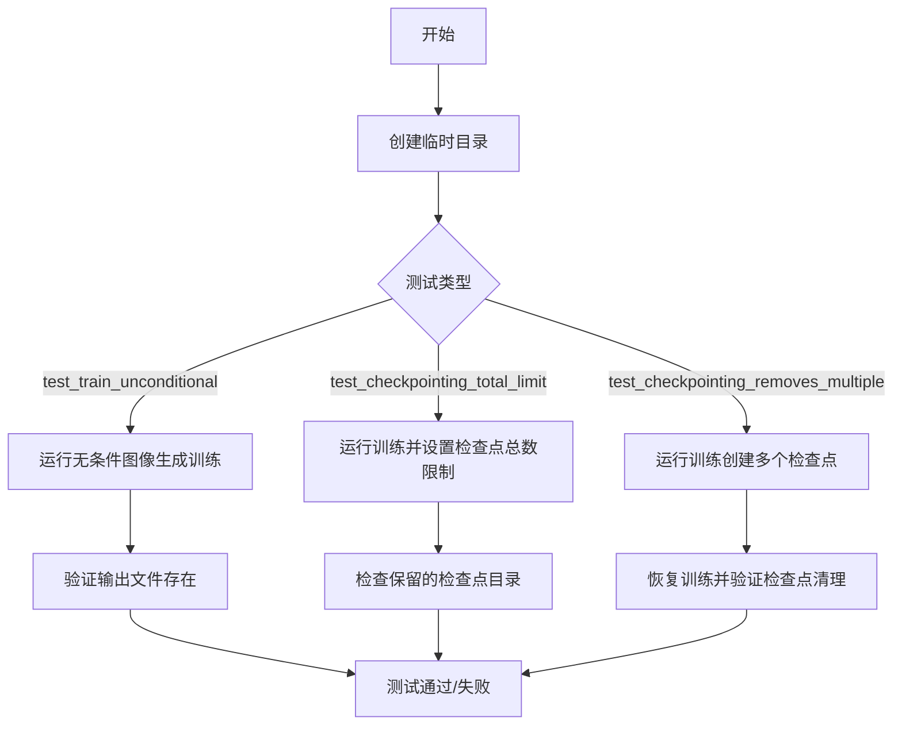
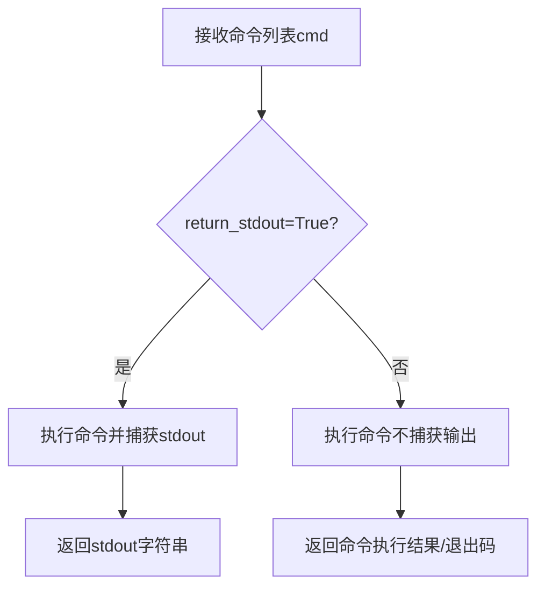
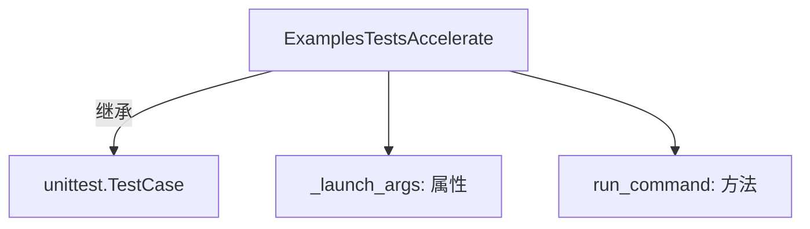
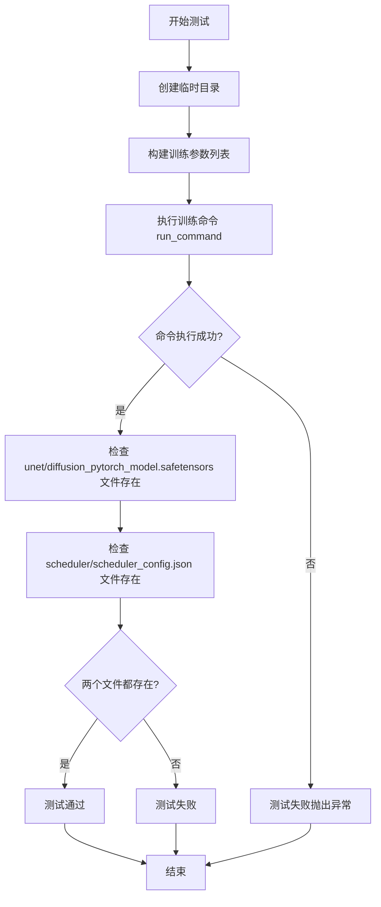
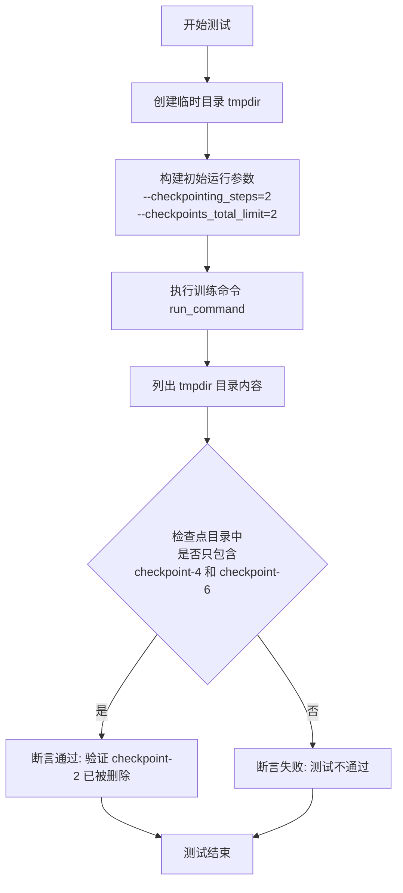
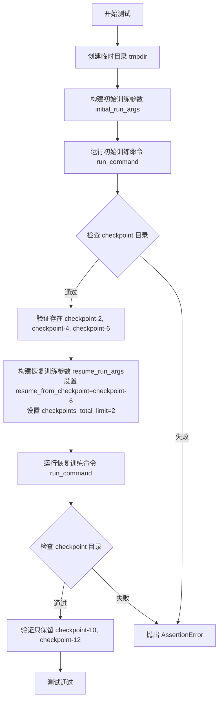

# `diffusers\examples\unconditional_image_generation\test_unconditional.py` 详细设计文档

这是一个HuggingFace Diffusers库的集成测试文件，用于测试无条件图像生成示例的训练流程、检查点保存和清理功能，包括单次训练、检查点总数限制和多检查点删除等场景。

## 整体流程



## 类结构

```
ExamplesTestsAccelerate (基类)
└── Unconditional (测试类)
```

## 全局变量及字段


### `logger`
    
全局日志记录器，用于输出调试信息

类型：`logging.Logger`
    


### `stream_handler`
    
全局日志处理器，用于将日志输出到标准输出(sys.stdout)

类型：`logging.StreamHandler`
    


    

## 全局函数及方法


由于`run_command`函数是**从外部模块导入的**（`from test_examples_utils import run_command`），其实际实现源码并未包含在给定的代码片段中。但我可以通过分析其在代码中的**调用方式**来推断其功能签名和行为。

---

### `run_command`

这是一个用于执行命令行指令的辅助函数，从`test_examples_utils`模块导入。

参数：

- `cmd`：`List[str]`，需要执行的命令列表（通常包含启动器和训练脚本参数）
- `return_stdout`：`bool`，可选参数，指定是否返回标准输出，默认为`False`

返回值：`Any`，命令执行的输出结果（当`return_stdout=True`时返回标准输出字符串，否则可能返回None或命令的退出码）

#### 流程图



#### 带注释源码

```python
# 注意：此为基于调用方式的推断实现，实际源码位于 test_examples_utils 模块中
def run_command(cmd: List[str], return_stdout: bool = False) -> Any:
    """
    执行给定的命令行指令
    
    参数:
        cmd: 命令列表，如 ['python', 'script.py', '--arg1', 'value1']
        return_stdout: 是否捕获并返回标准输出
        
    返回:
        命令执行结果或标准输出字符串
    """
    # 实际实现需要查看 test_examples_utils 模块源码
    pass
```

---

## 补充说明

由于`run_command`的实际实现不在当前代码文件中，无法提供精确的源码。根据代码中的调用模式：

1. **调用方式1**：`run_command(self._launch_args + test_args, return_stdout=True)` - 需要返回执行输出
2. **调用方式2**：`run_command(self._launch_args + initial_run_args)` - 仅执行命令不关心输出

建议查阅 `test_examples_utils.py` 文件获取完整的函数实现细节。


# 详细设计文档提取结果

## 注意

在提供的代码中，`ExamplesTestsAccelerate` 类并非在该文件中定义，而是从 `test_examples_utils` 模块导入的基类。该类的完整定义（包含其字段和方法实现）不在当前代码段中。

以下是基于代码中使用方式对 `ExamplesTestsAccelerate` 的推断信息：

### `ExamplesTestsAccelerate`

从 `test_examples_utils` 导入的测试基类，用于支持基于 Accelerate 的示例测试。

参数： 无直接参数（构造函数参数未知）

返回值：`无`（类定义）

#### 流程图



#### 带注释源码

```python
# 从 test_examples_utils 模块导入的基类
# ExamplesTestsAccelerate 是测试框架类，支持加速测试执行
from test_examples_utils import ExamplesTestsAccelerate, run_command  # noqa: E402

# 该类被 Unconditional 测试类继承
class Unconditional(ExamplesTestsAccelerate):
    # ExamplesTestsAccelerate 提供了 _launch_args 属性和 run_command 方法
    # 具体实现细节需要查看 test_examples_utils 模块源码
```

---

## 建议

要获取 `ExamplesTestsAccelerate` 类的完整详细信息（包括所有字段和方法），需要查看 `test_examples_utils.py` 文件的源码。当前代码段仅展示了该类的**使用方式**，而非其定义本身。

如果你需要我提取 `Unconditional` 类的详细信息（它继承自 `ExamplesTestsAccelerate` 并在当前文件中定义），请告知。


### `Unconditional.test_train_unconditional`

该方法是一个集成测试用例，用于验证无条件图像生成训练脚本的正确性。它创建临时目录、配置训练参数、执行训练命令，并验证生成的模型文件（unet 和 scheduler）是否正确保存。

参数：

- `self`：隐式参数，`Unconditional` 类的实例本身

返回值：`None`，该方法为测试方法，无返回值（隐式返回 None）

#### 流程图



#### 带注释源码

```python
def test_train_unconditional(self):
    """
    测试无条件图像生成训练脚本的端到端功能
    
    测试内容：
    1. 使用指定的虚拟数据集进行训练
    2. 验证模型保存功能
    3. 验证调度器配置保存功能
    """
    # 创建一个临时目录用于存放训练输出
    # 使用上下文管理器确保测试结束后自动清理
    with tempfile.TemporaryDirectory() as tmpdir:
        
        # 构建训练命令参数列表
        # 包含以下关键参数：
        # - dataset_name: 测试用虚拟数据集
        # - model_config_name_or_path: 虚拟模型配置
        # - resolution: 图像分辨率 64x64
        # - output_dir: 模型输出目录
        # - train_batch_size: 训练批量大小为 2
        # - num_epochs: 训练 1 个 epoch
        # - gradient_accumulation_steps: 梯度累积步数为 1
        # - ddpm_num_inference_steps: DDPM 推理步数为 2
        # - learning_rate: 学习率 1e-3
        # - lr_warmup_steps: 学习率预热步数为 5
        test_args = f"""
            examples/unconditional_image_generation/train_unconditional.py
            --dataset_name hf-internal-testing/dummy_image_class_data
            --model_config_name_or_path diffusers/ddpm_dummy
            --resolution 64
            --output_dir {tmpdir}
            --train_batch_size 2
            --num_epochs 1
            --gradient_accumulation_steps 1
            --ddpm_num_inference_steps 2
            --learning_rate 1e-3
            --lr_warmup_steps 5
            """.split()

        # 执行训练命令
        # _launch_args 包含启动器参数（如 accelerate 配置）
        # return_stdout=True 表示捕获标准输出
        run_command(self._launch_args + test_args, return_stdout=True)
        
        # ========== 断言验证部分 ==========
        
        # 验证 UNet 模型权重文件是否正确保存
        # 使用 safetensors 格式保存
        self.assertTrue(
            os.path.isfile(
                os.path.join(tmpdir, "unet", "diffusion_pytorch_model.safetensors")
            ),
            "UNet 模型文件未正确保存"
        )
        
        # 验证调度器配置文件是否正确保存
        # 包含 DDPM 调度器的配置信息
        self.assertTrue(
            os.path.isfile(
                os.path.join(tmpdir, "scheduler", "scheduler_config.json")
            ),
            "调度器配置文件未正确保存"
        )
```


### `Unconditional.test_unconditional_checkpointing_checkpoints_total_limit`

该方法用于测试无条件的图像生成训练中的检查点总数限制功能，通过运行训练脚本并验证当设置 `--checkpoints_total_limit=2` 时，旧检查点会被正确删除，最终只保留最新的两个检查点目录。

参数：

- `self`：`Unconditional` 实例本身，无需显式传递

返回值：`None`，该方法为测试方法，通过断言验证检查点目录是否符合预期，无显式返回值。

#### 流程图



#### 带注释源码

```python
def test_unconditional_checkpointing_checkpoints_total_limit(self):
    """
    测试检查点总数限制功能。
    
    验证当设置 --checkpoints_total_limit=2 时，
    训练过程中旧检查点会被自动删除，只保留最新的两个检查点。
    """
    # 创建临时目录用于存放训练输出和检查点
    with tempfile.TemporaryDirectory() as tmpdir:
        # 定义初始运行的命令行参数
        # 关键参数说明:
        # --checkpointing_steps=2: 每2个步数保存一个检查点
        # --checkpoints_total_limit=2: 最多保留2个检查点
        initial_run_args = f"""
            examples/unconditional_image_generation/train_unconditional.py
            --dataset_name hf-internal-testing/dummy_image_class_data
            --model_config_name_or_path diffusers/ddpm_dummy
            --resolution 64
            --output_dir {tmpdir}
            --train_batch_size 1
            --num_epochs 1
            --gradient_accumulation_steps 1
            --ddpm_num_inference_steps 2
            --learning_rate 1e-3
            --lr_warmup_steps 5
            --checkpointing_steps=2
            --checkpoints_total_limit=2
            """.split()

        # 执行训练命令，生成检查点
        # 预期生成: checkpoint-2, checkpoint-4, checkpoint-6
        # 由于设置了 checkpoints_total_limit=2，最早的 checkpoint-2 应被删除
        run_command(self._launch_args + initial_run_args)

        # 验证检查点目录是否正确
        # 预期结果: checkpoint-2 已被删除，只保留 checkpoint-4 和 checkpoint-6
        self.assertEqual(
            # 筛选出目录名中包含 'checkpoint' 的项
            {x for x in os.listdir(tmpdir) if "checkpoint" in x},
            # checkpoint-2 应该已被删除
            {"checkpoint-4", "checkpoint-6"},
        )
```


### `Unconditional.test_unconditional_checkpointing_checkpoints_total_limit_removes_multiple_checkpoints`

这是一个单元测试方法，用于测试当设置 `checkpoints_total_limit` 参数时，系统能够正确删除多余的 checkpoint，只保留指定数量的最新 checkpoint。该测试模拟了训练过程中的 checkpoint 管理逻辑，验证在恢复训练场景下旧的 checkpoint 会被自动清理。

参数：

- `self`：`Unconditional` 类实例，Python 对象，隐式参数，代表测试类实例本身

返回值：`None`，无返回值，该方法为测试方法，通过 `assert` 语句验证预期行为

#### 流程图



#### 带注释源码

```python
def test_unconditional_checkpointing_checkpoints_total_limit_removes_multiple_checkpoints(self):
    """
    测试当设置 checkpoints_total_limit=2 时，系统能够正确删除多余的 checkpoint。
    该测试验证：
    1. 首次训练生成多个 checkpoint
    2. 恢复训练时只保留最近的两个 checkpoint
    """
    
    # 创建一个临时目录用于存放训练输出和 checkpoint
    with tempfile.TemporaryDirectory() as tmpdir:
        
        # ==================== 第一次训练运行 ====================
        # 构建初始训练参数：训练 1 个 epoch，间隔 2 步保存 checkpoint
        initial_run_args = f"""
            examples/unconditional_image_generation/train_unconditional.py
            --dataset_name hf-internal-testing/dummy_image_class_data
            --model_config_name_or_path diffusers/ddpm_dummy
            --resolution 64
            --output_dir {tmpdir}
            --train_batch_size 1
            --num_epochs 1
            --gradient_accumulation_steps 1
            --ddpm_num_inference_steps 1
            --learning_rate 1e-3
            --lr_warmup_steps 5
            --checkpointing_steps=2
            """.split()

        # 执行初始训练命令（无 checkpoints_total_limit 限制）
        run_command(self._launch_args + initial_run_args)

        # 验证第一次训练后生成了 checkpoint-2, checkpoint-4, checkpoint-6
        # check checkpoint directories exist
        self.assertEqual(
            {x for x in os.listdir(tmpdir) if "checkpoint" in x},
            {"checkpoint-2", "checkpoint-4", "checkpoint-6"},
        )

        # ==================== 恢复训练运行 ====================
        # 构建恢复训练参数：从 checkpoint-6 恢复，训练 2 个 epoch
        # 关键：设置 checkpoints_total_limit=2 限制只保留 2 个 checkpoint
        resume_run_args = f"""
            examples/unconditional_image_generation/train_unconditional.py
            --dataset_name hf-internal-testing/dummy_image_class_data
            --model_config_name_or_path diffusers/ddpm_dummy
            --resolution 64
            --output_dir {tmpdir}
            --train_batch_size 1
            --num_epochs 2
            --gradient_accumulation_steps 1
            --ddpm_num_inference_steps 1
            --learning_rate 1e-3
            --lr_warmup_steps 5
            --resume_from_checkpoint=checkpoint-6
            --checkpointing_steps=2
            --checkpoints_total_limit=2
            """.split()

        # 执行恢复训练命令
        run_command(self._launch_args + resume_run_args)

        # 验证恢复训练后只保留了 checkpoint-10, checkpoint-12
        # 旧的 checkpoint-2, checkpoint-4, checkpoint-6, checkpoint-8 已被删除
        # check checkpoint directories exist
        self.assertEqual(
            {x for x in os.listdir(tmpdir) if "checkpoint" in x},
            {"checkpoint-10", "checkpoint-12"},
        )
```

## 关键组件


### Unconditional 测试类

继承自 ExamplesTestsAccelerate 的测试类，用于验证无条件的图像生成训练功能，包括模型训练、检查点保存与恢复、检查点总数限制等核心功能。

### test_train_unconditional 方法

测试基本的无条件图像生成训练流程，验证训练脚本能够正确加载数据集、配置模型、执行训练并保存模型权重和调度器配置。

### test_unconditional_checkpointing_checkpoints_total_limit 方法

测试检查点总数限制功能，验证当设置 checkpoints_total_limit=2 时，训练过程能够自动删除旧的检查点，仅保留最新的两个检查点（checkpoint-4 和 checkpoint-6）。

### test_unconditional_checkpointing_checkpoints_total_limit_removes_multiple_checkpoints 方法

测试检查点删除功能，验证从检查点恢复训练后，系统能够正确管理检查点数量，自动清理超过限制的旧检查点，最终保留最新的 checkpoint-10 和 checkpoint-12。

### run_command 工具函数

来自 test_examples_utils 模块的辅助函数，用于执行命令行命令并返回输出结果。

### _launch_args 属性

测试类的启动参数配置，包含运行训练脚本所需的基础命令行参数。

### 检查点管理机制

通过 --checkpointing_steps 和 --checkpoints_total_limit 参数控制的检查点管理功能，支持自动保存和自动清理旧检查点。

### 临时目录管理

使用 tempfile.TemporaryDirectory() 创建临时目录用于测试，确保测试环境的隔离性和清洁性。


## 问题及建议


### 已知问题

-   **硬编码的测试参数**：多个测试方法中存在大量重复的命令行参数（如 `--dataset_name`、`--model_config_name_or_path`、`--resolution` 等），未提取为共享的默认配置，增加维护成本
-   **魔法数字与字符串**：测试中使用了大量硬编码的数值（如 `num_epochs=1`、`train_batch_size=2`、`checkpointing_steps=2` 等），缺乏常量定义，修改时容易遗漏
-   **代码重复**：三个测试方法中存在显著的代码重复，包括参数构建逻辑和目录检查逻辑，可通过提取辅助方法减少冗余
-   **导入方式不规范**：使用 `sys.path.append("..")` 进行相对导入，依赖于运行目录，缺乏健壮性
-   **日志配置缺乏灵活性**：`logging.basicConfig(level=logging.DEBUG)` 硬编码为 DEBUG 级别，在生产环境或不同测试场景下可能导致日志噪音过多
-   **错误处理不足**：`run_command` 调用后未显式检查返回值或捕获异常，测试失败时定位问题困难
-   **断言信息缺失**：部分断言（如 `assertTrue`）未提供自定义错误信息，测试失败时难以快速理解预期行为
-   **魔法字符串检查**：使用 `{x for x in os.listdir(tmpdir) if "checkpoint" in x}` 进行目录名称检查，依赖字符串包含关系而非精确匹配，存在误判风险

### 优化建议

-   **提取测试配置类**：创建测试配置类或 fixture，集中管理默认参数（如数据集名称、模型路径、分辨率等），减少硬编码
-   **定义常量或枚举**：将魔法数字提取为类常量或枚举，如 `DEFAULT_EPOCHS = 1`、`DEFAULT_BATCH_SIZE = 2` 等
-   **封装辅助方法**：提取通用的命令构建方法（如 `_build_train_args`）和检查方法（如 `_check_checkpoint_dirs`），提高代码复用性
-   **改进导入方式**：使用 `importlib` 或配置 `PYTHONPATH` 替代 `sys.path.append`，或使用项目内的绝对导入路径
-   **增强日志配置**：通过环境变量或配置文件控制日志级别，避免硬编码（如 `level=logging.DEBUG`）
-   **添加异常处理**：对 `run_command` 调用添加超时机制和返回码检查，失败时输出更详细的诊断信息
-   **改进断言信息**：为所有断言添加自定义错误信息，例如 `self.assertTrue(..., "Expected checkpoint file not found")`
-   **使用正则表达式或更精确的匹配**：将 `"checkpoint" in x` 替换为正则表达式匹配（如 `re.match(r'checkpoint-\d+', x)`），提高检查准确性

## 其它


### 设计目标与约束

本文档旨在记录并验证 `examples/unconditional_image_generation/train_unconditional.py` 训练脚本的功能正确性，包括模型训练、检查点保存与恢复、检查点数量限制等核心功能。测试代码基于 `ExamplesTestsAccelerate` 测试框架，使用 `unittest` 断言验证输出文件的正确性。测试在临时目录中执行，训练配置参数经过简化以加快测试速度，包括使用小批量大小（1-2）、少训练轮次（1-2 epochs）、低推理步数（1-2 steps）等。

### 错误处理与异常设计

测试代码主要通过 `unittest` 框架的 `assertTrue` 和 `assertEqual` 方法进行断言验证，检查文件是否存在以及检查点目录名称是否符合预期。测试使用了 `tempfile.TemporaryDirectory()` 确保测试结束后自动清理临时文件。当 `run_command` 执行训练命令失败时，测试会自动失败。代码依赖 `ExamplesTestsAccelerate` 基类提供的 `_launch_args` 属性来配置分布式训练参数（如有）。

### 数据流与状态机

测试流程主要分为两种场景：1）从头训练场景：首先执行训练命令，运行指定数量的 epoch，训练过程中按 `checkpointing_steps` 保存检查点，当 `checkpoints_total_limit` 设置时，超过限制的旧检查点会被自动删除；2）恢复训练场景：从指定检查点（如 checkpoint-6）恢复训练，继续执行剩余 epoch，并继续保存新的检查点，同时应用检查点总数限制。

### 外部依赖与接口契约

本测试代码依赖以下外部组件：`test_examples_utils` 模块中的 `ExamplesTestsAccelerate` 基类和 `run_command` 辅助函数；`diffusers/ddpm_dummy` 预训练模型配置；`hf-internal-testing/dummy_image_class_data` 测试用虚拟图像分类数据集。训练脚本 `train_unconditional.py` 通过命令行参数接收配置，包括数据集名称、模型配置、分辨率、输出目录、训练批次大小、epoch 数量、学习率等。输出文件约定包含 `unet/diffusion_pytorch_model.safetensors` 和 `scheduler/scheduler_config.json`。

### 关键组件信息

- **ExamplesTestsAccelerate**: 测试基类，提供分布式训练启动参数 `_launch_args`
- **run_command**: 执行命令行训练任务的辅助函数
- **tempfile.TemporaryDirectory**: Python 标准库，用于创建临时测试目录
- **unittest**: Python 单元测试框架

### 潜在的技术债务与优化空间

1. 测试代码中使用了硬编码的魔法数字（如 checkpoint-2、checkpoint-4、checkpoint-6），缺乏对检查点命名规律的参数化封装
2. 测试断言仅检查文件名存在性，未验证模型权重或调度器配置的实际内容正确性
3. 缺少对训练过程中日志输出、梯度更新、内存使用等方面的验证
4. 测试数据依赖外部 HuggingFace Hub 数据集，网络不可用时测试将失败，建议使用本地虚拟数据集
5. 测试覆盖场景有限，未包含断点续训失败、超参数校验失败等异常情况

### 其它项目

**并发与分布式支持**：测试通过 `_launch_args` 支持 Accelerate 分布式训练环境，但测试代码本身未显式验证多 GPU 场景下的行为。

**可维护性与可读性**：命令行参数通过 f-string 和 `.split()` 构建，长命令行被拆分至多行，建议封装为配置字典或使用 `argparse.Namespace` 对象提高可读性。

**测试隔离性**：每个测试方法使用独立的临时目录，避免相互干扰，但测试执行顺序可能影响资源分配。


    