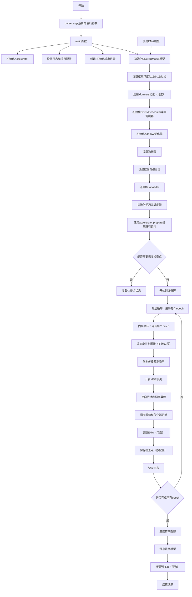
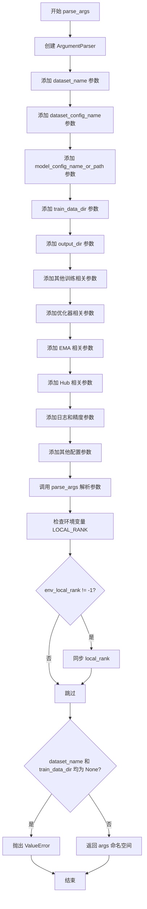
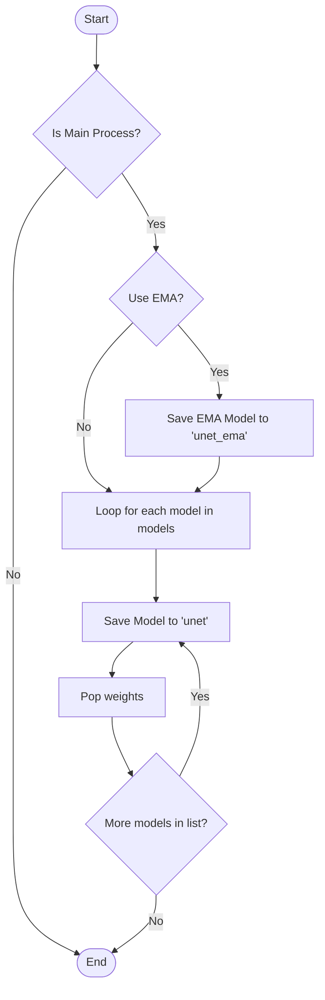
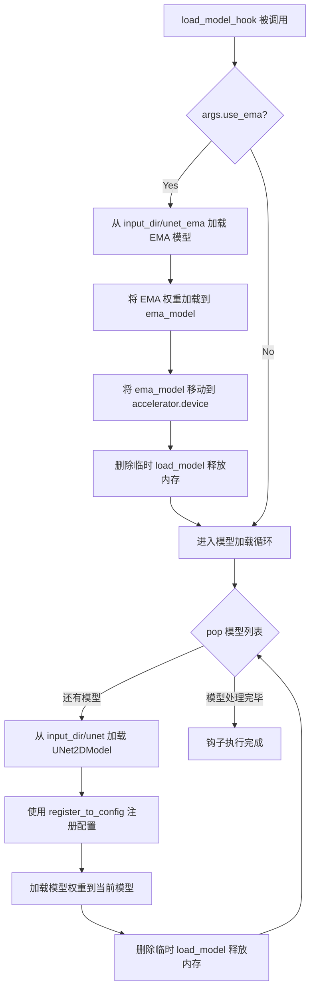

```mermaid
flowchart TD
    A[开始 main 函数] --> B[创建 logging 目录和 Accelerator]
    B --> C[设置日志级别]
    C --> D{accelerator.is_main_process}
    D -->|是| E[创建输出目录和 Hub 仓库]
    D -->|否| F
    E --> F[初始化 UNet2DModel]
    F --> G{use_ema?}
    G -->|是| H[创建 EMA 模型]
    G -->|否| I
    H --> I[设置混合精度权重类型]
    I --> J{enable_xformers?}
    J -->|是| K[启用 xformers 高效注意力]
    J -->|否| L
    K --> L[初始化 DDPMScheduler]
    L --> M[创建 AdamW 优化器]
    M --> N[加载数据集]
    N --> O[创建数据增强和 DataLoader]
    O --> P[创建学习率调度器]
    P --> Q[使用 Accelerator 准备模型、优化器、数据加载器、调度器]
    Q --> R[初始化训练追踪器]
    R --> S[计算总批大小和最大训练步数]
    S --> T{resume_from_checkpoint?}
    T -->|是| U[加载检查点并恢复训练状态]
    T -->|否| V
    U --> V[开始训练循环 for epoch in range]
    V --> W[模型设为训练模式]
    W --> X[遍历 train_dataloader]
    X --> Y[采样噪声和 timestep]
    Y --> Z[前向扩散: 添加噪声到干净图像]
    Z --> AA[使用 accelerator.accumulate 累积梯度]
    AA --> AB[模型预测噪声残差]
    AB --> AC[计算 MSE 损失或基于 SNR 的损失]
    AC --> AD[反向传播 accelerator.backward]
    AD --> AE{同步梯度?}
    AE -->|是| AF[梯度裁剪]
    AE -->|否| AJ
    AF --> AG[优化器更新参数]
    AG --> AH[学习率调度器更新]
    AH --> AI[清零梯度]
    AI --> AJ[EMA 模型更新?]
    AJ -->|是| AK[ema_model.step]
    AJ -->|否| AL
    AK --> AL[更新进度条和全局步数]
    AL --> AM{是主进程且到检查点保存步?}
    AM -->|是| AN[检查并删除旧检查点]
    AN --> AO[保存训练状态]
    AM -->|否| AP
    AO --> AP[记录日志]
    AP --> AQ{还有更多 batch?}
    AQ -->|是| X
    AQ -->|否| AR[等待所有进程]
    AR --> AS{是主进程且到图像保存 epoch?}
    AS -->|是| AT[生成样本图像]
    AT --> AU[保存图像到日志]
    AS -->|否| AV
    AV --> AW{是主进程且到模型保存 epoch?}
    AW -->|是| AX[保存模型到输出目录]
    AX --> AY[可选: 上传到 Hub]
    AW -->|否| AZ
    AZ --> BA[训练循环结束]
    BA --> BB[结束训练 accelerator.end_training]
    BB --> CC[结束]
```

# `diffusers\examples\unconditional_image_generation\train_unconditional.py` 详细设计文档

这是一个使用Hugging Face Diffusers库训练DDPM（去噪扩散概率模型）的脚本，支持分布式训练、混合精度、EMA、模型检查点保存、图像日志记录等功能，可用于无条件图像生成任务。

## 整体流程



## 类结构

```
无自定义类（使用diffusers库的类）
├── diffusers库类
│   ├── UNet2DModel (UNet2D模型)
│   ├── DDPMScheduler (DDPM噪声调度器)
│   ├── DDPMPipeline (DDPM推理管道)
│   └── EMAModel (指数移动平均模型)
├── accelerate库
│   └── Accelerator (分布式训练加速器)
└── datasets库
    └── Dataset (数据集)
```

## 全局变量及字段


### `logger`
    
用于记录训练过程中的日志信息

类型：`logging.Logger`
    


### `args`
    
存储从命令行解析的所有训练参数

类型：`argparse.Namespace`
    


### `accelerator`
    
管理分布式训练、混合精度和模型更新的加速器

类型：`accelerate.Accelerator`
    


### `model`
    
用于去噪的UNet2D模型

类型：`diffusers.UNet2DModel`
    


### `ema_model`
    
指数移动平均模型，用于稳定训练和推理

类型：`diffusers.training_utils.EMAModel or None`
    


### `noise_scheduler`
    
管理扩散过程中的噪声调度

类型：`diffusers.DDPMScheduler`
    


### `optimizer`
    
更新模型参数的AdamW优化器

类型：`torch.optim.AdamW`
    


### `lr_scheduler`
    
动态调整学习率的调度器

类型：`diffusers.optimization._LRScheduler`
    


### `train_dataloader`
    
批量加载训练数据的数据加载器

类型：`torch.utils.data.DataLoader`
    


### `dataset`
    
HuggingFace格式的训练数据集

类型：`datasets.Dataset`
    


### `weight_dtype`
    
根据混合精度设置决定权重的数据类型

类型：`torch.dtype`
    


### `total_batch_size`
    
分布式环境下的全局批量大小

类型：`int`
    


### `num_update_steps_per_epoch`
    
每个训练 epoch 中的参数更新步数

类型：`int`
    


### `max_train_steps`
    
整个训练过程的总步数

类型：`int`
    


### `global_step`
    
记录训练过程中的累计步数

类型：`int`
    


### `first_epoch`
    
从检查点恢复训练时的起始 epoch

类型：`int`
    


### `run`
    
用于实验追踪标识的名称

类型：`str`
    


    

## 全局函数及方法


### `_extract_into_tensor`

该函数用于从1-D数组中根据批次索引提取相应数值，并通过维度扩展和广播将结果调整为指定的输出形状，常用于扩散模型中根据时间步获取噪声调度参数。

**参数：**

- `arr`：Union[np.ndarray, torch.Tensor]，1-D数组，包含待提取的数值（如噪声调度器的累积Alpha值）。
- `timesteps`：torch.Tensor，一维整数张量，表示要提取的批次索引。
- `broadcast_shape`：tuple of int，目标输出形状，包含批次维度在内的K维形状。

**返回值：** `torch.Tensor`，形状与`broadcast_shape`相同的张量，其中非批次维度被广播为指定形状。

#### 流程图

```mermaid
flowchart TD
    A[开始: _extract_into_tensor] --> B{arr是否为torch.Tensor?}
    B -->|否| C[使用torch.from_numpy转换为Tensor]
    C --> D
    B -->|是| D[使用timesteps索引arr并转为float]
    D --> E[提取元素: arr[timesteps].float()]
    E --> F[转移设备: .to(timesteps.device)]
    F --> G{res维度数 < broadcast_shape维度数?}
    G -->|是| H[添加新维度: res[..., None]]
    H --> G
    G -->|否| I[广播到目标形状: res.expand(broadcast_shape)]
    I --> J[返回结果张量]
```

#### 带注释源码

```python
def _extract_into_tensor(arr, timesteps, broadcast_shape):
    """
    Extract values from a 1-D numpy array for a batch of indices.

    :param arr: the 1-D numpy array.
    :param timesteps: a tensor of indices into the array to extract.
    :param broadcast_shape: a larger shape of K dimensions with the batch
                            dimension equal to the length of timesteps.
    :return: a tensor of shape [batch_size, 1, ...] where the shape has K dims.
    """
    # 如果输入不是torch.Tensor，则从numpy数组转换为torch张量
    if not isinstance(arr, torch.Tensor):
        arr = torch.from_numpy(arr)
    
    # 使用timesteps作为索引从arr中提取对应位置的数值，
    # 转换为float类型以确保精度，并将数据移动到timesteps所在的设备上
    res = arr[timesteps].float().to(timesteps.device)
    
    # 通过在末尾添加维度，使res的维度数与broadcast_shape相同
    # 例如：从[batch_size]扩展为[batch_size, 1, 1, 1]
    while len(res.shape) < len(broadcast_shape):
        res = res[..., None]
    
    # 使用expand将张量广播到目标形状，expand不会复制数据，只改变视图
    # 返回的张量形状与broadcast_shape完全一致
    return res.expand(broadcast_shape)
```


### `_ensure_three_channels`

该函数用于确保输入的张量恰好具有3个通道（C, H, W）。如果输入张量的通道数不符合要求，函数将通过重复或截断通道的方式来调整它，最终返回一个符合要求的3通道张量。

参数：

- `tensor`：`torch.Tensor`，输入的张量，可以是2D（单通道灰度图）、3D（单/多通道图像）或4D（batch形式的图像）

返回值：`torch.Tensor`，返回调整后的、恰好有3个通道的张量

#### 流程图

```mermaid
flowchart TD
    A[输入 tensor] --> B{tensor.ndim == 2?}
    B -- 是 --> C[tensor.unsqueeze(0) 添加通道维度]
    B -- 否 --> D[获取 channels = tensor.shape[0]]
    C --> D
    D --> E{channels == 3?}
    E -- 是 --> F[直接返回 tensor]
    E -- 否 --> G{channels == 1?}
    G -- 是 --> H[tensor.repeat(3, 1, 1) 重复3次]
    G -- 否 --> I{channels == 2?}
    I -- 是 --> J[torch.cat 复制第一通道拼接]
    I -- 否 --> K{channels > 3?}
    K -- 是 --> L[tensor[:3] 截取前3通道]
    K -- 否 --> M[抛出 ValueError 异常]
    H --> N[返回处理后的 tensor]
    J --> N
    F --> N
    L --> N
```

#### 带注释源码

```python
def _ensure_three_channels(tensor: torch.Tensor) -> torch.Tensor:
    """
    Ensure the tensor has exactly three channels (C, H, W) by repeating or truncating channels when needed.
    
    处理逻辑：
    - 2D输入 (H, W): 添加通道维度变成 (1, H, W)
    - 1通道: 重复3次变成 (3, H, W)
    - 2通道: 复制第一通道拼接成 (3, H, W)
    - 3通道: 直接返回
    - >3通道: 截取前3个通道
    """
    # 如果是2D张量（纯高度×宽度，没有通道维度），添加通道维度变成3D
    if tensor.ndim == 2:
        tensor = tensor.unsqueeze(0)
    
    # 获取通道数
    channels = tensor.shape[0]
    
    # 已经是3通道，直接返回
    if channels == 3:
        return tensor
    
    # 单通道灰度图像：将单通道重复3次变成RGB
    if channels == 1:
        return tensor.repeat(3, 1, 1)
    
    # 双通道图像：复制第一个通道拼接到第3维
    if channels == 2:
        return torch.cat([tensor, tensor[:1]], dim=0)
    
    # 多于3个通道：只取前3个通道
    if channels > 3:
        return tensor[:3]
    
    # 不支持的通道数，抛出异常
    raise ValueError(f"Unsupported number of channels: {channels}")
```


### `parse_args`

解析命令行参数，返回包含所有训练配置的命名空间对象。

参数：
该函数无显式参数（通过 `argparse` 自动接收命令行参数）。

返回值：`args`（`argparse.Namespace`），包含所有命令行参数及其值的命名空间对象。

#### 流程图



#### 带注释源码

```
def parse_args():
    """
    解析命令行参数，返回参数命名空间对象。
    
    该函数使用 argparse 库定义了一系列训练所需的命令行参数，
    包括数据集配置、模型配置、训练超参数、优化器参数、EMA 配置、
    日志记录配置、分布式训练配置等。
    
    返回:
        argparse.Namespace: 包含所有解析后参数的对象
    """
    # 创建 ArgumentParser 实例，设置描述信息
    parser = argparse.ArgumentParser(description="Simple example of a training script.")
    
    # ==================== 数据集相关参数 ====================
    # 数据集名称（支持 HuggingFace Hub 或本地路径）
    parser.add_argument(
        "--dataset_name",
        type=str,
        default=None,
        help=(
            "The name of the Dataset (from the HuggingFace hub) to train on (could be your own, possibly private,"
            " dataset). It can also be a path pointing to a local copy of a dataset in your filesystem,"
            " or to a folder containing files that HF Datasets can understand."
        ),
    )
    # 数据集配置名称
    parser.add_argument(
        "--dataset_config_name",
        type=str,
        default=None,
        help="The config of the Dataset, leave as None if there's only one config.",
    )
    # 模型配置文件路径
    parser.add_argument(
        "--model_config_name_or_path",
        type=str,
        default=None,
        help="The config of the UNet model to train, leave as None to use standard DDPM configuration.",
    )
    # 训练数据目录
    parser.add_argument(
        "--train_data_dir",
        type=str,
        default=None,
        help=(
            "A folder containing the training data. Folder contents must follow the structure described in"
            " https://huggingface.co/docs/datasets/image_dataset#imagefolder. In particular, a `metadata.jsonl` file"
            " must exist to provide the captions for the images. Ignored if `dataset_name` is specified."
        ),
    )
    
    # ==================== 输出相关参数 ====================
    # 输出目录
    parser.add_argument(
        "--output_dir",
        type=str,
        default="ddpm-model-64",
        help="The output directory where the model predictions and checkpoints will be written.",
    )
    # 是否覆盖已有输出目录
    parser.add_argument("--overwrite_output_dir", action="store_true")
    # 缓存目录
    parser.add_argument(
        "--cache_dir",
        type=str,
        default=None,
        help="The directory where the downloaded models and datasets will be stored.",
    )
    
    # ==================== 图像处理参数 ====================
    # 输入图像分辨率
    parser.add_argument(
        "--resolution",
        type=int,
        default=64,
        help=(
            "The resolution for input images, all the images in the train/validation dataset will be resized to this"
            " resolution"
        ),
    )
    # 是否中心裁剪
    parser.add_argument(
        "--center_crop",
        default=False,
        action="store_true",
        help=(
            "Whether to center crop the input images to the resolution. If not set, the images will be randomly"
            " cropped. The images will be resized to the resolution first before cropping."
        ),
    )
    # 是否随机水平翻转
    parser.add_argument(
        "--random_flip",
        default=False,
        action="store_true",
        help="whether to randomly flip images horizontally",
    )
    
    # ==================== 训练批处理参数 ====================
    # 训练批次大小
    parser.add_argument(
        "--train_batch_size", type=int, default=16, help="Batch size (per device) for the training dataloader."
    )
    # 评估批次大小
    parser.add_argument(
        "--eval_batch_size", type=int, default=16, help="The number of images to generate for evaluation."
    )
    # DataLoader 工作进程数
    parser.add_argument(
        "--dataloader_num_workers",
        type=int,
        default=0,
        help=(
            "The number of subprocesses to use for data loading. 0 means that the data will be loaded in the main"
            " process."
        ),
    )
    
    # ==================== 训练轮次参数 ====================
    # 训练轮次
    parser.add_argument("--num_epochs", type=int, default=100)
    # 保存图像的轮次间隔
    parser.add_argument("--save_images_epochs", type=int, default=10, help="How often to save images during training.")
    # 保存模型的轮次间隔
    parser.add_argument(
        "--save_model_epochs", type=int, default=10, help="How often to save the model during training."
    )
    # 梯度累积步数
    parser.add_argument(
        "--gradient_accumulation_steps",
        type=int,
        default=1,
        help="Number of updates steps to accumulate before performing a backward/update pass.",
    )
    
    # ==================== 学习率调度器参数 ====================
    # 初始学习率
    parser.add_argument(
        "--learning_rate",
        type=float,
        default=1e-4,
        help="Initial learning rate (after the potential warmup period) to use.",
    )
    # 学习率调度器类型
    parser.add_argument(
        "--lr_scheduler",
        type=str,
        default="cosine",
        help=(
            'The scheduler type to use. Choose between ["linear", "cosine", "cosine_with_restarts", "polynomial",'
            ' "constant", "constant_with_warmup"]'
        ),
    )
    # 学习率预热步数
    parser.add_argument(
        "--lr_warmup_steps", type=int, default=500, help="Number of steps for the warmup in the lr scheduler."
    )
    
    # ==================== Adam 优化器参数 ====================
    # Adam beta1 参数
    parser.add_argument("--adam_beta1", type=float, default=0.95, help="The beta1 parameter for the Adam optimizer.")
    # Adam beta2 参数
    parser.add_argument("--adam_beta2", type=float, default=0.999, help="The beta2 parameter for the Adam optimizer.")
    # Adam 权重衰减
    parser.add_argument(
        "--adam_weight_decay", type=float, default=1e-6, help="Weight decay magnitude for the Adam optimizer."
    )
    # Adam epsilon 值
    parser.add_argument("--adam_epsilon", type=float, default=1e-08, help="Epsilon value for the Adam optimizer.")
    
    # ==================== EMA 参数 ====================
    # 是否使用 EMA
    parser.add_argument(
        "--use_ema",
        action="store_true",
        help="Whether to use Exponential Moving Average for the final model weights.",
    )
    # EMA 逆 gamma 值
    parser.add_argument("--ema_inv_gamma", type=float, default=1.0, help="The inverse gamma value for the EMA decay.")
    # EMA 幂值
    parser.add_argument("--ema_power", type=float, default=3 / 4, help="The power value for the EMA decay.")
    # EMA 最大衰减
    parser.add_argument("--ema_max_decay", type=float, default=0.9999, help="The maximum decay magnitude for EMA.")
    
    # ==================== HuggingFace Hub 参数 ====================
    # 是否推送到 Hub
    parser.add_argument("--push_to_hub", action="store_true", help="Whether or not to push the model to the Hub.")
    # Hub 令牌
    parser.add_argument("--hub_token", type=str, default=None, help="The token to use to push to the Model Hub.")
    # Hub 模型 ID
    parser.add_argument(
        "--hub_model_id",
        type=str,
        default=None,
        help="The name of the repository to keep in sync with the local `output_dir`.",
    )
    # Hub 私有仓库
    parser.add_argument(
        "--hub_private_repo", action="store_true", help="Whether or not to create a private repository."
    )
    
    # ==================== 日志记录参数 ====================
    # 日志记录器类型
    parser.add_argument(
        "--logger",
        type=str,
        default="tensorboard",
        choices=["tensorboard", "wandb"],
        help=(
            "Whether to use [tensorboard](https://www.tensorflow.org/tensorboard) or [wandb](https://www.wandb.ai)"
            " for experiment tracking and logging of model metrics and model checkpoints"
        ),
    )
    # 日志目录
    parser.add_argument(
        "--logging_dir",
        type=str,
        default="logs",
        help=(
            "[TensorBoard](https://www.tensorflow.org/tensorboard) log directory. Will default to"
            " *output_dir/runs/**CURRENT_DATETIME_HOSTNAME***."
        ),
    )
    
    # ==================== 分布式训练参数 ====================
    # 本地排名（用于分布式训练）
    parser.add_argument("--local_rank", type=int, default=-1, help="For distributed training: local_rank")
    # 混合精度类型
    parser.add_argument(
        "--mixed_precision",
        type=str,
        default="no",
        choices=["no", "fp16", "bf16"],
        help=(
            "Whether to use mixed precision. Choose"
            "between fp16 and bf16 (bfloat16). Bf16 requires PyTorch >= 1.10."
            "and an Nvidia Ampere GPU."
        ),
    )
    
    # ==================== DDPM 调度器参数 ====================
    # 预测类型
    parser.add_argument(
        "--prediction_type",
        type=str,
        default="epsilon",
        choices=["epsilon", "sample"],
        help="Whether the model should predict the 'epsilon'/noise error or directly the reconstructed image 'x0'.",
    )
    # DDPM 训练步数
    parser.add_argument("--ddpm_num_steps", type=int, default=1000)
    # DDPM 推理步数
    parser.add_argument("--ddpm_num_inference_steps", type=int, default=1000)
    # DDPM Beta 调度类型
    parser.add_argument("--ddpm_beta_schedule", type=str, default="linear")
    
    # ==================== 检查点参数 ====================
    # 检查点保存步数
    parser.add_argument(
        "--checkpointing_steps",
        type=int,
        default=500,
        help=(
            "Save a checkpoint of the training state every X updates. These checkpoints are only suitable for resuming"
            " training using `--resume_from_checkpoint`."
        ),
    )
    # 最大检查点数量限制
    parser.add_argument(
        "--checkpoints_total_limit",
        type=int,
        default=None,
        help=("Max number of checkpoints to store."),
    )
    # 从检查点恢复训练
    parser.add_argument(
        "--resume_from_checkpoint",
        type=str,
        default=None,
        help=(
            "Whether training should be resumed from a previous checkpoint. Use a path saved by"
            ' `--checkpointing_steps`, or `"latest"` to automatically select the last available checkpoint.'
        ),
    )
    
    # ==================== 优化特性参数 ====================
    # 启用 xformers 高效注意力
    parser.add_argument(
        "--enable_xformers_memory_efficient_attention", action="store_true", help="Whether or not to use xformers."
    )
    # 保留输入精度
    parser.add_argument(
        "--preserve_input_precision",
        action="store_true",
        help="Preserve 16/32-bit image precision by avoiding 8-bit RGB conversion while still producing 3-channel tensors.",
    )

    # 解析命令行参数
    args = parser.parse_args()
    
    # 从环境变量获取 LOCAL_RANK 并同步到 args
    env_local_rank = int(os.environ.get("LOCAL_RANK", -1))
    if env_local_rank != -1 and env_local_rank != args.local_rank:
        args.local_rank = env_local_rank

    # 验证必须提供数据集名称或训练数据目录
    if args.dataset_name is None and args.train_data_dir is None:
        raise ValueError("You must specify either a dataset name from the hub or a train data directory.")

    return args
```


### `main(args)`

这是 DDPM (Denoising Diffusion Probabilistic Models) 模型的主训练函数，完整实现了扩散模型的训练流程，包括数据加载、模型初始化、训练循环、图像生成采样、模型检查点保存以及可选的 EMA（指数移动平均）和 Hub 模型上传功能。

#### 参数

- `args`：`argparse.Namespace`，包含所有训练配置参数，如数据集路径、模型配置、训练超参数（学习率、批量大小、epoch 数等）、EMA 配置、输出目录、日志记录器设置等。

#### 返回值

- `None`，该函数执行完整的训练流程并保存模型，不返回任何值。

#### 流程图



#### 带注释源码

```python
def main(args):
    """
    DDPM 模型主训练函数，包含完整的训练流程：
    1. 初始化 Accelerator 和日志系统
    2. 加载/创建数据集
    3. 初始化 UNet2DModel 和 EMA（可选）
    4. 配置优化器和学习率调度器
    5. 执行多 epoch 训练循环
    6. 定期生成样本图像用于可视化
    7. 保存模型检查点和最终模型
    8. 可选地推送到 Hugging Face Hub
    """
    # 1. 配置日志目录和 Accelerator 项目配置
    logging_dir = os.path.join(args.output_dir, args.logging_dir)
    accelerator_project_config = ProjectConfiguration(project_dir=args.output_dir, logging_dir=logging_dir)

    # 初始化分布式训练加速器，设置梯度累积、混合精度、日志记录等
    kwargs = InitProcessGroupKwargs(timeout=timedelta(seconds=7200))  # 大超时时间用于高分辨率或大数据集
    accelerator = Accelerator(
        gradient_accumulation_steps=args.gradient_accumulation_steps,
        mixed_precision=args.mixed_precision,
        log_with=args.logger,
        project_config=accelerator_project_config,
        kwargs_handlers=[kwargs],
    )

    # 2. 检查日志工具可用性
    if args.logger == "tensorboard":
        if not is_tensorboard_available():
            raise ImportError("Make sure to install tensorboard if you want to use it for logging during training.")
    elif args.logger == "wandb":
        if not is_wandb_available():
            raise ImportError("Make sure to install wandb if you want to use it for logging during training.")
        import wandb

    # 3. 注册自定义模型保存/加载钩子（accelerate 0.16.0+）
    if version.parse(accelerate.__version__) >= version.parse("0.16.0"):
        def save_model_hook(models, weights, output_dir):
            """保存模型时的自定义钩子"""
            if accelerator.is_main_process:
                if args.use_ema:
                    ema_model.save_pretrained(os.path.join(output_dir, "unet_ema"))
                for i, model in enumerate(models):
                    model.save_pretrained(os.path.join(output_dir, "unet"))
                    weights.pop()  # 避免重复保存

        def load_model_hook(models, input_dir):
            """加载模型时的自定义钩子"""
            if args.use_ema:
                load_model = EMAModel.from_pretrained(os.path.join(input_dir, "unet_ema"), UNet2DModel)
                ema_model.load_state_dict(load_model.state_dict())
                ema_model.to(accelerator.device)
                del load_model
            for i in range(len(models)):
                model = models.pop()
                load_model = UNet2DModel.from_pretrained(input_dir, subfolder="unet")
                model.register_to_config(**load_model.config)
                model.load_state_dict(load_model.state_dict())
                del load_model

        accelerator.register_save_state_pre_hook(save_model_hook)
        accelerator.register_load_state_pre_hook(load_model_hook)

    # 4. 配置日志系统
    logging.basicConfig(
        format="%(asctime)s - %(levelname)s - %(name)s - %(message)s",
        datefmt="%m/%d/%Y %H:%M:%S",
        level=logging.INFO,
    )
    logger.info(accelerator.state, main_process_only=False)
    # 主进程显示详细日志，其他进程只显示错误
    if accelerator.is_local_main_process:
        datasets.utils.logging.set_verbosity_warning()
        diffusers.utils.logging.set_verbosity_info()
    else:
        datasets.utils.logging.set_verbosity_error()
        diffusers.utils.logging.set_verbosity_error()

    # 5. 创建输出目录和 Hub 仓库（仅主进程）
    if accelerator.is_main_process:
        if args.output_dir is not None:
            os.makedirs(args.output_dir, exist_ok=True)
        if args.push_to_hub:
            repo_id = create_repo(
                repo_id=args.hub_model_id or Path(args.output_dir).name, exist_ok=True, token=args.hub_token
            ).repo_id

    # 6. 初始化 UNet2DModel
    if args.model_config_name_or_path is None:
        # 使用默认 DDPM 配置创建模型
        model = UNet2DModel(
            sample_size=args.resolution,
            in_channels=3,
            out_channels=3,
            layers_per_block=2,
            block_out_channels=(128, 128, 256, 256, 512, 512),
            down_block_types=(
                "DownBlock2D", "DownBlock2D", "DownBlock2D", "DownBlock2D", "AttnDownBlock2D", "DownBlock2D",
            ),
            up_block_types=(
                "UpBlock2D", "AttnUpBlock2D", "UpBlock2D", "UpBlock2D", "UpBlock2D", "UpBlock2D",
            ),
        )
    else:
        # 从配置文件加载模型
        config = UNet2DModel.load_config(args.model_config_name_or_path)
        model = UNet2DModel.from_config(config)

    # 7. 创建 EMA 模型（可选，用于稳定训练和提升推理质量）
    if args.use_ema:
        ema_model = EMAModel(
            model.parameters(),
            decay=args.ema_max_decay,
            use_ema_warmup=True,
            inv_gamma=args.ema_inv_gamma,
            power=args.ema_power,
            model_cls=UNet2DModel,
            model_config=model.config,
        )

    # 8. 设置混合精度权重类型
    weight_dtype = torch.float32
    if accelerator.mixed_precision == "fp16":
        weight_dtype = torch.float16
        args.mixed_precision = accelerator.mixed_precision
    elif accelerator.mixed_precision == "bf16":
        weight_dtype = torch.bfloat16
        args.mixed_precision = accelerator.mixed_precision

    # 9. 启用 xformers 高效注意力（可选，降低显存）
    if args.enable_xformers_memory_efficient_attention:
        if is_xformers_available():
            import xformers
            xformers_version = version.parse(xformers.__version__)
            if xformers_version == version.parse("0.0.16"):
                logger.warning(
                    "xFormers 0.0.16 cannot be used for training in some GPUs..."
                )
            model.enable_xformers_memory_efficient_attention()
        else:
            raise ValueError("xformers is not available.")

    # 10. 初始化噪声调度器（DDPMScheduler）
    accepts_prediction_type = "prediction_type" in set(inspect.signature(DDPMScheduler.__init__).parameters.keys())
    if accepts_prediction_type:
        noise_scheduler = DDPMScheduler(
            num_train_timesteps=args.ddpm_num_steps,
            beta_schedule=args.ddpm_beta_schedule,
            prediction_type=args.prediction_type,
        )
    else:
        noise_scheduler = DDPMScheduler(num_train_timesteps=args.ddpm_num_steps, beta_schedule=args.ddpm_beta_schedule)

    # 11. 创建 AdamW 优化器
    optimizer = torch.optim.AdamW(
        model.parameters(),
        lr=args.learning_rate,
        betas=(args.adam_beta1, args.adam_beta2),
        weight_decay=args.adam_weight_decay,
        eps=args.adam_epsilon,
    )

    # 12. 加载数据集
    if args.dataset_name is not None:
        dataset = load_dataset(
            args.dataset_name,
            args.dataset_config_name,
            cache_dir=args.cache_dir,
            split="train",
        )
    else:
        dataset = load_dataset("imagefolder", data_dir=args.train_data_dir, cache_dir=args.cache_dir, split="train")

    # 13. 创建数据增强和预处理
    spatial_augmentations = [
        transforms.Resize(args.resolution, interpolation=transforms.InterpolationMode.BILINEAR),
        transforms.CenterCrop(args.resolution) if args.center_crop else transforms.RandomCrop(args.resolution),
        transforms.RandomHorizontalFlip() if args.random_flip else transforms.Lambda(lambda x: x),
    ]

    augmentations = transforms.Compose(
        spatial_augmentations + [
            transforms.ToTensor(),
            transforms.Normalize([0.5], [0.5]),
        ]
    )

    precision_augmentations = transforms.Compose(
        [
            transforms.PILToTensor(),
            transforms.Lambda(_ensure_three_channels),
            transforms.ConvertImageDtype(torch.float32),
        ]
        + spatial_augmentations
        + [transforms.Normalize([0.5], [0.5])]
    )

    def transform_images(examples):
        """将图像转换为模型输入格式"""
        processed = []
        for image in examples["image"]:
            if not args.preserve_input_precision:
                processed.append(augmentations(image.convert("RGB")))
            else:
                precise_image = image
                if precise_image.mode == "P":
                    precise_image = precise_image.convert("RGB")
                processed.append(precision_augmentations(precise_image))
        return {"input": processed}

    logger.info(f"Dataset size: {len(dataset)}")
    dataset.set_transform(transform_images)

    # 14. 创建 DataLoader
    train_dataloader = torch.utils.data.DataLoader(
        dataset, batch_size=args.train_batch_size, shuffle=True, num_workers=args.dataloader_num_workers
    )

    # 15. 创建学习率调度器
    lr_scheduler = get_scheduler(
        args.lr_scheduler,
        optimizer=optimizer,
        num_warmup_steps=args.lr_warmup_steps * args.gradient_accumulation_steps,
        num_training_steps=(len(train_dataloader) * args.num_epochs),
    )

    # 16. 使用 Accelerator 准备所有组件
    model, optimizer, train_dataloader, lr_scheduler = accelerator.prepare(
        model, optimizer, train_dataloader, lr_scheduler
    )

    if args.use_ema:
        ema_model.to(accelerator.device)

    # 17. 初始化训练追踪器（TensorBoard 或 Weights & Biases）
    if accelerator.is_main_process:
        run = os.path.split(__file__)[-1].split(".")[0]
        accelerator.init_trackers(run)

    # 18. 计算训练参数
    total_batch_size = args.train_batch_size * accelerator.num_processes * args.gradient_accumulation_steps
    num_update_steps_per_epoch = math.ceil(len(train_dataloader) / args.gradient_accumulation_steps)
    max_train_steps = args.num_epochs * num_update_steps_per_epoch

    logger.info("***** Running training *****")
    logger.info(f"  Num examples = {len(dataset)}")
    logger.info(f"  Num Epochs = {args.num_epochs}")
    logger.info(f"  Instantaneous batch size per device = {args.train_batch_size}")
    logger.info(f"  Total train batch size (w. parallel, distributed & accumulation) = {total_batch_size}")
    logger.info(f"  Gradient Accumulation steps = {args.gradient_accumulation_steps}")
    logger.info(f"  Total optimization steps = {max_train_steps}")

    # 19. 初始化训练状态变量
    global_step = 0
    first_epoch = 0

    # 20. 检查点恢复（可选）
    if args.resume_from_checkpoint:
        if args.resume_from_checkpoint != "latest":
            path = os.path.basename(args.resume_from_checkpoint)
        else:
            dirs = os.listdir(args.output_dir)
            dirs = [d for d in dirs if d.startswith("checkpoint")]
            dirs = sorted(dirs, key=lambda x: int(x.split("-")[1]))
            path = dirs[-1] if len(dirs) > 0 else None

        if path is None:
            accelerator.print(f"Checkpoint '{args.resume_from_checkpoint}' does not exist. Starting a new training run.")
            args.resume_from_checkpoint = None
        else:
            accelerator.print(f"Resuming from checkpoint {path}")
            accelerator.load_state(os.path.join(args.output_dir, path))
            global_step = int(path.split("-")[1])
            resume_global_step = global_step * args.gradient_accumulation_steps
            first_epoch = global_step // num_update_steps_per_epoch
            resume_step = resume_global_step % (num_update_steps_per_epoch * args.gradient_accumulation_steps)

    # 21. 训练循环
    for epoch in range(first_epoch, args.num_epochs):
        model.train()
        progress_bar = tqdm(total=num_update_steps_per_epoch, disable=not accelerator.is_local_main_process)
        progress_bar.set_description(f"Epoch {epoch}")

        for step, batch in enumerate(train_dataloader):
            # 跳过恢复前的步骤
            if args.resume_from_checkpoint and epoch == first_epoch and step < resume_step:
                if step % args.gradient_accumulation_steps == 0:
                    progress_bar.update(1)
                continue

            # 获取干净图像并转换为指定精度
            clean_images = batch["input"].to(weight_dtype)
            # 采样噪声
            noise = torch.randn(clean_images.shape, dtype=weight_dtype, device=clean_images.device)
            bsz = clean_images.shape[0]
            # 为每张图像随机采样 timestep
            timesteps = torch.randint(
                0, noise_scheduler.config.num_train_timesteps, (bsz,), device=clean_images.device
            ).long()

            # 前向扩散过程：向干净图像添加噪声
            noisy_images = noise_scheduler.add_noise(clean_images, noise, timesteps)

            with accelerator.accumulate(model):
                # 模型预测噪声残差
                model_output = model(noisy_images, timesteps).sample

                # 计算损失
                if args.prediction_type == "epsilon":
                    loss = F.mse_loss(model_output.float(), noise.float())
                elif args.prediction_type == "sample":
                    alpha_t = _extract_into_tensor(
                        noise_scheduler.alphas_cumprod, timesteps, (clean_images.shape[0], 1, 1, 1)
                    )
                    snr_weights = alpha_t / (1 - alpha_t)
                    loss = snr_weights * F.mse_loss(model_output.float(), clean_images.float(), reduction="none")
                    loss = loss.mean()
                else:
                    raise ValueError(f"Unsupported prediction type: {args.prediction_type}")

                # 反向传播
                accelerator.backward(loss)

                # 梯度裁剪
                if accelerator.sync_gradients:
                    accelerator.clip_grad_norm_(model.parameters(), 1.0)
                
                # 更新参数
                optimizer.step()
                lr_scheduler.step()
                optimizer.zero_grad()

            # 同步后执行检查点保存和 EMA 更新
            if accelerator.sync_gradients:
                if args.use_ema:
                    ema_model.step(model.parameters())
                progress_bar.update(1)
                global_step += 1

                # 保存检查点
                if accelerator.is_main_process:
                    if global_step % args.checkpointing_steps == 0:
                        # 限制检查点数量
                        if args.checkpoints_total_limit is not None:
                            checkpoints = os.listdir(args.output_dir)
                            checkpoints = [d for d in checkpoints if d.startswith("checkpoint")]
                            checkpoints = sorted(checkpoints, key=lambda x: int(x.split("-")[1]))
                            if len(checkpoints) >= args.checkpoints_total_limit:
                                num_to_remove = len(checkpoints) - args.checkpoints_total_limit + 1
                                removing_checkpoints = checkpoints[0:num_to_remove]
                                for removing_checkpoint in removing_checkpoints:
                                    shutil.rmtree(os.path.join(args.output_dir, removing_checkpoint))

                        save_path = os.path.join(args.output_dir, f"checkpoint-{global_step}")
                        accelerator.save_state(save_path)
                        logger.info(f"Saved state to {save_path}")

            # 记录日志
            logs = {"loss": loss.detach().item(), "lr": lr_scheduler.get_last_lr()[0], "step": global_step}
            if args.use_ema:
                logs["ema_decay"] = ema_model.cur_decay_value
            progress_bar.set_postfix(**logs)
            accelerator.log(logs, step=global_step)

        progress_bar.close()
        accelerator.wait_for_everyone()

        # 生成样本图像（仅主进程）
        if accelerator.is_main_process:
            if epoch % args.save_images_epochs == 0 or epoch == args.num_epochs - 1:
                unet = accelerator.unwrap_model(model)

                if args.use_ema:
                    ema_model.store(unet.parameters())
                    ema_model.copy_to(unet.parameters())

                pipeline = DDPMPipeline(
                    unet=unet,
                    scheduler=noise_scheduler,
                )

                generator = torch.Generator(device=pipeline.device).manual_seed(0)
                images = pipeline(
                    generator=generator,
                    batch_size=args.eval_batch_size,
                    num_inference_steps=args.ddpm_num_inference_steps,
                    output_type="np",
                ).images

                if args.use_ema:
                    ema_model.restore(unet.parameters())

                # 保存图像到日志
                images_processed = (images * 255).round().astype("uint8")

                if args.logger == "tensorboard":
                    if is_accelerate_version(">=", "0.17.0.dev0"):
                        tracker = accelerator.get_tracker("tensorboard", unwrap=True)
                    else:
                        tracker = accelerator.get_tracker("tensorboard")
                    tracker.add_images("test_samples", images_processed.transpose(0, 3, 1, 2), epoch)
                elif args.logger == "wandb":
                    accelerator.get_tracker("wandb").log(
                        {"test_samples": [wandb.Image(img) for img in images_processed], "epoch": epoch},
                        step=global_step,
                    )

            # 保存模型
            if epoch % args.save_model_epochs == 0 or epoch == args.num_epochs - 1:
                unet = accelerator.unwrap_model(model)

                if args.use_ema:
                    ema_model.store(unet.parameters())
                    ema_model.copy_to(unet.parameters())

                pipeline = DDPMPipeline(
                    unet=unet,
                    scheduler=noise_scheduler,
                )

                pipeline.save_pretrained(args.output_dir)

                if args.use_ema:
                    ema_model.restore(unet.parameters())

                if args.push_to_hub:
                    upload_folder(
                        repo_id=repo_id,
                        folder_path=args.output_dir,
                        commit_message=f"Epoch {epoch}",
                        ignore_patterns=["step_*", "epoch_*"],
                    )

    # 22. 结束训练
    accelerator.end_training()
```


### `transform_images`

该函数是 DDPM 训练脚本中的图像预处理核心函数，负责将原始 PIL 图像转换为神经网络可用的张量格式，支持两种转换模式：标准模式（转换为 uint8 并归一化）和高精度模式（保留浮点精度），根据命令行参数 `preserve_input_precision` 动态选择。

参数：

- `examples`：`Dict`，包含 "image" 键的字典，其值为待处理的 PIL 图像列表（来自 HuggingFace Datasets 的数据批次）

返回值：`Dict`，包含 "input" 键的字典，值为处理后的 PyTorch 张量列表，形状为 [C, H, W]，数值范围归一化至 [-1, 1]

#### 流程图

```mermaid
flowchart TD
    A[输入 examples 字典<br/>包含 'image' 列表] --> B{args.preserve_input_precision}
    
    B -->|False 标准模式| C[image.convert('RGB')]
    C --> D[augmentations 变换<br/>Resize + Crop/Flip + ToTensor + Normalize]
    D --> E[添加 processed 列表]
    
    B -->|True 高精度模式| F{image.mode == 'P'}
    F -->|True| G[image.convert('RGB')]
    F -->|False| H[直接使用 image]
    G --> I[precision_augmentations 变换<br/>PILToTensor + Ensure3Channels + ConvertDtype + Resize + Crop + Normalize]
    H --> I
    I --> E
    
    E --> J{遍历完成?}
    J -->|No| A
    J -->|Yes| K[返回 {'input': processed}]
```

#### 带注释源码

```python
def transform_images(examples):
    """
    将批次中的图像转换为神经网络可处理的归一化张量格式
    
    该函数是数据管道的核心预处理环节，根据preserve_input_precision参数
    选择标准增强流程（较小内存占用）或高精度增强流程（保留浮点精度）
    """
    processed = []  # 存储处理后的图像张量
    for image in examples["image"]:  # 遍历批次中的每张图像
        if not args.preserve_input_precision:
            # 标准模式：将图像转换为RGB后应用增强（uint8 -> float32归一化）
            processed.append(augmentations(image.convert("RGB")))
        else:
            # 高精度模式：保持原始精度，避免8位量化损失
            precise_image = image
            if precise_image.mode == "P":  # 调色板模式需要先转换
                precise_image = precise_image.convert("RGB")
            processed.append(precision_augmentations(precise_image))
    return {"input": processed}  # 返回符合train_dataloader期望的字典格式
```

---

## 补充文档信息

### 文件整体运行流程

该脚本是一个完整的 **DDPM (Denoising Diffusion Probabilistic Models)** 训练流程，实现以下步骤：

1. **参数解析**：通过 `parse_args()` 收集所有命令行参数
2. **Accelerator 初始化**：配置分布式训练、混合精度、记录器等
3. **模型构建**：创建 UNet2DModel，并可选地配置 EMA
4. **数据加载**：加载 HuggingFace Datasets 或本地图像文件夹
5. **预处理管道**：定义 `transform_images` 进行图像增强
6. **训练循环**：多 epoch 迭代，执行前向扩散、噪声预测、反向传播
7. **保存与评估**：定期保存检查点、生成样本图像

### 关键组件信息

| 名称 | 描述 |
|------|------|
| `augmentations` | 标准图像增强管道：Resize + 裁剪/翻转 + ToTensor + Normalize |
| `precision_augmentations` | 高精度增强管道：PILToTensor + 确保3通道 + 保留浮点 + 空间增强 + Normalize |
| `_ensure_three_channels` | 辅助函数，确保张量恰好有3个通道（处理单通道、2通道、4+通道图像） |
| `DDPMScheduler` | 扩散过程噪声调度器 |
| `EMAModel` | 指数移动平均封装，用于稳定训练 |

### 潜在技术债务与优化空间

1. **图像转换逻辑重复**：标准模式和精密模式有部分重复代码，可通过工厂函数重构
2. **硬编码的归一化参数**：`[0.5], [0.5]` 硬编码，建议参数化
3. **缺乏数据验证**：未检查图像尺寸一致性，可能导致批次维度错误
4. **全局函数依赖**：`transform_images` 闭包引用外部 `args`，影响可测试性
5. **xformers 版本警告**：0.0.16 版本存在已知问题，应升级或移除兼容代码

### 错误处理与异常设计

- **图像模式异常**：调色板模式 ("P") 需显式转换，否则后续处理可能失败
- **通道数异常**：`_ensure_three_channels` 对不支持的通道数抛出 `ValueError`
- **xformers 缺失**：未安装时抛出明确错误提示安装
- **数据集缺失**：若未指定 `dataset_name` 或 `train_data_dir`，抛出 `ValueError`

### 外部依赖与接口契约

| 依赖库 | 用途 |
|--------|------|
| `datasets` | 加载和处理图像数据集 |
| `diffusers` | UNet 模型、DDPMScheduler、EMA 工具 |
| `accelerate` | 分布式训练、混合精度、模型保存 |
| `torchvision.transforms` | 图像变换操作 |


### save_model_hook

这是一个在 `accelerate` 库训练脚本中定义的自定义保存钩子（Custom Saving Hook）。它用于定制分布式训练环境下模型检查点的保存逻辑。该函数确保仅在主进程（main process）中执行保存操作，并根据配置决定是否同时保存 EMA（指数移动平均）模型的权重。此外，它遍历模型列表将模型持久化到磁盘，并从内部权重队列中移除已保存的权重，以防止重复保存。

参数：

- `models`：`List[torch.nn.Module]` - 由 Accelerator 传递的待保存模型实例列表。
- `weights`：`List` - Accelerator 内部维护的权重状态列表，用于管理保存顺序，函数执行后需弹出（pop）以更新状态。
- `output_dir`：`str` - 指定保存模型权重和配置的输出目录路径。

返回值：`None` - 该函数不返回任何值，主要执行副作用（文件IO）。

#### 流程图



#### 带注释源码

```python
def save_model_hook(models, weights, output_dir):
    # 仅在主进程执行保存操作，避免多进程写入冲突
    if accelerator.is_main_process:
        # 如果启用了 EMA（指数移动平均），则保存 EMA 版本的模型
        if args.use_ema:
            ema_model.save_pretrained(os.path.join(output_dir, "unet_ema"))

        # 遍历模型列表进行保存
        for i, model in enumerate(models):
            # 将模型保存为 Diffusers 格式到指定目录
            # 注意：这里默认保存为 "unet" 子文件夹
            model.save_pretrained(os.path.join(output_dir, "unet"))

            # 确保将权重弹出，这样对应的模型不会被再次保存
            # 这是 Accelerator 清理内部状态的关键步骤
            weights.pop()
```


### `load_model_hook`

`load_model_hook` 是 Accelerate 框架的自定义模型加载钩子函数，用于在分布式训练环境中恢复模型状态时加载 UNet2DModel（以及可选的 EMA 模型）的预训练权重。该钩子通过 `accelerator.register_load_state_pre_hook` 注册，在调用 `accelerator.load_state()` 时自动触发。

参数：

- `models`：`List[torch.nn.Module]`，Accelerate 管理的模型列表，钩子函数通过弹出（pop）操作逐个处理这些模型
- `input_dir`：`str`，保存模型检查点的目录路径，用于构建模型权重文件的完整路径

返回值：`None`，该函数直接修改传入的模型列表和 EMA 模型状态，不返回任何值

#### 流程图



#### 带注释源码

```python
def load_model_hook(models, input_dir):
    """
    自定义模型加载钩子，用于从检查点目录恢复模型状态。
    
    该钩子函数会在 accelerator.load_state() 时被调用，
    负责加载 UNet2DModel（和可选的 EMA 模型）的预训练权重。
    
    参数:
        models: Accelerate 管理的模型列表，通过 pop 操作逐个处理
        input_dir: 检查点目录路径，包含 unet 和可选的 unet_ema 子目录
    """
    # 如果启用 EMA，加载 EMA 模型的预训练权重
    if args.use_ema:
        # 从预训练目录加载 EMA 模型
        load_model = EMAModel.from_pretrained(
            os.path.join(input_dir, "unet_ema"),  # EMA 模型子目录
            UNet2DModel  # 模型类
        )
        # 将加载的 EMA 权重加载到当前训练用的 EMA 模型
        ema_model.load_state_dict(load_model.state_dict())
        # 将 EMA 模型移动到正确的设备（GPU/CPU）
        ema_model.to(accelerator.device)
        # 删除临时加载的模型对象，释放内存
        del load_model

    # 遍历模型列表，加载每个模型的权重
    for i in range(len(models)):
        # 弹出模型，避免重复加载同一个模型
        model = models.pop()

        # 以 Diffusers 风格加载预训练模型
        # 从 input_dir 的 unet 子文件夹加载
        load_model = UNet2DModel.from_pretrained(
            input_dir,
            subfolder="unet"  # 指定 unet 子目录
        )

        # 将预训练模型的配置注册到当前模型
        # 使用 **load_model.config 解包配置字典
        model.register_to_config(**load_model.config)

        # 加载预训练模型的权重到当前模型
        model.load_state_dict(load_model.state_dict())
        
        # 删除临时加载的模型对象，释放内存
        del load_model
```

## 关键组件


### 张量索引与惰性加载

数据集使用HuggingFace `datasets`库的`set_transform`方法实现惰性加载，在训练时实时对图像进行转换而非预处理所有数据，避免了预先占用大量内存。数据通过`transform_images`函数按批次处理，使用字典键`"input"`存储处理后的张量。

### 反量化支持

代码通过`preserve_input_precision`参数控制是否保留高精度图像。当启用时，使用`precision_augmentations`管道将PIL图像转换为float32张量，绕过默认的uint8转换路径，支持16/32位图像精度，避免8位RGB转换带来的精度损失。

### 量化策略与混合精度

通过`mixed_precision`参数支持fp16和bf16两种混合精度训练。权重数据类型`weight_dtype`根据配置动态调整为`torch.float16`或`torch.bfloat16`，在反向传播时自动使用半精度计算以提升训练速度并降低显存占用。

### EMA (指数移动平均)

使用`diffusers.training_utils.EMAModel`实现指数移动平均，通过`ema_inv_gamma`、`ema_power`和`ema_max_decay`参数控制衰减策略。在每个梯度同步步骤调用`ema_model.step()`更新EMA权重，并在推理时通过`copy_to`方法将EMA权重应用到模型。

### xFormers内存高效注意力

通过`enable_xformers_memory_efficient_attention`选项启用xFormers库的记忆高效注意力机制，显著降低自注意力层的显存消耗，适用于大分辨率图像训练场景。

### 分布式训练与加速

基于`accelerate`库实现多进程分布式训练，支持梯度累积、混合精度、多节点训练。通过`InitProcessGroupKwargs`配置进程组超时时间，并使用自定义的`save_model_hook`和`load_model_hook`实现检查点的序列化和反序列化。

### 检查点管理与限制

实现检查点总数限制功能，通过`checkpoints_total_limit`参数控制保留的最大检查点数量。保存新检查点前自动删除最旧的检查点，防止磁盘空间过度占用。支持从最新或指定检查点恢复训练。

### 噪声调度与扩散过程

使用`DDPMScheduler`实现DDPM扩散过程，支持`epsilon`和`sample`两种预测类型。通过`_extract_into_tensor`函数从预计算的噪声调度表中提取对应时间步的alpha值，用于计算SNR加权损失。

### 图像预处理管道

构建两条预处理管道：标准管道`augmentations`用于默认模式，精度管道`precision_augmentations`用于高精度模式。包含Resize、CenterCrop/RandomCrop、RandomHorizontalFlip、ToTensor、Normalize等标准图像增强操作。


## 问题及建议


### 已知问题

- **检查点恢复逻辑存在边界条件风险**：当 `args.resume_from_checkpoint == "latest"` 且目录中没有检查点时，`dirs[-1]` 的访问虽然有 `path is None` 检查，但在排序前的 `dirs` 为空列表时，`dirs[-1]` 会在 `dirs` 非空之后但在索引越界时产生潜在问题
- **图像预处理效率低下**：`transform_images` 函数逐个处理图像，未利用批处理加速，且在数据加载器中每次调用都会执行 Python 循环
- **未使用的循环变量**：在 `save_model_hook` 和 `load_model_hook` 中定义的循环变量 `i` 未被使用
- **`_ensure_three_channels` 函数对单通道图像处理不当**：使用 `tensor.repeat(3, 1, 1)` 会将同一通道复制三次，而非创建真正的 RGB 表示，这在某些场景下可能导致模型学习到错误的特征
- **EMA 模型设备转移时机**：在 `accelerator.prepare` 之后才将 EMA 模型转移到设备，可能在多 GPU 环境下导致设备不匹配问题
- **数据加载器缺少持久化工作进程**：当 `dataloader_num_workers > 0` 时，未启用 `persistent_workers`，会增加每个 epoch 的启动开销
- **日志记录重复输出**：在每个进程上都进行了配置，但只在主进程上打印关键信息，导致非主进程的日志配置可能是多余的

### 优化建议

- **引入数据验证集**：添加验证集支持以便监控过拟合情况，实现早停机制（early stopping）
- **批量图像预处理**：使用 `datasets` 库的 `with_transform` 或自定义批处理函数替代逐个循环处理
- **启用梯度检查点**：对大型模型启用 `gradient_checkpointing` 以降低显存占用
- **优化检查点管理**：添加更健壮的检查点验证和清理机制，使用 `keep_best` 策略而非仅依赖数量限制
- **添加学习率查找器**：实现学习率范围测试（LR finder）以自动确定最优学习率
- **周期性显存清理**：在训练循环中添加 `torch.cuda.empty_cache()` 调用，尤其是在生成样本图像时
- **改进错误处理**：为更多函数添加输入验证和更友好的错误提示
- **代码重构**：将 `save_model_hook` 和 `load_model_hook` 中的未使用变量移除，并简化条件逻辑

## 其它


### 设计目标与约束

本代码旨在实现一个完整的DDPM（Denoising Diffusion Probabilistic Model）训练流程，支持分布式训练、混合精度计算和模型权重EMA。核心约束包括：使用Hugging Face diffusers库版本≥0.37.0.dev0；仅支持图像到图像的生成任务；训练数据需为RGB三通道图像；模型架构固定为UNet2DModel；推理时使用DDPMScheduler进行去噪。

### 错误处理与异常设计

代码包含以下错误处理机制：
- 版本检查：check_min_version确保diffusers版本满足最低要求
- 参数验证：dataset_name和train_data_dir必须二选一
- 依赖检查：tensorboard和wandb的可用性检查
- xformers检查：is_xformers_available验证xformers是否安装
- 日志级别控制：根据进程类型设置不同日志级别
- 检查点恢复验证：检查点不存在时自动创建新训练

### 数据流与状态机

训练流程状态机包含以下状态：
1. 初始化状态：解析参数、创建Accelerator、初始化模型和优化器
2. 数据准备状态：加载数据集、创建数据增强pipeline
3. 训练循环状态：每个epoch包含多个训练步骤，每步骤执行前向传播、损失计算、反向传播和优化器更新
4. 检查点保存状态：按配置的checkpointing_steps保存训练状态
5. 图像生成状态：按配置的save_images_epochs生成样本图像
6. 模型保存状态：按配置的save_model_epochs保存最终模型

### 外部依赖与接口契约

主要外部依赖包括：
- accelerate：分布式训练和混合精度支持
- datasets：数据集加载和预处理
- diffusers：UNet2DModel、DDPMScheduler、DDPMPipeline
- torch：深度学习框架
- torchvision：图像变换操作
- huggingface_hub：模型上传功能
- xformers：内存高效注意力机制（可选）

### 配置参数详解

关键配置参数分组说明：
- 数据参数：dataset_name、dataset_config_name、train_data_dir、resolution、center_crop、random_flip
- 模型参数：model_config_name_or_path、prediction_type
- 训练参数：train_batch_size、num_epochs、learning_rate、lr_scheduler、gradient_accumulation_steps
- EMA参数：use_ema、ema_inv_gamma、ema_power、ema_max_decay
- 保存参数：output_dir、save_images_epochs、save_model_epochs、checkpointing_steps
- 分布式参数：local_rank、mixed_precision、dataloader_num_workers

### 训练过程详解

训练过程包括：
1. 初始化阶段：设置分布式环境、加载模型、配置优化器和学习率调度器
2. 数据处理：使用transforms进行图像预处理，支持标准精度和高精度两种模式
3. 前向传播：对干净图像添加噪声，使用noise_scheduler.add_noise
4. 损失计算：支持epsilon预测和sample预测两种模式，可选SNR权重
5. 反向传播：使用accelerator.backward进行梯度计算，支持梯度累积
6. 参数更新：执行优化器步骤和学习率调度器步骤
7. EMA更新：可选地在每个同步点更新EMA模型
8. 定期操作：保存检查点、生成样本图像、保存模型

### 模型架构信息

UNet2DModel配置：
- sample_size：默认64
- in_channels：3
- out_channels：3
- layers_per_block：2
- block_out_channels：(128, 128, 256, 256, 512, 512)
- 下采样块类型：DownBlock2D和AttnDownBlock2D
- 上采样块类型：UpBlock2D和AttnUpBlock2D

### 性能优化策略

代码采用以下性能优化措施：
- 混合精度训练：支持fp16和bf16
- 梯度累积：减少显存压力
- xformers内存高效注意力：减少显存占用
- 分布式训练：支持多GPU并行
- EMA：提供更稳定的模型性能
- 检查点管理：限制保存的检查点数量

### 部署和推理

推理使用DDPMPipeline：
- 使用训练好的UNet2DModel
- 使用DDPMScheduler进行多步去噪
- 支持设置随机种子进行可重复生成
- 输出格式为numpy数组，可转换为PIL图像

### 版本兼容性要求

版本要求：
- diffusers ≥ 0.37.0.dev0
- accelerate ≥ 0.16.0（推荐用于自定义保存/加载钩子）
- torch ≥ 1.10（用于bf16支持）
- xformers ≥ 0.0.17（推荐用于训练）
- NVIDIA Ampere GPU或更高（用于bf16）


    