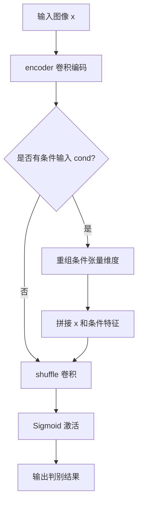
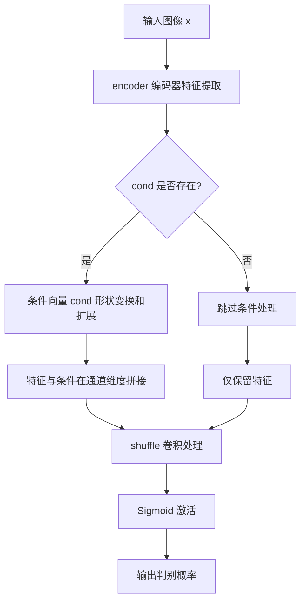

# `diffusers\examples\vqgan\discriminator.py` 详细设计文档

这是一个从Paella项目移植的判别器(Discriminator)模型，用于GAN（生成对抗网络）中区分真实图像和生成图像。该模型采用谱归一化(Spectral Normalization)增强训练稳定性，并支持条件输入(cond_channels)实现条件生成。

## 整体流程



## 类结构

```
Discriminator (判别器模型)
├── encoder (卷积编码器 nn.Sequential)
├── shuffle (卷积层 nn.Conv2d)
└── logits (激活函数 nn.Sigmoid)
```

## 全局变量及字段


### `Discriminator.encoder`
    
卷积编码器，包含多个谱归一化卷积层、实例归一化层和LeakyReLU激活

类型：`nn.Sequential`
    


### `Discriminator.shuffle`
    
用于特征重组的1x1卷积层

类型：`nn.Conv2d`
    


### `Discriminator.logits`
    
Sigmoid激活函数，用于输出概率

类型：`nn.Sigmoid`
    
    

## 全局函数及方法


### `Discriminator.__init__`

初始化判别器网络结构，构建一个基于卷积神经网络的判别器模型，用于对输入图像进行真伪判别。该方法支持条件输入，并使用谱归一化稳定训练过程。

参数：

- `in_channels`：`int`，输入图像的通道数，默认为 3（RGB 图像）
- `cond_channels`：`int`，条件输入的通道数，默认为 0（无条件输入）
- `hidden_channels`：`int`，隐藏层的初始通道数，默认为 512
- `depth`：`int`，判别器的深度（卷积层数量），默认为 6

返回值：`None`，该方法为构造函数，不返回任何值

#### 流程图

```mermaid
flowchart TD
    A[开始 __init__] --> B[计算 d = max(depth - 3, 3)]
    B --> C[创建第一个卷积层: in_channels → hidden_channels // 2^d]
    C --> D[添加 LeakyReLU 激活层]
    D --> E{循环 i from 0 to depth-2}
    E -->|是| F[计算 c_in 和 c_out 通道数]
    F --> G[添加谱归一化卷积层]
    G --> H[添加 InstanceNorm2d 归一化层]
    H --> I[添加 LeakyReLU 激活层]
    I --> E
    E -->|否| J[将所有层组合为 nn.Sequential 作为 self.encoder]
    J --> K[创建 self.shuffle 卷积层]
    K --> L[创建 self.logits Sigmoid 激活层]
    L --> M[结束 __init__]
```

#### 带注释源码

```python
def __init__(self, in_channels=3, cond_channels=0, hidden_channels=512, depth=6):
    """
    初始化判别器网络结构
    
    参数:
        in_channels: 输入图像的通道数，默认为3（RGB图像）
        cond_channels: 条件输入的通道数，默认为0（无条件输入）
        hidden_channels: 隐藏层初始通道数，默认为512
        depth: 判别器深度，默认为6
    """
    # 调用父类初始化方法
    super().__init__()
    
    # 计算深度调整值，确保深度至少为3
    # d 用于计算各层的通道缩放因子
    d = max(depth - 3, 3)
    
    # 初始化层列表
    layers = [
        # 第一个卷积层：下采样，通道数大幅减少
        # 使用谱归一化(spectral_norm)稳定GAN训练
        nn.utils.spectral_norm(
            nn.Conv2d(
                in_channels,  # 输入通道数
                hidden_channels // (2**d),  # 输出通道数，按2^d因子缩减
                kernel_size=3,  # 3x3卷积核
                stride=2,  # 步长2，实现下采样
                padding=1  # 保持空间尺寸
            )
        ),
        # LeakyReLU激活函数，负斜率0.2
        nn.LeakyReLU(0.2),
    ]
    
    # 循环添加剩余的卷积层
    for i in range(depth - 1):
        # 计算当前层的输入输出通道数
        # 通道数随深度增加而逐渐减少
        c_in = hidden_channels // (2 ** max((d - i), 0))
        c_out = hidden_channels // (2 ** max((d - 1 - i), 0))
        
        # 添加带谱归一化的卷积层
        layers.append(
            nn.utils.spectral_norm(
                nn.Conv2d(c_in, c_out, kernel_size=3, stride=2, padding=1)
            )
        )
        # 添加实例归一化层
        layers.append(nn.InstanceNorm2d(c_out))
        # 添加LeakyReLU激活层
        layers.append(nn.LeakyReLU(0.2))
    
    # 将所有层组合为顺序模型
    self.encoder = nn.Sequential(*layers)
    
    # 创建最终的特征融合/输出卷积层
    # 如果有条件输入，则融合条件特征；否则直接处理 encoder 输出
    self.shuffle = nn.Conv2d(
        (hidden_channels + cond_channels) if cond_channels > 0 else hidden_channels,
        1,  # 输出单通道特征图
        kernel_size=1  # 1x1卷积，用于通道融合
    )
    
    # Sigmoid激活函数，将输出转换为[0,1]范围的概率值
    self.logits = nn.Sigmoid()
```


### `Discriminator.forward`

该方法实现判别器的前向传播逻辑，将输入图像通过编码器提取特征，若提供条件信息则将其与特征图拼接，最后通过 shuffle 卷积和 Sigmoid 激活输出判别概率值。

参数：

- `self`：`Discriminator`，隐含的类实例参数，表示判别器对象本身
- `x`：`torch.Tensor`，输入图像张量，形状为 (batch_size, in_channels, height, width)
- `cond`：`torch.Tensor`，可选的条件向量，形状为 (batch_size, cond_channels)，用于条件生成，默认为 None

返回值：`torch.Tensor`，判别结果概率值，形状为 (batch_size, 1, h, w)，值域在 [0, 1] 之间

#### 流程图



#### 带注释源码

```python
def forward(self, x, cond=None):
    """
    判别器前向传播
    
    参数:
        x: 输入图像张量，形状 (B, C, H, W)
        cond: 可选条件向量，形状 (B, cond_channels)
    
    返回:
        判别概率张量，形状 (B, 1, H', W')
    """
    # 第一步：通过编码器提取输入图像的特征表示
    # encoder 由多个光谱归一化卷积、实例归一化和 LeakyReLU 组成
    x = self.encoder(x)
    
    # 第二步：条件信息处理（如果提供了条件）
    if cond is not None:
        # 将条件向量从 (B, cond_channels) 变形为 (B, cond_channels, 1, 1)
        cond = cond.view(
            cond.size(0),    # batch size
            cond.size(1),    # cond channels
            1,               # height dimension
            1,               # width dimension
        ).expand(
            -1, -1, 
            x.size(-2),      # match feature map height
            x.size(-1)       # match feature map width
        )
        # 在通道维度(dim=1)拼接特征图与条件图
        x = torch.cat([x, cond], dim=1)
    
    # 第三步：通过 shuffle 卷积整合信息并降维至单通道
    x = self.shuffle(x)
    
    # 第四步：Sigmoid 激活将输出映射到 [0, 1] 区间，表示真/假概率
    x = self.logits(x)
    
    # 返回判别结果
    return x
```

## 关键组件


### Discriminator 类

判别器模型，用于VQGAN的对抗训练，通过谱归一化卷积层提取图像特征并输出是否为真实图像的概率值，支持条件信息输入以增强判别能力。

### Encoder 模块

由多个卷积块组成的序列网络，每个块包含谱归一化卷积、实例归一化和LeakyReLU激活函数，用于逐步提取和压缩输入特征。

### Shuffle 模块

1x1卷积层，将特征通道数映射到1，用于最终的特征整合和输出准备。

### Forward 方法

接收输入张量x和可选条件张量cond，经过编码器提取特征后，若存在条件则将其扩展并拼接至特征通道，最后通过shuffle和sigmoid输出概率值。


## 问题及建议


### 已知问题

-   **Sigmoid使用方式不规范**：`self.logits = nn.Sigmoid()` 作为类成员变量存储，但在forward中直接调用 `self.logits(x)`，这种用法不伦不类。标准的做法是直接使用 `torch.sigmoid(x)` 或者使用 `nn.functional.sigmoid(x)`，或者在损失函数中使用 `BCEWithLogitsLoss` 省略sigmoid
-   **cond_channels参数未充分使用**：虽然接收了 `cond_channels` 参数并用于计算 `shuffle` 层的输入通道，但该参数在判别器的前向传播逻辑中没有任何实际的条件特征处理机制，只是简单拼接
-   **隐藏通道计算逻辑不清晰**：`c_in` 和 `c_out` 的计算公式 `hidden_channels // (2 ** max((d - i), 0))` 复杂且难以理解，`max((d - i), 0)` 这个逻辑容易产生混淆，当 `d-i` 为负数时结果为0
-   **hardcoded魔法值**：LeakyReLU的负斜率0.2硬编码在代码中，没有作为可配置参数；`d = max(depth - 3, 3)` 中的3也是魔法数字
-   **输入维度验证缺失**：forward方法没有对输入x和cond的形状进行验证，可能导致运行时错误且难以调试
-   **类型提示不完整**：forward方法的参数 `cond` 缺少类型注解和默认值说明
- **InstanceNorm2d使用不一致**：在判别器中使用InstanceNorm2d不是标准做法（通常使用LayerNorm或不使用归一化），且没有提供可配置选项

### 优化建议

-   **重构Sigmoid调用**：移除 `self.logits` 成员变量，直接在forward中使用 `torch.sigmoid(x)` 或者返回logits由外部损失函数处理
-   **增强配置灵活性**：将LeakyReLU的负斜率、是否使用sigmoid等作为可配置参数，参考 `@register_to_config` 模式
-   **简化通道计算逻辑**：使用更清晰的循环方式或辅助函数计算通道数，添加注释解释通道数递减的逻辑
-   **添加输入验证**：在forward方法开头添加形状检查，确保输入维度正确
-   **完善类型注解**：为forward方法添加完整的类型注解，包括 `Optional[torch.Tensor]` 等
-   **考虑条件编码机制**：如果要真正支持条件输入，应该实现更复杂的条件处理机制，如AdaIN或条件嵌入
-   **添加文档注释**：为类和方法添加docstring，说明预期输入格式和用途


## 其它


### 设计目标与约束

该Discriminator模型用于GAN对抗训练中的判别器，旨在区分真实图像与生成图像。设计目标包括：支持条件生成（通过cond_channels注入条件信息）、使用谱归一化稳定训练、采用逐步下采样结构提取多尺度特征。约束条件包括：输入通道数默认为3（RGB图像）、隐藏通道数建议为512、深度建议为6层。

### 错误处理与异常设计

模型初始化阶段检查in_channels和cond_channels参数是否为非负整数，若为负数或类型不匹配应抛出ValueError。forward方法中，当cond参数不为None时，验证其维度是否为4D张量且与x的batch_size和通道数匹配，若不匹配则抛出RuntimeError。若输入x的通道数与初始化时的in_channels不一致，应抛出形状不匹配异常。

### 数据流与状态机

数据流如下：输入图像x首先经过encoder模块进行特征提取和下采样，得到高维特征表示。若提供条件输入cond，则将cond通过view和expand操作reshape为与x空间维度匹配的张量，然后沿通道维度拼接。最后通过shuffle卷积层融合信息并输出单通道特征图，经Sigmoid激活后返回。模型无内部状态机，保持 stateless 设计。

### 外部依赖与接口契约

依赖项包括：torch、torch.nn、diffusers.configuration_utils中的ConfigMixin和register_to_config、diffusers.models.modeling_utils中的ModelMixin。接口契约：__init__方法接收in_channels（默认3）、cond_channels（默认0）、hidden_channels（默认512）、depth（默认6）四个参数；forward方法接收x（必填，4D张量）和cond（可选，4D张量）两个参数，返回形状为(batch_size, 1, H/2^depth, W/2^depth)的概率张量。

### 配置管理

使用diffusers的ConfigMixin机制进行配置管理，所有初始化参数通过@register_to_config装饰器自动注册到配置文件。配置字典包含in_channels、cond_channels、hidden_channels、depth四个键。模型可通过from_config方法从配置字典实例化，支持序列化与反序列化。

### 性能考虑

encoder中的卷积层采用stride=2实现下采样，减少计算量。卷积核大小为3x3，平衡了感受野和计算效率。使用nn.InstanceNorm2d而非BatchNorm，在小batch训练时更稳定。谱归一化计算有一定开销，但能有效防止判别器过拟合。若需进一步优化，可考虑使用torch.compile或混合精度训练。

### 安全性考虑

输入张量需在GPU/CPU上连续内存存储，非连续张量可能导致性能问题或错误。模型本身不包含恶意代码，无后门风险。谱归一化层权重需定期更新以保持训练稳定性。条件输入cond需验证来源，防止注入对抗性条件信息。

### 测试策略

单元测试应覆盖：不同参数组合的模型初始化、输入维度匹配测试、条件输入与无条件输入的前向传播、模型梯度计算、配置序列化与反序列化、与其他框架实现的输出对比测试。集成测试应验证与GAN训练流程的兼容性。

### 部署注意事项

模型文件需包含完整配置信息。部署时需确保diffusers库版本兼容（建议0.21.0以上）。推理时建议将dropout层设为eval模式。若在边缘设备部署，需考虑谱归一化层的特殊处理。模型输出为概率值，阈值选择需根据具体应用场景调整。

    