# `diffusers\examples\vqgan\test_vqgan.py` 详细设计文档

这是一个用于测试 VQGAN 模型训练脚本的测试套件，验证模型的基本训练功能、检查点保存与恢复、EMA 支持以及检查点总数限制等功能。

## 整体流程

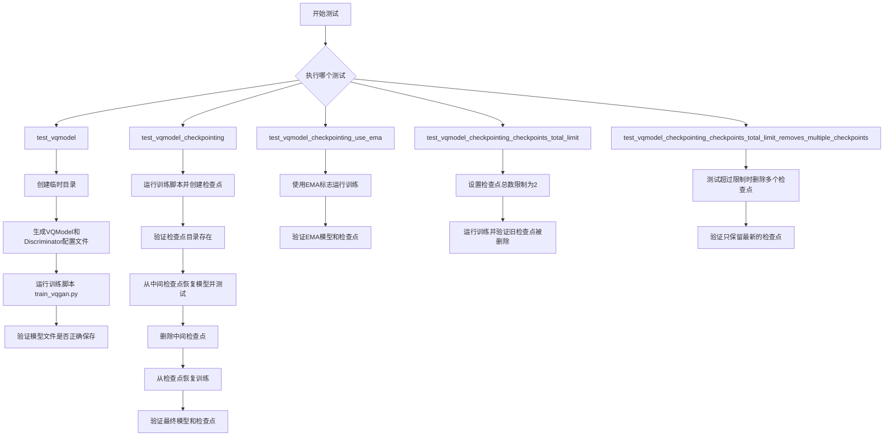

## 类结构

```
ExamplesTestsAccelerate (基类)
└── TextToImage (测试类)
```

## 全局变量及字段


### `logger`
    
全局日志记录器，用于输出DEBUG级别的日志信息

类型：`logging.Logger`
    


### `stream_handler`
    
日志流处理器，用于将日志输出到标准输出stdout

类型：`logging.StreamHandler`
    


### `repo_root`
    
仓库根目录的绝对路径，用于将父目录添加到Python路径以便导入模块

类型：`str`
    


### `TextToImage.vqmodel_config_path`
    
VQModel配置文件路径，指向临时目录中的JSON配置文件

类型：`str`
    


### `TextToImage.discriminator_config_path`
    
Discriminator配置文件路径，指向临时目录中的JSON配置文件

类型：`str`
    


### `TextToImage.test_vqmodel_config`
    
VQModel的测试配置字典，包含模型架构和训练参数

类型：`dict`
    


### `TextToImage.test_discriminator_config`
    
Discriminator的测试配置字典，包含判别器网络结构参数

类型：`dict`
    


### `TextToImage.initial_run_args`
    
首次运行训练脚本的命令行参数列表

类型：`list[str]`
    


### `TextToImage.resume_run_args`
    
从检查点恢复训练时的命令行参数列表

类型：`list[str]`
    


### `TextToImage.test_args`
    
test_vqmodel测试方法的命令行参数列表

类型：`list[str]`
    
    

## 全局函数及方法


### `logging.basicConfig`

该函数是 Python 标准库 `logging` 模块的基础配置函数，用于快速配置日志系统。本代码中调用 `logging.basicConfig(level=logging.DEBUG)` 设置全局日志级别为 DEBUG，使得所有级别（DEBUG、INFO、WARNING、ERROR、CRITICAL）的日志消息都能被输出，用于调试训练脚本的执行过程。

参数：

- `level`：`int` 或 `logging.Level`，日志级别。本代码中传入 `logging.DEBUG`（值为 10），表示启用 DEBUG 及以上级别的日志输出。

返回值：`None`，该函数无返回值，仅执行日志系统的配置操作。

#### 流程图

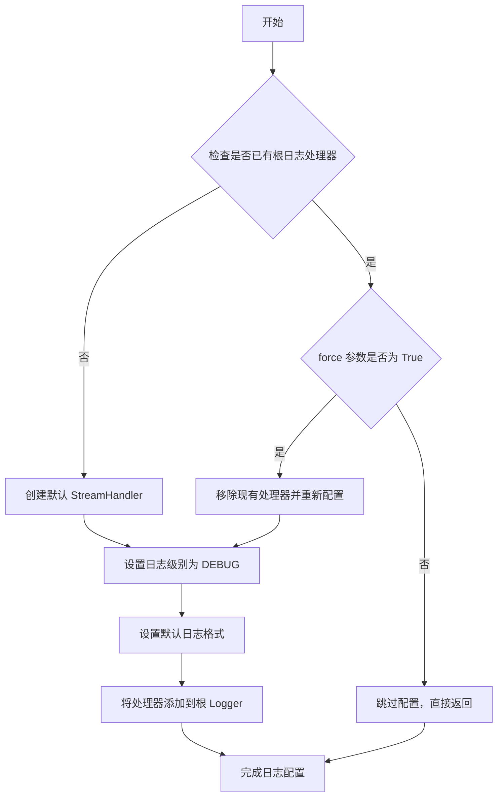

#### 带注释源码

```python
# 代码中的实际调用方式
logging.basicConfig(level=logging.DEBUG)

# 相当于执行以下配置：
# 1. 获取根日志记录器 (Root Logger)
# 2. 设置日志级别为 DEBUG
# 3. 创建默认的 StreamHandler (输出到 sys.stderr)
# 4. 设置默认日志格式: %(levelname)s:%(name)s:%(message)s
# 5. 将处理器添加到根日志记录器
#
# 注意：如果之前已经配置过日志系统，此调用不会生效
# 如需强制重新配置，可使用: logging.basicConfig(level=logging.DEBUG, force=True)
```


### `logging.getLogger`

获取或创建一个Logger对象，用于记录应用程序的日志事件。

参数：

- `name`：`str`（可选），Logger的名称。如果为空或省略，返回根Logger。

返回值：`logging.Logger`，返回对应的Logger实例。

#### 流程图

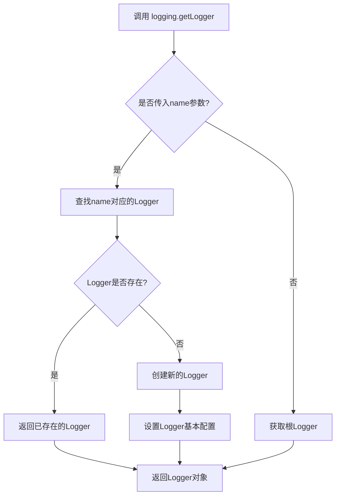

#### 带注释源码

```python
# 配置日志系统：设置根日志级别为DEBUG
logging.basicConfig(level=logging.DEBUG)

# 获取根Logger实例（不传入name参数）
logger = logging.getLogger()

# 创建流处理器，将日志输出到标准输出（stdout）
stream_handler = logging.StreamHandler(sys.stdout)

# 为Logger添加流处理器
logger.addHandler(stream_handler)
```

**说明**：在代码中，`logging.getLogger()` 被调用时没有传入任何参数，这意味着它返回的是根Logger（Root Logger）。根Logger是所有Logger的祖先，通常用于记录应用程序的顶层日志事件。代码随后为该Logger配置了一个流处理器，使其能够将日志输出到标准输出。


# 函数分析：run_command

基于提供的代码分析，`run_command` 是从 `test_examples_utils` 模块导入的全局函数。由于源代码中未直接包含该函数的实现，以下分析基于函数的使用方式推断。

### run_command

该函数用于执行外部命令行程序，接受命令参数列表并运行训练脚本。在 `TextToImage` 测试类中用于执行 VQGAN 训练脚本的各种测试场景。

参数：

- `cmd`：列表（List[str]），命令及参数列表，由 `self._launch_args`（加速器启动参数）和测试参数（如 `test_args`、`initial_run_args`、`resume_run_args`）拼接而成

返回值：`无返回值`（None），函数直接执行命令，测试通过检查输出文件验证结果

#### 流程图

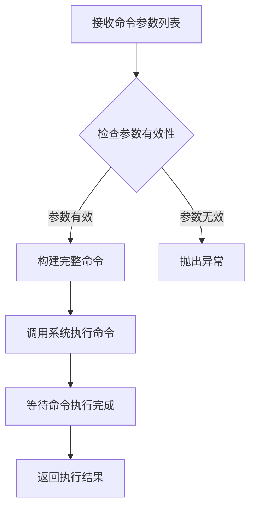

#### 带注释源码

```python
# 注意：此源码为基于使用方式的推断实现
# 原始定义位于 test_examples_utils 模块中

def run_command(cmd):
    """
    执行命令行程序
    
    参数:
        cmd: 命令列表，如 ['accelerate', 'launch', 'script.py', '--arg1', 'value1']
    
    返回:
        无返回值，直接执行命令
    
    使用示例（来自代码）:
        # 基本测试调用
        test_args = "examples/vqgan/train_vqgan.py --dataset_name hf-internal-testing/dummy_image_text_data ...".split()
        run_command(self._launch_args + test_args)
        
        # 带检查点恢复的训练
        resume_run_args = "examples/vqgan/train_vqgan.py --resume_from_checkpoint=checkpoint-4 ...".split()
        run_command(self._launch_args + resume_run_args)
        
        # 带 EMA 的训练
        initial_run_args = "examples/vqgan/train_vqgan.py --use_ema ...".split()
        run_command(self._launch_args + initial_run_args)
    """
    # 底层实现可能使用 subprocess 模块执行命令
    # subprocess.run(cmd, check=True)
    pass
```

---

**注意**：由于 `run_command` 函数定义在 `test_examples_utils` 模块中（未在当前代码文件中提供），上述分析基于以下代码使用模式推断：

1. 函数接受列表类型的命令行参数
2. 参数由 `self._launch_args`（Accelerate 启动参数）和具体测试参数组成
3. 函数内部使用 `subprocess` 或类似机制执行命令
4. 测试通过检查生成的文件（如模型检查点）来验证命令执行成功


### `require_timm`

这是一个装饰器函数，用于检查 `timm`（PyTorch Image Models）库是否已安装。如果库未安装，被装饰的测试类或测试方法将被跳过执行。

参数：

-  `fn`：可选的函数参数，被装饰的目标函数或类

返回值：`function`，返回装饰后的函数，如果 `timm` 未安装则返回原函数（通常会被修改为跳过执行）

#### 流程图

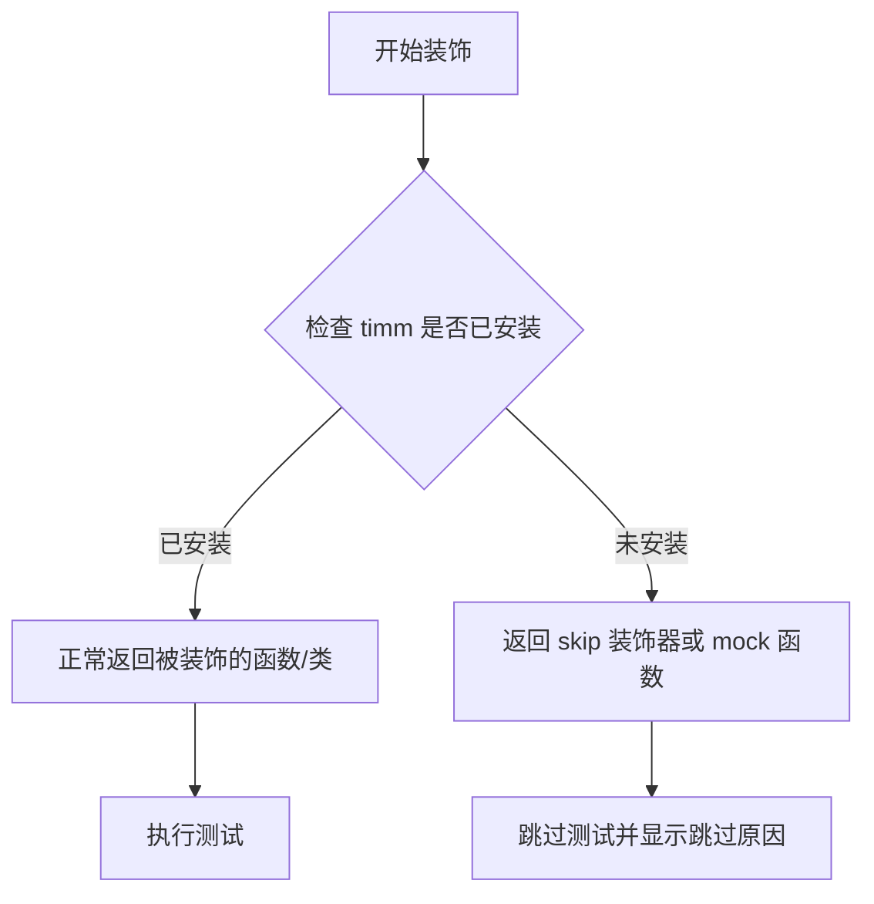

#### 带注释源码

```python
# 注意：以下是基于 HuggingFace diffusers 项目的常见实现模式推断的源码
# 实际源码位于 tests/testing_utils.py 中

def require_timm(fn):
    """
    装饰器：检查 timm 库是否已安装，如果没有安装则跳过测试。
    
    这是 HuggingFace 常用的条件跳过装饰器模式，用于处理可选依赖。
    """
    # 检查 timm 是否可以导入
    if importlib.util.find_spec("timm") is None:
        # 如果 timm 未安装，使用 pytest.mark.skip 装饰器跳过测试
        return pytest.mark.skip(reason="test requires timm library")(fn)
    
    # 如果 timm 已安装，返回原始函数不做修改
    return fn
```


### `TextToImage.test_vqmodel_config`

该属性方法返回 VQModel（向量量化生成对抗网络）的配置字典，包含模型类名、版本信息、激活函数、通道数、层数归一化类型等关键参数，用于实例化和测试 VQGAN 模型。

参数：
- 无参数（该方法为 property 装饰器修饰的属性访问器）

返回值：`dict`，返回包含 VQModel 模型配置信息的字典，包括模型类名、版本、激活函数、通道配置、归一化参数等。

#### 流程图

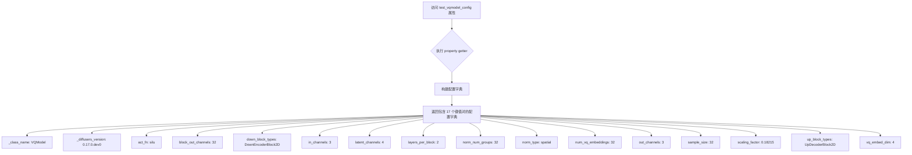

#### 带注释源码

```python
@property
def test_vqmodel_config(self):
    """
    返回 VQModel 的测试配置字典
    
    该属性提供一个完整的 VQModel 配置，用于在测试中实例化模型。
    配置包含了模型的所有关键参数，如输入输出通道数、量化嵌入维度、
    激活函数、归一化类型等。
    
    Returns:
        dict: 包含 VQModel 模型配置信息的字典，可用于模型初始化
    """
    return {
        "_class_name": "VQModel",              # 模型类名，标识使用 VQModel
        "_diffusers_version": "0.17.0.dev0",  # diffusers 库版本
        "act_fn": "silu",                      # 激活函数：Swish 激活
        "block_out_channels": [
            32,                                # 编码器块输出通道数
        ],
        "down_block_types": [
            "DownEncoderBlock2D",              # 下采样编码器块类型
        ],
        "in_channels": 3,                      # 输入图像通道数（RGB）
        "latent_channels": 4,                  # 潜在空间通道数
        "layers_per_block": 2,                  # 每个块中的层数
        "norm_num_groups": 32,                 # 归一化分组数
        "norm_type": "spatial",                # 归一化类型
        "num_vq_embeddings": 32,               # 量化码本大小（嵌入数量）
        "out_channels": 3,                     # 输出图像通道数
        "sample_size": 32,                     # 样本尺寸（宽高）
        "scaling_factor": 0.18215,             # 潜在空间缩放因子
        "up_block_types": [
            "UpDecoderBlock2D",                # 上采样解码器块类型
        ],
        "vq_embed_dim": 4,                      # VQ 嵌入维度
    }
```


### `TextToImage.test_discriminator_config`

该属性方法用于返回判别器（Discriminator）的配置字典，包含了判别器模型的类名、版本、输入通道、条件通道、隐藏通道和深度等关键配置信息。

参数：
- 无显式参数（Python 属性方法，隐式接收 `self` 作为实例参数）

返回值：`dict`，返回包含判别器配置的字典对象

#### 流程图

```mermaid
flowchart TD
    A[开始: 访问 test_discriminator_config 属性] --> B{执行属性方法}
    B --> C[创建配置字典]
    C --> D[返回字典: {
    _class_name: Discriminator,
    _diffusers_version: 0.27.0.dev0,
    in_channels: 3,
    cond_channels: 0,
    hidden_channels: 8,
    depth: 4
}]
    D --> E[结束]
```

#### 带注释源码

```python
@property
def test_discriminator_config(self):
    """
    判别器配置属性方法
    
    返回一个包含判别器模型配置的字典，用于测试和初始化
    VQGAN训练中的判别器组件。
    
    配置项说明：
    - _class_name: 判别器的类名
    - _diffusers_version: 使用的diffusers库版本
    - in_channels: 输入图像通道数
    - cond_channels: 条件通道数（0表示无条件）
    - hidden_channels: 隐藏层通道数
    - depth: 判别器网络深度
    
    返回:
        dict: 判别器配置字典
    """
    return {
        "_class_name": "Discriminator",       # 判别器类名
        "_diffusers_version": "0.27.0.dev0",   # diffusers版本
        "in_channels": 3,                      # 输入通道数（RGB图像）
        "cond_channels": 0,                     # 条件通道（无条件）
        "hidden_channels": 8,                   # 隐藏层宽度
        "depth": 4,                             # 网络深度（层数）
    }
```


### `TextToImage.get_vq_and_discriminator_configs`

该方法用于在临时目录中生成 VQModel 和 Discriminator 的配置文件，并将配置写入 JSON 文件以便后续训练脚本使用。

参数：

- `tmpdir`：`str`，临时目录路径，用于存放生成的配置文件

返回值：`tuple[str, str]`，返回 VQModel 配置文件路径和 Discriminator 配置文件路径的元组

#### 流程图

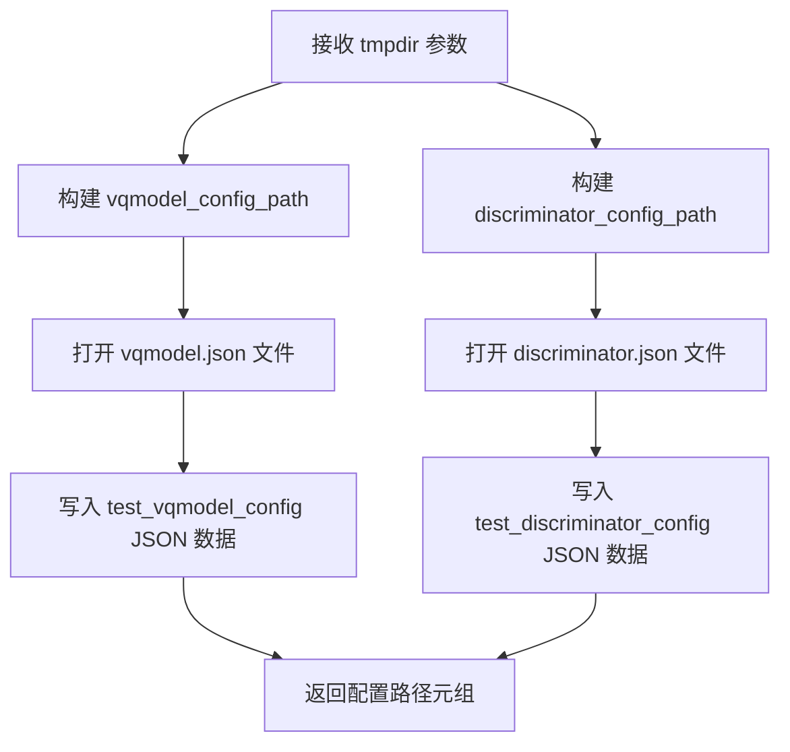

#### 带注释源码

```python
def get_vq_and_discriminator_configs(self, tmpdir):
    """
    生成 VQModel 和 Discriminator 的配置文件并写入临时目录。
    
    参数:
        tmpdir: 临时目录路径，用于存放生成的配置文件
        
    返回:
        包含两个配置文件路径的元组 (vqmodel_config_path, discriminator_config_path)
    """
    # 构建 VQModel 配置文件路径：tmpdir/vqmodel.json
    vqmodel_config_path = os.path.join(tmpdir, "vqmodel.json")
    # 构建 Discriminator 配置文件路径：tmpdir/discriminator.json
    discriminator_config_path = os.path.join(tmpdir, "discriminator.json")
    
    # 打开 vqmodel.json 文件并写入 VQModel 配置
    with open(vqmodel_config_path, "w") as fp:
        json.dump(self.test_vqmodel_config, fp)
    
    # 打开 discriminator.json 文件并写入 Discriminator 配置
    with open(discriminator_config_path, "w") as fp:
        json.dump(self.test_discriminator_config, fp)
    
    # 返回两个配置文件的路径，供训练脚本使用
    return vqmodel_config_path, discriminator_config_path
```


### `TextToImage.test_vqmodel`

该方法是一个集成测试，用于验证 VQGAN 模型的训练流程是否正常工作。它通过创建临时目录、生成模型配置文件、运行训练脚本，并检查输出模型文件是否正确生成来确保训练 pipeline 的完整性。

参数：

- `self`：隐式参数，`TextToImage` 类的实例本身

返回值：`None`，无返回值（测试方法）

#### 流程图

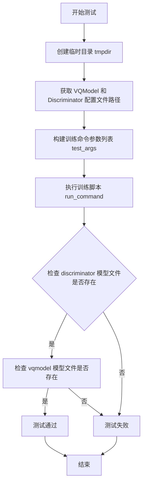

#### 带注释源码

```python
def test_vqmodel(self):
    """
    测试 VQGAN 模型的训练流程是否正常工作。
    该测试通过运行训练脚本并验证输出模型文件来确保 pipeline 的完整性。
    """
    # 使用临时目录存放测试过程中的配置文件和输出模型
    with tempfile.TemporaryDirectory() as tmpdir:
        # 获取 VQModel 和 Discriminator 的配置文件路径
        # 这些文件包含了模型的结构和超参数配置
        vqmodel_config_path, discriminator_config_path = self.get_vq_and_discriminator_configs(tmpdir)
        
        # 构建训练命令参数
        # 包含数据集、分辨率、训练步数、学习率等关键参数
        test_args = f"""
            examples/vqgan/train_vqgan.py
            --dataset_name hf-internal-testing/dummy_image_text_data
            --resolution 32
            --image_column image
            --train_batch_size 1
            --gradient_accumulation_steps 1
            --max_train_steps 2
            --learning_rate 5.0e-04
            --scale_lr
            --lr_scheduler constant
            --lr_warmup_steps 0
            --model_config_name_or_path {vqmodel_config_path}
            --discriminator_config_name_or_path {discriminator_config_path}
            --output_dir {tmpdir}
            """.split()

        # 执行训练命令，使用加速器配置
        # _launch_args 来自父类 ExamplesTestsAccelerate
        run_command(self._launch_args + test_args)
        
        # save_pretrained smoke test
        # 验证 discriminator 模型文件是否正确生成
        self.assertTrue(
            os.path.isfile(os.path.join(tmpdir, "discriminator", "diffusion_pytorch_model.safetensors"))
        )
        # 验证 vqmodel 模型文件是否正确生成
        self.assertTrue(os.path.isfile(os.path.join(tmpdir, "vqmodel", "diffusion_pytorch_model.safetensors")))
```


### `TextToImage.test_vqmodel_checkpointing`

该方法是一个集成测试用例，用于验证 VQGAN 模型的训练检查点（checkpoint）功能是否正常工作，包括检查点的创建、恢复训练以及检查点的管理策略。

参数：

- `self`：`TextToImage`（类实例），代表测试类实例本身

返回值：`None`，该方法为测试方法，不返回任何值

#### 流程图

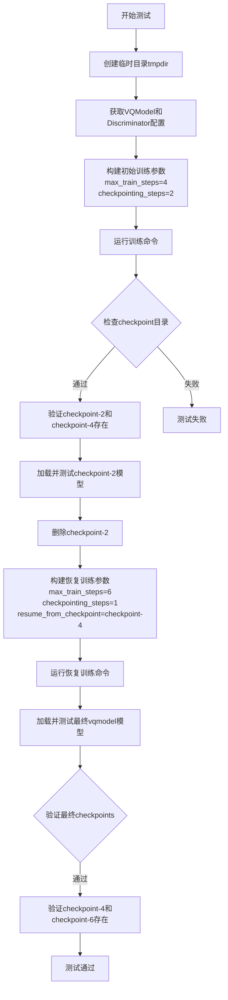

#### 带注释源码

```python
def test_vqmodel_checkpointing(self):
    """
    测试 VQGAN 模型的检查点功能
    验证：1. 检查点创建 2. 从检查点恢复训练 3. 检查点管理
    """
    # 创建一个临时目录用于存放训练输出
    with tempfile.TemporaryDirectory() as tmpdir:
        # 获取 VQModel 和 Discriminator 的配置文件路径
        vqmodel_config_path, discriminator_config_path = self.get_vq_and_discriminator_configs(tmpdir)
        
        # =====================================================
        # 第一阶段：初始训练（4步，创建检查点）
        # =====================================================
        # 构建初始训练参数
        # max_train_steps=4: 最多训练4步
        # checkpointing_steps=2: 每2步保存一个检查点
        initial_run_args = f"""
            examples/vqgan/train_vqgan.py
            --dataset_name hf-internal-testing/dummy_image_text_data
            --resolution 32
            --image_column image
            --train_batch_size 1
            --gradient_accumulation_steps 1
            --max_train_steps 4
            --learning_rate 5.0e-04
            --scale_lr
            --lr_scheduler constant
            --lr_warmup_steps 0
            --model_config_name_or_path {vqmodel_config_path}
            --discriminator_config_name_or_path {discriminator_config_path}
            --checkpointing_steps=2
            --output_dir {tmpdir}
            --seed=0
            """.split()

        # 执行训练命令
        run_command(self._launch_args + initial_run_args)

        # =====================================================
        # 验证：检查检查点目录是否正确创建
        # =====================================================
        # 预期创建 checkpoint-2 和 checkpoint-4
        self.assertEqual(
            {x for x in os.listdir(tmpdir) if "checkpoint" in x},
            {"checkpoint-2", "checkpoint-4"},
        )

        # =====================================================
        # 测试：验证可以加载并使用中间检查点
        # =====================================================
        # 从 checkpoint-2 加载 VQModel
        model = VQModel.from_pretrained(tmpdir, subfolder="checkpoint-2/vqmodel")
        # 生成随机测试图像并验证模型可以正常推理
        image = torch.randn(1, model.config.in_channels, model.config.sample_size, model.config.sample_size)
        _ = model(image)

        # =====================================================
        # 准备恢复训练：删除早期检查点
        # =====================================================
        # 删除 checkpoint-2，只保留 checkpoint-4
        shutil.rmtree(os.path.join(tmpdir, "checkpoint-2"))
        # 验证现在只有 checkpoint-4 存在
        self.assertEqual(
            {x for x in os.listdir(tmpdir) if "checkpoint" in x},
            {"checkpoint-4"},
        )

        # =====================================================
        # 第二阶段：从检查点恢复训练
        # =====================================================
        # 构建恢复训练参数
        # max_train_steps=6: 再训练2步（从第4步到第6步）
        # checkpointing_steps=1: 每1步保存检查点（但实际每2步才保存，详见注释）
        # resume_from_checkpoint: 从 checkpoint-4 恢复
        resume_run_args = f"""
            examples/vqgan/train_vqgan.py
            --dataset_name hf-internal-testing/dummy_image_text_data
            --resolution 32
            --image_column image
            --train_batch_size 1
            --gradient_accumulation_steps 1
            --max_train_steps 6
            --learning_rate 5.0e-04
            --scale_lr
            --lr_scheduler constant
            --lr_warmup_steps 0
            --model_config_name_or_path {vqmodel_config_path}
            --discriminator_config_name_or_path {discriminator_config_path}
            --checkpointing_steps=1
            --resume_from_checkpoint={os.path.join(tmpdir, "checkpoint-4")}
            --output_dir {tmpdir}
            --seed=0
            """.split()

        # 执行恢复训练命令
        run_command(self._launch_args + resume_run_args)

        # =====================================================
        # 验证：检查最终模型可以正常加载和推理
        # =====================================================
        # 加载最终训练好的 vqmodel
        model = VQModel.from_pretrained(tmpdir, subfolder="vqmodel")
        # 生成随机测试图像并验证模型可以正常推理
        image = torch.randn(1, model.config.in_channels, model.config.sample_size, model.config.sample_size)
        _ = model(image)

        # =====================================================
        # 验证：检查最终的检查点列表
        # =====================================================
        # 注意：代码注释解释了这个行为
        # 由于 discriminator 训练发生在 generator 之后，
        # 而保存操作在 discriminator 训练之后执行，
        # 所以 checkpointing_steps=1 等同于 checkpointing_steps=2
        # 因此不会创建 checkpoint-5，只会有 checkpoint-4 和 checkpoint-6
        self.assertEqual(
            {x for x in os.listdir(tmpdir) if "checkpoint" in x},
            {"checkpoint-4", "checkpoint-6"},
        )
```


### `TextToImage.test_vqmodel_checkpointing_use_ema`

该测试方法用于验证在使用 EMA（指数移动平均）的 VQGAN 模型训练过程中，检查点保存和恢复功能是否正常工作，包括初始训练创建检查点、中间检查点恢复以及基于检查点的增量训练。

参数：

- `self`：隐式参数，`TextToImage` 类的实例本身，无需显式传递

返回值：无返回值（`None`），该方法为单元测试，通过断言验证功能正确性

#### 流程图

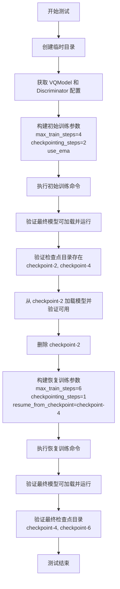

#### 带注释源码

```python
def test_vqmodel_checkpointing_use_ema(self):
    """
    测试 VQGAN 模型在使用 EMA 时的检查点保存与恢复功能
    
    测试流程：
    1. 初始训练：max_train_steps=4, checkpointing_steps=2，应在步骤 2、4 创建检查点
    2. 验证 checkpoint-2 和 checkpoint-4 存在
    3. 从 checkpoint-2 恢复模型并验证可用
    4. 删除 checkpoint-2
    5. 从 checkpoint-4 恢复训练至 max_train_steps=6
    6. 验证最终检查点为 checkpoint-4, checkpoint-6
    """
    # 创建临时目录用于存放训练输出和检查点
    with tempfile.TemporaryDirectory() as tmpdir:
        # 获取 VQModel 和 Discriminator 的配置文件路径
        vqmodel_config_path, discriminator_config_path = self.get_vq_and_discriminator_configs(tmpdir)
        
        # ========================================
        # 第一阶段：初始训练（创建初始检查点）
        # ========================================
        # 构建训练参数：
        #   - max_train_steps=4: 最多训练 4 步
        #   - checkpointing_steps=2: 每 2 步保存一次检查点
        #   - use_ema: 启用 EMA（指数移动平均）
        #   - seed=0: 固定随机种子以保证可复现性
        initial_run_args = f"""
            examples/vqgan/train_vqgan.py
            --dataset_name hf-internal-testing/dummy_image_text_data
            --resolution 32
            --image_column image
            --train_batch_size 1
            --gradient_accumulation_steps 1
            --max_train_steps 4
            --learning_rate 5.0e-04
            --scale_lr
            --lr_scheduler constant
            --lr_warmup_steps 0
            --model_config_name_or_path {vqmodel_config_path}
            --discriminator_config_name_or_path {discriminator_config_path}
            --checkpointing_steps=2
            --output_dir {tmpdir}
            --use_ema
            --seed=0
            """.split()

        # 执行初始训练命令
        run_command(self._launch_args + initial_run_args)

        # 加载最终训练完成的 VQModel
        model = VQModel.from_pretrained(tmpdir, subfolder="vqmodel")
        # 创建随机测试图像进行前向传播测试
        image = torch.randn(1, model.config.in_channels, model.config.sample_size, model.config.sample_size)
        # 执行前向传播，验证模型可用性
        _ = model(image)

        # 验证检查点目录是否正确创建
        # 预期：checkpoint-2 和 checkpoint-4
        self.assertEqual(
            {x for x in os.listdir(tmpdir) if "checkpoint" in x},
            {"checkpoint-2", "checkpoint-4"},
        )

        # 从中间检查点 checkpoint-2 加载模型并验证可用
        model = VQModel.from_pretrained(tmpdir, subfolder="checkpoint-2/vqmodel")
        image = torch.randn(1, model.config.in_channels, model.config.sample_size, model.config.sample_size)
        _ = model(image)

        # ========================================
        # 删除 checkpoint-2，准备恢复训练测试
        # ========================================
        # 删除 checkpoint-2 以验证后续训练不会恢复旧检查点
        shutil.rmtree(os.path.join(tmpdir, "checkpoint-2"))

        # ========================================
        # 第二阶段：从检查点恢复训练
        # ========================================
        # 构建恢复训练参数：
        #   - max_train_steps=6: 继续训练至第 6 步
        #   - checkpointing_steps=1: 每 1 步保存一次检查点
        #   - resume_from_checkpoint=checkpoint-4: 从第 4 步的检查点恢复
        #   - use_ema: 继续使用 EMA
        resume_run_args = f"""
            examples/vqgan/train_vqgan.py
            --dataset_name hf-internal-testing/dummy_image_text_data
            --resolution 32
            --image_column image
            --train_batch_size 1
            --gradient_accumulation_steps 1
            --max_train_steps 6
            --learning_rate 5.0e-04
            --scale_lr
            --lr_scheduler constant
            --lr_warmup_steps 0
            --model_config_name_or_path {vqmodel_config_path}
            --discriminator_config_name_or_path {discriminator_config_path}
            --checkpointing_steps=1
            --resume_from_checkpoint={os.path.join(tmpdir, "checkpoint-4")}
            --output_dir {tmpdir}
            --use_ema
            --seed=0
            """.split()

        # 执行恢复训练命令
        run_command(self._launch_args + resume_run_args)

        # 验证恢复训练后的最终模型可加载并运行
        model = VQModel.from_pretrained(tmpdir, subfolder="vqmodel")
        image = torch.randn(1, model.config.in_channels, model.config.sample_size, model.config.sample_size)
        _ = model(image)

        # 验证最终检查点目录状态
        # 预期：checkpoint-2 不存在（已删除），checkpoint-4 和 checkpoint-6 存在
        # 注意：由于 discriminator 训练逻辑，checkpoint-5 不会产生
        self.assertEqual(
            {x for x in os.listdir(tmpdir) if "checkpoint" in x},
            {"checkpoint-4", "checkpoint-6"},
        )
```


### `TextToImage.test_vqmodel_checkpointing_checkpoints_total_limit`

这是 `TextToImage` 类中的一个测试方法，用于验证 VQ 模型训练时的检查点总数限制功能。当设置 `checkpoints_total_limit=2` 时，训练过程应自动删除旧的检查点，只保留最新的指定数量（2个）检查点。

参数：

- `self`：实例本身，无需显式传递

返回值：`None`，无返回值（测试方法，通过断言验证）

#### 流程图

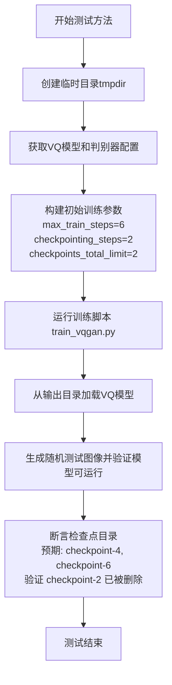

#### 带注释源码

```python
def test_vqmodel_checkpointing_checkpoints_total_limit(self):
    """
    测试检查点总数限制功能。
    当设置 checkpoints_total_limit=2 时，
    训练过程应该只保留最新的2个检查点，
    并自动删除更早的检查点。
    """
    # 使用临时目录作为测试工作空间，测试结束后自动清理
    with tempfile.TemporaryDirectory() as tmpdir:
        # 获取 VQ 模型和判别器的配置文件路径
        vqmodel_config_path, discriminator_config_path = self.get_vq_and_discriminator_configs(tmpdir)
        
        # 构建初始训练命令参数
        # max_train_steps=6: 训练6步
        # checkpointing_steps=2: 每2步保存一次检查点
        # checkpoints_total_limit=2: 最多保留2个检查点
        # 预期行为：step 2, 4, 6 时创建检查点，但由于限制，step 2 的检查点会被删除
        initial_run_args = f"""
            examples/vqgan/train_vqgan.py
            --dataset_name hf-internal-testing/dummy_image_text_data
            --resolution 32
            --image_column image
            --train_batch_size 1
            --gradient_accumulation_steps 1
            --max_train_steps 6
            --learning_rate 5.0e-04
            --scale_lr
            --lr_scheduler constant
            --lr_warmup_steps 0
            --model_config_name_or_path {vqmodel_config_path}
            --discriminator_config_name_or_path {discriminator_config_path}
            --output_dir {tmpdir}
            --checkpointing_steps=2
            --checkpoints_total_limit=2
            --seed=0
            """.split()

        # 执行训练命令
        run_command(self._launch_args + initial_run_args)

        # 从输出目录加载训练好的 VQ 模型进行验证
        model = VQModel.from_pretrained(tmpdir, subfolder="vqmodel")
        
        # 生成随机测试图像，验证模型可以正常推理
        # 图像形状: [batch, channels, height, width]
        image = torch.randn(1, model.config.in_channels, model.config.sample_size, model.config.sample_size)
        _ = model(image)  # 执行前向传播验证

        # 验证检查点目录存在性
        # checkpoint-2 应该在创建 checkpoint-4 后被删除（因为超过总数限制）
        # 最终应该只保留 checkpoint-4 和 checkpoint-6
        self.assertEqual(
            {x for x in os.listdir(tmpdir) if "checkpoint" in x},
            {"checkpoint-4", "checkpoint-6"}
        )
```


### `TextToImage.test_vqmodel_checkpointing_checkpoints_total_limit_removes_multiple_checkpoints`

该方法是一个集成测试，用于验证当设置 `checkpoints_total_limit` 参数时，系统能够正确删除多个旧的检查点以保持检查点数量在限制范围内。测试首先运行训练创建检查点-2和检查点-4，然后恢复训练并设置 `checkpoints_total_limit=2`，继续训练到步骤8，验证最终只保留了checkpoint-6和checkpoint-8，而旧的checkpoint-2和checkpoint-4被正确删除。

参数：

- `self`：TextToImage，测试类实例本身

返回值：`None`，该方法为测试方法，通过断言验证行为，不返回任何值

#### 流程图

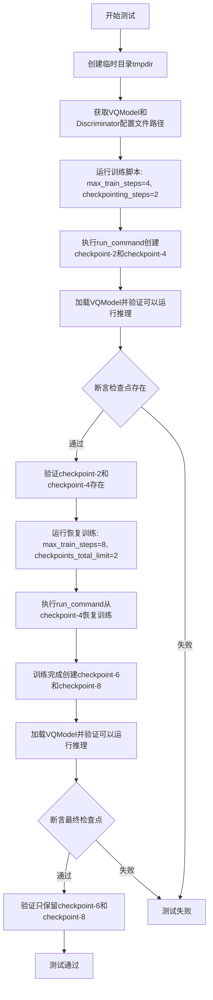

#### 带注释源码

```python
def test_vqmodel_checkpointing_checkpoints_total_limit_removes_multiple_checkpoints(self):
    """
    测试当checkpoints_total_limit设置时，系统能否正确删除多个旧检查点
    
    测试场景：
    1. 初始训练：max_train_steps=4, checkpointing_steps=2 创建checkpoint-2和checkpoint-4
    2. 恢复训练：max_train_steps=8, checkpoints_total_limit=2 从checkpoint-4恢复
    3. 预期结果：只保留checkpoint-6和checkpoint-8，删除checkpoint-2和checkpoint-4
    """
    # 创建临时目录用于存放训练输出
    with tempfile.TemporaryDirectory() as tmpdir:
        # 获取VQModel和Discriminator的配置文件路径
        vqmodel_config_path, discriminator_config_path = self.get_vq_and_discriminator_configs(tmpdir)
        
        # ========================================
        # 第一阶段：创建初始检查点
        # ========================================
        # 运行训练脚本参数：
        # - max_train_steps=4: 训练4步
        # - checkpointing_steps=2: 每2步保存一次检查点
        # 预期创建checkpoint-2和checkpoint-4
        initial_run_args = f"""
            examples/vqgan/train_vqgan.py
            --dataset_name hf-internal-testing/dummy_image_text_data
            --resolution 32
            --image_column image
            --train_batch_size 1
            --gradient_accumulation_steps 1
            --max_train_steps 4
            --learning_rate 5.0e-04
            --scale_lr
            --lr_scheduler constant
            --lr_warmup_steps 0
            --model_config_name_or_path {vqmodel_config_path}
            --discriminator_config_name_or_path {discriminator_config_path}
            --checkpointing_steps=2
            --output_dir {tmpdir}
            --seed=0
            """.split()

        # 执行训练命令
        run_command(self._launch_args + initial_run_args)

        # 加载训练好的VQModel进行推理测试
        model = VQModel.from_pretrained(tmpdir, subfolder="vqmodel")
        # 创建随机输入图像进行推理验证
        image = torch.randn(1, model.config.in_channels, model.config.sample_size, model.config.sample_size)
        _ = model(image)  # 执行推理验证模型可用性

        # 验证初始检查点是否正确创建
        # 预期checkpoint-2和checkpoint-4存在
        self.assertEqual(
            {x for x in os.listdir(tmpdir) if "checkpoint" in x},
            {"checkpoint-2", "checkpoint-4"},
        )

        # ========================================
        # 第二阶段：恢复训练并设置检查点限制
        # ========================================
        # 运行恢复训练脚本参数：
        # - max_train_steps=8: 继续训练到第8步
        # - checkpointing_steps=2: 每2步保存一次检查点  
        # - checkpoints_total_limit=2: 最多保留2个检查点
        # - resume_from_checkpoint: 从checkpoint-4恢复
        # 预期创建checkpoint-6和checkpoint-8，同时删除旧的checkpoint-2和checkpoint-4
        resume_run_args = f"""
            examples/vqgan/train_vqgan.py
            --dataset_name hf-internal-testing/dummy_image_text_data
            --resolution 32
            --image_column image
            --train_batch_size 1
            --gradient_accumulation_steps 1
            --max_train_steps 8
            --learning_rate 5.0e-04
            --scale_lr
            --lr_scheduler constant
            --lr_warmup_steps 0
            --model_config_name_or_path {vqmodel_config_path}
            --discriminator_config_name_or_path {discriminator_config_path}
            --output_dir {tmpdir}
            --checkpointing_steps=2
            --resume_from_checkpoint={os.path.join(tmpdir, "checkpoint-4")}
            --checkpoints_total_limit=2
            --seed=0
            """.split()

        # 执行恢复训练命令
        run_command(self._launch_args + resume_run_args)

        # 加载最终训练好的VQModel进行推理测试
        model = VQModel.from_pretrained(tmpdir, subfolder="vqmodel")
        # 创建随机输入图像进行推理验证
        image = torch.randn(1, model.config.in_channels, model.config.sample_size, model.config.sample_size)
        _ = model(image)  # 执行推理验证模型可用性

        # 验证最终检查点状态
        # 在checkpoints_total_limit=2的限制下：
        # - checkpoint-2应该被删除（最旧）
        # - checkpoint-4被用作恢复点但超过限制也需删除
        # - 保留checkpoint-6和checkpoint-8（最新的2个）
        self.assertEqual(
            {x for x in os.listdir(tmpdir) if "checkpoint" in x},
            {"checkpoint-6", "checkpoint-8"},
        )
```

## 关键组件


### VQModel 配置

定义了 VQModel 的完整配置参数，包括模型架构（如 DownEncoderBlock2D、UpDecoderBlock2D）、通道数、层数、量化嵌入数等关键参数，用于初始化和训练 VQGAN 模型。

### Discriminator 配置

定义了判别器的网络结构配置，包括输入通道、条件通道、隐藏通道深度等参数，用于 GAN 对抗训练中的判别器部分。

### 检查点管理组件

实现了训练过程中的检查点保存、恢复和限制功能，包括按步数保存检查点、从中间检查点恢复训练、EMA 模型检查点、以及通过 checkpoints_total_limit 参数控制保留的检查点数量上限，自动清理旧的检查点目录。

### EMA（指数移动平均）支持

通过 --use_ema 参数启用 EMA 功能，在训练过程中对模型参数进行指数移动平均处理，提高模型的稳定性和泛化能力，并在检查点中保存 EMA 权重。

### 训练参数配置

支持灵活的的训练超参数配置，包括学习率调度（constant、warmup）、梯度累积、批量大小、学习率缩放（scale_lr）等，并可通过命令行灵活指定数据集、分辨率、输出目录等训练配置。

### 检查点恢复机制

实现了从指定检查点目录恢复训练的功能，支持断点续训，保存完整的模型状态（包括 VQModel 和 Discriminator），并能正确处理训练步数的累计和检查点的衔接。

## 问题及建议


### 已知问题

- **重复的命令行参数构建逻辑**：多个测试方法中重复构建相似的命令行参数（如数据集名称、分辨率、训练参数等），违反了 DRY 原则，增加了维护成本
- **硬编码的测试配置**：VQModel 和 Discriminator 的配置参数直接硬编码在测试类中，如果配置结构变化需要修改多处
- **日志级别配置不当**：使用 `logging.basicConfig(level=logging.DEBUG)` 在测试环境中会产生过多的日志输出，可能影响测试性能和可读性
- **魔法数字和字符串散布**：学习率（5.0e-04）、训练步数（2、4、6、8）、分辨率（32）等数值分散在各个测试方法中，缺乏统一的常量定义
- **测试方法命名过长**：如 `test_vqmodel_checkpointing_checkpoints_total_limit_removes_multiple_checkpoints` 这样的命名过长且难以维护
- **缺少文档字符串**：所有测试方法都没有文档字符串（docstring），难以理解每个测试的目的和预期行为
- **对外部函数的隐式依赖**：测试依赖于从外部导入的 `run_command` 和 `_launch_args`，这些依赖没有明确的接口契约说明
- **模型加载的冗余操作**：每次测试都通过 `torch.randn` 创建随机输入进行模型加载验证，存在一定的资源浪费

### 优化建议

- **提取公共辅助方法**：将重复的命令行参数构建逻辑提取为类方法或辅助函数，接受参数化配置
- **配置外部化**：将测试配置（VQModel、Discriminator）移至独立的 JSON 配置文件或使用配置类统一管理
- **优化日志配置**：将日志级别改为 `logging.INFO` 或在测试类中单独配置日志，避免 DEBUG 级别的冗余输出
- **定义常量类**：创建专门的常量类或枚举来管理训练参数、路径等魔法值，提高可读性和可维护性
- **添加文档字符串**：为每个测试方法添加清晰的文档字符串，说明测试场景、预期结果和验证逻辑
- **合并相似测试**：考虑使用 pytest 的参数化（`@pytest.mark.parametrize`）来合并场景相似的测试方法，减少代码冗余
- **优化模型验证**：对于简单的加载验证，可以考虑使用更轻量的方式或添加缓存机制

## 其它


### 设计目标与约束

本测试套件旨在验证VQGAN模型训练流程的正确性，包括模型配置加载、训练执行、检查点保存与恢复、以及EMA（指数移动平均）功能。约束条件包括：仅支持Python 3.8+、需要torch和diffusers库、依赖timm库进行某些测试、需要accelerate环境来运行分布式训练测试。

### 错误处理与异常设计

测试使用pytest框架的assert语句进行验证，通过`self.assertTrue`和`self.assertEqual`检查预期结果。文件操作使用`tempfile.TemporaryDirectory()`确保临时资源自动清理。命令执行使用`run_command`函数处理，可能抛出subprocess相关异常。所有测试方法都包含在`try-except`块中（通过pytest框架），确保单点故障不会影响其他测试。

### 数据流与状态机

测试数据流：配置文件(JSON) -> 训练脚本参数 -> 模型初始化 -> 训练执行 -> 检查点保存 -> 模型加载验证。状态转换：初始状态(training) -> 检查点状态(checkpoint-N) -> 恢复状态(resume training) -> 最终状态(trained model)。每个测试方法独立运行，使用独立的临时目录确保状态隔离。

### 外部依赖与接口契约

主要依赖包括：torch、diffusers的VQModel和Discriminator、pytest、accelerate、timm库。接口契约方面：`run_command`函数接收列表参数执行shell命令；`ExamplesTestsAccelerate`类提供`_launch_args`属性用于accelerate配置；`VQModel.from_pretrained`方法用于加载模型检查点；配置文件遵循diffusers的JSON格式规范。

### 性能考虑与基准

测试使用小规模配置：resolution=32、train_batch_size=1、max_train_steps=2-8、num_vq_embeddings=32。梯度累积步数设置为1以简化测试逻辑。性能基准未在此测试套件中明确建立，主要关注功能正确性验证而非性能评估。

### 安全性考虑

代码使用`safetensors`格式存储模型权重而非pickle，提高安全性。临时目录操作限制在`tempfile.TemporaryDirectory()`范围内，防止目录遍历攻击。命令参数通过列表传递而非字符串拼接，避免shell注入风险。

### 配置管理与版本兼容性

VQModel配置版本指定为"0.17.0.dev0"，Discriminator配置版本为"0.27.0.dev0"。测试通过`@require_timm`装饰器标记可选依赖。不同diffusers版本间存在API差异，配置中明确指定版本号以确保兼容性。

### 测试覆盖率与边界条件

覆盖场景包括：基础训练流程、检查点保存与恢复、EMA功能、检查点总数限制、多个检查点删除逻辑。边界条件测试包括：中间检查点删除后恢复训练、超过限制时自动清理旧检查点、checkpointing_steps=1的特殊行为（与generator训练步数耦合）。

### 日志与监控

使用Python标准logging模块，配置为DEBUG级别。日志输出到sys.stdout，通过StreamHandler处理。`logger`对象在模块级别初始化，便于在测试执行过程中追踪详细信息。

    