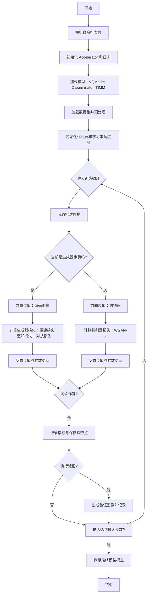
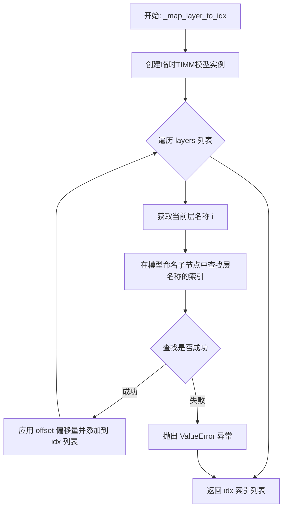
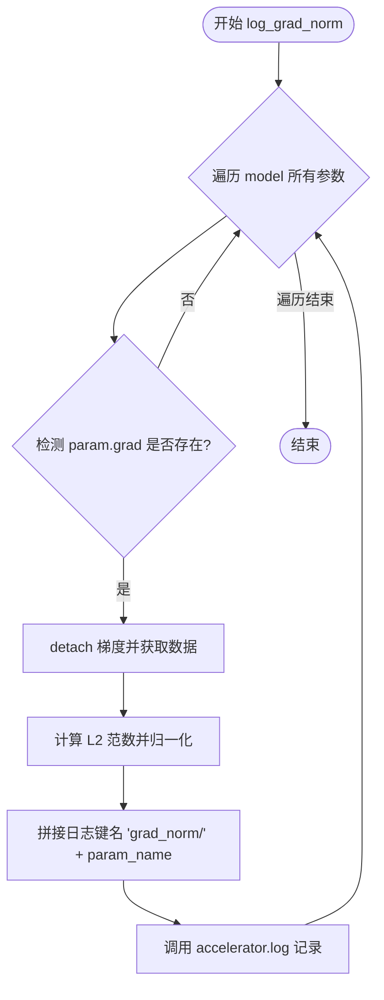
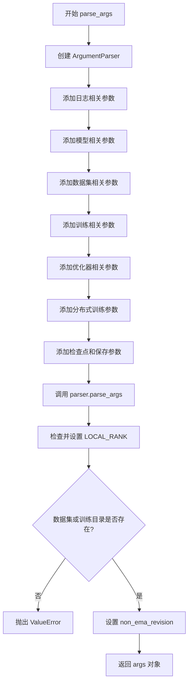
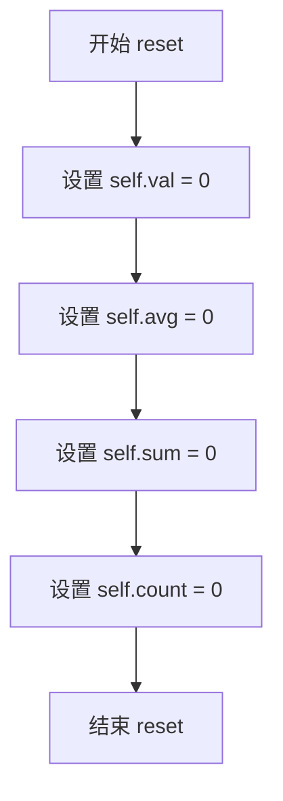
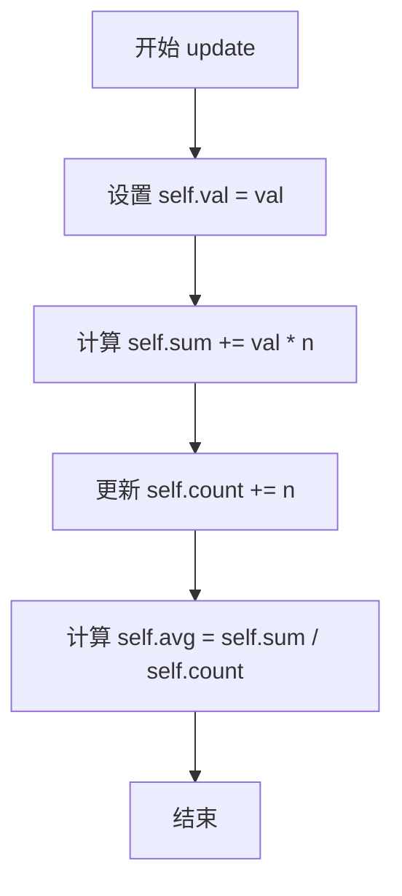

```mermaid
flowchart TD
    A[开始 main 函数] --> B[解析命令行参数 parse_args]
    B --> C[启用 TF32 加速如果允许]
    C --> D[创建 Accelerator 分布式训练环境]
    D --> E{分布式类型是 DeepSpeed?}
    E -->|是| F[设置 DeepSpeed micro batch size]
    E -->|否| G[跳过 DeepSpeed 配置]
    F --> H
    G --> H[初始化 trackers 日志系统]
    H --> I[设置随机种子]
    I --> J[创建输出目录]
    J --> K{模型配置路径为空<br/>且预训练模型路径为空?}
    K -->|是| L[使用默认 VQModel 配置创建模型]
    K -->|否| M{预训练模型路径存在?}
    M -->|是| L2[从预训练加载 VQModel]
    M -->|否| L3[从配置加载 VQModel]
    L --> N
    L2 --> N
    L3 --> N
    N{启用 EMA?}
    N -->|是| O[创建 EMA 模型]
    N -->|否| P[跳过 EMA]
    O --> Q[创建 Discriminator]
    P --> Q
    Q --> R[创建 timm 感知损失模型]
    R --> S[启用 xformers 内存优化]
    S --> T[注册模型保存/加载 hooks]
    T --> U[初始化优化器 AdamW]
    U --> V[创建数据加载器]
    V --> W[创建学习率调度器]
    W --> X[使用 Accelerator 准备模型和优化器]
    X --> Y[计算训练步骤数]
    Y --> Z{是否有检查点需要恢复?}
    Z -->|是| AA[加载检查点]
    Z -->|否| AB[从初始步骤开始]
    AA --> AC
    AB --> AC[初始化训练变量]
    AC --> AD[进入训练循环: for epoch]
    AD --> AE[设置模型为训练模式]
    AE --> AF[遍历训练数据: for batch]
    AF --> AG[计算是否为 generator 步骤]
    AG --> AH{generator_step?}
    AH -->|是| AI[训练 Generator]
    AH -->|否| AJ[训练 Discriminator]
    AI --> AK[计算 VAE 重建损失 MSE/L1]
    AK --> AL[计算感知损失]
    AL --> AM[计算生成器对抗损失]
    AM --> AN[计算自适应权重]
    AN --> AO[累加所有损失]
    AO --> AP[反向传播]
    AP --> AQ[梯度裁剪]
    AQ --> AR[更新生成器参数]
    AR --> AS[更新学习率]
    AS --> AT[记录梯度范数]
    AT --> AU
    AJ --> AV[分离特征图]
    AV --> AW[计算判别器损失 WGAN-GP]
    AW --> AX[计算梯度惩罚]
    AX --> AY[反向传播]
    AY --> AZ1[梯度裁剪]
    AZ1 --> BA[更新判别器参数]
    BA --> BB[更新判别器学习率]
    BB --> BC[记录判别器梯度范数]
    BC --> BD
    AU --> BD[更新 batch 时间]
    BD --> BE{完成优化步骤?}
    BE -->|否| BF[继续下一个 batch]
    BE -->|是| BG[更新全局步骤]
    BG --> BH[更新进度条]
    BH --> BI{启用 EMA?}
    BI -->|是| BJ[更新 EMA 模型]
    BI -->|否| BK
    BJ --> BK{是主进程且<br/>非 generator 步骤?}
    BK -->|是| BL{达到日志记录步骤?}
    BL -->|是| BM[记录训练指标]
    BL -->|否| BN
    BM --> BN{达到检查点保存步骤?}
    BN --> BO{达到验证步骤?}
    BO -->|是| BP[执行验证图像生成]
    BO -->|否| BQ
    BP --> BR
    BQ --> BS{达到最大训练步数?}
    BS -->|否| BF
    BS -->|是| BT[等待所有进程]
    BT --> BU[保存最终模型]
    BU --> BV[结束训练]
    BF --> AF
```

# `diffusers\examples\vqgan\train_vqgan.py` 详细设计文档

这是一个用于训练 VQGAN（向量量化生成对抗网络）模型的脚本，基于 HuggingFace Diffusers 库。它结合了 GAN 训练（使用 WGAN-GP 损失）和感知损失（使用 TIMM 库），并利用 Accelerate 库实现分布式训练，支持 EMA、梯度检查点和图像验证等功能。

## 整体流程



## 类结构

```
VQGAN 训练系统架构
├── 核心模型
│   ├── VQModel (生成器/编码器)
│   ├── Discriminator (判别器)
│   └── TIMM Model (感知损失特征提取器)
├── 训练逻辑
│   ├── 主循环 (交替更新生成器与判别器)
│   ├── 损失函数 (L1/L2, Perceptual, WGAN-GP, Commitment)
│   └── 优化器 (AdamW, EMA, Scheduler)
├── 工具类
│   ├── AverageMeter (性能指标统计)
│   └── Hooks (模型保存与加载钩子)
└── 配置管理 (Argument Parser)
```

## 全局变量及字段


### `logger`
    
日志记录器，用于记录训练过程中的信息

类型：`logging.Logger`
    


### `check_min_version`
    
版本检查函数，用于验证 diffusers 库的最小版本要求

类型：`function`
    


### `is_wandb_available`
    
 wandb 可用性检查函数，返回是否安装了 wandb 库

类型：`function`
    


### `AverageMeter.val`
    
当前值

类型：`float`
    


### `AverageMeter.avg`
    
平均值

类型：`float`
    


### `AverageMeter.sum`
    
累计和

类型：`float`
    


### `AverageMeter.count`
    
计数

类型：`int`
    
    

## 全局函数及方法


### `_map_layer_to_idx`

该函数用于将 TIMM 模型的层名称映射到对应的索引位置。它通过创建临时模型实例来查找层名称在模型结构中的位置，并可选择性地应用偏移量来调整返回的索引值。

参数：

- `backbone`：`str`，TIMM 模型的名称或标识符（如 "vgg19"、"resnet50" 等）
- `layers`：`List[str]`，要映射的层名称列表，例如 `["layer1", "layer2", "head"]`
- `offset`：`int`（可选，默认为 0），索引偏移量，用于调整最终返回的索引值

返回值：`List[int]`，返回映射后的层索引列表

#### 流程图



#### 带注释源码

```python
def _map_layer_to_idx(backbone, layers, offset=0):
    """Maps set of layer names to indices of model. Ported from anomalib

    Returns:
        Feature map extracted from the CNN
    """
    # 初始化空列表用于存储映射后的索引
    idx = []
    
    # 使用 timm 库创建一个临时的模型实例
    # pretrained=False: 不加载预训练权重，仅用于结构查询
    # features_only=False: 不只返回特征层，返回完整模型
    # exportable=True: 确保模型可导出
    features = timm.create_model(
        backbone,
        pretrained=False,
        features_only=False,
        exportable=True,
    )
    
    # 遍历传入的每一层名称
    for i in layers:
        try:
            # 将模型的命名子节点转换为字典并获取键列表
            # 使用 index() 方法查找当前层名称在列表中的位置
            # 减去 offset 得到调整后的索引
            idx.append(list(dict(features.named_children()).keys()).index(i) - offset)
        except ValueError:
            # 如果层名称不存在于模型中，抛出详细的错误信息
            # 包含可用的层名称列表和完整的网络架构信息
            raise ValueError(
                f"Layer {i} not found in model {backbone}. Select layer from {list(dict(features.named_children()).keys())}. The network architecture is {features}"
            )
    
    # 返回映射后的索引列表
    return idx
```


### `get_perceptual_loss`

使用 TIMM 模型计算感知损失（Perceptual Loss），通过比较原始图像和重构图像在预训练 CNN 模型（TIMM）特征空间中的差异，衡量生成图像与原始图像在语义层面的相似度。

参数：

- `pixel_values`：`torch.Tensor`，原始图像的像素值，形状为 [B, C, H, W]
- `fmap`：`torch.Tensor`，重构/生成图像的特征图，形状为 [B, C', H', W']
- `timm_model`：`torch.nn.Module`，TIMM 库加载的预训练模型（如 VGG19），用于提取特征
- `timm_model_resolution`：`tuple` 或 `int`，TIMM 模型期望的输入分辨率，用于插值调整输入尺寸
- `timm_model_normalization`：`torch.nn.Module`，TIMM 模型使用的标准化变换（Normalize）

返回值：`torch.Tensor`，感知损失值，为标量张量，通过计算多层特征的 MSE 并取平均得到

#### 流程图

```mermaid
graph TD
    A[开始: get_perceptual_loss] --> B[对 pixel_values 进行插值到 timm_model_resolution]
    B --> C[对 fmap 进行插值到 timm_model_resolution]
    C --> D[应用 timm_model_normalization 标准化]
    D --> E{检查是否为灰度图像<br/>pixel_values.shape[1] == 1?}
    E -- 是 --> F[复制单通道为三通道<br/>repeat 1, 3, 1, 1]
    E -- 否 --> G[跳过灰度处理]
    F --> H
    G --> H[提取特征: timm_model]
    H --> I[提取特征: timm_model]
    I --> J[计算第一层特征的 MSE 损失]
    J --> K[遍历剩余层: 1 到 len-1]
    K --> L[累加每层 MSE 损失]
    L --> M[除以特征层数量取平均]
    M --> N[返回 perceptual_loss]
```

#### 带注释源码

```python
def get_perceptual_loss(pixel_values, fmap, timm_model, timm_model_resolution, timm_model_normalization):
    """
    使用 TIMM 模型计算感知损失（Perceptual Loss）
    
    参数:
        pixel_values: 原始图像的像素值 tensor，形状 [B, C, H, W]
        fmap: 重构/生成图像的特征图 tensor，形状 [B, C', H', W']
        timm_model: TIMM 库加载的预训练 CNN 模型
        timm_model_resolution: TIMM 模型期望的输入分辨率
        timm_model_normalization: TIMM 模型使用的标准化变换
    
    返回:
        perceptual_loss: 感知损失值，标量 tensor
    """
    
    # Step 1: 将原始图像插值到 TIMM 模型期望的分辨率，然后应用标准化
    # F.interpolate: PyTorch 的插值函数，调整图像尺寸
    # timm_model_normalization: 包含均值和标准差的标准化操作（如 ImageNet 的 mean=[0.485, 0.456, 0.406]）
    img_timm_model_input = timm_model_normalization(F.interpolate(pixel_values, timm_model_resolution))
    
    # Step 2: 将重构图像的特征图也插值到相同分辨率并标准化
    fmap_timm_model_input = timm_model_normalization(F.interpolate(fmap, timm_model_resolution))

    # Step 3: 处理灰度图像的情况
    # TIMM 模型（如 VGG19）通常期望 3 通道输入，灰度图需要复制为 3 通道
    if pixel_values.shape[1] == 1:
        # handle grayscale for timm_model
        # 使用生成器表达式将两个 tensor 都复制为 3 通道
        # t.repeat(1, 3, 1, 1): 在通道维度复制 3 次
        img_timm_model_input, fmap_timm_model_input = (
            t.repeat(1, 3, 1, 1) for t in (img_timm_model_input, fmap_timm_model_input)
        )

    # Step 4: 使用 TIMM 模型提取特征
    # timm_model: 预训练 CNN，返回多层特征（features_only=True 时）
    # img_timm_model_feats: 原始图像的特征列表
    # recon_timm_model_feats: 重构图像的特征列表
    img_timm_model_feats = timm_model(img_timm_model_input)
    recon_timm_model_feats = timm_model(fmap_timm_model_input)
    
    # Step 5: 计算感知损失
    # 使用 MSE Loss 逐层比较特征差异，并取平均
    # 感知损失通过比较高层语义特征来衡量图像相似度，比像素级损失更能反映视觉质量
    
    # 初始化损失为第一层特征的 MSE
    perceptual_loss = F.mse_loss(img_timm_model_feats[0], recon_timm_model_feats[0])
    
    # 累加其余层的 MSE 损失
    for i in range(1, len(img_timm_model_feats)):
        perceptual_loss += F.mse_loss(img_timm_model_feats[i], recon_timm_model_feats[i])
    
    # 除以层数取平均，得到最终的感知损失
    perceptual_loss /= len(img_timm_model_feats)
    
    return perceptual_loss
```


### `grad_layer_wrt_loss`

该函数是一个全局工具函数，主要用于在 GAN（生成对抗网络）训练过程中计算特定损失（Loss）关于模型某一层参数的梯度。在代码中，它被用于计算感知损失（Perceptual Loss）和生成器损失（Generator Loss）相对于解码器最后一层权重的梯度范数，以此动态调整两种损失之间的权重（Adaptive Weight），实现更稳定的训练过程。

参数：

- `loss`：`torch.Tensor`，标量损失值，通常是模型前向传播计算出的感知损失或对抗损失。
- `layer`：`torch.Tensor`，目标层的参数张量（通常是模型的权重或偏置），用于计算梯度。

返回值：`torch.Tensor`，返回损失关于目标层的梯度张量。该返回值已调用 `.detach()` 方法从计算图中分离，可直接用于数值计算（如求范数），且不会影响后续的反向传播。

#### 流程图

```mermaid
graph TD
    A[Start] --> B[Input: loss, layer]
    B --> C{Call torch.autograd.grad}
    C --> D[Set outputs=loss]
    C --> E[Set inputs=layer]
    C --> F[Set grad_outputs=torch.ones_like(loss)]
    C --> G[Set retain_graph=True]
    D --> H[Compute Gradients]
    E --> H
    F --> H
    G --> H
    H --> I[Select first result [0]]
    I --> J[Detach tensor .detach()]
    J --> K[Return Gradient Tensor]
```

#### 带注释源码

```python
def grad_layer_wrt_loss(loss, layer):
    """
    计算损失关于特定层的梯度。

    参数:
        loss (torch.Tensor): 标量损失值。
        layer (torch.Tensor): 需要计算梯度的层参数。

    返回:
        torch.Tensor: 损失关于该层的梯度，已脱离计算图。
    """
    # 使用 torch.autograd.grad 计算梯度
    # outputs: 梯度计算的终点（损失值）
    # inputs: 梯度计算的起点（需要求导的层参数）
    # grad_outputs: 初始梯度向量，通常设为与 loss 形状相同的全1张量
    # retain_graph: 设为 True，保留计算图，因为 loss 在主训练循环中可能还需用于反向传播
    return torch.autograd.grad(
        outputs=loss,
        inputs=layer,
        grad_outputs=torch.ones_like(loss),
        retain_graph=True,
    )[0].detach()  # 取第一个元素（因为 grad 可能返回 tuple），并 detach 以便后续数值计算
```


### `gradient_penalty`

计算 WGAN-GP（Wasserstein GAN with Gradient Penalty）的梯度惩罚，用于稳定 GAN 训练并满足 1-Lipschitz 约束。

参数：

- `images`：`torch.Tensor`，输入的真实图像张量，用于计算梯度的输入
- `output`：`torch.Tensor`，判别器对真实图像的输出（logits），用于计算梯度的输出
- `weight`：`float`，梯度惩罚的权重系数，默认值为 10，用于控制惩罚项在总损失中的比重

返回值：`torch.Tensor`，标量张量，计算得到的梯度惩罚值

#### 流程图

```mermaid
flowchart TD
    A[开始: gradient_penalty] --> B[调用 torch.autograd.grad 计算梯度]
    B --> C[从返回值中提取梯度张量]
    C --> D[获取 batch size: bsz = gradients.shape[0]]
    E[重塑梯度张量: reshape to (bsz, -1)] --> F[计算 L2 范数: norm(2, dim=1)]
    F --> G[计算惩罚项: (norm - 1)²]
    G --> H[计算均值: .mean()]
    H --> I[乘以权重: weight * result]
    I --> J[返回梯度惩罚值]
    
    B -->|"grad_outputs=torch.ones()"| B
```

#### 带注释源码

```python
def gradient_penalty(images, output, weight=10):
    """
    计算 WGAN-GP 的梯度惩罚项。
    
    该函数实现论文 'Improved Training of Wasserstein GANs' 中的梯度惩罚机制，
    通过惩罚判别器输出关于输入的梯度接近 1 来满足 1-Lipschitz 约束。
    
    参数:
        images: 真实图像张量 [B, C, H, W]
        output: 判别器对真实图像的输出 [B, ...]
        weight: 梯度惩罚权重，通常设为 10
    
    返回:
        标量张量，表示梯度惩罚值
    """
    # 使用 torch.autograd.grad 计算 output 相对于 images 的梯度
    # outputs: 需要计算梯度的输出（判别器对真实图像的输出）
    # inputs: 需要计算梯度的输入（真实图像）
    # grad_outputs: 梯度的初始值，设置为全 1 张量与 output 同形状
    # create_graph=True: 允许构建计算图，用于反向传播
    # retain_graph=True: 保留计算图以供后续使用
    # only_inputs=True: 只计算指定输入的梯度，不计算其他参数的梯度
    gradients = torch.autograd.grad(
        outputs=output,
        inputs=images,
        grad_outputs=torch.ones(output.size(), device=images.device),
        create_graph=True,
        retain_graph=True,
        only_inputs=True,
    )[0]
    
    # 获取 batch size
    bsz = gradients.shape[0]
    
    # 将梯度重塑为二维张量 [batch_size, feature_dim]
    # 便于后续计算每个样本的 L2 范数
    gradients = torch.reshape(gradients, (bsz, -1))
    
    # 计算每个样本的 L2 范数（欧几里得范数）
    # 然后计算 (||grad|| - 1)²，即梯度与单位范数之间的偏差
    # 最后取均值并乘以权重系数
    return weight * ((gradients.norm(2, dim=1) - 1) ** 2).mean()
```


### `log_validation`

该函数是训练脚本中的验证核心逻辑。它负责在指定的训练步数（`global_step`）加载预定义的验证图像集，使用当前模型权重进行重建（VQ编码+解码），并将原始图像与生成图像的对比结果记录到 TensorBoard 或 WandB 等可视化日志中，以便监控模型在重建任务上的收敛效果。

参数：

- `model`：`torch.nn.Module`（具体为 `diffusers.VQModel`），当前训练的 VQGAN 模型，用于对图像进行重建推理。
- `args`：`argparse.Namespace`，命令行参数对象，其中包含 `validation_images`（验证图像路径列表）等配置。
- `validation_transform`：`torchvision.transforms.Compose`，用于将 PIL 图像转换为模型输入张量的变换管道（通常是 Resize + ToTensor）。
- `accelerator`：`accelerate.Accelerator`，HuggingFace Accelerate 库提供的加速器实例，用于处理模型 unwrapping、设备分配和日志记录器（trackers）访问。
- `global_step`：`int`，当前的全局训练步数，用于标记日志图像的版本。

返回值：`List[PIL.Image.Image]`，返回生成的 PIL 图像列表（已拼接原始与生成图像），方便调用者进行额外处理或保存。

#### 流程图

```mermaid
flowchart TD
    A([Start: log_validation]) --> B[获取数据类型: 判断 fp16/bf16/fp32]
    B --> C[加载验证图像: 遍历 args.validation_images]
    C --> D[图像预处理: 转换RGB并应用 validation_transform]
    D --> E[切换模型状态: model.eval]
    F[生成循环] --> G[执行推理: accelerator.unwrap_model(model)(original_image).sample]
    G --> H[收集结果: images.append]
    E --> F
    H --> I{是否处理完所有图像?}
    I -- Yes --> J[后处理: Clamp, 归一化到0-255, 转为Numpy]
    J --> K[图像拼接: np.concatenate [original_images, images]]
    K --> L[转换为PIL: Image.fromarray]
    L --> M{日志记录器: 检查 accelerator.trackers}
    M -->|TensorBoard| N[add_images: 记录图像矩阵]
    M -->|WandB| O[wandb.Image: 记录图像对象]
    N --> P[清理缓存: torch.cuda.empty_cache]
    O --> P
    P --> Q([Return: images])
```

#### 带注释源码

```python
@torch.no_grad()
def log_validation(model, args, validation_transform, accelerator, global_step):
    logger.info("Generating images...")
    # 1. 确定推理精度：根据 Accelerator 的混合精度配置选择合适的数据类型
    dtype = torch.float32
    if accelerator.mixed_precision == "fp16":
        dtype = torch.float16
    elif accelerator.mixed_precision == "bf16":
        dtype = torch.bfloat16

    # 2. 加载并预处理验证图像
    original_images = []
    for image_path in args.validation_images:
        image = PIL.Image.open(image_path)
        # 确保图像为 RGB 模式
        if not image.mode == "RGB":
            image = image.convert("RGB")
        # 应用验证集变换并移至对应设备
        image = validation_transform(image).to(accelerator.device, dtype=dtype)
        # 增加批次维度
        original_images.append(image[None])

    # 3. 模型推理：切换到评估模式以确保 BatchNorm 和 Dropout 行为正确
    model.eval()
    images = []
    for original_image in original_images:
        # 使用 unwrap_model 获取原始模型（去除 Accelerator 的包装），调用 sample 方法获取重建结果
        image = accelerator.unwrap_model(model)(original_image).sample
        images.append(image)
    # 训练模式切换回来，继续梯度计算
    model.train()

    # 4. 图像后处理：拼接与格式转换
    # 拼接所有批次的图像
    original_images = torch.cat(original_images, dim=0)
    images = torch.cat(images, dim=0)

    # 数值 clamping 与 255 映射
    images = torch.clamp(images, 0.0, 1.0)
    original_images = torch.clamp(original_images, 0.0, 1.0)
    images *= 255.0
    original_images *= 255.0
    
    # 维度调整与类型转换：CHW -> HWC -> Numpy
    images = images.permute(0, 2, 3, 1).cpu().numpy().astype(np.uint8)
    original_images = original_images.permute(0, 2, 3, 1).cpu().numpy().astype(np.uint8)
    
    # 水平拼接：左侧为原始图，右侧为生成图
    images = np.concatenate([original_images, images], axis=2)
    # 转换为 PIL Image 对象以便日志记录
    images = [Image.fromarray(image) for image in images]

    # 5. 日志记录：遍历所有配置的 tracker（如 TensorBoard, WandB）
    for tracker in accelerator.trackers:
        if tracker.name == "tensorboard":
            # TensorBoard 需要 NHWC 格式的 numpy 数组
            np_images = np.stack([np.asarray(img) for img in images])
            tracker.writer.add_images("validation", np_images, global_step, dataformats="NHWC")
        if tracker.name == "wandb":
            # WandB 支持 PIL Image 并可添加 caption
            tracker.log(
                {
                    "validation": [
                        wandb.Image(image, caption=f"{i}: Original, Generated") for i, image in enumerate(images)
                    ]
                },
                step=global_step,
            )
    
    # 6. 显存清理：释放推理过程中产生的临时显存
    torch.cuda.empty_cache()
    return images
```


### 1. 一段话描述

`log_grad_norm` 是一个用于监控模型训练稳定性的全局工具函数。它遍历指定模型的所有参数，筛选出拥有梯度的参数，计算其梯度的 L2 范数（即模长），并除以参数的总元素数进行归一化处理，最后通过 `accelerator` 对象将每层参数的梯度范数记录到实验追踪工具（如 TensorBoard 或 Weights & Biases）中，以帮助开发者诊断梯度消失或梯度爆炸等问题。

---

### `log_grad_norm`

该函数负责记录并输出模型参数的梯度范数。

参数：

-  `model`：`torch.nn.Module`，待检查梯度的模型实例（如 VQModel 或 Discriminator）。
-  `accelerator`：`accelerate.Accelerator`，Hugging Face Accelerate 库提供的加速器对象，用于处理分布式训练和日志记录。
-  `global_step`：`int`，当前的训练步数（Global Step），用于在日志中标记时间点。

返回值：`None`，该函数直接通过 `accelerator.log` 进行日志输出，不返回任何值。

#### 流程图



#### 带注释源码

```python
def log_grad_norm(model, accelerator, global_step):
    """
    记录模型参数的梯度范数并输出到日志。

    Args:
        model (torch.nn.Module): 需要记录梯度的模型。
        accelerator (Accelerate Accelerator): 用于日志记录的加速器实例。
        global_step (int): 当前的全局训练步数。
    """
    # 遍历模型的所有命名参数
    for name, param in model.named_parameters():
        # 仅处理拥有梯度的参数（例如在某些层被冻结时可能没有梯度）
        if param.grad is not None:
            # 1. detach(): 从当前计算图中分离梯度，防止影响后续计算图。
            # 2. .data: 获取底层的张量数据。
            grads = param.grad.detach().data
            
            # 3. norm(p=2): 计算梯度的 L2 范数 (Frobenius norm for matrices)。
            # 4. / grads.numel(): 除以张量中的总元素数量，计算“平均”梯度范数。
            # 5. .item(): 将张量转换为 Python 标量，以便序列化为日志。
            grad_norm = (grads.norm(p=2) / grads.numel()).item()
            
            # 使用 accelerator 的 log 方法记录数据，键名遵循 "grad_norm/{layer_name}" 的格式
            accelerator.log({"grad_norm/" + name: grad_norm}, step=global_step)
```


### `parse_args`

解析命令行参数，配置训练脚本的各种选项，包括模型参数、数据集配置、训练超参数、优化器设置、分布式训练选项、验证和检查点设置等，并进行基本的合法性检查。

参数： 无

返回值：` argparse.Namespace`，包含所有解析后的命令行参数对象

#### 流程图



#### 带注释源码

```python
def parse_args():
    """
    解析命令行参数，配置训练脚本的各种选项。
    
    返回:
        argparse.Namespace: 包含所有解析后的命令行参数
    """
    # 创建 ArgumentParser 对象，描述为"简单训练脚本示例"
    parser = argparse.ArgumentParser(description="Simple example of a training script.")
    
    # ==================== 日志相关参数 ====================
    # 梯度日志打印间隔步数
    parser.add_argument(
        "--log_grad_norm_steps",
        type=int,
        default=500,
        help=("Print logs of gradient norms every X steps."),
    )
    # 日志打印间隔步数
    parser.add_argument(
        "--log_steps",
        type=int,
        default=50,
        help=("Print logs every X steps."),
    )
    # 验证执行间隔步数
    parser.add_argument(
        "--validation_steps",
        type=int,
        default=100,
        help=(
            "Run validation every X steps. Validation consists of running reconstruction on images in"
            " `args.validation_images` and logging the reconstructed images."
        ),
    )
    
    # ==================== VAE 和 Timm 模型参数 ====================
    # VAE 重建损失函数类型
    parser.add_argument(
        "--vae_loss",
        type=str,
        default="l2",
        help="The loss function for vae reconstruction loss.",
    )
    # Timm 模型层索引偏移量
    parser.add_argument(
        "--timm_model_offset",
        type=int,
        default=0,
        help="Offset of timm layers to indices.",
    )
    # Timm 模型层名称
    parser.add_argument(
        "--timm_model_layers",
        type=str,
        default="head",
        help="The layers to get output from in the timm model.",
    )
    # Timm 模型后端（用于 LPIPS 损失）
    parser.add_argument(
        "--timm_model_backend",
        type=str,
        default="vgg19",
        help="Timm model used to get the lpips loss",
    )
    
    # ==================== 模型预训练相关参数 ====================
    # 预训练模型名称或路径
    parser.add_argument(
        "--pretrained_model_name_or_path",
        type=str,
        default=None,
        help="Path to pretrained model or model identifier from huggingface.co/models.",
    )
    # 模型配置文件路径
    parser.add_argument(
        "--model_config_name_or_path",
        type=str,
        default=None,
        help="The config of the Vq model to train, leave as None to use standard Vq model configuration.",
    )
    # 判别器配置文件路径
    parser.add_argument(
        "--discriminator_config_name_or_path",
        type=str,
        default=None,
        help="The config of the discriminator model to train, leave as None to use standard Vq model configuration.",
    )
    # 预训练模型版本
    parser.add_argument(
        "--revision",
        type=str,
        default=None,
        required=False,
        help="Revision of pretrained model identifier from huggingface.co/models.",
    )
    
    # ==================== 数据集相关参数 ====================
    # 数据集名称（来自 HuggingFace Hub）
    parser.add_argument(
        "--dataset_name",
        type=str,
        default=None,
        help=(
            "The name of the Dataset (from the HuggingFace hub) to train on (could be your own, possibly private,"
            " dataset). It can also be a path pointing to a local copy of a dataset in your filesystem,"
            " or to a folder containing files that 🤗 Datasets can understand."
        ),
    )
    # 数据集配置名称
    parser.add_argument(
        "--dataset_config_name",
        type=str,
        default=None,
        help="The config of the Dataset, leave as None if there's only one config.",
    )
    # 训练数据目录（本地）
    parser.add_argument(
        "--train_data_dir",
        type=str,
        default=None,
        help=(
            "A folder containing the training data. Folder contents must follow the structure described in"
            " https://huggingface.co/docs/datasets/image_dataset#imagefolder. In particular, a `metadata.jsonl` file"
            " must exist to provide the captions for the images. Ignored if `dataset_name` is specified."
        ),
    )
    # 数据集中图像列名
    parser.add_argument(
        "--image_column", type=str, default="image", help="The column of the dataset containing an image."
    )
    # 最大训练样本数（用于调试或加速训练）
    parser.add_argument(
        "--max_train_samples",
        type=int,
        default=None,
        help=(
            "For debugging purposes or quicker training, truncate the number of training examples to this "
            "value if set."
        ),
    )
    # 验证图像路径
    parser.add_argument(
        "--validation_images",
        type=str,
        default=None,
        nargs="+",
        help=("A set of validation images evaluated every `--validation_steps` and logged to `--report_to`."),
    )
    
    # ==================== 输出和缓存目录 ====================
    # 输出目录
    parser.add_argument(
        "--output_dir",
        type=str,
        default="vqgan-output",
        help="The output directory where the model predictions and checkpoints will be written.",
    )
    # 缓存目录
    parser.add_argument(
        "--cache_dir",
        type=str,
        default=None,
        help="The directory where the downloaded models and datasets will be stored.",
    )
    # 随机种子
    parser.add_argument("--seed", type=int, default=None, help="A seed for reproducible training.")
    
    # ==================== 图像处理参数 ====================
    # 输入图像分辨率
    parser.add_argument(
        "--resolution",
        type=int,
        default=512,
        help=(
            "The resolution for input images, all the images in the train/validation dataset will be resized to this"
            " resolution"
        ),
    )
    # 是否中心裁剪
    parser.add_argument(
        "--center_crop",
        default=False,
        action="store_true",
        help=(
            "Whether to center crop the input images to the resolution. If not set, the images will be randomly"
            " cropped. The images will be resized to the resolution first before cropping."
        ),
    )
    # 是否随机水平翻转
    parser.add_argument(
        "--random_flip",
        action="store_true",
        help="whether to randomly flip images horizontally",
    )
    
    # ==================== 训练参数 ====================
    # 训练批次大小
    parser.add_argument(
        "--train_batch_size", type=int, default=16, help="Batch size (per device) for the training dataloader."
    )
    # 训练轮数
    parser.add_argument("--num_train_epochs", type=int, default=100)
    # 最大训练步数
    parser.add_argument(
        "--max_train_steps",
        type=int,
        default=None,
        help="Total number of training steps to perform.  If provided, overrides num_train_epochs.",
    )
    # 梯度累积步数
    parser.add_argument(
        "--gradient_accumulation_steps",
        type=int,
        default=1,
        help="Number of updates steps to accumulate before performing a backward/update pass.",
    )
    # 是否使用梯度检查点
    parser.add_argument(
        "--gradient_checkpointing",
        action="store_true",
        help="Whether or not to use gradient checkpointing to save memory at the expense of slower backward pass.",
    )
    
    # ==================== 学习率参数 ====================
    # 判别器学习率
    parser.add_argument(
        "--discr_learning_rate",
        type=float,
        default=1e-4,
        help="Initial learning rate (after the potential warmup period) to use.",
    )
    # 生成器学习率
    parser.add_argument(
        "--learning_rate",
        type=float,
        default=1e-4,
        help="Initial learning rate (after the potential warmup period) to use.",
    )
    # 是否按 GPU/梯度累积/批次大小缩放学习率
    parser.add_argument(
        "--scale_lr",
        action="store_true",
        default=False,
        help="Scale the learning rate by the number of GPUs, gradient accumulation steps, and batch size.",
    )
    # 学习率调度器类型
    parser.add_argument(
        "--lr_scheduler",
        type=str,
        default="constant",
        help=(
            'The scheduler type to use. Choose between ["linear", "cosine", "cosine_with_restarts", "polynomial",'
            ' "constant", "constant_with_warmup"]'
        ),
    )
    # 判别器学习率调度器
    parser.add_argument(
        "--discr_lr_scheduler",
        type=str,
        default="constant",
        help=(
            'The scheduler type to use. Choose between ["linear", "cosine", "cosine_with_restarts", "polynomial",'
            ' "constant", "constant_with_warmup"]'
        ),
    )
    # 学习率预热步数
    parser.add_argument(
        "--lr_warmup_steps", type=int, default=500, help="Number of steps for the warmup in the lr scheduler."
    )
    
    # ==================== 优化器高级选项 ====================
    # 是否使用 8-bit Adam
    parser.add_argument(
        "--use_8bit_adam", action="store_true", help="Whether or not to use 8-bit Adam from bitsandbytes."
    )
    # 是否允许 TF32
    parser.add_argument(
        "--allow_tf32",
        action="store_true",
        help=(
            "Whether or not to allow TF32 on Ampere GPUs. Can be used to speed up training. For more information, see"
            " https://pytorch.org/docs/stable/notes/cuda.html#tensorfloat-32-tf32-on-ampere-devices"
        ),
    )
    # 是否使用 EMA
    parser.add_argument("--use_ema", action="store_true", help="Whether to use EMA model.")
    # 非 EMA 模型版本
    parser.add_argument(
        "--non_ema_revision",
        type=str,
        default=None,
        required=False,
        help=(
            "Revision of pretrained non-ema model identifier. Must be a branch, tag or git identifier of the local or"
            " remote repository specified with --pretrained_model_name_or_path."
        ),
    )
    # 数据加载器工作进程数
    parser.add_argument(
        "--dataloader_num_workers",
        type=int,
        default=0,
        help=(
            "Number of subprocesses to use for data loading. 0 means that the data will be loaded in the main process."
        ),
    )
    
    # ==================== Adam 优化器参数 ====================
    parser.add_argument("--adam_beta1", type=float, default=0.9, help="The beta1 parameter for the Adam optimizer.")
    parser.add_argument("--adam_beta2", type=float, default=0.999, help="The beta2 parameter for the Adam optimizer.")
    parser.add_argument("--adam_weight_decay", type=float, default=1e-2, help="Weight decay to use.")
    parser.add_argument("--adam_epsilon", type=float, default=1e-08, help="Epsilon value for the Adam optimizer")
    parser.add_argument("--max_grad_norm", default=1.0, type=float, help="Max gradient norm.")
    
    # ==================== HuggingFace Hub 相关 ====================
    # 是否推送到 Hub
    parser.add_argument("--push_to_hub", action="store_true", help="Whether or not to push the model to the Hub.")
    # Hub token
    parser.add_argument("--hub_token", type=str, default=None, help="The token to use to push to the Model Hub.")
    # 预测类型
    parser.add_argument(
        "--prediction_type",
        type=str,
        default=None,
        help="The prediction_type that shall be used for training. Choose between 'epsilon' or 'v_prediction' or leave `None`. If left to `None` the default prediction type of the scheduler: `noise_scheduler.config.prediciton_type` is chosen.",
    )
    # Hub 模型 ID
    parser.add_argument(
        "--hub_model_id",
        type=str,
        default=None,
        help="The name of the repository to keep in sync with the local `output_dir`.",
    )
    
    # ==================== 日志和报告 ====================
    # 日志目录
    parser.add_argument(
        "--logging_dir",
        type=str,
        default="logs",
        help=(
            "[TensorBoard](https://www.tensorflow.org/tensorboard) log directory. Will default to"
            " *output_dir/runs/**CURRENT_DATETIME_HOSTNAME***."
        ),
    )
    # 混合精度类型
    parser.add_argument(
        "--mixed_precision",
        type=str,
        default=None,
        choices=["no", "fp16", "bf16"],
        help=(
            "Whether to use mixed precision. Choose between fp16 and bf16 (bfloat16). Bf16 requires PyTorch >="
            " 1.10.and an Nvidia Ampere GPU.  Default to the value of accelerate config of the current system or the"
            " flag passed with the `accelerate.launch` command. Use this argument to override the accelerate config."
        ),
    )
    # 报告目标
    parser.add_argument(
        "--report_to",
        type=str,
        default="tensorboard",
        help=(
            'The integration to report the results and logs to. Supported platforms are `"tensorboard"`'
            ' (default), `"wandb"` and `"comet_ml"`. Use `"all"` to report to all integrations.'
        ),
    )
    
    # ==================== 分布式训练 ====================
    # 本地排名
    parser.add_argument("--local_rank", type=int, default=-1, help="For distributed training: local_rank")
    
    # ==================== 检查点相关 ====================
    # 检查点保存间隔步数
    parser.add_argument(
        "--checkpointing_steps",
        type=int,
        default=500,
        help=(
            "Save a checkpoint of the training state every X updates. These checkpoints are only suitable for resuming"
            " training using `--resume_from_checkpoint`."
        ),
    )
    # 检查点总数限制
    parser.add_argument(
        "--checkpoints_total_limit",
        type=int,
        default=None,
        help=("Max number of checkpoints to store."),
    )
    # 从检查点恢复
    parser.add_argument(
        "--resume_from_checkpoint",
        type=str,
        default=None,
        help=(
            "Whether training should be resumed from a previous checkpoint. Use a path saved by"
            ' `--checkpointing_steps`, or `"latest"` to automatically select the last available checkpoint.'
        ),
    )
    
    # ==================== 高级特性 ====================
    # 启用 xformers 内存高效注意力
    parser.add_argument(
        "--enable_xformers_memory_efficient_attention", action="store_true", help="Whether or not to use xformers."
    )
    # 跟踪器项目名称
    parser.add_argument(
        "--tracker_project_name",
        type=str,
        default="vqgan-training",
        help=(
            "The `project_name` argument passed to Accelerator.init_trackers for"
            " more information see https://huggingface.co/docs/accelerate/v0.17.0/en/package_reference/accelerator#accelerate.Accelerator"
        ),
    )

    # 解析命令行参数
    args = parser.parse_args()
    
    # 检查环境变量 LOCAL_RANK，如果存在则覆盖 args.local_rank
    env_local_rank = int(os.environ.get("LOCAL_RANK", -1))
    if env_local_rank != -1 and env_local_rank != args.local_rank:
        args.local_rank = env_local_rank

    # ==================== 合法性检查 ====================
    # 确保提供了数据集名称或训练数据目录
    if args.dataset_name is None and args.train_data_dir is None:
        raise ValueError("Need either a dataset name or a training folder.")

    # 如果未指定 non_ema_revision，默认使用与主模型相同的版本
    if args.non_ema_revision is None:
        args.non_ema_revision = args.revision

    # 返回解析后的参数对象
    return args
```


### `main`

主训练流程函数，负责初始化分布式训练环境、加载模型和数据集、执行VQGAN模型的对抗训练（包括生成器和判别器），并在训练过程中记录日志、保存检查点以及进行验证图像生成。

参数：

- 无显式参数（内部通过`parse_args()`获取命令行参数）

返回值：`None`，无返回值

#### 流程图



#### 带注释源码

```python
def main():
    #########################
    # SETUP Accelerator     #
    #########################
    # 1. 解析命令行参数获取所有训练配置
    args = parse_args()

    # 2. 启用 TF32 计算加速（适用于 Ampere 架构 GPU）
    if args.allow_tf32:
        torch.backends.cuda.matmul.allow_tf32 = True
        torch.backends.cudnn.benchmark = True
        torch.backends.cudnn.deterministic = False

    # 3. 构建日志输出目录
    logging_dir = os.path.join(args.output_dir, args.logging_dir)
    accelerator_project_config = ProjectConfiguration(project_dir=args.output_dir, logging_dir=logging_dir)

    # 4. 初始化 Accelerator（分布式训练、混合精度、分布式日志等）
    accelerator = Accelerator(
        gradient_accumulation_steps=args.gradient_accumulation_steps,
        mixed_precision=args.mixed_precision,
        log_with=args.report_to,
        project_config=accelerator_project_config,
    )

    # 5. 配置 DeepSpeed 分布式训练（如果使用）
    if accelerator.distributed_type == DistributedType.DEEPSPEED:
        accelerator.state.deepspeed_plugin.deepspeed_config["train_micro_batch_size_per_gpu"] = args.train_batch_size

    #####################################
    # SETUP LOGGING, SEED and CONFIG    #
    #####################################

    # 6. 初始化训练 trackers（TensorBoard/WandB）
    if accelerator.is_main_process:
        tracker_config = dict(vars(args))
        tracker_config.pop("validation_images")
        accelerator.init_trackers(args.tracker_project_name, tracker_config)

    # 7. 设置随机种子确保可重复性
    if args.seed is not None:
        set_seed(args.seed)

    # 8. 处理模型仓库创建（如果需要推送到 Hub）
    if accelerator.is_main_process:
        if args.output_dir is not None:
            os.makedirs(args.output_dir, exist_ok=True)

        if args.push_to_hub:
            create_repo(
                repo_id=args.hub_model_id or Path(args.output_dir).name, exist_ok=True, token=args.hub_token
            ).repo_id

    #########################
    # MODELS and OPTIMIZER  #
    #########################
    logger.info("Loading models and optimizer")

    # 9. 加载 VQModel（量化变分自编码器）
    if args.model_config_name_or_path is None and args.pretrained_model_name_or_path is None:
        # 使用默认配置创建 VQModel
        model = VQModel(
            act_fn="silu",
            block_out_channels=[128, 256, 512],
            down_block_types=["DownEncoderBlock2D", "DownEncoderBlock2D", "DownEncoderBlock2D"],
            in_channels=3,
            latent_channels=4,
            layers_per_block=2,
            norm_num_groups=32,
            norm_type="spatial",
            num_vq_embeddings=16384,
            out_channels=3,
            sample_size=32,
            scaling_factor=0.18215,
            up_block_types=["UpDecoderBlock2D", "UpDecoderBlock2D", "UpDecoderBlock2D"],
            vq_embed_dim=4,
        )
    elif args.pretrained_model_name_or_path is not None:
        # 从预训练模型加载
        model = VQModel.from_pretrained(args.pretrained_model_name_or_path)
    else:
        # 从自定义配置文件加载
        config = VQModel.load_config(args.model_config_name_or_path)
        model = VQModel.from_config(config)
    
    # 10. 创建 EMA 模型（指数移动平均，用于稳定训练）
    if args.use_ema:
        ema_model = EMAModel(model.parameters(), model_cls=VQModel, model_config=model.config)
    
    # 11. 加载判别器模型
    if args.discriminator_config_name_or_path is None:
        discriminator = Discriminator()
    else:
        config = Discriminator.load_config(args.discriminator_config_name_or_path)
        discriminator = Discriminator.from_config(config)

    # 12. 创建 timm 感知损失模型（用于计算 LPIPS 感知损失）
    idx = _map_layer_to_idx(args.timm_model_backend, args.timm_model_layers.split("|"), args.timm_model_offset)

    timm_model = timm.create_model(
        args.timm_model_backend,
        pretrained=True,
        features_only=True,
        exportable=True,
        out_indices=idx,
    )
    timm_model = timm_model.to(accelerator.device)
    timm_model.requires_grad = False
    timm_model.eval()
    timm_transform = create_transform(**resolve_data_config(timm_model.pretrained_cfg, model=timm_model))
    # 验证 timm 模型的 transforms 配置
    try:
        timm_centercrop_transform = timm_transform.transforms[1]
        assert isinstance(timm_centercrop_transform, transforms.CenterCrop), (
            f"Timm model {timm_model} is currently incompatible with this script. Try vgg19."
        )
        timm_model_resolution = timm_centercrop_transform.size[0]
        timm_model_normalization = timm_transform.transforms[-1]
        assert isinstance(timm_model_normalization, transforms.Normalize), (
            f"Timm model {timm_model} is currently incompatible with this script. Try vgg19."
        )
    except AssertionError as e:
        raise NotImplementedError(e)
    
    # 13. 启用 xformers 内存高效注意力（如果支持）
    if args.enable_xformers_memory_efficient_attention:
        model.enable_xformers_memory_efficient_attention()

    # 14. 注册自定义模型保存/加载 hooks（用于 Accelerator 状态保存）
    if version.parse(accelerate.__version__) >= version.parse("0.16.0"):
        def save_model_hook(models, weights, output_dir):
            if accelerator.is_main_process:
                if args.use_ema:
                    ema_model.save_pretrained(os.path.join(output_dir, "vqmodel_ema"))
                vqmodel = models[0]
                discriminator = models[1]
                vqmodel.save_pretrained(os.path.join(output_dir, "vqmodel"))
                discriminator.save_pretrained(os.path.join(output_dir, "discriminator"))
                weights.pop()
                weights.pop()

        def load_model_hook(models, input_dir):
            if args.use_ema:
                load_model = EMAModel.from_pretrained(os.path.join(input_dir, "vqmodel_ema"), VQModel)
                ema_model.load_state_dict(load_model.state_dict())
                ema_model.to(accelerator.device)
                del load_model
            discriminator = models.pop()
            load_model = Discriminator.from_pretrained(input_dir, subfolder="discriminator")
            discriminator.register_to_config(**load_model.config)
            discriminator.load_state_dict(load_model.state_dict())
            del load_model
            vqmodel = models.pop()
            load_model = VQModel.from_pretrained(input_dir, subfolder="vqmodel")
            vqmodel.register_to_config(**load_model.config)
            vqmodel.load_state_dict(load_model.state_dict())
            del load_model

        accelerator.register_save_state_pre_hook(save_model_hook)
        accelerator.register_load_state_pre_hook(load_model_hook)

    # 15. 计算学习率（支持学习率缩放）
    learning_rate = args.learning_rate
    if args.scale_lr:
        learning_rate = (
            learning_rate * args.train_batch_size * accelerator.num_processes * args.gradient_accumulation_steps
        )

    # 16. 初始化优化器（支持 8-bit Adam）
    if args.use_8bit_adam:
        try:
            import bitsandbytes as bnb
        except ImportError:
            raise ImportError(
                "Please install bitsandbytes to use 8-bit Adam. You can do so by running `pip install bitsandbytes`"
            )

        optimizer_cls = bnb.optim.AdamW8bit
    else:
        optimizer_cls = torch.optim.AdamW

    # VQModel 优化器
    optimizer = optimizer_cls(
        list(model.parameters()),
        lr=args.learning_rate,
        betas=(args.adam_beta1, args.adam_beta2),
        weight_decay=args.adam_weight_decay,
        eps=args.adam_epsilon,
    )
    # Discriminator 优化器
    discr_optimizer = optimizer_cls(
        list(discriminator.parameters()),
        lr=args.discr_learning_rate,
        betas=(args.adam_beta1, args.adam_beta2),
        weight_decay=args.adam_weight_decay,
        eps=args.adam_epsilon,
    )

    ##################################
    # DATLOADER and LR-SCHEDULER     #
    #################################
    logger.info("Creating dataloaders and lr_scheduler")

    # 17. 计算总 batch size
    total_batch_size = args.train_batch_size * accelerator.num_processes * args.gradient_accumulation_steps

    # 18. 加载数据集
    if args.dataset_name is not None:
        # 从 HuggingFace Hub 下载数据集
        dataset = load_dataset(
            args.dataset_name,
            args.dataset_config_name,
            cache_dir=args.cache_dir,
            data_dir=args.train_data_dir,
        )
    else:
        # 从本地文件夹加载
        data_files = {}
        if args.train_data_dir is not None:
            data_files["train"] = os.path.join(args.train_data_dir, "**")
        dataset = load_dataset(
            "imagefolder",
            data_files=data_files,
            cache_dir=args.cache_dir,
        )

    # 19. 定义图像预处理 transforms
    column_names = dataset["train"].column_names
    assert args.image_column is not None
    image_column = args.image_column
    if image_column not in column_names:
        raise ValueError(f"--image_column' value '{args.image_column}' needs to be one of: {', '.join(column_names)}")

    # 训练数据增强
    train_transforms = transforms.Compose(
        [
            transforms.Resize(args.resolution, interpolation=transforms.InterpolationMode.BILINEAR),
            transforms.CenterCrop(args.resolution) if args.center_crop else transforms.RandomCrop(args.resolution),
            transforms.RandomHorizontalFlip() if args.random_flip else transforms.Lambda(lambda x: x),
            transforms.ToTensor(),
        ]
    )
    # 验证数据预处理（无数据增强）
    validation_transform = transforms.Compose(
        [
            transforms.Resize(args.resolution, interpolation=transforms.InterpolationMode.BILINEAR),
            transforms.ToTensor(),
        ]
    )

    # 20. 数据预处理函数
    def preprocess_train(examples):
        images = [image.convert("RGB") for image in examples[image_column]]
        examples["pixel_values"] = [train_transforms(image) for image in images]
        return examples

    # 21. 应用预处理并创建数据集
    with accelerator.main_process_first():
        if args.max_train_samples is not None:
            dataset["train"] = dataset["train"].shuffle(seed=args.seed).select(range(args.max_train_samples))
        train_dataset = dataset["train"].with_transform(preprocess_train)

    # 22. 自定义 collate 函数
    def collate_fn(examples):
        pixel_values = torch.stack([example["pixel_values"] for example in examples])
        pixel_values = pixel_values.to(memory_format=torch.contiguous_format).float()
        return {"pixel_values": pixel_values}

    # 23. 创建训练数据加载器
    train_dataloader = torch.utils.data.DataLoader(
        train_dataset,
        shuffle=True,
        collate_fn=collate_fn,
        batch_size=args.train_batch_size,
        num_workers=args.dataloader_num_workers,
    )

    # 24. 创建学习率调度器
    lr_scheduler = get_scheduler(
        args.lr_scheduler,
        optimizer=optimizer,
        num_training_steps=args.max_train_steps,
        num_warmup_steps=args.lr_warmup_steps,
    )
    discr_lr_scheduler = get_scheduler(
        args.discr_lr_scheduler,
        optimizer=discr_optimizer,
        num_training_steps=args.max_train_steps,
        num_warmup_steps=args.lr_warmup_steps,
    )

    # 25. 使用 Accelerator 准备模型和优化器（分布式训练准备）
    logger.info("Preparing model, optimizer and dataloaders")
    model, discriminator, optimizer, discr_optimizer, lr_scheduler, discr_lr_scheduler = accelerator.prepare(
        model, discriminator, optimizer, discr_optimizer, lr_scheduler, discr_lr_scheduler
    )
    if args.use_ema:
        ema_model.to(accelerator.device)
    
    # 26. 打印训练配置信息
    logger.info("***** Running training *****")
    logger.info(f"  Num examples = {len(train_dataset)}")
    logger.info(f"  Num Epochs = {args.num_train_epochs}")
    logger.info(f"  Instantaneous batch size per device = {args.train_batch_size}")
    logger.info(f"  Total train batch size (w. parallel, distributed & accumulation) = {total_batch_size}")
    logger.info(f"  Gradient Accumulation steps = {args.gradient_accumulation_steps}")
    logger.info(f"  Total optimization steps = {args.max_train_steps}")
    
    # 27. 初始化训练状态变量
    global_step = 0
    first_epoch = 0
    overrode_max_train_steps = False
    num_update_steps_per_epoch = math.ceil(len(train_dataloader) / args.gradient_accumulation_steps)
    
    # 28. 计算总训练步数
    if args.max_train_steps is None:
        args.max_train_steps = args.num_train_epochs * num_update_steps_per_epoch
        overrode_max_train_steps = True
    if overrode_max_train_steps:
        args.max_train_steps = args.num_train_epochs * num_update_steps_per_epoch
    args.num_train_epochs = math.ceil(args.max_train_steps / num_update_steps_per_epoch)

    # 29. 从检查点恢复训练（如果指定）
    resume_from_checkpoint = args.resume_from_checkpoint
    if resume_from_checkpoint:
        if resume_from_checkpoint != "latest":
            path = resume_from_checkpoint
        else:
            # 获取最新的检查点
            dirs = os.listdir(args.output_dir)
            dirs = [d for d in dirs if d.startswith("checkpoint")]
            dirs = sorted(dirs, key=lambda x: int(x.split("-")[1]))
            path = dirs[-1] if len(dirs) > 0 else None
            path = os.path.join(args.output_dir, path)

        if path is None:
            accelerator.print(f"Checkpoint '{resume_from_checkpoint}' does not exist. Starting a new training run.")
            resume_from_checkpoint = None
        else:
            accelerator.print(f"Resuming from checkpoint {path}")
            accelerator.load_state(path)
            accelerator.wait_for_everyone()
            global_step = int(os.path.basename(path).split("-")[1])
            first_epoch = global_step // num_update_steps_per_epoch

    # 30. 初始化性能监控指标
    batch_time_m = AverageMeter()
    data_time_m = AverageMeter()
    end = time.time()
    
    # 31. 创建进度条
    progress_bar = tqdm(
        range(0, args.max_train_steps),
        initial=global_step,
        desc="Steps",
        disable=not accelerator.is_local_main_process,
    )
    
    # 32. 训练循环
    avg_gen_loss, avg_discr_loss = None, None
    for epoch in range(first_epoch, args.num_train_epochs):
        model.train()
        discriminator.train()
        
        # 遍历每个 batch
        for i, batch in enumerate(train_dataloader):
            pixel_values = batch["pixel_values"]
            pixel_values = pixel_values.to(accelerator.device, non_blocking=True)
            data_time_m.update(time.time() - end)
            
            # 33. 决定当前步骤是训练生成器还是判别器
            # 每 2 个梯度累积步为一个完整周期：第 0 步训练生成器，第 1 步训练判别器
            generator_step = ((i // args.gradient_accumulation_steps) % 2) == 0
            
            # 34. 清零梯度
            if generator_step:
                optimizer.zero_grad(set_to_none=True)
            else:
                discr_optimizer.zero_grad(set_to_none=True)
            
            # 35. 编码图像到潜在空间，获取特征图和 commit 损失
            fmap, commit_loss = model(pixel_values, return_dict=False)

            if generator_step:
                # ========== 生成器训练步骤 ==========
                with accelerator.accumulate(model):
                    # 重建损失：像素级 L2 或 L1 损失
                    if args.vae_loss == "l2":
                        loss = F.mse_loss(pixel_values, fmap)
                    else:
                        loss = F.l1_loss(pixel_values, fmap)
                    
                    # 感知损失：高层特征 MSE 损失（使用 timm 模型）
                    perceptual_loss = get_perceptual_loss(
                        pixel_values,
                        fmap,
                        timm_model,
                        timm_model_resolution=timm_model_resolution,
                        timm_model_normalization=timm_model_normalization,
                    )
                    
                    # 生成器对抗损失：试图欺骗判别器
                    gen_loss = -discriminator(fmap).mean()
                    
                    # 计算自适应权重（平衡感知损失和对抗损失）
                    last_dec_layer = accelerator.unwrap_model(model).decoder.conv_out.weight
                    norm_grad_wrt_perceptual_loss = grad_layer_wrt_loss(perceptual_loss, last_dec_layer).norm(p=2)
                    norm_grad_wrt_gen_loss = grad_layer_wrt_loss(gen_loss, last_dec_layer).norm(p=2)

                    adaptive_weight = norm_grad_wrt_perceptual_loss / norm_grad_wrt_gen_loss.clamp(min=1e-8)
                    adaptive_weight = adaptive_weight.clamp(max=1e4)
                    
                    # 总损失 = 重建损失 + commit 损失 + 感知损失 + 自适应权重 * 对抗损失
                    loss += commit_loss
                    loss += perceptual_loss
                    loss += adaptive_weight * gen_loss
                    
                    # 收集所有进程的损失用于日志记录
                    avg_gen_loss = accelerator.gather(loss.repeat(args.train_batch_size)).float().mean()
                    
                    # 反向传播
                    accelerator.backward(loss)

                    # 梯度裁剪
                    if args.max_grad_norm is not None and accelerator.sync_gradients:
                        accelerator.clip_grad_norm_(model.parameters(), args.max_grad_norm)

                    # 更新参数
                    optimizer.step()
                    lr_scheduler.step()
                    
                    # 记录梯度范数
                    if (
                        accelerator.sync_gradients
                        and global_step % args.log_grad_norm_steps == 0
                        and accelerator.is_main_process
                    ):
                        log_grad_norm(model, accelerator, global_step)
            else:
                # ========== 判别器训练步骤 ==========
                with accelerator.accumulate(discriminator):
                    # 分离特征图（不让生成器梯度流向判别器）
                    fmap.detach_()
                    pixel_values.requires_grad_()
                    
                    # WGAN-GP 判别器损失
                    real = discriminator(pixel_values)
                    fake = discriminator(fmap)
                    loss = (F.relu(1 + fake) + F.relu(1 - real)).mean()
                    
                    # 梯度惩罚（确保 Lipschitz 约束）
                    gp = gradient_penalty(pixel_values, real)
                    loss += gp
                    
                    avg_discr_loss = accelerator.gather(loss.repeat(args.train_batch_size)).mean()
                    accelerator.backward(loss)

                    # 梯度裁剪
                    if args.max_grad_norm is not None and accelerator.sync_gradients:
                        accelerator.clip_grad_norm_(discriminator.parameters(), args.max_grad_norm)

                    # 更新判别器参数
                    discr_optimizer.step()
                    discr_lr_scheduler.step()
                    
                    # 记录判别器梯度范数
                    if (
                        accelerator.sync_gradients
                        and global_step % args.log_grad_norm_steps == 0
                        and accelerator.is_main_process
                    ):
                        log_grad_norm(discriminator, accelerator, global_step)
            
            # 36. 更新 batch 时间
            batch_time_m.update(time.time() - end)
            
            # 37. 检查是否完成了一个优化步骤
            if accelerator.sync_gradients:
                global_step += 1
                progress_bar.update(1)
                
                # 更新 EMA 模型
                if args.use_ema:
                    ema_model.step(model.parameters())
            
            # 38. 在主进程且非生成器步骤后记录日志和保存检查点
            if accelerator.sync_gradients and not generator_step and accelerator.is_main_process:
                # 记录训练指标
                if global_step % args.log_steps == 0:
                    samples_per_second_per_gpu = (
                        args.gradient_accumulation_steps * args.train_batch_size / batch_time_m.val
                    )
                    logs = {
                        "step_discr_loss": avg_discr_loss.item(),
                        "lr": lr_scheduler.get_last_lr()[0],
                        "samples/sec/gpu": samples_per_second_per_gpu,
                        "data_time": data_time_m.val,
                        "batch_time": batch_time_m.val,
                    }
                    if avg_gen_loss is not None:
                        logs["step_gen_loss"] = avg_gen_loss.item()
                    accelerator.log(logs, step=global_step)

                    # 重置时间计量器
                    batch_time_m.reset()
                    data_time_m.reset()
                
                # 保存检查点
                if global_step % args.checkpointing_steps == 0:
                    if accelerator.is_main_process:
                        # 检查并删除旧检查点以保持数量限制
                        if args.checkpoints_total_limit is not None:
                            checkpoints = os.listdir(args.output_dir)
                            checkpoints = [d for d in checkpoints if d.startswith("checkpoint")]
                            checkpoints = sorted(checkpoints, key=lambda x: int(x.split("-")[1]))

                            if len(checkpoints) >= args.checkpoints_total_limit:
                                num_to_remove = len(checkpoints) - args.checkpoints_total_limit + 1
                                removing_checkpoints = checkpoints[0:num_to_remove]

                                logger.info(
                                    f"{len(checkpoints)} checkpoints already exist, removing {len(removing_checkpoints)} checkpoints"
                                )
                                logger.info(f"removing checkpoints: {', '.join(removing_checkpoints)}")

                                for removing_checkpoint in removing_checkpoints:
                                    removing_checkpoint = os.path.join(args.output_dir, removing_checkpoint)
                                    shutil.rmtree(removing_checkpoint)

                        save_path = os.path.join(args.output_dir, f"checkpoint-{global_step}")
                        accelerator.save_state(save_path)
                        logger.info(f"Saved state to {save_path}")

                # 生成验证图像
                if global_step % args.validation_steps == 0:
                    if args.use_ema:
                        # 临时保存 VQGAN 参数，加载 EMA 参数进行推理
                        ema_model.store(model.parameters())
                        ema_model.copy_to(model.parameters())
                    log_validation(model, args, validation_transform, accelerator, global_step)
                    if args.use_ema:
                        # 恢复原始 VQGAN 参数
                        ema_model.restore(model.parameters())
            
            end = time.time()
            
            # 39. 达到最大训练步数则停止
            if global_step >= args.max_train_steps:
                break
    
    # 40. 等待所有进程完成
    accelerator.wait_for_everyone()
    
    # 41. 保存最终模型
    if accelerator.is_main_process:
        model = accelerator.unwrap_model(model)
        discriminator = accelerator.unwrap_model(discriminator)
        if args.use_ema:
            ema_model.copy_to(model.parameters())
        model.save_pretrained(os.path.join(args.output_dir, "vqmodel"))
        discriminator.save_pretrained(os.path.join(args.output_dir, "discriminator"))

    accelerator.end_training()
```


### `AverageMeter.reset()`

重置所有统计量（当前值、平均值、总和、计数）为初始状态，以便开始新一轮的数据采集统计。

参数：

- 该方法无显式参数（`self` 为实例隐式参数）

返回值：`None`，无返回值，仅修改实例内部状态。

#### 流程图



#### 带注释源码

```python
def reset(self):
    """重置所有统计量为初始状态"""
    self.val = 0    # 当前值重置为0
    self.avg = 0    # 平均值重置为0
    self.sum = 0    # 累计和重置为0
    self.count = 0  # 计数重置为0
```


### `AverageMeter.update`

更新统计值，用于在训练过程中追踪和计算累计平均值（如loss、accuracy等指标）。

参数：

- `val`：`float` 或 `int`，当前批次或步骤的测量值
- `n`：`int`，默认为 1，该值对应的样本数量（用于加权平均）

返回值：`None`，无返回值，仅更新对象内部状态

#### 流程图



#### 带注释源码

```python
def update(self, val, n=1):
    """
    更新统计值
    
    参数:
        val: 当前测量值（单个值或批次平均值）
        n: 该值对应的样本数量，用于加权平均计算
    """
    self.val = val                    # 保存当前值
    self.sum += val * n               # 累加加权值（值 * 样本数）
    self.count += n                  # 累加总样本数
    self.avg = self.sum / self.count  # 计算新的平均值
```

## 关键组件


### VQModel (Vector Quantized Generative Model)

核心的生成模型，使用向量量化技术将图像编码到离散潜在空间，然后解码重建图像。支持自定义配置如嵌入数量(num_vq_embeddings=16384)、通道数(block_out_channels)等。

### Discriminator (判别器)

GAN架构中的判别器网络，用于区分真实图像和生成图像。与生成器进行对抗训练，使用WGAN-GP损失函数和梯度惩罚来稳定训练。

### TIMM Perceptual Loss (感知损失模块)

利用预训练的VGG19等TIMM模型提取高层特征，计算原始图像与重建图像之间的感知相似度。通过`_map_layer_to_idx`实现灵活的层索引映射，支持不同骨干网络。

### EMA (Exponential Moving Average)

指数移动平均模块，用于维护模型参数的滑动平均值以提升生成质量和稳定性。通过`ema_model.step()`在每个训练步更新，通过`store/copy_to/restore`实现推理时的参数切换。

### Training Loop (训练循环)

交替执行生成器(偶数步)和判别器(奇数步)的更新。包含重构损失、感知损失、承诺损失(commitment loss)和自适应权重生成的对抗损失。支持梯度累积、混合精度训练和分布式训练。

### Validation & Logging (验证与日志)

使用`log_validation`函数在验证步骤生成图像并记录到TensorBoard或WandB。支持混合精度下的数据类型处理，以及图像的批量转换和拼接显示。

### Data Pipeline (数据处理流水线)

从HuggingFace Hub或本地目录加载图像数据集，应用可配置的变换(Resize、CenterCrop、RandomHorizontalFlip、ToTensor)，支持自定义数据列名和最大训练样本数限制。

### Gradient Checkpointing & Mixed Precision

通过`enable_xformers_memory_efficient_attention`启用内存高效注意力机制。支持梯度检查点技术以显存换计算，支持FP16/BF16混合精度训练加速。

### Accelerate Distributed Training

使用HuggingFace Accelerate库管理分布式训练、混合精度、模型保存/加载钩子。通过自定义`save_model_hook`和`load_model_hook`实现分模块的模型序列化。

### Checkpoint Management (检查点管理)

自动保存训练状态，支持从最新检查点恢复训练。可配置检查点总数限制，自动清理旧检查点以控制磁盘空间。


## 问题及建议


### 已知问题

- **主函数过长**：`main()`函数超过500行，包含过多职责（模型加载、数据处理、训练循环、验证、checkpoint管理等），违反单一职责原则
- **硬编码的模型配置**：默认VQModel配置硬编码在代码中（第438-455行），与特定模型（kandinsky-2-2-decoder）耦合，难以适配其他VQ变体
- **timm模型设备管理不当**：`timm_model`在第467行直接`.to(accelerator.device)`，未通过accelerator管理，在多GPU训练时可能导致设备不一致问题
- **训练步骤重复计算**：第579-584行对`max_train_steps`进行了重复计算和覆盖，逻辑冗余且易混淆
- **数据预处理效率**：第527行的`preprocess_train`在每个样本上逐个调用`train_transforms`，没有利用批量转换优化
- **验证逻辑脆弱**：第472-483行对timm模型transform的假设过于严格（必须是CenterCrop和Normalize），缺乏灵活性
- **判别器训练逻辑混淆**：第560行的`generator_step`依赖梯度累积步数取模判断，与训练目标切换逻辑耦合，不直观
- **资源清理不完整**：训练结束后没有显式清理timm_model等占用显存的模型
- **类型注解缺失**：整个代码中没有使用Python类型注解，降低了代码可维护性
- **重复的日志记录逻辑**：TensorBoard和wandb的图像记录逻辑分散在多处（第116-134行），可封装为统一函数

### 优化建议

- 将`main()`函数拆分为多个独立函数：模型加载、数据准备、训练循环、验证、checkpoint管理
- 将默认配置移至配置文件或使用更通用的配置加载方式
- 将timm_model包装到accelerator中或使用`accelerator.prepare`管理
- 简化训练步骤计算逻辑，移除冗余代码
- 使用torchvision的批量图像转换API替代逐样本转换
- 增加timm模型transform的兼容性处理，支持更多transform类型
- 显式定义训练阶段（generator/discriminator），使用枚举或配置管理替代取模判断
- 在训练结束后添加显式的资源清理（del + torch.cuda.empty_cache()）
- 添加完整的类型注解，特别是函数参数和返回值
- 封装图像日志记录逻辑为统一的`log_images`函数

## 其它


### 设计目标与约束

本训练脚本的核心设计目标是实现VQGAN（Vector Quantized Generative Adversarial Network）模型的分布式训练，采用对抗性训练结合重建损失和感知损失的混合训练策略。设计约束包括：支持多GPU分布式训练（通过accelerate框架）、支持混合精度训练（fp16/bf16）、支持梯度累积以实现大Batch训练、支持EMA（指数移动平均）提升模型稳定性、支持xformers内存高效注意力机制。训练过程采用交替更新策略：每2个梯度累积步骤中，1步更新生成器（VQ模型），1步更新判别器。

### 错误处理与异常设计

代码中的错误处理主要体现在以下几个方面：
1. **参数校验**：在`parse_args()`函数中，对必需参数进行校验，如`dataset_name`和`train_data_dir`必须至少提供一个，否则抛出`ValueError`。
2. **模型层索引映射**：`_map_layer_to_idx()`函数中，如果指定的层名不存在于模型中，会捕获`ValueError`并抛出更详细的错误信息，包含可用层列表。
3. **TIMM模型兼容性检查**：`log_validation()`函数中尝试获取TIMM模型的中心裁剪变换和归一化变换，若不匹配预期类型则抛出`NotImplementedError`。
4. **依赖检查**：使用`bitsandbytes`8位Adam优化器时，若未安装则抛出`ImportError`并提示安装方法。
5. **Checkpoint恢复**：在`resume_from_checkpoint`逻辑中，若指定路径不存在则打印警告并重新开始训练。

### 数据流与状态机

训练数据流如下：
1. **数据加载阶段**：通过`load_dataset`加载HuggingFace数据集或本地图像文件夹，数据经过`train_transforms`（Resize→CenterCrop/RandomCrop→RandomHorizontalFlip→ToTensor）预处理。
2. **编码阶段**：输入图像`pixel_values`传入VQModel编码器，得到特征图`fmap`和commit loss。
3. **生成器训练阶段**：计算L2/L1重建损失、感知损失（基于timm VGG19）、对抗损失，三者加权求和后反向传播更新VQModel参数。
4. **判别器训练阶段**：对真实图像和生成图像计算WGAN-GP损失（relativistic loss + gradient penalty），反向传播更新判别器参数。
5. **验证阶段**：定期使用验证集图像进行重建，并将原始图像与生成图像拼接后记录到日志。
6. **保存阶段**：定期保存模型checkpoint（含EMA参数）和optimizer状态。

状态转换主要体现在：初始化→数据加载→训练循环（生成器步/判别器步交替）→验证→checkpoint保存→训练结束。

### 外部依赖与接口契约

主要外部依赖包括：
1. **diffusers**：提供`VQModel`（VAE编码器-解码器）、`EMAModel`（指数移动平均）、`get_scheduler`（学习率调度器）。
2. **accelerate**：提供分布式训练抽象、`Accelerator`类管理设备分配、梯度同步、模型保存/加载钩子。
3. **timm**：提供预训练视觉模型（默认vgg19）用于计算感知损失。
4. **torch**：深度学习框架，提供自动求导、神经网络模块。
5. **datasets**：HuggingFace数据集库，支持从Hub或本地加载图像数据集。
6. **PIL/Pillow**：图像处理库。
7. **wandb/tensorboard**：实验跟踪和可视化。

接口契约方面：`VQModel.from_pretrained()`和`VQModel.from_config()`遵循HuggingFace模型加载规范；`Discriminator`需实现与`VQModel`相同的保存/加载接口；timm模型需支持`features_only=True`和`exportable=True`模式。

### 性能优化与资源管理

代码包含多项性能优化策略：
1. **混合精度训练**：通过`--mixed_precision`参数支持fp16和bf16计算，大幅降低显存占用和加速训练。
2. **梯度累积**：`--gradient_accumulation_steps`允许在有限GPU内存下实现更大的有效Batch Size。
3. **梯度检查点**：`--gradient_checkpointing`以计算换内存，显著降低大模型的显存需求。
4. **xformers内存高效注意力**：`--enable_xformers_memory_efficient_attention`启用Flash Attention的替代实现。
5. **TF32加速**：`--allow_tf32`在Ampere架构GPU上启用TF32张量核心加速。
6. **CUDA内存清理**：`torch.cuda.empty_cache()`在验证后清理GPU缓存。
7. **数据加载优化**：`--dataloader_num_workers`支持多进程数据加载减少IO瓶颈。

### 配置管理与超参数

主要超参数配置包括：
1. **模型相关**：`--pretrained_model_name_or_path`（预训练模型路径）、`--num_vq_embeddings`（VQ码本大小，默认16384）、`--scaling_factor`（VAE缩放因子，默认0.18215）。
2. **训练相关**：`--train_batch_size`（默认16）、`--learning_rate`（默认1e-4）、`--discr_learning_rate`（判别器学习率，默认1e-4）、`--num_train_epochs`（默认100）、`--max_train_steps`（总训练步数）。
3. **优化器相关**：`--adam_beta1`（默认0.9）、`--adam_beta2`（默认0.999）、`--adam_weight_decay`（默认0.01）、`--max_grad_norm`（默认1.0）。
4. **损失函数相关**：`--vae_loss`（重建损失类型，默认l2）、`--timm_model_backend`（感知损失模型，默认vgg19）。
5. **日志与保存相关**：`--log_steps`（默认50）、`--validation_steps`（默认100）、`--checkpointing_steps`（默认500）、`--report_to`（日志后端，默认tensorboard）。

### 模型保存与加载机制

模型保存策略采用以下机制：
1. **定期Checkpoint**：每`--checkpointing_steps`步保存完整训练状态（模型参数、optimizer状态、lr_scheduler状态、随机种子、global_step），通过`accelerator.save_state()`实现。
2. **EMA模型**：若启用`--use_ema`，EMA模型单独保存到`vqmodel_ema`子目录，与主模型分离便于推理时切换。
3. **最终保存**：训练完成后，分别保存VQModel和Discriminator到`vqmodel`和`discriminator`子目录，采用HuggingFace的`save_pretrained()`格式。
4. **模型加载钩子**：通过`accelerator.register_save_state_pre_hook`和`register_load_state_pre_hook`自定义保存/加载逻辑，确保EMA模型和普通模型正确分离和恢复。
5. **Checkpoint清理**：通过`--checkpoints_total_limit`限制保存的checkpoint数量，自动清理旧checkpoint防止磁盘空间耗尽。

### 日志记录与监控

日志记录体系包括：
1. **训练指标日志**：每`--log_steps`步记录`step_discr_loss`、`step_gen_loss`、`lr`、`samples/sec/gpu`、`data_time`、`batch_time`。
2. **梯度范数日志**：每`--log_grad_norm_steps`步记录每个参数层的梯度范数（`grad_norm/{param_name}`），帮助监控梯度健康状况。
3. **验证图像日志**：每`--validation_steps`步执行验证，将原始图像和重建图像横向拼接后记录到tensorboard或wandb。
4. **分布式训练兼容**：使用`accelerator.gather()`收集各进程的损失值进行汇总统计，仅在主进程执行日志记录和保存操作。
5. **训练信息摘要**：启动时打印训练配置摘要（样本数、Epoch数、Batch大小、梯度累积步数等）。

### 潜在的技术债务与优化空间

1. **Discriminator训练频率**：当前采用固定交替策略（每2步交替），可考虑动态调整判别器和生成器更新频率。
2. **感知损失模型固定**：当前仅支持vgg19，可扩展支持更多预训练模型（如resnet、vgg16等）或允许自定义。
3. **验证图像数量**：`--validation_images`为固定列表，可考虑从验证集中随机采样以获得更全面的评估。
4. **分布式数据加载**：当前dataloader的shuffle和预处理在主进程完成，大规模数据场景可能成为瓶颈。
5. **模型量化**：当前不支持训练后量化，可考虑添加PTQ或QAT支持以进一步压缩模型。
6. **日志冗余**：梯度范数日志可能产生大量tensorboard事件文件，可考虑降频或选择性记录。
7. **错误恢复**：checkpoint加载失败时直接重新训练，可增加更robust的重试机制和部分恢复能力。

    