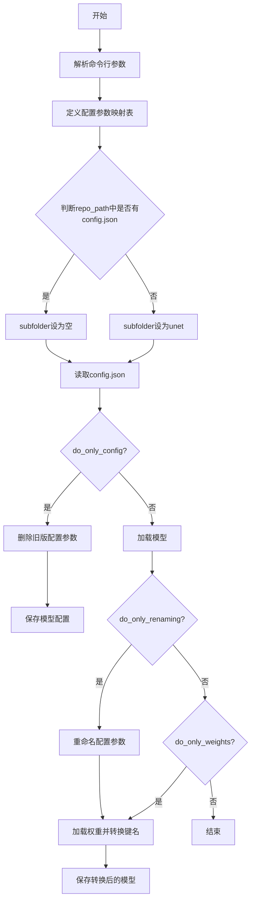
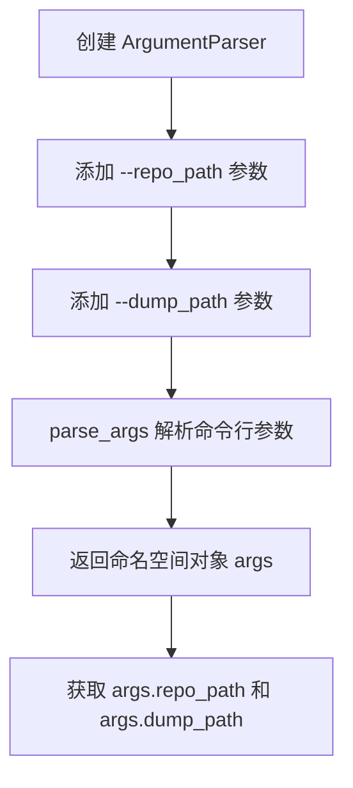
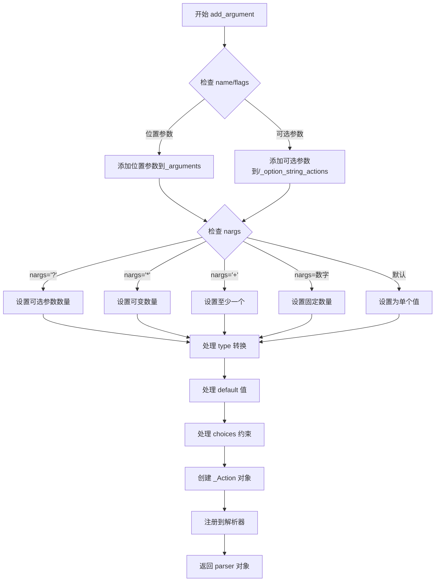
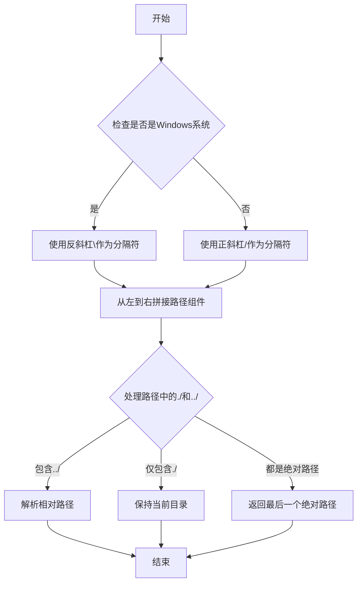
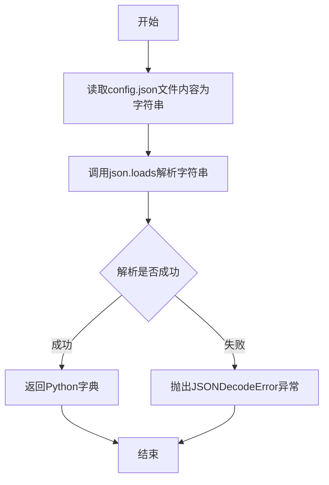
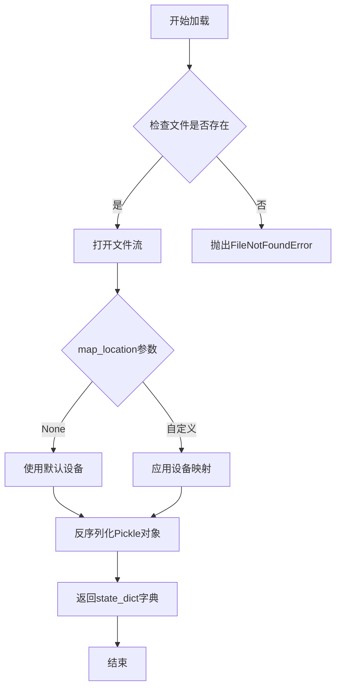
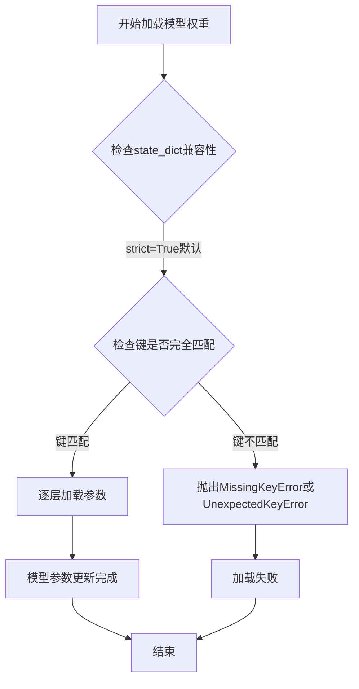
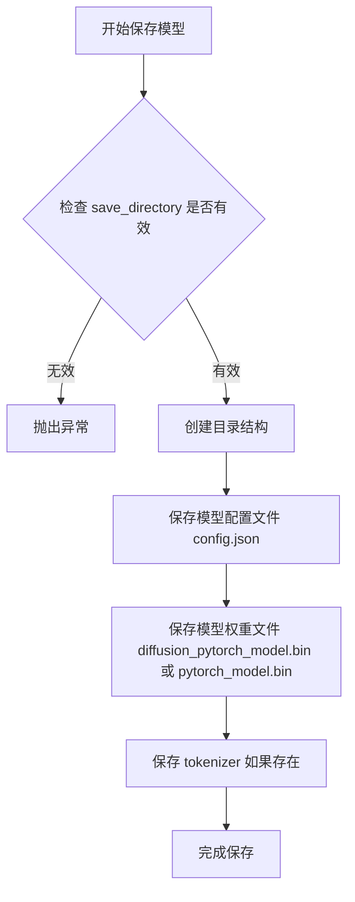

# `diffusers\scripts\change_naming_configs_and_checkpoints.py` 详细设计文档

这是一个用于将旧版LDM（Latent Diffusion Models）检查点转换为新版diffusers格式的脚本，主要完成配置参数映射、模型权重键名转换和模型保存等功能。

## 整体流程



## 类结构

```
脚本文件（无类继承结构）
└── 主程序入口 (if __name__ == "__main__")
    ├── 配置参数映射字典
    ├── 权重键名映射字典
    └── 模型加载与保存逻辑
```

## 全局变量及字段


### `do_only_config`
    
控制是否仅处理配置

类型：`bool`
    


### `do_only_weights`
    
控制是否仅处理权重

类型：`bool`
    


### `do_only_renaming`
    
控制是否仅重命名

类型：`bool`
    


### `config_parameters_to_change`
    
配置参数旧到新名称映射字典

类型：`dict`
    


### `key_parameters_to_change`
    
权重键名旧到新名称映射字典

类型：`dict`
    


### `repo_path`
    
输入模型仓库路径

类型：`str`
    


### `dump_path`
    
输出模型路径

类型：`str`
    


### `subfolder`
    
子文件夹路径

类型：`str`
    


### `config`
    
模型配置字典

类型：`dict`
    


### `model`
    
UNet2DModel或UNet2DConditionModel实例

类型：`UNet2DModel/UNet2DConditionModel`
    


### `state_dict`
    
原始模型权重字典

类型：`dict`
    


### `new_state_dict`
    
转换后的模型权重字典

类型：`dict`
    


    

## 全局函数及方法


### `argparse.ArgumentParser`

`argparse.ArgumentParser` 是 Python 标准库中的命令行参数解析器，用于定义和解析命令行参数和选项。在该代码中，它用于创建一个解析器，以接收转换脚本所需的 `repo_path` 和 `dump_path` 参数。

参数：

- 无直接参数传递给构造函数（使用默认参数）

添加的参数：

- `--repo_path`：`str`，必需参数，指向包含模型配置的目录路径
- `--dump_path`：`str`，必需参数，指向输出模型的保存路径

返回值：`ArgumentParser`，返回配置好的参数解析器对象

#### 流程图



#### 带注释源码

```python
# 创建参数解析器，description 可以省略，使用默认描述
parser = argparse.ArgumentParser()

# 添加第一个命令行参数：repo_path
# --repo_path: 参数名
# default=None: 默认值为 None
# type=str: 参数类型为字符串
# required=True: 该参数为必需参数
# help: 帮助信息，描述参数用途
parser.add_argument(
    "--repo_path",
    default=None,
    type=str,
    required=True,
    help="The config json file corresponding to the architecture.",
)

# 添加第二个命令行参数：dump_path
# --dump_path: 参数名
# default=None: 默认值为 None
# type=str: 参数类型为字符串
# required=True: 该参数为必需参数
# help: 帮助信息，描述参数用途
parser.add_argument(
    "--dump_path",
    default=None,
    type=str,
    required=True,
    help="Path to the output model.",
)

# 解析命令行传入的参数
# 返回一个命名空间对象，其中属性名为参数名（去掉前缀--），属性值为传入的值
args = parser.parse_args()

# 访问解析后的参数
# args.repo_path: 获取 repo_path 参数的值
# args.dump_path: 获取 dump_path 参数的值
```


### `parser.add_argument`

`parser.add_argument` 是 Python 标准库 `argparse` 模块中的方法，用于向命令行参数解析器添加一个参数。该方法允许定义参数的名称、类型、默认值、是否必需以及帮助信息等。

参数：

- `name or flags`：`str` 或 `list`，参数的名字或选项标志（例如 `--repo_path` 或 `-v`）
- `action`：`str`，指定参数被匹配时的操作类型（如 `store_true`、`append` 等）
- `nargs`：`int` 或 `str`，指定参数应消耗的命令行参数个数
- `const`：`any`，用于某些 action 和 nargs 组合的常量值
- `default`：`any`，当参数未在命令行出现时使用的默认值
- `type`：`callable`，将参数从字符串转换为所需的类型
- `choices`：`iterable`，限制参数值必须是指定集合中的元素
- `required`：`bool`，命令行参数是否必须（仅对可选参数有效）
- `help`：`str`，参数的可读描述，用于生成帮助信息
- `metavar`：`str`，在用法消息中显示的参数名称
- `dest`：`str`，用于在解析结果中访问该参数的属性名

返回值：`ArgumentParser`（具体为 `argparse.ArgumentParser` 实例），返回调用此方法的解析器对象，以便进行链式调用

#### 流程图



#### 带注释源码

```python
# 示例代码展示 parser.add_argument 的典型用法

# 创建参数解析器
parser = argparse.ArgumentParser(description="模型转换脚本")

# 第一个 add_argument 调用：添加 repo_path 参数
parser.add_argument(
    "--repo_path",          # 参数名（可选参数格式：--开头）
    default=None,           # 默认值为 None
    type=str,               # 参数类型转换为字符串
    required=True,          # 该参数为必需参数
    help="The config json file corresponding to the architecture."  # 帮助文档
)

# 第二个 add_argument 调用：添加 dump_path 参数
parser.add_argument(
    "--dump_path",          # 参数名
    default=None,           # 默认值
    type=str,               # 类型
    required=True,          # 必需参数
    help="Path to the output model."  # 帮助信息
)

# 解析命令行参数
args = parser.parse_args()

# 访问参数值
repo_path = args.repo_path
dump_path = args.dump_path

# 内部实现机制（argparse 简化版逻辑）
"""
def add_argument(self, *args, **kwargs):
    # 1. 解析参数名称或标志
    if args[0].startswith('-'):
        # 可选参数处理
        self._option_string_actions[args[0]] = action
    else:
        # 位置参数处理
        self._positionals.append(action)
    
    # 2. 设置参数属性
    action.dest = kwargs.get('dest', default_dest)
    action.default = kwargs.get('default')
    action.type = kwargs.get('type', str)
    action.required = kwargs.get('required', False)
    action.help = kwargs.get('help')
    
    # 3. 返回解析器以支持链式调用
    return self
"""
```


### `os.path.join`

路径拼接函数，用于将多个路径组件智能地拼接成一个完整的路径。在 Linux/macOS 上使用正斜杠 `/`，在 Windows 上使用反斜杠 `\`。

参数：

- `*paths`：`str`，可变数量的路径组件，可以是任意多个字符串路径
- `args.repo_path`：`str`，仓库的基础路径
- `subfolder`：`str`，子文件夹名称（当 config.json 不在根目录时使用）
- `filename`：`str`，要拼接的文件名（如 "config.json" 或 "diffusion_pytorch_model.bin"）

返回值：`str`，返回拼接后的完整路径字符串

#### 流程图



#### 带注释源码

```python
# 代码中的实际使用示例 - 第48行和第55行
# 用途：构建 config.json 文件的完整路径
with open(os.path.join(args.repo_path, subfolder, "config.json"), "r", encoding="utf-8") as reader:
    text = reader.read()
    config = json.loads(text)

# 代码中的实际使用示例 - 第59行
# 用途：保存模型配置的目录路径
if do_only_config:
    model.save_config(os.path.join(args.repo_path, subfolder))

# 代码中的实际使用示例 - 第77行
# 用途：加载预训练模型权重文件路径
state_dict = torch.load(os.path.join(args.repo_path, subfolder, "diffusion_pytorch_model.bin"))

# 代码中的实际使用示例 - 第85行
# 用途：保存转换后的模型权重路径
model.save_pretrained(os.path.join(args.repo_path, subfolder))

# os.path.join 函数特性说明：
# 1. 如果任何一个组件是绝对路径，则之前的组件都会被丢弃
# 2. 会在最后添加一个尾随的斜杠（除非最后组件已经是斜杠结尾）
# 3. 在 Windows 上，会将所有反斜杠替换为正斜杠处理逻辑
# 4. 空白组件会被忽略

# 示例：
# os.path.join('/home', 'user', 'docs') -> '/home/user/docs'
# os.path.join('/home', '/user', 'docs') -> '/user/docs'  # 绝对路径会覆盖前面的
# os.path.join('/home', '', 'user') -> '/home/user'  # 空字符串会被忽略
```


### `main.read_config`

该代码段是转换脚本的核心文件读取操作，用于从预训练的LDM检查点加载配置文件（config.json），并将JSON内容解析为Python字典，以便后续模型初始化和权重转换使用。

参数：

- `repo_path`：`str`，命令行参数 `--repo_path`，指向包含模型配置和权重的仓库路径
- `subfolder`：`str`，根据 `has_file` 检查结果确定的子文件夹路径（为空字符串或 "unet"）
- `filename`：`str`，要读取的文件名（默认为 "config.json"）

返回值：`dict`，返回解析后的配置字典

#### 流程图

```mermaid
flowchart TD
    A[开始读取配置文件] --> B{检查config.json是否存在于repo_path根目录}
    B -->|是| C[设置subfolder为空字符串]
    B -->|否| D[设置subfolder为unet]
    C --> E[构建文件路径: os.path.join(repo_path, subfolder, config.json)]
    D --> E
    E --> F[以UTF-8编码打开文件]
    F --> G[读取文件内容到text变量]
    G --> H[使用json.loads解析JSON文本为Python字典]
    H --> I[返回配置字典config]
```

#### 带注释源码

```python
# 根据has_file检查结果确定子文件夹路径
# 如果repo_path根目录存在config.json，则subfolder为空字符串
# 否则使用"unet"作为子文件夹（用于处理diffusers格式的模型）
subfolder = "" if has_file(args.repo_path, "config.json") else "unet"

# 使用os.path.join构建跨平台兼容的文件路径
# 组合repo_path、subfolder和config.json文件名
config_file_path = os.path.join(args.repo_path, subfolder, "config.json")

# 以只读模式和UTF-8编码打开配置文件
# 使用with语句确保文件正确关闭
with open(config_file_path, "r", encoding="utf-8") as reader:
    # 读取整个文件内容为字符串
    text = reader.read()
    # 将JSON格式的字符串解析为Python字典
    config = json.loads(text)

# config现在是一个Python字典，包含模型配置参数
# 例如: image_size, num_res_blocks, block_channels等
```

---

### 全局变量和脚本级配置

在代码顶层定义了几个全局控制变量：

- `do_only_config`：`bool`，全局标志，控制是否仅处理配置文件（默认为 False）
- `do_only_weights`：`bool`，全局标志，控制是否仅处理权重文件（默认为 True）
- `do_only_renaming`：`bool`，全局标志，控制是否仅执行键名重命名操作（默认为 False）

这些变量在脚本运行时控制不同的处理流程分支。

---

### 关键组件信息

| 名称 | 一句话描述 |
|------|-----------|
| `config_parameters_to_change` | 配置文件参数名称映射字典，用于旧版LDM配置到新版Diffusers配置的转换 |
| `key_parameters_to_change` | 模型权重键名映射字典，处理权重名称的兼容性问题 |
| `UNet2DConditionModel` | HuggingFace Diffusers库中的条件UNet2D模型类，用于文本到图像生成 |
| `UNet2DModel` | HuggingFace Diffusers库中的基础UNet2D模型类 |

---

### 潜在的技术债务或优化空间

1. **硬编码的模型类判断逻辑**：使用 `"ldm-text2im-large-256" in args.repo_path` 判断模型类型不够优雅，应从配置中推断或使用更明确的参数
2. **魔法字符串和魔法数字**：多处使用硬编码的字符串（如 "diffusion_pytorch_model.bin"），建议提取为常量
3. **全局可变状态**：`do_only_config` 等全局变量在模块级别修改，可能导致意外行为
4. **缺少错误处理**：文件读取和JSON解析部分缺乏异常处理机制
5. **权重过滤逻辑不完整**：当前跳过了 `.op.bias` 和 `.op.weight` 的参数，但没有文档说明这些参数的具体用途

---

### 其它项目

#### 设计目标与约束
- 将LDM（Latent Diffusion Models）检查点转换为HuggingFace Diffusers格式
- 支持配置和权重的分别处理或组合处理
- 确保与新版Diffusers API的兼容性

#### 错误处理与异常设计
- 当前代码缺乏try-except保护
- 建议添加：文件不存在、JSON解析失败、模型权重加载失败等异常处理
- 建议添加参数验证（如检查repo_path是否存在）

#### 数据流与状态机
```
输入: repo_path (LDM检查点目录)
  ↓
判断config.json位置 → 确定subfolder
  ↓
读取config.json → 解析为dict
  ↓
根据配置创建模型对象 (UNet2DModel 或 UNet2DConditionModel)
  ↓
处理权重 (根据do_only_*标志选择性执行)
  ↓
输出: 转换后的模型保存到dump_path
```

#### 外部依赖与接口契约
- **torch**：用于加载模型权重 (`torch.load`)
- **transformers**：使用 `file_utils.has_file` 检查文件存在性
- **diffusers**：导入 `UNet2DConditionModel` 和 `UNet2DModel` 模型类
- **argparse**：处理命令行参数接口


### `json.loads`

该函数是Python标准库中的JSON解析函数，用于将JSON格式的字符串解析为Python对象。在此代码中，它负责将读取的config.json文件内容从字符串格式转换为Python字典，以便后续用于模型配置。

参数：

- `text`：`str`，从config.json文件读取的JSON格式文本内容

返回值：`dict`，解析后的Python字典对象，包含模型的配置参数

#### 流程图



#### 带注释源码

```python
# 打开config.json文件，使用UTF-8编码读取
with open(os.path.join(args.repo_path, subfolder, "config.json"), "r", encoding="utf-8") as reader:
    # 读取文件的全部内容为一个字符串
    text = reader.read()
    # 使用json.loads将JSON字符串解析为Python字典对象
    # 这里将配置文件中的JSON数据转换为Python可操作的字典格式
    config = json.loads(text)
```


### `torch.load`

该函数是PyTorch内置的模型权重加载函数，用于从磁盘读取之前通过`torch.save()`保存的对象（通常是模型权重、优化器状态等）。

参数：

- `map_location`：可选参数，指定如何将张量映射到目标设备，通常用于跨设备加载（如CPU到GPU）
- `weights_only`：可选参数，默认为True，表示只加载张量、字典等基本类型，不加载Python对象

返回值：`dict`，返回包含模型权重参数的字典（state_dict）

#### 流程图



#### 带注释源码

```python
# 在提供的转换脚本中，torch.load的调用如下：
state_dict = torch.load(os.path.join(args.repo_path, subfolder, "diffusion_pytorch_model.bin"))
```

参数详解：

- `os.path.join(args.repo_path, subfolder, "diffusion_pytorch_model.bin")`：构建要加载的模型权重文件路径
  - `args.repo_path`：命令行传入的模型仓库路径
  - `subfolder`：根据config.json是否存在决定的子目录（空字符串或"unet"）
  - `"diffusion_pytorch_model.bin"`：Diffusers格式的模型权重文件名

返回值`state_dict`说明：
- 类型：字典（dict）
- 包含模型各层的参数名称（如卷积层权重、归一化层参数等）
- 在该脚本中用于后续的`model.load_state_dict(new_state_dict)`调用，将权重加载到模型中


### `model.save_config`

该方法用于将模型的配置保存到指定的目录中。在代码中，它被调用以保存 UNet2DModel 或 UNet2DConditionModel 的配置到 `args.repo_path` 下的 `subfolder` 目录中。

参数：
- `save_directory`：`str`，保存模型配置的目录路径。这里通过 `os.path.join(args.repo_path, subfolder)` 构建。

返回值：`None`，该方法通常不返回任何值，而是将配置写入指定的 JSON 文件中。

#### 流程图

```mermaid
graph TD
    A[开始] --> B[构建 save_directory 路径: os.path.join(args.repo_path, subfolder)]
    B --> C[调用 model.save_config(save_directory)]
    C --> D[方法内部将模型配置序列化为 JSON 文件]
    D --> E[结束]
```

#### 带注释源码

```python
# 判断是否只保存配置
if do_only_config:
    # 如果 do_only_config 为 True，则调用 save_config 方法保存模型配置
    # save_directory 参数由 os.path.join(args.repo_path, subfolder) 构造
    # subfolder 取决于 repo_path 中是否包含 config.json 文件：如果有则为空字符串，否则为 "unet"
    model.save_config(os.path.join(args.repo_path, subfolder))
```


### `model.load_state_dict`

加载模型权重，将转换后的状态字典（new_state_dict）加载到模型中，实现模型参数的更新和迁移。

参数：

- `new_state_dict`：`Dict[str, torch.Tensor]`，从旧格式转换而来的模型权重字典，包含模型各层的参数名称和对应的张量值

返回值：`None`，该方法在 PyTorch 中无返回值，直接修改模型内部的参数状态

#### 流程图



#### 带注释源码

```python
# 从转换后的状态字典中加载模型权重
# new_state_dict: 包含从旧格式映射到新格式的模型参数
# 例如: time_steps -> time_proj, mid -> mid_block 等键名映射
model.load_state_dict(new_state_dict)

# 此处调用的是 PyTorch nn.Module.load_state_dict() 方法
# 内部流程:
# 1. 遍历 new_state_dict 中的每个参数键值对
# 2. 检查模型当前参数形状与加载参数形状是否匹配
# 3. 将加载的参数值赋给模型对应的参数对象
# 4. 默认 strict=True，要求键名完全匹配
# 5. 加载完成后模型具备从旧检查点转换来的权重

# 加载成功后保存模型到指定目录
model.save_pretrained(os.path.join(args.repo_path, subfolder))
```


### `UNet2DConditionModel.save_pretrained` / `UNet2DModel.save_pretrained`

将模型权重和配置文件保存到指定目录，以便后续通过 `from_pretrained` 重新加载。

参数：

- `save_directory`：`str`，要保存模型的目录路径，即 `os.path.join(args.repo_path, subfolder)`

返回值：`None`，该方法直接将模型保存到磁盘，不返回任何值。

#### 流程图



#### 带注释源码

```python
# 调用 save_pretrained 方法保存模型
# 参数: save_directory = os.path.join(args.repo_path, subfolder)
# 用途: 将模型配置和权重保存到指定路径，以便后续可以通过 from_pretrained 重新加载
model.save_pretrained(os.path.join(args.repo_path, subfolder))

# 内部实现逻辑（基于 Hugging Face Transformers 库）:
# 1. 创建 save_directory 目录（如果不存在）
# 2. 将 model.config 保存为 config.json
# 3. 将模型的状态字典保存为 pytorch_model.bin
# 4. 如果存在 tokenizer，也会被保存
# 5. 保存其他元数据文件（如 model_card.txt 等）
```

## 关键组件


### 命令行参数解析

负责解析脚本的输入参数，包括repo_path（模型仓库路径）和dump_path（输出路径），并设置required=True确保必需参数被提供。

### 配置参数映射表

将旧版LDM检查点的配置参数名称映射到新版diffusers格式，包含image_size→sample_size、num_res_blocks→layers_per_block、block_channels→block_out_channels等9组映射关系。

### 状态字典键重命名逻辑

处理模型权重键的转换，将time_steps转为time_proj、mid转为mid_block、downsample_blocks转为down_blocks、upsample_blocks转为up_blocks，用于适配新的模型结构。

### 模型类型选择器

根据仓库路径判断加载UNet2DModel还是UNet2DConditionModel，当路径包含"ldm-text2im-large-256"时使用条件模型，否则使用标准模型。

### 检查点加载器

使用torch.load加载旧版的diffusion_pytorch_model.bin权重文件，并过滤掉以.op.bias和.op.weight结尾的参数（可能是操作符相关的偏差和权重）。

### 模型保存模块

将转换后的模型保存为diffusers格式，包括模型配置和权重，支持保存到指定的subfolder目录中。

### 子文件夹路径推断

通过has_file函数检测config.json的位置，如果存在于仓库根目录则subfolder为空，否则设置为"unet"，用于兼容不同的仓库结构。


## 问题及建议


### 已知问题

- **硬编码的全局变量控制标志**：代码开头的 `do_only_config`、`do_only_weights`、`do_only_renaming` 三个全局变量硬编码为 `False/True/False`，使用时需要手动修改代码，缺乏命令行参数支持，不够灵活
- **不完整的键名映射**：`key_parameters_to_change` 中的映射可能不完整或不准确，如 `"time_steps": "time_proj"` 实际应为 `"time_embed": "time_proj"`，且只处理了第一层级的键，深层嵌套的权重键可能无法正确转换
- **硬编码的特殊判断**：使用 `"ldm-text2im-large-256" in args.repo_path` 来判断模型类型，这种字符串匹配方式不够健壮，应通过配置文件或更优雅的方式判断
- **缺失的错误处理**：代码缺乏对文件不存在、JSON解析失败、模型权重加载失败等异常情况的处理
- **权重过滤可能丢失功能**：跳过 `".op.bias"` 和 `".op.weight"` 结尾的参数可能无意中丢弃某些操作层的权重，导致功能不完整
- **subfolder 判断逻辑不清晰**：`subfolder = "" if has_file(args.repo_path, "config.json") else "unet"` 的逻辑在边界情况下可能不符合预期

### 优化建议

- 将三个全局标志位改为命令行参数 `--do_only_config`、`--do_only_weights`、`--do_only_renaming`，提升脚本的可用性和灵活性
- 完善 `key_parameters_to_change` 映射表，确保覆盖所有需要转换的权重键，并对嵌套键进行递归处理
- 移除硬编码的模型类型判断逻辑，改为读取配置文件中的 `model_type` 或其他元信息来确定使用 `UNet2DConditionModel` 还是 `UNet2DModel`
- 添加 try-except 块处理文件读写、JSON解析、模型加载等可能失败的操作，并给出有意义的错误信息
- 审查权重过滤逻辑，确保不会误删必要的参数，或将其改为可配置的选项
- 优化 subfolder 判断逻辑，明确输入目录的结构预期，或支持通过参数显式指定子目录路径

## 其它


### 设计目标与约束

本脚本的主要设计目标是将LDM（Latent Diffusion Models）格式的检查点文件转换为HuggingFace diffusers库兼容的格式。具体约束包括：1）仅支持UNet2DModel和UNet2DConditionModel两种模型架构的转换；2）配置文件和权重文件需要分别处理；3）需要保持与原LDM检查点的兼容性，同时适配diffusers库的新命名规范。

### 错误处理与异常设计

脚本在以下关键位置进行异常处理：1）文件读取使用try-except捕获IOError；2）JSON解析使用json.loads捕获JSONDecodeError；3）模型加载使用torch.load捕获FileNotFoundError和pickle相关错误；4）state_dict转换时对不存在的键进行跳过处理。但整体错误处理较为简单，缺乏详细的错误信息反馈机制，建议增加更具体的异常类型捕获和错误日志记录。

### 数据流与状态机

脚本的执行流程分为四个主要阶段：配置加载阶段、模型初始化阶段、参数转换阶段和模型保存阶段。通过三个全局布尔变量（do_only_config、do_only_weights、do_only_renaming）控制执行流程，可独立执行配置转换、权重转换或仅重命名操作。数据流为：输入Repo路径 → 读取config.json → 初始化模型 → 加载权重 → 参数映射转换 → 保存到目标路径。

### 外部依赖与接口契约

本脚本依赖以下外部库：1）torch（用于模型权重加载）；2）transformers（提供file_utils.has_file函数）；3）diffusers（提供UNet2DConditionModel和UNet2DModel类）；4）argparse（命令行参数解析）；5）json和os（标准库）。接口契约要求输入的repo_path必须包含config.json或unet子目录下的配置文件和权重文件，输出路径dump_path用于保存转换后的模型。

### 性能考虑

当前实现存在以下性能优化空间：1）state_dict转换使用串行遍历，建议使用字典推导式批量处理；2）key_parameters_to_change的匹配逻辑可以预先构建映射表以减少字符串操作开销；3）对于大型模型文件，可以考虑使用torch.load的mmap选项减少内存占用；4）do_only_renaming分支存在重复的config遍历，可合并到统一流程中。

### 安全性考虑

脚本在安全性方面存在以下问题：1）直接使用torch.load加载权重文件，未验证文件来源和完整性，存在潜在的反序列化攻击风险；2）config.json解析未进行严格的Schema验证，可能导致恶意配置注入；3）文件路径拼接使用os.path.join但未对repo_path进行路径遍历攻击防护。建议增加文件完整性校验和路径安全检查。

### 测试策略

建议增加以下测试用例：1）正常流程测试：使用标准LDM检查点验证转换完整性；2）边界条件测试：处理空config、缺失权重文件、损坏的bin文件等情况；3）参数映射测试：验证每个key_parameters_to_change和config_parameters_to_change的转换准确性；4）不同模型架构测试：分别测试UNet2DModel和UNet2DConditionModel的转换；5）逆向测试：验证转换后的模型可以正确加载和推理。

### 配置管理

脚本使用硬编码的配置映射规则：config_parameters_to_change定义了9个配置参数映射，key_parameters_to_change定义了4个权重键映射。这些映射关系固定在代码中，缺乏灵活性。建议将这些映射规则外部化为独立的配置文件，支持不同版本的LDM检查点使用不同的映射规则，提高脚本的可维护性和扩展性。

### 版本兼容性

脚本需要关注以下版本兼容性：1）diffusers库版本：不同版本的UNet2DConditionModel和UNet2DModel可能存在配置参数差异；2）PyTorch版本：torch.load的兼容性在不同版本间可能有变化；3）transformers库版本：has_file函数的API可能变化。建议在脚本开头增加版本检查，明确声明支持的最低版本要求。

### 使用示例

基本用法：python convert_ldm_unet.py --repo_path /path/to/ldm/checkpoint --dump_path /path/to/output。进阶用法：1）仅转换配置：设置do_only_config=True；2）仅转换权重：设置do_only_weights=True；3）仅重命名参数：设置do_only_renaming=True。注意：当repo_path中包含"ldm-text2im-large-256"字符串时，会自动选择UNet2DConditionModel架构，否则使用UNet2DModel。

    