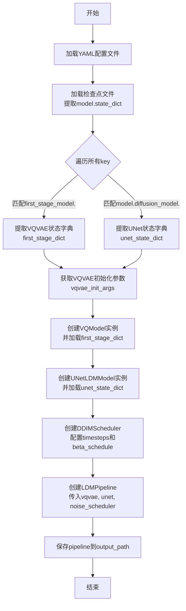
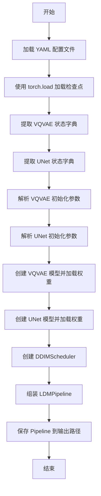
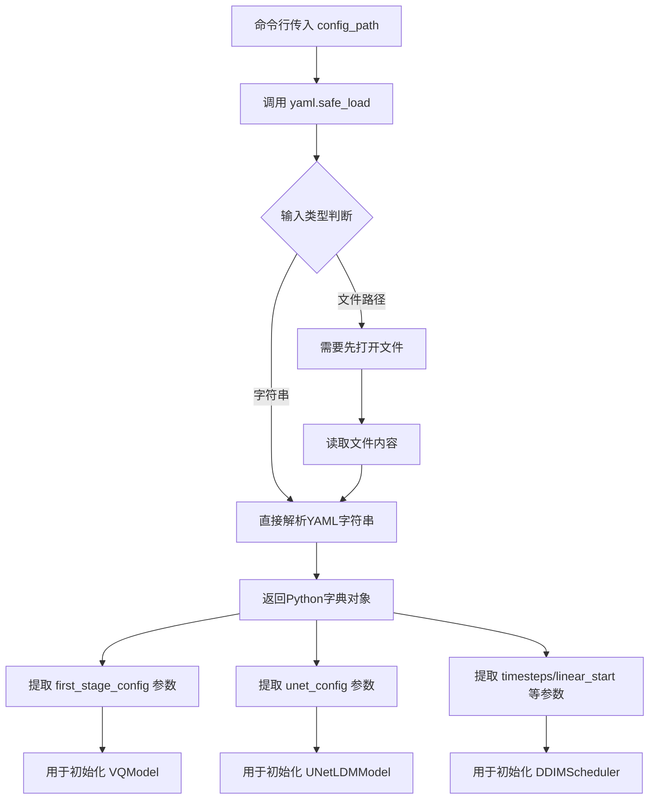
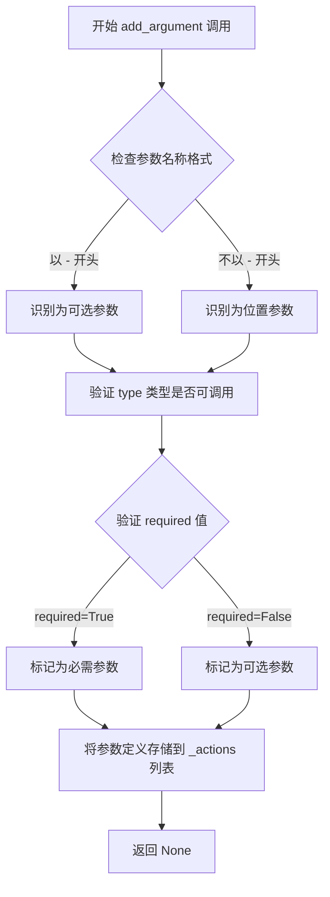
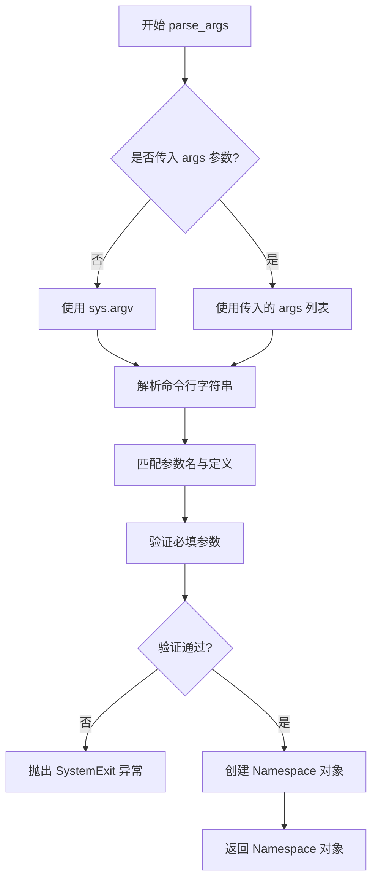

# `diffusers\scripts\conversion_ldm_uncond.py` 详细设计文档

该脚本用于将原始的LDM（Latent Diffusion Model）预训练模型转换为Diffusers库格式，主要通过解析配置文件和检查点文件，提取VQVAE和UNet的权重参数，构建LDMPipeline并保存为Diffusers兼容的模型格式。

## 整体流程

```mermaid
graph TD
    A[开始] --> B[解析命令行参数]
    B --> C[加载YAML配置文件]
    C --> D[加载PyTorch检查点文件]
    D --> E[提取first_stage_model(VQVAE)权重]
    E --> F[提取model.diffusion_model(UNet)权重]
    F --> G[解析VQVAE初始化参数]
    G --> H[解析UNet初始化参数]
    H --> I[实例化VQModel并加载权重]
    I --> J[实例化UNetLDMModel并加载权重]
    J --> K[创建DDIMScheduler]
    K --> L[构建LDMPipeline]
    L --> M[保存为Diffusers格式]
    M --> N[结束]
```

## 类结构

```
无自定义类层次结构
使用的外部类：
├── DDIMScheduler (diffusers)
├── LDMPipeline (diffusers)
├── UNetLDMModel (diffusers)
└── VQModel (diffusers)
```

## 全局变量及字段


### `config`
    
从YAML配置文件加载的模型配置参数

类型：`dict`
    


### `state_dict`
    
从检查点文件加载的完整模型状态字典

类型：`dict`
    


### `keys`
    
模型状态字典中所有键的列表

类型：`list`
    


### `first_stage_dict`
    
从完整状态字典中提取的VQVAE（第一阶段）模型状态字典

类型：`dict`
    


### `unet_state_dict`
    
从完整状态字典中提取的UNetLDM模型状态字典

类型：`dict`
    


### `vqvae_init_args`
    
VQVAE模型的初始化参数，来源于配置文件中的first_stage_config

类型：`dict`
    


### `unet_init_args`
    
UNetLDM模型的初始化参数，来源于配置文件中的unet_config

类型：`dict`
    


### `vqvae`
    
实例化的VQVAE模型，用于将图像编码到潜在空间

类型：`VQModel`
    


### `unet`
    
实例化的UNetLDM模型，用于在潜在空间执行扩散过程

类型：`UNetLDMModel`
    


### `noise_scheduler`
    
DDIM噪声调度器，控制扩散过程中的噪声添加和去除

类型：`DDIMScheduler`
    


### `pipeline`
    
整合VQVAE、UNet和噪声调度器的完整LDM推理管道

类型：`LDMPipeline`
    


### `args`
    
命令行参数命名空间对象，包含checkpoint_path、config_path和output_path

类型：`argparse.Namespace`
    


    

## 全局函数及方法


### `convert_ldm_original`

该函数用于将原始的LDM（Latent Diffusion Model）检查点文件转换为HuggingFace Diffusers库支持的LDMPipeline格式，主要完成模型权重提取、模型初始化和pipeline保存的完整转换流程。

参数：

- `checkpoint_path`：`str`，原始LDM模型的检查点文件路径
- `config_path`：`str`，包含模型配置的YAML文件路径
- `output_path`：`str`，转换后的Diffusers格式pipeline输出目录路径

返回值：`None`，该函数直接保存模型到指定路径，无返回值

#### 流程图



#### 带注释源码

```python
def convert_ldm_original(checkpoint_path, config_path, output_path):
    """
    将原始LDM检查点转换为Diffusers格式的Pipeline
    
    参数:
        checkpoint_path: 原始LDM模型的检查点文件路径
        config_path: 包含模型配置的YAML文件路径
        output_path: 转换后Pipeline的输出目录路径
    """
    
    # 步骤1: 加载YAML配置文件，解析模型参数
    config = yaml.safe_load(config_path)
    
    # 步骤2: 加载检查点文件，提取模型权重字典
    # torch.load将权重加载到CPU内存
    state_dict = torch.load(checkpoint_path, map_location="cpu")["model"]
    
    # 获取所有权重键名列表
    keys = list(state_dict.keys())

    # 步骤3: 从完整state_dict中提取VQVAE（first_stage_model）部分
    # VQVAE负责将图像编码到潜在空间
    first_stage_dict = {}
    first_stage_key = "first_stage_model."  # VQVAE权重的前缀标识
    for key in keys:
        if key.startswith(first_stage_key):
            # 移除前缀，转换为Diffusers格式的键名
            first_stage_dict[key.replace(first_stage_key, "")] = state_dict[key]

    # 步骤4: 从完整state_dict中提取UNet（diffusion_model）部分
    # UNet负责潜在空间的去噪过程
    unet_state_dict = {}
    unet_key = "model.diffusion_model."  # UNet权重的前缀标识
    for key in keys:
        if key.startswith(unet_key):
            # 移除前缀，转换为Diffusers格式的键名
            unet_state_dict[key.replace(unet_key, "")] = state_dict[key]

    # 步骤5: 从配置中提取VQVAE和UNet的初始化参数
    # 这些参数来自config["model"]["params"]下的配置
    vqvae_init_args = config["model"]["params"]["first_stage_config"]["params"]
    unet_init_args = config["model"]["params"]["unet_config"]["params"]

    # 步骤6: 使用提取的权重初始化VQVAE模型并设置为评估模式
    vqvae = VQModel(**vqvae_init_args).eval()
    vqvae.load_state_dict(first_stage_dict)

    # 步骤7: 使用提取的权重初始化UNet模型并设置为评估模式
    unet = UNetLDMModel(**unet_init_args).eval()
    unet.load_state_dict(unet_state_dict)

    # 步骤8: 创建DDIM调度器
    # 配置噪声调度的时间步、beta schedule等参数
    noise_scheduler = DDIMScheduler(
        timesteps=config["model"]["params"]["timesteps"],
        beta_schedule="scaled_linear",
        beta_start=config["model"]["params"]["linear_start"],
        beta_end=config["model"]["params"]["linear_end"],
        clip_sample=False,
    )

    # 步骤9: 组装完整的LDM Pipeline
    # 包含VQVAE编码器、UNet去噪模型和噪声调度器
    pipeline = LDMPipeline(vqvae, unet, noise_scheduler)
    
    # 步骤10: 将Pipeline保存为Diffusers格式
    # 会自动保存各组件的权重和配置文件
    pipeline.save_pretrained(output_path)
```


### `convert_ldm_original`

该函数用于将原始的 LDM（Latent Diffusion Model）模型检查点转换为 Hugging Face diffusers 库格式的 Pipeline，以便使用 diffusers 框架进行推理和微调。

参数：

- `checkpoint_path`：`str`，原始 LDM 模型的检查点文件路径（.pt 或 .pth 格式）
- `config_path`：`str`，YAML 格式的模型配置文件路径，包含模型结构和初始化参数
- `output_path`：`str`，转换后的 diffusers Pipeline 输出目录路径

返回值：`None`，该函数无返回值（直接保存模型到指定路径）

#### 流程图



#### 带注释源码

```python
def convert_ldm_original(checkpoint_path, config_path, output_path):
    """
    将原始 LDM 检查点转换为 diffusers 格式的 Pipeline
    
    参数:
        checkpoint_path: 原始模型检查点文件路径
        config_path: 模型配置文件路径 (YAML格式)
        output_path: 输出目录路径
    """
    # 1. 加载 YAML 配置文件获取模型架构参数
    config = yaml.safe_load(config_path)
    
    # 2. 加载检查点文件，提取模型状态字典
    # map_location="cpu" 表示将模型权重加载到 CPU 内存
    state_dict = torch.load(checkpoint_path, map_location="cpu")["model"]
    keys = list(state_dict.keys())

    # 3. 从完整状态字典中提取 VQVAE (first stage) 的权重
    first_stage_dict = {}
    first_stage_key = "first_stage_model."
    for key in keys:
        if key.startswith(first_stage_key):
            # 移除前缀 "first_stage_model." 以匹配新模型结构
            first_stage_dict[key.replace(first_stage_key, "")] = state_dict[key]

    # 4. 从完整状态字典中提取 UNet (diffusion model) 的权重
    unet_state_dict = {}
    unet_key = "model.diffusion_model."
    for key in keys:
        if key.startswith(unet_key):
            # 移除前缀 "model.diffusion_model." 以匹配新模型结构
            unet_state_dict[key.replace(unet_key, "")] = state_dict[key]

    # 5. 从配置中提取 VQVAE 和 UNet 的初始化参数
    vqvae_init_args = config["model"]["params"]["first_stage_config"]["params"]
    unet_init_args = config["model"]["params"]["unet_config"]["params"]

    # 6. 创建 VQVAE 模型并加载提取的权重
    vqvae = VQModel(**vqvae_init_args).eval()  # eval 模式用于推理
    vqvae.load_state_dict(first_stage_dict)

    # 7. 创建 UNet 模型并加载提取的权重
    unet = UNetLDMModel(**unet_init_args).eval()  # eval 模式用于推理
    unet.load_state_dict(unet_state_dict)

    # 8. 创建噪声调度器 (DDIM Scheduler)
    noise_scheduler = DDIMScheduler(
        timesteps=config["model"]["params"]["timesteps"],
        beta_schedule="scaled_linear",
        beta_start=config["model"]["params"]["linear_start"],
        beta_end=config["model"]["params"]["linear_end"],
        clip_sample=False,
    )

    # 9. 组装完整的 Pipeline 并保存
    pipeline = LDMPipeline(vqvae, unet, noise_scheduler)
    pipeline.save_pretrained(output_path)
```

#### 关键组件信息

| 组件名称 | 描述 |
|---------|------|
| `VQModel` | VQVAE (Vector Quantized Variational AutoEncoder) 模型，用于将图像编码到潜在空间 |
| `UNetLDMModel` | UNet 结构的扩散模型，负责潜在空间的去噪过程 |
| `DDIMScheduler` | DDIM (Denoising Diffusion Implicit Models) 噪声调度器，控制去噪步骤 |
| `LDMPipeline` | 整合 VQVAE、UNet 和调度器的完整推理 Pipeline |

#### 潜在技术债务与优化空间

1. **硬编码的调度器参数**：beta_schedule、beta_start、beta_end 等参数应从配置文件中读取，而非硬编码
2. **缺乏错误处理**：未对文件不存在、模型权重不匹配等情况进行异常捕获
3. **内存效率**：对于大型模型，可考虑使用 `torch.load(..., weights_only=True)` 并实现分片加载
4. **类型注解缺失**：函数参数和返回值缺少类型提示，建议添加以提升代码可维护性
5. **设备兼容性**：当前仅支持 CPU 加载，可增加 CUDA/MPS 设备选择支持


### `yaml.safe_load`

该函数是PyYAML库的核心函数，用于将YAML格式的配置文件安全地加载为Python字典对象，从而使得配置参数能够在程序中被访问和利用。

参数：

- `stream`：`str` 或 `file-like object`，由外部传入的 `config_path`（命令行参数 `--config_path`），表示YAML配置文件的路径或已打开的文件对象

返回值：`dict`，解析后的YAML配置内容，包含了模型的各种参数配置（如 `model.params.first_stage_config.params`、`model.params.unet_config.params` 等）

#### 流程图



#### 带注释源码

```python
# 从命令行参数中获取配置文件路径
# config_path 类型为 str，值为配置文件在文件系统中的路径
config_path = args.config_path  # 例如: "./configs/ldm.yaml"

# 调用 yaml.safe_load 函数加载 YAML 配置文件
# 注意：这里直接传入文件路径字符串给 safe_load 可能会导致问题
# 正确做法应该是: open(config_path) 或 open(config_path).read()
# 但在某些上下文或误用情况下，可能会传入文件内容字符串
config = yaml.safe_load(config_path)

# 返回的 config 是一个字典对象，包含了 YAML 文件中定义的所有配置项
# 例如: config["model"]["params"]["first_stage_config"]["params"]
#       config["model"]["params"]["unet_config"]["params"]
#       config["model"]["params"]["timesteps"]
#       config["model"]["params"]["linear_start"]
#       config["model"]["params"]["linear_end"]
```


### `parser.add_argument`

`parser.add_argument` 是 `argparse.ArgumentParser` 类的方法，用于定义命令行参数。该方法接收位置参数（参数名称）和关键字参数（如类型、是否必需等），并返回 `None`，其主要作用是将参数定义添加到解析器中，以便后续通过 `parse_args()` 方法提取用户提供的命令行输入。

#### 流程图



#### 带注释源码

```python
# 代码中的三个 add_argument 调用示例：

# 1. 定义 checkpoint_path 参数（必需）
parser.add_argument(
    "--checkpoint_path",  # 参数名称（可选参数格式，带双破折号）
    type=str,              # 参数类型：字符串类型
    required=True          # 是否必需：必需参数
)
# 解析器内部会将此参数定义添加到 _actions 列表中
# 返回值：None

# 2. 定义 config_path 参数（必需）
parser.add_argument(
    "--config_path",      # 参数名称
    type=str,             # 参数类型
    required=True         # 必需参数
)

# 3. 定义 output_path 参数（必需）
parser.add_argument(
    "--output_path",      # 参数名称
    type=str,             # 参数类型
    required=True         # 必需参数
)
```

#### 详细参数说明

| 参数名称 | 参数类型 | 参数描述 |
|---------|---------|---------|
| `--checkpoint_path` | `str` | LDM 模型检查点文件的路径，类型为字符串，必需参数 |
| `--config_path` | `str` | LDM 配置文件（YAML）的路径，类型为字符串，必需参数 |
| `--output_path` | `str` | 转换后的输出目录路径，类型为字符串，必需参数 |

#### 返回值

- **返回值类型**: `None`
- **返回值描述**: `add_argument` 方法不返回任何值，它修改 `ArgumentParser` 对象的内部状态，将参数定义添加到其 `_actions` 列表中。后续通过 `parse_args()` 方法调用时，会根据这些定义解析命令行参数并返回 `Namespace` 对象。


### `ArgumentParser.parse_args`

该方法是 `argparse.ArgumentParser` 类的成员方法，用于解析命令行参数，将命令行字符串转换为对象属性并返回包含这些属性的命名空间（Namespace）对象。在本代码中，它解析 `--checkpoint_path`、`--config_path` 和 `--output_path` 三个必需参数。

参数：
-  `args`：列表（可选），要解析的字符串列表，默认为 `None`（从 `sys.argv` 自动获取）。若提供，则解析指定列表而非命令行参数。

返回值：`Namespace`，返回一个命名空间对象，其属性对应命令行中定义的参数（在本例中为 `checkpoint_path`、`config_path`、`output_path`）。

#### 流程图



#### 带注释源码

```
# argparse.ArgumentParser.parse_args 方法源码解析

def parse_args(self, args=None, namespace=None):
    """
    解析命令行参数
    
    参数:
        args: 可选的字符串列表，默认从 sys.argv 读取
        namespace: 可选的命名空间对象，用于填充解析结果
    
    返回:
        Namespace: 包含解析后属性的命名空间对象
    """
    
    # 1. 确定要解析的参数列表
    if args is None:
        # 未传入参数时，默认使用 sys.argv[1:]（跳过脚本名）
        args = sys.argv[1:]
    
    # 2. 解析参数字符串
    #    将 '--checkpoint_path value1 --config_path value2' 格式
    #    转换为 {'checkpoint_path': 'value1', 'config_path': 'value2'}
    namespace = self._parse_common(args, namespace)
    
    # 3. 检查剩余的未解析参数
    #    如果有未定义的参数，默认会报错（除非 allow_abbrev 为 True）
    if self._remaining_args:
        msg = 'unrecognized arguments: %s'
        self.error(msg % ' '.join(self._remaining_args))
    
    # 4. 返回包含解析结果的命名空间对象
    #    在本代码中返回: 
    #    Namespace(checkpoint_path='...', config_path='...', output_path='...')
    return namespace
```

#### 在本代码中的具体使用

```python
# 创建参数解析器
parser = argparse.ArgumentParser()

# 添加三个必需的命令行参数
parser.add_argument("--checkpoint_path", type=str, required=True)
parser.add_argument("--config_path", type=str, required=True)
parser.add_argument("--output_path", type=str, required=True)

# 解析命令行参数
# 等同于: python script.py --checkpoint_path <path> --config_path <path> --output_path <path>
args = parser.parse_args()

# 解析后 args 是一个 Namespace 对象，等价于:
# args.checkpoint_path  # 获取 --checkpoint_path 的值
# args.config_path     # 获取 --config_path 的值
# args.output_path     # 获取 --output_path 的值

# 传递给主函数
convert_ldm_original(args.checkpoint_path, args.config_path, args.output_path)
```

#### 关键点说明

| 项目 | 说明 |
|------|------|
| 参数来源 | 默认从 `sys.argv[1:]` 自动获取（即命令行输入） |
| 返回类型 | `argparse.Namespace` 对象，非字典 |
| 错误处理 | 参数缺失或类型错误时自动打印帮助信息并退出（`SystemExit`） |
| 必填参数 | `required=True` 的参数缺失时会在解析时报错 |

## 关键组件


### 配置加载与解析

从YAML文件加载模型配置参数，并从PyTorch检查点文件中提取模型状态字典。这是整个转换流程的起点，为后续的模型初始化提供必要的配置信息。

### VQVAE状态字典提取

从完整的状态字典中筛选出以"first_stage_model."开头的键，并移除前缀，生成专门用于VQVAE模型的状态字典。这是分离第一阶段（VQVAE/LDM的潜在空间编码器）权重的重要步骤。

### UNet状态字典提取

从完整的状态字典中筛选出以"model.diffusion_model."开头的键，并移除前缀，生成专门用于UNet扩散模型的状态字典。这是分离核心扩散模型权重的关键步骤。

### VQModel模型初始化与权重加载

根据配置文件中的first_stage_config参数初始化VQModel，并将提取的VQVAE状态字典加载到模型中。模型被设置为评估模式(eval())，用于推理而非训练。

### UNetLDMModel模型初始化与权重加载

根据配置文件中的unet_config参数初始化UNetLDMModel，并将提取的UNet状态字典加载到模型中。模型同样设置为评估模式。

### DDIMScheduler调度器配置

根据配置中的timesteps、beta_schedule、beta_start、beta_end等参数创建DDIMScheduler，用于控制扩散过程中的噪声调度策略。

### LDMPipeline管道构建与保存

将VQVAE、UNet和调度器组装成LDMPipeline，并调用save_pretrained方法将整个管道保存为Hugging Face diffusers格式，包括模型权重和配置文件。


## 问题及建议


### 已知问题

-   **缺少异常处理**：代码未对文件读取、模型加载、状态字典提取等关键操作进行try-except包装，任意一步失败都会导致程序崩溃且无明确错误信息
-   **硬编码配置值**：`beta_schedule="scaled_linear"`和`clip_sample=False`被硬编码，未从原始config中读取，可能导致转换后的模型行为与原始模型不一致
-   **状态字典加载无验证**：`load_state_dict()`后未检查`strict=True`（默认）的加载结果，可能静默忽略权重不匹配问题
-   **无执行日志**：缺少任何日志输出，用户无法了解转换进度和中间状态，排查问题困难
-   **类型提示缺失**：函数参数和返回值均无类型注解，降低代码可维护性和IDE支持
-   **无输入校验**：未验证checkpoint_path和config_path指向的文件是否存在、config结构是否符合预期

### 优化建议

-   **添加异常处理**：对文件加载、模型初始化、状态字典操作等关键步骤添加try-except，提供有意义的错误信息
-   **从配置读取调度器参数**：从config中读取`beta_schedule`、`clip_sample`等参数，而非硬编码，确保行为一致性
-   **验证模型加载**：使用`load_state_dict(strict=False)`后检查missing_keys和unexpected_keys，或记录加载结果
-   **添加进度日志**：使用logging模块记录关键步骤（配置文件解析、状态字典提取、模型初始化、保存完成等）
-   **添加类型注解**：为函数参数和返回值添加类型提示，提升代码可读性
-   **增加输入校验**：在开始时检查文件存在性、config结构完整性，必要时提供友好的错误提示
-   **考虑添加单元测试**：针对状态字典提取逻辑、键过滤等核心功能编写测试用例


## 其它


### 设计目标与约束

该代码的主要目标是将原始的LDM（Latent Diffusion Model）预训练模型转换为Hugging Face Diffusers库格式的pipeline，以便用户能够使用Diffusers库的标准接口进行推理和微调。约束条件包括：1) 输入的checkpoint必须是包含完整模型权重的pth文件；2) 配置文件必须为YAML格式且包含model.params.first_stage_config.params、model.params.unet_config.params以及timesteps、linear_start、linear_end等必要参数；3) 输出路径需要是可写的目录路径。

### 错误处理与异常设计

代码目前缺乏显式的错误处理机制，存在多处可能的异常点需要改进：1) YAML配置文件解析失败（yaml.safe_load可能抛出异常）；2) torch.load加载checkpoint失败（文件不存在或格式错误）；3) 配置文件缺少必要字段导致KeyError；4) VQModel和UNetLDMModel加载权重时形状不匹配；5) 输出目录不存在或无写入权限。建议添加try-except块捕获FileNotFoundError、KeyError、RuntimeError等异常，并提供清晰的错误提示信息。

### 数据流与状态机

数据流主要分为四个阶段：1) 读取阶段：加载YAML配置文件和PyTorch检查点文件到内存；2) 提取阶段：从完整state_dict中分别筛选出first_stage_model（前缀为"first_stage_model."）和diffusion_model（前缀为"model.diffusion_model."）的权重；3) 初始化阶段：根据配置参数分别创建VQModel和UNetLDMModel实例，并加载对应的state_dict；4) 构建阶段：创建DDIMScheduler并将所有组件组合为LDMPipeline，最后保存到指定输出路径。状态机相对简单，无复杂的条件分支，主要为线性流程。

### 外部依赖与接口契约

代码依赖以下外部库：1) argparse（标准库）：用于命令行参数解析；2) torch：用于加载模型权重；3) yaml：用于解析配置文件；4) diffusers：Hugging Face Diffusers库的核心组件，包括DDIMScheduler、LDMPipeline、UNetLDMModel、VQModel。接口契约方面：checkpoint_path必须指向包含"model"键的pth文件；config_path必须指向包含model.params结构的YAML文件；output_path必须是可写入的目录路径。转换后的模型可通过LDMPipeline.from_pretrained(output_path)加载使用。

### 性能考虑

当前实现为一次性转换脚本，主要性能考量在内存占用方面：大模型权重全部加载到CPU内存，建议在内存充足的环境运行。VQVAE和UNet分别加载可降低峰值内存。优化方向包括：1) 使用torch.load时添加map_location参数已实现CPU加载；2) 模型.eval()设置已正确；3) 可考虑添加权重分片加载支持超大模型；4) 可添加进度条显示转换进度。

### 安全性考虑

代码从文件系统读取模型文件，需要注意：1) 输入路径需验证存在性；2) 配置文件解析YAML需防止恶意构造的YAML导致代码执行（yaml.safe_load已处理）；3) 输出目录需有写入权限；4) 不存在网络传输或敏感数据处理，风险较低。建议添加路径存在性检查和权限验证。

### 兼容性考虑

该代码需要与特定版本的Diffusers库兼容。当前使用的API（LDMPipeline、UNetLDMModel）可能在不同版本的diffusers中有所变化。兼容性说明：1) 需要diffusers>=0.10.0版本；2) VQModel和UNetLDMModel的具体参数取决于原始训练配置；3) DDIMScheduler的beta_schedule参数"scaled_linear"需要diffusers版本支持。建议在requirements.txt中锁定diffusers版本，并提供版本兼容性测试。

### 版本历史与变更记录

初始版本v1.0：实现基础的LDM模型转换功能，支持从原始checkpoint提取VQVAE和UNet权重，配置DDIMScheduler并保存为Diffusers格式。该版本为功能原型，缺少错误处理和优化。

    