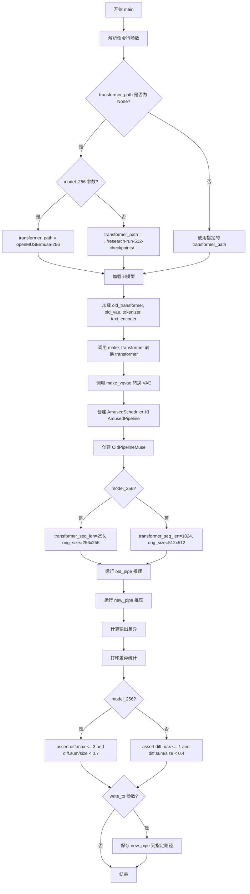
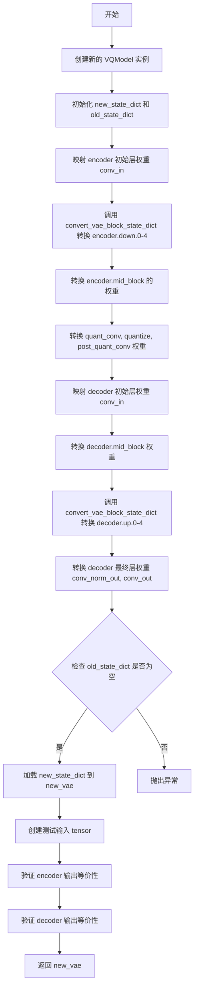
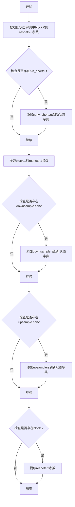
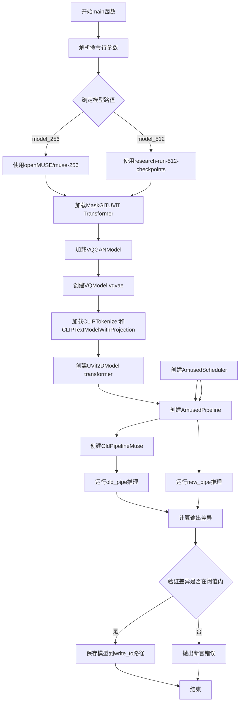
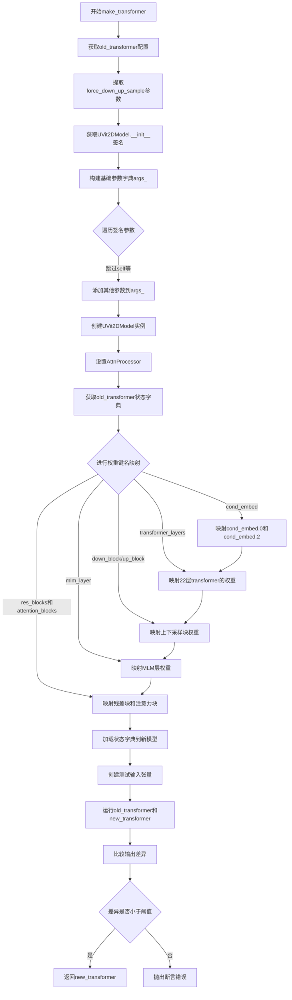
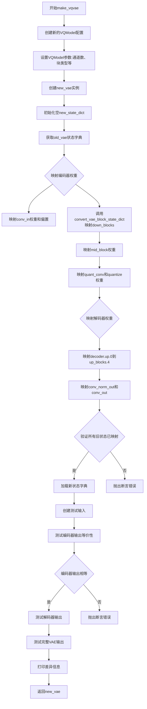
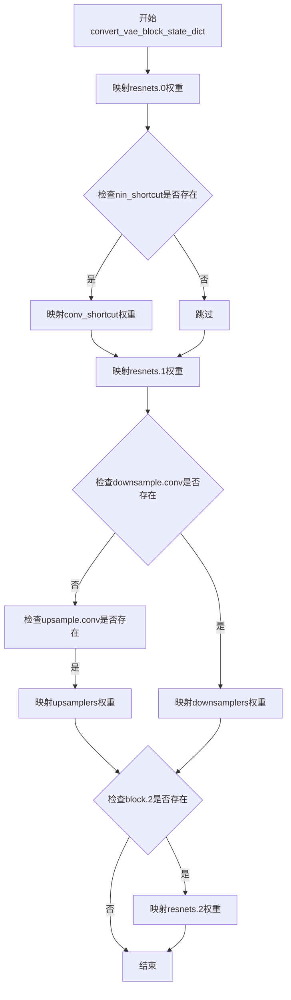

# `diffusers\scripts\convert_amused.py` 详细设计文档

该脚本是一个模型迁移工具，用于将预训练的OpenMUSE模型（包含MaskGiT UViT Transformer和VQGAN VAE）从Muse库格式转换为HuggingFace Diffusers的AmusedPipeline格式，并通过数值对比验证转换的正确性。

## 整体流程

```mermaid
graph TD
    A[开始] --> B[解析命令行参数]
    B --> C[加载旧模型权重]
    C --> C1[加载 MaskGiTUViT (Transformer)]
    C --> C2[加载 VQGANModel (VAE)]
    C --> C3[加载 CLIPTokenizer 和 CLIPTextModel]
    C2 --> D[调用 make_vqvae 转换 VAE]
    D --> D1[构建新 VQModel 架构]
    D1 --> D2[重映射 State Dict (Encoder/Decoder)]
    D2 --> D3[验证 VAE 输出一致性]
    C1 --> E[调用 make_transformer 转换 Transformer]
    E --> E1[构建新 UVit2DModel 架构]
    E1 --> E2[重映射 State Dict (Attention/FFN)]
    E2 --> E3[验证 Transformer 输出一致性]
    D3 --> F[初始化 AmusedPipeline 和 Scheduler]
    E3 --> F
    F --> G[使用相同种子运行推理 (Old vs New)]
    G --> H{对比输出差异}
    H -- 差异过大 --> I[抛出 AssertionError]
    H -- 差异正常 --> J{args.write_to 是否存在?}
    J -- 是 --> K[保存新模型到本地]
    J -- 否 --> L[结束]
    K --> L
```

## 类结构

```
Python Script (Procedural)
├── External Libraries
│   ├── muse (MaskGiTUViT, VQGANModel, PipelineMuse)
│   ├── diffusers (VQModel, UVit2DModel, AmusedPipeline, AmusedScheduler)
│   └── transformers (CLIPTextModelWithProjection, CLIPTokenizer)
└── Functions
    ├── main (主流程控制)
    ├── make_transformer (Transformer权重转换与验证)
    ├── make_vqvae (VAE权重转换与验证)
    └── convert_vae_block_state_dict (VAE块权重映射辅助函数)
```

## 全局变量及字段


### `device`
    
CUDA device string for running PyTorch computations on GPU

类型：`str`
    


    

## 全局函数及方法


### `main`

这是脚本的入口点，负责将旧的 Muse 模型（MaskGiTUViT 和 VQGANModel）转换为新的 diffusers 格式（AmusedPipeline），然后验证转换后的模型输出与原始模型输出的等价性。

参数：

- 无参数（通过 `ArgumentParser` 从命令行获取参数）

返回值：

- 无返回值（执行完成后直接退出）

#### 流程图



#### 带注释源码

```python
def main():
    """
    主函数：验证旧 Muse 模型到新 AmusedPipeline 的转换等价性
    """
    # 1. 解析命令行参数
    args = ArgumentParser()
    args.add_argument("--model_256", action="store_true")
    args.add_argument("--write_to", type=str, required=False, default=None)
    args.add_argument("--transformer_path", type=str, required=False, default=None)
    args = args.parse_args()

    # 2. 确定 transformer 路径和子文件夹
    transformer_path = args.transformer_path
    subfolder = "transformer"

    if transformer_path is None:
        if args.model_256:
            # 256 模型使用 huggingface 预训练模型
            transformer_path = "openMUSE/muse-256"
        else:
            # 512 模型使用本地检查点
            transformer_path = (
                "../research-run-512-checkpoints/research-run-512-with-downsample-checkpoint-554000/unwrapped_model/"
            )
            subfolder = None  # 本地模型没有子文件夹

    # 3. 加载旧版 MaskGiTUViT transformer 模型
    old_transformer = MaskGiTUViT.from_pretrained(transformer_path, subfolder=subfolder)
    old_transformer.to(device)

    # 4. 加载旧版 VQGANModel VAE 模型
    old_vae = VQGANModel.from_pretrained("openMUSE/muse-512", subfolder="vae")
    old_vae.to(device)

    # 5. 转换为新 VQModel 格式
    vqvae = make_vqvae(old_vae)

    # 6. 加载文本编码器
    tokenizer = CLIPTokenizer.from_pretrained("openMUSE/muse-512", subfolder="text_encoder")
    text_encoder = CLIPTextModelWithProjection.from_pretrained("openMUSE/muse-512", subfolder="text_encoder")
    text_encoder.to(device)

    # 7. 转换为新 UVit2DModel 格式
    transformer = make_transformer(old_transformer, args.model_256)

    # 8. 创建调度器和新的 AmusedPipeline
    scheduler = AmusedScheduler(mask_token_id=old_transformer.config.mask_token_id)
    new_pipe = AmusedPipeline(
        vqvae=vqvae, tokenizer=tokenizer, text_encoder=text_encoder, 
        transformer=transformer, scheduler=scheduler
    )

    # 9. 创建旧版 PipelineMuse 用于对比
    old_pipe = OldPipelineMuse(
        vae=old_vae, transformer=old_transformer, 
        text_encoder=text_encoder, tokenizer=tokenizer
    )
    old_pipe.to(device)

    # 10. 根据模型类型设置参数
    if args.model_256:
        transformer_seq_len = 256
        orig_size = (256, 256)
    else:
        transformer_seq_len = 1024
        orig_size = (512, 512)

    # 11. 使用旧管道生成图像
    old_out = old_pipe(
        "dog",  # 测试 prompt
        generator=torch.Generator(device).manual_seed(0),
        transformer_seq_len=transformer_seq_len,
        orig_size=orig_size,
        timesteps=12,
    )[0]

    # 12. 使用新管道生成图像
    new_out = new_pipe("dog", generator=torch.Generator(device).manual_seed(0)).images[0]

    # 13. 计算差异
    old_out = np.array(old_out)
    new_out = np.array(new_out)
    diff = np.abs(old_out.astype(np.float64) - new_out.astype(np.float64))

    # 打印差异统计（跳过完整等价性检查）
    print("skipping pipeline full equivalence check")
    print(f"max diff: {diff.max()}, diff.sum() / diff.size {diff.sum() / diff.size}")

    # 14. 验证差异在可接受范围内
    if args.model_256:
        assert diff.max() <= 3
        assert diff.sum() / diff.size < 0.7
    else:
        assert diff.max() <= 1
        assert diff.sum() / diff.size < 0.4

    # 15. 可选：保存新管道
    if args.write_to is not None:
        new_pipe.save_pretrained(args.write_to)
```


### `make_transformer`

该函数负责将旧的 MaskGiTUViT（MaskGiT UViT）模型迁移转换为 diffusers 库中的 UVit2DModel 格式，包括参数适配、状态字典键名重映射以及模型正确性验证。

参数：

- `old_transformer`：`MaskGiTUViT`，旧版 MaskGiT UViT 模型实例，包含原始模型配置和权重
- `model_256`：`bool`，标志位，True 表示 256x256 模型（sample_size=16），False 表示 512x512 模型（sample_size=32）

返回值：`UVit2DModel`，转换后的新版 UViT 2D 模型实例，已加载重映射后的权重

#### 流程图

```mermaid
flowchart TD
    A[开始 make_transformer] --> B[提取旧模型配置 dict]
    B --> C{检查 force_down_up_sample}
    C -->|是| D[设置 downsample/upsample=True]
    C -->|否| E[设置 downsample/upsample=False]
    D --> F[构建 args_ 参数字典]
    E --> F
    F --> G[根据 model_256 设置 sample_size: 16 或 32]
    F --> H[获取 UVit2DModel.__init__ 签名]
    H --> I[遍历签名参数，排除已处理项，复制其余配置到 args_]
    I --> J[创建新模型 UVit2DModel(**args_)]
    J --> K[设置注意力处理器为 AttnProcessor]
    K --> L[获取旧模型 state_dict]
    L --> M{循环 22 层-transformer_layers}
    M -->|每层| N1[重映射 norm1 相关权重]
    M -->|每层| N2[重映射 attn1 自注意力权重]
    M -->|每层| N3[重映射 norm2 跨注意力权重]
    M -->|每层| N4[重映射 attn2 跨注意力权重]
    M -->|每层| N5[重映射 norm3 FFN 权重]
    M -->|每层| N6[合并 wi_0 和 wi_1 为 proj 权重]
    M -->|每层| N7[重映射 ff.wo 权重]
    M --> N[循环结束]
    N --> O{force_down_up_sample?}
    O -->|是| P[重映射 down_block 和 up_block 的权重]
    O -->|否| Q
    P --> Q
    Q --> R[重映射 mlm_layer 权重]
    R --> S[循环 3 次重映射 down_block 残差块和注意力块权重]
    S --> T[循环 3 次重映射 up_block 残差块和注意力块权重]
    T --> U[重命名 up_blocks.0 和 down_blocks.0 前缀]
    U --> V[新模型加载 state_dict]
    V --> W[创建测试输入: input_ids, encoder_hidden_states, cond_embeds, micro_conds]
    W --> X[运行旧模型推理并reshape输出]
    X --> Y[运行新模型推理]
    Y --> Z[计算输出差异 max_diff 和 total_diff]
    Z --> AA{验证 max_diff < 0.01?}
    AA -->|是| BB{验证 total_diff < 1500?}
    AA -->|否| FF[抛出断言错误]
    BB -->|是| CC[返回新模型]
    BB -->|否| FF
```

#### 带注释源码

```python
def make_transformer(old_transformer, model_256):
    """
    将旧的 MaskGiTUViT 模型转换为新的 UVit2DModel 格式
    
    参数:
        old_transformer: 旧版 MaskGiT UViT 模型 (MaskGiTUViT 类型)
        model_256: 布尔值，True 表示 256x256 模型，否则为 512x512
    
    返回:
        转换后的 UVit2DModel 模型实例
    """
    
    # ----- 步骤1: 提取旧模型配置参数 -----
    args = dict(old_transformer.config)
    force_down_up_sample = args["force_down_up_sample"]  # 是否强制使用上/下采样

    # ----- 步骤2: 构建新模型初始化参数 -----
    signature = inspect.signature(UVit2DModel.__init__)  # 获取目标模型构造函数签名

    # 基础参数: 下采样、上采样、输出通道数、样本大小
    args_ = {
        "downsample": force_down_up_sample,
        "upsample": force_down_up_sample,
        "block_out_channels": args["block_out_channels"][0],
        "sample_size": 16 if model_256 else 32,  # 256模型用16, 512模型用32
    }

    # 遍历目标模型签名中的参数，排除已处理项后，其余直接从旧配置复制
    for s in list(signature.parameters.keys()):
        if s in ["self", "downsample", "upsample", "sample_size", "block_out_channels"]:
            continue
        args_[s] = args[s]

    # ----- 步骤3: 创建新模型实例 -----
    new_transformer = UVit2DModel(**args_)  # 使用构建的参数实例化新模型
    new_transformer.to(device)

    # 设置注意力处理器
    new_transformer.set_attn_processor(AttnProcessor())

    # ----- 步骤4: 状态字典键名重映射 -----
    # 旧模型权重键名 -> 新模型权重键名的映射
    state_dict = old_transformer.state_dict()

    # 4.1 条件嵌入层重命名 (cond_embed.linear_1, linear_2)
    state_dict["cond_embed.linear_1.weight"] = state_dict.pop("cond_embed.0.weight")
    state_dict["cond_embed.linear_2.weight"] = state_dict.pop("cond_embed.2.weight")

    # 4.2 循环遍历22层 transformer_layers 进行权重重映射
    for i in range(22):
        # norm1: 自适应层归一化 (AdaLN) -> 标准 norm + linear
        state_dict[f"transformer_layers.{i}.norm1.norm.weight"] = state_dict.pop(
            f"transformer_layers.{i}.attn_layer_norm.weight"
        )
        state_dict[f"transformer_layers.{i}.norm1.linear.weight"] = state_dict.pop(
            f"transformer_layers.{i}.self_attn_adaLN_modulation.mapper.weight"
        )

        # attn1: 自注意力层 (self-attention)
        state_dict[f"transformer_layers.{i}.attn1.to_q.weight"] = state_dict.pop(
            f"transformer_layers.{i}.attention.query.weight"
        )
        state_dict[f"transformer_layers.{i}.attn1.to_k.weight"] = state_dict.pop(
            f"transformer_layers.{i}.attention.key.weight"
        )
        state_dict[f"transformer_layers.{i}.attn1.to_v.weight"] = state_dict.pop(
            f"transformer_layers.{i}.attention.value.weight"
        )
        state_dict[f"transformer_layers.{i}.attn1.to_out.0.weight"] = state_dict.pop(
            f"transformer_layers.{i}.attention.out.weight"
        )

        # norm2: 跨注意力层归一化
        state_dict[f"transformer_layers.{i}.norm2.norm.weight"] = state_dict.pop(
            f"transformer_layers.{i}.crossattn_layer_norm.weight"
        )
        state_dict[f"transformer_layers.{i}.norm2.linear.weight"] = state_dict.pop(
            f"transformer_layers.{i}.cross_attn_adaLN_modulation.mapper.weight"
        )

        # attn2: 跨注意力层 (cross-attention)
        state_dict[f"transformer_layers.{i}.attn2.to_q.weight"] = state_dict.pop(
            f"transformer_layers.{i}.crossattention.query.weight"
        )
        state_dict[f"transformer_layers.{i}.attn2.to_k.weight"] = state_dict.pop(
            f"transformer_layers.{i}.crossattention.key.weight"
        )
        state_dict[f"transformer_layers.{i}.attn2.to_v.weight"] = state_dict.pop(
            f"transformer_layers.{i}.crossattention.value.weight"
        )
        state_dict[f"transformer_layers.{i}.attn2.to_out.0.weight"] = state_dict.pop(
            f"transformer_layers.{i}.crossattention.out.weight"
        )

        # norm3: FFN 前馈网络层归一化
        state_dict[f"transformer_layers.{i}.norm3.norm.weight"] = state_dict.pop(
            f"transformer_layers.{i}.ffn.pre_mlp_layer_norm.weight"
        )
        state_dict[f"transformer_layers.{i}.norm3.linear.weight"] = state_dict.pop(
            f"transformer_layers.{i}.ffn.adaLN_modulation.mapper.weight"
        )

        # FFN: 前馈网络权重合并 (wi_0 + wi_1 -> proj)
        wi_0_weight = state_dict.pop(f"transformer_layers.{i}.ffn.wi_0.weight")
        wi_1_weight = state_dict.pop(f"transformer_layers.{i}.ffn.wi_1.weight")
        proj_weight = torch.concat([wi_1_weight, wi_0_weight], dim=0)
        state_dict[f"transformer_layers.{i}.ff.net.0.proj.weight"] = proj_weight

        # FFN 输出层
        state_dict[f"transformer_layers.{i}.ff.net.2.weight"] = state_dict.pop(
            f"transformer_layers.{i}.ffn.wo.weight"
        )

    # 4.3 下采样/上采样块权重重映射 (可选)
    if force_down_up_sample:
        state_dict["down_block.downsample.norm.weight"] = state_dict.pop(
            "down_blocks.0.downsample.0.norm.weight"
        )
        state_dict["down_block.downsample.conv.weight"] = state_dict.pop(
            "down_blocks.0.downsample.1.weight"
        )
        state_dict["up_block.upsample.norm.weight"] = state_dict.pop(
            "up_blocks.0.upsample.0.norm.weight"
        )
        state_dict["up_block.upsample.conv.weight"] = state_dict.pop(
            "up_blocks.0.upsample.1.weight"
        )

    # 4.4 MLM (Masked Language Model) 层权重重映射
    state_dict["mlm_layer.layer_norm.weight"] = state_dict.pop(
        "mlm_layer.layer_norm.norm.weight"
    )

    # 4.5 Down Block 残差块和注意力块权重重映射 (3层)
    for i in range(3):
        # 残差块
        state_dict[f"down_block.res_blocks.{i}.norm.weight"] = state_dict.pop(
            f"down_blocks.0.res_blocks.{i}.norm.norm.weight"
        )
        state_dict[f"down_block.res_blocks.{i}.channelwise_linear_1.weight"] = state_dict.pop(
            f"down_blocks.0.res_blocks.{i}.channelwise.0.weight"
        )
        state_dict[f"down_block.res_blocks.{i}.channelwise_norm.gamma"] = state_dict.pop(
            f"down_blocks.0.res_blocks.{i}.channelwise.2.gamma"
        )
        state_dict[f"down_block.res_blocks.{i}.channelwise_norm.beta"] = state_dict.pop(
            f"down_blocks.0.res_blocks.{i}.channelwise.2.beta"
        )
        state_dict[f"down_block.res_blocks.{i}.channelwise_linear_2.weight"] = state_dict.pop(
            f"down_blocks.0.res_blocks.{i}.channelwise.4.weight"
        )
        state_dict[f"down_block.res_blocks.{i}.cond_embeds_mapper.weight"] = state_dict.pop(
            f"down_blocks.0.res_blocks.{i}.adaLN_modulation.mapper.weight"
        )

        # 注意力块 - norm1 + attn1
        state_dict[f"down_block.attention_blocks.{i}.norm1.weight"] = state_dict.pop(
            f"down_blocks.0.attention_blocks.{i}.attn_layer_norm.weight"
        )
        state_dict[f"down_block.attention_blocks.{i}.attn1.to_q.weight"] = state_dict.pop(
            f"down_blocks.0.attention_blocks.{i}.attention.query.weight"
        )
        state_dict[f"down_block.attention_blocks.{i}.attn1.to_k.weight"] = state_dict.pop(
            f"down_blocks.0.attention_blocks.{i}.attention.key.weight"
        )
        state_dict[f"down_block.attention_blocks.{i}.attn1.to_v.weight"] = state_dict.pop(
            f"down_blocks.0.attention_blocks.{i}.attention.value.weight"
        )
        state_dict[f"down_block.attention_blocks.{i}.attn1.to_out.0.weight"] = state_dict.pop(
            f"down_blocks.0.attention_blocks.{i}.attention.out.weight"
        )

        # 注意力块 - norm2 + attn2 (跨注意力)
        state_dict[f"down_block.attention_blocks.{i}.norm2.weight"] = state_dict.pop(
            f"down_blocks.0.attention_blocks.{i}.crossattn_layer_norm.weight"
        )
        state_dict[f"down_block.attention_blocks.{i}.attn2.to_q.weight"] = state_dict.pop(
            f"down_blocks.0.attention_blocks.{i}.crossattention.query.weight"
        )
        state_dict[f"down_block.attention_blocks.{i}.attn2.to_k.weight"] = state_dict.pop(
            f"down_blocks.0.attention_blocks.{i}.crossattention.key.weight"
        )
        state_dict[f"down_block.attention_blocks.{i}.attn2.to_v.weight"] = state_dict.pop(
            f"down_blocks.0.attention_blocks.{i}.crossattention.value.weight"
        )
        state_dict[f"down_block.attention_blocks.{i}.attn2.to_out.0.weight"] = state_dict.pop(
            f"down_blocks.0.attention_blocks.{i}.crossattention.out.weight"
        )

        # Up Block 残差块和注意力块权重重映射 (3层)
        state_dict[f"up_block.res_blocks.{i}.norm.weight"] = state_dict.pop(
            f"up_blocks.0.res_blocks.{i}.norm.norm.weight"
        )
        state_dict[f"up_block.res_blocks.{i}.channelwise_linear_1.weight"] = state_dict.pop(
            f"up_blocks.0.res_blocks.{i}.channelwise.0.weight"
        )
        state_dict[f"up_block.res_blocks.{i}.channelwise_norm.gamma"] = state_dict.pop(
            f"up_blocks.0.res_blocks.{i}.channelwise.2.gamma"
        )
        state_dict[f"up_block.res_blocks.{i}.channelwise_norm.beta"] = state_dict.pop(
            f"up_blocks.0.res_blocks.{i}.channelwise.2.beta"
        )
        state_dict[f"up_block.res_blocks.{i}.channelwise_linear_2.weight"] = state_dict.pop(
            f"up_blocks.0.res_blocks.{i}.channelwise.4.weight"
        )
        state_dict[f"up_block.res_blocks.{i}.cond_embeds_mapper.weight"] = state_dict.pop(
            f"up_blocks.0.res_blocks.{i}.adaLN_modulation.mapper.weight"
        )

        state_dict[f"up_block.attention_blocks.{i}.norm1.weight"] = state_dict.pop(
            f"up_blocks.0.attention_blocks.{i}.attn_layer_norm.weight"
        )
        state_dict[f"up_block.attention_blocks.{i}.attn1.to_q.weight"] = state_dict.pop(
            f"up_blocks.0.attention_blocks.{i}.attention.query.weight"
        )
        state_dict[f"up_block.attention_blocks.{i}.attn1.to_k.weight"] = state_dict.pop(
            f"up_blocks.0.attention_blocks.{i}.attention.key.weight"
        )
        state_dict[f"up_block.attention_blocks.{i}.attn1.to_v.weight"] = state_dict.pop(
            f"up_blocks.0.attention_blocks.{i}.attention.value.weight"
        )
        state_dict[f"up_block.attention_blocks.{i}.attn1.to_out.0.weight"] = state_dict.pop(
            f"up_blocks.0.attention_blocks.{i}.attention.out.weight"
        )

        state_dict[f"up_block.attention_blocks.{i}.norm2.weight"] = state_dict.pop(
            f"up_blocks.0.attention_blocks.{i}.crossattn_layer_norm.weight"
        )
        state_dict[f"up_block.attention_blocks.{i}.attn2.to_q.weight"] = state_dict.pop(
            f"up_blocks.0.attention_blocks.{i}.crossattention.query.weight"
        )
        state_dict[f"up_block.attention_blocks.{i}.attn2.to_k.weight"] = state_dict.pop(
            f"up_blocks.0.attention_blocks.{i}.crossattention.key.weight"
        )
        state_dict[f"up_block.attention_blocks.{i}.attn2.to_v.weight"] = state_dict.pop(
            f"up_blocks.0.attention_blocks.{i}.crossattention.value.weight"
        )
        state_dict[f"up_block.attention_blocks.{i}.attn2.to_out.0.weight"] = state_dict.pop(
            f"up_blocks.0.attention_blocks.{i}.crossattention.out.weight"
        )

    # 4.6 统一前缀命名 (去除 "up_blocks.0" 和 "down_blocks.0" 中的 ".0")
    for key in list(state_dict.keys()):
        if key.startswith("up_blocks.0"):
            key_ = "up_block." + ".".join(key.split(".")[2:])
            state_dict[key_] = state_dict.pop(key)
        if key.startswith("down_blocks.0"):
            key_ = "down_block." + ".".join(key.split(".")[2:])
            state_dict[key_] = state_dict.pop(key)

    # ----- 步骤5: 加载状态字典 -----
    new_transformer.load_state_dict(state_dict)

    # ----- 步骤6: 正确性验证 -----
    # 创建测试输入张量
    input_ids = torch.randint(0, 10, (1, 32, 32), device=old_transformer.device)
    encoder_hidden_states = torch.randn((1, 77, 768), device=old_transformer.device)
    cond_embeds = torch.randn((1, 768), device=old_transformer.device)
    micro_conds = torch.tensor(
        [[512, 512, 0, 0, 6]], dtype=torch.float32, device=old_transformer.device
    )

    # 旧模型推理
    old_out = old_transformer(
        input_ids.reshape(1, -1), encoder_hidden_states, cond_embeds, micro_conds
    )
    old_out = old_out.reshape(1, 32, 32, 8192).permute(0, 3, 1, 2)

    # 新模型推理
    new_out = new_transformer(
        input_ids, encoder_hidden_states, cond_embeds, micro_conds
    )

    # 计算输出差异 (由于 GeGLU 块实现差异，允许一定误差)
    max_diff = (old_out - new_out).abs().max()
    total_diff = (old_out - new_out).abs().sum()
    print(f"Transformer max_diff: {max_diff} total_diff: {total_diff}")

    # 验证误差在可接受范围内
    assert max_diff < 0.01, f"最大差异 {max_diff} 超过阈值 0.01"
    assert total_diff < 1500, f"总差异 {total_diff} 超过阈值 1500"

    # 返回转换后的新模型
    return new_transformer
```


### `make_vqvae`

将旧的 VQGAN 模型（来自 muse 库的 `VQGANModel`）转换为新的 VQModel（来自 diffusers 库），并迁移权重和参数。该函数创建一个新的 `VQModel` 实例，通过状态字典映射将旧模型的权重转换并加载到新模型中，同时验证编码器和解码器的输出等价性。

参数：

- `old_vae`：`VQGANModel`，来自 muse 库的旧 VQGAN 模型，需要被转换

返回值：`VQModel`，转换后的新 VQModel 模型

#### 流程图



#### 带注释源码

```
def make_vqvae(old_vae):
    """
    将旧的 VQGANModel 转换为新的 VQModel
    
    参数:
        old_vae: 来自 muse 库的 VQGANModel 实例
        
    返回:
        来自 diffusers 库的 VQModel 实例
    """
    
    # 1. 创建新的 VQModel 实例，配置参数与旧模型兼容
    new_vae = VQModel(
        act_fn="silu",                              # 激活函数: SiLU
        block_out_channels=[128, 256, 256, 512, 768],  # 每个阶段的输出通道数
        # Encoder 的块类型：5个下采样编码器块
        down_block_types=[
            "DownEncoderBlock2D",
            "DownEncoderBlock2D",
            "DownEncoderBlock2D",
            "DownEncoderBlock2D",
            "DownEncoderBlock2D",
        ],
        in_channels=3,              # 输入通道数 (RGB图像)
        latent_channels=64,        # 潜在空间通道数
        layers_per_block=2,        # 每个块中的层数
        norm_num_groups=32,        # 归一化组数
        num_vq_embeddings=8192,   # VQ 码本大小
        out_channels=3,            # 输出通道数
        sample_size=32,            # 样本大小（潜在空间尺寸）
        # Decoder 的块类型：5个上采样解码器块
        up_block_types=[
            "UpDecoderBlock2D",
            "UpDecoderBlock2D",
            "UpDecoderBlock2D",
            "UpDecoderBlock2D",
            "UpDecoderBlock2D",
        ],
        mid_block_add_attention=False,  # 中间块不使用注意力
        lookup_from_codebook=True,     # 从码本查找
    )
    new_vae.to(device)  # 将模型移动到 CUDA 设备

    # 2. 初始化状态字典
    new_state_dict = {}
    old_state_dict = old_vae.state_dict()  # 获取旧模型的权重

    # 3. 映射 encoder 初始卷积层
    new_state_dict["encoder.conv_in.weight"] = old_state_dict.pop("encoder.conv_in.weight")
    new_state_dict["encoder.conv_in.bias"]   = old_state_dict.pop("encoder.conv_in.bias")

    # 4. 转换 encoder 的 5 个下采样块
    convert_vae_block_state_dict(old_state_dict, "encoder.down.0", new_state_dict, "encoder.down_blocks.0")
    convert_vae_block_state_dict(old_state_dict, "encoder.down.1", new_state_dict, "encoder.down_blocks.1")
    convert_vae_block_state_dict(old_state_dict, "encoder.down.2", new_state_dict, "encoder.down_blocks.2")
    convert_vae_block_state_dict(old_state_dict, "encoder.down.3", new_state_dict, "encoder.down_blocks.3")
    convert_vae_block_state_dict(old_state_dict, "encoder.down.4", new_state_dict, "encoder.down_blocks.4")

    # 5. 转换 encoder 的中间块
    new_state_dict["encoder.mid_block.resnets.0.norm1.weight"] = old_state_dict.pop("encoder.mid.block_1.norm1.weight")
    new_state_dict["encoder.mid_block.resnets.0.norm1.bias"]   = old_state_dict.pop("encoder.mid.block_1.norm1.bias")
    new_state_dict["encoder.mid_block.resnets.0.conv1.weight"] = old_state_dict.pop("encoder.mid.block_1.conv1.weight")
    new_state_dict["encoder.mid_block.resnets.0.conv1.bias"]   = old_state_dict.pop("encoder.mid.block_1.conv1.bias")
    new_state_dict["encoder.mid_block.resnets.0.norm2.weight"] = old_state_dict.pop("encoder.mid.block_1.norm2.weight")
    new_state_dict["encoder.mid_block.resnets.0.norm2.bias"]   = old_state_dict.pop("encoder.mid.block_1.norm2.bias")
    new_state_dict["encoder.mid_block.resnets.0.conv2.weight"] = old_state_dict.pop("encoder.mid.block_1.conv2.weight")
    new_state_dict["encoder.mid_block.resnets.0.conv2.bias"]   = old_state_dict.pop("encoder.mid.block_1.conv2.bias")
    # ... (block_2 类似)

    # 6. 转换 encoder 输出层和量化层
    new_state_dict["encoder.conv_norm_out.weight"] = old_state_dict.pop("encoder.norm_out.weight")
    new_state_dict["encoder.conv_norm_out.bias"]   = old_state_dict.pop("encoder.norm_out.bias")
    new_state_dict["encoder.conv_out.weight"]      = old_state_dict.pop("encoder.conv_out.weight")
    new_state_dict["encoder.conv_out.bias"]        = old_state_dict.pop("encoder.conv_out.bias")
    new_state_dict["quant_conv.weight"]            = old_state_dict.pop("quant_conv.weight")
    new_state_dict["quant_conv.bias"]              = old_state_dict.pop("quant_conv.bias")
    new_state_dict["quantize.embedding.weight"]    = old_state_dict.pop("quantize.embedding.weight")
    new_state_dict["post_quant_conv.weight"]       = old_state_dict.pop("post_quant_conv.weight")
    new_state_dict["post_quant_conv.bias"]         = old_state_dict.pop("post_quant_conv.bias")

    # 7. 转换 decoder 初始层
    new_state_dict["decoder.conv_in.weight"] = old_state_dict.pop("decoder.conv_in.weight")
    new_state_dict["decoder.conv_in.bias"]   = old_state_dict.pop("decoder.conv_in.bias")

    # 8. 转换 decoder 中间块
    new_state_dict["decoder.mid_block.resnets.0.norm1.weight"] = old_state_dict.pop("decoder.mid.block_1.norm1.weight")
    # ... (类似映射)

    # 9. 转换 decoder 的 5 个上采样块（顺序反向）
    convert_vae_block_state_dict(old_state_dict, "decoder.up.0", new_state_dict, "decoder.up_blocks.4")
    convert_vae_block_state_dict(old_state_dict, "decoder.up.1", new_state_dict, "decoder.up_blocks.3")
    convert_vae_block_state_dict(old_state_dict, "decoder.up.2", new_state_dict, "decoder.up_blocks.2")
    convert_vae_block_state_dict(old_state_dict, "decoder.up.3", new_state_dict, "decoder.up_blocks.1")
    convert_vae_block_state_dict(old_state_dict, "decoder.up.4", new_state_dict, "decoder.up_blocks.0")

    # 10. 转换 decoder 输出层
    new_state_dict["decoder.conv_norm_out.weight"] = old_state_dict.pop("decoder.norm_out.weight")
    new_state_dict["decoder.conv_norm_out.bias"]   = old_state_dict.pop("decoder.norm_out.bias")
    new_state_dict["decoder.conv_out.weight"]      = old_state_dict.pop("decoder.conv_out.weight")
    new_state_dict["decoder.conv_out.bias"]        = old_state_dict.pop("decoder.conv_out.bias")

    # 11. 验证所有权重都已映射
    assert len(old_state_dict.keys()) == 0

    # 12. 加载权重到新模型
    new_vae.load_state_dict(new_state_dict)

    # 13. 测试 encoder 等价性
    input = torch.randn((1, 3, 512, 512), device=device)
    input = input.clamp(-1, 1)

    old_encoder_output = old_vae.quant_conv(old_vae.encoder(input))
    new_encoder_output = new_vae.quant_conv(new_vae.encoder(input))
    assert (old_encoder_output == new_encoder_output).all()

    # 14. 测试 decoder 等价性（部分检查）
    old_decoder_output = old_vae.decoder(old_vae.post_quant_conv(old_encoder_output))
    new_decoder_output = new_vae.decoder(new_vae.post_quant_conv(new_encoder_output))
    print(f"vae decoder diff {(old_decoder_output - new_decoder_output).float().abs().sum()}")

    # 15. 测试完整 VAE 等价性
    old_output = old_vae(input)[0]
    new_output = new_vae(input)[0]
    print(f"vae full diff {(old_output - new_output).float().abs().sum()}")

    return new_vae
```


### `convert_vae_block_state_dict`

将旧 VAE 模型的 block 状态字典（state dict）转换为新 diffusers 库格式的状态字典，处理卷积层、归一化层和残差连接等参数名称映射。

参数：

- `old_state_dict`：`Dict[str, torch.Tensor]`，旧模型的状态字典（会被 `pop` 操作修改）
- `prefix_from`：`str`，旧模型参数名称的前缀（如 `"encoder.down.0"`）
- `new_state_dict`：`Dict[str, torch.Tensor]`，新模型的状态字典（通过函数参数输出结果）
- `prefix_to`：`str`，新模型参数名称的前缀（如 `"encoder.down_blocks.0"`）

返回值：`None`，结果通过修改 `new_state_dict` 参数传递

#### 流程图



#### 带注释源码

```python
def convert_vae_block_state_dict(old_state_dict, prefix_from, new_state_dict, prefix_to):
    # fmt: off

    # 提取第一个残差块 (resnets.0) 的归一化层和卷积层参数
    new_state_dict[f"{prefix_to}.resnets.0.norm1.weight"]             = old_state_dict.pop(f"{prefix_from}.block.0.norm1.weight")
    new_state_dict[f"{prefix_to}.resnets.0.norm1.bias"]               = old_state_dict.pop(f"{prefix_from}.block.0.norm1.bias")
    new_state_dict[f"{prefix_to}.resnets.0.conv1.weight"]             = old_state_dict.pop(f"{prefix_from}.block.0.conv1.weight")
    new_state_dict[f"{prefix_to}.resnets.0.conv1.bias"]               = old_state_dict.pop(f"{prefix_from}.block.0.conv1.bias")
    new_state_dict[f"{prefix_to}.resnets.0.norm2.weight"]             = old_state_dict.pop(f"{prefix_from}.block.0.norm2.weight")
    new_state_dict[f"{prefix_to}.resnets.0.norm2.bias"]               = old_state_dict.pop(f"{prefix_from}.block.0.norm2.bias")
    new_state_dict[f"{prefix_to}.resnets.0.conv2.weight"]             = old_state_dict.pop(f"{prefix_from}.block.0.conv2.weight")
    new_state_dict[f"{prefix_to}.resnets.0.conv2.bias"]               = old_state_dict.pop(f"{prefix_from}.block.0.conv2.bias")

    # 检查是否存在跳跃连接卷积层（nin_shortcut），如果有则转换
    if f"{prefix_from}.block.0.nin_shortcut.weight" in old_state_dict:
        new_state_dict[f"{prefix_to}.resnets.0.conv_shortcut.weight"]     = old_state_dict.pop(f"{prefix_from}.block.0.nin_shortcut.weight")
        new_state_dict[f"{prefix_to}.resnets.0.conv_shortcut.bias"]       = old_state_dict.pop(f"{prefix_from}.block.0.nin_shortcut.bias")

    # 提取第二个残差块 (resnets.1) 的参数
    new_state_dict[f"{prefix_to}.resnets.1.norm1.weight"]             = old_state_dict.pop(f"{prefix_from}.block.1.norm1.weight")
    new_state_dict[f"{prefix_to}.resnets.1.norm1.bias"]               = old_state_dict.pop(f"{prefix_from}.block.1.norm1.bias")
    new_state_dict[f"{prefix_to}.resnets.1.conv1.weight"]             = old_state_dict.pop(f"{prefix_from}.block.1.conv1.weight")
    new_state_dict[f"{prefix_to}.resnets.1.conv1.bias"]               = old_state_dict.pop(f"{prefix_from}.block.1.conv1.bias")
    new_state_dict[f"{prefix_to}.resnets.1.norm2.weight"]             = old_state_dict.pop(f"{prefix_from}.block.1.norm2.weight")
    new_state_dict[f"{prefix_to}.resnets.1.norm2.bias"]               = old_state_dict.pop(f"{prefix_from}.block.1.norm2.bias")
    new_state_dict[f"{prefix_to}.resnets.1.conv2.weight"]             = old_state_dict.pop(f"{prefix_from}.block.1.conv2.weight")
    new_state_dict[f"{prefix_to}.resnets.1.conv2.bias"]               = old_state_dict.pop(f"{prefix_from}.block.1.conv2.bias")

    # 检查是否存在下采样层，如果有则转换
    if f"{prefix_from}.downsample.conv.weight" in old_state_dict:
        new_state_dict[f"{prefix_to}.downsamplers.0.conv.weight"]         = old_state_dict.pop(f"{prefix_from}.downsample.conv.weight")
        new_state_dict[f"{prefix_to}.downsamplers.0.conv.bias"]           = old_state_dict.pop(f"{prefix_from}.downsample.conv.bias")

    # 检查是否存在上采样层，如果有则转换
    if f"{prefix_from}.upsample.conv.weight" in old_state_dict:
        new_state_dict[f"{prefix_to}.upsamplers.0.conv.weight"]         = old_state_dict.pop(f"{prefix_from}.upsample.conv.weight")
        new_state_dict[f"{prefix_to}.upsamplers.0.conv.bias"]           = old_state_dict.pop(f"{prefix_from}.upsample.conv.bias")

    # 检查是否存在第三个残差块 (resnets.2)，如果有则转换
    if f"{prefix_from}.block.2.norm1.weight" in old_state_dict:
        new_state_dict[f"{prefix_to}.resnets.2.norm1.weight"]             = old_state_dict.pop(f"{prefix_from}.block.2.norm1.weight")
        new_state_dict[f"{prefix_to}.resnets.2.norm1.bias"]               = old_state_dict.pop(f"{prefix_from}.block.2.norm1.bias")
        new_state_dict[f"{prefix_to}.resnets.2.conv1.weight"]             = old_state_dict.pop(f"{prefix_from}.block.2.conv1.weight")
        new_state_dict[f"{prefix_to}.resnets.2.conv1.bias"]               = old_state_dict.pop(f"{prefix_from}.block.2.conv1.bias")
        new_state_dict[f"{prefix_to}.resnets.2.norm2.weight"]             = old_state_dict.pop(f"{prefix_from}.block.2.norm2.weight")
        new_state_dict[f"{prefix_to}.resnets.2.norm2.bias"]               = old_state_dict.pop(f"{prefix_from}.block.2.norm2.bias")
        new_state_dict[f"{prefix_to}.resnets.2.conv2.weight"]             = old_state_dict.pop(f"{prefix_from}.block.2.conv2.weight")
        new_state_dict[f"{prefix_to}.resnets.2.conv2.bias"]               = old_state_dict.pop(f"{prefix_from}.block.2.conv2.bias")

    # fmt: on
```

## 关键组件


### 状态字典键名映射与张量索引重映射

负责将旧模型（MaskGiTUViT、VQGANModel）的state_dict键名转换为新模型（UVit2DModel、VQModel）兼容的键名结构，包括权重重命名、维度调整和层结构重组。

### VQ-VAE模型架构转换

将旧版VQGANModel转换为diffusers的VQModel，包含编码器、解码器、量化层和嵌入层的完整权重映射，支持8192个VQ码本嵌入。

### Transformer模型架构转换

将MaskGiTUViT转换为UVit2DModel，处理22层transformer_blocks的注意力机制映射（self-attn和cross-attn），以及MLP/FFN层的GEGLU块重组。

### 调度器与Pipeline集成

使用AmusedScheduler配合mask_token_id配置，创建diffusers兼容的AmusedPipeline，整合VQVAE、tokenizer、text_encoder、transformer和scheduler。

### 数值等价性验证

通过max_diff和total_diff阈值检查转换后模型的输出与原模型的一致性，确保256模型max_diff≤3、512模型max_diff≤1。

### 确定性计算配置

启用torch.use_deterministic_algorithms(True)、CUDNN deterministic模式和禁用TF32，确保计算结果可复现。

### 注意力处理器定制

使用AttnProcessor替换默认注意力实现，配置UVit2DModel的自定义注意力机制。

### 条件嵌入映射与微条件处理

处理cond_embeds和micro_conds（图像尺寸、裁剪坐标、纵横比）的条件嵌入映射，支持文本到图像生成的条件注入。


## 问题及建议


### 已知问题

-   **全局状态污染**：在模块顶层直接设置torch的全局配置（如`enable_flash_sdp`、`enable_mem_efficient_sdp`、`use_deterministic_algorithms`等），这些设置会影响整个进程，可能与其他代码产生冲突
-   **硬编码的模型路径和参数**：多处硬编码了模型路径（如"openMUSE/muse-256"）和架构参数（如22层transformer、3个down/up blocks），缺乏灵活性
-   **设备管理不规范**：`device`作为全局变量使用，且多处直接调用`.to(device)`，缺乏统一的设备管理机制
-   **大量重复的状态字典映射代码**：make_transformer函数中存在数百行高度重复的状态字典键名转换代码，违反了DRY原则
-   **缺乏异常处理**：模型加载、状态字典转换等关键操作均未捕获异常，失败时会直接崩溃
-   **测试验证不充分**：多处使用`print("skipping...")`跳过等效性检查，assertion用于验证而非单元测试，不适合生产环境
-   **缺乏类型注解和文档**：所有函数都缺少参数和返回值的类型注解，代码可读性和可维护性差
-   **magic number和阈值硬编码**：diff.max()、diff.sum()/diff.size等阈值直接写在代码中，缺乏配置管理

### 优化建议

-   **重构为配置驱动**：将模型路径、架构参数、阈值等抽取为配置文件或命令行参数
-   **封装设备管理**：创建DeviceManager类统一管理CUDA设备，避免全局变量
-   **提取状态字典转换逻辑**：将重复的状态字典映射代码抽象为通用的转换函数或类
-   **添加完整的异常处理**：为模型加载、状态字典转换等操作添加try-except块，提供有意义的错误信息
-   **单元测试化**：将验证逻辑迁移为正式的单元测试，使用pytest等框架
-   **延迟配置初始化**：将torch全局配置移至main函数开头，或提供上下文管理器
-   **添加类型注解**：为所有函数添加完整的类型注解，提升代码质量
-   **日志记录**：用logging模块替代print语句，实现分级日志输出

## 其它


### 一段话描述

该代码是一个模型迁移脚本,用于将OpenMUSE项目中的MaskGiT UViT Transformer和VQGAN VAE模型转换为HuggingFace diffusers库兼容的格式,并构建AmusedPipeline以实现文本到图像的生成功能。

### 整体运行流程

代码的运行流程如下:首先解析命令行参数,确定模型路径(256或512版本);然后加载原始的Transformer和VQGAN模型;接着通过make_transformer函数将旧版UViT模型转换为新版UVit2DModel,并进行权重映射和迁移;之后通过make_vqvae函数将旧版VQGAN转换为新版VQModel,同样进行权重映射;随后加载CLIP文本编码器;最后创建新旧的Pipeline分别进行推理,通过比较输出差异来验证转换的正确性。

### 全局变量和全局函数详细信息

#### 全局变量

**device**
- 类型: str
- 描述: 指定计算设备,当前设置为cuda,表示使用GPU进行计算

#### 全局函数

**main**
- 参数: 无
- 参数类型: 无
- 参数描述: 无参数,是程序的入口函数
- 返回值类型: None
- 返回值描述: 无返回值,执行模型加载、转换和验证流程
- Mermaid流程图:

- 带注释源码:
```python
def main():
    """主函数,执行模型迁移和验证流程"""
    args = ArgumentParser()
    args.add_argument("--model_256", action="store_true")
    args.add_argument("--write_to", type=str, required=False, default=None)
    args.add_argument("--transformer_path", type=str, required=False, default=None)
    args = args.parse_args()

    # 根据参数确定transformer路径和子文件夹
    transformer_path = args.transformer_path
    subfolder = "transformer"

    if transformer_path is None:
        if args.model_256:
            transformer_path = "openMUSE/muse-256"
        else:
            transformer_path = (
                "../research-run-512-checkpoints/research-run-512-with-downsample-checkpoint-554000/unwrapped_model/"
            )
            subfolder = None

    # 加载原始Transformer模型
    old_transformer = MaskGiTUViT.from_pretrained(transformer_path, subfolder=subfolder)
    old_transformer.to(device)

    # 加载原始VAE模型
    old_vae = VQGANModel.from_pretrained("openMUSE/muse-512", subfolder="vae")
    old_vae.to(device)

    # 转换为diffusers格式的VQVAE
    vqvae = make_vqvae(old_vae)

    # 加载文本编码器
    tokenizer = CLIPTokenizer.from_pretrained("openMUSE/muse-512", subfolder="text_encoder")
    text_encoder = CLIPTextModelWithProjection.from_pretrained("openMUSE/muse-512", subfolder="text_encoder")
    text_encoder.to(device)

    # 创建新的Transformer模型
    transformer = make_transformer(old_transformer, args.model_256)

    # 创建调度器和Pipeline
    scheduler = AmusedScheduler(mask_token_id=old_transformer.config.mask_token_id)
    new_pipe = AmusedPipeline(
        vqvae=vqvae, tokenizer=tokenizer, text_encoder=text_encoder, 
        transformer=transformer, scheduler=scheduler
    )

    # 创建旧版Pipeline用于对比
    old_pipe = OldPipelineMuse(
        vae=old_vae, transformer=old_transformer, text_encoder=text_encoder, tokenizer=tokenizer
    )
    old_pipe.to(device)

    # 根据模型版本设置参数
    if args.model_256:
        transformer_seq_len = 256
        orig_size = (256, 256)
    else:
        transformer_seq_len = 1024
        orig_size = (512, 512)

    # 运行两个Pipeline并比较结果
    old_out = old_pipe(
        "dog",
        generator=torch.Generator(device).manual_seed(0),
        transformer_seq_len=transformer_seq_len,
        orig_size=orig_size,
        timesteps=12,
    )[0]

    new_out = new_pipe("dog", generator=torch.Generator(device).manual_seed(0)).images[0]

    # 计算差异
    old_out = np.array(old_out)
    new_out = np.array(new_out)
    diff = np.abs(old_out.astype(np.float64) - new_out.astype(np.float64))

    print("skipping pipeline full equivalence check")
    print(f"max diff: {diff.max()}, diff.sum() / diff.size {diff.sum() / diff.size}")

    # 验证差异在可接受范围内
    if args.model_256:
        assert diff.max() <= 3
        assert diff.sum() / diff.size < 0.7
    else:
        assert diff.max() <= 1
        assert diff.sum() / diff.size < 0.4

    # 保存转换后的模型
    if args.write_to is not None:
        new_pipe.save_pretrained(args.write_to)
```

**make_transformer**
- 参数: old_transformer, model_256
- 参数类型: old_transformer: MaskGiTUViT, model_256: bool
- 参数描述: old_transformer是原始的MaskGiT UViT模型,model_256指定是否为256版本
- 返回值类型: UVit2DModel
- 返回值描述: 返回转换后的diffusers兼容的UVit2DModel模型
- Mermaid流程图:

- 带注释源码:
```python
def make_transformer(old_transformer, model_256):
    """
    将MaskGiT UViT模型转换为diffusers的UVit2DModel
    
    Args:
        old_transformer: 原始MaskGiT UViT模型
        model_256: 是否为256版本模型
    
    Returns:
        转换后的UVit2DModel模型
    """
    args = dict(old_transformer.config)
    force_down_up_sample = args["force_down_up_sample"]

    # 获取新模型的初始化签名
    signature = inspect.signature(UVit2DModel.__init__)

    # 构建新模型参数
    args_ = {
        "downsample": force_down_up_sample,
        "upsample": force_down_up_sample,
        "block_out_channels": args["block_out_channels"][0],
        "sample_size": 16 if model_256 else 32,
    }

    # 从旧配置中复制其他必要参数
    for s in list(signature.parameters.keys()):
        if s in ["self", "downsample", "upsample", "sample_size", "block_out_channels"]:
            continue
        args_[s] = args[s]

    # 创建新Transformer模型
    new_transformer = UVit2DModel(**args_)
    new_transformer.to(device)
    new_transformer.set_attn_processor(AttnProcessor())

    # 开始权重映射
    state_dict = old_transformer.state_dict()

    # 映射条件嵌入层
    state_dict["cond_embed.linear_1.weight"] = state_dict.pop("cond_embed.0.weight")
    state_dict["cond_embed.linear_2.weight"] = state_dict.pop("cond_embed.2.weight")

    # 映射22层Transformer层
    for i in range(22):
        # 自注意力层规范化
        state_dict[f"transformer_layers.{i}.norm1.norm.weight"] = state_dict.pop(
            f"transformer_layers.{i}.attn_layer_norm.weight"
        )
        state_dict[f"transformer_layers.{i}.norm1.linear.weight"] = state_dict.pop(
            f"transformer_layers.{i}.self_attn_adaLN_modulation.mapper.weight"
        )

        # 自注意力权重映射
        state_dict[f"transformer_layers.{i}.attn1.to_q.weight"] = state_dict.pop(
            f"transformer_layers.{i}.attention.query.weight"
        )
        state_dict[f"transformer_layers.{i}.attn1.to_k.weight"] = state_dict.pop(
            f"transformer_layers.{i}.attention.key.weight"
        )
        state_dict[f"transformer_layers.{i}.attn1.to_v.weight"] = state_dict.pop(
            f"transformer_layers.{i}.attention.value.weight"
        )
        state_dict[f"transformer_layers.{i}.attn1.to_out.0.weight"] = state_dict.pop(
            f"transformer_layers.{i}.attention.out.weight"
        )

        # 交叉注意力层规范化
        state_dict[f"transformer_layers.{i}.norm2.norm.weight"] = state_dict.pop(
            f"transformer_layers.{i}.crossattn_layer_norm.weight"
        )
        state_dict[f"transformer_layers.{i}.norm2.linear.weight"] = state_dict.pop(
            f"transformer_layers.{i}.cross_attn_adaLN_modulation.mapper.weight"
        )

        # 交叉注意力权重映射
        state_dict[f"transformer_layers.{i}.attn2.to_q.weight"] = state_dict.pop(
            f"transformer_layers.{i}.crossattention.query.weight"
        )
        state_dict[f"transformer_layers.{i}.attn2.to_k.weight"] = state_dict.pop(
            f"transformer_layers.{i}.crossattention.key.weight"
        )
        state_dict[f"transformer_layers.{i}.attn2.to_v.weight"] = state_dict.pop(
            f"transformer_layers.{i}.crossattention.value.weight"
        )
        state_dict[f"transformer_layers.{i}.attn2.to_out.0.weight"] = state_dict.pop(
            f"transformer_layers.{i}.crossattention.out.weight"
        )

        # 前馈网络层规范化
        state_dict[f"transformer_layers.{i}.norm3.norm.weight"] = state_dict.pop(
            f"transformer_layers.{i}.ffn.pre_mlp_layer_norm.weight"
        )
        state_dict[f"transformer_layers.{i}.norm3.linear.weight"] = state_dict.pop(
            f"transformer_layers.{i}.ffn.adaLN_modulation.mapper.weight"
        )

        # GeGLU前馈网络权重合并
        wi_0_weight = state_dict.pop(f"transformer_layers.{i}.ffn.wi_0.weight")
        wi_1_weight = state_dict.pop(f"transformer_layers.{i}.ffn.wi_1.weight")
        proj_weight = torch.concat([wi_1_weight, wi_0_weight], dim=0)
        state_dict[f"transformer_layers.{i}.ff.net.0.proj.weight"] = proj_weight
        state_dict[f"transformer_layers.{i}.ff.net.2.weight"] = state_dict.pop(f"transformer_layers.{i}.ffn.wo.weight")

    # 上下采样块权重映射
    if force_down_up_sample:
        state_dict["down_block.downsample.norm.weight"] = state_dict.pop("down_blocks.0.downsample.0.norm.weight")
        state_dict["down_block.downsample.conv.weight"] = state_dict.pop("down_blocks.0.downsample.1.weight")
        state_dict["up_block.upsample.norm.weight"] = state_dict.pop("up_blocks.0.upsample.0.norm.weight")
        state_dict["up_block.upsample.conv.weight"] = state_dict.pop("up_blocks.0.upsample.1.weight")

    # MLM层映射
    state_dict["mlm_layer.layer_norm.weight"] = state_dict.pop("mlm_layer.layer_norm.norm.weight")

    # 下游和上游块的详细权重映射
    for i in range(3):
        # 下游残差块
        state_dict[f"down_block.res_blocks.{i}.norm.weight"] = state_dict.pop(
            f"down_blocks.0.res_blocks.{i}.norm.norm.weight"
        )
        state_dict[f"down_block.res_blocks.{i}.channelwise_linear_1.weight"] = state_dict.pop(
            f"down_blocks.0.res_blocks.{i}.channelwise.0.weight"
        )
        state_dict[f"down_block.res_blocks.{i}.channelwise_norm.gamma"] = state_dict.pop(
            f"down_blocks.0.res_blocks.{i}.channelwise.2.gamma"
        )
        state_dict[f"down_block.res_blocks.{i}.channelwise_norm.beta"] = state_dict.pop(
            f"down_blocks.0.res_blocks.{i}.channelwise.2.beta"
        )
        state_dict[f"down_block.res_blocks.{i}.channelwise_linear_2.weight"] = state_dict.pop(
            f"down_blocks.0.res_blocks.{i}.channelwise.4.weight"
        )
        state_dict[f"down_block.res_blocks.{i}.cond_embeds_mapper.weight"] = state_dict.pop(
            f"down_blocks.0.res_blocks.{i}.adaLN_modulation.mapper.weight"
        )

        # 下游注意力块
        state_dict[f"down_block.attention_blocks.{i}.norm1.weight"] = state_dict.pop(
            f"down_blocks.0.attention_blocks.{i}.attn_layer_norm.weight"
        )
        # ... 更多注意力块映射类似

        # 上游残差块和注意力块映射类似...

    # 键名重命名(去除前缀中的.0)
    for key in list(state_dict.keys()):
        if key.startswith("up_blocks.0"):
            key_ = "up_block." + ".".join(key.split(".")[2:])
            state_dict[key_] = state_dict.pop(key)
        if key.startswith("down_blocks.0"):
            key_ = "down_block." + ".".join(key.split(".")[2:])
            state_dict[key_] = state_dict.pop(key)

    # 加载权重并验证
    new_transformer.load_state_dict(state_dict)

    # 测试推理并比较输出
    input_ids = torch.randint(0, 10, (1, 32, 32), device=old_transformer.device)
    encoder_hidden_states = torch.randn((1, 77, 768), device=old_transformer.device)
    cond_embeds = torch.randn((1, 768), device=old_transformer.device)
    micro_conds = torch.tensor([[512, 512, 0, 0, 6]], dtype=torch.float32, device=old_transformer.device)

    old_out = old_transformer(input_ids.reshape(1, -1), encoder_hidden_states, cond_embeds, micro_conds)
    old_out = old_out.reshape(1, 32, 32, 8192).permute(0, 3, 1, 2)
    new_out = new_transformer(input_ids, encoder_hidden_states, cond_embeds, micro_conds)

    # 验证差异(GeGLU实现差异除外)
    max_diff = (old_out - new_out).abs().max()
    total_diff = (old_out - new_out).abs().sum()
    print(f"Transformer max_diff: {max_diff} total_diff:  {total_diff}")
    assert max_diff < 0.01
    assert total_diff < 1500

    return new_transformer
```

**make_vqvae**
- 参数: old_vae
- 参数类型: old_vae: VQGANModel
- 参数描述: 原始的VQGANModel模型对象
- 返回值类型: VQModel
- 返回值描述: 返回转换后的diffusers兼容的VQModel模型
- Mermaid流程图:

- 带注释源码:
```python
def make_vqvae(old_vae):
    """
    将VQGANModel转换为diffusers的VQModel
    
    Args:
        old_vae: 原始VQGANModel模型
    
    Returns:
        转换后的VQModel模型
    """
    # 创建新VQModel配置
    new_vae = VQModel(
        act_fn="silu",
        block_out_channels=[128, 256, 256, 512, 768],
        down_block_types=[
            "DownEncoderBlock2D",
            "DownEncoderBlock2D",
            "DownEncoderBlock2D",
            "DownEncoderBlock2D",
            "DownEncoderBlock2D",
        ],
        in_channels=3,
        latent_channels=64,
        layers_per_block=2,
        norm_num_groups=32,
        num_vq_embeddings=8192,
        out_channels=3,
        sample_size=32,
        up_block_types=[
            "UpDecoderBlock2D",
            "UpDecoderBlock2D",
            "UpDecoderBlock2D",
            "UpDecoderBlock2D",
            "UpDecoderBlock2D",
        ],
        mid_block_add_attention=False,
        lookup_from_codebook=True,
    )
    new_vae.to(device)

    # 状态字典转换
    new_state_dict = {}
    old_state_dict = old_vae.state_dict()

    # 编码器输入层
    new_state_dict["encoder.conv_in.weight"] = old_state_dict.pop("encoder.conv_in.weight")
    new_state_dict["encoder.conv_in.bias"]   = old_state_dict.pop("encoder.conv_in.bias")

    # 编码器下采样块
    convert_vae_block_state_dict(old_state_dict, "encoder.down.0", new_state_dict, "encoder.down_blocks.0")
    convert_vae_block_state_dict(old_state_dict, "encoder.down.1", new_state_dict, "encoder.down_blocks.1")
    convert_vae_block_state_dict(old_state_dict, "encoder.down.2", new_state_dict, "encoder.down_blocks.2")
    convert_vae_block_state_dict(old_state_dict, "encoder.down.3", new_state_dict, "encoder.down_blocks.3")
    convert_vae_block_state_dict(old_state_dict, "encoder.down.4", new_state_dict, "encoder.down_blocks.4")

    # 编码器中间块
    new_state_dict["encoder.mid_block.resnets.0.norm1.weight"] = old_state_dict.pop("encoder.mid.block_1.norm1.weight")
    # ... 更多中间块权重映射

    # 编码器输出层
    new_state_dict["encoder.conv_norm_out.weight"] = old_state_dict.pop("encoder.norm_out.weight")
    new_state_dict["encoder.conv_out.weight"] = old_state_dict.pop("encoder.conv_out.weight")

    # 量化器
    new_state_dict["quant_conv.weight"] = old_state_dict.pop("quant_conv.weight")
    new_state_dict["quantize.embedding.weight"] = old_state_dict.pop("quantize.embedding.weight")
    new_state_dict["post_quant_conv.weight"] = old_state_dict.pop("post_quant_conv.weight")

    # 解码器输入层
    new_state_dict["decoder.conv_in.weight"] = old_state_dict.pop("decoder.conv_in.weight")

    # 解码器中间块
    new_state_dict["decoder.mid_block.resnets.0.norm1.weight"] = old_state_dict.pop("decoder.mid.block_1.norm1.weight")
    # ... 更多中间块权重映射

    # 解码器上采样块(顺序反转)
    convert_vae_block_state_dict(old_state_dict, "decoder.up.0", new_state_dict, "decoder.up_blocks.4")
    convert_vae_block_state_dict(old_state_dict, "decoder.up.1", new_state_dict, "decoder.up_blocks.3")
    convert_vae_block_state_dict(old_state_dict, "decoder.up.2", new_state_dict, "decoder.up_blocks.2")
    convert_vae_block_state_dict(old_state_dict, "decoder.up.3", new_state_dict, "decoder.up_blocks.1")
    convert_vae_block_state_dict(old_state_dict, "decoder.up.4", new_state_dict, "decoder.up_blocks.0")

    # 解码器输出层
    new_state_dict["decoder.conv_norm_out.weight"] = old_state_dict.pop("decoder.norm_out.weight")
    new_state_dict["decoder.conv_out.weight"] = old_state_dict.pop("decoder.conv_out.weight")

    # 验证所有旧状态已转换
    assert len(old_state_dict.keys()) == 0

    # 加载状态字典
    new_vae.load_state_dict(new_state_dict)

    # 验证编码器输出等价性
    input = torch.randn((1, 3, 512, 512), device=device)
    input = input.clamp(-1, 1)
    old_encoder_output = old_vae.quant_conv(old_vae.encoder(input))
    new_encoder_output = new_vae.quant_conv(new_vae.encoder(input))
    assert (old_encoder_output == new_encoder_output).all()

    # 验证解码器输出
    old_decoder_output = old_vae.decoder(old_vae.post_quant_conv(old_encoder_output))
    new_decoder_output = new_vae.decoder(new_vae.post_quant_conv(new_encoder_output))
    print(f"vae decoder diff {(old_decoder_output - new_decoder_output).float().abs().sum()}")

    # 验证完整VAE输出
    old_output = old_vae(input)[0]
    new_output = new_vae(input)[0]
    print(f"vae full diff {(old_output - new_output).float().abs().sum()}")

    return new_vae
```

**convert_vae_block_state_dict**
- 参数: old_state_dict, prefix_from, new_state_dict, prefix_to
- 参数类型: old_state_dict: dict, prefix_from: str, new_state_dict: dict, prefix_to: str
- 参数描述: old_state_dict是原始模型状态字典,prefix_from是原始键名前缀,new_state_dict是新模型状态字典,prefix_to是新键名前缀
- 返回值类型: None
- 返回值描述: 直接修改new_state_dict,不返回值
- Mermaid流程图:

- 带注释源码:
```python
def convert_vae_block_state_dict(old_state_dict, prefix_from, new_state_dict, prefix_to):
    """
    转换VAE块的状态字典键名
    
    Args:
        old_state_dict: 原始模型状态字典(会被修改)
        prefix_from: 原始键名前缀
        new_state_dict: 新模型状态字典(会被修改)
        prefix_to: 新键名前缀
    """
    # 第一个残差块(resnets.0)
    new_state_dict[f"{prefix_to}.resnets.0.norm1.weight"] = old_state_dict.pop(f"{prefix_from}.block.0.norm1.weight")
    new_state_dict[f"{prefix_to}.resnets.0.norm1.bias"] = old_state_dict.pop(f"{prefix_from}.block.0.norm1.bias")
    new_state_dict[f"{prefix_to}.resnets.0.conv1.weight"] = old_state_dict.pop(f"{prefix_from}.block.0.conv1.weight")
    new_state_dict[f"{prefix_to}.resnets.0.conv1.bias"] = old_state_dict.pop(f"{prefix_from}.block.0.conv1.bias")
    new_state_dict[f"{prefix_to}.resnets.0.norm2.weight"] = old_state_dict.pop(f"{prefix_from}.block.0.norm2.weight")
    new_state_dict[f"{prefix_to}.resnets.0.norm2.bias"] = old_state_dict.pop(f"{prefix_from}.block.0.norm2.bias")
    new_state_dict[f"{prefix_to}.resnets.0.conv2.weight"] = old_state_dict.pop(f"{prefix_from}.block.0.conv2.weight")
    new_state_dict[f"{prefix_to}.resnets.0.conv2.bias"] = old_state_dict.pop(f"{prefix_from}.block.0.conv2.bias")

    # 快捷连接(如果存在)
    if f"{prefix_from}.block.0.nin_shortcut.weight" in old_state_dict:
        new_state_dict[f"{prefix_to}.resnets.0.conv_shortcut.weight"] = old_state_dict.pop(f"{prefix_from}.block.0.nin_shortcut.weight")
        new_state_dict[f"{prefix_to}.resnets.0.conv_shortcut.bias"] = old_state_dict.pop(f"{prefix_from}.block.0.nin_shortcut.bias")

    # 第二个残差块(resnets.1)
    new_state_dict[f"{prefix_to}.resnets.1.norm1.weight"] = old_state_dict.pop(f"{prefix_from}.block.1.norm1.weight")
    new_state_dict[f"{prefix_to}.resnets.1.norm1.bias"] = old_state_dict.pop(f"{prefix_from}.block.1.norm1.bias")
    new_state_dict[f"{prefix_to}.resnets.1.conv1.weight"] = old_state_dict.pop(f"{prefix_from}.block.1.conv1.weight")
    new_state_dict[f"{prefix_to}.resnets.1.conv1.bias"] = old_state_dict.pop(f"{prefix_from}.block.1.conv1.bias")
    new_state_dict[f"{prefix_to}.resnets.1.norm2.weight"] = old_state_dict.pop(f"{prefix_from}.block.1.norm2.weight")
    new_state_dict[f"{prefix_to}.resnets.1.norm2.bias"] = old_state_dict.pop(f"{prefix_from}.block.1.norm2.bias")
    new_state_dict[f"{prefix_to}.resnets.1.conv2.weight"] = old_state_dict.pop(f"{prefix_from}.block.1.conv2.weight")
    new_state_dict[f"{prefix_to}.resnets.1.conv2.bias"] = old_state_dict.pop(f"{prefix_from}.block.1.conv2.bias")

    # 下采样器
    if f"{prefix_from}.downsample.conv.weight" in old_state_dict:
        new_state_dict[f"{prefix_to}.downsamplers.0.conv.weight"] = old_state_dict.pop(f"{prefix_from}.downsample.conv.weight")
        new_state_dict[f"{prefix_to}.downsamplers.0.conv.bias"] = old_state_dict.pop(f"{prefix_from}.downsample.conv.bias")

    # 上采样器
    if f"{prefix_from}.upsample.conv.weight" in old_state_dict:
        new_state_dict[f"{prefix_to}.upsamplers.0.conv.weight"] = old_state_dict.pop(f"{prefix_from}.upsample.conv.weight")
        new_state_dict[f"{prefix_to}.upsamplers.0.conv.bias"] = old_state_dict.pop(f"{prefix_from}.upsample.conv.bias")

    # 第三个残差块(如果存在)
    if f"{prefix_from}.block.2.norm1.weight" in old_state_dict:
        new_state_dict[f"{prefix_to}.resnets.2.norm1.weight"] = old_state_dict.pop(f"{prefix_from}.block.2.norm1.weight")
        new_state_dict[f"{prefix_to}.resnets.2.norm1.bias"] = old_state_dict.pop(f"{prefix_from}.block.2.norm1.bias")
        new_state_dict[f"{prefix_to}.resnets.2.conv1.weight"] = old_state_dict.pop(f"{prefix_from}.block.2.conv1.weight")
        new_state_dict[f"{prefix_to}.resnets.2.conv1.bias"] = old_state_dict.pop(f"{prefix_from}.block.2.conv1.bias")
        new_state_dict[f"{prefix_to}.resnets.2.norm2.weight"] = old_state_dict.pop(f"{prefix_from}.block.2.norm2.weight")
        new_state_dict[f"{prefix_to}.resnets.2.norm2.bias"] = old_state_dict.pop(f"{prefix_from}.block.2.norm2.bias")
        new_state_dict[f"{prefix_to}.resnets.2.conv2.weight"] = old_state_dict.pop(f"{prefix_from}.block.2.conv2.weight")
        new_state_dict[f"{prefix_to}.resnets.2.conv2.bias"] = old_state_dict.pop(f"{prefix_from}.block.2.conv2.bias")
```

### 关键组件信息

**MaskGiTUViT (from muse)**
- 描述: OpenMUSE项目中的原始Transformer模型,采用MaskGiT架构,用于图像生成

**VQGANModel (from muse)**
- 描述: OpenMUSE项目中的原始VQGAN变分自编码器,用于图像的编码和解码

**UVit2DModel (from diffusers)**
- 描述: HuggingFace diffusers库中的UViT Transformer模型,是转换目标格式

**VQModel (from diffusers)**
- 描述: HuggingFace diffusers库中的VQ VAE模型,是转换目标格式

**AmusedPipeline (from diffusers)**
- 描述: 基于AMUSED调度器的文本到图像生成Pipeline,整合了VQVAE、Transformer和文本编码器

**CLIPTextModelWithProjection (from transformers)**
- 描述: CLIP文本编码器模型,带投影层,用于将文本转换为embedding

**AmusedScheduler (from diffusers)**
- 描述: AMUSED采样调度器,控制图像生成的去噪过程

### 潜在的技术债务或优化空间

1. **硬编码的模型路径和参数**: 许多模型路径和超参数被硬编码,缺乏灵活的配置管理机制,建议使用配置文件或环境变量进行管理

2. **权重映射逻辑复杂且脆弱**: make_transformer和make_vqvae函数中的权重映射包含大量硬编码的键名转换,任何模型架构的改变都可能导致转换失败,建议使用通用的权重映射框架或自动推导映射关系

3. **缺乏单元测试**: 代码没有实现单元测试,难以对各个函数进行独立验证,建议为make_transformer、make_vqvae等核心函数添加单元测试

4. **错误处理不足**: 代码主要依赖断言进行错误检查,缺乏详细的错误信息和异常处理机制,建议使用try-except块提供更友好的错误提示

5. **验证逻辑被跳过**: 代码中有多处print("skipping...")和注释掉的断言,表明某些验证被禁用,长期来看可能导致隐藏的bug,建议重新启用这些验证或明确记录原因

6. **重复代码**: convert_vae_block_state_dict函数中存在大量重复的键名映射代码,可以使用循环或更抽象的方式来减少重复

7. **设备管理不灵活**: device变量被硬编码为"cuda",没有考虑CPU或其他设备,建议添加设备自动检测和选择逻辑

### 设计目标与约束

**设计目标**:
- 将OpenMUSE的MaskGiT UViT和VQGAN模型转换为HuggingFace diffusers兼容格式
- 保持转换后模型的输出与原始模型在数值上等价或接近(差异在可接受阈值内)
- 验证转换流程的正确性并支持模型保存

**设计约束**:
- 只能处理特定版本的模型(256和512分辨率)
- 转换过程中需要保证Transformer和VAE的权重正确映射
- 需要确保新旧Pipeline的输出差异在预设阈值内(256版本:max≤3,mean<0.7;512版本:max≤1,mean<0.4)
- 代码需要运行在CUDA设备上
- 需要 deterministic 算法以确保结果可复现

### 错误处理与异常设计

**断言错误**:
- 模型权重加载失败时抛出RuntimeError
- 状态字典键名映射不完整时(检查len(old_state_dict.keys())==0)抛出AssertionError
- 输出差异超过阈值时抛出AssertionError

**边界检查**:
- 检查nin_shortcut、downsample、upsample等可选层是否存在
- 检查模型配置中的force_down_up_sample参数

**潜在异常**:
- 磁盘空间不足导致模型下载失败
- GPU内存不足导致模型加载或推理失败
- 模型文件损坏导致权重加载失败

### 数据流与状态机

**数据流**:
1. 命令行参数输入 → 确定模型类型和路径
2. 加载预训练模型 → MaskGiTUViT、VQGANModel、CLIPTextModelWithProjection
3. 模型转换 → 通过权重映射转换为新架构
4. Pipeline组装 → 创建AmusedPipeline和OldPipelineMuse
5. 推理执行 → 文本输入→文本编码→Transformer→VQVAE解码→图像输出
6. 结果验证 → 比较新旧Pipeline输出差异
7. 模型保存 → 可选保存转换后的模型

**状态机**:
- 初始状态 → 参数解析 → 模型加载 → 模型转换 → 验证测试 → 完成/保存

### 外部依赖与接口契约

**主要依赖库**:
- torch (PyTorch深度学习框架)
- numpy (数值计算)
- muse (OpenMUSE模型库)
- diffusers (HuggingFace扩散模型库)
- transformers (HuggingFace transformer模型库)
- inspect (Python内省模块)
- argparse (命令行参数解析)
- os (操作系统接口)

**外部模型接口**:
- MaskGiTUViT.from_pretrained(path, subfolder): 加载预训练Transformer
- VQGANModel.from_pretrained(path, subfolder): 加载预训练VAE
- CLIPTokenizer.from_pretrained(path, subfolder): 加载CLIP分词器
- CLIPTextModelWithProjection.from_pretrained(path, subfolder): 加载CLIP文本编码器
- AmusedPipeline: 接受vqvae、tokenizer、text_encoder、transformer、scheduler参数
- AmusedPipeline.save_pretrained(path): 保存Pipeline到指定路径

**接口契约**:
- 输入: 文本提示词(如"dog")、随机种子、采样步数
- 输出: PIL图像或numpy数组表示的图像
- 模型格式: HuggingFace diffusers标准格式(包含配置文件和权重文件)

### 配置和超参数

**命令行参数**:
- --model_256: 是否使用256分辨率模型
- --write_to: 保存转换后模型的路径(可选)
- --transformer_path: 指定Transformer模型路径(可选)

**模型超参数**:
- 256版本: transformer_seq_len=256, orig_size=(256,256), sample_size=16
- 512版本: transformer_seq_len=1024, orig_size=(512,512), sample_size=32

**验证阈值**:
- 256版本: max_diff≤3, mean_diff<0.7
- 512版本: max_diff≤1, mean_diff<0.4
- Transformer: max_diff<0.01, total_diff<1500

### 性能注意事项

**CUDA配置**:
- 禁用Flash SDP和Memory Efficient SDP,启用Math SDP
- 设置CUDNN deterministic模式
- 禁用TF32计算
- 使用CUDA_LAUNCH_BLOCKING=1和CUBLAS_WORKSPACE_CONFIG=:16:8

**内存考虑**:
- 模型全部加载到GPU(device="cuda")
- 需要足够的GPU内存容纳原始模型和转换后模型
- 转换过程中会同时存在old和new模型

### 限制和已知问题

1. **GeGLU实现差异**: 注释明确指出Transformer输出差异是由于GeGLU实现不同导致的(使用单层双倍输出维度的线性层 vs 两个不同的线性层)

2. **VAE解码器验证被跳过**: 代码中跳过了完整的VAE等价性检查,只打印差异值

3. **Pipeline完全等价检查被跳过**: 注释显示跳过了完整的pipeline等价性检查

4. **不支持动态分辨率**: 当前实现仅支持256和512两种固定分辨率

5. **硬编码的22层Transformer**: 代码假设Transformer有22层,不支持其他层数的模型

6. **硬编码的3个残差块**: 代码假设上下采样块各有3个残差块

7. **仅支持特定版本模型**: 代码针对特定的检查点版本设计,通用性有限

    