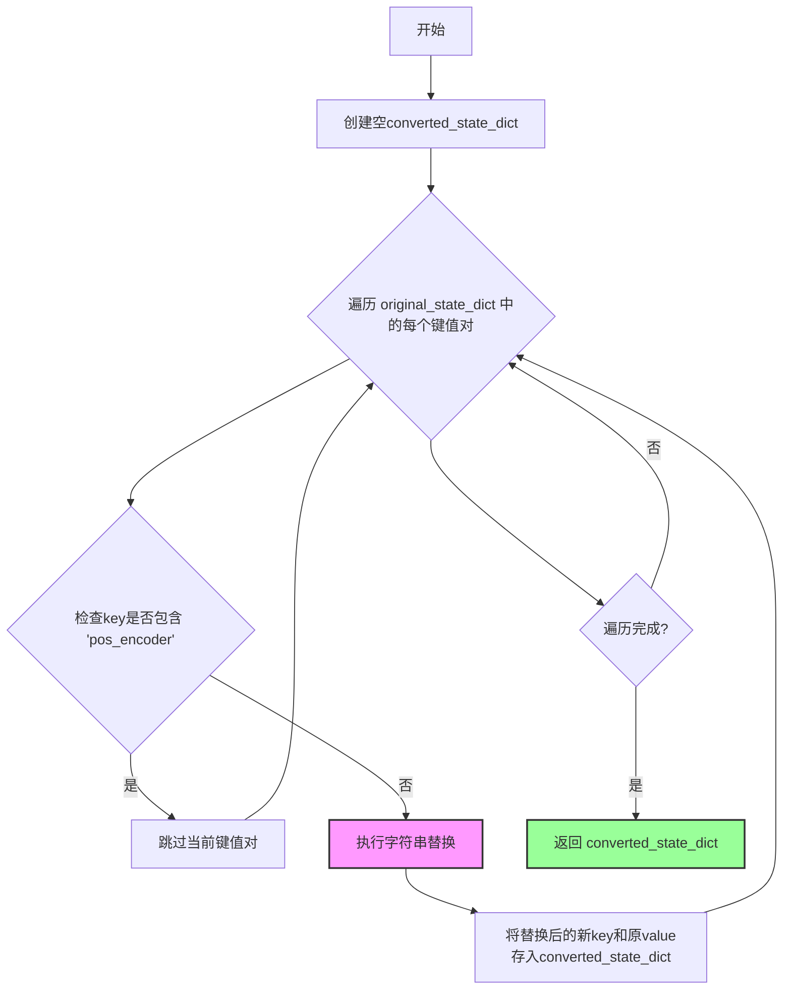
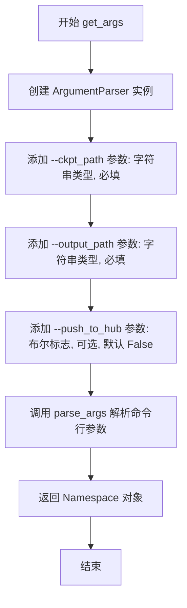
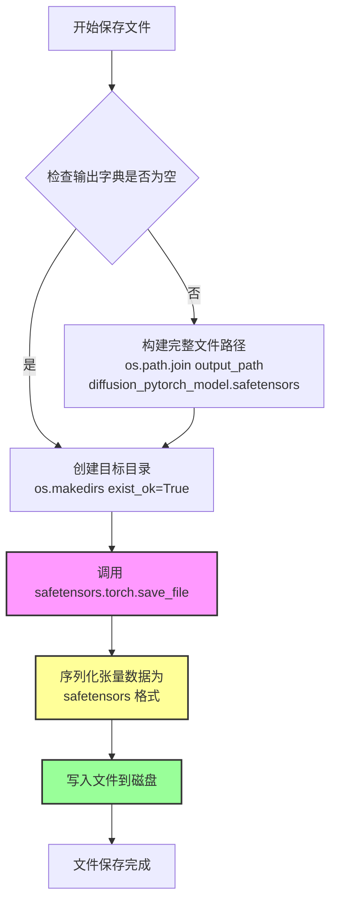
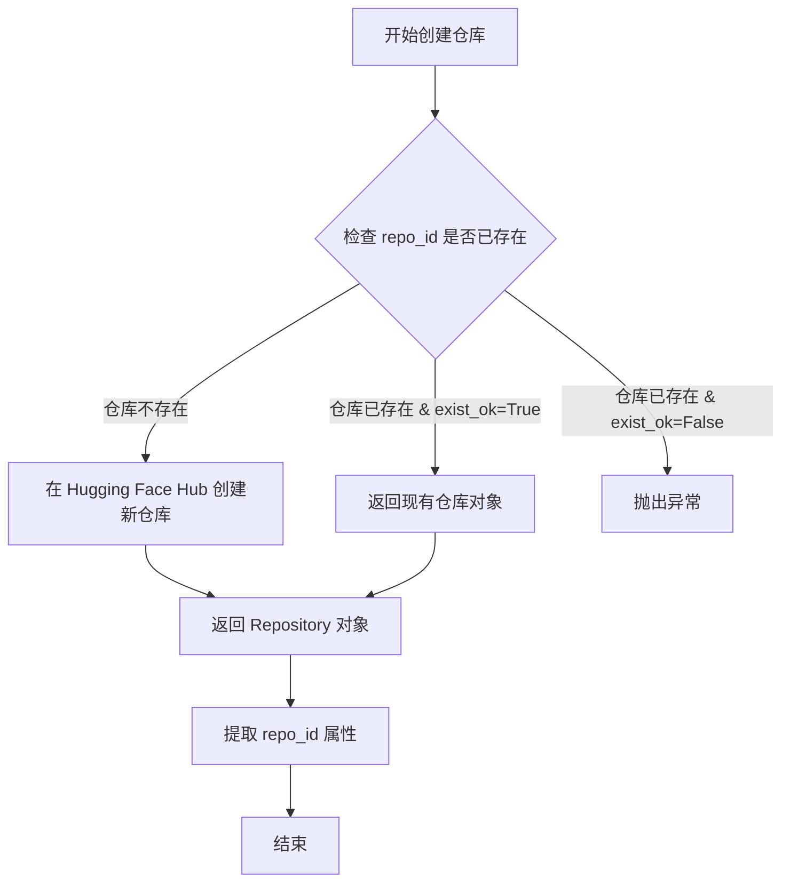
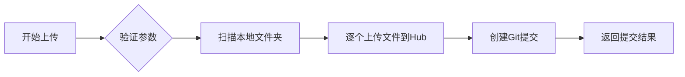

# `diffusers\scripts\convert_animatediff_motion_lora_to_diffusers.py` 详细设计文档

这是一个模型权重转换工具，用于将包含运动模块(motion module)的Diffusion模型权重从旧格式键名转换为新格式键名，支持加载.safetensors和.pt格式的checkpoint，转换后保存为safetensors文件，并可选择性地推送到HuggingFace Hub。

## 整体流程

```mermaid
graph TD
    A[开始] --> B[解析命令行参数]
    B --> C{ckpt_path以.safetensors结尾?}
C -- 是 --> D[使用load_file加载safetensors]
C -- 否 --> E[使用torch.load加载]
D --> F{state_dict中是否有'state_dict'键?}
E --> F
F -- 是 --> G[提取state_dict['state_dict']]
F -- 否 --> H[直接使用state_dict]
G --> I[调用convert_motion_module转换]
H --> I
I --> J[遍历转换后的键值对]
J --> K{类型是torch.Tensor?}
K -- 是 --> L[添加unet.前缀到键名]
K -- 否 --> M[跳过该键]
L --> N[构建output_dict]
M --> J
N --> O[创建输出目录]
O --> P[保存为diffusion_pytorch_model.safetensors]
P --> Q{push_to_hub为True?}
Q -- 是 --> R[创建HF仓库并上传]
Q -- 否 --> S[结束]
R --> S
```

## 类结构

```
该脚本为扁平化结构，无类定义
仅包含两个全局函数模块
```

## 全局变量及字段


### `original_state_dict`
    
原始checkpoint的参数字典，包含模型权重和参数

类型：`dict`
    


### `converted_state_dict`
    
转换后的参数字典，键名已按照新格式重命名

类型：`dict`
    


### `output_dict`
    
最终输出的参数字典，所有键已添加unet.前缀以便HuggingFace加载

类型：`dict`
    


### `args`
    
命令行参数对象，包含ckpt_path、output_path和push_to_hub等配置

类型：`argparse.Namespace`
    


### `filepath`
    
输出文件的完整路径，指向保存转换后模型的safetensors文件

类型：`str`
    


### `repo_id`
    
HuggingFace仓库ID，用于标识上传的模型仓库位置

类型：`str`
    


    

## 全局函数及方法


### `convert_motion_module`

该函数用于将运动模块（Motion Module）的权重键名从旧格式转换为新格式，通过字符串替换实现键名的规范化映射，同时过滤掉不需要的 `pos_encoder` 相关键。

参数：

- `original_state_dict`：`Dict[str, torch.Tensor]` ，原始的状态字典，包含旧格式的权重键名和对应的张量值

返回值：`Dict[str, torch.Tensor]` ，转换后的状态字典，键名已按规则替换为新格式

#### 流程图



#### 带注释源码

```python
def convert_motion_module(original_state_dict):
    """
    转换运动模块的权重键名格式
    
    参数:
        original_state_dict: 包含旧格式权重键名的状态字典
        
    返回:
        转换后的新格式状态字典
    """
    # 初始化结果字典
    converted_state_dict = {}
    
    # 遍历原始状态字典中的所有键值对
    for k, v in original_state_dict.items():
        # 如果键名包含 'pos_encoder'，则跳过（不转换）
        if "pos_encoder" in k:
            continue
        else:
            # 对键名进行一系列字符串替换操作，转换为新格式
            # .norms.0 -> .norm1: 归一化层0重命名为norm1
            # .norms.1 -> .norm2: 归一化层1重命名为norm2
            # .ff_norm -> .norm3: 前馈归一化层重命名为norm3
            # .attention_blocks.0 -> .attn1: 注意力块0重命名为attn1
            # .attention_blocks.1 -> .attn2: 注意力块1重命名为attn2
            # .temporal_transformer -> '': 移除temporal_transformer字符串
            converted_state_dict[
                k.replace(".norms.0", ".norm1")
                 .replace(".norms.1", ".norm2")
                 .replace(".ff_norm", ".norm3")
                 .replace(".attention_blocks.0", ".attn1")
                 .replace(".attention_blocks.1", ".attn2")
                 .replace(".temporal_transformer", "")
            ] = v

    # 返回转换后的状态字典
    return converted_state_dict
```


### `get_args`

该函数使用 argparse 库解析命令行参数，定义并返回三个命令行参数：模型检查点路径（`--ckpt_path`）、输出目录路径（`--output_path`）以及是否推送到 HuggingFace Hub 的布尔标志（`--push_to_hub`）。

参数：此函数无直接参数（通过 `argparse.ArgumentParser()` 内部管理参数）

返回值：`Namespace`，返回包含所有解析后命令行参数的命名空间对象，其中包含 `ckpt_path`、`output_path` 和 `push_to_hub` 三个属性。

#### 流程图



#### 带注释源码

```
def get_args():
    """
    解析并返回命令行参数
    
    使用 argparse 库定义命令行接口，收集以下参数:
    - ckpt_path: 模型检查点文件路径 (必填)
    - output_path: 输出目录路径 (必填)
    - push_to_hub: 是否推送到 HuggingFace Hub (可选, 默认 False)
    
    Returns:
        Namespace: 包含解析后命令行参数的命名空间对象
    """
    # 创建 ArgumentParser 实例，用于解析命令行参数
    # description 参数可以添加程序的整体描述信息
    parser = argparse.ArgumentParser()
    
    # 添加 --ckpt_path 参数
    # type=str: 参数值会被解析为字符串
    # required=True: 该参数为必填项，命令行必须提供
    # help: 参数的帮助文档，-h/--help 时显示
    parser.add_argument("--ckpt_path", type=str, required=True, help="Path to checkpoint")
    
    # 添加 --output_path 参数
    # 功能与 ckpt_path 类似，用于指定输出目录
    parser.add_argument("--output_path", type=str, required=True, help="Path to output directory")
    
    # 添加 --push_to_hub 参数
    # action="store_true": 这是一个布尔标志参数
    #   当命令行出现 --push_to_hub 时，值为 True
    #   当命令行未出现该参数时，值为 False (default=False)
    # default=False: 默认不推送到 HuggingFace Hub
    parser.add_argument(
        "--push_to_hub",
        action="store_true",
        default=False,
        help="Whether to push the converted model to the HF or not",
    )
    
    # 解析命令行参数并返回 Namespace 对象
    # sys.argv 会自动被 argparse 使用，无需手动传入
    # 返回的 Namespace 对象可以通过 args.ckpt_path, args.output_path, 
    # args.push_to_hub 访问参数值
    return parser.parse_args()
```


### `load_file`

该函数是 `safetensors.torch` 库提供的核心方法，用于从磁盘加载 `.safetensors` 格式的文件，并将其中的张量数据反序列化为 Python 字典返回。其核心优势在于可以直接将张量映射到指定设备，避免不必要的数据复制，比 PyTorch 原生的 `torch.load` 更加安全（不支持 pickle 反序列化任意对象）且高效。

参数：

-  `filename`：`str`，要加载的 `.safetensors` 文件的路径（必填）
-  `device`：`str`，指定张量加载到的目标设备，默认为 `"cpu"`（可选）

返回值：`Dict[str, torch.Tensor]`，返回字典，键为张量在文件中存储的名称（字符串），值为对应的 `torch.Tensor` 对象

#### 流程图

```mermaid
flowchart TD
    A[开始加载 safetensors 文件] --> B{检查文件是否存在且格式正确}
    B -->|是| C[打开二进制文件流]
    B -->|否| D[抛出 FileNotFoundError 或 ValueError]
    C --> E[读取文件头信息]
    E --> F[验证元数据合法性]
    F --> G{元数据有效?}
    G -->|是| H[按需创建目标张量容器]
    G -->|否| I[抛出异常]
    H --> J[循环读取每个张量数据块]
    J --> K{是否指定 device?}
    K -->|是| L[将张量放置到指定 device]
    K -->|否| M[默认保留在 CPU]
    L --> N[构建结果字典]
    M --> N
    N --> O[返回 Dict[str, Tensor]]
```

#### 带注释源码

```python
# 以下为基于 safetensors 库公开接口的模拟实现
# 实际源码位于: https://github.com/huggingface/safetensors/blob/main/bindings/torch/pybind.cpp 或 Python 封装层

def load_file(filename: str, device: str = "cpu") -> Dict[str, torch.Tensor]:
    """
    加载 safetensors 格式的文件并返回张量字典
    
    Args:
        filename: .safetensors 文件路径
        device: 目标设备，如 "cpu", "cuda", "cuda:0"
    
    Returns:
        包含所有张量的字典 {tensor_name: tensor}
    """
    # 1. 安全检查：确保文件以 .safetensors 结尾（可选，库本身不强制）
    if not filename.endswith(".safetensors"):
        # 可能会触发警告或自动处理
        pass
    
    # 2. 调用底层 C++/Rust 实现读取二进制数据
    # _safer_load_file 是库内部绑定函数
    loaded_data = _safer_load_file(filename, device)
    
    # 3. 返回字典结果
    return loaded_data

# 底层实现伪代码（实际为 C++/Rust）
# def _safer_load_file(filename, device):
#     # 读取文件头部 (8 字节: magic number + header size)
#     # 读取 JSON 元数据 (header size 字节)
#     # 解析元数据获取每个张量的名称、形状、数据类型、文件偏移量
#     # 分配 PyTorch 张量内存
#     # 根据偏移量读取二进制数据到张量
#     # 将张量移动到指定 device
#     # 返回字典
```

#### 关键组件信息

| 组件名称 | 一句话描述 |
|---------|-----------|
| `safetensors` 格式 | 一种基于 FlatBuffers 的序列化格式，用于安全存储 PyTorch 张量 |
| 张量元数据 | 存储在文件头部 JSON 中，包含每个张量的名称、形状、数据类型和偏移量 |
| `_safer_load_file` | safetensors 库的底层绑定函数，处理二进制数据的反序列化 |

#### 潜在的技术债务或优化空间

1. **设备兼容性**：当 `device` 指定为 CUDA 但当前环境无 GPU 时，函数会抛出 RuntimeError，缺少友好的错误提示
2. **内存映射**：当前实现会将整个文件加载到内存，对于超大型模型（如 100GB+）可能导致 OOM，未来可考虑支持内存映射（memory-mapped files）
3. **类型转换开销**：存储时若使用较低精度（如 float16），加载时转换为目标设备精度可能引入额外开销

#### 其它项目

**设计目标与约束**：
- 安全性优先：不支持 pickle 模式，防止恶意代码执行
- 兼容性：与 PyTorch 完全兼容，支持所有张量数据类型
- 性能：相比 `torch.load` 减少反序列化开销，支持内存零拷贝（取决于设备）

**错误处理与异常设计**：
- 文件不存在：`FileNotFoundError`
- 文件格式损坏：`ValueError` 或 `RuntimeError`
- 设备无效：`ValueError`（如指定不存在的 CUDA 设备）

**数据流**：
```
磁盘(.safetensors文件) --> 二进制流读取 --> 元数据解析 --> 张量反序列化 --> 设备映射 --> Python Dict
```

**外部依赖**：
- `torch`：依赖 PyTorch 张量对象
- `safetensors` 底层实现（C++/Rust 绑定）


### `save_file`

`save_file` 是来自 `safetensors.torch` 库的文件保存函数，用于将 PyTorch 张量状态字典安全地保存为 safetensors 格式文件。该函数内部会序列化张量数据并写入指定路径，支持大文件存储且具有更高的安全性和加载性能。

参数：

- `tensors`：`Dict[str, torch.Tensor]`（在代码中为 `output_dict`），需要保存的 PyTorch 状态字典，键为参数名称，值为对应的张量对象
- `filename`：`str`（在代码中为 `filepath`），保存目标文件的完整路径，包含文件名和扩展名（`.safetensors`）

返回值：`None`，该函数直接写入文件，不返回任何值

#### 流程图



#### 带注释源码

```python
# 构建输出文件路径：output_path/diffusion_pytorch_model.safetensors
filepath = os.path.join(args.output_path, "diffusion_pytorch_model.safetensors")

# 调用 save_file 函数将状态字典保存为 safetensors 格式
# 参数1: output_dict - 包含所有模型参数的字典，键名为 'unet.{module_name}' 格式
# 参数2: filepath - 完整的输出文件路径
# 内部实现：safetensors 库会将 PyTorch 张量序列化为二进制格式
#           支持大文件（超过 2GB），相比 pickle 更安全（防止代码执行攻击）
save_file(output_dict, filepath)
```

---

### 关键组件信息

| 组件名称 | 描述 |
|---------|------|
| `output_dict` | 转换后的模型状态字典，键名格式为 `unet.{module_name}`，值为 `torch.Tensor` |
| `filepath` | 输出文件的完整路径，指向 `diffusion_pytorch_model.safetensors` |
| `convert_motion_module()` | 状态字典键名转换函数，将旧版模块命名转换为新版命名规范 |

---

### 潜在技术债务与优化空间

1. **缺少错误处理**：调用 `save_file` 时未捕获可能的 I/O 异常（如磁盘空间不足、权限错误等）
2. **硬编码文件名**：`"diffusion_pytorch_model.safetensors"` 应作为可配置参数
3. **状态字典过滤不完整**：仅过滤了 `torch.Tensor` 类型，但未对异常值（如 None 或非张量对象）进行日志记录
4. **内存占用风险**：对于超大型模型，`output_dict` 可能占用大量内存，建议使用 `safetensors` 的分块保存或流式写入

---

### 其他项目

#### 设计目标与约束
- **目标**：将运动模块（Motion Module）的检查点转换为 HuggingFace Diffusers 兼容格式
- **约束**：输入支持 `.safetensors` 和 `.pth/.pt` 两种格式

#### 错误处理与异常设计
- 使用 `os.makedirs(..., exist_ok=True)` 防止目录已存在错误
- 假设 `save_file` 内部已处理序列化错误，外部未额外包装 try-except

#### 数据流与状态机
```
输入检查点 → 加载为 state_dict → 提取子字典 → 键名转换 → 重新组装为 unet.* 命名空间 → 保存为 safetensors
```

#### 外部依赖与接口契约
- `safetensors.torch.save_file`：外部库函数，契约为接收字典和路径，无返回值
- `torch.Tensor`：依赖 PyTorch 张量对象作为值类型


### `create_repo`

`create_repo` 是 huggingface_hub 库提供的函数，用于在 Hugging Face Hub 上创建一个新的模型仓库（Repository）。在当前代码中，它接收本地输出目录路径作为仓库标识符，并设置 `exist_ok=True` 以避免仓库已存在时抛出异常。成功创建后返回包含 `repo_id` 属性的 `Repository` 对象，用于后续的 `upload_folder` 操作将本地模型文件推送至远程仓库。

参数：

-  `repo_id`：`str`，在代码中传入 `args.output_path`，即本地输出目录路径，同时作为 Hugging Face Hub 上的仓库标识符（Repository ID）
-  `exist_ok`：`bool`，设置为 `True`，表示如果仓库已存在则不抛出异常，继续执行后续代码

返回值：`Repository`，返回 `huggingface_hub` 库中的 `Repository` 对象，包含 `repo_id` 属性（仓库的唯一标识符，格式为 `{username}/{repo_name}`），用于后续的 `upload_folder` 等操作

#### 流程图



#### 带注释源码

```python
# 使用 huggingface_hub 的 create_repo 函数创建远程仓库
# 参数1: args.output_path - 本地输出目录路径，作为仓库的唯一标识符
# 参数2: exist_ok=True - 如果仓库已存在，不抛出异常，返回现有仓库对象
repo_id = create_repo(args.output_path, exist_ok=True).repo_id

# create_repo 返回一个 Repository 对象，该对象包含以下重要属性：
# - repo_id: 仓库的唯一标识符，格式为 "namespace/repo_name"
# - url: 仓库的 HTTP URL
# - local_path: 本地克隆的仓库路径（如果使用 git 功能）

# 获取 repo_id 后，传递给 upload_folder 用于指定上传目标仓库
upload_folder(repo_id=repo_id, folder_path=args.output_path, repo_type="model")
```


### `upload_folder`

将本地文件夹的内容上传到 Hugging Face Hub 的指定仓库中，支持模型、数据集或 Spaces 仓库类型。

参数：
- `repo_id`：`str`，目标仓库的唯一标识符，格式为 "namespace/repo_name"。
- `folder_path`：`str`，本地要上传的文件夹路径。
- `repo_type`：`str`，仓库类型，默认为 "model"，可指定为 "dataset"、"space" 等。

返回值：`dict`，包含提交哈希（commit hash）等提交信息。

#### 流程图



#### 带注释源码

```python
# 调用 upload_folder 将本地文件夹上传到 Hugging Face Hub
# 参数：
#   repo_id: 目标仓库的ID（由 create_repo 返回）
#   folder_path: 本地文件夹路径（这里为输出目录）
#   repo_type: 仓库类型（"model" 表示模型仓库）
upload_folder(
    repo_id=repo_id,          # 仓库标识符
    folder_path=args.output_path, # 要上传的本地目录
    repo_type="model"         # 上传到模型仓库
)
```


## 关键组件


### 模型状态字典加载器

负责从不同格式（safetensors或pickle）加载模型权重，支持从HuggingFace Hub下载或本地文件系统读取

### 键名转换引擎

核心转换逻辑，将原始motion module的键名映射到新格式，包括norm层、attention block和temporal transformer的命名规范化

### 输出格式化器

将转换后的参数添加"unet."前缀前缀，构建符合新架构的输出字典结构

### SafeTensors文件持久化

将转换后的模型权重保存为safetensors格式，提供高效且安全的模型序列化

### HuggingFace Hub集成

支持将转换后的模型推送到HuggingFace Hub，包含仓库创建和文件夹上传功能

### 命令行参数解析器

通过argparse定义和验证运行时参数，包括检查点路径、输出目录和Hub推送选项


## 问题及建议


### 已知问题

-   缺少异常处理机制：未对文件加载失败、模型格式错误、键名不匹配等情况进行捕获和处理，可能导致程序直接崩溃
-   字符串替换逻辑脆弱：使用链式`.replace()`方法存在顺序依赖风险，若键名中同时包含多个待替换模式，可能产生意外结果
-   类型检查方式不推荐：使用`type(params) is not torch.Tensor`进行类型判断，应改用`isinstance()`更符合Pythonic写法
-   硬编码问题：`"unet."`前缀直接写在代码中，缺乏配置灵活性，不支持其他模型类型的转换
-   内存效率问题：一次性将整个state_dict加载到内存，对于超大模型可能导致OOM
-   函数职责不单一：`convert_motion_module`函数同时承担了过滤键和重命名键的职责，应拆分以提高可维护性
-   缺少日志记录：没有任何日志输出，用户无法了解程序执行状态和转换进度
-   CLI验证不足：未对输入路径存在性、文件格式正确性进行验证
-   缺少单元测试：核心转换逻辑没有对应的测试用例，难以验证正确性
-   HuggingFace Hub操作缺少错误处理：网络失败、认证问题等场景未考虑

### 优化建议

-   添加try-except块捕获文件加载异常，提供清晰的错误信息
-   使用正则表达式或配置字典管理键名映射关系，避免链式替换
-   重构代码抽取配置参数，支持命令行或配置文件传入模型前缀
-   引入`logging`模块记录转换过程的关键节点和统计信息
-   拆分`convert_motion_module`为`filter_keys`和`rename_keys`两个独立函数
-   添加路径验证函数，检查输入文件是否存在、扩展名是否合法
-   为Hub推送操作添加重试机制和错误处理
-   考虑添加`--dry-run`选项，仅打印转换结果而不实际写入文件
-   增加类型提示(type hints)提高代码可读性和IDE支持
-   添加基本的单元测试覆盖核心转换逻辑


## 其它


### 设计目标与约束

该工具旨在将旧格式的运动模块检查点转换为新格式，主要目标包括：1）实现键名映射转换，将`.norms.0`、`.norms.1`、`.ff_norm`等旧命名转换为`.norm1`、`.norm2`、`.norm3`新命名；2）将`attention_blocks.0`和`attention_blocks.1`转换为`attn1`和`attn2`；3）移除`temporal_transformer`前缀；4）支持safetensors和pickle两种格式的模型加载；5）可选地将转换后的模型推送到HuggingFace Hub。约束条件包括：输入必须是有效的PyTorch检查点文件，输出目录路径必须可写。

### 错误处理与异常设计

代码在多个关键点缺乏完善的错误处理机制。主要风险点包括：1）load_file和torch.load可能抛出文件不存在或格式错误的异常；2）create_repo和upload_folder在网络失败时会抛出异常；3）状态字典中可能不包含预期的键结构；4）张量类型检查可能遗漏非张量参数。改进建议：添加try-except块捕获FileNotFoundError、RuntimeError、ValueError等异常，提供有意义的错误信息；验证state_dict结构是否符合预期；对网络操作添加重试机制；记录详细的错误日志以便调试。

### 数据流与状态机

数据流如下：1）启动阶段：解析命令行参数获取ckpt_path、output_path和push_to_hub标志；2）加载阶段：根据文件扩展名选择load_file或torch.load加载检查点，如果包含state_dict键则提取；3）转换阶段：调用convert_motion_module对状态字典进行键名映射和过滤；4）构建输出阶段：遍历转换后的状态字典，过滤非张量参数，添加"unet."前缀；5）保存阶段：创建输出目录并保存为safetensors格式；6）可选推送阶段：创建或获取HuggingFace仓库并上传文件夹。整个过程是线性单向流动，无状态循环。

### 外部依赖与接口契约

代码依赖以下外部包：1）argparse：标准库，用于命令行参数解析；2）os：标准库，用于文件系统操作；3）torch：PyTorch核心库，用于模型加载和张量处理；4）huggingface_hub：HuggingFace Hub API，用于仓库创建和模型上传；5）safetensors：安全张量格式库，用于高效的张量序列化。接口契约包括：ckpt_path参数必须指向有效的模型检查点文件；output_path参数必须指向可写的目录路径；push_to_hub为可选标志；函数convert_motion_module接受字典类型状态字典并返回转换后的字典。

### 性能考虑

当前实现存在以下性能优化空间：1）状态字典遍历效率：当前多次遍历状态字典，可合并为单次遍历；2）字符串替换操作：连续的replace调用可使用正则表达式或映射表优化；3）内存占用：加载大模型时内存占用较高，可考虑流式处理或分块处理；4）上传性能：push_to_hub操作可添加进度显示和分块上传；5）GPU利用：当前使用CPU加载，可根据需要支持CUDA加速。

### 安全考虑

当前代码存在以下安全隐患：1）路径安全：output_path直接使用mkdir创建，未做路径遍历攻击防护；2）模型安全：直接加载任意路径的模型文件，存在代码执行风险；3）Hub推送：push_to_hub默认使用output_path作为repo_id，可能导致意外的仓库创建；4）敏感信息：模型权重可能包含敏感信息，上传前应添加警告提示。改进建议：对路径进行规范化验证，添加--repo_id参数明确指定仓库名称，添加上传确认提示。

### 配置管理

当前代码使用命令行参数进行配置，缺乏配置文件支持。建议添加：1）YAML/JSON配置文件支持，可通过--config参数指定；2）环境变量支持，如HF_TOKEN用于认证；3）默认配置文件查找机制；4）配置优先级：命令行参数 > 环境变量 > 配置文件 > 硬编码默认值。配置项应包括：ckpt_path、output_path、push_to_hub、repo_id、commit_message等。

### 版本兼容性

需要考虑以下版本兼容性：1）PyTorch版本：不同版本的torch.load可能存在API差异；2）safetensors格式：不同版本的库可能存在格式差异；3）huggingface_hub：API可能随版本变化；4）Python版本：建议支持Python 3.8+。建议在代码中添加版本检查和兼容性处理，必要时输出警告信息。

### 测试策略

建议添加以下测试用例：1）单元测试：测试convert_motion_module函数的键名转换逻辑；2）集成测试：测试完整的转换流程，包括各种输入格式；3）边界测试：测试空状态字典、缺失键、异常文件路径等；4）回归测试：确保转换后的模型能够被正确加载和使用；5）Mock测试：对huggingface_hub的API调用进行mock，避免网络依赖。

### 部署要求

部署时需要满足以下条件：1）Python 3.8+环境；2）安装所有依赖包：torch、huggingface_hub、safetensors；3）足够的磁盘空间用于临时文件；4）如需push_to_hub，需要设置HF_TOKEN环境变量进行认证；5）建议使用虚拟环境隔离依赖。Docker化部署可提供更好的可移植性和一致性。

### 日志记录与可观测性

当前代码缺乏日志记录机制。建议添加：1）使用Python logging模块记录关键操作；2）日志级别：DEBUG用于详细调试信息，INFO用于常规操作，WARNING用于潜在问题，ERROR用于错误；3）日志内容应包含：操作类型、操作状态、耗时、文件路径等；4）可添加--verbose标志控制日志详细程度；5）建议输出转换统计信息，如处理的键数量、跳过的键数量等。

    