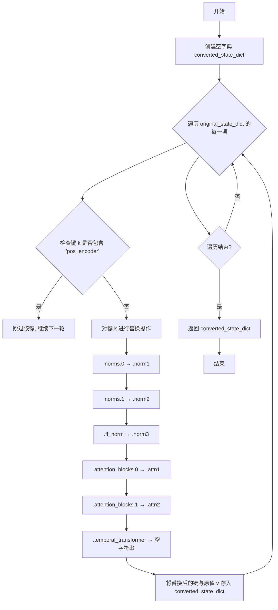

# `diffusers\scripts\convert_animatediff_motion_module_to_diffusers.py` 详细设计文档

这是一个用于将旧版运动模块(Motion Module)检查点转换为Diffusers库MotionAdapter格式的脚本,支持.safetensors和.pt格式的权重文件,并通过键名重映射将旧命名规则(如.attention_blocks.0, .norms.0)转换为新规则(如.attn1, .norm1),最终保存为可在Diffusers框架中使用的模型权重。

## 整体流程

```mermaid
graph TD
    A[开始] --> B[解析命令行参数]
    B --> C{ckpt_path以.safetensors结尾?}
    C -- 是 --> D[使用load_file加载safetensors]
    C -- 否 --> E[使用torch.load加载]
    D --> F{state_dict包含state_dict键?}
    E --> F
    F -- 是 --> G[提取state_dict[state_dict]]
    F -- 否 --> H[直接使用state_dict]
    G --> I[调用convert_motion_module转换]
    H --> I
    I --> J[创建MotionAdapter实例]
    J --> K[加载转换后的状态字典]
    K --> L[保存到output_path]
    L --> M{save_fp16为True?}
    M -- 是 --> N[转换为fp16并保存]
    M -- 否 --> O[结束]
```

## 类结构

```
无自定义类
使用第三方库:
├── MotionAdapter (diffusers库)
└── (基于torch.nn.Module)
```

## 全局变量及字段


### `original_state_dict`
    
原始检查点的状态字典

类型：`dict`
    


### `converted_state_dict`
    
转换后的状态字典

类型：`dict`
    


### `state_dict`
    
加载后的状态字典

类型：`dict`
    


### `adapter`
    
MotionAdapter实例

类型：`MotionAdapter`
    


### `args`
    
命令行参数命名空间

类型：`argparse.Namespace`
    


    

## 全局函数及方法


### `convert_motion_module`

该函数用于将运动模块的状态字典键名进行转换，通过跳过包含"pos_encoder"的键，并对特定键名进行重命名映射，以适配目标模型结构。

参数：

- `original_state_dict`：`Dict[str, Any]`，原始的运动模块状态字典，包含键值对形式的模型权重

返回值：`Dict[str, Any]`，转换后的状态字典，键名已按照规则重命名（将.norms.0→.norm1, .norms.1→.norm2, .ff_norm→.norm3, .attention_blocks.0→.attn1, .attention_blocks.1→.attn2, .temporal_transformer→空字符串）

#### 流程图



#### 带注释源码

```python
def convert_motion_module(original_state_dict):
    """
    转换运动模块状态字典的键名
    
    跳过 pos_encoder 相关的键，并对特定键名进行重命名：
    - .norms.0 → .norm1
    - .norms.1 → .norm2
    - .ff_norm → .norm3
    - .attention_blocks.0 → .attn1
    - .attention_blocks.1 → .attn2
    - .temporal_transformer → 空字符串
    
    参数:
        original_state_dict: 原始的运动模块状态字典
        
    返回:
        转换后的状态字典
    """
    # 创建空字典用于存储转换后的键值对
    converted_state_dict = {}
    
    # 遍历原始状态字典的每个键值对
    for k, v in original_state_dict.items():
        # 如果键中包含 "pos_encoder"，则跳过（不加载位置编码）
        if "pos_encoder" in k:
            continue
        else:
            # 对键名进行一系列替换操作
            converted_state_dict[
                k.replace(".norms.0", ".norm1")        # 替换第一个归一化层名称
                .replace(".norms.1", ".norm2")        # 替换第二个归一化层名称
                .replace(".ff_norm", ".norm3")        # 替换前馈网络归一化层名称
                .replace(".attention_blocks.0", ".attn1")  # 替换第一个注意力块名称
                .replace(".attention_blocks.1", ".attn2")  # 替换第二个注意力块名称
                .replace(".temporal_transformer", "")       # 移除时间变换器前缀
            ] = v

    # 返回转换后的状态字典
    return converted_state_dict
```


### `get_args()`

该函数是命令行参数解析器，负责定义并解析项目所需的所有命令行参数，包括模型检查点路径、输出路径、运动模块配置等关键参数，最终返回一个包含所有解析结果的命名空间对象。

参数：此函数无参数。

返回值：`argparse.Namespace`，包含以下属性的对象：
- `ckpt_path`：str，检查点文件路径
- `output_path`：str，输出目录路径
- `use_motion_mid_block`：bool，是否使用运动中间块
- `motion_max_seq_length`：int，运动模块最大序列长度
- `block_out_channels`：list[int]，块输出通道数列表
- `save_fp16`：bool，是否以FP16精度保存模型

#### 流程图

```mermaid
flowchart TD
    A[开始] --> B[创建ArgumentParser实例]
    B --> C[添加--ckpt_path参数: 字符串类型, 必需]
    C --> D[添加--output_path参数: 字符串类型, 必需]
    D --> E[添加--use_motion_mid_block参数: store_true动作]
    E --> F[添加--motion_max_seq_length参数: 整型, 默认值32]
    F --> G[添加--block_out_channels参数: 整型列表, 默认值[320, 640, 1280, 1280]]
    G --> H[添加--save_fp16参数: store_true动作]
    H --> I[调用parse_args解析命令行参数]
    I --> J[返回Namespace对象]
    J --> K[结束]
```

#### 带注释源码

```python
def get_args():
    """
    解析命令行参数并返回包含所有参数值的Namespace对象。
    
    该函数使用argparse模块定义项目所需的所有命令行参数，
    包括模型路径、输出配置、运动模块参数等。
    
    返回值:
        argparse.Namespace: 包含所有解析后命令行参数的对象
    """
    # 创建ArgumentParser实例，用于解析命令行参数
    # description参数可省略，此处为默认行为
    parser = argparse.ArgumentParser()
    
    # 添加检查点路径参数
    # type=str: 参数值会被解析为字符串
    # required=True: 该参数为必需参数，命令行必须提供
    parser.add_argument("--ckpt_path", type=str, required=True)
    
    # 添加输出路径参数
    # 指定转换后的模型保存路径
    parser.add_argument("--output_path", type=str, required=True)
    
    # 添加运动中间块开关参数
    # action="store_true": 当命令行包含此参数时，值为True；不包含时为False
    # 用于启用/禁用运动模块的中间块
    parser.add_argument("--use_motion_mid_block", action="store_true")
    
    # 添加运动模块最大序列长度参数
    # type=int: 参数值会被解析为整数
    # default=32: 当命令行未提供该参数时，使用默认值32
    parser.add_argument("--motion_max_seq_length", type=int, default=32)
    
    # 添加块输出通道参数
    # nargs="+": 接受一个或多个值，返回为列表
    # default=[320, 640, 1280, 1280]: 默认的UNet各层通道数配置
    # type=int: 所有值会被解析为整数
    parser.add_argument("--block_out_channels", nargs="+", default=[320, 640, 1280, 1280], type=int)
    
    # 添加FP16保存开关参数
    # action="store_true": 当命令行包含此参数时，值为True
    # 用于指定以float16精度保存模型以节省显存
    parser.add_argument("--save_fp16", action="store_true")
    
    # 解析命令行参数并返回Namespace对象
    # sys.argv会被自动读取，包含脚本名称和所有命令行参数
    return parser.parse_args()
```

## 关键组件


### 状态字典转换器 (convert_motion_module)

负责将原始运动模块的状态字典键名转换为diffusers兼容格式，跳过位置编码器键，并对norm层、注意力块等模块进行键名重命名

### 命令行参数解析器 (get_args)

定义并解析命令行参数，包括检查点路径、输出路径、运动中间块开关、最大序列长度、块输出通道数和fp16保存选项

### 检查点加载模块

根据文件扩展名自动选择加载方式，支持safetensors和pickle两种格式，并处理可能嵌套的state_dict结构

### MotionAdapter初始化与保存

创建MotionAdapter实例，使用转换后的状态字典加载权重（严格模式关闭以跳过位置嵌入），并支持保存fp16变体

### 键名转换规则

定义了6个主要的键名替换模式：norms.0→norm1、norms.1→norm2、ff_norm→norm3、attention_blocks.0→attn1、attention_blocks.1→attn2、temporal_transformer→空字符串


## 问题及建议


### 已知问题

-   **fp16保存逻辑缺陷**：先执行`adapter.save_pretrained(args.output_path)`保存完整精度模型，然后如果`save_fp16`为True，会再次调用`adapter.to(dtype=torch.float16).save_pretrained(args.output_path, variant="fp16")`覆盖之前的结果。正确做法是先判断是否需要保存fp16，或直接保存fp16版本而不保存全精度版本。
-   **字符串替换顺序风险**：`convert_motion_module`函数中使用链式`.replace()`方法，替换顺序依赖字符串内容。如果key中同时包含多个需要替换的模式，可能产生意外结果。例如先替换`.attention_blocks.0`再替换`.attention_blocks`可能导致逻辑错误。
-   **缺少异常处理**：没有对文件读取失败、模型加载异常、状态字典为空等情况进行捕获和处理，程序可能直接崩溃。
-   **状态字典检查不充分**：仅检查`state_dict`键是否存在，未验证其内容是否有效或符合预期的模型结构。
-   **无类型注解**：代码中未使用Python类型提示，降低了代码可读性和可维护性。
-   **硬编码默认值**：`block_out_channels`的默认值`[320, 640, 1280, 1280]`硬编码在`get_args`函数中，如果需要调整需要修改源码。
-   **缺少进度反馈**：大规模模型转换过程中没有任何日志输出，用户无法了解程序执行状态。

### 优化建议

-   **修复fp16保存逻辑**：重构条件逻辑，如果`save_fp16`为True，直接保存fp16版本；否则保存全精度版本，避免重复保存和覆盖。
-   **改进字符串替换**：使用正则表达式或分步替换的方式处理key转换，避免链式replace带来的顺序依赖问题。
-   **添加异常处理**：使用try-except捕获文件读取、模型加载等可能失败的场景，给出友好的错误提示。
-   **增加验证逻辑**：在加载状态字典后，检查其是否为空、键的数量是否符合预期等基本验证。
-   **添加类型注解**：为函数参数和返回值添加类型提示，提高代码可读性。
-   **配置外部化**：将默认超参数抽取为配置文件或命令行参数的默认值，减少硬编码。
-   **添加日志模块**：使用`logging`模块输出转换进度，如当前处理的键数量、转换完成提示等信息。

## 其它


### 设计目标与约束

本代码的设计目标是将第三方运动模块（Motion Module）的检查点转换为HuggingFace Diffusers库兼容的MotionAdapter格式，以便在Diffusers框架中使用预训练的运动模型。约束条件包括：必须支持.safetensors和.pt/.pth两种检查点格式；转换过程中需跳过位置编码（pos_encoder）以适配Diffusers的实现；加载状态字典时使用strict=False以允许部分键不匹配；输出路径必须为有效目录路径。

### 错误处理与异常设计

代码中的错误处理主要包括：使用try-except隐式处理文件加载异常，当检查点文件不存在或损坏时会抛出FileNotFoundError或torch.serialization.pickle错误；状态字典键检查使用条件判断处理可能的"state_dict"封装；命令行参数使用argparse的required=True确保必要参数必填；类型错误由argparse的type参数自动验证。潜在改进空间：可添加更详细的错误提示信息，捕获更多异常类型（如磁盘空间不足、权限错误等）。

### 数据流与状态机

数据流分为三个主要阶段：加载阶段根据文件后缀选择load_file或torch.load加载原始检查点，提取state_dict；转换阶段调用convert_motion_module对状态字典的键名进行批量替换和过滤（跳过pos_encoder相关键）；保存阶段创建MotionAdapter实例，加载转换后的状态字典，最终保存为Diffusers格式。无复杂状态机设计，仅为线性处理流程。

### 外部依赖与接口契约

主要外部依赖包括：torch（张量操作和模型加载）、safetensors.torch（safetensors格式加载）、diffusers.MotionAdapter（目标格式模型类）、argparse（命令行参数解析）。接口契约：convert_motion_module函数接收原始状态字典（dict类型），返回转换后的状态字典（dict类型）；get_args函数无参数输入，返回argparse.Namespace对象；主流程接受两个必需参数--ckpt_path和--output_path，均为字符串类型路径。

### 性能考虑

加载大文件时使用map_location="cpu"避免GPU内存占用；状态字典转换使用字典推导式批量处理，效率较高；save_pretrained支持可选的fp16转换以减少存储空间。潜在优化点：对于超大模型可考虑流式处理避免一次性加载整个状态字典到内存；可添加进度条反馈处理进度。

### 安全性考虑

代码本身不涉及用户输入的深度处理，安全性风险较低。需要注意的点：加载任意检查点文件存在代码执行风险（尽管torch.load默认已禁用pickle的unsafe模式）；建议在生产环境中对输入文件进行签名验证或来源校验。

### 配置与参数设计

命令行参数设计：--ckpt_path（必需）指定输入检查点路径；--output_path（必需）指定输出目录；--use_motion_mid_block（布尔）控制是否使用运动中间块；--motion_max_seq_length（整数，默认32）设置最大序列长度；--block_out_channels（多整数，默认[320,640,1280,1280]）定义块输出通道数；--save_fp16（布尔）控制是否保存fp16版本。所有参数均有合理默认值，便于快速使用。

### 使用示例与调用流程

基本使用：python script.py --ckpt_path motion_model.safetensors --output_path ./output_adapter；完整参数使用：python script.py --ckpt_path motion_model.pt --output_path ./output_adapter --use_motion_mid_block --motion_max_seq_length 64 --save_fp16。调用流程：解析参数→加载检查点→提取state_dict→转换键名→创建Adapter→加载状态→保存模型→（可选）转换fp16并保存。

### 兼容性考虑

向后兼容性：代码依赖diffusers库的MotionAdapter类，需确保使用兼容版本；文件格式兼容性：支持safetensors（推荐）和传统pickle格式；键名兼容性：convert_motion_module中的替换规则针对特定版本的原始运动模块设计，更新原始模块版本可能需要更新转换规则。

### 测试策略建议

建议添加的测试用例：正常流程测试（使用标准检查点文件验证转换正确性）；文件格式测试（分别测试.safetensors和.pt文件加载）；参数组合测试（各种可选参数的不同组合）；异常情况测试（文件不存在、格式错误、权限问题等）；状态字典键名转换完整性测试（验证所有应转换的键都被正确处理）。


    