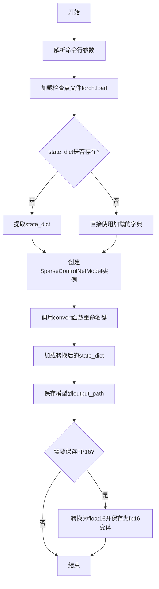
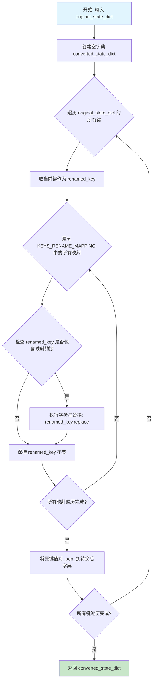
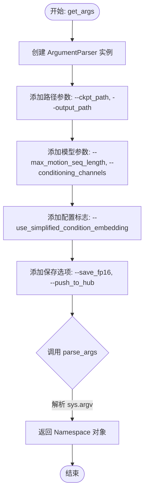
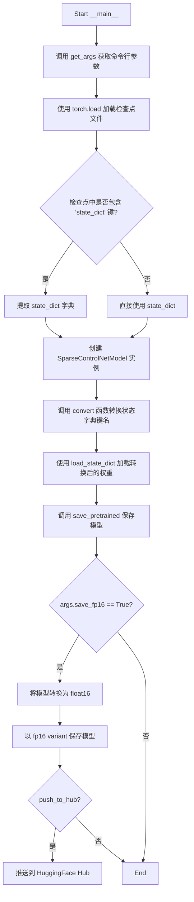

# `diffusers\scripts\convert_animatediff_sparsectrl_to_diffusers.py` 详细设计文档

该代码是一个检查点转换工具，用于将原始模型的权重键名重命名后加载到Hugging Face Diffusers的SparseControlNetModel中，并支持保存为FP16精度或推送到Hugging Face Hub。

## 整体流程



## 类结构

```
无自定义类
└── SparseControlNetModel (来自diffusers库，仅使用)
```

## 全局变量及字段


### `KEYS_RENAME_MAPPING`
    
定义模型权重键名的重映射规则

类型：`Dict[str, str]`
    


### `convert`
    
将原始状态字典的键名根据重映射规则进行转换

类型：`function`
    


### `get_args`
    
解析命令行参数并返回参数对象

类型：`function`
    


    

## 全局函数及方法


### `convert`

该函数是一个全局工具函数，用于将原始状态字典（state dictionary）的键名根据预定义的映射规则进行重命名，以便将旧版本或特定格式的模型权重键转换为新版本或目标格式的键名，支持模型权重的迁移和兼容性处理。

参数：

- `original_state_dict`：`Dict[str, nn.Module]`，原始的状态字典，键为字符串类型（表示层的名称），值为 nn.Module 类型（表示模型权重）

返回值：`dict[str, nn.Module]`，转换后的状态字典，键名为重命名后的字符串，值保持为原始的 nn.Module 对象

#### 流程图



#### 带注释源码

```python
def convert(original_state_dict: Dict[str, nn.Module]) -> dict[str, nn.Module]:
    """
    将原始状态字典的键名根据映射规则重命名
    
    该函数遍历原始字典的所有键，对每个键应用 KEYS_RENAME_MAPPING 中定义的
    替换规则，将旧版本或特定格式的键名转换为新格式的键名。使用了 pop 方法
    来直接在原始字典上移除键值对，节省内存空间。
    
    参数:
        original_state_dict: Dict[str, nn.Module]
            原始的状态字典，键为字符串类型的层名称，值为 nn.Module 类型的权重
            
    返回:
        dict[str, nn.Module]
            重命名后的状态字典，键为转换后的字符串，值为原始权重
    """
    # 创建一个空字典用于存储转换后的键值对
    converted_state_dict = {}

    # 遍历原始字典的所有键（使用 list 创建副本，避免迭代过程中修改字典导致问题）
    for key in list(original_state_dict.keys()):
        # 初始化重命名后的键为当前键
        renamed_key = key
        
        # 遍历所有的键名映射规则
        # 注意：映射字典中 new_name 是要替换的内容，old_name 是替换后的结果
        # 这与常规的 old->new 顺序相反，需要注意
        for new_name, old_name in KEYS_RENAME_MAPPING.items():
            # 使用字符串的 replace 方法进行替换
            # 将键中的 new_name 部分替换为 old_name
            renamed_key = renamed_key.replace(new_name, old_name)
            
        # 将原键对应的值从原始字典中 pop 出来，并添加到转换后的字典中
        # 使用新的键名 renamed_key 作为键
        # 注意：这个操作会修改 original_state_dict 字典本身
        converted_state_dict[renamed_key] = original_state_dict.pop(key)

    # 返回转换后的状态字典
    return converted_state_dict


# 键名映射字典，定义了旧键名到新键名的转换规则
# 格式说明：键（新名称/要替换的内容） -> 值（旧名称/替换结果）
KEYS_RENAME_MAPPING = {
    ".attention_blocks.0": ".attn1",          # 将注意力块0重命名为attn1
    ".attention_blocks.1": ".attn2",          # 将注意力块1重命名为attn2
    ".attn1.pos_encoder": ".pos_embed",       # 将位置编码器重命名
    ".ff_norm": ".norm3",                     # 将前馈归一化层重命名
    ".norms.0": ".norm1",                     # 将归一化层0重命名
    ".norms.1": ".norm2",                     # 将归一化层1重命名
    ".temporal_transformer": "",              # 将时间变换器相关键名移除（替换为空字符串）
}
```


### `get_args`

**描述**：初始化 `ArgumentParser` 对象，定义并注册模型转换工具所需的命令行参数（包括检查点路径、输出路径、运动序列长度、精度选项等），随后解析 `sys.argv` 并返回一个包含所有参数值的 `Namespace` 对象，供主程序调用。

**参数**：
- 无（不接受显式输入参数，依赖隐式的系统命令行参数 `sys.argv`）

**返回值**：`argparse.Namespace`，包含以下属性：
- `ckpt_path`：`str`，检查点文件路径。
- `output_path`：`str`，转换后模型的输出目录路径。
- `max_motion_seq_length`：`int`，运动适配器支持的最大序列长度（默认 32）。
- `conditioning_channels`：`int`，ControlNet 条件输入的通道数（默认 4）。
- `use_simplified_condition_embedding`：`bool`，是否使用简化的条件嵌入。
- `save_fp16`：`bool`，是否以 fp16 精度保存模型。
- `push_to_hub`：`bool`，是否将模型推送至 Hugging Face Hub。

#### 流程图



#### 带注释源码

```python
def get_args():
    """
    解析命令行参数并返回命名空间对象。
    """
    # 1. 初始化参数解析器
    parser = argparse.ArgumentParser()

    # 2. 添加必需路径参数
    parser.add_argument("--ckpt_path", type=str, required=True, help="Path to checkpoint")
    parser.add_argument("--output_path", type=str, required=True, help="Path to output directory")

    # 3. 添加模型配置参数
    parser.add_argument(
        "--max_motion_seq_length",
        type=int,
        default=32,
        help="Max motion sequence length supported by the motion adapter",
    )
    parser.add_argument(
        "--conditioning_channels", type=int, default=4, help="Number of channels in conditioning input to controlnet"
    )
    parser.add_argument(
        "--use_simplified_condition_embedding",
        action="store_true",
        default=False,
        help="Whether or not to use simplified condition embedding. When `conditioning_channels==4` i.e. latent inputs, set this to `True`. When `conditioning_channels==3` i.e. image inputs, set this to `False`",
    )

    # 4. 添加保存与部署选项
    parser.add_argument(
        "--save_fp16",
        action="store_true",
        default=False,
        help="Whether or not to save model in fp16 precision along with fp32",
    )
    parser.add_argument(
        "--push_to_hub", action="store_true", default=False, help="Whether or not to push saved model to the HF hub"
    )

    # 5. 解析并返回参数
    return parser.parse_args()
```


### `__main__`

这是程序的入口点，负责加载预训练检查点、转换状态字典的键名映射、创建SparseControlNetModel实例、加载转换后的权重并保存模型。可选地以FP16精度保存模型，并支持推送到HuggingFace Hub。

参数：
- 该代码块无显式参数，通过内部调用 `get_args()` 获取以下命令行参数：
  - `ckpt_path`：`str`，检查点文件路径
  - `output_path`：`str`，输出目录路径
  - `max_motion_seq_length`：`int`，运动适配器支持的最大运动序列长度，默认32
  - `conditioning_channels`：`int`，ControlNet条件输入的通道数，默认4
  - `use_simplified_condition_embedding`：`bool`，是否使用简化条件嵌入，默认False
  - `save_fp16`：`bool`，是否以FP16精度保存模型，默认False
  - `push_to_hub`：`bool`，是否将模型推送到HuggingFace Hub，默认False

返回值：`None`，该代码块执行模型转换和保存的副作用操作，无返回值

#### 流程图



#### 带注释源码

```
if __name__ == "__main__":
    """
    程序入口点：模型权重转换与保存主流程
    """
    # 步骤1：解析命令行参数
    # 获取检查点路径、输出路径及模型配置参数
    args = get_args()

    # 步骤2：加载原始检查点
    # 从指定路径加载PyTorch模型权重到CPU内存
    # 返回的state_dict可能包含"state_dict"键（标准格式）或直接是权重字典
    state_dict = torch.load(args.ckpt_path, map_location="cpu")
    
    # 兼容处理：检查点可能包装在"state_dict"键内
    # 例如：torch.save({"state_dict": model.state_dict()}, checkpoint)
    if "state_dict" in state_dict.keys():
        state_dict: dict = state_dict["state_dict"]

    # 步骤3：创建SparseControlNetModel实例
    # 根据命令行参数初始化控制网络模型结构
    # - conditioning_channels: 条件输入的通道数（4为latent，3为image）
    # - motion_max_seq_length: 运动序列的最大长度
    # - use_simplified_condition_embedding: 是否使用简化条件嵌入
    controlnet = SparseControlNetModel(
        conditioning_channels=args.conditioning_channels,
        motion_max_seq_length=args.max_motion_seq_length,
        use_simplified_condition_embedding=args.use_simplified_condition_embedding,
    )

    # 步骤4：转换状态字典的键名
    # 将原始键名映射为新键名（适配目标模型结构）
    # 例如：".attention_blocks.0" -> ".attn1"
    state_dict = convert(state_dict)

    # 步骤5：加载转换后的权重到模型
    # strict=True确保所有键完全匹配，防止权重遗漏
    controlnet.load_state_dict(state_dict, strict=True)

    # 步骤6：保存模型到指定目录
    # 支持推送到HuggingFace Hub
    controlnet.save_pretrained(args.output_path, push_to_hub=args.push_to_hub)
    
    # 步骤7：可选的FP16精度保存
    # 当指定--save_fp16时，额外保存一份FP16版本的模型
    if args.save_fp16:
        # 转换模型权重为半精度浮点数
        controlnet = controlnet.to(dtype=torch.float16)
        # 保存时指定variant="fp16"，HuggingFace会自动识别
        controlnet.save_pretrained(args.output_path, variant="fp16", push_to_hub=args.push_to_hub)
```

## 关键组件


### 键名重命名映射 (KEYS_RENAME_MAPPING)

一个字典常量，定义了原始检查点中键名到新键名的映射规则，用于将不同版本的模型权重键名统一转换为新版本格式，支持注意力块、规范层、位置编码器等组件的键名转换。

### 状态字典转换函数 (convert)

接受原始状态字典，遍历所有键并根据KEYS_RENAME_MAPPING进行重命名，返回转换后的新状态字典，用于适配新版本模型结构。

### 命令行参数解析函数 (get_args)

定义并解析命令行参数，包括检查点路径、输出路径、最大运动序列长度、条件通道数、简化条件嵌入选项、FP16保存选项和推送到HuggingFace Hub选项。

### SparseControlNetModel 加载与保存流程

主程序逻辑流程：加载检查点文件 -> 提取state_dict -> 实例化SparseControlNetModel -> 转换键名 -> 加载权重 -> 保存模型 -> 可选保存FP16版本。


## 问题及建议


### 已知问题

- **错误处理缺失**：未对`torch.load`进行异常捕获，文件不存在或损坏时会直接崩溃；`load_state_dict`使用`strict=True`但未处理键不匹配情况
- **参数校验不足**：`max_motion_seq_length`和`conditioning_channels`等关键参数未做有效性验证，可能导致模型加载失败
- **硬编码映射表**：KEYS_RENAME_MAPPING固定写死，扩展性差；且替换顺序依赖遍历字典的顺序，存在潜在的优先级冲突风险
- **类型注解不一致**：convert函数参数和返回值缺少完整的类型注解
- **内存效率问题**：使用`pop`修改原始字典，对大模型 checkpoint 可能导致内存问题
- **边界情况未处理**：未检查`state_dict`中是否真的存在`"state_dict"`键，也未处理空字典情况

### 优化建议

- 添加完整的异常处理机制，对文件加载、模型保存等关键操作使用try-except包裹
- 在参数解析后增加校验逻辑，确保数值参数为正整数、路径有效等
- 将KEYS_RENAME_MAPPING改为可配置或从外部文件读取，增加扩展性
- 为所有函数添加完整的类型注解
- 使用`get`方法或复制字典代替`pop`，避免修改原始输入
- 考虑将重复的`push_to_hub`逻辑封装为辅助函数，减少代码重复

## 其它


### 设计目标与约束

本代码的设计目标是实现SparseControlNetModel检查点的键名转换与模型加载功能。具体约束包括：1) 键名转换仅支持预定义的KEYS_RENAME_MAPPING中的映射，不支持动态映射；2) 转换过程中使用strict=True进行状态字典加载，要求键名完全匹配；3) 模型保存支持fp16和fp32两种精度；4) 支持推送到HuggingFace Hub。

### 错误处理与异常设计

1. 键名转换失败：如果原始状态字典中的键无法在KEYS_RENAME_MAPPING中找到对应映射，键名保持不变继续处理。2. 状态字典加载失败：当load_state_dict使用strict=True时，若存在不匹配的键会抛出RuntimeError。3. 文件路径错误：若ckpt_path指向不存在的文件，torch.load会抛出FileNotFoundError。4. 磁盘空间不足：保存模型时若磁盘空间不足会抛出OSError。5. Hub推送失败：push_to_hub失败时会抛出异常但不影响本地模型保存。

### 数据流与状态机

数据流如下：1) 解析命令行参数获取ckpt_path和output_path；2) 使用torch.load加载原始检查点到state_dict；3) 检查state_dict是否包含"state_dict"键，若包含则提取；4) 调用convert函数对state_dict的键名进行转换；5) 创建SparseControlNetModel实例；6) 使用转换后的state_dict加载模型；7) 保存模型到output_path，若指定save_fp16则额外保存fp16版本。

### 外部依赖与接口契约

主要外部依赖包括：1) torch (PyTorch) - 用于张量操作和模型加载；2) diffusers.SparseControlNetModel - 目标模型类；3) argparse - 命令行参数解析。接口契约：ckpt_path必须指向包含模型权重或state_dict的.pt/.pth文件；output_path必须为有效目录路径；max_motion_seq_length默认为32；conditioning_channels默认为4；use_simplified_condition_embedding默认为False。

### 性能考虑

1) 键名转换使用字符串replace操作，对于大型state_dict（可能有数百万键）效率较低，可考虑使用正则表达式批量替换；2) torch.load使用map_location="cpu"避免GPU内存溢出；3) fp16转换和保存会占用额外磁盘空间。

### 测试策略建议

1) 单元测试：测试KEYS_RENAME_MAPPING覆盖所有已知键名模式；测试convert函数对各种输入的处理。2) 集成测试：使用真实检查点文件测试完整流程。3) 边界测试：测试空state_dict、只有一个键的state_dict、包含未映射键的state_dict。

### 安全性考虑

1) 代码不涉及用户输入的直接处理，安全性风险较低；2) torch.load加载未知检查点文件时需注意潜在的恶意序列化对象；3) push_to_hub需注意访问令牌的安全管理。

### 潜在改进空间

1) 支持更灵活的键名映射配置，如支持正则表达式；2) 添加键名转换日志，便于调试；3) 支持增量转换而非一次性替换；4) 添加状态字典兼容性检查，在strict=False模式下报告不匹配的键；5) 支持从URL加载检查点。

    