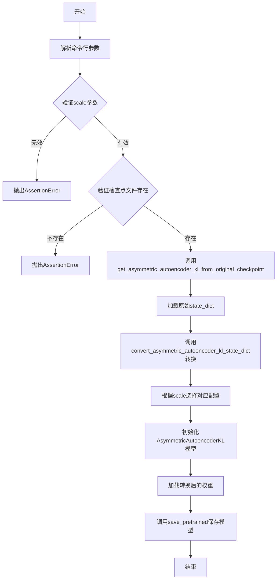
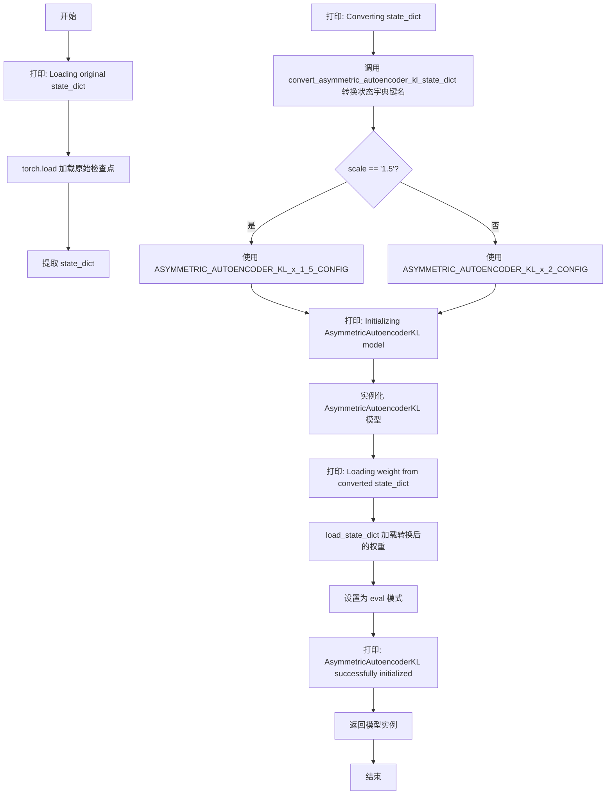

# `diffusers\scripts\convert_asymmetric_vqgan_to_diffusers.py` 详细设计文档

一个用于将原始Asymmetric VQGAN检查点转换为Hugging Face Diffusers格式的AsymmetricAutoencoderKL模型的转换脚本，支持1.5和2两种规模的模型。

## 整体流程



## 类结构

```
无自定义类
└── AsymmetricAutoencoderKL (来自diffusers库)
```

## 全局变量及字段


### `ASYMMETRIC_AUTOENCODER_KL_x_1_5_CONFIG`
    
AsymmetricAutoencoderKL模型在1.5倍缩放下的配置字典，包含输入输出通道、下采样/上采样块类型、层数、激活函数、潜在通道数等架构参数

类型：`Dict[str, Any]`
    


### `ASYMMETRIC_AUTOENCODER_KL_x_2_CONFIG`
    
AsymmetricAutoencoderKL模型在2倍缩放下的配置字典，包含输入输出通道、下采样/上采样块类型、层数、激活函数、潜在通道数等架构参数

类型：`Dict[str, Any]`
    


    

## 全局函数及方法


### `convert_asymmetric_autoencoder_kl_state_dict`

该函数用于将原始 Asymmetric Autoencoder KL 检查点的状态字典（state_dict）键名进行转换，使其与 Hugging Face Diffusers 库中的 `AsymmetricAutoencoderKL` 模型结构兼容，处理编码器、解码器、量化卷积等各部分键名的映射与权重形状修正。

参数：

- `original_state_dict`：`Dict[str, Any]`，原始模型检查点的状态字典

返回值：`dict[str, Any]`，转换后的状态字典

#### 流程图

```mermaid
flowchart TD
    A[开始] --> B[初始化空字典 converted_state_dict]
    B --> C[遍历 original_state_dict 的每个键值对]
    C --> D{判断键前缀}
    D -->|以 "encoder." 开头| E[应用编码器键名替换规则]
    D -->|以 "decoder." 开头且无 "up_layers"| F[应用解码器键名替换规则]
    D -->|以 "quant_conv." 开头| G[直接复制键值]
    D -->|以 "post_quant_conv." 开头| G
    D -->|其他| H[打印跳过警告]
    E --> I[存储转换后的键值对]
    F --> I
    G --> I
    H --> I
    I --> C
    C --> J{遍历完成?}
    J -->|否| C
    J -->|是| K[遍历 converted_state_dict 修复权重形状]
    K --> L[返回转换后的状态字典]
```

#### 带注释源码

```python
def convert_asymmetric_autoencoder_kl_state_dict(original_state_dict: Dict[str, Any]) -> dict[str, Any]:
    """
    将原始检查点的 state_dict 键名转换为 Diffusers AsymmetricAutoencoderKL 兼容格式
    
    参数:
        original_state_dict: 原始模型的状态字典
        
    返回:
        转换后的状态字典
    """
    # 初始化转换后的状态字典
    converted_state_dict = {}
    
    # 遍历原始状态字典的每个键值对
    for k, v in original_state_dict.items():
        # 处理编码器部分的键名映射
        if k.startswith("encoder."):
            converted_state_dict[
                k.replace("encoder.down.", "encoder.down_blocks.")
                .replace("encoder.mid.", "encoder.mid_block.")
                .replace("encoder.norm_out.", "encoder.conv_norm_out.")
                .replace(".downsample.", ".downsamplers.0.")
                .replace(".nin_shortcut.", ".conv_shortcut.")
                .replace(".block.", ".resnets.")
                .replace(".block_1.", ".resnets.0.")
                .replace(".block_2.", ".resnets.1.")
                .replace(".attn_1.k.", ".attentions.0.to_k.")
                .replace(".attn_1.q.", ".attentions.0.to_q.")
                .replace(".attn_1.v.", ".attentions.0.to_v.")
                .replace(".attn_1.proj_out.", ".attentions.0.to_out.0.")
                .replace(".attn_1.norm.", ".attentions.0.group_norm.")
            ] = v
        # 处理解码器部分的键名映射（排除 up_layers 相关键）
        elif k.startswith("decoder.") and "up_layers" not in k:
            converted_state_dict[
                k.replace("decoder.encoder.", "decoder.condition_encoder.")
                .replace(".norm_out.", ".conv_norm_out.")
                .replace(".up.0.", ".up_blocks.3.")
                .replace(".up.1.", ".up_blocks.2.")
                .replace(".up.2.", ".up_blocks.1.")
                .replace(".up.3.", ".up_blocks.0.")
                .replace(".block.", ".resnets.")
                .replace("mid", "mid_block")
                .replace(".0.upsample.", ".0.upsamplers.0.")
                .replace(".1.upsample.", ".1.upsamplers.0.")
                .replace(".2.upsample.", ".2.upsamplers.0.")
                .replace(".nin_shortcut.", ".conv_shortcut.")
                .replace(".block_1.", ".resnets.0.")
                .replace(".block_2.", ".resnets.1.")
                .replace(".attn_1.k.", ".attentions.0.to_k.")
                .replace(".attn_1.q.", ".attentions.0.to_q.")
                .replace(".attn_1.v.", ".attentions.0.to_v.")
                .replace(".attn_1.proj_out.", ".attentions.0.to_out.0.")
                .replace(".attn_1.norm.", ".attentions.0.group_norm.")
            ] = v
        # 保留量化卷积层
        elif k.startswith("quant_conv."):
            converted_state_dict[k] = v
        # 保留后量化卷积层
        elif k.startswith("post_quant_conv."):
            converted_state_dict[k] = v
        # 打印跳过的键
        else:
            print(f"  skipping key `{k}`")
    
    # 修复 mid_block attention 权重形状（从 [C, C, 1, 1] 变为 [C, C]）
    for k, v in converted_state_dict.items():
        if (
            (k.startswith("encoder.mid_block.attentions.0") or k.startswith("decoder.mid_block.attentions.0"))
            and k.endswith("weight")
            and ("to_q" in k or "to_k" in k or "to_v" in k or "to_out" in k)
        ):
            converted_state_dict[k] = converted_state_dict[k][:, :, 0, 0]

    return converted_state_dict
```


### `get_asymmetric_autoencoder_kl_from_original_checkpoint`

该函数用于从原始的 Asymmetric VQGAN 检查点加载并转换为 diffusers 库中的 `AsymmetricAutoencoderKL` 模型，通过状态字典键名的映射转换实现跨框架模型迁移。

参数：

- `scale`：`Literal["1.5", "2"]`，指定模型规模，决定使用 1.5 还是 2 倍的模型配置
- `original_checkpoint_path`：`str`，原始检查点文件的路径
- `map_location`：`torch.device`，加载检查点时的设备映射位置

返回值：`AsymmetricAutoencoderKL`，转换并加载权重后的模型实例

#### 流程图



#### 带注释源码

```python
def get_asymmetric_autoencoder_kl_from_original_checkpoint(
    scale: Literal["1.5", "2"],       # 模型规模: "1.5" 或 "2"
    original_checkpoint_path: str,    # 原始检查点文件路径
    map_location: torch.device        # torch 设备，用于加载张量到指定设备
) -> AsymmetricAutoencoderKL:         # 返回转换后的模型实例
    """
    从原始检查点加载并转换 AsymmetricAutoencoderKL 模型。
    
    转换流程:
    1. 加载原始检查点的 state_dict
    2. 将原始键名转换为 diffusers 格式的键名
    3. 根据 scale 选择对应的模型配置
    4. 初始化模型并加载转换后的权重
    5. 设置为评估模式并返回模型
    """
    # Step 1: 加载原始状态字典
    print("Loading original state_dict")
    original_state_dict = torch.load(original_checkpoint_path, map_location=map_location)
    original_state_dict = original_state_dict["state_dict"]  # 提取 state_dict 字典
    
    # Step 2: 转换状态字典键名格式
    print("Converting state_dict")
    converted_state_dict = convert_asymmetric_autoencoder_kl_state_dict(original_state_dict)
    
    # Step 3: 根据 scale 选择模型配置
    kwargs = ASYMMETRIC_AUTOENCODER_KL_x_1_5_CONFIG if scale == "1.5" else ASYMMETRIC_AUTOENCODER_KL_x_2_CONFIG
    
    # Step 4: 初始化模型
    print("Initializing AsymmetricAutoencoderKL model")
    asymmetric_autoencoder_kl = AsymmetricAutoencoderKL(**kwargs)
    
    # Step 5: 加载转换后的权重
    print("Loading weight from converted state_dict")
    asymmetric_autoencoder_kl.load_state_dict(converted_state_dict)
    asymmetric_autoencoder_kl.eval()  # 设置为评估模式，禁用 dropout 和 batch normalization 的训练行为
    
    # Step 6: 完成并返回模型
    print("AsymmetricAutoencoderKL successfully initialized")
    return asymmetric_autoencoder_kl
```

## 关键组件


### 配置管理

定义了两个版本的AsymmetricAutoencoderKL模型配置（1.5和2版本），包含模型架构参数如输入输出通道、块类型、层数等，用于初始化目标模型。

### 状态字典转换

实现了原始检查点权重键名到Diffusers格式的映射转换，支持encoder和decoder部分的键名重命名，包含对注意力层、归一化层、上采样层等的键名适配，并处理权重形状调整。

### 模型加载与初始化

从原始检查点加载权重，进行格式转换，根据scale参数选择对应配置，初始化AsymmetricAutoencoderKL模型并加载转换后的权重，最后保存为Diffusers格式。

### 命令行参数解析

提供scale（1.5或2）、original_checkpoint_path、output_path和map_location等参数，用于指定转换任务的具体需求和设备映射。

### 错误处理与验证

对scale参数进行断言验证，检查原始检查点文件是否存在，确保输入参数的有效性。

### 性能与计时

使用time模块记录转换过程的耗时，用于性能监控和日志输出。


## 问题及建议


### 已知问题

-   **硬编码的配置字典**：`ASYMMETRIC_AUTOENCODER_KL_x_1_5_CONFIG` 和 `ASYMMETRIC_AUTOENCODER_KL_x_2_CONFIG` 字典内容与diffusers库中的定义重复硬编码，容易产生版本不一致问题
-   **复杂的状态字典转换逻辑**：`convert_asymmetric_autoencoder_kl_state_dict` 函数中使用大量链式 `.replace()` 调用，代码可读性差，难以维护和调试，容易在模型结构变化时引入bug
- **缺少安全的模型加载**：使用 `torch.load` 时未指定 `weights_only=True` 参数，存在潜在的安全风险（虽然加载本地文件风险较低）
- **硬编码的权重形状修复逻辑**：mid_block注意力层权重形状调整逻辑硬编码了 `"0"` 索引，假设只有一个attention层，缺乏灵活性
- **使用print语句进行进度输出**：应该使用 `logging` 模块代替，便于控制日志级别和输出格式
- **使用assert进行参数验证**：在生产环境中应使用更友好的错误处理机制，如抛出自定义异常
- **load_state_dict返回值未处理**：未检查 `load_state_dict` 的返回值，无法得知权重加载是否完全匹配模型结构
- **map_location参数类型处理不一致**：命令行接受字符串但函数签名期望 `torch.device` 对象，虽有转换但增加了不必要的处理

### 优化建议

-   将配置字典提取为独立的配置文件或从diffusers库中动态获取，避免重复定义
-   重构状态字典转换逻辑，使用更结构化的方式（如正则表达式匹配或映射表）替代大量字符串替换
-   在 `torch.load` 调用时添加 `weights_only=True` 参数以提升安全性
-   使用 `logging` 模块替换所有 `print` 语句，并设置合理的日志级别
-   将参数验证改为自定义异常或使用 `argparse` 的 `choices` 参数进行类型限制
-   检查 `load_state_dict` 的返回值或在调用时添加 `strict=False` 并处理缺失/多余的key
-   提取 `scaling_factor` 等魔法数字为常量或配置项，添加注释说明其来源和用途

## 其它


### 设计目标与约束

本代码的设计目标是将原始的Asymmetric VQGAN检查点转换为HuggingFace Diffusers格式的AsymmetricAutoencoderKL模型，支持1.5和2两种缩放版本。约束条件包括：输入检查点路径必须为有效文件路径，scale参数仅支持"1.5"和"2"两个值，默认map_location为cpu设备。

### 错误处理与异常设计

代码采用断言(assert)进行参数校验：验证scale参数是否为有效值、original_checkpoint_path是否为有效文件路径。状态字典转换过程中，跳过无法识别的密钥并打印警告信息。模型权重形状修复针对特定注意力层进行维度压缩处理。未捕获命令行解析错误（argparse自动处理）和文件加载错误（torch.load可能抛出IOError）。

### 数据流与状态机

程序数据流如下：命令行参数输入 → 参数校验 → 加载原始检查点(state_dict) → 转换为新格式state_dict → 根据scale选择对应配置 → 初始化AsymmetricAutoencoderKL模型 → 加载转换后的权重 → 设置为评估模式 → 保存为Diffusers格式模型。无复杂状态机，仅为线性流程。

### 外部依赖与接口契约

主要依赖包括：argparse(命令行解析)、time(性能计时)、pathlib.Path(路径操作)、typing(类型注解)、torch(张量与模型加载)、diffusers.AsymmetricAutoencoderKL(HuggingFace模型)。接口契约：convert_asymmetric_autoencoder_kl_state_dict接收原始state_dict返回转换后的state_dict；get_asymmetric_autoencoder_kl_from_original_checkpoint接收scale/original_checkpoint_path/map_location参数返回AsymmetricAutoencoderKL模型实例。

### 配置管理

配置通过全局字典ASYMMETRIC_AUTOENCODER_KL_x_1_5_CONFIG和ASYMMETRIC_AUTOENCODER_KL_x_2_CONFIG管理，包含模型架构参数（in_channels/out_channels/block_types/channels/layers/act_fn等）、潜在空间参数（latent_channels/scaling_factor）和归一化参数（norm_num_groups）。配置在get_asymmetric_autoencoder_kl_from_original_checkpoint函数中根据scale参数动态选择。

### 版本兼容性说明

代码针对两种模型版本提供支持：1.5版本使用较小的通道数配置（up_block_out_channels: [192, 384, 768, 768]，layers_per_up_block: 3），2版本使用较大的通道数配置（up_block_out_channels: [256, 512, 1024, 1024]，layers_per_up_block: 5）。转换逻辑兼容这两种版本的权重格式差异。

### 性能考虑

代码在主函数中记录开始时间并在完成时打印耗时。模型加载和保存操作可能耗时较长，默认使用cpu设备进行转换可通过map_location参数指定其他设备。状态字典转换和权重形状修复为CPU-bound操作。

### 使用示例与命令行接口

程序通过argparse提供四个命令行参数：--scale(必需，值为"1.5"或"2")、--original_checkpoint_path(必需，原始检查点文件路径)、--output_path(必需，输出目录路径)、--map_location(可选，默认为"cpu")。典型用法：python script.py --scale 1.5 --original_checkpoint_path ./original.ckpt --output_path ./converted_model

### 安全性考虑

代码直接使用torch.load加载检查点文件，未对文件内容进行验证。original_checkpoint_path通过is_file()检查存在性，但未检查文件格式有效性。建议在生产环境中增加文件完整性校验。转换过程中打印的跳过密钥信息有助于识别潜在的兼容性问题。


    