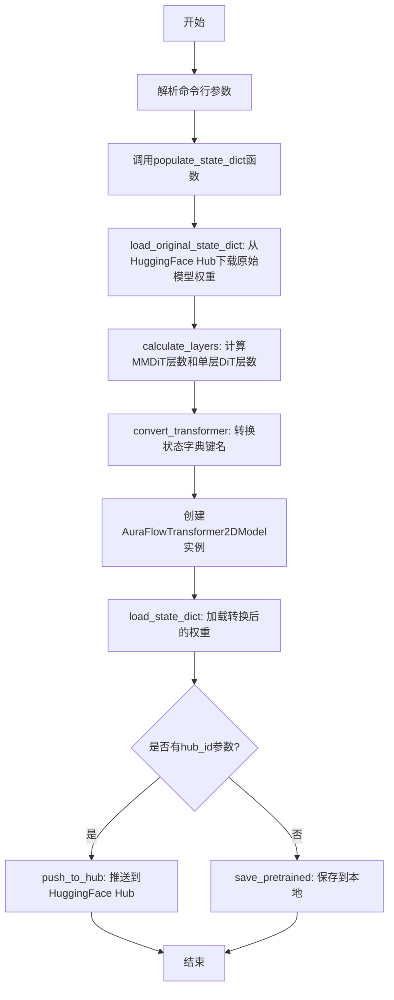
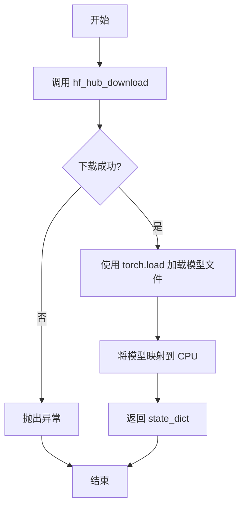
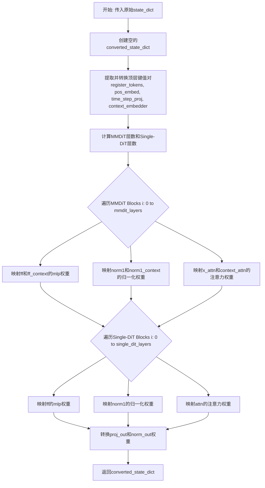

# `diffusers\scripts\convert_aura_flow_to_diffusers.py` 详细设计文档

该代码是一个模型权重转换工具，用于将AuraDiffusion的预训练模型权重从原始格式转换为Diffusers库兼容的AuraFlowTransformer2DModel格式，使其能够使用HuggingFace Diffusers框架进行推理和部署。

## 整体流程



## 类结构

```
无类定义（纯函数模块）
模块级别函数
├── load_original_state_dict
├── calculate_layers
├── swap_scale_shift
├── convert_transformer
└── populate_state_dict
```

## 全局变量及字段


### `args`
    
存储命令行参数的对象，包含原始状态字典仓库ID、转储路径和Hub ID等配置

类型：`ArgumentParser对象`
    


### `model_pt`
    
从HuggingFace Hub下载的原始PyTorch模型文件路径

类型：`str`
    


### `state_dict`
    
原始模型的状态字典，键为字符串，值为torch.Tensor类型的权重参数

类型：`dict`
    


### `dit_layers`
    
存储从状态字典键中提取的DiT层索引集合，用于计算层数

类型：`set`
    


### `converted_state_dict`
    
转换后的状态字典，键名格式符合Diffusers模型规范

类型：`dict`
    


### `state_dict_keys`
    
原始状态字典的键列表，用于遍历和计算层数

类型：`list`
    


### `mmdit_layers`
    
MMDiT（多模态DiT）Transformer块的数量

类型：`int`
    


### `single_dit_layers`
    
单模态DiT块的数量

类型：`int`
    


### `model_diffusers`
    
转换后的Diffusers模型对象，可用于推理、保存或推送到Hub

类型：`AuraFlowTransformer2DModel`
    


    

## 全局函数及方法


### `load_original_state_dict(args)`

该函数负责从HuggingFace Hub下载并加载原始AuraDiffusion模型的权重文件，将其加载到CPU内存中并返回状态字典。

参数：

- `args`：`argparse.Namespace`，包含命令行参数的对象，必须包含 `original_state_dict_repo_id` 属性，用于指定HuggingFace Hub上的模型仓库ID

返回值：`dict`，返回模型的状态字典（state_dict），键为参数名称，值为对应的张量（Tensor）

#### 流程图



#### 带注释源码

```python
def load_original_state_dict(args):
    """
    从HuggingFace Hub下载并加载原始AuraDiffusion模型权重
    
    参数:
        args: 包含 original_state_dict_repo_id 的参数对象
        
    返回:
        dict: 模型的状态字典
    """
    # 使用 HuggingFace Hub 工具下载模型权重文件
    # repo_id: 指定要下载的模型在 Hub 上的仓库 ID
    # filename: 指定要下载的文件名
    model_pt = hf_hub_download(
        repo_id=args.original_state_dict_repo_id,  # 从 args 中获取仓库 ID
        filename="aura_diffusion_pytorch_model.bin"  # 固定的模型权重文件名
    )
    
    # 使用 PyTorch 加载下载的模型文件
    # map_location="cpu": 将模型权重强制加载到 CPU 内存中
    state_dict = torch.load(model_pt, map_location="cpu")
    
    # 返回加载的状态字典
    return state_dict
```


### `calculate_layers`

该函数用于计算模型中指定前缀（如 `double_layers` 或 `single_layers`）的层数量。它通过遍历状态字典的键，筛选出包含指定前缀的键，从中提取层编号并去重，最终返回不同层的总数。

参数：

- `state_dict_keys`：`list`，状态字典的键列表，通常为 `state_dict.keys()` 转换而来的列表
- `key_prefix`：`str`，用于筛选层的前缀字符串，例如 `"double_layers"` 或 `"single_layers"`

返回值：`int`，不同层的数量（即去重后的层编号集合的大小）

#### 流程图

```mermaid
flowchart TD
    A[开始] --> B[初始化空集合 dit_layers]
    B --> C{遍历 state_dict_keys 中的每个 key}
    C --> D{key_prefix 在 k 中?}
    D -->|否| C
    D -->|是| E[提取层编号: int(k.split('.')[2])]
    E --> F[将层编号加入 dit_layers 集合]
    F --> C
    C --> G[打印: {key_prefix}: {len(dit_layers)}]
    G --> H[返回 len(dit_layers)]
    H --> I[结束]
```

#### 带注释源码

```python
def calculate_layers(state_dict_keys, key_prefix):
    """
    计算指定前缀的层数量
    
    参数:
        state_dict_keys: 状态字典的键列表
        key_prefix: 用于筛选层的前缀（如 'double_layers' 或 'single_layers'）
    
    返回:
        不同层的数量
    """
    # 用于存储不同层编号的集合（自动去重）
    dit_layers = set()
    
    # 遍历所有状态字典键
    for k in state_dict_keys:
        # 检查当前键是否包含指定前缀
        if key_prefix in k:
            # 提取层编号：键格式通常为 "model.double_layers.0.xxx"
            # 通过split(".")分割后，第3个元素（索引2）为层编号
            layer_num = int(k.split(".")[2])
            # 将层编号添加到集合中（自动去重）
            dit_layers.add(layer_num)
    
    # 打印统计信息，便于调试
    print(f"{key_prefix}: {len(dit_layers)}")
    
    # 返回不同层的数量
    return len(dit_layers)
```


### `swap_scale_shift`

该函数用于将归一化层（Normalization Layer）的权重参数（通常包含缩放 Scale 和偏移 Shift）从原始顺序调整为目标模型所需的顺序。它通过分割（chunk）张量并重新拼接（cat）来实现顺序的交换。

参数：

- `weight`：`torch.Tensor`，原始的模型权重张量，通常是一个包含缩放（scale）和偏移（shift）参数的一维张量（例如 Shape 为 `[2*hidden_dim, ...]`）。
- `dim`：`int`，指定分割张量的维度。在当前实现中，该参数被忽略，实际硬编码为 `0`（第一维度）。

返回值：`torch.Tensor`，重新组合后的权重张量，其顺序从 `[shift, scale]` 变更为 `[scale, shift]`。

#### 流程图

```mermaid
graph LR
    A[输入权重 Tensor<br>(原始顺序: Shift + Scale)] --> B[chunk(2, dim=0)<br>沿维度0均分];
    B --> C[Part 1: Shift];
    B --> D[Part 2: Scale];
    C --> E[torch.cat<br>(顺序: [Scale, Shift])];
    D --> E;
    E --> F[输出权重 Tensor<br>(新顺序: Scale + Shift)];
```

#### 带注释源码

```python
def swap_scale_shift(weight, dim):
    """
    交换并重新组合权重的维度顺序。

    通常用于将 [shift, scale] 顺序的权重转换为 [scale, shift] 顺序，
    以适配不同的归一化层实现（如 GroupNorm 或 LayerNorm）。

    参数:
        weight: 包含 shift 和 scale 参数的原始权重张量。
        dim: 分割的维度（当前代码中虽接收此参数，但实际未使用，硬编码为 0）。

    返回:
        顺序交换后的新权重张量。
    """
    # 使用 chunk 方法将权重沿第一维（dim=0）分成两部分
    # 假设原始权重结构为 [shift_params, scale_params]
    # chunk(2, dim=0) 会返回 (shift, scale) 的元组
    shift, scale = weight.chunk(2, dim=0)
    
    # 使用 cat 方法重新拼接张量，顺序变为 [scale, shift]
    new_weight = torch.cat([scale, shift], dim=0)
    
    return new_weight
```


# 设计文档：convert_transformer 函数

### `convert_transformer`

该函数负责将原始 AuraFlow 模型的状态字典（来自非 Diffusers 格式）转换为 Diffusers 格式，涉及到键名的重命名、层结构的重新映射以及权重参数的重新组织，是模型格式迁移的核心转换层。

参数：

- `state_dict`：`Dict`，原始模型的状态字典，包含模型权重和偏置等参数，键名为原始格式

返回值：`Dict`，转换后的 Diffusers 格式状态字典，键名符合 AuraFlowTransformer2DModel 的结构要求

#### 流程图



#### 带注释源码

```python
def convert_transformer(state_dict):
    """
    将原始模型状态字典转换为Diffusers格式
    
    参数:
        state_dict: 原始AuraFlow模型的状态字典
        
    返回:
        转换后的Diffusers格式状态字典
    """
    converted_state_dict = {}
    # 获取所有键名，用于后续计算层数
    state_dict_keys = list(state_dict.keys())

    # === 转换顶层配置参数 ===
    # 注册令牌: 提取并移除原始键
    converted_state_dict["register_tokens"] = state_dict.pop("model.register_tokens")
    # 位置编码: 提取位置嵌入和投影层
    converted_state_dict["pos_embed.pos_embed"] = state_dict.pop("model.positional_encoding")
    converted_state_dict["pos_embed.proj.weight"] = state_dict.pop("model.init_x_linear.weight")
    converted_state_dict["pos_embed.proj.bias"] = state_dict.pop("model.init_x_linear.bias")

    # 时间步嵌入层: 提取MLP的权重和偏置
    converted_state_dict["time_step_proj.linear_1.weight"] = state_dict.pop("model.t_embedder.mlp.0.weight")
    converted_state_dict["time_step_proj.linear_1.bias"] = state_dict.pop("model.t_embedder.mlp.0.bias")
    converted_state_dict["time_step_proj.linear_2.weight"] = state_dict.pop("model.t_embedder.mlp.2.weight")
    converted_state_dict["time_step_proj.linear_2.bias"] = state_dict.pop("model.t_embedder.mlp.2.bias")

    # 上下文嵌入器: 提取条件序列线性层权重
    converted_state_dict["context_embedder.weight"] = state_dict.pop("model.cond_seq_linear.weight")

    # === 计算transformer层数 ===
    # 通过统计包含特定前缀的键来确定层数
    mmdit_layers = calculate_layers(state_dict_keys, key_prefix="double_layers")
    single_dit_layers = calculate_layers(state_dict_keys, key_prefix="single_layers")

    # === 处理MMDiT Blocks (双路transformer块) ===
    for i in range(mmdit_layers):
        # 前馈网络: 映射mlpX到ff, mlpC到ff_context
        path_mapping = {"mlpX": "ff", "mlpC": "ff_context"}
        weight_mapping = {"c_fc1": "linear_1", "c_fc2": "linear_2", "c_proj": "out_projection"}
        for orig_k, diffuser_k in path_mapping.items():
            for k, v in weight_mapping.items():
                converted_state_dict[f"joint_transformer_blocks.{i}.{diffuser_k}.{v}.weight"] = state_dict.pop(
                    f"model.double_layers.{i}.{orig_k}.{k}.weight"
                )

        # 归一化层: 映射modX到norm1, modC到norm1_context
        path_mapping = {"modX": "norm1", "modC": "norm1_context"}
        for orig_k, diffuser_k in path_mapping.items():
            converted_state_dict[f"joint_transformer_blocks.{i}.{diffuser_k}.linear.weight"] = state_dict.pop(
                f"model.double_layers.{i}.{orig_k}.1.weight"
            )

        # 注意力层: 处理x轴注意力和上下文注意力
        x_attn_mapping = {"w2q": "to_q", "w2k": "to_k", "w2v": "to_v", "w2o": "to_out.0"}
        context_attn_mapping = {"w1q": "add_q_proj", "w1k": "add_k_proj", "w1v": "add_v_proj", "w1o": "to_add_out"}
        for attn_mapping in [x_attn_mapping, context_attn_mapping]:
            for k, v in attn_mapping.items():
                converted_state_dict[f"joint_transformer_blocks.{i}.attn.{v}.weight"] = state_dict.pop(
                    f"model.double_layers.{i}.attn.{k}.weight"
                )

    # === 处理Single-DiT Blocks (单路transformer块) ===
    for i in range(single_dit_layers):
        # 前馈网络: 映射单路MLP权重
        mapping = {"c_fc1": "linear_1", "c_fc2": "linear_2", "c_proj": "out_projection"}
        for k, v in mapping.items():
            converted_state_dict[f"single_transformer_blocks.{i}.ff.{v}.weight"] = state_dict.pop(
                f"model.single_layers.{i}.mlp.{k}.weight"
            )

        # 归一化层: 映射modCX到norm1
        converted_state_dict[f"single_transformer_blocks.{i}.norm1.linear.weight"] = state_dict.pop(
            f"model.single_layers.{i}.modCX.1.weight"
        )

        # 注意力层: 映射单路注意力权重
        x_attn_mapping = {"w1q": "to_q", "w1k": "to_k", "w1v": "to_v", "w1o": "to_out.0"}
        for k, v in x_attn_mapping.items():
            converted_state_dict[f"single_transformer_blocks.{i}.attn.{v}.weight"] = state_dict.pop(
                f"model.single_layers.{i}.attn.{k}.weight"
            )

    # === 最终输出层转换 ===
    # 输出投影层
    converted_state_dict["proj_out.weight"] = state_dict.pop("model.final_linear.weight")
    # 最终归一化层: 使用swap_scale_shift调整scale和shift顺序
    converted_state_dict["norm_out.linear.weight"] = swap_scale_shift(state_dict.pop("model.modF.1.weight"), dim=None)

    return converted_state_dict
```

---

## 关键组件信息

| 组件名称 | 一句话描述 |
|---------|-----------|
| `state_dict` | 原始模型权重字典，包含模型各层的参数 |
| `converted_state_dict` | 转换后的Diffusers格式模型权重字典 |
| `calculate_layers` | 辅助函数，通过键名前缀统计transformer层数 |
| `swap_scale_shift` | 辅助函数，调整LayerNorm权重中scale和shift的顺序 |
| `joint_transformer_blocks` | MMDiT双路transformer块，处理图像和条件信息 |
| `single_transformer_blocks` | Single-DiT单路transformer块，仅处理图像信息 |

---

## 潜在的技术债务或优化空间

1. **硬编码的键名映射**: 大量硬编码的字符串键名，缺乏配置化设计，建议使用映射表或配置文件管理
2. **缺少偏置(Bias)转换**: 代码仅处理了权重(weight)，未处理偏置(bias)的映射，可能导致部分功能丢失
3. **直接修改传入的state_dict**: 使用`pop()`直接修改原始字典，函数不纯，建议创建副本再操作
4. **缺乏错误处理**: 未对键不存在、类型错误等情况进行校验和友好提示
5. **重复代码模式**: MMDiT和Single-DiT块的处理逻辑有重复，可抽象为通用函数

---

## 其它项目

### 设计目标与约束
- **目标**: 将第三方AuraFlow模型权重转换为HuggingFace Diffusers格式
- **约束**: 目标模型结构必须与AuraFlowTransformer2DModel兼容

### 错误处理与异常设计
- 缺乏显式的异常捕获机制
- 假设输入的state_dict包含所有必需的键，否则会导致KeyError

### 数据流与状态机
- 输入: 原始格式state_dict → 转换函数 → 输出: Diffusers格式state_dict
- 状态转换: 提取顶层参数 → 遍历转换MMDiT层 → 遍历转换Single-DiT层 → 转换输出层

### 外部依赖与接口契约
- 依赖 `torch` 库进行张量操作
- 依赖 `calculate_layers` 和 `swap_scale_shift` 辅助函数
- 输出需符合 `AuraFlowTransformer2DModel.load_state_dict()` 的接口要求


### `populate_state_dict(args)`

该函数是整个模型转换流程的核心调度函数，负责协调从原始 Aura Diffusion 模型权重到 Diffusers 格式模型的完整转换过程。它首先加载原始预训练权重，然后计算模型层数，接着调用转换函数进行键值映射，最后创建目标模型实例并加载转换后的权重。

参数：

- `args`：`argparse.Namespace`，包含以下关键属性：
  - `original_state_dict_repo_id`：字符串，HuggingFace Hub 上的原始模型仓库 ID，用于指定从哪里下载原始 Aura Diffusion 权重
  - `dump_path`：字符串（可选），转换后模型的保存路径
  - `hub_id`：字符串（可选），用于推送到 HuggingFace Hub 的模型 ID

返回值：`AuraFlowTransformer2DModel`，转换并加载完成后的 Diffusers 格式模型实例

#### 流程图

```mermaid
flowchart TD
    A[开始: populate_state_dict] --> B[调用 load_original_state_dict(args)]
    B --> C[加载原始模型权重字典]
    C --> D[提取 state_dict 的所有键]
    D --> E[调用 calculate_layers 计算 mmdit_layers]
    E --> F[调用 calculate_layers 计算 single_dit_layers]
    F --> G[调用 convert_transformer 转换权重键值]
    G --> H[创建 AuraFlowTransformer2DModel 实例]
    H --> I[使用转换后的权重加载模型]
    I --> J[strict=True 确保键完全匹配]
    J --> K[返回转换后的模型实例]
```

#### 带注释源码

```python
@torch.no_grad()  # 禁用梯度计算，节省内存开销
def populate_state_dict(args):
    """
    主流程函数：协调整个模型权重转换过程
    
    该函数执行以下步骤：
    1. 从 HuggingFace Hub 下载原始 Aura Diffusion 模型权重
    2. 分析原始权重结构，计算 MMDiT 层数和单层 DiT 层数
    3. 将原始权重键转换为 Diffusers 格式
    4. 创建 AuraFlowTransformer2DModel 实例
    5. 将转换后的权重加载到新模型中
    6. 返回完全转换后的模型
    """
    
    # 步骤1：加载原始预训练权重
    # 调用底层函数从 HuggingFace Hub 下载并加载 .bin 格式的模型权重
    original_state_dict = load_original_state_dict(args)
    
    # 步骤2：提取权重键列表，用于后续分析模型结构
    state_dict_keys = list(original_state_dict.keys())
    
    # 步骤3：计算 MMDiT（双层）Transformer 块的数量
    # 通过统计包含 "double_layers" 前缀的键来确定层数
    mmdit_layers = calculate_layers(state_dict_keys, key_prefix="double_layers")
    
    # 步骤4：计算单层 DiT 块的数量
    # 通过统计包含 "single_layers" 前缀的键来确定层数
    single_dit_layers = calculate_layers(state_dict_keys, key_prefix="single_layers")
    
    # 步骤5：执行核心转换逻辑
    # 将原始模型的权重键映射到 Diffusers 格式的键
    # 涉及位置编码、时间步嵌入、上下文嵌入器、注意力层、前馈网络等的键名转换
    converted_state_dict = convert_transformer(original_state_dict)
    
    # 步骤6：创建目标模型实例
    # 根据计算出的层数配置，初始化 AuraFlowTransformer2DModel 架构
    model_diffusers = AuraFlowTransformer2DModel(
        num_mmdit_layers=mmdit_layers, 
        num_single_dit_layers=single_dit_layers
    )
    
    # 步骤7：加载转换后的权重到新模型
    # strict=True 确保原始键与目标模型的键完全匹配，任何不匹配都会抛出错误
    model_diffusers.load_state_dict(converted_state_dict, strict=True)
    
    # 步骤8：返回转换完成的模型实例
    return model_diffusers
```

## 关键组件


### 张量索引与权重映射

该代码的核心功能是将Aura Diffusion的原始PyTorch模型权重转换为Hugging Face Diffusers库中AuraFlowTransformer2DModel格式的权重，通过自定义的键名映射规则实现两种模型架构之间的权重兼容。

### HuggingFace Hub集成

通过`hf_hub_download`函数从HuggingFace Hub下载原始预训练模型，并使用`torch.load`将其加载到内存中，为后续的权重转换提供数据源。

### 动态层数计算

`calculate_layers`函数通过解析原始state_dict中的键名，动态计算MMDiT双层transformer块和Single-DiT单层transformer块的数量，为模型初始化提供必要的参数。

### 权重键名转换

`convert_transformer`函数是核心转换引擎，通过字典映射将原始模型的权重键名（如`model.double_layers.{i}.mlpX.c_fc1.weight`）转换为Diffusers格式的键名（如`joint_transformer_blocks.{i}.ff.linear_1.weight`）。

### 归一化层权重调整

`swap_scale_shift`函数针对AuraFlowTransformer2DModel的最后归一化层进行特殊的权重调整，将原始权重按通道维度切分后重新排列，以适配目标模型的架构要求。

### 模型保存与推送

主程序通过`populate_state_dict`函数完成完整的转换流程，最终使用`save_pretrained`将转换后的模型保存到本地，并可选择通过`push_to_hub`推送到HuggingFace Hub。


## 问题及建议


### 已知问题

-   **缺乏错误处理**：`load_original_state_dict` 未检查文件是否存在或下载失败，`convert_transformer` 中大量使用 `pop()` 但未验证键是否存在，可能导致 `KeyError` 异常
-   **参数验证不足**：`swap_scale_shift` 函数接收 `dim=None` 但未正确处理维度参数，可能导致运行时错误；未验证 `mmdit_layers` 和 `single_dit_layers` 计算结果的合理性
-   **魔法字符串和硬编码**：状态字典的键名映射（如 `"model.register_tokens"`, `"double_layers"` 等）硬编码在代码中，缺乏配置化管理和文档说明
-   **重复计算**：多次遍历 `state_dict_keys`（`calculate_layers` 中遍历两次，后续又转换为列表），存在性能优化空间
-   **缺少类型注解**：整个代码库缺乏类型提示，降低了代码可读性和可维护性
-   **无日志记录**：仅使用 `print` 输出信息，缺少结构化日志，不利于生产环境调试和监控
-   **函数职责过重**：`convert_transformer` 函数过长（超过 80 行），包含大量硬编码映射逻辑，难以测试和维护
-   **缺少单元测试**：未提供任何测试用例，无法验证转换逻辑的正确性
-   **无元数据保存**：转换后的模型未保存源模型版本信息、转换时间等元数据
-   **命令行参数校验缺失**：未对 `--dump_path` 路径有效性、`--hub_id` 格式等进行校验

### 优化建议

-   为所有函数添加类型注解，特别是 `state_dict` 和 `converted_state_dict` 的类型标注
-   使用 `logging` 模块替代 `print`，并根据日志级别配置输出
-   将键名映射提取为配置文件或常量类，提高可维护性
-   在 `pop()` 操作前添加键存在性检查，捕获 `KeyError` 并提供有意义的错误信息
-   添加命令行参数校验逻辑，确保必填参数有效
-   重构 `convert_transformer` 函数，将不同模块（MMDiT、Single-DiT、Final）的转换逻辑拆分为独立函数
-   实现增量计算 `dit_layers`，避免重复遍历 `state_dict_keys`
-   为转换后的模型保存包含源模型 ID、转换时间等信息的元数据文件
-   添加单元测试覆盖核心转换逻辑，特别是 `swap_scale_shift` 和键映射正确性验证

## 其它


### 设计目标与约束

本代码的设计目标是将AuraDiffusion模型的原始检查点（checkpoint）权重转换为Diffusers库兼容的格式，以便在Diffusers框架中使用AuraFlowTransformer2DModel。约束包括：必须严格保持权重形状和数值一致性，转换后的模型必须能通过`load_state_dict`的strict模式验证，且仅支持PyTorch格式的原始模型文件。

### 错误处理与异常设计

代码中错误处理较为薄弱，主要依赖`torch.load`和`load_state_dict`的默认行为。潜在错误包括：网络下载失败（`hf_hub_download`抛出网络异常）、模型文件格式不兼容（`torch.load`失败）、键名映射不完整（`state_dict.pop`找不到键导致KeyError）、层数计算错误导致模型初始化尺寸不匹配。建议增加异常捕获机制：网络请求重试、文件完整性校验、键名映射完整性检查、以及转换前的预验证步骤。

### 数据流与状态机

数据流遵循以下流程：命令行参数输入 → 原始模型下载 → 原始state_dict加载 → 层数统计计算 → 键名转换处理 → AuraFlowTransformer2DModel实例化 → 权重加载与验证 → 模型保存/推送。无复杂状态机，核心状态转换围绕`convert_transformer`函数中的键名映射表展开，映射规则硬编码在函数内部。

### 外部依赖与接口契约

本代码依赖三个外部系统：HuggingFace Hub（提供原始模型下载）、Diffusers库（目标模型架构）、PyTorch（张量操作）。接口契约包括：`load_original_state_dict`接收args对象返回原始state_dict；`convert_transformer`接收原始state_dict返回转换后的state_dict；`populate_state_dict`返回完整的AuraFlowTransformer2DModel实例。所有输入输出均为字典或模型对象，无文件流式处理。

### 性能考虑与优化空间

当前实现的主要性能瓶颈在于：1）一次性将整个原始模型加载到内存（`torch.load`）；2）逐个键进行`pop`操作效率较低；3）转换过程中创建大量中间字典。优化方向包括：使用`mmap`或流式加载减少内存占用、预先构建完整的键名映射表减少字典操作次数、考虑增量转换模式。此外，`calculate_layers`函数遍历所有键两次（分别计算mmdit和single层），可合并为单次遍历。

### 安全性考虑

代码从HuggingFace Hub下载模型文件，存在以下安全风险：1）repo_id和filename直接使用命令行参数，未做校验，可能导致任意文件下载；2）未验证下载文件的SHA256哈希，可能被恶意替换；3）`torch.load`默认使用pickle协议，存在代码执行风险。建议增加：repo_id白名单验证、文件哈希校验、添加`weights_only=True`参数（需确保模型不包含自定义对象）。

### 版本兼容性

代码依赖特定版本的Diffusers库（`AuraFlowTransformer2DModel`），该类可能在不同版本中具有不同的初始化参数。当前硬编码了`num_mmdit_layers`和`num_single_dit_layers`参数，若目标模型类接口变化将导致兼容性问题。建议：将模型类版本纳入依赖声明、考虑从原始模型元数据中推断参数、或使用反射机制动态获取所需参数。

### 配置与参数设计

命令行参数设计：`original_state_dict_repo_id`指定原始模型仓库ID（默认AuraDiffusion/auradiffusion-v0.1a0）；`dump_path`指定转换后模型的本地保存路径（默认aura-flow）；`hub_id`为可选参数，指定推送到的HuggingFace仓库ID。参数缺少类型校验、默认值可能不适合不同版本模型、缺少日志级别配置等。建议增加参数校验、配置日志输出、添加进度显示选项。

### 测试策略

当前代码无测试覆盖。推荐测试策略包括：1）单元测试验证各转换函数对特定键名的映射准确性；2）集成测试使用已知模型验证转换前后权重数值一致性；3）边界测试处理空state_dict、缺失键、层数为0等异常情况；4）回归测试确保更新转换逻辑后历史模型仍能正确转换。建议使用pytest框架，构造模拟state_dict进行测试。

### 部署与使用场景

该代码为一次性转换工具，适合以下场景：模型迁移（将第三方模型转换为Diffusers格式）、模型发布（将训练好的检查点发布为Diffusers格式）、研究复现（复现他人工作）。作为独立脚本部署时，需确保Python环境安装所需依赖，且具有HuggingFace Hub网络访问权限。不适合作为实时服务部署，因其涉及大规模张量操作和模型下载。

### 代码质量与可维护性

当前代码可维护性较低：1）`convert_transformer`函数长达百余行，包含大量硬编码键名映射；2）映射规则缺乏注释说明来源（需参考SD3/AuraFlow论文）；3）魔法数字和字符串分散各处。建议：提取键名映射为独立配置文件、使用枚举或常量类组织层类型标识、增加文档注释说明各映射规则的依据。


    