# `diffusers\scripts\convert_blipdiffusion_to_diffusers.py` 详细设计文档

该代码是一个模型权重转换工具，用于将LAVIS框架中的BLIP Diffusion模型检查点转换为HuggingFace Diffusers格式，使其能够在Diffusers pipeline中使用。

## 整体流程

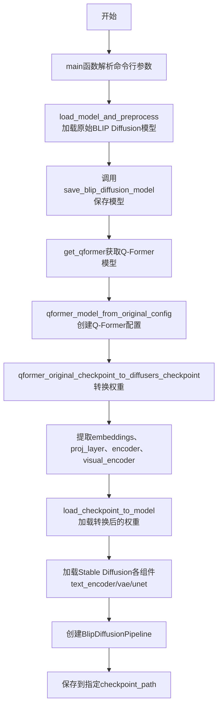

## 类结构

```
该文件为脚本文件，无类定义
所有功能通过全局函数实现
依赖外部库: lavis, transformers, diffusers
```

## 全局变量及字段


### `BLIP2_CONFIG`
    
BLIP2模型配置字典，包含vision_config（视觉配置）、qformer_config（查询变换器配置）和num_query_tokens等关键参数

类型：`dict`
    


### `blip2config`
    
基于BLIP2_CONFIG字典创建的Blip2Config配置对象实例，用于初始化BLIP2模型组件

类型：`Blip2Config`
    


    

## 全局函数及方法


### `qformer_model_from_original_config`

该函数用于根据预定义的BLIP-2配置创建Q-Former模型实例，是BLIP-Diffusion模型转换流程中的核心组件，用于初始化查询变换器（Query Transformer）以便进行后续的权重加载和模型保存。

参数：无

返回值：`Blip2QFormerModel`，返回根据原始配置初始化的Q-Former模型实例

#### 流程图

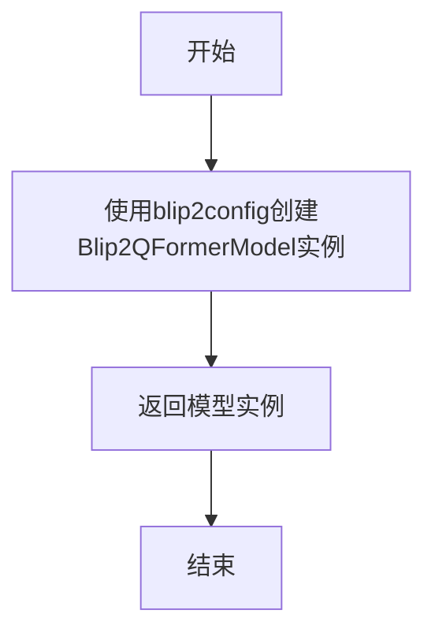

#### 带注释源码

```python
def qformer_model_from_original_config():
    """
    根据原始BLIP2配置创建Q-Former模型实例
    
    该函数使用预定义的blip2config配置来初始化Blip2QFormerModel。
    blip2config是一个Blip2Config对象，包含了视觉编码器配置、Q-Former配置
    和查询token数量等关键参数。
    
    参数:
        无（使用全局变量blip2config）
    
    返回值:
        Blip2QFormerModel: 初始化后的Q-Former模型实例，可用于加载权重或进行推理
    """
    # 使用全局配置blip2config创建Blip2QFormerModel实例
    # blip2config包含了vision_config、qformer_config和num_query_tokens等配置
    qformer = Blip2QFormerModel(blip2config)
    
    # 返回创建的模型实例
    return qformer
```


### `embeddings_from_original_checkpoint`

该函数用于将原始预训练检查点中的embedding层权重（如word_embeddings、position_embeddings、LayerNorm）映射并转换为Diffusers模型所需的键名称格式。它从原始模型状态字典中提取特定的embedding参数，并根据指定的prefix重新组织为Diffusers兼容的权重格式。

参数：

- `model`：`Dict`，原始预训练检查点的模型状态字典（state_dict），包含所有权重张量
- `diffuser_embeddings_prefix`：`str`，Diffusers模型中embedding层的前缀名称，用于构建新的权重键
- `original_embeddings_prefix`：`str`，原始预训练检查点中embedding层的前缀名称，用于从原始模型中查找权重

返回值：`Dict`，返回一个新的字典，键为重新命名的Diffusers格式权重名称，值为对应的张量数据

#### 流程图

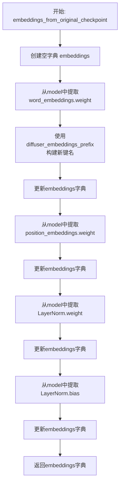

#### 带注释源码

```python
def embeddings_from_original_checkpoint(model, diffuser_embeddings_prefix, original_embeddings_prefix):
    """
    从原始检查点中提取embedding层权重并转换为Diffusers格式
    
    参数:
        model: 原始预训练模型的state_dict
        diffuser_embeddings_prefix: 目标Diffusers模型的前缀
        original_embeddings_prefix: 原始检查点中的前缀
    
    返回:
        包含转换后embedding权重的字典
    """
    # 初始化空字典用于存储转换后的embedding权重
    embeddings = {}
    
    # 提取并转换word_embeddings权重（词嵌入层）
    # 将原始键名: {original_prefix}.word_embeddings.weight
    # 映射到新键名: {diffuser_prefix}.word_embeddings.weight
    embeddings.update(
        {
            f"{diffuser_embeddings_prefix}.word_embeddings.weight": model[
                f"{original_embeddings_prefix}.word_embeddings.weight"
            ]
        }
    )
    
    # 提取并转换position_embeddings权重（位置嵌入层）
    embeddings.update(
        {
            f"{diffuser_embeddings_prefix}.position_embeddings.weight": model[
                f"{original_embeddings_prefix}.position_embeddings.weight"
            ]
        }
    )
    
    # 提取并转换LayerNorm权重（层归一化权重）
    embeddings.update(
        {f"{diffuser_embeddings_prefix}.LayerNorm.weight": model[f"{original_embeddings_prefix}.LayerNorm.weight"]}
    )
    
    # 提取并转换LayerNorm偏置（层归一化偏置）
    embeddings.update(
        {f"{diffuser_embeddings_prefix}.LayerNorm.bias": model[f"{original_embeddings_prefix}.LayerNorm.bias"]}
    )
    
    # 返回转换后的embedding权重字典
    return embeddings
```


### `proj_layer_from_original_checkpoint`

该函数用于将原始检查点（Original Checkpoint，通常为 BLIP/BLIP-2 格式）中的投影层（Projection Layer）权重转换为适配 Diffusers 库模型结构的权重字典。它通过指定的**前缀映射**，从原始状态字典中提取 `dense1`、`dense2` 和 `LayerNorm` 的权重和偏置，并重新命名键名后存入新字典。

参数：

- `model`：`Dict[str, torch.Tensor]`，原始预训练模型的状态字典（State Dictionary），包含了原始权重。
- `diffuser_proj_prefix`：`str`，目标模型（Diffusers）中投影层对应的键名前缀（例如 `"proj_layer"`）。
- `original_proj_prefix`：`str`，原始检查点中投影层对应的键名前缀（例如 `"proj_layer"`）。

返回值：`Dict[str, torch.Tensor]`，包含转换后投影层权重的新字典，键名符合 Diffusers 模型结构，可直接用于模型加载。

#### 流程图

```mermaid
graph TD
    A([开始]) --> B[初始化空字典 proj_layer]
    B --> C[定义子层列表: dense1, dense2, LayerNorm]
    C --> D[定义参数类型列表: weight, bias]
    D --> E{遍历子层列表}
    E -->|每个子层| F{遍历参数类型列表}
    F -->|每个参数| G[拼接新键名: diffuser_proj_prefix.子层名.参数类型]
    F -->|每个参数| H[拼接原键名: original_proj_prefix.子层名.参数类型]
    G & H --> I[从 model 中提取权重: model[原键名]]
    I --> J[更新字典: proj_layer[新键名] = 提取的权重]
    J --> K{子层与参数遍历完成?}
    K -->|否| F
    K -->|是| L{所有子层遍历完成?}
    L -->|否| E
    L -->|是| M([返回 proj_layer])
```

#### 带注释源码

```python
def proj_layer_from_original_checkpoint(model, diffuser_proj_prefix, original_proj_prefix):
    """
    将原始检查点中的投影层权重转换为 Diffusers 格式。

    参数:
        model: 原始模型的状态字典。
        diffuser_proj_prefix: 目标模型中投影层的前缀。
        original_proj_prefix: 原始检查点中投影层的前缀。
    
    返回:
        包含转换后权重的字典。
    """
    # 初始化一个空字典来存储转换后的投影层权重
    proj_layer = {}
    
    # 更新 dense1 层的权重和偏置
    proj_layer.update({f"{diffuser_proj_prefix}.dense1.weight": model[f"{original_proj_prefix}.dense1.weight"]})
    proj_layer.update({f"{diffuser_proj_prefix}.dense1.bias": model[f"{original_proj_prefix}.dense1.bias"]})
    
    # 更新 dense2 层的权重和偏置
    proj_layer.update({f"{diffuser_proj_prefix}.dense2.weight": model[f"{original_proj_prefix}.dense2.weight"]})
    proj_layer.update({f"{diffuser_proj_prefix}.dense2.bias": model[f"{original_proj_prefix}.dense2.bias"]})
    
    # 更新 LayerNorm 层的权重和偏置
    proj_layer.update({f"{diffuser_proj_prefix}.LayerNorm.weight": model[f"{original_proj_prefix}.LayerNorm.weight"]})
    proj_layer.update({f"{diffuser_proj_prefix}.LayerNorm.bias": model[f"{original_proj_prefix}.LayerNorm.bias"]})
    
    return proj_layer
```


### `attention_from_original_checkpoint`

该函数用于将原始BLIP2模型检查点中的注意力层（attention layer）权重参数转换并映射到Diffusers格式的模型中，处理query、key、value以及output层的权重和偏置，并将原始模型中的`self`命名空间映射到Diffusers模型中的`attention`命名空间。

参数：

- `model`：`Dict`，原始BLIP2模型的检查点字典（state dict），包含了预训练模型的全部参数
- `diffuser_attention_prefix`：`str`，Diffusers模型中注意力层参数的前缀路径，用于构建新键名
- `original_attention_prefix`：`str`，原始模型中注意力层参数的前缀路径，用于从原始检查点中查找参数

返回值：`Dict`，返回转换后的注意力层参数字典，键名为Diffusers格式，值为原始检查点中的张量

#### 流程图

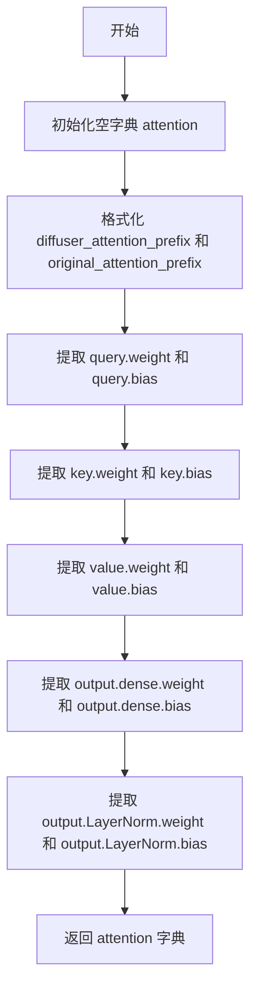

#### 带注释源码

```python
def attention_from_original_checkpoint(model, diffuser_attention_prefix, original_attention_prefix):
    """
    将原始检查点中的注意力层参数转换为Diffusers格式
    
    参数:
        model: 原始BLIP2模型的完整检查点字典
        diffuser_attention_prefix: Diffusers模型中注意力层参数的前缀
        original_attention_prefix: 原始模型中注意力层参数的前缀
    
    返回:
        包含转换后注意力层参数的字典
    """
    attention = {}
    
    # 处理Query权重和偏置
    # 原始模型: {original_attention_prefix}.self.query.weight
    # 目标模型: {diffuser_attention_prefix}.attention.query.weight
    attention.update(
        {
            f"{diffuser_attention_prefix}.attention.query.weight": model[
                f"{original_attention_prefix}.self.query.weight"
            ]
        }
    )
    attention.update(
        {f"{diffuser_attention_prefix}.attention.query.bias": model[f"{original_attention_prefix}.self.query.bias"]}
    )
    
    # 处理Key权重和偏置
    attention.update(
        {f"{diffuser_attention_prefix}.attention.key.weight": model[f"{original_attention_prefix}.self.key.weight"]}
    )
    attention.update(
        {f"{diffuser_attention_prefix}.attention.key.bias": model[f"{original_attention_prefix}.self.key.bias"]}
    )
    
    # 处理Value权重和偏置
    attention.update(
        {
            f"{diffuser_attention_prefix}.attention.value.weight": model[
                f"{original_attention_prefix}.self.value.weight"
            ]
        }
    )
    attention.update(
        {f"{diffuser_attention_prefix}.attention.value.bias": model[f"{original_attention_prefix}.self.value.bias"]}
    )
    
    # 处理输出全连接层权重和偏置
    attention.update(
        {f"{diffuser_attention_prefix}.output.dense.weight": model[f"{original_attention_prefix}.output.dense.weight"]}
    )
    attention.update(
        {f"{diffuser_attention_prefix}.output.dense.bias": model[f"{original_attention_prefix}.output.dense.bias"]}
    )
    
    # 处理输出LayerNorm层权重和偏置
    attention.update(
        {
            f"{diffuser_attention_prefix}.output.LayerNorm.weight": model[
                f"{original_attention_prefix}.output.LayerNorm.weight"
            ]
        }
    )
    attention.update(
        {
            f"{diffuser_attention_prefix}.output.LayerNorm.bias": model[
                f"{original_attention_prefix}.output.LayerNorm.bias"
            ]
        }
    )
    
    return attention
```


### `output_layers_from_original_checkpoint`

该函数用于将原始 BLIP 检查点中的输出层（Output Layer）权重参数转换并映射到 Diffusers 格式的模型参数名称，从原始检查点中提取 `dense` 全连接层的权重和偏置，以及 `LayerNorm` 层的权重和偏置，并使用指定的前缀名称返回转换后的参数字典。

参数：

- `model`：`Dict`，原始检查点的模型状态字典（state_dict），包含原始模型的全部参数
- `diffuser_output_prefix`：`str`，Diffusers 格式模型中输出层参数的前缀路径，用于构建目标参数名称
- `original_output_prefix`：`str`，原始检查点中输出层参数的前缀路径，用于从原始模型中查找对应参数

返回值：`Dict`，返回转换后的参数字典，包含四个键值对：`dense.weight`、`dense.bias`、`LayerNorm.weight`、`LayerNorm.bias`，键名使用 `diffuser_output_prefix` 作为前缀

#### 流程图

```mermaid
flowchart TD
    A[开始: output_layers_from_original_checkpoint] --> B[初始化空字典 output_layers]
    B --> C[提取并映射 dense.weight]
    C --> D[提取并映射 dense.bias]
    D --> E[提取并映射 LayerNorm.weight]
    E --> F[提取并映射 LayerNorm.bias]
    F --> G[返回 output_layers 字典]
    
    C --> C1[构建目标键名: {diffuser_output_prefix}.dense.weight]
    C --> C2[从原始模型查找键名: {original_output_prefix}.dense.weight]
    C2 --> C
    
    D --> D1[构建目标键名: {diffuser_output_prefix}.dense.bias]
    D --> D2[从原始模型查找键名: {original_output_prefix}.dense.bias]
    D2 --> D
    
    E --> E1[构建目标键名: {diffuser_output_prefix}.LayerNorm.weight]
    E --> E2[从原始模型查找键名: {original_output_prefix}.LayerNorm.weight]
    E2 --> E
    
    F --> F1[构建目标键名: {diffuser_output_prefix}.LayerNorm.bias]
    F --> F2[从原始模型查找键名: {original_output_prefix}.LayerNorm.bias]
    F2 --> F
```

#### 带注释源码

```python
def output_layers_from_original_checkpoint(model, diffuser_output_prefix, original_output_prefix):
    """
    将原始检查点中的输出层权重转换为 Diffusers 格式的参数字典
    
    参数:
        model: 原始检查点的模型状态字典
        diffuser_output_prefix: Diffusers 模型中输出层的前缀路径
        original_output_prefix: 原始检查点中输出层的前缀路径
    
    返回:
        包含转换后权重参数的字典
    """
    # 初始化输出层参数字典
    output_layers = {}
    
    # 提取并映射 dense 层的权重参数
    # 将原始检查点中的 dense.weight 映射到目标格式
    output_layers.update({
        f"{diffuser_output_prefix}.dense.weight": model[f"{original_output_prefix}.dense.weight"]
    })
    
    # 提取并映射 dense 层的偏置参数
    output_layers.update({f"{diffuser_output_prefix}.dense.bias": model[f"{original_output_prefix}.dense.bias"]})
    
    # 提取并映射 LayerNorm 层的权重参数
    output_layers.update(
        {f"{diffuser_output_prefix}.LayerNorm.weight": model[f"{original_output_prefix}.LayerNorm.weight"]}
    )
    
    # 提取并映射 LayerNorm 层的偏置参数
    output_layers.update(
        {f"{diffuser_output_prefix}.LayerNorm.bias": model[f"{original_output_prefix}.LayerNorm.bias"]}
    )
    
    # 返回转换后的参数字典
    return output_layers
```


### `encoder_from_original_checkpoint`

该函数用于将原始 BLIP 检查点中的 Q-Former Encoder 层权重转换并映射到 Diffusers 格式的权重字典中，支持注意力层、交叉注意力层、中间层和输出层的转换。

参数：

- `model`：`Dict`，原始 BLIP 模型的完整状态字典（key-value 对包含原始层名称和对应的权重 tensor）
- `diffuser_encoder_prefix`：`str`，Diffusers 格式中 encoder 层的前缀路径（例如 `"encoder.layer"`）
- `original_encoder_prefix`：`str`，原始检查点中 encoder 层的前缀路径（例如 `"blip.Qformer.bert.encoder.layer"`）

返回值：`Dict`，转换后的权重字典，key 为 Diffusers 格式的层名称，value 为对应的权重 tensor

#### 流程图

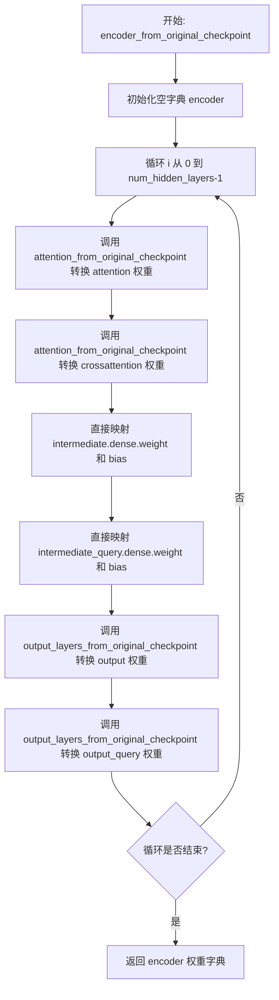

#### 带注释源码

```python
def encoder_from_original_checkpoint(model, diffuser_encoder_prefix, original_encoder_prefix):
    """
    将原始检查点中的 Q-Former Encoder 层权重转换到 Diffusers 格式。

    参数:
        model: Dict, 原始 BLIP 模型的完整状态字典
        diffuser_encoder_prefix: str, Diffusers 格式中 encoder 层的前缀路径
        original_encoder_prefix: str, 原始检查点中 encoder 层的前缀路径

    返回:
        Dict, 转换后的权重字典
    """
    # 初始化用于存储转换后权重的空字典
    encoder = {}
    
    # 遍历 Q-Former 配置中的所有隐藏层
    for i in range(blip2config.qformer_config.num_hidden_layers):
        # 转换第 i 层的 self-attention 权重
        encoder.update(
            attention_from_original_checkpoint(
                model, 
                f"{diffuser_encoder_prefix}.{i}.attention",   # Diffusers 格式: encoder.layer.{i}.attention
                f"{original_encoder_prefix}.{i}.attention"    # 原始格式: blip.Qformer.bert.encoder.layer.{i}.attention
            )
        )
        
        # 转换第 i 层的 cross-attention 权重
        encoder.update(
            attention_from_original_checkpoint(
                model, 
                f"{diffuser_encoder_prefix}.{i}.crossattention", 
                f"{original_encoder_prefix}.{i}.crossattention"
            )
        )

        # 转换第 i 层的 intermediate dense 层权重 (Q -> K/V 转换层)
        encoder.update(
            {
                f"{diffuser_encoder_prefix}.{i}.intermediate.dense.weight": model[
                    f"{original_encoder_prefix}.{i}.intermediate.dense.weight"
                ]
            }
        )
        encoder.update(
            {
                f"{diffuser_encoder_prefix}.{i}.intermediate.dense.bias": model[
                    f"{original_encoder_prefix}.{i}.intermediate.dense.bias"
                ]
            }
        )
        
        # 转换第 i 层的 intermediate_query dense 层权重 (Query 专用转换层)
        encoder.update(
            {
                f"{diffuser_encoder_prefix}.{i}.intermediate_query.dense.weight": model[
                    f"{original_encoder_prefix}.{i}.intermediate_query.dense.weight"
                ]
            }
        )
        encoder.update(
            {
                f"{diffuser_encoder_prefix}.{i}.intermediate_query.dense.bias": model[
                    f"{original_encoder_prefix}.{i}.intermediate_query.dense.bias"
                ]
            }
        )

        # 转换第 i 层的 output 层权重 (注意力输出层 + LayerNorm)
        encoder.update(
            output_layers_from_original_checkpoint(
                model, 
                f"{diffuser_encoder_prefix}.{i}.output", 
                f"{original_encoder_prefix}.{i}.output"
            )
        )
        
        # 转换第 i 层的 output_query 层权重
        encoder.update(
            output_layers_from_original_checkpoint(
                model, 
                f"{diffuser_encoder_prefix}.{i}.output_query", 
                f"{original_encoder_prefix}.{i}.output_query"
            )
        )
    
    # 返回转换完成的 encoder 权重字典
    return encoder
```


### `visual_encoder_layer_from_original_checkpoint`

该函数用于将原始 BLIP 检查点中的视觉编码器单层权重转换为 Diffusers 格式的权重映射。通过重新映射键名（从原始的 `ln_1`、`attn.in_proj_weight` 等转换为 Diffusers 格式的 `layer_norm1`、`self_attn.qkv.weight` 等），实现权重格式的兼容转换，使得原始预训练权重可以加载到 Diffusers 实现的视觉编码器模型中。

参数：

- `model`：`Dict[str, torch.Tensor]`，原始模型的状态字典，包含键如 `{original_prefix}.ln_1.weight`、`{original_prefix}.attn.in_proj_weight` 等
- `diffuser_prefix`：`str`，目标 Diffusers 模型中权重的前缀，用于构建新的键名
- `original_prefix`：`str`，原始检查点中权重的前缀，用于从原始状态字典中查找对应的权重

返回值：`Dict[str, torch.Tensor]`，转换后的权重字典，键名为 Diffusers 格式的键名（如 `{diffuser_prefix}.layer_norm1.weight`），值为对应的张量数据

#### 流程图

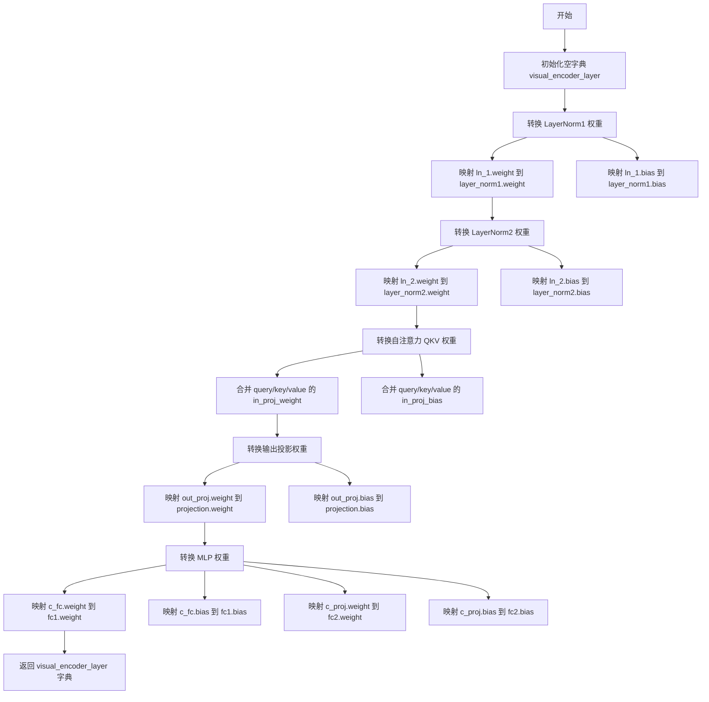

#### 带注释源码

```python
def visual_encoder_layer_from_original_checkpoint(model, diffuser_prefix, original_prefix):
    """
    将原始检查点中的视觉编码器单层权重转换为 Diffusers 格式的权重映射。
    
    参数:
        model: 原始模型的状态字典 (Dict[str, torch.Tensor])
        diffuser_prefix: 目标 Diffusers 模型中权重的前缀 (str)
        original_prefix: 原始检查点中权重的前缀 (str)
    
    返回:
        转换后的权重字典 (Dict[str, torch.Tensor])
    """
    # 初始化空字典用于存储转换后的权重
    visual_encoder_layer = {}

    # ========== LayerNorm 层权重转换 ==========
    # 第一个 LayerNorm: ln_1 -> layer_norm1
    visual_encoder_layer.update({f"{diffuser_prefix}.layer_norm1.weight": model[f"{original_prefix}.ln_1.weight"]})
    visual_encoder_layer.update({f"{diffuser_prefix}.layer_norm1.bias": model[f"{original_prefix}.ln_1.bias"]})
    
    # 第二个 LayerNorm: ln_2 -> layer_norm2
    visual_encoder_layer.update({f"{diffuser_prefix}.layer_norm2.weight": model[f"{original_prefix}.ln_2.weight"]})
    visual_encoder_layer.update({f"{diffuser_prefix}.layer_norm2.bias": model[f"{original_prefix}.ln_2.bias"]})

    # ========== 自注意力层权重转换 ==========
    # 原始模型使用分离的 q/k/v 投影权重 (query/key/value)，合并为一个 in_proj_weight
    # Diffusers 格式使用统一的 qkv 权重，直接映射
    visual_encoder_layer.update(
        {f"{diffuser_prefix}.self_attn.qkv.weight": model[f"{original_prefix}.attn.in_proj_weight"]}
    )
    visual_encoder_layer.update(
        {f"{diffuser_prefix}.self_attn.qkv.bias": model[f"{original_prefix}.attn.in_proj_bias"]}
    )
    
    # 输出投影权重: out_proj -> projection
    visual_encoder_layer.update(
        {f"{diffuser_prefix}.self_attn.projection.weight": model[f"{original_prefix}.attn.out_proj.weight"]}
    )
    visual_encoder_layer.update(
        {f"{diffuser_prefix}.self_attn.projection.bias": model[f"{original_prefix}.attn.out_proj.bias"]}
    )

    # ========== MLP 层权重转换 ==========
    # 前馈网络第一层: c_fc -> fc1
    visual_encoder_layer.update({f"{diffuser_prefix}.mlp.fc1.weight": model[f"{original_prefix}.mlp.c_fc.weight"]})
    visual_encoder_layer.update({f"{diffuser_prefix}.mlp.fc1.bias": model[f"{original_prefix}.mlp.c_fc.bias"]})
    
    # 前馈网络第二层: c_proj -> fc2
    visual_encoder_layer.update({f"{diffuser_prefix}.mlp.fc2.weight": model[f"{original_prefix}.mlp.c_proj.weight"]})
    visual_encoder_layer.update({f"{diffuser_prefix}.mlp.fc2.bias": model[f"{original_prefix}.mlp.c_proj.bias"]})

    return visual_encoder_layer
```


### `visual_encoder_from_original_checkpoint`

该函数负责将原始 BLIP 视觉编码器（Visual Encoder）的权重参数从原始检查点格式迁移到 Diffusers 格式，通过映射不同命名约定的参数键，并处理嵌入层、层归一化和 Transformer 层的权重转换。

参数：

- `model`：`Dict`，原始检查点模型权重字典，包含以字符串为键的模型参数
- `diffuser_prefix`：`str`，目标 Diffusers 模型中视觉编码器参数的前缀路径
- `original_prefix`：`str`，原始检查点中视觉编码器参数的前缀路径

返回值：`Dict`，转换后的视觉编码器权重字典，键为 Diffusers 格式的参数字符串，值为对应的张量数据

#### 流程图

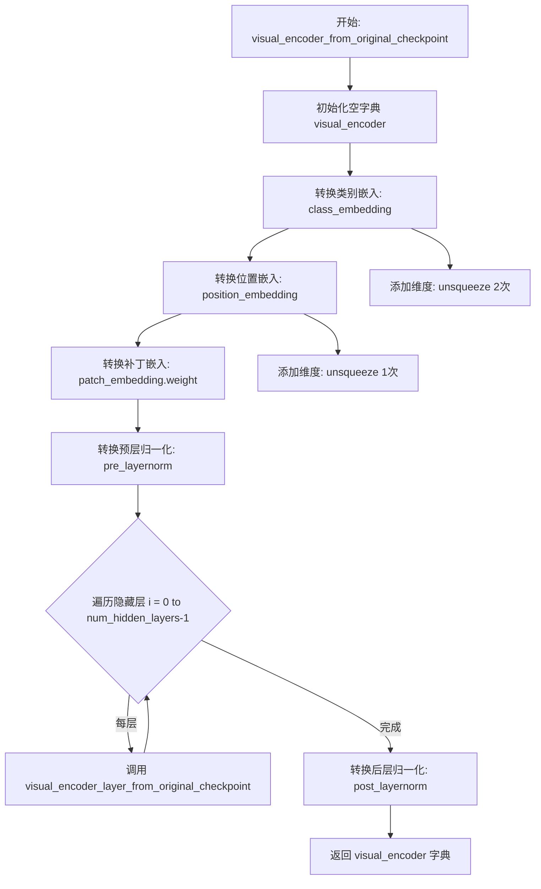

#### 带注释源码

```python
def visual_encoder_from_original_checkpoint(model, diffuser_prefix, original_prefix):
    """
    将原始BLIP视觉编码器权重转换为Diffusers格式
    
    参数:
        model: 原始检查点的模型权重字典
        diffuser_prefix: 目标Diffusers模型中的前缀路径
        original_prefix: 原始检查点中的前缀路径
    
    返回:
        转换后的视觉编码器权重字典
    """
    # 初始化空字典用于存储转换后的权重
    visual_encoder = {}

    # 处理类别嵌入 - 从原始检查点提取class_embedding并添加batch和sequence维度
    visual_encoder.update(
        {
            f"{diffuser_prefix}.embeddings.class_embedding": model[f"{original_prefix}.class_embedding"]
            .unsqueeze(0)
            .unsqueeze(0)
        }
    )
    
    # 处理位置嵌入 - 提取positional_embedding并添加batch维度
    visual_encoder.update(
        {
            f"{diffuser_prefix}.embeddings.position_embedding": model[
                f"{original_prefix}.positional_embedding"
            ].unsqueeze(0)
        }
    )
    
    # 处理补丁嵌入权重 - 从conv1权重转换
    visual_encoder.update(
        {f"{diffuser_prefix}.embeddings.patch_embedding.weight": model[f"{original_prefix}.conv1.weight"]}
    )
    
    # 处理预层归一化权重和偏置
    visual_encoder.update({f"{diffuser_prefix}.pre_layernorm.weight": model[f"{original_prefix}.ln_pre.weight"]})
    visual_encoder.update({f"{diffuser_prefix}.pre_layernorm.bias": model[f"{original_prefix}.ln_pre.bias"]})

    # 遍历视觉编码器的所有隐藏层，调用辅助函数转换每层权重
    for i in range(blip2config.vision_config.num_hidden_layers):
        visual_encoder.update(
            visual_encoder_layer_from_original_checkpoint(
                model, f"{diffuser_prefix}.encoder.layers.{i}", f"{original_prefix}.transformer.resblocks.{i}"
            )
        )

    # 处理后层归一化权重和偏置 - 使用固定的键名"blip.ln_vision"
    visual_encoder.update({f"{diffuser_prefix}.post_layernorm.weight": model["blip.ln_vision.weight"]})
    visual_encoder.update({f"{diffuser_prefix}.post_layernorm.bias": model["blip.ln_vision.bias"]})

    # 返回转换完整的视觉编码器权重字典
    return visual_encoder
```


### `qformer_original_checkpoint_to_diffusers_checkpoint`

该函数负责将原始BLIP检查点中的Q-Former模型权重（包括嵌入层、投影层、编码器层和视觉编码器）转换为Diffusers格式的检查点，以便在BlipDiffusionPipeline中使用。

参数：

- `model`：`Dict[str, torch.Tensor]`，原始BLIP检查点的模型状态字典，包含以"blip.Qformer.bert.embeddings"、"blip.query_tokens"、"proj_layer"、"blip.Qformer.bert.encoder.layer"和"blip.visual_encoder"等前缀命名的权重张量。

返回值：`Dict[str, torch.Tensor]`，转换后的Diffusers格式Q-Former检查点字典，键名符合Blip2QFormerModel的结构定义。

#### 流程图

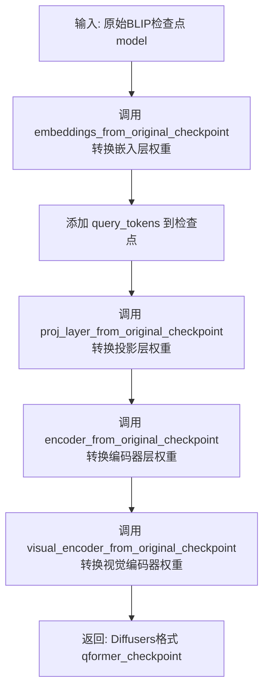

#### 带注释源码

```python
def qformer_original_checkpoint_to_diffusers_checkpoint(model):
    """
    将原始BLIP检查点中的Q-Former模型权重转换为Diffusers格式。
    
    参数:
        model: Dict[str, torch.Tensor] - 原始BLIP检查点的模型状态字典
        
    返回:
        Dict[str, torch.Tensor] - 转换后的Diffusers格式Q-Former检查点
    """
    # 初始化空字典用于存储转换后的检查点
    qformer_checkpoint = {}
    
    # 1. 转换嵌入层权重 (word_embeddings, position_embeddings, LayerNorm)
    # 从 "blip.Qformer.bert.embeddings" 前缀映射到 "embeddings" 前缀
    qformer_checkpoint.update(
        embeddings_from_original_checkpoint(
            model, 
            "embeddings",                    # Diffusers格式的前缀
            "blip.Qformer.bert.embeddings"   # 原始检查点的前缀
        )
    )
    
    # 2. 添加查询令牌 (Query Tokens)
    # 直接从原始检查点中提取，无需前缀转换
    qformer_checkpoint.update({"query_tokens": model["blip.query_tokens"]})
    
    # 3. 转换投影层权重 (dense1, dense2, LayerNorm)
    # 从 "proj_layer" 前缀映射到 "proj_layer" 前缀 (前缀相同)
    qformer_checkpoint.update(
        proj_layer_from_original_checkpoint(
            model, 
            "proj_layer",   # Diffusers格式的前缀
            "proj_layer"    # 原始检查点的前缀
        )
    )
    
    # 4. 转换编码器层权重 (attention, crossattention, intermediate, output)
    # 从 "blip.Qformer.bert.encoder.layer" 前缀映射到 "encoder.layer" 前缀
    qformer_checkpoint.update(
        encoder_from_original_checkpoint(
            model, 
            "encoder.layer",                     # Diffusers格式的前缀
            "blip.Qformer.bert.encoder.layer"    # 原始检查点的前缀
        )
    )
    
    # 5. 转换视觉编码器权重 (embeddings, pre_layernorm, layers, post_layernorm)
    # 从 "blip.visual_encoder" 前缀映射到 "visual_encoder" 前缀
    qformer_checkpoint.update(
        visual_encoder_from_original_checkpoint(
            model, 
            "visual_encoder",   # Diffusers格式的前缀
            "blip.visual_encoder"  # 原始检查点的前缀
        )
    )
    
    # 返回合并了所有转换后权重的检查点字典
    return qformer_checkpoint
```


### `get_qformer`

获取转换后的Q-Former模型，将原始BLIP checkpoint中的Q-Former参数转换并加载到Diffusers格式的模型中。

参数：

- `model`：`Dict`，原始BLIP模型的state dict，包含了BLIP2的视觉编码器、Q-Former和投影层等权重

返回值：`Blip2QFormerModel`，转换并加载完成后的Q-Former模型实例

#### 流程图

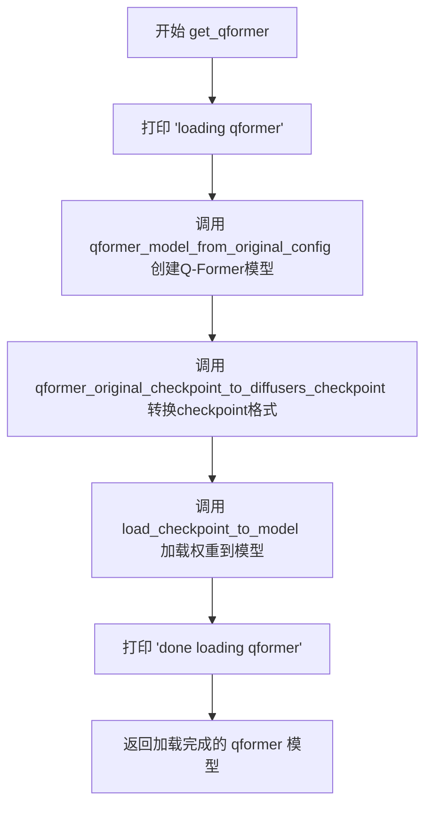

#### 带注释源码

```python
def get_qformer(model):
    """
    获取转换后的Q-Former模型
    
    该函数执行以下步骤：
    1. 根据原始配置创建Q-Former模型结构
    2. 将原始BLIP checkpoint中的Q-Former参数转换为Diffusers格式
    3. 将转换后的权重加载到Q-Former模型中
    
    参数:
        model: 原始BLIP模型的state dict，包含视觉编码器、Q-Former和投影层权重
    
    返回:
        Blip2QFormerModel: 转换并加载完成后的Q-Former模型
    """
    # 打印加载提示信息
    print("loading qformer")

    # 步骤1: 根据预定义的blip2config创建Q-Former模型结构
    # blip2config包含vision_config、qformer_config和num_query_tokens等配置
    qformer = qformer_model_from_original_config()
    
    # 步骤2: 将原始checkpoint中的Q-Former参数转换为Diffusers格式
    # 包含embeddings、query_tokens、proj_layer、encoder和visual_encoder的权重映射
    qformer_diffusers_checkpoint = qformer_original_checkpoint_to_diffusers_checkpoint(model)

    # 步骤3: 将转换后的权重加载到新创建的Q-Former模型中
    # 使用临时文件保存checkpoint以避免内存溢出
    load_checkpoint_to_model(qformer_diffusers_checkpoint, qformer)

    # 打印完成提示信息
    print("done loading qformer")
    
    # 返回加载完成的Q-Former模型
    return qformer
```


### `load_checkpoint_to_model`

该函数用于将检查点权重加载到PyTorch模型中，通过临时文件的方式实现检查点数据的序列化与反序列化，以避免内存占用过高的问题。

参数：

- `checkpoint`：`dict`，包含模型权重的字典，通常来自原始检查点文件
- `model`：`torch.nn.Module`，目标PyTorch模型对象，权重将被加载到此模型中

返回值：`None`，该函数直接修改模型状态，不返回任何值

#### 流程图

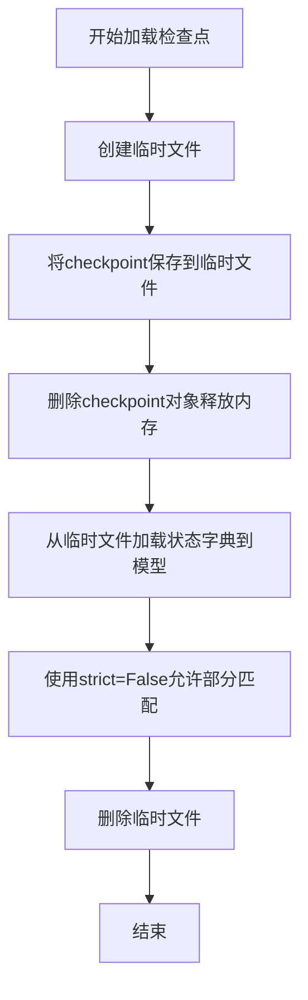

#### 带注释源码

```python
def load_checkpoint_to_model(checkpoint, model):
    """
    将检查点权重加载到PyTorch模型中
    
    参数:
        checkpoint (dict): 包含模型权重的字典
        model (torch.nn.Module): 目标PyTorch模型
    """
    # 创建临时文件，delete=False确保文件在with块结束后仍然存在
    with tempfile.NamedTemporaryFile(delete=False) as file:
        # 将checkpoint字典序列化为PyTorch文件格式
        torch.save(checkpoint, file.name)
        # 显式删除checkpoint对象以释放内存
        del checkpoint
        # 从临时文件加载状态字典到模型
        # strict=False允许加载时忽略不匹配的键
        model.load_state_dict(torch.load(file.name), strict=False)

    # 清理临时文件，释放磁盘空间
    os.remove(file.name)
```


### `save_blip_diffusion_model`

该函数用于将原始 BLIP Diffusion 模型（包含 Q-Former、视觉编码器等组件）转换为 Hugging Face Diffusers 格式，并保存为完整的 BlipDiffusionPipeline。它首先从原始模型中提取 Q-Former 权重，然后加载 Stable Diffusion v1-5 的文本编码器、VAE 和 UNet，最后将这些组件组合成 `BlipDiffusionPipeline` 并保存到指定路径。

参数：

- `model`：`Dict`，原始 BLIP Diffusion 模型的 state_dict，包含了视觉编码器、Q-Former 等预训练权重
- `args`：`Namespace`，命令行参数，包含 `checkpoint_path` 指定输出模型的保存路径

返回值：`None`，该函数不返回值，直接将模型保存到磁盘

#### 流程图

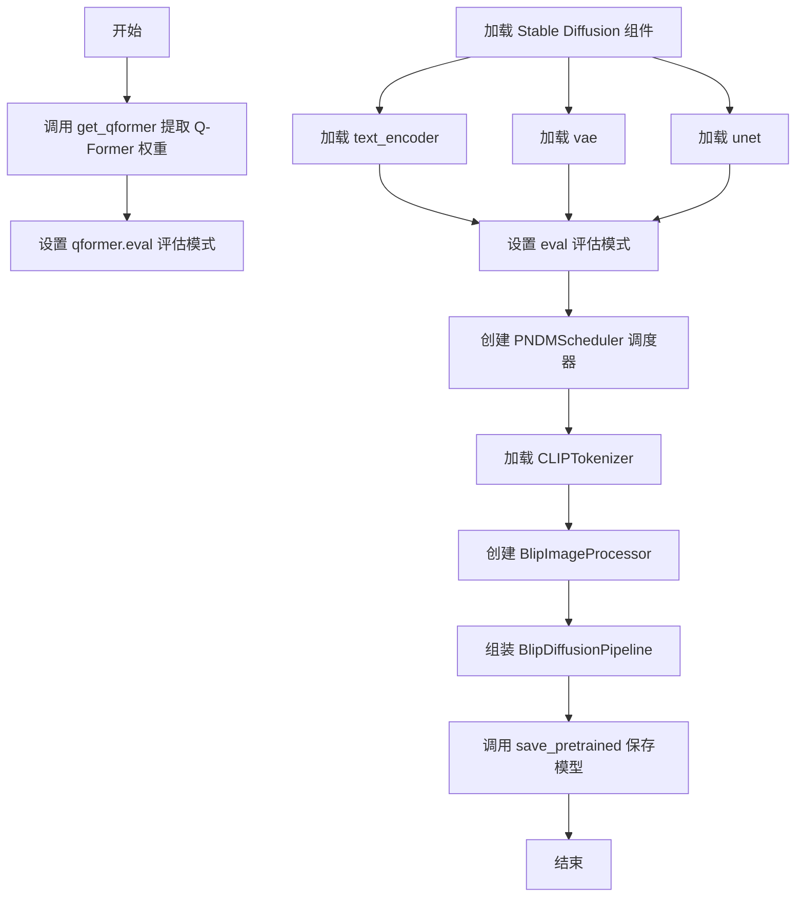

#### 带注释源码

```python
def save_blip_diffusion_model(model, args):
    """
    将原始 BLIP Diffusion 模型转换为 Diffusers 格式并保存
    
    参数:
        model: 原始模型的状态字典 (state_dict)
        args: 包含输出路径的命名空间参数
    """
    # 1. 从原始模型中提取 Q-Former 组件
    # get_qformer 函数负责将原始检查点中的视觉编码器和 Q-Former 权重
    # 转换为 Diffusers 兼容的格式
    qformer = get_qformer(model)
    
    # 2. 将 Q-Former 设置为评估模式
    # eval() 会关闭 Dropout 并切换 BatchNorm 为推理模式
    qformer.eval()

    # 3. 从预训练模型加载 Stable Diffusion 1.5 的组件
    # 这些组件来自 HuggingFace Hub 的 stable-diffusion-v1-5
    text_encoder = ContextCLIPTextModel.from_pretrained(
        "stable-diffusion-v1-5/stable-diffusion-v1-5", subfolder="text_encoder"
    )
    vae = AutoencoderKL.from_pretrained(
        "stable-diffusion-v1-5/stable-diffusion-v1-5", 
        subfolder="vae"
    )
    unet = UNet2DConditionModel.from_pretrained(
        "stable-diffusion-v1-5/stable-diffusion-v1-5", 
        subfolder="unet"
    )
    
    # 4. 设置 VAE 和 Text Encoder 为评估模式
    vae.eval()
    text_encoder.eval()

    # 5. 创建调度器 (Scheduler)
    # PNDMScheduler 用于扩散模型的迭代采样过程
    scheduler = PNDMScheduler(
        beta_start=0.00085,      # 噪声调度的起始 beta 值
        beta_end=0.012,          # 噪声调度的结束 beta 值
        beta_schedule="scaled_linear",  # beta 调度策略
        set_alpha_to_one=False,  # 不将 alpha 设为 1
        skip_prk_steps=True,     # 跳过 PRK 步骤
    )
    
    # 6. 加载分词器
    tokenizer = CLIPTokenizer.from_pretrained(
        "stable-diffusion-v1-5/stable-diffusion-v1-5", 
        subfolder="tokenizer"
    )
    
    # 7. 创建图像处理器
    image_processor = BlipImageProcessor()

    # 8. 组装完整的 BlipDiffusionPipeline
    # 将所有组件组合成一个完整的推理管道
    blip_diffusion = BlipDiffusionPipeline(
        tokenizer=tokenizer,
        text_encoder=text_encoder,
        vae=vae,
        unet=unet,
        scheduler=scheduler,
        qformer=qformer,
        image_processor=image_processor,
    )
    
    # 9. 保存整个管道到指定路径
    # 这会保存所有组件的权重和配置文件
    blip_diffusion.save_pretrained(args.checkpoint_path)
```


### `main`

主函数入口，负责加载原始 BLIP Diffusion 模型并将其转换保存为 Diffusers 格式的模型。该函数首先使用 LAVIS 库加载原始模型，然后调用转换函数将模型状态字典转换为 Diffusers 格式并保存到指定路径。

参数：

- `args`：`argparse.Namespace`，包含命令行参数的对象，目前必须包含 `checkpoint_path` 参数，指定输出模型的保存路径。

返回值：`None`，该函数没有返回值，仅执行模型加载和保存操作。

#### 流程图

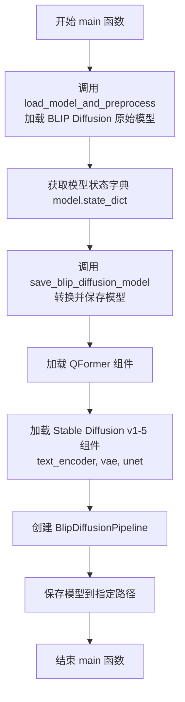

#### 带注释源码

```python
def main(args):
    """
    主函数入口。
    
    1. 使用 LAVIS 库从预训练权重加载 BLIP Diffusion 模型
    2. 获取模型的 state_dict（状态字典）
    3. 调用 save_blip_diffusion_model 函数将模型转换为 Diffusers 格式并保存
    
    参数:
        args: argparse.Namespace 对象，必须包含 checkpoint_path 属性
              指定转换后模型的输出目录路径
    
    返回值:
        None
    
    示例:
        >>> args = argparse.Namespace(checkpoint_path="./output_model")
        >>> main(args)
    """
    # 使用 LAVIS 库加载 BLIP Diffusion 模型
    # "blip_diffusion": 模型名称
    # "base": 模型规模（base 版本）
    # device="cpu": 使用 CPU 加载（也可以使用 "cuda" 使用 GPU）
    # is_eval=True: 以评估模式加载
    model, _, _ = load_model_and_preprocess("blip_diffusion", "base", device="cpu", is_eval=True)
    
    # 获取模型的 state_dict（包含所有模型权重）
    # 这是一个字典，键是参数名称，值是参数的张量
    model_state_dict = model.state_dict()
    
    # 调用 save_blip_diffusion_model 函数
    # 传入模型状态字典和命令行参数（包含输出路径）
    save_blip_diffusion_model(model_state_dict, args)
```

---

### 文件整体运行流程

1. **脚本启动**：通过命令行运行脚本，传入 `--checkpoint_path` 参数指定输出路径
2. **参数解析**：使用 `argparse` 解析命令行参数
3. **模型加载**：调用 `main` 函数，使用 LAVIS 库加载原始 BLIP Diffusion 权重
4. **模型转换**：在 `save_blip_diffusion_model` 函数中：
   - 加载 QFormer 模型架构
   - 从原始 checkpoint 映射权重到 Diffusers 格式
   - 加载 Stable Diffusion v1-5 的组件（text_encoder, vae, unet）
   - 创建 BlipDiffusionPipeline
5. **模型保存**：将完整的 pipeline 保存到指定路径

---

### 全局变量和全局函数详细信息

#### 全局变量

| 名称 | 类型 | 描述 |
|------|------|------|
| `BLIP2_CONFIG` | `dict` | BLIP2 模型的配置字典，包含视觉配置、查询注意力配置等 |
| `blip2config` | `Blip2Config` | 使用 BLIP2_CONFIG 实例化的配置对象 |

#### 全局函数

| 函数名 | 功能描述 |
|--------|----------|
| `qformer_model_from_original_config` | 根据原始配置创建 QFormer 模型实例 |
| `embeddings_from_original_checkpoint` | 从原始 checkpoint 映射嵌入层权重 |
| `proj_layer_from_original_checkpoint` | 从原始 checkpoint 映射投影层权重 |
| `attention_from_original_checkpoint` | 从原始 checkpoint 映射注意力层权重 |
| `output_layers_from_original_checkpoint` | 从原始 checkpoint 映射输出层权重 |
| `encoder_from_original_checkpoint` | 从原始 checkpoint 映射编码器层权重 |
| `visual_encoder_layer_from_original_checkpoint` | 从原始 checkpoint 映射视觉编码器单层权重 |
| `visual_encoder_from_original_checkpoint` | 从原始 checkpoint 映射整个视觉编码器权重 |
| `qformer_original_checkpoint_to_diffusers_checkpoint` | 将完整的 QFormer 检查点转换为 Diffusers 格式 |
| `get_qformer` | 加载并返回转换后的 QFormer 模型 |
| `load_checkpoint_to_model` | 将权重加载到模型中（使用临时文件） |
| `save_blip_diffusion_model` | 创建并保存 BlipDiffusionPipeline |

---

### 关键组件信息

| 组件名称 | 描述 |
|----------|------|
| **LAVIS** | Salesforce 开发的视觉语言模型库，用于加载原始 BLIP Diffusion 模型 |
| **Blip2QFormerModel** | BLIP-2 的 Query Transformer 模型，用于处理图像查询 |
| **ContextCLIPTextModel** | 上下文 CLIP 文本编码器模型 |
| **BlipDiffusionPipeline** | 完整的 BLIP Diffusion 推理管道 |
| **AutoencoderKL** | VAE 模型，用于图像编码/解码 |
| **UNet2DConditionModel** | UNet 模型，用于扩散过程的噪声预测 |
| **PNDMScheduler** | 扩散采样调度器 |

---

### 潜在的技术债务或优化空间

1. **临时文件操作**：使用 `tempfile.NamedTemporaryFile` 然后删除的方式加载权重，这种方式不够优雅且有潜在的文件系统竞争风险，可以考虑使用 `BytesIO` 替代
2. **硬编码路径**：Stable Diffusion 模型路径硬编码为 "stable-diffusion-v1-5/stable-diffusion-v1-5"，应该通过参数传入
3. **错误处理不足**：缺少对模型加载失败、磁盘空间不足等情况的异常处理
4. **设备管理**：设备硬编码为 "cpu"，应支持通过参数指定设备
5. **重复代码**：多个 `_from_original_checkpoint` 函数有大量重复的字典更新逻辑，可以抽象为通用函数

---

### 其它项目

#### 设计目标与约束

- **目标**：将 LAVIS 格式的 BLIP Diffusion 权重转换为 Diffusers 格式
- **约束**：需要从源码构建 LAVIS（pip 版本不支持 BLIP Diffusion）
- **依赖**：需要 Stable Diffusion v1.5 的预训练权重作为基础组件

#### 错误处理与异常设计

- 当前代码缺少 try-except 块处理潜在的异常情况
- 建议添加对以下情况的处理：
  - 模型文件不存在
  - 磁盘空间不足
  - 权限错误
  - 内存不足

#### 外部依赖与接口契约

- **LAVIS 库**：通过 `load_model_and_preprocess` 加载原始模型
- **Transformers 库**：提供 CLIPTokenizer 和 Blip2Config
- **Diffusers 库**：提供所有扩散模型相关的类和函数
- **PyTorch**：用于张量操作和模型序列化

## 关键组件


### BLIP2配置定义

定义BLIP2模型的视觉编码器、Q-Former和查询令牌的配置参数，包括隐藏层大小、层数、注意力头数等关键超参数。

### 权重转换函数集合

包含多个权重映射函数，将原始LAVIS模型检查点中的权重转换并适配到Diffusers格式，包括embeddings、proj_layer、attention、output_layers、encoder、visual_encoder_layer和visual_encoder等组件的转换逻辑。

### Q-Former模型加载

`get_qformer`函数负责加载Q-Former模型并应用转换后的权重检查点，实现从原始模型格式到Diffusers格式的转换。

### 检查点加载工具

`load_checkpoint_to_model`函数通过临时文件机制将检查点权重加载到PyTorch模型中，支持权重映射和灵活加载。

### BLIP Diffusion管道保存

`save_blip_diffusion_model`函数整合Q-Former、文本编码器、VAE、UNet和调度器等组件，构建完整的BlipDiffusionPipeline并保存到指定路径。

### 主程序入口

`main`函数协调整个模型转换流程，从LAVIS加载原始模型并调用保存函数完成转换。


## 问题及建议


### 已知问题

-   **硬编码配置和路径**：BLIP2_CONFIG模型配置、预训练模型路径（"stable-diffusion-v1-5/stable-diffusion-v1-5"）均硬编码在代码中，降低了代码的灵活性和可维护性。
-   **不必要的临时文件操作**：`load_checkpoint_to_model`函数使用临时文件保存checkpoint后再加载，这是额外的I/O开销，可以直接使用`model.load_state_dict()`。
-   **缺乏错误处理**：代码中没有异常捕获机制，文件删除操作（`os.remove(file.name)`）如果失败会导致资源泄漏，且模型加载失败时没有适当的错误提示。
-   **使用eval()而非torch.no_grad()**：代码中使用`qformer.eval()`、`vae.eval()`、`text_encoder.eval()`来设置评估模式，但没有使用`torch.no_grad()`来禁用梯度计算，会导致不必要的内存占用和计算开销。
-   **函数职责过重**：`save_blip_diffusion_model`函数承担了模型加载、转换、保存等多个职责，违反了单一职责原则。
-   **缺乏参数验证**：大量函数直接使用字符串前缀拼接映射，缺乏对输入参数的有效性验证。
-   **重复代码模式**：多个`xxx_from_original_checkpoint`函数结构相似，存在大量重复的模式代码，可以抽象为通用逻辑。

### 优化建议

-   将模型配置、路径等硬编码内容提取为命令行参数或配置文件。
-   移除临时文件操作，直接调用`model.load_state_dict(checkpoint, strict=False)`。
-   添加try-except异常处理，确保临时文件在异常情况下也能被清理。
-   在推理/保存阶段使用`with torch.no_grad():`上下文管理器包裹评估代码。
-   拆分`save_blip_diffusion_model`函数，将模型加载、转换、保存逻辑分离。
-   增加参数验证逻辑，检查必要键是否存在。
-   抽象通用的权重映射逻辑，使用配置驱动的方式减少重复代码。
-   考虑添加日志记录功能，替代print语句用于生产环境。
-   考虑支持GPU推理，通过命令行参数控制设备选择。


## 其它


### 设计目标与约束

本代码的核心目标是将LAVIS库中的BLIP Diffusion模型权重转换为Diffusers库兼容的格式，使得预训练的BLIP Diffusion模型能够在Diffusers框架下运行。主要约束包括：需要从源码构建LAVIS库（pip版本不包含BLIP Diffusion）；仅支持CPU设备进行转换；输出模型保存路径必须通过命令行参数指定；仅支持stable-diffusion-v1-5作为基础模型。

### 错误处理与异常设计

代码中的错误处理主要包括：使用try-finally结构确保临时文件被正确清理（尽管当前实现中 tempfile.NamedTemporaryFile 的清理逻辑存在潜在问题）；load_checkpoint_to_model函数中使用strict=False参数加载权重，允许部分匹配；当模型权重键不匹配时，会静默忽略缺失的键；命令行参数检查确保checkpoint_path为必填参数。潜在改进点：应添加对LAVIS模型加载失败的异常捕获；应验证输入模型是否包含必需的键；应处理磁盘空间不足的情况。

### 数据流与状态机

数据流主要分为三个阶段：第一阶段从LAVIS加载原始模型（blip_diffusion base版本），提取state_dict；第二阶段通过多个转换函数将原始权重键映射到Diffusers格式，包括embeddings转换、proj_layer转换、attention转换、encoder转换、visual_encoder转换等；第三阶段构建完整的BlipDiffusionPipeline并保存到指定路径。状态转换顺序为：load_model_and_preprocess → model.state_dict() → qformer_original_checkpoint_to_diffusers_checkpoint → 构建pipeline组件 → save_pretrained。

### 外部依赖与接口契约

主要外部依赖包括：lavis.models.load_model_and_preprocess用于加载原始模型；transformers.CLIPTokenizer和transformers.models.blip_2.configuration_blip_2用于文本编码器配置；diffusers库的AutoencoderKL、PNDMScheduler、UNet2DConditionModel、BlipDiffusionPipeline、BlipImageProcessor、Blip2QFormerModel、ContextCLIPTextModel等组件。接口契约要求：输入模型必须包含完整的BLIP权重键；输出路径必须具有写权限；模型名称固定为"blip_diffusion"，设备固定为"cpu"。

### 性能考虑

当前实现的主要性能瓶颈在于：临时文件写入和读取操作（torch.save + torch.load）效率较低；所有权重转换在CPU上完成，大型模型可能占用较多内存；循环处理encoder层和visual_encoder层时效率一般。优化建议：可考虑使用内存直接传递而非临时文件；可使用torch.load的map_location参数直接映射到目标设备；对于大批量转换可考虑批量处理。

### 安全性考虑

代码涉及模型权重的加载和保存，需要注意：临时文件使用后虽然有os.remove但在异常情况下可能不会被删除；checkpoint_path参数未做路径安全性验证（如路径遍历攻击）；模型来源需要确保可信（从LAVIS加载的模型）。建议添加：临时文件的安全清理机制；路径验证逻辑；模型完整性校验。

### 配置管理

BLIP2_CONFIG字典定义了视觉编码器、Q-Former和查询令牌的配置参数，这些参数直接决定了转换后模型的结构。当前配置为：hidden_size=1024，num_hidden_layers=23，num_attention_heads=16，image_size=224，patch_size=14，intermediate_size=4096，hidden_act="quick_gelu"，cross_attention_frequency=1，encoder_hidden_size=1024，vocab_size=30523，num_query_tokens=16。这些配置与stable-diffusion-v1-5的基础模型相匹配。

### 资源管理

代码在运行时需要加载多个模型组件到内存：原始BLIP模型（仅用于获取权重）、Q-Former模型、文本编码器、VAE、UNet等。建议的内存管理策略：及时释放不再需要的原始模型对象；使用eval()模式避免梯度计算；在资源受限环境下可考虑分批处理或使用模型卸载技术。

### 测试策略

建议的测试包括：单元测试验证各个转换函数（embeddings_from_original_checkpoint、attention_from_original_checkpoint等）的输出键名正确性；集成测试验证完整转换流程后加载的模型能够正常生成图像；边界条件测试处理缺失键、额外键等异常情况；性能测试评估大型模型的转换时间。

### 部署注意事项

部署时需要确保：LAVIS库已从源码正确安装；所有依赖库（transformers、diffusers、torch等）版本兼容；具有足够的磁盘空间保存输出模型（通常数GB）；输出目录具有正确的写权限。建议在Docker容器中部署以保证环境一致性，并记录具体的依赖版本号。

    