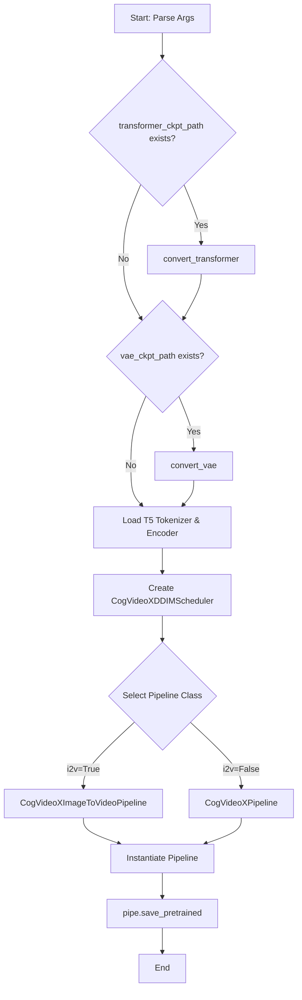
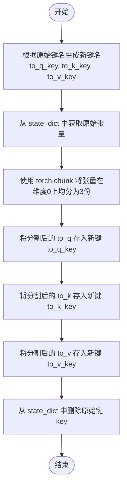
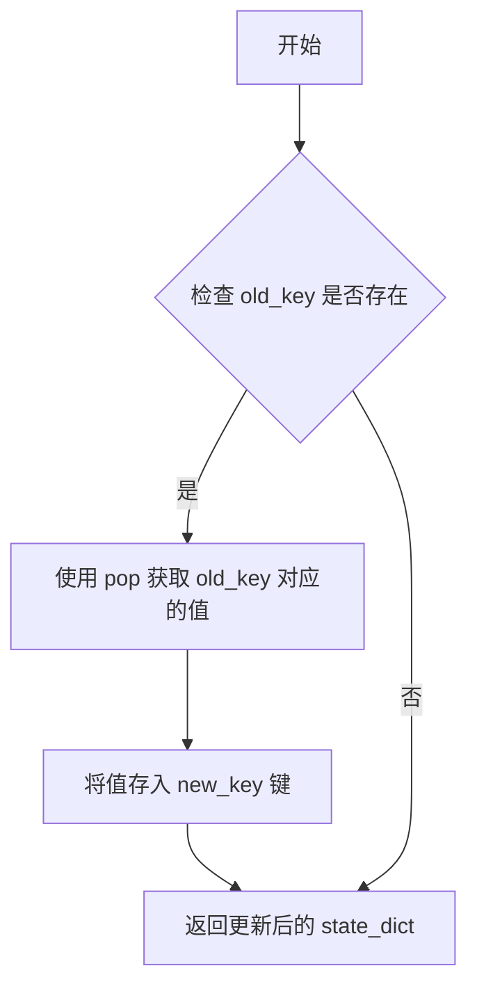
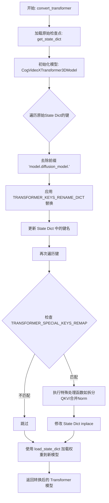
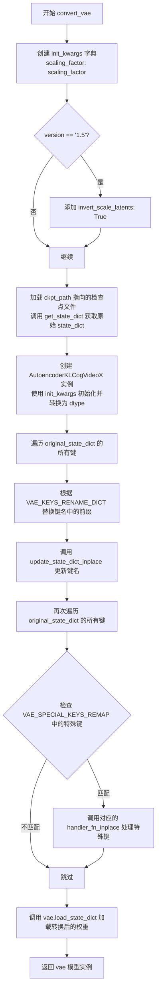
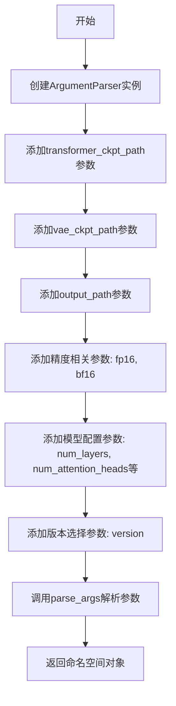

# `diffusers\scripts\convert_cogvideox_to_diffusers.py` 详细设计文档

这是一个用于将预训练的CogVideoX模型检查点（Transformer和VAE）从原始格式转换并组装为HuggingFace DiffusersPipeline格式的脚本，主要涉及键名映射、权重重排和模型组件的集成。

## 整体流程



## 类结构

```
ConversionScript (主程序脚本)
├── convert_transformer (Transformer转换模块)
│   └── 依赖: TRANSFORMER_KEYS_RENAME_DICT, TRANSFORMER_SPECIAL_KEYS_REMAP
├── convert_vae (VAE转换模块)
│   └── 依赖: VAE_KEYS_RENAME_DICT, VAE_SPECIAL_KEYS_REMAP
└── Pipeline 组装 (Diffusers Pipeline)
    ├── CogVideoXTransformer3DModel
    ├── AutoencoderKLCogVideoX
    ├── T5EncoderModel
    └── CogVideoXDDIMScheduler
```

## 全局变量及字段


### `TRANSFORMER_KEYS_RENAME_DICT`
    
用于将原始CogVideoX Transformer检查点中的键名映射到新键名的字典，包含注意力机制、MLP和层归一化等模块的键名转换规则

类型：`Dict[str, str]`
    


### `TRANSFORMER_SPECIAL_KEYS_REMAP`
    
包含特殊键重映射处理函数的字典，用于处理需要复杂转换逻辑的Transformer键，如query_key_value的分割、层归一律的重新分配等

类型：`Dict[str, Callable]`
    


### `VAE_KEYS_RENAME_DICT`
    
用于将原始CogVideoX VAE检查点中的键名映射到新键名的字典，包含编码器和解码器中resnets、down_blocks、upsamplers等模块的键名转换规则

类型：`Dict[str, str]`
    


### `VAE_SPECIAL_KEYS_REMAP`
    
包含VAE特殊键重映射处理函数的字典，用于处理需要特殊转换逻辑的VAE键，如移除loss键和替换up_blocks层索引等

类型：`Dict[str, Callable]`
    


### `TOKENIZER_MAX_LENGTH`
    
T5 tokenizer的最大长度限制，设置为226用于CogVideoX模型的文本编码

类型：`int`
    


    

## 全局函数及方法


### `reassign_query_key_value_inplace`

该函数主要用于模型权重键值（State Dict）的重映射。它接受一个包含“query_key_value”关键字的原始键名和模型状态字典，将字典中该键对应的融合权重张量（在维度0上）均匀拆分为Query、Key、Value三个独立的张量，并使用新的键名（分别替换为“to_q”、“to_k”、“to_v”）重新写入字典，同时删除原始键。此过程实现了从旧版CogVideoX模型权重格式到Diffusers格式的转换。

参数：

- `key`：`str`，原始的权重键名，函数会查找其中是否包含特定的子字符串以进行替换。
- `state_dict`：`Dict[str, Any]`，模型的状态字典，存储了所有的权重张量。函数会直接修改此字典。

返回值：`None`，该函数没有返回值，主要通过修改输入的 `state_dict` 来产生“副作用”。

#### 流程图



#### 带注释源码

```python
def reassign_query_key_value_inplace(key: str, state_dict: Dict[str, Any]):
    """
    在模型状态字典中，重新分配 query、key、value 的权重键值。
    
    此函数用于处理 CogVideoX 模型中的 query_key_value 权重。它将原本混合在一起的
    权重按照维度 0 拆分为 Query, Key, Value 三个部分，并更新键名以符合 transformers 库的结构。
    
    参数:
        key (str): 原始的权重键名，通常包含 'query_key_value' 子字符串。
        state_dict (Dict[str, Any]): 包含模型权重的字典，将被原地修改。
    """
    # 1. 生成新的键名，将 "query_key_value" 替换为 "to_q", "to_k", "to_v"
    to_q_key = key.replace("query_key_value", "to_q")
    to_k_key = key.replace("query_key_value", "to_k")
    to_v_key = key.replace("query_key_value", "to_v")
    
    # 2. 从字典中获取原始的融合权重张量，并沿维度 0（通常是通道维度）拆分为三份
    # 假设原始张量结构为 [total_dims, ...]，其中 total_dims = dim_q + dim_k + dim_v
    to_q, to_k, to_v = torch.chunk(state_dict[key], chunks=3, dim=0)
    
    # 3. 将拆分后的权重写回字典，使用新的键名
    state_dict[to_q_key] = to_q
    state_dict[to_k_key] = to_k
    state_dict[to_v_key] = to_v
    
    # 4. 清理旧键，完成键值的重映射
    state_dict.pop(key)
```


### `reassign_query_key_layernorm_inplace`

该函数用于将CogVideoX模型中query和key的layernorm层权重键名重新映射到新的transformer_blocks结构中，以便与Diffusers库的实现兼容。它通过解析原始键名中的layer_id和权重类型信息，构建符合新架构的键名，并在字典中进行原地替换。

参数：

- `key`：`str`，原始state_dict中的键名，通常包含"query_layernorm_list"或"key_layernorm_list"等标识
- `state_dict`：`Dict[str, Any]`，包含模型权重的字典对象，函数会直接修改此字典

返回值：`None`，函数执行原地修改，不返回任何值

#### 流程图

```mermaid
flowchart TD
    A[开始] --> B[从key中提取最后两部分<br/>layer_id和weight_or_bias]
    B --> C{key中是否包含'query'}
    C -->|是| D[构建新键名<br/>transformer_blocks.{layer_id}.attn1.norm_q.{weight_or_bias}]
    C -->|否| E{key中是否包含'key'}
    E -->|是| F[构建新键名<br/>transformer_blocks.{layer_id}.attn1.norm_k.{weight_or_bias}]
    E -->|否| G[不进行任何操作]
    D --> H[将state_dict中key的值弹出<br/>并赋值给新键名]
    F --> H
    G --> I[结束]
    H --> I
```

#### 带注释源码

```python
def reassign_query_key_layernorm_inplace(key: str, state_dict: Dict[str, Any]):
    """
    将query/key的layernorm权重键名重新映射到transformer_blocks结构中
    
    参数:
        key: 原始state_dict中的键名
        state_dict: 模型权重字典
    
    返回:
        无返回值，直接修改state_dict
    """
    # 提取层ID和权重类型(weight或bias)
    # 例如: "transformer_blocks.0.attn1.query_layernorm.weight" -> ["0", "weight"]
    layer_id, weight_or_bias = key.split(".")[-2:]

    # 根据key中的内容判断是query还是key的layernorm
    if "query" in key:
        # 构建新的query layernorm键名
        # 例如: "transformer_blocks.0.attn1.norm_q.weight"
        new_key = f"transformer_blocks.{layer_id}.attn1.norm_q.{weight_or_bias}"
    elif "key" in key:
        # 构建新的key layernorm键名
        # 例如: "transformer_blocks.0.attn1.norm_k.weight"
        new_key = f"transformer_blocks.{layer_id}.attn1.norm_k.{weight_or_bias}"

    # 将旧键的值弹出并赋值给新键，实现原地替换
    state_dict[new_key] = state_dict.pop(key)
```


### `reassign_adaln_norm_inplace`

该函数用于将 CogVideoX 模型中旧的 `adaln_layer.adaLN_modulations` 权重重新映射为新的 `transformer_blocks` 下的 `norm1.linear` 和 `norm2.linear` 权重，实现原地修改状态字典。

参数：

- `key`：`str`，旧权重在 state_dict 中的键名
- `state_dict`：`Dict[str, Any]`，包含模型权重的字典对象

返回值：`None`，该函数原地修改 `state_dict` 字典，不返回任何值

#### 流程图

```mermaid
flowchart TD
    A[开始] --> B[从 key 中提取 layer_id 和 weight_or_bias]
    B --> C[将 state_dict[key] 按 dim=0 均匀分成 12 块]
    C --> D[提取 norm1 权重/偏置: 块 0-2 和 6-8 拼接]
    D --> E[提取 norm2 权重/偏置: 块 3-5 和 9-11 拼接]
    E --> F[构建 norm1_key: transformer_blocks.{layer_id}.norm1.linear.{weight_or_bias}]
    F --> G[构建 norm2_key: transformer_blocks.{layer_id}.norm2.linear.{weight_or_bias}]
    G --> H[将新权重存入 state_dict]
    H --> I[删除旧 key]
    I --> J[结束]
```

#### 带注释源码

```python
def reassign_adaln_norm_inplace(key: str, state_dict: Dict[str, Any]):
    """
    将旧的 adaln_layer.adaLN_modulations 权重重新映射为新的 norm1.linear 和 norm2.linear 权重
    
    CogVideoX 模型中，原始的 adaLN 调制层参数需要重新组织为两个独立的归一化层：
    - norm1.linear: 处理输入到注意力机制的残差路径
    - norm2.linear: 处理注意力输出后的残差路径
    
    原始参数结构: [q_k_weight, q_k_bias, q_k_weight2, q_k_bias2, ...] 共12块
    重新映射后:
    - norm1: 块 0-2 (query/key 权重) + 块 6-9 (对应偏置)
    - norm2: 块 3-5 (value 权重) + 块 9-11 (对应偏置)
    """
    
    # 从 key 中提取层级 ID 和权重类型 (weight 或 bias)
    # 例如: "transformer.adaln_layer.0.adaLN_modulations.weight" -> layer_id="0", weight_or_bias="weight"
    layer_id, _, weight_or_bias = key.split(".")[-3:]
    
    # 将原始权重张量在第0维均匀分割为12块
    weights_or_biases = state_dict[key].chunk(12, dim=0)
    
    # 重新组合 norm1 的权重/偏置: 前3块 + 第6-8块
    # 对应原始模型中 query 和 key 相关的参数
    norm1_weights_or_biases = torch.cat(weights_or_biases[0:3] + weights_or_biases[6:9])
    
    # 重新组合 norm2 的权重/偏置: 第3-5块 + 第9-11块
    # 对应原始模型中 value 相关的参数
    norm2_weights_or_biases = torch.cat(weights_or_biases[3:6] + weights_or_biases[9:12])
    
    # 构建新的键名，遵循新模型的命名规范
    norm1_key = f"transformer_blocks.{layer_id}.norm1.linear.{weight_or_bias}"
    state_dict[norm1_key] = norm1_weights_or_biases
    
    norm2_key = f"transformer_blocks.{layer_id}.norm2.linear.{weight_or_bias}"
    state_dict[norm2_key] = norm2_weights_or_biases
    
    # 删除旧的键名，完成原地转换
    state_dict.pop(key)
```


### `remove_keys_inplace`

#### 描述
该函数是一个轻量级的状态字典（state_dict）处理函数，专门用于模型权重转换流程中。在将预训练的 CogVideoX 检查点转换为 Diffusers 格式时，某些特定的键（如嵌入 token、频率表等）可能不适用于新架构，该函数负责将这些“废弃”键从模型状态字典中永久移除，以避免加载时的键不匹配错误。

#### 参数

- `key`：`str`，需要从状态字典中移除的原始键名称（例如 "embed_tokens", "freqs_sin"）。
- `state_dict`：`Dict[str, Any]`，包含模型权重和参数的字典对象，此操作会直接修改该字典。

#### 返回值

- `None`。该函数直接修改传入的 `state_dict` 字典，不返回任何值。

#### 流程图

```mermaid
graph TD
    A([开始: remove_keys_inplace]) --> B[输入: key, state_dict]
    B --> C{执行: state_dict.pop(key)}
    C --> D([结束: 返回 None])
    
    style C fill:#f9f,stroke:#333,stroke-width:2px
```

#### 带注释源码

```python
def remove_keys_inplace(key: str, state_dict: Dict[str, Any]):
    """
    从 state_dict 中删除指定的键。

    参数:
        key (str): 要删除的键名。
        state_dict (Dict[str, Any]): 模型的状态字典。
    """
    # pop 方法会移除该键，并返回其对应的值（此处未接收返回值）
    # 这是一个原地（in-place）操作，直接修改了 state_dict 字典结构
    state_dict.pop(key)
```


### `replace_up_keys_inplace`

该函数用于在 VAE 模型权重转换过程中，将原始键名中的 `down_blocks`（下采样块）替换为 `up_blocks`（上采样块），并同时将层索引反转（例如：layer 0 -> layer 3, layer 1 -> layer 2 等）。这是因为 VAE 的 Encoder 和 Decoder 中块的顺序是相反的，需要通过索引反转来匹配目标模型的架构。

参数：

- `key`：`str`，原始的模型权重键名，包含了层索引信息（例如 `"vae.up.0.conv_in.weight"`）
- `state_dict`：`Dict[str, Any]`，包含模型权重的字典，通过键名索引权重

返回值：`None`（无返回值，函数直接修改 `state_dict` 字典内容，属于 in-place 操作）

#### 流程图

```mermaid
flowchart TD
    A[开始: replace_up_keys_inplace] --> B[将 key 按 '.' 分割成列表 key_split]
    B --> C[从 key_split[2] 提取 layer_index 并转为整数]
    C --> D[计算 replace_layer_index = 4 - 1 - layer_index]
    D --> E[将 key_split[1] 替换为 'up_blocks']
    E --> F[将 key_split[2] 替换为 str replace_layer_index]
    F --> G[用 '.' 重新连接 key_split 为 new_key]
    G --> H[state_dict[new_key] = state_dict.popkey]
    H --> I[结束: 修改 state_dict]
```

#### 带注释源码

```python
def replace_up_keys_inplace(key: str, state_dict: Dict[str, Any]):
    """
    在 VAE 模型权重转换时，将 down_blocks 的键名替换为 up_blocks，
    并反转层索引顺序（因为 VAE Encoder 和 Decoder 的块顺序是相反的）。
    
    例如：vae.down.0.xxx -> vae.up.3.xxx
          vae.down.1.xxx -> vae.up.2.xxx
    """
    # 1. 将键名按 '.' 分割，得到层级列表
    # 例如："vae.down.0.conv_in.weight" -> ["vae", "down", "0", "conv_in", "weight"]
    key_split = key.split(".")
    
    # 2. 从分割后的列表中提取层索引（第三个元素）
    # 例如：从 ["vae", "down", "0", ...] 中提取 "0"
    layer_index = int(key_split[2])
    
    # 3. 计算反转后的层索引
    # 假设有 4 个 block (0,1,2,3)，在 Decoder 中顺序相反
    # 例如：layer_index=0 -> replace_layer_index=3
    #       layer_index=1 -> replace_layer_index=2
    replace_layer_index = 4 - 1 - layer_index
    
    # 4. 将 "down" 替换为 "up"（修改第二个元素）
    key_split[1] = "up_blocks"
    
    # 5. 将原始层索引替换为计算出的反转层索引
    key_split[2] = str(replace_layer_index)
    
    # 6. 重新拼接成新的键名
    new_key = ".".join(key_split)
    
    # 7. 在 state_dict 中用新键名替换旧键名（pop 返回旧值并删除，然后赋值给新键）
    # 这是一个 in-place 操作，直接修改传入的 state_dict
    state_dict[new_key] = state_dict.pop(key)
```


### `get_state_dict`

该函数用于从不同格式的模型检查点字典中提取实际的state_dict。由于不同框架（如PyTorch Lightning、DeepSpeed等）保存的检查点格式可能不同，检查点顶层可能包含"model"、"module"或"state_dict"等键，该函数会按顺序检查并提取真正的模型参数字典。

参数：

- `saved_dict`：`Dict[str, Any]`，输入的模型检查点字典，可能包含"model"、"module"或"state_dict"等键

返回值：`dict[str, Any]`，提取出的模型state_dict

#### 流程图

```mermaid
flowchart TD
    A[开始] --> B[接收saved_dict参数]
    B --> C{检查键 "model" 是否存在}
    C -->|是| D[state_dict = state_dict["model"]]
    C -->|否| E{检查键 "module" 是否存在}
    D --> E
    E -->|是| F[state_dict = state_dict["module"]]
    E -->|否| G{检查键 "state_dict" 是否存在}
    F --> G
    G -->|是| H[state_dict = state_dict["state_dict"]]
    G -->|否| I[保持原state_dict不变]
    H --> I
    I --> J[返回state_dict]
```

#### 带注释源码

```python
def get_state_dict(saved_dict: Dict[str, Any]) -> dict[str, Any]:
    """
    从不同格式的检查点字典中提取实际的state_dict。
    
    该函数处理多种常见的模型检查点保存格式：
    - PyTorch Lightning格式可能包含 "model" 键
    - DeepSpeed格式可能包含 "module" 键
    - 标准PyTorch格式可能包含 "state_dict" 键
    
    Args:
        saved_dict: 原始加载的检查点字典
        
    Returns:
        提取后的模型状态字典
    """
    # 初始化state_dict为输入字典的引用
    state_dict = saved_dict
    
    # 检查是否存在PyTorch Lightning格式的"model"键
    if "model" in saved_dict.keys():
        # 如果存在，提取其中的模型参数
        state_dict = state_dict["model"]
    
    # 检查是否存在DeepSpeed格式的"module"键
    if "module" in saved_dict.keys():
        # 如果存在，提取其中的模块参数
        state_dict = state_dict["module"]
    
    # 检查是否存在标准PyTorch格式的"state_dict"键
    if "state_dict" in saved_dict.keys():
        # 如果存在，提取其中的状态字典
        state_dict = state_dict["state_dict"]
    
    # 返回提取后的state_dict
    return state_dict
```


### `update_state_dict_inplace`

该函数用于在模型状态字典中原地替换键名，将旧的键名映射到新的键名，实现模型权重键的迁移。

参数：

- `state_dict`：`Dict[str, Any]`，包含模型权重和参数的状态字典
- `old_key`：`str`，需要被替换的旧键名
- `new_key`：`str`，新的键名

返回值：`dict[str, Any]`，修改后的状态字典

#### 流程图



#### 带注释源码

```python
def update_state_dict_inplace(state_dict: Dict[str, Any], old_key: str, new_key: str) -> dict[str, Any]:
    """
    在 state_dict 中原地替换键名。
    
    参数:
        state_dict: 包含模型权重的字典
        old_key: 旧键名
        new_key: 新键名
    
    返回:
        修改后的 state_dict
    """
    # 使用 pop 方法取出旧键对应的值，同时删除旧键
    # 然后将值赋值给新键，实现键名的原地替换
    state_dict[new_key] = state_dict.pop(old_key)
    
    # 返回更新后的字典（虽然字典是引用传递，但返回便于链式调用）
    return state_dict
```


### `convert_transformer`

该函数是模型转换流程的核心组件，负责将原始的 CogVideoX Transformer 检查点（例如来自 Fairseq 或旧版本格式的权重）转换为 Hugging Face Diffusers 库所需的 `CogVideoXTransformer3DModel` 格式。它不仅负责模型的初始化（根据是否为 I2V 模型以及版本差异配置参数），还通过预定义的映射规则和特殊的处理器函数，对状态字典（State Dictionary）中的键名（Keys）和权重张量（Weights）进行复杂的重组与拆分，以适配新的模型架构。

参数：

-  `ckpt_path`：`str`，原始 CogVideoX Transformer 检查点文件的路径。
-  `num_layers`：`int`，Transformer 模型的层数（Block 数量）。
-  `num_attention_heads`：`int`，注意力机制中的头数。
-  `use_rotary_positional_embeddings`：`bool`，是否使用旋转位置嵌入（RoPE）。
-  `i2v`：`bool`，标识当前转换的模型是否为 Image-to-Video（图生视频）版本，这会影响输入通道数和位置嵌入策略。
-  `dtype`：`torch.dtype`，模型权重的数据类型（如 `torch.float16`, `torch.bfloat16`）。
-  `init_kwargs`：`Dict[str, Any]`，包含模型初始化可选参数的字典，例如 `patch_size`, `sample_height`, `sample_width` 等。

返回值：`CogVideoXTransformer3DModel`，完成权重加载和格式转换后的 Diffusers Transformer 模型实例。

#### 流程图



#### 带注释源码

```python
def convert_transformer(
    ckpt_path: str,
    num_layers: int,
    num_attention_heads: int,
    use_rotary_positional_embeddings: bool,
    i2v: bool,
    dtype: torch.dtype,
    init_kwargs: Dict[str, Any],
):
    """
    将原始 CogVideoX Transformer 检查点转换为 Diffusers 格式的 CogVideoXTransformer3DModel。

    参数:
        ckpt_path: 原始模型权重路径。
        num_layers: Transformer 层数。
        num_attention_heads: 注意力头数。
        use_rotary_positional_embeddings: 是否使用旋转位置编码。
        i2v: 是否为图生视频模型。
        dtype: 模型权重精度。
        init_kwargs: 额外的模型初始化参数。
    """
    # 定义原始检查点中权重键的前缀
    PREFIX_KEY = "model.diffusion_model."

    # 1. 加载原始检查点的 State Dict
    original_state_dict = get_state_dict(torch.load(ckpt_path, map_location="cpu", mmap=True))
    
    # 2. 初始化目标模型
    # 根据 i2v 标志决定输入通道数 (I2V为32，否则为16)
    # 根据配置决定 ofs_embed_dim 和 位置编码类型
    transformer = CogVideoXTransformer3DModel(
        in_channels=32 if i2v else 16,
        num_layers=num_layers,
        num_attention_heads=num_attention_heads,
        use_rotary_positional_embeddings=use_rotary_positional_embeddings,
        # CogVideoX1.5-5B-I2V 特殊配置
        ofs_embed_dim=512 if (i2v and init_kwargs["patch_size_t"] is not None) else None, 
        # CogVideoX-5B-I2V 特殊配置
        use_learned_positional_embeddings=i2v and init_kwargs["patch_size_t"] is None, 
        **init_kwargs,
    ).to(dtype=dtype)

    # 3. 第一轮键名重命名：简单的字符串替换
    # 遍历所有键，去除前缀并进行批量替换（如 "transformer" -> "transformer_blocks"）
    for key in list(original_state_dict.keys()):
        new_key = key[len(PREFIX_KEY) :]  # 去除前缀
        for replace_key, rename_key in TRANSFORMER_KEYS_RENAME_DICT.items():
            new_key = new_key.replace(replace_key, rename_key)
        update_state_dict_inplace(original_state_dict, key, new_key)

    # 4. 第二轮键名重命名：特殊的内联处理
    # 处理需要拆分或合并权重的特殊键（如 QKV 分离，Norm 合并）
    for key in list(original_state_dict.keys()):
        for special_key, handler_fn_inplace in TRANSFORMER_SPECIAL_KEYS_REMAP.items():
            if special_key not in key:
                continue
            # 调用具体的处理函数（如 reassign_query_key_value_inplace）直接修改 original_state_dict
            handler_fn_inplace(key, original_state_dict)

    # 5. 加载权重
    # strict=True 确保新旧键完全匹配
    transformer.load_state_dict(original_state_dict, strict=True)
    return transformer
```


### `convert_vae`

该函数用于将原始的 CogVideoX VAE 检查点文件转换为 Hugging Face Diffusers 格式的 `AutoencoderKLCogVideoX` 模型。它首先根据版本号配置初始化参数，然后通过键名映射和特殊处理函数将原始状态字典的键重命名为 Diffusers 兼容的格式，最后将转换后的权重加载到新创建的 VAE 模型中并返回。

参数：

-  `ckpt_path`：`str`，原始 VAE 检查点文件的路径
-  `scaling_factor`：`float`，VAE 的缩放因子，用于调节潜在空间的尺度
-  `version`：`str`，CogVideoX 的版本号（"1.0" 或 "1.5"），用于确定是否启用特定功能
-  `dtype`：`torch.dtype`，模型权重的数据类型（如 torch.float32、torch.float16 等）

返回值：`AutoencoderKLCogVideoX`，转换并加载权重后的 VAE 模型实例

#### 流程图



#### 带注释源码

```python
def convert_vae(ckpt_path: str, scaling_factor: float, version: str, dtype: torch.dtype):
    """
    将原始 CogVideoX VAE 检查点转换为 Diffusers 格式的 AutoencoderKLCogVideoX 模型
    
    参数:
        ckpt_path: 原始 VAE 检查点文件路径
        scaling_factor: VAE 缩放因子
        version: CogVideoX 版本 ("1.0" 或 "1.5")
        dtype: 模型权重的数据类型
    
    返回:
        转换并加载权重后的 VAE 模型
    """
    # Step 1: 构建初始化参数字典，包含必需的 scaling_factor
    init_kwargs = {"scaling_factor": scaling_factor}
    
    # Step 2: 对于 1.5 版本，启用潜在空间反转缩放
    if version == "1.5":
        init_kwargs.update({"invert_scale_latents": True})

    # Step 3: 加载原始检查点文件并提取状态字典
    # get_state_dict 会处理嵌套的 model/module/state_dict 结构
    original_state_dict = get_state_dict(torch.load(ckpt_path, map_location="cpu", mmap=True))
    
    # Step 4: 创建新的 AutoencoderKLCogVideoX 模型实例
    vae = AutoencoderKLCogVideoX(**init_kwargs).to(dtype=dtype)

    # Step 5: 第一轮键名转换 - 使用 VAE_KEYS_RENAME_DICT 进行前缀替换
    # 例如: "block." -> "resnets.", "down." -> "down_blocks."
    for key in list(original_state_dict.keys()):
        new_key = key[:]  # 复制原始键
        # 遍历所有键名替换规则
        for replace_key, rename_key in VAE_KEYS_RENAME_DICT.items():
            new_key = new_key.replace(replace_key, rename_key)
        # 更新状态字典中的键名
        update_state_dict_inplace(original_state_dict, key, new_key)

    # Step 6: 第二轮键名转换 - 处理特殊键（如 "loss", "up." 等）
    # 需要遍历两次，因为某些替换可能产生新的特殊键
    for key in list(original_state_dict.keys()):
        # 检查当前键是否匹配任何特殊处理键
        for special_key, handler_fn_inplace in VAE_SPECIAL_KEYS_REMAP.items():
            if special_key not in key:
                continue
            # 调用对应的处理函数（如 remove_keys_inplace, replace_up_keys_inplace）
            handler_fn_inplace(key, original_state_dict)

    # Step 7: 将转换后的权重加载到模型中
    # strict=True 确保所有键都能精确匹配
    vae.load_state_dict(original_state_dict, strict=True)
    
    # Step 8: 返回转换完成的 VAE 模型
    return vae
```


### `get_transformer_init_kwargs`

该函数根据传入的CogVideoX版本号，返回对应的Transformer模型初始化参数字典，用于配置模型的补丁大小、采样尺寸等关键参数。

参数：

-  `version`：`str`，CogVideoX模型版本号，支持"1.0"和"1.5"

返回值：`Dict[str, Any]`，包含Transformer模型初始化所需参数的字典

#### 流程图

```mermaid
flowchart TD
    A[开始: get_transformer_init_kwargs] --> B{version == "1.0"?}
    B -->|Yes| C[设置vae_scale_factor_spatial = 8]
    C --> D[构建init_kwargs字典:<br/>patch_size=2<br/>patch_size_t=None<br/>patch_bias=True<br/>sample_height=60<br/>sample_width=90<br/>sample_frames=49]
    
    B -->|No| E{version == "1.5"?}
    E -->|Yes| F[设置vae_scale_factor_spatial = 8]
    F --> G[构建init_kwargs字典:<br/>patch_size=2<br/>patch_size_t=2<br/>patch_bias=False<br/>sample_height=300<br/>sample_width=300<br/>sample_frames=81]
    
    E -->|No| H[抛出ValueError: Unsupported version of CogVideoX.]
    H --> I[结束: 异常处理]
    
    D --> J[返回init_kwargs]
    G --> J
    
    J --> K[结束: 返回初始化参数字典]
```

#### 带注释源码

```python
def get_transformer_init_kwargs(version: str):
    """
    根据CogVideoX版本获取对应的Transformer模型初始化参数。
    
    该函数为不同版本的CogVideoX模型提供默认的初始化配置参数，
    包括补丁大小、采样尺寸等关键参数。
    
    Args:
        version (str): CogVideoX模型版本号，值为"1.0"或"1.5"
    
    Returns:
        Dict[str, Any]: 包含Transformer初始化参数的字典
    
    Raises:
        ValueError: 当version参数不是支持的版本时抛出
    """
    # 处理CogVideoX 1.0版本
    if version == "1.0":
        # VAE空间缩放因子为8
        vae_scale_factor_spatial = 8
        # 构建初始化参数字典
        init_kwargs = {
            "patch_size": 2,                      # 补丁空间维度大小
            "patch_size_t": None,                  # 时间维度补丁大小（1.0版本无时间补丁）
            "patch_bias": True,                    # 是否使用补丁偏置
            "sample_height": 480 // vae_scale_factor_spatial,  # 60 - 采样高度
            "sample_width": 720 // vae_scale_factor_spatial,    # 90 - 采样宽度
            "sample_frames": 49,                   # 采样帧数
        }

    # 处理CogVideoX 1.5版本
    elif version == "1.5":
        # VAE空间缩放因子为8
        vae_scale_factor_spatial = 8
        # 构建初始化参数字典
        init_kwargs = {
            "patch_size": 2,       # 补丁空间维度大小
            "patch_size_t": 2,     # 时间维度补丁大小（1.5版本支持时间补丁）
            "patch_bias": False,   # 是否使用补丁偏置
            "sample_height": 300,  # 采样高度
            "sample_width": 300,   # 采样宽度
            "sample_frames": 81,   # 采样帧数
        }
    # 版本不支持时抛出异常
    else:
        raise ValueError("Unsupported version of CogVideoX.")

    # 返回构建好的初始化参数字典
    return init_kwargs
```


### `get_args`

该函数用于解析命令行参数，配置 CogVideoX 模型转换工具的各项参数，包括模型路径、输出路径、精度选项、模型配置参数等，并返回包含所有参数值的命名空间对象。

参数： 无

返回值： `argparse.Namespace`，包含所有命令行参数值的命名空间对象

#### 流程图



#### 带注释源码

```python
def get_args():
    """
    解析命令行参数，返回包含所有配置选项的命名空间对象。
    
    该函数使用argparse模块定义了一系列命令行参数，用于配置CogVideoX模型
    转换工具的行为，包括模型路径、输出路径、精度选项、模型架构参数等。
    
    Returns:
        argparse.Namespace: 包含所有命令行参数值的对象
        
    Raises:
        SystemExit: 如果命令行参数不符合要求（如缺少必需参数或参数值无效）
    """
    # 创建ArgumentParser实例，用于解析命令行参数
    # description参数可以提供程序的总体描述信息
    parser = argparse.ArgumentParser()
    
    # ========================================
    # 模型路径参数
    # ========================================
    
    # transformer_ckpt_path: 原始transformer模型检查点文件的路径
    # type=str: 参数值为字符串类型
    # default=None: 默认值为None，表示不必须提供
    # help: 参数的帮助信息，-h/--help时显示
    parser.add_argument(
        "--transformer_ckpt_path", type=str, default=None, help="Path to original transformer checkpoint"
    )
    
    # vae_ckpt_path: 原始VAE模型检查点文件的路径
    parser.add_argument("--vae_ckpt_path", type=str, default=None, help="Path to original vae checkpoint")
    
    # output_path: 转换后模型的保存路径（必需参数）
    # required=True: 表示该参数为必需参数，必须提供
    parser.add_argument("--output_path", type=str, required=True, help="Path where converted model should be saved")
    
    # ========================================
    # 精度控制参数
    # ========================================
    
    # fp16: 是否以FP16精度保存模型权重
    # action="store_true": 如果提供该参数，则值为True；否则为False
    # default=False: 默认值为False
    parser.add_argument("--fp16", action="store_true", default=False, help="Whether to save the model weights in fp16")
    
    # bf16: 是否以BF16精度保存模型权重
    parser.add_argument("--bf16", action="store_true", default=False, help="Whether to save the model weights in bf16")
    
    # ========================================
    # Hub相关参数
    # ========================================
    
    # push_to_hub: 是否在保存后将模型推送到HuggingFace Hub
    parser.add_argument(
        "--push_to_hub", action="store_true", default=False, help="Whether to push to HF Hub after saving"
    )
    
    # text_encoder_cache_dir: 文本编码器的缓存目录路径
    parser.add_argument(
        "--text_encoder_cache_dir", type=str, default=None, help="Path to text encoder cache directory"
    )
    
    # typecast_text_encoder: 是否对文本编码器应用FP16/BF16精度
    parser.add_argument(
        "--typecast_text_encoder",
        action="store_true",
        default=False,
        help="Whether or not to apply fp16/bf16 precision to text_encoder",
    )
    
    # ========================================
    # Transformer模型配置参数
    # ========================================
    
    # num_layers: Transformer块的数量
    # CogVideoX-2B: 30层
    # CogVideoX-5B: 42层
    # default=30: 默认为30层（2B模型）
    parser.add_argument("--num_layers", type=int, default=30, help="Number of transformer blocks")
    
    # num_attention_heads: 注意力头的数量
    # CogVideoX-2B: 30个头
    # CogVideoX-5B: 48个头
    # default=30: 默认为30个（2B模型）
    parser.add_argument("--num_attention_heads", type=int, default=30, help="Number of attention heads")
    
    # use_rotary_positional_embeddings: 是否使用旋转位置嵌入（RoPE）
    # CogVideoX-2B: False
    # CogVideoX-5B: True
    # default=False: 默认为False（2B模型）
    parser.add_argument(
        "--use_rotary_positional_embeddings", action="store_true", default=False, help="Whether to use RoPE or not"
    )
    
    # ========================================
    # VAE模型配置参数
    # ========================================
    
    # scaling_factor: VAE的缩放因子
    # CogVideoX-2B: 1.15258426
    # CogVideoX-5B: 0.7
    # default=1.15258426: 默认为2B模型的缩放因子
    parser.add_argument("--scaling_factor", type=float, default=1.15258426, help="Scaling factor in the VAE")
    
    # snr_shift_scale: 信噪比偏移缩放因子
    # CogVideoX-2B: 3.0
    # CogVideoX-5B: 1.0
    # default=3.0: 默认为2B模型的SNR偏移缩放因子
    parser.add_argument("--snr_shift_scale", type=float, default=3.0, help="Scaling factor in the VAE")
    
    # ========================================
    # 模型类型和版本参数
    # ========================================
    
    # i2v: 是否为图像到视频（Image-to-Video）版本的CogVideoX
    # action="store_true": 如果提供则值为True
    # default=False: 默认为False（视频生成模式）
    parser.add_argument(
        "--i2v",
        action="store_true",
        default=False,
        help="Whether the model to be converted is the Image-to-Video version of CogVideoX.",
    )
    
    # version: CogVideoX的版本号，用于初始化默认的模型参数
    # choices=["1.0", "1.5"]: 只能是这两个版本之一
    # default="1.0": 默认为1.0版本
    parser.add_argument(
        "--version",
        choices=["1.0", "1.5"],
        default="1.0",
        help="Which version of CogVideoX to use for initializing default modeling parameters.",
    )
    
    # 解析命令行参数并返回命名空间对象
    # 这会从sys.argv中读取参数，或在脚本被其他方式调用时从传入的参数列表中读取
    return parser.parse_args()
```

## 关键组件


### 状态字典键名转换

这是代码的核心功能，用于将CogVideoX原始检查点的键名映射到HuggingFace diffusers格式。包括`TRANSFORMER_KEYS_RENAME_DICT`、`VAE_KEYS_RENAME_DICT`以及对应的`TRANSFORMER_SPECIAL_KEYS_REMAP`、`VAE_SPECIAL_KEYS_REMAP`，实现了Transformer和VAE模型的键名重命名逻辑。

### 键名重命名处理函数

包含多个inplace处理函数：`reassign_query_key_value_inplace`（将query_key_value拆分为to_q/to_k/to_v）、`reassign_query_key_layernorm_inplace`（处理Query和Key的LayerNorm）、`reassign_adaln_norm_inplace`（处理AdaLN的12个权重块）、`remove_keys_inplace`（移除不需要的键）、`replace_up_keys_inplace`（替换up_blocks的层索引）。

### 模型转换器

包括`convert_transformer`函数用于转换Transformer 3D模型，以及`convert_vae`函数用于转换VAE模型。两者都通过加载原始检查点、执行键名映射、应用特殊键处理函数，最后加载到目标模型架构。

### 状态字典辅助函数

包含`get_state_dict`函数用于从不同格式的检查点中提取模型状态字典，以及`update_state_dict_inplace`函数用于原地更新字典键名。

### 配置初始化

`get_transformer_init_kwargs`函数根据版本号（1.0或1.5）返回不同的初始化参数，包括patch_size、sample_height、sample_width、sample_frames等Transformer配置。

### 命令行参数解析

`get_args`函数使用argparse定义所有命令行参数，包括模型路径、输出路径、数据类型、层数、注意力头数、版本选择等关键配置选项。

### Pipeline组装与保存

主程序逻辑中根据参数构建完整的CogVideoXPipeline或CogVideoXImageToVideoPipeline，包括tokenizer、text_encoder、vae、transformer和scheduler的组装，最后保存到指定路径。

### 潜在优化空间

代码中存在一些可优化之处：部分硬编码的版本判断逻辑可以更灵活；状态字典转换过程中存在多次遍历键的循环，可以合并以提高效率；部分函数可以添加类型注解以提高可维护性。


## 问题及建议


### 已知问题

- **魔法数字缺乏解释**：代码中存在硬编码的数值（如 `replace_up_keys_inplace` 函数中的 `4 - 1 - layer_index`），缺乏注释说明其含义，后续维护困难
- **硬编码配置未参数化**：`text_encoder_id = "google/t5-v1_1-xxl"` 和 `TOKENIZER_MAX_LENGTH = 226` 等配置直接写死，限制了灵活性
- **内存映射加载风险**：`torch.load(ckpt_path, map_location="cpu", mmap=True)` 使用内存映射，在某些系统或大文件情况下可能导致不稳定
- **重复代码模式**：`convert_transformer` 和 `convert_vae` 函数包含大量相似逻辑（获取state_dict、key重写、特殊key处理、load_state_dict），可抽象为通用函数
- **strict=True可能导致运行时错误**：直接使用 `strict=True` 加载state_dict，若key映射不完全匹配会导致程序崩溃，缺乏容错机制
- **命令行参数验证不足**：`num_layers`、`num_attention_heads` 等关键参数无范围校验，用户输入不合理值时会导致后续模型初始化失败
- **I2V特定逻辑未完全隔离**：`"mixins.pos_embed.pos_embedding"` 的特殊处理与其他逻辑混在一起，可读性差
- **缺少日志记录**：整个转换过程无任何日志输出，调试和问题排查困难
- **类型注解不精确**：`get_state_dict` 返回类型标注为 `dict[str, Any]` 但实际应更精确
- **参数类型不一致**：某些函数参数 `init_kwargs` 传递和修改方式不一致

### 优化建议

- 将 `text_encoder_id`、`TOKENIZER_MAX_LENGTH` 等配置提取为命令行参数或配置文件
- 将转换逻辑中的公共部分抽取为基类或通用函数，如 `convert_model(ckpt_path, model_class, keys_rename_dict, special_keys_remap, ...)`
- 考虑将 `mmap=True` 改为显式加载或添加参数供用户选择
- 为关键参数添加范围校验和友好的错误提示
- 引入日志模块（如 `logging`）替代无任何输出的现状
- 为魔法数字添加常量定义或详细注释
- 考虑使用 `strict=False` 并在加载后检查未匹配的key，提供警告而非直接崩溃

## 其它


### 设计目标与约束

本代码的设计目标是将CogVideoX原始检查点模型转换为HuggingFace Diffusers兼容格式，以便在Diffusers框架中使用。主要约束包括：1）仅支持CogVideoX 1.0和1.5版本；2）transformer和VAE的键名重命名规则必须与目标模型架构完全匹配；3）不支持同时使用fp16和bf16；4）i2v模式仅适用于特定版本。

### 错误处理与异常设计

代码在以下场景进行错误处理：1）当同时传递fp16和bf16参数时抛出ValueError；2）当版本不支持时在get_transformer_init_kwargs中抛出ValueError；3）使用strict=True进行state_dict加载以确保键完全匹配；4）模型加载使用mmap=True以支持大文件。对于外部依赖（如T5模型加载失败）由transformers库自行处理。

### 数据流与状态机

整体数据流为：读取原始检查点 → 提取state_dict → 按规则重命名键 → 处理特殊键（chunk、concat、移除等）→ 加载到新模型 → 创建Pipeline → 保存到指定路径。状态转换包括：模型类型判断（transformer/vae/i2v）→ dtype选择 → Pipeline组装 → 保存格式选择（safe_serialization）。

### 外部依赖与接口契约

主要外部依赖包括：1）torch用于张量操作；2）transformers库提供T5EncoderModel和T5Tokenizer；3）diffusers库提供CogVideoX系列模型和Pipeline；4）argparse用于命令行参数解析。输出接口为save_pretrained方法，支持safe_serialization和分片保存。

### 性能考虑与优化建议

性能优化点：1）使用torch.load的mmap=True减少内存占用；2）VAE保持float32以保证质量；3）提供fp16/bf16支持以减少显存；4）分片保存（max_shard_size="5GB"）适应不同存储环境。建议：可添加进度条显示转换过程；可支持增量转换；可增加内存监控。

### 版本兼容性说明

支持CogVideoX两个主要版本：1.0版本使用patch_size_t=None，无learned positional embeddings，num_layers=30，scaling_factor=1.15258426；1.5版本使用patch_size_t=2，支持invert_scale_latents，num_layers可配置。I2V模式（image-to-video）仅在1.5版本的5B参数模型中支持，需要特定的patch_size_t和positional embedding配置。

### 配置参数详解

核心命令行参数包括：transformer_ckpt_path和vae_ckpt_path指定原始模型路径；output_path指定转换后模型保存位置；fp16/bf16控制转换后模型精度；num_layers和num_attention_heads匹配原始模型架构；use_rotary_positional_embeddings控制位置编码方式；scaling_factor和snr_shift_scale控制VAE和调度器参数；version指定CogVideoX版本；i2v指定是否为图像到视频模型。

### 关键算法说明

TRANSFORMER_KEYS_RENAME_DICT实现字符串替换式键名重命名；TRANSFORMER_SPECIAL_KEYS_REMAP使用函数式处理复杂重命名（chunk、concat、移除等）；reassign_query_key_value_inplace将单一query_key_value张量拆分为to_q、to_k、to_v三个张量；reassign_adaln_norm_inplace将12个张量按规则合并为2个norm权重；replace_up_keys_inplace实现UNet风格的上采样块索引反转。

    