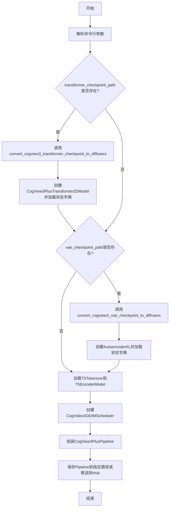
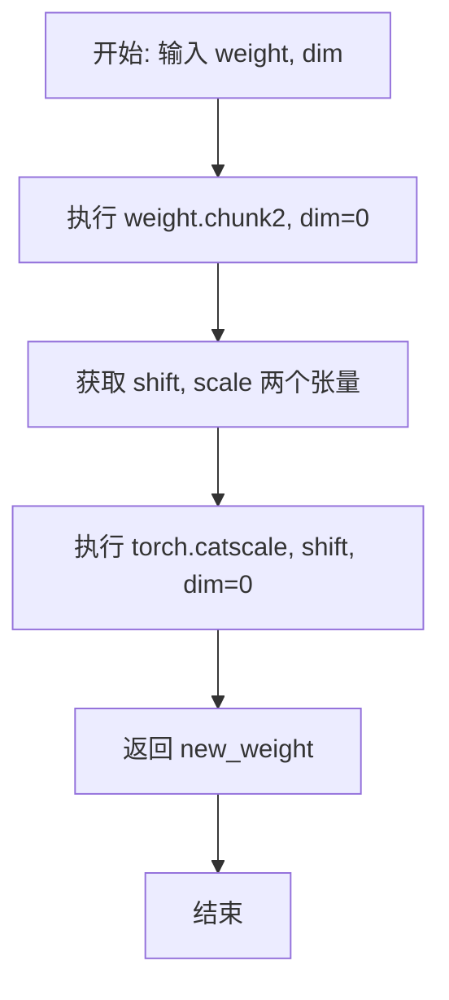
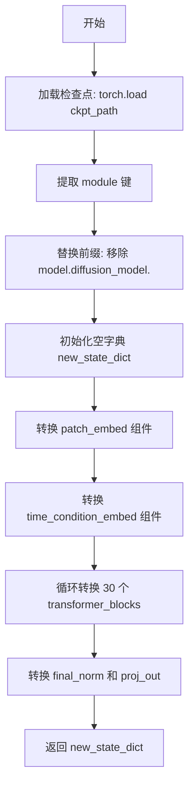
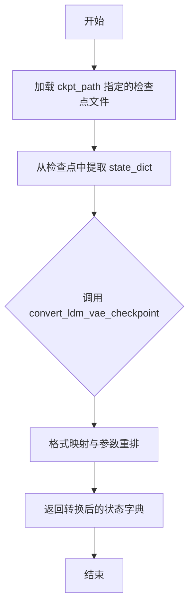
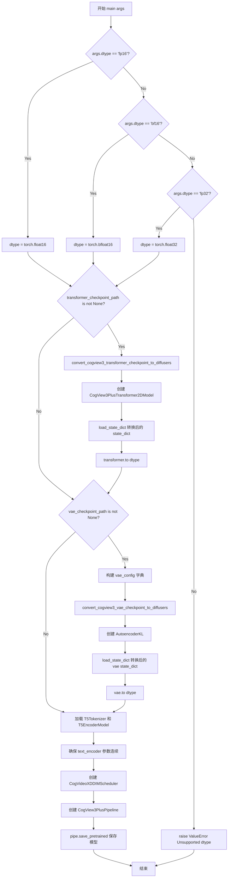

# `diffusers\scripts\convert_cogview3_to_diffusers.py` 详细设计文档

该脚本用于将CogView3/CogView3+模型的检查点转换为Hugging Face Diffusers格式，支持转换Transformer和VAE组件，并可选择性地将转换后的模型推送到Hugging Face Hub。

## 整体流程



## 类结构

```
无自定义类
主要使用以下外部类：
CogView3PlusTransformer2DModel (Transformer模型)
AutoencoderKL (VAE模型)
T5EncoderModel (文本编码器)
T5Tokenizer (分词器)
CogVideoXDDIMScheduler (调度器)
CogView3PlusPipeline (完整流水线)
```

## 全局变量及字段


### `CTX`
    
条件上下文管理器，用于支持accelerate库，当accelerate可用时使用init_empty_weights，否则使用nullcontext

类型：`contextlib.contextmanager`
    


### `TOKENIZER_MAX_LENGTH`
    
tokenizer最大长度，设置为224

类型：`int`
    


### `parser`
    
命令行参数解析器实例，用于解析转换脚本的各种输入参数

类型：`argparse.ArgumentParser`
    


### `args`
    
解析后的命令行参数对象，包含transformer_checkpoint_path、vae_checkpoint_path、output_path等配置

类型：`argparse.Namespace`
    


    

## 全局函数及方法


### `swap_scale_shift`

该函数用于交换 AdaLayerNormContinuous 的 scale（缩放）和 shift（偏移）顺序。因为 Diffusers 实现的 AdaLayerNormContinuous 将线性投影分成 scale 和 shift 两部分，而 CogView3 原始实现分成 shift 和 scale 两部分，顺序相反，需要通过此函数进行转换以保证权重正确映射。

参数：

- `weight`：`torch.Tensor`，待处理的权重张量，通常包含按顺序拼接的 shift 和 scale 参数
- `dim`：`int`，权重张量进行 chunk 操作的维度，通常为 0

返回值：`torch.Tensor`，返回重新拼接后的权重张量，顺序从 [shift, scale] 变为 [scale, shift]

#### 流程图



#### 带注释源码

```python
# this is specific to `AdaLayerNormContinuous`:
# diffusers implementation split the linear projection into the scale, shift
# while CogView3 split it into shift, scale
def swap_scale_shift(weight, dim):
    """
    交换权重中 scale 和 shift 的顺序
    
    Args:
        weight: 权重张量，包含按 [shift, scale] 顺序排列的参数
        dim: 进行 chunk 操作的维度
    
    Returns:
        重新排列后的权重张量，顺序变为 [scale, shift]
    """
    # 将权重按 dim 维度分成两半，CogView3 原始顺序为 [shift, scale]
    shift, scale = weight.chunk(2, dim=0)
    # 重新拼接为 [scale, shift] 顺序以适配 Diffusers 实现
    new_weight = torch.cat([scale, shift], dim=0)
    return new_weight
```


### `convert_cogview3_transformer_checkpoint_to_diffusers`

该函数负责将 CogView3 模型的 Transformer 检查点（Checkpoint）从原始格式转换为 Diffusers 格式。它通过解析原始状态字典，提取并重新映射模型权重（如 patch_embed、time_condition_embed、transformer_blocks 等组件），以适配 Diffusers 库中 `CogView3PlusTransformer2DModel` 的结构。

参数：
-  `ckpt_path`：`str`，CogView3 Transformer 检查点文件的路径。

返回值：`Dict[str, torch.Tensor]`，返回转换后的新状态字典，键名为 Diffusers 格式，值为对应的权重张量。

#### 流程图



#### 带注释源码

```python
def convert_cogview3_transformer_checkpoint_to_diffusers(ckpt_path):
    """
    将 CogView3 的 Transformer 检查点转换为 Diffusers 格式的状态字典。

    参数:
        ckpt_path (str): 原始 CogView3 Transformer 检查点的文件路径。

    返回:
        Dict[str, torch.Tensor]: 键名符合 Diffusers 模型结构的新状态字典。
    """
    # 1. 加载原始检查点到 CPU
    original_state_dict = torch.load(ckpt_path, map_location="cpu")
    # 2. 提取 'module' 键（通常是 DistributedDataParallel 包装的结果）
    original_state_dict = original_state_dict["module"]
    # 3. 移除 CogView3 特定的键前缀 'model.diffusion_model.'
    original_state_dict = {k.replace("model.diffusion_model.", ""): v for k, v in original_state_dict.items()}

    # 初始化新的状态字典
    new_state_dict = {}

    # --- 转换 patch_embed ---
    # CogView3 的 patch_embed 包含 proj 和 text_proj 两部分
    new_state_dict["patch_embed.proj.weight"] = original_state_dict.pop("mixins.patch_embed.proj.weight")
    new_state_dict["patch_embed.proj.bias"] = original_state_dict.pop("mixins.patch_embed.proj.bias")
    new_state_dict["patch_embed.text_proj.weight"] = original_state_dict.pop("mixins.patch_embed.text_proj.weight")
    new_state_dict["patch_embed.text_proj.bias"] = original_state_dict.pop("mixins.patch_embed.text_proj.bias")

    # --- 转换 time_condition_embed ---
    # 映射时间嵌入层：timestep_embedder 和 condition_embedder
    new_state_dict["time_condition_embed.timestep_embedder.linear_1.weight"] = original_state_dict.pop(
        "time_embed.0.weight"
    )
    new_state_dict["time_condition_embed.timestep_embedder.linear_1.bias"] = original_state_dict.pop(
        "time_embed.0.bias"
    )
    new_state_dict["time_condition_embed.timestep_embedder.linear_2.weight"] = original_state_dict.pop(
        "time_embed.2.weight"
    )
    new_state_dict["time_condition_embed.timestep_embedder.linear_2.bias"] = original_state_dict.pop(
        "time_embed.2.bias"
    )
    new_state_dict["time_condition_embed.condition_embedder.linear_1.weight"] = original_state_dict.pop(
        "label_emb.0.0.weight"
    )
    new_state_dict["time_condition_embed.condition_embedder.linear_1.bias"] = original_state_dict.pop(
        "label_emb.0.0.bias"
    )
    new_state_dict["time_condition_embed.condition_embedder.linear_2.weight"] = original_state_dict.pop(
        "label_emb.0.2.weight"
    )
    new_state_dict["time_condition_embed.condition_embedder.linear_2.bias"] = original_state_dict.pop(
        "label_emb.0.2.bias"
    )

    # --- 转换 transformer blocks ---
    # CogView3 有 30 个 Transformer 层，需要分别转换每层的归一化、注意力头和 FFN
    for i in range(30):
        block_prefix = f"transformer_blocks.{i}."
        old_prefix = f"transformer.layers.{i}."
        adaln_prefix = f"mixins.adaln.adaln_modules.{i}."

        # 转换 AdaLN 归一化层权重
        new_state_dict[block_prefix + "norm1.linear.weight"] = original_state_dict.pop(adaln_prefix + "1.weight")
        new_state_dict[block_prefix + "norm1.linear.bias"] = original_state_dict.pop(adaln_prefix + "1.bias")

        # 拆分 QKV 权重：CogView3 将 Q、K、V 合并存储，需要按 dim=0 拆分为三个张量
        qkv_weight = original_state_dict.pop(old_prefix + "attention.query_key_value.weight")
        qkv_bias = original_state_dict.pop(old_prefix + "attention.query_key_value.bias")
        q, k, v = qkv_weight.chunk(3, dim=0)
        q_bias, k_bias, v_bias = qkv_bias.chunk(3, dim=0)

        # 映射到 Diffusers 的 attn1 (自注意力) 权重
        new_state_dict[block_prefix + "attn1.to_q.weight"] = q
        new_state_dict[block_prefix + "attn1.to_q.bias"] = q_bias
        new_state_dict[block_prefix + "attn1.to_k.weight"] = k
        new_state_dict[block_prefix + "attn1.to_k.bias"] = k_bias
        new_state_dict[block_prefix + "attn1.to_v.weight"] = v
        new_state_dict[block_prefix + "attn1.to_v.bias"] = v_bias

        # 转换输出投影层 (dense)
        new_state_dict[block_prefix + "attn1.to_out.0.weight"] = original_state_dict.pop(
            old_prefix + "attention.dense.weight"
        )
        new_state_dict[block_prefix + "attn1.to_out.0.bias"] = original_state_dict.pop(
            old_prefix + "attention.dense.bias"
        )

        # 转换前馈网络 (FFN) 权重
        new_state_dict[block_prefix + "ff.net.0.proj.weight"] = original_state_dict.pop(
            old_prefix + "mlp.dense_h_to_4h.weight"
        )
        new_state_dict[block_prefix + "ff.net.0.proj.bias"] = original_state_dict.pop(
            old_prefix + "mlp.dense_h_to_4h.bias"
        )
        new_state_dict[block_prefix + "ff.net.2.weight"] = original_state_dict.pop(
            old_prefix + "mlp.dense_4h_to_h.weight"
        )
        new_state_dict[block_prefix + "ff.net.2.bias"] = original_state_dict.pop(old_prefix + "mlp.dense_4h_to_h.bias")

    # --- 转换最终归一化层和输出投影 ---
    # 使用 swap_scale_shift 函数调整权重顺序（Diffusers 与 CogView3 的 scale/shift 顺序相反）
    new_state_dict["norm_out.linear.weight"] = swap_scale_shift(
        original_state_dict.pop("mixins.final_layer.adaln.1.weight"), dim=0
    )
    new_state_dict["norm_out.linear.bias"] = swap_scale_shift(
        original_state_dict.pop("mixins.final_layer.adaln.1.bias"), dim=0
    )
    new_state_dict["proj_out.weight"] = original_state_dict.pop("mixins.final_layer.linear.weight")
    new_state_dict["proj_out.bias"] = original_state_dict.pop("mixins.final_layer.linear.bias")

    return new_state_dict
```


### `convert_cogview3_vae_checkpoint_to_diffusers`

该函数用于将 CogView3 模型的 VAE 检查点转换为 Diffusers 库可用的格式，通过加载原始检查点的 state_dict 并调用 Diffusers 提供的转换工具函数完成格式转换。

参数：

- `ckpt_path`：`str`，CogView3 VAE 检查点文件的路径
- `vae_config`：`dict`，VAE 配置字典，包含 VAE 的结构参数（如通道数、块类型等）

返回值：`dict`，转换后的 VAE 状态字典，可直接用于 Diffusers 的 AutoencoderKL 模型加载

#### 流程图



#### 带注释源码

```python
def convert_cogview3_vae_checkpoint_to_diffusers(ckpt_path, vae_config):
    """
    将 CogView3 的 VAE 检查点转换为 Diffusers 格式。
    
    参数:
        ckpt_path: str - 原始 VAE 检查点的文件路径
        vae_config: dict - VAE 配置文件，包含模型结构信息
    
    返回:
        dict - 转换后的状态字典，可用于 Diffusers AutoencoderKL
    """
    # 从指定路径加载检查点，使用 CPU 作为设备映射
    # 原始检查点结构通常包含 "state_dict" 键
    original_state_dict = torch.load(ckpt_path, map_location="cpu")["state_dict"]
    
    # 调用 Diffusers 库提供的工具函数进行 LDM VAE 检查点格式转换
    # 该函数会处理权重名称映射、形状转换等兼容性问题
    return convert_ldm_vae_checkpoint(original_state_dict, vae_config)
```


### `main(args)`

`main` 函数是整个转换流程的入口和协调中心，负责解析命令行参数、加载并转换 CogView3 的 Transformer 和 VAE 模型、检查点，加载预训练的 Text Encoder 和 Tokenizer，创建调度器和 Pipeline，最终将转换后的模型保存到指定路径或推送到 Hugging Face Hub。

参数：

- `args`：`argparse.Namespace`，包含以下属性：
  - `transformer_checkpoint_path`：`str`，Transformer 检查点的文件路径
  - `vae_checkpoint_path`：`str`，VAE 检查点的文件路径
  - `output_path`：`str`，保存转换后模型的路径
  - `push_to_hub`：`bool`，是否将转换后的检查点推送到 Hugging Face Hub
  - `text_encoder_cache_dir`：`str`，Text Encoder 的缓存目录
  - `dtype`：`str`，保存模型的 dtype（选项："fp16", "bf16", "fp32"）

返回值：`None`，该函数不返回任何值，仅执行模型转换和保存操作。

#### 流程图



#### 带注释源码

```python
def main(args):
    """
    主函数，协调整个 CogView3 到 Diffusers 格式的转换流程。
    
    参数:
        args: 包含所有命令行参数的命名空间对象
            - transformer_checkpoint_path: Transformer 检查点路径 (可选)
            - vae_checkpoint_path: VAE 检查点路径 (可选)
            - output_path: 输出路径 (必需)
            - push_to_hub: 是否推送到 Hub (默认 False)
            - text_encoder_cache_dir: Text Encoder 缓存目录 (可选)
            - dtype: 保存模型的数据类型 (默认 "bf16")
    """
    
    # ------------------------------
    # 步骤 1: 解析并验证 dtype 参数
    # ------------------------------
    if args.dtype == "fp16":
        dtype = torch.float16
    elif args.dtype == "bf16":
        dtype = torch.bfloat16
    elif args.dtype == "fp32":
        dtype = torch.float32
    else:
        # 如果传入不支持的 dtype，抛出错误
        raise ValueError(f"Unsupported dtype: {args.dtype}")

    # 初始化 Transformer 和 VAE 模型变量
    transformer = None
    vae = None

    # ------------------------------
    # 步骤 2: 处理 Transformer 检查点
    # ------------------------------
    # 检查是否提供了 Transformer 检查点路径
    if args.transformer_checkpoint_path is not None:
        # 调用转换函数，将 CogView3 格式的 Transformer 权重转换为 Diffusers 格式
        converted_transformer_state_dict = convert_cogview3_transformer_checkpoint_to_diffusers(
            args.transformer_checkpoint_path
        )
        
        # 创建 Diffusers 格式的 Transformer 模型实例
        transformer = CogView3PlusTransformer2DModel()
        
        # 加载转换后的权重，strict=True 表示严格匹配键
        transformer.load_state_dict(converted_transformer_state_dict, strict=True)
        
        # 将模型转换为指定的 dtype（如果指定了 dtype）
        if dtype is not None:
            # 原始检查点的数据类型将被保留
            transformer = transformer.to(dtype=dtype)

    # ------------------------------
    # 步骤 3: 处理 VAE 检查点
    # ------------------------------
    # 检查是否提供了 VAE 检查点路径
    if args.vae_checkpoint_path is not None:
        # 定义 VAE 的配置参数，包括通道数、块类型、激活函数等
        vae_config = {
            "in_channels": 3,
            "out_channels": 3,
            "down_block_types": ("DownEncoderBlock2D",) * 4,
            "up_block_types": ("UpDecoderBlock2D",) * 4,
            "block_out_channels": (128, 512, 1024, 1024),
            "layers_per_block": 3,
            "act_fn": "silu",
            "latent_channels": 16,
            "norm_num_groups": 32,
            "sample_size": 1024,
            "scaling_factor": 1.0,
            "force_upcast": True,
            "use_quant_conv": False,
            "use_post_quant_conv": False,
            "mid_block_add_attention": False,
        }
        
        # 调用转换函数，将 CogView3 格式的 VAE 权重转换为 Diffusers 格式
        converted_vae_state_dict = convert_cogview3_vae_checkpoint_to_diffusers(
            args.vae_checkpoint_path, vae_config
        )
        
        # 创建 Diffusers 格式的 VAE 模型实例
        vae = AutoencoderKL(**vae_config)
        
        # 加载转换后的 VAE 权重
        vae.load_state_dict(converted_vae_state_dict, strict=True)
        
        # 将 VAE 转换为指定的 dtype
        if dtype is not None:
            vae = vae.to(dtype=dtype)

    # ------------------------------
    # 步骤 4: 加载 Text Encoder 和 Tokenizer
    # ------------------------------
    # 使用预训练的 T5 模型作为 Text Encoder
    text_encoder_id = "google/t5-v1_1-xxl"
    
    # 加载 T5 Tokenizer，设置最大长度为 224
    tokenizer = T5Tokenizer.from_pretrained(text_encoder_id, model_max_length=TOKENIZER_MAX_LENGTH)
    
    # 加载 T5 Encoder Model，可使用缓存目录
    text_encoder = T5EncoderModel.from_pretrained(text_encoder_id, cache_dir=args.text_encoder_cache_dir)

    # ------------------------------
    # 步骤 5: 确保 Text Encoder 参数连续
    # ------------------------------
    # 某些情况下，参数可能不是连续的，这会导致转换失败
    # 遍历所有参数，确保数据在内存中是连续的
    for param in text_encoder.parameters():
        param.data = param.data.contiguous()

    # ------------------------------
    # 步骤 6: 创建调度器 (Scheduler)
    # ------------------------------
    # 使用 CogVideoX DDIM 调度器，包含噪声调度、beta 调度等配置
    scheduler = CogVideoXDDIMScheduler.from_config(
        {
            "snr_shift_scale": 4.0,
            "beta_end": 0.012,
            "beta_schedule": "scaled_linear",
            "beta_start": 0.00085,
            "clip_sample": False,
            "num_train_timesteps": 1000,
            "prediction_type": "v_prediction",
            "rescale_betas_zero_snr": True,
            "set_alpha_to_one": True,
            "timestep_spacing": "trailing",
        }
    )

    # ------------------------------
    # 步骤 7: 创建并保存 Pipeline
    # ------------------------------
    # 组装完整的 CogView3+ Pipeline
    pipe = CogView3PlusPipeline(
        tokenizer=tokenizer,
        text_encoder=text_encoder,
        vae=vae,
        transformer=transformer,
        scheduler=scheduler,
    )

    # ------------------------------
    # 步骤 8: 保存模型到磁盘或推送到 Hub
    # ------------------------------
    # 这对于内存不足的用户（如使用 Colab）是必要的，可以节省模型加载时的内存
    # safe_serialization=True 使用安全序列化（推荐）
    # max_shard_size="5GB" 设置单个分片的最大大小
    # push_to_hub 控制是否推送到 Hugging Face Hub
    pipe.save_pretrained(
        args.output_path, 
        safe_serialization=True, 
        max_shard_size="5GB", 
        push_to_hub=args.push_to_hub
    )
```

## 关键组件


### 张量索引与状态字典操作

代码通过 `torch.load` 加载原始检查点，并使用 `pop` 和 `replace` 方法对状态字典进行索引和重组，将原始模型的前缀（如 "model.diffusion_model."、"mixins.patch_embed.proj.weight" 等）转换为 Diffusers 格式的键名（如 "patch_embed.proj.weight"）。

### 惰性权重加载

使用 `accelerate` 库的 `init_empty_weights` 配合 `nullcontext` 实现条件性惰性权重加载，通过 `CTX = init_empty_weights if is_accelerate_available() else nullcontext` 根据加速库可用性选择上下文管理器。

### 量化策略与 dtype 处理

代码通过 `dtype` 参数支持多种数值精度（fp16、bf16、fp32），在加载检查点后使用 `.to(dtype=dtype)` 将模型转换为目标数据类型，默认使用 bfloat16 以匹配 CogView3 的训练配置。

### 反量化与权重重排

`swap_scale_shift` 函数实现权重张量的反量化重排，将 `AdaLayerNormContinuous` 中分离的 shift 和 scale 参数重新排列为 Diffusers 期望的 [scale, shift] 顺序，通过 `weight.chunk(2, dim=0)` 分割后使用 `torch.cat` 重新组合。

### Transformer 检查点转换

`convert_cogview3_transformer_checkpoint_to_diffusers` 函数处理 30 层 transformer blocks，将原始的 QKV 权重（合并为 3 倍通道数的权重）拆分为独立的 query、key、value 权重，并重映射注意力机制、MLP 层、时间条件嵌入和最终归一化层的键名。

### VAE 检查点转换

`convert_cogview3_vae_checkpoint_to_diffusers` 函数调用 `diffusers.loaders.single_file_utils.convert_ldm_vae_checkpoint` 将 LDM 格式的 VAE 状态字典转换为 Diffusers 的 AutoencoderKL 格式，使用预定义的 VAE 配置（包括 4 层编码器/解码器、通道数 [128, 512, 1024, 1024]、潜空间通道数 16 等）。

### 模型组装与管道构建

`main` 函数将转换后的 transformer、VAE 与预训练的 T5 文本编码器、tokenizer 以及配置好的 CogVideoXDDIMScheduler 组装为 CogView3PlusPipeline，最终通过 `pipe.save_pretrained` 保存为安全序列化的 Diffusers 格式检查点。

### 调度器配置

使用 `CogVideoXDDIMScheduler` 并配置特定的采样参数，包括 SNR 位移缩放 (4.0)、beta 调度 (scaled_linear)、预测类型 (v_prediction)、时间步间距 (trailing) 等，以适配 CogView3 的推理流程。


## 问题及建议


### 已知问题

- **硬编码配置问题**：VAE 配置、transformer block 数量（30）、tokenizer 最大长度（224）、text_encoder 模型 ID（"google/t5-v1_1-xxl"）均硬编码在代码中，无法适配不同版本的 CogView3 模型。
- **参数验证缺失**：未验证 `--transformer_checkpoint_path` 和 `--vae_checkpoint_path` 指向的文件是否存在，也未检查是否至少提供了其中一个路径。
- **缺少异常处理**：`torch.load()` 加载检查点时没有异常处理机制，若文件损坏或格式错误会导致程序直接崩溃。
- **状态字典假设不安全**：假设 `original_state_dict["module"]` 和 `original_state_dict["state_dict"]` 键一定存在，未做健壮性检查。
- **参数解析位置错误**：`argparse` 在模块级别解析 `args`，而非在 `if __name__ == "__main__"` 块内，导致导入该模块时就会尝试解析命令行参数。
- **未使用的变量**：`CTX` 变量被定义但从未使用，`is_accelerate_available` 的检查结果未被应用。
- **转换函数副作用**：`convert_cogview3_transformer_checkpoint_to_diffusers` 中使用 `pop` 修改原始字典，可能导致调用方后续无法使用原始数据。

### 优化建议

- 将硬编码的配置值提取为命令行参数或配置文件，增加脚本的灵活性。
- 在加载检查点前验证文件路径是否存在，并添加 `try-except` 块处理 `torch.load` 的异常情况。
- 使用字典的 `get()` 方法配合默认值或显式检查来确保必需键的存在。
- 将 `args = parser.parse_args()` 移至 `if __name__ == "__main__"` 块内，或改为函数参数传递。
- 删除未使用的 `CTX` 变量，或实现基于 `accelerate` 的内存优化加载逻辑。
- 为关键函数添加类型注解和文档字符串，提升代码可维护性。
- 考虑将转换逻辑封装为独立函数并添加单元测试，降低主流程的耦合度。

## 其它


### 设计目标与约束

本脚本的核心目标是将CogView3模型的检查点（checkpoint）转换为Hugging Face Diffusers库可用的格式，使其能够在Diffusers框架下进行推理和进一步开发。主要约束包括：1）必须保持模型权重的一致性和完整性；2）支持多种dtype转换（fp16/bf16/fp32）；3）需要适配Diffusers库中的CogView3PlusPipeline接口；4）处理特定层（如AdaLayerNormContinuous）的权重重排问题。

### 错误处理与异常设计

脚本在以下环节进行了错误处理：1）dtype参数校验：当传入不支持的dtype时，抛出`ValueError`异常；2）文件路径校验：通过`argparse`要求`output_path`为必填参数，`transformer_checkpoint_path`和`vae_checkpoint_path`为可选但至少需要提供一个；3）模型加载严格模式：使用`strict=True`加载state_dict，确保权重完整匹配；4）异常捕获：未捕获的异常会直接向上传播，由调用方处理。建议增加更详细的文件存在性检查和网络下载异常处理。

### 外部依赖与接口契约

主要外部依赖包括：1）`torch`：张量操作和模型加载；2）`transformers`：T5Tokenizer和T5EncoderModel用于文本编码；3）`diffusers`：核心库，提供CogVideoXDDIMScheduler、CogView3PlusPipeline、CogView3PlusTransformer2DModel、AutoencoderKL等组件；4）`accelerate`：可选依赖，用于初始化空权重上下文。接口契约方面：`convert_cogview3_transformer_checkpoint_to_diffusers`接收checkpoint路径返回重排后的state_dict；`convert_cogview3_vae_checkpoint_to_diffusers`接收checkpoint路径和vae_config返回转换后的vae state_dict。

### 数据流与状态机

数据流分为两条主要路径：Transformer路径和VAE路径。对于Transformer：首先加载原始checkpoint（包含`module`键），然后进行键名替换和权重重排（30个transformer块、patch_embed、time_condition_embed等），最后加载到CogView3PlusTransformer2DModel实例。对于VAE：加载原始vae checkpoint的`state_dict`，通过`convert_ldm_vae_checkpoint`转换为Diffusers格式，加载到AutoencoderKL实例。两路径最终汇聚到CogView3PlusPipeline中进行组合。状态机表现为顺序执行：参数解析→模型转换→Pipeline组装→保存。

### 配置参数说明

关键配置参数包括：1）`transformer_checkpoint_path`：Transformer检查点路径；2）`vae_checkpoint_path`：VAE检查点路径；3）`output_path`：输出目录（必填）；4）`push_to_hub`：是否推送到HuggingFace Hub；5）`text_encoder_cache_dir`：文本编码器缓存目录；6）`dtype`：模型精度（fp16/bf16/fp32）。VAE配置采用硬编码的config字典，包含in_channels=3、out_channels=3、down_block_types为4个DownEncoderBlock2D、block_out_channels为(128, 512, 1024, 1024)等参数。调度器配置采用特定参数：snr_shift_scale=4.0、beta_schedule="scaled_linear"、prediction_type="v_prediction"等。

### 使用示例与注意事项

使用示例已在代码注释中给出。注意事项包括：1）原始checkpoint需要包含`module`键才能正确解析；2）VAE checkpoint需要包含`state_dict`键；3）文本编码器默认使用google/t5-v1_1-xxl模型，需要网络下载或缓存；4）对于内存有限的环境（如Colab），脚本会自动启用内存优化；5）保存时使用safe_serialization=True保证安全性，max_shard_size="5GB"控制分片大小。

### 性能考虑

当前实现的主要性能考量：1）CPU加载：所有权重在CPU上加载，然后根据需要转换到目标dtype；2）内存优化：通过`init_empty_weights`（当accelerate可用时）减少中间内存占用；3）分片保存：使用max_shard_size="5GB"避免生成过大的单文件；4）连续内存：显式调用`param.data.contiguous()`确保文本编码器参数内存连续性。潜在优化点包括：支持增量转换、添加进度条显示、并行处理多个检查点等。

### 兼容性说明

兼容性方面：1）Diffusers版本要求：需要与CogView3PlusPipeline兼容的Diffusers版本；2）T5模型兼容性：使用google/t5-v1_1-xxl作为文本编码器，需确保transformers库版本兼容；3）CogView3特定适配：swap_scale_shift函数专门处理AdaLayerNormContinuous层的scale/shift顺序问题，这是CogView3与Diffusers实现的核心差异；4）CUDA支持：脚本本身为CPU版本，但模型可后续移至GPU运行。

    