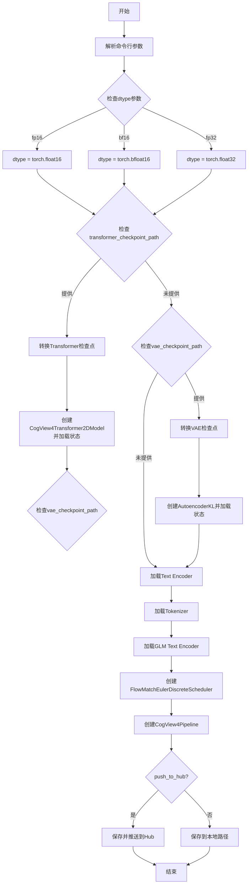
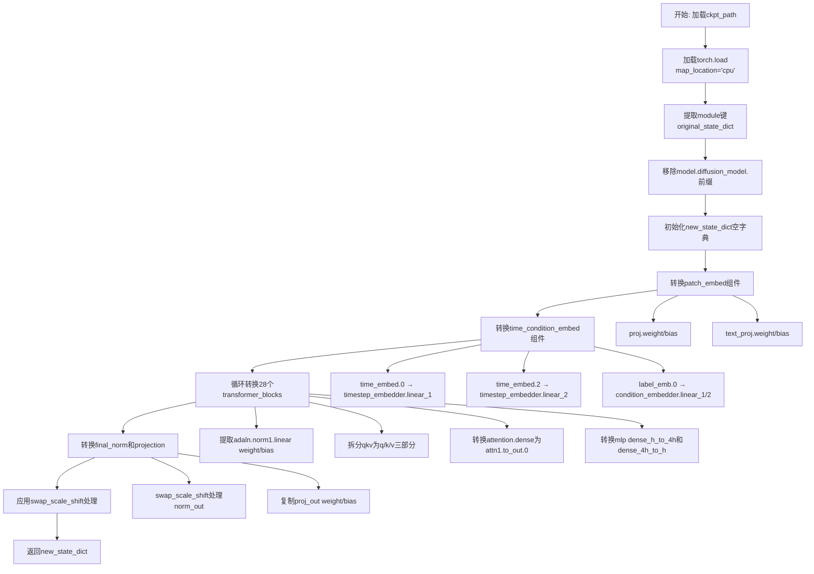
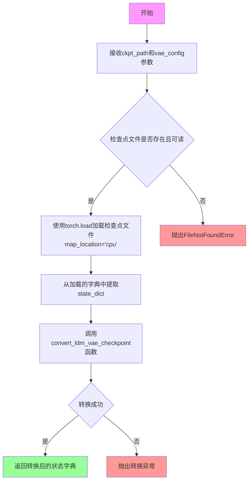
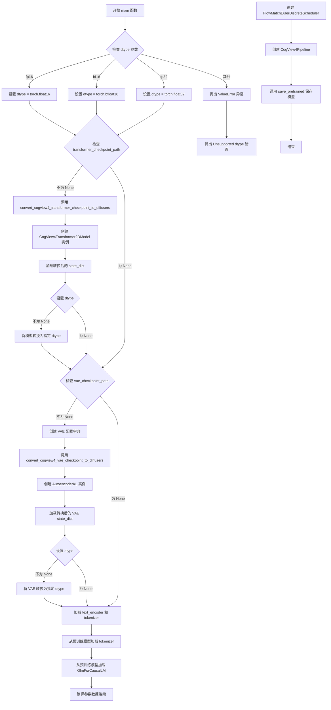

# `diffusers\scripts\convert_cogview4_to_diffusers.py` 详细设计文档

这是一个模型转换脚本，用于将CogView4的检查点从SAT（SwissArmyTransformer）格式转换为Diffusers格式，使其可以在Diffusers库中使用。脚本支持转换Transformer、VAE和Text Encoder组件，并可选择将转换后的模型保存到本地或推送到HuggingFace Hub。

## 整体流程



## 类结构

```
此脚本为单文件脚本，无类定义
主要包含以下函数组件：
├── swap_scale_shift (工具函数)
├── convert_cogview4_transformer_checkpoint_to_diffusers (转换函数)
├── convert_cogview4_vae_checkpoint_to_diffusers (转换函数)
└── main (主函数)
```

## 全局变量及字段


### `parser`
    
命令行参数解析器，用于定义和解析脚本的命令行参数

类型：`argparse.ArgumentParser`
    


### `args`
    
解析后的命令行参数命名空间，包含所有传入的参数值

类型：`argparse.Namespace`
    


### `CTX`
    
条件上下文管理器，根据is_accelerate_available()的结果选择使用init_empty_weights或nullcontext，用于模型加载时的内存优化

类型：`contextlib.nullcontext/init_empty_weights`
    


    

## 全局函数及方法


### `swap_scale_shift(weight, dim)`

该函数用于交换权重张量中的scale和shift分量，主要用于将CogView4模型中的`AdaLayerNormContinuous`层权重转换为Diffusers格式，因为两者在scale和shift的顺序上存在差异。

参数：

- `weight`：`torch.Tensor`，原始权重张量，通常包含shift和scale两个部分
- `dim`：`int`，沿着该维度进行分割（通常为0）

返回值：`torch.Tensor`，将原始权重张量中的scale和shift分量交换位置后的新张量

#### 流程图

```mermaid
flowchart TD
    A[开始: swap_scale_shift] --> B[输入: weight, dim]
    B --> C[执行 weight.chunk2, dim=dim]
    C --> D[获取 shift, scale 两部分]
    D --> E[执行 torch.cat<br/>[scale, shift], dim=dim]
    E --> F[生成 new_weight]
    F --> G[返回 new_weight]
```

#### 带注释源码

```python
def swap_scale_shift(weight, dim):
    """
    Swap the scale and shift components in the weight tensor.

    Args:
        weight (torch.Tensor): The original weight tensor.
        dim (int): The dimension along which to split.

    Returns:
        torch.Tensor: The modified weight tensor with scale and shift swapped.
    """
    # 将权重张量沿着指定维度(dim)分割成两部分
    # 在CogView4的AdaLayerNormContinuous实现中，权重顺序为[shift, scale]
    # 需要转换为Diffusers的[scale, shift]顺序
    shift, scale = weight.chunk(2, dim=dim)
    
    # 将分割后的两部分按照新的顺序（scale在前，shift在后）重新连接
    new_weight = torch.cat([scale, shift], dim=dim)
    
    # 返回交换了scale和shift顺序的新权重张量
    return new_weight
```


### `convert_cogview4_transformer_checkpoint_to_diffusers`

将CogView4 Transformer检查点从SAT格式转换为Diffusers格式，处理模型权重的键名映射和重排，包括patch_embed、time_condition_embed、transformer_blocks和final_layer等组件的转换。

参数：

- `ckpt_path`：`str`，CogView4 Transformer检查点的文件路径

返回值：`dict`，转换后的Diffusers格式状态字典，键名为Diffusers模型结构对应的名称

#### 流程图



#### 带注释源码

```python
def convert_cogview4_transformer_checkpoint_to_diffusers(ckpt_path):
    """
    将CogView4 Transformer检查点转换为Diffusers格式的状态字典。
    
    该函数处理SAT (SwissArmyTransformer) 格式的检查点到Diffusers格式的模型权重映射，
    包括键名重命名、权重重排和维度调整等操作。
    
    Args:
        ckpt_path (str): CogView4 Transformer检查点的文件路径
        
    Returns:
        dict: 转换后的状态字典，键名为Diffusers模型结构对应名称
    """
    # 加载原始检查点文件，使用CPU映射
    original_state_dict = torch.load(ckpt_path, map_location="cpu")
    # SAT格式的检查点通常将模型参数存储在'module'键下
    original_state_dict = original_state_dict["module"]
    # 移除"model.diffusion_model."前缀，这是SAT格式的常见前缀
    original_state_dict = {k.replace("model.diffusion_model.", ""): v for k, v in original_state_dict.items()}

    # 初始化新的状态字典，用于存储Diffusers格式的权重
    new_state_dict = {}

    # ===== 转换 patch_embed 层 =====
    # patch_embed包含图像patch嵌入投影和文本条件投影
    new_state_dict["patch_embed.proj.weight"] = original_state_dict.pop("mixins.patch_embed.proj.weight")
    new_state_dict["patch_embed.proj.bias"] = original_state_dict.pop("mixins.patch_embed.proj.bias")
    new_state_dict["patch_embed.text_proj.weight"] = original_state_dict.pop("mixins.patch_embed.text_proj.weight")
    new_state_dict["patch_embed.text_proj.bias"] = original_state_dict.pop("mixins.patch_embed.text_proj.bias")

    # ===== 转换 time_condition_embed 层 =====
    # 时间条件嵌入包含时间步嵌入器和条件嵌入器
    new_state_dict["time_condition_embed.timestep_embedder.linear_1.weight"] = original_state_dict.pop(
        "time_embed.0.weight"
    )
    new_state_dict["time_condition_embed.timestep_embedder.linear_1.bias"] = original_state_dict.pop(
        "time_embed.0.bias"
    )
    new_state_dict["time_condition_embed.timestep_embedder.linear_2.weight"] = original_state_dict.pop(
        "time_embed.2.weight"
    )
    new_state_dict["time_condition_embed.timestep_embedder.linear_2.bias"] = original_state_dict.pop(
        "time_embed.2.bias"
    )
    new_state_dict["time_condition_embed.condition_embedder.linear_1.weight"] = original_state_dict.pop(
        "label_emb.0.0.weight"
    )
    new_state_dict["time_condition_embed.condition_embedder.linear_1.bias"] = original_state_dict.pop(
        "label_emb.0.0.bias"
    )
    new_state_dict["time_condition_embed.condition_embedder.linear_2.weight"] = original_state_dict.pop(
        "label_emb.0.2.weight"
    )
    new_state_dict["time_condition_embed.condition_embedder.linear_2.bias"] = original_state_dict.pop(
        "label_emb.0.2.bias"
    )

    # ===== 转换 transformer blocks =====
    # CogView4包含28个transformer块，每个块包含归一化、注意力机制和前馈网络
    for i in range(28):
        block_prefix = f"transformer_blocks.{i}."
        old_prefix = f"transformer.layers.{i}."
        adaln_prefix = f"mixins.adaln.adaln_modules.{i}."
        
        # 转换AdaLayerNormContinuous的权重 (shift, scale -> scale, shift)
        new_state_dict[block_prefix + "norm1.linear.weight"] = original_state_dict.pop(adaln_prefix + "1.weight")
        new_state_dict[block_prefix + "norm1.linear.bias"] = original_state_dict.pop(adaln_prefix + "1.bias")

        # 拆分融合的QKV权重为独立的q, k, v
        qkv_weight = original_state_dict.pop(old_prefix + "attention.query_key_value.weight")
        qkv_bias = original_state_dict.pop(old_prefix + "attention.query_key_value.bias")
        q, k, v = qkv_weight.chunk(3, dim=0)
        q_bias, k_bias, v_bias = qkv_bias.chunk(3, dim=0)

        # 映射到Diffusers的attn1结构
        new_state_dict[block_prefix + "attn1.to_q.weight"] = q
        new_state_dict[block_prefix + "attn1.to_q.bias"] = q_bias
        new_state_dict[block_prefix + "attn1.to_k.weight"] = k
        new_state_dict[block_prefix + "attn1.to_k.bias"] = k_bias
        new_state_dict[block_prefix + "attn1.to_v.weight"] = v
        new_state_dict[block_prefix + "attn1.to_v.bias"] = v_bias

        # 转换输出投影层 (dense -> to_out.0)
        new_state_dict[block_prefix + "attn1.to_out.0.weight"] = original_state_dict.pop(
            old_prefix + "attention.dense.weight"
        )
        new_state_dict[block_prefix + "attn1.to_out.0.bias"] = original_state_dict.pop(
            old_prefix + "attention.dense.bias"
        )

        # 转换前馈网络 (MLP) 权重
        new_state_dict[block_prefix + "ff.net.0.proj.weight"] = original_state_dict.pop(
            old_prefix + "mlp.dense_h_to_4h.weight"
        )
        new_state_dict[block_prefix + "ff.net.0.proj.bias"] = original_state_dict.pop(
            old_prefix + "mlp.dense_h_to_4h.bias"
        )
        new_state_dict[block_prefix + "ff.net.2.weight"] = original_state_dict.pop(
            old_prefix + "mlp.dense_4h_to_h.weight"
        )
        new_state_dict[block_prefix + "ff.net.2.bias"] = original_state_dict.pop(old_prefix + "mlp.dense_4h_to_h.bias")

    # ===== 转换最终归一化层和输出投影 =====
    # 需要对scale和shift进行交换，因为Diffusers实现与CogView4实现相反
    new_state_dict["norm_out.linear.weight"] = swap_scale_shift(
        original_state_dict.pop("mixins.final_layer.adaln.1.weight"), dim=0
    )
    new_state_dict["norm_out.linear.bias"] = swap_scale_shift(
        original_state_dict.pop("mixins.final_layer.adaln.1.bias"), dim=0
    )
    new_state_dict["proj_out.weight"] = original_state_dict.pop("mixins.final_layer.linear.weight")
    new_state_dict["proj_out.bias"] = original_state_dict.pop("mixins.final_layer.linear.bias")

    # 返回转换后的Diffusers格式状态字典
    return new_state_dict
```

#### 全局相关组件

| 组件名称 | 类型 | 描述 |
|---------|------|------|
| `swap_scale_shift` | 全局函数 | 交换权重张量中的scale和shift分量，用于处理AdaLayerNormContinuous的差异 |
| `convert_cogview4_vae_checkpoint_to_diffusers` | 全局函数 | 转换VAE检查点到Diffusers格式 |
| `CTX` | 全局变量 | 根据accelerate可用性选择初始化空权重的上下文管理器 |
| `parser` | 全局变量 | 命令行参数解析器 |
| `args` | 全局变量 | 解析后的命令行参数 |

#### 技术债务与优化空间

1. **硬编码的Transformer块数量**：函数中硬编码了`range(28)`，应该从原始状态字典中动态获取或作为参数传入
2. **缺乏错误处理**：没有对键名不存在的情况进行处理，可能导致KeyError
3. **硬编码的注意力头维度**：假设了特定的模型架构参数，应从配置文件读取
4. **deprecated注释**：代码已标记为deprecated但仍在使用，应考虑迁移策略

#### 设计约束与外部依赖

- 依赖`torch`进行张量操作
- 依赖于Diffusers库定义的模型结构命名约定
- 输入检查点必须符合SAT格式（包含"module"键和"model.diffusion_model."前缀）
- 假设检查点包含完整的28层Transformer结构


### `convert_cogview4_vae_checkpoint_to_diffusers`

将CogView4 VAE检查点从原始的SAT（SwissArmyTransformer）格式转换为Diffusers库可用的格式，通过提取检查点中的状态字典并调用Diffusers的转换工具函数完成格式转换。

参数：

- `ckpt_path`：`str`，CogView4 VAE检查点文件的路径，指向包含原始模型权重的前检查点文件
- `vae_config`：`dict`，Diffusers VAE模型的配置字典，包含通道数、块类型、激活函数等模型架构参数

返回值：`dict`，转换后的VAE状态字典，键名为Diffusers格式的层名称，值为对应的张量数据

#### 流程图



#### 带注释源码

```python
def convert_cogview4_vae_checkpoint_to_diffusers(ckpt_path, vae_config):
    """
    将CogView4 VAE检查点转换为Diffusers格式。
    
    此函数负责将原始CogView4模型中VAE部分的状态字典从SAT格式
    转换为Diffusers库所期望的格式，使其可以与Diffusers的AutoencoderKL
    类配合使用。
    
    Args:
        ckpt_path (str): 指向CogView4 VAE检查点文件的路径。
                        该文件应该是一个包含'state_dict'键的PyTorch checkpoint文件。
        vae_config (dict): 包含VAE模型配置的字典，定义了模型的结构参数，
                          如输入/输出通道数、块类型、激活函数等。
    
    Returns:
        dict: 转换后的状态字典，键名为Diffusers兼容的层名称，
             值对应模型权重张量。
    
    Raises:
        FileNotFoundError: 如果指定的检查点文件不存在。
        KeyError: 如果检查点文件中不包含'state_dict'键。
    """
    # 使用torch加载检查点文件，map_location="cpu"确保权重加载到CPU内存
    # 原始检查点结构通常包含一个"state_dict"键存储模型权重
    original_state_dict = torch.load(ckpt_path, map_location="cpu")["state_dict"]
    
    # 调用Diffusers库提供的工具函数进行格式转换
    # 该函数会处理权重重命名、形状调整等兼容性问题
    # 将LDM/SD格式的VAE权重转换为Diffusers格式
    return convert_ldm_vae_checkpoint(original_state_dict, vae_config)
```


### `main(args)`

该函数是转换脚本的主入口函数，负责协调整个CogView4检查点从SAT格式到Diffusers格式的转换流程，包括解析参数、转换transformer和VAE模型权重、加载文本编码器、创建管道并保存模型。

参数：

-  `args`：命令行参数对象（argparse.Namespace），包含以下属性：
  - `transformer_checkpoint_path`：str，Transformer检查点文件路径
  - `vae_checkpoint_path`：str，VAE检查点文件路径
  - `output_path`：str，转换后模型的输出路径
  - `push_to_hub`：bool，是否推送到HuggingFace Hub
  - `text_encoder_cache_dir`：str，文本编码器缓存目录
  - `dtype`：str，模型数据类型（fp16/bf16/fp32）

返回值：无（None），函数执行完成后将转换后的模型保存到指定路径。

#### 流程图



#### 带注释源码

```python
def main(args):
    """
    主函数，协调整个CogView4检查点转换为Diffusers格式的流程。
    
    参数:
        args: 命令行参数对象，包含模型路径、输出路径、数据类型等配置
    """
    # Step 1: 根据dtype参数转换为PyTorch数据类型
    if args.dtype == "fp16":
        dtype = torch.float16
    elif args.dtype == "bf16":
        dtype = torch.bfloat16
    elif args.dtype == "fp32":
        dtype = torch.float32
    else:
        # 不支持的dtype类型，抛出错误
        raise ValueError(f"Unsupported dtype: {args.dtype}")

    # 初始化transformer和vae为None
    transformer = None
    vae = None

    # Step 2: 处理Transformer模型转换（如果提供了路径）
    if args.transformer_checkpoint_path is not None:
        # 将CogView4格式的transformer权重转换为Diffusers格式
        converted_transformer_state_dict = convert_cogview4_transformer_checkpoint_to_diffusers(
            args.transformer_checkpoint_path
        )
        
        # 创建CogView4Transformer2DModel实例，配置参数与原模型匹配
        transformer = CogView4Transformer2DModel(
            patch_size=2,              # 补丁大小
            in_channels=16,            # 输入通道数
            num_layers=28,             # 28层transformer块
            attention_head_dim=128,    # 注意力头维度
            num_attention_heads=32,    # 注意力头数量
            out_channels=16,           # 输出通道数
            text_embed_dim=4096,      # 文本嵌入维度
            time_embed_dim=512,        # 时间嵌入维度
            condition_dim=256,         # 条件嵌入维度
            pos_embed_max_size=128,   # 位置嵌入最大尺寸
        )
        
        # 加载转换后的权重，严格匹配键名
        transformer.load_state_dict(converted_transformer_state_dict, strict=True)
        
        # 根据dtype参数转换模型数据类型（如果指定了dtype）
        if dtype is not None:
            # 原始检查点数据类型将被保留
            transformer = transformer.to(dtype=dtype)

    # Step 3: 处理VAE模型转换（如果提供了路径）
    if args.vae_checkpoint_path is not None:
        # 定义VAE配置参数
        vae_config = {
            "in_channels": 3,              # 输入通道数
            "out_channels": 3,             # 输出通道数
            "down_block_types": ("DownEncoderBlock2D",) * 4,      # 下采样块类型
            "up_block_types": ("UpDecoderBlock2D",) * 4,          # 上采样块类型
            "block_out_channels": (128, 512, 1024, 1024),         # 块输出通道数
            "layers_per_block": 3,         # 每块层数
            "act_fn": "silu",              # 激活函数
            "latent_channels": 16,         # 潜在空间通道数
            "norm_num_groups": 32,         # 归一化组数
            "sample_size": 1024,          # 样本尺寸
            "scaling_factor": 1.0,         # 缩放因子
            "shift_factor": 0.0,           # 位移因子
            "force_upcast": True,          # 强制上转
            "use_quant_conv": False,       # 不使用量化卷积
            "use_post_quant_conv": False,  # 不使用后量化卷积
            "mid_block_add_attention": False,  # 中间块不使用注意力
        }
        
        # 转换VAE检查点到Diffusers格式
        converted_vae_state_dict = convert_cogview4_vae_checkpoint_to_diffusers(
            args.vae_checkpoint_path, vae_config
        )
        
        # 创建AutoencoderKL实例
        vae = AutoencoderKL(**vae_config)
        
        # 加载转换后的VAE权重
        vae.load_state_dict(converted_vae_state_dict, strict=True)
        
        # 根据dtype参数转换VAE数据类型
        if dtype is not None:
            vae = vae.to(dtype=dtype)

    # Step 4: 加载文本编码器和分词器
    text_encoder_id = "THUDM/glm-4-9b-hf"  # 预训练文本编码器模型ID
    
    # 加载分词器
    tokenizer = PreTrainedTokenizerFast.from_pretrained(text_encoder_id)
    
    # 加载文本编码器模型，根据dtype选择精度
    text_encoder = GlmForCausalLM.from_pretrained(
        text_encoder_id,
        cache_dir=args.text_encoder_cache_dir,
        torch_dtype=torch.bfloat16 if args.dtype == "bf16" else torch.float32,
    )

    # 确保所有参数数据在内存中是连续的，有助于提高推理性能
    for param in text_encoder.parameters():
        param.data = param.data.contiguous()

    # Step 5: 创建调度器（Scheduler）
    scheduler = FlowMatchEulerDiscreteScheduler(
        base_shift=0.25,              # 基础位移
        max_shift=0.75,                # 最大位移
        base_image_seq_len=256,       # 基础图像序列长度
        use_dynamic_shifting=True,    # 使用动态位移
        time_shift_type="linear"      # 线性时间位移类型
    )

    # Step 6: 创建CogView4Pipeline管道
    pipe = CogView4Pipeline(
        tokenizer=tokenizer,
        text_encoder=text_encoder,
        vae=vae,
        transformer=transformer,
        scheduler=scheduler,
    )

    # Step 7: 保存转换后的模型
    # 这对于内存不足的用户（如使用Colab的用户）是有必要的，
    # 因为它可以节省模型加载时的一些内存
    pipe.save_pretrained(
        args.output_path, 
        safe_serialization=True,       # 使用安全序列化
        max_shard_size="5GB",         # 最大分片大小
        push_to_hub=args.push_to_hub   # 是否推送到Hub
    )
```

## 关键组件


### 张量索引与惰性加载

在转换函数中使用 `pop` 方法实现惰性加载，每次从原始状态字典中提取键值对时立即删除该键，避免内存中保存完整原始状态字典

### 反量化支持

`swap_scale_shift` 函数用于交换 AdaLayerNormContinuous 的 scale 和 shift 分量，处理 CogView4 与 Diffusers 之间的权重布局差异

### 量化策略

通过 `--dtype` 参数支持 fp16/bf16/fp32 三种精度转换，使用 `torch.bfloat16` 和 `torch.float16` 实现模型权重的量化保存

### 检查点格式转换器

`convert_cogview4_transformer_checkpoint_to_diffusers` 函数负责将 SAT 格式的 Transformer 权重转换为 Diffusers 格式，包括 patch_embed、时间条件嵌入、28 个 transformer blocks 等组件的映射

### VAE 检查点转换器

`convert_cogview4_vae_checkpoint_to_diffusers` 函数使用 `convert_ldm_vae_checkpoint` 工具函数将 VAE 权重转换为 Diffusers 的 AutoencoderKL 格式

### 模型配置与初始化

CogView4Transformer2DModel 和 AutoencoderKL 的硬编码配置，包括 28 层 Transformer、16 通道 latent、128-1024 块通道等参数

### 管道组装器

`main` 函数将转换后的 text_encoder、vae、transformer、scheduler 组装为 CogView4Pipeline，并支持推送到 HF Hub


## 问题及建议


### 已知问题

-   **全局参数解析时机不当**：在脚本顶层直接调用 `parser.parse_args()`，导致模块被导入时就会执行参数解析，这在作为库导入时会导致错误，且无法自定义参数
-   **硬编码配置过多**：VAE配置（`vae_config`字典）、Transformer参数（28层、128维等）、text_encoder模型ID（"THUDM/glm-4-9b-hf"）均为硬编码，缺乏灵活性和可配置性
-   **缺少文件存在性验证**：未检查 `transformer_checkpoint_path` 和 `vae_checkpoint_path` 指向的文件是否存在，加载失败时错误信息不够友好
-   **异常处理缺失**：`torch.load`、模型加载等操作未包装在try-except块中，文件损坏或格式错误时程序会直接崩溃
- **硬编码的Transformer块数量**：28个transformer块的数量被硬编码在循环中（`for i in range(28)`），如果模型架构变化则需修改源码
- **state_dict键名映射缺乏容错性**：使用 `pop()` 直接移除原始state_dict的键，如果原始checkpoint中缺少某些键会抛出KeyError异常
- **内存占用风险**：直接使用 `torch.load` 加载完整checkpoint到内存，大模型可能导致内存溢出
- **变量作用域问题**：在 `if __name__ == "__main__"` 块中使用顶层定义的全局变量 `args`，不符合良好的代码规范
- **text_encoder dtype处理不一致**：强制使用bfloat16或fp32，未考虑用户指定的dtype参数

### 优化建议

-   **将参数解析移至main函数**：将 `args = parser.parse_args()` 移入 `if __name__ == "__main__"` 块，或封装为函数接受参数列表
-   **配置文件化或参数化**：将VAE配置、Transformer架构参数提取为命令行参数或配置文件，提高脚本通用性
-   **添加输入验证**：在加载前检查文件是否存在和可读，添加清晰的错误提示
-   **添加异常处理**：为关键操作（文件加载、模型加载、状态字典转换）添加try-except块，捕获并友好处理常见错误
-   **动态获取模型层数**：从原始state_dict中推断transformer_blocks数量，而非硬编码
-   **使用 `mmap` 加载大文件**：对超大checkpoint考虑使用 `torch.load(..., mmap=True, map_location='cpu')` 减少内存占用
-   **使用可选依赖检测**：对于非必需的库导入进行检测，缺少时给出明确安装指引
-   **添加日志记录**：使用 `logging` 模块替代print，提供不同级别的日志输出便于调试
-   **添加dry-run模式**：在真正执行转换前增加预览模式，仅打印转换计划而不实际执行

## 其它


### 设计目标与约束

将CogView4的预训练检查点从SwissArmyTransformer(SAT)格式转换为Diffusers库可用的格式，使其能够在Diffusers框架下进行推理和部署。转换过程中需保持模型权重的一致性，并支持多种数据精度(fp16/bf16/fp32)。脚本设计为一次性转换工具(deprecated)，不支持增量更新或双向转换。

### 错误处理与异常设计

1. **参数校验错误**：当dtype参数不是fp16/bf16/fp32时，抛出ValueError("Unsupported dtype: {args.dtype}")
2. **文件缺失处理**：依赖torch.load加载检查点，文件不存在时抛出FileNotFoundError
3. **模型加载严格模式**：使用strict=True加载state_dict，任何键不匹配都会抛出RuntimeError
4. **异常传播**：main函数未捕获异常，错误将直接向上传播导致脚本终止

### 数据流与状态机

**主流程状态机**：
- 初始状态 → 参数解析 → 检查点加载 → 模型转换 → 模型组装 → 保存输出
- 条件分支：transformer_checkpoint_path非空时执行transformer转换；vae_checkpoint_path非空时执行VAE转换

**数据转换流程**：
1. 加载原始SAT格式检查点(torch.load)
2. 提取module子键并移除前缀"model.diffusion_model."
3. 按映射规则转换键名(包含28个transformer块、patch_embed、time_condition_embed等)
4. QKV权重分离：将合并的query_key_value权重按dim=0三等分
5. 特殊处理AdaLayerNormContinuous：调用swap_scale_shift交换shift和scale顺序
6. 创建Diffusers模型实例并加载转换后的state_dict
7. 转换为指定dtype并保存

### 外部依赖与接口契约

**必需依赖**：
- torch >= 1.9.0：张量操作和模型加载
- diffusers：Pipeline和模型类(CogView4Pipeline、CogView4Transformer2DModel、AutoencoderKL、FlowMatchEulerDiscreteScheduler)
- transformers：分词器和文本编码器(PreTrainedTokenizerFast、GlmForCausalLM)
- accelerate：分布式训练支持(init_empty_weights)

**外部服务**：
- HuggingFace Hub：text_encoder预训练模型下载(默认THUDM/glm-4-9b-hf)，支持通过cache_dir自定义缓存目录

**输出接口**：
- 本地保存：pipe.save_pretrained(args.output_path, safe_serialization=True, max_shard_size="5GB")
- 远程推送：push_to_hub=True时推送到HF Hub

### 配置与常量定义

- 转换针对28层transformer块、32注意力头、128头维度、16通道输入输出
- VAE配置：4层下采样/上采样、块通道[128, 512, 1024, 1024]、每块3层、潜在通道16、样本尺寸1024
- 默认dtype为bf16(bfloat16)，匹配CogView4训练配置
- 调度器采用FlowMatchEulerDiscreteScheduler，base_shift=0.25, max_shift=0.75

### 使用限制与注意事项

- 该脚本自2025-02-07起标记为deprecated，后续版本将移除
- 必须提供--transformer_checkpoint_path或--vae_checkpoint_path至少之一
- text_encoder固定使用THUDM/glm-4-9b-hf模型，不可自定义
- 输出目录若已存在同名文件会被覆盖
- 内存不足环境(如Colab)可通过参数优化减少内存占用


    