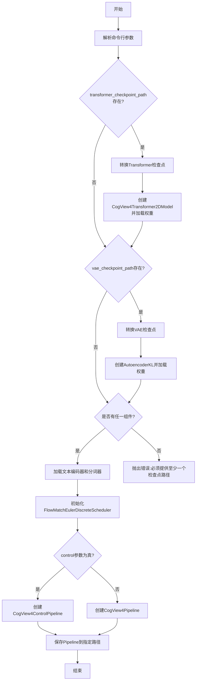
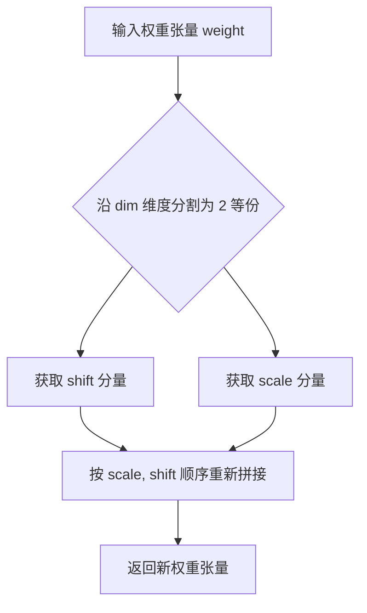
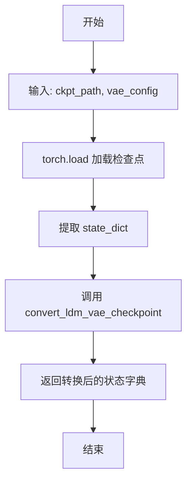
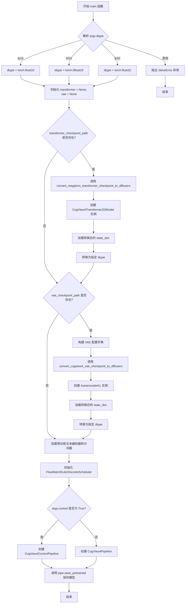

# `diffusers\scripts\convert_cogview4_to_diffusers_megatron.py` 详细设计文档

将CogView4模型的Megatron检查点转换为HuggingFace Diffusers格式的脚本，支持转换Transformer和VAE组件，可选地集成Control模型，并支持保存到本地或推送到HuggingFace Hub。

## 整体流程



## 类结构

```
脚本级 (无自定义类)
├── 全局函数
│   ├── swap_scale_shift
│   ├── convert_megatron_transformer_checkpoint_to_diffusers
│   ├── convert_cogview4_vae_checkpoint_to_diffusers
│   └── main
├── 外部依赖类
│   ├── CogView4Transformer2DModel
│   ├── CogView4Pipeline
│   ├── CogView4ControlPipeline
│   ├── AutoencoderKL
│   ├── GlmModel
│   ├── PreTrainedTokenizerFast
│   └── FlowMatchEulerDiscreteScheduler
```

## 全局变量及字段


### `parser`
    
命令行参数解析器对象，用于定义和管理脚本的各类命令行参数

类型：`argparse.ArgumentParser`
    


### `args`
    
解析后的命令行参数命名空间对象，包含所有传入的参数值（如模型路径、输出路径、数据类型等）

类型：`argparse.Namespace`
    


    

## 全局函数及方法


### `swap_scale_shift`

该函数用于在CogView4模型权重格式转换过程中，交换权重张量中的scale（缩放）和shift（偏移）组件的顺序。由于Megatron格式的权重与Diffusers格式在存储AdaLayerNorm的scale和shift时顺序相反，该函数通过沿指定维度分割并重新拼接来实现格式对齐。

参数：

- `weight`：`torch.Tensor`，原始的权重张量，通常包含按顺序存储的shift和scale分量
- `dim`：`int`，沿该维度对张量进行分割（chunk）操作的维度索引

返回值：`torch.Tensor`，返回交换scale和shift顺序后的新权重张量

#### 流程图



#### 带注释源码

```python
def swap_scale_shift(weight, dim):
    """
    Swap the scale and shift components in the weight tensor.

    Args:
        weight (torch.Tensor): The original weight tensor.
        dim (int): The dimension along which to split.

    Returns:
        torch.Tensor: The modified weight tensor with scale and shift swapped.
    """
    # 将权重张量沿指定维度dim分割成两部分
    # 第一部分为shift（偏移），第二部分为scale（缩放）
    # chunk(2, dim=dim) 表示沿dim维度将张量均分为2份
    shift, scale = weight.chunk(2, dim=dim)
    
    # 将分割后的两部分按 scale, shift 的顺序重新拼接
    # 这实现了Megatron格式到Diffusers格式的转换
    new_weight = torch.cat([scale, shift], dim=dim)
    
    # 返回交换顺序后的新权重张量
    return new_weight
```


### `convert_megatron_transformer_checkpoint_to_diffusers`

该函数用于将 CogView4 模型的 Megatron Transformer 检查点转换为 Diffusers 格式，通过重新映射权重键名、重塑张量维度并适配 Diffusers 模型的层结构，生成兼容的目标状态字典。

参数：

- `ckpt_path`：`str`，Megatron Transformer 检查点文件路径
- `num_layers`：`int`，Transformer 层数量
- `num_heads`：`int`，注意力头数量
- `hidden_size`：`int`，Transformer 隐藏层维度

返回值：`dict`，与 Diffusers 模型兼容的转换后状态字典

#### 流程图

```mermaid
flowchart TD
    A[开始转换] --> B[加载 Megatron 检查点: torch.load]
    B --> C[提取 model 键: ckpt['model']]
    C --> D[初始化空 new_state_dict]
    D --> E[转换 Patch Embedding 层]
    E --> F[转换 Time Condition Embedding 层]
    F --> G[遍历每一层 Transformer: for i in range(num_layers)]
    G --> H[转换 AdaLayerNorm: norm1.linear]
    H --> I[重塑 QKV 权重: view + permute + reshape]
    I --> J[拆分 QKV 并映射到 Diffusers 键: attn1.to_q/k/v]
    J --> K[转换 Attention 输出: attn1.to_out.0]
    K --> L[转换 MLP: ff.net.0.proj, ff.net.2]
    L --> M{是否还有下一层?}
    M -->|是| G
    M -->|否| N[转换最终层: norm_out, proj_out]
    N --> O[调用 swap_scale_shift 交换 scale/shift]
    O --> P[返回 new_state_dict]
```

#### 带注释源码

```python
def convert_megatron_transformer_checkpoint_to_diffusers(
    ckpt_path: str,
    num_layers: int,
    num_heads: int,
    hidden_size: int,
):
    """
    Convert a Megatron Transformer checkpoint to Diffusers format.

    Args:
        ckpt_path (str): Path to the Megatron Transformer checkpoint.
        num_layers (int): Number of Transformer layers.
        num_heads (int): Number of attention heads.
        hidden_size (int): Hidden size of the Transformer.

    Returns:
        dict: The converted state dictionary compatible with Diffusers.
    """
    # 加载 Megatron 格式的检查点，weights_only=False 允许加载包含 Python 对象的检查点
    ckpt = torch.load(ckpt_path, map_location="cpu", weights_only=False)
    # 从检查点中提取 model 键，这是 Megatron 存储模型权重的主要位置
    mega = ckpt["model"]

    # 初始化新的状态字典，用于存储 Diffusers 格式的权重
    new_state_dict = {}

    # ========== 1. Patch Embedding 层转换 ==========
    # 将 Megatron 的 encoder_expand_linear 权重映射到 Diffusers 的 patch_embed.proj
    # 控制模式使用 128 通道，否则使用 64 通道（对应不同的输入条件）
    new_state_dict["patch_embed.proj.weight"] = mega["encoder_expand_linear.weight"].reshape(
        hidden_size, 128 if args.control else 64
    )
    new_state_dict["patch_embed.proj.bias"] = mega["encoder_expand_linear.bias"]
    # 文本投影层：用于将文本嵌入投影到隐藏空间
    new_state_dict["patch_embed.text_proj.weight"] = mega["text_projector.weight"]
    new_state_dict["patch_embed.text_proj.bias"] = mega["text_projector.bias"]

    # ========== 2. Time Condition Embedding 层转换 ==========
    # 时间步嵌入器：两层的线性变换，用于将时间步转换为条件嵌入
    new_state_dict["time_condition_embed.timestep_embedder.linear_1.weight"] = mega[
        "time_embedding.time_embed.0.weight"
    ]
    new_state_dict["time_condition_embed.timestep_embedder.linear_1.bias"] = mega["time_embedding.time_embed.0.bias"]
    new_state_dict["time_condition_embed.timestep_embedder.linear_2.weight"] = mega[
        "time_embedding.time_embed.2.weight"
    ]
    new_state_dict["time_condition_embed.timestep_embedder.linear_2.bias"] = mega["time_embedding.time_embed.2.bias"]

    # 条件嵌入器：用于将标签/类别信息转换为条件嵌入
    new_state_dict["time_condition_embed.condition_embedder.linear_1.weight"] = mega[
        "label_embedding.label_embed.0.weight"
    ]
    new_state_dict["time_condition_embed.condition_embedder.linear_1.bias"] = mega[
        "label_embedding.label_embed.0.bias"
    ]
    new_state_dict["time_condition_embed.condition_embedder.linear_2.weight"] = mega[
        "label_embedding.label_embed.2.weight"
    ]
    new_state_dict["time_condition_embed.condition_embedder.linear_2.bias"] = mega[
        "label_embedding.label_embed.2.bias"
    ]

    # ========== 3. 遍历转换每个 Transformer 层 ==========
    # 使用 tqdm 显示转换进度
    for i in tqdm(range(num_layers), desc="Converting layers (Megatron->Diffusers)"):
        # 每一层的前缀，用于构建 Diffusers 的键名
        block_prefix = f"transformer_blocks.{i}."

        # AdaLayerNorm（自适应层归一化）：包含 scale 和 shift 参数
        new_state_dict[block_prefix + "norm1.linear.weight"] = mega[f"decoder.layers.{i}.adaln.weight"]
        new_state_dict[block_prefix + "norm1.linear.bias"] = mega[f"decoder.layers.{i}.adaln.bias"]
        
        # 提取 QKV（Query, Key, Value）的合并权重和偏置
        qkv_weight = mega[f"decoder.layers.{i}.self_attention.linear_qkv.weight"]
        qkv_bias = mega[f"decoder.layers.{i}.self_attention.linear_qkv.bias"]

        # ========== 4. 重塑 QKV 权重以匹配 SAT 逻辑 ==========
        # Megatron 存储格式：(num_heads, 3, hidden_size//num_heads, hidden_size)
        # 需要转换为 Diffusers 格式：(3 * hidden_size, hidden_size)
        qkv_weight = qkv_weight.view(num_heads, 3, hidden_size // num_heads, hidden_size)
        # 置换维度：(num_heads, 3, head_dim, hidden_size) -> (3, num_heads, head_dim, hidden_size)
        qkv_weight = qkv_weight.permute(1, 0, 2, 3).reshape(3 * hidden_size, hidden_size)

        # 同样处理 QKV 偏置
        qkv_bias = qkv_bias.view(num_heads, 3, hidden_size // num_heads)
        qkv_bias = qkv_bias.permute(1, 0, 2).reshape(3 * hidden_size)

        # ========== 5. 拆分 QKV 并映射到 Diffusers 键名 ==========
        q, k, v = torch.chunk(qkv_weight, 3, dim=0)
        qb, kb, vb = torch.chunk(qkv_bias, 3, dim=0)

        # 将 Q、K、V 分别映射到 attn1.to_q/k/v
        new_state_dict[block_prefix + "attn1.to_q.weight"] = q
        new_state_dict[block_prefix + "attn1.to_q.bias"] = qb
        new_state_dict[block_prefix + "attn1.to_k.weight"] = k
        new_state_dict[block_prefix + "attn1.to_k.bias"] = kb
        new_state_dict[block_prefix + "attn1.to_v.weight"] = v
        new_state_dict[block_prefix + "attn1.to_v.bias"] = vb

        # ========== 6. Attention 输出投影层 ==========
        new_state_dict[block_prefix + "attn1.to_out.0.weight"] = mega[
            f"decoder.layers.{i}.self_attention.linear_proj.weight"
        ]
        new_state_dict[block_prefix + "attn1.to_out.0.bias"] = mega[
            f"decoder.layers.{i}.self_attention.linear_proj.bias"
        ]

        # ========== 7. MLP（前馈网络）层转换 ==========
        # FFN 第一层：扩展投影（通常扩展 4 倍）
        new_state_dict[block_prefix + "ff.net.0.proj.weight"] = mega[f"decoder.layers.{i}.mlp.linear_fc1.weight"]
        new_state_dict[block_prefix + "ff.net.0.proj.bias"] = mega[f"decoder.layers.{i}.mlp.linear_fc1.bias"]
        # FFN 第二层：收缩投影
        new_state_dict[block_prefix + "ff.net.2.weight"] = mega[f"decoder.layers.{i}.mlp.linear_fc2.weight"]
        new_state_dict[block_prefix + "ff.net.2.bias"] = mega[f"decoder.layers.{i}.mlp.linear_fc2.bias"]

    # ========== 8. 最终输出层转换 ==========
    # 最终的 AdaLayerNorm：需要交换 scale 和 shift 的顺序
    new_state_dict["norm_out.linear.weight"] = swap_scale_shift(mega["adaln_final.weight"], dim=0)
    new_state_dict["norm_out.linear.bias"] = swap_scale_shift(mega["adaln_final.bias"], dim=0)
    # 输出投影层
    new_state_dict["proj_out.weight"] = mega["output_projector.weight"]
    new_state_dict["proj_out.bias"] = mega["output_projector.bias"]

    # 返回转换后的 Diffusers 兼容状态字典
    return new_state_dict
```


### `convert_cogview4_vae_checkpoint_to_diffusers`

将 CogView4 的 VAE 检查点从原始格式转换为 Diffusers 兼容格式的函数。

参数：

-  `ckpt_path`：`str`，CogView4 VAE 检查点文件的路径
-  `vae_config`：`dict`，VAE 配置字典，包含 VAE 的架构参数

返回值：`dict`，转换后的 VAE 状态字典，可直接用于加载到 Diffusers 的 AutoencoderKL 模型

#### 流程图



#### 带注释源码

```python
def convert_cogview4_vae_checkpoint_to_diffusers(ckpt_path, vae_config):
    """
    Convert a CogView4 VAE checkpoint to Diffusers format.

    Args:
        ckpt_path (str): Path to the VAE checkpoint.
        vae_config (dict): Configuration dictionary for the VAE.

    Returns:
        dict: The converted VAE state dictionary compatible with Diffusers.
    """
    # 从指定路径加载 VAE 检查点，使用 CPU 映射，不使用 weights_only 限制以保留所有张量
    original_state_dict = torch.load(ckpt_path, map_location="cpu", weights_only=False)["state_dict"]
    
    # 调用 Diffusers 库提供的工具函数，将 LDM 格式的 VAE 检查点转换为 Diffusers 格式
    return convert_ldm_vae_checkpoint(original_state_dict, vae_config)
```


### `main`

该函数是脚本的主入口点，负责将 CogView4 模型的 Megatron 检查点转换为 Diffusers 格式，支持 Transformer 和 VAE 模型的转换、文本编码器的加载，并最终保存为可发布的 Diffusers Pipeline。

参数：

-  `args`：`argparse.Namespace`，包含所有命令行参数的解析结果

返回值：`None`，该函数无返回值，通过副作用完成模型转换和保存

#### 流程图



#### 带注释源码

```python
def main(args):
    """
    Main function to convert CogView4 checkpoints to Diffusers format.

    Args:
        args (argparse.Namespace): Parsed command-line arguments.
    """
    # --------------------------------------------------
    # 第一步：根据命令行参数确定目标数据类型
    # --------------------------------------------------
    # 根据 args.dtype 将字符串转换为 PyTorch 的数据类型对象
    # CogView4 默认使用 bfloat16 进行训练
    if args.dtype == "fp16":
        dtype = torch.float16
    elif args.dtype == "bf16":
        dtype = torch.bfloat16
    elif args.dtype == "fp32":
        dtype = torch.float32
    else:
        # 如果传入不支持的数据类型，抛出异常
        raise ValueError(f"Unsupported dtype: {args.dtype}")

    # 初始化 transformer 和 vae 为 None，后续根据需要加载
    transformer = None
    vae = None

    # --------------------------------------------------
    # 第二步：转换 Transformer 检查点（如果提供）
    # --------------------------------------------------
    # 检查是否提供了 Transformer 检查点路径
    if args.transformer_checkpoint_path is not None:
        # 调用专门的转换函数，将 Megatron 格式的 Transformer 检查点
        # 转换为 Diffusers 格式的状态字典
        converted_transformer_state_dict = convert_megatron_transformer_checkpoint_to_diffusers(
            ckpt_path=args.transformer_checkpoint_path,
            num_layers=args.num_layers,
            num_heads=args.num_heads,
            hidden_size=args.hidden_size,
        )
        
        # 创建 CogView4Transformer2DModel 实例
        # 参数根据命令行传入的超参数进行配置
        # in_channels: 控制模式为 32，普通模式为 16
        transformer = CogView4Transformer2DModel(
            patch_size=2,
            in_channels=32 if args.control else 16,
            num_layers=args.num_layers,
            attention_head_dim=args.attention_head_dim,
            num_attention_heads=args.num_heads,
            out_channels=16,
            text_embed_dim=args.hidden_size,
            time_embed_dim=args.time_embed_dim,
            condition_dim=args.condition_dim,
            pos_embed_max_size=args.pos_embed_max_size,
        )

        # 加载转换后的状态字典到模型
        # strict=True 确保所有键都能精确匹配
        transformer.load_state_dict(converted_transformer_state_dict, strict=True)

        # 将模型转换为指定的数据类型
        if dtype is not None:
            transformer = transformer.to(dtype=dtype)

    # --------------------------------------------------
    # 第三步：转换 VAE 检查点（如果提供）
    # --------------------------------------------------
    # 检查是否提供了 VAE 检查点路径
    if args.vae_checkpoint_path is not None:
        # 定义 VAE 的配置参数
        # 这些参数描述了 VAE 的架构：4层下采样/上采样块、通道数等
        vae_config = {
            "in_channels": 3,
            "out_channels": 3,
            "down_block_types": ("DownEncoderBlock2D",) * 4,
            "up_block_types": ("UpDecoderBlock2D",) * 4,
            "block_out_channels": (128, 512, 1024, 1024),
            "layers_per_block": 3,
            "act_fn": "silu",
            "latent_channels": 16,
            "norm_num_groups": 32,
            "sample_size": 1024,
            "scaling_factor": 1.0,
            "shift_factor": 0.0,
            "force_upcast": True,
            "use_quant_conv": False,
            "use_post_quant_conv": False,
            "mid_block_add_attention": False,
        }
        
        # 调用转换函数将 VAE 检查点转换为 Diffusers 格式
        converted_vae_state_dict = convert_cogview4_vae_checkpoint_to_diffusers(
            args.vae_checkpoint_path, vae_config
        )
        
        # 创建 AutoencoderKL 实例并加载转换后的状态字典
        vae = AutoencoderKL(**vae_config)
        vae.load_state_dict(converted_vae_state_dict, strict=True)
        
        # 转换为指定的数据类型
        if dtype is not None:
            vae = vae.to(dtype=dtype)

    # --------------------------------------------------
    # 第四步：加载文本编码器和分词器
    # --------------------------------------------------
    # 使用 HuggingFace Hub 上的 glm-4-9b-hf 作为文本编码器
    # CogView4 使用 GLM 作为文本编码器
    text_encoder_id = "THUDM/glm-4-9b-hf"
    
    # 加载分词器
    tokenizer = PreTrainedTokenizerFast.from_pretrained(text_encoder_id)
    
    # 加载预训练文本编码器模型
    # 注意：文本编码器单独处理 dtype，不使用命令行指定的 dtype
    # 而是根据 args.dtype 决定：如果指定 bf16 则用 bfloat16，否则用 float32
    text_encoder = GlmModel.from_pretrained(
        text_encoder_id,
        cache_dir=args.text_encoder_cache_dir,
        torch_dtype=torch.bfloat16 if args.dtype == "bf16" else torch.float32,
    )
    
    # 确保所有参数数据在内存中是连续的，以提高访问效率
    for param in text_encoder.parameters():
        param.data = param.data.contiguous()

    # --------------------------------------------------
    # 第五步：初始化调度器
    # --------------------------------------------------
    # 使用 FlowMatchEulerDiscreteScheduler 作为扩散调度器
    # 这是 CogView4 使用的调度器类型
    # 配置了动态时间偏移参数
    scheduler = FlowMatchEulerDiscreteScheduler(
        base_shift=0.25,
        max_shift=0.75,
        base_image_seq_len=256,
        use_dynamic_shifting=True,
        time_shift_type="linear"
    )

    # --------------------------------------------------
    # 第六步：创建 Pipeline 并保存
    # --------------------------------------------------
    # 根据是否使用控制模式创建不同的 Pipeline 类
    if args.control:
        # 控制模式：使用 CogView4ControlPipeline
        pipe = CogView4ControlPipeline(
            tokenizer=tokenizer,
            text_encoder=text_encoder,
            vae=vae,
            transformer=transformer,
            scheduler=scheduler,
        )
    else:
        # 普通模式：使用 CogView4Pipeline
        pipe = CogView4Pipeline(
            tokenizer=tokenizer,
            text_encoder=text_encoder,
            vae=vae,
            transformer=transformer,
            scheduler=scheduler,
        )

    # 保存转换后的 Pipeline 到指定路径
    # safe_serialization=True 使用 safetensors 格式保存
    # max_shard_size="5GB" 限制每个分片文件的大小
    # push_to_hub 控制是否推送到 HuggingFace Hub
    pipe.save_pretrained(
        args.output_path,
        safe_serialization=True,
        max_shard_size="5GB",
        push_to_hub=args.push_to_hub,
    )
```

## 关键组件


### 参数解析器

负责解析命令行参数，包括transformer/VAE checkpoint路径、输出路径、数据类型、模型结构参数（层数、注意力头数、隐藏维度等）及控制流选项。

### swap_scale_shift 工具函数

交换权重张量中的scale和shift组件，用于处理AdaLayerNorm的最终层权重。

### Transformer Checkpoint 转换器

将Megatron格式的Transformer权重转换为Diffusers格式，包含patch embedding、时间条件嵌入、Transformer层（含AdaLayerNorm和QKV重组）、最终归一化和投影层。

### VAE Checkpoint 转换器

使用diffusers库的convert_ldm_vae_checkpoint将CogView4的VAE权重转换为Diffusers兼容格式。

### 文本编码器加载器

从THUDM/glm-4-9b-hf加载GLM模型作为文本编码器，并确保参数内存连续。

### 调度器配置器

配置FlowMatchEulerDiscreteScheduler的时间偏移参数，用于扩散模型推理。

### Pipeline 构建器

根据control参数选择CogView4Pipeline或CogView4ControlPipeline，整合tokenizer、text_encoder、vae、transformer和scheduler。

### 模型序列化器

将转换后的pipeline安全保存至指定路径，支持分片和Hub上传。

## 问题及建议


### 已知问题

-   **硬编码的文本编码器标识符**：`text_encoder_id = "THUDM/glm-4-9b-hf"` 是硬编码的，未通过命令行参数提供，降低了脚本的灵活性，用户无法指定其他文本编码器
-   **缺少文件路径验证**：未检查 `transformer_checkpoint_path` 和 `vae_checkpoint_path` 文件是否存在，如果文件不存在会抛出难以追踪的错误
-   **硬编码的 VAE 配置**：VAE 配置字典中的参数（如 `block_out_channels=(128, 512, 1024, 1024)`、`sample_size=1024` 等）完全硬编码，无法适配不同版本的 CogView4 VAE
-   **硬编码的 patch embedding 维度**：在 `convert_megatron_transformer_checkpoint_to_diffusers` 函数中，`reshape(hidden_size, 128 if args.control else 64)` 硬编码了通道维度，假设了特定的模型配置，缺乏灵活性
-   **weights_only=False 潜在安全风险**：使用 `torch.load(..., weights_only=False)` 存在反序列化安全风险，虽然对于本地模型文件可以接受，但应在文档中说明
-   **缺少对检查点结构的验证**：加载检查点后未验证是否包含必需的键（如 `model`、`state_dict` 等），可能在处理格式不正确的检查点时产生难以追踪的错误
-   **日志记录不足**：整个脚本没有使用 logging 模块，转换过程中的信息仅通过 tqdm 进度条展示，错误信息不够详细
-   **transformer 和 vae 可能同时为 None**：当两个 checkpoint 路径都未提供时，代码会继续执行并在创建 pipeline 时失败，但错误提示不够明确

### 优化建议

-   **添加命令行参数**：为文本编码器模型 ID 添加 `--text_encoder_id` 参数，为 VAE 配置添加相应的配置参数或配置文件支持
-   **添加文件存在性检查**：在使用 `torch.load` 前检查文件是否存在，提供更友好的错误提示
-   **提取 VAE 配置为参数**：添加 `--vae_config` 参数或从检查点中自动推断 VAE 配置
-   **参数化 patch embedding 维度**：添加参数或在检查点中推断 patch embedding 的输出通道数，增强代码适应性
-   **添加日志记录**：引入 `logging` 模块，在关键步骤添加 INFO 和 WARNING 级别日志，便于问题排查
-   **添加检查点结构验证**：在加载检查点后验证必需的键是否存在，必要时提供详细的错误信息
-   **添加输入验证**：在 `main` 函数开始时检查 `args.transformer_checkpoint_path` 和 `args.vae_checkpoint_path` 至少有一个提供，否则给出明确的用法提示
-   **考虑增量转换**：对于非常大的模型检查点，可以考虑分块加载和转换以减少内存峰值

## 其它


### 设计目标与约束

将CogView4的预训练检查点从Megatron格式转换为HuggingFace Diffusers格式，以便在Diffusers库中使用CogView4模型。转换脚本支持Transformer和VAE的分别转换或同时转换，必须至少提供一种检查点路径（`--transformer_checkpoint_path`或`--vae_checkpoint_path`）。目标输出为可直接加载的Diffusers Pipeline，支持可选的HuggingFace Hub推送功能。

### 错误处理与异常设计

代码包含以下错误处理机制：
1. **数据类型验证**：当`args.dtype`不为"fp16"、"bf16"、"fp32"时抛出`ValueError`异常，提示"Unsupported dtype: {args.dtype}"
2. **参数校验**：使用`argparse`的`required=True`确保`--output_path`必填
3. **模型加载严格模式**：使用`strict=True`加载state_dict，确保键完全匹配，若不匹配会抛出详细错误
4. **文件路径处理**：`torch.load`使用`map_location="cpu"`避免GPU内存问题，使用`weights_only=False`以支持复杂张量类型

### 数据流与状态机

**主流程状态机**：
1. **初始状态** - 解析命令行参数，确定目标dtype
2. **Transformer转换分支** - 若提供transformer路径，调用`convert_megatron_transformer_checkpoint_to_diffusers`进行转换
3. **VAE转换分支** - 若提供vae路径，调用`convert_cogview4_vae_checkpoint_to_diffusers`进行转换
4. **文本编码器加载** - 始终加载GLM-4-9b作为text_encoder
5. **调度器初始化** - 创建FlowMatchEulerDiscreteScheduler
6. **Pipeline组装** - 根据`--control`标志选择CogView4ControlPipeline或CogView4Pipeline
7. **保存输出** - 调用`pipe.save_pretrained`保存为Diffusers格式

### 外部依赖与接口契约

**主要依赖库**：
- `torch` - 张量操作和模型加载
- `transformers` - GlmModel和PreTrainedTokenizerFast
- `diffusers` - AutoencoderKL, CogView4Pipeline, CogView4Transformer2DModel等
- `tqdm` - 进度条显示
- `argparse` - 命令行参数解析

**外部模型接口**：
- Text Encoder: "THUDM/glm-4-9b-hf" (硬编码)
- VAE转换: 使用`diffusers.loaders.single_file_utils.convert_ldm_vae_checkpoint`

### 输入输出规范

**输入规范**：
- `--transformer_checkpoint_path`: Megatron格式的Transformer检查点（.pt文件），包含model键
- `--vae_checkpoint_path`: VAE检查点，需包含state_dict键
- 其他模型参数通过命令行显式指定（num_layers, num_heads, hidden_size等）

**输出规范**：
- 目录：`args.output_path`指定的本地目录或HuggingFace Hub仓库
- 格式：Diffusers标准格式，包含以下文件：
  - `model_index.json` - Pipeline配置索引
  - `*.safetensors` - 模型权重（安全序列化）
  - `tokenizer/` - 分词器文件
  - `scheduler/scheduler_config.json` - 调度器配置
- 分片策略：每个分片最大5GB

### 配置参数详解

**模型架构参数**：
- `num_layers`: Transformer层数，默认28（对应6B模型）
- `num_heads`: 注意力头数，默认32
- `hidden_size`: 隐藏层维度，默认4096
- `attention_head_dim`: 每个头的维度，默认128
- `time_embed_dim`: 时间嵌入维度，默认512
- `condition_dim`: 条件嵌入维度，默认256
- `pos_embed_max_size`: 位置嵌入最大尺寸，默认128
- `patch_size`: 默认为2
- `in_channels`: 控制模式为32，普通模式为16
- `out_channels`: 固定为16

**VAE配置**：
- 编码器/解码器：4层（DownEncoderBlock2D/UpDecoderBlock2D）
- 通道数：(128, 512, 1024, 1024)
- 每层块数：3
- 激活函数：silu
- 潜空间通道：16
- 样本尺寸：1024

### 转换逻辑详解

**Transformer转换关键步骤**：
1. **Patch Embedding**: 从`encoder_expand_linear`重映射为`patch_embed.proj`
2. **Text Projection**: 直接映射`text_projector`权重
3. **时间条件嵌入**: 将time_embedding转换为time_condition_embed结构
4. **标签条件嵌入**: 将label_embedding转换为condition_embedder结构
5. **Transformer块**: 对每层进行以下转换：
   - AdaLayerNorm权重重映射
   - QKV权重从`(num_heads, 3, head_dim, hidden_size)` reshape为`(3*hidden_size, hidden_size)`
   - MLP权重重映射（fc1→proj, fc2→net.2）
6. **输出层**: 使用`swap_scale_shift`交换scale和shift顺序

**VAE转换**：调用Diffusers内置的`convert_ldm_vae_checkpoint`函数进行转换。

### 性能考虑与优化

1. **内存优化**：使用`map_location="cpu"`避免GPU OOM
2. **dtype转换**：转换后的模型在加载到GPU前先转换为目标dtype
3. **权重连续性**：text_encoder参数调用`.contiguous()`确保内存连续
4. **分片保存**：max_shard_size="5GB"控制单个文件大小
5. **安全序列化**：使用safetensors格式提高加载效率和安全性

### 使用限制与注意事项

1. **必须至少提供一种检查点**：transformer或vae路径至少提供一个
2. **控制模式标识**：使用`--control`标志区分普通Pipeline和ControlPipeline
3. **文本编码器硬编码**：text_encoder固定使用THUDM/glm-4-9b-hf
4. **默认bf16**：CogView4训练使用bfloat16，建议保持默认dtype
5. **严格加载模式**：使用strict=True确保键完全匹配，转换需保证版本兼容性

### 潜在技术债务与优化空间

1. **硬编码文本编码器**：text_encoder_id固定为"THUDM/glm-4-9b-hf"，应改为可配置参数
2. **缺少参数验证**：未验证num_layers/num_heads/hidden_size的一致性（如hidden_size必须等于num_heads * attention_head_dim）
3. **VAE配置硬编码**：vae_config字典包含多个硬编码值，应抽取为独立配置文件或命令行参数
4. **缺少进度反馈**：转换过程虽有tqdm进度条，但大模型转换缺乏内存使用和预计时间提示
5. **调度器参数固定**：FlowMatchEulerDiscreteScheduler的base_shift、max_shift等参数硬编码，应可配置


    