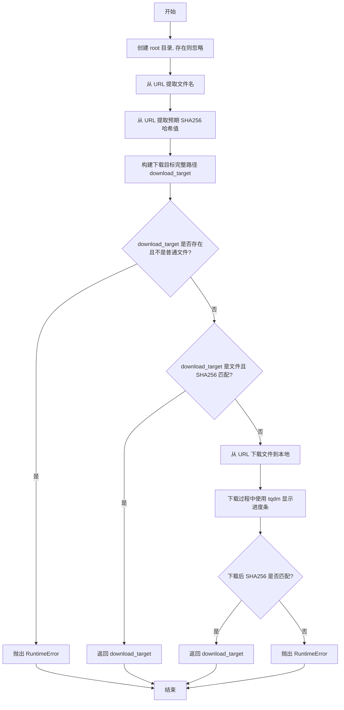
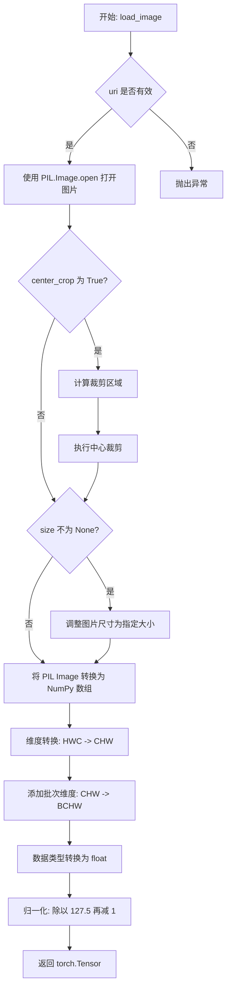
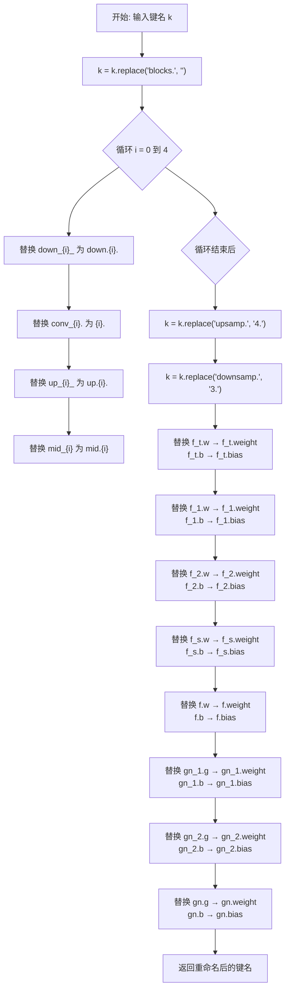
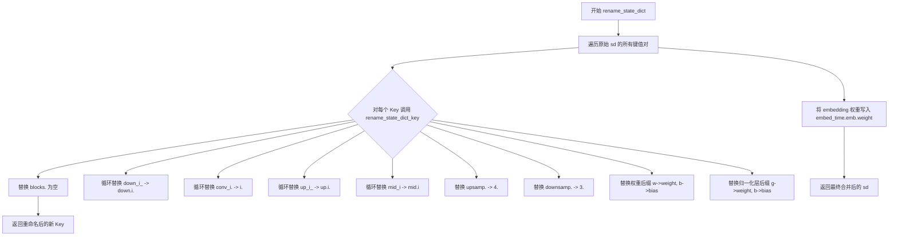
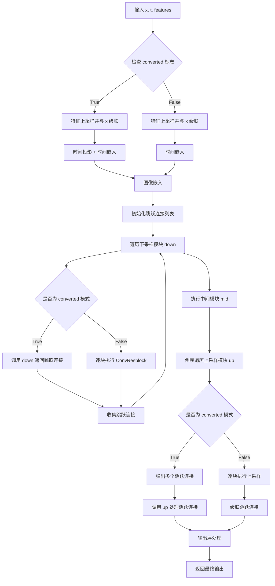

```mermaid
flowchart TD
    A[输入 x, t] --> B[保存 x 作为残差 x_skip]
    B --> C[时间嵌入处理: f_t silu&#40;t&#41;]
    C --> D[分割为 t_1, t_2]
    D --> E[调整 t_1, t_2 维度]
    
    F[输入 x] --> G[分组归一化 gn_1]
    G --> H[激活函数 silu]
    
    I{Downsample?} --> |Yes| J[平均池化 F.avg_pool2d]
    I --> |No| K[最近邻上采样 F.upsample_nearest scale_factor=2]
    
    H --> J
    H --> K
    
    J --> L[卷积 f_1]
    K --> L
    
    L --> M[分组归一化 gn_2]
    M --> N[时间条件融合: silu&#40;t_2 + t_1 * gn_2&#41;]
    
    N --> O[卷积 f_2]
    O --> P[残差连接]
    
    Q{Downsample?} --> |Yes| R[平均池化 x_skip]
    Q --> |No| S[最近邻上采样 x_skip scale_factor=2]
    
    P --> R
    P --> S
    R --> T[输出]
    S --> T
```

# `diffusers\scripts\convert_consistency_decoder.py` 详细设计文档

该代码实现了一个 Consistency Decoder (一致性解码器) 的演示流程，主要用于图像生成。它首先加载 Stable Diffusion 的 VAE，提取潜在向量，然后使用自定义的 UNet 架构 (ConvUNetVAE) 作为解码器进行图像重建。核心亮点在于代码后期将自定义的权重手动映射并迁移到了 Hugging Face Diffusers 库的标准 UNet2DModel 架构上，展示了从自定义实现到标准库的转换过程，并最终整合进 Diffusers Pipeline 进行推理。

## 整体流程

```mermaid
graph TD
    A[Start: 解析参数] --> B[下载 Consistency Decoder 权重]
    B --> C[加载 StableDiffusionPipeline]
    C --> D[初始化自定义 ConvUNetVAE 模型]
    D --> E[加载自定义权重 (rename_state_dict)]
    E --> F[执行推理 (Original): Latent -> Image]
    F --> G{转换阶段}
    G --> H[遍历自定义模型层]
    H --> I[映射权重到 Diffusers Blocks (ResNetDown/Up, Mid)]
    I --> J[构建 Diffusers UNet2DModel]
    J --> K[构建 ConsistencyDecoderVAE]
    K --> L[执行推理 (Converted): Latent -> Image]
    L --> M[整合到 DiffusionPipeline]
    M --> N[End: 推理生成图像]
```

## 类结构

```
Script (Global Scope)
├── ConsistencyDecoder (Wrapper Class)
├── ConvUNetVAE (Main Model Class)
│   ├── TimestepEmbedding_ (Time Embedding)
│   ├── ImageEmbedding (Input Conv)
│   ├── ConvResblock (Residual Block)
│   ├── Downsample (Downsampling Block)
│   ├── Upsample (Upsampling Block)
│   └── ImageUnembedding (Output Conv)
└── Utility Functions (_download, save_image, etc.)
```

## 全局变量及字段


### `args`
    
命令行参数解析器，包含保存预训练模型路径和测试图像路径

类型：`ArgumentParser`
    


### `pipe`
    
Stable Diffusion预训练管道实例，用于编码图像到潜在空间

类型：`StableDiffusionPipeline`
    


### `decoder_consistency`
    
一致性解码器实例，负责将潜在向量解码为图像

类型：`ConsistencyDecoder`
    


### `model`
    
卷积UNet VAE模型实例，初始作为解码器后被替换为diffusers版本

类型：`ConvUNetVAE`
    


### `latent`
    
图像经过VAE编码后的潜在表示张量

类型：`torch.Tensor`
    


### `block_one`
    
第一个下采样块，处理320通道特征

类型：`ResnetDownsampleBlock2D`
    


### `block_two`
    
第二个下采样块，实现320到640通道转换

类型：`ResnetDownsampleBlock2D`
    


### `block_three`
    
第三个下采样块，实现640到1024通道转换

类型：`ResnetDownsampleBlock2D`
    


### `block_four`
    
第四个下采样块，保持1024通道

类型：`ResnetDownsampleBlock2D`
    


### `mid_block_one`
    
UNet中间块，处理最深层特征

类型：`UNetMidBlock2D`
    


### `up_block_one`
    
第一个上采样块，输出1024通道

类型：`ResnetUpsampleBlock2D`
    


### `up_block_two`
    
第二个上采样块，实现1024到640通道转换

类型：`ResnetUpsampleBlock2D`
    


### `up_block_three`
    
第三个上采样块，实现640到320通道转换

类型：`ResnetUpsampleBlock2D`
    


### `up_block_four`
    
第四个上采样块，输出320通道

类型：`ResnetUpsampleBlock2D`
    


### `unet`
    
转换后的diffusers UNet2D模型实例

类型：`UNet2DModel`
    


### `consistency_vae`
    
封装了UNet的自定义VAE，用于diffusers pipeline

类型：`ConsistencyDecoderVAE`
    


### `ConsistencyDecoder.n_distilled_steps`
    
蒸馏步数，决定离散时间步的数量

类型：`int`
    


### `ConsistencyDecoder.ckpt`
    
核心解码器模型，可能是JIT模型或ConvUNetVAE

类型：`torch.nn.Module`
    


### `ConsistencyDecoder.device`
    
计算设备标识符，如cuda:0

类型：`str`
    


### `ConsistencyDecoder.sqrt_alphas_cumprod`
    
扩散过程中累积alpha值的平方根

类型：`torch.Tensor`
    


### `ConsistencyDecoder.sqrt_one_minus_alphas_cumprod`
    
扩散过程中(1-累积alpha)值的平方根

类型：`torch.Tensor`
    


### `ConsistencyDecoder.c_skip`
    
一致性模型的skip系数

类型：`torch.Tensor`
    


### `ConsistencyDecoder.c_out`
    
一致性模型的输出系数

类型：`torch.Tensor`
    


### `ConsistencyDecoder.c_in`
    
一致性模型的输入系数

类型：`torch.Tensor`
    


### `ConvUNetVAE.embed_image`
    
输入图像的嵌入卷积层

类型：`ImageEmbedding`
    


### `ConvUNetVAE.embed_time`
    
时间步的嵌入层

类型：`TimestepEmbedding_`
    


### `ConvUNetVAE.down`
    
下采样模块列表，包含多个分辨率的下采样块

类型：`nn.ModuleList`
    


### `ConvUNetVAE.mid`
    
UNet中间层模块列表

类型：`nn.ModuleList`
    


### `ConvUNetVAE.up`
    
上采样模块列表，包含多个分辨率的上采样块

类型：`nn.ModuleList`
    


### `ConvUNetVAE.output`
    
输出图像的解嵌卷积层

类型：`ImageUnembedding`
    


### `ConvResblock.f_t`
    
时间步的线性变换层

类型：`nn.Linear`
    


### `ConvResblock.gn_1`
    
第一组归一化层

类型：`nn.GroupNorm`
    


### `ConvResblock.gn_2`
    
第二组归一化层

类型：`nn.GroupNorm`
    


### `ConvResblock.f_1`
    
第一卷积层

类型：`nn.Conv2d`
    


### `ConvResblock.f_2`
    
第二卷积层

类型：`nn.Conv2d`
    


### `ConvResblock.f_s`
    
跳跃连接的卷积层或恒等映射

类型：`nn.Conv2d或nn.Identity`
    


### `Downsample/Upsample.f_t`
    
时间步的线性变换

类型：`nn.Linear`
    


### `Downsample/Upsample.gn_1`
    
第一归一化层

类型：`nn.GroupNorm`
    


### `Downsample/Upsample.gn_2`
    
第二归一化层

类型：`nn.GroupNorm`
    


### `Downsample/Upsample.f_1`
    
第一卷积层

类型：`nn.Conv2d`
    


### `Downsample/Upsample.f_2`
    
第二卷积层

类型：`nn.Conv2d`
    


### `TimestepEmbedding_.emb`
    
时间步的基础嵌入层

类型：`nn.Embedding`
    


### `TimestepEmbedding_.f_1`
    
第一线性变换层

类型：`nn.Linear`
    


### `TimestepEmbedding_.f_2`
    
第二线性变换层

类型：`nn.Linear`
    
    

## 全局函数及方法


### `_extract_into_tensor`

该函数用于从数组中根据时间步索引提取相应的数值，并将其扩展至与目标广播形状兼容的维度，常用于扩散模型中根据时间步获取噪声调度参数（如sqrt_alphas_cumprod等）并进行维度扩展以支持批量计算。

参数：

- `arr`：`torch.Tensor`，输入的数组或张量，包含可供时间步索引的数值，如扩散过程的调度参数
- `timesteps`：`torch.Tensor`，时间步张量，包含需要索引的时间步索引值
- `broadcast_shape`：`tuple` 或 `list`，目标广播形状，用于确定需要扩展的维度数量

返回值：`torch.Tensor`，从数组中提取并经过维度扩展后的张量，其形状将匹配广播运算的要求

#### 流程图

```mermaid
flowchart TD
    A[开始] --> B[根据timesteps索引arr获取子张量]
    B --> C[将结果转换为float类型]
    C --> D[计算需要扩展的维度数量: dims_to_append = lenbroadcast_shape - lenres.shape]
    D --> E[构建索引元组: res[..., None, None, ...]]
    E --> F[使用扩展索引返回结果]
    F --> G[结束]
```

#### 带注释源码

```python
def _extract_into_tensor(arr, timesteps, broadcast_shape):
    """
    从数组中根据时间步提取张量并扩展维度
    
    参数:
        arr: 输入数组，包含扩散调度参数
        timesteps: 时间步索引
        broadcast_shape: 目标广播形状
    
    返回:
        扩展维度后的张量
    """
    # 步骤1: 使用timesteps作为索引从arr中提取对应位置的数值
    # 例如: arr = [0.1, 0.2, 0.3, ...], timesteps = [0, 2] => res = [0.1, 0.3]
    res = arr[timesteps].float()
    
    # 步骤2: 计算需要扩展的维度数量
    # broadcast_shape定义了输出应有的维度数，res.shape是当前张量维度
    # 如果broadcast_shape有4维，res只有2维，则需要扩展2维
    dims_to_append = len(broadcast_shape) - len(res.shape)
    
    # 步骤3: 构建扩展索引
    # (...,) 表示保留所有现有维度
    # (None,) * dims_to_append 表示在末尾添加dims_to_append个大小为1的维度
    # 这样可以实现广播兼容: 例如从[batch_size]扩展为[batch_size, 1, 1, 1]
    return res[(...,) + (None,) * dims_to_append]
```


### `betas_for_alpha_bar`

根据 alpha_bar 函数生成 beta 序列。该函数是扩散模型中的调度器实现，通过累积 alpha 值计算每个时间步的 beta 值，用于控制噪声的添加程度。

参数：

- `num_diffusion_timesteps`：`int`，扩散过程的总时间步数
- `alpha_bar`：`Callable[[float], float]`，一个接收时间步 t（0-1 之间）并返回累积 alpha 值的函数（如 lambda t: math.cos((t + 0.008) / 1.008 * math.pi / 2) ** 2）
- `max_beta`：`float`，beta 值的最大上限，默认为 0.999，用于防止数值不稳定

返回值：`torch.Tensor`，包含 num_diffusion_timesteps 个 beta 值的张量

#### 流程图

```mermaid
flowchart TD
    A[开始] --> B[初始化空列表 betas]
    B --> C[遍历 i 从 0 到 num_diffusion_timesteps-1]
    C --> D[计算 t1 = i / num_diffusion_timesteps]
    D --> E[计算 t2 = (i + 1) / num_diffusion_timesteps]
    E --> F[计算 beta_i = 1 - alpha_bar(t2) / alpha_bar(t1)]
    F --> G[取 min(beta_i, max_beta)]
    G --> H[将结果追加到 betas 列表]
    H --> I{是否还有下一个时间步?}
    I -->|是| C
    I -->|否| J[将列表转换为 torch.Tensor]
    J --> K[返回 beta 张量]
```

#### 带注释源码

```python
def betas_for_alpha_bar(num_diffusion_timesteps, alpha_bar, max_beta=0.999):
    """
    根据 alpha_bar 函数生成 beta 序列
    
    参数:
        num_diffusion_timesteps: 扩散过程的总时间步数
        alpha_bar: 累积 alpha 函数，接受归一化时间步 t (0-1) 返回对应的 alpha_bar 值
        max_beta: beta 值的最大上限，防止数值不稳定
    
    返回:
        包含 beta 值的 torch.Tensor
    """
    # 存储每个时间步的 beta 值
    betas = []
    
    # 遍历每个扩散时间步
    for i in range(num_diffusion_timesteps):
        # 计算当前时间步的归一化时间 t1
        t1 = i / num_diffusion_timesteps
        # 计算下一个时间步的归一化时间 t2
        t2 = (i + 1) / num_diffusion_timesteps
        
        # 计算 beta 值: 基于 alpha_bar 的变化率
        # beta = 1 - alpha_bar(t2) / alpha_bar(t1)
        # 这表示从 t1 到 t2 的 alpha 衰减程度
        beta_value = 1 - alpha_bar(t2) / alpha_bar(t1)
        
        # 确保 beta 不超过最大限制，防止数值不稳定
        betas.append(min(beta_value, max_beta))
    
    # 转换为 PyTorch 张量返回
    return torch.tensor(betas)
```


### `_download`

该函数为全局函数，主要功能是从指定的 URL 下载文件到本地目录，并校验文件的 SHA256 哈希值以确保文件完整性。如果文件已存在且哈希值匹配，则直接返回本地路径，避免重复下载。

参数：

- `url`：`str`，要下载的文件 URL，函数从中提取文件名和预期的 SHA256 哈希值（URL 倒数第二个路径片段）
- `root`：`str`，文件下载保存的根目录路径

返回值：`str`，下载后的文件完整路径

#### 流程图



#### 带注释源码

```python
def _download(url: str, root: str):
    """
    从 URL 下载文件并校验 SHA256 哈希值
    
    参数:
        url: 文件的 URL，URL 倒数第二个路径片段作为预期 SHA256
        root: 下载保存的根目录
    
    返回:
        下载后的文件完整路径
    """
    # 确保目录存在，exist_ok=True 避免已存在时报错
    os.makedirs(root, exist_ok=True)
    
    # 从 URL 提取文件名（URL 最后一个路径段）
    filename = os.path.basename(url)
    
    # 从 URL 倒数第二个路径段提取预期 SHA256 哈希值
    expected_sha256 = url.split("/")[-2]
    
    # 拼接完整下载路径
    download_target = os.path.join(root, filename)
    
    # 检查路径是否存在且不是普通文件（如目录符号链接等异常情况）
    if os.path.exists(download_target) and not os.path.isfile(download_target):
        raise RuntimeError(f"{download_target} exists and is not a regular file")
    
    # 如果文件已存在，检查 SHA256 是否匹配
    if os.path.isfile(download_target):
        # 计算本地文件的 SHA256 哈希值并转为十六进制字符串
        if insecure_hashlib.sha256(open(download_target, "rb").read()).hexdigest() == expected_sha256:
            # 哈希匹配，直接返回本地路径，避免重复下载
            return download_target
        else:
            # 哈希不匹配，警告用户并重新下载
            warnings.warn(f"{download_target} exists, but the SHA256 checksum does not match; re-downloading the file")
    
    # 打开远程 URL 和本地文件进行流式下载
    with urllib.request.urlopen(url) as source, open(download_target, "wb") as output:
        # 使用 tqdm 显示下载进度，Content-Length 提供文件总大小
        with tqdm(
            total=int(source.info().get("Content-Length")),
            ncols=80,
            unit="iB",
            unit_scale=True,
            unit_divisor=1024,
        ) as loop:
            # 分块读取并写入，每块 8KB
            while True:
                buffer = source.read(8192)
                if not buffer:
                    break
                
                output.write(buffer)
                # 更新进度条
                loop.update(len(buffer))
    
    # 下载完成后再次校验 SHA256，确保下载过程完整未损坏
    if insecure_hashlib.sha256(open(download_target, "rb").read()).hexdigest() != expected_sha256:
        raise RuntimeError("Model has been downloaded but the SHA256 checksum does not match")
    
    return download_target
```


### `save_image`

将 PyTorch 张量转换为 PIL Image 并保存到指定路径。

参数：

- `image`：`torch.Tensor`，输入的图像张量，通常为 4 维张量（batch, channels, height, width），通道顺序为 CHW
- `name`：`str`，要保存的图像文件路径

返回值：`None`，该函数无返回值，直接将图像保存到指定路径

#### 流程图

```mermaid
flowchart TD
    A[输入: image tensor] --> B[取第一张图像: image[0]]
    B --> C[转移到CPU并转为numpy: .cpu().numpy()]
    C --> D[缩放: (image + 1.0) * 127.5]
    D --> E[裁剪并转换类型: .clip(0, 255).astypeuint8]
    E --> F[维度转换: transpose1, 2, 0]
    F --> G[创建PIL图像: Image.fromarray]
    G --> H[保存图像: image.save]
```

#### 带注释源码

```
def save_image(image, name):
    """
    将PyTorch张量转换为PIL Image并保存到文件
    
    参数:
        image: torch.Tensor, 图像张量，形状为 [B, C, H, W]，值域为 [-1, 1]
        name: str, 保存路径
    """
    import numpy as np
    from PIL import Image

    # 1. 取batch中的第一张图像，形状变为 [C, H, W]
    image = image[0].cpu().numpy()
    
    # 2. 将数值范围从 [-1, 1] 映射到 [0, 255]
    # 加1.0将范围从 [-1,1] 变为 [0,2]，乘以127.5得到 [0, 255]
    image = (image + 1.0) * 127.5
    
    # 3. 裁剪到有效范围并转换为无符号整型
    image = image.clip(0, 255).astype(np.uint8)
    
    # 4. 转换维度顺序从 [C, H, W] 到 [H, W, C] 以适配PIL
    image = Image.fromarray(image.transpose(1, 2, 0))
    
    # 5. 保存到指定路径
    image.save(name)
```


### `load_image`

该函数负责从给定 URI 加载图片，并根据参数进行可选的中心裁剪和尺寸调整，最后将图片转换为归一化的 PyTorch 张量（范围 [-1, 1]），以便于后续的扩散模型处理。

参数：

- `uri`：`str`，图片的资源标识符，可以是本地文件路径或 URL
- `size`：`tuple[int, int] | None`，目标尺寸，格式为 (width, height)，默认为 None 表示不进行缩放
- `center_crop`：`bool`，是否进行中心裁剪以得到正方形图片，默认为 False

返回值：`torch.Tensor`，形状为 (1, C, H, W) 的归一化图像张量，像素值范围在 [-1, 1]

#### 流程图



#### 带注释源码

```python
def load_image(uri, size=None, center_crop=False):
    """
    加载图片并预处理为归一化张量
    
    参数:
        uri: str, 图片路径或URL
        size: tuple[int, int] | None, 目标尺寸 (width, height)
        center_crop: bool, 是否进行中心裁剪
    
    返回:
        torch.Tensor: 形状为 (1, C, H, W) 的归一化张量，值域 [-1, 1]
    """
    # 导入图像处理库
    import numpy as np
    from PIL import Image

    # Step 1: 使用 PIL 打开图片
    image = Image.open(uri)
    
    # Step 2: 可选的中心裁剪
    if center_crop:
        # 计算最小边长
        min_dim = min(image.width, image.height)
        # 计算裁剪区域 (left, top, right, bottom)
        # 使裁剪后的区域居中
        left = (image.width - min_dim) // 2
        top = (image.height - min_dim) // 2
        right = (image.width + min_dim) // 2
        bottom = (image.height + min_dim) // 2
        image = image.crop((left, top, right, bottom))
    
    # Step 3: 可选的尺寸调整
    if size is not None:
        # 调整图片大小 (width, height)
        image = image.resize(size)
    
    # Step 4: 转换为 PyTorch 张量
    # 4.1: PIL Image -> NumPy 数组 (H, W, C)
    np_array = np.array(image)
    # 4.2: 维度重排 (H, W, C) -> (C, H, W)
    np_array = np_array.transpose(2, 0, 1)
    # 4.3: 添加批次维度 (C, H, W) -> (1, C, H, W)
    tensor = torch.tensor(np_array).unsqueeze(0)
    # 4.4: 转换为 float 类型
    tensor = tensor.float()
    
    # Step 5: 归一化处理
    # 将 [0, 255] 范围映射到 [-1, 1] 范围
    # image = image / 127.5 - 1.0
    tensor = tensor / 127.5 - 1.0
    
    return tensor
```


### `rename_state_dict_key`

该函数用于替换权重键名中的旧命名（如 `blocks.`, `f_t.w` 等），将其转换为匹配自定义模型结构的新命名格式（例如将 `f_t.w` 转换为 `f_t.weight`），以确保从预训练检查点加载权重时键名能够正确对应。

参数：

-  `k`：`str`，需要重命名的原始状态字典键名

返回值：`str`，重命名后的新状态字典键名

#### 流程图



#### 带注释源码

```
def rename_state_dict_key(k):
    # 移除顶层 "blocks." 前缀
    k = k.replace("blocks.", "")
    
    # 遍历 0-4，对各层级索引进行重命名映射
    # 例如: down_0_ -> down.0., up_2_ -> up.2., mid_1 -> mid.1 等
    for i in range(5):
        k = k.replace(f"down_{i}_", f"down.{i}.")
        k = k.replace(f"conv_{i}.", f"{i}.")
        k = k.replace(f"up_{i}_", f"up.{i}.")
        k = k.replace(f"mid_{i}", f"mid.{i}")
    
    # 处理采样层命名: upsamp -> 4 (上采样层索引), downsamp -> 3 (下采样层索引)
    k = k.replace("upsamp.", "4.")
    k = k.replace("downsamp.", "3.")
    
    # 将缩写形式替换为完整参数名
    # 时间嵌入层 (time embedding) 的权重和偏置
    k = k.replace("f_t.w", "f_t.weight").replace("f_t.b", "f_t.bias")
    
    # 第一个卷积层的权重和偏置
    k = k.replace("f_1.w", "f_1.weight").replace("f_1.b", "f_1.bias")
    
    # 第二个卷积层的权重和偏置
    k = k.replace("f_2.w", "f_2.weight").replace("f_2.b", "f_2.bias")
    
    # 跳跃连接卷积层的权重和偏置 (shortcut)
    k = k.replace("f_s.w", "f_s.weight").replace("f_s.b", "f_s.bias")
    
    # 主卷积层/嵌入层的权重和偏置
    k = k.replace("f.w", "f.weight").replace("f.b", "f.bias")
    
    # 第一个组归一化 (GroupNorm) 的权重和偏置
    k = k.replace("gn_1.g", "gn_1.weight").replace("gn_1.b", "gn_1.bias")
    
    # 第二个组归一化的权重和偏置
    k = k.replace("gn_2.g", "gn_2.weight").replace("gn_2.b", "gn_2.bias")
    
    # 输出层组归一化的权重和偏置
    k = k.replace("gn.g", "gn.weight").replace("gn.b", "gn.bias")
    
    return k
```


### `rename_state_dict`

该函数是 Consistency Decoder 模型权重转换的核心函数，负责将原始检查点中的状态字典键名（Key）按照特定规则进行重命名，以适配 `ConvUNetVAE` 模型的内部结构，并将 embedding 权重正确地注入到目标状态字典中。

参数：

- `sd`：`Dict[str, torch.Tensor]`，原始模型检查点的状态字典（state_dict），键名为原始格式，值为对应的权重张量
- `embedding`：`Dict[str, torch.Tensor]`，包含 embedding 权重的字典，通常来自单独的 embedding 文件（如 `embedding.safetensors`）

返回值：`Dict[str, torch.Tensor]`，重命名并合并 embedding 后的新状态字典

#### 流程图



#### 带注释源码

```python
def rename_state_dict_key(k):
    """
    将原始检查点的键名转换为 ConvUNetVAE 模型期望的键名格式。
    主要处理模块索引位置和权重/偏置后缀的规范化。
    """
    k = k.replace("blocks.", "")  # 移除顶层 blocks. 前缀
    for i in range(5):  # 遍历处理数字索引 0-4
        k = k.replace(f"down_{i}_", f"down.{i}.")   # down_0_ -> down.0.
        k = k.replace(f"conv_{i}.", f"{i}.")         # conv_0. -> 0.
        k = k.replace(f"up_{i}_", f"up.{i}.")         # up_0_ -> up.0.
        k = k.replace(f"mid_{i}", f"mid.{i}")         # mid_0 -> mid.0
    k = k.replace("upsamp.", "4.")   # 上采样层索引映射到 4
    k = k.replace("downsamp.", "3.") # 下采样层索引映射到 3
    
    # 统一权重参数后缀：w -> weight, b -> bias
    k = k.replace("f_t.w", "f_t.weight").replace("f_t.b", "f_t.bias")
    k = k.replace("f_1.w", "f_1.weight").replace("f_1.b", "f_1.bias")
    k = k.replace("f_2.w", "f_2.weight").replace("f_2.b", "f_2.bias")
    k = k.replace("f_s.w", "f_s.weight").replace("f_s.b", "f_s.bias")
    k = k.replace("f.w", "f.weight").replace("f.b", "f.bias")
    
    # 统一归一化层后缀：g -> weight (gamma), b -> bias
    k = k.replace("gn_1.g", "gn_1.weight").replace("gn_1.b", "gn_1.bias")
    k = k.replace("gn_2.g", "gn_2.weight").replace("gn_2.b", "gn_2.bias")
    k = k.replace("gn.g", "gn.weight").replace("gn.b", "gn.bias")
    return k


def rename_state_dict(sd, embedding):
    """
    对原始状态字典进行键名重写，并合并 embedding 权重。
    
    Args:
        sd: 原始模型检查点的状态字典
        embedding: 包含 embedding 权重的字典
        
    Returns:
        重命名并合并后的状态字典
    """
    # 使用字典推导式遍历并重命名所有键
    sd = {rename_state_dict_key(k): v for k, v in sd.items()}
    # 将 embedding 权重写入特定的键位置
    sd["embed_time.emb.weight"] = embedding["weight"]
    return sd
```


### `ConsistencyDecoder.round_timesteps`

该方法是一个静态方法，核心功能是将连续的时间步长映射到离散的蒸馏步长，通过计算时间步的间隔空间并对时间步进行四舍五入，实现将原始的细粒度时间步长映射到较粗的蒸馏模型时间步长，支持截断起始点或结束点的选项。

参数：

- `timesteps`：`torch.Tensor`，输入的原始时间步长张量
- `total_timesteps`：`int`，总时间步数（例如1024）
- `n_distilled_steps`：`int`，蒸馏后的步数（例如64）
- `truncate_start`：`bool`，是否截断起始点，默认为True；当为True时，将最大时间步total_timesteps映射到次大值；当为False时，会同时处理0和total_timesteps边界情况

返回值：`torch.Tensor`，四舍五入后的离散时间步长张量

#### 流程图

```mermaid
flowchart TD
    A[开始 round_timesteps] --> B[计算 space = total_timesteps // n_distilled_steps]
    B --> C[计算 rounded_timesteps = (timesteps // space + 1) * space]
    D{判断 truncate_start}
    D -->|True| E[将等于 total_timesteps 的值减去 space]
    D -->|False| F[将等于 total_timesteps 的值减去 space]
    F --> G[将等于 0 的值加上 space]
    E --> H[返回 rounded_timesteps]
    G --> H
```

#### 带注释源码

```python
@staticmethod
def round_timesteps(timesteps, total_timesteps, n_distilled_steps, truncate_start=True):
    """
    将时间步长映射到离散步骤
    
    参数:
        timesteps: 输入的原始时间步长张量
        total_timesteps: 总时间步数（如1024）
        n_distilled_steps: 蒸馏后的步数（如64）
        truncate_start: 是否截断起始点
    
    返回:
        四舍五入后的离散时间步长张量
    """
    with torch.no_grad():
        # 计算每个离散步骤对应的空间间隔
        # 例如: 1024 // 64 = 16
        space = torch.div(total_timesteps, n_distilled_steps, rounding_mode="floor")
        
        # 对每个时间步进行离散化映射
        # 公式: (t // space + 1) * space 向上取整到最近的space倍数
        # 例如: timesteps=5, space=16 时，结果为16
        # timesteps=17, space=16 时，结果为32
        rounded_timesteps = (torch.div(timesteps, space, rounding_mode="floor") + 1) * space
        
        # 处理边界情况
        if truncate_start:
            # 如果截断起始点，将最大时间步（total_timesteps）映射到次大值
            # 避免在边界处出现重复的步长
            rounded_timesteps[rounded_timesteps == total_timesteps] -= space
        else:
            # 如果不截断起始点，同时处理起始和结束边界
            # 将total_timesteps映射到较小值，将0映射到较大值
            rounded_timesteps[rounded_timesteps == total_timesteps] -= space
            rounded_timesteps[rounded_timesteps == 0] += space
        
        return rounded_timesteps
```


### `ConsistencyDecoder.ldm_transform_latent`

该方法是一个静态方法，用于对潜在向量（latent）进行标准化和缩放处理。它使用预定义的通道均值和标准差对输入潜在向量进行归一化，并应用固定的缩放因子（0.18215）以及额外的可缩放因子，将潜在向量转换为适合解码器处理的格式。

参数：

- `z`：`torch.Tensor`，输入的潜在向量张量，要求为4维张量（Batch, Channel, Height, Width）
- `extra_scale_factor`：`float`，额外的缩放因子，默认为1.0，用于对归一化后的通道进行额外缩放

返回值：`torch.Tensor`，返回经过标准化和缩放处理后的潜在向量张量，维度与输入相同

#### 流程图

```mermaid
flowchart TD
    A[开始: 输入潜在向量 z] --> B{检查z是否为4维张量}
    B -->|否| C[抛出ValueError异常]
    B -->|是| D[将z乘以缩放因子0.18215]
    D --> E[按通道维度分割z为多个单通道张量]
    E --> F[遍历每个通道]
    F --> G[计算: extra_scale_factor × (c - channel_means[i]) / channel_stds[i]]
    G --> H{还有更多通道未处理?}
    H -->|是| F
    H -->|否| I[沿通道维度重新堆叠所有处理后的通道]
    I --> J[返回处理后的潜在向量]
```

#### 带注释源码

```python
@staticmethod
def ldm_transform_latent(z, extra_scale_factor=1):
    """
    对潜在向量进行标准化和缩放
    
    参数:
        z: 输入的潜在向量张量，要求为4维张量 (B, C, H, W)
        extra_scale_factor: 额外的缩放因子，默认为1.0
    
    返回:
        处理后的潜在向量张量
    """
    # 预定义的通道均值（来自模型训练数据统计）
    channel_means = [0.38862467, 0.02253063, 0.07381133, -0.0171294]
    # 预定义的通道标准差（来自模型训练数据统计）
    channel_stds = [0.9654121, 1.0440036, 0.76147926, 0.77022034]

    # 输入维度检查：确保输入是4维张量
    if len(z.shape) != 4:
        raise ValueError()

    # 第一步缩放：将潜在向量乘以固定的缩放因子0.18215
    # 这个因子是LDM（Latent Diffusion Models）论文中推荐的缩放值
    z = z * 0.18215
    
    # 将4D张量按通道维度分割成多个3D张量列表
    # 例如: (B, 4, H, W) -> [(B, H, W), (B, H, W), (B, H, W), (B, H, W)]
    channels = [z[:, i] for i in range(z.shape[1])]

    # 对每个通道进行标准化处理：
    # 1. 减去对应通道的均值 (中心化)
    # 2. 除以对应通道的标准差 (归一化)
    # 3. 乘以额外的缩放因子
    channels = [
        extra_scale_factor * (c - channel_means[i]) / channel_stds[i] 
        for i, c in enumerate(channels)
    ]
    
    # 将处理后的单通道张量沿通道维度重新堆叠成4D张量
    return torch.stack(channels, dim=1)
```


### `ConsistencyDecoder.__call__`

执行去噪推理主循环，接收 VAE 编码后的潜在特征，通过 DDPM 采样调度（默认两步：1.0 和 0.5）逐步去噪，最终输出重构的图像张量（x_start）。

参数：

- `features`：`torch.Tensor`，来自 Stable Diffusion VAE 编码器的潜在特征，形状为 (B, 4, H, W)
- `schedule`：`list`，采样调度列表，默认为 [1.0, 0.5]，表示在 1024 个扩散步中选取对应位置进行去噪
- `generator`：`torch.Generator`，可选的随机数生成器，用于控制噪声采样的一致性

返回值：`torch.Tensor`，重构后的图像张量，形状为 (B, 3, 8\*H, 8\*W)，值域为 [-1, 1]

#### 流程图

```mermaid
flowchart TD
    A[输入 features] --> B[ldm_transform_latent 变换特征]
    B --> C[round_timesteps 生成离散时间步]
    C --> D[初始化 x_start 全零张量]
    D --> E[计算调度时间步 schedule_timesteps]
    E --> F{遍历每个调度步 i}
    F -->|当前步| G[获取时间步 t 和 t_]
    G --> H[采样噪声 noise]
    H --> I[DDPM 一步去噪: x_t = sqrt_alphas_cumprod * x_0 + sqrt_one_minus_alphas_cumprod * noise]
    I --> J[计算 c_in 系数]
    J --> K{检查 ckpt 是否为 UNet2DModel?}
    K -->|是| L[拼接 c_in * x_start 和上采样后的 features]
    K -->|否| M[直接调用 ckpt: c_in * x_start, t_, features]
    L --> N[UNet2DModel 前向推理]
    M --> O[JIT 模型前向推理]
    N --> P[提取模型输出的前半部分]
    O --> P
    P --> Q[计算 c_out 和 c_skip 系数]
    Q --> R[预测 x_start: pred_xstart = c_out * model_output + c_skip * x_start]
    R --> S[clamp 到 [-1, 1] 范围]
    S --> T[更新 x_start = pred_xstart]
    T --> F
    F -->|遍历完成| U[返回最终 x_start]
```

#### 带注释源码

```python
@torch.no_grad()  # 禁用梯度计算以节省显存
def __call__(
    self,
    features: torch.Tensor,  # VAE 编码后的潜在特征 (B, 4, H, W)
    schedule=[1.0, 0.5],      # 调度列表，指定在总步数(1024)中的相对位置
    generator=None,           # 可选的随机生成器，确保可复现性
):
    # 1. 对潜在特征进行 LDM (Latent Diffusion Models) 变换
    #    包括缩放、通道均值/标准差归一化
    features = self.ldm_transform_latent(features)
    
    # 2. 生成离散化的时间步序列
    #    将 0-1023 的连续时间步映射到 n_distilled_steps=64 个离散步
    ts = self.round_timesteps(
        torch.arange(0, 1024),  # 总扩散步数
        1024,
        self.n_distilled_steps,  # 蒸馏后的步数
        truncate_start=False,
    )
    
    # 3. 计算输出图像的形状
    #    潜在空间到像素空间的 8x 上采样
    shape = (
        features.size(0),      # batch size
        3,                     # RGB 通道
        8 * features.size(2),  # 高 * 8
        8 * features.size(3),  # 宽 * 8
    )
    
    # 4. 初始化起点 x_0 为全零（从纯噪声开始）
    x_start = torch.zeros(shape, device=features.device, dtype=features.dtype)
    
    # 5. 将调度比例转换为具体的时间步索引
    #    例如 schedule=[1.0, 0.5] -> [1023, 511]
    schedule_timesteps = [int((1024 - 1) * s) for s in schedule]
    
    # 6. 主去噪循环：遍历调度中的每个时间步
    for i in schedule_timesteps:
        # 获取当前离散时间步的实际值
        t = ts[i].item()
        
        # 构造批次形式的时间步张量
        t_ = torch.tensor([t] * features.shape[0]).to(self.device)
        
        # 采样高斯噪声（可复现）
        noise = torch.randn(
            x_start.shape, 
            dtype=x_start.dtype, 
            generator=generator
        ).to(device=x_start.device)
        
        # 7. DDPM 单步去噪公式：x_t = sqrt_alphas_cumprod * x_0 + sqrt_one_minus_alphas_cumprod * noise
        x_start = (
            _extract_into_tensor(self.sqrt_alphas_cumprod, t_, x_start.shape) * x_start
            + _extract_into_tensor(self.sqrt_one_minus_alphas_cumprod, t_, x_start.shape) * noise
        )
        
        # 8. 计算输入系数 c_in（用于缩放模型输入）
        c_in = _extract_into_tensor(self.c_in, t_, x_start.shape)

        # 9. 根据 checkpoint 类型选择不同的推理路径
        import torch.nn.functional as F
        from diffusers import UNet2DModel

        if isinstance(self.ckpt, UNet2DModel):
            # Diffusers 版本的 UNet：需要将 features 上采样并拼接为额外通道
            input = torch.concat(
                [c_in * x_start, F.upsample_nearest(features, scale_factor=8)], 
                dim=1
            )
            model_output = self.ckpt(input, t_).sample
        else:
            # 原始 JIT 编译的模型：features 作为单独参数传入
            model_output = self.ckpt(c_in * x_start, t_, features=features)

        # 10. 分割模型输出，取前半部分作为预测的 x_0
        B, C = x_start.shape[:2]
        model_output, _ = torch.split(model_output, C, dim=1)
        
        # 11. 计算预测 x_0 的系数
        #     公式：x_0_pred = c_out * model_output + c_skip * x_t
        pred_xstart = (
            _extract_into_tensor(self.c_out, t_, x_start.shape) * model_output
            + _extract_into_tensor(self.c_skip, t_, x_start.shape) * x_start
        ).clamp(-1, 1)  # 限制到合法像素范围
        
        # 12. 更新 x_start 用于下一步去噪
        x_start = pred_xstart
    
    # 13. 返回最终去噪结果
    return x_start
```


### `ConvUNetVAE.forward`

该方法实现了 UNet VAE 的前向传播过程，包含输入图像与特征的通道级联、时间嵌入、下采样编码路径、特征融合、跳跃连接收集、上采样解码路径，最终输出重构的图像。

参数：

- `x`：`torch.Tensor`，输入的图像张量，通常为潜在空间表示
- `t`：`torch.Tensor`，时间步嵌入，用于条件化扩散过程的时间信息
- `features`：`torch.Tensor`，来自编码器的特征图，用于在下采样阶段与输入进行通道级联，实现特征融合

返回值：`torch.Tensor`，解码后的图像张量，经过上采样和输出层处理后的最终预测结果

#### 流程图



#### 带注释源码

```python
def forward(self, x, t, features) -> torch.Tensor:
    """
    UNet VAE 前向传播
    
    参数:
        x: 输入图像张量
        t: 时间步张量
        features: 编码器特征图，用于与输入级联
    """
    # 检查是否已转换为 diffusers 格式的 UNet
    converted = hasattr(self, "converted") and self.converted

    # 将上采样后的特征与输入图像在通道维度上级联
    # features 来自 VAE 编码器，scale_factor=8 表示空间尺寸放大8倍以匹配 x 的尺寸
    x = torch.cat([x, F.upsample_nearest(features, scale_factor=8)], dim=1)

    # 时间嵌入处理：根据是否转换选择不同的嵌入方式
    if converted:
        # diffusers 格式：先投影时间步，再通过时间嵌入层
        t = self.time_embedding(self.time_proj(t))
    else:
        # 原始格式：直接使用 embed_time
        t = self.embed_time(t)

    # 图像嵌入：将级联后的输入通过卷积层映射到特征空间
    x = self.embed_image(x)

    # 初始化跳跃连接列表，第一层输出作为第一个跳跃连接
    skips = [x]
    
    # 下采样编码路径：4 个下采样阶段
    for i, down in enumerate(self.down):
        if converted and i in [0, 1, 2, 3]:
            # diffusers 格式：down 模块返回输出和多个跳跃连接
            x, skips_ = down(x, t)
            for skip in skips_:
                skips.append(skip)
        else:
            # 原始格式：逐个 ResNet 块处理
            for block in down:
                x = block(x, t)
                skips.append(x)
        # 打印中间结果用于调试（生产环境应移除）
        print(x.float().abs().sum())

    # 中间模块：处理最深层级的特征
    if converted:
        x = self.mid(x, t)
    else:
        for i in range(2):
            x = self.mid[i](x, t)
    print(x.float().abs().sum())

    # 上采样解码路径：4 个上采样阶段（倒序遍历）
    for i, up in enumerate(self.up[::-1]):
        if converted and i in [0, 1, 2, 3]:
            # diffusers 格式：从跳跃连接栈中弹出多个特征
            skip_4 = skips.pop()
            skip_3 = skips.pop()
            skip_2 = skips.pop()
            skip_1 = skips.pop()
            skips_ = (skip_1, skip_2, skip_3, skip_4)
            x = up(x, skips_, t)
        else:
            # 原始格式：逐块上采样并级联跳跃连接
            for block in up:
                if isinstance(block, ConvResblock):
                    x = torch.concat([x, skips.pop()], dim=1)
                x = block(x, t)

    # 输出层：将特征映射回图像空间
    return self.output(x)
```


### `ConvResblock.forward`

标准的 Resblock 残差计算，包含时间步条件注入，实现特征图的条件变换与残差连接。

参数：

- `x`：`torch.Tensor`，输入特征图，形状为 (batch, channels, height, width)
- `t`：`torch.Tensor`，时间步嵌入向量，形状为 (batch, 1280)，通常由 TimestepEmbedding_ 生成

返回值：`torch.Tensor`，经过残差计算后的输出特征图，形状为 (batch, out_features, height, width)，其中 out_features 为输出通道数

#### 流程图

```mermaid
flowchart TD
    A[输入特征图 x<br/>形状: B×C×H×W] --> B[保存跳跃连接 x_skip = x]
    C[时间步嵌入 t<br/>形状: B×1280] --> D[f_t: Linear→SiLU]
    D --> E[chunk 2 分割为 t_1, t_2]
    E --> F[t_1: unsqueeze + 获得缩放因子<br/>形状: B×out_features×1×1]
    E --> G[t_2: unsqueeze 获得偏置<br/>形状: B×out_features×1×1]
    
    A --> H[gn_1: GroupNorm→SiLU]
    H --> I[f_1: Conv2d 3×3]
    I --> J[gn_2: GroupNorm]
    
    J --> K[条件调制: gn_2 × t_1 + t_2]
    K --> L[SiLU 激活]
    L --> M[f_2: Conv2d 3×3]
    
    B --> N{f_s: 需要通道转换?}
    N -->|是| O[f_s: Conv2d 1×1]
    N -->|否| P[nn.Identity]
    O --> Q[输出 = f_s(x_skip) + f_2(...)]
    P --> Q
    
    M --> Q
    Q --> R[返回输出特征图<br/>形状: B×out_features×H×W]
```

#### 带注释源码

```python
def forward(self, x, t):
    """
    Resblock 前向传播，包含时间步条件注入
    
    参数:
        x: 输入特征图，形状 (batch, in_channels, height, width)
        t: 时间步嵌入向量，形状 (batch, 1280)
    
    返回:
        经过条件调制和残差计算后的特征图
    """
    
    # === 第一步：保存跳跃连接（残差路径）===
    x_skip = x  # 保存原始输入用于残差连接
    
    # === 第二步：时间步嵌入处理与条件参数生成 ===
    # 将时间步嵌入投影到输出通道的 2 倍维度
    t = self.f_t(F.silu(t))  # Linear(1280, out_features*2) + SiLU
    
    # 分割为两个条件参数：缩放因子 t_1 和偏置 t_2
    t = t.chunk(2, dim=1)  # 沿通道维度分割
    t_1 = t[0].unsqueeze(dim=2).unsqueeze(dim=3) + 1  # 缩放因子，+1 实现残差缩放
    t_2 = t[1].unsqueeze(dim=2).unsqueeze(dim=3)      # 偏置项
    
    # === 第三步：第一个卷积块（主路径）===
    gn_1 = F.silu(self.gn_1(x))     # GroupNorm(32, in_features) + SiLU
    f_1 = self.f_1(gn_1)             # Conv2d(in_features→out_features, 3×3)
    
    # === 第四步：第二个卷积块与条件调制 ===
    gn_2 = self.gn_2(f_1)            # GroupNorm(32, out_features)
    
    # 条件调制：使用时间步信息调整特征图
    # 公式：output = f_2(SiLU(gn_2 * t_1 + t_2))
    modulated = F.silu(gn_2 * t_1 + t_2)
    f_2 = self.f_2(modulated)        # Conv2d(out_features→out_features, 3×3)
    
    # === 第五步：残差连接与输出 ===
    # 处理输入输出通道不一致的情况
    return self.f_s(x_skip) + f_2
    # f_s: 如果 in_features != out_features，执行 Conv2d(1×1)；
    #      否则返回原始输入（nn.Identity）
```


### `Downsample.forward` / `Upsample.forward`

执行空间下/上采样并结合时间步信息，输出经过时间条件调整的特征张量。

参数：

- `x`：`torch.Tensor`，输入特征张量，形状为 (B, C, H, W)
- `t`：`torch.Tensor`，时间步嵌入向量，形状为 (B, 1280)

返回值：`torch.Tensor`，经过空间采样和时间条件处理后的输出特征张量

#### 流程图



#### 带注释源码

```python
def forward(self, x, t) -> torch.Tensor:
    """
    执行空间下/上采样并结合时间步信息
    
    参数:
        x: 输入特征张量 (B, C, H, W)
        t: 时间步嵌入向量 (B, 1280)
    
    返回:
        经过空间采样和时间条件调整后的特征张量
    """
    # 步骤1: 保存输入作为残差连接（用于后续跳跃连接）
    x_skip = x

    # 步骤2: 处理时间步嵌入
    # 使用线性层将时间嵌入投影到 (B, in_channels * 2)
    t = self.f_t(F.silu(t))
    
    # 步骤3: 将投影后的时间嵌入分割为两部分
    # t_1 用于缩放因子, t_2 用于偏移因子
    t_1, t_2 = t.chunk(2, dim=1)
    
    # 步骤4: 调整维度以匹配特征图
    # 从 (B, C) 扩展为 (B, C, 1, 1) 并加1得到缩放因子
    t_1 = t_1.unsqueeze(2).unsqueeze(3) + 1
    t_2 = t_2.unsqueeze(2).unsqueeze(3)

    # 步骤5: 特征处理 - 第一个归一化和激活
    gn_1 = F.silu(self.gn_1(x))

    # 步骤6: 空间采样操作
    # Downsample: 使用平均池化下采样
    # Upsample: 使用最近邻插值上采样
    if isinstance(self, Downsample):
        avg_pool2d = F.avg_pool2d(gn_1, kernel_size=(2, 2), stride=None)
    else:  # Upsample
        upsample = F.upsample_nearest(gn_1, scale_factor=2)

    # 步骤7: 第一个卷积
    f_1 = self.f_1(avg_pool2d if isinstance(self, Downsample) else upsample)
    
    # 步骤8: 第二个归一化
    gn_2 = self.gn_2(f_1)

    # 步骤9: 时间条件融合
    # 使用 AdaNorm 风格的条件归一化: silu(t_2 + t_1 * gn_2)
    f_2 = self.f_2(F.silu(t_2 + (t_1 * gn_2)))

    # 步骤10: 残差连接
    # 对跳跃连接也进行相同的空间采样，然后与主分支相加
    if isinstance(self, Downsample):
        return f_2 + F.avg_pool2d(x_skip, kernel_size=(2, 2), stride=None)
    else:
        return f_2 + F.upsample_nearest(x_skip, scale_factor=2)
```


### `TimestepEmbedding_.forward`

将时间步 ID 转换为高维特征表示。该方法首先通过嵌入层将时间步 ID 映射到低维嵌入向量，然后通过两层线性变换（中间层使用 SiLU 激活函数）将其转换为更高维度的特征输出。

参数：

-  `x`：`torch.Tensor`，输入的时间步 ID 张量，通常为形状为 (batch_size,) 的整数张量，用于索引嵌入表

返回值：`torch.Tensor`，转换后的高维特征，形状为 (batch_size, n_out)，其中 n_out 默认值为 1280

#### 流程图

```mermaid
flowchart TD
    A[输入: 时间步 ID x] --> B[嵌入层: self.emb]
    B --> C[输出: 嵌入向量 shape=(batch, n_emb)]
    C --> D[线性层: self.f_1]
    D --> E[输出: shape=(batch, n_out)]
    E --> F[激活函数: F.silu]
    F --> G[线性层: self.f_2]
    G --> H[输出: 高维特征 shape=(batch, n_out)]
```

#### 带注释源码

```python
def forward(self, x) -> torch.Tensor:
    # 步骤1: 通过嵌入层将时间步 ID 转换为嵌入向量
    # 输入 x: (batch_size,) 形状的整数张量
    # 输出: (batch_size, n_emb) 形状的张量，n_emb 默认 320
    x = self.emb(x)
    
    # 步骤2: 第一层线性变换，将嵌入向量维度从 n_emb 扩展到 n_out
    # 输入: (batch_size, n_emb)
    # 输出: (batch_size, n_out)，n_out 默认 1280
    x = self.f_1(x)
    
    # 步骤3: 应用 SiLU (Swish) 激活函数，增加非线性表达能力
    x = F.silu(x)
    
    # 步骤4: 第二层线性变换，保持输出维度为 n_out
    # 输入: (batch_size, n_out)
    # 输出: (batch_size, n_out)，最终的高维时间特征
    return self.f_2(x)
```

## 关键组件


### ConsistencyDecoder

一致性解码器主类,负责将潜在特征解码为图像。该类实现了基于蒸馏扩散步骤的图像解码流程,包含时间步舍入、潜在空间转换、噪声预测和逐步去噪等核心逻辑。

### ConvUNetVAE

卷积UNet变分自编码器,作为自定义解码器实现。该类采用编码器-解码器结构,包含下采样块、上采样块和中间块,支持跳跃连接和条件时间嵌入。

### ConvResblock

卷积残差块模块,包含两个卷积层、GroupNorm归一化层和时间嵌入投影。用于UNet的编码器和解码器部分,实现残差连接和条件注入。

### Downsample

下采样模块,包含时间嵌入投影、GroupNorm和卷积操作,实现空间维度减半的特征提取。

### Upsample

上采样模块,与Downsample相对应,实现空间维度翻倍的特征重建,使用最近邻插值进行上采样。

### TimestepEmbedding_

时间步嵌入模块,将离散的时间步索引映射到高维特征空间,包含嵌入层和两个线性变换层,使用SiLU激活函数。

### ImageEmbedding

图像嵌入模块,将输入图像(包含原始图像和特征)卷积到隐藏空间,实现特征通道数的转换。

### ImageUnembedding

图像反嵌入模块,将隐藏特征解码为输出图像,包含GroupNorm和卷积层,使用SiLU激活函数。

### _extract_into_tensor

辅助函数,用于从预计算的数组中提取指定时间步的标量值,并根据广播形状进行维度扩展。

### betas_for_alpha_bar

计算beta schedule的函数,基于alpha bar函数生成扩散过程的方差调度,采用余弦调度策略。

### _download

模型下载函数,支持从URL下载文件并验证SHA256校验和,带有进度条显示下载进度。

### rename_state_dict_key

状态字典键重命名函数,将原始检查点中的键名转换为新模型架构所需的键名格式,处理不同命名约定的映射。

### ConsistencyDecoderVAE

一致性VAE解码器类(来自diffusers库),封装了编码器和解码器UNet,用于与diffusers pipeline集成。

## 问题及建议


### 已知问题

-   **硬编码的模型下载URL**：`_download`函数中直接硬编码了Azure URL，缺乏灵活性，应改为配置或参数化
-   **大量调试用的print语句**：代码中多处使用`print(x.float().abs().sum())`进行调试，应移除或使用正式日志系统
-   **重复的状态字典转换代码**：DOWN BLOCK到UP BLOCK的转换逻辑高度重复，每个块都有相似的for循环和映射规则，应该抽象为通用函数
-   **魔法数字和硬编码值**：存在大量硬编码数值如`0.18215`、`0.5`、`1024`、`channel_means`、`channel_stds`等，缺乏配置管理或常量定义
-   **使用已弃用的API**：`F.upsample_nearest`在PyTorch新版本中已弃用，应使用`F.interpolate`替代
-   **缺乏输入验证**：多处函数缺少参数验证，如`load_image`没有检查文件是否存在，`ldm_transform_latent`仅检查维度但未验证其他约束
-   **资源管理不当**：模型文件读取时未使用上下文管理器（`with`语句），如`open(download_target, "rb").read()`重复调用两次
-   **全局状态和副作用**：`ConsistencyDecoder`在`__init__`中直接下载模型并加载到设备，构造函数承担过多职责
-   **不一致的变量命名**：混合使用缩写（如`gn_1`、`f_1`）和完整命名（如`block_out_channels`），影响可读性
-   **缺少错误处理**：网络下载、文件IO、模型加载等操作缺乏适当的异常捕获和用户友好的错误提示

### 优化建议

-   **重构为配置驱动**：将硬编码的URL、阈值、通道参数等提取到配置类或YAML/JSON配置文件中
-   **抽象重复代码**：创建通用的状态字典映射函数，接受原始键名和新键名的映射规则作为参数
-   **添加日志记录**：使用Python的`logging`模块替换print语句，便于生产环境调试
-   **验证和优化资源管理**：使用上下文管理器管理文件操作，实现模型缓存机制避免重复下载
-   **解耦构造函数职责**：`ConsistencyDecoder`的模型下载和加载应延迟到实际使用时，或提供独立的初始化方法
-   **统一代码风格**：规范变量命名，缩写仅在广泛认可的领域使用
-   **添加类型注解和文档**：为关键函数和类添加完整的类型注解和docstring，说明参数、返回值和异常
-   **考虑向后兼容性**：使用`F.interpolate`并设置`mode='nearest'`以兼容新旧PyTorch版本
-   **添加单元测试**：至少覆盖核心转换逻辑、状态字典映射和数据处理流程
-   **分离关注点**：将下载、转换、推理等逻辑分离到独立模块或类中，提高可测试性和可维护性


## 其它


### 设计目标与约束

本项目旨在实现一个 Consistency Decoder（一致性解码器），用于将 Stable Diffusion 的 VAE 潜在空间表示解码为图像。核心目标包括：（1）加载并运行 Consistency Decoder 模型；（2）使用自定义 UNet 架构替换原有解码器以实现模型转换；（3）将转换后的模型集成到 Diffusers 库中创建新的 VAE；（4）支持通过 DiffusionPipeline 生成图像。主要约束包括：需在 CUDA 环境下运行，依赖 PyTorch、Diffusers、HuggingFace Hub 等库，模型权重需从指定 URL 下载并验证 SHA256 校验和，输入图像需为 256x256 分辨率并经过中心裁剪。

### 错误处理与异常设计

代码中包含以下错误处理机制：（1）`_download` 函数检查下载文件的 SHA256 校验和，若不匹配则抛出 RuntimeError；（2）检测到文件存在但非正规文件时抛出 RuntimeError；（3）`ldm_transform_latent` 方法检查输入张量维度，若不是 4 维则抛出 ValueError；（4）模型状态字典转换过程中使用 `assert` 验证所有原始键已被正确处理。潜在改进：可添加网络超时处理、磁盘空间检查、GPU 内存不足检测、模型加载失败的回退机制等。

### 数据流与状态机

整体数据流为：输入图像 → `load_image` 预处理（调整大小、归一化到 [-1,1]）→ Stable Diffusion VAE Encoder 编码为潜在表示 → Consistency Decoder 解码（支持两种模式：原始 JIT 模型和转换后的 UNet）→ 输出图像 → `save_image` 后处理（反归一化、转换为 PIL Image 保存）。模型转换流程：原始 ConvUNetVAE 状态 → `rename_state_dict` 键名转换 → 按块（down/mid/up）分别转换 → 加载到 Diffusers 的 ResnetBlock2D 结构 → 验证输出一致性 → 构建完整 UNet2DModel → 集成到 ConsistencyDecoderVAE。

### 外部依赖与接口契约

主要依赖包括：`torch`（深度学习框架）、`diffusers`（Diffusion 模型库）、`transformers`（HuggingFace  transformers）、`huggingface_hub`（模型下载与哈希验证）、`safetensors`（安全张量加载）、`tqdm`（进度条）、`PIL`（图像处理）、`numpy`（数值计算）、`urllib`（网络下载）。关键接口契约：`ConsistencyDecoder.__call__(features, schedule, generator)` 接受潜在特征张量、调度列表和随机生成器，返回解码后的图像张量；`load_image(uri, size, center_crop)` 返回预处理后的图像张量；`save_image(image, name)` 将张量保存为 PNG 文件；`ConsistencyDecoderVAE.decode(latent)` 遵循 Diffusers VAE 接口规范。

### 性能考虑与优化空间

当前实现存在以下性能瓶颈：（1）JIT 模型加载到 GPU 后未进行优化；（2）图像编码和解码过程未使用批处理优化；（3）推理过程中存在多次 CPU-GPU 数据传输。优化建议：使用 `torch.compile` 编译模型；实现批量推理支持；减少不必要的数据转换；考虑使用 `torch.cuda.amp.autocast` 加速 fp16 推理；预先分配 GPU 内存避免运行时分配。

### 配置与参数说明

关键配置参数包括：`download_root`（默认 `~/.cache/clip`）用于缓存解码器模型；`n_distilled_steps=64` 表示蒸馏步数；`num_train_timesteps=1024` 定义时间步数；`block_out_channels=[320, 640, 1024, 1024]` 定义 UNet 各层通道数；`norm_num_groups=32` 定义 GroupNorm 分组数；`latent_channels=4` 定义潜在空间通道数；`scaling_factor=0.18215` 用于潜在空间缩放。

### 资源管理

GPU 内存管理：模型在 CUDA 设备上运行，需确保 GPU 显存充足（建议 8GB 以上）；使用 `torch.float16` 减少内存占用。临时文件管理：下载的模型文件存储在 `download_root` 目录。清理建议：在长时间运行后注意显式删除不再使用的张量以释放显存。

### 版本兼容性

代码依赖特定版本的库：`diffusers` 需支持 `ConsistencyDecoderVAE`、`AutoencoderKL`、`UNet2DModel` 等类；`torch` 需支持 `torch.jit.load`、`.to(device)`、`.cuda()` 等方法；`safetensors` 需支持 `load_file` 函数。建议使用 Python 3.8+ 环境及对应 CUDA 版本。

    