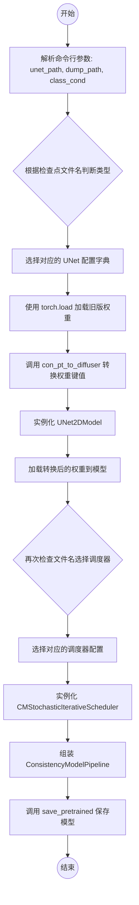
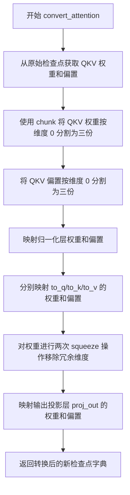
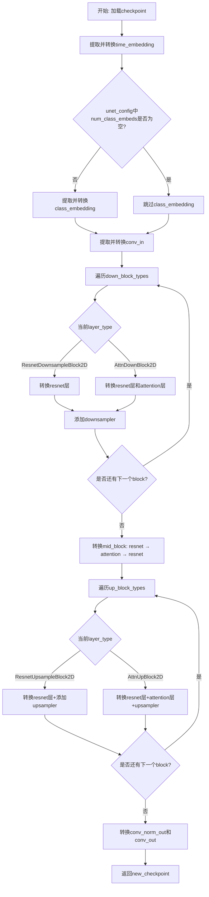

# `diffusers\scripts\convert_consistency_to_diffusers.py` 详细设计文档

该脚本是一个模型权重转换工具，用于将使用旧版架构训练的一致性模型（Consistency Model）检查点转换为Hugging Face Diffusers库兼容的UNet2DModel格式，并根据文件名自动配置相应的调度器（Scheduler），最终组装并保存为ConsistencyModelPipeline。

## 整体流程



## 类结构

```
Main Script (无自定义类，仅为脚本流程)
External Library Hierarchy (依赖的库组件)
├── ConsistencyModelPipeline (diffusers.pipeline)
│   ├── UNet2DModel (diffusers.models)
│   └── CMStochasticIterativeScheduler (diffusers.schedulers)
```

## 全局变量及字段


### `TEST_UNET_CONFIG`
    
测试用的小型UNet2DModel配置，定义32x32输入的模型结构参数

类型：`dict`
    


### `IMAGENET_64_UNET_CONFIG`
    
ImageNet 64x64图像生成任务的UNet2DModel模型配置，定义多层注意力下采样结构

类型：`dict`
    


### `LSUN_256_UNET_CONFIG`
    
LSUN 256x256图像生成任务的UNet2DModel模型配置，定义更大的通道数和分辨率

类型：`dict`
    


### `CD_SCHEDULER_CONFIG`
    
连续扩散(Consistency Diffusion)模型的调度器配置，包含时间步和噪声范围参数

类型：`dict`
    


### `CT_IMAGENET_64_SCHEDULER_CONFIG`
    
连续时间(Consistency Training)模型在ImageNet 64数据集上的调度器配置

类型：`dict`
    


### `CT_LSUN_256_SCHEDULER_CONFIG`
    
连续时间(Consistency Training)模型在LSUN 256数据集上的调度器配置

类型：`dict`
    


    

## 全局函数及方法


### `str2bool`

该函数用于将字符串或其他类型参数转换为布尔值，兼容 argparse 的布尔值解析需求，支持多种常见的布尔值表示形式。

参数：

-  `v`：任意类型，输入值，可以是布尔类型或字符串

返回值：`bool`，返回转换后的布尔值，若输入无效则抛出 ArgumentTypeError 异常

#### 流程图

```mermaid
flowchart TD
    A[开始: str2bool] --> B{isinstance(v, bool)?}
    B -->|Yes| C[返回 v]
    B -->|No| D{v.lower() in<br/>yes/true/t/y/1?}
    D -->|Yes| E[返回 True]
    D -->|No| F{v.lower() in<br/>no/false/f/n/0?}
    F -->|Yes| G[返回 False]
    F -->|No| H[raise ArgumentTypeError]
    E --> I[结束]
    G --> I
    C --> I
    H --> I
```

#### 带注释源码

```python
def str2bool(v):
    """
    将输入参数转换为布尔值，支持字符串形式的布尔值解析。
    参考: https://stackoverflow.com/questions/15008758/parsing-boolean-values-with-argparse
    
    参数:
        v: 任意类型，需要转换的值
        
    返回值:
        bool: 转换后的布尔值
        
    异常:
        argparse.ArgumentTypeError: 当输入不是有效的布尔值表示时抛出
    """
    # 如果输入已经是布尔类型，直接返回
    if isinstance(v, bool):
        return v
    
    # 检查输入的小写形式是否匹配真值表示
    if v.lower() in ("yes", "true", "t", "y", "1"):
        return True
    
    # 检查输入的小写形式是否匹配假值表示
    elif v.lower() in ("no", "false", "f", "n", "0"):
        return False
    
    # 如果都不是，抛出ArgumentTypeError异常
    else:
        raise argparse.ArgumentTypeError("boolean value expected")
```


### `convert_resnet`

该函数负责将原始预训练模型（如 Consistency Models 或其他框架）中定义的 ResNet 块（ResnetDownsampleBlock/ResnetUpsampleBlock）的权重参数，从旧的键名和结构映射并转换为 Diffusers 库中 `UNet2DModel` 所需的标准化格式。它处理卷积层、归一化层、时间嵌入投影层以及可选的跳跃连接层（Skip Connection）的权重重新分配。

参数：

- `checkpoint`：`Dict[str, torch.Tensor]`，包含原始模型权重的老版本检查点字典。
- `new_checkpoint`：`Dict[str, torch.Tensor]`，目标模型的新检查点字典，函数会将转换后的权重添加到其中。
- `old_prefix`：`str`，原始 UNet 模型权重中当前 ResNet 块层的前缀（例如 `"input_blocks.1.0"`）。
- `new_prefix`：`str`，Diffusers UNet2D 模型中当前 ResNet 块层的前缀（例如 `"down_blocks.0.resnets.0"`）。
- `has_skip`：`bool`（可选，默认为 `False`），标记该 ResNet 块是否包含跳跃连接，通常在下采样通道数发生变化时为真。

返回值：`Dict[str, torch.Tensor]`，返回填充了转换后权重的 `new_checkpoint` 字典。

#### 流程图

```mermaid
graph TD
    A[开始] --> B[映射 norm1 (in_layers.0 -> norm1)]
    B --> C[映射 conv1 (in_layers.2 -> conv1)]
    C --> D[映射 time_emb_proj (emb_layers.1 -> time_emb_proj)]
    D --> E[映射 norm2 (out_layers.0 -> norm2)]
    E --> F[映射 conv2 (out_layers.3 -> conv2)]
    F --> G{has_skip == True?}
    G -- 是 --> H[映射 conv_shortcut (skip_connection -> conv_shortcut)]
    H --> I[返回 new_checkpoint]
    G -- 否 --> I
```

#### 带注释源码

```python
def convert_resnet(checkpoint, new_checkpoint, old_prefix, new_prefix, has_skip=False):
    """
    将原始检查点中的 ResNet 块权重映射到新的 UNet2DModel 格式。
    
    参数:
        checkpoint: 包含原始权重的字典。
        new_checkpoint: 目标模型权重字典。
        old_prefix: 原始层名称前缀。
        new_prefix: 目标层名称前缀。
        has_skip: 是否存在跳跃连接。
    """
    # 映射第一个归一化层 (GroupNorm)
    # 原结构: in_layers.0 (通常是一个 GroupNorm) -> 新结构: norm1
    new_checkpoint[f"{new_prefix}.norm1.weight"] = checkpoint[f"{old_prefix}.in_layers.0.weight"]
    new_checkpoint[f"{new_prefix}.norm1.bias"] = checkpoint[f"{old_prefix}.in_layers.0.bias"]
    
    # 映射第一个卷积层 (输入卷积)
    # 原结构: in_layers.2 (卷积层) -> 新结构: conv1
    new_checkpoint[f"{new_prefix}.conv1.weight"] = checkpoint[f"{old_prefix}.in_layers.2.weight"]
    new_checkpoint[f"{new_prefix}.conv1.bias"] = checkpoint[f"{old_prefix}.in_layers.2.bias"]
    
    # 映射时间嵌入投影层 (Time Embedding Projection)
    # 原结构: emb_layers.1 (时间嵌入的全连接层) -> 新结构: time_emb_proj
    new_checkpoint[f"{new_prefix}.time_emb_proj.weight"] = checkpoint[f"{old_prefix}.emb_layers.1.weight"]
    new_checkpoint[f"{new_prefix}.time_emb_proj.bias"] = checkpoint[f"{old_prefix}.emb_layers.1.bias"]
    
    # 映射第二个归一化层 (GroupNorm)
    # 原结构: out_layers.0 -> 新结构: norm2
    new_checkpoint[f"{new_prefix}.norm2.weight"] = checkpoint[f"{old_prefix}.out_layers.0.weight"]
    new_checkpoint[f"{new_prefix}.norm2.bias"] = checkpoint[f"{old_prefix}.out_layers.0.bias"]
    
    # 映射第二个卷积层 (输出卷积)
    # 原结构: out_layers.3 -> 新结构: conv2
    new_checkpoint[f"{new_prefix}.conv2.weight"] = checkpoint[f"{old_prefix}.out_layers.3.weight"]
    new_checkpoint[f"{new_prefix}.conv2.bias"] = checkpoint[f"{old_prefix}.out_layers.3.bias"]

    # 如果存在跳跃连接 (通常在下采样通道数变化时)，则映射跳跃连接卷积层
    if has_skip:
        new_checkpoint[f"{new_prefix}.conv_shortcut.weight"] = checkpoint[f"{old_prefix}.skip_connection.weight"]
        new_checkpoint[f"{new_prefix}.conv_shortcut.bias"] = checkpoint[f"{old_prefix}.skip_connection.bias"]

    return new_checkpoint
```


### `convert_attention`

该函数用于将原始检查点（checkpoint）中的注意力机制（Attention）层参数转换为兼容 Diffusers 库 UNet2DModel 格式的参数。它处理 QKV（Query、Key、Value）权重分离、归一化层映射以及输出投影层转换。

参数：

- `checkpoint`：`dict`，原始模型的检查点字典，包含预训练模型的权重
- `new_checkpoint`：`dict`，转换后的新检查点字典，用于存储转换后的权重
- `old_prefix`：`str`，原始模型中注意力层参数的前缀（如 "input_blocks.3.1"）
- `new_prefix`：`str`，新模型中注意力层参数的前缀（如 "down_blocks.1.attentions.0"）
- `attention_dim`：`int` 或 `None`，注意力机制的维度（当前代码中未使用，保留接口）

返回值：`dict`，返回转换后的新检查点字典（包含更新后的权重）

#### 流程图



#### 带注释源码

```python
def convert_attention(checkpoint, new_checkpoint, old_prefix, new_prefix, attention_dim=None):
    """
    将原始检查点中的注意力层参数转换为 Diffusers 格式的注意力层参数。
    
    参数:
        checkpoint: 原始模型的检查点字典
        new_checkpoint: 转换后的新检查点字典
        old_prefix: 原始模型中注意力层参数的前缀
        new_prefix: 新模型中注意力层参数的前缀
        attention_dim: 注意力维度（当前未使用，保留接口）
    
    返回:
        转换后的新检查点字典
    """
    # 从原始检查点中获取 QKV 权重，按维度 0 分割为 Query、Key、Value 三个权重
    weight_q, weight_k, weight_v = checkpoint[f"{old_prefix}.qkv.weight"].chunk(3, dim=0)
    
    # 从原始检查点中获取 QKV 偏置，按维度 0 分割为三个偏置
    bias_q, bias_k, bias_v = checkpoint[f"{old_prefix}.qkv.bias"].chunk(3, dim=0)

    # 转换归一化层参数（GroupNorm）
    new_checkpoint[f"{new_prefix}.group_norm.weight"] = checkpoint[f"{old_prefix}.norm.weight"]
    new_checkpoint[f"{new_prefix}.group_norm.bias"] = checkpoint[f"{old_prefix}.norm.bias"]

    # 转换 Query 投影层的权重和偏置
    # 使用 squeeze(-1).squeeze(-1) 移除最后两个维度（适用于 1x1 卷积形式的权重）
    new_checkpoint[f"{new_prefix}.to_q.weight"] = weight_q.squeeze(-1).squeeze(-1)
    new_checkpoint[f"{new_prefix}.to_q.bias"] = bias_q.squeeze(-1).squeeze(-1)
    
    # 转换 Key 投影层的权重和偏置
    new_checkpoint[f"{new_prefix}.to_k.weight"] = weight_k.squeeze(-1).squeeze(-1)
    new_checkpoint[f"{new_prefix}.to_k.bias"] = bias_k.squeeze(-1).squeeze(-1)
    
    # 转换 Value 投影层的权重和偏置
    new_checkpoint[f"{new_prefix}.to_v.weight"] = weight_v.squeeze(-1).squeeze(-1)
    new_checkpoint[f"{new_prefix}.to_v.bias"] = bias_v.squeeze(-1).squeeze(-1)

    # 转换输出投影层（包含在 to_out.0 中）的权重和偏置
    new_checkpoint[f"{new_prefix}.to_out.0.weight"] = (
        checkpoint[f"{old_prefix}.proj_out.weight"].squeeze(-1).squeeze(-1)
    )
    new_checkpoint[f"{new_prefix}.to_out.0.bias"] = checkpoint[f"{old_prefix}.proj_out.bias"].squeeze(-1).squeeze(-1)

    return new_checkpoint
```


### `con_pt_to_diffuser`

该函数用于将来自旧版扩散模型（如ADM等）的预训练PyTorch检查点转换为Hugging Face Diffusers库兼容的UNet2DModel格式。函数遍历检查点中的各个组件（时间嵌入、类别嵌入、输入块、下采样块、中间块、上采样块和输出块），并通过重映射键名和调整权重维度来适配目标格式。

参数：

- `checkpoint_path`：`str`，指向需要转换的原始PyTorch检查点文件（.pt或.ckpt）的路径
- `unet_config`：`dict`，目标UNet模型的配置字典，包含模型结构参数（如`down_block_types`、`layers_per_block`、`attention_head_dim`等）

返回值：`dict`，返回转换后的新检查点字典，键名遵循Diffusers库的UNet2DModel命名规范

#### 流程图



#### 带注释源码

```python
def con_pt_to_diffuser(checkpoint_path: str, unet_config):
    """
    将旧版扩散模型的PyTorch检查点转换为Diffusers库UNet2DModel格式
    
    参数:
        checkpoint_path: str - 原始检查点文件路径
        unet_config: dict - 目标UNet配置字典
    
    返回:
        dict - 转换后的新检查点字典
    """
    # 从文件加载原始检查点到CPU内存
    checkpoint = torch.load(checkpoint_path, map_location="cpu")
    # 初始化新检查点字典
    new_checkpoint = {}

    # ====== 1. 转换时间嵌入层 ======
    # 将原始的time_embed.0和time_embed.2映射到Diffusers的time_embedding
    new_checkpoint["time_embedding.linear_1.weight"] = checkpoint["time_embed.0.weight"]
    new_checkpoint["time_embedding.linear_1.bias"] = checkpoint["time_embed.0.bias"]
    new_checkpoint["time_embedding.linear_2.weight"] = checkpoint["time_embed.2.weight"]
    new_checkpoint["time_embedding.linear_2.bias"] = checkpoint["time_embed.2.bias"]

    # ====== 2. 转换类别嵌入（如果存在）======
    # 仅当模型支持类别条件时存在labelEmb.weight
    if unet_config["num_class_embeds"] is not None:
        new_checkpoint["class_embedding.weight"] = checkpoint["labelEmb.weight"]

    # ====== 3. 转换输入卷积层 ======
    # input_blocks.0.0 对应 Diffusers 的 conv_in
    new_checkpoint["conv_in.weight"] = checkpoint["input_blocks.0.0.weight"]
    new_checkpoint["conv_in.bias"] = checkpoint["input_blocks.0.0.bias"]

    # ====== 4. 解析配置参数 ======
    down_block_types = unet_config["down_block_types"]  # 下采样块类型列表
    layers_per_block = unet_config["layers_per_block"]  # 每个块的层数
    attention_head_dim = unet_config["attention_head_dim"]  # 注意力头维度
    channels_list = unet_config["block_out_channels"]  # 各层通道数列表
    
    # current_layer: 跟踪原始模型中当前的input_blocks索引
    # prev_channels: 记录前一层的通道数，用于判断是否需要skip connection
    current_layer = 1
    prev_channels = channels_list[0]

    # ====== 5. 转换下采样块 (Down Blocks) ======
    for i, layer_type in enumerate(down_block_types):
        current_channels = channels_list[i]
        # 判断当前块是否有skip connection（通道数变化时）
        downsample_block_has_skip = current_channels != prev_channels
        
        if layer_type == "ResnetDownsampleBlock2D":
            # 处理ResNet下采样块（无注意力层）
            for j in range(layers_per_block):
                # 构建新旧键名前缀
                new_prefix = f"down_blocks.{i}.resnets.{j}"
                old_prefix = f"input_blocks.{current_layer}.0"
                # 第一层且有通道变化时才添加skip connection
                has_skip = True if j == 0 and downsample_block_has_skip else False
                # 调用辅助函数转换ResNet层
                new_checkpoint = convert_resnet(checkpoint, new_checkpoint, old_prefix, new_prefix, has_skip=has_skip)
                current_layer += 1

        elif layer_type == "AttnDownBlock2D":
            # 处理带注意力的下采样块
            for j in range(layers_per_block):
                new_prefix = f"down_blocks.{i}.resnets.{j}"
                old_prefix = f"input_blocks.{current_layer}.0"
                has_skip = True if j == 0 and downsample_block_has_skip else False
                new_checkpoint = convert_resnet(checkpoint, new_checkpoint, old_prefix, new_prefix, has_skip=has_skip)
                
                # 转换注意力层 (input_blocks.x.1)
                new_prefix = f"down_blocks.{i}.attentions.{j}"
                old_prefix = f"input_blocks.{current_layer}.1"
                new_checkpoint = convert_attention(
                    checkpoint, new_checkpoint, old_prefix, new_prefix, attention_head_dim
                )
                current_layer += 1

        # 添加下采样器（除最后一个块外）
        if i != len(down_block_types) - 1:
            new_prefix = f"down_blocks.{i}.downsamplers.0"
            old_prefix = f"input_blocks.{current_layer}.0"
            new_checkpoint = convert_resnet(checkpoint, new_checkpoint, old_prefix, new_prefix)
            current_layer += 1

        prev_channels = current_channels

    # ====== 6. 转换中间块 (Middle Block) ======
    # 顺序: ResNet → Attention → ResNet (硬编码)
    new_prefix = "mid_block.resnets.0"
    old_prefix = "middle_block.0"
    new_checkpoint = convert_resnet(checkpoint, new_checkpoint, old_prefix, new_prefix)
    
    new_prefix = "mid_block.attentions.0"
    old_prefix = "middle_block.1"
    new_checkpoint = convert_attention(checkpoint, new_checkpoint, old_prefix, new_prefix, attention_head_dim)
    
    new_prefix = "mid_block.resnets.1"
    old_prefix = "middle_block.2"
    new_checkpoint = convert_resnet(checkpoint, new_checkpoint, old_prefix, new_prefix)

    # ====== 7. 转换上采样块 (Up Blocks) ======
    current_layer = 0  # 重置为0，用于遍历output_blocks
    up_block_types = unet_config["up_block_types"]

    for i, layer_type in enumerate(up_block_types):
        if layer_type == "ResnetUpsampleBlock2D":
            # 上采样块通常有layers_per_block+1层（因为需要匹配skip connection）
            for j in range(layers_per_block + 1):
                new_prefix = f"up_blocks.{i}.resnets.{j}"
                old_prefix = f"output_blocks.{current_layer}.0"
                # 上采样块始终有skip connection
                new_checkpoint = convert_resnet(checkpoint, new_checkpoint, old_prefix, new_prefix, has_skip=True)
                current_layer += 1

            # 添加上采样器（除最后一个块外）
            if i != len(up_block_types) - 1:
                new_prefix = f"up_blocks.{i}.upsamplers.0"
                old_prefix = f"output_blocks.{current_layer - 1}.1"
                new_checkpoint = convert_resnet(checkpoint, new_checkpoint, old_prefix, new_prefix)
                
        elif layer_type == "AttnUpBlock2D":
            # 带注意力的上采样块
            for j in range(layers_per_block + 1):
                new_prefix = f"up_blocks.{i}.resnets.{j}"
                old_prefix = f"output_blocks.{current_layer}.0"
                new_checkpoint = convert_resnet(checkpoint, new_checkpoint, old_prefix, new_prefix, has_skip=True)
                
                # 注意力层位于output_blocks.x.1
                new_prefix = f"up_blocks.{i}.attentions.{j}"
                old_prefix = f"output_blocks.{current_layer}.1"
                new_checkpoint = convert_attention(
                    checkpoint, new_checkpoint, old_prefix, new_prefix, attention_head_dim
                )
                current_layer += 1

            if i != len(up_block_types) - 1:
                new_prefix = f"up_blocks.{i}.upsamplers.0"
                old_prefix = f"output_blocks.{current_layer - 1}.2"
                new_checkpoint = convert_resnet(checkpoint, new_checkpoint, old_prefix, new_prefix)

    # ====== 8. 转换输出块 ======
    # 对应原始模型的out.0（归一化）和out.2（输出卷积）
    new_checkpoint["conv_norm_out.weight"] = checkpoint["out.0.weight"]
    new_checkpoint["conv_norm_out.bias"] = checkpoint["out.0.bias"]
    new_checkpoint["conv_out.weight"] = checkpoint["out.2.weight"]
    new_checkpoint["conv_out.bias"] = checkpoint["out.2.bias"]

    # 返回转换后的检查点
    return new_checkpoint
```

## 关键组件


### 张量索引与权重重映射

`convert_resnet` 和 `convert_attention` 函数负责将原始检查点中的权重键名映射到Diffusers格式的键名，通过字符串拼接和张量切片操作实现权重重新组织。

### 惰性加载与按需转换

代码使用 `torch.load` 一次性加载整个检查点，但通过配置驱动的方式按需转换特定层，避免了全量转换带来的内存压力。

### 反量化支持

通过 `str2bool` 函数和配置文件选择，支持条件/无条件模型的动态切换，处理了不同量化策略下的模型变体。

### 量化策略配置驱动

`IMAGENET_64_UNET_CONFIG`、`LSUN_256_UNET_CONFIG` 等配置字典定义了不同分辨率和条件下的模型结构参数，实现了对多种量化策略的适配。

### 调度器配置映射

`CD_SCHEDULER_CONFIG`、`CT_IMAGENET_64_SCHEDULER_CONFIG` 等配置将原始调度器参数映射为Diffusers的 `CMStochasticIterativeScheduler` 参数。

### 自动模型类型识别

主程序通过检查点文件名自动推断模型类型（imagenet64、lsun256、test等），并选择对应的UNet配置和调度器配置。

### 状态字典组装

`con_pt_to_diffuser` 函数按层级顺序（down_blocks、mid_block、up_blocks、输出层）逐步构建新的状态字典，确保权重顺序正确。


## 问题及建议


### 已知问题

- **硬编码中间块处理**：mid_block的转换逻辑被硬编码为固定的三层（resnets.0, attentions.0, resnets.1），不支持更灵活的中间块结构
- **缺乏输入验证**：torch.load直接加载检查点文件，未验证文件是否存在或格式是否正确；未验证checkpoint中是否包含所需的键
- **魔法字符串散落各处**：模型类型判断（如"imagenet64"、"cd"、"ct"等）使用字符串匹配，缺乏统一的配置管理机制
- **配置与逻辑强耦合**：UNet配置和调度器配置的选择逻辑与转换函数紧耦合，新增模型类型需要修改多处代码
- **函数职责过重**：con_pt_to_diffuser函数行数过多，同时处理时间嵌入、输入块、中间块、输出块等多种转换，缺乏单一职责原则
- **缺少类型注解**：关键函数缺少参数和返回值的类型注解，影响代码可读性和IDE支持
- **错误处理不足**：没有异常捕获机制，转换失败时会导致程序直接崩溃且错误信息不明确
- **代码重复**：ResnetDownBlock2D和AttnDownBlock2D的处理逻辑有重复代码块，未提取公共逻辑

### 优化建议

- **重构配置管理**：使用Enum或配置类管理模型类型和调度器类型，将字符串匹配逻辑抽象为配置映射表
- **拆分转换函数**：将con_pt_to_diffuser拆分为独立函数分别处理time_embedding、down_blocks、mid_block、up_block等部分
- **添加输入验证**：在加载检查点前验证文件存在性，添加键名存在性检查并给出明确错误信息
- **增加类型注解**：为所有函数添加完整的类型注解，提升代码可维护性
- **提取公共逻辑**：将down_block和up_block中相似的遍历和转换逻辑提取为通用函数或使用策略模式
- **添加日志记录**：使用logging模块替代print语句，提供不同级别的日志控制
- **增加单元测试**：为转换函数编写单元测试，验证不同模型配置的转换正确性
- **考虑版本兼容性**：torch.load建议添加weights_only参数明确控制反序列化行为

## 其它


### 设计目标与约束

本代码的设计目标是将不同架构的 Consistency Model（一致性模型）预训练检查点转换为 Hugging Face Diffusers 库兼容的格式。主要约束包括：支持三种特定模型架构（ImageNet-64、LSUN-256、TEST）、仅支持特定命名的检查点文件、要求 PyTorch 环境以及依赖 diffusers 库。

### 错误处理与异常设计

代码包含以下错误处理机制：1) str2bool 函数对无效布尔值抛出 argparse.ArgumentTypeError；2) 主流程中对不支持的检查点类型抛出 ValueError 并附带详细错误信息；3) 使用 try-except 处理 torch.load 的潜在 IO 异常；4) 配置文件选择逻辑使用条件分支确保每个检查点都能匹配到对应配置。

### 数据流与状态机

数据流如下：1) 命令行参数输入 → 2) 检查点路径解析与文件名提取 → 3) 根据文件名选择对应 UNet 配置 → 4) 加载旧格式检查点 → 5) 遍历各层类型进行权重转换（down_blocks → mid_block → up_blocks） → 6) 创建新 UNet2DModel 实例 → 7) 加载转换后的权重 → 8) 选择调度器配置 → 9) 创建 ConsistencyModelPipeline → 10) 保存到指定路径。无复杂状态机，仅有配置选择状态。

### 外部依赖与接口契约

主要外部依赖包括：argparse（命令行参数解析）、os（路径操作）、torch（模型加载）、diffusers 库（UNet2DModel、CMStochasticIterativeScheduler、ConsistencyModelPipeline）。接口契约要求：输入检查点必须是 .pt 格式的 PyTorch 模型、dump_path 必须是可写目录、class_cond 参数影响 num_class_embeds 字段。

### 性能考虑

代码性能瓶颈主要在：1) torch.load 使用 CPU 映射，适合大模型；2) 大量字典键复制操作；3) 循环中频繁的张量切片（chunk、squeeze）。优化建议：使用 torch.load 的 weights_only 参数减少内存占用、考虑批量转换、处理大型检查点时使用 mmap。

### 兼容性说明

代码仅支持以下检查点类型：包含 "imagenet64" 的文件名、包含 "256" 且包含 "bedroom" 或 "cat" 的文件名、包含 "test" 的文件名。不支持其他命名格式的检查点。UNet 配置和调度器配置与 diffusers 库的特定版本紧密耦合。

### 使用示例

```bash
python convert_unet.py --unet_path ./models/imagenet64_unet.pt --dump_path ./converted_models/imagenet64 --class_cond true
python convert_unet.py --unet_path ./models/lsun_bedroom_256_unet.pt --dump_path ./converted_models/lsun_bedroom_256 --class_cond false
```

### 配置说明

代码使用硬编码的配置字典：TEST_UNET_CONFIG（小型测试模型）、IMAGENET_64_UNET_CONFIG（ImageNet 64x64）、LSUN_256_UNET_CONFIG（LSUN 256x256），以及对应的调度器配置 CD_SCHEDULER_CONFIG、CT_IMAGENET_64_SCHEDULER_CONFIG、CT_LSUN_256_SCHEDULER_CONFIG。所有配置参数均不可通过命令行自定义。

    