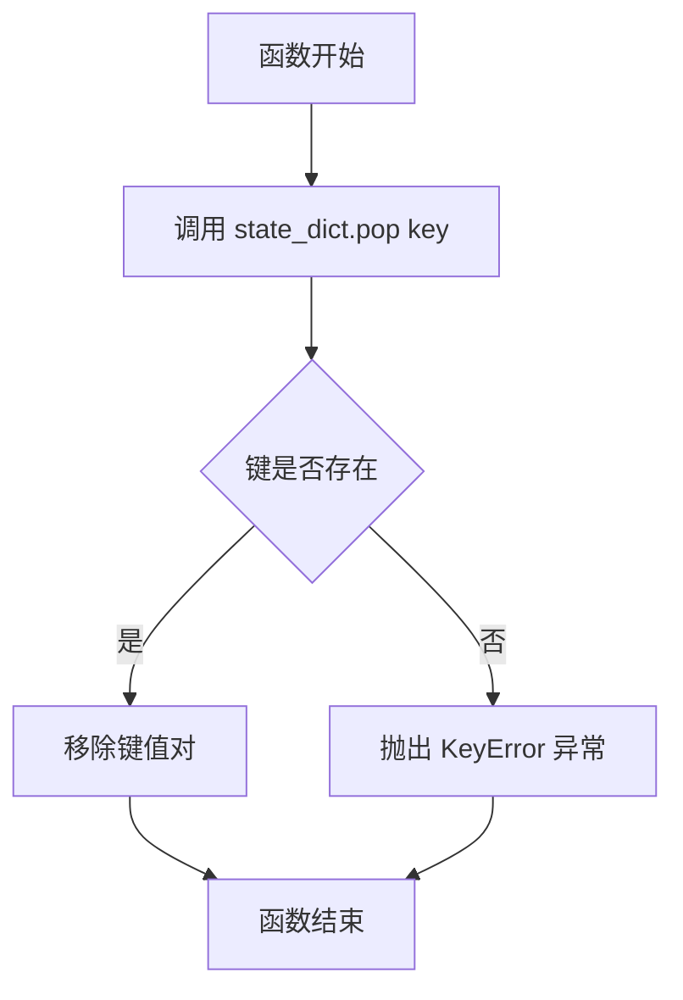
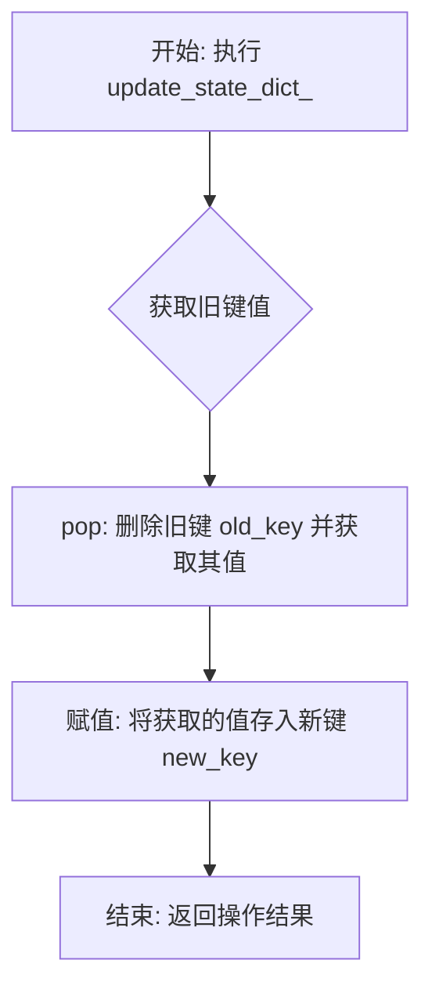
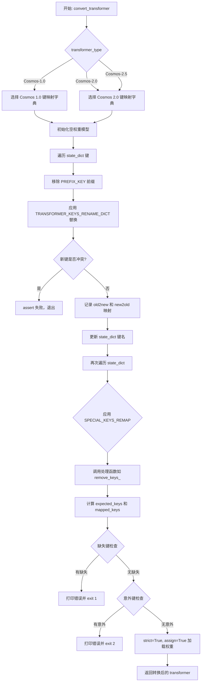
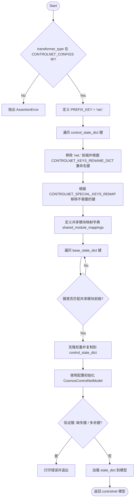
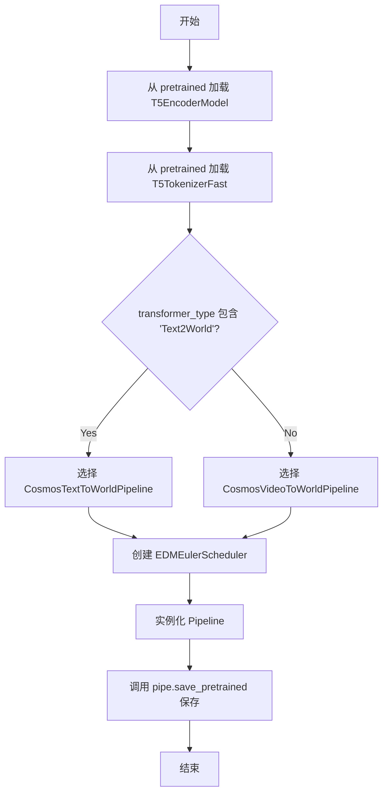
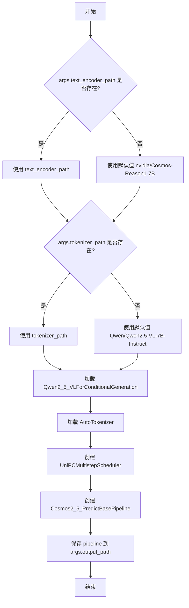
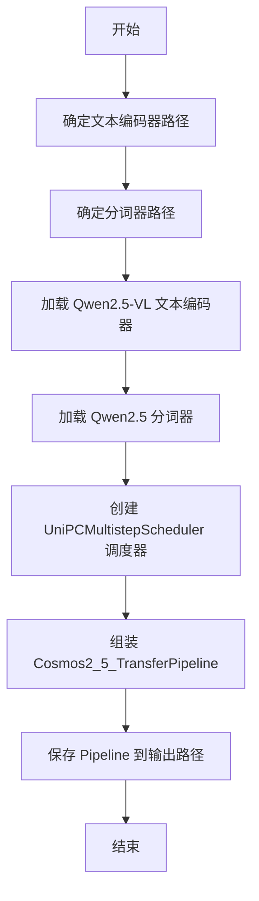
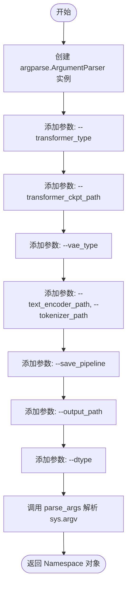

# `diffusers\scripts\convert_cosmos_to_diffusers.py` 详细设计文档

这是一个用于将NVIDIA Cosmos系列扩散模型（Cosmos 1.0, 2.0, 2.5）的检查点转换为Hugging Face Diffusers格式的命令行工具。支持Text2Image、Video2World和Transfer任务，包含Transformer、VAE和ControlNet的权重转换与 pipeline 组装。

## 整体流程

```mermaid
graph TD
    Start[开始] --> ParseArgs[解析命令行参数 get_args]
    ParseArgs --> LoadCKPT{是否提供 Transformer 检查点?}
    LoadCKPT -- 是 --> GetState[调用 get_state_dict 加载权重]
    LoadCKPT -- 否 --> CheckVAE
    GetState --> CheckType{模型类型是否为 Transfer?}
    CheckType -- 是 --> SplitDict[拆分 state_dict: base & control]
    SplitDict --> ConvTrans[convert_transformer 转换基础模型]
    ConvTrans --> GetBase[获取转换后的基础模型权重]
    GetBase --> ConvCtrl[convert_controlnet 转换 ControlNet]
    CheckType -- 否 --> ConvTransOnly[convert_transformer 转换 Transformer]
    ConvTransOnly --> CheckVAE
    ConvCtrl --> CheckVAE
    CheckVAE{是否提供 VAE 类型?}
    CheckVAE -- 是 --> LoadVAE{版本是否为 1.0?}
    CheckVAE -- 否 --> CheckSave
    LoadVAE -- 是 --> ConvVAE[convert_vae 转换 VAE]
    LoadVAE -- 否 --> PretrainVAE[AutoencoderKLWan.from_pretrained 加载预训练 VAE]
    ConvVAE --> CheckSave
    PretrainVAE --> CheckSave
    CheckSave{是否保存完整 Pipeline?}
    CheckSave -- 是 --> RouteSave[根据版本路由到不同的 save_pipeline 函数]
    RouteSave --> SavePipe[保存 Pipeline (包含 Text Encoder, Tokenizer, Scheduler)]
    CheckSave -- 否 --> SaveComp[分别保存 Transformer / VAE / ControlNet 权重]
    SavePipe --> End[结束]
    SaveComp --> End
```

## 类结构

```
convert_cosmos_to_diffusers.py (脚本入口，无内部类定义)
├── 全局配置字典 (TRANSFORMER_, CONTROLNET_, VAE_ 配置)
├── 工具函数 (remove_keys_, update_state_dict_ 等)
├── 转换核心 (convert_transformer, convert_controlnet, convert_vae)
└── 管道保存 (save_pipeline_cosmos_*)
```

## 全局变量及字段


### `TRANSFORMER_KEYS_RENAME_DICT_COSMOS_1_0`
    
Dictionary mapping old transformer checkpoint key names to new Diffusers-compatible key names for Cosmos 1.0 models

类型：`Dict[str, str]`
    


### `TRANSFORMER_SPECIAL_KEYS_REMAP_COSMOS_1_0`
    
Dictionary of special key handling functions for Cosmos 1.0 transformers, used to remove or rename keys that require custom processing

类型：`Dict[str, Callable[[str, Dict[str, Any]], None]]`
    


### `TRANSFORMER_KEYS_RENAME_DICT_COSMOS_2_0`
    
Dictionary mapping old transformer checkpoint key names to new Diffusers-compatible key names for Cosmos 2.0/2.5 models

类型：`Dict[str, str]`
    


### `TRANSFORMER_SPECIAL_KEYS_REMAP_COSMOS_2_0`
    
Dictionary of special key handling functions for Cosmos 2.0/2.5 transformers, used to remove or rename keys that require custom processing

类型：`Dict[str, Callable[[str, Dict[str, Any]], None]]`
    


### `TRANSFORMER_CONFIGS`
    
Dictionary containing model configuration parameters for different Cosmos transformer types, including channels, layers, attention settings, and patch sizes

类型：`Dict[str, Dict[str, Any]]`
    


### `CONTROLNET_CONFIGS`
    
Dictionary containing ControlNet model configuration parameters for Cosmos 2.5 Transfer models, including block counts and channel dimensions

类型：`Dict[str, Dict[str, Any]]`
    


### `CONTROLNET_KEYS_RENAME_DICT`
    
Dictionary mapping old ControlNet checkpoint key names to new Diffusers-compatible key names, extending transformer rename rules

类型：`Dict[str, str]`
    


### `CONTROLNET_SPECIAL_KEYS_REMAP`
    
Dictionary of special key handling functions for ControlNet models, used to remove keys that should not be loaded

类型：`Dict[str, Callable[[str, Dict[str, Any]], None]]`
    


### `VAE_KEYS_RENAME_DICT`
    
Dictionary mapping old VAE checkpoint key names to new Diffusers-compatible key names for block and layer renaming

类型：`Dict[str, str]`
    


### `VAE_SPECIAL_KEYS_REMAP`
    
Dictionary of special key handling functions for VAE models, used to remove auxiliary keys like wavelets and buffers

类型：`Dict[str, Callable[[str, Dict[str, Any]], None]]`
    


### `VAE_CONFIGS`
    
Dictionary containing VAE model configurations for different tokenizer types, including channel counts and compression ratios

类型：`Dict[str, Dict[str, Any]]`
    


### `DTYPE_MAPPING`
    
Dictionary mapping string dtype names ('fp32', 'fp16', 'bf16') to corresponding PyTorch dtype objects

类型：`Dict[str, torch.dtype]`
    


    

## 全局函数及方法


### `remove_keys_`

该函数是一个辅助函数，用于从状态字典（state_dict）中移除指定的键值对。它通常在模型权重转换过程中用于删除不需要的键。

参数：

-  `key`：`str`，要移除的键名称
-  `state_dict`：`Dict[str, Any]`，模型的状态字典，修改是原地进行的

返回值：`None`，无返回值（原地修改 state_dict）

#### 流程图



#### 带注释源码

```python
def remove_keys_(key: str, state_dict: Dict[str, Any]):
    """
    从状态字典中移除指定的键。
    
    这是一个原地操作函数，直接修改传入的 state_dict。
    通常用于模型权重转换时删除不需要的键（如某些特殊状态变量）。
    
    参数:
        key: str, 要从 state_dict 中移除的键名
        state_dict: Dict[str, Any], 包含模型权重的状态字典
    
    返回:
        None (原地修改 state_dict)
    """
    # 使用 pop 方法移除指定键，如果键不存在会抛出 KeyError
    state_dict.pop(key)
```


### `update_state_dict_`

该函数是一个轻量级的工具函数，用于在模型权重字典（`state_dict`）中执行键（Key）的重命名操作。它通过将旧键的值弹出并赋值给新键的方式，实现了键名的原地（In-place）转换。这在将不同格式（如Cosmos原始检查点）的权重键名映射到Diffusers库所期望的键名结构时非常关键。

参数：

- `state_dict`：`Dict[str, Any]`，表示模型的状态字典（State Dictionary），包含层名称（键）及其对应的权重张量（值）。
- `old_key`：`str`，需要被重命名的原始键名。
- `new_key`：`str`，新的目标键名。

返回值：`dict[str, Any]`，返回修改后的状态字典。
*(注意：虽然类型注解声明返回字典，但根据Python表达式 `state_dict[new_key] = state_dict.pop(old_key)` 的求值结果，该函数实际返回的是被移动的权重值（Value）。然而，由于字典是引用传递的，调用方的 `state_dict` 已被正确修改。)*

#### 流程图



#### 带注释源码

```python
def update_state_dict_(state_dict: Dict[str, Any], old_key: str, new_key: str) -> dict[str, Any]:
    """
    在给定的状态字典中重命名键。

    参数:
        state_dict: 包含模型权重的字典。
        old_key: 旧的键名。
        new_key: 新的键名。

    返回:
        返回修改后的字典。
    """
    # 1. 使用 pop 方法移除 old_key 并获取其对应的 value（权重张量）
    # 2. 将该 value 赋值给新的键名 new_key
    # 注意：字典的 pop 操作是原子的，且这里直接修改了传入的 state_dict 对象
    state_dict[new_key] = state_dict.pop(old_key)
```


### `rename_transformer_blocks_`

该函数是一个专用的键名转换处理器（Key Remapping Handler），用于 Cosmos 1.0 模型权重转换场景。它负责将原始检查点中 Transformer 模块的键名从嵌套的 `blocks.block{index}.*` 格式重新映射为 Diffusers 库兼容的扁平化 `transformer_blocks.{index}.*` 格式。

参数：

-  `key`：`str`，原始状态字典中的键名（例如 `"blocks.block0.attn"`）。
-  `state_dict`：`Dict[str, Any]`，包含模型权重的字典对象，此处为 in-place 修改。

返回值：`None`。该函数直接修改传入的 `state_dict` 字典，不返回新的字典。

#### 流程图

```mermaid
graph TD
    A([Start rename_transformer_blocks_]) --> B[从 key 中提取 block_index<br>e.g. "block0" -> 0]
    B --> C[构建 old_prefix: <br>"blocks.block{block_index}"]
    C --> D[构建 new_prefix: <br>"transformer_blocks.{block_index}"]
    D --> E{使用 replace 替换前缀}
    E --> F[在 state_dict 中<br>将键名从 key <br>更新为 new_key]
    F --> G([End])
```

#### 带注释源码

```python
def rename_transformer_blocks_(key: str, state_dict: Dict[str, Any]):
    # 1. 解析键名以提取块索引 (block index)。
    #    假设 key 格式为 "blocks.block0.xxx"，split(".")[1] 会得到 "block0"。
    #    removeprefix("block") 去掉前缀得到 "0"，最后转为整型索引 0。
    block_index = int(key.split(".")[1].removeprefix("block"))
    
    # 初始化新键名为原始键名
    new_key = key

    # 2. 定义旧前缀和新前缀
    #    旧格式: blocks.block0
    #    新格式: transformer_blocks.0
    old_prefix = f"blocks.block{block_index}"
    new_prefix = f"transformer_blocks.{block_index}"
    
    # 3. 生成新的键名：通过字符串替换将旧前缀移除并加上新前缀
    new_key = new_prefix + new_key.removeprefix(old_prefix)

    # 4. 更新字典：使用 pop 取出旧键的值，赋值给新键，实现键名的替换
    state_dict[new_key] = state_dict.pop(key)
```


### `get_state_dict`

该函数是一个工具函数，用于从不同格式的 PyTorch 检查点（checkpoint）中提取包含模型权重的 `state_dict`。它通过检查字典的顶层键（`model`, `module`, `state_dict`）来处理常见的 PyTorch 模型保存格式（例如标准的 `state_dict`、使用 `DataParallel` 保存的 `module` 包装，或 HuggingFace 风格的 `model` 包装）。

参数：

-  `saved_dict`：`Dict[str, Any]`，从检查点文件（例如通过 `torch.load`）加载的原始字典对象。

返回值：`dict[str, Any]`，提取后的模型权重字典。

#### 流程图

```mermaid
flowchart TD
    A([开始: 输入 saved_dict]) --> B[赋值 state_dict = saved_dict]
    B --> C{检查 'model' 是否在\n saved_dict 的 keys 中?}
    C -- 是 --> D[state_dict = state_dict['model']]
    C -- 否 --> E{检查 'module' 是否在\n saved_dict 的 keys 中?}
    D --> E
    E -- 是 --> F[state_dict = state_dict['module']]
    E -- 否 --> G{检查 'state_dict' 是否在\n saved_dict 的 keys 中?}
    F --> G
    G -- 是 --> H[state_dict = state_dict['state_dict']]
    G -- 否 --> I([返回 state_dict])
    H --> I
```

#### 带注释源码

```python
def get_state_dict(saved_dict: Dict[str, Any]) -> dict[str, Any]:
    """
    从常见的 PyTorch 检查点字典格式中提取权重字典。

    支持的格式：
    1. 标准格式: {'state_dict': ...}
    2. DataParallel/DDP 格式: {'module': ...}
    3. HuggingFace/Diffusers 格式: {'model': ...}

    Args:
        saved_dict: 加载的原始字典。

    Returns:
        包含模型权重的字典。
    """
    state_dict = saved_dict
    
    # 尝试解包 "model" 键（常见于 HuggingFace 格式）
    if "model" in saved_dict.keys():
        state_dict = state_dict["model"]
        
    # 尝试解包 "module" 键（常见于 DataParallel/DDP 保存的权重）
    if "module" in saved_dict.keys():
        state_dict = state_dict["module"]
        
    # 尝试解包 "state_dict" 键（标准 PyTorch 格式）
    if "state_dict" in saved_dict.keys():
        state_dict = state_dict["state_dict"]
        
    return state_dict
```


### `convert_transformer`

该函数负责将 Nvidia Cosmos 预训练模型的原始 Transformer 检查点（checkpoint）权重转换为 Hugging Face Diffusers 格式的 `CosmosTransformer3DModel`。函数首先根据 `transformer_type` 选择对应的键重命名映射字典，然后通过初始化空权重的模型架构并应用键转换逻辑，将原始状态字典中的权重键名映射到 Diffusers 模型所需的键名，最后进行严格的键完整性检查并加载权重。

参数：

- `transformer_type`：`str`，指定要转换的 Cosmos Transformer 模型类型（如 "Cosmos-1.0-Diffusion-7B-Text2World"、"Cosmos-2.5-Predict-Base-2B" 等）
- `state_dict`：`Optional[Dict[str, Any]]`，原始 Transformer 检查点的状态字典，包含了模型的所有权重
- `weights_only`：`bool`，是否仅加载权重（用于 `torch.load` 的 `weights_only` 参数），默认为 `True`

返回值：`CosmosTransformer3DModel`，转换并加载权重后的 Diffusers 格式 Transformer 模型实例

#### 流程图



#### 带注释源码

```python
def convert_transformer(
    transformer_type: str,
    state_dict: Optional[Dict[str, Any]] = None,
    weights_only: bool = True,
):
    """
    将 Nvidia Cosmos 原始 Transformer checkpoint 转换为 Diffusers 格式的 CosmosTransformer3DModel。
    
    参数:
        transformer_type: Cosmos 模型类型字符串，用于选择对应的配置和键映射规则
        state_dict: 原始 checkpoint 的状态字典
        weights_only: 是否使用 weights_only 模式加载（避免加载非权重数据）
    返回:
        转换并加载权重后的 CosmosTransformer3DModel 实例
    """
    PREFIX_KEY = "net."  # 原始 checkpoint 中权重键的前缀

    # 根据 transformer_type 选择对应的键重命名映射字典
    # Cosmos 1.0 使用独立的映射规则，2.0 和 2.5 共用一套
    if "Cosmos-1.0" in transformer_type:
        TRANSFORMER_KEYS_RENAME_DICT = TRANSFORMER_KEYS_RENAME_DICT_COSMOS_1_0
        TRANSFORMER_SPECIAL_KEYS_REMAP = TRANSFORMER_SPECIAL_KEYS_REMAP_COSMOS_1_0
    elif "Cosmos-2.0" in transformer_type:
        TRANSFORMER_KEYS_RENAME_DICT = TRANSFORMER_KEYS_RENAME_DICT_COSMOS_2_0
        TRANSFORMER_SPECIAL_KEYS_REMAP = TRANSFORMER_SPECIAL_KEYS_REMAP_COSMOS_2_0
    elif "Cosmos-2.5" in transformer_type:
        TRANSFORMER_KEYS_RENAME_DICT = TRANSFORMER_KEYS_RENAME_DICT_COSMOS_2_0
        TRANSFORMER_SPECIAL_KEYS_REMAP = TRANSFORMER_SPECIAL_KEYS_REMAP_COSMOS_2_0
    else:
        # 不支持的类型，断言失败
        assert False

    # 使用 accelerate 库的 init_empty_weights 上下文管理器
    # 在不分配实际显存的情况下初始化模型结构（用于确定键名）
    with init_empty_weights():
        # 从 TRANSFORMER_CONFIGS 获取模型配置
        config = TRANSFORMER_CONFIGS[transformer_type]
        # 创建目标模型实例（此时权重为空）
        transformer = CosmosTransformer3DModel(**config)

    # 创建双向映射字典，用于追踪键名转换
    old2new = {}
    new2old = {}
    
    # 第一遍遍历：对所有键应用常规重命名规则
    for key in list(state_dict.keys()):
        new_key = key[:]  # 复制原始键
        
        # 移除可能存在的前缀 "net."
        if new_key.startswith(PREFIX_KEY):
            new_key = new_key.removeprefix(PREFIX_KEY)
        
        # 遍历所有替换规则，应用键名转换
        for replace_key, rename_key in TRANSFORMER_KEYS_RENAME_DICT.items():
            new_key = new_key.replace(replace_key, rename_key)
        
        # 打印转换日志（调试用）
        print(key, "->", new_key, flush=True)
        
        # 确保新键没有冲突（双向唯一性检查）
        assert new_key not in new2old, f"new key {new_key} already mapped"
        assert key not in old2new, f"old key {key} already mapped"
        
        # 记录映射关系
        old2new[key] = new_key
        new2old[new_key] = key
        
        # 更新 state_dict 中的键名
        update_state_dict_(state_dict, key, new_key)

    # 第二遍遍历：应用特殊的键处理函数
    # 这些函数通常用于删除不需要的键或进行更复杂的转换
    for key in list(state_dict.keys()):
        for special_key, handler_fn_inplace in TRANSFORMER_SPECIAL_KEYS_REMAP.items():
            if special_key not in key:
                continue
            # 调用处理函数（原地修改 state_dict）
            handler_fn_inplace(key, state_dict)

    # 计算期望的键集合和实际映射后的键集合
    expected_keys = set(transformer.state_dict().keys())
    mapped_keys = set(state_dict.keys())
    missing_keys = expected_keys - mapped_keys   # 缺失的权重键
    unexpected_keys = mapped_keys - expected_keys # 多余的权重键

    # 检查缺失键：如果 Diffusers 模型期望某些键但原始 checkpoint 中没有
    if missing_keys:
        print(f"ERROR: missing keys ({len(missing_keys)} from state_dict:", flush=True, file=sys.stderr)
        for k in missing_keys:
            print(k)
        sys.exit(1)
    
    # 检查意外键：如果原始 checkpoint 中有 Diffusers 模型不期望的键
    if unexpected_keys:
        print(f"ERROR: unexpected keys ({len(unexpected_keys)}) from state_dict:", flush=True, file=sys.stderr)
        for k in unexpected_keys:
            print(k)
        sys.exit(2)

    # 使用 strict=True 确保键完全匹配，assign=True 将权重直接赋值到模型参数
    transformer.load_state_dict(state_dict, strict=True, assign=True)
    
    return transformer
```


### `convert_controlnet`

该函数负责将 NVIDIA Cosmos 2.5 Transfer 模型的 ControlNet 检查点权重（包括特定于 ControlNet 的权重和从基础 Transformer 复制的共享权重）进行转换、对齐、验证，并最终加载到 `CosmosControlNetModel` 模型实例中。

参数：

-  `transformer_type`：`str`，指定要转换的 Transformer/ControlNet 模型类型（必须存在于 `CONTROLNET_CONFIGS` 配置中）。
-  `control_state_dict`：`Dict[str, Any]`，包含从原始检查点加载的、ControlNet 特有的权重字典。
-  `base_state_dict`：`Dict[str, Any]`，包含经过 `convert_transformer` 处理后的基础 Transformer 模型权重字典，用于提取共享模块（如 `time_embed`, `patch_embed` 等）并复制到 ControlNet 中。
-  `weights_only`：`bool`（默认 `True`），保留参数，当前实现中未直接使用（权重加载由 `load_state_dict` 处理）。

返回值：`CosmosControlNetModel`，转换并加载权重后的 ControlNet 模型对象。

#### 流程图



#### 带注释源码

```python
def convert_controlnet(
    transformer_type: str,
    control_state_dict: Dict[str, Any],
    base_state_dict: Dict[str, Any],
    weights_only: bool = True,
):
    """
    Convert controlnet weights.

    Args:
        transformer_type: The type of transformer/controlnet
        control_state_dict: State dict containing controlnet-specific weights
        base_state_dict: State dict containing base transformer weights (for shared modules)
        weights_only: Whether to use weights_only loading
    """
    # 1. 验证模型类型是否定义了对应的 ControlNet 配置
    if transformer_type not in CONTROLNET_CONFIGS:
        raise AssertionError(f"{transformer_type} does not define a ControlNet config")

    PREFIX_KEY = "net."

    # 2. 处理 ControlNet 特有权重：重命名键以匹配 Diffusers 格式
    for key in list(control_state_dict.keys()):
        new_key = key[:]
        # 移除旧的前缀 (例如 "net.")
        if new_key.startswith(PREFIX_KEY):
            new_key = new_key.removeprefix(PREFIX_KEY)
        # 根据预定义的映射字典替换键名
        for replace_key, rename_key in CONTROLNET_KEYS_RENAME_DICT.items():
            new_key = new_key.replace(replace_key, rename_key)
        # 更新字典中的键名
        update_state_dict_(control_state_dict, key, new_key)

    # 3. 处理特殊键：移除在 Diffusers 模型中不存在的原始键
    for key in list(control_state_dict.keys()):
        for special_key, handler_fn_inplace in CONTROLNET_SPECIAL_KEYS_REMAP.items():
            if special_key not in key:
                continue
            # 执行移除操作 (例如 remove_keys_)
            handler_fn_inplace(key, control_state_dict)

    # 4. 复制共享权重：基础 Transformer 的部分权重需共享给 ControlNet
    # 定义哪些模块的前缀需要映射
    shared_module_mappings = {
        # transformer key prefix -> controlnet key prefix
        "patch_embed.": "patch_embed_base.",  # 图像嵌入层
        "time_embed.": "time_embed.",          # 时间步嵌入
        "learnable_pos_embed.": "learnable_pos_embed.", # 可学习位置编码
        "img_context_proj.": "img_context_proj.",       # 图像上下文投影
        "crossattn_proj.": "crossattn_proj.",           # 跨注意力投影
    }

    for key in list(base_state_dict.keys()):
        for transformer_prefix, controlnet_prefix in shared_module_mappings.items():
            # 如果基础模型的键以此前缀开头，则复制到 ControlNet 的对应键下
            if key.startswith(transformer_prefix):
                # 构造新的键名
                controlnet_key = controlnet_prefix + key[len(transformer_prefix) :]
                # 克隆权重数据并存入 control_state_dict
                control_state_dict[controlnet_key] = base_state_dict[key].clone()
                print(f"Copied shared weight: {key} -> {controlnet_key}", flush=True)
                break

    # 5. 初始化 ControlNet 模型结构
    cfg = CONTROLNET_CONFIGS[transformer_type]
    controlnet = CosmosControlNetModel(**cfg)

    # 6. 验证键的完整性：确保模型结构的键与加载的权重键完全匹配
    expected_keys = set(controlnet.state_dict().keys())
    mapped_keys = set(control_state_dict.keys())
    missing_keys = expected_keys - mapped_keys
    unexpected_keys = mapped_keys - expected_keys
    
    # 检查缺失的键
    if missing_keys:
        print(f"WARNING: missing controlnet keys ({len(missing_keys)}):", file=sys.stderr, flush=True)
        for k in sorted(missing_keys):
            print(k, file=sys.stderr)
        sys.exit(3)
    # 检查多余的键
    if unexpected_keys:
        print(f"WARNING: unexpected controlnet keys ({len(unexpected_keys)}):", file=sys.stderr, flush=True)
        for k in sorted(unexpected_keys):
            print(k, file=sys.stderr)
        sys.exit(4)

    # 7. 加载权重并返回模型
    # assign=True 允许将计算图中的张量直接赋值给模型参数
    controlnet.load_state_dict(control_state_dict, strict=True, assign=True)
    return controlnet
```


### `convert_vae`

该函数负责将NVIDIA Cosmos模型的VAE（变分自编码器）权重从原始格式转换为Diffusers格式。它从HuggingFace Hub下载VAE检查点，加载并重命名状态字典中的键，最后返回转换后的AutoencoderKLCosmos模型实例。

参数：

- `vae_type`：`str`，VAE的类型标识符，用于从VAE_CONFIGS字典中获取对应的模型配置和名称

返回值：`AutoencoderKLCosmos`，转换后的Diffusers兼容VAE模型实例

#### 流程图

```mermaid
flowchart TD
    A[开始: convert_vae] --> B[根据vae_type从VAE_CONFIGS获取模型名称]
    B --> C[从HuggingFace Hub下载模型快照]
    C --> D[构建autoencoder.jit和mean_std.pt文件路径]
    D --> E[加载autoencoder.jit并获取原始state_dict]
    E --> F{检查mean_std.pt是否存在}
    F -->|是| G[加载mean_std.pt获取均值和标准差]
    F -->|否| H[设置mean_std为(None, None)]
    G --> I[从配置获取diffusers_config并更新latents_mean和latents_std]
    H --> I
    I --> J[创建AutoencoderKLCosmos模型实例]
    J --> K[遍历original_state_dict的键]
    K --> L[根据VAE_KEYS_RENAME_DICT重命名每个键]
    L --> M[调用update_state_dict_更新state_dict中的键]
    M --> N{处理完所有键?}
    N -->|否| K
    N -->|是| O[再次遍历state_dict的键]
    O --> P{检查特殊键是否在键中}
    P -->|是| Q[调用对应的handler函数处理特殊键]
    P -->|否| R{处理完所有键?}
    Q --> R
    R -->|否| O
    R -->|是| S[使用load_state_dict将转换后的权重加载到VAE模型]
    S --> T[返回转换后的vae模型]
```

#### 带注释源码

```python
def convert_vae(vae_type: str):
    """
    将NVIDIA Cosmos模型的VAE权重从原始格式转换为Diffusers格式
    
    参数:
        vae_type: VAE的类型标识符，对应VAE_CONFIGS中的键
    """
    # 步骤1: 根据vae_type从配置字典获取模型名称
    model_name = VAE_CONFIGS[vae_type]["name"]
    
    # 步骤2: 从HuggingFace Hub下载模型快照到本地缓存
    snapshot_directory = snapshot_download(model_name, repo_type="model")
    
    # 步骤3: 将快照目录路径转换为Path对象
    directory = pathlib.Path(snapshot_directory)

    # 步骤4: 构建检查点文件路径
    autoencoder_file = directory / "autoencoder.jit"  # 主模型权重文件
    mean_std_file = directory / "mean_std.pt"          # 均值和标准差文件

    # 步骤5: 加载autoencoder.jit并提取原始状态字典
    original_state_dict = torch.jit.load(autoencoder_file.as_posix()).state_dict()
    
    # 步骤6: 加载均值和标准差（如果存在）
    if mean_std_file.exists():
        # 从文件加载潜在空间的均值和标准差
        mean_std = torch.load(mean_std_file, map_location="cpu", weights_only=True)
    else:
        # 如果文件不存在，使用None值
        mean_std = (None, None)

    # 步骤7: 获取Diffusers配置并更新潜在空间统计信息
    config = VAE_CONFIGS[vae_type]["diffusers_config"]
    config.update(
        {
            # 将PyTorch张量转换为Python列表以便JSON序列化
            "latents_mean": mean_std[0].detach().cpu().numpy().tolist(),
            "latents_std": mean_std[1].detach().cpu().numpy().tolist(),
        }
    )
    
    # 步骤8: 创建AutoencoderKLCosmos模型实例
    vae = AutoencoderKLCosmos(**config)

    # 步骤9: 重命名状态字典中的键以匹配Diffusers格式
    for key in list(original_state_dict.keys()):
        new_key = key[:]  # 复制原始键
        # 遍历所有键重命名规则
        for replace_key, rename_key in VAE_KEYS_RENAME_DICT.items():
            new_key = new_key.replace(replace_key, rename_key)
        # 调用辅助函数更新state_dict中的键
        update_state_dict_(original_state_dict, key, new_key)

    # 步骤10: 处理特殊键（如需要删除的键）
    for key in list(original_state_dict.keys()):
        for special_key, handler_fn_inplace in VAE_SPECIAL_KEYS_REMAP.items():
            if special_key not in key:
                continue
            # 调用对应的处理函数（如remove_keys_）
            handler_fn_inplace(key, original_state_dict)

    # 步骤11: 将转换后的权重加载到VAE模型
    # strict=True确保所有键都匹配，assign=True确保参数被直接赋值
    vae.load_state_dict(original_state_dict, strict=True, assign=True)
    
    # 步骤12: 返回转换后的VAE模型
    return vae
```


### `save_pipeline_cosmos_1_0`

该函数负责将转换后的 Cosmos 1.0 版本的 Transformer、VAE 与预训练的 T5 文本编码器组合，根据 `transformer_type` 选择对应的 Pipeline 类（Text2World 或 Video2World），配置 EDMEulerScheduler 调度器，并最终将完整的 Diffusion Pipeline 保存为 Diffusers 格式。

参数：

- `args`：`argparse.Namespace`，命令行参数对象，包含 `text_encoder_path`、`tokenizer_path`、`transformer_type` 和 `output_path` 等配置
- `transformer`：`CosmosTransformer3DModel`，已转换的 Cosmos 1.0 Transformer 模型
- `vae`：`AutoencoderKLCosmos`，已转换的 VAE 模型

返回值：无（`None`），函数直接保存 Pipeline 到磁盘

#### 流程图



#### 带注释源码

```python
def save_pipeline_cosmos_1_0(args, transformer, vae):
    """
    将 Cosmos 1.0 版本的模型组件组合成完整的 Diffusers Pipeline 并保存。

    Args:
        args: 命令行参数对象，包含 text_encoder_path, tokenizer_path, transformer_type, output_path
        transformer: 已转换的 CosmosTransformer3DModel 模型实例
        vae: 已转换的 VAE 模型实例
    """
    # 1. 加载预训练的 T5 文本编码器，使用 bfloat16 精度
    text_encoder = T5EncoderModel.from_pretrained(args.text_encoder_path, torch_dtype=torch.bfloat16)
    # 2. 加载对应的 T5 Tokenizer
    tokenizer = T5TokenizerFast.from_pretrained(args.tokenizer_path)
    # 3. 配置 EDMEulerScheduler 调度器
    # 注：原始代码初始化 sigma_min=0.0002 但未直接使用，实际使用的是默认值 0.002
    scheduler = EDMEulerScheduler(
        sigma_min=0.002,           # 最小噪声sigma值
        sigma_max=80,              # 最大噪声sigma值
        sigma_data=0.5,            # 数据sigma基准
        sigma_schedule="karras",  # 使用 Karras 噪声调度
        num_train_timesteps=1000, # 训练步数
        prediction_type="epsilon",# 预测类型为epsilon
        rho=7.0,                   # 调度器 rho 参数
        final_sigmas_type="sigma_min", # 最终sigma类型
    )

    # 4. 根据 transformer_type 选择对应的 Pipeline 类
    pipe_cls = CosmosTextToWorldPipeline if "Text2World" in args.transformer_type else CosmosVideoToWorldPipeline
    
    # 5. 实例化 Pipeline，包含所有模型组件和一个空的 safety_checker
    pipe = pipe_cls(
        text_encoder=text_encoder,
        tokenizer=tokenizer,
        transformer=transformer,
        vae=vae,
        scheduler=scheduler,
        safety_checker=lambda *args, **kwargs: None,  # 禁用安全检查器
    )
    
    # 6. 将完整 Pipeline 保存为 Diffusers 格式，使用安全序列化，每个分片最大 5GB
    pipe.save_pretrained(args.output_path, safe_serialization=True, max_shard_size="5GB")
```


### `save_pipeline_cosmos_2_0`

该函数负责将已转换的 Cosmos 2.0 Diffusion Transformer、VAE 模型与 T5 文本编码器进行组装，配置 Flow Match 调度器，并将其保存为标准的 Hugging Face Diffusers Pipeline 格式。

#### 参数

- `args`：`Namespace` ( argparse.ArgumentParser 返回的对象)，包含转换所需的配置信息，如 `text_encoder_path`（文本编码器路径）、`tokenizer_path`（分词器路径）、`output_path`（输出路径）以及 `transformer_type`（用于判断管道类型）。
- `transformer`：`CosmosTransformer3DModel`，从原始检查点转换而来的 DiT (Diffusion Transformer) 模型。
- `vae`：`AutoencoderKLWan` 或 `AutoencoderKLCosmos`，从原始检查点转换而来的变分自编码器模型。

#### 返回值

`None`。该函数直接操作文件系统，将模型保存到指定路径，不返回任何 Python 对象。

#### 流程图

```mermaid
flowchart TD
    A[开始: save_pipeline_cosmos_2_0] --> B[加载 T5 文本编码器]
    B --> C[加载 T5 Tokenizer]
    C --> D[初始化 FlowMatchEulerDiscreteScheduler]
    D --> E{根据 transformer_type 判断类型}
    E -- 包含 "Text2Image" --> F[选择 Cosmos2TextToImagePipeline]
    E -- 其他 --> G[选择 Cosmos2VideoToWorldPipeline]
    F --> H[实例化 Pipeline 对象]
    G --> H
    H --> I[保存 Pipeline 到本地路径]
    I --> J[结束]
```

#### 带注释源码

```python
def save_pipeline_cosmos_2_0(args, transformer, vae):
    # 1. 加载预训练的 T5 文本编码器 (Encoder)
    # 使用 bfloat16 精度以平衡精度和显存
    text_encoder = T5EncoderModel.from_pretrained(args.text_encoder_path, torch_dtype=torch.bfloat16)
    
    # 2. 加载对应的 Tokenizer
    # 用于将文本字符串转换为模型输入的 token IDs
    tokenizer = T5TokenizerFast.from_pretrained(args.tokenizer_path)

    # 3. 创建调度器 (Scheduler)
    # 使用 Flow Match 相关的 Euler 离散调度器，并启用 Karras Sigmas (用于改进采样质量)
    scheduler = FlowMatchEulerDiscreteScheduler(use_karras_sigmas=True)

    # 4. 确定管道类别
    # 根据模型类型选择是 Text2Image (文生图) 还是 Video2World (视频生成)
    if "Text2Image" in args.transformer_type:
        pipe_cls = Cosmos2TextToImagePipeline
    else:
        pipe_cls = Cosmos2VideoToWorldPipeline

    # 5. 组装 Pipeline
    # 将 transformer, vae, text_encoder 等组件合并为一个完整的推理 pipeline
    # safety_checker 被设置为一个空 lambda，因为原始模型可能不包含该模块
    pipe = pipe_cls(
        text_encoder=text_encoder,
        tokenizer=tokenizer,
        transformer=transformer,
        vae=vae,
        scheduler=scheduler,
        safety_checker=lambda *args, **kwargs: None,
    )
    
    # 6. 保存 Pipeline
    # 保存为 Safe Serialization 格式 (安全张量)，并按 5GB 大小分片，防止单文件过大
    pipe.save_pretrained(args.output_path, safe_serialization=True, max_shard_size="5GB")
```


### `save_pipeline_cosmos2_5_predict`

该函数用于将转换后的 Cosmos 2.5 Predict 模型（包含 text_encoder、tokenizer、transformer、vae 和 scheduler）组装成 `Cosmos2_5_PredictBasePipeline` 管道，并将其保存为 Diffusers 格式，以便后续推理使用。

参数：

-  `args`：`argparse.Namespace` 命令行参数对象，包含 `text_encoder_path`、`tokenizer_path` 和 `output_path` 等配置
-  `transformer`：`CosmosTransformer3DModel` 已转换的 Cosmos Transformer3D 模型
-  `vae`：`AutoencoderKLWan` 已加载的 VAE 模型

返回值：无（`None`），函数直接保存管道到磁盘，不返回任何值

#### 流程图



#### 带注释源码

```python
def save_pipeline_cosmos2_5_predict(args, transformer, vae):
    """
    将 Cosmos 2.5 Predict 模型保存为 Diffusers pipeline。

    Args:
        args: 命令行参数对象，包含模型路径和输出路径等配置
        transformer: 已转换的 Cosmos Transformer3D 模型
        vae: 已加载的 VAE 模型
    """
    # 确定 text_encoder 的路径，优先使用命令行指定的值，否则使用默认的 Cosmos-Reason1-7B
    text_encoder_path = args.text_encoder_path or "nvidia/Cosmos-Reason1-7B"
    # 确定 tokenizer 的路径，优先使用命令行指定的值，否则使用默认的 Qwen2.5-VL-7B-Instruct
    tokenizer_path = args.tokenizer_path or "Qwen/Qwen2.5-VL-7B-Instruct"

    # 加载 Qwen2.5 VL 文本编码器模型
    # 使用 torch_dtype="auto" 自动选择数据类型，device_map="cpu" 将模型加载到 CPU
    text_encoder = Qwen2_5_VLForConditionalGeneration.from_pretrained(
        text_encoder_path, torch_dtype="auto", device_map="cpu"
    )
    # 加载对应的 Tokenizer
    tokenizer = AutoTokenizer.from_pretrained(tokenizer_path)

    # 创建 UniPC 多步调度器，用于扩散模型的采样过程
    # use_karras_sigmas: 使用 Karras 方法计算 sigma 值
    # use_flow_sigmas: 使用流匹配 (flow matching) 的 sigma
    # prediction_type="flow_prediction": 使用流预测类型
    # sigma_max/sigma_min: 控制噪声调度范围
    scheduler = UniPCMultistepScheduler(
        use_karras_sigmas=True,
        use_flow_sigmas=True,
        prediction_type="flow_prediction",
        sigma_max=200.0,
        sigma_min=0.01,
    )

    # 创建 Cosmos 2.5 Predict Base Pipeline
    # 整合 text_encoder、tokenizer、transformer、vae 和 scheduler
    # safety_checker 设置为 lambda 函数，表示不进行安全检查
    pipe = Cosmos2_5_PredictBasePipeline(
        text_encoder=text_encoder,
        tokenizer=tokenizer,
        transformer=transformer,
        vae=vae,
        scheduler=scheduler,
        safety_checker=lambda *args, **kwargs: None,
    )

    # 将完整的 pipeline 保存为 Diffusers 格式
    # safe_serialization=True: 使用安全序列化（推荐）
    # max_shard_size="5GB": 单个分片文件最大 5GB
    pipe.save_pretrained(args.output_path, safe_serialization=True, max_shard_size="5GB")
```


### `save_pipeline_cosmos2_5_transfer`

该函数用于将转换后的 Cosmos 2.5 Transfer 模型（包含文本编码器、分词器、Transformer、ControlNet、VAE 和调度器）组装成完整的 Diffusers pipeline 并保存到指定路径。

参数：

-  `args`：命令行参数对象（`argparse.Namespace`），包含 `text_encoder_path`、`tokenizer_path` 和 `output_path` 等配置，用于指定预训练模型路径和输出路径。
-  `transformer`：已转换的 Cosmos Transformer3D 模型（`CosmosTransformer3DModel`），作为 pipeline 的核心扩散 Transformer。
-  `controlnet`：已转换的 Cosmos ControlNet 模型（`CosmosControlNetModel`），用于提供条件控制能力。
-  `vae`：已转换的 VAE 模型（`AutoencoderKLWan` 或 `AutoencoderKLCosmos`），用于潜在空间的编码和解码。

返回值：无（`None`），该函数直接保存模型到磁盘，不返回任何对象。

#### 流程图



#### 带注释源码

```python
def save_pipeline_cosmos2_5_transfer(args, transformer, controlnet, vae):
    """
    将转换后的 Cosmos 2.5 Transfer 模型保存为 Diffusers Pipeline。
    
    参数:
        args: 命令行参数对象，包含模型路径和输出路径配置
        transformer: 已转换的 CosmosTransformer3DModel 实例
        controlnet: 已转换的 CosmosControlNetModel 实例
        vae: 已转换的 VAE 模型实例
    """
    # 确定文本编码器路径，优先使用命令行指定，否则使用默认的 Cosmos-Reason1-7B
    text_encoder_path = args.text_encoder_path or "nvidia/Cosmos-Reason1-7B"
    # 确定分词器路径，优先使用命令行指定，否则使用默认的 Qwen2.5-VL-7B-Instruct
    tokenizer_path = args.tokenizer_path or "Qwen/Qwen2.5-VL-7B-Instruct"

    # 从预训练模型加载 Qwen2.5-VL 文本编码器，支持自动 dtype 和 CPU 设备映射
    text_encoder = Qwen2_5_VLForConditionalGeneration.from_pretrained(
        text_encoder_path, torch_dtype="auto", device_map="cpu"
    )
    # 加载对应的分词器
    tokenizer = AutoTokenizer.from_pretrained(tokenizer_path)

    # 创建 UniPCMultistepScheduler 调度器，配置 Karras sigmas 和 Flow sigmas
    # 用于扩散采样过程中的噪声调度
    scheduler = UniPCMultistepScheduler(
        use_karras_sigmas=True,
        use_flow_sigmas=True,
        prediction_type="flow_prediction",
        sigma_max=200.0,
        sigma_min=0.01,
    )

    # 组装完整的 Cosmos 2.5 Transfer Pipeline
    # 包含文本编码器、分词器、Transformer、ControlNet、VAE 和调度器
    # safety_checker 设置为空的 lambda 函数以跳过安全检查
    pipe = Cosmos2_5_TransferPipeline(
        text_encoder=text_encoder,
        tokenizer=tokenizer,
        transformer=transformer,
        controlnet=controlnet,
        vae=vae,
        scheduler=scheduler,
        safety_checker=lambda *args, **kwargs: None,
    )
    # 将完整的 Pipeline 保存为 Diffusers 格式，使用安全序列化
    # 每个分片最大 5GB 以便管理和分发
    pipe.save_pretrained(args.output_path, safe_serialization=True, max_shard_size="5GB")
```


### `get_args`

**描述**：该函数是命令行参数解析的入口点，通过 `argparse` 库定义并获取模型转换脚本所需的所有配置参数，包括模型类型、权重路径、VAE 类型、文本编码器路径以及输出路径等，并将解析结果封装到 `Namespace` 对象中返回。

**参数**：
- (无参数)

**返回值**：`argparse.Namespace`，包含所有命令行参数及其值的命名空间对象。

#### 流程图



#### 带注释源码

```python
def get_args():
    """
    解析命令行参数。

    Returns:
        argparse.Namespace: 包含所有配置参数的命名空间对象。
    """
    # 初始化 ArgumentParser，用于处理命令行输入
    parser = argparse.ArgumentParser()
    
    # 添加模型类型参数，限制可选值必须存在于 TRANSFORMER_CONFIGS 字典中
    parser.add_argument("--transformer_type", type=str, default=None, choices=list(TRANSFORMER_CONFIGS.keys()))
    
    # 添加原始 Transformer 权重路径参数
    parser.add_argument(
        "--transformer_ckpt_path", type=str, default=None, help="Path to original transformer checkpoint"
    )
    
    # 添加 VAE 类型参数，默认为 "wan2.1"，也支持 VAE_CONFIGS 中的其他类型
    parser.add_argument(
        "--vae_type", type=str, default="wan2.1", choices=["wan2.1", *list(VAE_CONFIGS.keys())], help="Type of VAE"
    )
    
    # 添加文本编码器和分词器路径参数（可选）
    parser.add_argument("--text_encoder_path", type=str, default=None)
    parser.add_argument("--tokenizer_path", type=str, default=None)
    
    # 添加标志参数，用于决定是否保存完整的 Pipeline
    parser.add_argument("--save_pipeline", action="store_true")
    
    # 添加输出路径参数（必需）
    parser.add_argument("--output_path", type=str, required=True, help="Path where converted model should be saved")
    
    # 添加数据类型参数，指定保存 Transformer 的精度，默认为 bf16
    parser.add_argument("--dtype", default="bf16", help="Torch dtype to save the transformer in.")
    
    # 解析从命令行传入的参数
    return parser.parse_args()
```

## 关键组件


### Transformer 转换器 (convert_transformer)

负责将 Cosmos Transformer 模型的原始检查点权重转换为 Diffusers 格式，支持 Cosmos-1.0、2.0 和 2.5 版本，通过密钥重映射和特殊处理函数适配不同版本的模型架构。

### ControlNet 转换器 (convert_controlnet)

处理 Cosmos Transfer 模型的 ControlNet 权重转换，从基础 Transformer 中复制共享权重（如 patch_embed、time_embed 等），并处理控制网络特有的密钥映射。

### VAE 转换器 (convert_vae)

从 HuggingFace Hub 下载并加载 Cosmos VAE 检查点，将其原始状态字典转换为 Diffusers 格式的 AutoencoderKLCosmos 模型。

### 状态字典获取器 (get_state_dict)

从不同格式的检查点文件（可能是 .pt、.pth 等）中提取模型状态字典，支持 "model"、"module"、"state_dict" 等常见键名的提取。

### Transformer 密钥重命名映射

定义 Cosmos-1.0 和 Cosmos-2.0 版本 Transformer 模型的密钥转换规则，将原始检查点中的键名映射到 Diffusers 格式的键名，例如 "t_embedder.1" -> "time_embed.t_embedder"、"x_embedder" -> "patch_embed" 等。

### Transformer 特殊密钥处理

定义了需要特殊处理的密钥映射规则，包括需要删除的密钥（如 "logvar.0.freqs"、"accum_video_sample_counter" 等）和需要通过函数处理的密钥（如 rename_transformer_blocks_ 用于重命名 transformer 块）。

### 控制网络配置 (CONTROLNET_CONFIGS)

存储 Cosmos-2.5-Transfer-General-2B 模型的 ControlNet 架构参数，包括注意力头数、MLP 比例、图像上下文维度、控制网络块间隔等配置。

### Transformer 配置 (TRANSFORMER_CONFIGS)

存储所有支持的 Cosmos 模型架构配置，包括 Text2World、Video2World、Text2Image 等不同任务的 7B 和 14B 参数规模模型的详细架构定义。

### VAE 配置 (VAE_CONFIGS)

定义 Cosmos Tokenizer 的 VAE 配置，包括 CV8x8x8-0.1 和 CV8x8x8-1.0 两个版本的编解码器结构、压缩比率、潜在空间参数等。

### Cosmos 1.0 管道保存器 (save_pipeline_cosmos_1_0)

创建并保存 Cosmos-1.0 版本的 Text2World 或 Video2World 扩散管道，使用 T5EncoderModel 作为文本编码器、EDMEulerScheduler 作为调度器。

### Cosmos 2.0 管道保存器 (save_pipeline_cosmos_2_0)

创建并保存 Cosmos-2.0 版本的 Text2Image 或 Video2World 扩散管道，使用 FlowMatchEulerDiscreteScheduler 作为调度器。

### Cosmos 2.5 Predict 管道保存器 (save_pipeline_cosmos2_5_predict)

为 Cosmos-2.5 Predict 模型创建扩散管道，使用 Qwen2_5_VLForConditionalGeneration 作为视觉语言文本编码器，配置 UniPCMultistepScheduler 调度器。

### Cosmos 2.5 Transfer 管道保存器 (save_pipeline_cosmos2_5_transfer)

为 Cosmos-2.5 Transfer 模型创建包含 ControlNet 的扩散管道，支持基于条件的图像到图像转换任务。

### 命令行参数解析器 (get_args)

定义转换脚本支持的命令行参数，包括 transformer_type、transformer_ckpt_path、vae_type、text_encoder_path、tokenizer_path、output_path 等，用于用户指定转换配置。

### 主程序入口 (__main__)

协调整个转换流程，根据 transformer_type 判断模型版本，依次加载和转换 Transformer、ControlNet（如果是 Transfer 模型）、VAE，并可选地保存完整的 Diffusers 管道。


## 问题及建议


### 已知问题

-   **硬编码的模型路径**：在 `save_pipeline_cosmos2_5_predict` 和 `save_pipeline_cosmos2_5_transfer` 函数中，VAE 路径被硬编码为 `"Wan-AI/Wan2.1-T2V-1.3B-Diffusers"`，无法通过参数配置
-   **使用 assert 进行错误处理**：大量使用 `assert` 语句处理运行时错误（如 `assert args.transformer_ckpt_path is not None`），在 Python 中 `assert` 可被 `-O` 标志禁用，导致错误处理逻辑失效
-   **函数副作用设计**：`remove_keys_`、`update_state_dict_` 等辅助函数直接修改传入的字典对象而非返回新字典，增加了调试难度和状态追踪成本
-   **类型标注错误**：`update_state_dict_` 函数声明返回 `dict[str, Any]`，但实际仅执行原地修改并隐式返回 `None`
-   **未使用的参数**：`convert_controlnet` 函数接收 `weights_only` 参数但未在函数体内使用
-   **重复代码模式**：四个 `save_pipeline_*` 函数包含大量重复的文本编码器和分词器加载逻辑、调度器配置逻辑
-   **脆弱的检查点加载**：`get_state_dict` 仅检查 `model`、`module`、`state_dict` 顶层键，对于采用其他格式的检查点会失败
-   **魔法字符串**：多处使用硬编码字符串如 `"net."`、`"control"`、"`Cosmos-1.0"`、`"Cosmos-2.0"` 等，缺乏统一常量定义

### 优化建议

-   **配置外部化**：将 VAE 模型路径、默认值等配置提取为命令行参数或独立配置文件，而非硬编码在函数内部
-   **错误处理重构**：将所有 `assert` 语句替换为显式的 `if...raise ValueError/TypeError` 异常抛出，确保错误处理在任何执行模式下生效
-   **纯函数改造**：重写状态字典处理函数为无副作用的纯函数形式，接受字典并返回新字典，便于单元测试和并行处理
-   **代码复用抽象**：将文本编码器、分词器、调度器的加载逻辑抽象为独立函数，消除四个 `save_pipeline_*` 函数中的重复代码
-   **完善类型注解**：修正所有函数的返回类型标注，确保与实际行为一致；为关键数据结构添加 TypedDict 或 dataclass 定义
-   **统一常量管理**：创建配置常量类或模块，将所有魔法字符串和数字集中管理，便于版本维护和查找
-   **增强检查点兼容性**：扩展 `get_state_dict` 函数的检查点格式识别逻辑，支持更多常见的检查点存储结构
-   **日志系统替换 print**：引入 Python 标准 `logging` 模块替代 print 语句，支持不同的日志级别和输出目标配置

## 其它


### 设计目标与约束

本代码的设计目标是将NVIDIA Cosmos系列模型（包括1.0、2.0、2.5版本）的原始检查点转换为HuggingFace Diffusers格式，以便在Diffusers生态系统中使用。支持的模型类型包括Text2World、Video2World、Text2Image、Video2World以及2.5版本的Predict和Transfer模型。主要约束包括：仅支持推理用途的转换，不支持训练；需要足够的内存加载大型模型（如14B参数模型）；需要HuggingFace账号和访问权限以下载预训练模型；不同版本的Cosmos模型使用不同的键重命名映射和配置。

### 错误处理与异常设计

代码采用多层次的错误处理机制。首先，使用assert语句进行参数验证，包括检查必要参数（transformer_ckpt_path、vae_type、text_encoder_path、tokenizer_path）是否存在，以及验证transformer_type是否在支持的配置列表中。其次，使用sys.exit返回不同的退出码来区分错误类型：退出码1表示state_dict中缺少预期的键；退出码2表示state_dict中有意外的键；退出码3表示controlnet缺少预期的键；退出码4表示controlnet有意外的键。第三，使用try-except处理文件加载异常，当检查点文件不存在或格式错误时给出清晰的错误信息。最后，在状态字典键映射过程中进行冲突检测，确保旧键和新键都没有重复映射。

### 数据流与状态机

数据流首先从命令行参数解析开始，提取transformer_type、transformer_ckpt_path、vae_type、output_path等关键参数。如果指定了save_pipeline，还需要提供text_encoder_path和tokenizer_path。然后根据transformer_type加载原始检查点，提取state_dict。对于Transfer类型的模型，state_dict会被分离为base_state_dict和control_state_dict。接下来进行模型转换：Transformer通过convert_transformer函数转换，使用版本特定的键重命名字典和特殊键处理函数；ControlNet通过convert_controlnet转换，会从base transformer复制共享权重；VAE通过convert_vae转换或直接加载预训练的Wan2.1 VAE。最后根据模型版本和类型调用相应的save_pipeline函数，将转换后的模型组装为完整的Diffusers Pipeline并保存。

### 外部依赖与接口契约

主要外部依赖包括：torch用于张量操作和模型加载；huggingface_hub的snapshot_download用于下载HuggingFace模型；transformers库的T5EncoderModel、T5TokenizerFast、Qwen2_5_5_VLForConditionalGeneration用于文本编码；diffusers库的各类Pipeline（CosmosTextToWorldPipeline、Cosmos2VideoToWorldPipeline等）、调度器（EDMEulerScheduler、FlowMatchEulerDiscreteScheduler、UniPCMultistepScheduler）和模型类（CosmosTransformer3DModel、CosmosControlNetModel、AutoencoderKLCosmos、AutoencoderKLWan）；accelerate库的init_empty_weights用于初始化空权重模型。接口契约方面，转换函数convert_transformer接收transformer_type字符串和state_dict字典，返回转换后的CosmosTransformer3DModel实例；convert_controlnet接收transformer_type、control_state_dict、base_state_dict，返回CosmosControlNetModel实例；convert_vae接收vae_type字符串，返回相应的VAE模型。所有转换函数都执行严格的键验证，确保转换的完整性。

### 版本兼容性矩阵

代码维护了一个版本兼容性矩阵来支持不同Cosmos版本的转换。Cosmos-1.0系列使用TRANSFORMER_KEYS_RENAME_DICT_COSMOS_1_0和TRANSFORMER_SPECIAL_KEYS_REMAP_COSMOS_1_0，采用EDMEulerScheduler调度器。Cosmos-2.0和2.5系列使用TRANSFORMER_KEYS_RENAME_DICT_COSMOS_2_0和TRANSFORMER_SPECIAL_KEYS_REMAP_COSMOS_2_0，采用FlowMatchEulerDiscreteScheduler或UniPCMultistepScheduler调度器。Cosmos-2.5 Predict系列使用Qwen2.5-VL作为文本编码器，而1.0和2.0系列使用T5编码器。Transfer模型额外包含ControlNet组件，需要特殊的权重分离和共享权重复制逻辑。

### 配置管理

代码采用集中式配置管理，所有模型架构配置都定义在全局字典中。TRANSFORMER_CONFIGS字典包含所有Transformer模型的架构参数（in_channels、out_channels、num_attention_heads、attention_head_dim、num_layers、mlp_ratio等）以及特殊配置如patch_size、rope_scale、max_size等。CONTROLNET_CONFIGS包含ControlNet的专用配置。VAE_CONFIGS包含VAE模型的配置，包括diffusers_config子字典用于构建AutoencoderKLCosmos。这种配置驱动的方式使得添加新模型支持时只需在相应字典中添加配置项，无需修改核心转换逻辑。

### 性能优化考虑

代码在性能方面有几个优化点。使用accelerate的init_empty_weights上下文管理器来创建空模型结构，避免了完整初始化大模型的内存开销。使用torch.jit.load加载VAE检查点以提高加载效率。在转换过程中使用in-place操作（update_state_dict_、remove_keys_）来减少内存复制。模型保存时使用safe_serialization=True确保安全序列化，同时通过max_shard_size="5GB"控制单个分片文件大小以便在内存有限的设备上加载。Transformers和Diffusers模型使用torch_dtype=torch.bfloat16以减少内存占用。

### 安全与权限

代码涉及模型文件的下载和保存，需要HuggingFace账号权限才能访问受保护的模型（如nvidia/Cosmos-Predict2-2B-Text2Image、nvidia/Cosmos-Predict2.5-2B等）。转换后的模型保存使用safe_serialization=True确保序列化安全。代码中多处使用weights_only参数控制是否加载预训练权重，对于不受信任的检查点应谨慎使用。Pipeline中的safety_checker被设置为lambda函数返回None，这是为了避免安全过滤器的计算开销，在生产环境中应根据需求配置适当的安全检查器。


    