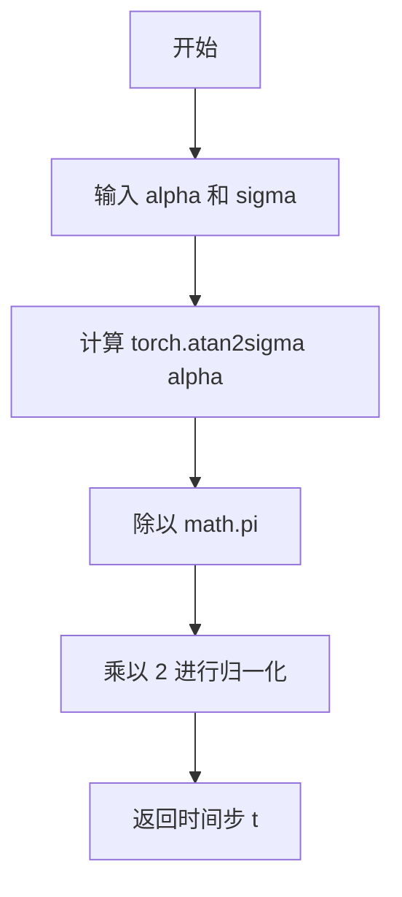
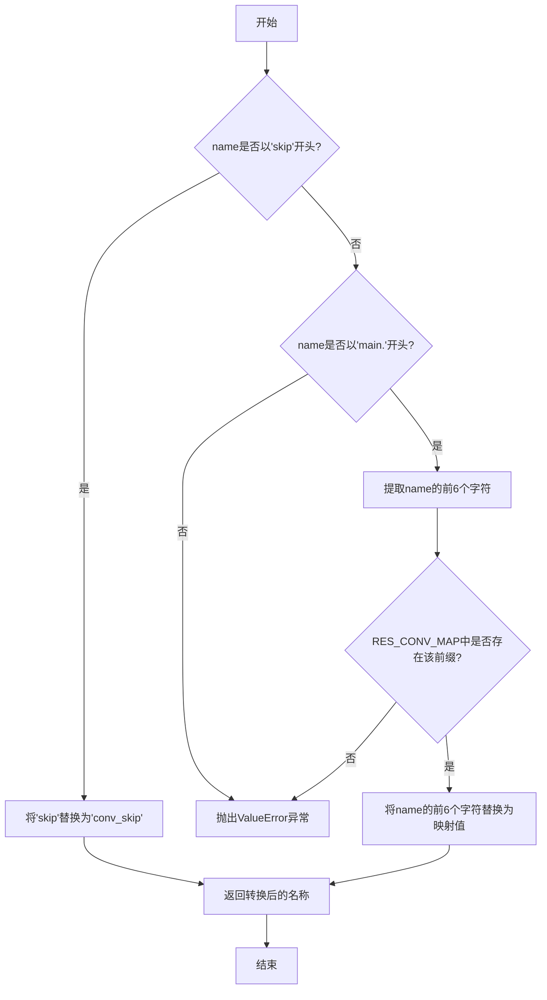
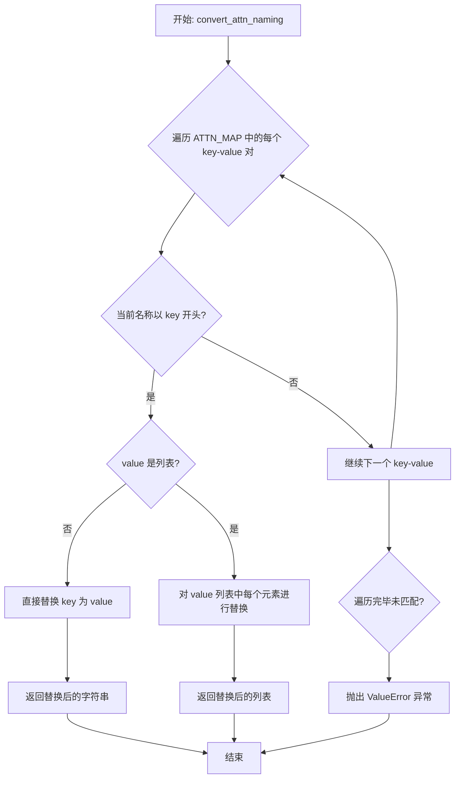
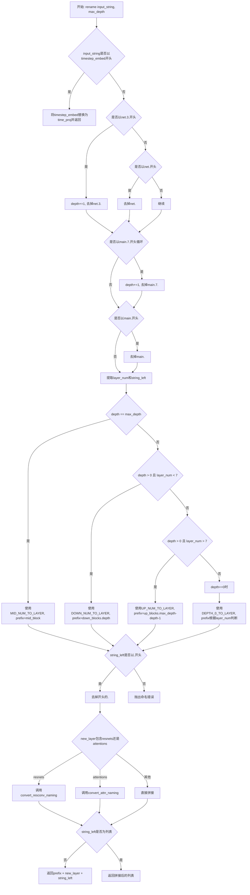
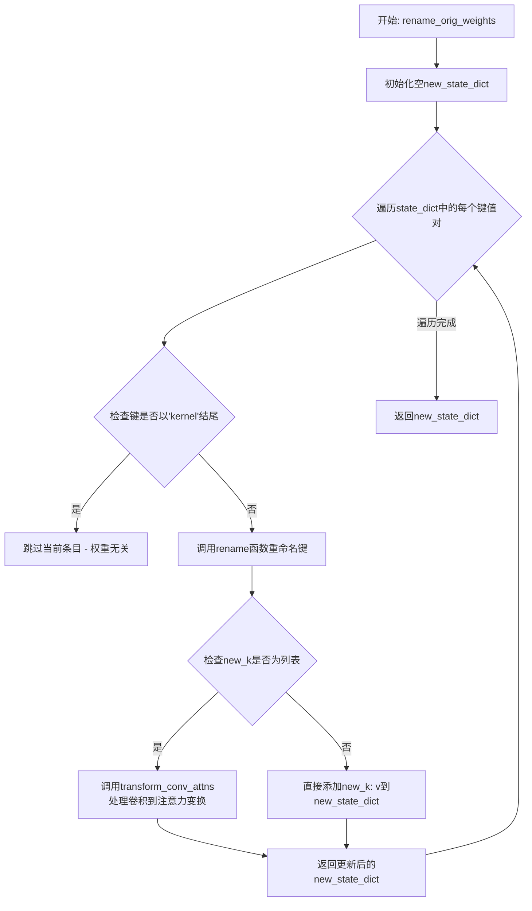
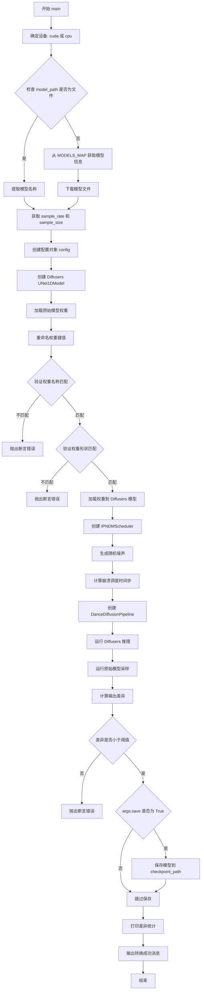

# `diffusers\scripts\convert_dance_diffusion_to_diffusers.py` 详细设计文档

这是一个模型转换工具脚本，用于将基于 audio_diffusion 库训练的非条件扩散模型（Dance Diffusion）权重转换为 Hugging Face diffusers 库格式（主要是 UNet1DModel）。它包含复杂的层名称映射、权重变换（尤其是针对注意力机制的卷积到线性权重转换），并通过在两个模型上执行推理并比对输出来验证转换的正确性。

## 整体流程

```mermaid
graph TD
    A[开始: 解析命令行参数] --> B{检查模型文件是否存在}
    B -- 否 --> C[download: 下载模型权重]
    B -- 是 --> D[获取模型配置: sample_rate, sample_size]
    C --> D
    D --> E[初始化 Diffusers 模型: UNet1DModel]
    F[初始化原始模型结构: DiffusionUncond] --> G[加载原始权重到 DiffusionUncond]
    G --> H[提取 EMA 权重: orig_model.diffusion_ema]
    H --> I[rename_orig_weights: 重命名权重键值]
    I --> J[校验: 键值集合差异与形状匹配]
    J --> K[加载权重到 Diffusers 模型]
    K --> L[初始化调度器: IPNDMScheduler]
    L --> M[创建管道: DanceDiffusionPipeline]
    M --> N[推理: 在 Diffusers 管道上生成音频]
    O[推理: 在原始模型上生成音频] --> P[比对输出: 计算差异 (diff_sum, diff_max)]
    N --> P
    P --> Q{差异是否小于阈值?}
    Q -- 是 --> R{是否需要保存?}
    Q -- 否 --> S[抛出断言错误: 转换失败]
    R -- 是 --> T[save_pretrained: 保存 Diffusers 模型]
    R -- 否 --> U[结束: 打印成功信息]
    T --> U
```

## 类结构

```
Global Scope
├── Object (空辅助类)
└── DiffusionUncond (nn.Module)
    └── Methods: __init__
```

## 全局变量及字段


### `MODELS_MAP`
    
包含预定义模型URL、采样率和样本大小的字典

类型：`dict`
    


### `DOWN_NUM_TO_LAYER`
    
下采样块层名称映射字典

类型：`dict`
    


### `UP_NUM_TO_LAYER`
    
上采样块层名称映射字典

类型：`dict`
    


### `MID_NUM_TO_LAYER`
    
中间块层名称映射字典

类型：`dict`
    


### `DEPTH_0_TO_LAYER`
    
初始深度层名称映射字典

类型：`dict`
    


### `RES_CONV_MAP`
    
ResNet 卷积块名称映射字典

类型：`dict`
    


### `ATTN_MAP`
    
注意力层名称映射字典

类型：`dict`
    


### `DiffusionUncond.diffusion`
    
核心扩散模型结构

类型：`DiffusionAttnUnet1D`
    


### `DiffusionUncond.diffusion_ema`
    
指数移动平均权重副本

类型：`DiffusionAttnUnet1D`
    


### `DiffusionUncond.rng`
    
随机数生成器

类型：`torch.quasirandom.SobolEngine`
    
    

## 全局函数及方法


### `alpha_sigma_to_t`

该函数用于将噪声调度参数（alpha 和 sigma）转换为时间步（timestep）。在扩散模型中，alpha 表示清晰图像的缩放因子，sigma 表示噪声的缩放因子，函数通过计算 atan2(sigma, alpha) 并进行归一化得到对应的时间步值。

参数：

- `alpha`：`torch.Tensor`，清晰图像的缩放因子（scaling factor for the clean image）
- `sigma`：`torch.Tensor`，噪声的缩放因子（scaling factor for the noise）

返回值：`torch.Tensor`，归一化后的时间步值，范围通常在 [0, 1] 之间

#### 流程图



#### 带注释源码

```python
def alpha_sigma_to_t(alpha, sigma):
    """Returns a timestep, given the scaling factors for the clean image and for
    the noise."""
    # 使用 atan2 计算 sigma/alpha 的反正切值，得到角度信息
    # 然后除以 π 并乘以 2，将角度范围 [0, 2π] 映射到 [0, 2]
    # 这实际上是将被噪声污染的程度（sigma/alpha）转换为时间步
    return torch.atan2(sigma, alpha) / math.pi * 2
```


### `get_crash_schedule`

该函数是扩散模型推理管线中的一个关键组件，用于生成特定的“崩溃调度”（Crash Schedule）。它接收一个归一化的线性时间步张量，通过非线性变换（正弦平方函数）计算噪声缩放因子（sigma 和 alpha），最终将这些因子转换为扩散模型标准的时间步格式。这是一种非线性的时间步调度策略，通常用于实现特定的采样模式或加速收敛。

参数：

- `t`：`torch.Tensor`，输入的归一化时间步张量。通常由 `torch.linspace(1, 0, steps)` 生成，代表从去噪起始点（t=1）到终点（t=0）的线性分布。

返回值：`torch.Tensor`，返回经过 Crash Schedule 算法转换后的时间步张量。

#### 流程图

```mermaid
graph TD
    A[输入: 时间步 t] --> B{计算 sigma}
    B --> C[sigma = sin(t * π / 2)²]
    C --> D{计算 alpha}
    D --> E[alpha = (1 - sigma²)⁰·⁵]
    E --> F[调用 alpha_sigma_to_t]
    F --> G[返回时间步]
```

#### 带注释源码

```python
def get_crash_schedule(t):
    """生成崩溃调度（Crash schedule）的时间步列表。

    该函数将标准的线性时间步 t 转换为 Crash Schedule。
    Crash Schedule 通过 sin² 函数重映射时间步，使得扩散过程在特定区间
    拥有更密集或更稀疏的采样点，从而实现特定的采样效果。

    Args:
        t (torch.Tensor): 输入的时间步张量，通常范围在 [0, 1]。

    Returns:
        torch.Tensor: 转换后的时间步张量。
    """
    # 第一步：计算噪声水平 sigma
    # 使用 sin(t * π/2) 的平方，将输入 t 从 [0,1] 映射到 [0,1]
    # 当 t=1 时，sigma=1（完全噪声）；当 t=0 时，sigma=0（完全清晰）
    sigma = torch.sin(t * math.pi / 2) ** 2

    # 第二步：计算信号水平 alpha
    # 根据三角恒等式 alpha^2 + sigma^2 = 1 计算 alpha
    # 确保 alpha 和 sigma 之和平方根为1（单位圆上的点）
    alpha = (1 - sigma**2) ** 0.5

    # 第三步：转换为标准时间步格式
    # 使用 atan2 算子将 (alpha, sigma) 坐标转换为角度，再归一化到 [0, 1] 范围
    # 这是一个双射映射，保证了调度的可逆性和平滑性
    return alpha_sigma_to_t(alpha, sigma)
```


### `download`

该函数根据提供的模型名称从预定义的模型映射表中获取对应的下载 URL，然后使用 HTTP GET 请求以流式方式下载模型权重文件，并将其保存为本地 `.ckpt` 文件，最后返回本地文件路径。

参数：

- `model_name`：`str`，模型名称，用于从 `MODELS_MAP` 中查找对应的下载 URL

返回值：`str`，下载到本地的模型权重文件路径

#### 流程图

```mermaid
graph TD
    A[开始] --> B[根据 model_name 从 MODELS_MAP 获取 URL]
    B --> C[发起 HTTP GET 请求 stream=True, timeout=DIFFUSERS_REQUEST_TIMEOUT]
    C --> D[构建本地文件名 {model_name}.ckpt]
    D --> E[以二进制写入模式打开文件]
    E --> F[迭代请求内容的分块 chunk_size=8192]
    F --> G[将每个 chunk 写入文件]
    G --> H{是否还有数据}
    H -->|是| F
    H -->|否| I[关闭文件]
    I --> J[返回本地文件路径]
    J --> K[结束]
```

#### 带注释源码

```python
def download(model_name):
    """从预定义URL下载模型权重文件到本地
    
    Args:
        model_name: str, 模型名称，用于从MODELS_MAP中查找对应的模型配置
        
    Returns:
        str: 下载到本地的模型权重文件路径
    """
    # 根据模型名称从模型映射表中获取对应的下载URL
    url = MODELS_MAP[model_name]["url"]
    
    # 发起HTTP GET请求，使用流式下载以处理大文件
    # timeout参数确保请求不会无限等待
    r = requests.get(url, stream=True, timeout=DIFFUSERS_REQUEST_TIMEOUT)
    
    # 构建本地保存的文件名，格式为 ./{model_name}.ckpt
    local_filename = f"./{model_name}.ckpt"
    
    # 以二进制写入模式打开文件
    with open(local_filename, "wb") as fp:
        # 迭代请求内容的分块，每块8192字节
        # 流式写入可以避免一次性加载大文件到内存
        for chunk in r.iter_content(chunk_size=8192):
            # 将每个分块写入文件
            fp.write(chunk)
    
    # 返回本地文件路径，供调用者使用
    return local_filename
```


### `convert_resconv_naming(name)`

该函数用于将原始模型的 ResNet 卷积块参数名称转换为 Diffusers 库中对应的命名规则，主要处理 `skip` 和 `main.{digit}` 两种前缀的映射转换。

参数：

- `name`：`str`，需要转换的原始模型参数名称

返回值：`str`，转换后的 Diffusers 风格参数名称

#### 流程图



#### 带注释源码

```python
def convert_resconv_naming(name):
    """
    转换 ResNet 卷积块的命名规则。
    
    该函数将原始模型中的 ResNet 卷积块参数名称转换为 Diffusers 库中
    对应的命名规则。主要处理两种情况：
    1. skip 开头的层 -> conv_skip
    2. main.{digit} 格式的层 -> 对应的 conv_1, group_norm_1, conv_2, group_norm_2
    
    参数:
        name: str, 原始模型中的参数名称
        
    返回值:
        str, 转换后的 Diffusers 风格参数名称
        
    异常:
        ValueError: 当名称不以 'skip' 或 'main.' 开头时抛出
    """
    
    # 检查是否以 'skip' 开头，如果是则替换为 'conv_skip'
    # 例如: 'skip.conv' -> 'conv_skip.conv'
    if name.startswith("skip"):
        return name.replace("skip", RES_CONV_MAP["skip"])

    # 验证名称必须以 'main.' 开头
    # 这是 ResConvBlock 的标准格式
    if not name.startswith("main."):
        raise ValueError(f"ResConvBlock error with {name}")

    # 提取前6个字符用于映射查找
    # 例如: 'main.0' 的前6个字符就是 'main.0'
    prefix = name[:6]
    
    # 使用 RES_CONV_MAP 将前缀替换为对应的新名称
    # main.0 -> conv_1
    # main.1 -> group_norm_1
    # main.3 -> conv_2
    # main.4 -> group_norm_2
    return name.replace(prefix, RES_CONV_MAP[prefix])
```

---

#### 依赖的全局变量

| 变量名称 | 类型 | 描述 |
|---------|------|------|
| `RES_CONV_MAP` | `dict` | ResNet 卷积块名称映射字典，将原始前缀映射到 Diffusers 风格名称 |

#### 关联函数

- `rename(input_string, max_depth=13)`：主命名转换函数，内部调用 `convert_resconv_naming` 处理 ResNet 层的名称转换


### `convert_attn_naming`

该函数用于将注意力层（Attention Layer）的命名规则进行转换，特别是在处理 qkv（query-key-value）拆分时，能够将原始命名映射到新的目标命名规范，支持单个映射和列表映射两种模式。

参数：

-  `name`：`str`，需要转换的注意力层名称

返回值：`str` 或 `list`，转换后的新名称；如果映射值为列表，则返回包含多个转换后名称的列表；若未找到匹配的映射规则，则抛出 `ValueError` 异常。

#### 流程图



#### 带注释源码

```python
# 定义注意力层命名映射表
# key: 原始名称前缀
# value: 目标名称（可以是字符串或列表）
ATTN_MAP = {
    "norm": "group_norm",                    # norm -> group_norm 单个映射
    "qkv_proj": ["query", "key", "value"],  # qkv_proj 拆分为三个独立映射
    "out_proj": ["proj_attn"],               # out_proj -> proj_attn 列表映射
}


def convert_attn_naming(name):
    """
    转换注意力层的命名规则（如 qkv 拆分）
    
    参数:
        name: 需要转换的注意力层名称
    
    返回:
        转换后的新名称（字符串或列表）
    
    异常:
        ValueError: 当名称不匹配任何映射规则时抛出
    """
    # 遍历注意力层映射表中的每个键值对
    for key, value in ATTN_MAP.items():
        # 检查输入名称是否以当前 key 开头
        if name.startswith(key):
            # 如果对应的 value 不是列表，直接进行单值替换
            if not isinstance(value, list):
                # 将名称中的 key 替换为 value 并返回
                return name.replace(key, value)
            # 如果对应的 value 是列表，返回多个替换后的名称
            elif name.startswith(key):
                # 对列表中的每个元素进行替换，返回替换后的列表
                return [name.replace(key, v) for v in value]
    
    # 遍历完所有映射规则仍未匹配，抛出异常
    raise ValueError(f"Attn error with {name}")
```


### `rename`

该函数是权重名称转换的核心逻辑，负责将原始Dance Diffusion模型的权重名称转换为Diffusers库兼容的UNet1DModel权重名称。它通过解析输入字符串的层级、前缀和层号，映射到新的层结构（如down_blocks、up_blocks、mid_block），并处理ResNet和Attention模块的命名转换，最终输出符合Diffusers模型结构的新权重名称。

参数：

- `input_string`：`str`，原始模型的权重名称（如"net.3.main.1.conv_1.weight"）
- `max_depth`：`int`，最大深度值，默认为13，用于判断中间块的层级

返回值：`Union[str, List[str]]`，转换后的新权重名称，如果是注意力层则返回包含query、key、value的列表

#### 关联的全局变量

| 名称 | 类型 | 描述 |
|------|------|------|
| `DOWN_NUM_TO_LAYER` | `Dict[str, str]` | 下采样块编号到层名称的映射 |
| `UP_NUM_TO_LAYER` | `Dict[str, str]` | 上采样块编号到层名称的映射 |
| `MID_NUM_TO_LAYER` | `Dict[str, str]` | 中间块编号到层名称的映射 |
| `DEPTH_0_TO_LAYER` | `Dict[str, str]` | 深度0时层名称的映射 |
| `RES_CONV_MAP` | `Dict[str, str]` | ResNet卷积层名称映射 |
| `ATTN_MAP` | `Dict[str, str]` | Attention层名称映射 |
| `convert_resconv_naming` | `function` | ResConv块命名转换函数 |
| `convert_attn_naming` | `function` | Attention块命名转换函数 |

#### 流程图



#### 带注释源码

```python
def rename(input_string, max_depth=13):
    """将原始模型的权重名称转换为Diffusers兼容的UNet1DModel权重名称
    
    参数:
        input_string: 原始模型权重名称字符串
        max_depth: 最大深度值，默认13，用于判断是否为中间块
    
    返回:
        转换后的新权重名称字符串或列表
    """
    string = input_string

    # 特殊处理时间嵌入层命名
    if string.split(".")[0] == "timestep_embed":
        return string.replace("timestep_embed", "time_proj")

    depth = 0
    # 处理net.3.前缀（中间下采样块）
    if string.startswith("net.3."):
        depth += 1
        string = string[6:]  # 去掉"net.3."
    elif string.startswith("net."):
        string = string[4:]  # 去掉"net."

    # 处理main.7.循环（中间上采样块）
    while string.startswith("main.7."):
        depth += 1
        string = string[7:]  # 去掉"main.7."

    # 处理main.前缀（主网络层）
    if string.startswith("main."):
        string = string[5:]  # 去掉"main."

    # 提取层编号和剩余字符串
    # mid block: 前两位是数字
    if string[:2].isdigit():
        layer_num = string[:2]      # 取前两位作为层编号
        string_left = string[2:]    # 剩余部分
    else:
        layer_num = string[0]       # 取第一位作为层编号
        string_left = string[1:]    # 剩余部分

    # 根据深度和层编号确定新层名称和前缀
    if depth == max_depth:
        # 中间块
        new_layer = MID_NUM_TO_LAYER[layer_num]
        prefix = "mid_block"
    elif depth > 0 and int(layer_num) < 7:
        # 下采样块
        new_layer = DOWN_NUM_TO_LAYER[layer_num]
        prefix = f"down_blocks.{depth}"
    elif depth > 0 and int(layer_num) > 7:
        # 上采样块
        new_layer = UP_NUM_TO_LAYER[layer_num]
        prefix = f"up_blocks.{max_depth - depth - 1}"
    elif depth == 0:
        # 顶层块
        new_layer = DEPTH_0_TO_LAYER[layer_num]
        prefix = f"up_blocks.{max_depth - 1}" if int(layer_num) > 3 else "down_blocks.0"

    # 验证string_left格式
    if not string_left.startswith("."):
        raise ValueError(f"Naming error with {input_string} and string_left: {string_left}.")

    string_left = string_left[1:]  # 去掉开头的"."

    # 根据层类型进行命名转换
    if "resnets" in new_layer:
        # ResNet卷积层转换
        string_left = convert_resconv_naming(string_left)
    elif "attentions" in new_layer:
        # Attention层转换（可能返回多个名称）
        new_string_left = convert_attn_naming(string_left)
        string_left = new_string_left

    # 组合最终的新名称
    if not isinstance(string_left, list):
        new_string = prefix + "." + new_layer + "." + string_left
    else:
        # 对于qkv投影，返回三个名称的列表
        new_string = [prefix + "." + new_layer + "." + s for s in string_left]
    return new_string
```

#### 关键组件信息

| 组件名称 | 描述 |
|----------|------|
| 层编号映射 | 通过`MID_NUM_TO_LAYER`、`DOWN_NUM_TO_LAYER`、`UP_NUM_TO_LAYER`、`DEPTH_0_TO_LAYER`四个字典，将原始数字编号映射到Diffusers的层结构 |
| ResConv转换 | `convert_resconv_naming`函数将ResNet块的"main.X"格式转换为"conv_1"、"group_norm_1"等格式 |
| Attention转换 | `convert_attn_naming`函数将"qkv_proj"展开为["query", "key", "value"]三个权重，"out_proj"转换为"proj_attn" |
| 前缀生成 | 根据深度和层编号生成"down_blocks.X"、"up_blocks.X"或"mid_block"前缀 |

#### 技术债务与优化空间

1. **魔法数字和硬编码**: 代码中多处使用硬编码的数字（如6、7、4、5等）进行字符串切片，缺乏常量定义，可读性较差
2. **重复的映射字典**: `DOWN_NUM_TO_LAYER`、`UP_NUM_TO_LAYER`、`MID_NUM_TO_LAYER`结构相似但分开定义，可考虑重构为统一的映射逻辑
3. **错误处理不足**: 当输入的layer_num不在映射字典中时会抛出KeyError，缺少更友好的错误提示
4. **max_depth参数**: 默认值13与实际的模型结构深度耦合，如果模型结构变化可能需要同步修改
5. **单元测试缺失**: 该核心转换函数缺少独立的单元测试，依赖于main函数中的集成验证

#### 其它项目

- **设计目标**: 将Dance Diffusion原始模型的权重state_dict转换为Diffusers库的UNet1DModel兼容格式，以便使用Diffusers pipeline进行推理
- **约束条件**: 输入的权重名称必须符合原始模型的命名规范，输出必须匹配Diffusers模型的结构
- **错误处理**: 当遇到无法识别的命名模式时抛出`ValueError`，包含原始输入和当前位置信息便于调试
- **数据流**: 输入是原始模型的权重名称字符串，输出是转换后的Diffusers兼容名称，最终用于state_dict的键名重映射


### `rename_orig_weights(state_dict)`

该函数是模型权重转换流程中的核心环节，负责将原始Diffusion模型的state_dict中的权重键名按照预定义的映射规则进行重命名，以便与Diffusers库中的UNet1DModel架构兼容，同时处理卷积层到注意力层权重的特殊变换。

参数：

- `state_dict`：`Dict[str, torch.Tensor]`，原始模型的权重字典，键为层级名称，值为对应的张量参数

返回值：`Dict[str, torch.Tensor]`，重命名后的新权重字典，键已转换为Diffusers兼容的命名格式

#### 流程图



#### 带注释源码

```python
def rename_orig_weights(state_dict):
    """遍历状态字典并应用重命名规则
    
    该函数将原始Diffusion模型的权重字典转换为Diffusers兼容的格式。
    主要处理两种情况：
    1. 常规层级重命名：通过rename函数将旧命名映射到新命名
    2. 卷积到注意力变换：对于注意力层，需要将卷积权重拆分为query、key、value
    
    参数:
        state_dict: 原始模型的权重字典
        
    返回:
        重命名后的新权重字典
    """
    new_state_dict = {}  # 初始化新的状态字典，用于存储重命名后的权重
    
    # 遍历原始状态字典中的所有键值对
    for k, v in state_dict.items():
        # 跳过以'kernel'结尾的键，这些是上采样和下采样层的权重
        # 在原始模型中这些层没有可训练权重
        if k.endswith("kernel"):
            # up- and downsample layers, don't have trainable weights
            continue

        # 调用rename函数将旧键名转换为新键名
        new_k = rename(k)

        # 检查是否需要将卷积权重转换为注意力机制的权重
        # 当new_k是列表时，表示该层是注意力层，需要拆分为query、key、value
        if isinstance(new_k, list):
            # 调用transform_conv_attns处理权重变换
            new_state_dict = transform_conv_attns(new_state_dict, new_k, v)
        else:
            # 常规层级，直接添加到新字典
            new_state_dict[new_k] = v

    # 返回重命名后的新状态字典
    return new_state_dict
```

#### 相关上下文信息

**依赖的全局函数：**

| 函数名 | 功能描述 |
|--------|----------|
| `rename(input_string, max_depth=13)` | 将原始模型层级名称转换为Diffusers兼容的命名格式，处理深度、层级类型等映射 |
| `transform_conv_attns(new_state_dict, new_k, v)` | 将卷积权重拆分为注意力机制的query、key、value三个独立权重 |

**全局变量映射表：**

| 变量名 | 类型 | 描述 |
|--------|------|------|
| `DOWN_NUM_TO_LAYER` | Dict[str, str] | 下采样块层级编号到层级名称的映射 |
| `UP_NUM_TO_LAYER` | Dict[str, str] | 上采样块层级编号到层级名称的映射 |
| `MID_NUM_TO_LAYER` | Dict[str, str] | 中间块层级编号到层级名称的映射 |
| `DEPTH_0_TO_LAYER` | Dict[str, str] | 深度0层级编号到层级名称的映射 |
| `RES_CONV_MAP` | Dict[str, str] | ResNet卷积块命名映射 |
| `ATTN_MAP` | Dict[str, list] | 注意力层命名映射，定义如何拆分qkv |

#### 关键设计决策

1. **kernel过滤策略**：原始模型中的upsample和downsample层使用可训练的kernel权重，但在转换目标架构中这些层不包含可训练权重，因此直接跳过

2. **列表式返回**：当`rename`函数返回列表时，表示遇到注意力层，需要将单个卷积权重拆分为多个线性层的权重（query、key、value）

3. **原地修改**：通过`transform_conv_attns`函数直接修改传入的`new_state_dict`字典，而非创建新副本

#### 潜在优化空间

1. **批量处理优化**：当前逐个键处理，可考虑批量重命名操作以提高效率
2. **缓存机制**：对于重复出现的键前缀，可引入缓存避免重复计算
3. **错误处理增强**：当前仅跳过kernel，可增加更详细的验证和错误报告


### `transform_conv_attns`

将卷积注意力权重拆分为 Q、K、V 线性权重。该函数处理从原始模型到 Diffusers 模型的权重转换，特别是将卷积注意力层的权重转换为线性层权重（Q、K、V 三个投影矩阵）。

参数：

- `new_state_dict`：`dict`，目标状态字典，用于存储转换后的权重
- `new_k`：`list` 或 `str`，权重的新名称。如果是列表，通常包含三个元素 `['query', 'key', 'value']`；如果是字符串，则为单个权重名称
- `v`：`torch.Tensor`，原始卷积注意力层的权重张量

返回值：`dict`，返回更新后的状态字典

#### 流程图

```mermaid
flowchart TD
    A[开始: transform_conv_attns] --> B{len(new_k) == 1?}
    B -->|是| C{len v.shape == 3?}
    B -->|否| D[处理 QKV 矩阵]
    C -->|是| E[权重: v[:, :, 0]]
    C -->|否| F[偏置: 保持不变]
    E --> G[new_state_dict[new_k[0]] = 转换后的权重]
    F --> G
    D --> H[trippled_shape = v.shape[0]<br/>single_shape = trippled_shape // 3]
    H --> I[遍历 i in range(3)]
    I --> J{len v.shape == 3?}
    J -->|是| K[new_state_dict[new_k[i]] = v[i*single_shape:(i+1)*single_shape, :, 0]]
    J -->|否| L[new_state_dict[new_k[i]] = v[i*single_shape:(i+1)*single_shape]]
    K --> M{i < 2?}
    L --> M
    M -->|是| I
    M -->|否| N[返回 new_state_dict]
    G --> N
    
    style A fill:#f9f,stroke:#333
    style N fill:#9f9,stroke:#333
```

#### 带注释源码

```python
def transform_conv_attns(new_state_dict, new_k, v):
    """
    将卷积注意力权重转换为线性权重（Q、K、V 投影）
    
    参数:
        new_state_dict: 存储转换后权重的字典
        new_k: 权重名称，单个字符串或包含3个元素的列表['query', 'key', 'value']
        v: 原始卷积权重张量
    
    返回:
        更新后的 new_state_dict
    """
    
    # 判断是单个权重还是 QKV 三个权重
    if len(new_k) == 1:
        # === 处理单个权重（可能是 weight 或 bias）===
        
        if len(v.shape) == 3:
            # 权重 (weight): 形状为 [out_channels, in_channels, kernel_size]
            # 取第一个 kernel 的权重，并转换为线性权重格式
            # 转换: [out, in, 1] -> [out, in]
            new_state_dict[new_k[0]] = v[:, :, 0]
        else:
            # 偏置 (bias): 形状为 [out_channels] 或标量
            # 保持不变
            new_state_dict[new_k[0]] = v
    else:
        # === 处理 QKV 矩阵（需要拆分）===
        
        # 获取总通道数（应该是 3 * 单个矩阵的通道数）
        trippled_shape = v.shape[0]
        # 计算单个矩阵的通道数
        single_shape = trippled_shape // 3
        
        # 遍历三个矩阵：query, key, value
        for i in range(3):
            if len(v.shape) == 3:
                # 权重: 按通道维度拆分，并取第一个 kernel
                # v 形状: [3*out, in, 1] -> 拆分后: [out, in, 1] -> [out, in]
                new_state_dict[new_k[i]] = v[i * single_shape : (i + 1) * single_shape, :, 0]
            else:
                # 偏置: 按通道维度拆分
                # v 形状: [3*out] -> 拆分后: [out]
                new_state_dict[new_k[i]] = v[i * single_shape : (i + 1) * single_shape]
    
    return new_state_dict
```

#### 关键设计说明

1. **卷积到线性的转换**：原始模型的注意力层使用卷积权重 `shape=[out, in, 1]`，需要转换为线性权重 `shape=[out, in]`，通过取第一个 kernel（即索引 0）实现

2. **QKV 拆分**：原始模型将 Q、K、V 三个投影矩阵 concatenated 在一起存储，转换时需要按通道维度均匀拆分为三个独立权重

3. **权重 vs 偏置判断**：通过 `len(v.shape)` 判断——3维为权重，1-2维为偏置


### `main(args)`

主函数，协调下载、转换、验证和保存流程。它负责将原始的 Dance Diffusion 模型权重转换为 Hugging Face Diffusers 格式，并验证转换的正确性。

参数：

- `args`：包含命令行参数的命名空间对象，包含以下属性：
  - `model_path`：`str`，输入模型的路径或官方模型名称
  - `save`：`bool`，是否保存转换后的模型（默认 True）
  - `checkpoint_path`：`str`，输出模型的保存路径

返回值：`None`，无返回值

#### 流程图



#### 带注释源码

```python
def main(args):
    """
    主函数：协调下载、转换、验证和保存流程
    
    参数:
        args: 包含以下属性的命名空间对象:
            - model_path: 输入模型路径或官方模型名称
            - save: 是否保存转换后的模型
            - checkpoint_path: 输出模型保存路径
    """
    
    # 步骤1: 确定计算设备（优先使用 GPU）
    device = torch.device("cuda" if torch.cuda.is_available() else "cpu")

    # 步骤2: 从文件路径中提取模型名称
    # 例如: "./gwf-440k.ckpt" -> "gwf-440k"
    model_name = args.model_path.split("/")[-1].split(".")[0]
    
    # 步骤3: 检查模型文件是否存在，不存在则下载
    if not os.path.isfile(args.model_path):
        # 验证模型名称是否在官方模型列表中
        assert model_name == args.model_path, (
            f"Make sure to provide one of the official model names {MODELS_MAP.keys()}"
        )
        # 下载模型到本地
        args.model_path = download(model_name)

    # 步骤4: 从模型映射表中获取采样率和样本大小
    sample_rate = MODELS_MAP[model_name]["sample_rate"]
    sample_size = MODELS_MAP[model_name]["sample_size"]

    # 步骤5: 创建配置对象存储模型参数
    config = Object()
    config.sample_size = sample_size      # 音频样本大小
    config.sample_rate = sample_rate       # 音频采样率
    config.latent_dim = 0                  # 潜在空间维度（无条件生成）

    # 步骤6: 创建 Diffusers 格式的 UNet1DModel（作为目标结构模板）
    diffusers_model = UNet1DModel(sample_size=sample_size, sample_rate=sample_rate)
    # 获取 Diffusers 模型的初始状态字典
    diffusers_state_dict = diffusers_model.state_dict()

    # 步骤7: 加载原始模型（Dance Diffusion 格式）
    orig_model = DiffusionUncond(config)
    # 从检查点文件加载状态字典
    orig_model.load_state_dict(torch.load(args.model_path, map_location=device)["state_dict"])
    # 使用 EMA（指数移动平均）版本的模型
    orig_model = orig_model.diffusion_ema.eval()
    # 获取原始模型的状态字典
    orig_model_state_dict = orig_model.state_dict()
    
    # 步骤8: 将原始模型权重键名转换为 Diffusers 格式
    renamed_state_dict = rename_orig_weights(orig_model_state_dict)

    # 步骤9: 验证权重键名转换的正确性
    # 计算两侧独有的键名
    renamed_minus_diffusers = set(renamed_state_dict.keys()) - set(diffusers_state_dict.keys())
    diffusers_minus_renamed = set(diffusers_state_dict.keys()) - set(renamed_state_dict.keys())

    # 确保没有多余的键名（除了下采样层的 kernel）
    assert len(renamed_minus_diffusers) == 0, f"Problem with {renamed_minus_diffusers}"
    # 确保 Diffusers 独有的键都是 kernel（无需训练的权重）
    assert all(k.endswith("kernel") for k in list(diffusers_minus_renamed)), f"Problem with {diffusers_minus_renamed}"

    # 步骤10: 验证并复制权重到 Diffusers 模型
    for key, value in renamed_state_dict.items():
        # 验证形状匹配
        assert diffusers_state_dict[key].squeeze().shape == value.squeeze().shape, (
            f"Shape for {key} doesn't match. Diffusers: {diffusers_state_dict[key].shape} vs. {value.shape}"
        )
        # 特殊处理 time_proj.weight（需要移除多余的维度）
        if key == "time_proj.weight":
            value = value.squeeze()

        # 复制权重值
        diffusers_state_dict[key] = value

    # 步骤11: 加载转换后的权重到 Diffusers 模型
    diffusers_model.load_state_dict(diffusers_state_dict)

    # 步骤12: 设置采样参数
    steps = 100      # 推理步数
    seed = 33        # 随机种子（用于复现性）

    # 步骤13: 创建调度器
    diffusers_scheduler = IPNDMScheduler(num_train_timesteps=steps)

    # 步骤14: 生成输入噪声
    generator = torch.manual_seed(seed)
    noise = torch.randn([1, 2, config.sample_size], generator=generator).to(device)

    # 步骤15: 计算崩溃调度时间步（Crash Schedule）
    t = torch.linspace(1, 0, steps + 1, device=device)[:-1]
    step_list = get_crash_schedule(t)

    # 步骤16: 创建 Diffusers Pipeline
    pipe = DanceDiffusionPipeline(unet=diffusers_model, scheduler=diffusers_scheduler)

    # 步骤17: 运行 Diffusers 推理
    generator = torch.manual_seed(33)
    audio = pipe(num_inference_steps=steps, generator=generator).audios

    # 步骤18: 运行原始模型采样（使用 IPLMS 方法）
    generated = sampling.iplms_sample(orig_model, noise, step_list, {})
    # 限制输出范围到 [-1, 1]
    generated = generated.clamp(-1, 1)

    # 步骤19: 计算两个模型输出的差异
    diff_sum = (generated - audio).abs().sum()   # 总差异
    diff_max = (generated - audio).abs().max()   # 最大差异

    # 步骤20: 根据设置决定是否保存模型
    if args.save:
        pipe.save_pretrained(args.checkpoint_path)

    # 步骤21: 打印差异统计信息
    print("Diff sum", diff_sum)
    print("Diff max", diff_max)

    # 步骤22: 验证转换准确性（差异必须小于阈值）
    assert diff_max < 1e-3, f"Diff max: {diff_max} is too much :-/"

    # 步骤23: 输出成功消息
    print(f"Conversion for {model_name} successful!")
```


### `DiffusionUncond.__init__`

初始化 DiffusionUncond 模型结构，创建扩散模型的主网络（DiffusionAttnUnet1D）、EMA 副本以及伪随机 Sobol 序列生成器。

参数：

- `self`：`DiffusionUncond`，DiffusionUncond 类实例，隐式参数
- `global_args`：任意类型（通常为包含 sample_size、sample_rate、latent_dim 等属性的配置对象），全局配置参数，用于初始化扩散模型的超参数

返回值：无

#### 流程图

```mermaid
flowchart TD
    A[开始 __init__] --> B[调用 super().__init__ 初始化 nn.Module]
    B --> C[创建 DiffusionAttnUnet1D 模型实例: self.diffusion]
    C --> D[使用 deepcopy 复制模型: self.diffusion_ema]
    D --> E[创建 SobolEngine 随机数生成器: self.rng]
    E --> F[结束 __init__]
```

#### 带注释源码

```python
def __init__(self, global_args):
    super().__init__()  # 调用 nn.Module 的初始化方法，注册参数等
    
    # 创建主扩散模型，使用 DiffusionAttnUnet1D 架构
    # global_args 包含模型配置如 sample_size, sample_rate, latent_dim
    # n_attn_layers=4 指定使用 4 层注意力机制
    self.diffusion = DiffusionAttnUnet1D(global_args, n_attn_layers=4)
    
    # 创建模型的 EMA (指数移动平均) 副本，用于稳定训练
    self.diffusion_ema = deepcopy(self.diffusion)
    
    # 创建 Sobol 序列随机数生成器，用于扩散过程中的采样
    # SobolEngine(1, scramble=True) 生成准随机数序列
    self.rng = torch.quasirandom.SobolEngine(1, scramble=True)
```

## 关键组件


### MODELS_MAP

存储预训练Dance Diffusion模型的元数据，包含模型名称、权重下载URL、采样率和样本大小等信息。

### alpha_sigma_to_t 函数

将扩散过程中的alpha和sigma缩放因子转换为对应的时间步t，使用arctan2运算实现映射。

### get_crash_schedule 函数

根据输入的时间步t计算噪声调度表，返回对应的alpha和sigma值，用于控制扩散过程中的噪声添加。

### DiffusionUncond 类

核心扩散模型类，包含主扩散模型（DiffusionAttnUnet1D）和EMA版本，以及准随机数生成器，用于模型权重的加载和推理。

### download 函数

从预定义的URL下载模型权重文件，支持流式下载并保存到本地，返回本地文件路径。

### 命名转换映射（DOWN_NUM_TO_LAYER等）

将原始模型的层编号映射到Diffusers格式的层名称，包含下采样块、上采样块、中间块和深度相关的映射关系。

### convert_resconv_naming 函数

将ResConvBlock的原始命名转换为Diffusers格式，处理skip连接和主路径的卷积层命名转换。

### convert_attn_naming 函数

将注意力模块的原始命名转换为Diffusers格式，支持将qkv_proj拆分为query、key、value三个独立投影。

### rename 函数

综合性的权重名称转换函数，处理timestep_embed、下采样/上采样路径、中间块等不同部分的名命转换。

### rename_orig_weights 函数

遍历原始模型的状态字典，对每个权重名称进行转换，跳过卷积核权重，处理注意力模块的特殊转换。

### transform_conv_attns 函数

将卷积形式的注意力权重转换为分离的query、key、value和proj_attn权重，支持权重和偏差的转换。

### main 函数

主函数，协调整个模型转换流程：加载原始模型、转换为Diffusers格式、验证权重匹配、执行推理对比、保存转换后的模型。

### IPNDMScheduler

Hugging Face Diffusers的调度器实现，用于扩散模型的推理过程中的噪声调度。

### DanceDiffusionPipeline

Hugging Face Diffusers的管道封装，简化了音频扩散模型的推理过程。

### iplms_sample 函数

来自diffusion库的IPLMS采样实现，用于执行原始模型的采样推理。

### 命令行参数

包含model_path（输入模型路径）、save（是否保存）、checkpoint_path（输出路径）等配置参数。


## 问题及建议


### 已知问题

- **魔法数字和硬编码值**：代码中存在多个硬编码的值（如 `steps = 100`、`seed = 33`、`chunk_size=8192`），这些值应该作为配置参数或常量提取出来，提高可维护性。
- **缺少类型注解**：整个代码库中没有任何函数参数或返回值的类型注解，这降低了代码的可读性和可维护性，也阻碍了静态分析工具的使用。
- **未使用的导入**：`os` 模块被导入但未在代码中使用。
- **使用 assert 进行运行时验证**：在 `main` 函数中大量使用 `assert` 语句进行状态检查和错误处理，这在 Python 中可以通过 `-O` 标志被跳过，导致验证逻辑失效。应该使用显式的异常处理。
- **缺乏日志记录**：使用 `print` 语句进行输出，而不是使用 Python 的 `logging` 模块，不利于生产环境下的调试和监控。
- **下载文件管理不规范**：`download` 函数将文件下载到当前目录（`f"./{model_name}.ckpt"`），可能导致当前目录混乱，且没有清理机制。文件名也没有使用临时文件的安全方式。
- **模型下载缺少错误处理**：`requests.get` 没有检查 HTTP 响应状态码，没有重试机制，网络超时设置也不够完善（仅依赖全局超时）。
- **设备管理硬编码**：`device = torch.device("cuda" if torch.cuda.is_available() else "cpu")` 没有考虑多 GPU 场景或指定设备的需求。
- **命名转换逻辑脆弱且复杂**：`rename` 函数包含大量字符串操作和硬编码的映射字典（`DOWN_NUM_TO_LAYER`、`UP_NUM_TO_LAYER` 等），难以理解和维护，且容易在模型结构变化时出错。
- **缺失单元测试**：代码没有包含任何测试，无法保证转换逻辑的正确性，也无法在代码修改时快速发现回归问题。
- **全局变量和函数混合**：代码在模块级别定义了大量映射字典和工具函数，缺乏良好的封装。
- **变量命名不一致**：如 `diffusers_model` 和 `orig_model` 命名风格不统一，部分缩写（如 `cfg`、`t`）不够清晰。

### 优化建议

- **提取配置和常量**：将模型映射、超参数（步数、种子、块大小等）提取到独立的配置文件或配置类中。
- **添加类型注解**：为所有函数和方法添加完整的类型注解，使用 mypy 或 pyright 进行静态类型检查。
- **使用日志模块**：替换 `print` 语句为 `logging` 模块，支持不同的日志级别和格式配置。
- **改进错误处理**：使用 `try-except` 块替换 assert 验证，为网络请求添加重试逻辑和状态码检查，使用临时文件管理下载的文件。
- **重构命名转换逻辑**：将复杂的命名转换逻辑拆分为更小、更易测试的函数，或者考虑使用配置文件定义映射规则。
- **添加单元测试**：为关键转换函数（如 `rename`、`convert_resconv_naming`、`convert_attn_naming`）编写单元测试。
- **封装全局状态**：将全局映射字典封装到类中或使用配置对象，减少模块级别的可变状态。
- **改进设备管理**：添加命令行参数允许用户指定设备，或者实现更智能的设备选择逻辑。

## 其它


### 设计目标与约束

该代码的核心目标是将Dance Diffusion模型的检查点文件（.ckpt格式）转换为Hugging Face Diffusers格式，以便在Diffusers库中使用。主要约束包括：1）支持特定预定义模型集合（gwf-440k、jmann-small-190k等）；2）转换后的模型需要通过数值验证（diff_max < 1e-3）；3）模型参数映射需要处理命名转换和形状变换；4）仅支持无条件生成的Diffusion模型。

### 错误处理与异常设计

代码中的错误处理主要通过断言（assert）实现，包括：1）模型名称验证（必须为MODELS_MAP中的key或本地文件路径）；2）状态字典键名匹配检查（renamed_minus_diffusers和diffusers_minus_renamed）；3）参数形状一致性验证；4）转换精度验证（diff_max < 1e-3）。异常类型包括ValueError（命名转换错误）、FileNotFoundError（模型文件不存在）、AssertionError（验证失败）。建议增加更详细的错误信息和异常处理机制。

### 数据流与状态机

主要数据流：1）输入：模型检查点文件路径；2）加载原始模型并提取state_dict；3）通过rename_orig_weights进行权重名称转换和形状变换；4）创建目标UNet1DModel并替换权重；5）执行推理生成音频样本；6）对比原始模型和转换后模型的输出差异；7）可选保存转换后的模型。状态机转换：下载状态（可选）→加载状态→转换状态→验证状态→保存状态。

### 外部依赖与接口契约

主要依赖：1）torch（PyTorch核心库）；2）diffusers（Hugging Face Diffusers库）；3）audio_diffusion（提供DiffusionAttnUnet1D模型）；4）requests（模型下载）；5）diffusion.sampling（IPLMS采样器）。接口契约：命令行参数（--model_path、--save、--checkpoint_path）；MODELS_MAP配置字典定义可用的预训练模型及其URL、采样率和样本大小。

### 配置与参数说明

关键配置参数：1）MODELS_MAP：预定义模型元数据（URL、sample_rate、sample_size）；2）DOWN_NUM_TO_LAYER/UP_NUM_TO_LAYER/MID_NUM_TO_LAYER：UNet层级映射；3）RES_CONV_MAP/ATTN_NAP：残差卷积块和注意力层命名映射；4）转换参数：steps=100、seed=33；5）验证阈值：diff_max < 1e-3。

### 性能考虑

性能关键点：1）模型下载使用流式写入避免内存溢出；2）使用deepcopy复制EMA模型；3）CUDA设备自适应（优先使用GPU）；4）采样步数固定为100步。建议优化：1）支持批量转换；2）添加进度条；3）缓存下载的模型文件。

### 安全性考虑

安全风险：1）从远程URL下载模型文件（潜在的中间人攻击风险）；2）使用torch.load加载任意模型文件（建议添加模型完整性校验）；3）命令行参数未做充分验证。建议：1）添加模型哈希校验；2）验证下载文件的来源和完整性；3）对checkpoint_path做路径安全检查。

### 测试策略

现有测试通过对比原始模型和转换模型的输出来验证正确性。测试用例应包括：1）所有支持的模型转换；2）边界条件（模型文件不存在、网络超时）；3）不同硬件配置（CPU/GPU）；4）参数映射的完整性测试；5）数值精度验证。

### 部署要求

部署环境要求：1）Python 3.x；2）PyTorch支持CUDA；3）足够的磁盘空间存储模型文件（每个模型100MB-500MB）；4）网络访问权限以下载预训练模型。依赖安装：pip install torch diffusers audio-diffusion requests。

### 版本兼容性

版本依赖：1）diffusers库版本需支持UNet1DModel和DanceDiffusionPipeline；2）audio_diffusion版本需匹配DiffusionAttnUnet1D架构；3）PyTorch版本需支持SobolEngine和quasirandom。建议在requirements.txt中锁定具体版本号以确保兼容性。

    