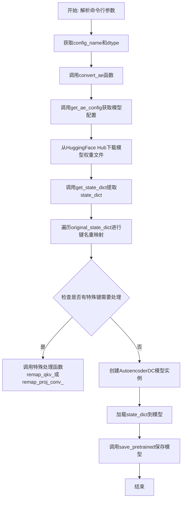
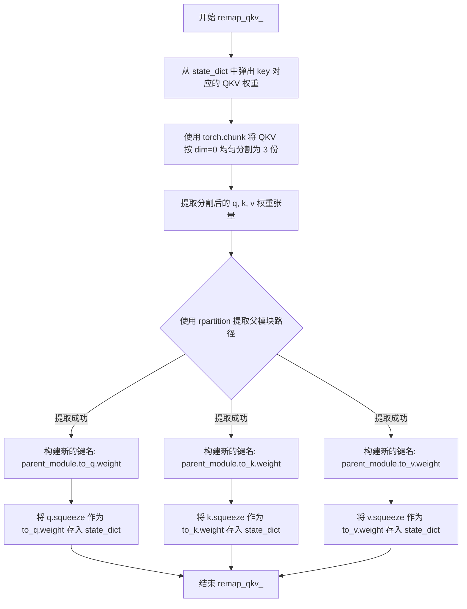
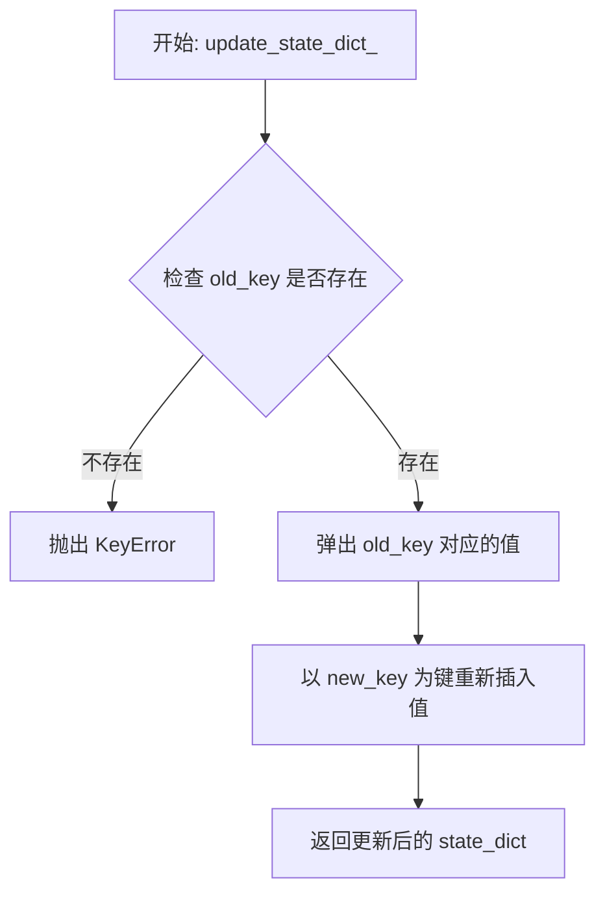
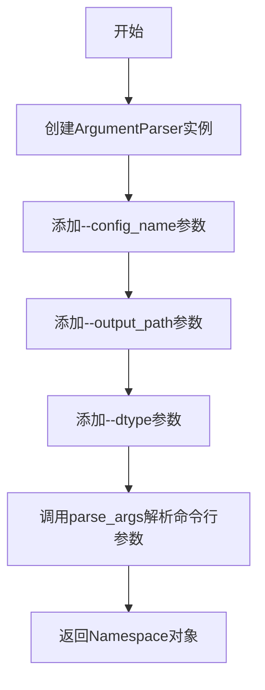

# `diffusers\scripts\convert_dcae_to_diffusers.py` 详细设计文档

该代码是一个模型转换工具，用于从HuggingFace Hub下载预训练的AutoencoderDC（DC-AE）模型权重，并将其键名重映射以兼容diffusers库的AutoencoderDC实现，最终将转换后的模型保存到指定路径。

## 整体流程



## 类结构

```
无类层次结构（函数式编程）
所有函数均为模块级函数
主要依赖: diffusers.AutoencoderDC, huggingface_hub.hf_hub_download, safetensors.torch
```

## 全局变量及字段


### `AE_KEYS_RENAME_DICT`
    
Maps original model checkpoint keys to new diffusers-compatible keys for autoencoder state dict renaming

类型：`Dict[str, str]`
    


### `AE_F32C32_KEYS`
    
Special key rename mappings for dc-ae-f32c32 model variants to handle encoder/decoder conv layers

类型：`Dict[str, str]`
    


### `AE_F64C128_KEYS`
    
Special key rename mappings for dc-ae-f64c128 model variants to handle encoder/decoder conv layers

类型：`Dict[str, str]`
    


### `AE_F128C512_KEYS`
    
Special key rename mappings for dc-ae-f128c512 model variants to handle encoder/decoder conv layers

类型：`Dict[str, str]`
    


### `AE_SPECIAL_KEYS_REMAP`
    
Maps special checkpoint keys (qkv/proj) to handler functions that perform complex state dict transformations in-place

类型：`Dict[str, Callable[[str, Dict[str, Any]], None]]`
    


### `DTYPE_MAPPING`
    
Maps string dtype names (fp32/fp16/bf16) to corresponding torch dtype objects

类型：`Dict[str, torch.dtype]`
    


### `VARIANT_MAPPING`
    
Maps string dtype names to model variant strings used when saving pretrained models

类型：`Dict[str, Optional[str]]`
    


    

## 全局函数及方法


### `remap_qkv_`

该函数是 Autoencoder DC 模型权重转换工具中的核心函数，用于将合并的 QKV（Query、Key、Value）权重张量拆分为独立的三个权重，并重新命名键名以适配目标模型结构。这是Diffusers格式模型与原始检查点之间权重映射的关键步骤。

参数：

- `key`：`str`，原始状态字典中 QKV 权重对应的键名，通常格式为 `{parent_module}.qkv.conv.weight`
- `state_dict`：`Dict[str, Any]`，包含模型权重的字典，通过引用传递，函数会直接修改该字典

返回值：`None`，该函数无返回值，直接修改传入的 `state_dict`

#### 流程图



#### 带注释源码

```python
def remap_qkv_(key: str, state_dict: Dict[str, Any]):
    """
    将合并的 QKV 权重拆分为独立的 Query、Key、Value 权重。
    
    原始检查点中 QKV 权重通常是按 [q; k; v] 顺序拼接的张量，
    需要拆分为三个独立的权重矩阵以适配目标模型结构。
    
    参数:
        key: 原始状态字典中 QKV 权重对应的键名
        state_dict: 模型权重字典，会被直接修改
    
    返回:
        无返回值，直接修改 state_dict
    """
    # 从 state_dict 中移除并获取 QKV 权重张量
    # pop 操作会同时删除原始键值对，避免后续重复处理
    qkv = state_dict.pop(key)
    
    # 使用 torch.chunk 将 QKV 张量在第0维（通道维度）均匀分割为3份
    # 假设原始格式为 [q; k; v]，每部分占原始张量长度的 1/3
    q, k, v = torch.chunk(qkv, 3, dim=0)
    
    # 从原始键名中提取父模块路径
    # 例如: "encoder.stages.0.blocks.0.qkv.conv.weight" 
    #      -> parent_module = "encoder.stages.0.blocks.0"
    parent_module, _, _ = key.rpartition(".qkv.conv.weight")
    
    # 将拆分后的 q, k, v 权重存回 state_dict，使用新的键名
    # 使用 squeeze() 移除批次维度（因为卷积权重通常是 [out_channels, in_channels, H, W]）
    # 转换后的键名格式: {parent_module}.to_q.weight 等
    state_dict[f"{parent_module}.to_q.weight"] = q.squeeze()
    state_dict[f"{parent_module}.to_k.weight"] = k.squeeze()
    state_dict[f"{parent_module}.to_v.weight"] = v.squeeze()
```


### `remap_proj_conv_`

该函数用于将自编码器（Autoencoder）模型权重中的投影层（proj）键名重新映射为标准格式。它从原始键名中提取父模块路径，将权重张量进行压缩（squeeze）操作后，以新键名 `to_out.weight` 存入状态字典，以适配 diffusers 库中 `AutoencoderDC` 模型的权重加载规范。

参数：

- `key`：`str`，原始权重键名，格式类似 `{parent_module}.proj.conv.weight`
- `state_dict`：`Dict[str, Any]`，模型权重状态字典，用于存储和更新键值对

返回值：`None`，该函数直接修改传入的 `state_dict` 字典，属于原地（in-place）操作

#### 流程图

```mermaid
flowchart TD
    A[开始: remap_proj_conv_] --> B[接收参数 key 和 state_dict]
    B --> C{使用 rpartition 分割 key}
    C --> D[提取 parent_module 路径]
    D --> E{从 state_dict 中弹出 key 对应的值}
    E --> F[对弹出的张量执行 squeeze 操作]
    F --> G[构建新键名: {parent_module}.to_out.weight]
    G --> H[将压缩后的权重存入新键名]
    H --> I[结束: 原地更新 state_dict]
```

#### 带注释源码

```python
def remap_proj_conv_(key: str, state_dict: Dict[str, Any]):
    """
    将 proj.conv.weight 键重新映射为 to_out.weight 键。
    
    原始模型中的投影层权重键名格式为：
        {parent_module}.proj.conv.weight
    需要转换为 diffusers 兼容的格式：
        {parent_module}.to_out.weight
    
    参数:
        key: 原始权重键名
        state_dict: 模型状态字典
    
    返回:
        无返回值，直接修改 state_dict
    """
    # 使用 rpartition 从右侧分割字符串，提取父模块路径
    # 例如: key = "encoder.stages.0.proj.conv.weight"
    # parent_module = "encoder.stages.0"
    parent_module, _, _ = key.rpartition(".proj.conv.weight")
    
    # 弹出原始键对应的权重张量，执行 squeeze() 移除维度为1的轴
    # 然后用新键名存入 state_dict
    # 例如: "encoder.stages.0.proj.conv.weight" -> "encoder.stages.0.to_out.weight"
    state_dict[f"{parent_module}.to_out.weight"] = state_dict.pop(key).squeeze()
```


### `get_state_dict`

该函数用于从保存的模型检查点字典中提取标准的 `state_dict`。它处理了不同的保存格式（如包含 "model"、"module" 或 "state_dict" 键的嵌套字典），确保返回干净的模型权重字典供后续使用。

参数：

- `saved_dict`：`Dict[str, Any]`，包含模型权重的字典，可能嵌套在 "model"、"module" 或 "state_dict" 键下

返回值：`dict[str, Any]`，提取后的模型状态字典

#### 流程图

```mermaid
flowchart TD
    A[开始: saved_dict] --> B{包含 "model" 键?}
    B -->|是| C[state_dict = saved_dict["model"]]
    B -->|否| D{包含 "module" 键?}
    C --> D
    D -->|是| E[state_dict = state_dict["module"]]
    D -->|否| F{包含 "state_dict" 键?}
    E --> F
    F -->|是| G[state_dict = state_dict["state_dict"]]
    F -->|否| H[返回 state_dict]
    G --> H
```

#### 带注释源码

```python
def get_state_dict(saved_dict: Dict[str, Any]) -> dict[str, Any]:
    """
    从保存的模型检查点中提取 state_dict。
    
    处理不同的保存格式（PyTorch Lightning、DeepSpeed 等可能使用不同的嵌套键）。
    
    参数:
        saved_dict: 包含模型权重的字典，可能包含 "model"、"module" 或 "state_dict" 键
        
    返回:
        提取后的模型状态字典
    """
    # 初始化 state_dict 为输入字典
    state_dict = saved_dict
    
    # 检查并提取 "model" 键下的内容（如 PyTorch Lightning 格式）
    if "model" in saved_dict.keys():
        state_dict = state_dict["model"]
    
    # 检查并提取 "module" 键下的内容（如 DistributedDataParallel 格式）
    if "module" in saved_dict.keys():
        state_dict = state_dict["module"]
    
    # 检查并提取 "state_dict" 键下的内容（如标准 PyTorch 保存格式）
    if "state_dict" in saved_dict.keys():
        state_dict = state_dict["state_dict"]
    
    # 返回提取后的 state_dict
    return state_dict
```


### `update_state_dict_`

该函数用于在模型状态字典（state_dict）中重命名键名，通过弹出旧键并以新键名重新插入的方式实现键的原地重映射，常用于将预训练模型的权重键名适配到新的模型架构中。

参数：

- `state_dict`：`Dict[str, Any]`，模型的状态字典，包含权重参数的键值对
- `old_key`：`str`，要替换的旧键名
- `new_key`：`str`，新的键名

返回值：`dict[str, Any]`，返回重映射后的状态字典（实际上是与输入共享引用的同一字典对象）

#### 流程图



#### 带注释源码

```python
def update_state_dict_(state_dict: Dict[str, Any], old_key: str, new_key: str) -> dict[str, Any]:
    """
    在模型状态字典中重命名键名。
    
    参数:
        state_dict: 模型的状态字典，包含权重参数的键值对
        old_key: 要替换的旧键名
        new_key: 新的键名
    
    返回:
        返回重映射后的状态字典（与输入共享引用）
    """
    # 使用 pop 方法弹出旧键对应的值，同时从字典中删除旧键
    # 然后以新键名重新插入该值，实现键的原地重命名
    state_dict[new_key] = state_dict.pop(old_key)
```


### `convert_ae`

该函数是自动编码器（Autoencoder）模型转换的核心函数，负责从 Hugging Face Hub 下载预训练的 DC-AE（Diffusion Autoencoder）模型权重，并根据目标配置进行键名映射和状态字典重组，最终返回一个适配目标数据类型的 `AutoencoderDC` 模型实例。

参数：

- `config_name`：`str`，模型配置名称，用于从预定义配置字典中获取对应的模型架构参数（如 `dc-ae-f32c32-sana-1.0`）
- `dtype`：`torch.dtype`，目标数据类型，用于将模型转换为指定的数值精度（如 `torch.float32`、`torch.float16`）

返回值：`AutoencoderDC`，转换并加载权重后的自编码器模型实例

#### 流程图

```mermaid
flowchart TD
    A[开始: convert_ae] --> B[调用 get_ae_config 获取模型配置]
    B --> C[构建 Hub ID: mit-han-lab/{config_name}]
    C --> D[从 Hugging Face Hub 下载模型权重文件 model.safetensors]
    D --> E[调用 load_file 加载权重到内存]
    E --> F[调用 get_state_dict 提取状态字典]
    F --> G[创建 AutoencoderDC 模型并转换为目标 dtype]
    G --> H{遍历所有键进行键名映射}
    H -->|对每个键| I[根据 AE_KEYS_RENAME_DICT 替换键名]
    I --> J[调用 update_state_dict_ 更新状态字典]
    J --> H
    H --> K{遍历所有键检查特殊处理}
    K -->|对每个键| L{检查是否匹配 AE_SPECIAL_KEYS_REMAP 中的特殊键}
    L -->|是| M[调用对应的处理函数 remap_qkv_ 或 remap_proj_conv_]
    L -->|否| K
    M --> K
    K --> N[调用 load_state_dict 加载状态字典到模型]
    N --> O[返回转换后的 AutoencoderDC 模型]
```

#### 带注释源码

```python
def convert_ae(config_name: str, dtype: torch.dtype):
    """
    将预训练的 DC-AE 模型从 Hugging Face Hub 下载并转换为目标数据类型的 AutoencoderDC 模型。
    
    参数:
        config_name (str): 模型配置名称，用于确定模型架构和预训练权重路径
        dtype (torch.dtype): 目标数据类型，用于模型权重的数值精度转换
    
    返回:
        AutoencoderDC: 转换并加载权重后的自编码器模型实例
    """
    # 第一步：获取模型配置字典，包含模型架构、层数、通道数等参数
    config = get_ae_config(config_name)
    
    # 第二步：构建 Hugging Face Hub 的模型标识符，格式为 "mit-han-lab/{config_name}"
    hub_id = f"mit-han-lab/{config_name}"
    
    # 第三步：从 Hugging Face Hub 下载模型权重文件（safetensors 格式）
    ckpt_path = hf_hub_download(hub_id, "model.safetensors")
    
    # 第四步：加载 safetensors 文件并解析为状态字典（键值对形式的模型参数）
    original_state_dict = get_state_dict(load_file(ckpt_path))
    
    # 第五步：创建 AutoencoderDC 模型实例，并将其所有参数转换为目标数据类型
    ae = AutoencoderDC(**config).to(dtype=dtype)
    
    # 第六步：遍历状态字典中的所有键，根据 AE_KEYS_RENAME_DICT 进行键名映射和替换
    # 这步操作用于将原始模型的键名转换为目标模型架构对应的键名
    for key in list(original_state_dict.keys()):
        new_key = key[:]  # 复制原始键名
        # 遍历所有键名替换规则，逐一替换
        for replace_key, rename_key in AE_KEYS_RENAME_DICT.items():
            new_key = new_key.replace(replace_key, rename_key)
        # 使用更新后的键名替换状态字典中的旧键名
        update_state_dict_(original_state_dict, key, new_key)
    
    # 第七步：遍历状态字典，对包含特殊键的权重进行专门的处理和重组
    # 例如将 QKV 权重拆分为 Query、Key、Value 三个独立的权重
    for key in list(original_state_dict.keys()):
        for special_key, handler_fn_inplace in AE_SPECIAL_KEYS_REMAP.items():
            # 检查当前键是否包含特殊键标识
            if special_key not in key:
                continue
            # 调用对应的处理函数对状态字典进行原地修改
            handler_fn_inplace(key, original_state_dict)
    
    # 第八步：将处理完成的状态字典加载到模型中，strict=True 表示严格匹配键名
    ae.load_state_dict(original_state_dict, strict=True)
    
    # 第九步：返回转换完成的模型实例
    return ae
```


### `get_ae_config`

该函数根据提供的配置名称返回对应的 Autoencoder (AE) 模型配置字典，包含编码器和解码器的块类型、通道数、层数、多尺度配置等参数。

参数：

- `name`：`str`，Autoencoder 配置名称，用于选择特定的模型配置

返回值：`Dict[str, Any]`，包含模型配置的字典，包含以下关键字段：

- `latent_channels`：潜在通道数
- `encoder_block_types`：编码器块类型列表
- `decoder_block_types`：解码器块类型列表
- `encoder_block_out_channels`：编码器各块输出通道数
- `decoder_block_out_channels`：解码器各块输出通道数
- `encoder_layers_per_block`：编码器每块的层数
- `decoder_layers_per_block`：解码器每块的层数
- `encoder_qkv_multiscales`：编码器 QKV 多尺度配置
- `decoder_qkv_multiscales`：解码器 QKV 多尺度配置
- `downsample_block_type`：下采样块类型
- `upsample_block_type`：上采样块类型
- `decoder_norm_types`：解码器归一化类型
- `decoder_act_fns`：解码器激活函数
- `scaling_factor`：缩放因子

#### 流程图

```mermaid
flowchart TD
    A[开始: get_ae_config] --> B{name == 'dc-ae-f32c32-sana-1.0'}
    B -->|Yes| C[返回配置: latent_channels=32, 6层EfficientViTBlock]
    B -->|No| D{name in ['dc-ae-f32c32-in-1.0', 'dc-ae-f32c32-mix-1.0']}
    D -->|Yes| E[更新AE_KEYS_RENAME_DICT]
    E --> F{name == 'dc-ae-f32c32-in-1.0'?}
    F -->|Yes| G[设置scaling_factor=0.3189]
    F -->|No| H[设置scaling_factor=0.4552]
    G --> I[返回配置: latent_channels=32]
    H --> I
    D -->|No| J{name in ['dc-ae-f64c128-in-1.0', 'dc-ae-f64c128-mix-1.0']}
    J -->|Yes| K[更新AE_KEYS_RENAME_DICT]
    K --> L{name == 'dc-ae-f64c128-in-1.0'?}
    L -->|Yes| M[设置scaling_factor=0.2889]
    L -->|No| N[设置scaling_factor=0.4538]
    M --> O[返回配置: latent_channels=128, 7层]
    N --> O
    J -->|No| P{name in ['dc-ae-f128c512-in-1.0', 'dc-ae-f128c512-mix-1.0']}
    P -->|Yes| Q[更新AE_KEYS_RENAME_DICT]
    Q --> R{name == 'dc-ae-f128c512-in-1.0'?}
    R -->|Yes| S[设置scaling_factor=0.4883]
    R -->|No| T[设置scaling_factor=0.3620]
    S --> U[返回配置: latent_channels=512, 8层]
    T --> U
    P -->|No| V[抛出ValueError: Invalid config name]
    C --> V_end[结束]
    I --> V_end
    O --> V_end
    U --> V_end
    V --> V_end
```

#### 带注释源码

```python
def get_ae_config(name: str):
    """
    根据配置名称返回对应的Autoencoder模型配置字典
    
    该函数支持多种不同规格的DC-AE模型配置，包括:
    - dc-ae-f32c32-sana-1.0: 32通道输入/输出
    - dc-ae-f32c32-in-1.0 / dc-ae-f32c32-mix-1.0: 32通道变体
    - dc-ae-f64c128-in-1.0 / dc-ae-f64c128-mix-1.0: 64→128通道变体
    - dc-ae-f128c512-in-1.0 / dc-ae-f128c512-mix-1.0: 128→512通道变体
    
    参数:
        name: str, 配置名称，用于选择特定的模型配置
        
    返回:
        Dict[str, Any]: 包含模型完整配置的字典
        
    异常:
        ValueError: 当提供的配置名称不在支持列表中时抛出
    """
    # 配置1: dc-ae-f32c32-sana-1.0
    # 32通道潜在表示，6层编码器/解码器，包含多尺度QKV配置
    if name in ["dc-ae-f32c32-sana-1.0"]:
        config = {
            "latent_channels": 32,
            "encoder_block_types": (
                "ResBlock",
                "ResBlock",
                "ResBlock",
                "EfficientViTBlock",
                "EfficientViTBlock",
                "EfficientViTBlock",
            ),
            "decoder_block_types": (
                "ResBlock",
                "ResBlock",
                "ResBlock",
                "EfficientViTBlock",
                "EfficientViTBlock",
                "EfficientViTBlock",
            ),
            "encoder_block_out_channels": (128, 256, 512, 512, 1024, 1024),
            "decoder_block_out_channels": (128, 256, 512, 512, 1024, 1024),
            # 多尺度配置: 前三层无QKV分裂，后三层有5尺度
            "encoder_qkv_multiscales": ((), (), (), (5,), (5,), (5,)),
            "decoder_qkv_multiscales": ((), (), (), (5,), (5,), (5,)),
            "encoder_layers_per_block": (2, 2, 2, 3, 3, 3),
            "decoder_layers_per_block": [3, 3, 3, 3, 3, 3],
            "downsample_block_type": "conv",
            "upsample_block_type": "interpolate",
            "decoder_norm_types": "rms_norm",
            "decoder_act_fns": "silu",
            "scaling_factor": 0.41407,
        }
    # 配置2&3: dc-ae-f32c32-in-1.0 和 dc-ae-f32c32-mix-1.0
    # 32通道潜在表示，6层，使用batch_norm和relu/silu混合激活函数
    elif name in ["dc-ae-f32c32-in-1.0", "dc-ae-f32c32-mix-1.0"]:
        # 更新键名映射字典，添加特定于该配置的键映射
        AE_KEYS_RENAME_DICT.update(AE_F32C32_KEYS)
        config = {
            "latent_channels": 32,
            "encoder_block_types": [
                "ResBlock",
                "ResBlock",
                "ResBlock",
                "EfficientViTBlock",
                "EfficientViTBlock",
                "EfficientViTBlock",
            ],
            "decoder_block_types": [
                "ResBlock",
                "ResBlock",
                "ResBlock",
                "EfficientViTBlock",
                "EfficientViTBlock",
                "EfficientViTBlock",
            ],
            "encoder_block_out_channels": [128, 256, 512, 512, 1024, 1024],
            "decoder_block_out_channels": [128, 256, 512, 512, 1024, 1024],
            # 前三层无层，后三层有层配置
            "encoder_layers_per_block": [0, 4, 8, 2, 2, 2],
            "decoder_layers_per_block": [0, 5, 10, 2, 2, 2],
            # 无多尺度QKV配置
            "encoder_qkv_multiscales": ((), (), (), (), (), ()),
            "decoder_qkv_multiscales": ((), (), (), (), (), ()),
            # 混合归一化类型: 前三层batch_norm，后三层rms_norm
            "decoder_norm_types": ["batch_norm", "batch_norm", "batch_norm", "rms_norm", "rms_norm", "rms_norm"],
            # 混合激活函数: 前三层relu，后三层silu
            "decoder_act_fns": ["relu", "relu", "relu", "silu", "silu", "silu"],
        }
        # 根据具体模型变体设置不同的scaling_factor
        if name == "dc-ae-f32c32-in-1.0":
            config["scaling_factor"] = 0.3189
        elif name == "dc-ae-f32c32-mix-1.0":
            config["scaling_factor"] = 0.4552
    # 配置4&5: dc-ae-f64c128-in-1.0 和 dc-ae-f64c128-mix-1.0
    # 128通道潜在表示，7层架构
    elif name in ["dc-ae-f64c128-in-1.0", "dc-ae-f64c128-mix-1.0"]:
        AE_KEYS_RENAME_DICT.update(AE_F64C128_KEYS)
        config = {
            "latent_channels": 128,
            "encoder_block_types": [
                "ResBlock",
                "ResBlock",
                "ResBlock",
                "EfficientViTBlock",
                "EfficientViTBlock",
                "EfficientViTBlock",
                "EfficientViTBlock",
            ],
            "decoder_block_types": [
                "ResBlock",
                "ResBlock",
                "ResBlock",
                "EfficientViTBlock",
                "EfficientViTBlock",
                "EfficientViTBlock",
                "EfficientViTBlock",
            ],
            "encoder_block_out_channels": [128, 256, 512, 512, 1024, 1024, 2048],
            "decoder_block_out_channels": [128, 256, 512, 512, 1024, 1024, 2048],
            "encoder_layers_per_block": [0, 4, 8, 2, 2, 2, 2],
            "decoder_layers_per_block": [0, 5, 10, 2, 2, 2, 2],
            "encoder_qkv_multiscales": ((), (), (), (), (), (), ()),
            "decoder_qkv_multiscales": ((), (), (), (), (), (), ()),
            "decoder_norm_types": [
                "batch_norm",
                "batch_norm",
                "batch_norm",
                "rms_norm",
                "rms_norm",
                "rms_norm",
                "rms_norm",
            ],
            "decoder_act_fns": ["relu", "relu", "relu", "silu", "silu", "silu", "silu"],
        }
        if name == "dc-ae-f64c128-in-1.0":
            config["scaling_factor"] = 0.2889
        elif name == "dc-ae-f64c128-mix-1.0":
            config["scaling_factor"] = 0.4538
    # 配置6&7: dc-ae-f128c512-in-1.0 和 dc-ae-f128c512-mix-1.0
    # 512通道潜在表示，8层架构，最大规模配置
    elif name in ["dc-ae-f128c512-in-1.0", "dc-ae-f128c512-mix-1.0"]:
        AE_KEYS_RENAME_DICT.update(AE_F128C512_KEYS)
        config = {
            "latent_channels": 512,
            "encoder_block_types": [
                "ResBlock",
                "ResBlock",
                "ResBlock",
                "EfficientViTBlock",
                "EfficientViTBlock",
                "EfficientViTBlock",
                "EfficientViTBlock",
                "EfficientViTBlock",
            ],
            "decoder_block_types": [
                "ResBlock",
                "ResBlock",
                "ResBlock",
                "EfficientViTBlock",
                "EfficientViTBlock",
                "EfficientViTBlock",
                "EfficientViTBlock",
                "EfficientViTBlock",
            ],
            "encoder_block_out_channels": [128, 256, 512, 512, 1024, 1024, 2048, 2048],
            "decoder_block_out_channels": [128, 256, 512, 512, 1024, 1024, 2048, 2048],
            "encoder_layers_per_block": [0, 4, 8, 2, 2, 2, 2, 2],
            "decoder_layers_per_block": [0, 5, 10, 2, 2, 2, 2, 2],
            "encoder_qkv_multiscales": ((), (), (), (), (), (), (), ()),
            "decoder_qkv_multiscales": ((), (), (), (), (), (), (), ()),
            "decoder_norm_types": [
                "batch_norm",
                "batch_norm",
                "batch_norm",
                "rms_norm",
                "rms_norm",
                "rms_norm",
                "rms_norm",
                "rms_norm",
            ],
            "decoder_act_fns": ["relu", "relu", "relu", "silu", "silu", "silu", "silu", "silu"],
        }
        if name == "dc-ae-f128c512-in-1.0":
            config["scaling_factor"] = 0.4883
        elif name == "dc-ae-f128c512-mix-1.0":
            config["scaling_factor"] = 0.3620
    # 无效配置名称处理
    else:
        raise ValueError("Invalid config name provided.")

    return config
```


### `get_args`

该函数是命令行参数解析器，用于定义和获取程序运行所需的各种参数，包括模型配置名称、输出路径和目标数据类型等。

参数：  
无

返回值：`argparse.Namespace`，包含以下属性：  
- `config_name`：`str`，要转换的DCAE检查点名称  
- `output_path`：`str`，转换后模型的保存路径  
- `dtype`：`str`，保存模型时使用的Torch数据类型（如fp32、fp16、bf16）

#### 流程图



#### 带注释源码

```python
def get_args():
    """
    解析命令行参数并返回包含所有参数值的Namespace对象。
    
    该函数使用argparse模块定义程序运行所需的命令行参数，
    包括模型配置名称、输出路径和数据类型等选项。
    
    Returns:
        argparse.Namespace: 包含所有命令行参数值的命名空间对象
    """
    # 创建ArgumentParser实例，用于解析命令行参数
    parser = argparse.ArgumentParser()
    
    # 添加模型配置名称参数
    parser.add_argument(
        "--config_name",
        type=str,
        default="dc-ae-f32c32-sana-1.0",  # 默认使用f32c32-sana-1.0配置
        choices=[
            "dc-ae-f32c32-sana-1.0",
            "dc-ae-f32c32-in-1.0",
            "dc-ae-f32c32-mix-1.0",
            "dc-ae-f64c128-in-1.0",
            "dc-ae-f64c128-mix-1.0",
            "dc-ae-f128c512-in-1.0",
            "dc-ae-f128c512-mix-1.0",
        ],
        help="The DCAE checkpoint to convert",  # 帮助信息说明这是要转换的DCAE检查点
    )
    
    # 添加输出路径参数（必需）
    parser.add_argument(
        "--output_path", 
        type=str, 
        required=True,  # 必须提供该参数
        help="Path where converted model should be saved"  # 说明转换后模型的保存路径
    )
    
    # 添加数据类型参数
    parser.add_argument(
        "--dtype", 
        default="fp32",  # 默认为fp32精度
        help="Torch dtype to save the model in."  # 说明保存模型时使用的Torch数据类型
    )
    
    # 解析命令行参数并返回
    return parser.parse_args()
```

## 关键组件


### 张量索引与惰性加载

通过hf_hub_download函数从HuggingFace Hub按需下载模型权重文件，使用load_file进行惰性加载，只在需要时才读取完整的safetensors格式权重文件，避免一次性加载整个模型到内存。

### 反量化支持

通过DTYPE_MAPPING和VARIANT_MAPPING字典支持fp32、fp16、bf16三种精度的模型转换，允许用户在命令行指定目标数据类型，系统自动映射到对应的PyTorch dtype和variant参数。

### 量化策略

在模型保存时使用safe_serialization=True参数启用safetensors安全序列化格式，支持max_shard_size="5GB"分片保存策略，有效减少量化过程中的精度损失并优化存储效率。

### 状态字典重映射

通过AE_KEYS_RENAME_DICT全局字典定义键名映射规则，配合remap_qkv_和remap_proj_conv_函数处理特殊的QKV和投影层权重拆分，实现从原始检查点格式到Diffusers格式的完整转换流程。

### 配置管理

get_ae_config函数根据config_name动态返回对应的模型配置，包括latent_channels、encoder/decoder_block_types、qkv_multiscales等关键参数，支持sana、in、mix等多种变体的差异化配置需求。

### 命令行参数处理

get_args函数使用argparse构建命令行接口，定义config_name、output_path和dtype三个核心参数，提供可选的模型配置名称和强制要求的输出路径及数据类型选项。


## 问题及建议


### 已知问题

-   **全局状态污染**：`AE_KEYS_RENAME_DICT` 是全局字典，在 `get_ae_config` 函数中被直接修改（`AE_KEYS_RENAME_DICT.update(AE_F32C32_KEYS)`），导致多次调用不同配置时会累积键映射，产生副作用
-   **缺少错误处理**：`hf_hub_download`、`load_file` 和 `ae.load_state_dict` 等关键操作没有异常捕获和错误处理，网络问题或文件损坏时会导致程序直接崩溃
-   **类型注解不一致**：`get_state_dict` 函数返回类型注解为 `dict[str, Any]`，但参数使用 `Dict[str, Any]`，混用了新旧类型注解风格
-   **特殊键处理逻辑缺陷**：`AE_SPECIAL_KEYS_REMAP` 中的键检查使用 `if special_key not in key`，但处理后未检查是否已处理过相同键，可能导致重复处理
-   **硬编码配置耦合**：大量配置信息硬编码在 `get_ae_config` 中，新增配置需要修改函数体，违反开闭原则
-   **配置字典重复定义**：`AE_F32C32_KEYS`、`AE_F64C128_KEYS`、`AE_F128C512_KEYS` 三个字典结构完全相同，仅键值不同，可合并优化

### 优化建议

-   **消除全局状态修改**：在 `get_ae_config` 中创建 `AE_KEYS_RENAME_DICT` 的深拷贝，或使用参数传递配置，避免修改全局变量
-   **添加健壮的错误处理**：为网络下载、文件加载和模型加载添加 try-except 块，并提供有意义的错误信息和重试机制
-   **统一类型注解**：统一使用 `typing` 模块中的类型注解或使用 Python 3.9+ 的内置类型注解
-   **改进特殊键处理**：在处理特殊键后从状态字典中移除或标记已处理，避免重复操作
-   **配置外部化**：将配置信息迁移到独立的配置文件（如 JSON 或 YAML），或使用数据类/配置类管理
-   **提取公共配置**：将重复的配置结构提取为模板，通过参数化生成不同配置

## 其它


### 设计目标与约束

本脚本的设计目标是实现将MIT-HAN-Lab发布的DCAE（Diffusion Autoencoder）预训练模型从HuggingFace Hub下载并转换为diffusers库兼容格式的功能。核心约束包括：(1) 支持多种模型变体配置（f32c32、f64c128、f128c512），每种配置对应不同的通道数、层数和模型结构；(2) 严格保持状态字典键名的映射关系，确保转换后的模型权重能够被AutoencoderDC正确加载；(3) 支持fp32、fp16、bf16三种精度类型转换，满足不同部署场景需求；(4) 转换后的模型使用safetensors格式存储，确保权重文件的安全性。

### 错误处理与异常设计

代码采用分层异常处理策略。第一层是参数校验异常，通过argparse的choices参数限制config_name的合法取值范围，对于非法配置名在get_ae_config函数中抛出ValueError("Invalid config name provided.")。第二层是文件加载异常，hf_hub_download和load_file可能抛出网络或文件损坏相关异常，由调用方自行处理。第三层是模型加载异常，load_state_dict使用strict=True严格匹配键名，任何不匹配的键都会导致转换失败。潜在改进建议：在网络请求处增加重试机制和超时控制；对于模型转换过程中的键名映射失败提供更详细的错误信息。

### 数据流与状态机

整个转换流程是一个单向线性状态机，包含以下状态转换：初始状态 → 配置加载状态 → 模型下载状态 → 状态字典提取状态 → 键名重映射状态 → 特殊键处理状态 → 模型实例化状态 → 权重加载状态 → 模型保存状态。数据流方面，输入为config_name和dtype参数，经过get_ae_config获取模型配置结构，经过hf_hub_download获取原始权重文件，经过load_file加载为状态字典，经过多轮键名转换和特殊处理后，注入到新创建的AutoencoderDC模型实例中，最终通过save_pretrained输出为diffusers格式的模型文件。

### 外部依赖与接口契约

本脚本依赖四个核心外部库：(1) huggingface_hub提供hf_hub_download函数用于从HuggingFace Hub下载模型文件；(2) safetensors.torch提供load_file函数用于高效加载safetensors格式的权重文件；(3) diffusers库提供AutoencoderDC类作为目标模型结构；(4) torch库提供张量操作和dtype转换能力。接口契约方面，convert_ae(config_name: str, dtype: torch.dtype) -> AutoencoderDC函数接收配置名称和目标精度，返回转换后的模型实例；get_ae_config(name: str) -> dict返回指定配置名称对应的模型参数字典；命令行接口通过argparse接收--config_name、--output_path和--dtype三个参数。

### 性能考量与优化建议

当前实现存在以下性能优化空间：(1) 状态字典的键名转换采用双重循环遍历，对于大规模状态字典效率较低，可考虑使用正则表达式或预编译映射表优化；(2) AE_KEYS_RENAME_DICT字典的update操作在每次调用get_ae_config时修改全局变量，可能导致意外的副作用，应改为函数内部复制或使用不可变配置；(3) 权重文件下载和加载未实现缓存机制，重复运行会重新下载；(4) 模型保存使用max_shard_size="5GB"分片策略，对于大规模模型可能需要更智能的内存管理。

### 版本兼容性说明

本脚本依赖的库版本需要满足以下最低要求：torch >= 2.0.0（支持save_pretrained的safetensors支持）、transformers >= 4.30.0（diffusers的依赖）、diffusers >= 0.21.0（AutoencoderDC类的引入版本）、safetensors >= 0.3.0（safe_serialization支持）。Python版本要求 >= 3.8（支持dict的类型注解语法）。代码中使用了dict[str, Any]语法（Python 3.9+类型提示语法），需要确保Python版本兼容。

### 安全性考虑

代码在安全性方面做了以下处理：(1) 使用safetensors格式而非pickle格式存储模型权重，避免潜在的代码执行风险；(2) 通过argparse限制输入参数的类型和取值范围，防止注入攻击；(3) 模型保存时默认启用safe_serialization=True。然而存在以下安全改进空间：(1) hf_hub_download未指定repo_id的完整路径验证，存在供应链攻击风险；(2) 未对下载的模型文件进行完整性校验（如SHA256哈希）；(3) 命令行参数未进行路径遍历检查，output_path可能存在路径注入风险。

### 使用示例与最佳实践

基本使用方法：python convert_ae.py --config_name dc-ae-f32c32-sana-1.0 --output_path ./converted_ae --dtype fp16。最佳实践包括：(1) 优先使用fp16或bf16精度以减少显存占用；(2) 对于大批量转换任务，建议实现批量处理脚本；(3) 转换完成后应验证模型前向传播的输出维度是否与预期一致；(4) 在网络不稳定环境下建议提前下载模型文件并指定本地路径。

    