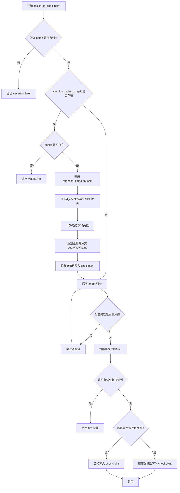
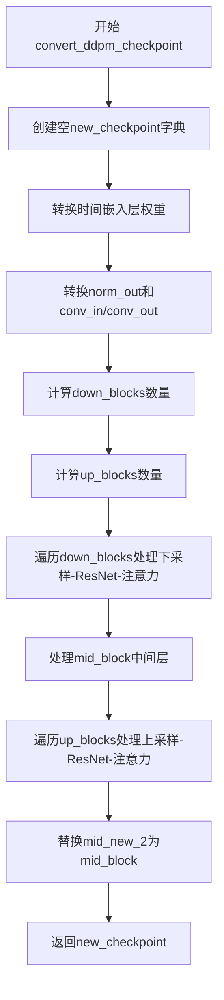

# `diffusers\scripts\convert_ddpm_original_checkpoint_to_diffusers.py` 详细设计文档

这是一个权重转换脚本，用于将早期版本（如Google DDPM或CompVis）的扩散模型预训练权重转换为Hugging Face Diffusers库所要求的格式，通过解析配置文件并应用键名映射与结构重组逻辑。

## 整体流程

```mermaid
graph TD
    Start((开始)) --> Parse[解析命令行参数]
    Parse --> Load[加载 PyTorch Checkpoint 和 JSON Config]
    Load --> Inspect{检查 Key 结构}
    Inspect -- 包含 'encoder' & 'decoder' --> ConvertVQ[调用 convert_vq_autoenc_checkpoint]
    Inspect -- 仅 'unet' --> ConvertDDPM[调用 convert_ddpm_checkpoint]
    ConvertVQ --> Instantiate[实例化 Diffusers 模型 (VQ/AutoencoderKL/UNet)]
    ConvertDDPM --> Instantiate
    Instantiate --> Load[加载转换后的 State Dict]
    Load --> Save[保存至 dump_path]
    Save --> End((结束))
```

## 类结构

```
convert_legacy_diffusion.py (主入口脚本)
└── Global Functions (全局函数)
    ├── shave_segments
    ├── renew_resnet_paths
    ├── renew_attention_paths
    ├── assign_to_checkpoint
    ├── convert_ddpm_checkpoint
    └── convert_vq_autoenc_checkpoint
```

## 全局变量及字段


### `args`
    
命令行参数对象，包含checkpoint_path、config_file和dump_path三个必需参数

类型：`argparse.Namespace`
    


### `checkpoint`
    
从磁盘加载的原始模型检查点字典，键为层名称，值为权重张量

类型：`Dict[str, torch.Tensor]`
    


### `config`
    
从JSON配置文件解析的模型架构配置字典，包含模型结构参数

类型：`Dict[str, Any]`
    


### `converted_checkpoint`
    
转换后的模型检查点字典，键名为适配新架构格式的层名称

类型：`Dict[str, torch.Tensor]`
    


### `model`
    
根据配置实例化的目标模型对象，用于加载转换后的权重

类型：`Union[UNet2DModel, VQModel, AutoencoderKL]`
    


### `key_prefix_set`
    
从检查点键名中提取的第一层前缀集合，用于判断模型类型（encoder/decoder或unet）

类型：`Set[str]`
    


    

## 全局函数及方法


### `shave_segments`

该函数用于处理路径字符串，根据 `n_shave_prefix_segments` 参数的值，从路径中移除指定数量的段。正值表示从路径左侧（开头）移除对应数量的段，负值表示从路径右侧（末尾）移除对应数量的段，常用于深度学习模型权重键名（key name）的转换和适配。

参数：

- `path`：`str`，待处理的路径字符串，通常为模型权重中的键名，用 "." 分隔各层级
- `n_shave_prefix_segments`：`int`，指定要移除的段数。正值从左侧移除对应数量的段，负值从右侧移除对应数量的段，默认为 1

返回值：`str`，移除指定段数后重新用 "." 连接而成的路径字符串

#### 流程图

```mermaid
flowchart TD
    A[开始: 输入 path, n_shave_prefix_segments] --> B{n_shave_prefix_segments >= 0?}
    B -- 是 --> C[path.split('.')[n_shave_prefix_segments:]]
    C --> D["'.'.join(结果)"]
    B -- 否 --> E[path.split('.')[:n_shave_prefix_segments]]
    E --> D
    D --> F[返回处理后的路径字符串]
```

#### 带注释源码

```python
def shave_segments(path, n_shave_prefix_segments=1):
    """
    Removes segments. Positive values shave the first segments, negative shave the last segments.
    
    参数:
        path: str，要处理的路径字符串，通常为模型权重中的键名
        n_shave_prefix_segments: int，指定要移除的段数。正值从左侧移除，负值从右侧移除
    
    返回值:
        str，移除指定段数后重新连接而成的路径字符串
    """
    # 判断 n_shave_prefix_segments 是否为非负数
    if n_shave_prefix_segments >= 0:
        # 正值情况：从左侧移除对应数量的段
        # 例如：path = "a.b.c.d", n_shave_prefix_segments = 1
        # path.split(".") = ["a", "b", "c", "d"]
        # path.split(".")[1:] = ["b", "c", "d"]
        # 结果为 "b.c.d"
        return ".".join(path.split(".")[n_shave_prefix_segments:])
    else:
        # 负值情况：从右侧移除对应数量的段
        # 例如：path = "a.b.c.d", n_shave_prefix_segments = -1
        # path.split(".") = ["a", "b", "c", "d"]
        # path.split(".")[:-1] = ["a", "b", "c"]
        # 结果为 "a.b.c"
        return ".".join(path.split(".")[:n_shave_prefix_segments])
```


### `renew_resnet_paths`

该函数用于将旧版 ResNet 路径转换为新版路径，通过一系列字符串替换操作（如将 "block." 替换为 "resnets."、"conv_shorcut" 替换为 "conv1" 等），并根据 `n_shave_prefix_segments` 参数修剪路径段，最终返回包含原始路径与新路径映射的列表。

参数：

- `old_list`：`list`，旧版 ResNet 路径列表，待转换的路径字符串列表
- `n_shave_prefix_segments`：`int`，可选参数，默认值为 0，表示要移除的前缀段数（正数移除开头，负数移除结尾）

返回值：`list`，返回包含字典的列表，每个字典包含 "old"（原始路径）和 "new"（新路径）两个键

#### 流程图

```mermaid
flowchart TD
    A[开始 renew_resnet_paths] --> B[初始化空映射列表 mapping]
    B --> C[遍历 old_list 中的每个 old_item]
    C --> D[复制 old_item 到 new_item]
    D --> E{字符串替换操作}
    E --> F[将 'block.' 替换为 'resnets.']
    F --> G[将 'conv_shorcut' 替换为 'conv1']
    G --> H[将 'in_shortcut' 替换为 'conv_shortcut']
    H --> I[将 'temb_proj' 替换为 'time_emb_proj']
    I --> J[调用 shave_segments 修剪路径段]
    J --> K[将 {'old': old_item, 'new': new_item} 添加到 mapping]
    K --> L{是否还有更多 old_item}
    L -->|是| C
    L -->|否| M[返回 mapping]
    M --> N[结束]
```

#### 带注释源码

```python
def renew_resnet_paths(old_list, n_shave_prefix_segments=0):
    """
    将旧版 ResNet 路径转换为新版路径格式。
    
    参数:
        old_list: 旧版路径列表，每个元素是字符串形式的模型层路径
        n_shave_prefix_segments: 可选参数，控制路径前缀段的修剪数量
    
    返回:
        映射列表，每个元素为 {'old': 原路径, 'new': 新路径} 的字典
    """
    # 初始化用于存储路径映射结果的列表
    mapping = []
    
    # 遍历输入的旧路径列表
    for old_item in old_list:
        # 复制当前旧路径作为新路径的起点
        new_item = old_item
        
        # 替换 'block.' 为 'resnets.' - 更新ResNet块的命名空间
        new_item = new_item.replace("block.", "resnets.")
        
        # 替换快捷连接卷积层命名: conv_shorcut -> conv1
        new_item = new_item.replace("conv_shorcut", "conv1")
        
        # 替换输入快捷连接命名: in_shortcut -> conv_shortcut
        new_item = new_item.replace("in_shortcut", "conv_shortcut")
        
        # 替换时间嵌入投影命名: temb_proj -> time_emb_proj
        new_item = new_item.replace("temb_proj", "time_emb_proj")
        
        # 根据 n_shave_prefix_segments 参数修剪路径段
        # 正值移除开头指定数量的段，负值移除结尾指定数量的段
        new_item = shave_segments(new_item, n_shave_prefix_segments=n_shave_prefix_segments)
        
        # 将原路径与新路径的映射添加到结果列表
        mapping.append({"old": old_item, "new": new_item})
    
    # 返回完整的路径映射列表
    return mapping
```


### `renew_attention_paths`

该函数用于将旧版注意力机制（Attention）的参数路径转换为新版路径格式，主要处理路径中关于注意力机制的命名约定（如 `attn` → `attentions`、`.k.` → `.key.`、`.v.` → `.value.`、`.q.` → `.query.`），同时支持中间层（mid block）的特殊处理。

参数：

- `old_list`：`List[str]`，需要转换的旧版路径列表
- `n_shave_prefix_segments`：`int`，默认值 0，用于控制路径前缀段的修剪数量
- `in_mid`：`bool`，默认值 `False`，标识是否处于中间层（mid block），不同层级的注意力层命名规则不同

返回值：`List[Dict[str, str]]`，返回包含旧路径与新路径映射关系的字典列表，每个元素为 `{"old": 旧路径, "new": 新路径}`

#### 流程图

```mermaid
flowchart TD
    A[开始 renew_attention_paths] --> B[初始化空 mapping 列表]
    B --> C{遍历 old_list 中的每个 old_item}
    C -->|是| D[复制 old_item 到 new_item]
    D --> E{检查 in_mid 是否为 False}
    E -->|是| F[将 'attn' 替换为 'attentions']
    E -->|否| G[跳过上一步]
    F --> H[将 '.k.' 替换为 '.key.']
    G --> H
    H --> I[将 '.v.' 替换为 '.value.']
    I --> J[将 '.q.' 替换为 '.query.']
    J --> K[将 'proj_out' 替换为 'proj_attn']
    K --> L[将 'norm' 替换为 'group_norm']
    L --> M[调用 shave_segments 修剪路径前缀]
    M --> N[将映射关系 {'old': old_item, 'new': new_item} 添加到 mapping]
    N --> C
    C -->|否| O[返回 mapping 列表]
    O --> P[结束]
```

#### 带注释源码

```python
def renew_attention_paths(old_list, n_shave_prefix_segments=0, in_mid=False):
    """
    将旧版注意力机制参数路径转换为新版路径格式
    
    参数:
        old_list: 旧版路径列表
        n_shave_prefix_segments: 路径前缀修剪段数
        in_mid: 是否为中间层（mid block）
    """
    mapping = []
    # 遍历所有旧路径
    for old_item in old_list:
        new_item = old_item

        # In `model.mid`, the layer is called `attn`.
        # 如果不是中间层，将 'attn' 替换为 'attentions'
        # 中间层的命名已经是 'attn'，不需要替换
        if not in_mid:
            new_item = new_item.replace("attn", "attentions")
        
        # 将 .k. .v. .q. 替换为完整名称 .key. .value. .query.
        new_item = new_item.replace(".k.", ".key.")
        new_item = new_item.replace(".v.", ".value.")
        new_item = new_item.replace(".q.", ".query.")

        # 替换投影输出和归一化层的命名
        new_item = new_item.replace("proj_out", "proj_attn")
        new_item = new_item.replace("norm", "group_norm")

        # 修剪路径前缀段
        new_item = shave_segments(new_item, n_shave_prefix_segments=n_shave_prefix_segments)
        
        # 将旧路径和新路径的映射关系添加到列表
        mapping.append({"old": old_item, "new": new_item})

    return mapping
```


### `assign_to_checkpoint`

该函数用于将旧版Diffusion模型检查点中的参数键名映射到新版架构的键名，并支持注意力路径的分割与重组。它是模型检查点格式转换的核心工具函数。

参数：

- `paths`：`List[Dict[str, str]]`，包含"old"和"new"键的字典列表，定义旧键名到新键名的映射关系
- `checkpoint`：`Dict[str, torch.Tensor]`，目标检查点字典，用于存储转换后的参数
- `old_checkpoint`：`Dict[str, torch.Tensor]`，源检查点字典，包含旧版模型的参数
- `attention_paths_to_split`：`Optional[Dict[str, Dict[str, str]]]`，可选参数，需要分割的注意力路径及其对应的query/key/value目标路径
- `additional_replacements`：`Optional[List[Dict[str, str]]]`，可选参数，额外的键名替换规则列表
- `config`：`Optional[Dict]`，可选参数，模型配置文件，用于获取注意力头通道数等信息

返回值：`None`，函数直接修改`checkpoint`字典，不返回任何值

#### 流程图



#### 带注释源码

```python
def assign_to_checkpoint(
    paths, checkpoint, old_checkpoint, attention_paths_to_split=None, additional_replacements=None, config=None
):
    """
    将旧版模型检查点中的参数映射到新版架构的键名。
    
    参数:
        paths: 包含旧键名到新键名映射的字典列表
        checkpoint: 目标检查点字典（会被修改）
        old_checkpoint: 源检查点字典
        attention_paths_to_split: 需要分割的注意力路径
        additional_replacements: 额外的替换规则
        config: 模型配置（用于获取注意力头信息）
    """
    # 验证 paths 参数类型，必须是字典列表
    assert isinstance(paths, list), "Paths should be a list of dicts containing 'old' and 'new' keys."

    # 如果需要分割注意力路径
    if attention_paths_to_split is not None:
        # config 必须提供以计算注意力头数
        if config is None:
            raise ValueError("Please specify the config if setting 'attention_paths_to_split' to 'True'.")

        # 遍历需要分割的每个注意力路径
        for path, path_map in attention_paths_to_split.items():
            # 从旧检查点获取原始注意力张量
            old_tensor = old_checkpoint[path]
            # 计算通道数（假设张量包含 query、key、value 三个部分）
            channels = old_tensor.shape[0] // 3

            # 确定目标形状：3D张量保留通道维度，2D张量展平
            target_shape = (-1, channels) if len(old_tensor.shape) == 3 else (-1)

            # 计算注意力头数
            num_heads = old_tensor.shape[0] // config.get("num_head_channels", 1) // 3

            # 重塑张量以分离不同的头和通道
            old_tensor = old_tensor.reshape((num_heads, 3 * channels // num_heads) + old_tensor.shape[1:])
            # 沿着通道维度分割为 query、key、value
            query, key, value = old_tensor.split(channels // num_heads, dim=1)

            # 将分割后的张量写入目标检查点（移除多余的维度）
            checkpoint[path_map["query"]] = query.reshape(target_shape).squeeze()
            checkpoint[path_map["key"]] = key.reshape(target_shape).squeeze()
            checkpoint[path_map["value"]] = value.reshape(target_shape).squeeze()

    # 遍历所有路径映射
    for path in paths:
        new_path = path["new"]

        # 如果该路径已被分割处理，则跳过
        if attention_paths_to_split is not None and new_path in attention_paths_to_split:
            continue

        # 替换常见的路径前缀
        new_path = new_path.replace("down.", "down_blocks.")
        new_path = new_path.replace("up.", "up_blocks.")

        # 应用额外的替换规则
        if additional_replacements is not None:
            for replacement in additional_replacements:
                new_path = new_path.replace(replacement["old"], replacement["new"])

        # 根据路径类型决定是否需要压缩张量
        if "attentions" in new_path:
            # 注意力层需要移除批次维度
            checkpoint[new_path] = old_checkpoint[path["old"]].squeeze()
        else:
            # 其他层直接复制
            checkpoint[new_path] = old_checkpoint[path["old"]]
```


### `convert_ddpm_checkpoint`

该函数用于将旧版DDPM（Diffusion Probabilistic Models）检查点转换为兼容新版Diffusers库格式的检查点。它处理UNet2DModel的权重映射，包括时间嵌入、卷积层、下采样/上采样块、ResNet块和注意力层的键名转换。

参数：

- `checkpoint`：`Dict[str, torch.Tensor]`，旧版DDPM模型的state dict，包含原始模型权重
- `config`：`Dict`，模型配置文件，包含层数等架构信息（如`layers_per_block`）

返回值：`Dict[str, torch.Tensor]`，转换后的新检查点，键名已更新为新版Diffusers格式

#### 流程图



#### 带注释源码

```python
def convert_ddpm_checkpoint(checkpoint, config):
    """
    Takes a state dict and a config, and returns a converted checkpoint.
    将旧版DDPM检查点转换为新版Diffusers格式
    """
    # 1. 初始化新检查点字典
    new_checkpoint = {}

    # 2. 转换时间嵌入层 (time embedding)
    # 旧格式: temb.dense.0.weight -> 新格式: time_embedding.linear_1.weight
    new_checkpoint["time_embedding.linear_1.weight"] = checkpoint["temb.dense.0.weight"]
    new_checkpoint["time_embedding.linear_1.bias"] = checkpoint["temb.dense.0.bias"]
    new_checkpoint["time_embedding.linear_2.weight"] = checkpoint["temb.dense.1.weight"]
    new_checkpoint["time_embedding.linear_2.bias"] = checkpoint["temb.dense.1.bias"]

    # 3. 转换输出归一化和卷积层
    new_checkpoint["conv_norm_out.weight"] = checkpoint["norm_out.weight"]
    new_checkpoint["conv_norm_out.bias"] = checkpoint["norm_out.bias"]

    new_checkpoint["conv_in.weight"] = checkpoint["conv_in.weight"]
    new_checkpoint["conv_in.bias"] = checkpoint["conv_in.bias"]
    new_checkpoint["conv_out.weight"] = checkpoint["conv_out.weight"]
    new_checkpoint["conv_out.bias"] = checkpoint["conv_out.bias"]

    # 4. 计算down_blocks数量
    # 通过提取包含"down"的关键字前缀来确定块数量
    num_down_blocks = len({".".join(layer.split(".")[:2]) for layer in checkpoint if "down" in layer})
    # 为每个down block构建键列表
    down_blocks = {
        layer_id: [key for key in checkpoint if f"down.{layer_id}" in key] for layer_id in range(num_down_blocks)
    }

    # 5. 计算up_blocks数量
    num_up_blocks = len({".".join(layer.split(".")[:2]) for layer in checkpoint if "up" in layer})
    up_blocks = {layer_id: [key for key in checkpoint if f"up.{layer_id}" in key] for layer_id in range(num_up_blocks)}

    # 6. 处理down_blocks (下采样路径)
    for i in range(num_down_blocks):
        # 计算block_id用于确定在哪个层级
        block_id = (i - 1) // (config["layers_per_block"] + 1)

        # 6.1 处理下采样层 (downsample)
        if any("downsample" in layer for layer in down_blocks[i]):
            new_checkpoint[f"down_blocks.{i}.downsamplers.0.conv.weight"] = checkpoint[
                f"down.{i}.downsample.op.weight"
            ]
            new_checkpoint[f"down_blocks.{i}.downsamplers.0.conv.bias"] = checkpoint[f"down.{i}.downsample.op.bias"]

        # 6.2 处理ResNet块 (resnets)
        if any("block" in layer for layer in down_blocks[i]):
            # 统计该down block中的block数量
            num_blocks = len(
                {".".join(shave_segments(layer, 2).split(".")[:2]) for layer in down_blocks[i] if "block" in layer}
            )
            blocks = {
                layer_id: [key for key in down_blocks[i] if f"block.{layer_id}" in key]
                for layer_id in range(num_blocks)
            }

            if num_blocks > 0:
                # 为每层生成路径映射并分配权重
                for j in range(config["layers_per_block"]):
                    paths = renew_resnet_paths(blocks[j])
                    assign_to_checkpoint(paths, new_checkpoint, checkpoint)

        # 6.3 处理注意力层 (attention)
        if any("attn" in layer for layer in down_blocks[i]):
            num_attn = len(
                {".".join(shave_segments(layer, 2).split(".")[:2]) for layer in down_blocks[i] if "attn" in layer}
            )
            attns = {
                layer_id: [key for key in down_blocks[i] if f"attn.{layer_id}" in key]
                for layer_id in range(num_blocks)
            }

            if num_attn > 0:
                for j in range(config["layers_per_block"]):
                    paths = renew_attention_paths(attns[j])
                    assign_to_checkpoint(paths, new_checkpoint, checkpoint, config=config)

    # 7. 处理中间块 (mid block)
    mid_block_1_layers = [key for key in checkpoint if "mid.block_1" in key]
    mid_block_2_layers = [key for key in checkpoint if "mid.block_2" in key]
    mid_attn_1_layers = [key for key in checkpoint if "mid.attn_1" in key]

    # 7.1 转换mid block 1
    paths = renew_resnet_paths(mid_block_1_layers)
    assign_to_checkpoint(
        paths,
        new_checkpoint,
        checkpoint,
        additional_replacements=[{"old": "mid.", "new": "mid_new_2."}, {"old": "block_1", "new": "resnets.0"}],
    )

    # 7.2 转换mid block 2
    paths = renew_resnet_paths(mid_block_2_layers)
    assign_to_checkpoint(
        paths,
        new_checkpoint,
        checkpoint,
        additional_replacements=[{"old": "mid.", "new": "mid_new_2."}, {"old": "block_2", "new": "resnets.1"}],
    )

    # 7.3 转换mid attention
    paths = renew_attention_paths(mid_attn_1_layers, in_mid=True)
    assign_to_checkpoint(
        paths,
        new_checkpoint,
        checkpoint,
        additional_replacements=[{"old": "mid.", "new": "mid_new_2."}, {"old": "attn_1", "new": "attentions.0"}],
    )

    # 8. 处理up_blocks (上采样路径)
    for i in range(num_up_blocks):
        # 逆序遍历以匹配上采样路径的方向
        block_id = num_up_blocks - 1 - i

        # 8.1 处理上采样层 (upsample)
        if any("upsample" in layer for layer in up_blocks[i]):
            new_checkpoint[f"up_blocks.{block_id}.upsamplers.0.conv.weight"] = checkpoint[
                f"up.{i}.upsample.conv.weight"
            ]
            new_checkpoint[f"up_blocks.{block_id}.upsamplers.0.conv.bias"] = checkpoint[f"up.{i}.upsample.conv.bias"]

        # 8.2 处理ResNet块
        if any("block" in layer for layer in up_blocks[i]):
            num_blocks = len(
                {".".join(shave_segments(layer, 2).split(".")[:2]) for layer in up_blocks[i] if "block" in layer}
            )
            blocks = {
                layer_id: [key for key in up_blocks[i] if f"block.{layer_id}" in key] for layer_id in range(num_blocks)
            }

            if num_blocks > 0:
                # up blocks比down blocks多一层
                for j in range(config["layers_per_block"] + 1):
                    replace_indices = {"old": f"up_blocks.{i}", "new": f"up_blocks.{block_id}"}
                    paths = renew_resnet_paths(blocks[j])
                    assign_to_checkpoint(paths, new_checkpoint, checkpoint, additional_replacements=[replace_indices])

        # 8.3 处理注意力层
        if any("attn" in layer for layer in up_blocks[i]):
            num_attn = len(
                {".".join(shave_segments(layer, 2).split(".")[:2]) for layer in up_blocks[i] if "attn" in layer}
            )
            attns = {
                layer_id: [key for key in up_blocks[i] if f"attn.{layer_id}" in key] for layer_id in range(num_blocks)
            }

            if num_attn > 0:
                for j in range(config["layers_per_block"] + 1):
                    replace_indices = {"old": f"up_blocks.{i}", "new": f"up_blocks.{block_id}"}
                    paths = renew_attention_paths(attns[j])
                    assign_to_checkpoint(paths, new_checkpoint, checkpoint, additional_replacements=[replace_indices])

    # 9. 最终替换: 将mid_new_2替换为mid_block
    new_checkpoint = {k.replace("mid_new_2", "mid_block"): v for k, v in new_checkpoint.items()}
    return new_checkpoint
```


### `convert_vq_autoenc_checkpoint`

该函数用于将旧版本的VQ（Vector Quantization）自动编码器模型检查点转换为新版本格式，处理编码器和解码器中各层权重的路径重新映射，包括卷积层、归一化层、下采样/上采样层、ResNet块和注意力块，以及量化相关层。

参数：

- `checkpoint`：`Dict[str, torch.Tensor]`，旧版本模型的state dict，包含所有权重张量
- `config`：`Dict`，模型配置文件，包含如`layers_per_block`等架构参数

返回值：`Dict[str, torch.Tensor]`，转换后的新版本模型state dict，键名已按照新架构进行重新映射

#### 流程图

```mermaid
flowchart TD
    A[开始转换VQ自动编码器检查点] --> B[初始化空new_checkpoint字典]
    
    B --> C[转换encoder基础层权重]
    C --> C1[conv_norm_out.weight/bias]
    C --> C2[conv_in.weight/bias]
    C --> C3[conv_out.weight/bias]
    
    C --> D[统计down_blocks数量]
    D --> E{遍历每个down_block i}
    
    E --> F[处理downsample层]
    F --> F1[映射encoder.down.{i}.downsample.conv到down_blocks.{i}.downsamplers.0.conv]
    
    E --> G[处理resnet blocks]
    G --> G1[提取block层列表]
    G1 --> G2[对每个j调用renew_resnet_paths和assign_to_checkpoint]
    
    E --> H[处理attention层]
    H --> H1[提取attn层列表]
    H1 --> H2[对每个j调用renew_attention_paths和assign_to_checkpoint]
    
    H --> I[处理mid_block中间块]
    I --> I1[renew_resnet_paths/mid_block_1 → mid_new_2.resnets.0]
    I --> I2[renew_resnet_paths/mid_block_2 → mid_new_2.resnets.1]
    I --> I3[renew_attention_paths/mid_attn_1 → mid_new_2.attentions.0]
    
    I --> J[统计up_blocks数量]
    J --> K{遍历每个up_block i}
    
    K --> L[处理upsample层]
    L --> L1[映射decoder.up.{i}.upsample.conv到up_blocks.{block_id}.upsamplers.0.conv]
    
    K --> M[处理resnet blocks]
    M --> M1[提取block层列表并反向block_id]
    M1 --> M2[对每个j调用renew_resnet_paths和assign_to_checkpoint]
    
    K --> N[处理attention层]
    N --> N1[提取attn层列表并反向block_id]
    N1 --> N2[对每个j调用renew_attention_paths和assign_to_checkpoint]
    
    N --> O[替换mid_new_2为mid_block]
    O --> P[添加quant_conv权重]
    P --> Q[如果有quantize.embedding则添加]
    Q --> R[添加post_quant_conv权重]
    R --> S[返回转换后的new_checkpoint]
```

#### 带注释源码

```python
def convert_vq_autoenc_checkpoint(checkpoint, config):
    """
    Takes a state dict and a config, and returns a converted checkpoint.
    将旧版本的VQ自动编码器检查点转换为新版本格式
    
    参数:
        checkpoint: 旧版本模型的state dict
        config: 模型配置文件
    返回:
        转换后的新版本模型state dict
    """
    # 初始化新的检查点字典，用于存储转换后的权重
    new_checkpoint = {}

    # === 1. 转换encoder的基础卷积和归一化层 ===
    # 将encoder的norm_out映射到新的conv_norm_out
    new_checkpoint["encoder.conv_norm_out.weight"] = checkpoint["encoder.norm_out.weight"]
    new_checkpoint["encoder.conv_norm_out.bias"] = checkpoint["encoder.norm_out.bias"]

    # 转换encoder的输入卷积层
    new_checkpoint["encoder.conv_in.weight"] = checkpoint["encoder.conv_in.weight"]
    new_checkpoint["encoder.conv_in.bias"] = checkpoint["encoder.conv_in.bias"]
    # 转换encoder的输出卷积层
    new_checkpoint["encoder.conv_out.weight"] = checkpoint["encoder.conv_out.weight"]
    new_checkpoint["encoder.conv_out.bias"] = checkpoint["encoder.conv_out.bias"]

    # === 2. 转换decoder的基础卷积和归一化层 ===
    # 将decoder的norm_out映射到新的conv_norm_out
    new_checkpoint["decoder.conv_norm_out.weight"] = checkpoint["decoder.norm_out.weight"]
    new_checkpoint["decoder.conv_norm_out.bias"] = checkpoint["decoder.norm_out.bias"]

    # 转换decoder的输入卷积层
    new_checkpoint["decoder.conv_in.weight"] = checkpoint["decoder.conv_in.weight"]
    new_checkpoint["decoder.conv_in.bias"] = checkpoint["decoder.conv_in.bias"]
    # 转换decoder的输出卷积层
    new_checkpoint["decoder.conv_out.weight"] = checkpoint["decoder.conv_out.weight"]
    new_checkpoint["decoder.conv_out.bias"] = checkpoint["decoder.conv_out.bias"]

    # === 3. 统计和处理down_blocks（encoder的下采样路径） ===
    # 通过提取包含"down"的层并取前3段来计算down_blocks数量
    num_down_blocks = len({".".join(layer.split(".")[:3]) for layer in checkpoint if "down" in layer})
    # 为每个down_block_id收集相关的key
    down_blocks = {
        layer_id: [key for key in checkpoint if f"down.{layer_id}" in key] 
        for layer_id in range(num_down_blocks)
    }

    # === 4. 统计和处理up_blocks（decoder的上采样路径） ===
    # 通过提取包含"up"的层并取前3段来计算up_blocks数量
    num_up_blocks = len({".".join(layer.split(".")[:3]) for layer in checkpoint if "up" in layer})
    # 为每个up_block_id收集相关的key
    up_blocks = {layer_id: [key for key in checkpoint if f"up.{layer_id}" in key] for layer_id in range(num_up_blocks)}

    # === 5. 遍历处理每个down_block（encoder侧） ===
    for i in range(num_down_blocks):
        # 计算block_id用于某些映射计算
        block_id = (i - 1) // (config["layers_per_block"] + 1)

        # 5.1 处理downsample下采样层
        if any("downsample" in layer for layer in down_blocks[i]):
            # 将encoder.down.{i}.downsample.conv映射到encoder.down_blocks.{i}.downsamplers.0.conv
            new_checkpoint[f"encoder.down_blocks.{i}.downsamplers.0.conv.weight"] = checkpoint[
                f"encoder.down.{i}.downsample.conv.weight"
            ]
            new_checkpoint[f"encoder.down_blocks.{i}.downsamplers.0.conv.bias"] = checkpoint[
                f"encoder.down.{i}.downsample.conv.bias"
            ]

        # 5.2 处理resnet块
        if any("block" in layer for layer in down_blocks[i]):
            # 统计该down_block中的block数量
            num_blocks = len(
                {".".join(shave_segments(layer, 3).split(".")[:3]) for layer in down_blocks[i] if "block" in layer}
            )
            blocks = {
                layer_id: [key for key in down_blocks[i] if f"block.{layer_id}" in key]
                for layer_id in range(num_blocks)
            }

            if num_blocks > 0:
                # 对每个block层应用路径重命名和权重分配
                for j in range(config["layers_per_block"]):
                    paths = renew_resnet_paths(blocks[j])
                    assign_to_checkpoint(paths, new_checkpoint, checkpoint)

        # 5.3 处理attention注意力层
        if any("attn" in layer for layer in down_blocks[i]):
            # 统计该down_block中的attention数量
            num_attn = len(
                {".".join(shave_segments(layer, 3).split(".")[:3]) for layer in down_blocks[i] if "attn" in layer}
            )
            attns = {
                layer_id: [key for key in down_blocks[i] if f"attn.{layer_id}" in key]
                for layer_id in range(num_blocks)
            }

            if num_attn > 0:
                # 对每个attention层应用路径重命名和权重分配
                for j in range(config["layers_per_block"]):
                    paths = renew_attention_paths(attns[j])
                    assign_to_checkpoint(paths, new_checkpoint, checkpoint, config=config)

    # === 6. 处理mid_block中间块 ===
    # 提取mid_block相关的各层
    mid_block_1_layers = [key for key in checkpoint if "mid.block_1" in key]
    mid_block_2_layers = [key for key in checkpoint if "mid.block_2" in key]
    mid_attn_1_layers = [key for key in checkpoint if "mid.attn_1" in key]

    # Mid block 1: 将mid.替换为mid_new_2.，block_1替换为resnets.0
    paths = renew_resnet_paths(mid_block_1_layers)
    assign_to_checkpoint(
        paths,
        new_checkpoint,
        checkpoint,
        additional_replacements=[{"old": "mid.", "new": "mid_new_2."}, {"old": "block_1", "new": "resnets.0"}],
    )

    # Mid block 2: 将mid.替换为mid_new_2.，block_2替换为resnets.1
    paths = renew_resnet_paths(mid_block_2_layers)
    assign_to_checkpoint(
        paths,
        new_checkpoint,
        checkpoint,
        additional_replacements=[{"old": "mid.", "new": "mid_new_2."}, {"old": "block_2", "new": "resnets.1"}],
    )

    # Mid attention: 将mid.替换为mid_new_2.，attn_1替换为attentions.0
    paths = renew_attention_paths(mid_attn_1_layers, in_mid=True)
    assign_to_checkpoint(
        paths,
        new_checkpoint,
        checkpoint,
        additional_replacements=[{"old": "mid.", "new": "mid_new_2."}, {"old": "attn_1", "new": "attentions.0"}],
    )

    # === 7. 遍历处理每个up_block（decoder侧） ===
    for i in range(num_up_blocks):
        # 上采样路径的block_id需要反向（从底部到顶部）
        block_id = num_up_blocks - 1 - i

        # 7.1 处理upsample上采样层
        if any("upsample" in layer for layer in up_blocks[i]):
            # 将decoder.up.{i}.upsample.conv映射到decoder.up_blocks.{block_id}.upsamplers.0.conv
            new_checkpoint[f"decoder.up_blocks.{block_id}.upsamplers.0.conv.weight"] = checkpoint[
                f"decoder.up.{i}.upsample.conv.weight"
            ]
            new_checkpoint[f"decoder.up_blocks.{block_id}.upsamplers.0.conv.bias"] = checkpoint[
                f"decoder.up.{i}.upsample.conv.bias"
            ]

        # 7.2 处理resnet块
        if any("block" in layer for layer in up_blocks[i]):
            # 统计该up_block中的block数量
            num_blocks = len(
                {".".join(shave_segments(layer, 3).split(".")[:3]) for layer in up_blocks[i] if "block" in layer}
            )
            blocks = {
                layer_id: [key for key in up_blocks[i] if f"block.{layer_id}" in key] for layer_id in range(num_blocks)
            }

            if num_blocks > 0:
                # 上采样路径每层有layers_per_block+1个block
                for j in range(config["layers_per_block"] + 1):
                    # 创建索引替换映射，将up_blocks.i改为up_blocks.block_id
                    replace_indices = {"old": f"up_blocks.{i}", "new": f"up_blocks.{block_id}"}
                    paths = renew_resnet_paths(blocks[j])
                    assign_to_checkpoint(paths, new_checkpoint, checkpoint, additional_replacements=[replace_indices])

        # 7.3 处理attention注意力层
        if any("attn" in layer for layer in up_blocks[i]):
            # 统计该up_block中的attention数量
            num_attn = len(
                {".".join(shave_segments(layer, 3).split(".")[:3]) for layer in up_blocks[i] if "attn" in layer}
            )
            attns = {
                layer_id: [key for key in up_blocks[i] if f"attn.{layer_id}" in key] for layer_id in range(num_blocks)
            }

            if num_attn > 0:
                # 上采样路径每层有layers_per_block+1个attention block
                for j in range(config["layers_per_block"] + 1):
                    # 创建索引替换映射
                    replace_indices = {"old": f"up_blocks.{i}", "new": f"up_blocks.{block_id}"}
                    paths = renew_attention_paths(attns[j])
                    assign_to_checkpoint(paths, new_checkpoint, checkpoint, additional_replacements=[replace_indices])

    # === 8. 最终路径调整和量化层添加 ===
    # 将所有mid_new_2替换为mid_block（统一中间块命名）
    new_checkpoint = {k.replace("mid_new_2", "mid_block"): v for k, v in new_checkpoint.items()}
    
    # 添加量化器相关权重
    new_checkpoint["quant_conv.weight"] = checkpoint["quant_conv.weight"]
    new_checkpoint["quant_conv.bias"] = checkpoint["quant_conv.bias"]
    
    # 如果存在量化embedding，则添加（用于VQ模型）
    if "quantize.embedding.weight" in checkpoint:
        new_checkpoint["quantize.embedding.weight"] = checkpoint["quantize.embedding.weight"]
    
    # 添加后量化卷积层权重
    new_checkpoint["post_quant_conv.weight"] = checkpoint["post_quant_conv.weight"]
    new_checkpoint["post_quant_conv.bias"] = checkpoint["post_quant_conv.bias"]

    # 返回转换后的新检查点
    return new_checkpoint
```

## 关键组件


### 张量索引与重塑 (Tensor Reshaping)

在 `assign_to_checkpoint` 函数中实现，负责将旧的注意力张量（query、key、value 合并在一起）分割成独立的 Q、K、V 张量，通过 reshape 和 split 操作实现三维张量的分离。

### 路径重命名映射系统 (Path Renaming System)

由 `renew_resnet_paths` 和 `renew_attention_paths` 函数组成，将旧版模型的层级路径（如 `block.`、`attn.`）转换为新版的层级路径（如 `resnets.`、`attentions.`），实现模型结构兼容性。

### 检查点分配核心逻辑 (Checkpoint Assignment)

`assign_to_checkpoint` 函数是核心组件，处理路径映射、张量分割和目标张量赋值，支持注意力路径分割、额外替换规则和配置参数。

### DDPM 模型检查点转换 (DDPM Checkpoint Conversion)

`convert_ddpm_checkpoint` 函数处理 DDPM/UNet2D 模型的旧版检查点转换为新版格式，包括时间嵌入、卷积层、上采样/下采样块和中间块的路径映射。

### VQ 自动编码器检查点转换 (VQ Autoencoder Checkpoint Conversion)

`convert_vq_autoenc_checkpoint` 函数处理 VQModel 和 AutoencoderKL 的检查点转换，包含编码器和解码器的卷积层、归一化层、上下块的转换，以及量化相关层的处理。

### 命令行接口与模型加载 (CLI and Model Loading)

主程序块提供命令行参数解析，支持检查点路径、配置文件和输出路径的输入，根据配置中的 `_class_name` 自动选择并加载 VQModel、AutoencoderKL 或 UNet2DModel。


## 问题及建议


### 已知问题

- **错误处理严重不足**：文件加载（`torch.load`、`open`）没有任何异常捕获，配置解析缺少验证，可能导致程序在输入错误时直接崩溃。
- **大量代码重复**：`convert_ddpm_checkpoint` 和 `convert_vq_autoenc_checkpoint` 函数结构高度相似，路径处理逻辑在多处几乎完全重复，可抽取公共模块。
- **缺乏类型注解**：所有函数参数、返回值、全局变量均无类型标注，降低了代码可维护性和 IDE 辅助能力。
- **硬编码的 Scheduler 路径**：`scheduler = DDPMScheduler.from_config("/".join(args.checkpoint_path.split("/")[:-1]))` 通过字符串分割推断配置目录，极度脆弱且不可靠。
- **魔法数字与硬编码字符串遍布**：层索引计算、块 ID 推算、路径替换字符串散落各处，缺乏常量定义或配置驱动。
- **变量命名混乱**：同一概念在不同函数中用 `i/j`、`block_id`、`layer_id` 等不同名称表示，容易产生理解偏差。
- **使用 assert 进行业务校验**：`assign_to_checkpoint` 中的 `assert isinstance(paths, list)` 应改为显式异常抛出，assert 可被 Python 优化时跳过。
- **文档不完整**：多数函数仅有简单 docstring，参数意义、返回值约束、边界条件均未说明。
- **无日志与进度反馈**：转换大规模模型时没有任何提示，用户无法感知程序状态。
- **attention_paths_to_split 边界条件未覆盖**：当 `num_head_channels` 为 1 或缺失时，计算逻辑可能产生非预期结果。

### 优化建议

- 补充完整的 try-except 异常处理，为文件读取、模型加载、配置解析等关键路径添加用户友好的错误提示。
- 重构两个转换函数，抽取公共的块处理、路径映射、张量赋值逻辑为独立函数或基类。
- 为所有函数添加类型注解（`typing` 模块），明确输入输出类型。
- 从配置文件或命令行参数读取模型架构相关的路径前缀、层数等信息，避免硬编码。
- 将 scheduler 路径改为通过 `args.config_file` 的目录或新增 `--scheduler_config` 参数指定。
- 统一变量命名规范（如 `down_block_idx`、`up_block_idx`），添加必要的注释说明计算逻辑。
- 替换 assert 为 `raise ValueError` 或 `raise TypeError`，确保校验始终生效。
- 完善 docstring，详细描述每个参数的业务含义、可能的异常情况。
- 引入 `logging` 模块，添加分阶段的日志输出（如 INFO 级别显示当前处理模块）。
- 增加对 `config.get("num_head_channels", 1)` 为 1 时的显式校验与分支处理，确保维度计算正确。

## 其它


### 设计目标与约束

该代码的核心目标是将旧版Diffusers模型检查点转换为新版格式，以确保与当前Diffusers库的兼容性。设计约束包括：1) 必须提供符合新架构的配置文件（JSON格式）；2) 仅支持DDPMPipeline、UNet2DModel、VQModel和AutoencoderKL四种模型类型的转换；3) 转换后的检查点可直接用于HuggingFace Diffusers库的最新版本。

### 错误处理与异常设计

代码采用多层错误处理机制：1) 使用assert语句验证paths参数类型，确保传入的是包含'old'和'new'键的字典列表；2) 当attention_paths_to_split不为None但config为None时，抛出ValueError异常；3) 通过条件判断区分VQA和DDPM模型，使用key_prefix_set检测模型类型。潜在改进：增加文件路径有效性检查、配置文件格式验证、检查点键名匹配性验证等。

### 数据流与状态机

数据流遵循以下状态机：1) 加载阶段：解析命令行参数，加载原始检查点和配置文件；2) 类型检测阶段：通过检查checkpoint的键前缀判断模型类型（encoder+decoder表示VQA，否则为DDPM/UNet）；3) 转换阶段：根据模型类型调用convert_ddpm_checkpoint或convert_vq_autoenc_checkpoint；4) 保存阶段：根据_class_name字段实例化对应模型，加载转换后的权重并保存。

### 外部依赖与接口契约

主要依赖包括：1) torch：用于加载和处理模型权重；2) diffusers库：提供AutoencoderKL、DDPMPipeline、UNet2DModel、VQModel等模型类；3) json：解析配置文件；4) argparse：处理命令行参数。接口契约要求：配置文件必须包含layers_per_block、num_head_channels（可选）、_class_name等字段；检查点文件必须为PyTorch pickle格式。

### 核心算法说明

代码实现了三个关键的路径重命名函数：1) shave_segments：用于去除路径前缀或后缀段；2) renew_resnet_paths：将旧版ResNet路径映射到新版路径（如block->resnets、conv_shorcut->conv1）；3) renew_attention_paths：处理注意力机制路径映射（如attn->attentions、.k.->.key.）。assign_to_checkpoint函数负责将旧权重实际写入新检查点，并处理注意力权重的分割（将query、key、value分离）。

### 配置要求说明

配置文件必须包含以下关键字段：1) layers_per_block：每层的块数；2) _class_name：模型类别名称（VQModel/AutoencoderKL/UNet2DModel）；3) _diffusers_version：目标Diffusers版本（可选）；4) num_head_channels：注意力头通道数（可选，用于注意力权重分割）。配置文件结构应与HuggingFace Diffusers库的config.json格式一致。

### 边界条件处理

代码对以下边界条件进行了处理：1) 空块处理：通过if any("block" in layer for layer in ...)条件判断跳过空块；2) 下采样/上采样层可能不存在：通过类似条件判断处理；3) 注意力层可能不存在：同样使用条件判断；4) mid_new_2到mid_block的最终替换：统一中间块命名。潜在边界问题：配置文件缺失必要字段、模型结构与检查点不匹配、权重形状不兼容等。

### 命令行接口规范

提供三个必需参数：1) --checkpoint_path：输入的旧版检查点文件路径；2) --config_file：模型架构配置文件路径；3) --dump_path：输出转换后模型的保存路径。所有参数均为必需，使用type=str指定字符串类型。

### 使用示例

典型使用流程：1) 准备旧版检查点文件（如diffusers_old_model.bin）；2) 准备对应的配置文件（如config.json）；3) 运行命令：python convert_checkpoint.py --checkpoint_path ./diffusers_old_model.bin --config_file ./config.json --dump_path ./converted_model


    