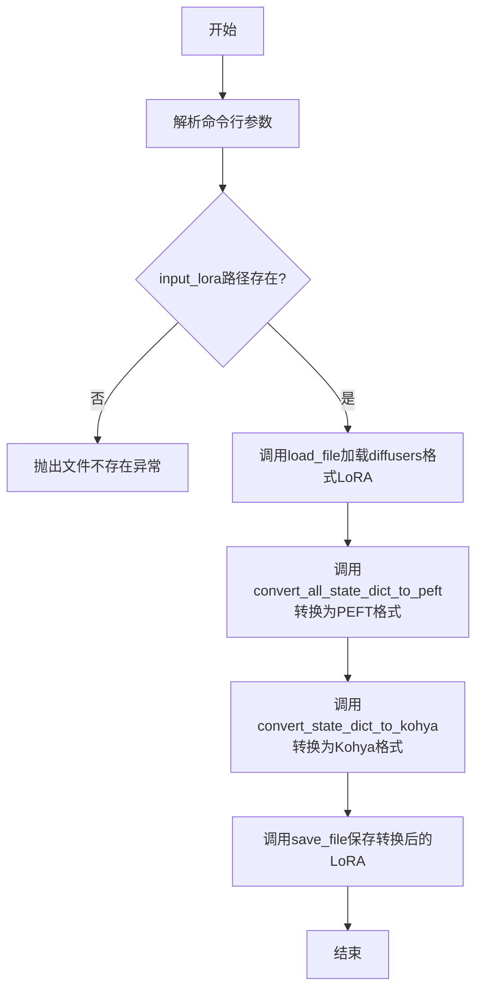
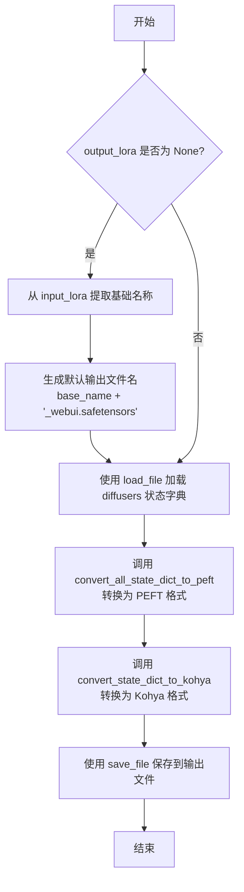
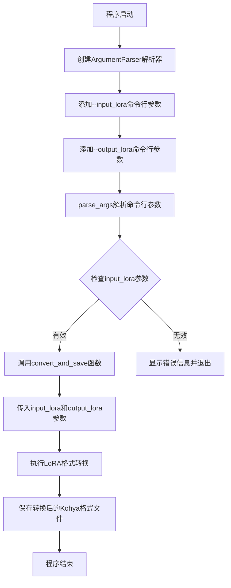

# `diffusers\scripts\convert_diffusers_sdxl_lora_to_webui.py` 详细设计文档

这是一个用于将 Hugging Face Diffusers 训练的 SDXL LoRA 模型转换为 Kohya 格式的转换脚本，使得转换后的 LoRA 可以在 AUTOMATIC1111、ComfyUI、SD.Next 等 WebUI 中使用。

## 整体流程



## 类结构

```
此脚本为模块化脚本，无类定义
主要包含全局函数: convert_and_save
入口点: if __name__ == "__main__" 块
```

## 全局变量及字段


### `argparse`
    
Python标准库模块，用于解析命令行参数

类型：`module`
    


### `os`
    
Python标准库模块，用于处理文件和目录路径操作

类型：`module`
    


### `safetensors.torch`
    
Safetensors库的工具模块，用于安全高效地加载和保存张量文件

类型：`module`
    


### `diffusers.utils`
    
Diffusers库的工具模块，包含状态字典转换函数

类型：`module`
    


### `convert_all_state_dict_to_peft`
    
Diffusers库函数，用于将状态字典转换为PEFT格式

类型：`function`
    


### `convert_state_dict_to_kohya`
    
Diffusers库函数，用于将状态字典转换为Kohya格式

类型：`function`
    


### `input_lora`
    
输入LoRA模型文件的路径（diffusers格式）

类型：`str`
    


### `output_lora`
    
输出LoRA模型文件的路径（safetensors格式，可选）

类型：`str`
    


### `base_name`
    
输入文件名去除扩展名后的基础名称，用于生成默认输出文件名

类型：`str`
    


### `diffusers_state_dict`
    
从输入LoRA文件加载的原始diffusers格式状态字典

类型：`dict`
    


### `peft_state_dict`
    
转换为PEFT格式后的状态字典

类型：`dict`
    


### `kohya_state_dict`
    
最终转换为Kohya格式的状态字典，用于WebUI

类型：`dict`
    


### `parser`
    
命令行参数解析器对象

类型：`argparse.ArgumentParser`
    


### `args`
    
命令行参数对象，包含input_lora和output_lora

类型：`argparse.Namespace`
    


    

## 全局函数及方法


### `convert_and_save`

核心转换函数，负责加载、转换和保存LoRA模型，将 Hugging Face Diffusers 训练的 SDXL LoRA 转换为 Kohya 格式，以便在 WebUI（如 AUTOMATIC1111、ComfyUI、SD.Next）中使用。

参数：

-  `input_lora`：`str`，输入的 LoRA 模型文件路径（diffusers 格式，safetensors 文件）
-  `output_lora`：`str | None`，输出的 LoRA 文件路径（safetensors 格式），可选，默认为输入文件名加上 `_webui` 后缀

返回值：`None`，无返回值，该函数直接保存转换后的模型到文件

#### 流程图



#### 带注释源码

```python
def convert_and_save(input_lora, output_lora=None):
    """
    核心转换函数，负责加载、转换和保存LoRA模型
    
    将 Hugging Face Diffusers 训练的 SDXL LoRA 转换为 Kohya 格式，
    以便在 WebUI（AUTOMATIC1111, ComfyUI, SD.Next）中使用
    
    参数:
        input_lora: str - 输入的 LoRA 模型文件路径（diffusers 格式）
        output_lora: str | None - 输出的 LoRA 文件路径，可选
    
    返回:
        None - 直接保存转换后的模型到文件
    """
    # 如果未指定输出文件名，则自动生成
    # 默认命名规则：输入文件名基础名 + "_webui.safetensors"
    if output_lora is None:
        base_name = os.path.splitext(input_lora)[0]  # 提取文件基础名（去除扩展名）
        output_lora = f"{base_name}_webui.safetensors"  # 生成默认输出文件名

    # 步骤1: 加载 diffusers 格式的 LoRA 状态字典
    # 使用 safetensors 格式加载模型权重
    diffusers_state_dict = load_file(input_lora)

    # 步骤2: 将 diffusers 状态字典转换为 PEFT 格式
    # PEFT (Parameter-Efficient Fine-Tuning) 是 Hugging Face 的轻量级微调库
    # 这一步将模型权重标准化为 PEFT 兼容的格式
    peft_state_dict = convert_all_state_dict_to_peft(diffusers_state_dict)

    # 步骤3: 将 PEFT 状态字典转换为 Kohya 格式
    # Kohya 格式是 WebUI 兼容的 LoRA 权重格式
    # 涉及权重重排、键名转换等操作
    kohya_state_dict = convert_state_dict_to_kohya(peft_state_dict)

    # 步骤4: 保存转换后的模型到输出文件
    # 使用 safetensors 格式保存，安全且高效
    save_file(kohya_state_dict, output_lora)
```


### `main` (隐含入口函数)

该隐含入口函数负责解析命令行参数并调用核心转换函数 `convert_and_save`，实现将 Diffusers 格式的 SDXL LoRA 模型转换为 Kohya 格式以便在各类 WebUI 中使用的功能。

参数：

- `args.input_lora`：`str`，输入的 LoRA 模型文件路径（diffusers 格式），必需参数
- `args.output_lora`：`str`，输出的 LoRA 文件路径（safetensors 格式），可选参数，默认为输入文件名加上 `_webui` 后缀

返回值：`None`，无返回值，仅执行转换操作

#### 流程图



#### 带注释源码

```
# 程序入口点
if __name__ == "__main__":
    # 创建命令行参数解析器，设置程序描述信息
    parser = argparse.ArgumentParser(description="Convert LoRA model to PEFT and then to Kohya format.")
    
    # 添加输入LoRA模型路径参数（必需）
    # 用于指定要转换的diffusers格式LoRA文件路径
    parser.add_argument(
        "--input_lora",
        type=str,
        required=True,
        help="Path to the input LoRA model file in the diffusers format.",
    )
    
    # 添加输出LoRA模型路径参数（可选）
    # 如未指定，则默认为输入文件名加上_webui后缀
    parser.add_argument(
        "--output_lora",
        type=str,
        required=False,
        help="Path for the converted LoRA (safetensors format for AUTOMATIC1111, ComfyUI, etc.). Optional, defaults to input name with a _webui suffix.",
    )

    # 解析命令行传入的参数
    args = parser.parse_args()

    # 调用核心转换函数，传入输入和输出路径
    # 该函数内部会：
    # 1. 加载diffusers格式的state dict
    # 2. 转换为PEFT格式
    # 3. 转换为Kohya格式
    # 4. 保存为safetensors文件
    convert_and_save(args.input_lora, args.output_lora)
```

## 关键组件


## 代码概述
本代码是一个用于将 Hugging Face Diffusers 训练的 SDXL LoRA 模型转换为 Kohya 格式的命令行工具脚本，支持输出到 WebUI（如 AUTOMATIC1111、ComfyUI、SD.Next）使用的 safetensors 文件格式。

## 关键组件

### 1. 状态字典转换管道
负责将 Diffusers 格式的 LoRA 权重依次转换为 PEFT 格式再转换为 Kohya 格式，是本脚本的核心转换逻辑。

### 2. 文件 I/O 操作
使用 safetensors 格式进行模型的加载和保存，支持安全高效的张量序列化。

### 3. 命令行参数解析
通过 argparse 模块接收用户输入的 LoRA 文件路径和输出路径。

### 4. 路径处理与默认命名
提供默认输出文件名生成逻辑（添加 _webui 后缀）。

## 详细设计文档

### 核心功能描述
该脚本实现从 Diffusers 训练的 SDXL LoRA 到 Kohya/WebUI 兼容格式的转换，通过加载 safetensors 文件、调用 diffusers 库的转换工具链将状态字典从 Diffusers 格式转换为 PEFT 格式再转换为 Kohya 格式，最终保存为 WebUI 可用的 LoRA 文件。

### 文件运行流程
1. 解析命令行参数（输入路径、必要时指定输出路径）
2. 调用 convert_and_save 函数
3. 加载输入的 Diffusers 格式 LoRA 文件
4. 转换为 PEFT 格式状态字典
5. 转换为 Kohya 格式状态字典
6. 保存为 safetensors 文件

### 全局变量与全局函数

### convert_and_save
- **参数**:
  - `input_lora`: str, 输入的 Diffusers 格式 LoRA 文件路径
  - `output_lora`: str, 输出的 Kohya 格式 LoRA 文件路径（可选，默认在输入文件名后添加 _webui 后缀）
- **返回值**: None
- **描述**: 执行 LoRA 格式转换的核心函数

### 参数说明
| 参数名 | 类型 | 描述 |
|--------|------|------|
| input_lora | str | 输入 LoRA 模型文件路径（diffusers 格式） |
| output_lora | str | 输出 LoRA 模型文件路径（safetensors 格式），可选 |

### 源代码（带注释）
```python
def convert_and_save(input_lora, output_lora=None):
    """转换并保存 LoRA 模型"""
    # 如果未指定输出路径，则自动生成
    if output_lora is None:
        base_name = os.path.splitext(input_lora)[0]
        output_lora = f"{base_name}_webui.safetensors"

    # 步骤1: 加载 diffusers 格式的状态字典
    diffusers_state_dict = load_file(input_lora)
    
    # 步骤2: 将 diffusers 格式转换为 PEFT 格式
    peft_state_dict = convert_all_state_dict_to_peft(diffusers_state_dict)
    
    # 步骤3: 将 PEFT 格式转换为 Kohya 格式
    kohya_state_dict = convert_state_dict_to_kohya(peft_state_dict)
    
    # 步骤4: 保存为 safetensors 格式
    save_file(kohya_state_dict, output_lora)
```

### 外部依赖与接口契约

| 依赖项 | 版本/来源 | 用途 |
|--------|-----------|------|
| safetensors.torch | safetensors 库 | 加载和保存 safetensors 格式文件 |
| diffusers.utils | diffusers 库 | 状态字典格式转换函数 |

### 错误处理与异常设计
- 未实现显式错误处理，依赖底层库抛出的异常
- 建议添加：文件不存在检查、路径权限验证、转换过程中的异常捕获

### 潜在技术债务与优化空间
1. **缺少错误处理**：未对文件不存在、路径权限、转换失败等情况进行处理
2. **缺少日志输出**：转换过程无进度提示，大文件转换时用户无法感知执行状态
3. **不支持批量转换**：只能单文件转换，效率较低
4. **缺少参数校验**：未验证输入文件格式是否正确
5. **硬编码转换链**：转换逻辑固定，无法灵活选择转换路径

### 设计目标与约束
- 目标：简化 Diffusers 训练的 LoRA 到 WebUI 格式的转换流程
- 约束：依赖 diffusers 和 safetensors 库，仅支持 safetensors 格式输入输出


## 问题及建议


### 已知问题

- **缺少输入文件验证**：未检查输入文件是否存在、是否可读，以及文件格式是否为有效的 safetensors 文件，可能导致运行时错误。
- **缺少异常处理**：没有 try-except 块捕获文件读写、状态字典转换过程中的异常，脚本失败时用户体验差。
- **无运行时反馈**：脚本执行过程中没有任何日志输出或进度提示，用户无法得知转换是否成功或正在进行。
- **输出文件覆盖无警告**：当输出文件已存在时直接覆盖，缺少确认机制，可能导致用户数据丢失。
- **命令行参数不够灵活**：缺少 verbose/quiet 选项、force 覆盖选项，无法满足不同使用场景需求。
- **缺少转换结果验证**：转换完成后没有验证输出文件的合法性或 state dict 的完整性。
- **依赖兼容性风险**：直接依赖 `diffusers.utils` 中的内部函数（`convert_all_state_dict_to_peft`、`convert_state_dict_to_kohya`），这些函数可能随 diffusers 版本变化导致脚本失效。
- **仅支持 safetensors 输入**：不支持 pytorch .pt/.pth 格式的 diffusers LoRA 输入，限制了脚本的通用性。

### 优化建议

- **添加文件存在性和格式检查**：在加载文件前检查路径有效性，验证文件头或扩展名是否合法。
- **添加完整的异常处理**：使用 try-except 包裹核心逻辑，捕获并友好地报告各类异常（如文件不存在、权限问题、格式错误等）。
- **添加日志输出**：使用 logging 模块或简单的 print 语句，在关键节点（开始、进度、完成）输出提示信息，可通过 --verbose 控制详细程度。
- **添加输出文件确认机制**：当输出文件已存在时，提示用户确认是否覆盖，或添加 --force 参数强制覆盖。
- **增强命令行参数**：添加 --verbose/--quiet、--force、--format (输入格式选择) 等参数提升可用性。
- **添加结果验证**：转换完成后可选择性地验证输出文件的 key 数量、形状合理性，或保存一个小样本进行试加载。
- **考虑添加单元测试**：为转换函数编写测试用例，确保在不同输入情况下行为符合预期。
- **支持更多输入格式**：添加对 .pt/.pth 格式的支持，或使用 torch.load 作为备选。
- **添加版本检查**：在脚本开头检查依赖包版本，给出兼容性警告。


## 其它


### 设计目标与约束

本脚本的核心设计目标是将Hugging Face Diffusers框架训练的SDXL LoRA模型转换为Kohya格式，使其能够在AUTOMATIC1111、ComfyUI、SD.Next等主流WebUI中使用。主要约束包括：输入文件必须为safetensors格式的diffusers LoRA权重，输出文件默认为safetensors格式的Kohya格式权重。转换过程保持权重兼容性，确保在目标WebUI中的训练和推理效果与原始diffusers训练结果一致。

### 错误处理与异常设计

脚本在以下关键点进行错误处理：文件路径验证（检查输入文件是否存在）、文件格式验证（确保输入为safetensors格式）、状态字典转换异常捕获（处理权重键名不匹配或维度不一致的情况）、磁盘写入权限验证（确保输出目录可写）。当发生异常时，脚本会抛出详细的错误信息，包括具体的转换失败原因和文件路径，便于用户定位问题。默认情况下，输出文件命名为输入文件加上"_webui"后缀，当输出路径不存在时自动创建。

### 数据流与状态机

数据流分为三个主要阶段：第一阶段使用load_file函数从输入路径加载diffusers格式的state_dict；第二阶段通过convert_all_state_dict_to_peft函数将diffusers state_dict转换为PEFT格式，处理LoRA权重键名的映射；第三阶段通过convert_state_dict_to_kohya函数将PEFT格式转换为Kohya/WebUI兼容格式，最终使用save_file函数将转换后的state_dict保存为safetensors文件。整个流程为单向线性流程，无状态回滚机制，转换失败时需重新执行整个流程。

### 外部依赖与接口契约

主要外部依赖包括：safetensors库（用于安全加载和保存tensor文件）、diffusers库（提供状态字典转换函数convert_all_state_dict_to_peft和convert_state_dict_to_kohya）、Python标准库（argparse、os）。接口契约方面：输入文件应为diffusers训练得到的LoRA权重文件（.safetensors格式），输出文件为Kohya格式的LoRA权重文件（.safetensors格式）。命令行参数--input_lora为必需参数，--output_lora为可选参数，默认输出路径为输入文件同目录下的{原文件名}_webui.safetensors。

### 性能考虑

脚本的性能主要取决于输入LoRA文件的大小和权重转换的计算开销。对于标准大小的SDXL LoRA（约100-500MB），转换过程通常在数秒至数十秒内完成。优化方向包括：使用内存映射技术处理大型权重文件、并行处理多个LoRA文件的批量转换、支持增量转换以避免重复处理已转换的权重。

### 安全性考虑

脚本处理敏感的模型权重文件，需注意：输入文件路径应进行安全验证，防止路径遍历攻击；输出文件覆盖时应有确认机制；处理过程中临时文件应妥善清理。使用safetensors格式而非pickle可有效防止恶意代码执行风险。建议在受信任的环境中使用，避免处理来源不明的LoRA文件。

### 兼容性设计

当前版本主要兼容SDXL（Stable Diffusion XL）模型格式的LoRA转换。对于不同版本的SD模型（如SD 1.5、SD 2.x），可能需要调整转换函数或使用不同的转换脚本。Kohya格式本身支持多种LoRA变体（包括LoRA、LoCon、LoRA等），但当前脚本专注于标准LoRA格式的转换。WebUI兼容性方面，已验证支持AUTOMATIC1111、ComfyUI、SD.Next等主流平台。

### 使用示例与测试用例

基本用法示例：python convert_diffusers_sdxl_lora_to_webui.py --input_lora pytorch_lora_weights.safetensors --output_lora corgy.safetensors。默认输出示例：python convert_diffusers_sdxl_lora_to_webui.py --input_lora pytorch_lora_weights.safetensors将生成pytorch_lora_weights_webui.safetensors。测试用例应包括：正常转换流程验证、输入文件不存在时的错误处理、输出目录不存在时的自动创建、文件格式验证、大文件处理性能测试、多平台输出文件兼容性验证。

### 配置管理与扩展性

当前脚本采用命令行参数配置方式，后续可考虑添加配置文件支持（如YAML或JSON格式）以支持更复杂的转换选项。扩展性设计包括：支持自定义输出格式（不仅是safetensors，也可扩展为.pt格式）、支持批量转换模式、添加转换日志记录功能、集成权重验证和可视化工具。转换函数的模块化设计便于后续添加新的转换路径或支持更多模型格式。


    