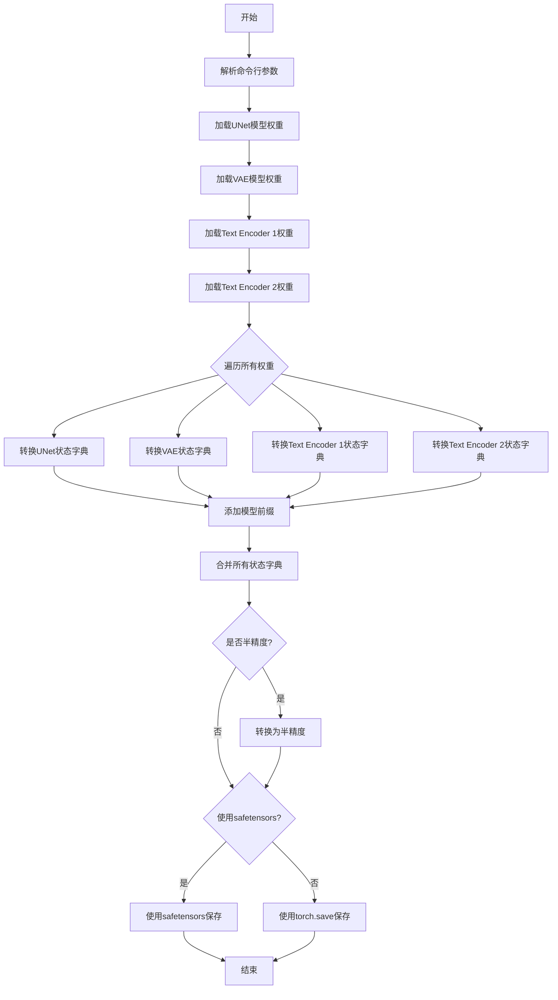
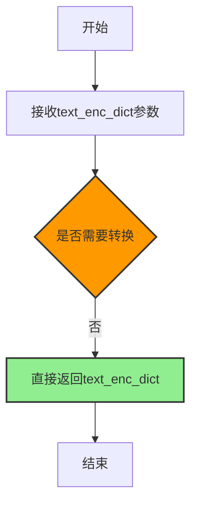
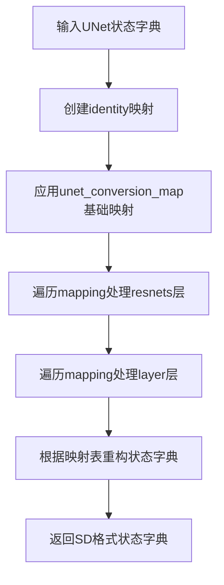
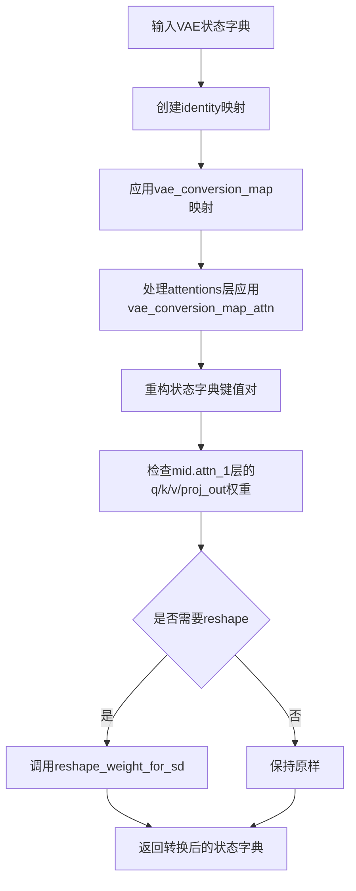
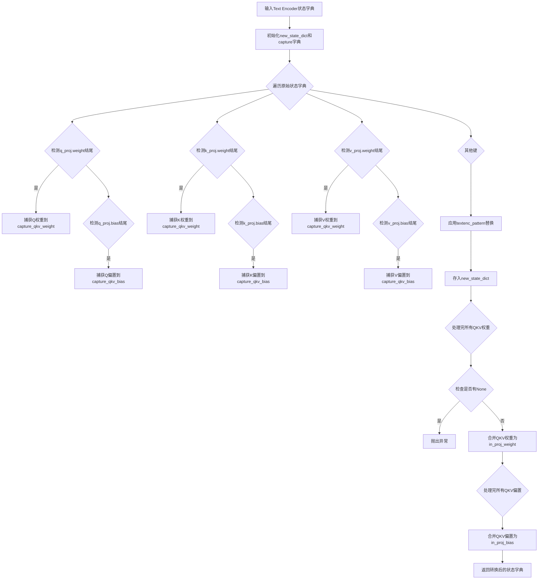
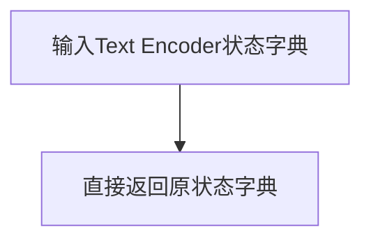

# `diffusers\scripts\convert_diffusers_to_original_sdxl.py` 详细设计文档

该脚本用于将Hugging Face Diffusers格式保存的管道转换为Stable Diffusion检查点格式，仅转换UNet、VAE和Text Encoder三个核心组件，支持safetensors和pytorch格式加载与保存。

## 整体流程



## 类结构

```
模块级别脚本 (无类定义)
├── 全局变量区
│   ├── unet_conversion_map (UNet映射表)
│   ├── unet_conversion_map_resnet (ResNet映射)
 │   ├── unet_conversion_map_layer (层级映射)
│   ├── vae_conversion_map (VAE映射表)
│   ├── vae_conversion_map_attn (VAE注意力映射)
│   ├── textenc_conversion_lst (文本编码器转换列表)
│   ├── protected (受保护的转换映射)
│   ├── textenc_pattern (文本编码器正则模式)
│   └── code2idx (QKV索引映射)
└── 全局函数区
    ├── convert_unet_state_dict
    ├── reshape_weight_for_sd
    ├── convert_vae_state_dict
    ├── convert_openclip_text_enc_state_dict
    └── convert_openai_text_enc_state_dict
```

## 全局变量及字段


### `unet_conversion_map`
    
UNet模型权重键名映射表，关联Stable Diffusion与HF Diffusers格式

类型：`List[Tuple[str, str]]`
    


### `unet_conversion_map_resnet`
    
UNet中ResNet层权重键名映射表，用于子模块名称转换

类型：`List[Tuple[str, str]]`
    


### `unet_conversion_map_layer`
    
UNet各层级权重键名映射表，通过循环动态生成包含downblocks/upblocks/midblock的映射

类型：`List[Tuple[str, str]]`
    


### `vae_conversion_map`
    
VAE模型权重键名映射表，关联Stable Diffusion与HF Diffusers格式

类型：`List[Tuple[str, str]]`
    


### `vae_conversion_map_attn`
    
VAE注意力层权重键名映射表，用于转换注意力机制相关权重名称

类型：`List[Tuple[str, str]]`
    


### `textenc_conversion_lst`
    
文本编码器权重键名转换规则列表，定义OpenAI与HF Diffusers格式的映射关系

类型：`List[Tuple[str, str]]`
    


### `protected`
    
转义后的文本编码器转换映射字典，用于正则表达式替换时的键值对存储

类型：`Dict[str, str]`
    


### `textenc_pattern`
    
编译后的文本编码器正则表达式模式，用于匹配和替换权重键名

类型：`re.Pattern`
    


### `code2idx`
    
QKV权重索引映射字典，将q/k/v字符映射到0/1/2索引位置

类型：`Dict[str, int]`
    


    

## 全局函数及方法


### `convert_unet_state_dict`

该函数用于将 HuggingFace Diffusers 保存的 UNet 模型状态字典（state_dict）转换为 Stable Diffusion 格式的状态字典。它通过多层映射规则重命名键名，以适配 Stable Diffusion 的模型结构。

参数：

- `unet_state_dict`：`Dict[str, torch.Tensor]`（实际为 Python dict），来自 HuggingFace Diffusers 格式的 UNet 状态字典，包含模型权重张量

返回值：`Dict[str, torch.Tensor]`，转换后的 Stable Diffusion 格式的 UNet 状态字典

#### 流程图

```mermaid
flowchart TD
    A[开始: convert_unet_state_dict] --> B[创建初始映射 mapping = {k: k for k in unet_state_dict.keys()}]
    B --> C[遍历 unet_conversion_map]
    C --> D[将 HF Diffusers 键名映射到 SD 键名]
    D --> E[遍历 mapping 中的每个键值对]
    E --> F{检查键名是否包含 'resnets'}
    F -->|是| G[遍历 unet_conversion_map_resnet]
    G --> H[替换 HF ResNet 组件名为 SD 格式]
    H --> I[更新 mapping[k]]
    F -->|否| J[继续下一个]
    I --> J
    J --> K[遍历 mapping 中的每个键值对]
    K --> L[遍历 unet_conversion_map_layer]
    L --> M[替换 HF 层名为 SD 格式]
    M --> N[更新 mapping[k]]
    N --> O[构建新状态字典 new_state_dict]
    O --> P[使用映射关系重新组织键名和对应的张量值]
    P --> Q[返回 new_state_dict]
```

#### 带注释源码

```python
def convert_unet_state_dict(unet_state_dict):
    """
    将 HuggingFace Diffusers 格式的 UNet 状态字典转换为 Stable Diffusion 格式。

    注意：这是一个脆弱的函数，正确输出需要所有组件按照特定顺序精确配合。
    """
    # 第一步：创建初始映射，键名保持不变（identity mapping）
    # 例如："down_blocks.0.resnets.0.weight" -> "down_blocks.0.resnets.0.weight"
    mapping = {k: k for k in unet_state_dict.keys()}
    
    # 第二步：应用 unet_conversion_map 进行基础键名转换
    # 将 HF Diffusers 的键名映射到 Stable Diffusion 的键名
    # 例如："time_embedding.linear_1.weight" -> "time_embed.0.weight"
    for sd_name, hf_name in unet_conversion_map:
        mapping[hf_name] = sd_name
    
    # 第三步：处理 ResNet 层的键名转换
    # 遍历当前 mapping，对包含 'resnets' 的键进行进一步转换
    # 例如：将 "down_blocks.0.resnets.0.norm1" 转换为 "input_blocks.1.0.in_layers.0"
    for k, v in mapping.items():
        if "resnets" in k:
            # 遍历 resnet 特定转换映射
            for sd_part, hf_part in unet_conversion_map_resnet:
                v = v.replace(hf_part, sd_part)
            mapping[k] = v
    
    # 第四步：处理所有层的键名转换（包括 downblocks、upblocks、midblock 等）
    # 这是一个更通用的层名称转换，处理 down_blocks、up_blocks 等结构
    # 例如：将 "down_blocks.0.attentions.0.to_q.weight" 转换为 "input_blocks.4.1.to_q.weight"
    for k, v in mapping.items():
        for sd_part, hf_part in unet_conversion_map_layer:
            v = v.replace(hf_part, sd_part)
        mapping[k] = v
    
    # 第五步：根据映射构建新的状态字典
    # 遍历映射关系，将 HF 键名对应的值赋给 SD 键名
    # 即：new_state_dict[SD键名] = unet_state_dict[HF键名]
    new_state_dict = {sd_name: unet_state_dict[hf_name] for hf_name, sd_name in mapping.items()}
    
    # 返回转换后的 Stable Diffusion 格式状态字典
    return new_state_dict
```


### `reshape_weight_for_sd`

该函数用于将 HuggingFace Diffusers 格式的模型权重转换为 Stable Diffusion 格式的权重。具体来说，它将线性层（Linear）的 2D 权重转换为卷积层（Conv2d）的 4D 权重，通过在权重张量的最后两个维度添加 1x1 的维度来实现。对于一维张量（如偏置项），则直接返回不做处理。

参数：

- `w`：`torch.Tensor`，待转换的模型权重张量

返回值：`torch.Tensor`，转换后的模型权重张量

#### 流程图

```mermaid
flowchart TD
    A[开始: 输入权重张量 w] --> B{w.ndim == 1?}
    B -->|是| C[直接返回 w]
    B -->|否| D[执行 w.reshape(*w.shape, 1, 1)]
    D --> E[返回重塑后的4D权重张量]
    C --> E
```

#### 带注释源码

```python
def reshape_weight_for_sd(w):
    """
    将 HuggingFace Diffusers 格式的权重转换为 Stable Diffusion 格式。
    主要是将线性层权重转换为卷积层权重。

    参数:
        w (torch.Tensor): 输入的权重张量

    返回:
        torch.Tensor: 转换后的权重张量
    """
    # convert HF linear weights to SD conv2d weights
    # 检查权重张量是否为一维（通常是偏置项）
    if not w.ndim == 1:
        # 如果不是一维（是线性层权重），则重塑为4D张量
        # 将 [out_features, in_features] 转换为 [out_features, in_features, 1, 1]
        # 这样可以将 Linear 层权重用于 Conv2d 层
        return w.reshape(*w.shape, 1, 1)
    else:
        # 如果是一维（偏置项），直接返回，不需要转换
        return w
```


### `convert_vae_state_dict`

该函数用于将 Hugging Face Diffusers 保存的 VAE（变分自编码器）模型状态字典转换为 Stable Diffusion 格式，处理键名的映射和权重形状的转换。

参数：

- `vae_state_dict`：`dict`，Hugging Face Diffusers 格式的 VAE 状态字典，包含模型的权重参数

返回值：`dict`，转换后的 Stable Diffusion 格式的 VAE 状态字典

#### 流程图

```mermaid
flowchart TD
    A[开始: 输入 vae_state_dict] --> B[创建初始映射 mapping = {k: k for k in vae_state_dict.keys}]
    B --> C[遍历 mapping 使用 vae_conversion_map 替换键名]
    C --> D{键中是否包含 'attentions'}
    D -->|是| E[使用 vae_conversion_map_attn 替换键名]
    D -->|否| F[跳过注意力层替换]
    E --> G[创建新状态字典 new_state_dict, 键值反转]
    F --> G
    G --> H{遍历 new_state_dict 的键}
    H --> I{检查是否为 mid.attn_1 权重}
    I -->|是| J[调用 reshape_weight_for_sd 调整权重形状]
    I -->|否| K[保持原权重不变]
    J --> L[返回转换后的 new_state_dict]
    K --> L
```

#### 带注释源码

```python
def convert_vae_state_dict(vae_state_dict):
    # 第一步：创建初始映射，将每个键映射到自身
    # 这为后续的替换操作提供了一个可修改的字典副本
    mapping = {k: k for k in vae_state_dict.keys()}
    
    # 第二步：遍历映射字典，使用 vae_conversion_map 中的规则替换键名
    # vae_conversion_map 包含从 HuggingFace Diffusers 格式到 Stable Diffusion 格式的映射
    # 例如：'encoder.down_blocks.0.resnets.0.' -> 'encoder.down.0.block.0.'
    for k, v in mapping.items():
        for sd_part, hf_part in vae_conversion_map:
            v = v.replace(hf_part, sd_part)
        mapping[k] = v
    
    # 第三步：处理注意力层（attentions）的特殊映射
    # 对于键中包含 "attentions" 的项，应用额外的注意力层映射规则
    # vae_conversion_map_attn 包含注意力层子模块的映射（如 q->to_q, k->to_k 等）
    for k, v in mapping.items():
        if "attentions" in k:
            for sd_part, hf_part in vae_conversion_map_attn:
                v = v.replace(hf_part, sd_part)
            mapping[k] = v
    
    # 第四步：创建新的状态字典，键值对反转
    # 即 mapping 中的键是 HF 格式的值，值是 SD 格式的键
    # 这样可以用新的键名获取原始权重
    new_state_dict = {v: vae_state_dict[k] for k, v in mapping.items()}
    
    # 第五步：处理特殊权重形状转换
    # 对于中间注意力层（mid.attn_1）的 q, k, v, proj_out 权重
    # 需要从线性层权重转换为卷积层权重格式（添加额外的维度）
    weights_to_convert = ["q", "k", "v", "proj_out"]
    for k, v in new_state_dict.items():
        for weight_name in weights_to_convert:
            if f"mid.attn_1.{weight_name}.weight" in k:
                print(f"Reshaping {k} for SD format")
                # 调用 reshape_weight_for_sd 将 1D 权重转换为 2D 卷积权重
                new_state_dict[k] = reshape_weight_for_sd(v)
    
    # 返回转换后的状态字典
    return new_state_dict
```


### `convert_openclip_text_enc_state_dict`

该函数用于将 HuggingFace Diffusers 保存的 OpenCLIP 文本编码器状态字典转换为 Stable Diffusion 格式。核心逻辑是处理 QKV（Query、Key、Value）权重，将分离的 q_proj、k_proj、v_proj 权重合并为 in_proj_weight，同时对其他参数进行键名重映射以适配 Stable Diffusion 格式。

参数：

- `text_enc_dict`：`Dict[str, torch.Tensor]`，HuggingFace Diffusers 格式的 OpenCLIP 文本编码器状态字典，包含模型权重参数

返回值：`Dict[str, torch.Tensor]`，转换后的 Stable Diffusion 格式文本编码器状态字典

#### 流程图

```mermaid
flowchart TD
    A[开始: text_enc_dict] --> B[初始化空字典: new_state_dict, capture_qkv_weight, capture_qkv_bias]
    B --> C{遍历 text_enc_dict 中的每个键值对}
    C --> D{检查键是否以 .self_attn.q_proj.weight 结尾}
    D -->|是| E[提取 k_pre 和 k_code]
    E --> F{capture_qkv_weight 中是否存在 k_pre}
    F -->|否| G[初始化 capture_qkv_weight[k_pre] = [None, None, None]]
    G --> H[根据 code2idx[k_code] 存储 v]
    F -->|是| H
    H --> C
    D --> I{检查键是否以 .self_attn.q_proj.bias 结尾}
    I -->|是| J[提取 k_pre 和 k_code]
    J --> K{capture_qkv_bias 中是否存在 k_pre}
    K -->|否| L[初始化 capture_qkv_bias[k_pre] = [None, None, None]]
    L --> M[根据 code2idx[k_code] 存储 v]
    K -->|是| M
    M --> C
    I -->|否| N[使用 textenc_pattern 重命名键]
    N --> O[new_state_dict[relabelled_key] = v]
    O --> C
    C --> P{遍历完成}
    P --> Q{capture_qkv_weight 中的每个 k_pre, tensors}
    Q --> R{tensors 中是否有 None}
    R -->|是| S[抛出异常: CORRUPTED MODEL]
    R -->|否| T[重命名 k_pre]
    T --> U[new_state_dict[relabelled_key + '.in_proj_weight'] = torch.cat(tensors)]
    U --> Q
    Q --> V{capture_qkv_bias 中的每个 k_pre, tensors}
    V --> W{tensors 中是否有 None}
    W -->|是| X[抛出异常: CORRUPTED MODEL]
    W -->|否| Y[重命名 k_pre]
    Y --> Z[new_state_dict[relabelled_key + '.in_proj_bias'] = torch.cat(tensors)]
    Z --> AA[返回 new_state_dict]
```

#### 带注释源码

```python
def convert_openclip_text_enc_state_dict(text_enc_dict):
    """
    将 HuggingFace Diffusers 格式的 OpenCLIP 文本编码器状态字典转换为 Stable Diffusion 格式。
    
    主要转换逻辑：
    1. 将分离的 q_proj、k_proj、v_proj 权重合并为 in_proj_weight
    2. 将分离的 q_proj、k_proj、v_proj 偏置合并为 in_proj_bias
    3. 使用预定义的正则表达式模式重映射其他键名
    
    参数:
        text_enc_dict: HuggingFace Diffusers 格式的 OpenCLIP 文本编码器状态字典
        
    返回值:
        转换后的 Stable Diffusion 格式状态字典
    """
    # 初始化输出字典和用于临时存储 QKV 权重/偏置的字典
    new_state_dict = {}
    capture_qkv_weight = {}
    capture_qkv_bias = {}
    
    # 第一次遍历：分离 QKV 权重和偏置，并对其他参数进行键名重映射
    for k, v in text_enc_dict.items():
        # 检查是否为 QKV 权重之一 (q_proj, k_proj, v_proj)
        if (
            k.endswith(".self_attn.q_proj.weight")
            or k.endswith(".self_attn.k_proj.weight")
            or k.endswith(".self_attn.v_proj.weight")
        ):
            # 提取前缀（例如：transformer.resblocks.0.attn.）
            k_pre = k[: -len(".q_proj.weight")]
            # 提取键码（q, k, v 之一）
            k_code = k[-len("q_proj.weight")]
            
            # 如果该前缀尚未在 capture_qkv_weight 中，初始化为 [None, None, None]
            if k_pre not in capture_qkv_weight:
                capture_qkv_weight[k_pre] = [None, None, None]
            
            # 根据 code2idx 将权重存储到对应位置（code2idx = {"q": 0, "k": 1, "v": 2}）
            capture_qkv_weight[k_pre][code2idx[k_code]] = v
            continue  # 跳过后续处理

        # 检查是否为 QKV 偏置之一
        if (
            k.endswith(".self_attn.q_proj.bias")
            or k.endswith(".self_attn.k_proj.bias")
            or k.endswith(".self_attn.v_proj.bias")
        ):
            # 提取前缀
            k_pre = k[: -len(".q_proj.bias")]
            # 提取键码
            k_code = k[-len("q_proj.bias")]
            
            # 如果该前缀尚未在 capture_qkv_bias 中，初始化为 [None, None, None]
            if k_pre not in capture_qkv_bias:
                capture_qkv_bias[k_pre] = [None, None, None]
            
            # 根据 code2idx 将偏置存储到对应位置
            capture_qkv_bias[k_pre][code2idx[k_code]] = v
            continue  # 跳过后续处理

        # 对于非 QKV 参数，使用正则表达式模式进行键名重映射
        # 例如：transformer.resblocks. -> text_model.encoder.layers.
        relabelled_key = textenc_pattern.sub(lambda m: protected[re.escape(m.group(0))], k)
        new_state_dict[relabelled_key] = v

    # 第二次遍历：合并 QKV 权重为 in_proj_weight
    for k_pre, tensors in capture_qkv_weight.items():
        # 检查是否有缺失的 QKV 权重
        if None in tensors:
            raise Exception("CORRUPTED MODEL: one of the q-k-v values for the text encoder was missing")
        
        # 对前缀进行键名重映射
        relabelled_key = textenc_pattern.sub(lambda m: protected[re.escape(m.group(0))], k_pre)
        
        # 使用 torch.cat 将分离的 q、k、v 权重沿维度 0 拼接成 in_proj_weight
        # 这是 OpenAI 格式文本编码器的标准权重组织方式
        new_state_dict[relabelled_key + ".in_proj_weight"] = torch.cat(tensors)

    # 第三次遍历：合并 QKV 偏置为 in_proj_bias
    for k_pre, tensors in capture_qkv_bias.items():
        # 检查是否有缺失的 QKV 偏置
        if None in tensors:
            raise Exception("CORRUPTED MODEL: one of the q-k-v values for the text encoder was missing")
        
        # 对前缀进行键名重映射
        relabelled_key = textenc_pattern.sub(lambda m: protected[re.escape(m.group(0))], k_pre)
        
        # 使用 torch.cat 将分离的 q、k、v 偏置拼接成 in_proj_bias
        new_state_dict[relabelled_key + ".in_proj_bias"] = torch.cat(tensors)

    return new_state_dict
```


### `convert_openai_text_enc_state_dict`

该函数用于将OpenAI文本编码器的状态字典进行格式转换，以便与Stable Diffusion checkpoint兼容。然而，当前实现仅为一个透传函数，直接返回输入的状态字典，不做任何转换处理，这可能是为了保持API一致性或作为未来扩展的占位符。

参数：

- `text_enc_dict`：`Dict[str, torch.Tensor]`，OpenAI文本编码器的模型状态字典，包含模型权重和偏置等参数

返回值：`Dict[str, torch.Tensor]`，返回转换后的状态字典（当前版本直接返回输入）

#### 流程图



#### 带注释源码

```python
def convert_openai_text_enc_state_dict(text_enc_dict):
    """
    转换OpenAI文本编码器的状态字典格式。
    
    该函数用于将HuggingFace Diffusers格式的OpenAI文本编码器权重
    转换为Stable Diffusion checkpoint格式。然而，当前实现仅为
    一个透传(pass-through)函数，直接返回输入的状态字典，不做任何
    实际转换。这可能是出于以下考虑：
    1. 保持与convert_openclip_text_enc_state_dict的API一致性
    2. 作为未来实际转换逻辑的占位符
    3. OpenAI格式的文本编码器可能不需要转换
    
    参数:
        text_enc_dict: 包含OpenAI文本编码器权重和偏置的状态字典
        
    返回:
        直接返回输入的text_enc_dict，未做任何转换
    """
    return text_enc_dict
```

#### 技术说明

| 项目 | 说明 |
|------|------|
| **设计目标** | 提供统一的文本编码器状态字典转换接口 |
| **当前实现** | 透传函数，无实际转换逻辑 |
| **潜在优化** | 若OpenAI文本编码器需要特定转换逻辑，应在此处实现；否则可考虑移除或添加文档说明为何不需要转换 |
| **错误处理** | 当前无错误处理，直接返回输入 |
| **调用位置** | 在`__main__`中被调用：`text_enc_dict = convert_openai_text_enc_state_dict(text_enc_dict)` |

## 关键组件


### 一段话描述

该代码是一个用于将HuggingFace Diffusers保存的Pipeline转换为Stable Diffusion检查点的转换脚本，主要转换UNet、VAE和Text Encoder三个核心组件的模型权重，通过名称映射表实现HF Diffusers格式到SD格式的转换，并支持safetensors和pytorch两种模型文件格式的加载与保存。

### 文件的整体运行流程

1. **入口** (`if __name__ == "__main__":`)：解析命令行参数
2. **模型加载**：根据路径分别加载UNet、VAE、Text Encoder 1和Text Encoder 2的权重
3. **格式检测**：优先尝试加载safetensors格式，失败则回退到pytorch bin格式
4. **UNet转换**：调用`convert_unet_state_dict`进行名称映射，添加"model.diffusion_model."前缀
5. **VAE转换**：调用`convert_vae_state_dict`进行名称映射，添加"first_stage_model."前缀
6. **Text Encoder 1转换**：调用`convert_openai_text_enc_state_dict`，添加对应前缀
7. **Text Encoder 2转换**：调用`convert_openclip_text_enc_state_dict`，添加对应前缀并转置投影矩阵
8. **合并与保存**：合并所有状态字典，根据参数决定是否使用半精度，最后保存到指定路径

### 全局变量详细信息

#### unet_conversion_map

- **类型**: List[Tuple[str, str]]
- **描述**: Stable Diffusion与HF Diffusers之间UNet层名称映射表，包含time_embed、input_blocks、out等核心层的前后映射关系

#### unet_conversion_map_resnet

- **类型**: List[Tuple[str, str]]
- **描述**: UNet中ResNet块的内部层名称映射表，用于转换norm1、conv1、norm2、conv2、time_emb_proj、conv_shortcut等层名称

#### unet_conversion_map_layer

- **类型**: List[Tuple[str, str]]
- **描述**: 通过循环生成的UNet层名称映射表，涵盖down_blocks、up_blocks中的resnets、attentions、downsamplers、upsamplers以及middle_block的映射关系

#### vae_conversion_map

- **类型**: List[Tuple[str, str]]
- **描述**: VAE模型的状态字典名称映射表，包含encoder和decoder的down_blocks、up_blocks、mid_block等层的名称转换规则

#### vae_conversion_map_attn

- **类型**: List[Tuple[str, str]]
- **描述**: VAE注意力机制的层名称映射表，用于转换group_norm、to_q、to_k、to_v、to_out.0等注意力相关层名称

#### textenc_conversion_lst

- **类型**: List[Tuple[str, str]]
- **描述**: Text Encoder的转换规则列表，包含transformer.resblocks、ln_1、ln_2、c_fc、c_proj、attn、ln_final、token_embedding、positional_embedding等的映射

#### protected

- **类型**: Dict[str, str]
- **描述**: 用于正则表达式替换的受保护映射表，将textenc_conversion_lst中的HF名称转为SD名称

#### textenc_pattern

- **类型**: re.Pattern
- **描述**: 编译后的正则表达式模式，用于在Text Encoder状态字典键名替换时匹配需要转换的部分

#### code2idx

- **类型**: Dict[str, int]
- **描述**: QKV索引映射字典，将"q"、"k"、"v"字符映射到索引0、1、2，用于合并QKV权重

### 函数详细信息

#### convert_unet_state_dict

- **参数**:
  - `unet_state_dict`: Dict[str, torch.Tensor] - HF Diffusers格式的UNet状态字典
- **返回值类型**: Dict[str, torch.Tensor]
- **返回值描述**: 转换后的Stable Diffusion格式UNet状态字典
- **mermaid流程图**:

- **源码**:
```python
def convert_unet_state_dict(unet_state_dict):
    # buyer beware: this is a *brittle* function,
    # and correct output requires that all of these pieces interact in
    # the exact order in which I have arranged them.
    mapping = {k: k for k in unet_state_dict.keys()}
    for sd_name, hf_name in unet_conversion_map:
        mapping[hf_name] = sd_name
    for k, v in mapping.items():
        if "resnets" in k:
            for sd_part, hf_part in unet_conversion_map_resnet:
                v = v.replace(hf_part, sd_part)
            mapping[k] = v
    for k, v in mapping.items():
        for sd_part, hf_part in unet_conversion_map_layer:
            v = v.replace(hf_part, sd_part)
        mapping[k] = v
    new_state_dict = {sd_name: unet_state_dict[hf_name] for hf_name, sd_name in mapping.items()}
    return new_state_dict
```

#### reshape_weight_for_sd

- **参数**:
  - `w`: torch.Tensor - HF格式的权重张量
- **返回值类型**: torch.Tensor
- **返回值描述**: 转换为SD格式的权重张量，将线性层权重reshape为卷积核形状
- **mermaid流程图**:
```mermaid
flowchart TD
    A[输入权重张量] --> B{判断维度是否为1}
    B -->|是| C[返回原始张量]
    B -->|否| D[reshape为w.shape + (1, 1)]
    D --> E[返回reshape后的张量]
```
- **源码**:
```python
def reshape_weight_for_sd(w):
    # convert HF linear weights to SD conv2d weights
    if not w.ndim == 1:
        return w.reshape(*w.shape, 1, 1)
    else:
        return w
```

#### convert_vae_state_dict

- **参数**:
  - `vae_state_dict`: Dict[str, torch.Tensor] - HF Diffusers格式的VAE状态字典
- **返回值类型**: Dict[str, torch.Tensor]
- **返回值描述**: 转换后的Stable Diffusion格式VAE状态字典
- **mermaid流程图**:

- **源码**:
```python
def convert_vae_state_dict(vae_state_dict):
    mapping = {k: k for k in vae_state_dict.keys()}
    for k, v in mapping.items():
        for sd_part, hf_part in vae_conversion_map:
            v = v.replace(hf_part, sd_part)
        mapping[k] = v
    for k, v in mapping.items():
        if "attentions" in k:
            for sd_part, hf_part in vae_conversion_map_attn:
                v = v.replace(hf_part, sd_part)
            mapping[k] = v
    new_state_dict = {v: vae_state_dict[k] for k, v in mapping.items()}
    weights_to_convert = ["q", "k", "v", "proj_out"]
    for k, v in new_state_dict.items():
        for weight_name in weights_to_convert:
            if f"mid.attn_1.{weight_name}.weight" in k:
                print(f"Reshaping {k} for SD format")
                new_state_dict[k] = reshape_weight_for_sd(v)
    return new_state_dict
```

#### convert_openclip_text_enc_state_dict

- **参数**:
  - `text_enc_dict`: Dict[str, torch.Tensor] - HF OpenCLIP格式的Text Encoder状态字典
- **返回值类型**: Dict[str, torch.Tensor]
- **返回值描述**: 转换后的Stable Diffusion格式Text Encoder状态字典，合并了分离的QKV权重
- **mermaid流程图**:

- **源码**:
```python
def convert_openclip_text_enc_state_dict(text_enc_dict):
    new_state_dict = {}
    capture_qkv_weight = {}
    capture_qkv_bias = {}
    for k, v in text_enc_dict.items():
        if (
            k.endswith(".self_attn.q_proj.weight")
            or k.endswith(".self_attn.k_proj.weight")
            or k.endswith(".self_attn.v_proj.weight")
        ):
            k_pre = k[: -len(".q_proj.weight")]
            k_code = k[-len("q_proj.weight")]
            if k_pre not in capture_qkv_weight:
                capture_qkv_weight[k_pre] = [None, None, None]
            capture_qkv_weight[k_pre][code2idx[k_code]] = v
            continue

        if (
            k.endswith(".self_attn.q_proj.bias")
            or k.endswith(".self_attn.k_proj.bias")
            or k.endswith(".self_attn.v_proj.bias")
        ):
            k_pre = k[: -len(".q_proj.bias")]
            k_code = k[-len("q_proj.bias")]
            if k_pre not in capture_qkv_bias:
                capture_qkv_bias[k_pre] = [None, None, None]
            capture_qkv_bias[k_pre][code2idx[k_code]] = v
            continue

        relabelled_key = textenc_pattern.sub(lambda m: protected[re.escape(m.group(0))], k)
        new_state_dict[relabelled_key] = v

    for k_pre, tensors in capture_qkv_weight.items():
        if None in tensors:
            raise Exception("CORRUPTED MODEL: one of the q-k-v values for the text encoder was missing")
        relabelled_key = textenc_pattern.sub(lambda m: protected[re.escape(m.group(0))], k_pre)
        new_state_dict[relabelled_key + ".in_proj_weight"] = torch.cat(tensors)

    for k_pre, tensors in capture_qkv_bias.items():
        if None in tensors:
            raise Exception("CORRUPTED MODEL: one of the q-k-v values for the text encoder was missing")
        relabelled_key = textenc_pattern.sub(lambda m: protected[re.escape(m.group(0))], k_pre)
        new_state_dict[relabelled_key + ".in_proj_bias"] = torch.cat(tensors)

    return new_state_dict
```

#### convert_openai_text_enc_state_dict

- **参数**:
  - `text_enc_dict`: Dict[str, torch.Tensor] - HF OpenAI格式的Text Encoder状态字典
- **返回值类型**: Dict[str, torch.Tensor]
- **返回值描述**: 直接返回原始状态字典，OpenAI格式无需转换
- **mermaid流程图**:

- **源码**:
```python
def convert_openai_text_enc_state_dict(text_enc_dict):
    return text_enc_dict
```

### 关键组件信息

#### UNet状态字典转换器

负责将HuggingFace Diffusers格式的UNet权重映射到Stable Diffusion格式，包含三个映射表分别处理基础层、ResNet块和循环生成的层结构

#### VAE状态字典转换器

负责将VAE模型权重从HF格式转换为SD格式，特别处理了attention层的权重重塑以适应不同的权重布局

#### Text Encoder转换器

包含两个转换函数：OpenAI版本直接传递不做处理，OpenCLIP版本则需要合并分离的QKV权重为in_proj权重

#### 模型加载模块

根据文件路径自动检测并加载safetensors或pytorch bin格式的模型权重，支持四种模型类型的加载

#### 检查点保存模块

将转换后的所有状态字典合并，根据命令行参数决定是否使用半精度保存，并支持safetensors和ckpt两种输出格式

### 潜在的技术债务或优化空间

1. **硬编码的层数**: 代码中硬编码了3个downblocks和upblocks的数量，循环次数固定为3和4，缺乏对其他网络结构的适应性

2. **脆弱的映射函数**: 代码注释中明确指出`convert_unet_state_dict`是一个"brittle"函数，依赖精确的顺序，任何层结构变化都可能导致转换失败

3. **重复遍历**: 多次遍历mapping字典进行替换操作，可以合并以提高效率

4. **缺乏单元测试**: 缺少对转换逻辑的单元测试，覆盖率不足

5. **Error处理不足**: 文件不存在时的错误处理较弱，只是简单断言，没有友好的错误提示

6. **SDXL支持不完整**: 虽然有部分SDXL相关的映射(如add_embedding)，但整体支持较为基础

### 其它项目

#### 设计目标与约束

- 仅转换UNet、VAE和Text Encoder三个核心组件
- 不转换优化器状态或其他辅助数据
- 保持权重数值不变，仅转换命名空间结构
- 支持SD 1.x和SDXL两种架构

#### 错误处理与异常设计

- 命令行参数必须提供model_path和checkpoint_path，否则抛出AssertionError
- QKV权重缺失时抛出"CORRUPTED MODEL"异常
- 文件不存在时直接断言失败，缺乏容错机制
- 使用print语句输出reshape信息，缺少统一的日志系统

#### 数据流与状态机

- 数据流为：加载HF模型 → 转换各组件状态字典 → 合并到统一命名空间 → 保存为SD格式
- 无复杂状态机设计，流程为线性转换

#### 外部依赖与接口契约

- 依赖`torch`进行张量操作
- 依赖`safetensors`库进行高效张量加载/保存
- 依赖`argparse`处理命令行参数
- 输入为HF Diffusers目录结构，输出为SD checkpoint文件


## 问题及建议


### 已知问题

-   **硬编码的网络结构参数**：代码中多处硬编码了3个downblocks/upblocks、2个resnets等参数，缺乏灵活性，无法适配其他网络结构（如SDXL的不同配置）。
-   **脆弱的转换逻辑**：`convert_unet_state_dict` 函数内部明确标注为"brittle"函数，依赖字符串替换和顺序执行，容易因版本变化而失效。
-   **使用assert进行参数验证**：在`__main__`部分使用`assert`而非`raise ValueError/ArgumentTypeError`，导致错误信息不明确，且在Python优化模式下（-O）会被跳过。
-   **缺乏异常处理**：文件加载部分（`load_file`、`torch.load`）未使用try-except包装，若文件损坏或路径错误会导致程序直接崩溃。
-   **无类型注解**：所有函数均缺少参数和返回值的类型提示，影响代码可维护性和IDE支持。
-   **重复迭代**：转换过程中多次遍历state_dict（如UNet转换有三层循环映射），效率较低。
-   **未使用的变量**：`vae_path`在if-else块后被重新赋值，原路径值后续未使用。
-   **文本编码器转换不一致**：`convert_openai_text_enc_state_dict`直接返回原state_dict，未做任何转换，逻辑不完整。
-   **Magic Numbers**：多处使用如`3 * i + j + 1`、`3 - i`等计算公式，缺乏常量定义，可读性差。
-   **print用于调试**：`reshape_weight_for_sd`中使用print输出信息，应使用logging模块。

### 优化建议

-   **参数化配置**：将网络层数、resnets数量等提取为配置参数或从模型元数据中读取。
-   **改进错误处理**：为文件加载添加try-except，使用`argparse`的`type`参数或自定义`ArgumentTypeError`进行参数验证。
-   **添加类型注解**：为所有函数添加Python类型提示。
-   **单次遍历优化**：合并多次state_dict迭代为单次处理，使用更高效的数据结构。
-   **统一日志系统**：替换print语句为logging模块，区分debug/info/warning级别。
-   **重构转换逻辑**：将字符串替换逻辑抽象为更健壮的映射系统，考虑使用配置文件定义映射规则。
-   **补充文档**：为关键函数添加docstring说明输入输出格式和转换规则。
-   **完善文本编码器转换**：审视`convert_openai_text_enc_state_dict`逻辑，确保两端格式一致性。
-   **定义常量**：将魔数提取为命名常量，如`NUM_DOWN_BLOCKS = 3`等。

## 其它


### 设计目标与约束

本脚本的设计目标是将HuggingFace Diffusers格式保存的pipeline转换为Stable Diffusion checkpoint格式，仅转换UNet、VAE和Text Encoder三个核心组件，不涉及优化器状态或其他辅助数据的转换。约束条件包括：只支持特定的Stable Diffusion版本（SD 1.x、SDXL），转换映射关系针对固定版本硬编码，不具备通用性。

### 错误处理与异常设计

代码在以下场景进行错误处理：1）命令行参数校验，使用assert确保model_path和checkpoint_path非空；2）模型文件加载时优先尝试safetensors格式，失败则回退到pytorch bin格式；3）Text Encoder转换时检查QKV权重完整性，若缺失则抛出"CORRUPTED MODEL"异常；4）VAE中间块注意力层权重reshape时打印提示信息。整体错误处理粒度较粗，缺乏细粒度的异常捕获和用户友好的错误提示。

### 数据流与状态机

数据流遵循以下路径：1）模型加载阶段按顺序读取unet、vae、text_encoder、text_encoder_2的权重文件；2）转换阶段分别为每个组件调用对应的convert函数进行状态字典键名映射；3）输出阶段将转换后的状态字典合并，并可选进行半精度转换和格式转换（safetensors或ckpt）。状态转换过程为单向流式处理，无复杂状态机逻辑。

### 外部依赖与接口契约

主要依赖包括：argparse（命令行参数解析）、os.path（路径操作）、re（正则表达式匹配）、torch（张量操作）、safetensors.torch（安全张量文件加载/保存）。外部接口契约约定输入为包含子目录的Diffusers格式模型文件夹，输出为单一checkpoint文件（.ckpt或.safetensors）。模型组件路径遵循Diffusers目录结构规范（unet/diffusion_pytorch_model.*、vae/diffusion_pytorch_model.*等）。

### 性能考虑与资源消耗

转换过程主要消耗CPU和内存资源，内存占用取决于模型规模（通常数GB）。性能瓶颈在于：1）大模型状态字典的字典推导式转换；2）Text Encoder的QKV合并操作需多次遍历；3）文件IO操作（load_file/torch.load）。建议优化方向包括：使用torch.no Gilbert()减少梯度内存占用、考虑内存映射加载大文件、批量处理避免重复迭代。

### 版本兼容性与扩展性

当前实现针对SD 1.x和SDXL的特定版本硬编码了转换映射，缺乏对其他扩散模型架构的通用支持。扩展性受限体现在：转换映射表为静态数据，添加新架构需要手动维护映射关系。建议设计可插拔的转换策略模式，支持注册自定义转换器以适应不同模型架构。

### 安全性考虑

代码从文件系统加载模型权重并执行张量操作，安全性关注点包括：1）path traversal风险（model_path和checkpoint_path需验证合法性）；2）模型文件来源可信性（未进行签名校验）；3）内存安全（大张量操作可能触发OOM）。当前实现缺乏这些安全检查。

    