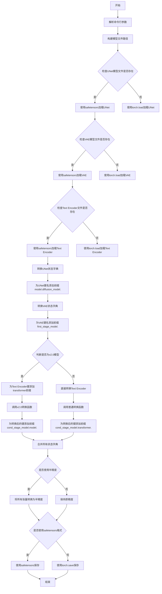
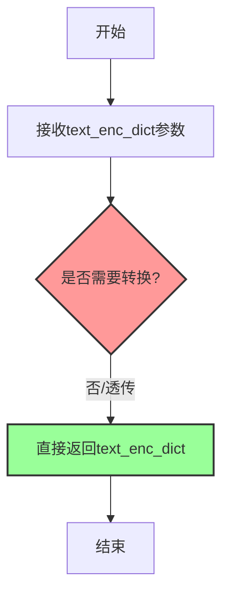

# `diffusers\scripts\convert_diffusers_to_original_stable_diffusion.py` 详细设计文档

该脚本用于将Hugging Face Diffusers格式保存的模型流水线（包含UNet、VAE和Text Encoder）转换为Stable Diffusion格式的检查点，仅转换模型权重而不包括优化器状态。脚本通过预定义的映射表和字符串替换规则，将Diffusers的模型键名转换为Stable Diffusion兼容的键名格式。

## 整体流程



## 类结构

```
本脚本为面向过程设计，无类层次结构
主要分为四个功能区域：
├── 全局变量区（转换映射表）
│   ├── UNet转换映射
│   ├── VAE转换映射
│   └── Text Encoder转换映射
├── UNet转换函数区
├── VAE转换函数区
└── Text Encoder转换函数区
```

## 全局变量及字段


### `unet_conversion_map`
    
UNet基础层名称映射列表，关联Stable Diffusion和HF Diffusers的键名

类型：`list[tuple[str, str]]`
    


### `unet_conversion_map_resnet`
    
UNet中ResNet层的名称映射列表，用于转换ResNet子层名称

类型：`list[tuple[str, str]]`
    


### `unet_conversion_map_layer`
    
通过循环生成的UNet层名称映射列表，包含downblocks/upblocks的层级对应关系

类型：`list[tuple[str, str]]`
    


### `vae_conversion_map`
    
VAE层名称映射列表，关联Stable Diffusion和HF Diffusers的VAE键名

类型：`list[tuple[str, str]]`
    


### `vae_conversion_map_attn`
    
VAE注意力层名称映射列表，用于转换注意力机制中的子层名称

类型：`list[tuple[str, str]]`
    


### `vae_extra_conversion_map`
    
VAE额外名称映射列表，处理mid.attn_1层的权重名称转换

类型：`list[tuple[str, str]]`
    


### `textenc_conversion_lst`
    
Text Encoder名称映射列表，关联SD和HF Diffusers的文本编码器键名

类型：`list[tuple[str, str]]`
    


### `protected`
    
Text Encoder转换的受保护键字典，用于正则替换的反向映射

类型：`dict[str, str]`
    


### `textenc_pattern`
    
编译后的Text Encoder转换正则表达式，用于批量替换键名

类型：`re.Pattern`
    


### `code2idx`
    
QKV索引映射字典，用于将q/k/v字符映射到数组索引位置以便重新组合权重

类型：`dict[str, int]`
    


    

## 全局函数及方法


### `convert_unet_state_dict`

该函数用于将 Hugging Face Diffusers 格式保存的 UNet 模型状态字典（State Dict）的键名转换为 Stable Diffusion 格式的键名。它主要处理模型层级命名规则的差异，例如时间嵌入层、输入输出卷积层以及 ResNet 块的前缀转换。

参数：

- `unet_state_dict`：`Dict[str, torch.Tensor]`，输入的 UNet 状态字典，键为 Hugging Face 格式的字符串，值为模型权重张量。

返回值：`Dict[str, torch.Tensor]`，转换后的新状态字典，键已更改为 Stable Diffusion 格式。

#### 流程图

```mermaid
graph TD
    A[输入: unet_state_dict (HF 格式)] --> B[初始化映射表 mapping: 键值对设为相同]
    B --> C[应用 unet_conversion_map: 直接替换特定层名称]
    C --> D{遍历 mapping 的键值对}
    D -->|是| E{检查键中是否包含 'resnets'}
    D -->|否| F[结束 Resnets 循环]
    E -->|是| G[应用 unet_conversion_map_resnet: 替换内部结构名称 (如 norm1 -> in_layers.0)]
    E -->|否| F
    G --> H[更新 mapping 中的值]
    H --> F
    F --> I{再次遍历 mapping 的键值对}
    I --> J[应用 unet_conversion_map_layer: 替换块结构前缀 (如 down_blocks -> input_blocks)]
    J --> K[更新 mapping 中的值]
    K --> L[构建新状态字典 new_state_dict: 键使用 mapping 转换后的值, 值使用原始键对应的值]
    L --> M[输出: unet_state_dict (SD 格式)]
```

#### 带注释源码

```python
def convert_unet_state_dict(unet_state_dict):
    # 注意：这是一个非常脆弱的函数，正确输出要求所有部分严格按照既定顺序交互。
    # 1. 初始化映射表：创建一个字典，键和值都是原始的 HF 格式键名。
    #    这相当于假设所有键都不需要改变。
    mapping = {k: k for k in unet_state_dict.keys()}
    
    # 2. 应用全局转换映射：处理 time_embedding, conv_in, conv_out 等独立层。
    #    这里将 HF 格式的键名映射到 SD 格式的键名。
    #    例如：time_embedding.linear_1.weight -> time_embed.0.weight
    for sd_name, hf_name in unet_conversion_map:
        mapping[hf_name] = sd_name
        
    # 3. 处理 ResNet 块内部的名称差异 (仅针对包含 "resnets" 的键)。
    #    例如：将 HF 的 "norm1" 替换为 SD 的 "in_layers.0"。
    for k, v in mapping.items():
        if "resnets" in k:
            for sd_part, hf_part in unet_conversion_map_resnet:
                v = v.replace(hf_part, sd_part)
            mapping[k] = v
            
    # 4. 处理层级结构的差异 (针对 DownBlocks, UpBlocks, MiddleBlock)。
    #    例如：将 HF 的 "down_blocks.0.resnets.0." 替换为 SD 的 "input_blocks.1.0."。
    for k, v in mapping.items():
        for sd_part, hf_part in unet_conversion_map_layer:
            v = v.replace(hf_part, sd_part)
        mapping[k] = v
        
    # 5. 生成新的状态字典。
    #    通过遍历旧的 mapping (k=HF键, v=SD键)，从原始 unet_state_dict 中取出张量，
    #    并用新的 SD 键名存储。
    new_state_dict = {v: unet_state_dict[k] for k, v in mapping.items()}
    return new_state_dict
```


### `reshape_weight_for_sd`

该函数用于将 Hugging Face Diffusers 格式的线性层权重转换为 Stable Diffusion 格式的卷积权重形状。当权重为多维张量时，在其末尾添加两个维度(1,1)以适配卷积操作；若权重已为一维（如偏置项），则直接返回不做处理。

参数：

- `w`：`torch.Tensor`，Hugging Face Diffusers 格式的线性层权重张量

返回值：`torch.Tensor`，转换为 Stable Diffusion 卷积权重形状后的张量

#### 流程图

```mermaid
flowchart TD
    A[开始: 接收权重张量 w] --> B{w.ndim == 1?}
    B -->|是| C[返回原始张量 w]
    B -->|否| D[执行 w.reshape(*w.shape, 1, 1)]
    D --> E[返回 reshape 后的张量]
```

#### 带注释源码

```python
def reshape_weight_for_sd(w):
    """
    将 HF 线性权重转换为 SD 卷积权重形状
    
    此函数用于在 VAE 状态字典转换过程中，将 Hugging Face Diffusers 
    格式的线性层权重转换为 Stable Diffusion 格式的卷积权重形状。
    Stable Diffusion 的某些权重需要从线性层格式 (out_features, in_features) 
    转换为卷积层格式 (out_features, in_features, 1, 1)。
    
    参数:
        w: torch.Tensor - Hugging Face Diffusers 格式的权重张量
        
    返回:
        torch.Tensor - 转换为 SD 卷积格式的权重张量
    """
    # 检查权重维度是否为1维（通常是偏置项）
    if not w.ndim == 1:
        # 多维权重（通常是线性层的 weight）：在末尾添加两个维度 (1, 1)
        # 将形状从 (out_features, in_features) 转换为 (out_features, in_features, 1, 1)
        return w.reshape(*w.shape, 1, 1)
    else:
        # 1维权重（偏置项）：直接返回，不需要 reshape
        return w
```

#### 设计意图说明

该函数是 VAE 状态字典转换流程中的关键组件。在 Hugging Face Diffusers 格式中，某些注意力层的投影权重（`to_q`, `to_k`, `to_v`, `to_out`）存储为线性层权重，但在 Stable Diffusion 格式中需要以卷积权重的方式存储，因此需要在末尾附加两个维度以适配卷积操作。


### `convert_vae_state_dict`

该函数负责将VAE模型的状态字典（state dict）从HuggingFace Diffusers格式转换为Stable Diffusion格式，通过替换键名中的特定前缀、调整注意力层参数命名，并对中间注意力层的权重进行重塑以适配SD格式。

参数：

- `vae_state_dict`：`Dict[str, torch.Tensor]`，HuggingFace Diffusers格式的VAE状态字典，包含模型权重张量

返回值：`Dict[str, torch.Tensor]`，转换后的Stable Diffusion格式的VAE状态字典

#### 流程图

```mermaid
flowchart TD
    A[开始] --> B[创建初始映射 mapping = {k: k for k in vae_state_dict.keys()}]
    B --> C[第一层循环: 遍历 mapping.items]
    C --> D{遍历 vae_conversion_map}
    D -->|替换| E[v = v.replace(hf_part, sd_part)]
    E --> F[mapping[k] = v]
    F --> C
    C --> G[第二层循环: 遍历 mapping.items]
    G --> H{检查 'attentions' in k}
    H -->|是| I[遍历 vae_conversion_map_attn 替换]
    I --> J[mapping[k] = v]
    H -->|否| K[跳过]
    J --> G
    K --> L[new_state_dict = {v: vae_state_dict[k] for k, v in mapping.items()}]
    L --> M[遍历 new_state_dict.items]
    M --> N{检查 mid.attn_1 权重}
    N -->|匹配| O[调用 reshape_weight_for_sd 重塑权重]
    N -->|不匹配| P[继续]
    O --> Q[检查 vae_extra_conversion_map 键名]
    Q -->|匹配| R[记录到 keys_to_rename]
    Q -->|不匹配| P
    R --> M
    P --> M
    M --> S{遍历 keys_to_rename}
    S --> T[应用键重命名并重新塑造权重]
    T --> U[删除旧键]
    S --> V[返回 new_state_dict]
    V --> Z[结束]
```

#### 带注释源码

```python
def convert_vae_state_dict(vae_state_dict):
    """
    将VAE状态字典从HuggingFace Diffusers格式转换为Stable Diffusion格式
    
    参数:
        vae_state_dict: HuggingFace Diffusers格式的VAE状态字典
        
    返回:
        Stable Diffusion格式的VAE状态字典
    """
    # 第一步：创建初始映射，将所有键映射到自身作为默认值
    # 映射格式: {hf键名: sd键名}
    mapping = {k: k for k in vae_state_dict.keys()}
    
    # 第二步：应用主要的前缀转换映射
    # 例如: "encoder.down_blocks.0.resnets.0." -> "encoder.down.0.block.0."
    for k, v in mapping.items():
        for sd_part, hf_part in vae_conversion_map:
            v = v.replace(hf_part, sd_part)
        mapping[k] = v
    
    # 第三步：对包含'attentions'的键应用注意力层特定的转换映射
    # 例如: "group_norm." -> "norm.", "query." -> "q."
    for k, v in mapping.items():
        if "attentions" in k:
            for sd_part, hf_part in vae_conversion_map_attn:
                v = v.replace(hf_part, sd_part)
            mapping[k] = v
    
    # 第四步：根据映射关系重新构建状态字典
    # 键名从HF格式转换为SD格式
    new_state_dict = {v: vae_state_dict[k] for k, v in mapping.items()}
    
    # 第五步：处理中间注意力层(mid.attn_1)的特殊权重
    weights_to_convert = ["q", "k", "v", "proj_out"]
    keys_to_rename = {}
    
    # 遍历新的状态字典，查找mid.attn_1层的权重
    for k, v in new_state_dict.items():
        # 检查是否需要重塑权重（将线性层权重转换为卷积层权重）
        for weight_name in weights_to_convert:
            if f"mid.attn_1.{weight_name}.weight" in k:
                print(f"Reshaping {k} for SD format")
                # 转换权重形状以适配SD格式
                new_state_dict[k] = reshape_weight_for_sd(v)
        
        # 检查是否需要重命名键（从to_q/to_k/to_v转换为q/k/v）
        for weight_name, real_weight_name in vae_extra_conversion_map:
            if f"mid.attn_1.{weight_name}.weight" in k or f"mid.attn_1.{weight_name}.bias" in k:
                keys_to_rename[k] = k.replace(weight_name, real_weight_name)
    
    # 第六步：应用键重命名
    for k, v in keys_to_rename.items():
        if k in new_state_dict:
            print(f"Renaming {k} to {v}")
            # 同时重塑权重并重命名键
            new_state_dict[v] = reshape_weight_for_sd(new_state_dict[k])
            del new_state_dict[k]
    
    return new_state_dict
```


### `convert_text_enc_state_dict_v20`

该函数是文本编码器（Text Encoder）v2.0（基于 OpenCLIP）模型权重转换的核心逻辑，负责将 Hugging Face Diffusers 格式的模型状态字典键名映射回 Stable Diffusion 格式，并处理自注意力机制中 Q、K、V 三个独立权重张量的合并操作。

参数：
- `text_enc_dict`：`Dict[str, torch.Tensor]`（或 `OrderedDict`），Hugging Face Diffusers 保存的 Text Encoder 模型权重字典，键名通常包含 `text_model.encoder.layers` 等层级结构。

返回值：`Dict[str, torch.Tensor]`，转换并合并后的 Stable Diffusion 格式模型状态字典，键名对应 SD 标准的 `resblocks` 结构，且 QKV 权重已合并为 `in_proj_weight` 和 `in_proj_bias`。

#### 流程图

```mermaid
flowchart TD
    A[开始: 输入 text_enc_dict] --> B[初始化 new_state_dict, capture_qkv_weight, capture_qkv_bias]
    B --> C{遍历 text_enc_dict 项}
    
    C --> D{检查键名是否为 QKV 权重\n.endsWith q_proj.weight / k_proj.weight / v_proj.weight}
    D -- 是 --> E[提取基础键名 k_pre 和 类型标识 k_code]
    E --> F[存储到 capture_qkv_weight[k_pre]]
    F --> C
    
    D -- 否 --> G{检查键名是否为 QKV Bias\n.endsWith q_proj.bias ...}
    G -- 是 --> H[提取基础键名 k_pre 和 类型标识 k_code]
    H --> I[存储到 capture_qkv_bias[k_pre]]
    I --> C
    
    G -- 否 --> J[使用 textenc_pattern 替换键名]
    J --> K[将转换后的键值对加入 new_state_dict]
    K --> C
    
    C -- 遍历结束 --> L{检查 capture_qkv_weight 完整性}
    L -- 有 None --> M[抛出异常: CORRUPTED MODEL]
    L -- 完整 --> N[遍历 capture_qkv_weight]
    
    N --> O[替换键名前缀]
    O --> P[使用 torch.cat 合并 q, k, v 权重]
    P --> Q[添加键名 .in_proj_weight 到 new_state_dict]
    Q --> R{遍历 capture_qkv_bias}
    
    R --> S[检查完整性 -> 替换前缀 -> 合并 Bias -> 添加 .in_proj_bias]
    S --> T[返回 new_state_dict]
    
    M --> T
```

#### 带注释源码

```python
def convert_text_enc_state_dict_v20(text_enc_dict):
    """
    将 HF Diffusers 的 Text Encoder v2.0 状态字典转换为 SD 格式。
    主要处理键名映射（主要是重命名层）和 QKV 权重的合并。
    """
    new_state_dict = {}
    # 用于暂存分离的 q, k, v 权重，key 是层的前缀，value 是 [q, k, v] 的列表
    capture_qkv_weight = {}
    # 用于暂存分离的 q, k, v 偏置
    capture_qkv_bias = {}

    # 遍历原始模型的所有参数
    for k, v in text_enc_dict.items():
        # 处理 QKV 权重：HF 格式通常将 q_proj, k_proj, v_proj 分开存储
        if (
            k.endswith(".self_attn.q_proj.weight")
            or k.endswith(".self_attn.k_proj.weight")
            or k.endswith(".self_attn.v_proj.weight")
        ):
            # 去掉 ".q_proj.weight" 后缀，获取层的前缀
            k_pre = k[: -len(".q_proj.weight")]
            # 获取是 q, k 还是 v (通过 "q_proj" 中的 'q')
            k_code = k[-len("q_proj.weight")]
            if k_pre not in capture_qkv_weight:
                capture_qkv_weight[k_pre] = [None, None, None]
            # 将权重存入列表对应位置 (q=0, k=1, v=2)
            capture_qkv_weight[k_pre][code2idx[k_code]] = v
            continue

        # 处理 QKV Bias
        if (
            k.endswith(".self_attn.q_proj.bias")
            or k.endswith(".self_attn.k_proj.bias")
            or k.endswith(".self_attn.v_proj.bias")
        ):
            k_pre = k[: -len(".q_proj.bias")]
            k_code = k[-len("q_proj.bias")]
            if k_pre not in capture_qkv_bias:
                capture_qkv_bias[k_pre] = [None, None, None]
            capture_qkv_bias[k_pre][code2idx[k_code]] = v
            continue

        # 对于非 QKV 的参数，使用正则表达式进行键名映射替换
        # 例如将 "text_model.encoder.layers" 替换为 "resblocks"
        relabelled_key = textenc_pattern.sub(lambda m: protected[re.escape(m.group(0))], k)
        new_state_dict[relabelled_key] = v

    # 合并 QKV 权重
    for k_pre, tensors in capture_qkv_weight.items():
        # 检查是否有缺失的 q, k, v
        if None in tensors:
            raise Exception("CORRUPTED MODEL: one of the q-k-v values for the text encoder was missing")
        
        # 转换层名前缀
        relabelled_key = textenc_pattern.sub(lambda m: protected[re.escape(m.group(0))], k_pre)
        
        # 使用 torch.cat 在维度 0 (input_dim) 上拼接 q, k, v 权重
        # 顺序必须是 q, k, v (对应 code2idx 的 0, 1, 2)
        new_state_dict[relabelled_key + ".in_proj_weight"] = torch.cat(tensors)

    # 合并 QKV Bias
    for k_pre, tensors in capture_qkv_bias.items():
        if None in tensors:
            raise Exception("CORRUPTED MODEL: one of the q-k-v values for the text encoder was missing")
        relabelled_key = textenc_pattern.sub(lambda m: protected[re.escape(m.group(0))], k_pre)
        new_state_dict[relabelled_key + ".in_proj_bias"] = torch.cat(tensors)

    return new_state_dict
```

### 依赖的全局变量与配置

在 `convert_text_enc_state_dict_v20` 的运行过程中，以下全局定义提供了转换规则和辅助映射：

- **`textenc_conversion_lst`**：`List[Tuple[str, str]]`，定义了 HF 键名片段到 SD 键名片段的映射表（例如 `"text_model.encoder.layers."` -> `"resblocks."`）。
- **`protected`**：`Dict[str, str]`，将映射表反向并转义后的字典，用于正则匹配替换。
- **`textenc_pattern`**：`re.Pattern`，由映射表键名构建的正则表达式编译对象，用于批量重命名。
- **`code2idx`**：`Dict[str, int]`，`{"q": 0, "k": 1, "v": 2}`，用于确定 QKV 在合并数组中的位置索引。

### 关键组件与设计细节

1.  **QKV 合并机制**：
    *   **原因**：Stable Diffusion (SD) 的 Text Encoder 架构源自 GPT 类的 Transformer，其 Attention 层的 `Linear` 层通常将 Q, K, V 的权重合并为一个大的输入投影层 (`in_proj_weight`)。而 Hugging Face (HF) 的实现（特别是基于 OpenCLIP 的 v2.0）通常将它们分开存储为 `q_proj`, `k_proj`, `v_proj`。
    *   **实现**：函数通过扫描特定后缀（`.self_attn.q_proj.weight`）来捕获分离的权重，存入临时字典，并在遍历结束后使用 `torch.cat` 按照 `[q, k, v]` 的顺序沿维度 0 拼接。

2.  **键名重命名策略**：
    *   使用正则表达式 `textenc_pattern` 对遍历过程中的每一个键进行扫描和替换。这比简单的 `replace` 更健壮，能够处理复杂的层级命名，同时避免了循环依赖（自己替换自己）。

### 潜在的技术债务与优化空间

1.  **脆弱的键名匹配**：
    *   代码中通过 `endswith` 判断 QKV 权重类型，以及通过提取字符串特定位置的字符（如 `k[-len("q_proj.weight")]`) 来判断是 q/k/v，这种逻辑虽然直接但非常**脆弱**。如果模型结构发生变化（例如重命名层），代码极易失效。
    *   **优化建议**：可以使用更结构化的解析方式，或者依赖模型配置文件中定义的层名称，而不仅仅是字符串后缀。

2.  **硬编码的索引映射**：
    *   `code2idx = {"q": 0, "k": 1, "v": 2}` 是硬编码的。这要求 QKV 的顺序必须是固定的。如果上游模型（HF）改变权重顺序（例如变成 k, q, v），此函数将输出错误的权重。
    *   **优化建议**：增加配置项或动态检测权重维度顺序的机制。

3.  **错误处理的即时性**：
    *   缺失 QKV 权重时直接抛出异常。虽然保证了数据完整性，但没有提供更友好的警告或降级处理（例如使用零填充）。
    *   **优化建议**：在模型加载脚本中增加预检查步骤，提前验证模型完整性。

4.  **正则替换的性能**：
    *   在大循环中频繁调用 `textenc_pattern.sub` 可能有性能开销。如果输入字典极大，可以考虑预先构建完整的映射表，而不是在运行时进行多次替换尝试。

### 其它项目

- **调用上下文**：该函数在主程序 `__main__` 中被条件调用。只有当检测到模型是 v2.0（通过检查 `text_model.encoder.layers.22.layer_norm2.bias` 键是否存在）时，才会调用此 v2.0 专用转换函数；否则调用通用的 `convert_text_enc_state_dict`（该通用函数在代码中直接返回原字典，实际上是一个存根或占位符）。
- **数据完整性**：该函数假设输入的 `text_enc_dict` 是完整且结构正确的，特别是对于 QKV 权重的检查非常严格（不允许 None），以防止生成损坏的 checkpoint。
- **设备与类型**：函数内部不处理设备移动（默认在 CPU），也不改变张量的数据类型（dtype），仅负责键名和结构的重组。


### `convert_text_enc_state_dict`

该函数用于将Text Encoder（文本编码器）的状态字典从HuggingFace Diffusers格式转换为Stable Diffusion格式。当前实现为透传函数，直接返回输入的状态字典，不做任何转换。

参数：

- `text_enc_dict`：`Dict[str, torch.Tensor]`，Text Encoder的状态字典，包含模型权重和偏置等参数

返回值：`Dict[str, torch.Tensor]`，返回透传后的状态字典，与输入相同

#### 流程图



#### 带注释源码

```python
def convert_text_enc_state_dict(text_enc_dict):
    """
    转换Text Encoder普通版本的状态字典（当前为透传）。
    
    该函数是convert_text_enc_state_dict_v20的简化版本，
    用于处理v1.x版本的Text Encoder模型权重。
    对于v1.x版本，状态字典格式与Stable Diffusion格式兼容，
    因此直接透传不做转换。
    
    参数:
        text_enc_dict (Dict[str, torch.Tensor]): 
            Text Encoder的状态字典，包含模型权重和偏置等参数
            
    返回:
        Dict[str, torch.Tensor]: 返回透传后的状态字典，与输入相同
    """
    return text_enc_dict
```

#### 备注

- **设计目的**：该函数是v1.x Text Encoder的转换入口，v1.x模型的权重格式与Stable Diffusion checkpoint格式兼容，因此无需转换
- **对比说明**：对于v2.0模型（OpenCLIP），使用`convert_text_enc_state_dict_v20`函数进行复杂的权重重命名和QKV合并操作
- **调用场景**：在主程序中，根据模型类型（通过检测`text_model.encoder.layers.22.layer_norm2.bias`键是否存在）选择调用该透传函数或`convert_text_enc_state_dict_v20`函数

## 关键组件


### 核心功能概述

该脚本用于将 Hugging Face Diffusers 保存的 Stable Diffusion 模型管道转换为兼容的 Checkpoint 格式，主要转换 UNet、VAE 和 Text Encoder 三个核心组件的权重。

### 文件运行流程

1. **初始化与参数解析**：解析命令行参数（模型路径、输出路径、半精度选项、safetensors 格式选项）
2. **模型加载**：根据路径加载 UNet、VAE 和 Text Encoder 的权重（优先使用 safetensors，否则使用 pytorch bin）
3. **状态字典转换**：
   - 转换 UNet 状态字典（添加 "model.diffusion_model." 前缀）
   - 转换 VAE 状态字典（添加 "first_stage_model." 前缀）
   - 检测 Text Encoder 版本并转换（v2.0 使用特殊处理）
4. **合并与保存**：合并所有状态字典，可选半精度保存

### 全局变量与全局函数详情

#### unet_conversion_map

- **类型**: List[Tuple[str, str]]
- **描述**: UNet 核心层名称映射表，包含 time_embed、conv_in、conv_out 等层的对应关系

#### unet_conversion_map_resnet

- **类型**: List[Tuple[str, str]]
- **描述**: UNet ResNet 层内部组件映射表，包含 norm1、conv1、norm2、conv2 等对应关系

#### unet_conversion_map_layer

- **类型**: List[Tuple[str, str]]
- **描述**: UNet _downblocks 和 upblocks 的层名称映射表，通过循环生成

#### vae_conversion_map

- **类型**: List[Tuple[str, str]]
- **描述**: VAE 编码器和解码器的层名称映射表

#### vae_conversion_map_attn

- **类型**: List[Tuple[str, str]]
- **描述**: VAE 注意力层内部组件映射表，包含 norm、q、k、v、proj_out 等对应关系

#### vae_extra_conversion_map

- **类型**: List[Tuple[str, str]]
- **描述**: VAE 额外转换映射，用于 mid block attention 层的权重名称转换

#### textenc_conversion_lst

- **类型**: List[Tuple[str, str]]
- **描述**: Text Encoder 层名称转换列表，包含 resblocks、ln_1、ln_2、c_fc、c_proj 等对应关系

#### protected

- **类型**: Dict[str, str]
- **描述**: 用于正则表达式替换的保护字典

#### textenc_pattern

- **类型**: re.Pattern
- **描述**: 编译后的正则表达式模式，用于 Text Encoder 键名转换

#### code2idx

- **类型**: Dict[str, int]
- **描述**: QKV 权重索引映射，q=0, k=1, v=2

### 函数详情

#### convert_unet_state_dict(unet_state_dict)

- **参数**:
  - unet_state_dict: Dict[str, torch.Tensor] - UNet 的状态字典
- **返回类型**: Dict[str, torch.Tensor]
- **返回值**: 转换后的 UNet 状态字典
- **描述**: 将 Hugging Face Diffusers 格式的 UNet 权重键名转换为 Stable Diffusion 格式
- **流程图**: mermaid.graph TD A[输入 UNet 状态字典] --> B[创建默认映射] --> C[应用核心映射] --> D[应用 ResNet 映射] --> E[应用层映射] --> F[重构状态字典] --> G[输出转换后的状态字典]

#### reshape_weight_for_sd(w)

- **参数**:
  - w: torch.Tensor - 待转换的权重张量
- **返回类型**: torch.Tensor
- **返回值**: 转换后的权重张量
- **描述**: 将 HF 线性层权重转换为 SD 卷积权重格式（如果是一维则reshape为四维）

#### convert_vae_state_dict(vae_state_dict)

- **参数**:
  - vae_state_dict: Dict[str, torch.Tensor] - VAE 的状态字典
- **返回类型**: Dict[str, torch.Tensor]
- **返回值**: 转换后的 VAE 状态字典
- **描述**: 将 Hugging Face Diffusers 格式的 VAE 权重键名转换为 Stable Diffusion 格式
- **流程图**: mermaid.graph TD A[输入 VAE 状态字典] --> B[创建默认映射] --> C[应用转换映射] --> D[处理注意力层] --> E[重塑 mid block 权重] --> F[重命名键] --> G[输出转换后的状态字典]

#### convert_text_enc_state_dict_v20(text_enc_dict)

- **参数**:
  - text_enc_dict: Dict[str, torch.Tensor] - Text Encoder 的状态字典
- **返回类型**: Dict[str, torch.Tensor]
- **返回值**: 转换后的 Text Encoder 状态字典（v2.0 模型）
- **描述**: 转换 v2.0 Text Encoder（OpenCLIP），处理 QKV 权重的分离与合并

#### convert_text_enc_state_dict(text_enc_dict)

- **参数**:
  - text_enc_dict: Dict[str, torch.Tensor] - Text Encoder 的状态字典
- **返回类型**: Dict[str, torch.Tensor]
- **返回值**: 转换后的 Text Encoder 状态字典
- **描述**: v1.x Text Encoder 的占位转换函数（直接返回原字典）

### 关键组件信息

#### UNet 转换器

负责将 Hugging Face Diffusers 格式的 UNet 权重键名映射到 Stable Diffusion 格式，包含 time embedding、input blocks、output blocks 等核心层的转换。

#### VAE 转换器

负责将 VAE 的编码器和解码器权重从 HF 格式转换为 SD 格式，处理 down blocks、up blocks、mid block 的层名称映射。

#### Text Encoder 转换器

负责 Text Encoder 的权重转换，支持 v1.x 和 v2.0（OpenCLIP）两种版本，特别处理 QKV 权重的分离与合并逻辑。

#### 模型加载器

根据文件是否存在选择使用 safetensors 或 PyTorch 的 bin 格式加载模型权重。

#### 检查点组装器

将转换后的三个组件（UNet、VAE、Text Encoder）的状态字典合并，并根据参数决定是否使用半精度保存。

### 潜在技术债务与优化空间

1. **硬编码的块数量**：代码中 hardcoded 了 4 个 downblocks 和 upblocks，缺乏对其他网络结构的通用性支持
2. **脆弱的转换逻辑**：UNet 转换函数依赖于各部分按特定顺序交互，代码注释中也提到这是一个"brittle"函数
3. **v2.0 检测方式不稳健**：通过检查特定键是否存在来判断是否为 v2.0 模型，这种方式可能在未来版本中失效
4. **缺乏错误处理**：加载文件时没有处理可能的文件损坏或格式错误情况
5. **魔法数字**：代码中存在多处硬编码的数字（如 3、4、2 等），缺乏配置化

### 设计目标与约束

- **设计目标**：仅转换 UNet、VAE 和 Text Encoder 的权重，不包括优化器状态或其他内容
- **输入约束**：模型必须来自 Hugging Face Diffusers 保存的管道格式
- **输出格式**：支持 PyTorch checkpoint (.ckpt) 和 safetensors 两种格式

### 错误处理与异常设计

- 命令行参数必须提供 model_path 和 checkpoint_path
- Text Encoder 转换时检查 QKV 权重的完整性，若缺失则抛出异常
- 文件加载失败时会导致程序终止（无额外捕获）

### 数据流与状态机

1. 状态流：加载 HF Diffusers 模型 → 转换各组件状态字典 → 合并状态字典 → 保存为 SD checkpoint
2. 键名转换是单向的，通过多层映射表实现复杂的名称转换逻辑

### 外部依赖与接口契约

- **torch**：张量操作
- **safetensors**：安全加载和保存张量文件
- **argparse**：命令行参数解析
- **osp**：路径操作
- **re**：正则表达式处理

## 问题及建议


### 已知问题

-   **硬编码的网络结构参数**：代码中 `for i in range(4)` 硬编码了4个downblocks/upblocks，无法支持SDXL等不同架构的模型
-   **脆弱的映射逻辑**：注释明确指出 `convert_unet_state_dict` 是 "*brittle* function"，所有映射依赖精确的顺序，容错性差
-   **v1文本编码器转换未实现**：`convert_text_enc_state_dict` 函数直接返回输入，未做任何转换，导致v1模型文本编码器无法正确转换
-   **魔法数字缺乏解释**：如 `3 * i + j + 1`、`3 - i` 等计算公式散落各处，无注释说明其含义
-   **缺少路径验证**：直接使用 `osp.join` 构造路径并加载，未验证目录结构是否符合Diffusers格式规范
-   **调试代码残留**：使用 `print` 语句输出转换过程信息，应替换为标准logging模块
-   **v2模型检测方式脆弱**：通过检查特定层 `"text_model.encoder.layers.22.layer_norm2.bias"` 来判断是否为v2.0模型，兼容性差

### 优化建议

-   将硬编码的4改为配置参数，或通过动态检测模型结构自动确定blocks数量
-   引入配置文件或schema定义映射规则，避免硬编码字符串，提高可维护性
-   实现v1文本编码器的完整转换逻辑，或在不支持时抛出明确异常
-   为所有魔法数字添加常量定义和详细注释，说明其来源和计算逻辑
-   在加载模型前添加目录结构验证，检查关键文件/目录是否存在，提供友好错误提示
-   使用 `logging` 模块替代 `print`，并支持日志级别配置
-   改用更可靠的模型版本检测方式，如检查模型配置文件或元数据
-   考虑分阶段加载和转换模型，避免内存峰值过高

## 其它


### 设计目标与约束

本脚本的设计目标是将HuggingFace Diffusers保存的pipeline格式转换为Stable Diffusion的checkpoint格式，仅转换UNet、VAE和Text Encoder三个核心组件的权重文件，不包括优化器状态或其他附加信息。主要约束包括：只支持特定版本的Stable Diffusion模型（v1.x和v2.0），依赖safetensors或pytorch两种权重文件格式，输出支持fp32和fp16两种精度。

### 错误处理与异常设计

代码中的错误处理主要通过断言（assert）验证输入路径是否有效，对于模型文件缺失情况会尝试备选格式（.bin文件）。关键转换函数中包含异常检测：如检测到QKV权重不完整时会抛出"CORRUPTED MODEL"异常。VAE转换过程中对权重重塑操作有打印日志记录。缺少完整的异常捕获机制，建议增加文件读写失败、格式不兼容等情况的异常处理。

### 数据流与状态机

整体数据流为：加载HF Diffusers格式的UNet/VAE/Text Encoder权重 → 分别调用对应的转换函数进行键名映射 → 在键名前添加模型前缀（model.diffusion_model、first_stage_model、cond_stage_model）→ 合并三个状态字典 → 根据参数决定是否转换为半精度 → 保存为指定格式（safetensors或ckpt）。状态转换主要体现在模型类型识别（通过检测text_encoder层数判断v2.0模型）和不同转换策略的选择。

### 外部依赖与接口契约

主要依赖包括：torch（PyTorch张量操作）、safetensors（安全张量文件加载/保存）、os.path（路径操作）、re（正则表达式）、argparse（命令行参数解析）。输入接口为命令行参数：--model_path（输入模型目录）、--checkpoint_path（输出文件路径）、--half（可选，半精度输出）、--use_safetensors（可选，使用safetensors格式）。模型目录需包含unet/、vae/、text_encoder/三个子目录，每个子目录包含diffusion_pytorch_model.safetensors或pytorch_model.bin文件。

### 配置参数说明

脚本提供四个命令行参数：model_path（必需）- HF Diffusers模型目录路径；checkpoint_path（必需）- 输出Stable Diffusion checkpoint文件路径；half（可选flag）- 启用后权重保存为FP16半精度；use_safetensors（可选flag）- 启用后输出为safetensors格式，否则为.pth格式。

### 使用示例与限制

典型使用命令：python convert.py --model_path /path/to/hf_model --checkpoint_path /path/to/output.ckpt。限制包括：不支持v1.5与v2.1之间的中间版本，不转换CLIP文本编码器的所有变体，VAE转换中mid_block的attention处理可能不完全，权重重塑假设特定的张量维度格式。

### 版本兼容性

脚本通过检测text_model.encoder.layers.22.layer_norm2.bias键是否存在来判断v2.0模型（OpenCLIP）。v1.x模型使用convert_text_enc_state_dict直接返回原状态字典，v2.0模型使用convert_text_enc_state_dict_v20进行QKV权重合并转换。UNet和VAE的转换逻辑对两个版本基本一致。

### 性能考虑与优化空间

当前实现的主要性能开销在于多次遍历状态字典进行键名替换操作。可以考虑使用正则表达式预编译优化字符串匹配，VAE转换中的权重重塑操作可以批量处理。当前实现为CPU加载，建议对于大模型可考虑CUDA加速。转换过程中的打印输出在批量处理时可能影响性能。

### 安全性考虑

代码主要处理本地模型文件，安全性风险较低。使用了safetensors格式可防止pickle反序列化漏洞。建议在生产环境中对输入路径进行验证，防止路径遍历攻击。半精度转换需要注意数值精度损失可能影响生成效果。

    