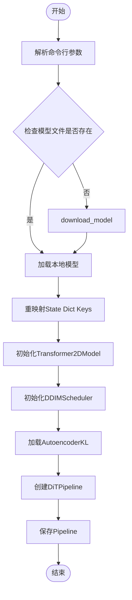
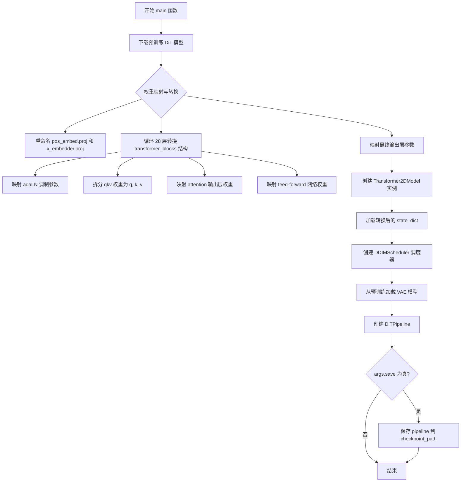

# `diffusers\scripts\convert_dit_to_diffusers.py` 详细设计文档

该脚本用于将Facebook AI Research发布的预训练DiT（Diffusion Transformer）模型检查点转换为Hugging Face Diffusers库支持的DiTPipeline格式，主要功能包括模型下载、权重键名（Key）重映射以适配新架构以及流水线的组装与保存。

## 整体流程



## 类结构

```
Module: convert_dit.py (Procedural Script)
├── Global Variables
│   └── pretrained_models
└── Functions
    ├── download_model
    └── main
```

## 全局变量及字段


### `pretrained_models`
    
A dictionary mapping image sizes (256 or 512) to their corresponding pre-trained DiT model checkpoint filenames.

类型：`dict[int, str]`
    


    

## 全局函数及方法


### `download_model`

该函数用于从网上下载预训练的 DiT（Diffusion Transformer）模型文件到本地目录，并在本地文件已存在时直接加载。

参数：

- `model_name`：`str`，模型文件名（如 "DiT-XL-2-512x512.pt" 或 "DiT-XL-2-256x256.pt"），指定要下载的预训练模型名称

返回值：`dict`，从本地加载的 PyTorch 模型状态字典（state_dict）

#### 流程图

```mermaid
flowchart TD
    A[开始] --> B[构建本地路径 local_path = pretrained_models/{model_name}]
    B --> C{检查文件是否存在?}
    C -->|否| D[创建目录 pretrained_models]
    D --> E[构建远程URL: https://dl.fbaipublicfiles.com/DiT/models/{model_name}]
    E --> F[download_url从远程URL下载模型到本地目录]
    F --> G[torch.load加载本地模型文件]
    C -->|是| G
    G --> H[返回模型状态字典]
```

#### 带注释源码

```python
def download_model(model_name):
    """
    Downloads a pre-trained DiT model from the web.
    """
    # 构建本地模型文件的完整路径
    local_path = f"pretrained_models/{model_name}"
    
    # 检查本地是否已存在该模型文件
    if not os.path.isfile(local_path):
        # 如果文件不存在，创建保存目录
        os.makedirs("pretrained_models", exist_ok=True)
        # 构建模型文件的远程下载URL（Facebook AI公共文件服务器）
        web_path = f"https://dl.fbaipublicfiles.com/DiT/models/{model_name}"
        # 使用torchvision的工具函数从URL下载文件到本地目录
        download_url(web_path, "pretrained_models")
    
    # 加载本地模型文件，使用lambda函数确保所有张量加载到CPU内存
    # 这对于在不同设备间迁移模型很有用
    model = torch.load(local_path, map_location=lambda storage, loc: storage)
    
    # 返回模型的状态字典（包含所有权重和偏置）
    return model
```


### `main`

该函数是脚本的核心入口，用于将预训练的 DiT（Diffusion Transformer）模型转换为 Hugging Face Diffusers 格式的 pipeline。它首先下载指定分辨率的预训练模型权重，然后执行复杂的权重映射与重命名（将原始 DiT 模型结构适配到 Diffusers 的 Transformer2DModel 架构），最后创建并保存 DiTPipeline。

参数：

- `args`：`argparse.Namespace`，命令行参数容器，包含 `image_size`（图像分辨率 256 或 512）、`vae_model`（VAE 模型路径或 ID）、`save`（是否保存 pipeline）和 `checkpoint_path`（输出路径）四个属性。

返回值：`None`，该函数无返回值，主要通过副作用（创建并保存 pipeline）完成工作。

#### 流程图



#### 带注释源码

```python
def main(args):
    """
    主函数：将预训练 DiT 模型转换为 Diffusers 格式的 DiTPipeline
    
    参数:
        args: 包含以下属性的命名空间:
            - image_size: int, 图像尺寸 (256 或 512)
            - vae_model: str, VAE 模型路径或 HuggingFace 模型 ID
            - save: bool, 是否保存转换后的 pipeline
            - checkpoint_path: str, 输出目录路径
    """
    
    # Step 1: 下载预训练模型
    # 根据 image_size 选择对应的模型文件名称 (512: "DiT-XL-2-512x512.pt", 256: "DiT-XL-2-256x256.pt")
    state_dict = download_model(pretrained_models[args.image_size])

    # Step 2: 权重键名映射 - 位置嵌入层
    # 将原始的 x_embedder.proj 映射到 Diffusers 架构的 pos_embed.proj
    state_dict["pos_embed.proj.weight"] = state_dict["x_embedder.proj.weight"]
    state_dict["pos_embed.proj.bias"] = state_dict["x_embedder.proj.bias"]
    state_dict.pop("x_embedder.proj.weight")  # 删除旧键避免冲突
    state_dict.pop("x_embedder.proj.bias")

    # Step 3: 循环转换 28 层 transformer blocks
    # 原始 DiT 使用 blocks.{depth}.* 命名, Diffusers 使用 transformer_blocks.{depth}.* 命名
    for depth in range(28):
        # 3.1 时间步嵌入层 (timestep_embedder) - 将共享的 t_embedder.mlp 复制到每层
        state_dict[f"transformer_blocks.{depth}.norm1.emb.timestep_embedder.linear_1.weight"] = state_dict[
            "t_embedder.mlp.0.weight"
        ]
        state_dict[f"transformer_blocks.{depth}.norm1.emb.timestep_embedder.linear_1.bias"] = state_dict[
            "t_embedder.mlp.0.bias"
        ]
        state_dict[f"transformer_blocks.{depth}.norm1.emb.timestep_embedder.linear_2.weight"] = state_dict[
            "t_embedder.mlp.2.weight"
        ]
        state_dict[f"transformer_blocks.{depth}.norm1.emb.timestep_embedder.linear_2.bias"] = state_dict[
            "t_embedder.mlp.2.bias"
        ]
        
        # 3.2 类别嵌入器 (class_embedder) - 复制类别嵌入表到每层
        state_dict[f"transformer_blocks.{depth}.norm1.emb.class_embedder.embedding_table.weight"] = state_dict[
            "y_embedder.embedding_table.weight"
        ]

        # 3.3 AdaLN 调制参数 - 将 adaLN_modulation.1 映射到 norm1.linear
        state_dict[f"transformer_blocks.{depth}.norm1.linear.weight"] = state_dict[
            f"blocks.{depth}.adaLN_modulation.1.weight"
        ]
        state_dict[f"transformer_blocks.{depth}.norm1.linear.bias"] = state_dict[
            f"blocks.{depth}.adaLN_modulation.1.bias"
        ]

        # 3.4 注意力机制的 QKV 分离
        # 原始模型将 q, k, v 合并在 qkv.weight 中, 需要拆分为三个独立权重
        q, k, v = torch.chunk(state_dict[f"blocks.{depth}.attn.qkv.weight"], 3, dim=0)
        q_bias, k_bias, v_bias = torch.chunk(state_dict[f"blocks.{depth}.attn.qkv.bias"], 3, dim=0)

        # 映射查询 (Q) 权重
        state_dict[f"transformer_blocks.{depth}.attn1.to_q.weight"] = q
        state_dict[f"transformer_blocks.{depth}.attn1.to_q.bias"] = q_bias
        # 映射键 (K) 权重
        state_dict[f"transformer_blocks.{depth}.attn1.to_k.weight"] = k
        state_dict[f"transformer_blocks.{depth}.attn1.to_k.bias"] = k_bias
        # 映射值 (V) 权重
        state_dict[f"transformer_blocks.{depth}.attn1.to_v.weight"] = v
        state_dict[f"transformer_blocks.{depth}.attn1.to_v.bias"] = v_bias

        # 3.5 注意力输出投影层
        state_dict[f"transformer_blocks.{depth}.attn1.to_out.0.weight"] = state_dict[
            f"blocks.{depth}.attn.proj.weight"
        ]
        state_dict[f"transformer_blocks.{depth}.attn1.to_out.0.bias"] = state_dict[f"blocks.{depth}.attn.proj.bias"]

        # 3.6 前馈网络 (Feed-Forward Network) 权重映射
        # fc1 -> ff.net.0.proj, fc2 -> ff.net.2
        state_dict[f"transformer_blocks.{depth}.ff.net.0.proj.weight"] = state_dict[f"blocks.{depth}.mlp.fc1.weight"]
        state_dict[f"transformer_blocks.{depth}.ff.net.0.proj.bias"] = state_dict[f"blocks.{depth}.mlp.fc1.bias"]
        state_dict[f"transformer_blocks.{depth}.ff.net.2.weight"] = state_dict[f"blocks.{depth}.mlp.fc2.weight"]
        state_dict[f"transformer_blocks.{depth}.ff.net.2.bias"] = state_dict[f"blocks.{depth}.mlp.fc2.bias"]

        # 3.7 清理已映射的原始层权重, 避免残留
        state_dict.pop(f"blocks.{depth}.attn.qkv.weight")
        state_dict.pop(f"blocks.{depth}.attn.qkv.bias")
        state_dict.pop(f"blocks.{depth}.attn.proj.weight")
        state_dict.pop(f"blocks.{depth}.attn.proj.bias")
        state_dict.pop(f"blocks.{depth}.mlp.fc1.weight")
        state_dict.pop(f"blocks.{depth}.mlp.fc1.bias")
        state_dict.pop(f"blocks.{depth}.mlp.fc2.weight")
        state_dict.pop(f"blocks.{depth}.mlp.fc2.bias")
        state_dict.pop(f"blocks.{depth}.adaLN_modulation.1.weight")
        state_dict.pop(f"blocks.{depth}.adaLN_modulation.1.bias")

    # Step 4: 清理全局共享的嵌入层权重
    # 这些权重已在循环中被复制到各层, 现在可以删除原始副本
    state_dict.pop("t_embedder.mlp.0.weight")
    state_dict.pop("t_embedder.mlp.0.bias")
    state_dict.pop("t_embedder.mlp.2.weight")
    state_dict.pop("t_embedder.mlp.2.bias")
    state_dict.pop("y_embedder.embedding_table.weight")

    # Step 5: 最终输出层映射
    # 将 final_layer 的参数映射到 proj_out_1 和 proj_out_2
    state_dict["proj_out_1.weight"] = state_dict["final_layer.adaLN_modulation.1.weight"]
    state_dict["proj_out_1.bias"] = state_dict["final_layer.adaLN_modulation.1.bias"]
    state_dict["proj_out_2.weight"] = state_dict["final_layer.linear.weight"]
    state_dict["proj_out_2.bias"] = state_dict["final_layer.linear.bias"]

    # 清理最终层的原始权重
    state_dict.pop("final_layer.linear.weight")
    state_dict.pop("final_layer.linear.bias")
    state_dict.pop("final_layer.adaLN_modulation.1.weight")
    state_dict.pop("final_layer.adaLN_modulation.1.bias")

    # Step 6: 创建 Diffusers 格式的 Transformer2DModel
    # 配置参数对应 DiT-XL/2 模型规格
    transformer = Transformer2DModel(
        sample_size=args.image_size // 8,      # VAE 编码后空间尺寸缩小 8 倍
        num_layers=28,                          # 28 层 transformer blocks
        attention_head_dim=72,                  # 注意力头维度
        in_channels=4,                          # VAE 潜在空间的通道数
        out_channels=8,                          # 输出通道数 (4*2 for patchify)
        patch_size=2,                           # patch 划分大小
        attention_bias=True,                     # 注意力层是否使用偏置
        num_attention_heads=16,                 # 16 个注意力头 (16 * 72 = 1152)
        activation_fn="gelu-approximate",        # 激活函数
        num_embeds_ada_norm=1000,               # AdaNorm 条件嵌入数量 (timesteps)
        norm_type="ada_norm_zero",               # 使用 AdaNorm-Zero 归一化
        norm_elementwise_affine=False,          # 归一化不使用元素级仿射
    )
    
    # Step 7: 加载转换后的权重到模型
    transformer.load_state_dict(state_dict, strict=True)

    # Step 8: 创建 DDIM 调度器
    scheduler = DDIMScheduler(
        num_train_timesteps=1000,    # 训练时的 timestep 数量
        beta_schedule="linear",       # beta 调度策略
        prediction_type="epsilon",    # 预测类型 (噪声预测)
        clip_sample=False,            # 推理时是否截断采样
    )

    # Step 9: 加载预训练 VAE 模型
    vae = AutoencoderKL.from_pretrained(args.vae_model)

    # Step 10: 组装完整的 DiT Pipeline
    pipeline = DiTPipeline(transformer=transformer, vae=vae, scheduler=scheduler)

    # Step 11: 可选保存 pipeline 到磁盘
    if args.save:
        pipeline.save_pretrained(args.checkpoint_path)
```

## 关键组件


### 预训练模型映射字典

存储不同图像尺寸对应的预训练模型文件名，提供模型版本选择能力

### 模型下载函数

负责从Facebook AI公共文件服务器下载预训练的DiT模型，支持本地缓存机制，避免重复下载

### 模型权重转换与适配

核心组件，负责将原始DiT模型的状态字典转换为Diffusers库兼容的格式，包括位置嵌入重映射、变压器块权重重组、注意力机制权重分割、MLP层权重迁移、输出投影层转换等完整适配逻辑

### Diffusers管道构建

整合转换后的Transformer模型、预训练的VAE解码器和DDIM调度器，构建完整的DiTPipeline推理管道

### 命令行参数解析

提供图像尺寸、VAE模型选择、输出路径等配置选项，支持灵活的模型转换工作流


## 问题及建议


### 已知问题

- **缺少异常处理**：下载模型时没有捕获网络异常或IO错误，下载失败会导致程序直接崩溃；`torch.load` 使用了不安全的方式加载模型，存在潜在的安全风险。
- **硬编码参数过多**：28层、patch_size=2、attention_head_dim、num_attention_heads 等关键参数被硬编码，降低了代码的通用性和可维护性。
- **参数校验缺失**：未校验 `args.image_size` 是否为有效值（256或512），未校验输出路径是否为空或无效。
- **代码重复**：状态字典键名映射存在大量重复代码，可以使用循环或辅助函数简化。
- **main 函数职责过重**：转换逻辑全部堆积在 main 函数中，缺乏单一职责原则，可读性和可测试性差。
- **目录创建竞态条件**：`os.makedirs` 和 `os.path.isfile` 检查之间存在时间窗口，可能导致多线程环境下的竞态条件。

### 优化建议

- 为 `download_model` 添加 try-except 异常处理，捕获网络错误和文件IO错误；在 `torch.load` 中显式设置 `weights_only=False`（若确定模型可信）或使用更安全的加载方式。
- 将硬编码的参数提取为常量或配置文件，或从预训练模型的元数据中动态读取；考虑使用 dataclass 或配置文件管理参数。
- 在 `main` 函数入口处添加参数校验逻辑，确保 `image_size` 在有效范围内，检查 `checkpoint_path` 的合法性。
- 将状态字典转换逻辑拆分为独立的转换函数（如 `convert_attention_blocks`、`convert_mlp_blocks` 等），减少代码重复。
- 遵循单一职责原则，将 main 函数中的下载、转换、加载模型、创建 pipeline、保存 pipeline 等步骤拆分为独立的函数。
- 使用 `os.makedirs(..., exist_ok=True)` 简化目录创建逻辑，或使用线程锁避免竞态条件。

## 其它


### 设计目标与约束

本代码的设计目标是将Facebook Research开发的DiT (Diffusion Transformer)预训练模型转换为Hugging Face diffusers库兼容的格式，以便在diffusers框架中使用DiT模型进行图像生成任务。主要约束包括：1) 仅支持DiT-XL-2模型（256x256和512x512两种分辨率）；2) 依赖特定版本的diffusers、torch和torchvision库；3) 转换后的pipeline需要与DDIMScheduler配合使用；4) VAE模型需要单独指定。

### 错误处理与异常设计

代码中的错误处理主要包括：1) 文件下载失败时抛出异常，由download_url函数内部处理；2) 模型加载使用map_location参数确保CPU/GPU兼容；3) load_state_dict使用strict=True严格匹配键名，转换键名不匹配会导致RuntimeError；4) 缺少必要参数（如checkpoint_path）时argparse会报错并退出。建议增加：网络超时重试机制、磁盘空间检查、转换过程中的进度提示、转换失败的回滚机制。

### 数据流与状态机

数据流主要分为三个阶段：第一阶段是模型下载，根据image_size参数从Facebook CDN下载对应的.pt文件；第二阶段是权重转换，将原始DiT模型的state_dict键名重新映射为diffusers Transformer2DModel的格式，包括位置编码、注意力块、MLP层等的键名转换；第三阶段是Pipeline组装，将转换后的transformer、VAE和scheduler组合成DiTPipeline对象。状态机的转换顺序为：download → transform weights → create transformer → create scheduler → create vae → create pipeline → save。

### 外部依赖与接口契约

主要外部依赖包括：1) torch - 张量计算和模型加载；2) torchvision.datasets.utils.download_url - URL文件下载；3) diffusers库 - AutoencoderKL、DDIMScheduler、DiTPipeline、Transformer2DModel；4) argparse - 命令行参数解析。接口契约方面：download_model函数接收模型文件名返回state_dict；main函数接收args对象执行完整转换流程；命令行接口需要--checkpoint_path为必选参数，--image_size可选256或512，--vae_model指定VAE模型路径。

### 性能考虑与优化空间

当前实现的主要性能瓶颈和优化点：1) 循环内频繁的字典键操作（pop和赋值）效率较低，可考虑批量操作或预先构建映射表；2) 模型下载没有进度显示和断点续传；3) 权重转换过程中创建了大量临时张量，内存占用较高；4) save_pretrained默认会保存完整模型而非仅保存权重，可考虑使用safetensors格式加速保存和加载；5) 缺少GPU加速选项，转换大模型时速度受限。

### 安全性考虑

代码涉及网络下载模型文件的安全问题：1) 下载URL为FB公开服务器，安全性相对可控；2) 没有对下载文件进行完整性校验（如SHA256）；3) torch.load存在反序列化风险，建议增加weights_only=True参数；4) 本地路径构造存在路径遍历风险，model_name应进行安全验证；5) os.makedirs使用exist_ok=True可能存在竞态条件。

### 配置与参数说明

命令行参数详细说明：--image_size指定预训练模型的图像分辨率，支持256和512两种，默认256；--vae_model指定预训练VAE模型路径或HuggingFace模型ID，默认stabilityai/sd-vae-ft-ema；--save指定是否保存转换后的pipeline，默认为True；--checkpoint_path指定输出路径，必填参数。环境变量方面需确保DIFFUSERS_CACHE或默认缓存目录有足够空间存储下载的模型文件。

### 使用示例与版本兼容性

典型使用示例：python convert_model.py --image_size 256 --vae_model stabilityai/sd-vae-ft-ema --checkpoint_path ./dit_pipeline --save。版本兼容性方面：代码测试于diffusers>=0.14.0版本，torch建议>=1.12.0，transformers库作为diffusers的传递依赖也需要匹配。不同版本的diffusers可能导致DiTPipeline或Transformer2DModel的接口变化，转换后的pipeline可能无法在新版本diffusers中加载。

### 限制与已知问题

当前实现的已知限制：1) 仅支持DiT-XL-2模型架构，不支持DiT-Small或DiT-Base；2) 权重转换是单向的，无法从diffusers格式转回原始格式；3) 转换后的pipeline在某些GPU上可能出现数值精度问题；4) 不支持class条件的DiT模型（当前仅支持timestep）；5) 512x512模型转换需要更大的内存占用；6) 没有提供推理演示代码，用户需要自行编写生成代码。

    