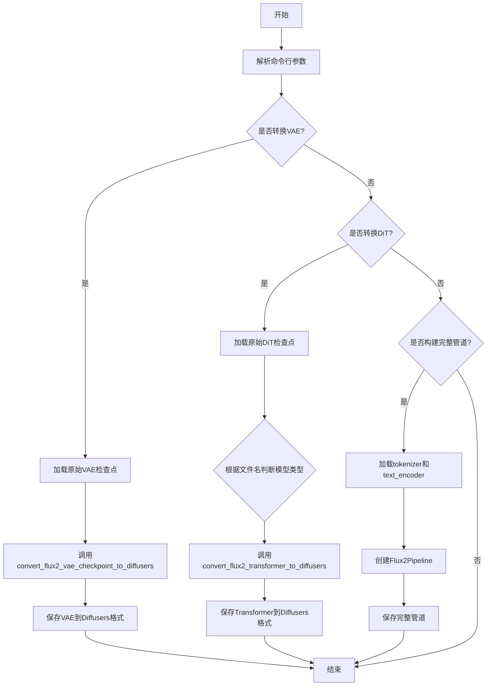
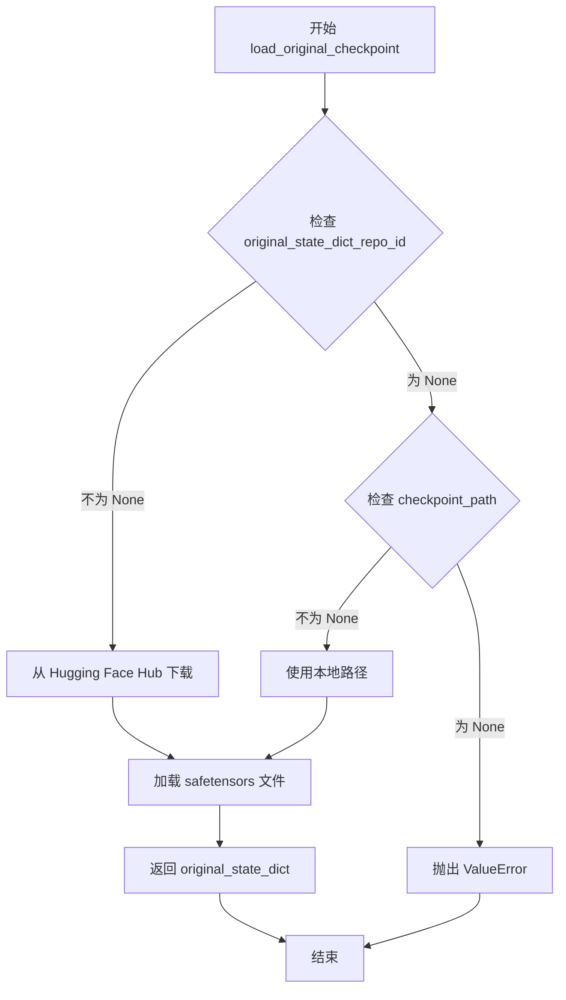
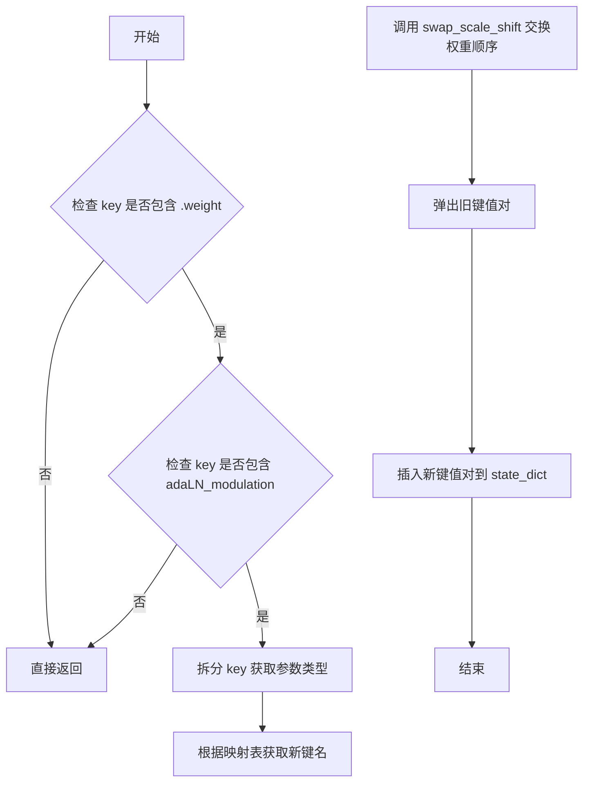
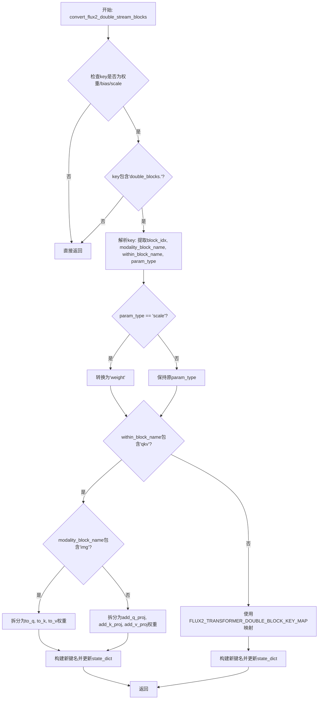
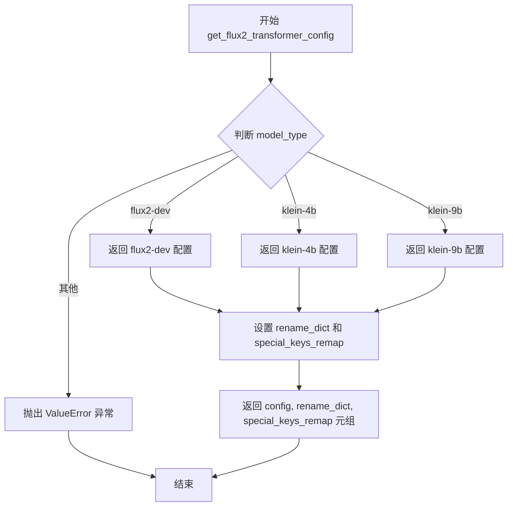
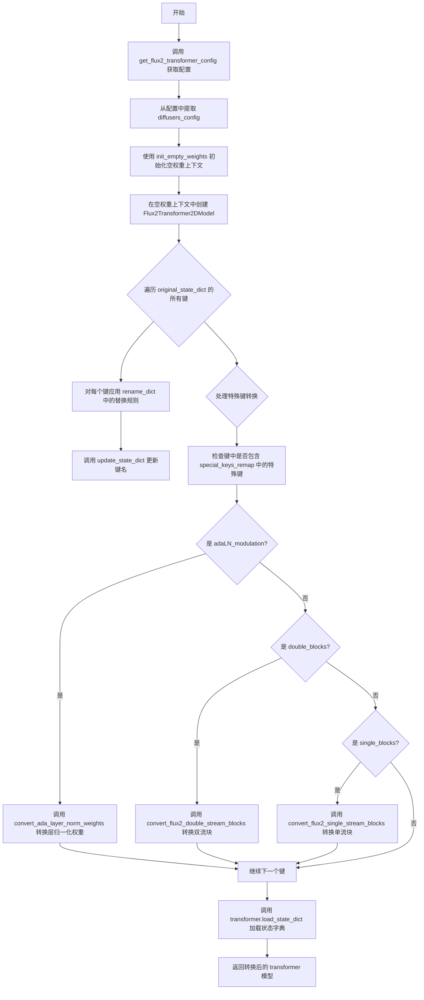
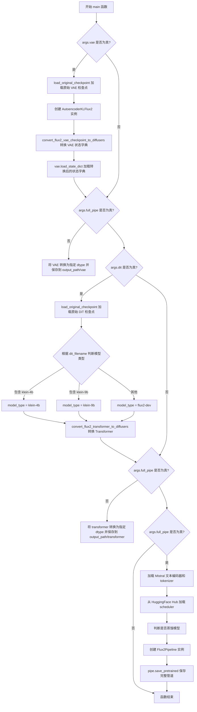

# `diffusers\scripts\convert_flux2_to_diffusers.py` 详细设计文档

这是一个用于将FLUX2模型（包含VAE和DiT/Transformer）从原始检查点格式转换到Diffusers库格式的命令行工具脚本，支持单独转换VAE、单独转换DiT或构建完整的Diffusers Pipeline。

## 整体流程



## 类结构

```
无类定义 (基于函数的脚本)
└── 全局函数与数据映射表
    ├── 加载函数: load_original_checkpoint
    ├── VAE转换函数: convert_flux2_vae_checkpoint_to_diffusers
    ├── DiT/Transformer转换函数: convert_flux2_transformer_to_diffusers
    ├── 辅助映射函数: update_vae_resnet_ldm_to_diffusers, update_vae_attentions_ldm_to_diffusers
    ├── 键转换函数: convert_ada_layer_norm_weights, convert_flux2_double_stream_blocks, convert_flux2_single_stream_blocks
    └── 配置函数: get_flux2_transformer_config
```

## 全局变量及字段


### `CTX`
    
根据加速器是否可用选择空权重初始化上下文或空上下文管理器

类型：`contextlib.nullcontext | init_empty_weights`
    


### `args`
    
存储命令行参数的对象，包含模型转换的各种配置选项

类型：`argparse.Namespace`
    


### `DIFFUSERS_VAE_TO_FLUX2_MAPPING`
    
VAE检查点键映射字典，用于将原始flux2 VAE状态字典键转换为diffusers格式

类型：`Dict[str, str]`
    


### `FLUX2_TRANSFORMER_KEYS_RENAME_DICT`
    
Transformer键重命名字典，用于将原始flux2 transformer键映射到diffusers格式

类型：`Dict[str, str]`
    


### `FLUX2_TRANSFORMER_ADA_LAYER_NORM_KEY_MAP`
    
AdaLayerNorm层的键映射字典，处理flux2和diffusers模型间自适应层归一化键的转换

类型：`Dict[str, str]`
    


### `FLUX2_TRANSFORMER_DOUBLE_BLOCK_KEY_MAP`
    
双块键映射字典，将flux2双块结构映射到diffusers transformer_blocks

类型：`Dict[str, str]`
    


### `FLUX2_TRANSFORMER_SINGLE_BLOCK_KEY_MAP`
    
单块键映射字典，将flux2单块结构映射到diffusers single_transformer_blocks

类型：`Dict[str, str]`
    


### `TRANSFORMER_SPECIAL_KEYS_REMAP`
    
特殊键重映射处理函数字典，包含处理flux2 transformer特殊键重映射逻辑的函数

类型：`Dict[str, Callable]`
    


### `parser`
    
命令行参数解析器对象，用于定义和解析模型转换脚本的输入参数

类型：`argparse.ArgumentParser`
    


    

## 全局函数及方法


### `load_original_checkpoint`

该函数用于从 Hugging Face Hub 或本地路径加载原始的模型检查点（checkpoint），并将其作为状态字典返回。它支持两种加载方式：远程仓库下载或本地文件路径读取。

参数：

- `args`：对象，包含命令行参数，必须包含 `original_state_dict_repo_id`（远程仓库ID）或 `checkpoint_path`（本地路径）之一
- `filename`：字符串，要加载的文件名（例如 `"flux2-vae.sft"` 或 `"flux-dev-dummy.sft"`）

返回值：`Dict[str, torch.Tensor]`，返回加载的原始模型状态字典

#### 流程图



#### 带注释源码

```python
def load_original_checkpoint(args, filename):
    """
    加载原始的模型检查点
    
    参数:
        args: 包含命令行参数的对象，需要提供 original_state_dict_repo_id 或 checkpoint_path 之一
        filename: 要加载的文件名
    
    返回:
        原始模型状态字典 (Dict[str, torch.Tensor])
    
    异常:
        ValueError: 当既没有提供 original_state_dict_repo_id 也没有提供 checkpoint_path 时
    """
    # 判断是否提供了远程仓库ID
    if args.original_state_dict_repo_id is not None:
        # 从 Hugging Face Hub 下载模型文件
        ckpt_path = hf_hub_download(
            repo_id=args.original_state_dict_repo_id, 
            filename=filename
        )
    # 判断是否提供了本地路径
    elif args.checkpoint_path is not None:
        # 使用本地检查点路径
        ckpt_path = args.checkpoint_path
    else:
        # 两者都未提供，抛出错误
        raise ValueError(
            " please provide either `original_state_dict_repo_id` or a local `checkpoint_path`"
        )

    # 使用 safetensors 库加载模型文件
    original_state_dict = safetensors.torch.load_file(ckpt_path)
    
    # 返回原始状态字典
    return original_state_dict
```


### `conv_attn_to_linear`

将预训练检查点中的注意力机制卷积权重（多维张量）转换为线性权重（2D张量），用于适配Diffusers格式的模型架构。该函数特别处理 query、key、value 的权重以及投影注意力权重，将卷积核维度压缩为线性层。

参数：

- `checkpoint`：`Dict[str, torch.Tensor]`，模型检查点状态字典，包含需要转换的注意力层权重

返回值：`None`，直接修改传入的字典，无返回值

#### 流程图

```mermaid
flowchart TD
    A[开始] --> B[获取checkpoint的所有键]
    B --> C[定义注意力权重键列表: query.weight, key.weight, value.weight]
    C --> D[遍历每个键]
    D --> E{检查键是否为注意力权重}
    E -->|是 query/key/value 权重| F{权重维度是否大于2}
    F -->|是| G[取权重[:, :, 0, 0] 转换为2D]
    F -->|否| H[跳过处理]
    E -->|否| I{检查键是否包含 proj_attn.weight}
    I -->|是| J{权重维度是否大于2}
    J -->|是| K[取权重[:, :, 0] 转换为2D]
    J -->|否| L[跳过处理]
    I -->|否| M[跳过处理]
    G --> M
    K --> M
    H --> M
    M --> N{还有更多键需要处理}
    N -->|是| D
    N -->|否| O[结束]
```

#### 带注释源码

```python
# 从 diffusers.pipelines.stable_diffusion.convert_from_ckpt.conv_attn_to_linear 复制
def conv_attn_to_linear(checkpoint):
    """
    将注意力机制中的卷积权重转换为线性权重
    
    在某些模型架构中，注意力层的权重以卷积形式存储（维度 > 2），
    需要转换为线性层权重（2D张量）以适配 Diffusers 的实现。
    
    参数:
        checkpoint: 模型检查点字典，键为参数名称，值为参数张量
        
    返回:
        无返回值，直接修改传入的字典
    """
    # 获取检查点中所有键的列表
    keys = list(checkpoint.keys())
    
    # 定义需要处理的注意力权重键
    attn_keys = ["query.weight", "key.weight", "value.weight"]
    
    # 遍历检查点中的每个键
    for key in keys:
        # 获取键名的最后两个部分，用于匹配注意力权重
        key_suffix = ".".join(key.split(".")[-2:])
        
        # 处理 query/key/value 权重
        if key_suffix in attn_keys:
            # 检查权重是否为卷积形式（维度 > 2）
            if checkpoint[key].ndim > 2:
                # 从卷积权重中提取线性权重，取第一个位置
                # 将 (C_out, C_in, H, W) 或 (C_out, C_in, H) 转换为 (C_out, C_in)
                checkpoint[key] = checkpoint[key][:, :, 0, 0]
                
        # 处理投影注意力权重
        elif "proj_attn.weight" in key:
            # 检查权重是否为卷积形式
            if checkpoint[key].ndim > 2:
                # 提取线性权重，将 (C_out, C_in, H) 转换为 (C_out, C_in)
                checkpoint[key] = checkpoint[key][:, :, 0]
```


### `update_vae_resnet_ldm_to_diffusers`

该函数用于将 Flux2 VAE 模型中 ResNet 层的状态字典键名从 LDM 格式转换为 Diffusers 格式，通过字符串替换实现键名映射，并将转换后的参数值添加到新的状态字典中。

参数：

- `keys`：`List[str]`，需要转换的 LDM 格式的键名列表
- `new_checkpoint`：`Dict[str, torch.Tensor]`，目标 Diffusers 格式的状态字典，转换后的键值对将存入其中
- `checkpoint`：`Dict[str, torch.Tensor]`，原始 LDM 格式的完整状态字典，作为数据源
- `mapping`：`Dict[str, str]`，包含键名转换规则的字典，必须包含 "old"（旧前缀）和 "new"（新前缀）两个键

返回值：`None`，该函数直接修改 `new_checkpoint` 字典，无返回值

#### 流程图

```mermaid
flowchart TD
    A[开始] --> B{遍历 keys 列表}
    B --> C[取出一个 ldm_key]
    C --> D[使用 mapping['old'] 替换为 mapping['new']]
    D --> E[将 'nin_shortcut' 替换为 'conv_shortcut']
    E --> F[从 checkpoint 获取 ldm_key 对应的值]
    F --> G[将转换后的键名和值存入 new_checkpoint]
    G --> H{keys 是否还有未处理的元素?}
    H -->|是| C
    H -->|否| I[结束]
```

#### 带注释源码

```python
def update_vae_resnet_ldm_to_diffusers(keys, new_checkpoint, checkpoint, mapping):
    """
    将 VAE ResNet 层的状态字典键名从 LDM 格式转换为 Diffusers 格式
    
    参数:
        keys: 需要转换的键名列表（如 ["down.0.block.0.weight", "down.0.block.1.weight"]）
        new_checkpoint: 目标状态字典，转换后的结果会写入此字典
        checkpoint: 原始状态字典，作为数据源
        mapping: 包含转换规则的字典，如 {"old": "down.0.block", "new": "down_blocks.0.resnets"}
    """
    # 遍历所有需要转换的键名
    for ldm_key in keys:
        # 第一步：将键名中的旧前缀替换为新前缀
        # 例如：将 "down.0.block.0.weight" 转换为 "down_blocks.0.resnets.0.weight"
        diffusers_key = ldm_key.replace(mapping["old"], mapping["new"]).replace("nin_shortcut", "conv_shortcut")
        
        # 第二步：从原始 checkpoint 中获取对应的张量值
        # 并使用转换后的键名存入新的状态字典
        new_checkpoint[diffusers_key] = checkpoint.get(ldm_key)
```


### `update_vae_attentions_ldm_to_diffusers`

该函数用于将 VAE 注意力层的模型权重从 LDM 格式转换为 Diffusers 格式，主要通过字符串替换将旧键名映射为新键名，并处理 1D 卷积权重到线性权重的维度变换。

参数：

- `keys`：`List[str]`，需要转换的 LDM 格式的 VAE 注意力层键名列表
- `new_checkpoint`：`Dict[str, torch.Tensor]`，转换后的 Diffusers 格式权重字典，用于存储结果
- `checkpoint`：`Dict[str, torch.Tensor]`，原始 LDM 格式的 VAE 权重字典
- `mapping`：`Dict[str, str]`，键名映射字典，包含 "old" 和 "new" 两个键，用于替换键名前缀

返回值：`None`，该函数直接修改 `new_checkpoint` 字典，无返回值

#### 流程图

```mermaid
flowchart TD
    A[开始] --> B{遍历 keys 列表}
    B -->|keys 中还有元素| C[取出一个 ldm_key]
    C --> D[使用 mapping 替换键名前缀]
    D --> E[替换 norm → group_norm]
    E --> F[替换 q/k/v → to_q/to_k/to_v]
    F --> G[替换 proj_out → to_out.0]
    G --> H[从 checkpoint 获取权重并存入 new_checkpoint]
    H --> I{检查权重 shape 维度}
    I -->|shape 长度为 3| J[取 [:, :, 0] 降维]
    I -->|shape 长度为 4| K[取 [:, :, 0, 0] 降维]
    I -->|其他| L[不做处理]
    J --> B
    K --> B
    L --> B
    B -->|遍历完成| M[结束]
```

#### 带注释源码

```python
def update_vae_attentions_ldm_to_diffusers(keys, new_checkpoint, checkpoint, mapping):
    """
    将 VAE 注意力层权重从 LDM 格式转换为 Diffusers 格式
    
    参数:
        keys: 需要转换的 LDM 格式键名列表
        new_checkpoint: 转换后的权重字典
        checkpoint: 原始 LDM 格式权重字典
        mapping: 键名前缀映射，如 {"old": "mid.attn_1", "new": "mid_block.attentions.0"}
    """
    # 遍历所有需要转换的注意力层键
    for ldm_key in keys:
        # 构建 Diffusers 格式的键名，通过字符串替换进行映射
        diffusers_key = (
            ldm_key.replace(mapping["old"], mapping["new"])
            # 将 norm 替换为 group_norm（Diffusers 中的组归一化命名）
            .replace("norm.weight", "group_norm.weight")
            .replace("norm.bias", "group_norm.bias")
            # 将 q/k/v 替换为 to_q/to_k/to_v（Diffusers 中的注意力投影命名）
            .replace("q.weight", "to_q.weight")
            .replace("q.bias", "to_q.bias")
            .replace("k.weight", "to_k.weight")
            .replace("k.bias", "to_k.bias")
            .replace("v.weight", "to_v.weight")
            .replace("v.bias", "to_v.bias")
            # 将 proj_out 替换为 to_out.0（Diffusers 中的输出投影命名）
            .replace("proj_out.weight", "to_out.0.weight")
            .replace("proj_out.bias", "to_out.0.bias")
        )
        
        # 从原始 checkpoint 中获取权重并存入新字典
        new_checkpoint[diffusers_key] = checkpoint.get(ldm_key)

        # 处理 proj_attn.weight 的维度变换
        # LDM 格式中使用 1D 卷积 (N, C, 1) 存储注意力输出投影
        # Diffusers 格式使用线性层，需要移除最后两个维度
        shape = new_checkpoint[diffusers_key].shape

        if len(shape) == 3:
            # 对于 3D 权重 (如 [heads, channels, 1])，取第一个切片降为 2D
            new_checkpoint[diffusers_key] = new_checkpoint[diffusers_key][:, :, 0]
        elif len(shape) == 4:
            # 对于 4D 权重 (如 [heads, channels, 1, 1])，取第一个切片降为 2D
            new_checkpoint[diffusers_key] = new_checkpoint[diffusers_key][:, :, 0, 0]
```


### `convert_flux2_vae_checkpoint_to_diffusers`

该函数用于将 Flux2 模型的 VAE 检查点（VAE State Dict）从原始格式转换为 Diffusers 格式，主要处理 VAE 的编码器和解码器中的各层（down blocks、mid blocks、up blocks）的键名映射和权重转换，使转换后的权重可以直接加载到 Diffusers 的 `AutoencoderKLFlux2` 模型中。

参数：

- `vae_state_dict`：`Dict[str, torch.Tensor]`，原始 Flux2 VAE 检查点的状态字典，包含模型的权重
- `config`：`Dict[str, Any]`，Diffusers VAE 模型的配置信息，用于获取 down_block_types 和 up_block_types 的数量以确定网络层数

返回值：`Dict[str, torch.Tensor]`，转换后的 Diffusers 格式的 VAE 状态字典

#### 流程图

```mermaid
flowchart TD
    A[开始: convert_flux2_vae_checkpoint_to_diffusers] --> B[初始化空字典 new_checkpoint]
    B --> C[遍历 DIFFUSERS_VAE_TO_FLUX2_MAPPING 映射表]
    C --> D{ldm_key 是否在 vae_state_dict 中}
    D -- 否 --> C
    D -- 是 --> E[将对应权重复制到 new_checkpoint]
    E --> F[获取 down_block_types 数量]
    F --> G[遍历 num_down_blocks]
    G --> H[获取当前层的 resnets]
    H --> I[调用 update_vae_resnet_ldm_to_diffusers 更新键名]
    I --> J{encoder.down.{i}.downsample.conv.weight 是否存在}
    J -- 是 --> K[添加 downsampler 权重到 new_checkpoint]
    J -- 否 --> L[处理 mid_block resnets]
    K --> L
    L --> M[处理 mid_block attentions]
    M --> N[获取 up_block_types 数量]
    N --> O[遍历 num_up_blocks]
    O --> P[获取当前层的 resnets]
    P --> Q[调用 update_vae_resnet_ldm_to_diffusers 更新键名]
    Q --> R{decoder.up.{block_id}.upsample.conv.weight 是否存在}
    R -- 是 --> S[添加 upsampler 权重到 new_checkpoint]
    R -- 否 --> T[处理 decoder mid_block resnets]
    S --> T
    T --> U[处理 decoder mid_block attentions]
    U --> V[调用 conv_attn_to_linear 转换注意力权重]
    V --> W[返回 new_checkpoint]
```

#### 带注释源码

```python
def convert_flux2_vae_checkpoint_to_diffusers(vae_state_dict, config):
    """
    将 Flux2 VAE 检查点从原始格式转换为 Diffusers 格式
    
    参数:
        vae_state_dict: 原始 Flux2 VAE 的状态字典
        config: Diffusers VAE 模型的配置信息
    
    返回:
        转换后的 Diffusers 格式状态字典
    """
    # 初始化空的新检查点字典
    new_checkpoint = {}
    
    # 首先处理直接映射的键（如 conv_in, conv_out, norm, quant_conv 等）
    for diffusers_key, ldm_key in DIFFUSERS_VAE_TO_FLUX2_MAPPING.items():
        if ldm_key not in vae_state_dict:
            continue
        new_checkpoint[diffusers_key] = vae_state_dict[ldm_key]

    # ==================== 处理编码器 (Encoder) ====================
    # 获取编码器的 down blocks 数量
    num_down_blocks = len(config["down_block_types"])
    
    # 为每个 down block 层收集相关的键
    down_blocks = {
        layer_id: [key for key in vae_state_dict if f"down.{layer_id}" in key] 
        for layer_id in range(num_down_blocks)
    }

    # 遍历处理每个 down block
    for i in range(num_down_blocks):
        # 获取当前层的 resnet 键（排除 downsample）
        resnets = [key for key in down_blocks[i] 
                   if f"down.{i}" in key and f"down.{i}.downsample" not in key]
        
        # 更新 resnet 层的键名：down.{i}.block -> down_blocks.{i}.resnets
        update_vae_resnet_ldm_to_diffusers(
            resnets,
            new_checkpoint,
            vae_state_dict,
            mapping={"old": f"down.{i}.block", "new": f"down_blocks.{i}.resnets"},
        )
        
        # 处理 downsample（下采样）层
        if f"encoder.down.{i}.downsample.conv.weight" in vae_state_dict:
            new_checkpoint[f"encoder.down_blocks.{i}.downsamplers.0.conv.weight"] = vae_state_dict.get(
                f"encoder.down.{i}.downsample.conv.weight"
            )
            new_checkpoint[f"encoder.down_blocks.{i}.downsamplers.0.conv.bias"] = vae_state_dict.get(
                f"encoder.down.{i}.downsample.conv.bias"
            )

    # 处理编码器中间块 (mid block) 的 resnets
    mid_resnets = [key for key in vae_state_dict if "encoder.mid.block" in key]
    num_mid_res_blocks = 2
    for i in range(1, num_mid_res_blocks + 1):
        resnets = [key for key in mid_resnets if f"encoder.mid.block_{i}" in key]
        update_vae_resnet_ldm_to_diffusers(
            resnets,
            new_checkpoint,
            vae_state_dict,
            mapping={"old": f"mid.block_{i}", "new": f"mid_block.resnets.{i - 1}"},
        )

    # 处理编码器中间块的注意力机制
    mid_attentions = [key for key in vae_state_dict if "encoder.mid.attn" in key]
    update_vae_attentions_ldm_to_diffusers(
        mid_attentions, 
        new_checkpoint, 
        vae_state_dict, 
        mapping={"old": "mid.attn_1", "new": "mid_block.attentions.0"}
    )

    # ==================== 处理解码器 (Decoder) ====================
    # 获取解码器的 up blocks 数量
    num_up_blocks = len(config["up_block_types"])
    
    # 为每个 up block 层收集相关的键
    up_blocks = {
        layer_id: [key for key in vae_state_dict if f"up.{layer_id}" in key] 
        for layer_id in range(num_up_blocks)
    }

    # 遍历处理每个 up block（反向遍历，因为原始模型的层顺序是反向的）
    for i in range(num_up_blocks):
        block_id = num_up_blocks - 1 - i
        resnets = [
            key for key in up_blocks[block_id] 
            if f"up.{block_id}" in key and f"up.{block_id}.upsample" not in key
        ]
        
        # 更新 resnet 层的键名：up.{block_id}.block -> up_blocks.{i}.resnets
        update_vae_resnet_ldm_to_diffusers(
            resnets,
            new_checkpoint,
            vae_state_dict,
            mapping={"old": f"up.{block_id}.block", "new": f"up_blocks.{i}.resnets"},
        )
        
        # 处理 upsample（上采样）层
        if f"decoder.up.{block_id}.upsample.conv.weight" in vae_state_dict:
            new_checkpoint[f"decoder.up_blocks.{i}.upsamplers.0.conv.weight"] = vae_state_dict[
                f"decoder.up.{block_id}.upsample.conv.weight"
            ]
            new_checkpoint[f"decoder.up_blocks.{i}.upsamplers.0.conv.bias"] = vae_state_dict[
                f"decoder.up.{block_id}.upsample.conv.bias"
            ]

    # 处理解码器中间块的 resnets
    mid_resnets = [key for key in vae_state_dict if "decoder.mid.block" in key]
    for i in range(1, num_mid_res_blocks + 1):
        resnets = [key for key in mid_resnets if f"decoder.mid.block_{i}" in key]
        update_vae_resnet_ldm_to_diffusers(
            resnets,
            new_checkpoint,
            vae_state_dict,
            mapping={"old": f"mid.block_{i}", "new": f"mid_block.resnets.{i - 1}"},
        )

    # 处理解码器中间块的注意力机制
    mid_attentions = [key for key in vae_state_dict if "decoder.mid.attn" in key]
    update_vae_attentions_ldm_to_diffusers(
        mid_attentions, 
        new_checkpoint, 
        vae_state_dict, 
        mapping={"old": "mid.attn_1", "new": "mid_block.attentions.0"}
    )
    
    # 将卷积注意力权重转换为线性权重（1D 卷积 -> 线性层）
    conv_attn_to_linear(new_checkpoint)

    return new_checkpoint
```


### `swap_scale_shift`

该函数是一个权重处理工具函数，用于在模型权重转换过程中交换张量中两个分量的顺序。具体来说，它将原始 FLUX2/SD3 模型中 AdaLayerNorm 线性层输出的 `(shift, scale)` 顺序转换为 Diffusers 架构期望的 `(scale, shift)` 顺序，以确保权重能正确加载到 Diffusers 的实现中。

参数：
- `weight`：`torch.Tensor`，代表 AdaLayerNorm 层的线性投影权重。通常该张量在维度 0 上的长度是偶数，前半部分存储 shift 参数，后半部分存储 scale 参数。

返回值：`torch.Tensor`，返回重新拼接后的权重张量，其顺序被修改为 `[scale, shift]`。

#### 流程图

```mermaid
graph LR
    A[输入 weight tensor] --> B[chunk(2, dim=0)]
    B --> C[shift = weight[:n/2]]
    B --> D[scale = weight[n/2:]]
    C --> E[torch.cat([scale, shift], dim=0)]
    D --> E
    E --> F[返回 new_weight tensor]
```

#### 带注释源码

```python
def swap_scale_shift(weight):
    # 在第0维将权重张量均匀切分为两部分。
    # 原始 FLUX2/SD3 实现中，切分后的顺序是 (shift, scale)。
    # chunk 返回的元组顺序为 (chunk_0, chunk_1)，即 (shift, scale)。
    shift, scale = weight.chunk(2, dim=0)
    
    # 使用 torch.cat 重新拼接两部分，但调换顺序为 (scale, shift)。
    # 这是为了匹配 Diffusers 中 AdaLayerNorm 的实现预期。
    new_weight = torch.cat([scale, shift], dim=0)
    
    return new_weight
```


### `convert_ada_layer_norm_weights`

该函数用于将 Flux2 模型中 AdaLayerNorm 的权重键从原始格式转换为 Diffusers 格式，主要处理 Shift 和 Scale 参数的顺序交换（原始实现为 [shift, scale]，Diffusers 实现为 [scale, shift]）。

参数：

- `key`：`str`，表示原始状态字典中的权重键名
- `state_dict`：`Dict[str, Any]`，包含模型权重的字典对象，该函数会直接修改此字典

返回值：`None`，该函数通过修改 `state_dict` 参数实现权重转换，无返回值

#### 流程图



#### 带注释源码

```python
def convert_ada_layer_norm_weights(key: str, state_dict: Dict[str, Any]) -> None:
    # 仅处理权重参数，跳过偏置等其他参数
    # Skip if not a weight
    if ".weight" not in key:
        return

    # 如果键中包含 adaLN_modulation，则需要交换 scale 和 shift 的顺序
    # 原始实现是 (shift, scale)；Diffusers 实现是 (scale, shift)
    # If adaLN_modulation is in the key, swap scale and shift parameters
    # Original implementation is (shift, scale); diffusers implementation is (scale, shift)
    if "adaLN_modulation" in key:
        # 将键名按最后一个 "." 拆分，得到键名前缀和参数类型（如 weight 或 bias）
        key_without_param_type, param_type = key.rsplit(".", maxsplit=1)
        # 假设所有此类键都在 AdaLayerNorm 键映射表中
        # Assume all such keys are in the AdaLayerNorm key map
        # 根据映射表将原始键名转换为 Diffusers 格式的键名
        new_key_without_param_type = FLUX2_TRANSFORMER_ADA_LAYER_NORM_KEY_MAP[key_without_param_type]
        # 重新拼接新的完整键名
        new_key = ".".join([new_key_without_param_type, param_type])

        # 调用 swap_scale_shift 函数交换权重中的 shift 和 scale 顺序
        # 并从 state_dict 中删除原始键值对
        swapped_weight = swap_scale_shift(state_dict.pop(key))
        # 将转换后的权重以新键名存入 state_dict
        state_dict[new_key] = swapped_weight
    return
```


### `convert_flux2_double_stream_blocks`

该函数用于将 Flux2 模型中双流块（double stream blocks）的权重键（key）从原始格式转换为 Diffusers 格式。它处理 QKV 融合权重的拆分、键名重映射以及参数类型转换，将原始的状态字典就地修改为适配 Diffusers 框架的结构。

参数：

-  `key`：`str`，原始 Flux2 模型状态字典中的权重键名称
-  `state_dict`：`Dict[str, Any]`，包含模型权重的字典对象，该函数会直接修改此字典

返回值：`None`，函数直接修改 `state_dict` 参数，不返回任何值

#### 流程图



#### 带注释源码

```python
def convert_flux2_double_stream_blocks(key: str, state_dict: Dict[str, Any]) -> None:
    """
    将 Flux2 双流块的权重键转换为 Diffusers 格式。
    此函数就地修改 state_dict，不返回新字典。
    
    Args:
        key: 原始 Flux2 模型状态字典中的权重键
        state_dict: 包含模型权重的字典
    
    Returns:
        None (直接修改 state_dict)
    """
    
    # 跳过非权重、bias 或 scale 的键（如配置参数）
    if ".weight" not in key and ".bias" not in key and ".scale" not in key:
        return

    # Diffusers 使用的前缀
    new_prefix = "transformer_blocks"
    
    # 仅处理包含 'double_blocks.' 的键
    if "double_blocks." in key:
        # 解析键名: double_blocks.{N}.img_attn.qkv.weight -> parts = ['double_blocks', 'N', 'img_attn', 'qkv', 'weight']
        parts = key.split(".")
        block_idx = parts[1]  # 块索引，如 '0', '1', '2' 等
        modality_block_name = parts[2]  # img_attn, img_mlp, txt_attn, txt_mlp
        within_block_name = ".".join(parts[2:-1])  # 块内组件名，如 'img_attn.qkv'
        param_type = parts[-1]  # weight, bias, 或 scale

        # 将 'scale' 转换为 'weight'（Diffusers 中的命名约定）
        if param_type == "scale":
            param_type = "weight"

        # 处理融合的 QKV 权重，需要拆分为 Q、K、V 三个独立权重
        if "qkv" in within_block_name:
            # 弹出原始融合权重并拆分为三份
            fused_qkv_weight = state_dict.pop(key)
            to_q_weight, to_k_weight, to_v_weight = torch.chunk(fused_qkv_weight, 3, dim=0)
            
            if "img" in modality_block_name:
                # 双流图像注意力: double_blocks.{N}.img_attn.qkv --> transformer_blocks.{N}.attn.{to_q|to_k|to_v}
                # 示例: double_blocks.0.img_attn.qkv.weight -> transformer_blocks.0.attn.to_q.weight
                to_q_weight, to_k_weight, to_v_weight = torch.chunk(fused_qkv_weight, 3, dim=0)
                new_q_name = "attn.to_q"
                new_k_name = "attn.to_k"
                new_v_name = "attn.to_v"
            elif "txt" in modality_block_name:
                # 双流文本注意力: double_blocks.{N}.txt_attn.qkv --> transformer_blocks.{N}.attn.{add_q_proj|add_k_proj|add_v_proj}
                # 示例: double_blocks.0.txt_attn.qkv.weight -> transformer_blocks.0.attn.add_q_proj.weight
                to_q_weight, to_k_weight, to_v_weight = torch.chunk(fused_qkv_weight, 3, dim=0)
                new_q_name = "attn.add_q_proj"
                new_k_name = "attn.add_k_proj"
                new_v_name = "attn.add_v_proj"
            
            # 构建新的键名并更新 state_dict
            new_q_key = ".".join([new_prefix, block_idx, new_q_name, param_type])
            new_k_key = ".".join([new_prefix, block_idx, new_k_name, param_type])
            new_v_key = ".".join([new_prefix, block_idx, new_v_name, param_type])
            state_dict[new_q_key] = to_q_weight
            state_dict[new_k_key] = to_k_weight
            state_dict[new_v_key] = to_v_weight
        else:
            # 非 QKV 权重使用预定义的映射表进行转换
            # 例如: img_attn.norm.query_norm -> attn.norm_q
            #      img_mlp.0 -> ff.linear_in
            new_within_block_name = FLUX2_TRANSFORMER_DOUBLE_BLOCK_KEY_MAP[within_block_name]
            new_key = ".".join([new_prefix, block_idx, new_within_block_name, param_type])

            # 弹出原权重并用新键名存入
            param = state_dict.pop(key)
            state_dict[new_key] = param
    
    return
```


### `convert_flux2_single_stream_blocks`

该函数用于将 Flux2 模型权重状态字典中的单流块（single stream blocks）的键名从原始格式转换为 Diffusers 格式。它处理单流变换器块中的线性层和归一化层的键名映射，将 `single_blocks.{N}.*` 格式的键转换为 `single_transformer_blocks.{N}.attn.*` 格式。

参数：

- `key`：`str`，原始 Flux2 模型权重状态字典中的键名
- `state_dict`：`Dict[str, Any]`，模型权重状态字典，用于存储和更新转换后的键值对

返回值：`None`，该函数直接修改传入的 `state_dict` 字典，不返回任何值

#### 流程图

```mermaid
flowchart TD
    A[开始: convert_flux2_single_stream_blocks] --> B{检查键类型}
    B -->|不是 weight/bias/scale| C[直接返回]
    B -->|是 weight/bias/scale| D{检查是否包含 'single_blocks.'}
    D -->|否| C
    D -->|是| E[分割键名 parts = key.split('.')]
    E --> F[提取 block_idx = parts[1]]
    F --> G[提取 within_block_name = '.'.join(parts[2:-1])]
    G --> H[提取 param_type = parts[-1]]
    H --> I{param_type == 'scale'?}
    I -->|是| J[param_type = 'weight']
    I -->|否| K[使用映射表获取 new_within_block_name]
    J --> K
    K --> L[构建新键 new_key]
    L --> M[从 state_dict 中弹出原值]
    M --> N[将新键值对存入 state_dict]
    N --> O[返回]
```

#### 带注释源码

```python
def convert_flux2_single_stream_blocks(key: str, state_dict: Dict[str, Any]) -> None:
    """
    将 Flux2 单流块的状态字典键转换为 Diffusers 格式。
    
    映射关系:
        - single_blocks.{N}.linear1               --> single_transformer_blocks.{N}.attn.to_qkv_mlp_proj
        - single_blocks.{N}.linear2               --> single_transformer_blocks.{N}.attn.to_out
        - single_blocks.{N}.norm.query_norm.scale --> single_transformer_blocks.{N}.attn.norm_q.weight
        - single_blocks.{N}.norm.key_norm.scale   --> single_transformer_blocks.{N}.attn.norm_k.weight
    
    参数:
        key: 原始 Flux2 模型权重状态字典中的键名
        state_dict: 模型权重状态字典
    
    返回:
        None, 直接修改 state_dict
    """
    
    # 第一步：过滤非权重参数
    # 只有权重、偏置或缩放参数才需要转换，跳过其他类型的键
    if ".weight" not in key and ".bias" not in key and ".scale" not in key:
        return

    # 定义转换后的键前缀
    # Diffusers 格式使用 single_transformer_blocks 而非 single_blocks
    new_prefix = "single_transformer_blocks"
    
    # 第二步：检查键是否包含单流块标识
    if "single_blocks." in key:
        # 第三步：解析键名各部分
        parts = key.split(".")  # 按点分割键名
        block_idx = parts[1]  # 获取块索引，如 "0", "1", "2"...
        within_block_name = ".".join(parts[2:-1])  # 获取块内名称，如 "linear1", "norm.query_norm"...
        param_type = parts[-1]  # 获取参数类型，如 "weight", "bias", "scale"...

        # 第四步：处理缩放参数类型
        # Flux2 使用 "scale"，Diffusers 使用 "weight"
        if param_type == "scale":
            param_type = "weight"

        # 第五步：使用映射表转换块内名称
        # 从 FLUX2_TRANSFORMER_SINGLE_BLOCK_KEY_MAP 获取目标格式
        new_within_block_name = FLUX2_TRANSFORMER_SINGLE_BLOCK_KEY_MAP[within_block_name]
        
        # 第六步：构建新键名
        # 格式: single_transformer_blocks.{N}.{转换后的块内名称}.{参数类型}
        new_key = ".".join([new_prefix, block_idx, new_within_block_name, param_type])

        # 第七步：执行键值对转换
        # 弹出旧键值对，插入新键值对
        param = state_dict.pop(key)
        state_dict[new_key] = param
    
    return
```


### `update_state_dict`

该函数是一个轻量级的工具函数，主要用于在模型权重转换过程中重命名状态字典（state_dict）中的键（Key）。它通过弹出旧键的值并以新键名存回字典的方式，实现键名的原地替换，这在将第三方模型的权重键映射到 Diffusers 框架定义的键时非常有用。

参数：
-  `state_dict`：`Dict[str, Any]`，待修改的模型状态字典。
-  `old_key`：`str`，需要被替换的旧键名。
-  `new_key`：`str`，用于替换旧键名的新键名。

返回值：`None`，该函数直接修改传入的字典对象，不返回任何值。

#### 流程图

```mermaid
graph TD
    A([开始]) --> B[输入: state_dict, old_key, new_key]
    B --> C{old_key 是否存在于 state_dict}
    C -- 否 --> D[不做操作]
    C -- 是 --> E[value = state_dict.pop(old_key)]
    E --> F[state_dict[new_key] = value]
    F --> G([结束])
```

#### 带注释源码

```python
def update_state_dict(state_dict: Dict[str, Any], old_key: str, new_key: str) -> None:
    """
    在给定的状态字典中更新键名。

    参数:
        state_dict (Dict[str, Any]): 模型权重字典。
        old_key (str): 旧的键名。
        new_key (str): 新的键名。
    """
    # 1. 使用 pop 方法移除旧键，并获取其对应的权重值 (value)
    # 注意：如果 old_key 不存在，pop 会抛出 KeyError
    value = state_dict.pop(old_key)
    
    # 2. 将获取到的权重值 (value) 以新键名 (new_key) 存入字典
    state_dict[new_key] = value
```


### `get_flux2_transformer_config`

该函数根据传入的模型类型（flux2-dev、klein-4b 或 klein-9b）返回对应的 Flux2 Transformer 配置信息，包括模型 ID、Diffusers 配置参数、键名重命名字典和特殊键转换处理函数。

参数：

-  `model_type`：`str`，要获取配置的模型类型，可选值为 "flux2-dev"、"klein-4b"、"klein-9b"

返回值：`Tuple[Dict[str, Any], ...]`，返回一个三元元组，包含 config（模型配置字典）、rename_dict（键名重命名映射）、special_keys_remap（特殊键转换处理函数映射）

#### 流程图



#### 带注释源码

```python
def get_flux2_transformer_config(model_type: str) -> Tuple[Dict[str, Any], ...]:
    """
    根据模型类型获取 Flux2 Transformer 的配置信息。
    
    Args:
        model_type: 模型类型标识符，支持 "flux2-dev", "klein-4b", "klein-9b"
    
    Returns:
        包含配置字典、键名重命名映射和特殊处理函数的元组
    """
    # 处理 flux2-dev 模型配置
    if model_type == "flux2-dev":
        config = {
            "model_id": "black-forest-labs/FLUX.2-dev",  # HuggingFace 模型 ID
            "diffusers_config": {
                "patch_size": 1,                        # 图像分块大小
                "in_channels": 128,                     # 输入通道数
                "num_layers": 8,                        # Transformer 层数
                "num_single_layers": 48,                # 单流Transformer层数
                "attention_head_dim": 128,              # 注意力头维度
                "num_attention_heads": 48,              # 注意力头数量
                "joint_attention_dim": 15360,           # 联合注意力维度
                "timestep_guidance_channels": 256,       # 时间步指导通道数
                "mlp_ratio": 3.0,                        # MLP 扩展比率
                "axes_dims_rope": (32, 32, 32, 32),      # RoPE 轴维度
                "rope_theta": 2000,                     # RoPE 基础频率
                "eps": 1e-6,                            # 数值稳定性参数
            },
        }
        # 使用全局定义的键名重命名映射
        rename_dict = FLUX2_TRANSFORMER_KEYS_RENAME_DICT
        # 使用全局定义的特殊键转换处理函数映射
        special_keys_remap = TRANSFORMER_SPECIAL_KEYS_REMAP
    
    # 处理 klein-4b 模型配置
    elif model_type == "klein-4b":
        config = {
            "model_id": "diffusers-internal-dev/dummy0115",  # 内部模型 ID
            "diffusers_config": {
                "patch_size": 1,
                "in_channels": 128,
                "num_layers": 5,                          # 较小的层数
                "num_single_layers": 20,                   # 较少的单流层数
                "attention_head_dim": 128,
                "num_attention_heads": 24,                # 较少的注意力头
                "joint_attention_dim": 7680,              # 较小的联合注意力维度
                "timestep_guidance_channels": 256,
                "mlp_ratio": 3.0,
                "axes_dims_rope": (32, 32, 32, 32),
                "rope_theta": 2000,
                "eps": 1e-6,
                "guidance_embeds": False,                 # 是否使用指导嵌入
            },
        }
        rename_dict = FLUX2_TRANSFORMER_KEYS_RENAME_DICT
        special_keys_remap = TRANSFORMER_SPECIAL_KEYS_REMAP

    # 处理 klein-9b 模型配置
    elif model_type == "klein-9b":
        config = {
            "model_id": "diffusers-internal-dev/dummy0115",
            "diffusers_config": {
                "patch_size": 1,
                "in_channels": 128,
                "num_layers": 8,
                "num_single_layers": 24,
                "attention_head_dim": 128,
                "num_attention_heads": 32,
                "joint_attention_dim": 12288,
                "timestep_guidance_channels": 256,
                "mlp_ratio": 3.0,
                "axes_dims_rope": (32, 32, 32, 32),
                "rope_theta": 2000,
                "eps": 1e-6,
                "guidance_embeds": False,
            },
        }
        rename_dict = FLUX2_TRANSFORMER_KEYS_RENAME_DICT
        special_keys_remap = TRANSFORMER_SPECIAL_KEYS_REMAP

    # 不支持的模型类型抛出异常
    else:
        raise ValueError(f"Unknown model_type: {model_type}. Choose from: flux2-dev, klein-4b, klein-9b")

    # 返回配置、键名重命名映射和特殊处理函数
    return config, rename_dict, special_keys_remap
```


### `convert_flux2_transformer_to_diffusers`

该函数将原始 Flux2 Transformer 检查点状态字典转换为 Diffusers 格式的 Flux2Transformer2DModel，处理键名映射和特殊层归一化参数的转换。

参数：

- `original_state_dict`：`Dict[str, torch.Tensor]`，原始 Flux2 Transformer 模型的状态字典
- `model_type`：`str`，模型类型标识符，用于选择对应的配置（"flux2-dev"、"klein-4b" 或 "klein-9b"）

返回值：`Flux2Transformer2DModel`，转换后的 Diffusers 格式 Transformer 模型

#### 流程图



#### 带注释源码

```python
def convert_flux2_transformer_to_diffusers(original_state_dict: Dict[str, torch.Tensor], model_type: str):
    """
    将原始 Flux2 Transformer 检查点转换为 Diffusers 格式的模型
    
    参数:
        original_state_dict: 原始 Flux2 Transformer 的状态字典
        model_type: 模型类型标识符 ("flux2-dev", "klein-4b", "klein-9b")
    
    返回:
        转换后的 Flux2Transformer2DModel 实例
    """
    
    # 1. 根据模型类型获取对应的配置、重命名字典和特殊键处理函数
    config, rename_dict, special_keys_remap = get_flux2_transformer_config(model_type)

    # 2. 从配置中提取 Diffusers 格式的模型配置参数
    diffusers_config = config["diffusers_config"]

    # 3. 使用空权重上下文初始化模型（仅创建结构，不分配实际权重）
    # 这样可以避免加载完整模型到内存，提高效率
    with init_empty_weights():
        transformer = Flux2Transformer2DModel.from_config(diffusers_config)

    # 4. 处理官方代码到 Diffusers 的键名重映射
    # 通过简单的字符串替换将原始键名转换为 Diffusers 格式
    for key in list(original_state_dict.keys()):
        new_key = key[:]  # 复制原始键
        # 遍历重命名字典，应用所有替换规则
        for replace_key, rename_key in rename_dict.items():
            new_key = new_key.replace(replace_key, rename_key)
        # 更新状态字典中的键名
        update_state_dict(original_state_dict, key, new_key)

    # 5. 处理特殊逻辑的键转换
    # 这些转换无法通过简单的 1:1 映射完成，需要自定义处理函数
    for key in list(original_state_dict.keys()):
        # 遍历所有特殊键处理器
        for special_key, handler_fn_inplace in special_keys_remap.items():
            # 检查当前键是否包含特殊键标识
            if special_key not in key:
                continue
            # 调用对应的处理函数进行原地转换
            handler_fn_inplace(key, original_state_dict)

    # 6. 将转换后的状态字典加载到模型中
    # strict=True 确保所有键都能匹配，assign=True 将张量直接赋值给模型参数
    transformer.load_state_dict(original_state_dict, strict=True, assign=True)
    
    # 7. 返回转换后的 Diffusers 格式模型
    return transformer
```


### `main`

该函数是整个转换脚本的入口点，负责协调 VAE、DiT（Diffusion Transformer）检查点的加载、转换和保存，以及完整管道的组装。根据命令行参数 `args` 的配置，函数可以选择性地处理 VAE 转换、DiT 转换或组装完整的 Flux2Pipeline 并保存到指定路径。

参数：

-  `args`：`argparse.Namespace`，包含所有命令行参数的对象，属性包括 `vae`（是否转换 VAE）、`dit`（是否转换 DiT）、`full_pipe`（是否组装完整管道）、`original_state_dict_repo_id`（HuggingFace Hub 仓库 ID）、`vae_filename`（VAE 文件名）、`dit_filename`（DiT 文件名）、`vae_dtype`（VAE 数据类型）、`dit_dtype`（DiT 数据类型）、`checkpoint_path`（本地检查点路径）、`output_path`（输出路径）

返回值：`None`，该函数无返回值，通过副作用（文件 I/O）完成任务

#### 流程图



#### 带注释源码

```python
def main(args):
    """
    主函数，负责协调 VAE、DiT 检查点的转换以及完整 Flux2Pipeline 的组装和保存。
    
    参数:
        args: argparse.Namespace 对象，包含以下属性:
            - vae (bool): 是否转换 VAE 模型
            - dit (bool): 是否转换 DiT/Transformer 模型
            - full_pipe (bool): 是否组装完整的 Flux2Pipeline
            - original_state_dict_repo_id (str): HuggingFace Hub 仓库 ID
            - vae_filename (str): VAE 检查点文件名
            - dit_filename (str): DiT 检查点文件名
            - vae_dtype (str): VAE 数据类型 (fp32 或 bf16)
            - dit_dtype (str): DiT 数据类型 (fp32 或 bf16)
            - checkpoint_path (str): 本地检查点路径
            - output_path (str): 输出路径
    """
    
    # ==================== VAE 处理 ====================
    # 如果命令行指定了 --vae 参数，则进行 VAE 转换
    if args.vae:
        # 1. 加载原始 VAE 检查点（从 HuggingFace Hub 或本地路径）
        original_vae_ckpt = load_original_checkpoint(args, filename=args.vae_filename)
        
        # 2. 创建 diffusers 格式的 VAE 模型实例（AutoencoderKLFlux2）
        vae = AutoencoderKLFlux2()
        
        # 3. 将原始 VAE 状态字典从 FLUX2 格式转换为 diffusers 格式
        #    涉及键名映射、权重重排等操作
        converted_vae_state_dict = convert_flux2_vae_checkpoint_to_diffusers(
            original_vae_ckpt, 
            vae.config
        )
        
        # 4. 加载转换后的状态字典到 VAE 模型
        vae.load_state_dict(converted_vae_state_dict, strict=True)
        
        # 5. 如果不是完整管道模式，则单独保存 VAE
        if not args.full_pipe:
            # 根据命令行参数转换为对应的 PyTorch dtype
            vae_dtype = torch.bfloat16 if args.vae_dtype == "bf16" else torch.float32
            # 转换 dtype 并保存到指定路径
            vae.to(vae_dtype).save_pretrained(f"{args.output_path}/vae")

    # ==================== DiT/Transformer 处理 ====================
    # 如果命令行指定了 --dit 参数，则进行 DiT 转换
    if args.dit:
        # 1. 加载原始 DiT/Transformer 检查点
        original_dit_ckpt = load_original_checkpoint(args, filename=args.dit_filename)

        # 2. 根据文件名判断模型类型（flux2-dev, klein-4b, klein-9b）
        #    不同模型类型对应不同的配置参数（层数、注意力头数等）
        if "klein-4b" in args.dit_filename:
            model_type = "klein-4b"
        elif "klein-9b" in args.dit_filename:
            model_type = "klein-9b"
        else:
            model_type = "flux2-dev"
        
        # 3. 将原始 DiT 状态字典转换为 diffusers 格式的 Transformer 模型
        #    涉及复杂的键名重映射、QKV 分离、AdaLayerNorm 权重交换等操作
        transformer = convert_flux2_transformer_to_diffusers(original_dit_ckpt, model_type)
        
        # 4. 如果不是完整管道模式，则单独保存 Transformer
        if not args.full_pipe:
            # 根据命令行参数转换为对应的 PyTorch dtype
            dit_dtype = torch.bfloat16 if args.dit_dtype == "bf16" else torch.float32
            # 转换 dtype 并保存到指定路径
            transformer.to(dit_dtype).save_pretrained(f"{args.output_path}/transformer")

    # ==================== 完整管道组装 ====================
    # 如果命令行指定了 --full_pipe 参数，则组装完整的 Flux2Pipeline
    if args.full_pipe:
        # 1. 准备文本编码器相关配置
        #    使用 Mistral 作为文本编码器（支持图像和文本条件）
        tokenizer_id = "mistralai/Mistral-Small-3.1-24B-Instruct-2503"
        text_encoder_id = "mistralai/Mistral-Small-3.2-24B-Instruct-2506"
        
        # 2. 加载文本编码器的生成配置
        generate_config = GenerationConfig.from_pretrained(text_encoder_id)
        generate_config.do_sample = True  # 启用采样生成
        
        # 3. 加载 Mistral 文本编码器模型
        text_encoder = Mistral3ForConditionalGeneration.from_pretrained(
            text_encoder_id, 
            generation_config=generate_config, 
            torch_dtype=torch.bfloat16
        )
        
        # 4. 加载对应的 tokenizer
        tokenizer = AutoProcessor.from_pretrained(tokenizer_id)
        
        # 5. 从 HuggingFace Hub 加载预训练的调度器（Scheduler）
        #    FlowMatchEulerDiscreteScheduler 是 FLUX 模型使用的调度器
        scheduler = FlowMatchEulerDiscreteScheduler.from_pretrained(
            "black-forest-labs/FLUX.1-dev", 
            subfolder="scheduler"
        )

        # 6. 判断是否为蒸馏模型
        #    蒸馏模型（distilled）通常体积更小、推理更快
        if_distilled = "base" not in args.dit_filename

        # 7. 组装完整的 Flux2Pipeline
        #    包含 VAE、Transformer、文本编码器、tokenizer、调度器等所有组件
        pipe = Flux2Pipeline(
            vae=vae,
            transformer=transformer,
            text_encoder=text_encoder,
            tokenizer=tokenizer,
            scheduler=scheduler,
            if_distilled=if_distilled,
        )
        
        # 8. 保存完整的管道到指定路径
        #    保存后可以使用 Flux2Pipeline.from_pretrained 加载
        pipe.save_pretrained(args.output_path)
```

## 关键组件


### 张量索引与状态字典映射

负责将原始模型的键名映射到Diffusers格式，包括VAE和Transformer的键名转换、参数重命名、块结构重组等核心逻辑。

### 反量化支持

通过`swap_scale_shift`函数处理AdaLayerNorm的scale和shift参数顺序转换，将原始实现的(shift, scale)顺序调整为Diffusers的(scale, shift)顺序。

### 量化策略

支持通过命令行参数`--vae_dtype`和`--dit_dtype`指定数据类型（bf16/fp32），在转换后对模型进行相应的dtype转换。

### 命令行参数解析

使用argparse处理9个命令行参数，包括原始检查点仓库ID、VAE和DiT文件名、转换选项、输出路径等。

### 检查点加载

`load_original_checkpoint`函数支持从HuggingFace Hub或本地路径加载原始模型检查点，返回safetensors格式的状态字典。

### VAE结构映射

`DIFFUSERS_VAE_TO_FLUX2_MAPPING`字典定义了VAE各层从原始格式到Diffusers格式的键名映射关系，包括encoder和decoder的conv_in、conv_out、norm_out、quant_conv、post_quant_conv等层。

### 注意力机制转换

`conv_attn_to_linear`函数将1D卷积权重转换为线性层权重，处理attention模块中query、key、value和proj_attn的维度转换。

### VAE ResNet块更新

`update_vae_resnet_ldm_to_diffusers`函数更新VAE中ResNet块的键名，将原始的"down.X.block"格式转换为"down_blocks.X.resnets"格式。

### VAE注意力块更新

`update_vae_attentions_ldm_to_diffusers`函数处理VAE中注意力层的键名转换，包括norm到group_norm、q/k/v到to_q/to_k/to_v、proj_out到to_out.0的映射，并处理维度转换。

### VAE完整转换流程

`convert_flux2_vae_checkpoint_to_diffusers`函数整合所有VAE转换逻辑，遍历down blocks、mid blocks、up blocks，处理resnets和attention模块，返回转换后的状态字典。

### Transformer键名重命名映射

`FLUX2_TRANSFORMER_KEYS_RENAME_DICT`定义Transformer主干的键名重命名规则，包括img_in到x_embedder、txt_in到context_embedder、time_in和guidance_in层、以及modulation层的映射。

### AdaLayerNorm键名映射

`FLUX2_TRANSFORMER_ADA_LAYER_NORM_KEY_MAP`处理final_layer.adaLN_modulation到norm_out.linear的键名映射。

### 双流块键名映射

`FLUX2_TRANSFORMER_DOUBLE_BLOCK_KEY_MAP`定义双流块中img_attn、img_mlp、txt_attn、txt_mlp的键名转换规则，包括归一化、投影和MLP层。

### 单流块键名映射

`FLUX2_TRANSFORMER_SINGLE_BLOCK_KEY_MAP`定义单流块中linear1、linear2、norm的键名转换规则。

### 特殊键名重映射处理

`TRANSFORMER_SPECIAL_KEYS_REMAP`字典注册了adaLN_modulation、double_blocks、single_blocks的特殊处理函数，用于处理复杂的一对多键名映射。

### 自适应层归一化权重转换

`convert_ada_layer_norm_weights`函数处理AdaLayerNorm的权重转换，调用swap_scale_shift调整scale和shift的顺序。

### 双流块转换

`convert_flux2_double_stream_blocks`函数处理双流块的键名转换，特别是 fused QKV 投影的拆分，将单个qkv权重拆分为to_q、to_k、to_v三个权重。

### 单流块转换

`convert_flux2_single_stream_blocks`函数处理单流块的键名转换，将single_blocks转换为single_transformer_blocks格式。

### Transformer配置获取

`get_flux2_transformer_config`函数根据model_type返回对应的配置信息、键名重命名字典和特殊键处理函数，支持flux2-dev、klein-4b、klein-9b三种模型类型。

### Transformer完整转换流程

`convert_flux2_transformer_to_diffusers`函数整合所有Transformer转换逻辑，首先创建空权重模型，然后依次进行键名重命名、特殊键处理，最后加载转换后的状态字典。

### 主转换流程

`main`函数根据命令行参数决定转换VAE、DiT或完整pipeline，包括检查点加载、模型转换、dtype设置和模型保存。


## 问题及建议


### 已知问题

-   **缺少参数验证**：关键函数如 `convert_flux2_vae_checkpoint_to_diffusers` 和 `convert_flux2_transformer_to_diffusers` 没有对输入参数进行有效性检查，可能导致运行时错误
-   **错误处理不完善**：`load_original_checkpoint` 函数没有处理 HuggingFace Hub 下载失败、网络异常或本地文件不存在的情况
-   **魔法数字和硬编码**：代码中存在大量硬编码的配置值（如 `"black-forest-labs/FLUX.1-dev"`、`tokenizer_id`、`text_encoder_id` 等），难以适应不同模型版本或配置
-   **全局状态和副作用**：脚本顶层直接执行 `parser.parse_args()` 和 `main(args)`，导致模块无法被导入复用，且在导入时就会执行
-   **类型提示不完整**：部分函数缺少返回类型注解（如 `convert_flux2_vae_checkpoint_to_diffusers`、`load_original_checkpoint`），降低代码可读性和静态分析能力
-   **内存管理风险**：使用 `init_empty_weights()` 但未在模型加载后显式释放临时权重，且大模型加载可能引发内存溢出
-   **命名不一致**：VAE 使用 `mapping["old"]`/`mapping["new"]` 方式，而 Transformer 使用 `FLUX2_TRANSFORMER_KEYS_RENAME_DICT`，风格不统一
-   **转换函数直接修改状态字典**：多个转换函数（如 `convert_ada_layer_norm_weights`）直接修改传入的 `state_dict`，违反了函数纯度原则，可能导致意外副作用
-   **代码重复**：VAE 转换中 `mid_resnets` 和 `mid_attentions` 的处理逻辑在 encoder 和 decoder 部分重复

### 优化建议

-   添加输入参数验证函数，检查必要参数是否存在、类型是否正确、值是否合法
-   为 `load_original_checkpoint` 添加 try-except 异常处理，捕获并友好地报告网络或文件错误
-   将硬编码的配置值提取到配置类或 YAML/JSON 配置文件中，支持通过参数传入或环境变量覆盖
-   将顶层执行代码封装到 `if __name__ == "__main__":` 块中，并考虑提供命令行入口点配置
-   完善所有函数的类型注解，特别是返回类型
-   考虑使用 `torch.no_grad()` 或上下文管理器控制内存使用，对于超大模型考虑分片加载
-   统一转换函数的接口风格，例如都接受原始状态字典并返回新的状态字典，而不是原地修改
-   提取重复的 encoder/decoder VAE 转换逻辑为可复用的辅助函数
-   添加详细的文档字符串，解释每个转换映射规则的含义和来源
-   考虑将相关的转换逻辑组织到独立的类或模块中，提高代码的可维护性和可测试性

## 其它


### 设计目标与约束

本代码的设计目标是将 Flux2 模型的检查点（VAE 和 DiT）从原始格式转换为 Diffusers 库兼容的格式，支持独立转换 VAE、DiT 或组合成完整的推理管道。约束条件包括：必须提供原始检查点来源（huggingface_hub 仓库 ID 或本地路径）；仅支持预定义的模型类型（flux2-dev、klein-4b、klein-9b）；VAE 和 DiT 的转换逻辑相互独立但可组合为完整管道；目标格式必须与 Diffusers 库的最新 API 兼容。

### 错误处理与异常设计

代码采用分层错误处理策略。入口层通过 argparse 验证必要参数，使用 `argparse.ArgumentParser` 确保 `--output_path` 必须提供，同时在 `load_original_checkpoint` 函数中通过 `ValueError` 强制要求提供 `original_state_dict_repo_id` 或 `checkpoint_path` 之一。模型类型验证在 `get_flux2_transformer_config` 函数中通过 `ValueError` 捕获未知 `model_type`。状态字典加载采用 `strict=True` 模式确保键的完整匹配，任何缺失或多余的键都会触发异常。此外，对于 VAE 状态字典中可能缺失的可选键，使用 `checkpoint.get(ldm_key)` 和 `continue` 语句进行安全处理，避免 KeyError。

### 数据流与状态机

整个转换流程是一个单向线性状态机，包含四个主要状态：参数解析状态、原始检查点加载状态、模型转换状态和保存状态。在参数解析状态，命令行参数被解析为 `args` 对象，根据 `--vae`、`--dit`、`--full_pipe` 标志确定转换模式。加载状态根据参数选择从 HuggingFace Hub 或本地路径加载原始 safetensors 格式的检查点。转换状态针对 VAE 和 DiT 分别执行不同的键映射和重组逻辑，将原始状态字典的层级结构转换为 Diffusers 格式。保存状态根据转换类型将模型保存到指定输出路径，或组合为完整的 Flux2Pipeline。VAE 转换内部还包含 encoder/decoder 的 down_blocks、mid_block、up_blocks 的子状态转换，DiT 转换包含 double_blocks 和 single_blocks 的特殊键处理。

### 外部依赖与接口契约

代码依赖以下外部包及其接口契约：`huggingface_hub.hf_hub_download` 用于从 HuggingFace Hub 下载原始检查点，返回本地缓存的 safetensors 文件路径；`safetensors.torch.load_file` 用于加载 safetensors 格式的模型权重；`transformers.GenerationConfig` 和 `Mistral3ForConditionalGeneration` 用于加载文本编码器；`transformers.AutoProcessor` 用于加载 tokenizer；`diffusers.AutoencoderKLFlux2`、`Flux2Transformer2DModel`、`Flux2Pipeline` 是目标 Diffusers 模型类；`diffusers.FlowMatchEulerDiscreteScheduler` 是调度器类；`accelerate.init_empty_weights` 是可选的内存优化上下文管理器。输入契约要求原始检查点为 safetensors 格式，输出为 Diffusers 格式的 PyTorch 模型文件（包含 config.json 和模型权重文件）。

### 性能考虑

代码在性能方面考虑了以下几个方面：使用 `init_empty_weights()` 上下文管理器在构建目标模型结构时避免分配完整内存，只进行形状推理；VAE 和 DiT 的转换可以独立运行，允许在资源有限的环境中分步执行；转换后的模型可以指定数据类型（fp32 或 bf16），减少内存占用；对于大规模模型，使用 `safetensors` 格式相比 pickle 可以加快加载速度并减少内存占用。潜在的优化方向包括：使用多进程并行处理 VAE 和 DiT 的转换；添加批处理逻辑支持同时转换多个检查点；实现增量转换避免重复处理已转换的模型。

### 安全性考虑

代码涉及模型文件的下载和加载，安全性考虑包括：原始模型来源验证（通过 HuggingFace Hub 仓库 ID 或本地路径）；模型文件格式使用 safetensors 而非 pickle，减少代码执行风险；内存中的张量操作全部在 PyTorch 框架内进行，无自定义代码执行；完整管道模式加载 Mistral 模型时使用指定的 generation_config，避免使用不安全的默认配置。建议在生产环境中添加模型完整性校验（SHA256 哈希验证）和仓库签名验证。

### 配置管理

配置管理采用硬编码配置字典与命令行参数相结合的方式。模型配置通过 `get_flux2_transformer_config` 函数中的硬编码字典定义，包含各模型类型的 `model_id`、`diffusers_config`（如 patch_size、in_channels、num_layers 等）以及键重命名映射。运行时配置通过 argparse 命令行参数提供，包括文件路径、模型文件名、数据类型等。这种设计将静态配置（模型架构）与动态配置（文件路径、执行选项）分离，便于添加新模型类型时只需修改配置字典。VAE 配置从 `AutoencoderKLFlux2().config` 动态获取，而非硬编码，增加了适配不同 VAE 变体的灵活性。

### 版本兼容性

版本兼容性方面存在以下风险点：`diffusers` 库的 API 变化（如 Flux2Pipeline、AutoencoderKLFluxux2 等类的接口）；`transformers` 库的 Mistral 模型支持情况；`accelerate` 库的版本差异（影响 `init_empty_weights` 的可用性）。代码通过 `is_accelerate_available()` 检查动态选择使用 `init_empty_weights` 或 `nullcontext`，实现了基础的库版本适配。对于模型配置中的 `axes_dims_rope`、`rope_theta` 等参数，需要与目标 diffusers 版本的实现保持一致。建议在文档中明确标注支持的库版本范围。

### 测试策略

测试策略应覆盖以下关键路径：独立 VAE 转换流程测试，验证 encoder/decoder 各层的键映射正确性；独立 DiT 转换流程测试，验证双流和单流块的键拆分逻辑；完整管道测试，验证所有组件的组合和序列化/反序列化；错误路径测试，包括缺少必要参数、未知模型类型、状态字典键不匹配等场景。由于代码涉及复杂的键重命名逻辑，建议添加单元测试验证 `convert_flux2_vae_checkpoint_to_diffusers`、`convert_flux2_transformer_to_diffusers` 以及各个辅助函数（如 `convert_flux2_double_stream_blocks`）的输出正确性。集成测试应使用真实的 Flux2 检查点文件（可使用小型虚拟检查点）验证端到端转换。

### 部署相关

部署环境需要满足以下依赖：Python 3.8+；PyTorch 2.0+；diffusers 库（含 Flux2 相关类）；transformers 库；huggingface_hub；safetensors；accelerate（可选但推荐）。磁盘空间需求取决于转换模型的规模，完整管道包含 VAE（约 100MB）、DiT（数 GB）、文本编码器（数 GB）和调度器配置。输出结构为标准的 Diffusers 目录格式，包含 config.json、model.safetensors 等文件，可直接用于 Diffusers 的 `from_pretrained` 接口。部署方式建议使用虚拟环境隔离依赖，并记录精确的版本号以确保可复现性。

### 监控与日志

代码当前缺少显式的日志记录和监控功能。关键可观测点包括：原始检查点下载进度（由 huggingface_hub 内部处理）；模型转换进度（当前无反馈）；转换完成后的状态字典键数量统计；保存操作的成功/失败状态。建议添加标准日志记录（使用 Python logging 模块）在关键节点输出信息，包括加载的检查点大小、转换的键数量、各阶段耗时等，便于问题诊断和性能分析。对于大规模模型转换，建议添加内存使用监控（使用 `torch.cuda.memory_allocated()` 或 `psutil`）以便优化资源使用。

### 资源管理

资源管理主要涉及内存和临时文件两个方面。内存管理：使用 `init_empty_weights()` 避免在模型构建时分配完整权重内存；转换完成后立即调用 `save_pretrained` 将模型序列化到磁盘释放内存；通过 `torch.bfloat16` 或 `torch.float32` 参数控制保存模型的数据类型。临时文件管理：huggingface_hub 下载的检查点默认缓存到 `~/.cache/huggingface/`；转换过程中产生的中间状态字典存储在内存中。建议在处理超大规模模型时添加显式的垃圾回收调用（`import gc; gc.collect()`）并在可能的情况下使用内存映射文件（torch.load with mmap）。

### 扩展性考虑

代码设计支持以下扩展方向：新模型类型支持，只需在 `get_flux2_transformer_config` 中添加新的配置分支和对应的键映射字典；新键转换逻辑添加，可在 `TRANSFORMER_SPECIAL_KEYS_REMAP` 字典中添加新的处理器函数；多平台支持，当前代码主要针对 PyTorch 后端，可扩展支持 ONNX 或其他推理框架；分布式转换，可利用多进程或分布式计算加速大批量模型转换。架构上采用了配置驱动的设计模式，将模型架构信息与转换逻辑分离，便于维护和扩展。建议添加插件机制允许用户自定义键映射函数。

    