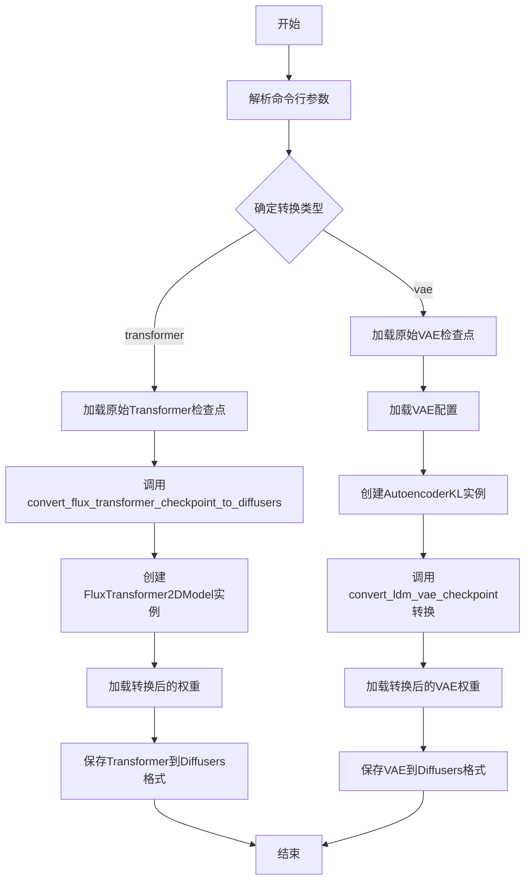
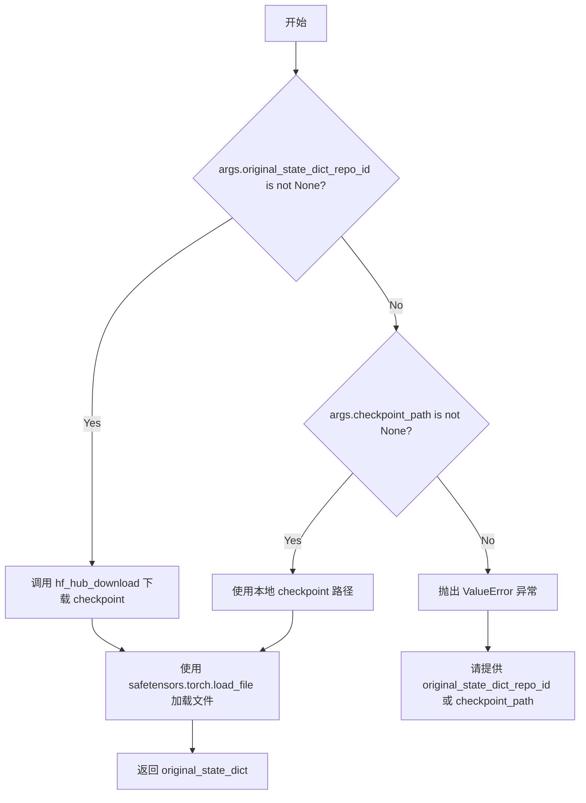
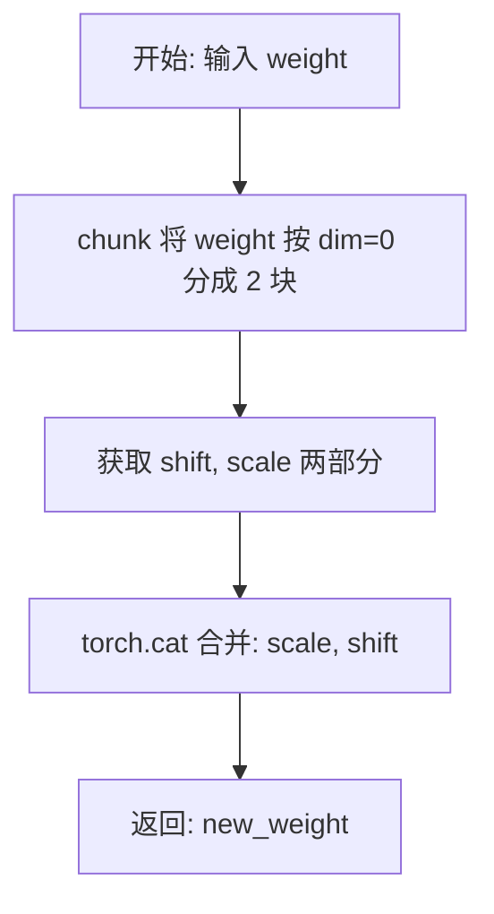
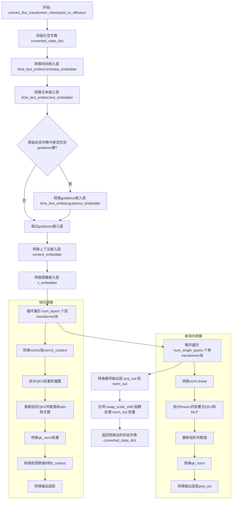
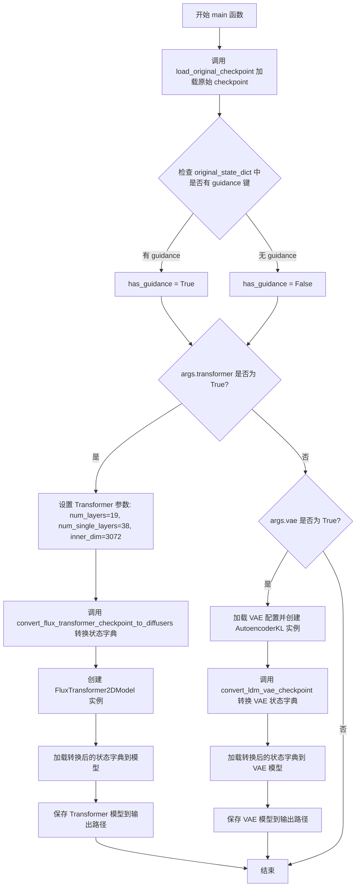

# `diffusers\scripts\convert_flux_to_diffusers.py` 详细设计文档

该脚本用于将FLUX.1-schnell模型从原始检查点格式转换为HuggingFace Diffusers格式，支持转换Transformer模型和VAE模型，通过权重映射和重组适配Diffusers实现，并保存转换后的模型到指定路径。

## 整体流程



## 类结构

```
全局函数
├── load_original_checkpoint(args)
├── swap_scale_shift(weight)
├── convert_flux_transformer_checkpoint_to_diffusers(...)
└── main(args)
```

## 全局变量及字段


### `CTX`
    
A context manager factory that either initializes empty weights or provides a null context depending on accelerate availability.

类型：`Callable[[], ContextManager]`
    


### `parser`
    
The argument parser instance that defines command‑line options for the conversion script.

类型：`ArgumentParser`
    


### `args`
    
Parsed command‑line arguments containing repository ID, file names, output path, and conversion options.

类型：`Namespace`
    


### `dtype`
    
The torch data type (bfloat16 or float32) selected based on the --dtype CLI argument.

类型：`torch.dtype`
    


    

## 全局函数及方法


### `load_original_checkpoint`

该函数用于加载原始的 FLUX 模型 checkpoint，支持从 HuggingFace Hub 下载或从本地路径加载，并返回包含模型权重的状态字典。

参数：

- `args`：`argparse.Namespace`，包含命令行参数的对象，需包含 `original_state_dict_repo_id`、`filename` 或 `checkpoint_path` 之一

返回值：`Dict[str, torch.Tensor]`，返回从 safetensors 文件加载的原始状态字典

#### 流程图



#### 带注释源码

```python
def load_original_checkpoint(args):
    """
    加载原始 FLUX checkpoint 文件
    
    支持两种加载方式：
    1. 从 HuggingFace Hub 下载（通过 original_state_dict_repo_id 和 filename）
    2. 从本地路径加载（通过 checkpoint_path）
    
    参数:
        args: 包含以下属性的命名空间对象:
            - original_state_dict_repo_id: HuggingFace Hub 上的仓库 ID（可选）
            - filename: 要下载的文件名（当使用 Hub 时必需）
            - checkpoint_path: 本地 checkpoint 文件路径（可选）
    
    返回:
        Dict: 包含模型权重张量的状态字典
    
    异常:
        ValueError: 当既未提供 original_state_dict_repo_id 也未提供 checkpoint_path 时
    """
    # 优先从 HuggingFace Hub 下载
    if args.original_state_dict_repo_id is not None:
        # 使用 hf_hub_download 从指定仓库下载文件
        ckpt_path = hf_hub_download(
            repo_id=args.original_state_dict_repo_id, 
            filename=args.filename
        )
    # 其次尝试使用本地路径
    elif args.checkpoint_path is not None:
        ckpt_path = args.checkpoint_path
    # 两者都未提供时抛出错误
    else:
        raise ValueError(" please provide either `original_state_dict_repo_id` or a local `checkpoint_path`")

    # 使用 safetensors 库加载 checkpoint 文件
    original_state_dict = safetensors.torch.load_file(ckpt_path)
    
    # 返回原始状态字典供后续转换使用
    return original_state_dict
```


### `swap_scale_shift`

该函数用于交换权重张量中的 shift 和 scale 顺序。在 SD3 原始实现中，AdaLayerNormContinuous 的线性投影输出被分成 shift、scale 两部分，而在 diffusers 实现中则是分成 scale、shift。该函数通过重新排列权重张量的维度顺序，使两者兼容。

**参数：**
- `weight`：`torch.Tensor`，原始权重张量，包含 shift 和 scale 两部分，需要沿 dim=0 进行分块处理

**返回值：** `torch.Tensor`，交换后的权重张量，其中 scale 位于前，shift 位于后

#### 流程图



#### 带注释源码

```python
def swap_scale_shift(weight):
    """
    交换权重张量中的 shift 和 scale 顺序。
    
    在 SD3 原始实现中，AdaLayerNormContinuous 的线性投影输出顺序为 [shift, scale]，
    而在 diffusers 实现中顺序为 [scale, shift]。该函数通过交换维度顺序实现兼容。
    
    参数:
        weight: 原始权重张量，沿 dim=0 分成两半，前半部分为 shift，后半部分为 scale
        
    返回:
        交换后的权重张量，前半部分为 scale，后半部分为 shift
    """
    # 将权重张量沿 dim=0 分成两部分：shift 和 scale
    # chunk(2, dim=0) 表示沿第0维平均分成2份
    shift, scale = weight.chunk(2, dim=0)
    
    # 重新拼接两部分，交换顺序：scale 在前，shift 在后
    new_weight = torch.cat([scale, shift], dim=0)
    
    # 返回交换顺序后的新权重
    return new_weight
```


### `convert_flux_transformer_checkpoint_to_diffusers`

该函数负责将原始FLUX模型的检查点状态字典（来自Black Forest Labs的FLUX.1-schnell等模型）转换为Diffusers库中FluxTransformer2DModel所期望的格式。它处理各种层的权重映射，包括时间嵌入、文本嵌入、上下文嵌入、图像嵌入、双向transformer块、单向transformer块以及最终输出层，并处理可能的guidance embeddings。

参数：

- `original_state_dict`：`Dict`，原始FLUX模型检查点的状态字典，键值对形式
- `num_layers`：`int`，双transformer块（double transformer blocks）的数量
- `num_single_layers`：`int`，单transformer块（single transformer blocks）的数量
- `inner_dim`：`int`，模型的内部维度（hidden dimension）
- `mlp_ratio`：`float`，MLP的扩展比率，默认为4.0

返回值：`Dict`，转换后的Diffusers格式状态字典

#### 流程图



#### 带注释源码

```python
def convert_flux_transformer_checkpoint_to_diffusers(
    original_state_dict, num_layers, num_single_layers, inner_dim, mlp_ratio=4.0
):
    """
    将原始FLUX模型检查点转换为Diffusers格式的FluxTransformer2DModel状态字典
    
    参数:
        original_state_dict: 原始模型的状态字典
        num_layers: 双transformer块数量
        num_single_layers: 单transformer块数量
        inner_dim: 内部维度
        mlp_ratio: MLP扩展比率
    
    返回:
        转换后的状态字典
    """
    converted_state_dict = {}

    ## time_text_embed.timestep_embedder <-  time_in
    # 转换时间嵌入层的第一层线性变换
    converted_state_dict["time_text_embed.timestep_embedder.linear_1.weight"] = original_state_dict.pop(
        "time_in.in_layer.weight"
    )
    converted_state_dict["time_text_embed.timestep_embedder.linear_1.bias"] = original_state_dict.pop(
        "time_in.in_layer.bias"
    )
    # 转换时间嵌入层的第二层线性变换
    converted_state_dict["time_text_embed.timestep_embedder.linear_2.weight"] = original_state_dict.pop(
        "time_in.out_layer.weight"
    )
    converted_state_dict["time_text_embed.timestep_embedder.linear_2.bias"] = original_state_dict.pop(
        "time_in.out_layer.bias"
    )

    ## time_text_embed.text_embedder <- vector_in
    # 转换向量输入嵌入层
    converted_state_dict["time_text_embed.text_embedder.linear_1.weight"] = original_state_dict.pop(
        "vector_in.in_layer.weight"
    )
    converted_state_dict["time_text_embed.text_embedder.linear_1.bias"] = original_state_dict.pop(
        "vector_in.in_layer.bias"
    )
    converted_state_dict["time_text_embed.text_embedder.linear_2.weight"] = original_state_dict.pop(
        "vector_in.out_layer.weight"
    )
    converted_state_dict["time_text_embed.text_embedder.linear_2.bias"] = original_state_dict.pop(
        "vector_in.out_layer.bias"
    )

    # guidance - 检查是否存在guidance嵌入
    has_guidance = any("guidance" in k for k in original_state_dict)
    if has_guidance:
        # 转换guidance嵌入层（如果存在）
        converted_state_dict["time_text_embed.guidance_embedder.linear_1.weight"] = original_state_dict.pop(
            "guidance_in.in_layer.weight"
        )
        converted_state_dict["time_text_embed.guidance_embedder.linear_1.bias"] = original_state_dict.pop(
            "guidance_in.in_layer.bias"
        )
        converted_state_dict["time_text_embed.guidance_embedder.linear_2.weight"] = original_state_dict.pop(
            "guidance_in.out_layer.weight"
        )
        converted_state_dict["time_text_embed.guidance_embedder.linear_2.bias"] = original_state_dict.pop(
            "guidance_in.out_layer.bias"
        )

    # context_embedder - 文本上下文嵌入层
    converted_state_dict["context_embedder.weight"] = original_state_dict.pop("txt_in.weight")
    converted_state_dict["context_embedder.bias"] = original_state_dict.pop("txt_in.bias")

    # x_embedder - 图像嵌入层
    converted_state_dict["x_embedder.weight"] = original_state_dict.pop("img_in.weight")
    converted_state_dict["x_embedder.bias"] = original_state_dict.pop("img_in.bias")

    # double transformer blocks - 双transformer块处理
    for i in range(num_layers):
        block_prefix = f"transformer_blocks.{i}."
        # norm1 - 图像模态的归一化层
        converted_state_dict[f"{block_prefix}norm1.linear.weight"] = original_state_dict.pop(
            f"double_blocks.{i}.img_mod.lin.weight"
        )
        converted_state_dict[f"{block_prefix}norm1.linear.bias"] = original_state_dict.pop(
            f"double_blocks.{i}.img_mod.lin.bias"
        )
        # norm1_context - 文本模态的归一化层
        converted_state_dict[f"{block_prefix}norm1_context.linear.weight"] = original_state_dict.pop(
            f"double_blocks.{i}.txt_mod.lin.weight"
        )
        converted_state_dict[f"{block_prefix}norm1_context.linear_bias"] = original_state_dict.pop(
            f"double_blocks.{i}.txt_mod.lin.bias"
        )
        
        # Q, K, V 权重和偏置的拆分与重组
        # 从合并的qkv权重中拆分出query, key, value
        sample_q, sample_k, sample_v = torch.chunk(
            original_state_dict.pop(f"double_blocks.{i}.img_attn.qkv.weight"), 3, dim=0
        )
        context_q, context_k, context_v = torch.chunk(
            original_state_dict.pop(f"double_blocks.{i}.txt_attn.qkv.weight"), 3, dim=0
        )
        # 处理偏置
        sample_q_bias, sample_k_bias, sample_v_bias = torch.chunk(
            original_state_dict.pop(f"double_blocks.{i}.img_attn.qkv.bias"), 3, dim=0
        )
        context_q_bias, context_k_bias, context_v_bias = torch.chunk(
            original_state_dict.pop(f"double_blocks.{i}.txt_attn.qkv.bias"), 3, dim=0
        )
        
        # 重新组织权重到目标格式
        # 图像注意力机制的Q、K、V
        converted_state_dict[f"{block_prefix}attn.to_q.weight"] = torch.cat([sample_q])
        converted_state_dict[f"{block_prefix}attn.to_q.bias"] = torch.cat([sample_q_bias])
        converted_state_dict[f"{block_prefix}attn.to_k.weight"] = torch.cat([sample_k])
        converted_state_dict[f"{block_prefix}attn.to_k.bias"] = torch.cat([sample_k_bias])
        converted_state_dict[f"{block_prefix}attn.to_v.weight"] = torch.cat([sample_v])
        converted_state_dict[f"{block_prefix}attn.to_v.bias"] = torch.cat([sample_v_bias])
        
        # 文本上下文的Q、K、V（作为额外的投影）
        converted_state_dict[f"{block_prefix}attn.add_q_proj.weight"] = torch.cat([context_q])
        converted_state_dict[f"{block_prefix}attn.add_q_proj.bias"] = torch.cat([context_q_bias])
        converted_state_dict[f"{block_prefix}attn.add_k_proj.weight"] = torch.cat([context_k])
        converted_state_dict[f"{block_prefix}attn.add_k_proj.bias"] = torch.cat([context_k_bias])
        converted_state_dict[f"{block_prefix}attn.add_v_proj.weight"] = torch.cat([context_v])
        converted_state_dict[f"{block_prefix}attn.add_v_proj.bias"] = torch.cat([context_v_bias])
        
        # qk_norm - Query和Key的归一化
        converted_state_dict[f"{block_prefix}attn.norm_q.weight"] = original_state_dict.pop(
            f"double_blocks.{i}.img_attn.norm.query_norm.scale"
        )
        converted_state_dict[f"{block_prefix}attn.norm_k.weight"] = original_state_dict.pop(
            f"double_blocks.{i}.img_attn.norm.key_norm.scale"
        )
        converted_state_dict[f"{block_prefix}attn.norm_added_q.weight"] = original_state_dict.pop(
            f"double_blocks.{i}.txt_attn.norm.query_norm.scale"
        )
        converted_state_dict[f"{block_prefix}attn.norm_added_k.weight"] = original_state_dict.pop(
            f"double_blocks.{i}.txt_attn.norm.key_norm.scale"
        )
        
        # ff - 图像前馈网络
        converted_state_dict[f"{block_prefix}ff.net.0.proj.weight"] = original_state_dict.pop(
            f"double_blocks.{i}.img_mlp.0.weight"
        )
        converted_state_dict[f"{block_prefix}ff.net.0.proj.bias"] = original_state_dict.pop(
            f"double_blocks.{i}.img_mlp.0.bias"
        )
        converted_state_dict[f"{block_prefix}ff.net.2.weight"] = original_state_dict.pop(
            f"double_blocks.{i}.img_mlp.2.weight"
        )
        converted_state_dict[f"{block_prefix}ff.net.2.bias"] = original_state_dict.pop(
            f"double_blocks.{i}.img_mlp.2.bias"
        )
        
        # ff_context - 文本前馈网络
        converted_state_dict[f"{block_prefix}ff_context.net.0.proj.weight"] = original_state_dict.pop(
            f"double_blocks.{i}.txt_mlp.0.weight"
        )
        converted_state_dict[f"{block_prefix}ff_context.net.0.proj.bias"] = original_state_dict.pop(
            f"double_blocks.{i}.txt_mlp.0.bias"
        )
        converted_state_dict[f"{block_prefix}ff_context.net.2.weight"] = original_state_dict.pop(
            f"double_blocks.{i}.txt_mlp.2.weight"
        )
        converted_state_dict[f"{block_prefix}ff_context.net.2.bias"] = original_state_dict.pop(
            f"double_blocks.{i}.txt_mlp.2.bias"
        )
        
        # 输出投影层
        converted_state_dict[f"{block_prefix}attn.to_out.0.weight"] = original_state_dict.pop(
            f"double_blocks.{i}.img_attn.proj.weight"
        )
        converted_state_dict[f"{block_prefix}attn.to_out.0.bias"] = original_state_dict.pop(
            f"double_blocks.{i}.img_attn.proj.bias"
        )
        converted_state_dict[f"{block_prefix}attn.to_add_out.weight"] = original_state_dict.pop(
            f"double_blocks.{i}.txt_attn.proj.weight"
        )
        converted_state_dict[f"{block_prefix}attn.to_add_out.bias"] = original_state_dict.pop(
            f"double_blocks.{i}.txt_attn.proj.bias"
        )

    # single transformer blocks - 单transformer块处理
    for i in range(num_single_layers):
        block_prefix = f"single_transformer_blocks.{i}."
        # norm.linear - 调制层的线性变换
        converted_state_dict[f"{block_prefix}norm.linear.weight"] = original_state_dict.pop(
            f"single_blocks.{i}.modulation.lin.weight"
        )
        converted_state_dict[f"{block_prefix}norm.linear.bias"] = original_state_dict.pop(
            f"single_blocks.{i}.modulation.lin.bias"
        )
        
        # Q, K, V, mlp - 拆分合并的linear1权重
        mlp_hidden_dim = int(inner_dim * mlp_ratio)
        split_size = (inner_dim, inner_dim, inner_dim, mlp_hidden_dim)
        q, k, v, mlp = torch.split(original_state_dict.pop(f"single_blocks.{i}.linear1.weight"), split_size, dim=0)
        q_bias, k_bias, v_bias, mlp_bias = torch.split(
            original_state_dict.pop(f"single_blocks.{i}.linear1.bias"), split_size, dim=0
        )
        
        # 重组QKV和MLP权重
        converted_state_dict[f"{block_prefix}attn.to_q.weight"] = torch.cat([q])
        converted_state_dict[f"{block_prefix}attn.to_q.bias"] = torch.cat([q_bias])
        converted_state_dict[f"{block_prefix}attn.to_k.weight"] = torch.cat([k])
        converted_state_dict[f"{block_prefix}attn.to_k.bias"] = torch.cat([k_bias])
        converted_state_dict[f"{block_prefix}attn.to_v.weight"] = torch.cat([v])
        converted_state_dict[f"{block_prefix}attn.to_v.bias"] = torch.cat([v_bias])
        converted_state_dict[f"{block_prefix}proj_mlp.weight"] = torch.cat([mlp])
        converted_state_dict[f"{block_prefix}proj_mlp.bias"] = torch.cat([mlp_bias])
        
        # qk_norm
        converted_state_dict[f"{block_prefix}attn.norm_q.weight"] = original_state_dict.pop(
            f"single_blocks.{i}.norm.query_norm.scale"
        )
        converted_state_dict[f"{block_prefix}attn.norm_k.weight"] = original_state_dict.pop(
            f"single_blocks.{i}.norm.key_norm.scale"
        )
        
        # 输出投影
        converted_state_dict[f"{block_prefix}proj_out.weight"] = original_state_dict.pop(
            f"single_blocks.{i}.linear2.weight"
        )
        converted_state_dict[f"{block_prefix}proj_out.bias"] = original_state_dict.pop(
            f"single_blocks.{i}.linear2.bias"
        )

    # 最终输出层处理
    converted_state_dict["proj_out.weight"] = original_state_dict.pop("final_layer.linear.weight")
    converted_state_dict["proj_out.bias"] = original_state_dict.pop("final_layer.linear.bias")
    
    # 使用swap_scale_shift函数交换shift和scale的顺序
    # 这是因为原始SD3实现与Diffusers实现中AdaLayerNormContinuous的顺序不同
    converted_state_dict["norm_out.linear.weight"] = swap_scale_shift(
        original_state_dict.pop("final_layer.adaLN_modulation.1.weight")
    )
    converted_state_dict["norm_out.linear.bias"] = swap_scale_shift(
        original_state_dict.pop("final_layer.adaLN_modulation.1.bias")
    )

    return converted_state_dict
```


### `main`

这是脚本的核心入口函数，负责协调整个 FLUX 模型转换流程。它首先加载原始 checkpoint，然后根据命令行参数（`--transformer` 或 `----vae`）分别将 FLUX 的 Transformer 或 VAE 组件从原始格式转换为 Diffusers 格式并保存。

参数：

- `args`：`argparse.Namespace`，命令行参数对象，包含以下属性：
  - `original_state_dict_repo_id`：`str`，HuggingFace Hub 上的原始 checkpoint 仓库 ID
  - `filename`：`str`，原始 checkpoint 文件名
  - `checkpoint_path`：`str`，本地 checkpoint 路径（可选）
  - `in_channels`：`int`，输入通道数，默认 64
  - `out_channels`：`int`，输出通道数
  - `vae`：`bool`，是否转换 VAE 模型
  - `transformer`：`bool`，是否转换 Transformer 模型
  - `output_path`：`str`，输出目录路径
  - `dtype`：`str`，数据类型，默认 "bf16"

返回值：`None`，无返回值，该函数直接保存转换后的模型到磁盘

#### 流程图



#### 带注释源码

```python
def main(args):
    """
    主函数：协调 FLUX 模型到 Diffusers 格式的转换流程
    
    参数:
        args: 命令行参数集合，包含模型路径、转换选项等配置
    """
    
    # 步骤1: 加载原始 checkpoint
    # 根据 args 决定是从 HuggingFace Hub 下载还是使用本地文件
    original_ckpt = load_original_checkpoint(args)
    
    # 步骤2: 检测原始 checkpoint 是否包含 guidance 嵌入
    # 这决定了后续创建 Transformer 时是否启用 guidance_embeds 参数
    has_guidance = any("guidance" in k for k in original_ckpt)

    # 步骤3: 处理 Transformer 转换（如果指定了 --transformer 参数）
    if args.transformer:
        # 设置 Transformer 的架构参数
        # FLUX Schnell 模型配置: 19层双块 + 38层单块 + 3072内部维度
        num_layers = 19
        num_single_layers = 38
        inner_dim = 3072
        mlp_ratio = 4.0

        # 调用专门的转换函数，将原始 checkpoint 键映射到 Diffusers 格式
        converted_transformer_state_dict = convert_flux_transformer_checkpoint_to_diffusers(
            original_ckpt, num_layers, num_single_layers, inner_dim, mlp_ratio=mlp_ratio
        )
        
        # 创建目标格式的 Transformer 模型实例
        transformer = FluxTransformer2DModel(
            in_channels=args.in_channels, 
            out_channels=args.out_channels, 
            guidance_embeds=has_guidance  # 根据原始模型是否支持 guidance 决定
        )
        
        # 将转换后的权重加载到模型中，strict=True 确保键完全匹配
        transformer.load_state_dict(converted_transformer_state_dict, strict=True)

        # 打印信息并保存模型
        # 根据 has_guidance 判断模型变体类型
        print(
            f"Saving Flux Transformer in Diffusers format. Variant: {'guidance-distilled' if has_guidance else 'timestep-distilled'}"
        )
        # 转换模型数据类型并保存到指定路径
        transformer.to(dtype).save_pretrained(f"{args.output_path}/transformer")

    # 步骤4: 处理 VAE 转换（如果指定了 --vae 参数）
    if args.vae:
        # 从 SD3 的 Diffusers 配置加载 VAE 架构配置
        config = AutoencoderKL.load_config("stabilityai/stable-diffusion-3-medium-diffusers", subfolder="vae")
        
        # 创建 VAE 模型实例，使用特定的缩放因子
        # scaling_factor 和 shift_factor 来自原始 FLUX VAE 的训练配置
        vae = AutoencoderKL.from_config(config, scaling_factor=0.3611, shift_factor=0.1159).to(torch.bfloat16)

        # 使用 Diffusers 提供的工具函数转换 VAE 权重
        converted_vae_state_dict = convert_ldm_vae_checkpoint(original_ckpt, vae.config)
        
        # 加载转换后的权重
        vae.load_state_dict(converted_vae_state_dict, strict=True)
        
        # 保存 VAE 模型到指定路径
        vae.to(dtype).save_pretrained(f"{args.output_path}/vae")
```

## 关键组件


### 张量索引与惰性加载

代码使用`original_state_dict.pop()`方法从原始状态字典中提取并移除张量，实现惰性加载机制，避免重复处理同一张量。通过`torch.chunk`对QKV权重进行分割，实现张量索引的精确提取。

### 反量化支持

脚本通过`dtype`参数支持反量化操作，默认使用`torch.bfloat16`（bf16）或`torch.float32`。VAE模型固定使用`torch.bfloat16`进行转换，支持不同的精度需求。

### 量化策略

VAE转换使用固定的量化参数：`scaling_factor=0.3611`和`shift_factor=0.1159`，这些参数来自Stable Diffusion 3 Medium的配置，用于反量化过程。

### 检查点加载模块

`load_original_checkpoint`函数支持从HuggingFace Hub或本地路径加载原始检查点，通过`hf_hub_download`或直接读取本地文件，并使用`safetensors.torch.load_file`进行加载。

### Transformer检查点转换

`convert_flux_transformer_checkpoint_to_diffusers`函数负责将原始FLUX Transformer检查点转换为Diffusers格式，包括时间嵌入、文本嵌入、上下文嵌入、图像嵌入、双Transformer块和单Transformer块的完整映射。

### VAE检查点转换

使用`diffusers.loaders.single_file_utils.convert_ldm_vae_checkpoint`函数将VAE检查点从LDM格式转换为Diffusers格式。

### Scale/Shift交换逻辑

`swap_scale_shift`函数处理原始实现与Diffusers实现之间的差异，原始实现将线性投影输出分为shift和scale，而Diffusers实现分为scale和shift，该函数通过连接操作交换顺序以适配Diffusers。

### 命令行参数解析

使用`argparse`模块定义多个命令行参数，包括模型仓库ID、文件名、检查点路径、输入输出通道、VAE/Transformer选项、输出路径和数据类型，为用户提供灵活的转换配置。


## 问题及建议


### 已知问题

- **全局变量 `args` 在模块导入时可能为 `None`**：`args = parser.parse_args()` 在脚本末尾执行，如果将代码作为模块导入并调用 `main(args)`，会导致 `NameError`。
- **缺少参数验证**：未检查必需参数（如 `output_path`）是否为 `None`，也未验证 `out_channels` 在 `transformer` 模式下是否为 `None`。
- **硬编码的模型配置**：Transformer 的 `num_layers`、`num_single_layers`、`inner_dim`、`mlp_ratio` 以及 VAE 的配置文件路径和参数（`scaling_factor`、`shift_factor`）都是硬编码的，不适用于不同版本的 FLUX 模型。
- **重复的 checkpoint 加载**：Transformer 和 VAE 的转换都调用 `load_original_checkpoint`，但如果同时指定 `--transformer` 和 `--vae`，会重复下载/加载同一个 checkpoint，浪费资源。
- **内存占用问题**：未使用 `torch.no_grad()` 上下文管理器，且在转换过程中保留了完整的原始状态字典（虽然使用了 `pop`，但 `has_guidance` 的检查仍需遍历所有 key）。
- **缺少类型注解**：所有函数和变量都缺少类型注解，降低了代码的可读性和可维护性。
- **不一致的错误处理**：`load_original_checkpoint` 有异常处理，但 `main` 函数中的模型加载和保存操作缺少错误处理和日志记录。
- **不安全的 `torch.cat` 用法**：在多次使用 `torch.cat([sample_q])` 等单元素列表，这虽然功能正确但语义上可以直接用 `sample_q`，且 `chunk` 后直接 `torch.cat` 是冗余操作。
- **全局上下文 `CTX` 未使用**：定义了 `CTX` 但在整个代码中未使用。

### 优化建议

- 将 `args = parser.parse_args()` 移至 `if __name__ == "__main__":` 块内，并在 `main` 函数参数中添加 `args` 参数或使用全局配置对象。
- 添加参数验证逻辑，确保 `output_path` 存在、`out_channels` 在 transformer 模式下有值，并将模型配置提取为配置文件或命令行参数。
- 实现 checkpoint 缓存机制：如果同时转换 transformer 和 VAE，缓存已加载的 `original_state_dict`，避免重复加载。
- 在模型转换和保存的关键路径上使用 `torch.no_grad()` 或 `init_empty_weights()` 上下文以减少内存占用。
- 为函数和变量添加类型注解，特别是 `convert_flux_transformer_checkpoint_to_diffusers` 等复杂函数的参数和返回值。
- 将 `swap_scale_shift` 和转换逻辑中的重复代码抽象为辅助函数，并添加更详细的日志记录。
- 移除未使用的全局变量 `CTX`，或将其用于实际的内存优化场景。
- 考虑将硬编码的配置值提取为常量或配置文件，并通过命令行参数支持自定义配置。
- 在模型保存后添加验证步骤，确保保存的模型可以被正确加载。


## 其它


### 设计目标与约束

**设计目标**：实现将FLUX原始模型检查点转换为Diffusers格式的功能，支持Transformer和VAE两种组件的转换，使得转换后的模型可以在Diffusers框架中加载和使用。

**约束条件**：
- 依赖PyTorch、Diffusers、Hugging Face Hub、Safetensors等库
- 仅支持从HuggingFace Hub或本地路径加载原始检查点
- Transformer转换硬编码了num_layers=19、num_single_layers=38、inner_dim=3072、mlp_ratio=4.0参数
- VAE转换复用stable-diffusion-3-medium-diffusers的配置

### 错误处理与异常设计

**参数校验错误**：
- 若未提供`original_state_dict_repo_id`且未提供本地`checkpoint_path`，抛出`ValueError(" please provide either `original_state_dict_repo_id` or a local `checkpoint_path`")`

**文件加载错误**：
- `hf_hub_download`可能抛出网络或仓库不存在的异常
- `safetensors.torch.load_file`可能抛出文件格式错误或文件不存在的异常
- `AutoencoderKL.load_config`可能抛出配置文件不存在的异常

**模型加载错误**：
- `transformer.load_state_dict`和`vae.load_state_dict`使用`strict=True`，键不匹配时会抛出异常

**异常传播**：异常直接向上传播，无自定义异常处理层

### 数据流与状态机

**主数据流**：
1. 解析命令行参数
2. 调用`load_original_checkpoint`加载原始检查点字典
3. 判断是否包含guidance嵌入
4. 若启用transformer模式：执行检查点转换 → 创建FluxTransformer2DModel → 加载转换后的state_dict → 保存到指定路径
5. 若启用vae模式：加载SD3 VAE配置 → 执行VAE检查点转换 → 加载转换后的state_dict → 保存到指定路径

**状态机**：
- 初始状态：参数解析完成
- 加载状态：原始检查点已加载
- 转换状态：Transformer或VAE检查点已转换
- 保存状态：模型已保存到磁盘

### 外部依赖与接口契约

**命令行接口**：
- `--original_state_dict_repo_id`：HuggingFace Hub仓库ID
- `--filename`：要下载的文件名
- `--checkpoint_path`：本地检查点路径（二选一）
- `--in_channels`：输入通道数，默认64
- `--out_channels`：输出通道数，默认None
- `--vae`：启用VAE转换
- `--transformer`：启用Transformer转换
- `--output_path`：输出目录路径
- `--dtype`：数据类型，默认bf16

**模块依赖**：
- `safetensors.torch`：加载原始检查点
- `torch`：张量操作
- `accelerate.init_empty_weights`：空权重初始化（条件导入）
- `huggingface_hub.hf_hub_download`：从Hub下载模型
- `diffusers.AutoencoderKL`：VAE模型
- `diffusers.FluxTransformer2DModel`：Transformer模型
- `diffusers.loaders.single_file_utils.convert_ldm_vae_checkpoint`：VAE检查点转换

### 配置与常量

**硬编码常量**：
- `CTX`：根据accelerate是否可用选择空权重上下文或nullcontext
- `dtype`：根据参数转换为bf16或float32
- VAE scaling_factor=0.3611，shift_factor=0.1159

### 性能考量与优化空间

**当前实现**：
- 使用`torch.chunk`和`torch.cat`进行张量分割和拼接
- 循环处理transformer blocks，逐一转换权重键

**优化空间**：
- 批量转换权重可减少循环开销
- 可添加进度条显示转换进度
- 可支持增量转换大型模型
- 权重转换过程中创建大量中间张量，内存占用较高

### 版本兼容性考虑

**依赖版本要求**：
- 需要diffusers库支持FluxTransformer2DModel
- 需要safetensors支持.torch.load_file
- accelerate为可选依赖，通过CTX条件导入处理

### 使用示例与文档

**Transformer转换命令**：
```bash
python scripts/convert_flux_to_diffusers.py \
--original_state_dict_repo_id "black-forest-labs/FLUX.1-schnell" \
--filename "flux1-schnell.sft" \
--output_path "flux-schnell" \
--transformer
```

**VAE转换命令**：
```bash
python scripts/convert_flux_to_diffusers.py \
--original_state_dict_repo_id "black-forest-labs/FLUX.1-schnell" \
--filename "ae.sft" \
--output_path "flux-schnell" \
--vae
```

### 已知限制

1. Transformer转换参数（层数、维度等）硬编码，不支持自定义
2. VAE转换依赖特定配置，无法指定其他VAE配置
3. 必须显式指定--vae或--transformer，无法同时转换
4. 输出路径直接拼接子目录，无父目录自动创建逻辑
5. 错误信息不够友好，如参数缺失时的错误信息前导空格
6. 未验证原始检查点是否包含所有必要的权重键

    