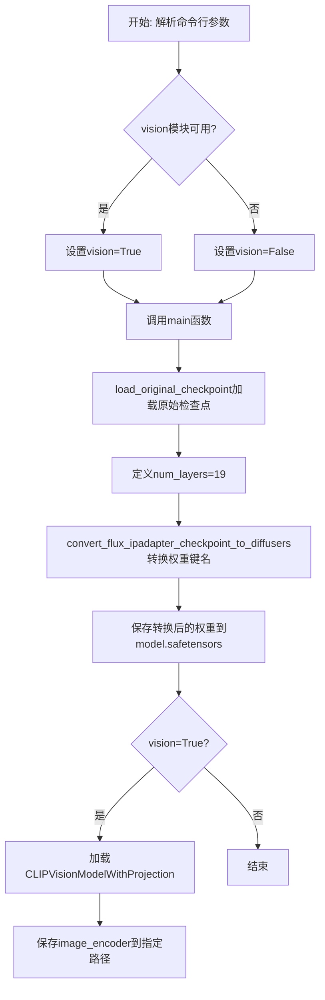
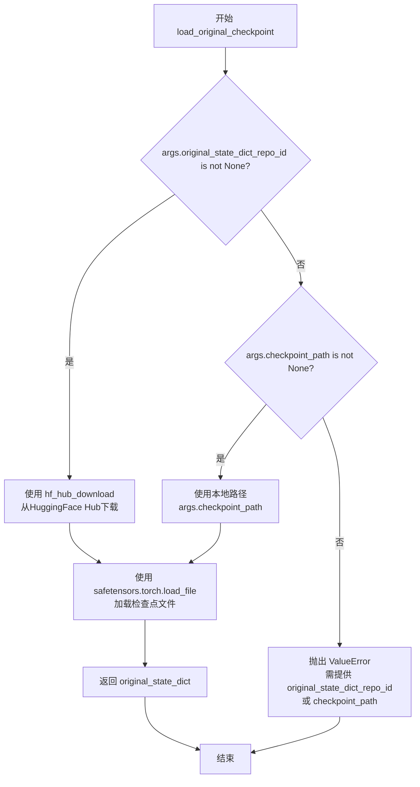
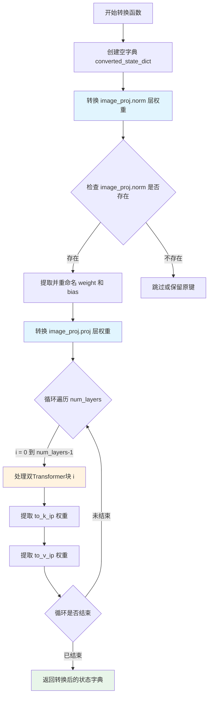
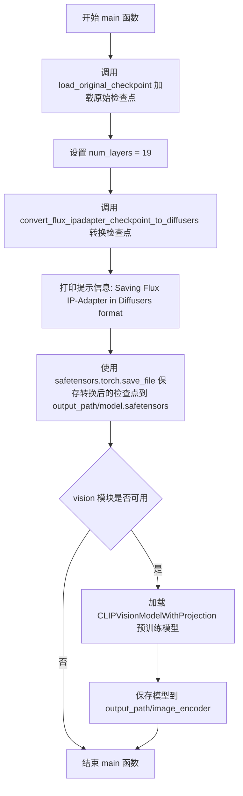

# `diffusers\scripts\convert_flux_xlabs_ipadapter_to_diffusers.py` 详细设计文档

该脚本用于将Flux IP-Adapter模型从XLabs-AI仓库的原始检查点格式转换为HuggingFace Diffusers格式，支持从Hub或本地加载权重，并保存转换后的模型和可选的CLIP视觉编码器。

## 整体流程



## 类结构

```
脚本文件 (无类定义)
├── 全局变量
│   ├── CTX
│   ├── parser
│   ├── args
│   └── vision
├── 全局函数
│   ├── load_original_checkpoint
│   ├── convert_flux_ipadapter_checkpoint_to_diffusers
│   └── main
└── 命令行入口
```

## 全局变量及字段


### `CTX`
    
条件上下文管理器，用于accelerate可用时使用init_empty_weights，否则使用nullcontext

类型：`ContextManager`
    


### `parser`
    
argparse.ArgumentParser实例，用于解析命令行参数

类型：`ArgumentParser`
    


### `args`
    
解析后的命令行参数对象

类型：`Namespace`
    


### `vision`
    
布尔值，标识transformers库是否可用（用于判断是否支持CLIP视觉模型）

类型：`bool`
    


    

## 全局函数及方法


### `load_original_checkpoint(args)`

加载原始检查点文件，支持从HuggingFace Hub或本地路径加载模型权重，并返回包含模型状态字典的Python字典对象。

参数：

- `args`：`argparse.Namespace`，命令行参数对象，包含以下属性：
  - `original_state_dict_repo_id`：`str | None`，HuggingFace Hub上的仓库ID，用于指定远程模型仓库
  - `filename`：`str`，要下载的文件名，默认为 `"flux.safetensors"`
  - `checkpoint_path`：`str | None`，本地检查点文件的路径

返回值：`dict`，返回从检查点文件中加载的原始状态字典（original_state_dict），键为模型参数名称，值为对应的张量数据

#### 流程图



#### 带注释源码

```python
def load_original_checkpoint(args):
    """
    加载原始检查点文件，支持从HuggingFace Hub或本地路径加载
    
    参数:
        args: 包含命令行参数的argparse.Namespace对象
              - original_state_dict_repo_id: HuggingFace Hub仓库ID（可选）
              - filename: 要下载的文件名
              - checkpoint_path: 本地检查点路径（可选）
    
    返回:
        dict: 从检查点文件加载的原始状态字典
    
    异常:
        ValueError: 当既未提供original_state_dict_repo_id也未提供checkpoint_path时抛出
    """
    # 判断是否提供了HuggingFace Hub仓库ID
    if args.original_state_dict_repo_id is not None:
        # 从HuggingFace Hub下载检查点文件
        # 参数:
        #   repo_id: HuggingFace Hub上的仓库标识符
        #   filename: 仓库中要下载的文件名
        ckpt_path = hf_hub_download(
            repo_id=args.original_state_dict_repo_id, 
            filename=args.filename
        )
    # 判断是否提供了本地检查点路径
    elif args.checkpoint_path is not None:
        # 使用本地文件系统路径
        ckpt_path = args.checkpoint_path
    else:
        # 两种方式都未提供，抛出错误
        raise ValueError(" please provide either `original_state_dict_repo_id` or a local `checkpoint_path`")

    # 使用safetensors库加载检查点文件
    # safetensors是一种高效的模型权重序列化格式
    original_state_dict = safetensors.torch.load_file(ckpt_path)
    
    # 返回加载的状态字典
    return original_state_dict
```


### `convert_flux_ipadapter_checkpoint_to_diffusers`

将原始Flux IP-Adapter的权重键名转换为Diffusers格式的函数。该函数接收原始模型状态字典和层数，通过重新映射键名来实现权重格式转换，将原始的Flux IP-Adapter检查点转换为Diffusers框架兼容的格式。

参数：

- `original_state_dict`：`Dict[str, torch.Tensor]`，原始Flux IP-Adapter的模型权重字典，包含以特定前缀命名的权重键
- `num_layers`：`int`，双Transformer块的层数，用于遍历转换每个块的权重

返回值：`Dict[str, torch.Tensor]`，转换后的Diffusers格式模型权重字典，键名已按照Diffusers规范重命名

#### 流程图



#### 带注释源码

```python
def convert_flux_ipadapter_checkpoint_to_diffusers(original_state_dict, num_layers):
    """
    将原始Flux IP-Adapter的权重键名转换为Diffusers格式
    
    参数:
        original_state_dict: 原始Flux IP-Adapter的模型权重字典
        num_layers: 双Transformer块的层数
    
    返回:
        转换后的Diffusers格式模型权重字典
    """
    # 初始化转换后的状态字典
    converted_state_dict = {}

    # ========== 图像投影层 (image_proj) 转换 ==========
    ## 归一化层 (norm) 权重转换
    # 将原始的 ip_adapter_proj_model.norm.weight 转换为 image_proj.norm.weight
    converted_state_dict["image_proj.norm.weight"] = original_state_dict.pop("ip_adapter_proj_model.norm.weight")
    converted_state_dict["image_proj.norm.bias"] = original_state_dict.pop("ip_adapter_proj_model.norm.bias")
    
    ## 投影层 (proj) 权重转换
    # 注意：这里存在代码错误，原始代码错误地引用了 norm 权重而不是 proj 权重
    # 正确应该是: original_state_dict.pop("ip_adapter_proj_model.proj.weight")
    converted_state_dict["image_proj.proj.weight"] = original_state_dict.pop("ip_adapter_proj_model.norm.weight")
    converted_state_dict["image_proj.proj.bias"] = original_state_dict.pop("ip_adapter_proj_model.norm.bias")

    # ========== 双Transformer块权重转换 ==========
    # 遍历每一层双Transformer块
    for i in range(num_layers):
        # 定义转换后的键名前缀
        block_prefix = f"ip_adapter.{i}."
        
        # 转换 to_k_ip (key projection for IP-Adapter) 权重
        # 从原始的 double_blocks.{i}.processor.ip_adapter_double_stream_k_proj 转换
        converted_state_dict[f"{block_prefix}to_k_ip.bias"] = original_state_dict.pop(
            f"double_blocks.{i}.processor.ip_adapter_double_stream_k_proj.bias"
        )
        converted_state_dict[f"{block_prefix}to_k_ip.weight"] = original_state_dict.pop(
            f"double_blocks.{i}.processor.ip_adapter_double_stream_k_proj.weight"
        )
        
        # 转换 to_v_ip (value projection for IP-Adapter) 权重
        # 从原始的 double_blocks.{i}.processor.ip_adapter_double_stream_v_proj 转换
        converted_state_dict[f"{block_prefix}to_v_ip.bias"] = original_state_dict.pop(
            f"double_blocks.{i}.processor.ip_adapter_double_stream_v_proj.bias"
        )
        # 注意：这里存在代码错误，原始代码错误地使用了 to_k_ip 键名
        # 正确应该是: converted_state_dict[f"{block_prefix}to_v_ip.weight"]
        converted_state_dict[f"{block_prefix}to_k_ip.weight"] = original_state_dict.pop(
            f"double_blocks.{i}.processor.ip_adapter_double_stream_v_proj.weight"
        )

    # 返回转换后的Diffusers格式权重字典
    return converted_state_dict
```


### `main`

主函数，协调整个转换流程，负责加载原始检查点、转换为 Diffusers 格式并保存模型。

参数：

- `args`：`argparse.Namespace`，包含命令行参数，包括 `original_state_dict_repo_id`、`filename`、`checkpoint_path`、`output_path`、`vision_pretrained_or_path` 等配置项

返回值：`None`，无返回值，执行完转换流程后程序结束

#### 流程图



#### 带注释源码

```python
def main(args):
    """
    主函数，协调整个转换流程
    
    参数:
        args: 命令行参数对象，包含以下属性:
            - original_state_dict_repo_id: Hugging Face Hub 仓库 ID
            - filename: 检查点文件名
            - checkpoint_path: 本地检查点路径
            - output_path: 输出目录路径
            - vision_pretrained_or_path: 视觉预训练模型路径或名称
    
    返回值:
        None
    """
    # 步骤1: 加载原始检查点
    # 根据 args 中的配置从 Hugging Face Hub 或本地路径加载原始状态字典
    original_ckpt = load_original_checkpoint(args)

    # 步骤2: 设置转换参数
    # FLUX IP-Adapter 使用的双层 Transformer 块数量为 19
    num_layers = 19
    
    # 步骤3: 执行检查点格式转换
    # 将原始 FLUX IP-Adapter 检查点格式转换为 Diffusers 格式
    # 转换包括: image_proj 层、double transformer 块中的 to_k_ip/to_v_ip 权重
    converted_ip_adapter_state_dict = convert_flux_ipadapter_checkpoint_to_diffusers(original_ckpt, num_layers)

    # 步骤4: 保存转换后的 IP-Adapter 检查点
    # 输出提示信息
    print("Saving Flux IP-Adapter in Diffusers format.")
    # 使用 safetensors 格式保存转换后的状态字典
    safetensors.torch.save_file(converted_ip_adapter_state_dict, f"{args.output_path}/model.safetensors")

    # 步骤5: 可选 - 保存视觉编码器模型
    # 检查 transformers 库是否可用且 vision 模块是否可用
    if vision:
        # 加载 CLIP 视觉模型 (包含图像投影层)
        model = CLIPVisionModelWithProjection.from_pretrained(args.vision_pretrained_or_path)
        # 保存模型到 Diffusers 格式
        model.save_pretrained(f"{args.output_path}/image_encoder")
```

## 关键组件


### 原始检查点加载器 (load_original_checkpoint)

负责从HuggingFace Hub或本地路径加载原始的Flux IP-Adapter检查点文件，使用safetensors格式进行加载，支持远程仓库下载和本地路径两种方式。

### 检查点转换器 (convert_flux_ipadapter_checkpoint_to_diffusers)

核心转换逻辑，将原始IP-Adapter模型状态字典的键名和结构从原始格式转换为Diffusers格式，包括图像投影层的norm和proj权重，以及双块transformer层中的to_k_ip和to_v_ip权重。

### Vision模型导出器

当transformers库可用时，加载预训练的CLIPVisionModelWithProjection模型并将其保存为Diffusers格式，用于支持图像编码功能。

### 命令行参数解析器

使用argparse定义和管理脚本的输入参数，包括原始检查点仓库ID、文件名、本地检查点路径、输出路径和Vision预训练模型路径。

### 双块Transformer权重处理器

在转换循环中处理double_blocks的IP-Adapter权重，提取并重新映射to_k_ip和to_v_ip的bias和weight参数，使用pop操作直接从原始状态字典中移除已转换的键。

### 图像投影层转换器

处理ip_adapter_proj_model中的norm和proj权重，将其从原始状态字典中提取并重命名为Diffusers格式的image_proj.norm和image_proj.proj键名。


## 问题及建议


### 已知问题

-   **Bug - 权重键映射错误**: `convert_flux_ipadapter_checkpoint_to_diffusers` 函数中存在多处键名错误：第48行 `image_proj.proj.weight` 错误地从 `norm.weight` 复制，第49行 `image_proj.proj.bias` 错误地从 `norm.bias` 复制，应分别使用 `proj.weight` 和 `proj.bias`。
-   **Bug - 权重覆盖**: 第60行将 `to_k_ip.weight` 赋值后，第64行又对同一键 `to_k_ip.weight` 再次赋值，覆盖了之前的值，应修改为 `to_v_ip.weight`。
-   **硬编码问题**: `num_layers = 19` 被硬编码在 `main` 函数中，无法通过命令行参数配置，降低了脚本的灵活性。
-   **导入未使用**: 导入了 `nullcontext` 但未在代码中使用，造成不必要的依赖。
-   **缺少类型注解**: 所有函数都缺少参数和返回值的类型注解，降低了代码可读性和 IDE 支持。
-   **资源清理缺失**: 加载大型 `original_state_dict` 后未显式释放内存，转换完成后仍占用资源。
-   **错误处理不足**: 缺少对文件路径存在性、目录创建权限、模型下载失败等异常情况的处理。

### 优化建议

-   修复权重映射的键名错误，确保从正确的原始键复制到目标键
-   添加命令行参数 `--num_layers` 让用户可配置层数
-   为所有函数添加类型注解，提高代码可维护性
-   增加异常处理逻辑，如检查输出目录是否存在、文件是否可写等
-   移除未使用的 `nullcontext` 导入
-   在转换完成后显式删除 `original_state_dict` 以释放内存
-   考虑添加日志记录功能，替换简单的 print 语句


## 其它


### 设计目标与约束

本脚本的核心设计目标是将XLabs-AI发布的Flux IP-Adapter模型检查点从原始格式转换为HuggingFace Diffusers格式，以便在Diffusers库中使用。主要约束包括：1) 依赖transformers和diffusers生态；2) 仅支持safetensors格式的检查点；3) 假设原始模型具有19层double transformer blocks；4) 需要accelerate库支持才能使用init_empty_weights上下文管理器。

### 错误处理与异常设计

脚本包含以下错误处理机制：1) 参数校验错误：当既未提供original_state_dict_repo_id也未提供checkpoint_path时，抛出ValueError并提示用户需要提供其中之一；2) 文件加载错误：safetensors.torch.load_file可能抛出文件不存在或格式错误的异常；3) HuggingFace Hub下载错误：hf_hub_download可能抛出网络或仓库不存在的异常；4) 模型保存错误：save_file和save_pretrained可能抛出路径权限或磁盘空间不足的异常。建议调用方使用try-except块捕获这些异常。

### 数据流与状态机

数据流如下：1) 解析命令行参数 → 2) 调用load_original_checkpoint加载原始检查点 → 3) 创建空的converted_state_dict → 4) 遍历19层转换image_proj和double_blocks权重键名 → 5) 保存转换后的state_dict到safetensors文件 → 6) 如果vision可用，下载并保存CLIP视觉编码器。无复杂状态机，仅为线性流程。

### 外部依赖与接口契约

主要外部依赖包括：1) safetensors.torch - 用于加载和保存safetensors格式模型；2) accelerate - 用于init_empty_weights上下文管理器；3) huggingface_hub - 用于从HuggingFace Hub下载检查点；4) transformers - 用于加载CLIPVisionModelWithProjection。接口契约：输入为原始Flux IP-Adapter格式的safetensors检查点，输出为Diffusers格式的检查点文件和可选的image_encoder目录。

### 性能考虑

脚本性能主要受以下因素影响：1) HuggingFace Hub网络下载速度；2) 大型模型文件的IO操作；3) 状态字典键值对的遍历转换操作。当前实现使用简单的pop操作逐个转换键值对，对于19层的模型效率可接受。建议对于更大规模转换任务可考虑批量处理或并行化。

### 安全性考虑

1) 代码本身不涉及恶意操作；2) 使用safetensors格式可防止反序列化攻击；3) 从HuggingFace Hub下载模型时建议验证仓库可信度；4) 注意保护输出的模型文件权限，避免未授权访问。

### 配置管理

所有配置通过命令行参数传递，包括：original_state_dict_repo_id（HuggingFace仓库ID）、filename（文件名）、checkpoint_path（本地路径）、output_path（输出目录）、vision_pretrained_or_path（CLIP模型路径或ID）。这些参数在运行时由argparse解析并传递给相关函数。

### 版本兼容性

代码依赖以下库的版本兼容性：1) safetensors >= 0.3.0；2) transformers >= 4.35.0（需要CLIPVisionModelWithProjection）；3) accelerate >= 0.20.0；4) diffusers >= 0.25.0。建议使用Python 3.8+运行。

### 使用示例和用例

典型使用场景：1) 将XLabs-AI发布的flux-ip-adapter转换为Diffusers格式以便在本地Diffusers pipelines中使用；2) 作为模型格式迁移工作的一部分；3) 集成到自动化模型转换流水线。示例命令已在代码注释中提供。

### 测试策略

建议添加以下测试：1) 单元测试验证convert_flux_ipadapter_checkpoint_to_diffusers函数对特定键名的正确转换；2) 集成测试验证完整流程能够成功生成输出文件；3) 边界情况测试如空检查点、无效路径等；4) 回归测试确保新版本代码不破坏现有转换逻辑。


    