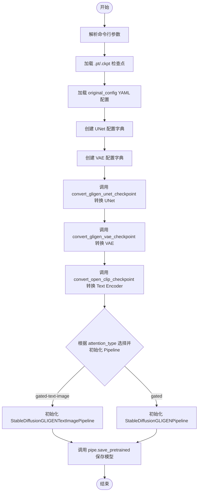
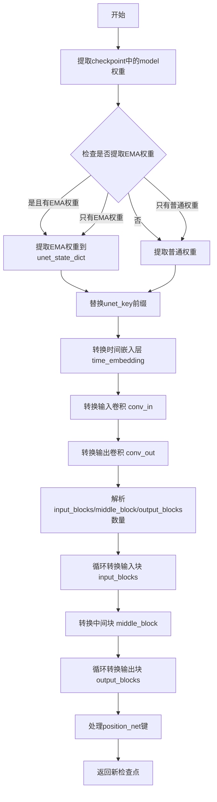
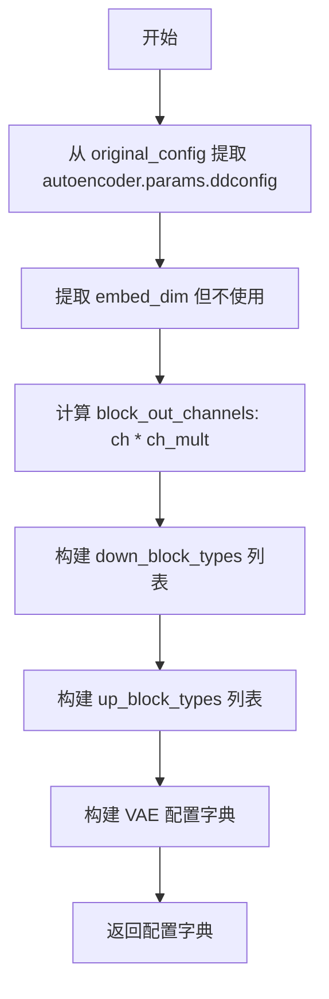
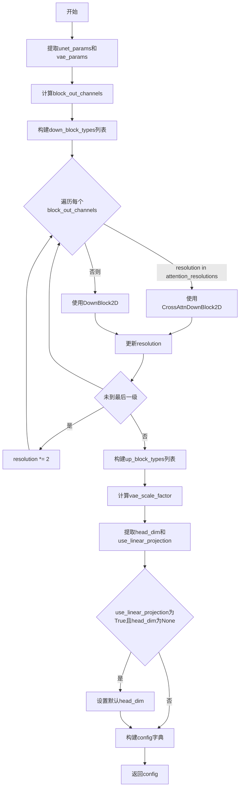
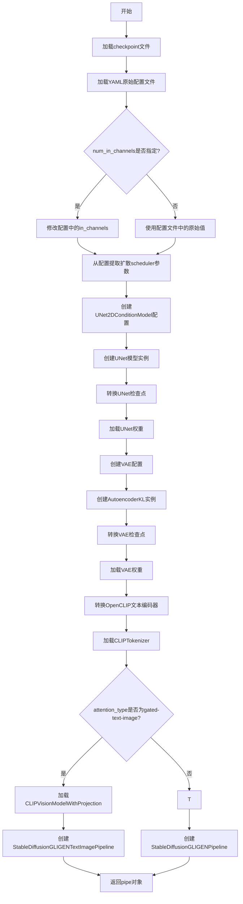

# `diffusers\scripts\convert_gligen_to_diffusers.py` 详细设计文档

该代码是一个模型转换脚本，用于将 GLIGEN (Grounded Language-to-Image Generation with Stable Diffusion) 的预训练检查点（包含 UNet、VAE 和 CLIP 文本编码器）转换为 Hugging Face Diffusers 库兼容的格式，并根据配置文件构建并导出 pipelines。

## 整体流程



## 类结构

```
脚本文件 (无类定义)
└── 转换函数集
    ├── convert_open_clip_checkpoint (文本编码器转换)
    ├── convert_gligen_vae_checkpoint (VAE 转换)
    ├── convert_gligen_unet_checkpoint (UNet 转换)
    ├── create_vae_config (VAE 配置生成)
    ├── create_unet_config (UNet 配置生成)
    └── convert_gligen_to_diffusers (主流程编排)
```

## 全局变量及字段


### `checkpoint_path`
    
要转换的GLIGEN模型检查点文件的路径

类型：`str`
    


### `original_config_file`
    
原始GLIGEN架构的YAML配置文件路径

类型：`str`
    


### `attention_type`
    
注意力类型，可选'gated'或'gated-text-image'

类型：`str`
    


### `image_size`
    
目标图像尺寸，默认为512

类型：`int`
    


### `extract_ema`
    
是否提取EMA权重，默认为False

类型：`bool`
    


### `num_in_channels`
    
输入通道数，若为None则自动推断

类型：`int`
    


### `device`
    
运行设备，默认为cuda或cpu

类型：`str`
    


### `dump_path`
    
输出模型的保存路径

类型：`str`
    


### `half`
    
是否以半精度(FP16)保存权重

类型：`bool`
    


### `checkpoint`
    
加载的模型检查点字典

类型：`dict`
    


### `original_config`
    
原始模型配置的字典对象

类型：`dict`
    


### `unet_config`
    
创建的UNet模型配置字典

类型：`dict`
    


### `vae_config`
    
创建的VAE模型配置字典

类型：`dict`
    


### `scheduler`
    
Diffusers的DDIM调度器实例

类型：`DDIMScheduler`
    


### `unet`
    
转换后的UNet2DConditionModel模型

类型：`UNet2DConditionModel`
    


### `vae`
    
转换后的VAE模型

类型：`AutoencoderKL`
    


### `text_encoder`
    
转换后的CLIP文本编码器

类型：`CLIPTextModel`
    


### `tokenizer`
    
CLIP分词器

类型：`CLIPTokenizer`
    


### `image_encoder`
    
CLIP图像编码器(用于gated-text-image类型)

类型：`CLIPVisionModelWithProjection`
    


### `processor`
    
CLIP处理器(用于gated-text-image类型)

类型：`CLIPProcessor`
    


### `pipe`
    
转换后的完整Diffusers pipeline

类型：`StableDiffusionGLIGENPipeline或StableDiffusionGLIGENTextImagePipeline`
    


### `text_model_dict`
    
文本编码器状态字典

类型：`dict`
    


### `vae_state_dict`
    
VAE状态字典

类型：`dict`
    


### `unet_state_dict`
    
UNet状态字典

类型：`dict`
    


### `new_checkpoint`
    
转换后的新检查点字典

类型：`dict`
    


### `d_model`
    
文本模型维度，默认1024

类型：`int`
    


### `num_down_blocks`
    
VAE下采样块数量

类型：`int`
    


### `num_up_blocks`
    
VAE上采样块数量

类型：`int`
    


### `num_input_blocks`
    
UNet输入块数量

类型：`int`
    


### `num_middle_blocks`
    
UNet中间块数量

类型：`int`
    


### `num_output_blocks`
    
UNet输出块数量

类型：`int`
    


    

## 全局函数及方法


### `convert_open_clip_checkpoint`

该函数用于将 OpenCLIP 检查点中的文本编码器权重转换为 Hugging Face Diffusers 格式的 CLIPTextModel。它处理权重键名的映射、注意力机制的权重分割（将 QKV 权重分离）以及特殊层的处理，最终返回一个加载了转换后权重的 CLIPTextModel 模型实例。

参数：

- `checkpoint`：`Dict`，包含原始 GLIGEN 检查点数据的字典，其中包含 "text_encoder" 键对应的文本编码器权重

返回值：`CLIPTextModel`，转换并加载权重后的 CLIPTextModel 模型实例

#### 流程图

```mermaid
flowchart TD
    A[开始: 传入原始checkpoint] --> B[提取checkpoint['text_encoder']]
    B --> C[加载预训练CLIPTextModel: openai/clip-vit-large-patch14]
    C --> D[获取checkpoint的所有键]
    D --> E[初始化text_model_dict为空字典]
    E --> F{判断是否存在text_projection}
    F -->|是| G[从text_projection获取d_model维度]
    F -->|否| H[设置d_model为1024]
    G --> I
    H --> I[遍历每个key]
    I --> J{key包含'resblocks.23'?}
    J -->|是| K[跳过当前key]
    J -->|否| L{key在textenc_conversion_map中?}
    L -->|是| M[直接映射到新键]
    L -->|否| N{key以'.in_proj_weight'结尾?}
    N -->|是| O[提取new_key并应用textenc_pattern替换<br/>分割Q/K/V权重到不同键]
    N -->|否| P{key以'.in_proj_bias'结尾?}
    P -->|是| Q[提取new_key并应用textenc_pattern替换<br/>分割Q/K/V偏置到不同键]
    P -->|否| R{处理token_embedding等特殊键}
    R --> S[应用textenc_pattern替换并添加到text_model_dict]
    K --> T
    M --> T
    O --> T
    Q --> T
    S --> T{是否还有未遍历的key?}
    T -->|是| I
    T -->|否| U[移除重复的token_embedding键]
    U --> V[加载state_dict到text_model]
    V --> W[返回text_model]
```

#### 带注释源码

```python
def convert_open_clip_checkpoint(checkpoint):
    """
    将 OpenCLIP 检查点中的文本编码器权重转换为 Hugging Face Diffusers 格式的 CLIPTextModel
    
    参数:
        checkpoint: 包含原始 GLIGEN 检查点数据的字典，应包含 "text_encoder" 键
    
    返回:
        CLIPTextModel: 转换并加载权重后的模型实例
    """
    # 从原始checkpoint中提取文本编码器部分
    checkpoint = checkpoint["text_encoder"]
    
    # 加载预训练的CLIPTextModel作为目标模型结构
    # 使用openai/clip-vit-large-patch14作为基础模型
    text_model = CLIPTextModel.from_pretrained("openai/clip-vit-large-patch14")

    # 获取所有需要转换的权重键
    keys = list(checkpoint.keys())

    # 创建用于存储转换后权重的字典
    text_model_dict = {}

    # 确定模型的隐藏维度大小(d_model)
    # 优先从text_projection权重中获取，否则使用默认值1024
    if "cond_stage_model.model.text_projection" in checkpoint:
        d_model = int(checkpoint["cond_stage_model.model.text_projection"].shape[0])
    else:
        d_model = 1024

    # 遍历所有权重键进行转换
    for key in keys:
        # Diffusers版本会丢弃最后一层(第23层)，只使用倒数第二层
        # 因此跳过包含resblocks.23的键
        if "resblocks.23" in key:  # Diffusers drops the final layer and only uses the penultimate layer
            continue
        
        # 如果键在转换映射表中，直接使用映射后的键名
        if key in textenc_conversion_map:
            text_model_dict[textenc_conversion_map[key]] = checkpoint[key]
        
        # 处理以transformer.开头的键，去掉该前缀
        new_key = key[len("transformer.") :]
        
        # 处理注意力机制的in_proj_weight(合并的QKV权重)
        # 需要将合并的权重分割成q_proj, k_proj, v_proj三个独立的权重
        if new_key.endswith(".in_proj_weight"):
            new_key = new_key[: -len(".in_proj_weight")]
            # 应用正则表达式模式替换，保护特定字符
            new_key = textenc_pattern.sub(lambda m: protected[re.escape(m.group(0))], new_key)
            
            # 将合并的权重矩阵按d_model维度分割成三份
            # Q权重: 前d_model行
            text_model_dict[new_key + ".q_proj.weight"] = checkpoint[key][:d_model, :]
            # K权重: 中间d_model行
            text_model_dict[new_key + ".k_proj.weight"] = checkpoint[key][d_model : d_model * 2, :]
            # V权重: 剩余部分
            text_model_dict[new_key + ".v_proj.weight"] = checkpoint[key][d_model * 2 :, :]
        
        # 处理注意力机制的in_proj_bias(合并的QKV偏置)
        elif new_key.endswith(".in_proj_bias"):
            new_key = new_key[: -len(".in_proj_bias")]
            # 应用正则表达式模式替换
            new_key = textenc_pattern.sub(lambda m: protected[re.escape(m.group(0))], new_key)
            
            # 分割偏置向量
            text_model_dict[new_key + ".q_proj.bias"] = checkpoint[key][:d_model]
            text_model_dict[new_key + ".k_proj.bias"] = checkpoint[key][d_model : d_model * 2]
            text_model_dict[new_key + ".v_proj.bias"] = checkpoint[key][d_model * 2 :]
        
        # 处理其他普通权重键
        else:
            # 跳过position_ids这种特殊键
            if key != "transformer.text_model.embeddings.position_ids":
                # 应用正则表达式模式替换
                new_key = textenc_pattern.sub(lambda m: protected[re.escape(m.group(0))], new_key)
                text_model_dict[new_key] = checkpoint[key]

            # 单独处理token_embedding权重，需要调整键名路径
            if key == "transformer.text_model.embeddings.token_embedding.weight":
                text_model_dict["text_model.embeddings.token_embedding.weight"] = checkpoint[key]

    # 移除可能存在的重复的token_embedding权重
    # 原始键和转换后的键都可能被添加，需要去除重复
    text_model_dict.pop("text_model.embeddings.transformer.text_model.embeddings.token_embedding.weight")

    # 将转换后的权重加载到模型中
    text_model.load_state_dict(text_model_dict)

    # 返回转换后的CLIPTextModel模型
    return text_model
```


### `convert_gligen_vae_checkpoint`

该函数负责将 GLiGEN 模型的 VAE（变分自编码器）检查点从原始格式转换为 Diffusers 库兼容的格式，处理权重键名的重映射、层结构的重新组织以及注意力机制的转换。

参数：

- `checkpoint`：`dict`，原始 GLiGEN 检查点字典，包含 `autoencoder` 键下的 VAE 权重
- `config`：`dict`，VAE 配置文件，包含层数、通道数等架构信息

返回值：`dict`，转换后的 VAE 检查点字典，键名符合 Diffusers 的 `AutoencoderKL` 模型结构

#### 流程图

```mermaid
flowchart TD
    A[开始: convert_gligen_vae_checkpoint] --> B[提取 checkpoint['autoencoder'] 部分]
    B --> C[创建 vae_state_dict, 移除 'first_stage_model.' 前缀]
    C --> D[提取 encoder/decoder 的基础权重: conv_in, conv_out, norm_out, quant_conv, post_quant_conv]
    D --> E[计算 encoder down blocks 数量]
    E --> F{遍历每个 down block}
    F --> G[提取 resnets 和 downsample 层]
    G --> H[使用 renew_vae_resnet_paths 转换路径]
    H --> I[调用 assign_to_checkpoint 分配权重]
    F --> J[处理 encoder mid block resnets]
    J --> K[处理 encoder mid block attention]
    K --> L[计算 decoder up blocks 数量]
    L --> M{遍历每个 up block}
    M --> N[提取 resnets 和 upsample 层]
    N --> O[使用 renew_vae_resnet_paths 转换路径]
    O --> P[调用 assign_to_checkpoint 分配权重]
    P --> Q[处理 decoder mid block]
    Q --> R[重命名 mid attention 权重: query→to_q, key→to_k, value→to_v, proj_attn→to_out.0]
    R --> S[返回 new_checkpoint]
```

#### 带注释源码

```python
def convert_gligen_vae_checkpoint(checkpoint, config):
    """
    将 GLiGEN 模型的 VAE 检查点转换为 Diffusers 兼容格式
    
    参数:
        checkpoint: 原始 GLiGEN 检查点字典，需包含 'autoencoder' 键
        config: VAE 配置字典，包含架构信息
    返回:
        转换后的 VAE 状态字典
    """
    # 1. 从检查点中提取 autoencoder 部分
    checkpoint = checkpoint["autoencoder"]
    
    # 2. 创建 VAE 状态字典，移除 "first_stage_model." 前缀以统一键名
    vae_state_dict = {}
    vae_key = "first_stage_model."
    keys = list(checkpoint.keys())
    for key in keys:
        vae_state_dict[key.replace(vae_key, "")] = checkpoint.get(key)

    # 3. 初始化新的检查点字典，用于存储转换后的权重
    new_checkpoint = {}

    # 4. 提取 encoder 和 decoder 的基础卷积层权重
    # encoder.conv_in: 编码器输入卷积层
    new_checkpoint["encoder.conv_in.weight"] = vae_state_dict["encoder.conv_in.weight"]
    new_checkpoint["encoder.conv_in.bias"] = vae_state_dict["encoder.conv_in.bias"]
    # encoder.conv_out: 编码器输出卷积层
    new_checkpoint["encoder.conv_out.weight"] = vae_state_dict["encoder.conv_out.weight"]
    new_checkpoint["encoder.conv_out.bias"] = vae_state_dict["encoder.conv_out.bias"]
    # encoder.conv_norm_out: 编码器输出归一化层
    new_checkpoint["encoder.conv_norm_out.weight"] = vae_state_dict["encoder.norm_out.weight"]
    new_checkpoint["encoder.conv_norm_out.bias"] = vae_state_dict["encoder.norm_out.bias"]

    # 5. 提取 decoder 的基础卷积层权重
    new_checkpoint["decoder.conv_in.weight"] = vae_state_dict["decoder.conv_in.weight"]
    new_checkpoint["decoder.conv_in.bias"] = vae_state_dict["decoder.conv_in.bias"]
    new_checkpoint["decoder.conv_out.weight"] = vae_state_dict["decoder.conv_out.weight"]
    new_checkpoint["decoder.conv_out.bias"] = vae_state_dict["decoder.conv_out.bias"]
    new_checkpoint["decoder.conv_norm_out.weight"] = vae_state_dict["decoder.norm_out.weight"]
    new_checkpoint["decoder.conv_norm_out.bias"] = vae_state_dict["decoder.norm_out.bias"]

    # 6. 提取量化卷积层权重（用于潜在空间压缩）
    new_checkpoint["quant_conv.weight"] = vae_state_dict["quant_conv.weight"]
    new_checkpoint["quant_conv.bias"] = vae_state_dict["quant_conv.bias"]
    new_checkpoint["post_quant_conv.weight"] = vae_state_dict["post_quant_conv.weight"]
    new_checkpoint["post_quant_conv.bias"] = vae_state_dict["post_quant_conv.bias"]

    # 7. 统计 encoder down blocks 的数量（用于下采样）
    num_down_blocks = len({".".join(layer.split(".")[:3]) for layer in vae_state_dict if "encoder.down" in layer})
    down_blocks = {
        layer_id: [key for key in vae_state_dict if f"down.{layer_id}" in key] for layer_id in range(num_down_blocks)
    }

    # 8. 统计 decoder up blocks 的数量（用于上采样）
    num_up_blocks = len({".".join(layer.split(".")[:3]) for layer in vae_state_dict if "decoder.up" in layer})
    up_blocks = {
        layer_id: [key for key in vae_state_dict if f"up.{layer_id}" in key] for layer_id in range(num_up_blocks)
    }

    # 9. 处理 encoder 的 down blocks（每个 block 包含 resnet 和可能的 downsample）
    for i in range(num_down_blocks):
        # 提取当前 down block 中的 resnet 层（排除 downsample 层）
        resnets = [key for key in down_blocks[i] if f"down.{i}" in key and f"down.{i}.downsample" not in key]

        # 处理下采样层（如果有）
        if f"encoder.down.{i}.downsample.conv.weight" in vae_state_dict:
            new_checkpoint[f"encoder.down_blocks.{i}.downsamplers.0.conv.weight"] = vae_state_dict.pop(
                f"encoder.down.{i}.downsample.conv.weight"
            )
            new_checkpoint[f"encoder.down_blocks.{i}.downsamplers.0.conv.bias"] = vae_state_dict.pop(
                f"encoder.down.{i}.downsample.conv.bias"
            )

        # 转换 resnet 路径并分配权重
        paths = renew_vae_resnet_paths(resnets)
        meta_path = {"old": f"down.{i}.block", "new": f"down_blocks.{i}.resnets"}
        assign_to_checkpoint(paths, new_checkpoint, vae_state_dict, additional_replacements=[meta_path], config=config)

    # 10. 处理 encoder 的中间块（mid block）resnets
    mid_resnets = [key for key in vae_state_dict if "encoder.mid.block" in key]
    num_mid_res_blocks = 2
    for i in range(1, num_mid_res_blocks + 1):
        resnets = [key for key in mid_resnets if f"encoder.mid.block_{i}" in key]

        paths = renew_vae_resnet_paths(resnets)
        meta_path = {"old": f"mid.block_{i}", "new": f"mid_block.resnets.{i - 1}"}
        assign_to_checkpoint(paths, new_checkpoint, vae_state_dict, additional_replacements=[meta_path], config=config)

    # 11. 处理 encoder 的中间块注意力层
    mid_attentions = [key for key in vae_state_dict if "encoder.mid.attn" in key]
    paths = renew_vae_attention_paths(mid_attentions)
    meta_path = {"old": "mid.attn_1", "new": "mid_block.attentions.0"}
    assign_to_checkpoint(paths, new_checkpoint, vae_state_dict, additional_replacements=[meta_path], config=config)
    # 将卷积注意力转换为线性层
    conv_attn_to_linear(new_checkpoint)

    # 12. 处理 decoder 的 up blocks（反向遍历）
    for i in range(num_up_blocks):
        block_id = num_up_blocks - 1 - i  # 反向索引以匹配层级顺序
        resnets = [
            key for key in up_blocks[block_id] if f"up.{block_id}" in key and f"up.{block_id}.upsample" not in key
        ]

        # 处理上采样层（如果有）
        if f"decoder.up.{block_id}.upsample.conv.weight" in vae_state_dict:
            new_checkpoint[f"decoder.up_blocks.{i}.upsamplers.0.conv.weight"] = vae_state_dict[
                f"decoder.up.{block_id}.upsample.conv.weight"
            ]
            new_checkpoint[f"decoder.up_blocks.{i}.upsamplers.0.conv.bias"] = vae_state_dict[
                f"decoder.up.{block_id}.upsample.conv.bias"
            ]

        # 转换 resnet 路径并分配权重
        paths = renew_vae_resnet_paths(resnets)
        meta_path = {"old": f"up.{block_id}.block", "new": f"up_blocks.{i}.resnets"}
        assign_to_checkpoint(paths, new_checkpoint, vae_state_dict, additional_replacements=[meta_path], config=config)

    # 13. 处理 decoder 的中间块 resnets
    mid_resnets = [key for key in vae_state_dict if "decoder.mid.block" in key]
    num_mid_res_blocks = 2
    for i in range(1, num_mid_res_blocks + 1):
        resnets = [key for key in mid_resnets if f"decoder.mid.block_{i}" in key]

        paths = renew_vae_resnet_paths(resnets)
        meta_path = {"old": f"mid.block_{i}", "new": f"mid_block.resnets.{i - 1}"}
        assign_to_checkpoint(paths, new_checkpoint, vae_state_dict, additional_replacements=[meta_path], config=config)

    # 14. 处理 decoder 的中间块注意力层
    mid_attentions = [key for key in vae_state_dict if "decoder.mid.attn" in key]
    paths = renew_vae_attention_paths(mid_attentions)
    meta_path = {"old": "mid.attn_1", "new": "mid_block.attentions.0"}
    assign_to_checkpoint(paths, new_checkpoint, vae_state_dict, additional_replacements=[meta_path], config=config)
    conv_attn_to_linear(new_checkpoint)

    # 15. 重命名中间注意力层的键名以匹配 Diffusers 格式
    # Diffusers 使用 to_q, to_k, to_v, to_out 而非 query, key, value, proj_attn
    for key in new_checkpoint.keys():
        if "encoder.mid_block.attentions.0" in key or "decoder.mid_block.attentions.0" in key:
            if "query" in key:
                new_checkpoint[key.replace("query", "to_q")] = new_checkpoint.pop(key)
            if "value" in key:
                new_checkpoint[key.replace("value", "to_v")] = new_checkpoint.pop(key)
            if "key" in key:
                new_checkpoint[key.replace("key", "to_k")] = new_checkpoint.pop(key)
            if "proj_attn" in key:
                new_checkpoint[key.replace("proj_attn", "to_out.0")] = new_checkpoint.pop(key)

    return new_checkpoint
```


### `convert_gligen_unet_checkpoint`

该函数用于将GLiGEN预训练检查点中的UNet模型权重转换为Diffusers格式，处理权重键名的重新映射、EMA权重提取以及不同架构层之间的转换。

参数：

- `checkpoint`：`dict`，包含原始GLiGEN检查点数据，其中`checkpoint["model"]`存储UNet权重
- `config`：`dict`，UNet配置字典，包含`layers_per_block`等参数用于确定块结构
- `path`：`str`（可选），检查点文件路径，用于打印信息
- `extract_ema`：`bool`（可选），是否提取EMA权重，默认为False

返回值：`dict`，转换后的UNet检查点字典，键名符合Diffusers的UNet2DConditionModel格式

#### 流程图



#### 带注释源码

```python
def convert_gligen_unet_checkpoint(checkpoint, config, path=None, extract_ema=False):
    """
    将GLiGEN的UNet检查点转换为Diffusers格式
    
    参数:
        checkpoint: 原始检查点字典
        config: UNet配置字典
        path: 检查点路径(可选)
        extract_ema: 是否提取EMA权重
    
    返回:
        转换后的检查点字典
    """
    unet_state_dict = {}
    # 从checkpoint中提取model部分的权重
    checkpoint = checkpoint["model"]
    keys = list(checkpoint.keys())

    # 定义UNet键名前缀
    unet_key = "model.diffusion_model."

    # 处理EMA权重提取逻辑
    # 如果有超过100个以model_ema开头的键，且extract_ema为True
    if sum(k.startswith("model_ema") for k in keys) > 100 and extract_ema:
        print(f"Checkpoint {path} has bot EMA and non-EMA weights.")
        print(
            "In this conversion only the EMA weights are extracted. If you want to instead extract the non-EMA"
            " weights (useful to continue fine-tuning), please make sure to remove the `--extract_ema` flag."
        )
        # 遍历键，提取EMA权重
        for key in keys:
            if key.startswith("model.diffusion_model"):
                flat_ema_key = "model_ema." + "".join(key.split(".")[1:])
                unet_state_dict[key.replace(unet_key, "")] = checkpoint.pop(flat_ema_key)
    else:
        # 如果有超过100个EMA键但没指定提取EMA，给出警告
        if sum(k.startswith("model_ema") for k in keys) > 100:
            print(
                "In this conversion only the non-EMA weights are extracted. If you want to instead extract the EMA"
                " weights (usually better for inference), please make sure to add the `--extract_ema` flag."
            )
    
    # 提取所有普通权重
    for key in keys:
        unet_state_dict[key.replace(unet_key, "")] = checkpoint.pop(key)

    # 初始化新检查点字典
    new_checkpoint = {}

    # 转换时间嵌入层: time_embed.0 -> time_embedding.linear_1
    new_checkpoint["time_embedding.linear_1.weight"] = unet_state_dict["time_embed.0.weight"]
    new_checkpoint["time_embedding.linear_1.bias"] = unet_state_dict["time_embed.0.bias"]
    new_checkpoint["time_embedding.linear_2.weight"] = unet_state_dict["time_embed.2.weight"]
    new_checkpoint["time_embedding.linear_2.bias"] = unet_state_dict["time_embed.2.bias"]

    # 转换输入卷积层: input_blocks.0.0 -> conv_in
    new_checkpoint["conv_in.weight"] = unet_state_dict["input_blocks.0.0.weight"]
    new_checkpoint["conv_in.bias"] = unet_state_dict["input_blocks.0.0.bias"]

    # 转换输出卷积层: out.0 -> conv_norm_out, out.2 -> conv_out
    new_checkpoint["conv_norm_out.weight"] = unet_state_dict["out.0.weight"]
    new_checkpoint["conv_norm_out.bias"] = unet_state_dict["out.0.bias"]
    new_checkpoint["conv_out.weight"] = unet_state_dict["out.2.weight"]
    new_checkpoint["conv_out.bias"] = unet_state_dict["out.2.bias"]

    # 解析输入块数量
    # 获取包含"input_blocks"的唯一层前缀数量
    num_input_blocks = len({".".join(layer.split(".")[:2]) for layer in unet_state_dict if "input_blocks" in layer})
    # 为每个输入块创建键列表
    input_blocks = {
        layer_id: [key for key in unet_state_dict if f"input_blocks.{layer_id}" in key]
        for layer_id in range(num_input_blocks)
    }

    # 解析中间块数量
    num_middle_blocks = len({".".join(layer.split(".")[:2]) for layer in unet_state_dict if "middle_block" in layer})
    middle_blocks = {
        layer_id: [key for key in unet_state_dict if f"middle_block.{layer_id}" in key]
        for layer_id in range(num_middle_blocks)
    }

    # 解析输出块数量
    num_output_blocks = len({".".join(layer.split(".")[:2]) for layer in unet_state_dict if "output_blocks" in layer})
    output_blocks = {
        layer_id: [key for key in unet_state_dict if f"output_blocks.{layer_id}" in key]
        for layer_id in range(num_output_blocks)
    }

    # 转换输入块 (除了第一个块0已经处理)
    for i in range(1, num_input_blocks):
        # 计算块ID和层ID
        block_id = (i - 1) // (config["layers_per_block"] + 1)
        layer_in_block_id = (i - 1) % (config["layers_per_block"] + 1)

        # 获取resnets和attentions的键
        resnets = [
            key for key in input_blocks[i] if f"input_blocks.{i}.0" in key and f"input_blocks.{i}.0.op" not in key
        ]
        attentions = [key for key in input_blocks[i] if f"input_blocks.{i}.1" in key]

        # 处理下采样层
        if f"input_blocks.{i}.0.op.weight" in unet_state_dict:
            new_checkpoint[f"down_blocks.{block_id}.downsamplers.0.conv.weight"] = unet_state_dict.pop(
                f"input_blocks.{i}.0.op.weight"
            )
            new_checkpoint[f"down_blocks.{block_id}.downsamplers.0.conv.bias"] = unet_state_dict.pop(
                f"input_blocks.{i}.0.op.bias"
            )

        # 转换resnet路径
        paths = renew_resnet_paths(resnets)
        meta_path = {"old": f"input_blocks.{i}.0", "new": f"down_blocks.{block_id}.resnets.{layer_in_block_id}"}
        assign_to_checkpoint(
            paths, new_checkpoint, unet_state_dict, additional_replacements=[meta_path], config=config
        )

        # 转换attention路径
        if len(attentions):
            paths = renew_attention_paths(attentions)
            meta_path = {"old": f"input_blocks.{i}.1", "new": f"down_blocks.{block_id}.attentions.{layer_in_block_id}"}
            assign_to_checkpoint(
                paths, new_checkpoint, unet_state_dict, additional_replacements=[meta_path], config=config
            )

    # 转换中间块
    resnet_0 = middle_blocks[0]
    attentions = middle_blocks[1]
    resnet_1 = middle_blocks[2]

    # 转换resnet_0
    resnet_0_paths = renew_resnet_paths(resnet_0)
    assign_to_checkpoint(resnet_0_paths, new_checkpoint, unet_state_dict, config=config)

    # 转换resnet_1
    resnet_1_paths = renew_resnet_paths(resnet_1)
    assign_to_checkpoint(resnet_1_paths, new_checkpoint, unet_state_dict, config=config)

    # 转换attention
    attentions_paths = renew_attention_paths(attentions)
    meta_path = {"old": "middle_block.1", "new": "mid_block.attentions.0"}
    assign_to_checkpoint(
        attentions_paths, new_checkpoint, unet_state_dict, additional_replacements=[meta_path], config=config
    )

    # 转换输出块
    for i in range(num_output_blocks):
        block_id = i // (config["layers_per_block"] + 1)
        layer_in_block_id = i % (config["layers_per_block"] + 1)
        
        # 修整层名称
        output_block_layers = [shave_segments(name, 2) for name in output_blocks[i]]
        output_block_list = {}

        for layer in output_block_layers:
            layer_id, layer_name = layer.split(".")[0], shave_segments(layer, 1)
            if layer_id in output_block_list:
                output_block_list[layer_id].append(layer_name)
            else:
                output_block_list[layer_id] = [layer_name]

        # 如果有多个层
        if len(output_block_list) > 1:
            resnets = [key for key in output_blocks[i] if f"output_blocks.{i}.0" in key]
            attentions = [key for key in output_blocks[i] if f"output_blocks.{i}.1" in key]

            resnet_0_paths = renew_resnet_paths(resnets)
            paths = renew_resnet_paths(resnets)

            meta_path = {"old": f"output_blocks.{i}.0", "new": f"up_blocks.{block_id}.resnets.{layer_in_block_id}"}
            assign_to_checkpoint(
                paths, new_checkpoint, unet_state_dict, additional_replacements=[meta_path], config=config
            )

            # 排序输出块列表
            output_block_list = {k: sorted(v) for k, v in output_block_list.items()}
            
            # 检查是否有卷积层(上采样器)
            if ["conv.bias", "conv.weight"] in output_block_list.values():
                index = list(output_block_list.values()).index(["conv.bias", "conv.weight"])
                new_checkpoint[f"up_blocks.{block_id}.upsamplers.0.conv.weight"] = unet_state_dict[
                    f"output_blocks.{i}.{index}.conv.weight"
                ]
                new_checkpoint[f"up_blocks.{block_id}.upsamplers.0.conv.bias"] = unet_state_dict[
                    f"output_blocks.{i}.{index}.conv.bias"
                ]

                # 清除已处理的attentions
                if len(attentions) == 2:
                    attentions = []

            # 转换attention路径
            if len(attentions):
                paths = renew_attention_paths(attentions)
                meta_path = {
                    "old": f"output_blocks.{i}.1",
                    "new": f"up_blocks.{block_id}.attentions.{layer_in_block_id}",
                }
                assign_to_checkpoint(
                    paths, new_checkpoint, unet_state_dict, additional_replacements=[meta_path], config=config
                )
        else:
            # 单一层情况
            resnet_0_paths = renew_resnet_paths(output_block_layers, n_shave_prefix_segments=1)
            for path in resnet_0_paths:
                old_path = ".".join(["output_blocks", str(i), path["old"]])
                new_path = ".".join(["up_blocks", str(block_id), "resnets", str(layer_in_block_id), path["new"]])

                new_checkpoint[new_path] = unet_state_dict[old_path]

    # 处理position_net键(位置网络)
    for key in keys:
        if "position_net" in key:
            new_checkpoint[key] = unet_state_dict[key]

    return new_checkpoint
```


### `create_vae_config`

该函数负责将原始 GLiGEN 模型的 VAE（变分自编码器）配置转换为 Diffusers 库所需的格式，通过提取原始配置中的 VAE 参数（如通道数、块类型、潜在空间维度等）并构建一个标准化的配置字典，以适配 `AutoencoderKL` 模型的初始化需求。

参数：

- `original_config`：`dict`，原始 GLiGEN 模型的完整配置文件，包含 `autoencoder` 键下的 `params` 和 `ddconfig` 配置
- `image_size`：`int`，目标图像的尺寸，用于设置 VAE 的 `sample_size`

返回值：`dict`，返回包含以下键的 VAE 配置字典：
- `sample_size`：图像尺寸
- `in_channels`：输入通道数
- `out_channels`：输出通道数
- `down_block_types`：下采样块类型元组
- `up_block_types`：上采样块类型元组
- `block_out_channels`：块输出通道数元组
- `latent_channels`：潜在空间通道数
- `layers_per_block`：每个块的层数

#### 流程图



#### 带注释源码

```python
def create_vae_config(original_config, image_size: int):
    """
    从原始配置创建 VAE 配置字典，用于 Diffusers 的 AutoencoderKL 模型
    
    参数:
        original_config: 原始 GLiGEN 模型的配置文件 (dict)
        image_size: 目标图像尺寸 (int)
    
    返回:
        用于初始化 AutoencoderKL 的配置字典 (dict)
    """
    # 从原始配置中提取 VAE 的 ddconfig 配置
    vae_params = original_config["autoencoder"]["params"]["ddconfig"]
    # 提取 embed_dim 但未使用（可能用于未来扩展或验证）
    _ = original_config["autoencoder"]["params"]["embed_dim"]

    # 计算每个块的输出通道数：基础通道数 * 通道倍增因子
    # 例如：ch=128, ch_mult=[1,2,4,4] -> [128, 256, 512, 512]
    block_out_channels = [vae_params["ch"] * mult for mult in vae_params["ch_mult"]]
    
    # 设置下采样块类型：全部使用 DownEncoderBlock2D
    down_block_types = ["DownEncoderBlock2D"] * len(block_out_channels)
    
    # 设置上采样块类型：全部使用 UpDecoderBlock2D
    up_block_types = ["UpDecoderBlock2D"] * len(block_out_channels)

    # 构建完整的 VAE 配置字典
    config = {
        "sample_size": image_size,                    # VAE 处理样本的尺寸
        "in_channels": vae_params["in_channels"],     # VAE 输入通道数
        "out_channels": vae_params["out_ch"],         # VAE 输出通道数
        "down_block_types": tuple(down_block_types),  # 下采样块类型元组
        "up_block_types": tuple(up_block_types),      # 上采样块类型元组
        "block_out_channels": tuple(block_out_channels), # 块输出通道数元组
        "latent_channels": vae_params["z_channels"],   # 潜在空间通道数
        "layers_per_block": vae_params["num_res_blocks"], # 每个块中的残差层数
    }

    # 返回配置字典，用于 AutoencoderKL(**vae_config) 初始化
    return config
```


### `create_unet_config`

根据原始配置文件构建用于创建 UNet2DConditionModel 的配置字典。该函数解析原始配置中的模型参数、VAE 参数，并生成符合 Diffusers 库格式的 UNet 配置。

参数：

- `original_config`：`Dict`，原始配置字典，包含模型和自动编码器的参数信息
- `image_size`：`int`，输入图像的尺寸
- `attention_type`：`str`，注意力机制类型（如 "gated" 或 "gated-text-image"）

返回值：`Dict`，包含 UNet2DConditionModel 所需的配置参数

#### 流程图



#### 带注释源码

```python
def create_unet_config(original_config, image_size: int, attention_type):
    """
    根据原始配置文件创建 UNet2DConditionModel 的配置字典
    
    参数:
        original_config: 包含原始模型配置的字典
        image_size: 输入图像尺寸
        attention_type: 注意力机制类型
    
    返回:
        包含 UNet 配置的字典
    """
    
    # 从原始配置中提取 UNet 参数
    unet_params = original_config["model"]["params"]
    
    # 从原始配置中提取 VAE 参数（用于计算缩放因子）
    vae_params = original_config["autoencoder"]["params"]["ddconfig"]

    # 根据 model_channels 和 channel_mult 计算每个块的输出通道数
    # 例如: model_channels=320, channel_mult=[1,2,4,4] => [320, 640, 1280, 1280]
    block_out_channels = [unet_params["model_channels"] * mult for mult in unet_params["channel_mult"]]

    # 构建下采样块类型列表
    down_block_types = []
    resolution = 1
    for i in range(len(block_out_channels)):
        # 如果当前分辨率在注意力分辨率列表中，使用交叉注意力块
        block_type = "CrossAttnDownBlock2D" if resolution in unet_params["attention_resolutions"] else "DownBlock2D"
        down_block_types.append(block_type)
        if i != len(block_out_channels) - 1:
            resolution *= 2  # 分辨率翻倍

    # 构建上采样块类型列表
    up_block_types = []
    for i in range(len(block_out_channels)):
        # 从高分辨率向下遍历
        block_type = "CrossAttnUpBlock2D" if resolution in unet_params["attention_resolutions"] else "UpBlock2D"
        up_block_types.append(block_type)
        resolution //= 2  # 分辨率减半

    # 计算 VAE 缩放因子（用于调整 sample_size）
    # 例如: ch_mult=[1,2,4,4] => 2^(4-1) = 8
    vae_scale_factor = 2 ** (len(vae_params["ch_mult"]) - 1)

    # 提取注意力头维度，如果未指定则设为 None
    head_dim = unet_params["num_heads"] if "num_heads" in unet_params else None
    
    # 检查是否使用线性投影
    use_linear_projection = (
        unet_params["use_linear_in_transformer"] if "use_linear_in_transformer" in unet_params else False
    )
    
    # 如果使用线性投影但未指定 head_dim，设置默认值
    if use_linear_projection:
        if head_dim is None:
            head_dim = [5, 10, 20, 20]

    # 构建最终的配置字典
    config = {
        "sample_size": image_size // vae_scale_factor,  # 根据 VAE 缩放因子调整样本尺寸
        "in_channels": unet_params["in_channels"],       # 输入通道数
        "down_block_types": tuple(down_block_types),    # 下采样块类型元组
        "block_out_channels": tuple(block_out_channels),# 块输出通道数元组
        "layers_per_block": unet_params["num_res_blocks"], # 每个块的残差层数
        "cross_attention_dim": unet_params["context_dim"], # 交叉注意力维度
        "attention_head_dim": head_dim,                  # 注意力头维度
        "use_linear_projection": use_linear_projection,  # 是否使用线性投影
        "attention_type": attention_type,                # 注意力类型
    }

    return config
```


### `convert_gligen_to_diffusers`

该函数是GLIGEN到Diffusers模型转换的核心入口函数，负责将原始GLIGEN模型的检查点（包含UNet、VAE、文本编码器等）转换为Diffusers库支持的Pipeline格式，支持"gated"和"gated-text-image"两种注意力类型。

参数：

- `checkpoint_path`：`str`，待转换的GLIGEN模型检查点文件路径
- `original_config_file`：`str`，原始GLIGEN架构的YAML配置文件路径
- `attention_type`：`str`，注意力类型，可选值为"gated"或"gated-text-image"
- `image_size`：`int = 512`，输出图像的尺寸大小
- `extract_ema`：`bool = False`，是否从检查点中提取EMA权重（通常EMA权重推理质量更高）
- `num_in_channels`：`int = None`，输入通道数，若为None则从配置文件中自动推断
- `device`：`str = None`，运行设备，若为None则自动选择cuda（若可用）或cpu

返回值：`pipe`，返回转换后的Diffusers Pipeline对象（`StableDiffusionGLIGENPipeline`或`StableDiffusionGLIGENTextImagePipeline`）

#### 流程图



#### 带注释源码

```python
def convert_gligen_to_diffusers(
    checkpoint_path: str,                    # GLIGEN检查点文件路径
    original_config_file: str,                # 原始架构YAML配置文件
    attention_type: str,                      # 注意力类型: "gated" 或 "gated-text-image"
    image_size: int = 512,                    # 输出图像尺寸
    extract_ema: bool = False,                # 是否提取EMA权重
    num_in_channels: int = None,              # 输入通道数，None则自动推断
    device: str = None,                       # 运行设备，None则自动选择
):
    """
    将GLIGEN模型检查点转换为Diffusers Pipeline格式
    
    Args:
        checkpoint_path: GLIGEN预训练模型检查点路径
        original_config_file: 原始GLIGEN架构的YAML配置文件
        attention_type: 注意力机制类型
        image_size: 目标图像分辨率
        extract_ema: 是否提取EMA权重（非EMA权重更适合微调）
        num_in_channels: 输入通道数覆盖值
        device: 计算设备
    
    Returns:
        转换后的Diffusers Pipeline对象
    """
    
    # 1. 确定运行设备并加载检查点
    # 如果未指定device，默认优先使用CUDA，否则使用CPU
    if device is None:
        device = "cuda" if torch.cuda.is_available() else "cpu"
        # 使用torch.load加载检查点并映射到指定设备
        checkpoint = torch.load(checkpoint_path, map_location=device)
    else:
        checkpoint = torch.load(checkpoint_path, map_location=device)

    # 2. 检查checkpoint中的global_step信息（用于训练进度追踪）
    if "global_step" in checkpoint:
        checkpoint["global_step"]  # 提取全局训练步数
    else:
        print("global_step key not found in model")

    # 3. 加载原始YAML配置文件
    # 使用yaml.safe_load解析配置文件获取模型架构参数
    original_config = yaml.safe_load(original_config_file)

    # 4. 如果指定了输入通道数，覆盖配置文件中的值
    # 这允许用户自定义输入通道（如自定义数据集）
    if num_in_channels is not None:
        original_config["model"]["params"]["in_channels"] = num_in_channels

    # 5. 从配置中提取扩散scheduler参数
    # 用于初始化DDIMScheduler（噪声调度器）
    num_train_timesteps = original_config["diffusion"]["params"]["timesteps"]
    beta_start = original_config["diffusion"]["params"]["linear_start"]
    beta_end = original_config["diffusion"]["params"]["linear_end"]

    # 6. 创建DDIMScheduler实例
    # DDIMScheduler是一种高效的扩散模型采样调度器
    scheduler = DDIMScheduler(
        beta_end=beta_end,
        beta_schedule="scaled_linear",
        beta_start=beta_start,
        num_train_timesteps=num_train_timesteps,
        steps_offset=1,
        clip_sample=False,
        set_alpha_to_one=False,
        prediction_type="epsilon",
    )

    # ==================== UNet模型转换 ====================
    # 7. 创建UNet配置并实例化模型
    unet_config = create_unet_config(original_config, image_size, attention_type)
    unet = UNet2DConditionModel(**unet_config)

    # 8. 转换UNet检查点权重格式
    # 将GLIGEN的权重键名转换为Diffusers格式
    converted_unet_checkpoint = convert_gligen_unet_checkpoint(
        checkpoint, unet_config, path=checkpoint_path, extract_ema=extract_ema
    )

    # 9. 加载转换后的UNet权重
    unet.load_state_dict(converted_unet_checkpoint)

    # ==================== VAE模型转换 ====================
    # 10. 创建VAE配置并实例化模型
    vae_config = create_vae_config(original_config, image_size)
    converted_vae_checkpoint = convert_gligen_vae_checkpoint(checkpoint, vae_config)

    # 11. 创建AutoencoderKL实例并加载权重
    vae = AutoencoderKL(**vae_config)
    vae.load_state_dict(converted_vae_checkpoint)

    # ==================== 文本编码器转换 ====================
    # 12. 转换OpenCLIP文本编码器为HuggingFace CLIP格式
    text_encoder = convert_open_clip_checkpoint(checkpoint)
    
    # 13. 加载CLIP分词器
    tokenizer = CLIPTokenizer.from_pretrained("openai/clip-vit-large-patch14")

    # ==================== 创建Pipeline ====================
    # 14. 根据attention_type选择不同的Pipeline类型
    
    if attention_type == "gated-text-image":
        # 门控文本-图像注意力：需要额外的图像编码器
        # 用于支持基于图像条件的生成（如Inpainting）
        image_encoder = CLIPVisionModelWithProjection.from_pretrained("openai/clip-vit-large-patch14")
        processor = CLIPProcessor.from_pretrained("openai/clip-vit-large-patch14")

        # 创建支持文本和图像条件的Pipeline
        pipe = StableDiffusionGLIGENTextImagePipeline(
            vae=vae,
            text_encoder=text_encoder,
            tokenizer=tokenizer,
            image_encoder=image_encoder,
            processor=processor,
            unet=unet,
            scheduler=scheduler,
            safety_checker=None,    # GLIGEN通常不使用安全过滤器
            feature_extractor=None,
        )
    elif attention_type == "gated":
        # 门控注意力：仅支持文本条件
        pipe = StableDiffusionGLIGENPipeline(
            vae=vae,
            text_encoder=text_encoder,
            tokenizer=tokenizer,
            unet=unet,
            scheduler=scheduler,
            safety_checker=None,
            feature_extractor=None,
        )

    # 15. 返回转换后的Pipeline对象
    return pipe
```

## 关键组件


### 张量索引与惰性加载

代码使用torch.load加载检查点，并使用.pop()方法实现惰性加载，避免一次性加载所有权重到内存。在转换过程中使用字典键替换和条件判断来实现高效的张量索引。

### 反量化支持

代码支持通过`--half`参数将权重保存为半精度(float16)格式，使用`pipe.to(dtype=torch.float16)`实现模型权重的反量化。

### 量化策略

当前代码未实现量化策略，但提供了半精度保存选项作为替代方案。

### 文本编码器转换

将OpenCLIP文本编码器检查点转换为Hugging Face CLIPTextModel格式，处理注意力机制的权重分割(q_proj, k_proj, v_proj)以及位置嵌入的转换。

### VAE检查点转换

将GLIGEN VAE检查点重新映射到Diffusers的AutoencoderKL结构，处理编码器和解码器的下采样、上采样块以及中间块的残差连接和注意力层。

### UNet检查点转换

将GLIGEN UNet检查点转换为Diffusers的UNet2DConditionModel结构，处理输入块、中间块和输出块的重新映射，支持EMA权重提取选项。

### 配置创建

create_vae_config和create_unet_config函数根据原始配置文件创建VAE和UNet的Diffusers兼容配置，包括通道数、块类型、注意力维度等参数。

### 管道组装

convert_gligen_to_diffusers函数将转换后的VAE、文本编码器、UNet和调度器组装为StableDiffusionGLIGENPipeline或StableDiffusionGLIGENTextImagePipeline，支持gated和gated-text-image两种注意力类型。

### CLI参数解析

使用argparse提供命令行接口，支持检查点路径、原始配置文件、注意力类型、输出路径等参数，以及半精度保存和EMA权重提取选项。


## 问题及建议


### 已知问题

-   **缺少完整的错误处理机制**：文件加载失败（如 checkpoint_path 或 original_config_file 不存在或损坏）时没有捕获异常，可能导致程序直接崩溃
-   **硬编码的模型名称**：`"openai/clip-vit-large-patch14"` 在多处硬编码，如果模型路径变化需要手动修改
-   **重复代码**：`convert_gligen_vae_checkpoint` 函数中 encoder 和 decoder 的 mid block 处理逻辑几乎完全相同，未进行提取复用
-   **变量命名不一致与冗余**：`num_mid_res_blocks = 2` 在 VAE 转换函数中出现两次，且 `global_step` 被读取但未使用
- **潜在的空键访问风险**：`checkpoint.get(key)` 和 `pop(key)` 操作未检查键是否存在，可能导致 KeyError
- **魔法数字和字符串**：大量使用字符串路径（如 `"transformer."`、`"first_stage_model."`）和数字（如 `d_model = 1024`），缺乏常量定义
- **不完整的类型注解**：部分函数参数和返回值缺少类型提示，影响代码可维护性

### 优化建议

-   **添加输入验证**：在加载 checkpoint 前验证文件存在性，解析 YAML 后检查必要字段是否完整，对 `num_in_channels` 等关键参数进行范围检查
-   **提取常量**：将模型路径、层名称前缀、默认参数等提取为模块级常量或配置文件
-   **重构重复逻辑**：将 VAE encoder/decoder 的 mid block 处理抽取为通用函数，减少代码冗余
-   **完善错误处理**：为文件加载、模型加载、状态字典赋值等关键操作添加 try-except 块，输出友好的错误信息
-   **优化性能**：对于大模型转换可考虑添加进度条（tqdm），减少不必要的字典遍历和复制操作
-   **增加日志记录**：使用 `logging` 模块替代 `print` 语句，便于生产环境调试和问题追踪
-   **补充类型注解**：为所有函数添加完整的类型提示，包括泛型类型（如 `Dict[str, Tensor]`）


## 其它


### 设计目标与约束

**设计目标：**
本工具旨在将GLIGEN（Grounded Language-to-Image Generation）模型的检查点文件转换为Hugging Face Diffusers库兼容的格式，使得预训练的GLIGEN模型能够在Diffusers框架下进行推理和部署。

**主要约束：**
- 支持两种注意力类型转换：`gated`（门控文本注意力）和`gated-text-image`（门控文本图像注意力）
- 支持从包含EMA和非EMA权重的检查点中选择性提取权重
- 输入图像尺寸默认为512x512
- 设备自动选择（优先CUDA）
- 支持半精度（FP16）模型保存

### 错误处理与异常设计

**当前实现的问题：**
- **缺乏显式异常处理**：代码未对文件读取失败、模型加载失败等情况进行try-except包装
- **config字典访问无默认值**：直接使用字典键访问（如`original_config["model"]["params"]["in_channels"]`），若键不存在会导致KeyError
- **checkpoint加载无验证**：未验证checkpoint文件的完整性和有效性
- **state_dict加载无错误报告**：load_state_dict调用时未设置strict=False或捕获mismatch错误

**建议改进：**
- 为文件路径检查添加os.path.exists()验证
- 使用dict.get()方法或try-except保护config字典访问
- 在load_state_dict时添加错误捕获和日志记录
- 对关键转换步骤添加断言验证

### 数据流与状态机

**数据流转过程：**
1. **输入阶段**：加载checkpoint文件（.pt/.pth）和原始配置文件（YAML）
2. **配置解析阶段**：解析YAML获取模型超参数（UNet、VAE配置）
3. **组件转换阶段**：
   - 文本编码器：convert_open_clip_checkpoint处理CLIP文本模型权重
   - VAE：convert_gligen_vae_checkpoint处理变分自编码器权重
   - UNet：convert_gligen_unet_checkpoint处理扩散模型权重
4. **模型构建阶段**：根据配置创建Diffusers模型对象
5. **权重加载阶段**：将转换后的权重加载到模型中
6. **管道组装阶段**：根据注意力类型组装完整的Diffusers Pipeline
7. **输出阶段**：保存转换后的模型到指定路径

**状态转换关键节点：**
- checkpoint原始格式 → 中间字典格式 → Diffusers格式
- UNet: input_blocks → down_blocks
- VAE: encoder.down/decoder.up → encoder.down_blocks/decoder.up_blocks
- Text Encoder: transformer.* → text_model.*

### 外部依赖与接口契约

**核心依赖：**
- `torch`：张量计算和模型权重操作
- `yaml`：原始配置文件解析
- `transformers`：CLIP模型（CLIPTextModel、CLIPTokenizer、CLIPVisionModelWithProjection）
- `diffusers`：Diffusers Pipeline和模型组件

**外部模型依赖（自动下载）：**
- `openai/clip-vit-large-patch14`：CLIP文本和视觉编码器预训练权重

**接口契约：**
- convert_gligen_to_diffusers为主入口函数
- 输入：checkpoint_path、original_config_file、attention_type等参数
- 输出：StableDiffusionGLIGENPipeline或StableDiffusionGLIGENTextImagePipeline对象
- 命令行参数通过argparse解析，包括--checkpoint_path、--original_config_file、--attention_type、--dump_path等

### 配置与超参数说明

**命令行配置：**
- --checkpoint_path：输入的GLIGEN检查点文件路径
- --original_config_file：原始模型架构YAML配置文件路径
- --attention_type：注意力类型（gated或gated-text-image）
- --dump_path：转换后模型的输出路径
- --extract_ema：是否提取EMA权重（可选）
- --num_in_channels：输入通道数（可选，默认从配置推断）
- --device：运行设备（可选，默认自动检测）
- --half：是否保存为半精度FP16

**关键超参数：**
- image_size：默认512
- beta_schedule：scaled_linear
- prediction_type：epsilon
- steps_offset：1

### 转换映射规则

**UNet转换规则：**
- time_embed.* → time_embedding.linear_*
- input_blocks.* → down_blocks.*（带层次计算）
- middle_block.* → mid_block.*
- output_blocks.* → up_blocks.*（带逆向索引）

**VAE转换规则：**
- first_stage_model.* → 移除前缀
- encoder.down.* → encoder.down_blocks.*
- decoder.up.* → decoder.up_blocks.*
- mid.block_* → mid_block.resnets.{i-1}

**Text Encoder转换规则：**
- transformer.* → text_model.*（移除transformer前缀）
- in_proj_weight → q_proj/k_proj/v_proj权重分离
- cond_stage_model.model.text_projection → 文本投影层

    