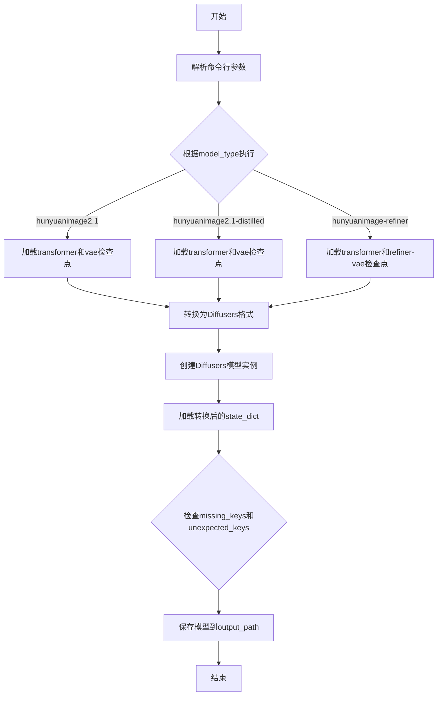
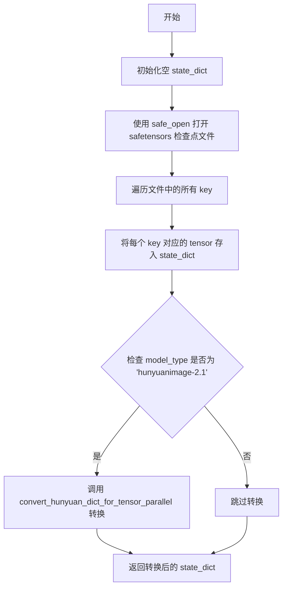
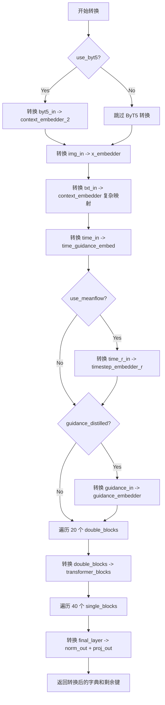
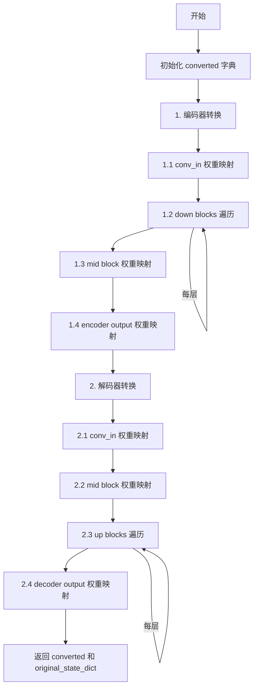
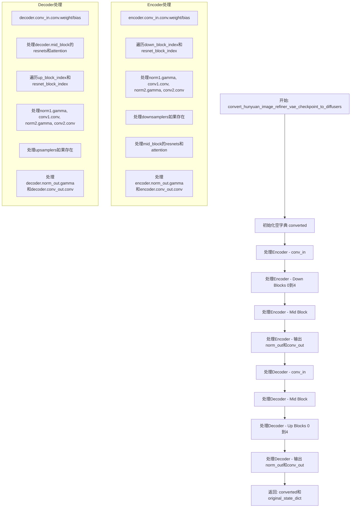
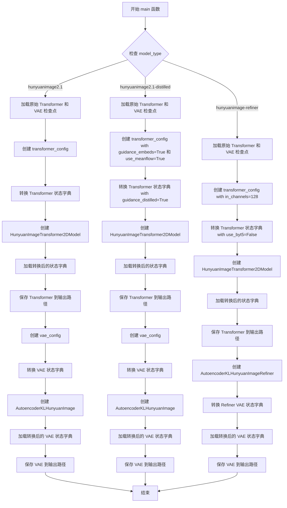

# `diffusers\scripts\convert_hunyuan_image_to_diffusers.py` 详细设计文档

该脚本用于将腾讯HunyuanImage模型的原始检查点（transformer和VAE）转换为Hugging Face Diffusers格式，支持hunyuanimage2.1、hunyuanimage2.1-distilled和hunyuanimage-refiner三种模型类型。

## 整体流程



## 类结构

```
无类定义 (脚本文件)
全局函数
├── convert_hunyuan_dict_for_tensor_parallel
├── load_original_vae_checkpoint
├── load_original_refiner_vae_checkpoint
├── load_original_transformer_checkpoint
├── convert_hunyuan_image_transformer_checkpoint_to_diffusers
├── convert_hunyuan_image_vae_checkpoint_to_diffusers
├── convert_hunyuan_image_refiner_vae_checkpoint_to_diffusers
└── main
```

## 全局变量及字段


### `logger`
    
模块级别的日志记录器，用于输出脚本执行过程中的警告和信息

类型：`logging.Logger`
    


### `args`
    
解析后的命令行参数对象，包含模型类型、模型路径、输出路径和数据类型等配置

类型：`argparse.Namespace`
    


### `dtype`
    
模型权重的数据类型，根据命令行参数设置为bf16或fp32

类型：`torch.dtype`
    


### `parser`
    
命令行参数解析器，用于定义和管理脚本的输入参数

类型：`argparse.ArgumentParser`
    


    

## 全局函数及方法


### `convert_hunyuan_dict_for_tensor_parallel`

将 Hunyuan 模型的状态字典（state_dict）转换为与 Tensor Parallel 架构兼容的格式。该函数通过拆分融合的权重矩阵（如 `attn_qkv`、`linear1`）为独立的矩阵（`attn_q`/`attn_k`/`attn_v`、`linear1_q`/`linear1_k`/`linear1_v`/`linear1_mlp`），以适配分布式模型并行推理的需求。

参数：

- `state_dict`：`Dict[str, torch.Tensor]`，原始 Hunyuan 模型的状态字典，包含模型各层的权重和偏置

返回值：`Dict[str, torch.Tensor]`，转换后的状态字典，权重已按 Tensor Parallel 格式拆分

#### 流程图

```mermaid
flowchart TD
    A[开始遍历 state_dict] --> B{当前键值对}
    
    B --> C1{键以 double_blocks 开头且包含 attn_qkv.weight}
    C1 -->|是| C2[获取 hidden_size = w.shape[1]]
    C2 --> C3[拆分为三部分: w[:hidden_size], w[hidden_size:2*hidden_size], w[-hidden_size:]]
    C3 --> C4[分别存入 new_dict: attn_q.weight, attn_k.weight, attn_v.weight]
    C4 --> Z[继续下一个键值对]
    
    B --> D1{键以 double_blocks 开头且包含 attn_qkv.bias}
    D1 -->|是| D2[获取 hidden_size = w.shape[0] // 3]
    D2 --> D3[拆分为三部分: w[:hidden_size], w[hidden_size:2*hidden_size], w[-hidden_size:]]
    D3 --> D4[分别存入 new_dict: attn_q.bias, attn_k.bias, attn_v.bias]
    D4 --> Z
    
    B --> E1{键以 single_blocks 开头且包含 linear1}
    E1 -->|是| E2[从 linear2 获取 hidden_size]
    E2 --> E3[拆分为四部分: w[:hidden_size], w[hidden_size:2*hidden_size], w[2*hidden_size:3*hidden_size], w[3*hidden_size:]]
    E3 --> E4[分别存入 new_dict: linear1_q, linear1_k, linear1_v, linear1_mlp]
    E4 --> Z
    
    B --> F1{键以 single_blocks 开头且包含 linear2}
    F1 -->|是| F2[将 linear2 重命名为 linear2.fc 并存入 new_dict]
    F2 --> Z
    
    B --> G[其他情况: 直接复制到 new_dict]
    G --> Z
    
    Z --> H{是否还有更多键值对}
    H -->|是| B
    H -->|否| I[返回 new_dict]
```

#### 带注释源码

```python
def convert_hunyuan_dict_for_tensor_parallel(state_dict):
    """
    Convert a Hunyuan model state dict to be compatible with tensor parallel architectures.

    Args:
        state_dict: Original state dict

    Returns:
        new_dict: Converted state dict
    """
    new_dict = {}
    for k, w in state_dict.items():
        # 处理 double_blocks 中的 QKV 权重 (weight)
        # 将融合的 attn_qkv.weight 拆分为 attn_q.weight, attn_k.weight, attn_v.weight
        if k.startswith("double_blocks") and "attn_qkv.weight" in k:
            hidden_size = w.shape[1]  # 获取隐藏层大小
            k1 = k.replace("attn_qkv.weight", "attn_q.weight")
            w1 = w[:hidden_size, :]  # 取前 hidden_size 行作为 Q 权重
            new_dict[k1] = w1
            
            k2 = k.replace("attn_qkv.weight", "attn_k.weight")
            w2 = w[hidden_size : 2 * hidden_size, :]  # 取中间 hidden_size 行作为 K 权重
            new_dict[k2] = w2
            
            k3 = k.replace("attn_qkv.weight", "attn_v.weight")
            w3 = w[-hidden_size:, :]  # 取最后 hidden_size 行作为 V 权重
            new_dict[k3] = w3
            
        # 处理 double_blocks 中的 QKV 偏置 (bias)
        # 将融合的 attn_qkv.bias 拆分为 attn_q.bias, attn_k.bias, attn_v.bias
        elif k.startswith("double_blocks") and "attn_qkv.bias" in k:
            hidden_size = w.shape[0] // 3  # 偏置维度是 hidden_size 的 3 倍
            k1 = k.replace("attn_qkv.bias", "attn_q.bias")
            w1 = w[:hidden_size]
            new_dict[k1] = w1
            
            k2 = k.replace("attn_qkv.bias", "attn_k.bias")
            w2 = w[hidden_size : 2 * hidden_size]
            new_dict[k2] = w2
            
            k3 = k.replace("attn_qkv.bias", "attn_v.bias")
            w3 = w[-hidden_size:]
            new_dict[k3] = w3
            
        # 处理 single_blocks 中的 linear1 权重
        # 将融合的 linear1 拆分为 linear1_q, linear1_k, linear1_v, linear1_mlp
        elif k.startswith("single_blocks") and "linear1" in k:
            # 从对应的 linear2 获取 hidden_size
            hidden_size = state_dict[k.replace("linear1", "linear2")].shape[0]
            k1 = k.replace("linear1", "linear1_q")
            w1 = w[:hidden_size]  # Q 部分
            new_dict[k1] = w1
            
            k2 = k.replace("linear1", "linear1_k")
            w2 = w[hidden_size : 2 * hidden_size]  # K 部分
            new_dict[k2] = w2
            
            k3 = k.replace("linear1", "linear1_v")
            w3 = w[2 * hidden_size : 3 * hidden_size]  # V 部分
            new_dict[k3] = w3
            
            k4 = k.replace("linear1", "linear1_mlp")
            w4 = w[3 * hidden_size :]  # MLP 部分
            new_dict[k4] = w4
            
        # 处理 single_blocks 中的 linear2 权重
        # 将 linear2 重命名为 linear2.fc
        elif k.startswith("single_blocks") and "linear2" in k:
            k1 = k.replace("linear2", "linear2.fc")
            new_dict[k1] = w
            
        # 其他键值对直接复制
        else:
            new_dict[k] = w
    return new_dict
```


### `load_original_vae_checkpoint`

该函数用于从原始的 HunyuanImage VAE checkpoint 文件中加载并处理 VAE 模型的状态字典，将其转换为适配目标格式的字典结构。

参数：

- `args`：`argparse.Namespace`，命令行参数对象，包含 `vae_checkpoint_path` 属性，指向原始 VAE checkpoint 文件的路径

返回值：`dict`，返回处理后的 VAE 状态字典，包含键名去掉 "vae." 前缀，并对 5D 权重张量进行压缩处理

#### 流程图

```mermaid
flowchart TD
    A[开始] --> B[使用 torch.load 加载 VAE checkpoint 文件]
    B --> C{state_dict 中是否存在 'state_dict' 键?}
    C -->|是| D[提取 state_dict['state_dict'] 作为新的 state_dict]
    C -->|否| E[保持原 state_dict 不变]
    D --> F[初始化空 vae_state_dict]
    E --> F
    F --> G{遍历 state_dict 中的键值对}
    G --> H{键是否以 'vae.' 开头?}
    H -->|是| I[将键的 'vae.' 前缀替换为空字符串后存入 vae_state_dict]
    H -->|否| J[跳过该键值对]
    I --> G
    J --> G
    G --> K{遍历 vae_state_dict 中的所有项}
    K --> L{键中是否包含 'weight'?}
    L -->|是| M{权重的维度是否为5且第三维为1?}
    L -->|否| N[保持值不变]
    M -->|是| O[使用 squeeze(2) 压缩第三维]
    M -->|否| P[保持值不变]
    O --> Q[更新 vae_state_dict 中的值]
    P --> Q
    N --> Q
    Q --> K
    K --> R[返回最终的 vae_state_dict]
    R --> S[结束]
```

#### 带注释源码

```python
def load_original_vae_checkpoint(args):
    """
    Load original VAE checkpoint from a PyTorch checkpoint file.
    
    该函数执行以下操作：
    1. 使用 torch.load 加载指定路径的 VAE checkpoint 文件
    2. 如果 checkpoint 包含嵌套的 'state_dict' 键，则提取该嵌套字典
    3. 过滤出所有以 'vae.' 开头的键，并去除该前缀
    4. 对 5 维权重张量（shape[2]==1）进行 squeeze 操作以压缩时间维度
    
    Args:
        args: 包含 vae_checkpoint_path 属性的命令行参数对象
        
    Returns:
        dict: 处理后的 VAE 状态字典
    """
    
    # 从 args 中获取 VAE checkpoint 文件路径并加载
    # 示例路径: "ckpts/vae/vae_2_1/pytorch_model.ckpt"
    state_dict = torch.load(args.vae_checkpoint_path)

    # 检查是否存在嵌套的 state_dict 键
    # 有些 checkpoint 文件会将模型权重存储在 state_dict 键下
    if "state_dict" in state_dict:
        state_dict = state_dict["state_dict"]
    
    # 初始化 VAE 状态字典
    vae_state_dict = {}
    
    # 遍历原始状态字典，筛选出 VAE 相关的键值对
    # 并将键名中的 "vae." 前缀去除
    for k, v in state_dict.items():
        if k.startswith("vae."):
            # 替换 "vae." 为空字符串，使键名适配目标格式
            vae_state_dict[k.replace("vae.", "")] = v

    # 遍历 VAE 状态字典，对权重进行处理
    for k, v in vae_state_dict.items():
        if "weight" in k:
            # 检查权重是否为 5 维张量且第三维为 1
            # 这种 5 维权重通常是因为在原始模型中使用了时间维度的压缩
            if len(v.shape) == 5 and v.shape[2] == 1:
                # 使用 squeeze(2) 压缩第三维（时间维度）
                vae_state_dict[k] = v.squeeze(2)
            else:
                # 对于其他情况，保持原值不变
                vae_state_dict[k] = v
        else:
            # 对于偏置项等非权重参数，保持原值不变
            vae_state_dict[k] = v
    
    # 返回处理完成的 VAE 状态字典
    return vae_state_dict
```


### `load_original_refiner_vae_checkpoint`

该函数用于加载原始 Refiner VAE 检查点文件（.pt 格式），并从状态字典中提取以 `vae.` 前缀开头的权重参数，同时去除前缀以适配 Diffusers 格式。

参数：

- `args`：`argparse.Namespace`，命令行参数对象，必须包含 `vae_checkpoint_path` 属性，指向原始 VAE 检查点文件路径（如 `"ckpts/vae/vae_refiner/pytorch_model.pt"`）

返回值：`Dict[str, torch.Tensor]`，处理后的 VAE 状态字典，键已去除 `vae.` 前缀

#### 流程图

```mermaid
flowchart TD
    A[开始] --> B[加载检查点文件<br/>torch.load args.vae_checkpoint_path]
    B --> C{state_dict 是否包含<br/>'state_dict' 键?}
    C -->|是| D[提取 state_dict['state_dict']]
    C -->|否| E[使用原始 state_dict]
    D --> F[遍历 state_dict 所有键值对]
    E --> F
    F --> G{键以 'vae.' 开头?}
    G -->|是| H[去除 'vae.' 前缀<br/>添加到 vae_state_dict]
    G -->|否| I[跳过该键]
    H --> J{是否还有更多键?}
    I --> J
    J -->|是| F
    J -->|否| K[返回 vae_state_dict]
```

#### 带注释源码

```python
def load_original_refiner_vae_checkpoint(args):
    """
    加载原始 Refiner VAE 检查点并提取 VAE 权重
    
    Args:
        args: 命令行参数对象，需包含 vae_checkpoint_path 属性
    
    Returns:
        vae_state_dict: 去除 'vae.' 前缀的 VAE 状态字典
    """
    # "ckpts/vae/vae_refiner/pytorch_model.pt"
    # 使用 torch.load 加载原始 VAE 检查点文件
    state_dict = torch.load(args.vae_checkpoint_path)

    # 检查点文件可能包含嵌套的 'state_dict' 键（如 PyTorch checkpoint 格式）
    if "state_dict" in state_dict:
        state_dict = state_dict["state_dict"]
    
    # 初始化 VAE 状态字典
    vae_state_dict = {}
    
    # 遍历所有键值对，筛选以 'vae.' 开头的权重
    for k, v in state_dict.items():
        if k.startswith("vae."):
            # 去除 'vae.' 前缀以适配 Diffusers 格式
            vae_state_dict[k.replace("vae.", "")] = v
    
    return vae_state_dict
```


### `load_original_transformer_checkpoint`

该函数用于从 safetensors 文件中加载原始 Hunyuan Image Transformer 模型检查点，并根据模型类型在必要时进行张量并行架构兼容性转换。

参数：

- `args`：`argparse.Namespace`，命令行参数对象，包含 `transformer_checkpoint_path`（检查点文件路径）和 `model_type`（模型类型）

返回值：`Dict[str, torch.Tensor]`，转换后的模型状态字典，键为参数名称，值为对应的张量

#### 流程图



#### 带注释源码

```python
def load_original_transformer_checkpoint(args):
    """
    Load original Hunyuan Image transformer checkpoint from safetensors file.
    
    Supports hunyuanimage2.1, hunyuanimage2.1-distilled, and hunyuanimage-refiner models.
    For hunyuanimage-2.1 model, performs tensor parallel compatibility conversion.
    
    Args:
        args: Command line arguments containing:
            - transformer_checkpoint_path: Path to the safetensors checkpoint file
            - model_type: Type of the model ('hunyuanimage-2.1', etc.)
    
    Returns:
        state_dict: Dictionary containing model weights with parameter names as keys
    """
    # 检查点文件路径示例:
    # ckpts/dit/hunyuanimage-refiner.safetensors
    # ckpts/dit/hunyuanimage2.1.safetensors
    
    state_dict = {}
    # 使用 safe_open 从 safetensors 文件加载张量
    # framework="pt" 表示使用 PyTorch 格式
    # device="cpu" 表示将张量加载到 CPU 内存
    with safe_open(args.transformer_checkpoint_path, framework="pt", device="cpu") as f:
        for key in f.keys():
            state_dict[key] = f.get_tensor(key)
    
    # 针对 hunyuanimage-2.1 模型进行张量并行转换
    # 该模型使用了融合的 QKV 权重，需要拆分为独立的 q, k, v 权重
    if args.model_type == "hunyuanimage-2.1":
        state_dict = convert_hunyuan_dict_for_tensor_parallel(state_dict)
    
    return state_dict
```


### `convert_hunyuan_image_transformer_checkpoint_to_diffusers`

该函数是腾讯 Hunyuan Image 2.1 模型权重转换的核心函数，负责将原始训练框架下的检查点状态字典（state_dict）转换为 Hugging Face Diffusers 库所要求的标准格式，以便使用 Diffusers 框架进行推理和部署。函数通过逐层映射和重命名原始键值，并处理不同的模型变体（如 ByT5 编码器、引导蒸馏等）。

参数：

- `original_state_dict`：`Dict[str, torch.Tensor]`，原始模型检查点的状态字典，包含原始模型的所有权重张量
- `use_byt5`：`bool`，是否包含 ByT5 文本编码器组件，默认为 True
- `guidance_distilled`：`bool`，是否为引导蒸馏版本（包含额外的 guidance_embedder），默认为 False
- `use_meanflow`：`bool`，是否使用 MeanFlow 时间嵌入，默认为 False

返回值：`Tuple[Dict[str, torch.Tensor], Dict[str, torch.Tensor]]`，返回一个元组，包含：
- 转换后的 Diffusers 格式状态字典
- 原始状态字典中剩余未被转换的键（通常应为空）

#### 流程图



#### 带注释源码

```python
def convert_hunyuan_image_transformer_checkpoint_to_diffusers(
    original_state_dict, use_byt5=True, guidance_distilled=False, use_meanflow=False
):
    """
    将 Hunyuan Image 原始检查点状态字典转换为 Diffusers 格式。
    
    此函数处理极其复杂的模型结构映射，包括：
    - ByT5 文本编码器
    - 图像和文本 embedding 层
    - 时间步和引导嵌入
    - 20 个双块（图像+文本注意力）
    - 40 个单块（图像注意力）
    - 最终输出层
    
    Args:
        original_state_dict: 原始模型状态字典
        use_byt5: 是否包含 ByT5 编码器
        guidance_distilled: 是否为蒸馏版本（包含 guidance embedder）
        use_meanflow: 是否使用 MeanFlow（包含时间r嵌入）
    
    Returns:
        转换后的状态字典，原始剩余键
    """
    converted_state_dict = {}

    # 1. byt5_in -> context_embedder_2
    # ByT5 文本编码器的层归一化和全连接层映射
    if use_byt5:
        converted_state_dict["context_embedder_2.norm.weight"] = original_state_dict.pop("byt5_in.layernorm.weight")
        converted_state_dict["context_embedder_2.norm.bias"] = original_state_dict.pop("byt5_in.layernorm.bias")
        converted_state_dict["context_embedder_2.linear_1.weight"] = original_state_dict.pop("byt5_in.fc1.weight")
        converted_state_dict["context_embedder_2.linear_1.bias"] = original_state_dict.pop("byt5_in.fc1.bias")
        converted_state_dict["context_embedder_2.linear_2.weight"] = original_state_dict.pop("byt5_in.fc2.weight")
        converted_state_dict["context_embedder_2.linear_2.bias"] = original_state_dict.pop("byt5_in.fc2.bias")
        converted_state_dict["context_embedder_2.linear_3.weight"] = original_state_dict.pop("byt5_in.fc3.weight")
        converted_state_dict["context_embedder_2.linear_3.bias"] = original_state_dict.pop("byt5_in.fc3.bias")

    # 2. img_in -> x_embedder
    # 图像输入投影层映射
    converted_state_dict["x_embedder.proj.weight"] = original_state_dict.pop("img_in.proj.weight")
    converted_state_dict["x_embedder.proj.bias"] = original_state_dict.pop("img_in.proj.bias")

    # 3. txt_in -> context_embedder (复杂的多部分映射)
    # 文本输入嵌入器
    converted_state_dict["context_embedder.proj_in.weight"] = original_state_dict.pop("txt_in.input_embedder.weight")
    converted_state_dict["context_embedder.proj_in.bias"] = original_state_dict.pop("txt_in.input_embedder.bias")

    # 文本时间步嵌入器 (MLP)
    converted_state_dict["context_embedder.time_text_embed.timestep_embedder.linear_1.weight"] = (
        original_state_dict.pop("txt_in.t_embedder.mlp.0.weight")
    )
    converted_state_dict["context_embedder.time_text_embed.timestep_embedder.linear_1.bias"] = original_state_dict.pop(
        "txt_in.t_embedder.mlp.0.bias"
    )
    converted_state_dict["context_embedder.time_text_embed.timestep_embedder.linear_2.weight"] = (
        original_state_dict.pop("txt_in.t_embedder.mlp.2.weight")
    )
    converted_state_dict["context_embedder.time_text_embed.timestep_embedder.linear_2.bias"] = original_state_dict.pop(
        "txt_in.t_embedder.mlp.2.bias"
    )

    # 文本内容嵌入器
    converted_state_dict["context_embedder.time_text_embed.text_embedder.linear_1.weight"] = original_state_dict.pop(
        "txt_in.c_embedder.linear_1.weight"
    )
    converted_state_dict["context_embedder.time_text_embed.text_embedder.linear_1.bias"] = original_state_dict.pop(
        "txt_in.c_embedder.linear_1.bias"
    )
    converted_state_dict["context_embedder.time_text_embed.text_embedder.linear_2.weight"] = original_state_dict.pop(
        "txt_in.c_embedder.linear_2.weight"
    )
    converted_state_dict["context_embedder.time_text_embed.text_embedder.linear_2.bias"] = original_state_dict.pop(
        "txt_in.c_embedder.linear_2.bias"
    )

    # 文本 Token Refiner (2 个 Refiner 块)
    # 需要拆分 QKV 权重和偏置
    for i in range(2):  # 2 refiner blocks
        block_prefix = f"context_embedder.token_refiner.refiner_blocks.{i}."
        # norm1
        converted_state_dict[f"{block_prefix}norm1.weight"] = original_state_dict.pop(
            f"txt_in.individual_token_refiner.blocks.{i}.norm1.weight"
        )
        converted_state_dict[f"{block_prefix}norm1.bias"] = original_state_dict.pop(
            f"txt_in.individual_token_refiner.blocks.{i}.norm1.bias"
        )
        # norm2
        converted_state_dict[f"{block_prefix}norm2.weight"] = original_state_dict.pop(
            f"txt_in.individual_token_refiner.blocks.{i}.norm2.weight"
        )
        converted_state_dict[f"{block_prefix}norm2.bias"] = original_state_dict.pop(
            f"txt_in.individual_token_refiner.blocks.{i}.norm2.bias"
        )

        # Split QKV: 将融合的 QKV 权重拆分为独立的 Q、K、V
        qkv_weight = original_state_dict.pop(f"txt_in.individual_token_refiner.blocks.{i}.self_attn_qkv.weight")
        qkv_bias = original_state_dict.pop(f"txt_in.individual_token_refiner.blocks.{i}.self_attn_qkv.bias")
        q_weight, k_weight, v_weight = torch.chunk(qkv_weight, 3, dim=0)
        q_bias, k_bias, v_bias = torch.chunk(qkv_bias, 3, dim=0)

        converted_state_dict[f"{block_prefix}attn.to_q.weight"] = q_weight
        converted_state_dict[f"{block_prefix}attn.to_q.bias"] = q_bias
        converted_state_dict[f"{block_prefix}attn.to_k.weight"] = k_weight
        converted_state_dict[f"{block_prefix}attn.to_k.bias"] = k_bias
        converted_state_dict[f"{block_prefix}attn.to_v.weight"] = v_weight
        converted_state_dict[f"{block_prefix}attn.to_v.bias"] = v_bias

        # attention projection
        converted_state_dict[f"{block_prefix}attn.to_out.0.weight"] = original_state_dict.pop(
            f"txt_in.individual_token_refiner.blocks.{i}.self_attn_proj.weight"
        )
        converted_state_dict[f"{block_prefix}attn.to_out.0.bias"] = original_state_dict.pop(
            f"txt_in.individual_token_refiner.blocks.{i}.self_attn_proj.bias"
        )

        # MLP
        converted_state_dict[f"{block_prefix}ff.net.0.proj.weight"] = original_state_dict.pop(
            f"txt_in.individual_token_refiner.blocks.{i}.mlp.fc1.weight"
        )
        converted_state_dict[f"{block_prefix}ff.net.0.proj.bias"] = original_state_dict.pop(
            f"txt_in.individual_token_refiner.blocks.{i}.mlp.fc1.bias"
        )
        converted_state_dict[f"{block_prefix}ff.net.2.weight"] = original_state_dict.pop(
            f"txt_in.individual_token_refiner.blocks.{i}.mlp.fc2.weight"
        )
        converted_state_dict[f"{block_prefix}ff.net.2.bias"] = original_state_dict.pop(
            f"txt_in.individual_token_refiner.blocks.{i}.mlp.fc2.bias"
        )

        # norm_out (adaLN 调制)
        converted_state_dict[f"{block_prefix}norm_out.linear.weight"] = original_state_dict.pop(
            f"txt_in.individual_token_refiner.blocks.{i}.adaLN_modulation.1.weight"
        )
        converted_state_dict[f"{block_prefix}norm_out.linear.bias"] = original_state_dict.pop(
            f"txt_in.individual_token_refiner.blocks.{i}.adaLN_modulation.1.bias"
        )

    # 4. time_in -> time_text_embed.timestep_embedder
    # 时间步嵌入器
    converted_state_dict["time_guidance_embed.timestep_embedder.linear_1.weight"] = original_state_dict.pop(
        "time_in.mlp.0.weight"
    )
    converted_state_dict["time_guidance_embed.timestep_embedder.linear_1.bias"] = original_state_dict.pop(
        "time_in.mlp.0.bias"
    )
    converted_state_dict["time_guidance_embed.timestep_embedder.linear_2.weight"] = original_state_dict.pop(
        "time_in.mlp.2.weight"
    )
    converted_state_dict["time_guidance_embed.timestep_embedder.linear_2.bias"] = original_state_dict.pop(
        "time_in.mlp.2.bias"
    )

    # time_r_in -> time_guidance_embed.timestep_r_embedder
    # MeanFlow 使用的时间步 r 嵌入
    if use_meanflow:
        converted_state_dict["time_guidance_embed.timestep_embedder_r.linear_1.weight"] = original_state_dict.pop(
            "time_r_in.mlp.0.weight"
        )
        converted_state_dict["time_guidance_embed.timestep_embedder_r.linear_1.bias"] = original_state_dict.pop(
            "time_r_in.mlp.0.bias"
        )
        converted_state_dict["time_guidance_embed.timestep_embedder_r.linear_2.weight"] = original_state_dict.pop(
            "time_r_in.mlp.2.weight"
        )
        converted_state_dict["time_guidance_embed.timestep_embedder_r.linear_2.bias"] = original_state_dict.pop(
            "time_r_in.mlp.2.bias"
        )

    # guidance_in -> time_guidance_embed.guidance_embedder
    # 蒸馏版本使用的引导嵌入器
    if guidance_distilled:
        converted_state_dict["time_guidance_embed.guidance_embedder.linear_1.weight"] = original_state_dict.pop(
            "guidance_in.mlp.0.weight"
        )
        converted_state_dict["time_guidance_embed.guidance_embedder.linear_1.bias"] = original_state_dict.pop(
            "guidance_in.mlp.0.bias"
        )
        converted_state_dict["time_guidance_embed.guidance_embedder.linear_2.weight"] = original_state_dict.pop(
            "guidance_in.mlp.2.weight"
        )
        converted_state_dict["time_guidance_embed.guidance_embedder.linear_2.bias"] = original_state_dict.pop(
            "guidance_in.mlp.2.bias"
        )

    # 5. double_blocks -> transformer_blocks
    # 双块：同时包含图像和文本注意力的 Transformer 块
    for i in range(20):  # 20 double blocks
        block_prefix = f"transformer_blocks.{i}."

        # norm1 (img_mod) - 图像自适应层归一化
        converted_state_dict[f"{block_prefix}norm1.linear.weight"] = original_state_dict.pop(
            f"double_blocks.{i}.img_mod.linear.weight"
        )
        converted_state_dict[f"{block_prefix}norm1.linear.bias"] = original_state_dict.pop(
            f"double_blocks.{i}.img_mod.linear.bias"
        )

        # norm1_context (txt_mod) - 文本自适应层归一化
        converted_state_dict[f"{block_prefix}norm1_context.linear.weight"] = original_state_dict.pop(
            f"double_blocks.{i}.txt_mod.linear.weight"
        )
        converted_state_dict[f"{block_prefix}norm1_context.linear.bias"] = original_state_dict.pop(
            f"double_blocks.{i}.txt_mod.linear.bias"
        )

        # img attention - 图像注意力 (已经是分离的 Q、K、V)
        converted_state_dict[f"{block_prefix}attn.to_q.weight"] = original_state_dict.pop(
            f"double_blocks.{i}.img_attn_q.weight"
        )
        converted_state_dict[f"{block_prefix}attn.to_q.bias"] = original_state_dict.pop(
            f"double_blocks.{i}.img_attn_q.bias"
        )
        converted_state_dict[f"{block_prefix}attn.to_k.weight"] = original_state_dict.pop(
            f"double_blocks.{i}.img_attn_k.weight"
        )
        converted_state_dict[f"{block_prefix}attn.to_k.bias"] = original_state_dict.pop(
            f"double_blocks.{i}.img_attn_k.bias"
        )
        converted_state_dict[f"{block_prefix}attn.to_v.weight"] = original_state_dict.pop(
            f"double_blocks.{i}.img_attn_v.weight"
        )
        converted_state_dict[f"{block_prefix}attn.to_v.bias"] = original_state_dict.pop(
            f"double_blocks.{i}.img_attn_v.bias"
        )

        # img attention norms - 图像注意力 Q/K 归一化
        converted_state_dict[f"{block_prefix}attn.norm_q.weight"] = original_state_dict.pop(
            f"double_blocks.{i}.img_attn_q_norm.weight"
        )
        converted_state_dict[f"{block_prefix}attn.norm_k.weight"] = original_state_dict.pop(
            f"double_blocks.{i}.img_attn_k_norm.weight"
        )

        # img attention projection
        converted_state_dict[f"{block_prefix}attn.to_out.0.weight"] = original_state_dict.pop(
            f"double_blocks.{i}.img_attn_proj.weight"
        )
        converted_state_dict[f"{block_prefix}attn.to_out.0.bias"] = original_state_dict.pop(
            f"double_blocks.{i}.img_attn_proj.bias"
        )

        # img MLP
        converted_state_dict[f"{block_prefix}ff.net.0.proj.weight"] = original_state_dict.pop(
            f"double_blocks.{i}.img_mlp.fc1.weight"
        )
        converted_state_dict[f"{block_prefix}ff.net.0.proj.bias"] = original_state_dict.pop(
            f"double_blocks.{i}.img_mlp.fc1.bias"
        )
        converted_state_dict[f"{block_prefix}ff.net.2.weight"] = original_state_dict.pop(
            f"double_blocks.{i}.img_mlp.fc2.weight"
        )
        converted_state_dict[f"{block_prefix}ff.net.2.bias"] = original_state_dict.pop(
            f"double_blocks.{i}.img_mlp.fc2.bias"
        )

        # txt attention (additional projections) - 文本注意力（可添加的 Q、K、V）
        converted_state_dict[f"{block_prefix}attn.add_q_proj.weight"] = original_state_dict.pop(
            f"double_blocks.{i}.txt_attn_q.weight"
        )
        converted_state_dict[f"{block_prefix}attn.add_q_proj.bias"] = original_state_dict.pop(
            f"double_blocks.{i}.txt_attn_q.bias"
        )
        converted_state_dict[f"{block_prefix}attn.add_k_proj.weight"] = original_state_dict.pop(
            f"double_blocks.{i}.txt_attn_k.weight"
        )
        converted_state_dict[f"{block_prefix}attn.add_k_proj.bias"] = original_state_dict.pop(
            f"double_blocks.{i}.txt_attn_k.bias"
        )
        converted_state_dict[f"{block_prefix}attn.add_v_proj.weight"] = original_state_dict.pop(
            f"double_blocks.{i}.txt_attn_v.weight"
        )
        converted_state_dict[f"{block_prefix}attn.add_v_proj.bias"] = original_state_dict.pop(
            f"double_blocks.{i}.txt_attn_v.bias"
        )

        # txt attention norms
        converted_state_dict[f"{block_prefix}attn.norm_added_q.weight"] = original_state_dict.pop(
            f"double_blocks.{i}.txt_attn_q_norm.weight"
        )
        converted_state_dict[f"{block_prefix}attn.norm_added_k.weight"] = original_state_dict.pop(
            f"double_blocks.{i}.txt_attn_k_norm.weight"
        )

        # txt attention projection
        converted_state_dict[f"{block_prefix}attn.to_add_out.weight"] = original_state_dict.pop(
            f"double_blocks.{i}.txt_attn_proj.weight"
        )
        converted_state_dict[f"{block_prefix}attn.to_add_out.bias"] = original_state_dict.pop(
            f"double_blocks.{i}.txt_attn_proj.bias"
        )

        # txt MLP (ff_context)
        converted_state_dict[f"{block_prefix}ff_context.net.0.proj.weight"] = original_state_dict.pop(
            f"double_blocks.{i}.txt_mlp.fc1.weight"
        )
        converted_state_dict[f"{block_prefix}ff_context.net.0.proj.bias"] = original_state_dict.pop(
            f"double_blocks.{i}.txt_mlp.fc1.bias"
        )
        converted_state_dict[f"{block_prefix}ff_context.net.2.weight"] = original_state_dict.pop(
            f"double_blocks.{i}.txt_mlp.fc2.weight"
        )
        converted_state_dict[f"{block_prefix}ff_context.net.2.bias"] = original_state_dict.pop(
            f"double_blocks.{i}.txt_mlp.fc2.bias"
        )

    # 6. single_blocks -> single_transformer_blocks
    # 单块：仅包含图像注意力的 Transformer 块
    for i in range(40):  # 40 single blocks
        block_prefix = f"single_transformer_blocks.{i}."

        # norm (modulation)
        converted_state_dict[f"{block_prefix}norm.linear.weight"] = original_state_dict.pop(
            f"single_blocks.{i}.modulation.linear.weight"
        )
        converted_state_dict[f"{block_prefix}norm.linear.bias"] = original_state_dict.pop(
            f"single_blocks.{i}.modulation.linear.bias"
        )

        # attention Q, K, V (原始是 fused linear1_q/k/v)
        converted_state_dict[f"{block_prefix}attn.to_q.weight"] = original_state_dict.pop(
            f"single_blocks.{i}.linear1_q.weight"
        )
        converted_state_dict[f"{block_prefix}attn.to_q.bias"] = original_state_dict.pop(
            f"single_blocks.{i}.linear1_q.bias"
        )
        converted_state_dict[f"{block_prefix}attn.to_k.weight"] = original_state_dict.pop(
            f"single_blocks.{i}.linear1_k.weight"
        )
        converted_state_dict[f"{block_prefix}attn.to_k.bias"] = original_state_dict.pop(
            f"single_blocks.{i}.linear1_k.bias"
        )
        converted_state_dict[f"{block_prefix}attn.to_v.weight"] = original_state_dict.pop(
            f"single_blocks.{i}.linear1_v.weight"
        )
        converted_state_dict[f"{block_prefix}attn.to_v.bias"] = original_state_dict.pop(
            f"single_blocks.{i}.linear1_v.bias"
        )

        # attention norms
        converted_state_dict[f"{block_prefix}attn.norm_q.weight"] = original_state_dict.pop(
            f"single_blocks.{i}.q_norm.weight"
        )
        converted_state_dict[f"{block_prefix}attn.norm_k.weight"] = original_state_dict.pop(
            f"single_blocks.{i}.k_norm.weight"
        )

        # MLP projection (从 fused linear1_mlp 提取)
        converted_state_dict[f"{block_prefix}proj_mlp.weight"] = original_state_dict.pop(
            f"single_blocks.{i}.linear1_mlp.weight"
        )
        converted_state_dict[f"{block_prefix}proj_mlp.bias"] = original_state_dict.pop(
            f"single_blocks.{i}.linear1_mlp.bias"
        )

        # output projection
        converted_state_dict[f"{block_prefix}proj_out.weight"] = original_state_dict.pop(
            f"single_blocks.{i}.linear2.fc.weight"
        )
        converted_state_dict[f"{block_prefix}proj_out.bias"] = original_state_dict.pop(
            f"single_blocks.{i}.linear2.fc.bias"
        )

    # 7. final_layer -> norm_out + proj_out
    # 最终输出层：需要拆分 shift 和 scale
    converted_state_dict["proj_out.weight"] = original_state_dict.pop("final_layer.linear.weight")
    converted_state_dict["proj_out.bias"] = original_state_dict.pop("final_layer.linear.bias")
    # adaLN 调制包含 shift 和 scale，需要沿 dim=0 拼接
    shift_w, scale_w = original_state_dict.pop("final_layer.adaLN_modulation.1.weight").chunk(2, dim=0)
    shift_b, scale_b = original_state_dict.pop("final_layer.adaLN_modulation.1.bias").chunk(2, dim=0)
    converted_state_dict["norm_out.linear.weight"] = torch.cat([scale_w, shift_w], dim=0)
    converted_state_dict["norm_out.linear.bias"] = torch.cat([scale_b, shift_b], dim=0)

    return converted_state_dict, original_state_dict
```


### `convert_hunyuan_image_vae_checkpoint_to_diffusers`

将原始 Hunyuan Image VAE 模型的状态字典转换为 Diffusers 格式的状态字典，处理编码器和解码器的权重映射。

参数：

- `original_state_dict`：`dict`，原始 Hunyuan Image VAE 模型的状态字典
- `block_out_channels`：`list`，默认为 `[128, 256, 512, 512, 1024, 1024]`，VAE 块输出通道数列表
- `layers_per_block`：`int`，默认为 `2`，每个块包含的层数

返回值：`tuple`，包含两个元素：
- `converted`：`dict`，转换后的 Diffusers 格式状态字典
- `original_state_dict`：`dict`，处理后剩余的原始状态字典（未转换的键）

#### 流程图



#### 带注释源码

```python
def convert_hunyuan_image_vae_checkpoint_to_diffusers(
    original_state_dict, block_out_channels=[128, 256, 512, 512, 1024, 1024], layers_per_block=2
):
    """Convert original VAE state dict to Diffusers format."""
    converted = {}

    # 1. 编码器部分转换
    # 1.1 输入卷积层
    converted["encoder.conv_in.weight"] = original_state_dict.pop("encoder.conv_in.weight")
    converted["encoder.conv_in.bias"] = original_state_dict.pop("encoder.conv_in.bias")

    # 1.2 下采样块转换
    diffusers_block_idx = 0

    for block_index in range(len(block_out_channels)):
        for resnet_block_index in range(layers_per_block):
            orig_prefix = f"encoder.down.{block_index}.block.{resnet_block_index}"
            diff_prefix = f"encoder.down_blocks.{diffusers_block_idx}"

            # ResNet 块：norm1, conv1, norm2, conv2
            converted[f"{diff_prefix}.norm1.weight"] = original_state_dict.pop(f"{orig_prefix}.norm1.weight")
            converted[f"{diff_prefix}.norm1.bias"] = original_state_dict.pop(f"{orig_prefix}.norm1.bias")
            converted[f"{diff_prefix}.conv1.weight"] = original_state_dict.pop(f"{orig_prefix}.conv1.weight")
            converted[f"{diff_prefix}.conv1.bias"] = original_state_dict.pop(f"{orig_prefix}.conv1.bias")
            converted[f"{diff_prefix}.norm2.weight"] = original_state_dict.pop(f"{orig_prefix}.norm2.weight")
            converted[f"{diff_prefix}.norm2.bias"] = original_state_dict.pop(f"{orig_prefix}.norm2.bias")
            converted[f"{diff_prefix}.conv2.weight"] = original_state_dict.pop(f"{orig_prefix}.conv2.weight")
            converted[f"{diff_prefix}.conv2.bias"] = original_state_dict.pop(f"{orig_prefix}.conv2.bias")

            diffusers_block_idx += 1

        # 下采样层转换
        if f"encoder.down.{block_index}.downsample.conv.weight" in original_state_dict:
            converted[f"encoder.down_blocks.{diffusers_block_idx}.conv.weight"] = original_state_dict.pop(
                f"encoder.down.{block_index}.downsample.conv.weight"
            )
            converted[f"encoder.down_blocks.{diffusers_block_idx}.conv.bias"] = original_state_dict.pop(
                f"encoder.down.{block_index}.downsample.conv.bias"
            )
            diffusers_block_idx += 1

    # 1.3 中间块转换（两个 ResNet + Attention）
    converted["encoder.mid_block.resnets.0.norm1.weight"] = original_state_dict.pop("encoder.mid.block_1.norm1.weight")
    converted["encoder.mid_block.resnets.0.norm1.bias"] = original_state_dict.pop("encoder.mid.block_1.norm1.bias")
    converted["encoder.mid_block.resnets.0.conv1.weight"] = original_state_dict.pop("encoder.mid.block_1.conv1.weight")
    converted["encoder.mid_block.resnets.0.conv1.bias"] = original_state_dict.pop("encoder.mid.block_1.conv1.bias")
    converted["encoder.mid_block.resnets.0.norm2.weight"] = original_state_dict.pop("encoder.mid.block_1.norm2.weight")
    converted["encoder.mid_block.resnets.0.norm2.bias"] = original_state_dict.pop("encoder.mid.block_1.norm2.bias")
    converted["encoder.mid_block.resnets.0.conv2.weight"] = original_state_dict.pop("encoder.mid.block_1.conv2.weight")
    converted["encoder.mid_block.resnets.0.conv2.bias"] = original_state_dict.pop("encoder.mid.block_1.conv2.bias")

    converted["encoder.mid_block.resnets.1.norm1.weight"] = original_state_dict.pop("encoder.mid.block_2.norm1.weight")
    converted["encoder.mid_block.resnets.1.norm1.bias"] = original_state_dict.pop("encoder.mid.block_2.norm1.bias")
    converted["encoder.mid_block.resnets.1.conv1.weight"] = original_state_dict.pop("encoder.mid.block_2.conv1.weight")
    converted["encoder.mid_block.resnets.1.conv1.bias"] = original_state_dict.pop("encoder.mid.block_2.conv1.bias")
    converted["encoder.mid_block.resnets.1.norm2.weight"] = original_state_dict.pop("encoder.mid.block_2.norm2.weight")
    converted["encoder.mid_block.resnets.1.norm2.bias"] = original_state_dict.pop("encoder.mid.block_2.norm2.bias")
    converted["encoder.mid_block.resnets.1.conv2.weight"] = original_state_dict.pop("encoder.mid.block_2.conv2.weight")
    converted["encoder.mid_block.resnets.1.conv2.bias"] = original_state_dict.pop("encoder.mid.block_2.conv2.bias")

    # Attention 层转换
    converted["encoder.mid_block.attentions.0.norm.weight"] = original_state_dict.pop("encoder.mid.attn_1.norm.weight")
    converted["encoder.mid_block.attentions.0.norm.bias"] = original_state_dict.pop("encoder.mid.attn_1.norm.bias")
    converted["encoder.mid_block.attentions.0.to_q.weight"] = original_state_dict.pop("encoder.mid.attn_1.q.weight")
    converted["encoder.mid_block.attentions.0.to_q.bias"] = original_state_dict.pop("encoder.mid.attn_1.q.bias")
    converted["encoder.mid_block.attentions.0.to_k.weight"] = original_state_dict.pop("encoder.mid.attn_1.k.weight")
    converted["encoder.mid_block.attentions.0.to_k.bias"] = original_state_dict.pop("encoder.mid.attn_1.k.bias")
    converted["encoder.mid_block.attentions.0.to_v.weight"] = original_state_dict.pop("encoder.mid.attn_1.v.weight")
    converted["encoder.mid_block.attentions.0.to_v.bias"] = original_state_dict.pop("encoder.mid.attn_1.v.bias")
    converted["encoder.mid_block.attentions.0.proj.weight"] = original_state_dict.pop(
        "encoder.mid.attn_1.proj_out.weight"
    )
    converted["encoder.mid_block.attentions.0.proj.bias"] = original_state_dict.pop("encoder.mid.attn_1.proj_out.bias")

    # 1.4 编码器输出层
    converted["encoder.norm_out.weight"] = original_state_dict.pop("encoder.norm_out.weight")
    converted["encoder.norm_out.bias"] = original_state_dict.pop("encoder.norm_out.bias")
    converted["encoder.conv_out.weight"] = original_state_dict.pop("encoder.conv_out.weight")
    converted["encoder.conv_out.bias"] = original_state_dict.pop("encoder.conv_out.bias")

    # 2. 解码器部分转换
    # 2.1 输入卷积层
    converted["decoder.conv_in.weight"] = original_state_dict.pop("decoder.conv_in.weight")
    converted["decoder.conv_in.bias"] = original_state_dict.pop("decoder.conv_in.bias")

    # 2.2 中间块转换
    converted["decoder.mid_block.resnets.0.norm1.weight"] = original_state_dict.pop("decoder.mid.block_1.norm1.weight")
    converted["decoder.mid_block.resnets.0.norm1.bias"] = original_state_dict.pop("decoder.mid.block_1.norm1.bias")
    converted["decoder.mid_block.resnets.0.conv1.weight"] = original_state_dict.pop("decoder.mid.block_1.conv1.weight")
    converted["decoder.mid_block.resnets.0.conv1.bias"] = original_state_dict.pop("decoder.mid.block_1.conv1.bias")
    converted["decoder.mid_block.resnets.0.norm2.weight"] = original_state_dict.pop("decoder.mid.block_1.norm2.weight")
    converted["decoder.mid_block.resnets.0.norm2.bias"] = original_state_dict.pop("decoder.mid.block_1.norm2.bias")
    converted["decoder.mid_block.resnets.0.conv2.weight"] = original_state_dict.pop("decoder.mid.block_1.conv2.weight")
    converted["decoder.mid_block.resnets.0.conv2.bias"] = original_state_dict.pop("decoder.mid.block_1.conv2.bias")

    converted["decoder.mid_block.resnets.1.norm1.weight"] = original_state_dict.pop("decoder.mid.block_2.norm1.weight")
    converted["decoder.mid_block.resnets.1.norm1.bias"] = original_state_dict.pop("decoder.mid.block_2.norm1.bias")
    converted["decoder.mid_block.resnets.1.conv1.weight"] = original_state_dict.pop("decoder.mid.block_2.conv1.weight")
    converted["decoder.mid_block.resnets.1.conv1.bias"] = original_state_dict.pop("decoder.mid.block_2.conv1.bias")
    converted["decoder.mid_block.resnets.1.norm2.weight"] = original_state_dict.pop("decoder.mid.block_2.norm2.weight")
    converted["decoder.mid_block.resnets.1.norm2.bias"] = original_state_dict.pop("decoder.mid.block_2.norm2.bias")
    converted["decoder.mid_block.resnets.1.conv2.weight"] = original_state_dict.pop("decoder.mid.block_2.conv2.weight")
    converted["decoder.mid_block.resnets.1.conv2.bias"] = original_state_dict.pop("decoder.mid.block_2.conv2.bias")

    # Attention 层
    converted["decoder.mid_block.attentions.0.norm.weight"] = original_state_dict.pop("decoder.mid.attn_1.norm.weight")
    converted["decoder.mid_block.attentions.0.norm.bias"] = original_state_dict.pop("decoder.mid.attn_1.norm.bias")
    converted["decoder.mid_block.attentions.0.to_q.weight"] = original_state_dict.pop("decoder.mid.attn_1.q.weight")
    converted["decoder.mid_block.attentions.0.to_q.bias"] = original_state_dict.pop("decoder.mid.attn_1.q.bias")
    converted["decoder.mid_block.attentions.0.to_k.weight"] = original_state_dict.pop("decoder.mid.attn_1.k.weight")
    converted["decoder.mid_block.attentions.0.to_k.bias"] = original_state_dict.pop("decoder.mid.attn_1.k.bias")
    converted["decoder.mid_block.attentions.0.to_v.weight"] = original_state_dict.pop("decoder.mid.attn_1.v.weight")
    converted["decoder.mid_block.attentions.0.to_v.bias"] = original_state_dict.pop("decoder.mid.attn_1.v.bias")
    converted["decoder.mid_block.attentions.0.proj.weight"] = original_state_dict.pop(
        "decoder.mid.attn_1.proj_out.weight"
    )
    converted["decoder.mid_block.attentions.0.proj.bias"] = original_state_dict.pop(
        "decoder.mid.attn_1.proj_out.bias"
    )

    # 2.3 上采样块转换
    diffusers_block_idx = 0
    for up_block_index in range(len(block_out_channels)):
        # ResNet 块（解码器每层有 layers_per_block + 1 个块）
        for resnet_block_index in range(layers_per_block + 1):
            orig_prefix = f"decoder.up.{up_block_index}.block.{resnet_block_index}"
            diff_prefix = f"decoder.up_blocks.{diffusers_block_idx}"

            converted[f"{diff_prefix}.norm1.weight"] = original_state_dict.pop(f"{orig_prefix}.norm1.weight")
            converted[f"{diff_prefix}.norm1.bias"] = original_state_dict.pop(f"{orig_prefix}.norm1.bias")
            converted[f"{diff_prefix}.conv1.weight"] = original_state_dict.pop(f"{orig_prefix}.conv1.weight")
            converted[f"{diff_prefix}.conv1.bias"] = original_state_dict.pop(f"{orig_prefix}.conv1.bias")
            converted[f"{diff_prefix}.norm2.weight"] = original_state_dict.pop(f"{orig_prefix}.norm2.weight")
            converted[f"{diff_prefix}.norm2.bias"] = original_state_dict.pop(f"{orig_prefix}.norm2.bias")
            converted[f"{diff_prefix}.conv2.weight"] = original_state_dict.pop(f"{orig_prefix}.conv2.weight")
            converted[f"{diff_prefix}.conv2.bias"] = original_state_dict.pop(f"{orig_prefix}.conv2.bias")

            diffusers_block_idx += 1

        # 上采样层转换
        if f"decoder.up.{up_block_index}.upsample.conv.weight" in original_state_dict:
            converted[f"decoder.up_blocks.{diffusers_block_idx}.conv.weight"] = original_state_dict.pop(
                f"decoder.up.{up_block_index}.upsample.conv.weight"
            )
            converted[f"decoder.up_blocks.{diffusers_block_idx}.conv.bias"] = original_state_dict.pop(
                f"decoder.up.{up_block_index}.upsample.conv.bias"
            )
            diffusers_block_idx += 1

    # 2.4 解码器输出层
    converted["decoder.norm_out.weight"] = original_state_dict.pop("decoder.norm_out.weight")
    converted["decoder.norm_out.bias"] = original_state_dict.pop("decoder.norm_out.bias")
    converted["decoder.conv_out.weight"] = original_state_dict.pop("decoder.conv_out.weight")
    converted["decoder.conv_out.bias"] = original_state_dict.pop("decoder.conv_out.bias")

    return converted, original_state_dict
```


### `convert_hunyuan_image_refiner_vae_checkpoint_to_diffusers`

该函数用于将腾讯混元图像Refiner VAE的原始检查点（checkpoint）转换为Hugging Face Diffusers格式，支持Encoder和Decoder部分的权重映射，包括卷积层、归一化层、注意力层和上/下采样层。

参数：
- `original_state_dict`：`dict`，原始的VAE状态字典（包含原始模型的所有权重）
- `block_out_channels`：`list`，默认为`[128, 256, 512, 1024, 1024]`，表示各层的输出通道数
- `layers_per_block`：`int`，默认为`2`，表示每个块中的层数

返回值：`tuple`，返回`(converted_state_dict, original_state_dict)`元组，其中`converted_state_dict`是转换后的Diffusers格式状态字典，`original_state_dict`是处理后剩余的原始状态字典

#### 流程图



#### 带注释源码

```python
def convert_hunyuan_image_refiner_vae_checkpoint_to_diffusers(
    original_state_dict, block_out_channels=[128, 256, 512, 1024, 1024], layers_per_block=2
):
    """
    将原始的Hunyuan Image Refiner VAE检查点转换为Diffusers格式。
    
    Args:
        original_state_dict: 原始VAE模型的状态字典
        block_out_channels: 各下采样块的输出通道数列表
        layers_per_block: 每个块中的ResNet层数
    
    Returns:
        converted: 转换后的状态字典
        original_state_dict: 处理后剩余的原始状态字典（通常为空）
    """
    converted = {}

    # 1. Encoder部分
    # 1.1 处理编码器的输入卷积层
    # encoder.conv_in -> encoder.conv_in.conv (名称映射)
    converted["encoder.conv_in.conv.weight"] = original_state_dict.pop("encoder.conv_in.conv.weight")
    converted["encoder.conv_in.conv.bias"] = original_state_dict.pop("encoder.conv_in.conv.bias")

    # 1.2 处理Down Blocks（下采样块）
    # 遍历每个下采样层级 (0到4)
    for down_block_index in range(len(block_out_channels)):
        # 处理每个block中的ResNet层
        for resnet_block_index in range(layers_per_block):  # 0 to 1
            # 提取并映射norm1的gamma参数
            converted[f"encoder.down_blocks.{down_block_index}.resnets.{resnet_block_index}.norm1.gamma"] = (
                original_state_dict.pop(f"encoder.down.{down_block_index}.block.{resnet_block_index}.norm1.gamma")
            )
            # 提取并映射conv1的权重和偏置
            converted[f"encoder.down_blocks.{down_block_index}.resnets.{resnet_block_index}.conv1.conv.weight"] = (
                original_state_dict.pop(
                    f"encoder.down.{down_block_index}.block.{resnet_block_index}.conv1.conv.weight"
                )
            )
            converted[f"encoder.down_blocks.{down_block_index}.resnets.{resnet_block_index}.conv1.conv.bias"] = (
                original_state_dict.pop(f"encoder.down.{down_block_index}.block.{resnet_block_index}.conv1.conv.bias")
            )
            # 提取并映射norm2的gamma参数
            converted[f"encoder.down_blocks.{down_block_index}.resnets.{resnet_block_index}.norm2.gamma"] = (
                original_state_dict.pop(f"encoder.down.{down_block_index}.block.{resnet_block_index}.norm2.gamma")
            )
            # 提取并映射conv2的权重和偏置
            converted[f"encoder.down_blocks.{down_block_index}.resnets.{resnet_block_index}.conv2.conv.weight"] = (
                original_state_dict.pop(
                    f"encoder.down.{down_block_index}.block.{resnet_block_index}.conv2.conv.weight"
                )
            )
            converted[f"encoder.down_blocks.{down_block_index}.resnets.{resnet_block_index}.conv2.conv.bias"] = (
                original_state_dict.pop(f"encoder.down.{down_block_index}.block.{resnet_block_index}.conv2.conv.bias")
            )

        # 处理下采样层（Downsample）
        # 如果存在下采样卷积，则进行映射
        if f"encoder.down.{down_block_index}.downsample.conv.conv.weight" in original_state_dict:
            converted[f"encoder.down_blocks.{down_block_index}.downsamplers.0.conv.conv.weight"] = (
                original_state_dict.pop(f"encoder.down.{down_block_index}.downsample.conv.conv.weight")
            )
            converted[f"encoder.down_blocks.{down_block_index}.downsamplers.0.conv.conv.bias"] = (
                original_state_dict.pop(f"encoder.down.{down_block_index}.downsample.conv.conv.bias")
            )

    # 1.3 处理Middle Block（中间块）
    # 处理两个ResNet块 (block_1和block_2)
    converted["encoder.mid_block.resnets.0.norm1.gamma"] = original_state_dict.pop("encoder.mid.block_1.norm1.gamma")
    converted["encoder.mid_block.resnets.0.conv1.conv.weight"] = original_state_dict.pop(
        "encoder.mid.block_1.conv1.conv.weight"
    )
    converted["encoder.mid_block.resnets.0.conv1.conv.bias"] = original_state_dict.pop(
        "encoder.mid.block_1.conv1.conv.bias"
    )
    converted["encoder.mid_block.resnets.0.norm2.gamma"] = original_state_dict.pop("encoder.mid.block_1.norm2.gamma")
    converted["encoder.mid_block.resnets.0.conv2.conv.weight"] = original_state_dict.pop(
        "encoder.mid.block_1.conv2.conv.weight"
    )
    converted["encoder.mid_block.resnets.0.conv2.conv.bias"] = original_state_dict.pop(
        "encoder.mid.block_1.conv2.conv.bias"
    )

    converted["encoder.mid_block.resnets.1.norm1.gamma"] = original_state_dict.pop("encoder.mid.block_2.norm1.gamma")
    converted["encoder.mid_block.resnets.1.conv1.conv.weight"] = original_state_dict.pop(
        "encoder.mid.block_2.conv1.conv.weight"
    )
    converted["encoder.mid_block.resnets.1.conv1.conv.bias"] = original_state_dict.pop(
        "encoder.mid.block_2.conv1.conv.bias"
    )
    converted["encoder.mid_block.resnets.1.norm2.gamma"] = original_state_dict.pop("encoder.mid.block_2.norm2.gamma")
    converted["encoder.mid_block.resnets.1.conv2.conv.weight"] = original_state_dict.pop(
        "encoder.mid.block_2.conv2.conv.weight"
    )
    converted["encoder.mid_block.resnets.1.conv2.conv.bias"] = original_state_dict.pop(
        "encoder.mid.block_2.conv2.conv.bias"
    )

    # 处理注意力块 (attention block)
    converted["encoder.mid_block.attentions.0.norm.gamma"] = original_state_dict.pop("encoder.mid.attn_1.norm.gamma")
    converted["encoder.mid_block.attentions.0.to_q.weight"] = original_state_dict.pop("encoder.mid.attn_1.q.weight")
    converted["encoder.mid_block.attentions.0.to_q.bias"] = original_state_dict.pop("encoder.mid.attn_1.q.bias")
    converted["encoder.mid_block.attentions.0.to_k.weight"] = original_state_dict.pop("encoder.mid.attn_1.k.weight")
    converted["encoder.mid_block.attentions.0.to_k.bias"] = original_state_dict.pop("encoder.mid.attn_1.k.bias")
    converted["encoder.mid_block.attentions.0.to_v.weight"] = original_state_dict.pop("encoder.mid.attn_1.v.weight")
    converted["encoder.mid_block.attentions.0.to_v.bias"] = original_state_dict.pop("encoder.mid.attn_1.v.bias")
    converted["encoder.mid_block.attentions.0.proj_out.weight"] = original_state_dict.pop(
        "encoder.mid.attn_1.proj_out.weight"
    )
    converted["encoder.mid_block.attentions.0.proj_out.bias"] = original_state_dict.pop(
        "encoder.mid.attn_1.proj_out.bias"
    )

    # 1.4 处理Encoder输出
    converted["encoder.norm_out.gamma"] = original_state_dict.pop("encoder.norm_out.gamma")
    converted["encoder.conv_out.conv.weight"] = original_state_dict.pop("encoder.conv_out.conv.weight")
    converted["encoder.conv_out.conv.bias"] = original_state_dict.pop("encoder.conv_out.conv.bias")

    # 2. Decoder部分
    # 2.1 处理解码器的输入卷积层
    converted["decoder.conv_in.conv.weight"] = original_state_dict.pop("decoder.conv_in.conv.weight")
    converted["decoder.conv_in.conv.bias"] = original_state_dict.pop("decoder.conv_in.conv.bias")

    # 2.2 处理Decoder Middle Block
    converted["decoder.mid_block.resnets.0.norm1.gamma"] = original_state_dict.pop("decoder.mid.block_1.norm1.gamma")
    converted["decoder.mid_block.resnets.0.conv1.conv.weight"] = original_state_dict.pop(
        "decoder.mid.block_1.conv1.conv.weight"
    )
    converted["decoder.mid_block.resnets.0.conv1.conv.bias"] = original_state_dict.pop(
        "decoder.mid.block_1.conv1.conv.bias"
    )
    converted["decoder.mid_block.resnets.0.norm2.gamma"] = original_state_dict.pop("decoder.mid.block_1.norm2.gamma")
    converted["decoder.mid_block.resnets.0.conv2.conv.weight"] = original_state_dict.pop(
        "decoder.mid.block_1.conv2.conv.weight"
    )
    converted["decoder.mid_block.resnets.0.conv2.conv.bias"] = original_state_dict.pop(
        "decoder.mid.block_1.conv2.conv.bias"
    )

    converted["decoder.mid_block.resnets.1.norm1.gamma"] = original_state_dict.pop("decoder.mid.block_2.norm1.gamma")
    converted["decoder.mid_block.resnets.1.conv1.conv.weight"] = original_state_dict.pop(
        "decoder.mid.block_2.conv1.conv.weight"
    )
    converted["decoder.mid_block.resnets.1.conv1.conv.bias"] = original_state_dict.pop(
        "decoder.mid.block_2.conv1.conv.bias"
    )
    converted["decoder.mid_block.resnets.1.norm2.gamma"] = original_state_dict.pop("decoder.mid.block_2.norm2.gamma")
    converted["decoder.mid_block.resnets.1.conv2.conv.weight"] = original_state_dict.pop(
        "decoder.mid.block_2.conv2.conv.weight"
    )
    converted["decoder.mid_block.resnets.1.conv2.conv.bias"] = original_state_dict.pop(
        "decoder.mid.block_2.conv2.conv.bias"
    )

    # Decoder注意力块
    converted["decoder.mid_block.attentions.0.norm.gamma"] = original_state_dict.pop("decoder.mid.attn_1.norm.gamma")
    converted["decoder.mid_block.attentions.0.to_q.weight"] = original_state_dict.pop("decoder.mid.attn_1.q.weight")
    converted["decoder.mid_block.attentions.0.to_q.bias"] = original_state_dict.pop("decoder.mid.attn_1.q.bias")
    converted["decoder.mid_block.attentions.0.to_k.weight"] = original_state_dict.pop("decoder.mid.attn_1.k.weight")
    converted["decoder.mid_block.attentions.0.to_k.bias"] = original_state_dict.pop("decoder.mid.attn_1.k.bias")
    converted["decoder.mid_block.attentions.0.to_v.weight"] = original_state_dict.pop("decoder.mid.attn_1.v.weight")
    converted["decoder.mid_block.attentions.0.to_v.bias"] = original_state_dict.pop("decoder.mid.attn_1.v.bias")
    converted["decoder.mid_block.attentions.0.proj_out.weight"] = original_state_dict.pop(
        "decoder.mid.attn_1.proj_out.weight"
    )
    converted["decoder.mid_block.attentions.0.proj_out.bias"] = original_state_dict.pop(
        "decoder.mid.attn_1.proj_out.bias"
    )

    # 2.3 处理Up Blocks（上采样块）
    # Decoder有更多的resnet层 (layers_per_block + 1 = 3)
    for up_block_index in range(len(block_out_channels)):  # 0 to 5
        # 处理ResNet块
        for resnet_block_index in range(layers_per_block + 1):  # 0 to 2
            converted[f"decoder.up_blocks.{up_block_index}.resnets.{resnet_block_index}.norm1.gamma"] = (
                original_state_dict.pop(f"decoder.up.{up_block_index}.block.{resnet_block_index}.norm1.gamma")
            )
            converted[f"decoder.up_blocks.{up_block_index}.resnets.{resnet_block_index}.conv1.conv.weight"] = (
                original_state_dict.pop(f"decoder.up.{up_block_index}.block.{resnet_block_index}.conv1.conv.weight")
            )
            converted[f"decoder.up_blocks.{up_block_index}.resnets.{resnet_block_index}.conv1.conv.bias"] = (
                original_state_dict.pop(f"decoder.up.{up_block_index}.block.{resnet_block_index}.conv1.conv.bias")
            )
            converted[f"decoder.up_blocks.{up_block_index}.resnets.{resnet_block_index}.norm2.gamma"] = (
                original_state_dict.pop(f"decoder.up.{up_block_index}.block.{resnet_block_index}.norm2.gamma")
            )
            converted[f"decoder.up_blocks.{up_block_index}.resnets.{resnet_block_index}.conv2.conv.weight"] = (
                original_state_dict.pop(f"decoder.up.{up_block_index}.block.{resnet_block_index}.conv2.conv.weight")
            )
            converted[f"decoder.up_blocks.{up_block_index}.resnets.{resnet_block_index}.conv2.conv.bias"] = (
                original_state_dict.pop(f"decoder.up.{up_block_index}.block.{resnet_block_index}.conv2.conv.bias")
            )

        # 处理上采样层（Upsample）
        if f"decoder.up.{up_block_index}.upsample.conv.conv.weight" in original_state_dict:
            converted[f"decoder.up_blocks.{up_block_index}.upsamplers.0.conv.conv.weight"] = original_state_dict.pop(
                f"decoder.up.{up_block_index}.upsample.conv.conv.weight"
            )
            converted[f"decoder.up_blocks.{up_block_index}.upsamplers.0.conv.conv.bias"] = original_state_dict.pop(
                f"decoder.up.{up_block_index}.upsample.conv.conv.bias"
            )

    # 2.4 处理Decoder输出
    converted["decoder.norm_out.gamma"] = original_state_dict.pop("decoder.norm_out.gamma")
    converted["decoder.conv_out.conv.weight"] = original_state_dict.pop("decoder.conv_out.conv.weight")
    converted["decoder.conv_out.conv.bias"] = original_state_dict.pop("decoder.conv_out.conv.bias")

    # 返回转换后的状态字典和剩余的原始状态字典
    return converted, original_state_dict
```


### `main`

该函数是脚本的入口点，根据命令行参数中指定的模型类型（hunyuanimage2.1、hunyuanimage2.1-distilled 或 hunyuanimage-refiner），加载原始的 HunyuanImage 模型检查点，将其转换为 Diffusers 格式，创建相应的模型实例，加载转换后的状态字典，并保存到指定的输出路径。

参数：

- `args`：`argparse.Namespace`，包含命令行参数，包括 `model_type`（模型类型）、`transformer_checkpoint_path`（Transformer 检查点路径）、`vae_checkpoint_path`（VAE 检查点路径）、`output_path`（输出路径）和 `dtype`（数据类型）

返回值：`None`，该函数执行副作用操作，将模型保存到磁盘

#### 流程图



#### 带注释源码

```python
def main(args):
    """
    主函数，根据 model_type 将原始 HunyuanImage 模型转换为 Diffusers 格式并保存。
    
    支持三种模型类型：
    1. hunyuanimage2.1 - 标准 HunyuanImage 2.1 模型
    2. hunyuanimage2.1-distilled - 蒸馏版本，包含 guidance_embeds 和 use_meanflow
    3. hunyuanimage-refiner - Refiner 模型，使用不同的 VAE 架构
    """
    
    # 根据 model_type 分支处理不同的模型转换
    if args.model_type == "hunyuanimage2.1":
        # 步骤1: 加载原始检查点
        # 加载 Transformer 检查点（safetensors 格式）
        original_transformer_state_dict = load_original_transformer_checkpoint(args)
        # 加载 VAE 检查点（pytorch_model.ckpt 格式）
        original_vae_state_dict = load_original_vae_checkpoint(args)

        # 步骤2: 配置 Transformer 参数
        transformer_config = {
            "in_channels": 64,              # 输入通道数
            "out_channels": 64,              # 输出通道数
            "num_attention_heads": 28,       # 注意力头数量
            "attention_head_dim": 128,       # 注意力头维度
            "num_layers": 20,                # Transformer 层数（double blocks）
            "num_single_layers": 40,         # 单Transformer块数量（single blocks）
            "num_refiner_layers": 2,         # Refiner 层数
            "patch_size": (1, 1),            # 补丁大小
            "qk_norm": "rms_norm",           # QK 归一化类型
            "guidance_embeds": False,        # 是否包含 guidance 嵌入
            "text_embed_dim": 3584,         # 文本嵌入维度
            "text_embed_2_dim": 1472,        # 文本嵌入2维度
            "rope_theta": 256.0,             # RoPE _theta 参数
            "rope_axes_dim": (64, 64),       # RoPE 轴维度
        }

        # 步骤3: 转换 Transformer 状态字典
        # 将原始格式转换为 Diffusers 格式
        # use_byt5=True 使用 ByT5 编码器
        # guidance_distilled=False 不包含 guidance 蒸馏
        converted_transformer_state_dict, original_transformer_state_dict = (
            convert_hunyuan_image_transformer_checkpoint_to_diffusers(
                original_transformer_state_dict, use_byt5=True, guidance_distilled=False
            )
        )

        # 检查未使用的原始键
        if original_transformer_state_dict:
            logger.warning(
                f"Unused {len(original_transformer_state_dict)} original keys for transformer: {list(original_transformer_state_dict.keys())}"
            )

        # 步骤4: 创建并加载 Transformer 模型
        transformer = HunyuanImageTransformer2DModel(**transformer_config)
        missing_keys, unexpected_key = transformer.load_state_dict(converted_transformer_state_dict, strict=True)

        # 记录缺失和意外的键
        if missing_keys:
            logger.warning(f"Missing keys for transformer: {missing_keys}")
        if unexpected_key:
            logger.warning(f"Unexpected keys for transformer: {unexpected_key}")

        # 步骤5: 保存 Transformer 模型
        transformer.to(dtype).save_pretrained(f"{args.output_path}/transformer")

        # 步骤6: 配置 VAE 参数
        vae_config_diffusers = {
            "in_channels": 3,                # RGB 输入通道
            "out_channels": 3,               # RGB 输出通道
            "latent_channels": 64,          # 潜在空间通道数
            "block_out_channels": [128, 256, 512, 512, 1024, 1024],  # 各层输出通道
            "layers_per_block": 2,          # 每块层数
            "spatial_compression_ratio": 32, # 空间压缩比
            "sample_size": 384,             # 采样尺寸
            "scaling_factor": 0.75289,      # 缩放因子
            "downsample_match_channel": True,  # 下采样匹配通道
            "upsample_match_channel": True,    # 上采样匹配通道
        }
        
        # 步骤7: 转换 VAE 状态字典
        converted_vae_state_dict, original_vae_state_dict = convert_hunyuan_image_vae_checkpoint_to_diffusers(
            original_vae_state_dict, block_out_channels=[128, 256, 512, 512, 1024, 1024], layers_per_block=2
        )
        
        # 检查未使用的原始键
        if original_vae_state_dict:
            logger.warning(
                f"Unused {len(original_vae_state_dict)} original keys for vae: {list(original_vae_state_dict.keys())}"
            )

        # 步骤8: 创建并加载 VAE 模型
        vae = AutoencoderKLHunyuanImage(**vae_config_diffusers)
        missing_keys, unexpected_key = vae.load_state_dict(converted_vae_state_dict, strict=True)

        if missing_keys:
            logger.warning(f"Missing keys for vae: {missing_keys}")
        if unexpected_key:
            logger.warning(f"Unexpected keys for vae: {unexpected_key}")

        # 步骤9: 保存 VAE 模型
        vae.to(dtype).save_pretrained(f"{args.output_path}/vae")

    # 处理 hunyuanimage2.1-distilled 模型类型
    elif args.model_type == "hunyuanimage2.1-distilled":
        # 加载原始检查点
        original_transformer_state_dict = load_original_transformer_checkpoint(args)
        original_vae_state_dict = load_original_vae_checkpoint(args)

        # Transformer 配置：启用 guidance_embeds 和 use_meanflow
        transformer_config = {
            "in_channels": 64,
            "out_channels": 64,
            "num_attention_heads": 28,
            "attention_head_dim": 128,
            "num_layers": 20,
            "num_single_layers": 40,
            "num_refiner_layers": 2,
            "patch_size": (1, 1),
            "qk_norm": "rms_norm",
            "guidance_embeds": True,         # 启用 guidance 嵌入（蒸馏版本）
            "text_embed_dim": 3584,
            "text_embed_2_dim": 1472,
            "rope_theta": 256.0,
            "rope_axes_dim": (64, 64),
            "use_meanflow": True,            # 启用 mean flow（蒸馏版本）
        }

        # 转换 Transformer：使用 guidance_distilled=True
        converted_transformer_state_dict, original_transformer_state_dict = (
            convert_hunyuan_image_transformer_checkpoint_to_diffusers(
                original_transformer_state_dict, use_byt5=True, guidance_distilled=True, use_meanflow=True
            )
        )

        if original_transformer_state_dict:
            logger.warning(
                f"Unused {len(original_transformer_state_dict)} original keys for transformer: {list(original_transformer_state_dict.keys())}"
            )

        transformer = HunyuanImageTransformer2DModel(**transformer_config)
        missing_keys, unexpected_key = transformer.load_state_dict(converted_transformer_state_dict, strict=True)

        if missing_keys:
            logger.warning(f"Missing keys for transformer: {missing_keys}")
        if unexpected_key:
            logger.warning(f"Unexpected keys for transformer: {unexpected_key}")

        transformer.to(dtype).save_pretrained(f"{args.output_path}/transformer")

        # VAE 配置与标准版本相同
        vae_config_diffusers = {
            "in_channels": 3,
            "out_channels": 3,
            "latent_channels": 64,
            "block_out_channels": [128, 256, 512, 512, 1024, 1024],
            "layers_per_block": 2,
            "spatial_compression_ratio": 32,
            "sample_size": 384,
            "scaling_factor": 0.75289,
            "downsample_match_channel": True,
            "upsample_match_channel": True,
        }
        converted_vae_state_dict, original_vae_state_dict = convert_hunyuan_image_vae_checkpoint_to_diffusers(
            original_vae_state_dict, block_out_channels=[128, 256, 512, 512, 1024, 1024], layers_per_block=2
        )
        if original_vae_state_dict:
            logger.warning(
                f"Unused {len(original_vae_state_dict)} original keys for vae: {list(original_vae_state_dict.keys())}"
            )

        vae = AutoencoderKLHunyuanImage(**vae_config_diffusers)
        missing_keys, unexpected_key = vae.load_state_dict(converted_vae_state_dict, strict=True)

        if missing_keys:
            logger.warning(f"Missing keys for vae: {missing_keys}")
        if unexpected_key:
            logger.warning(f"Unexpected keys for vae: {unexpected_key}")

        vae.to(dtype).save_pretrained(f"{args.output_path}/vae")

    # 处理 hunyuanimage-refiner 模型类型
    elif args.model_type == "hunyuanimage-refiner":
        # 加载原始检查点
        original_transformer_state_dict = load_original_transformer_checkpoint(args)
        # 使用专门的 refiner VAE 加载函数
        original_vae_state_dict = load_original_refiner_vae_checkpoint(args)

        # Transformer 配置：in_channels=128（Refiner 输入）
        transformer_config = {
            "in_channels": 128,             # Refiner 输入通道数为 128
            "out_channels": 64,
            "num_layers": 20,
            "num_single_layers": 40,
            "rope_axes_dim": [16, 56, 56],   # 不同的 RoPE 轴维度
            "num_attention_heads": 26,
            "attention_head_dim": 128,
            "mlp_ratio": 4,
            "patch_size": (1, 1, 1),         # 3D 补丁（用于视频/多帧）
            "text_embed_dim": 3584,
            "guidance_embeds": True,
        }
        
        # 转换 Transformer：不使用 ByT5，使用 guidance_distilled
        converted_transformer_state_dict, original_transformer_state_dict = (
            convert_hunyuan_image_transformer_checkpoint_to_diffusers(
                original_transformer_state_dict, use_byt5=False, guidance_distilled=True
            )
        )
        if original_transformer_state_dict:
            logger.warning(
                f"Unused {len(original_transformer_state_dict)} original keys for transformer: {list(original_transformer_state_dict.keys())}"
            )

        transformer = HunyuanImageTransformer2DModel(**transformer_config)
        missing_keys, unexpected_key = transformer.load_state_dict(converted_transformer_state_dict, strict=True)
        if missing_keys:
            logger.warning(f"Missing keys for transformer: {missing_keys}")
        if unexpected_key:
            logger.warning(f"Unexpected keys for transformer: {unexpected_key}")

        transformer.to(dtype).save_pretrained(f"{args.output_path}/transformer")

        # 使用 Refiner 专用的 VAE 类
        vae = AutoencoderKLHunyuanImageRefiner()

        # 使用专门的 refiner VAE 转换函数
        converted_vae_state_dict, original_vae_state_dict = convert_hunyuan_image_refiner_vae_checkpoint_to_diffusers(
            original_vae_state_dict
        )
        if original_vae_state_dict:
            logger.warning(
                f"Unused {len(original_vae_state_dict)} original keys for vae: {list(original_vae_state_dict.keys())}"
            )

        missing_keys, unexpected_key = vae.load_state_dict(converted_vae_state_dict, strict=True)
        logger.warning(f"Missing keys for vae: {missing_keys}")
        logger.warning(f"Unexpected keys for vae: {unexpected_key}")

        vae.to(dtype).save_pretrained(f"{args.output_path}/vae")
```

## 关键组件


### 张量索引与切片

该组件负责将混合在一起的张量（如 `attn_qkv.weight`）按隐藏大小进行切片分割，拆分为独立的 Q、K、V 权重。核心逻辑在 `convert_hunyuan_dict_for_tensor_parallel` 函数中实现，使用 Python 切片操作（如 `w[:hidden_size, :]`）和 `torch.chunk` 方法完成张量拆分。

### 惰性加载（Lazy Loading）

该组件利用 `safetensors` 库的 `safe_open` 方法实现惰性加载，避免一次性将整个模型权重加载到内存。在 `load_original_transformer_checkpoint` 函数中，通过 `with safe_open(...) as f:` 上下文管理器打开权重文件，仅在调用 `f.get_tensor(key)` 时才实际加载对应张量，实现按需加载。

### 数据类型转换

该组件处理模型权重的精度转换，通过命令行参数 `--dtype` 指定目标数据类型（fp32 或 bf16）。在 `main` 函数入口处使用 `torch.bfloat16 if args.dtype == "bf16" else torch.float32` 进行条件判断，后续通过 `.to(dtype)` 方法将转换后的模型权重转换为目标精度。

## 问题及建议


### 已知问题

-   **命令行参数解析位置错误**：代码在模块顶层调用`parser.parse_args()`，当直接导入该模块时会立即尝试解析命令行，若无参数会导致错误。应将参数解析移至`main`函数内部，或在顶层添加`if __name__ == "__main__"`保护。
-   **硬编码的模型结构参数**：Transformer的`double_blocks`(20)和`single_blocks`(40)数量、VAE的`block_out_channels`等参数被硬编码，若模型架构变化需手动修改代码，缺乏灵活性。
- **直接修改原始状态字典**：转换函数（如`convert_hunyuan_image_transformer_checkpoint_to_diffusers`）使用`pop`方法直接修改`original_state_dict`，导致原始数据不可复用，且存在KeyError风险（若键不存在）。
- **重复代码模式**：VAE转换函数`convert_hunyuan_image_vae_checkpoint_to_diffusers`和`convert_hunyuan_image_refiner_vae_checkpoint_to_diffusers`包含大量相似逻辑，可抽象为通用组件减少冗余。
- **缺少文件存在性检查**：`load_original_vae_checkpoint`、`load_original_transformer_checkpoint`等函数未检查文件路径是否存在，加载失败时抛出不友好的错误信息。
- **dtype支持不完整**：仅处理`bf16`和`fp32`，未覆盖`fp16`、`fp64`等其他PyTorch数据类型，且参数校验逻辑简单。
- **日志记录不足**：仅使用`logger.warning`输出警告，缺少`logger.info`或`logger.debug`级别的转换过程详情，不利于问题排查和流程追踪。

### 优化建议

-   将`parser.parse_args()`移至`main`函数开头，并在顶层用`if __name__ == "__main__":`保护执行入口，避免模块导入时解析失败。
-   将模型架构相关常量（如`NUM_DOUBLE_BLOCKS = 20`、`NUM_SINGLE_BLOCKS = 40`）提取为模块级常量或配置文件，提升可维护性。
-   转换函数改为返回新字典而非修改原字典，接收状态字典的副本或使用深拷贝，避免副作用。
-   对重复的VAE转换逻辑进行抽象，提取`convert_resnet_block`、`convert_attention_block`等通用函数，通过参数区分不同变体。
-   在加载检查点前添加文件路径验证，使用`os.path.exists()`检查并给出明确错误提示。
-   扩展`dtype`支持，添加`fp16`、`fp64`等类型映射，并在参数校验时给出合法值列表。
-   增加`logger.info`记录关键步骤（如开始转换、加载完成、保存路径等），提升可观测性。

## 其它


### 设计目标与约束

本转换工具的核心目标是将腾讯HunyuanImage-2.1系列模型（包含hunyuanimage2.1、hunyuanimage2.1-distilled、hunyuanimage-refiner三种架构）的原始检查点文件转换为HuggingFace Diffusers框架兼容的格式。主要约束包括：1）仅支持PyTorch格式的权重文件；2）转换过程中需要保持权重的数值精度；3）需要兼容Diffusers库对应的模型类（HunyuanImageTransformer2DModel、AutoencoderKLHunyuanImage、AutoencoderKLHunyuanImageRefiner）；4）转换后的模型可通过save_pretrained保存并被Diffusers pipeline加载。

### 错误处理与异常设计

代码采用Python标准异常处理机制，主要通过以下方式处理错误：1）文件加载失败：torch.load和safe_open在文件不存在或格式错误时会抛出异常，调用方需确保路径有效；2）状态字典键不匹配：load_state_dict的strict=True参数会在缺少或多余键时记录warning而非中断执行，missing_keys和unexpected_key用于诊断；3）模型参数维度不匹配：chunk操作假设输入维度正确，若维度不符会抛出RuntimeError；4）日志记录：使用Python logging模块记录转换过程中的warning信息，便于排查未转换的键。当前实现缺少对文件路径存在性、磁盘空间、内存不足等情况的预检查，建议增加显式的参数校验。

### 数据流与状态机

转换流程遵循以下数据流：原始检查点文件（.safetensors/.ckpt/.pt） → 加载为Python字典 → 格式转换函数处理键名映射 → 转换为Diffusers格式的状态字典 → 实例化Diffusers模型对象 → load_state_dict加载转换后的权重 → save_pretrained保存到指定路径。针对不同模型类型（hunyuanimage2.1/hunyuanimage2.1-distilled/hunyuanimage-refiner），数据流分支处理：hunyuanimage2.1需要调用convert_hunyuan_dict_for_tensor_parallel进行张量并行格式转换；hunyuanimage2.1-distilled额外支持guidance_distilled和use_meanflow选项；hunyuanimage-refiner使用独立的refiner VAE转换函数。状态转换的关键节点包括：原始状态字典pop操作会修改原字典，最终返回剩余未转换的键用于warning日志。

### 外部依赖与接口契约

本脚本依赖以下外部包：1）torch（PyTorch核心库）；2）safetensors（用于读取.safetensors格式的Transformer权重）；3）diffusers（HuggingFace Diffusers框架，提供HunyuanImageTransformer2DModel、AutoencoderKLHunyuanImage、AutoencoderKLHunyuanImageRefiner三个模型类）；4）argparse（Python标准库，用于命令行参数解析）；5）logging（Python标准库，用于日志记录）。接口契约方面：transformer_checkpoint_path必须指向有效的.safetensors文件；vae_checkpoint_path必须指向有效的.pt或.ckpt文件；output_path指定转换后模型的保存目录；dtype参数控制输出精度（fp32或bf16）。所有Diffusers模型类均遵循from_pretrained/to方法约定的状态字典格式。

### 命令行参数详解

| 参数名 | 类型 | 必需 | 默认值 | 说明 |
|--------|------|------|--------|------|
| model_type | str | 是 | None | 模型类型标识，支持hunyuanimage2.1、hunyuanimage2.1-distilled、hunyuanimage-refiner |
| transformer_checkpoint_path | str | 是 | None | Transformer/DiT模型检查点路径，.safetensors格式 |
| vae_checkpoint_path | str | 是 | None | VAE模型检查点路径，.pt或.ckpt格式 |
| output_path | str | 是 | None | 转换后模型的输出目录路径 |
| dtype | str | 否 | fp32 | 输出数据类型，支持fp32和bf16 |

### 内存与性能考量

转换过程涉及多次状态字典的复制和遍历，主要内存消耗点：1）加载原始检查点文件到内存；2）转换过程中创建新的状态字典（原始字典大小的约2倍峰值）；3）实例化Diffusers模型时分配的参数内存。建议在32GB+ RAM环境下运行，大模型转换时注意监控内存使用。当前实现为单线程顺序处理，未采用并行化优化，转换20层Transformer+40层Single Block+VAE的完整流程预计耗时5-15分钟（取决于硬件）。

### 转换正确性验证建议

当前代码通过以下机制验证转换正确性：1）load_state_dict的strict=True模式检测键不匹配；2）warning日志记录未转换的原始键（unused keys）和缺失的Diffusers键；3）转换后的模型可直接用于Diffusers pipeline进行推理测试。进一步验证建议：1）对比转换前后权重张量的数值差异（允许浮点误差）；2）使用相同输入在原版模型和转换后模型上进行推理，对比输出差异；3）针对不同模型类型准备对应的测试用例，确保三种架构转换均正确。

### 已知限制与边界条件

1）仅支持hunyuanimage2.1、hunyuanimage2.1-distilled、hunyuanimage-refiner三种模型类型，不支持其他变体；2）张量并行转换（convert_hunyuan_dict_for_tensor_parallel）仅针对double_blocks和single_blocks的特定层实现，不具备通用性；3）VAE转换函数的block_out_channels和layers_per_block参数硬编码为特定值，不同VAE架构可能需要调整；4）不支持模型增量更新或部分权重转换；5）转换后的模型保存为Diffusers格式后，无法反向转换回原始格式；6）当original_state_dict非空时仅输出warning，不会阻止转换流程，可能导致隐藏的转换失败。

    